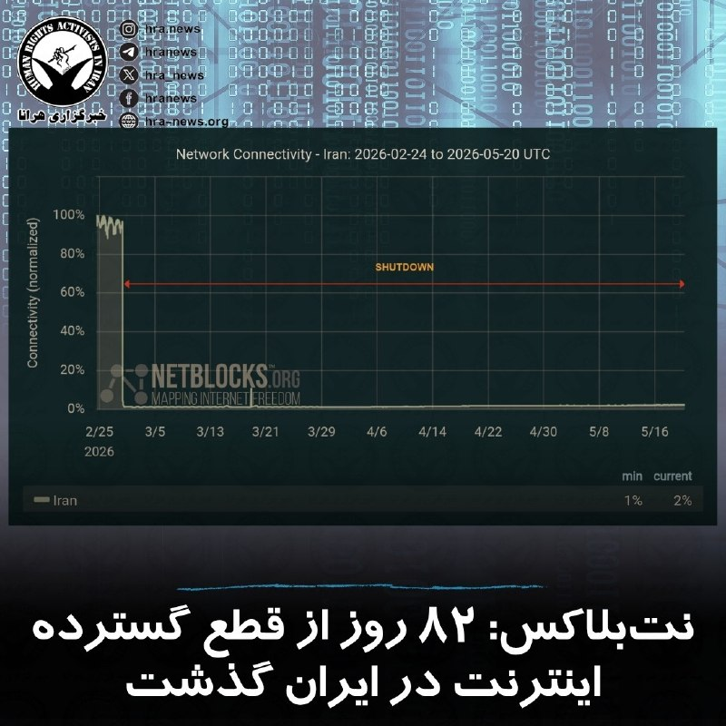
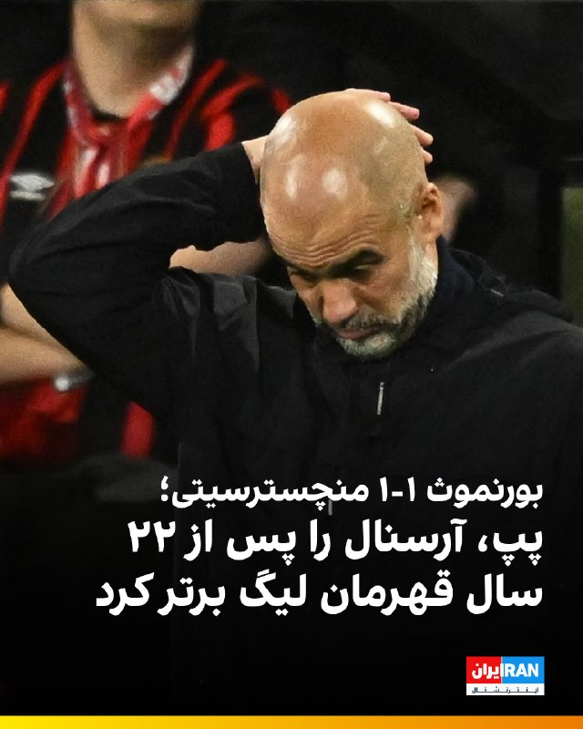

# خواننده تلگرام

<!-- TOP_NAV START -->

<a href="https://github.com/ProAlit/aio-downloader/blob/main/telegram/content/archive_1.md" style="display:inline-block; padding:6px 12px; margin:0 4px; background-color:#2ea44f; color:white; text-decoration:none; border-radius:4px; font-weight:bold;">صفحه بعد</a>

<!-- TOP_NAV END -->

<!-- MSG START -->

---
📅 بروزرسانی: 1405/02/30 14:53
---

## VahidOOnLine — post 241126

  

♦️روسیه و چین در یک بیانیه مشترک که در جریان سفر ولادیمیر پوتین به پکن صادر شد، با تاکید بر «دوستی عمیق دو کشور» از آنچه «ماجراجویی‌های نظامی و ترور رهبران کشورهای مستقل» خواندند، انتقاد کردند.

در بیانیه مشترک شی و پوتین که در پایگاه‌های اطلاع‌رسانی دولت‌های دو کشور منتشر شده، پکن و مسکو بدون اشاره مستقیم به آمریکا «ماجراجویی‌های نظامی» را محکوم کرده‌اند و از آنچه  «حملات نظامی غافلگیرانه به کشورهای دیگر»، «استفاده مزورانه از مذاکرات برای آماده‌سازی حملات»، «ترور رهبران کشورهای مستقل»، «بی‌ثبات کردن اوضاع داخلی کشورها» و «تلاش برای تغییر حکومت» انتقاد کردند.

شی و پوتین بدون اشاره به عملیات بازداشت نیکلاس مادورو، رئیس جمهوری پیشین ونزوئلا «ربودن آشکار رهبران کشورها برای محاکمه» را محکوم کردند.

رهبران چین و روسیه این رویه را به‌عنوان «نقض فاحش منشور ملل متحد» توصیف کرده‌اند.
‌🇸🇦 Indypersian

🤖 @VahidOOnLine

## IranIntlTV — post 338066

  <a href="telegram/content/IranIntlTV_338066_1779276204.mp4" target="_blank">🎬 Download video</a>

پیام‌های رسیده از سوی شهروندان به ایران‌اینترنشنال، به‌طور گسترده از افزایش حس ناامیدی، بلاتکلیفی و سرخوردگی حکایت دارد.
جزییات بیشتر با سبا حیدرخانی، عضو تحریریه ایران‌اینترنشنال
@Iranintltv

## IranIntlTV — post 338065

  <a href="telegram/content/IranIntlTV_338065_1779276206.mp4" target="_blank">🎬 Download video</a>

شهروندان در پیام‌هایی به ایران‌اینترنشنال از احساس بلاتکلیفی، سرخوردگی و افسردگی در زندگی روزمره خود می‌گویند. آن‌ها وضعیت اقتصادی رو به وخامت را عامل اصلی افزایش ناامیدی و نگرانی درباره آینده عنوان می‌کنند.
@iranintltv

## DW_Farsi — post 124920

🔶 پژمان جمشیدی به "۹۹ ضربه شلاق تعزیری" محکوم شد
 
به گزارش پایگاه خبری امتداد، شاکی پرونده پژمان جمشیدی از صدور حکم برای این فوتبالیست سابق و بازیگر کنونی سینما خبر داد. به گفته او جمشیدی به "۹۹ ضربه شلاق تعزیری" محکوم شده است.
 
در این گزارش آمده است که شاکی پرونده، با بیان اینکه "تمام مدارکی که به نفع او است در پرونده وجود دارد"، گفته است: «او را هرگز نمی‌بخشم.»
 
او همچنین گفته است: «یک سال است بدون وکیل تنهایی تمام جلسات دادگاه را شرکت کردم.»
 
شاکی این پرونده همچنین با ادعای این که خود پژمان جمشیدی و وکلای او "بارها پیشنهاد پول دادند" اما او این پیشنهاد را نپذیرفته، افزود: «در جلسه آخر خودش به من گفت آخرین زورت را هم بزن، آخرش فقط همین، واقعا او را نمی‌بخشم.»
 
پاییز سال ۱۴۰۴ خبر متهم شدن پژمان جمشیدی، فوتبالیست سابق و بازیگر کنونی سینما، به "تجاوز جنسی" و در پی آن، بازداشت موقت او، جنجال‌برانگیز شد. سپس وکیل مدافع او در سوم آبان‌ماه اعلام کرد که موکلش با تودیع وثیقه از زندان آزاد شده است.
 
روز ۲۹ مهرماه ۱۴۰۴ قوه قضائیه جمهوری اسلامی با انتشار خبر بازداشت "یک بازیگر مشهور" اعلام کرده بود: «چندی پیش خانمی با مراجعه به مرجع قضایی از یک بازیگر سینما به اتهام تجاوز به عنف شکایت کرد. در پی شکایت شاکی خصوصی و بررسی‌های تخصصی و علمی انجام‌شده، این بازیگر مشهور سینما با احضار به مرجع قضایی تفهیم اتهام و بازداشت شد.»
 
علی القاصی، رئیس کل دادگستری استان تهران نیز پیش‌تر خبر داده بود که دادگاه تجدیدنظر قرار بازداشت موقت پژمان جمشیدی را "نقض کرد تا قرار متناسب صادر شود".
 
@dw_farsi

## BBCPersian — post 281599

🔻پیام منتسب به مجتبی خامنه‌ای به مناسبت دومین سال کشته‌شدن رئیسی

🔻رسانه‌های حکومتی ایران امروز پیام منتسب به مجتبی خامنه‌ای، رهبر جمهوری اسلامی را به مناسبت دومین سال کشته‌شدن ابراهیم رئیسی، رئیس جمهور سابق آن کشور منتشر کرده‌اند.

در بخشی از این پیام، پس از تجلیل از رئیسی و اشاره به ویژگی‌هایش، با اشاره به جنگ اخیر آمده است: «اینک ما در برابر حماسه‌آفرینی‌های ملت ایران در مقاومت منحصر به فرد تاریخی مقابل دو ارتش تروریست جهانی هستیم.»

در ادامه این پیام آمده: «این امر، بار تکلیف مسئولان جمهوری اسلامی ـ از رهبری و رؤسای قوا تا همه‌ی سطوح مدیران ـ را سنگین‌تر از گذشته می‌کند.»

او در ادامه این نامه ابراز امیدواری کرده است که از مسائل و دغدغه‌های مردم خصوصا در عرصه اقتصادی و معیشتی، «گره‌گشایی» شود.

https://bbc.in/4tOAHC6
@BBCPersian

## alonews — post 121276

  <a href="telegram/content/alonews_121276_1779276208.webm" target="_blank">🎬 Download video</a>

👈امارات به عراق هشدار داده جلوی اقدام یا حمله‌ای که از خاکش علیه دیگر کشورها انجام میشه رو بگیره

✅ @AloNews خبر جنگ

---
📅 بروزرسانی: 1405/02/30 14:45
---

## VahidOOnLine — post 241125

  

♦️اسماعیل بقائی، سخنگوی وزارت امور خارجه جمهوری اسلامی، روز چهارشنبه ۳۰ اردیبهشت‌ماه درباره گمانه‌زنی‌ها راجع به سفر عباس عراقچی به نیویورک گفت:  «وزیر خارجه ایران برای شرکت در نشست شورای امنیت سازمان ملل درباره صلح و امنیت بین‌المللی دعوت شده، اما حضور او هنوز قطعی نیست.»

به گفته سخنگوی وزارت امور خارجه جمهوری اسلامی «این نشست به ریاست دوره‌ای چین در شورای امنیت، روز پنجم خرداد برگزار خواهد شد، اما با توجه به برنامه کاری فشرده وزیر امور خارجه»، تصمیم نهایی درباره سفر هنوز گرفته نشده است.»

این اظهارات پس از آن مطرح شد که علی خضریان، عضو کمیسیون امنیت ملی مجلس، در یک برنامه تلویزیونی نسبت به احتمال سفر عراقچی به نیویورک برای مذاکره درباره تنگه هرمز انتقاد کرده بود.
‌🇸🇦 Indypersian

🤖 @VahidOOnLine

## mwarmonitor — post 9341

  

🚢چند نفتکش امروز از تنگه هرمز عبور کردند، از مسیر عوارضی ایران:

🇰🇷 UNIVERSAL WINNER (IMO: 9837602)
از کویت به کره جنوبی

🇭🇰 OCEAN LILY (IMO: 9284960)
از امارات به چین

🇵🇦 DEEPBLUE (IMO: 9350862)
از عمان به امارات

🇨🇾 GRAND LADY (IMO: 9406166)
از چین مقصد نامشخص در خلیج فارس

@mwarmonitor

## mwarmonitor — post 9340

🔴ناو جنگی ترامپ مانند ناو هواپیمابر فورد با سوخت هسته‌ای کار خواهد کرد

📝کالین دمارست AXIOS

🔰به گفته دریاسالار داریل کاودل (Daryl Caudle)، فرمانده عملیات نیروی دریایی، ناو جنگی کلاس ترامپ که هزینه ساخت اولین فروند از آن بیش از ۱۷ میلیارد دلار برآورد شده است، مجهز به پیشران هسته‌ای خواهد بود.

🔸چرا این موضوع اهمیت دارد؟
این اعلامیه به ماه‌ها بحث و گمانه‌زنی درباره نحوه حرکت و سرعت جابه‌جایی این ناو جنگی پایان می‌دهد.
رهبری نیروی دریایی تا اواخر آوریل، پیشران هسته‌ای را «بعید» توصیف کرده بود. مشخصاتی که برای نخستین بار ماه‌ها پیش منتشر شد، مدام در حال تغییر و تحول بوده‌اند.
🔹اظهار نظرها
کاودل در جریان شهادت خود در کنگره گفت: «من بسیار هیجان‌زده‌ام که سرانجام روی این موضوع به توافق رسیدیم که این ناو هسته‌ای خواهد بود.»
او افزود: «ما برای تحویل سریع‌تر، گزینه‌های مختلف از جمله سوخت‌های متعارف را بررسی کردیم و در نهایت دوباره به نقطه اول برگشتیم تا آن را هسته‌ای کنیم. این دقیقاً پاسخ درست است.»
🔸جزئیات بیشتر
این ناو جنگی به همان نیروگاهی مجهز خواهد شد که در ناو هواپیمابر جرالد آر. فورد (Gerald R. Ford) — بزرگترین کشتی جنگی جهان — به کار رفته است؛ یعنی راکتور A1B.
کاودل گفت: «تمام فناوری‌هایی که از منظر بخش راکتور در طراحی ناو جنگی هسته‌ای به کار می‌روند، همگی فناوری‌های انتقالی و اقتباس‌شده از کلاس فورد هستند؛ همان‌طور که بیشتر سیستم‌های رزمی، سیستم‌های راداری و سیستم‌های موشکی نیز همین‌گونه‌اند. آنچه جدید است، شکل بدنه (Hull form) آن است.»
نکته جالب توجه
ناوهای هواپیمابر در حال حاضر تنها کشتی‌های سطحی با پیشران هسته‌ای در ناوگان نیروی دریایی ایالات متحده هستند.
🔹گام بعدی چیست؟
به گزارش نشریه بریکینگ دیفنس (Breaking Defense)، نیروی دریایی خواهان ساخت ۱۵ فروند از این ناوهای جنگی تا سال ۲۰۵۶ است. هزینه ساخت سه فروند اول آن بیش از ۴۳ میلیارد دلار خواهد بود.

@mwarmonitor

## IranIntlTV — post 338064

  <a href="telegram/content/IranIntlTV_338064_1779275709.mp4" target="_blank">🎬 Download video</a>

پیام‌های ارسالی شهروندان به ایران‌اینترنشنال نشان می‌دهد تلاش جوانان برای مهاجرت، در شرایط نه جنگ و نه صلح، تشدید شده است.

گفت‌وگو با فرزاد فتاحی، عضو تحریریه ایران‌اینترنشنال
@iranintltv

## IranIntlTV — post 338063

کلیات لایحه انحلال پارلمان اسرائیل تصویب شد و در صورت تصویب نهایی، انتخابات زودهنگام برگزار خواهد شد.
هم‌زمان با غیبت بنیامین نتانیاهو و یسرائیل کاتز در پارلمان، کانال ۱۲ اسرائیل از گفت‌وگوی تلفنی دونالد ترامپ و نتانیاهو خبر داد و این تماس را «طولانی و دراماتیک» توصیف کرد.

بابک اسحاقی، خبرنگار ایران‌اینترنشنال، گزارش می‌دهد
@iranintltv

## Persian_Trend_Official — post 14522

  <a href="telegram/content/Persian_Trend_Official_14522_1779275710.webm" target="_blank">🎬 Download video</a>

🔴خضریان،عضو کمیسیون امنیت ملی مجلس: 💢امیدوارم خبر سفر عراقچی به نیویورک برای مذاکره در خصوص تنگه هرمز دروغ باشد! 💢چرا ما در خصوص موضوع تنگه هرمز باید در خاک دشمن مذاکره کنیم؟ 🫆:Tony 📌 @persian_trend_official پرشین ترند | متفاوت‌ترین کانال نظامی

## Hranews — post 113057

قوه قضاییه؛ رشید مظاهری به اتهام “فعالیت تبلیغی بر خلاف امنیت ملی” در زندان است

❗️
❗️
❗️
❗️
❗️– مرکز رسانه قوه قضاییه اعلام کرد که رشید مظاهری، بازیکن سابق فوتبال، از بابت اتهاماتی از جمله «فعالیت تبلیغی بر خلاف امنیت ملی» بازداشت و به زندان منتقل شده است.

#رشید_مظاهری

ادامه مطلب

↘️
@hranews_bot تماس ✉️ - @Hranews کانال هرانا 🆑

## alonews — post 121274

  <a href="telegram/content/alonews_121274_1779275710.mp4" target="_blank">🎬 Download video</a>

👈حزب‌الله از داخل ساختمونای غیرنظامی نیروها رو زیر نظر داشته

🔴 نیروهای یگان چندبعدی اسرائیل هم به تجهیزات دیده‌بانی حمله کردن

✅ @AloNews خبر جنگ

## alonews — post 121273

  <a href="telegram/content/alonews_121273_1779275711.webm" target="_blank">🎬 Download video</a>

👈صدا و سیما: ۵ ابرنفتکش برای گذر از تنگه از نیروی دریایی ما اجازه گرفتن

✅ @AloNews خبر جنگ

## alonews — post 121272

  <a href="telegram/content/alonews_121272_1779275711.mp4" target="_blank">🎬 Download video</a>

👈بن‌گیور، وزیر امنیت ملی اسرائیل، از فعالان بازداشت‌شده در کاروان جهانی صمود غزه در بندر آشدود بازدید کرد.

🔴به اسرائیل خوش آمدید، ما اینجا در کنترل هستیم. این همان چیزی است که باید باشد.

✅ @AloNews خبر جنگ

---
📅 بروزرسانی: 1405/02/30 14:33
---

## VahidOOnLine — post 241124

  <a href="telegram/content/VahidOOnLine_241124_1779274998.mp4" target="_blank">🎬 Download video</a>

سخنگوی وزارت خارجه جمهوری‌اسلامی اعلام کرده با توجه به ریاست دوره‌ای چین بر شورای امنیت سازمان ملل و برنامه پکن برای برگزاری «نشست ویژه وزیران خارجه درباره صلح و امنیت بین‌المللی»، از عباس عراقچی، وزیر خارجه نظام اسلامی، برای حضور در این نشست در نیویورک دعوت شده است.
‌🏁 🇬🇧 ManotoTV

🤖 @VahidOOnLine

## VahidOOnLine — post 241123

  <a href="telegram/content/VahidOOnLine_241123_1779274999.mp4" target="_blank">🎬 Download video</a>

کناره گیری محمدباقر قالیباف از ریاست هیئت‌ مذاکره کننده جمهوری‌اسلامی در مذاکرات با آمریکا،‌ از سوی رییس مرکز ارتباطات، رسانه و امور فرهنگی مجلس شورای اسلامی تکذیب شده است.
‌🏁 🇬🇧 ManotoTV

🤖 @VahidOOnLine

## VahidOOnLine — post 241122

  <a href="telegram/content/VahidOOnLine_241122_1779275000.mp4" target="_blank">🎬 Download video</a>

خبرگزاری رسمی اردن گزارش داد که نیروهای مسلح این کشور صبح امروز یک پهپاد ناشناس را که وارد حریم هوایی اردن شده بود، سرنگون کردند.
ارتش اردن این پهپاد را در استان جرش، در منطقه بلیلا در شمال کشور، هدف قرار داد. این حادثه تلفات جانی نداشت، اما خسارت‌های جزئی مادی بر جای گذاشت.
‌🏁 🇬🇧 ManotoTV

🤖 @VahidOOnLine

## VahidOOnLine — post 241121

  <a href="telegram/content/VahidOOnLine_241121_1779275000.mp4" target="_blank">🎬 Download video</a>

خبرگزاری رسمی اردن گزارش داد که نیروهای مسلح این کشور صبح امروز یک پهپاد ناشناس را که وارد حریم هوایی اردن شده بود، سرنگون کردند.
ارتش اردن این پهپاد را در استان جرش، در منطقه بلیلا در شمال کشور، هدف قرار داد. این حادثه تلفات جانی نداشت، اما خسارت‌های جزئی مادی بر جای گذاشت.
‌🏁 🇬🇧 ManotoTV

🤖 @VahidOOnLine

## WithYashar — post 11742

من رفیق نیمه راه نیستم! مرسی از پیغام های زیباتون 😃 تازه خلیلی هم خوش مسافرتم اینو همه دوستام میدونن ، شما هم دیگه متوجه شدید 🤣🙌🏾

## FoxNewsTwitter — post 341977

  

Fox News (Twitter/X)

NEW: Trump-backed Republicans rack up major primary victories across the country.

Nearly 30 candidates endorsed by President Trump secure wins in congressional and statewide races across Kentucky, Georgia, Pennsylvania, and Alabama, including high-profile Senate and governor contests.

Trump-backed Ed Gallrein defeated incumbent Kentucky GOP Rep. Thomas Massie in what turned out to be the most expensive House primary in U.S. history.

Also in Kentucky, Congressman Andy Barr won the GOP Senate primary and is seen as the heavy favorite to replace outgoing Senator Mitch McConnell.

Alabama Senator Tommy Tuberville had an easy win securing the GOP gubernatorial nomination in his state.

## pm_afshaa — post 91097

🔴قوه قضائیه: رشید مظاهری، بازیکن سابق فوتبال، هنگام خروج غیرقانونی از کشور دستگیر شده.

این فرد قصد داشته با تغییر چهره و پول دادن به ماموران مرزبانی، از مرزهای غربی به صورت غیرقانونی از کشور فرار کنه، ولی موقع خروجش دستگیر شده

💧 Rainbet.com the #1 Non-KYC Crypto Casino & Sportsbook @rainbetcom

😁 @Pm_Afshaa

## ManotoTV — post 105679

  <a href="telegram/content/ManotoTV_105679_1779275002.mp4" target="_blank">🎬 Download video</a>

سخنگوی وزارت خارجه جمهوری‌اسلامی اعلام کرده با توجه به ریاست دوره‌ای چین بر شورای امنیت سازمان ملل و برنامه پکن برای برگزاری «نشست ویژه وزیران خارجه درباره صلح و امنیت بین‌المللی»، از عباس عراقچی، وزیر خارجه نظام اسلامی، برای حضور در این نشست در نیویورک دعوت شده است.

## ManotoTV — post 105678

  <a href="telegram/content/ManotoTV_105678_1779275003.mp4" target="_blank">🎬 Download video</a>

کناره گیری محمدباقر قالیباف از ریاست هیئت‌ مذاکره کننده جمهوری‌اسلامی در مذاکرات با آمریکا،‌ از سوی رییس مرکز ارتباطات، رسانه و امور فرهنگی مجلس شورای اسلامی تکذیب شده است.

## BBCPersian — post 281598

🔻وزیر دفاع فرانسه: از وجود مین در تنگه هرمز مطمئن نیستم

🔻کاترین وترین، وزیر دفاع فرانسه، پس از گزارش رسانه‌های آمریکایی مبنی بر شناسایی حداقل ۱۰ مین در حوالی تنگه هرمز، گفت که فرانسه در حال حاضر هیچ اطمینانی ندارد که در تنگه هرمز مین کار گذاشته شده باشد.

او به رادیو فرانس اینفو گفت: «در حال حاضر، من هیچ اطمینانی در این مورد ندارم، اما در هر صورت، ما در حال آماده شدن برای لزوم پاکسازی احتمالی مین‌ها هستیم.»

او گفت که کشتی‌های مین‌روب به عنوان بخشی از یک ماموریت احتمالی آینده به رهبری فرانسه و بریتانیا به منطقه اعزام شده‌اند و فرانسه یکی از این کشتی‌ها را در پایگاه خود در جیبوتی دارد.

https://bbc.in/4v0II7P
@BBCPersian

## Dirty_Kids — post 389801

‏یک بسته کیسه فریزر رولی
یک میلیون و صد و هشتاد وپنج !
۲۹ اردیبهشت ۱۴۰۵

@Dirty_Kids 👻

## Dirty_Kids — post 389800

  <a href="https://t.me/Dirty_Kids/389800" target="_blank">📎 Download file</a>

📱 اپلیکیشن اندروید بدون فیلتر ریتزوبت

➖➖➖➖➖

🔹 ثبت نام آسان 
✅
🔹 رابط کاربری بسیار راحت و سریع 
✅
🔹 درگاه پرداخت کارت به کارت 
✅
🔹 درگاه پرداخت دلاری سریع 
✅
🔹 بونوس ۱۰۰ درصدی اولین واریز 
✅
🔹 بونوس ۱۰۰ درصدی واریز یکشنبه ها 
✅

➖➖➖➖➖
🌐 https://RitzoBet.com

⚡️ @RitzoBet_ir

## Dirty_Kids — post 389799

  <a href="telegram/content/Dirty_Kids_389799_1779275004.webm" target="_blank">🎬 Download video</a>

⚠️ برای #شرطبندی های فوتبال از سایت معتبر و بین المللی استفاده کنید ✅

🇩🇪 فرایبورگ 
🔢
🔢 
🏴󠁧󠁢󠁥󠁮󠁧󠁿 استون ویلا

سایت #ریتزوبت ، چهار سال هستش داخل ایران فعالیت میکنه 
✅

لایسنس بین المللی داره ، روش های شارژ و برداشت متنوع داره و بونوس 100% ورزشی و کش بک های جذاب
💎

⏪ اپلیکیشن بدون فیلتر ریتزوبت 
📱
⏩
R30

✅ لینک بدون‌ فیلتر ریتزوبت
🤣

🆔 @RitzoBet_ir 
🇮🇷

## Dirty_Kids — post 389798

  

شبکه آمریکایی الحره: میان نیروهای ارتش و سپاه توی ایران درگیری داخلی و مسلحانه رخ داده.

داستان از اینجا شروع میشه که سازمان اطلاعات سپاه، افسران و نیروهای ارتش رو از پایگاه های مشترک نظامی اخراج و اونارو به خیانت و انتقال اطلاعات به اسرائیل و آمریکا متهم کرد!
این اتهامات شامل لو دادن محل استقرار موشک‌های بالستیک و پهپادهای حکومت بوده.
حالا سپاه و ارتش سر این داستان باهم به مشکل خوردن و درگیر شدن

@Dirty_Kids 👻

## Dirty_Kids — post 389797

  <a href="telegram/content/Dirty_Kids_389797_1779275005.mp4" target="_blank">🎬 Download video</a>

🔴 فیلم وایرال شده از آمریکا که حامیان فلسطین و خامنه‌ای تجمع کردن و یه ایرانی میره اون وسط و یه تنه همشونو میگاد.

@Dirty_Kids 👻

## manototv — post 105679

  <a href="telegram/content/manototv_105679_1779275007.mp4" target="_blank">🎬 Download video</a>

سخنگوی وزارت خارجه جمهوری‌اسلامی اعلام کرده با توجه به ریاست دوره‌ای چین بر شورای امنیت سازمان ملل و برنامه پکن برای برگزاری «نشست ویژه وزیران خارجه درباره صلح و امنیت بین‌المللی»، از عباس عراقچی، وزیر خارجه نظام اسلامی، برای حضور در این نشست در نیویورک دعوت شده است.

## manototv — post 105678

  <a href="telegram/content/manototv_105678_1779275008.mp4" target="_blank">🎬 Download video</a>

کناره گیری محمدباقر قالیباف از ریاست هیئت‌ مذاکره کننده جمهوری‌اسلامی در مذاکرات با آمریکا،‌ از سوی رییس مرکز ارتباطات، رسانه و امور فرهنگی مجلس شورای اسلامی تکذیب شده است.

## alonews — post 121271

  <a href="telegram/content/alonews_121271_1779275009.webm" target="_blank">🎬 Download video</a>

👈کنست به انحلال خود و برگزاری زودهنگام انتخابات رای داد

🔴کنست در جلسه مقدماتی خود با اکثریت ۱۱۰ عضو و بدون هیچ مخالفتی، به لایحه انحلال خود و جلو انداختن تاریخ انتخابات رأی داد

✅ @AloNews خبر جنگ

---
📅 بروزرسانی: 1405/02/30 14:22
---

## VahidOOnLine — post 241120

  

رسانه رهبر جمهوری اسلامی پیامی منتسب به مجتبی خامنه‌ای به مناسبت دومین سالگرد ابراهیم رئیسی منتشر کرد.

در این پیام آمده است «خصوصیات رئیسی موجب دلگرم شدن دوستان ایران از جمله مجاهدان جبهه قدرتمند مقاومت و بسیاری از دلسوزان نظام می‌شد.»

ویژگی‌های ابراهیم رئیسی در این پیام «مسئولیت‌پذیری، جوانگرایی، توجه به عدالت، دیپلماسی فعال و نافع و به‌ویژه مردمی بودن» عنوان شده است.
‌🏁 🇬🇧 IranintlTV

🤖 @VahidOOnLine

## WithYashar — post 11741

## WithYashar — post 11740

## mwarmonitor — post 9339

  

📝 واقعاً مبارکه! بالاخره با اقتدار رسیدیم به قله؛ جایی که خریدن یک رول کیسه فریزر ۵۰۰ عددی، دیگر یک خرید معمولی نیست، بلکه با قیمت یک میلیون و صد و هشتاد و پنج هزار تومان، رسماً یک سرمایه‌گذاری استراتژیک و فوق‌لاکچری حساب می‌شه. اگر این رسیدن به قله نیست پس چیه؟ آدم دلش خون می‌شه وقتی می‌بینه تو همین وضعیت، یه مشت حرومزاده شب‌ها وسط میدان پرچم‌گردانی می‌کنن و شعار شبانه می‌دن، یا اونایی که بی‌خیالِ دنیا، در حال دور دور کردن، کافه‌گردی و شرکت در کلاس‌های جورواجور ادای هستن. مگه میشه یک رول پلاستیک ۱,۱۸۵,۰۰۰ تومان باشه و جگر آدم خون نشه؟ توی این قله‌ای که برای ما ساختید، تف و لعنت کمترین میزان نفرت برای شماست؛ بفرمایید کاپوچینویتان را بنوشید و دور دور کنید، تا می‌تونید کثافت‌کاریاتون رو ادامه بدید و به ریش این مردم بخندید، ولی این نفرتِ انباشته‌شده بالاخره یه جا خفت همه‌تون رو می‌چسبه!

@mwarmonitor

## pm_afshaa — post 91096

🔴وای نت: امارات هماهنگی‌های امنیتی و عملیاتی با اسرائیل را تشدید کرده

💧 Rainbet.com the #1 Non-KYC Crypto Casino & Sportsbook @rainbetcom

😁 @Pm_Afshaa

## pm_afshaa — post 91095

🔴کانال 14 اسرائیل:فرودگاه بن گوریون حتی در صورت از سرگیری جنگ با جمهوری اسلامی تروریست به دلیل کاهش توان موشکی ج.ا به فعالیت خود ادامه خواهد داد

💧 Rainbet.com the #1 Non-KYC Crypto Casino & Sportsbook @rainbetcom

😁 @Pm_Afshaa

## pm_afshaa — post 91094

  

🚨اشتراک استارز ⭐️ فیلترشکن ایران وی پی ان
تخفیف ها تا ساعت ۱۲ امشب هستن و هیچ وقت دیگر بر نمیگردن❌

تعرفه های باور نکردنی🔮

سرورا بدون ضریب هستن و ساب دارن😎🔋

1 gig= 195t🚀

3 gig= 570t 🚀

5 gig= 950t🚀

7 gig = 1300t 🚀

10 gig= 1800t 🚀

قبل خرید میتونید تست بگیرید 🛜
بهترین و ارزون ترین سرور ایران دست ماست

🚨تمامی سرور ها کاربر نامحدود هستن و تاریخ انقضا ندارن✅

جهت خرید به ایدی زیر پیام بدین 👇

@IRAN_VPNADMIN

کانال. و رضایت مشتری ها👇

https://t.me/IRAN_VPNON

## IranIntlTV — post 338062

  

رسانه رهبر جمهوری اسلامی پیامی منتسب به مجتبی خامنه‌ای به مناسبت دومین سالگرد ابراهیم رئیسی منتشر کرد.

در این پیام آمده است «خصوصیات رئیسی موجب دلگرم شدن دوستان ایران از جمله مجاهدان جبهه قدرتمند مقاومت و بسیاری از دلسوزان نظام می‌شد.»

ویژگی‌های ابراهیم رئیسی در این پیام «مسئولیت‌پذیری، جوانگرایی، توجه به عدالت، دیپلماسی فعال و نافع و به‌ویژه مردمی بودن» عنوان شده است.
https://iranintl.com/202605205759

## FarsiVOA — post 218214

🔺ناتو: کاهش نیروهای آمریکا در اروپا «تدریجی و ساختارمند» خواهد بود

▪️مارک روته، دبیرکل ناتو، می‌گوید هرگونه تغییر در آرایش نیروهای آمریکا در اروپا «به‌صورت تدریجی و ساختارمند» انجام خواهد شد که به گفته او، بر برنامه‌های دفاعی ناتو اثر منفی نخواهد گذاشت.

▪️این اظهارات پس از گزارش‌هایی مطرح شد که نشان می‌دهد دولت دونالد ترامپ قصد دارد بخشی از نیروهای در دسترس آمریکا برای کمک به ناتو در شرایط بحران را کاهش دهد.

▪️بر این اساس آمریکا قصد دارد شمار نیروهایی را که در یک بحران بزرگ در اختیار مدل نیرویی ناتو قرار می‌دهد، کاهش دهد.

▪️هم‌زمان، فایننشال تایمز گزارش داده وزارت جنگ آمریکا شمار تیپ‌های رزمی آمریکا در اروپا را از چهار به سه کاهش می‌دهد.

⬇️ بیشتر بخوانید:
https://ir.voanews.com/a/8151976.html

## IranianMinds — post 20431

  

🔴 خبرگزاری قوه قضائیه:

رشید مظاهری، بازیکن سابق فوتبال، هنگام خروج غیرقانونی از کشور دستگیر شده.

این فرد قصد داشته با تغییر چهره و پول دادن به ماموران مرزبانی، از مرزهای غربی به صورت غیرقانونی از کشور فرار کنه، ولی موقع خروجش دستگیر شده.

@IranianMinds

## BBCPersian — post 281597

  <a href="telegram/content/BBCPersian_281597_1779274379.mp4" target="_blank">🎬 Download video</a>

فرماندهی مرکزی ایالات متحده آمریکا (سنتکام) ویدیویی منتشر کرده که حضور نیروهای هوایی و دریایی این کشور را در عملیات محاصره دریایی ایران نشان می‌دهد.
 
حساب ایکس سنتکام گفته اجرای این محاصره  توسط ایالات متحده آمریکا ادامه دارد و «جریان تجارت از بنادر ایران» متوقف شده‌است.
 
سنتکام هم‌چنین می‌گوید تا حالا «۸۹ کشتی تجاری تغییر مسیر داده شده‌اند.»
 
آمریکا از ۱۳ آوریل (۲۴ فروردین) و در واکنش به اقدام ایران در بستن تنگه هرمز، دست به محاصره دریایی بنادر ایران زده است و اجازه نمی‌دهد هیچ کشتی‌ای با مبدا یا مقصد بنادر ایرانی از تنگه هرمز عبور کند.

@bbcpersian

## BBCPersian — post 281596

  

🔻روسیه و چین در بیانیه مشترک خود درباره «تعمیق روابط همسایگی، دوستی و همکاری»، به‌طور ضمنی از اقدامات نظامی آمریکا انتقاد کردند.

در این بیانیه، دو کشور «ماجراجویی‌های نظامی» در جهان را محکوم کرده‌اند؛ عبارتی که به نظر می‌رسد اشاره‌ای به اقدامات آمریکا در ایران و ونزوئلا در ماه‌های اخیر باشد.

شی جین‌پینگ و ولادیمیر پوتین در این بیانیه از «حملات نظامی غافلگیرانه به کشورهای دیگر»، «استفاده ریاکارانه از مذاکرات برای آماده‌سازی چنین حملاتی»، «ترور رهبران کشورهای مستقل»، «بی‌ثبات کردن اوضاع داخلی کشورها» و «تلاش برای تغییر حکومت» انتقاد کردند.

آن‌ها همچنین از «ربودن آشکار رهبران کشورها برای محاکمه» سخن گفتند؛ عبارتی که ظاهرا به بازداشت نیکلاس مادورو، رئیس‌جمهور ونزوئلا، اشاره دارد.

در بیانیه آمده است که این اقدامات «به‌طور فاحش» اصول منشور سازمان ملل، حقوق بین‌الملل و نظم جهانی پس از جنگ جهانی دوم را نقض می‌کند.

لینک خبر کامل:
https://bbc.in/4tHKVUz
📷U.S. Central Command-Farsi

@BBCPersian

## alonews — post 121270

  <a href="telegram/content/alonews_121270_1779274381.webm" target="_blank">🎬 Download video</a>

👈رئیس مرکز رسانه مجلس: ادعای کناره‌گیری قالیباف از سرپرستی تیم مذاکره‌ کننده، کذب محض و دروغی آشکار است

🔴این ادعا امتداد همان خط تخریبی است که تا دیروز فرماندهان را نشانه می‌رفت و امروز شهدای والامقام را

🔴 البته از جریانی که سابقه هجمه به فرماندهان نظامی، دفتر مقام معظم رهبری و مراجع عظام تقلید را در کارنامه دارد، رفتاری غیر از این انتظار نمی‌رود.

✅ @AloNews خبر جنگ

---
📅 بروزرسانی: 1405/02/30 14:13
---

## VahidOOnLine — post 241119

  <a href="telegram/content/VahidOOnLine_241119_1779273807.mp4" target="_blank">🎬 Download video</a>

♦️همزمان با تشدید گمانه‌زنی‌ها درباره حمله مجدد آمریکا به ایران و از سرگیری جنگ، خبرگزاری رویترز روز چهارشنبه ۳۰ اردیبهشت‌ماه تصاویری از حضور تعداد زیادی از هواپیماهای سوخت‌رسان ارتش ایالات متحده در فرودگاه بین‌المللی بن‌گوریون تل آویو را منتشر کرد.

دونالد ترامپ با اینکه گفته است به زودی به جنگ با ایران خاتمه خواهد داد، روز سه‌شنبه بار دیگر اعلام کرد که ممکن است بار دیگر حمله‌ای سخت به ایران را انجام دهد.

مذاکرات پایان دادن به جنگ، با میانجیگری پاکستان از هفته‌ها پیش به بن‌بست رسیده است. بنیامین نتانیاهو، نخست وزیر اسرائیل هم از آمادگی کامل این کشور برای ورود دوباره به جنگ سخن گفته است.
‌🇸🇦 Indypersian

🤖 @VahidOOnLine

## WithYashar — post 11739

## Persian_Trend_Official — post 14521

  <a href="telegram/content/Persian_Trend_Official_14521_1779273810.webm" target="_blank">🎬 Download video</a>

💢هم اکنون باز هم پخش و بازخوانی پیام از مجتبی خامنه ای به مناسبت درگذشت ابراهیم رئیسی بازهم بدون هیچ نشانه ای از حیات و هویت خود خودش در صداوسیما ‼️

🫆:Tony

📌 @persian_trend_official
پرشین ترند | متفاوت‌ترین کانال نظامی

## alonews — post 121269

  <a href="telegram/content/alonews_121269_1779273811.webm" target="_blank">🎬 Download video</a>

👈پوتین و شی جین‌پینگ : جنگ ایران باید سریع متوقف شه

✅ @AloNews خبر جنگ

---
📅 بروزرسانی: 1405/02/30 14:06
---

## VahidOOnLine — post 241118

  

ایمان شمسایی، رییس مرکز ارتباطات، رسانه و امور فرهنگی مجلس، خبر استعفای محمدباقر قالیباف از ریاست هیات مذاکره‌کننده جمهوری اسلامی را «کذب محض و دروغی آشکار» خواند و منتشرکنندگان آن را به «خیانت» متهم کرد.

او در پیامی نوشت ادعای این جریان «امتداد همان خط تخریبی است که تا دیروز فرماندهان را نشانه می‌رفت و امروز شهدای والامقام را».

شمسایی افزود این جریان سابقه «هجمه» به فرماندهان نظامی، دفتر رهبر جمهوری اسلامی، مراجع تقلید و شورای عالی امنیت ملی را در کارنامه دارد.

در ادامه پیام او آمده است: «شایسته است این آقایان برای توجیه خیانت خود در شرایط جنگی پشت ژست‌های انقلابی پنهان نشوند و بیش از این به توجیه رفتارهای آسیب‌زای خود در شرایط حساس کنونی نپردازند.»

شمسایی تاکید کرد قالیباف همچنان ریاست هیات مذاکره‌کننده حکومت را بر عهده دارد و به‌تازگی نیز به پیشنهاد مسعود پزشکیان و تایید مجتبی خامنه‌ای، به‌عنوان نماینده ویژه جمهوری اسلامی در امور چین منصوب شده است.

در هفته‌های اخیر، گزارش‌های متعددی درباره اختلاف در ساختار حاکمیت جمهوری اسلامی منتشر شده است.
‌🏁 🇬🇧 IranintlTV

🤖 @VahidOOnLine

## VahidOOnLine — post 241117

  <a href="telegram/content/VahidOOnLine_241117_1779273407.mp4" target="_blank">🎬 Download video</a>

خبرگزاری حکومتی تسنیم گزارش داد که محسن نقوی، وزیر کشور پاکستان، برای دیدار و گفت‌وگو با مقام‌های جمهوری‌اسلامی راهی تهران شده است. این دومین سفر نقوی به تهران در طول یک هفته گذشته و در راستای تلاش‌های اسلام‌آباد برای میانجی‌گری میان جمهوری‌اسلامی و آمریکا است.
‌🏁 🇬🇧 ManotoTV

🤖 @VahidOOnLine

## VahidOOnLine — post 241116

  <a href="telegram/content/VahidOOnLine_241116_1779273408.mp4" target="_blank">🎬 Download video</a>

خبرگزاری رسمی اردن گزارش داد که نیروهای مسلح این کشور صبح امروز یک پهپاد ناشناس را که وارد حریم هوایی اردن شده بود، سرنگون کردند.
ارتش اردن این پهپاد را در استان جرش، در منطقه بلیلا در شمال کشور، هدف قرار داد. این حادثه تلفات جانی نداشت، اما خسارت‌های جزئی مادی بر جای گذاشت.
‌🏁 🇬🇧 ManotoTV

🤖 @VahidOOnLine

## VahidOOnLine — post 241115

  <a href="telegram/content/VahidOOnLine_241115_1779273409.mp4" target="_blank">🎬 Download video</a>

دیروز، هم‌زمان با زادروز جاویدنام پیام رخ‌بخش، خانواده و نزدیکان او بر سر مزارش در شیراز حاضر شدند و یادش را گرامی داشتند.

پیام رخ‌بخش، جوان ۳۲ ساله اهل شیراز، در ۱۹ دی‌ماه ۱۴۰۴ در جریان اعتراضات مردمی با شلیک مستقیم نیروهای حکومتی جان باخت.

حضور بر سر مزار جان‌باختگان، برای خانواده‌ها فقط سوگواری نیست؛ ادامه همان دادخواهی‌ای است که جمهوری اسلامی از آن هراس دارد.

#خانه_دوست_کجاست
‌🏁 🇬🇧 ManotoTV

🤖 @VahidOOnLine

## VahidOOnLine — post 241114

  <a href="telegram/content/VahidOOnLine_241114_1779273411.mp4" target="_blank">🎬 Download video</a>

بر اساس یک نظرسنجی جدید، اکثریت بزرگی از جمهوری‌خواهان همچنان عملکرد دونالد ترامپ در مدیریت جنگ ایران را تأیید می‌کنند.
طبق نظرسنجی انجام‌شده توسط خبرگزاری آسوشیتدپرس و مرکز پژوهش‌های امور عمومی نورک، در حالی که تنها یک‌سوم بزرگسالان آمریکایی از رویکرد رئیس‌جمهور حمایت می‌کنند، حدود دو‌سوم جمهوری‌خواهان با نحوه عملکرد او موافق هستند.
با این حال، بر اساس نظرسنجی ماه گذشته، جمهوری‌خواهان جوان‌تر بیشتر احتمال دارد که از عملکرد ترامپ در این موضوع ناراضی باشند.
علاوه بر این، تنها ۶ نفر از هر ۱۰ جمهوری‌خواه (در مقایسه با ۸ نفر از هر ۱۰ نفر در ماه فوریه) از نحوه مدیریت اقتصاد توسط رئیس‌جمهور حمایت می‌کنند؛ اقتصادی که تحت تأثیر جنگ قرار گرفته است.
‌🏁 🇬🇧 ManotoTV

🤖 @VahidOOnLine

## VahidOOnLine — post 241113

  

⭕️خبرگزاری قوه‌ قضاییه: رشید مظاهری هنگام خروج غیرقانونی از کشور بازداشت شد

♦️خبرگزاری قوه‌قضائیه گزارش داد رشید مظاهری، دروازه‌بان پیشین تیم ملی فوتبال و استقلال تهران، «هنگام تلاش برای خروج غیرقانونی از مرزهای غربی ایران بازداشت شده است.»

میزان در این گزارش رشید مظاهری را متهم کرده که «قصد داشته با تغییر چهره و پرداخت رشوه به ماموران مرزبانی از کشور خارج شود.»

قوه قضائیه به زمان بازداشت این بازیکن پیشین تیم ملی فوتبال ایران اشاره نکرده است.

رشید مظاهری پس از کشتار معترضان در ۱۸ و ۱۹ دی، با انتشار ویدیویی در پنجم اسفند، علی خامنه‌ای را مسئول کشته‌شدن معترضان معرفی کرده بود. پس از انتشار آن ویدیو، تا مدت‌ها خبری از وضعیت او منتشر نشده بود.

خبرگزاری میزان گزارش کرده که مظاهری در «بند عمومی زندان» به سر می‌برد و قرار است به اتهام‌های «پرداخت رشوه به مامور دولت»، «فعالیت تبلیغی برخلاف امنیت ملی در شرایط جنگی» و «اقدام به عبور غیرمجاز از مرز» محاکمه شود.
‌🇸🇦 Indypersian

🤖 @VahidOOnLine

## pm_afshaa — post 91093

🔴وای نت:در رویدادی بسیار غیر عادی و عجیب نتانیاهو به دلیل بحث امنیتی اضطراری در رأی‌گیری امروز برای انحلال پارلمان اسرائیل شرکت نخواهد کرد،
همچنین جلسه دادگاه نتانیاهو نیز امروز لغو شده

💧 Rainbet.com the #1 Non-KYC Crypto Casino & Sportsbook @rainbetcom

😁 @Pm_Afshaa

## pm_afshaa — post 91092

🔴وزارت خارجه آمریکا تا سقف 15 میلیون دلار پاداش برای اطلاعات در مورد شبکه مالی سپاه پاسداران تعیین کرد

💧 Rainbet.com the #1 Non-KYC Crypto Casino & Sportsbook @rainbetcom

😁 @Pm_Afshaa

## pm_afshaa — post 91091

🔴ترامپ و نتانیاهو دیشب تماس تلفنی "طولانی و دراماتیک" داشتن

💧 Rainbet.com the #1 Non-KYC Crypto Casino & Sportsbook @rainbetcom

😁 @Pm_Afshaa

## IranIntlTV — post 338061

  <a href="telegram/content/IranIntlTV_338061_1779273412.mp4" target="_blank">🎬 Download video</a>

سرخط خبرهای چهارشنبه ۳۰ اردیبهشت
@iranintltv

## IranIntlTV — post 338060

  

ایمان شمسایی، رییس مرکز ارتباطات، رسانه و امور فرهنگی مجلس، خبر استعفای محمدباقر قالیباف از ریاست هیات مذاکره‌کننده جمهوری اسلامی را «کذب محض و دروغی آشکار» خواند و منتشرکنندگان آن را به «خیانت» متهم کرد.

او در پیامی نوشت ادعای این جریان «امتداد همان خط تخریبی است که تا دیروز فرماندهان را نشانه می‌رفت و امروز شهدای والامقام را».

شمسایی افزود این جریان سابقه «هجمه» به فرماندهان نظامی، دفتر رهبر جمهوری اسلامی، مراجع تقلید و شورای عالی امنیت ملی را در کارنامه دارد.

در ادامه پیام او آمده است: «شایسته است این آقایان برای توجیه خیانت خود در شرایط جنگی پشت ژست‌های انقلابی پنهان نشوند و بیش از این به توجیه رفتارهای آسیب‌زای خود در شرایط حساس کنونی نپردازند.»

شمسایی تاکید کرد قالیباف همچنان ریاست هیات مذاکره‌کننده حکومت را بر عهده دارد و به‌تازگی نیز به پیشنهاد مسعود پزشکیان و تایید مجتبی خامنه‌ای، به‌عنوان نماینده ویژه جمهوری اسلامی در امور چین منصوب شده است.

در هفته‌های اخیر، گزارش‌های متعددی درباره اختلاف در ساختار حاکمیت جمهوری اسلامی منتشر شده است.
https://iranintl.com/202605204370

## IranIntlTV — post 338059

  <a href="telegram/content/IranIntlTV_338059_1779273414.mp4" target="_blank">🎬 Download video</a>

تیم فوتبال آرسنال عنوان قهرمانی لیگ برتر انگلستان را به دست آورد. در حاشیه این موفقیت، در شبکه‌های اجتماعی و میان هواداران، توجه ویژه‌ای به یاد جاویدنامان انقلاب ملی ایران دیده شد؛ هوادارانی که نام و تصویرشان در میان طرفداران این تیم زنده نگه داشته شده است. از جمله عارف جعفرزاده، ۳۲ ساله اهل رشت، که تصویر او توسط یک هنرمند انگلیسی بر دیوار ستاره‌های آرسنال در شمال لندن نقش بسته است.
جزییات بیشتر با آیدین مقیمی، خبرنگار ایران‌اینترنشنال
@iranintltv

## IranIntlTV — post 338058

  <a href="telegram/content/IranIntlTV_338058_1779273417.mp4" target="_blank">🎬 Download video</a>

مسعود پزشکیان، رییس دولت جمهوری اسلامی، با هشدار درباره تشدید بحران در صورت عدم مدیریت مصرف آب، برق، گاز و بنزین، از مردم خواست صرفه‌جویی را جدی بگیرند.
گفت‌وگو با علی شیرازی، عضو تحریریه ایران‌اینترنشنال
@iranintltv

## ManotoTV — post 105675

  <a href="telegram/content/ManotoTV_105675_1779273418.mp4" target="_blank">🎬 Download video</a>

خبرگزاری حکومتی تسنیم گزارش داد که محسن نقوی، وزیر کشور پاکستان، برای دیدار و گفت‌وگو با مقام‌های جمهوری‌اسلامی راهی تهران شده است. این دومین سفر نقوی به تهران در طول یک هفته گذشته و در راستای تلاش‌های اسلام‌آباد برای میانجی‌گری میان جمهوری‌اسلامی و آمریکا است.

## ManotoTV — post 105674

  <a href="telegram/content/ManotoTV_105674_1779273419.mp4" target="_blank">🎬 Download video</a>

خبرگزاری رسمی اردن گزارش داد که نیروهای مسلح این کشور صبح امروز یک پهپاد ناشناس را که وارد حریم هوایی اردن شده بود، سرنگون کردند.
ارتش اردن این پهپاد را در استان جرش، در منطقه بلیلا در شمال کشور، هدف قرار داد. این حادثه تلفات جانی نداشت، اما خسارت‌های جزئی مادی بر جای گذاشت.

## ManotoTV — post 105673

  <a href="telegram/content/ManotoTV_105673_1779273420.mp4" target="_blank">🎬 Download video</a>

دیروز، هم‌زمان با زادروز جاویدنام پیام رخ‌بخش، خانواده و نزدیکان او بر سر مزارش در شیراز حاضر شدند و یادش را گرامی داشتند.

پیام رخ‌بخش، جوان ۳۲ ساله اهل شیراز، در ۱۹ دی‌ماه ۱۴۰۴ در جریان اعتراضات مردمی با شلیک مستقیم نیروهای حکومتی جان باخت.

حضور بر سر مزار جان‌باختگان، برای خانواده‌ها فقط سوگواری نیست؛ ادامه همان دادخواهی‌ای است که جمهوری اسلامی از آن هراس دارد.

#خانه_دوست_کجاست

## ManotoTV — post 105672

  <a href="telegram/content/ManotoTV_105672_1779273422.mp4" target="_blank">🎬 Download video</a>

بر اساس یک نظرسنجی جدید، اکثریت بزرگی از جمهوری‌خواهان همچنان عملکرد دونالد ترامپ در مدیریت جنگ ایران را تأیید می‌کنند.
طبق نظرسنجی انجام‌شده توسط خبرگزاری آسوشیتدپرس و مرکز پژوهش‌های امور عمومی نورک، در حالی که تنها یک‌سوم بزرگسالان آمریکایی از رویکرد رئیس‌جمهور حمایت می‌کنند، حدود دو‌سوم جمهوری‌خواهان با نحوه عملکرد او موافق هستند.
با این حال، بر اساس نظرسنجی ماه گذشته، جمهوری‌خواهان جوان‌تر بیشتر احتمال دارد که از عملکرد ترامپ در این موضوع ناراضی باشند.
علاوه بر این، تنها ۶ نفر از هر ۱۰ جمهوری‌خواه (در مقایسه با ۸ نفر از هر ۱۰ نفر در ماه فوریه) از نحوه مدیریت اقتصاد توسط رئیس‌جمهور حمایت می‌کنند؛ اقتصادی که تحت تأثیر جنگ قرار گرفته است.

## FarsiVOA — post 218213

  

امارات متحده عربی منشأ حملات پهپادی اخیر به نزدیکی نیروگاه اتمی این کشور را عراق عنوان کرد.

امارات روز سه‌شنبه اعلام کرد طی ۴۸ ساعت گذشته شش پهپاد از خاک عراق به این کشور شلیک شده که یکی از آنها منجر به آتش‌سوزی در نزدیکی نیروگاه اتمی براکه در روز یکشنبه شده است.

وزارت دفاع امارات گفت پنج پهپاد رهگیری شدند، اما یکی از آنها به نزدیکی نیروگاه اتمی برخورد کرد. در مجموع هدف نیمی از پهپادهای شلیک شده از عراق، نیروگاه براکه بوده است.
@FarsiVOA

## DW_Farsi — post 124918

🎥 از ازدواج اجباری تا سکوی قهرمانی

رویا کریمی، بدنساز افغان، در ۱۴ سالگی مجبور به ازدواج شد و در ۱۷ سالگی همراه پسر کوچکش از افغانستان گریخت. او حالا در نروژ، پس از سال‌ها مبارزه با محدودیت‌ها، به قهرمانی در بدنسازی رسیده و صدای زنانی شده است که هنوز از ابتدایی‌ترین حقوق خود محروم‌اند.

@dw_farsi

## Persian_Trend_Official — post 14520

  <a href="telegram/content/Persian_Trend_Official_14520_1779273424.mp4" target="_blank">🎬 Download video</a>

🔴 نخستین پرواز نسخه دو نفره جنگنده سوخو-۵۷ انجام شد

💢شرکت هواپیماسازی متحد روسیه اعلام کرد نمونه اولیه نسخه دو نفره جنگنده نسل پنجم «سوخو-۵۷» نخستین پرواز آزمایشی خود را با موفقیت انجام داده است.

بر اساس گزارش‌ها:

▪️ این نسخه برای آموزش خلبانان طراحی شده است

▪️ همچنین قرار است نقش هواپیمای فرماندهی برای هدایت عملیات مشترک جنگنده‌ها و پهپادها را ایفا کند

▪️ روسیه به‌دنبال توسعه مفهوم عملیات «سرنشین‌دار ـ بدون‌سرنشین» با استفاده از سوخو-۵۷ است

سوخو-۵۷ پیشرفته‌ترین جنگنده پنهانکار عملیاتی روسیه محسوب می‌شود.

🫆:Tony

📌 @persian_trend_official
پرشین ترند | متفاوت‌ترین کانال نظامی

## BBCPersian — post 281595

  

🔻محسن نقوی، وزیر کشور پاکستان برای دومین بار در کمتر از یک هفته بار دیگر وارد تهران شده است.

پاکستان میانجی مذاکرات اخیر میان ایران و آمریکا در اسلام‌آباد بود که بدون نتیجه به پایان رسید.

دوشنبه گذشته وزیر کشور پاکستان در تهران ابراز امیدواری کرد که تلاش کشورش در برقراری صلح و ثبات در منطقه موثر واقع شود.

عباس عراقچی، وزیر خارجه ایرن هم در آن دیدار به آقای نقوی گفت: «رفتارها و مواضع متناقض و زیاده‌خواهانه آمریکا مانعی جدی در مسیر دیپلماسی» است.

📷ICC via Getty Images
https://bbc.in/4uYdZbq

@BBCPersian

## manototv — post 105675

  <a href="telegram/content/manototv_105675_1779273426.mp4" target="_blank">🎬 Download video</a>

خبرگزاری حکومتی تسنیم گزارش داد که محسن نقوی، وزیر کشور پاکستان، برای دیدار و گفت‌وگو با مقام‌های جمهوری‌اسلامی راهی تهران شده است. این دومین سفر نقوی به تهران در طول یک هفته گذشته و در راستای تلاش‌های اسلام‌آباد برای میانجی‌گری میان جمهوری‌اسلامی و آمریکا است.

## manototv — post 105674

  <a href="telegram/content/manototv_105674_1779273427.mp4" target="_blank">🎬 Download video</a>

خبرگزاری رسمی اردن گزارش داد که نیروهای مسلح این کشور صبح امروز یک پهپاد ناشناس را که وارد حریم هوایی اردن شده بود، سرنگون کردند.
ارتش اردن این پهپاد را در استان جرش، در منطقه بلیلا در شمال کشور، هدف قرار داد. این حادثه تلفات جانی نداشت، اما خسارت‌های جزئی مادی بر جای گذاشت.

## manototv — post 105673

  <a href="telegram/content/manototv_105673_1779273428.mp4" target="_blank">🎬 Download video</a>

دیروز، هم‌زمان با زادروز جاویدنام پیام رخ‌بخش، خانواده و نزدیکان او بر سر مزارش در شیراز حاضر شدند و یادش را گرامی داشتند.

پیام رخ‌بخش، جوان ۳۲ ساله اهل شیراز، در ۱۹ دی‌ماه ۱۴۰۴ در جریان اعتراضات مردمی با شلیک مستقیم نیروهای حکومتی جان باخت.

حضور بر سر مزار جان‌باختگان، برای خانواده‌ها فقط سوگواری نیست؛ ادامه همان دادخواهی‌ای است که جمهوری اسلامی از آن هراس دارد.

#خانه_دوست_کجاست

## manototv — post 105672

  <a href="telegram/content/manototv_105672_1779273430.mp4" target="_blank">🎬 Download video</a>

بر اساس یک نظرسنجی جدید، اکثریت بزرگی از جمهوری‌خواهان همچنان عملکرد دونالد ترامپ در مدیریت جنگ ایران را تأیید می‌کنند.
طبق نظرسنجی انجام‌شده توسط خبرگزاری آسوشیتدپرس و مرکز پژوهش‌های امور عمومی نورک، در حالی که تنها یک‌سوم بزرگسالان آمریکایی از رویکرد رئیس‌جمهور حمایت می‌کنند، حدود دو‌سوم جمهوری‌خواهان با نحوه عملکرد او موافق هستند.
با این حال، بر اساس نظرسنجی ماه گذشته، جمهوری‌خواهان جوان‌تر بیشتر احتمال دارد که از عملکرد ترامپ در این موضوع ناراضی باشند.
علاوه بر این، تنها ۶ نفر از هر ۱۰ جمهوری‌خواه (در مقایسه با ۸ نفر از هر ۱۰ نفر در ماه فوریه) از نحوه مدیریت اقتصاد توسط رئیس‌جمهور حمایت می‌کنند؛ اقتصادی که تحت تأثیر جنگ قرار گرفته است.

## alonews — post 121268

  <a href="telegram/content/alonews_121268_1779273430.webm" target="_blank">🎬 Download video</a>

👈رسانه عبری وای نت: امارات هماهنگی‌های امنیتی و عملیاتی با اسرائیل را تشدید کرده

🔴 این اقدام به منظور آمادگی برای سناریوی احتمالی بازگشت به نبرد علیه ایران صورت گرفت

✅ @AloNews خبر جنگ

## alonews — post 121267

  <a href="telegram/content/alonews_121267_1779273431.webm" target="_blank">🎬 Download video</a>

👈یک منبع بلندپایه دیپلماتیک گفت:
فضای بی‌اعتمادی هماهنگی‌های میان ایران و پاکستان را تحت تاثیر قرار داده و همکاری‌های فشرده دو کشور طی دو هفته گذشته اکنون متوقف شده است.

✅ @AloNews خبر جنگ

## alonews — post 121266

  <a href="telegram/content/alonews_121266_1779273431.webm" target="_blank">🎬 Download video</a>

👈 مقامات آلمانی دو شهروند آلمانی را به اتهام جاسوسی برای سرویس اطلاعاتی چین دستگیر کردند، دفتر دادستان فدرال آلمان گفت.

🔴متهمان، که به عنوان شواچون و هوا شناسایی شدند، اطلاعاتی در مورد محصولات با فناوری بالا با کاربردهای نظامی جستجو کردند.

✅ @AloNews خبر جنگ

## alonews — post 121265

  <a href="telegram/content/alonews_121265_1779273431.webm" target="_blank">🎬 Download video</a>

👈 خبرگزاری قوه قضائیه: رشید مظاهری، بازیکن سابق فوتبال، هنگام خروج غیرقانونی از کشور دستگیر شده. پیگیری‌ها نشون میده این فرد قصد داشته با تغییر چهره و پول دادن به ماموران مرزبانی، از مرزهای غربی به صورت غیرقانونی از کشور فرار کنه، ولی موقع خروجش دستگیر شده.

✅ @AloNews خبر جنگ

---
📅 بروزرسانی: 1405/02/30 13:53
---

## FarsiVOA — post 218212

  

نیروهای مسلح اردن اعلام کردند صبح چهارشنبه یک پهپاد ناشناس را که وارد حریم هوایی این کشور شده بود، در استان جرش، در شمال اردن، ساقط کرده‌اند.

خبرگزاری رسمی اردن، بترا، به نقل از نیروهای مسلح این کشور گزارش داد که این پهپاد در منطقه بلیلا رهگیری و ساقط شد. بنا بر این گزارش، حادثه تلفات انسانی نداشته و خسارت‌ها به آسیب‌های مادی جزئی محدود بوده است. مقام‌های اردنی درباره مبدأ این پهپاد توضیحی نداده‌اند.

این حادثه در حالی رخ داده که طی روزهای گذشته چند کشور منطقه از رهگیری یا اصابت پهپادهایی خبر داده‌اند که مبدأ یا مسیر آنها به عراق نسبت داده شده است.

امارات متحده عربی روز سه‌شنبه اعلام کرد بررسی‌های فنی و ردیابی‌ها نشان داده پهپادهایی که تأسیسات نیروگاه هسته‌ای براکه را هدف قرار داده بودند، از خاک عراق برخاسته‌اند.

عربستان سعودی هم روز یکشنبه اعلام کرد پدافند هوایی این کشور سه پهپاد را پس از ورود از حریم هوایی عراق رهگیری و منهدم کرده است.

عراق در سال‌های اخیر به یکی از پایگاه‌های اصلی گروه‌های مسلح همسو با جمهوری اسلامی تبدیل شده است.
@FarsiVOA

## FarsiVOA — post 218211

  

وزارت امور خارجه کره جنوبی اعلام کرد یک نفتکش تحت مدیریت یک شرکت کره‌ای، پس از هماهنگی با مقام‌های جمهوری اسلامی، از تنگه هرمز عبور کرده است.

به گفته وزیر خارجه کره جنوبی، این کشتی حامل دو میلیون بشکه نفت خام بود و پس از پایان مشورت‌ها با تهران، مسیر خود را با احتیاط از آبراه هرمز آغاز کرد. مقام‌های سئول گفته‌اند این نفتکش در مسیر تعیین‌شده از سوی ایران حرکت کرده و برای عبور، هزینه‌ای به جمهوری اسلامی پرداخت نشده است.

هم‌زمان، رویترز بر اساس داده‌های کشتیرانی گزارش داد سه ابرنفتکش که بیش از دو ماه در خلیج فارس متوقف مانده بودند، در مجموع با شش میلیون بشکه نفت خام خاورمیانه در حال خروج از تنگه هرمز هستند.

این گزارش شامل نفتکش کره‌ای یونیورسال وینر با دو میلیون بشکه نفت کویت و دو نفتکش مرتبط با چین است که هر کدام حدود دو میلیون بشکه نفت عراق، قطر یا ترکیبی از آن را حمل می‌کنند.

تنگه هرمز همچنان یکی از حساس‌ترین مسیرهای انرژی جهان است؛ آبراهی که در شرایط عادی حدود یک‌پنجم عرضه نفت و انرژی جهان از آن عبور می‌کند.
@FarsiVOA

## DW_Farsi — post 124917

🔶 پوتین در پکن؛ شی: آتش‌بس فوری در خاورمیانه ضروری است
 
شی جین‌پینگ روز چهارشنبه ۲۰ مه (۳۰ اردیبهشت) در تالار بزرگ خلق از ولادیمیر پوتین استقبال رسمی کرد؛ دیداری که تنها چند روز پس از ملاقات او با دونالد ترامپ انجام شد.
 
پوتین و شی در ۱۰ سال اخیر ۴۲ بار باهم ملاقات کرده‌اند. رهبران دو کشور یکدیگر را "دوست عزیز" خطاب می‌کنند.
 
پوتین در این دیدار در تالار بزرگ خلق بر ادامه تماس‌های نزدیک میان دو کشور تاکید کرد و گفت که روابط میان مسکو و پکن هم در سطح شخصی و هم از طریق نهادهای دولتی به‌طور مستمر ادامه دارد.
 
شی جین‌پینگ نیز بر سطح بالای اعتماد سیاسی و همکاری راهبردی میان دو کشور تاکید کرد. پیش‌تر نیز او روابط خود با پوتین را بسیار نزدیک توصیف کرده و از او به عنوان یکی از مهم‌ترین دوستان خود یاد کرده بود.
 
به گفته تحلیلگران، نزدیکی زمان دیدار رهبران آمریکا و روسیه از چین نشان‌دهنده افزایش نقش پکن در معادلات قدرت جهانی است.
 
در دستور کار اصلی این مذاکرات، موضوعات انرژی، امنیت و روابط اقتصادی قرار دارد و درباره مسائل بین‌المللی و منطقه‌ای از جمله جنگ ایران و همچنین اوکراین تبادل نظر خواهد شد.
@dw_farsi

## IranianMinds — post 20430

🔴 رادار کلودفلر نشون میده امروز سطح دسترسی و‌ ترافیک اینترنت ایرانیا بیشتر شده! @IranianMinds

## IranianMinds — post 20429

  

🔴 رادار کلودفلر نشون میده امروز سطح دسترسی و‌ ترافیک اینترنت ایرانیا بیشتر شده!

@IranianMinds

## IranianMinds — post 20428

  <a href="telegram/content/IranianMinds_20428_1779272612.webm" target="_blank">🎬 Download video</a>

💥 با هر ثبت نام 
🅰️
🅰️
🅰️  هزار تومن جایزه بگیرید

✔️ میتونید شرط‌بندی کنید و بونوس را به موجودی واقعی تبدیل کنید

⚽️  پوشش کامل مسابقات ورزشی 

💯  پیش‌بینی با بهترین ضرایب 

⭐️ تجربه سریع و حرفه‌ای

💰پرداخت مستقیم و سریع بدون واسطه، بدون دردسر، واریز و برداشت در سریع‌ترین زمان ممکن

☑️ کانال تلگرام: 

➡️ @winro_io  

🎁 هدیه خود را با ثبت نام در سایت دریافت کنید: 

➡️ Winro.io
R30
سایت اصلی در روزهای آینده بازگشایی خواهد شد A
💎

## alonews — post 121264

  <a href="telegram/content/alonews_121264_1779272613.mp4" target="_blank">🎬 Download video</a>

👈ابوالفضل ظهره‌وند، نماینده مجلس : اگه دشمنامون بیان رهبرامونو ترور کنن

🔴 ما هم باید جوابشونو با ترور رهبرای اونا بدیم، نه اینکه بریم پای مذاکره

🔴 اگه آمریکا بخواد تو آینده رهبرامونو بزنه، ایرانم باید واشنگتن دی‌سی رو بزنه

✅ @AloNews خبر جنگ

## alonews — post 121263

  <a href="telegram/content/alonews_121263_1779272616.webm" target="_blank">🎬 Download video</a>

👈سقوط قیمت طلا به پایین‌ترین سطح یک ماه و نیم اخیر

🔴هر اونس با ۰.۴ درصد کاهش، ۴۴۶۴ دلار معامله شد

✅ @AloNews خبر جنگ

---
📅 بروزرسانی: 1405/02/30 13:43
---

## FarsiVOA — post 218210

🔺ترامپ در نشست گروه هفت در فرانسه شرکت می‌کندد

▪️دونالد ترامپ، رئیس‌جمهوری آمریکا، در نشست سران گروه هفت در فرانسه شرکت خواهد کرد؛ نشستی که انتظار می‌رود تنش‌ها بر سر ایران و تنگه هرمز از محورهای اصلی آن باشد.

▪️اکسیوس به نقل از یک مقام کاخ سفید گزارش داد که ترامپ قصد دارد در این نشست درباره هوش مصنوعی، تجارت، مبارزه با جرائم سازمان‌یافته، کاهش وابستگی به چین در زنجیره تأمین مواد معدنی حیاتی، و پیوند دادن کمک‌های خارجی آمریکا با اهداف تجاری گفت‌وگو کند.

▪️نشست امسال گروه هفت در شرایطی برگزار می‌شود که روابط واشنگتن با چند متحد اروپایی بر سر جنگ با جمهوری اسلامی و امنیت کشتیرانی در تنگه هرمز دچار تنش شده است.

⬇️ بیشتر بخوانید:
https://ir.voanews.com/a/trump-to-attend-g7-summit-in-france/8151975.html

## FarsiVOA — post 218209

  

وزارت دادگستری آمریکا چهار غول سازنده کانتیتر چینی به همراه هفت مدیر ارشد آنها را را به تبانی برای محدود کردن تولید برای سودجویی بیشتر در دوران همه‌گیری کرونا متهم کرد.

بر اساس اعلامیه دادگستری آمریکا این شرکت‌ها که سهمی ۹۵ درصدی در تولید کانتینر کشتی‌ها در جهان دارند، با تبانی و به قصد سودجویی در سال‌های دوران کرونا، تولید خود را کاهش دادند و قیمت کانتینر کشتی در فاصله سال‌های ۲۰۱۹ تا ۲۰۲۱ دو برابر شد.

اقدام دادگستری آمریکا یکی از مهم‌ترین پرونده‌های ضدانحصار علیه شرکت‌های چینی در سال‌های اخیر محسوب می‌شود، آن هم در شرایطی که دو کشور در تلاش برای تثبیت روابط دوجانبه هستند.
@FarsiVOA

## Persian_Trend_Official — post 14519

تا لحظاتی دیگر؛ سومین پیام صوتی قالیباف خطاب به مردم 

پ.ن : بوی مشکوکی به مشام میرسه !

## RadioFarda — post 157379

سنای آمریکا با پیشبرد قطعنامه محدود کردن اختیارات جنگی رئیس‌جمهور موافقت کرد

🔸سنای آمریکا روز گذشته به پیشبرد قطعنامه‌ای رأی داد که هدف آن محدود کردن اختیارات دونالد ترامپ، رئیس‌جمهور آمریکا، برای «اقدام نظامی علیه ایران بدون مجوز کنگره» است.

🔸این هشتمین بار بود که دموکرات‌های سنا تلاش می‌کردند این طرح را در «رأی‌گیری آیین‌نامه‌ای» پیش ببرند و این بار به‌دلیل حمایت چهار جمهوری‌خواه و شرکت نکردن شماری دیگر در رأی‌گیری موفق شدند. نتیجهٔ این رأی‌گیری ۵۰ رأی موافق در برابر ۴۷ رأی مخالف بود.

🔸این اقدام در حالی صورت گرفت که دونالد ترامپ در روزهای اخیر تأکید کرده اگر جمهوری اسلامی تن به توافق ندهد، به‌طور جدی در حال بررسی حملات دیگری علیه ایران است.

🔸این طرح همچنان باید در رأی‌گیری‌های بعدی در سنا و مجلس نمایندگان تصویب شود و حتی در آن صورت نیز ممکن است با خود رئیس‌جمهور آن را وتو کند.

🔸هدف این قطعنامه جلوگیری از صدور دستور حملات بیشتر از سوی ترامپ بر اساس «قانون اختیارات جنگی» مصوب سال ۱۹۷۳ است. بر اساس این قانون، رؤسای‌جمهور آمریکا برای اعزام نیروهای مسلح به درگیری نظامی برای بیش از ۶۰ روز نیازمند مجوز کنگره هستند.

🔸حامیان این طرح می‌گویند با توجه به آغاز جنگ آمریکا و اسرائیل با ایران از نهم اسفند پارسال، این مهلت به پایان رسیده است. دولت ترامپ اما می‌گوید با توجه به آتش‌بس برقرارشده از ۱۹ فروردین، درگیری‌ها عملاً پایان یافته است.

@RadioFarda

## alonews — post 121262

  <a href="telegram/content/alonews_121262_1779272038.webm" target="_blank">🎬 Download video</a>

👈بریتانیا برخی تحریم‌ها علیه روسیه را با اجازه واردات دیزل و سوخت جت تصفیه شده از نفت خام روسی در کشورهای ثالث به بریتانیا، کاهش داده است.

🔴 این معافیت که امروز اجرایی شد، از طریق مجوزی دولتی صادر شده که «به صورت نامحدود» معتبر خواهد بود، مشروط به بازبینی دوره‌ای توسط وزیر تجارت.

🔴برخی محدودیت‌ها بر حمل و نقل گاز طبیعی مایع شده روسیه نیز برداشته شد.

✅ @AloNews خبر جنگ

## alonews — post 121261

  

قیمت استثنایی گیگی
9️⃣
8️⃣
1️⃣

تحویل زیر یک دقیقه
✅
دارای لینک سابسکریشن جهت دیدن حجم و کنترل مصرف
✅
بدون قطعی 
✅
بدون محدودیت کاربر و زمان
✅
جمینایو چت جی بی تی و... کامل اوکیه با سرورامون
✅

🏪پشتیبانی کامل
✅
شروع فعالیت از سال 2022 
✅
پرداخت ریالی
✅

ضریب و این چیزا ندارن و تا آخرین مگابایت برای پشتیبانیش درختمتیم
🥂

💤این تخفیف فقط تا ۱۲ شب فعاله
💤

⭐️ @Napsternetiran_bot
〰️〰️〰️〰️〰️〰️〰️

🔶 @Napsternetvirani

---
📅 بروزرسانی: 1405/02/30 13:36
---

## VahidOOnLine — post 241112

  

♦️خبرگزاری ایرنا روز چهارشنبه ۳۰ اردیبهشت از سفر دوباره سیدمحسن رضا نقوی، وزیر کشور پاکستان به ایران خبر داد.

رضا نقوی هفته گذشته هم به تهران سفر کرده و در مدت سه روز اقامت با مقام‌های ارشد جمهوری اسلامی گفتگو کرده بود.

پاکستان میانجی مذاکرات پایان جنگ میان تهران و واشنگتن است و بارها تاکید کرده برای پایان دادن به مخاصمه مسلحانه در منطقه با تمام توان تلاش خواهد کرد.
‌🇸🇦 Indypersian

🤖 @VahidOOnLine

## WithYashar — post 11738

گروسی: برای تضمین امنیت هسته‌ای به خلیج فارس سفر می‌کنم
@withyashar

## mwarmonitor — post 9338

  

✈️یک فروند هواپیمای ترابری نظامی C-130H هرکولس نیروی هوایی پاکستان که از اسلام‌آباد پرواز کرده بود، امروز در حال عبور از حریم هوایی عربستان سعودی مشاهده شد؛ پروازی که احتمالاً به مقصد پایگاه هوایی ملک عبدالعزیز (King Abdulaziz Air Base) انجام شده است؛ جایی که یک یگان از نیروی هوایی پاکستان برای کمک به دفاع از پادشاهی عربستان در برابر حملات ایران مستقر است.

@mwarmonitor

## IranIntlTV — post 338057

دونالد ترامپ، رییس‌جمهوری آمریکا، درباره تنش‌ها با تهران گفت احتمال دارد ایالات متحده برای وارد کردن «ضربه‌ای بزرگ» بار دیگر به جمهوری اسلامی حمله کند. هم‌زمان، جی‌دی ونس سه‌شنبه در نشست خبری کاخ سفید تاکید کرد تهران باید وارد مذاکره شود و از دستیابی به سلاح هسته‌ای صرف‌نظر کند. او هشدار داد اگر این فرصت از دست برود، گزینه جنگ همچنان روی میز خواهد بود.

گفت‌وگو با علی‌حسین قاضی‌زاده، عضو تحریریه ایران‌اینترنشنال
@iranintltv

## DW_Farsi — post 124916

  

🔶 وزارت خارجه آمریکا: شهاب دلیلی پس از آزادی از زندان در ایران، به آمریکا بازگشت
 
وزارت امور خارجه ایالات متحده آمریکا روز سه‌شنبه تایید کرد که یک شهروند ایرانی دارای اقامت دائم آمریکا، پس از آزادی از زندان در ایران، به ایالات متحده بازگشته است.
 
یک سخنگوی این وزارتخانه اعلام کرد: «وزارت خارجه با خوشحالی از بازگشت امن شهاب دلیلی پس از بازداشتش در ایران استقبال می‌کند.»
 
او با تاکید بر این که حکومت ایران "باید فورا همه افرادی را که به‌ناحق در ایران بازداشت شده‌اند، آزاد کند"، افزود که دونالد ترامپ، رئیس‌ جمهور ایالات متحده آمریکا و مارکو روبیو، وزیر خارجه آمریکا، "به تلاش برای آزادی همه آمریکایی‌هایی که به‌ناحق بازداشت شده‌اند، ادامه خواهند داد".
 
ارگان خبری مجموعه فعالان حقوق بشر در ایران (هرانا) پیش‌تر اعلام کرده بود که شهاب دلیلی، شهروند ایرانی و دارای اقامت دائم آمریکا که در زندان اوین زندانی بود، پس از گذراندن ۱۰ سال حبس آزاد شد و پس از آزادی، به ایالات متحده بازگشت.
 
@dw_farsi

## Persian_Trend_Official — post 14518

وزیر کشور پاکستان مجددا وارد تهران شد !!!

## RadioFarda — post 157378

سپاه پاسداران تهدید کرد، در صورت حمله، جنگ را «به فراتر از منطقه» خواهد کشاند

🔸سپاه پاسداران انقلاب اسلامی، در واکنش به اظهارات دیروز دونالد ترامپ، با صدر بیانیه‌ای تهدید کرد که در صورت حمله مجدد به ایران، «جنگ منطقه‌ای» را «به فراتر از منطقه» خواهد کشاند.

🔸رئیس‌جمهور آمریکا روز سه‌شنبه ۲۹ اردیبهشت گفت که ایالات متحده در آستانهٔ اجرای حمله‌ای تازه علیه ایران بوده، اما این عملیات را در «لحظات آخر» متوقف کرده و افزود هنوز احتمال اقدام نظامی منتفی نشده و اگر توافقی حاصل نشود، شاید لازم باشد آمریکا «ضربهٔ بزرگ دیگری» به ایران بزند.

🔸سپاه پاسداران انقلاب اسلامی که از سوی دولت آمریکا یک سازمان تروریستی شناخته می‌شود، در بیانیه خود ادعا کرد که در جنگ اخیر تمام ظرفیت‌های خود علیه آمریکا و اسرائیل را وارد عمل نکرده و اگر حمله‌ای دوباره انجام شود، «این بار به فراتر از منطقه کشیده خواهد شد».

🔸در جریان ۴۰ روز جنگ آمریکا و اسرائیل با ایران، سپاه پاسداران انقلاب اسلامی، علاوه بر مسدود کردن تنگه هرمز، اغلب کشورهای منطقه خلیج فارس از جمله برخی اهداف غیرنظامی در این کشورها را با موشک و پهپاد هدف قرار داد.

🔸این جنگ از ۱۹ فروردین با آتش‌بس به‌منظور مذاکره برای توافق متوقف شده، اما جمهوری اسلامی شرایطی را برای مذاکره اعلام کرده که آمریکا می‌گوید غیرقابل‌قبول است. در مقابل، دولت آمریکا نیز خواهان برچیده شدن برنامه هسته‌ای تهران است اما مقامات جمهوری اسلامی آن را نپذیرفته‌اند.

@RadioFarda

## Hranews — post 113056

  

امروز چهارشنبه ۳۰ اردیبهشت ماه، جمعی از کارگران قراردادی شرکت پایانه‌ها و مخازن پتروشیمی ماهشهر در اعتراض به کسر مزایای مزدی خود، تحت عناوینی همچون «بهره‌وری»، «رفاهیات» و «مزایای مناسبت‌ها»، دست به #تجمع زدند.

↘️
@hranews_bot تماس ✉️ - @Hranews کانال هرانا 🆑

## alonews — post 121260

  <a href="telegram/content/alonews_121260_1779271612.webm" target="_blank">🎬 Download video</a>

👈وزارت خارجه آمریکا تا سقف ۱۵ میلیون دلار پاداش برای اطلاعات در مورد شبکه مالی سپاه پاسداران تعیین کرد.

✅ @AloNews خبر جنگ

---
📅 بروزرسانی: 1405/02/30 13:23
---

## VahidOOnLine — post 241111

  

♦️ارتش اردن روز پنجشنبه اعلام کرد یک پهپاد را پس از ورود به حریم هوایی این کشور سرنگون کرده است.

مقام‌های اردنی جزئیاتی درباره مبدا یا هدف این پهپاد منتشر نکرده‌اند، اما تاکید کرده‌اند نیروهای مسلح این کشور با هرگونه تهدید علیه امنیت و حاکمیت اردن برخورد خواهند کرد.

عربستان سعودی و امارات متحده عربی اعلام کردند که هفته گذشته هدف حملات پهپادی از جانب عراق قرار گرفته‌اند.
حمله پهپادهای به محوطه تاسیسات هسته‌ای براکه امارات، باعث آسیب دیدن یکی از ژنراتورهای برق شد.

اردن در ماه‌های اخیر و هم‌زمان با افزایش تنش‌های منطقه‌ای، چندین بار از رهگیری و سرنگونی پهپادها و موشک‌ها در حریم هوایی خود خبر داده است.
یکی از پایگاه‌های نظامی آمریکا هم در جریان جنگ اخیر، چند بار هدف حمله موشک‌های سپاه قرار گرفت.
‌🇸🇦 Indypersian

🤖 @VahidOOnLine

## VahidOOnLine — post 241110

♦️وزارت دفاع روسیه اعلام کرد رزمایش نیروهای هسته‌ای این کشور که از ۲۹ تا ۳۱ اردیبهشت در جال برگزاری است، شامل تمرین‌هایی برای قرار دادن یگان‌ها و واحدهای نظامی در بالاترین سطح آمادگی رزمی برای استفاده از سلاح هسته‌ای است.
وزارت دفاع روسیه روز چهارشنبه ۳۰ اردیبهشت در بیانیه‌ای اعلام کرد: «در چارچوب رزمایش نیروهای هسته‌ای، اقدامات عملی برای آماده‌سازی یگان‌ها و واحدهای نظامی جهت استفاده از سلاح هسته‌ای در بالاترین سطح آمادگی رزمی تمرین شد.»
این رزمایش در حالی برگزار می‌شود که تنش‌های نظامی و هسته‌ای میان روسیه و غرب همچنان ادامه دارد.
‌🇸🇦 Indypersian

🤖 @VahidOOnLine

## alonews — post 121259

  <a href="telegram/content/alonews_121259_1779270830.webm" target="_blank">🎬 Download video</a>

👈گروسی: برای تضمین امنیت هسته‌ای به خلیج فارس سفر می‌کنم

✅ @AloNews خبر جنگ

---
📅 بروزرسانی: 1405/02/30 13:14
---

## VahidOOnLine — post 241109

  

گروه ناظر اینترنتی نت‌بلاکس اعلام کرد قطعی اینترنت در ایران امروز وارد هشتادودومین روز خود شده و از مرز ۱۹۴۴ ساعت گذشته است.
نت‌بلاکس هشدار داده در دورانی که قطع چنددقیقه‌ای اینترنت می‌تواند بحران‌زا باشد، ادامه این محدودیت‌ها در ایران همچنان به نابودی معیشت شهروندان و فرسایش حقوق اساسی آنان منجر می‌شود؛ شهروندانی که تا حد زیادی از ارتباط عادی با جهان خارج محروم مانده‌اند.
‌🏁 🇬🇧 ManotoTV

🤖 @VahidOOnLine

## VahidOOnLine — post 241108

  

روزنامه نیویورک‌تایمز به نقل از مقام‌های آمریکایی گزارش داد حمله اسرائیل به خانه محمود احمدی‌نژاد، رئیس‌جمهوری پیشین ایران، با هدف آزاد کردن او از حصر خانگی و در چارچوب طرح آمریکا و اسرائیل برای تغییر حکومت در ایران انجام شده بود.
بر اساس این گزارش، اسرائیل طراح اصلی این برنامه بوده و حتی با خود احمدی‌نژاد نیز درباره آن مشورت شده بود، اما این طرح به‌سرعت شکست خورد.
نیویورک‌تایمز همچنین به نقل از مقام‌های آمریکایی و یکی از نزدیکان احمدی‌نژاد نوشت او در نخستین روز جنگ و در جریان حمله به خانه‌اش در تهران زخمی شد، اما از این حمله جان سالم به در برد.
به نوشته این روزنامه، احمدی‌نژاد پس از این حمله و تجربه‌ای که تا آستانه مرگ پیش رفت، از پروژه تغییر حکومت فاصله گرفت. این گزارش افزوده است او از آن زمان تاکنون در انظار عمومی دیده نشده و محل حضور و وضعیت کنونی‌اش مشخص نیست.
دونالد ترامپ، رئیس‌جمهوری آمریکا، نیز چند روز پس از کشته شدن علی خامنه‌ای و شماری از مقام‌های جمهوری اسلامی در نخستین موج حملات آمریکا و اسرائیل گفته بود بهتر است «فردی از داخل ایران» اداره کشوردر دست بگیرد.
‌🏁 🇬🇧 ManotoTV

🤖 @VahidOOnLine

## WithYashar — post 11737

وزیر کشور پاکستان عازم تهران شد
@withyashar

## mwarmonitor — post 9337

  

🇺🇦سرویس امنیتی اوکراین (Ukraine’s Security Service / SBU) مدعی شده است که موشک‌های پدافند هوایی—از جمله گونه‌هایی از موشک R-60—که اخیراً روی پهپادهای روسی کشف شده‌اند، حاوی عناصر رادیواکتیو بوده‌اند؛ از جمله اورانیوم-۲۳۵ و اورانیوم-۲۳۸.

@mwarmonitor

## mwarmonitor — post 9336

🇮🇱🇺🇸بنیامین نتانیاهو و دونالد ترامپ شب گذشته یک تماس تلفنی «طولانی و پرتنش» داشتند؛ تماسی که به گفته شبکه N12 اسرائیل، در بحبوحه گمانه‌زنی‌های فزاینده درباره احتمال حمله جدید به ایران انجام شده است.

🔸نتانیاهو همچنین امروز هم در مراسم آغاز به کار نشست کنست شرکت نخواهد کرد و هم در رأی‌گیری مهم درباره انحلال پارلمان غایب خواهد بود.

@mwarmonitor

## mwarmonitor — post 9335

🔴رسانه‌های ایرانی به نقل از یک منبع در اسلام‌آباد گزارش دادند که وزیر کشور پاکستان برای دیدار با مقام‌های ایرانی عازم تهران شده است.

@mwarmonitor

## DEJradio — post 4762

  <a href="telegram/content/DEJradio_4762_1779270268.webm" target="_blank">🎬 Download video</a>

🚨
🔸 "همراهی ناخواسته اپوزسیون ملی با جمهوری اسلامی

*پژمان گلچین، پژوهشگر فلسفه.

#اپوزسیون_ملی #ایران
@DEJradio

## DEJradio — post 4759

  <a href="telegram/content/DEJradio_4759_1779270268.webm" target="_blank">🎬 Download video</a>

🚨📢 شبکه آمریکایی «الحره» به نقل از منابع نظامی و سیاسی آگاه در داخل ایران گزارش داد، کشور شاهد افزایش شدید و بی‌سابقه اختلافات و درگیری‌های داخلی میان ارتش و سپاه پاسداران است؛ اختلافاتی که به وقوع درگیری‌های مسلحانه در چندین شهر اصلی ایران انجامیده است. این تنش‌ها بعد از کشته شدن علی خامنه‌ای رهبر جمهوری اسلامی آغاز شد؛ رخدادی که خلأ سیاسی و امنیتی بزرگی در ساختار نظام ایجاد کرده است.

در این گزارش که ۲۵ اردیبهشت ۱۴۰۵ منتشر شد، مفصل به نقل از افسران سابق ارتش ایران و فعالان متخصص در امور ایران گفته شد، که طی هفته‌های اخیر درگیری‌های مسلحانه میان نیروهای ارتش رسمی و سپاه پاسداران در شهرهای مهمی از جمله #تهران، تبریز، اصفهان و مناطقی از اهواز رخ داده است.

این درگیری‌ها همزمان با دوره تنش‌های نظامی اخیر منطقه میان آمریکا و اسرائیل رخ داده و به کشته و زخمی شدن نیروهایی از هر دو طرف انجامیده است؛ موضوعی که نشان‌دهنده لرزش عمیق در نهادهای نظامی و امنیتی حکومت است.

#ارتش #IRGCterrorists
@DEJradio

## ManotoTV — post 105671

  

گروه ناظر اینترنتی نت‌بلاکس اعلام کرد قطعی اینترنت در ایران امروز وارد هشتادودومین روز خود شده و از مرز ۱۹۴۴ ساعت گذشته است.
نت‌بلاکس هشدار داده در دورانی که قطع چنددقیقه‌ای اینترنت می‌تواند بحران‌زا باشد، ادامه این محدودیت‌ها در ایران همچنان به نابودی معیشت شهروندان و فرسایش حقوق اساسی آنان منجر می‌شود؛ شهروندانی که تا حد زیادی از ارتباط عادی با جهان خارج محروم مانده‌اند.

## ManotoTV — post 105670

  

روزنامه نیویورک‌تایمز به نقل از مقام‌های آمریکایی گزارش داد حمله اسرائیل به خانه محمود احمدی‌نژاد، رئیس‌جمهوری پیشین ایران، با هدف آزاد کردن او از حصر خانگی و در چارچوب طرح آمریکا و اسرائیل برای تغییر حکومت در ایران انجام شده بود.
بر اساس این گزارش، اسرائیل طراح اصلی این برنامه بوده و حتی با خود احمدی‌نژاد نیز درباره آن مشورت شده بود، اما این طرح به‌سرعت شکست خورد.
نیویورک‌تایمز همچنین به نقل از مقام‌های آمریکایی و یکی از نزدیکان احمدی‌نژاد نوشت او در نخستین روز جنگ و در جریان حمله به خانه‌اش در تهران زخمی شد، اما از این حمله جان سالم به در برد.
به نوشته این روزنامه، احمدی‌نژاد پس از این حمله و تجربه‌ای که تا آستانه مرگ پیش رفت، از پروژه تغییر حکومت فاصله گرفت. این گزارش افزوده است او از آن زمان تاکنون در انظار عمومی دیده نشده و محل حضور و وضعیت کنونی‌اش مشخص نیست.
دونالد ترامپ، رئیس‌جمهوری آمریکا، نیز چند روز پس از کشته شدن علی خامنه‌ای و شماری از مقام‌های جمهوری اسلامی در نخستین موج حملات آمریکا و اسرائیل گفته بود بهتر است «فردی از داخل ایران» اداره کشوردر دست بگیرد.

## Persian_Trend_Official — post 14517

  

⭕️ صداوسیما: تا عید غدیر مجسمه‌ای ۱۵ متری از مشت رهبر شهید در میدان انقلاب تهران نصب میشه.

📝 Nick

📌 @persian_trend_official
پرشین ترند | متفاوت‌ترین کانال نظامی

## BBCPersian — post 281594

🔻شکست نماینده منتقد ترامپ در انتخابات داخلی جمهوری‌خواهان

🔻با شکست توماس مسی، نماینده کنگره، در انتخابات مقدماتی کنتاکی، دونالد ترامپ پیروزی دیگری در مبارزات انتخاباتی داخلی حزب جمهوری‌خواه برای مجازات مخالفان خود در این حزب به دست آورد.

آقای مسی که رهبری مبارزات انتخاباتی برای مجبور کردن دولت ترامپ به انتشار پرونده‌های اپستین را بر عهده داشت در مقابل اد گالین، رقیب نامزد دموکرات‌ها در انتخابات میان‌دوره‌ای، شکست خورد که قرار است ماه نوامبر برگزار شود.

آقای مسی در سخنرانی خود پس از پذیرش شکست، گفت که هوادارانش قلدرها را دوست ندارند و تحمل نمی‌کنند.

حامیان ترامپ و گروه‌های طرفدار اسرائیل ده‌ها میلیون دلار صرف تبلیغات علیه توماس مسی کردند که منتقد سرسخت جنگ ایران و کمک به اسرائیل است.

پیش‌بینی می‌شود که در انتخابات مقدماتی سنا در کنتاکی، نماینده کنگره، اندی بار، یکی دیگر از نامزدهای مورد حمایت ترامپ، نامزدی حزب را برای کرسی خالی شده توسط میچ مک‌کانل، رهبر سابق و باسابقه سنا، به دست آورد.

درباره توماس مسی و سیاست‌هایش بیشتر بخوانید:

https://bbc.in/4wGLpwO
@BBCPersian

## BBCPersian — post 281593

  <a href="telegram/content/BBCPersian_281593_1779270270.mp4" target="_blank">🎬 Download video</a>

🔻در پی بارندگی شدید و طغیان رود جیان در چین، آب خودروها را با خود برد. یک شاهد عینی در شهر دویونِ استان گوئیژو لحظه‌ای را ثبت کرده که سیلاب خودرویی را با خود برده است. دست‌کم ۱۰ نفر  بر اثر سیلاب‌های مناطق جنوبی و مرکزی چین جان خود را از دست داده‌اند.

https://bbc.in/4v3RyBY
@BBCPersian

## Dirty_Kids — post 389796

  

‏من همون خرسیم که رئیسی رو خورد ولی الان بحث بحثِ وطنه

@Dirty_Kids 👻

## Dirty_Kids — post 389795

  <a href="telegram/content/Dirty_Kids_389795_1779270272.mp4" target="_blank">🎬 Download video</a>

هوش مصنوعیه؟؟؟😂
یه نفر تو روسیه شبیه خامنه‌ای پیدا شده

@Dirty_Kids 👻

## Dirty_Kids — post 389794

  

🌪وقتی اینترنت طوفانیه... کافیه بادبان ها رو بکشی تا

⚫️با بالاترین کیفیت ممکن
⚡️ 

⚫️100 هزار تومان شارژ هدیه 
🎁

⚫️پایین ترین قیمت گیگی 250
🌐 

⚫️و ارائه پورسانت %10 در ازای هر معرفی
💼

بتونی یه اتصال پایدار با پشتیبانی 24 ساعته داشته باشی
🚀

بادبان راهتو باز می‌کنه
⛵️

R30

🛡@BadBan_VPN | کانال 

🤖@BadBan_VPNBot | ربات 

📞@BadBan_VPNSupport | پشتیبانی

## manototv — post 105671

  

گروه ناظر اینترنتی نت‌بلاکس اعلام کرد قطعی اینترنت در ایران امروز وارد هشتادودومین روز خود شده و از مرز ۱۹۴۴ ساعت گذشته است.
نت‌بلاکس هشدار داده در دورانی که قطع چنددقیقه‌ای اینترنت می‌تواند بحران‌زا باشد، ادامه این محدودیت‌ها در ایران همچنان به نابودی معیشت شهروندان و فرسایش حقوق اساسی آنان منجر می‌شود؛ شهروندانی که تا حد زیادی از ارتباط عادی با جهان خارج محروم مانده‌اند.

## manototv — post 105670

  

روزنامه نیویورک‌تایمز به نقل از مقام‌های آمریکایی گزارش داد حمله اسرائیل به خانه محمود احمدی‌نژاد، رئیس‌جمهوری پیشین ایران، با هدف آزاد کردن او از حصر خانگی و در چارچوب طرح آمریکا و اسرائیل برای تغییر حکومت در ایران انجام شده بود.
بر اساس این گزارش، اسرائیل طراح اصلی این برنامه بوده و حتی با خود احمدی‌نژاد نیز درباره آن مشورت شده بود، اما این طرح به‌سرعت شکست خورد.
نیویورک‌تایمز همچنین به نقل از مقام‌های آمریکایی و یکی از نزدیکان احمدی‌نژاد نوشت او در نخستین روز جنگ و در جریان حمله به خانه‌اش در تهران زخمی شد، اما از این حمله جان سالم به در برد.
به نوشته این روزنامه، احمدی‌نژاد پس از این حمله و تجربه‌ای که تا آستانه مرگ پیش رفت، از پروژه تغییر حکومت فاصله گرفت. این گزارش افزوده است او از آن زمان تاکنون در انظار عمومی دیده نشده و محل حضور و وضعیت کنونی‌اش مشخص نیست.
دونالد ترامپ، رئیس‌جمهوری آمریکا، نیز چند روز پس از کشته شدن علی خامنه‌ای و شماری از مقام‌های جمهوری اسلامی در نخستین موج حملات آمریکا و اسرائیل گفته بود بهتر است «فردی از داخل ایران» اداره کشوردر دست بگیرد.

## alonews — post 121258

  <a href="telegram/content/alonews_121258_1779270274.webm" target="_blank">🎬 Download video</a>

👈دبیرکل ناتو: ایران با بستن تنگه هرمز، اقتصاد جهانی را گروگان گرفته است

🔴مارک روته، دبیرکل پیمان آتلانتیک شمالی در اظهاراتی علیه ایران گفت: این اتحاد و جامعه بین‌المللی دستیابی ایران به سلاح هسته‌ای را رد می‌کنند. بسیاری از کشورها در ایجاد ائتلافی برای تضمین آزادی دریانوردی در تنگه هرمز مشارکت دارند.

🔴ما در مورد حمایت از متحدان خود در منطقه خلیج فارس بحث خواهیم کرد. کشورهای اروپایی، علاوه بر کانادا، از همان روز اول با گشودن پایگاه‌های نظامی به روی هواپیماهای آمریکایی، از ایالات متحده در عملیاتش علیه ایران حمایت کردند

✅ @AloNews خبر جنگ

## alonews — post 121257

  <a href="telegram/content/alonews_121257_1779270274.webm" target="_blank">🎬 Download video</a>

👈بنیات از اول خرداد ۲۰ درصد گرون میشه

✅ @AloNews خبر جنگ

## alonews — post 121256

  <a href="telegram/content/alonews_121256_1779270275.webm" target="_blank">🎬 Download video</a>

👈اعلام قیمت نهایی خودروی وارداتی لکسوس LX600

🔴 110 میلیارد تومان...!

✅ @AloNews خبر جنگ

---
📅 بروزرسانی: 1405/02/30 13:03
---

## WithYashar — post 11736

## kianmeli1 — post 87514

  

🔴وزارت خارجه آمریکا تا سقف ۱۵ میلیون دلار پاداش برای اطلاعات در مورد شبکه مالی سپاه تروریستی پاسداران تعیین کرد.
https://t.me/kianmeli1

## kianmeli1 — post 87513

🔴 نیویورک تایمز به نقل از منابع آگاه: اسرائیل و آمریکا به دنبال رهبری احمدی نژاد بعد از سرنگونی جمهوری اسلامی و جنگ بودند نیویورک تایمز نوشت: احمدی‌نژاد در اولین روز جنگ در حمله هوایی اسرائیل که محل اقامتش در تهران را هدف قرار داد، مجروح شد. https://t.me/kianmeli1

## IranIntlTV — post 338056

  <a href="telegram/content/IranIntlTV_338056_1779269629.mp4" target="_blank">🎬 Download video</a>

آرسنال پس از ۲۲ سال قهرمان لیگ برتر فوتبال انگلستان شد. تصویر جاویدنام عارف جعفرزاده، ۳۲ ساله و اهل رشت که از هواداران آرسنال بود، به دست یک هنرمند انگلیسی روی دیوار ستاره‌های این تیم در شمال لندن نقش بست.

گزارش آیدین مقیمی، خبرنگار ایران‌اینترنشنال
@iranintltv

## IranIntlTV — post 338055

  <a href="telegram/content/IranIntlTV_338055_1779269631.mp4" target="_blank">🎬 Download video</a>

پیام‌های رسیده به ایران‌اینترنشنال از نگرانی دانش‌آموزان، دانشجویان و والدین آنها در پایان سال تحصیلی حکایت دارد. این افراد در پیام‌های خود به ایران‌اینترنشنال گفته‌اند قطع اینترنت و مجازی شدن کلاس‌ها، باعث افت کیفیت آموزش شده است.

لیلا سعادتی، عضو تحریریه ایران‌اینترنشنال، گزارش می‌دهد
@iranintltv

## Shin_Persian — post 6104

  

NetBlocks ✓ @netblocks
Wed, 20 May 2026 07:43:12 UTC

📉 It's now the 82nd day of #Iran's digital blackout, with the country still largely cut off from the global internet after 1944 hours.

In an era when a disconnection lasting minutes would be a crisis, Iran continues to shatter records, destroying livelihoods and eroding rights.

فارسی

📉 اکنون ۸۲امین روز از خاموشی دیجیتال در #ایران است و کشور پس از ۱۹۴۴ ساعت همچنان تا حد زیادی از اینترنت جهانی قطع است.

در دورانی که قطعیِ تنها چند دقیقه‌ای یک بحران محسوب می‌شود، ایران همچنان به شکستن رکوردها، نابود کردن معیشت‌ها و تضعیف حقوق (شهروندی) ادامه می‌دهد.

𝕏 · @shin_persian

## FarsiVOA — post 218208

  

سخنگوی انجمن صنایع فرآورده‌های لبنی از افزایش ۲۰ درصدی محصولات لبنی از اول خرداد ماه خبر داد. محمد فربد، دلیل این امر را افزایش قیمت شیرخام و اثر آن بر قیمت تمام شده تولید، عنوان کرد.

بر اساس مصوبه روز یکشنبه ۲۷ اردیبهشت، وزارت جهاد کشاورزی جمهوری اسلامی، قیمت هر کیلوگرم شیر خام، حداقل ۶۰ هزار و ۵۰۰ تومان اعلام شد. قیمت قبلی ۴۶ هزار و ۵۰۰ تومان بود که افزایش ۳۰ درصدی را نشان می‌دهد.

طبق اعلام مرکز آمار، در فروردین امسال تورم نسبت به ماه مشابه سال ۱۴۰۴ ۷۳.۵ درصد و در ۱۲ ماهه منتهی به فروردین، ۵۳.۷ درصد افزایش داشته است.

پیشتر مدیرکل دفتر بهبود تغذیه جامعه وزارت بهداشت، درباره وضعیت غذایی ایرانیان «با توجه به گرانی خارج از حد تصور اقلام خوراکی»، از اجرای طرحی با عنوان «آموزش تغذیه برای مردم» خبر داده بود. احمد اسماعیل‌زاده، مدعی شد که هدف از اجرای این طرح، آموزش «شیوه‌های ارزان‌تر تأمین مواد غذایی» به شهروندان است.
@FarsiVOA

## Persian_Trend_Official — post 14516

https://youtube.com/shorts/P0wevYn52wU?feature=share

## RadioFarda — post 157377

فرمانده سنتکام: تحقیق درباره حمله به مدرسه میناب «پیچیده» اما «رو به پایان» است

🔸فرمانده ستاد فرماندهی مرکزی ایالات متحده (سنتکام)، در سنای آمریکا گفت تحقیقات ارتش این کشور دربارهٔ حمله هوایی به مدرسه‌ای در شهر میناب در جنوب ایران «پیچیده» اما «رو به پایان» است.

🔸دریادار برد کوپر روز سه‌شنبه ۲۹ اردیبهشت در جلسهٔ استماع کمیته نیروهای مسلح سنای آمریکا افزود که قرارگرفتن این مدرسه در محل یک پایگاه فعال موشک‌های کروز ایران، این پرونده را «پیچیده» و «متفاوت» کرده است.

🔸کوپر افزود: «من همیشه از تعیین جدول زمانی برای این موضوع پرهیز می‌کنم. (این تحقیق) رو به پایان است و فکر می‌کنم شفافیت مهم است.»

🔸فرمانده سنتکام در پاسخ به پرسش‌های آدام اسمیت، عضو ارشد دموکرات کمیته نیروهای مسلح مجلس نمایندگان آمریکا، این اظهارات را مطرح کرد. در این جلسه، قانون‌گذاران دموکرات از کوپر خواستند که به‌صورت علنی مسئولیت احتمالی آمریکا را بپذیرد.

جزئیات بیشتر را در وب‌سایت رادیوفردا بخوانید.

@RadioFarda

## RadioFarda — post 157376

تعلیق حملهٔ آمریکا به ایران؛ یک تحلیلگر می‌گوید واشینگتن به‌دنبال «راه خروج» است

🔸همزمان با اعلام دونالد ترامپ، رئیس‌جمهور آمریکا، که می‌گوید به درخواست کشورهای خلیج فارس حملات احتمالی به ایران را فعلاً متوقف کرده، گمانه‌زنی‌ها دربارهٔ این‌که واشینگتن و تهران به توافق نزدیک‌تر شده‌اند یا فقط در حال به‌تعویق انداختن یک رویارویی گسترده‌تر منطقه‌ای هستند، افزایش یافته است.

🔸مارک کانسیان، مشاور ارشد بخش دفاع و امنیت در مرکز مطالعات راهبردی و بین‌المللی، در گفت‌وگو با رادیو اروپای آزاد/رادیو آزادی می‌گوید دولت آمریکا بیش از پیش به‌دنبال پیدا کردن «راه خروج» از بحران است، هرچند اختلاف‌های اساسی بر سر تحریم‌ها، برنامه هسته‌ای جمهوری اسلامی و ادعاهای مقامات تهران دربارهٔ تنگه هرمز همچنان پابرجا است.

🔸به‌‌گفتهٔ مارک کانسیان، هرچند بسیاری از خواسته‌های مطرح‌شده از سوی ایران برای آمریکا قابل‌قبول نیست، اما نشانه‌هایی دیده می‌شود که دو طرف در حال نزدیک شدن به تفاهمی دربارهٔ پرونده هسته‌ای و کاهش تنش‌ها در آبراه‌های منطقه هستند.

کامل این گفت‌وگو را در وب‌سایت رادیوفردا بخوانید.

@RadioFarda

## Hranews — post 113055

خودکشی یک جنگ‌زده در هتل لاله؛ وزارت بهداشت: شهرداری مانع استقرار تیم‌های روان‌ درمانی شد

❗️
❗️
❗️
❗️
❗️– یک مرد جوان جنگ‌زده اسکان‌یافته در هتل لاله تهران در جریان درگیری های نظامی #خودکشی کرده است. در این میان، مقام‌های شهرداری تهران و وزارت بهداشت روایت‌های متفاوتی درباره نحوه رسیدگی به وضعیت روانی آسیب‌دیدگان ارائه داده‌اند. مقام‌های وزارت بهداشت می‌گویند شهرداری از استقرار تیم‌های تخصصی روان‌درمانی در مراکز اسکان جلوگیری کرده، اما شهرداری این ادعا را رد کرده و اعلام کرده است که پیش از آن، خدمات مشاوره‌ای را در این مراکز ارائه داده بود.

ادامه مطلب

↘️
@hranews_bot تماس ✉️ - @Hranews کانال هرانا 🆑

## alonews — post 121255

  <a href="telegram/content/alonews_121255_1779269636.webm" target="_blank">🎬 Download video</a>

👈نفوذ پهپاد به حریم هوایی اردن

✅ @AloNews خبر جنگ

## alonews — post 121254

  <a href="telegram/content/alonews_121254_1779269636.mp4" target="_blank">🎬 Download video</a>

👈گزارش‌هایی از یک رویداد با تلفات انبوه در شهر دویر در جنوب لبنان پس از یک حمله هوایی اسرائیلی که حدود ۳۰ دقیقه پیش منطقه را هدف قرار داد.

✅ @AloNews خبر جنگ

## alonews — post 121253

  <a href="telegram/content/alonews_121253_1779269638.webm" target="_blank">🎬 Download video</a>

👈وزیر کشور پاکستان عازم تهران شد

✅ @AloNews خبر جنگ

---
📅 بروزرسانی: 1405/02/30 12:53
---

## VahidOOnLine — post 241107

  

♦️قیمت نفت در بازارهای جهانی روز چهارشنبه ۳۰ اردیبهشت و پس از آنکه دونالد ترامپ، رئیس جمهوری آمریکا گفت «جنگ با ایران را به سرعت خاتمه می‌دهیم»، در بازارهای جهانی نزدیک به دو دلار نسبت به روز گذشته کاهش یافت.

قیمت هر بشکه نفت خام برنت دریای شمال، صبح چهارشنبه و همزمان با آغاز به‌کار بازارهای اروپا به ۱۰۹ دلار و هفتاد یک سنت کاهش یافت.
همزمان با کاهش قیمت نفت، قیمت طلا هم افت کرد و شاخص سهام در بازارهای آسیا و اروپا افزایش یافت.
‌🇸🇦 Indypersian

🤖 @VahidOOnLine

## WithYashar — post 11735

  

کانال ۱۲ اسرائیل: ترامپ و نتانیاهو دیشب تماس تلفنی طولانی داشتند که یک تماس محوری توصیف شده است
@withyashar

## kianmeli1 — post 87512

‏🔴رسانه‌های اسرائیل خبر دادند که تماس تلفنی دیشب ترامپ و نتانیاهو طولانی و در آستانه یک تصمیم مهم بوده است
https://t.me/kianmeli1

## IranIntlTV — post 338054

  

🔻نشریه نیویورک‌پست، چهارشنبه ۳۰ اردیبهشت در یادداشتی تحلیلی و انتقادی، تصمیم احتمالی فدراسیون بین‌المللی فوتبال، فیفا، برای ممنوع کردن ورود پرچم تاریخی «شیر و خورشید» را به استادیوم‌های جام جهانی ۲۰۲۶ به شدت محکوم کرد. این یادداشت، اقدام مذکور را «توهینی آشکار به آمریکا» و «هدیه‌ای ارزشمند به جمهوری اسلامی» توصیف کرده است.

🔹طبق این یادداشت، فدراسیون فوتبال جمهوری اسلامی ایران به ریاست مهدی تاج، ۱۰ شرط را برای حضور تیم ملی ایران در این مسابقات تعیین کرده است. یکی از اصلی‌ترین خواسته‌های آن‌ها این است که «هیچ پرچمی جز پرچم جمهوری اسلامی» در ورزشگاه‌های محل بازی ایران اجازه ورود نداشته باشد. نیویورک‌پست می‌نویسد که پاسخ فیفا، رد این باج‌خواهی نبوده؛ بلکه با استناد به آیین‌نامه ممنوعیت ورود نمادهای «سیاسی یا تبعیض‌آمیز»، به خواست ملاها تن داده است.

🔹به نوشته نیویورک‌پست بزرگ‌ترین نهاد ورزشی جهان در حال آماده شدن است تا درخواست سانسور یکی از بدترین رژیم‌های دنیا را در خاک آمریکا اجرا کند.

🔹جزییات بیشتر را در سایت بخوانید

@iranintltvsport

## alonews — post 121252

  <a href="telegram/content/alonews_121252_1779268994.webm" target="_blank">🎬 Download video</a>

👈وزارت خارجه کره جنوبی اعلام کرد: کشتی تحت مدیریت این کشور پس از مشورت با مقامات ایرانی، با خیال راحت از تنگه هرمز عبور کرد.

✅ @AloNews خبر جنگ

## alonews — post 121251

  <a href="telegram/content/alonews_121251_1779268994.webm" target="_blank">🎬 Download video</a>

👈بحرین : نیروهای ما تو حالت آمادگی رزمی "کامل" قرار داره

✅ @AloNews خبر جنگ

---
📅 بروزرسانی: 1405/02/30 12:45
---

## kianmeli1 — post 87511

  <a href="telegram/content/kianmeli1_87511_1779268508.mp4" target="_blank">🎬 Download video</a>

🔴سنژنوئه، منطقه دونتسک. حمله به محل استقرار سربازان روسی. گزارش شده است که تعداد زیادی کشته شده‌اند
https://t.me/kianmeli1

## kianmeli1 — post 87510

  <a href="telegram/content/kianmeli1_87510_1779268509.mp4" target="_blank">🎬 Download video</a>

🔴مراسم عروسی جان فداهای حکومت: عروس رفته تنگه هرمز گل بچینه!
https://t.me/kianmeli1

## kianmeli1 — post 87509

  

🔴مرضیه حسینی خبرنگار کنگره امریکا: یک منبع مطلع اینجا در کنگره به من گفت که ترامپ روزهای چهارشنبه یا پنج شنبه پیش رو، به ایران حمله خواهد کرد.

به گفته این فرد،این حملات برای یک عملیات "دو تا سه روز” متمرکز خواهد بود و به مراکزی با *هدف بازگشایی تنگه هرمز* انجام خواهد شد.
https://t.me/kianmeli1

## kianmeli1 — post 87508

  

🔴 نیویورک تایمز به نقل از منابع آگاه: اسرائیل و آمریکا به دنبال رهبری احمدی نژاد بعد از سرنگونی جمهوری اسلامی و جنگ بودند

نیویورک تایمز نوشت: احمدی‌نژاد در اولین روز جنگ در حمله هوایی اسرائیل که محل اقامتش در تهران را هدف قرار داد، مجروح شد.
https://t.me/kianmeli1

## kianmeli1 — post 87507

  <a href="telegram/content/kianmeli1_87507_1779268511.mp4" target="_blank">🎬 Download video</a>

🔴خبرنگار شبکه اسکای نیوز، فرمانده سنتکام درباره جنایت مدرسه میناب به چالش کشید و از او پرسید، تا کی می‌خواهید «پشت این ادعا که تحقیقات ادامه دارد پنهان شوید؟»

مارک استون خطاب به کوپر افزود، تیمی از شبکه اسکای نیوز همین الان در میناب هستند. آنچه آنجا رخ داد را دیده‌اند. هیچ مدرکی دال بر وجود پایگاه موشکی در آنجا وجود ندارد.

درحالیکه کوپر در حال فرار از پاسخگویی بود مارک استون دوباره وی را سوال پیچ کرد و گفت، تا کی میخواهید پشت این ادعا که تحقیقات در جریان است قایم شوید؟ «حداقل بگویید تحقیقات چه زمانی پایان خواهد یافت؟»

فرمانده سنتکام به جای پاسخگویی مسیر حرکت خود را تغییر داد و تلاش کرد با کمک محافظانش از دست خبرنگار اسکای نیوز فرار کند!
https://t.me/kianmeli1

## kianmeli1 — post 87506

  

🔴خطر اعدام فوری خواهر و برادر #زینب_موسوی و #حسن_موسوی

​زینب موسوی و برادرش، حسن موسوی، که در جریان اعتراضات سراسری دی‌ماه بازداشت شده بودند، اکنون در زندان وکیل‌آباد #مشهد با اتهام سنگین محاربه روبرو شده و به اعدام محکوم شده‌اند.
این خواهر و برادر معترض در بیدادگاهی فرمایشی و بدون دسترسی به دادرسی عادلانه به مرگ محکوم شده‌اند و جانشان در خطر فوری اجرای حکم قرار دارد.
خانواده موسوی در وضعیت روحی به‌شدت بحرانی و دلهره‌آوری به سر می‌برند و زیر سایه این احکام ظالمانه، چشم‌انتظار یاری و همصدایی افکار عمومی هستند.
سکوت در برابر این جنایت، دست دستگاه سرکوب را برای گرفتن جان این دو جوان بازتر می‌کند؛ نام زینب و حسن را فریاد بزنیم و اجازه ندهیم در بی‌خبری به مسلخ بروند.
https://t.me/kianmeli1

## kianmeli1 — post 87505

‏🔴سپاه پاسداران با انتشار بیانیه‌ای اعلام کرد جنگ منطقه‌ای که وعده داده شده بود با تکرار تجاوز، به فراتر از منطقه کشیده خواهد شد

‏در بیانیه سپاه پاسداران آمده است «ما همه ظرفیت‌های انقلاب اسلامی را علیه آمریکا و اسرائیل وارد عمل نکردیم» و در صورت وقوع جنگ «ضربات کوبنده ما در جاهایی که تصور آن را ندارید شما را به خاک سیاه خواهد نشاند»

‏سپاه پاسداران در پایان بیانیه خود خطاب به آمریکا و اسرائیل نوشت: «ما مرد جنگیم و قدرت ما را در میدان نبرد خواهید دید و نه در بیانیه‌های توخالی و صفحات مجازی»
https://t.me/kianmeli1

## kianmeli1 — post 87504

‏🔴سخنگوی انجمن صنایع فرآورده‌های لبنی: قیمت محصولات لبنی از یکم خرداد ۲۰ درصد گران خواهد شد
https://t.me/kianmeli1

## kianmeli1 — post 87503

‏🔴رييس کمیسیون تخصصی لوازم خانگی: امکان فروش اقساطی برای بسیاری از فروشندگان لوازم خانگی به‌دلیل افزایش مداوم قیمت کالاها وجود ندارد
https://t.me/kianmeli1

## kianmeli1 — post 87502

‏🔴عضو شورای عالی فضای مجازی: مسئول نهایی قطع اینترنت، سیم‌کارت سفید و اینترنت طبقاتی کسانی هستند که در بالاترین رده‌های حکمرانی، تصمیم‌سازی و تصمیم‌گیری می‌کنند، اما پاسخگو نیستند
https://t.me/kianmeli1

## kianmeli1 — post 87501

‏🔴نت‌بلاکس: قطع اینترنت در ایران وارد هشتاد و دومین روز خود شده است و پس از ۱۹۴۴ ساعت همچنان ادامه دارد
https://t.me/kianmeli1

## IranIntlTV — post 338053

  <a href="telegram/content/IranIntlTV_338053_1779268513.mp4" target="_blank">🎬 Download video</a>

شورای هماهنگی تشکل‌های صنفی فرهنگیان ایران در بیانیه‌ای، آموزش نظامی به کودکان در مساجد و پایگاه‌های بسیج را نقض آشکار کنوانسیون حقوق کودک دانست. ایران به‌عنوان یکی از امضاکنندگان کنوانسیون حقوق کودک، متعهد به حمایت از کودکان در برابر اقداماتی است که می‌تواند سلامت جسمی و روانی آن‌ها را تهدید کند.
گفت‌وگو با اسماعیل عبدی، فعال صنفی معلمان
@iranintltv

## FarsiVOA — post 218207

🔺۸۲ روز قطع اینترنت؛ معاون پزشکیان از نابودی کسب‌وکارهای روستایی خبر داد

▪️قطع گسترده اینترنت در ایران وارد هشتادودومین روز شده و پس از ۱۹۴۴ ساعت، کشور همچنان تا حد زیادی از اینترنت جهانی جدا مانده است.

▪️نت‌بلاکس در این باره یادآور شد در دورانی که حتی چند دقیقه اختلال در اینترنت می‌تواند بحران‌ساز باشد، ایران همچنان رکوردهای تازه‌ای در قطع ارتباطات دیجیتال ثبت می‌کند؛ وضعیتی که معیشت شهروندان را نابود کرده و حقوق آنان را فرسوده است.

▪️پیامدهای اقتصادی این قطعی اکنون از سوی مقام‌های دولت نیز تأیید می‌شود. عبدالکریم حسین‌زاده، معاون رئیس‌جمهور در امور توسعه روستایی و مناطق محروم، با انتقاد از وضعیت اینترنت گفته است: «وضعیت اینترنت دمار از روزگار بوم‌گردی‌ها درآورده است.»

⬇️ بیشتر بخوانید:
https://ir.voanews.com/a/8151974.html

## FarsiVOA — post 218206

🔺شوک گرانی کود شیمیایی به امنیت غذایی؛ سفره خانوار زیر فشار زنجیره گرانی

▪️روزنامه دنیای اقتصاد به نقل از نرخ‌نامه وزارت جهاد کشاورزی گزارش داده هزینه تأمین کود شیمیایی در سال جاری حدود ۶۰۰ درصد رشد کرده و قیمت برخی کودها تا چند برابر افزایش یافته است.

▪️چنین جهشی می‌تواند به معنای کاهش مصرف کود، افت عملکرد زمین و کاهش تولید محصولات اساسی باشد.

▪️پیامد این روند، در مرحله بعد، خود را در قیمت نان، غلات، حبوبات، سبزیجات و سایر اقلام ضروری نشان می‌دهد؛ یعنی همان جایی که فشار تولید مستقیم به سفره مردم منتقل می‌شود.

▪️به این ترتیب، افزایش سنگین قیمت کودهای شیمیایی در ایران، نشانه تازه‌ای از بحرانی است که از مزرعه آغاز می‌شود و به سفره خانوار می‌رسد.

⬇️ بیشتر بخوانید:
https://ir.voanews.com/a/8151973.html

## IranianMinds — post 20427

  <a href="telegram/content/IranianMinds_20427_1779268514.mp4" target="_blank">🎬 Download video</a>

🔴 یه شعار جدید هم به تجمعاتشون اضافه شد :

مرگ بر امارات !

@IranianMinds

## Hranews — post 113054

گزارشی از بازداشت امیر سبحانی در جوانرود

❗️
❗️
❗️
❗️
❗️– روز دوشنبه ۲۸ اردیبهشت ماه، امیر سبحانی، شهروند اهل جوانرود، توسط نیروهای امنیتی در این شهرستان بازداشت شد. وی سپس با صدور قرار بازداشت به زندان دیزل آباد کرمانشاه منتقل شد.

#امیر_سبحانی

ادامه مطلب

↘️
@hranews_bot تماس ✉️ - @Hranews کانال هرانا 🆑

## alonews — post 121250

  <a href="telegram/content/alonews_121250_1779268517.webm" target="_blank">🎬 Download video</a>

👈 «امارات متحده عربی به آرامی با پاکستان تماس گرفته و به دنبال درگیری مجدد است.

🔴این حرکت پس از یک درک آشکار میان تصمیم‌گیرندگان اماراتی رخ داده است که پاکستان کشوری بسیار مهم است که نباید در سمت اشتباه قرار گیرد.

🔴همچنین تغییری در سیاست امارات وجود دارد. برخلاف موضع قبلی خود، ابوظبی اکنون دیپلماسی را برای حل تعارض ایران-آمریکا ترجیح می‌دهد،» - کامران یوسف از شبکه جهانی تی‌آرتی و اکسپرس نیوز پاکستان.

✅ @AloNews خبر جنگ

## alonews — post 121249

  <a href="telegram/content/alonews_121249_1779268517.webm" target="_blank">🎬 Download video</a>

👈مقامات بحرین دو تبعه مصری را به اتهام ابراز همدردی با جمهوری اسلامی ایران به ۱۰ سال زندان محکوم کرده‌اند

✅ @AloNews خبر جنگ

## alonews — post 121248

  <a href="telegram/content/alonews_121248_1779268517.webm" target="_blank">🎬 Download video</a>

👈رشد ۴۲ هزار واحدی شاخص بورس در دومین روز بازگشایی بازار

🔴 شاخص کل بورس با رشد ۴۲ هزار واحدی در پایان معاملات امروز به ۳ میلیون و ۷۵۸ هزار واحد رسید.

✅ @AloNews خبر جنگ

---
📅 بروزرسانی: 1405/02/30 12:33
---

## VahidOOnLine — post 241106

  

♦️یک مقام کاخ سفید روز سه‌شنبه ۲۹ اردیبهشت (چهارشنبه صبح به وقت تهران) به خبرگزاری رویترز گفت که دونالد ترامپ، رئیس جمهوری آمریکا، در نشست رهبران گروه ۷ در فرانسه در ماه ژوئن (خرداد) شرکت خواهد کرد.

پیش از این آکسیوس گزارش کرده بود که ترامپ می‌خواهد در مورد پیوند دادن کمک‌های ایالات متحده با تجارت، ترویج پذیرش ابزارهای هوش مصنوعی توسعه‌یافته ایالات متحده و کاهش تسلط چین بر زنجیره‌های تامین مواد معدنی حیاتی، از جمله موضوعات دیگر در این نشست صحبت کند.
‌🇸🇦 Indypersian

🤖 @VahidOOnLine

## WithYashar — post 11734

  <a href="telegram/content/WithYashar_11734_1779267823.mp4" target="_blank">🎬 Download video</a>

مراسم عروسی جان فداها: عروس رفته تنگه هرمز گل بچینه!
@withyashar
😂 جلبک دریایی 🪸

## DW_Farsi — post 124915

  

📸 عکس روز: جزیره‌ای در انتظار توریست

جزیره پوئل در شمال آلمان یک منطقه توریستی و محبوب برای گردشگران به شمار می‌رود. در هفته‌های اخیر آمار سفرهای توریستی در بسیاری از کشورهای اروپایی از جمله آلمان کاهش یافته است؛ عمدتا به دلیل شرایط اقتصادی نامطلوب و بدی آب و هوا. در این عکس تعداد معدودی از گردشگران از مقابل صندلی‌های ساحلی خالی در این جزیره عبور می‌کنند. 
@dw_farsi

## RadioFarda — post 157375

  

🔸گزارش‌ها از ایران حاکی است بهار صحرائیان، از جمله وکلای دادگستریِ فعال در حوزه حقوق بشر که وکالت چندین نوکیش مسیحی را نیز برعهده داشته، در شیراز بازداشت شده است.

🔸سازمان غیرانتفاعی «ماده ۱۸» که در لندن مستقر است و در حمایت از مسیحیان تحت آزار و اذیت در ایران فعالیت می‌کند، نوشته که خانم صحرائیان روز شنبه ۲۶ اردیبهشت بازداشت و روز بعد برای او در دادسرای این شهر جلسه بازپرسی برگزار شد.

🔸بر اساس این گزارش، صحرائیان بابت مواردی چون «اجتماع و تبانی به قصد اقدام علیه امنیت ملی»، «فعالیت تبلیغی علیه نظام» و «نشر اکاذیب» مورد تفهیم اتهام قرار گرفته است.

🔸پیش از این خبرگزاری حقوق بشری هرانا که در آمریکا مستقر است، نیز نوشته بود که این وکیل دادگستری پس از مراجعه به دادگاه انقلاب شیراز برای پیگیری امور وکالتی خود بازداشت شد.

🔸بهار صحرائیان، عضو کانون وکلای دادگستری استان فارس، پیش‌تر نیز به دلیل فعالیت‌های حقوق بشری خود سابقه بازداشت داشته است.

@RadioFarda

## BBCPersian — post 281592

🔻جنگ آمریکا و اسرائیل با ایران به افزایش فروش خودروهای برقی انجامید

🔻آژانس بین‌المللی انرژی می‌گوید که پیش‌بینی می‌شود فروش خودروهای برقی امسال به رکوردهای جدیدی برسد و حدود ۲۸ درصد از کل خریدها را تشکیل دهد.

به گفته این آژانس، یکی از دلایل افزایش فروش خودروهای برقی، افزایش قیمت سوخت پس از جنگ آمریکا و اسرائیل علیه ایران است.

حدود ۳۰ کشور در ماه مارس شاهد رکورد فروش خودروهای برقی بودند از جمله فروش در آمریکای لاتین ۷۵ درصد نسبت به سال گذشته افزایش یافته است.

بر اساس این گزارش، کاهش قیمت‌ این خودروها عامل دیگری برای افزایش خرید آن بوده است. اما این روند در آمریکا متفاوت بوده و فروش خودروهای برقی کاهش شدیدی در پایان سال گذشته داشته است.

https://bbc.in/4eTzy8t
@BBCPersian

## BBCPersian — post 281591

  

‌🔻سپاه پاسداران با انتشار بیانیه‌ای تهدید کرده که در صورت آغاز دوباره جنگ آمریکا و اسرائیل علیه ایران، جنگ «به فراتر از منطقه کشیده خواهد شد.»

در این بیانیه با اشاره به تهدیدهای دونالد ترامپ و مقام‌های اسرائیل برای حمله مجدد به ایران آمده: «اگر تجاوز به ایران تکرار شود جنگ منطقه‌ای که وعده داده شده بود، این بار به فراتر از منطقه کشیده خواهد شد و ضربات کوبنده ما در جاهایی که تصور آن را ندارید شما را به خاک سیاه خواهد نشاند.»

عباس عراقچی، وزیر خارجه ایران هم در واکنش به اظهارات تهدیدآمیز دونالد ترامپ، رئیس‌جمهور آمریکا، درباره احتمال از سرگیری حمله نظامی به ایران، در شبکه ایکس نوشته «با درس‌هایی که آموخته‌ایم و دانشی که به دست آورده‌ایم، مطمئن باشید بازگشت به میدان جنگ با شگفتی‌های بسیار بیشتری همراه خواهد بود.»

دونالد ترامپ، رئیس جمهور آمریکا، روز گذشته گفت که در آستانه حمله نظامی دوباره به ایران، او به درخواست رهبران منطقه، دستور لغو حمله را داده است.

📷NurPhoto via Getty Images
https://bbc.in/4uZ5Tzw

@BBCPersian

## alonews — post 121247

  <a href="telegram/content/alonews_121247_1779267829.webm" target="_blank">🎬 Download video</a>

👈رسانه‌های اسرائیلی: ترامپ و نتانیاهو دیشب تماس تلفنی طولانی داشتند که به عنوان تماس محوری توصیف شده است

✅ @AloNews خبر جنگ

## alonews — post 121246

  <a href="telegram/content/alonews_121246_1779267829.webm" target="_blank">🎬 Download video</a>

👈طبق مصوبه جدید کارگروه تنظیم بازار، قیمت انواع چای به‌صورت دوره‌ای تعیین و اعلام می‌شود و دولت بانک مرکزی و چند وزارتخانه را مکلف به کنترل بازار چای کرد.

✅ @AloNews خبر جنگ

---
📅 بروزرسانی: 1405/02/30 12:23
---

## VahidOOnLine — post 241105

♦️ولادیمیر پوتین، رئیس‌جمهوری روسیه روز چهارشنبه ۳۰ اردیبهشت ماه و در یک نشست خبری مشترک با شی‌ جین‌پینگ در پکن اعلام کرد مسکو و پکن به‌طور مشترک سیاست خارجی «مستقل و حاکمیتی (احترام با حاکمیت ملی کشورها)» را دنبال خواهند کرد.

پوتین در بخشی از سخنان خود گفت: «روابط روسیه و چین به سطحی بی‌سابقه رسیده و همچنان در حال توسعه است. روابط ما مستقل از شرایط فعلی جهان است و نمونه‌ای از الگویی است که کشورها باید امروز روابط خود را بر پایه آن بنا کنند.»

او همچنین تاکید کرد مذاکرات دو طرف «در فضایی گرم، دوستانه و سازنده» برگزار شده و همه حوزه‌های اصلی همکاری دوجانبه مورد بررسی قرار گرفته است.
‌🇸🇦 Indypersian

🤖 @VahidOOnLine

## WithYashar — post 11733

دو نفتکش چینی پس از دو ماه معطلی در خلیج فارس، روز چهارشنبه از تنگه هرمز عبور کردند.
@withyashar

## iaghapour — post 2620

  

⚠️ بحران خاموشی دیجیتال؛ ضربه‌ای جبران‌ناپذیر بر پیکر اقتصاد و جامعه

🔻بیش از ۱۹۴۴ ساعت خاموشی دیجیتال، تنها قطع یک ابزار ارتباطی روزمره نیست، بلکه یک «بحران تمام‌عیار اقتصادی و اجتماعی» است. در زمانه‌ای که در سراسر جهان حتی چند دقیقه اختلال در اینترنت زیان‌های هنگفتی به بار می‌آورد، تداوم ۸۲ روزه این وضعیت در ایران، آسیبی عمیق به شریان‌های حیاتی کسب‌وکارها و زندگی عادی مردم وارد کرده است.

در واقع، تداوم این قطعی طولانی‌مدت نشان می‌دهد که حفظ حیات اقتصادی مشاغلِ وابسته به فضای مجازی و نیازهای ارتباطی جامعه، در اولویت تصمیم‌گیری‌ها قرار ندارد؛ رویکردی که پیامدی جز نابودی معیشت هزاران نفر، فرسایش سرمایه اجتماعی و آسیب جدی به بدنه نوپای اقتصاد دیجیتال کشور نخواهد داشت.

🆔 @iaghapour

## FarsiVOA — post 218205

  

رئیس دولت جمهوری اسلامی گفت که اگر برای مدیریت مصرف آب، برق، گاز و بنزین برنامه‌ریزی دقیق نداشته باشیم، در ادامه با مشکلاتی مواجه خواهیم شد.

مسعود پزشکیان روز چهارشنبه ۳۰ اردیبهشت، در نشست سراسری با استانداران، مدعی شد که مشکلات مربوط به کمبودها، ناشی از «جنگ» است، اما همزمان بیان داشت که با «روش‌های گذشته» نمی‌توان برای امروز راه‌حلی پیدا کرد. او تصریح کرد که اگر روش‌های پیشین به‌تنهایی قادر به حل مسائل بود، بسیاری از مشکلات تاکنون برطرف شده بود.

پزشکیان از آن روی بر ضرورت کاهش مصرف انرژی به‌ویژه بنزین تاکید می‌کند که پیشتر رمضانعلی سنگدوینی، عضو کمیسیون انرژی مجلس شورای اسلامی، از «ناترازی روزانه ۲۰ میلیون لیتری بنزین» در کشور خبر داده بود.

همچنین علیرضا شریعت، دبیرکل فدراسیون صنعت آب ایران، با اشاره به تنش آبی در ایران، هشدار داده بود که در صورت عدم صرفه‌جویی در مصرف آب، کشور با بحران مهاجرت اجباری دست‌کم‌ ۱۵ میلیون نفر مواجه خواهد شد.
@FarsiVOA

## alonews — post 121245

  <a href="telegram/content/alonews_121245_1779267204.webm" target="_blank">🎬 Download video</a>

👈الجزیره: اکثریت روس‌ها دیدار روسای جمهور روسیه و چین را تحول آفرین نمی‌دانند، بلکه آن را گامی مهم برای تقویت روابط اقتصادی می‌بینند

🔴 برای بسیاری از مردم روسیه ملاقات پوتین و زلنسکی، قطعاً حیاتی‌تر از این دیدار است

✅ @AloNews خبر جنگ

## alonews — post 121244

  <a href="telegram/content/alonews_121244_1779267204.mp4" target="_blank">🎬 Download video</a>

👈مراسم عروسی جان فداها: عروس رفته تنگه هرمز گل بچینه!

✅ @AloNews خبر جنگ

---
📅 بروزرسانی: 1405/02/30 12:13
---

## WithYashar — post 11732

  <a href="https://t.me/withyashar/11732" target="_blank">📎 Download file</a>

نسخه فارسی و بدون سانسور کتاب "پاسخ به تاریخ" نوشته‌ی، محمدرضا شاه پهلوی

🌐 @withyashar

🌐 instagram.com/yashar

## IranIntlTV — post 338052

  

🔻روزنامه جوان، وابسته به سپاه پاسداران با انتشار یادداشتی به انتقاد از فدراسیون فوتبال پرداخت و نوشت: «داریم تیم ملی‌مان را با خوش‌خیالی به کشور متجاوز به خاک‌مان می‌فرستیم. این خوش‌خیالی می‌تواند به ضرر ما منجر شود. آقایان، طرف‌حساب ما آمریکا و ترامپ هستند، نه فیفا.»

🔹روزنامه جوان در ادامه نوشت: «داریم تیم ملی‌مان را به کشوری که دشمنی‌اش با ما عیان است و کمر به نابودی‌مان بسته می‌فرستیم؛ ولی نمی‌دانیم چرا عده‌ای نمی‌خواهند این واقعیت عیان را ببینند و بپذیرند. این خوش‌خیالی، این اعتماد بی‌جا به دشمن بسیار نگران‌کننده است.»

🔹انتقاد روزنامه جوان در حالی مطرح می‌شود که اردوی آماده‌سازی تیم ملی فوتبال ایران هم‌اکنون در کشور ترکیه در حال برگزاری است و ملی‌پوشان قرار است پس از پایان این اردو، راهی شهر توسان در ایالت آریزونای آمریکا شوند.

@iranintltvsport

## IranIntlTV — post 338051

  <a href="telegram/content/IranIntlTV_338051_1779266597.mp4" target="_blank">🎬 Download video</a>

🔻ویدیو رسیده به ایران‌اینترنشنال نشان می‌دهد یکی از هواداران ایرانی آرسنال در شب مشخص شدن قهرمانی این تیم در لیگ برتر، یاد و نام جاویدنام عارف جعفرزاده را زنده نگه‌ می‌دارد و همچنین هواداران آرسنال شادی خود را با این جاویدنام تقسیم می‌کنند.

🔹جاویدنام عارف جعفرزاده، ۳۴ ساله و اهل رشت، شامگاه ۱۸ دی ۱۴۰۴ در جریان اعتراضات مردمی هدف شلیک مستقیم نیروهای جمهوری اسلامی قرار گرفت و جان باخت. او پس از فراخوان شاهزاده رضا پهلوی، در حالی که لباس تیم آرسنال را بر تن داشت به خیابان رفت. کشته شدن این هوادار آرسنال در فضای هواداری این باشگاه در انگلستان بازتاب گسترده‌ای داشت.

@iranintltvsport

## IranIntlTV — post 338050

  

🔻مهدی طارمی، بازیکن تیم ملی، با انتشار استوری در اینستاگرام به حذف سردار آزمون از تیم ملی واکنش نشان داد و نوشت: «سردار، بودنت کنارم باعث می‌شد خیلی چیزها راحت‌تر و قشنگ‌تر بشود.»

🔹سردار آزمون پس از موضع‌گیری‌هایی در مخالفت با جمهوری اسلامی، از فهرست تیم ملی برای جام جهانی کنار گذاشته شد

🔹سردار آزمون روز گذشته با انتشار تصویری از تیم ملی پیش از سفر به ترکیه نوشت: «درست است که پیش‌تان نیستم، ولی رفیق‌های من هستید، دلیل نمی‌شود که برای شما آرزوی موفقیت نکنم. خیلی‌ها می‌خواهند خرابم کنند، ولی این حرف‌ها اصلاً درست نیست. موفق باشید بچه‌ها.»

@iranintltvsport

## IranianMinds — post 20426

  <a href="telegram/content/IranianMinds_20426_1779266600.mp4" target="_blank">🎬 Download video</a>

🔴 احمد ایراندوست:

والا من مشروب می‌خورم، کلاب می‌رم، اون‌ور که هستم با شهناز تهرانی می‌رقصم، این ‌ور که میام دست ‌بوس حاج قاسم‌ا م، نمی‌خوره بهم؟

@IranianMinds

## Dirty_Kids — post 389793

  

لیلیوم خارج از مطب بو گوز میده؟

@Dirty_Kids 👻

## Dirty_Kids — post 389792

  <a href="telegram/content/Dirty_Kids_389792_1779266602.mp4" target="_blank">🎬 Download video</a>

در قطر، کشور دوست و مثلا برادر سیاسی‌مذهبی‌تون، جلو تعداد محدود ایرانی هم هیچ غلطی نتونستید بکنید؛ آمریکای شمالی که دیگه جای صدها هزار ایرانیِ ملی‌گراست. ✌️👑

@Dirty_Kids 👻

## alonews — post 121243

  <a href="telegram/content/alonews_121243_1779266605.webm" target="_blank">🎬 Download video</a>

👈حملات اسرائیل به جنوب لبنان

✅ @AloNews خبر جنگ

## alonews — post 121242

  <a href="telegram/content/alonews_121242_1779266605.webm" target="_blank">🎬 Download video</a>

👈فرمانده سنتکام دلیل خروج ناوگروه «جرالد فورد» از خاورمیانه را اعلام کرد

🔴«برد کوپر»، فرمانده ستاد فرماندهی مرکزی آمریکا (سنتکام)، علت خروج ناوگروه «جرالد فورد» از منطقه خاورمیانه را تشریح کرد.

🔴دریاسالار کوپر عنوان داشت که «نیازی به حضور همزمان سه ناوگروه حامل پرچم در خاورمیانه نبود.»

🔴وی افزود که ناوگروه‌های «جورج بوش» و «آبراهام لینکلن» همچنان در منطقه حضور دارند. کوپر گفت: «نیازی پایدار به وجود سه ناو هواپیمابر در منطقه احساس نمی‌شد.»

✅ @AloNews خبر جنگ

## alonews — post 121241

  <a href="telegram/content/alonews_121241_1779266605.webm" target="_blank">🎬 Download video</a>

👈ارتش سوریه با یک واحد اصلی در تمرین نظامی EFES-2026 ارتش ترکیه شرکت می‌کند.

🔴این اولین بار است که نیروهای سوریه از زمان تغییر حکومت در یک تمرین نظامی خارج از سوریه شرکت می‌کنند.

✅ @AloNews خبر جنگ

---
📅 بروزرسانی: 1405/02/30 12:03
---

## DEJradio — post 4758

  <a href="telegram/content/DEJradio_4758_1779266004.webm" target="_blank">🎬 Download video</a>

🚨
🔸 "جاسوس واقعی کسی است که به خامنه‌ای اطمینان داد از لونه موش بیرون بیاد.

فریبرز کرمی‌زند، افسر پیشین پلیس.

#موشعلی #جاسوسی
@DEJradio

## RadioFarda — post 157374

ماجرای نزاع سیاسی امباپه و راست افراطی فرانسه چیست؟

🔸اظهارت اخیر کیلیان امباپه، فوق‌ستاره فوتبال فرانسه، دربارهٔ احتمال قدرت گرفتن حزب راست افراطی در این کشور، موجی از واکنش‌ها را برانگیخته است. این اظهارات در شرایطی مطرح شده که تنها یک سال به انتخابات ریاست‌جمهوری فرانسه باقی مانده و نامزدهای حزب راست افراطی در نظرسنجی‌ها پیشتازند.

🔸کیلیان امباپه که هرگز مخالفت خود با «اجتماع ملی»، حزب راست افراطی فرانسه، پنهان نکرده است، به تازگی در گفت‌وگویی با مجله ونتی‌فِر، اعلام کرده که نسبت به پیامدهای پیروزی احتمالی این حزب برای فرانسه نگران است.

🔸امباپه در این مصاحبه گفته است: «من می‌دانم این یعنی چه، و می‌دانم وقتی چنین افرادی قدرت را در دست بگیرند، چه پیامدهایی می‌تواند برای کشورم داشته باشد».

🔸اما هر بار که امباپه علیه حزب راست افراطی سخن گفته، رهبران این حزب، در واکنش درآمدهای زیاد ستارگان فوتبال را مطرح کرده‌اند و آنان را متهم کرده‌اند که وضعیت قشر کم‌درآمد را درک نمی‌کنند.

🔸به عنوان نمونه، ژوردن باردلا که اختلاف سنی چندانی با امباپه ندارد اما اکنون به اصلی‌ترین بخت راست افراطی فرانسه برای پیروزی در انتخابات ریاست‌جمهوری تبدیل شده، به کنایه گفته است: «باید به رأی هر فرد احترام گذاشت، مخصوصا وقتی این شانس را دارید که حقوق بسیار بسیار بالایی داشته باشید، میلیاردر یا میلیونر باشید، وقتی این امکان را دارید که با جت خصوصی رفت‌وآمد کنید».

جزئیات بیشتر در وب‌سایت رادیو فردا.

@RadioFarda

## IranianMinds — post 20425

‎⁨پرفکت⁩.npvt

## alonews — post 121240

  <a href="telegram/content/alonews_121240_1779266005.mp4" target="_blank">🎬 Download video</a>

👈شی جین‌پینگ: رئیس‌جمهور پوتین قبلاً برای بیست و پنجمین بار به چین سفر کرده است

🔴این به خودی خود نشان‌دهنده سطح بالا و ماهیت خاص روابط چین و روسیه است.

✅ @AloNews خبر جنگ

## alonews — post 121239

  <a href="telegram/content/alonews_121239_1779266007.mp4" target="_blank">🎬 Download video</a>

👈تصاویری از لحظه وقوع انفجار روز گذشته در دمشق

✅ @AloNews خبر جنگ

---
📅 بروزرسانی: 1405/02/30 11:53
---

## VahidOOnLine — post 241104

♦️مراسم سنتی «پیک‌نیک کنگره» روز سه شنبه در محوطه چمن جنوبی کاخ سفید با حضور رئیس‌جمهور و بانوی اول آمریکا برگزار شد.

این مراسم سنتی به صورت سالانه در فضایی غیررسمی برگزار می‌شود و اعضای کنگره آمریکا از هر دو حزب دموکرات و جمهوری‌خواه به همراه خانواده‌هایشان در کنار رئیس‌جمهور و بانوی اول ایالات متحده در آن شرکت می‌کنند.

 در تصاویری که کاخ سفید منتشر کرده است استقبال دونالد ترامپ و ملانیا ترامپ از مهمانان در فضای باز کاخ سفید و در حال تماشای اجرای موسیقی زنده دیده می‌شوند.
‌🇸🇦 Indypersian

🤖 @VahidOOnLine

## VahidOOnLine — post 241103

  

♦️سپاه پاسدران روز چهارشنبه ۳۰ اردیبهشت‌ماه با انتشار بیانیه خطاب به آمریکا و اسرائیل هشدار داد که در صورت حمله دوباره، «این بار جنگ به فراتر از منطقه کشیده خواهد شد.»

سپاه در این بیانیه مدعی تحمیل «شکست‌های بزرگ و راهبردی مکرر» به آمریکا و اسرائیل شده و نوشته است: «گرچه آنها با تمام توانایی‌های دو ارتش که پر هزینه‌ترین ارتش‌های جهان هستند به ما حمله کردند اما ما همه ظرفیت‌های انقلاب اسلامی را علیه آنان وارد عمل نکردیم، اما اینک اگر تجاوز به ایران تکرار شود جنگ منطقه‌ای که وعده داده شده بود، این‌بار به فراتر از منطقه کشیده خواهد شد و ضربات کوبنده ما در جاهایی که تصور آن را ندارید شما را به خاک سیاه خواهد نشاند.»

علی خامنه‌ای، رهبر پیشین جمهوری اسلامی که در موج اول حملات آمریکا و اسرائیل در بیت رهبری کشته شد، چند هفته پیش از آغاز حملات گفته بود «آمریکا بداند که در صورت حمله، این‌بار جنگ منطقه‌ای خواهد بود.»

سپاه در بیانیه خود بدون اشاره مستقیم به تهدیدهای رئیس جمهوری آمریکا نوشته است: «ما مرد جنگیم و قدرت ما را در میدان نبرد خواهید دید و نه در بیانیه‌های توخالی و صفحات مجازی.»

دونالد ترامپ دو روز پیش گفته بود در آستانه صدور فرمان حمله همه‌جانبه به ایران، با درخواست رهبران عربستان سعودی، قطر و امارات متحده عربی، این حمله را برای چند روز به تعویق انداخته است.
‌🇸🇦 Indypersian

🤖 @VahidOOnLine

## DEJradio — post 4757

  <a href="telegram/content/DEJradio_4757_1779265406.webm" target="_blank">🎬 Download video</a>

🔺📢 “سـ.ـپاهی‌های با اخلاص که در تجمعات جانفدا محور تبلیغات شدن، همون سرکوبگرای قاتل هستند که با وضو آدم کشتند...

پیام دریافتی

#تجمعات_حکومتی #IRGCterrorists
@DEJradio

## DEJradio — post 4756

  <a href="telegram/content/DEJradio_4756_1779265407.mp4" target="_blank">🎬 Download video</a>

🛩️
🔺 ‏ایالات متحده در حال اعزام نیروهای نظامی به دریای عمان است؛ اقدامی که نشان می‌دهد آمریکا در حال آماده‌سازی برای ازسرگیری جنگ با ایران است.

یک فروند هواپیمای شناسایی دریایی P-8A آمریکا بر فراز دریای عرب و خلیج عمان پرواز کرده و همزمان یک تانکر سوخت‌رسان KC-46A نیز در شمال خلیج عمان برای پشتیبانی از عملیات هوایی حضور داشته است.

پیش‌تر نیز ظهور ناگهانی یک فروند هواپیمای نظارتی دریایی P-8A Poseidon نیروی دریایی آمریکا در نزدیکی سواحل پاکستان، جغرافیای راهبردی تقابل جاری میان آمریکا و ایران را از تنگه هرمز به شمال دریای عرب گسترش داده و الگوهای نظارت دریایی را وارد مرحله‌ای از تشدید بالقوه و مهم کرده است.

#آتشبس #جنگ
@DEJradio

## DW_Farsi — post 124914

  

🔶 شورای امنیت سازمان ملل حمله به نیروگاه هسته‌ای امارات را محکوم کرد
 
روز سه‌شنبه اعضای شورای امنیت سازمان ملل شامل روسیه، حمله پهپادی اخیر به نیروگاه هسته‌ای "براکه" در امارات متحده عربی را محکوم کردند.
 
این حمله پهپادی که هیچ گروهی مسئولیت آن را بر عهده نگرفته است، روز یکشنبه یک ژنراتور برقی را در نزدیکی نخستین نیروگاه هسته‌ای جهان عرب در براکه در ابوظبی هدف قرار داد و باعث آتش‌سوزی شد، اما هیچ مصدومیت یا نشت مواد رادیواکتیو ایجاد نکرد.
در همین راستا واسیلی نبنزیا، سفیر روسیه در سازمان ملل متحد گفت: «حملاتی که تاسیسات هسته‌ای صلح‌آمیز در هر کشوری از جهان را هدف قرار می‌دهند، کاملا غیرقابل قبول هستند.»

او بدون نام بردن از عاملان احتمالی این حمله ادامه داد: «در این چارچوب، کشور ما [روسیه] اقدامات کسانی را که حمله علیه این نیروگاه در خاک امارات متحده عربی را انجام دادند و از این طریق خطرات تشدید تنش را ایجاد کردند، به‌طور قاطع محکوم می‌کند.»

او در عین حال مدعی شد که این حمله احتمالا اگر جنگ ایالات متحده و اسرائیل علیه جمهوری اسلامی انجام نمی‌شد، رخ نمی‌داد.

 
@dw_farsi

## IranianMinds — post 20424

‎⁨پرفکت⁩.npvt

## IranianMinds — post 20423

  <a href="https://t.me/IranianMinds/20423" target="_blank">📎 Download file</a>

رو اینترنت همراه اول تست کنید این رو

آموزش اتصال در اندروید

آموزش اتصال در آیفون

حتما شیر بدید بقیه هم متصل شن لطفا دانلود سنگین هم نزنید ❤️‍🔥

@IranianMinds

## Hranews — post 113053

  

بر اساس آخرین داده‌های نت‌ بلاکس، قطع گسترده اینترنت در ایران وارد هشتاد و دومین روز خود شده و این کشور پس از بیش از ۱۹۴۴ ساعت، همچنان تا حد زیادی از دسترسی به اینترنت جهانی محروم است. این نهاد ناظر بر وضعیت دسترسی به #اینترنت در جهان اعلام کرد که در شرایطی که حتی اختلالات چند دقیقه‌ای در بسیاری از کشورها بحران تلقی می‌شود، تداوم این وضعیت در ایران رکوردهای بی‌سابقه‌ای را ثبت کرده است.

↘️
@hranews_bot تماس ✉️ - @Hranews کانال هرانا 🆑

## alonews — post 121238

  <a href="telegram/content/alonews_121238_1779265412.webm" target="_blank">🎬 Download video</a>

👈بیانیه مشترک چین و روسیه:
ما از طرف‌های درگیر در خاورمیانه می‌خواهیم که وارد مذاکره شوند.

🔴هیچ کشوری یا مردمی درجه یک نیست و سلطه به هر شکلی غیرقابل قبول است

✅ @AloNews خبر جنگ

## alonews — post 121237

  <a href="telegram/content/alonews_121237_1779265412.webm" target="_blank">🎬 Download video</a>

👈 دو نفتکش چینی پس از دو ماه معطلی در خلیج فارس، روز چهارشنبه از تنگه هرمز عبور کردند.

✅ @AloNews خبر جنگ

---
📅 بروزرسانی: 1405/02/30 11:43
---

## VahidOOnLine — post 241102

  

انور قرقاش، مشاور دیپلماتیک رییس امارات متحده عربی، در پیامی در شبکه اجتماعی ایکس، نیروهای نیابتی جمهوری اسلامی در عراق را مسئول حمله اخیر به نیروگاه هسته‌ای براکه معرفی کرد.

او نوشت این حمله «نشانه‌ای بسیار خطرناک از میزان تهدیدی است که منطقه با آن روبه‌روست؛ تهدیدی که از یک سو ناشی از فقدان دولت ملی و از سوی دیگر نتیجه نقض آشکار حقوق بین‌الملل است».

قرقاش افزود: «همان‌گونه که ربایش و ایجاد اختلال در تنگه هرمز تهدیدی برای اقتصاد جهانی و نظم بین‌المللی به شمار می‌رود، هدف قرار دادن براکه نیز اقدامی مجرمانه و نقض مستقیم حقوق بین‌الملل است.»

او یادآور شد: «از هرمز تا براکه، این تهدید دیگر تنها محدود به خلیج فارس نیست، بلکه کل نظام بین‌المللی را هدف قرار داده و بازتاب‌دهنده ذهنیت آشوب‌طلبی و باج‌خواهی است؛ ذهنیتی که برای امنیت ملت‌ها، حقوق بین‌الملل و ثبات اقتصاد جهانی ارزشی قائل نیست و تنها در پی بقا و تحمیل منطق تهاجمی خود است.»
‌🏁 🇬🇧 IranintlTV

🤖 @VahidOOnLine

## pm_afshaa — post 91090

🔴کرملین:ویتکاف بارها تمایل خود را برای بازدید از مسکو ابراز کرده است، اما تاریخ آن هنوز تعیین نشده

💧 Rainbet.com the #1 Non-KYC Crypto Casino & Sportsbook @rainbetcom

😁 @Pm_Afshaa

## DEJradio — post 4755

  <a href="telegram/content/DEJradio_4755_1779264791.webm" target="_blank">🎬 Download video</a>

🚨📢 سازمان اطلاعات داخلی آلمان هشدار داده جمهوری اسلامی ممکن است پس از پایان جنگ با اسرائیل و آمریکا، دامنه عملیات‌های امنیتی و تروریستی خود در اروپا را گسترش دهد.

بر اساس گزارش اختصاصی یوراکتیو، سازمان اطلاعات داخلی آلمان (BfV) اعلام کرده تهدید علیه مراکز یهودی و اسرائیلی، مخالفان جمهوری اسلامی و افرادی که حکومت ایران آن‌ها را «خائن» می‌داند، همچنان در سطح بالایی قرار دارد.

این نهاد امنیتی گفته شماری از افراد ساکن آلمان برای آموزش نظامی یا همکاری با نهادهای حکومتی به ایران سفر کرده‌اند و برخی از آن‌ها در ویدئوهای تبلیغاتی جمهوری اسلامی و بسیج ظاهر شده‌اند.

در این گزارش همچنین به نگرانی سرویس‌های امنیتی اروپا از استفاده جمهوری اسلامی از شبکه‌های نیابتی، گروه‌های وابسته به جرایم سازمان‌یافته و نیروهای کم‌هزینه محلی برای انجام حملات اشاره شده است.

به گفته منابع امنیتی، جمهوری اسلامی از مارس ۲۰۲۶ کارزاری با نام «حرکت أصحاب الیمین الإسلامیه» (HAYI) راه‌اندازی کرده که از طریق شبکه‌های اجتماعی اقدام به جذب نیرو در میان محافل طرفدار جمهوری اسلامی و جریان‌های افراطی شیعه می‌کند.

پژوهشگران امنیتی هشدار داده‌اند این مدل عملیات، شامل حملات ساده اما پرتعداد توسط افراد محلی و بعضاً نوجوانان، می‌تواند فشار گسترده‌ای بر سرویس‌های امنیتی اروپا وارد کند؛ به‌ویژه برای حفاظت از مراکز یهودی، مدارس و مراکز اجتماعی.

سازمان اطلاعات داخلی آلمان تأکید کرده است که جمهوری اسلامی در گذشته نیز از روش‌هایی در حد «تروریسم دولتی» استفاده کرده؛ از عملیات‌های شناسایی و مراقبت گرفته تا طراحی حملات علیه مخالفان و اهداف اسرائیلی و یهودی در اروپا.

#تروریسم #آلمان
@DEJradio

## DEJradio — post 4754

  <a href="telegram/content/DEJradio_4754_1779264791.mp4" target="_blank">🎬 Download video</a>

🔺🎥 پیام یک شهروند در واکنش به آموزش استفاده از سلاح به طرفداران نظام در خیابان‌ها: "این کـ...مشنگا هر روز جمع می‌شن اینجا آموزش تفنگ می‌دن".

#تروریسم
@DEJradio

## DEJradio — post 4753

  <a href="telegram/content/DEJradio_4753_1779264793.webm" target="_blank">🎬 Download video</a>

🔺📢 سی‌بی‌اس نیوز به نقل از مقام‌های آمریکایی اعلام کرد ارزیابی اطلاعاتی جدید آمریکا نشان می‌دهد نیروهای این کشور دست‌کم ۱۰ مین دریایی را در تنگه هرمز شناسایی کرده‌اند. پیش از این گزارش شده بود که مقام‌های آمریکایی بر اساس ارزیابی‌های اطلاعاتی معتقد بودند دست‌کم ۱۲ مین زیرسطحی در تنگه هرمز وجود دارد.

مقام‌ها گفته بودند مین‌هایی که ایران در این تنگه به کار گرفته، از نوع «Maham 3» و «Maham 7 Limpet Mine» ساخت ایران هستند. با این حال، یک مقام دیگر آمریکایی گفته بود تعداد مین‌ها کمتر از ۱۲ عدد است.

#تنگه_هرمز #محاصره_دریایی
@DEJradio

## IranIntlTV — post 338049

  

انور قرقاش، مشاور دیپلماتیک رییس امارات متحده عربی، در پیامی در شبکه اجتماعی ایکس، نیروهای نیابتی جمهوری اسلامی در عراق را مسئول حمله اخیر به نیروگاه هسته‌ای براکه معرفی کرد.

او نوشت این حمله «نشانه‌ای بسیار خطرناک از میزان تهدیدی است که منطقه با آن روبه‌روست؛ تهدیدی که از یک سو ناشی از فقدان دولت ملی و از سوی دیگر نتیجه نقض آشکار حقوق بین‌الملل است».

قرقاش افزود: «همان‌گونه که ربایش و ایجاد اختلال در تنگه هرمز تهدیدی برای اقتصاد جهانی و نظم بین‌المللی به شمار می‌رود، هدف قرار دادن براکه نیز اقدامی مجرمانه و نقض مستقیم حقوق بین‌الملل است.»

او یادآور شد: «از هرمز تا براکه، این تهدید دیگر تنها محدود به خلیج فارس نیست، بلکه کل نظام بین‌المللی را هدف قرار داده و بازتاب‌دهنده ذهنیت آشوب‌طلبی و باج‌خواهی است؛ ذهنیتی که برای امنیت ملت‌ها، حقوق بین‌الملل و ثبات اقتصاد جهانی ارزشی قائل نیست و تنها در پی بقا و تحمیل منطق تهاجمی خود است.»
https://iranintl.com/202605200793

## IranIntlTV — post 338048

  <a href="telegram/content/IranIntlTV_338048_1779264795.mp4" target="_blank">🎬 Download video</a>

دونالد ترامپ، رییس‌جمهوری آمریکا، اعلام کرد جنگ با جمهوری اسلامی به‌زودی پایان می‌یابد و مقام‌های تهران به‌شدت به دنبال توافق هستند. هم‌زمان جی‌دی ونس، معاون رییس‌جمهور آمریکا، هشدار داد اگر جمهوری اسلامی از فرصت مذاکره استفاده نکند، گزینه نظامی همچنان روی میز خواهد ماند.
گفت‌وگو با مرتضی کاظمیان، عضو تحریریه ایران‌اینترنشنال
@iranintltv

## Hranews — post 113052

یک شهروند در شهرستان ری بازداشت شد؛ طرح ادعای ارتباط با اسرائیل

❗️
❗️
❗️
❗️
❗️– دادستان شهرستان ری از بازداشت یک شهروند در جنوب این شهرستان خبر داد. این مقام قضایی، مدعی همکاری اطلاعاتی فرد بازداشتی با سرویس جاسوسی اسرائیل شده است.

ادامه مطلب

↘️
@hranews_bot تماس ✉️ - @Hranews کانال هرانا 🆑

## alonews — post 121236

👈کشت خشخاش ممنوع شد

## alonews — post 121235

  <a href="telegram/content/alonews_121235_1779264797.webm" target="_blank">🎬 Download video</a>

👈پژمان جمشیدی از اتهام آدم ربایی و تجاوز به عنف تبرئه شده و به دلیل رابطه نامشروع به ۹۹ ضربه شلاق محکوم شده

✅ @AloNews خبر جنگ

---
📅 بروزرسانی: 1405/02/30 11:33
---

## VahidOOnLine — post 241101

  

نت‌بلاکس، نهاد پایش‌کننده وضعیت اینترنت در جهان، چهارشنبه ۳۰ اردیبهشت، اعلام کرد هشتاد و دومین روز از قطع دیجیتال اینترنت در ایران سپری شده و این کشور پس از ۱۹۴۴ ساعت همچنان تا حد زیادی از اینترنت جهانی جدا مانده است.

این نهاد افزود در شرایطی که قطعی چند دقیقه‌ای اینترنت می‌تواند بحران‌زا باشد، ادامه این وضعیت در ایران به «نابودی معیشت‌ها و فرسایش حقوق شهروندان» منجر شده است.
‌🏁 🇬🇧 IranintlTV

🤖 @VahidOOnLine

## WithYashar — post 11731

  

آمار نشون می‌ده در ۳ ماه گذشته یک پاکسازی طبقاتی دیجیتال در ایران رخ داده. در این مدت سهم اندروید از ترافیک اینترنت ۲۵٪ افت و آیفون ۱۸۰٪ رشد داشته. این به معنی خروج میلیون‌ها کاربر طبقه متوسط و پایین از فضای آنلاینه. اونی که آیفون داره از پس هزینه کانفیگ یا اینترنت پرو برمیاد، اونی که نداره، اونقدر دغدغه مالی مختلف داره که عطای اینترنت رو به لقاش می‌بخشه

@withyashar

## mwarmonitor — post 9334

🔴هدف اولیه جنگ، روی کار آوردن رئیس‌جمهور سابق تندرو به‌عنوان رهبر ایران بود. NYT 🔸به گفته مقام‌های آمریکایی، یک حمله اسرائیل که با هدف آزاد کردن محمود احمدی‌نژاد از حصر خانگی در تهران طراحی شده بود، بخشی از تلاشی برای ایجاد تغییر رژیم و رساندن او به قدرت…

## IranIntlTV — post 338047

  <a href="telegram/content/IranIntlTV_338047_1779264209.mp4" target="_blank">🎬 Download video</a>

رجب طیب اردوغان، رییس‌جمهوری ترکیه، در گفت‌وگوی تلفنی با اورسولا فون درلاین، رییس کمیسیون اروپا، اعلام کرد آنکارا از حفظ آتش‌بس و برقراری صلح در منطقه حمایت می‌کند و خواستار بازگشایی فوری تنگه هرمز است.

نرگس هورخش، خبرنگار ایران‌اینترنشنال، گزارش می‌دهد
@iranintltv

## IranIntlTV — post 338046

  

نت‌بلاکس، نهاد پایش‌کننده وضعیت اینترنت در جهان، چهارشنبه ۳۰ اردیبهشت، اعلام کرد هشتاد و دومین روز از قطع دیجیتال اینترنت در ایران سپری شده و این کشور پس از ۱۹۴۴ ساعت همچنان تا حد زیادی از اینترنت جهانی جدا مانده است.

این نهاد افزود در شرایطی که قطعی چند دقیقه‌ای اینترنت می‌تواند بحران‌زا باشد، ادامه این وضعیت در ایران به «نابودی معیشت‌ها و فرسایش حقوق شهروندان» منجر شده است.
https://iranintl.com/202605207927

## FarsiVOA — post 218204

🔺رویترز: آمریکا نیروهای در دسترس ناتو در بحران‌ها را کاهش می‌دهد

▪️رویترز به نقل از سه منبع آگاه گزارش داد دولت دونالد ترامپ قصد دارد این هفته به متحدان ناتو اعلام کند که آمریکا بخشی از توانایی‌های نظامی خود را که در بحران‌ها یا جنگ‌های بزرگ در اختیار ناتو قرار می‌داد، کاهش خواهد داد.

▪️این تصمیم در چارچوب «مدل نیروی ناتو» مطرح شده است؛ سازوکاری که بر اساس آن، کشورهای عضو مشخص می‌کنند در صورت حمله نظامی یا بحران بزرگ، چه نیروها و قابلیت‌هایی را می‌توانند در اختیار ائتلاف بگذارند.

▪️ترکیب دقیق این نیروها محرمانه است، اما پنتاگون تصمیم گرفته تعهدات خود را به شکل قابل توجهی کاهش دهد.

▪️دونالد ترامپ پیش‌تر بارها اعضای ناتو را به کم‌کاری در هزینه‌های دفاعی متهم کرده بود.

⬇️ بیشتر بخوانید:
https://ir.voanews.com/a/8151972.html

## RadioFarda — post 157373

ادعای نیویورک‌تایمز: محمود احمدی‌نژاد بخشی از طرح تغییر رژیم ایران بود

🔸روزنامه آمریکایی نیویورک‌تایمز می‌گوید در «تحقیقات خود» به این نتیجه رسیده که حملات هوایی آمریکا و اسرائیل به محل سکونت محمود احمدی‌نژاد، رئیس‌جمهور پیشین ایران، در اوایل جنگ اخیر، برای «آزادی او از حصر خانگی و بخشی از طرح تغییر رژیم» بوده است.

🔸این روزنامه در گزارشی اختصاصی که روز سه‌شنبه ۲۹ اردیبهشت منتشر شد، به‌نقل از «مقام‌های آمریکایی که در جریان این طرح قرار گرفته بودند»، نوشته است که این طرح که «احمدی‌نژاد نیز درباره آن مورد مشورت قرار گرفته بود، خیلی زود از مسیر خارج شد».

🔸به ادعای این روزنامه، بر اساس «طرح» آمریکا و اسرائیل، قرار بود احمدی‌نژاد تنها چند روز پس از آغاز جنگ علیه ایران و کشته شدن علی خامنه‌ای، رهبر پیشین جمهوری اسلامی، به قدرت برسد.

🔸نویسندگان این گزارش به اظهارات دونالد ترامپ، رئیس‌جمهور آمریکا، در روزهای ابتدایی جنگ اشاره کرده‌اند که گفته بود بهتر است «کسی از داخل» ایران ادارهٔ کشور را در دست بگیرد.

🔸نیویورک‌تایمز مدعی شده که مقامات آمریکایی به این روزنامه گفته‌اند این طرح «جسورانه» توسط اسرائیل طراحی و از سوی دولت آمریکا تأیید شده بود.

🔸این گزارش در عین حال می‌گوید مشخص نیست احمدی‌نژاد چگونه وارد این طرح شده، اما انتخاب او «غیرعادی» توصیف شده است؛ چراکه او در دوران ریاست‌جمهوری‌اش به اظهارات تند از جمله درباره «محو اسرائیل از نقشه جهان» شناخته می‌شد. او همچنین از حامیان سرسخت برنامه هسته‌ای ایران، منتقد آمریکا و حامی سرکوب اعتراضات داخلی بود.

🔸با این حال، به‌نوشتهٔ این روزنامه، این طرح به‌سرعت مختل شد به این دلیل که احمدی‌نژاد در روز نخست جنگ در اثر حمله هوایی اسرائیل به خانه‌اش در تهران زخمی شد.

🔸نیویورک تایمز همچنین گزارش داد که محل نگهداری فعلی و وضعیت احمدی‌نژاد پس از آن حمله مشخص نیست و آمریکا نیز از سرنوشت او اطلاعی ندارد.

🔸خبر حمله به محل زندگی محمود احمدی نژاد در شرق تهران در همان روزهای نخست حملات هوایی به تهران منتشر و کمی بعد تکذیب شده بود.

🔸رادیو فردا مستقلاً قادر به تأیید جزئیات این گزارش نیست. بخش قابل‌توجهی از این گزارش بر پایه نقل‌قول از «مقام‌های ناشناس» و «افراد نزدیک به احمدی‌نژاد» نوشته شده و هیچ سند رسمی یا مستقلی برای تأیید این ادعاها منتشر نشده است.

🔸کاخ سفید نیز در واکنش به این روایت، بدون اشاره مستقیم به احمدی‌نژاد، اعلام کرده هدف عملیات آمریکا صرفاً نابودی توان موشکی و هسته‌ای ایران بوده است. اسرائیل هم از اظهارنظر دربارهٔ این گزارش خودداری کرده است.

@RadioFarda

## alonews — post 121234

  <a href="telegram/content/alonews_121234_1779264211.webm" target="_blank">🎬 Download video</a>

👈علی قلهکی، فعال رسانه‌ای: چین دیگر تمایلی به حفظ وضعیت فعلی تنگه هرمز توسط ایران ندارد و بنظر می‌رسد به زودی در بحث تنگه هرمز رودروی ایران قرار گیرد؛ آنها معتقدند ایران باید زودتر تنگه را «تعیین تکلیف» کند.

✅ @AloNews خبر جنگ

## alonews — post 121233

  <a href="telegram/content/alonews_121233_1779264212.webm" target="_blank">🎬 Download video</a>

👈گویا بخشی از اموال توقیف شده علی کریمی بدون مزایده به یک شخص دیگه واگذار شده!!!!

✅ @AloNews خبر جنگ

---
📅 بروزرسانی: 1405/02/30 11:23
---

## VahidOOnLine — post 241100

  <a href="telegram/content/VahidOOnLine_241100_1779263606.mp4" target="_blank">🎬 Download video</a>

بر اساس پیام‌های رسیده به ایران‌اینترنشنال، کمبود بنزین در بندرعباس و شماری از شهرهای جنوب استان کرمان باعث شکل‌گیری صف‌های طولانی در جایگاه‌های سوخت شده است.

به‌گفته شهروندان، برخی جایگاه‌ها بیش از ۱۵ لیتر بنزین عرضه نمی‌کنند و در مواردی قیمت آن در بازار آزاد به لیتری ۱۰۰ هزار تومان رسیده است. شهروندان می‌گویند ناچارند شب‌ها در صف‌های چند کیلومتری بمانند تا صبح نوبت سوخت‌گیری آنان برسد.

این وضعیت در بندرعباس، با وجود گرمای شدید و نیاز ضروری به کولر خودرو، نارضایتی گسترده‌ای ایجاد کرده است.
‌🏁 🇬🇧 IranintlTV

🤖 @VahidOOnLine

## pm_afshaa — post 91089

سپاه:اگر حمله به ایران دوباره رخ دهد، جنگ فراتر از مرزهای منطقه گسترش خواهد یافت

💧 Rainbet.com the #1 Non-KYC Crypto Casino & Sportsbook @rainbetcom

😁 @Pm_Afshaa

## IranIntlTV — post 338045

  <a href="telegram/content/IranIntlTV_338045_1779263609.mp4" target="_blank">🎬 Download video</a>

بر اساس پیام‌های رسیده به ایران‌اینترنشنال، کمبود بنزین در بندرعباس و شماری از شهرهای جنوب استان کرمان باعث شکل‌گیری صف‌های طولانی در جایگاه‌های سوخت شده است.

به‌گفته شهروندان، برخی جایگاه‌ها بیش از ۱۵ لیتر بنزین عرضه نمی‌کنند و در مواردی قیمت آن در بازار آزاد به لیتری ۱۰۰ هزار تومان رسیده است. شهروندان می‌گویند ناچارند شب‌ها در صف‌های چند کیلومتری بمانند تا صبح نوبت سوخت‌گیری آنان برسد.

این وضعیت در بندرعباس، با وجود گرمای شدید و نیاز ضروری به کولر خودرو، نارضایتی گسترده‌ای ایجاد کرده است.

## IranIntlTV — post 338044

  <a href="telegram/content/IranIntlTV_338044_1779263613.mp4" target="_blank">🎬 Download video</a>

ربات‌هایی که پیش‌تر تنها در فیلم‌های علمی‌تخیلی دیده می‌شدند، اکنون به فضای فروشگاه‌ها و زندگی روزمره مردم راه یافته‌اند. در تازه‌ترین نمونه از این تحولات، یک ربات انسان‌نما در جنوب آلمان به کار گرفته شده است.
فرزیا ثابتی، خبرنگار ایران‌اینترنشنال، گزارش می‌دهد
@iranintltv

## RadioFarda — post 157372

  <a href="telegram/content/RadioFarda_157372_1779263615.mp4" target="_blank">🎬 Download video</a>

🔸ستاد فرماندهی مرکزی ایالات متحده (سنتکام) اعلام کرد از زمان اجرای محاصره دریایی جمهوری اسلامی ایران، نیروهای آمریکایی ۸۹ کشتی را وادار به تغییر مسیر کرده‌اند.

🔸سنتکام در پستی که ۲۹ اردیبهشت در شبکه ایکس منتشر شده، تأکید کرده که همچنان محاصره کامل آمریکا علیه ایران را اجرا می‌کنند و مانع جریان تجارت به بنادر ایران و از آن‌ها می‌شوند.

🔸آمریکا پس از شکست مذاکرات حضوری با ایران در پاکستان، در ۲۴ فروردین سال جاری، محاصرهٔ دریایی بنادر ایران را آغاز کرد.

@RadioFarda

## Hranews — post 113051

پژمان جمشیدی به ۹۹ ضربه شلاق محکوم شد

❗️
❗️
❗️
❗️
❗️– وکیل مدافع پژمان جمشیدی، بازیگر سینما و تلویزیون، از صدور حکم ۹۹ ضربه #شلاق تعزیری توسط دادگاه کیفری تهران برای موکل خود خبر داد. به گفته وکیل، این رای از بابت اتهامی موسوم به «مادون زنا» صادر شده و اتهامات اصلی مطرح‌شده در این پرونده در دادگاه رد شده است.

#پژمان_جمشیدی

ادامه مطلب

↘️
@hranews_bot تماس ✉️ - @Hranews کانال هرانا 🆑

## alonews — post 121232

  <a href="telegram/content/alonews_121232_1779263618.webm" target="_blank">🎬 Download video</a>

👈وزارت خارجه روسیه: ایران از «پیمان منع گسترش سلاح‌های هسته‌ای» (ان‌پی‌تی) خارج نخواهد شد

✅ @AloNews خبر جنگ

## alonews — post 121231

  <a href="telegram/content/alonews_121231_1779263618.webm" target="_blank">🎬 Download video</a>

👈الجزیره: پوتین در پکن همان استقبالی که از ترامپ شد را دریافت کرد

🔴 تنها تفاوت در این بود که چه کسی در فرودگاه از او استقبال کرد؛ این فرد در مورد ترامپ، معاون رئیس‌جمهور بود و برای پوتین، وزیر امور خارجه

✅ @AloNews خبر جنگ

## alonews — post 121230

  <a href="telegram/content/alonews_121230_1779263618.webm" target="_blank">🎬 Download video</a>

👈شبکه ۱۲ اسرائیل :
- اسرائیل و آمریکا برنامه ریزی کردن احمدی‌نژاد رو به‌عنوان رهبر ایران سر کار بیارن

✅ @AloNews خبر جنگ

---
📅 بروزرسانی: 1405/02/30 11:13
---

## VahidOOnLine — post 241099

  

♦️مسعود پزشکیان، رئیس جمهوری اسلامی روز چهارشنبه ۳۰ اردیبهشت ماه در همایش دولتی استانداران گفت با روش‌های گذشته نمی‌توان کشور را اداره کرد و اگر شیوه‌های قبلی راه‌گشا بود، بسیاری از مشکلات تا الان «حل شده بود».

این سخنان در حالی عنوان می‌شود که پزشکیان دو روز پیش هم با انتقاد از «عادی نمایی» شرایط گفته بود که ایران پس از جنگ اخیر با آمریکا و اسرائیل، با مشکلات بسیاری در عرصه‌های مالی، انرژی و نفت و گاز مواجه است و حملات هوایی به تاسیسات نفتی و کارخانه‌های فولاد، آسیب جدی به این صنایع وارد کرده است. رئیس دولت چهاردهم خطاب به منتقدان مذاکرات با آمریکا گفته بود: «گفت‌وگو نکنیم، چه کنیم؟»
‌🇸🇦 Indypersian

🤖 @VahidOOnLine

## WithYashar — post 11730

وزیر نیروهای مسلح فرانسه اعلام کرد این کشور از وجود مین‌های دریایی در تنگه هرمز اطمینان ندارد.
@withyashar

## WithYashar — post 11729

مقامات کره جنوبی تأیید کردند نفتکش «یونیورسال وینر» این کشور که حامل دو میلیون بشکه نفت از کویت است، از تنگه هرمز عبور کرد.
@withyashar

## WithYashar — post 11728

وزارت خارجه روسیه اعلام کرد ایران از «پیمان منع گسترش سلاح‌های هسته‌ای» (ان‌پی‌تی) خارج نخواهد شد.
@withyashar

## DW_Farsi — post 124913

  

🔶 بقایی اظهارات فرمانده سنتکام درباره مدرسه میناب را "بی‌اساس" خواند
 
اسماعیل بقایی، سخنگوی وزارت خارجه جمهوری اسلامی، اظهارات برد کوپر، فرمانده نیروهای مرکزی ایالات متحده، سنتکام، در خصوص مدرسه ابتدایی شجره طیبه در میناب را "بی‌اساس و دروغی تکان‌دهنده" خواند.
 
فرمانده سنتکام روز سه‌شنبه در برابر کنگره ایالات متحده آمریکا اعلام کرده بود که تحقیقات نظامی صورت‌گرفته توسط آمریکا در خصوص انفجاردر این مدرسه "پیچیده است، چرا که این مدرسه در یک سایت فعال موشک‌های کروز ایران واقع شده بود".
 
بقایی در واکنش به این اظهارات در شبکه اجتماعی ایکس، این سخنان را " تحریف بی‌شرمانه" خواند و مدعی شد که این "تلاشی آشکار برای پنهان کردن واقعیت تلخ حملات موشکی ۲۸فوریه (نهم اسفند) است؛ حملاتی که به کشته شدن تراژیک بیش از ۱۷۰دانش‌آموز و معلمان‌شان انجامید".
 
سخنگوی وزارت خارجه جمهوری اسلامی، "هدف قرار دادن" این مدرسه را "نقض جدی حقوق بشردوستانه بین‌المللی و جنایت جنگی آشکار" توصیف کرد.
@dw_farsi

## IranianMinds — post 20422

🔴 سپاه :

اگه دوباره به ما حمله بشه ایندفه جنگ دیگه منطقه ای نیست و فرا منطقه ای میشه.

@IranianMinds

## BBCPersian — post 281590

🔻کاخ سفید شرکت ترامپ در اجلاس ماه آینده گروه هفت را تایید کرد

🔻کاخ سفید تایید کرده است که رئیس جمهور ترامپ علی‌رغم افزایش تنش با متحدانش، در اجلاس ماه آینده سران گروه هفت در فرانسه شرکت خواهد کرد.

پیش از این، تردیدهایی در مورد شرکت او در این رویداد در تفرجگاه اویان له بن در سواحل دریاچه ژنو وجود داشت.

گفته می‌شود آقای ترامپ مشتاق است که این نشست را بیش از آنچه که معمولاً گردهمایی‌های دیپلماتیک هستند، متمرکز بر تجارت کند.

میزبان او، رئیس جمهور امانوئل مکرون، پیش از این برنامه میزبانی شام پس از اجلاس در کاخ ورسای را به عنوان یک مشوق اضافی برای حضور آقای ترامپ پیشنهاد داد.

تاریخ‌های پیشنهادی این اجلاس قبلاً تغییر کرده بود تا با برنامه آقای ترامپ برای میزبانی یک مسابقه رزمی یو‌اف‌سی در کاخ سفید در هشتادمین سالگرد تولدش تداخل نداشته باشد.

https://bbc.in/3PsPDrq
@BBCPersian

## BBCPersian — post 281580

‌🖊آندره بیرناث
بی‌بی‌سی برزیل

🔻پایانی سرد، تاریک و تا حدی ملال‌آور. سرانجامی خشن و ویرانگر. یا شاید پایانی که آغازی دیگر در دل خود دارد؟

این موارد از برجسته‌ترین نظریه‌ها درباره این هستند که پایان جهان در آینده‌ای بسیار، بسیار دور ممکن است چه شکلی داشته باشد؛ البته اگر اصلا پایانی در کار باشد.

سرنوشت جهان یکی از اسرار‌آمیز‌ترین پرسش‌های علم است. حتی دانشمندان هم باور دارند که پرسش‌ها بیش از پاسخ‌هاست.

برای آنکه برخی از راه‌هایی که جهان ممکن است به پایان برسد را دریابیم ابتدا باید بفهمیم جهان چگونه آغاز شده است.

متن کامل خبر را از لینک زیر بخوانید:
https://bbc.in/4dSPuqm

📷Getty/ Fotograzia via Getty Images/ FlashMovie via GettyImages/ Arctic Images via Getty Images/ Fotograzia via Getty Images

@BBCPersian

## Dirty_Kids — post 389791

  

‏به این میگن عقب‌نشینی استراتژیک.

@Dirty_Kids 👻

## Dirty_Kids — post 389790

خیلی دلم میخواد تو مترو با یه دختر دوست بشم، دیت اول با ماشینم برم دنبالش پشماش بریزه اون لحظه که تیبا ۲ رو میبینه و بفهمه هرکی سوار مترو میشه فقیر نیست.

@Dirty_Kids 👻

## alonews — post 121229

  <a href="telegram/content/alonews_121229_1779263036.webm" target="_blank">🎬 Download video</a>

👈سپاه پاسداران: با تکرار تجاوز دشمن، جنگ را فرامنطقه‌ای می‌کنیم

✅ @AloNews خبر جنگ

## alonews — post 121228

  <a href="telegram/content/alonews_121228_1779263036.webm" target="_blank">🎬 Download video</a>

👈پل مرقص، وزیر اطلاع‌رسانی لبنان در مصاحبه با «العربیه» گفت: «رئیس‌جمهور لبنان خواهان تثبیت آتش‌بس جهت موفقیت روند مذاکرات است.»

🔴او افزود لبنان با هدف دستیابی به حقوق حاکمیتی خود با ایالات متحده آمریکا همکاری می‌کند.
این وزیر لبنانی در ادامه گفت نبیه بری، رئیس پارلمان لبنان، «لحظه‌به‌لحظه» در جریان مذاکرات با اسرائیل طی دو روز گذشته قرار داشته است.

🔴مرقص افزود مذاکرات با اسرائیل با هماهنگی قانونی رئیس‌جمهور و نخست‌وزیر انجام می‌شود.

✅ @AloNews خبر جنگ

## alonews — post 121227

  <a href="telegram/content/alonews_121227_1779263036.webm" target="_blank">🎬 Download video</a>

👈رادار کلادفلر خبر از افزایش ترافیک‌ اینترنت ایران می‌دهد

✅ @AloNews خبر جنگ

---
📅 بروزرسانی: 1405/02/30 11:04
---

## VahidOOnLine — post 241098

  

به گزارش خبرگزاری‌های داخلی، حکم اعدام بهمن فرزانه، قاتل الهه حسین‌نژاد، بامداد چهارشنبه اجرا شده است.
الهه حسین‌نژاد، زن ۲۴ ساله، خرداد سال گذشته هنگام بازگشت به خانه در تهران ناپدید شد و حدود ۱۰ روز بعد پیکر او با چندین ضربه چاقو در بیابان‌های اطراف تهران پیدا شد.
خبرگزاری میزان، وابسته به قوه قضاییه جمهوری اسلامی، اعلام کرده این حکم پس از طی مراحل قانونی و با درخواست اولیای دم اجرا شده است.
‌🏁 🇬🇧 ManotoTV

🤖 @VahidOOnLine

## VahidOOnLine — post 241097

  

♦️کاترین ووترن، وزیر دفاع فرانسه روز چهارشنبه ۳۰ اردیبهشت ماه و پس از گزارش شبکه سی‌بس‌اس آمریکا مبنی بر شناسایی حداقل ۱۰ مین در تنگه هرمز گفت که فرانسه در حال حاضر هیچ اطمینانی ندارد که این منطقه اصلا مین‌گذاری شده باشد.

کاترین ووترن به رادیو فرانس انفو گفت: «در حال حاضر، من هیچ اطمینانی در این مورد ندارم، اما در هر صورت ما در حال آماده شدن برای لزوم پاکسازی احتمالی مین‌ها هستیم.»

وزیر دفاع فرانسه تاکید کرد «کشتی‌های مین‌روب به عنوان بخشی از یک ماموریت احتمالی به رهبری فرانسه و بریتانیا به منطقه اعزام شده‌اند و فرانسه یکی از این شناورها را در پایگاه نظامی خود در جیبوتی دارد.»

حدود ۱۰ روز پیش رسانه‌های آلمانی اعلام کرده بودند که این کشور هم کشتی‌ مین‌روب به منطقه اعزام کرده است.
‌🇸🇦 Indypersian

🤖 @VahidOOnLine

## WithYashar — post 11727

۳پا تروریستی : جنگ منطقه‌ای که وعده داده شده بود با تکرار تجاوز، به فراتر از منطقه کشیده خواهد شد
@withyashar

## WithYashar — post 11726

شاهزاده رضا پهلوی:

با دولت ترامپ و اعضای کنگره آمریکا در تماس هستم.

@withyashar

## mwarmonitor — post 9333

  

🔴هدف اولیه جنگ، روی کار آوردن رئیس‌جمهور سابق تندرو به‌عنوان رهبر ایران بود. NYT

🔸به گفته مقام‌های آمریکایی، یک حمله اسرائیل که با هدف آزاد کردن محمود احمدی‌نژاد از حصر خانگی در تهران طراحی شده بود، بخشی از تلاشی برای ایجاد تغییر رژیم و رساندن او به قدرت محسوب می‌شد.

@mwarmonitor

## ManotoTV — post 105669

  

به گزارش خبرگزاری‌های داخلی، حکم اعدام بهمن فرزانه، قاتل الهه حسین‌نژاد، بامداد چهارشنبه اجرا شده است.
الهه حسین‌نژاد، زن ۲۴ ساله، خرداد سال گذشته هنگام بازگشت به خانه در تهران ناپدید شد و حدود ۱۰ روز بعد پیکر او با چندین ضربه چاقو در بیابان‌های اطراف تهران پیدا شد.
خبرگزاری میزان، وابسته به قوه قضاییه جمهوری اسلامی، اعلام کرده این حکم پس از طی مراحل قانونی و با درخواست اولیای دم اجرا شده است.

## FarsiVOA — post 218203

🔺بسنت: آمریکا عجله‌ای برای تمدید آتش‌بس تجاری با چین ندارد

▪️وزیر خزانه‌داری آمریکا می‌گوید ایالات متحده عجله‌ای برای تمدید آتش‌بس تجاری با چین ندارد، اما مذاکرات پیرامون طیفی از مسائل دوجانبه مانند کاهش تعرفه‌های تجاری، سرمایه‌گذاری و هوش مصنوعی ادامه خواهد داشت.

▪️دونالد ترامپ رئیس‌جمهور آمریکا هفته گذشته طی سفری به پکن با همتای چینی خود دیدار و نتیجه مذاکرات را «عالی» توصیف کرد.

▪️دو کشور طی سال‌های گذشته جنگ تمام عیار اقتصادی و تجاری علیه همدیگر آغاز کرده، اما پارسال توافقاتی برای تعدیل تعرفه‌های تجاری تا نوامبر امسال انجام شد.

▪️قرار است شی جین‌پینگ رئیس‌جمهور چین در ماه سپتامبر، دو ماه مانده به پایان مهلت آتش‌بس تجاری، سفری به آمریکا داشته باشد.

⬇️ بیشتر بخوانید:
https://ir.voanews.com/a/8151971.html

## DW_Farsi — post 124912

  

🔶 رای اولیه سنای آمریکا به محدود کردن اختیارات ترامپ در جنگ با ایران
 
برای نخستین بار، سنای آمریکا به قطعنامه‌ای رای داد که در صورت تصویب، قرار است دونالد ترامپ، رئیس جمهور آمریکا را به پایان دادن به جنگ ایران وادار کند.
 
سنای آمریکا روز سه‌شنبه به وقت محلی، با حمایت چهار نماینده جمهوری‌خواه، با ۵۰ رای موافق در برابر ۴۷ رای مخالف، به یک گام آیین‌نامه‌ای برای پیشبرد این طرح رای داد. اکنون این طرح می‌تواند در هفته‌های آینده مورد بحث قرار گیرد و به رای‌گیری نهایی گذاشته شود.
 
جمهوری‌خواهان پیش از این در سال جاری، هفت تلاش مشابه در سنا و سه مورد در مجلس نمایندگان را متوقف کرده بودند و اختیار تصمیم‌گیری درباره جنگ را در دست رئیس‌ جمهور نگه داشته بودند.
 
با این حال، این قطعنامه هنوز باید از موانع بزرگی عبور کند. حتی اگر هر دو مجلس به آن رای مثبت بدهند، ترامپ می‌تواند آن را وتو کند.
 
قطعنامه محدود کردن اختیارات ترامپ در جنگ با ایران را تیم کین، سناتور دموکرات ارائه کرده بود. او ترامپ را متهم کرده است که "پیشنهادهای صلح را نادیده می‌گیرد".
 
@dw_farsi

## IranianMinds — post 20421

  <a href="telegram/content/IranianMinds_20421_1779262476.mp4" target="_blank">🎬 Download video</a>

اینجا نه عراقه و نه لبنان متاسفانه ایرانه خودمونه …

@IranianMinds

## Hranews — post 113050

  

متهم به قتل الهه حسین‌نژاد اعدام شد

❗️
❗️
❗️
❗️
❗️– مرکز رسانه قوه قضاییه از اجرای حکم #اعدام متهم به قتل الهه حسین‌نژاد، خبر داد.

#الهه_حسین‌نژاد

ادامه مطلب

↘️
@hranews_bot تماس ✉️ - @Hranews کانال هرانا 🆑

## manototv — post 105669

  

به گزارش خبرگزاری‌های داخلی، حکم اعدام بهمن فرزانه، قاتل الهه حسین‌نژاد، بامداد چهارشنبه اجرا شده است.
الهه حسین‌نژاد، زن ۲۴ ساله، خرداد سال گذشته هنگام بازگشت به خانه در تهران ناپدید شد و حدود ۱۰ روز بعد پیکر او با چندین ضربه چاقو در بیابان‌های اطراف تهران پیدا شد.
خبرگزاری میزان، وابسته به قوه قضاییه جمهوری اسلامی، اعلام کرده این حکم پس از طی مراحل قانونی و با درخواست اولیای دم اجرا شده است.

## alonews — post 121226

  <a href="telegram/content/alonews_121226_1779262478.webm" target="_blank">🎬 Download video</a>

👈بدون شرح

✅ @AloNews خبر جنگ

## alonews — post 121225

  <a href="telegram/content/alonews_121225_1779262478.webm" target="_blank">🎬 Download video</a>

👈 میانجی‌های منطقه‌ای و مقامات آمریکایی به WSJ می‌گویند: موضع ایران در مذاکرات با آمریکا عمدتاً بدون تغییر نسبت به پیشنهادات قبلی باقی مانده است.

🔴ایران همچنان خواستار پایان خصومت‌ها، تسهیلات مالی، غرامت برای خسارات جنگ و نقشی در نظارت بر تنگه هرمز است، در حالی که با خواسته‌های آمریکا برای تعطیلی یا تعلیق بلندمدت برنامه هسته‌ای خود در تضاد باقی مانده است.

✅ @AloNews خبر جنگ

## alonews — post 121223

  <a href="telegram/content/alonews_121223_1779262478.webm" target="_blank">🎬 Download video</a>

👈مهر: قیمت خودرو روی کاغذ کاهش یافته، اما بازار همچنان آرام نشده و انتقادها از مدیریت فروش و عدم تناسب زیرساخت‌ها با تقاضای میلیونی ادامه دارد

✅ @AloNews خبر جنگ

---
📅 بروزرسانی: 1405/02/30 10:53
---

## WithYashar — post 11725

  

رادار کلادفلر خبر از افزایش ترافیک‌ اینترنت ایران می‌دهد؛ شروعی برای موج قوی تر فیلترینگ؟
@withyashar

## WithYashar — post 11724

فایننشال تایمز: شرکت سرمایه‌گذاری خطر پذیر ترامپ که در حوزه هوش مصنوعی، فناوری دفاعی و املاک فعالیت می‌کند، در حدود یک سال از ۲۰۰ میلیون دلار به ۳.۵ میلیارد دلار دارایی رسید؛ یعنی جهشی ۱۷ برابری
@withyashar

## WithYashar — post 11723

  <a href="telegram/content/WithYashar_11723_1779261796.mp4" target="_blank">🎬 Download video</a>

ترامپ بعد از زدن حرفهای همیشگی مانند رهبرشان مرده، نیروی نظامی ندارند و سلاح هستهی نباید داشته باشند
پس از سخنرانی ملانیا ترامپ در کاخ سفید، گفت: عجب سخنرانی فوق‌العاده‌ای بود، من هیچوقت دوس ندارم بعد از بانوی اول آمریکا صحبت کنم، چون باعث میشه خیلی خوب به نظر نرسم.
@withyashar

## WithYashar — post 11722

  <a href="telegram/content/WithYashar_11722_1779261798.mp4" target="_blank">🎬 Download video</a>

پوتین و شی بیانیۀ مشترک تعمیق روابط چین و روسیه را امضا کردند

شی: جهان به دلیل اقدامات یک‌جانبه و سلطه‌طلبانه دیگر پایدار نیست، بنابراین ما به دنبال یک نظام جهانی جدید هستیم.

پوتین: همکاری ما در امور سیاست خارجی یکی از عوامل اصلی ثبات در صحنه بین‌المللی است.
در شرایط پرتنش فعلی در صحنه بین‌المللی، هماهنگی نزدیک ما به ویژه مورد نیاز است.
@withyashar

## alonews — post 121222

  <a href="telegram/content/alonews_121222_1779261801.webm" target="_blank">🎬 Download video</a>

👈رادار کلادفلر خبر از افزایش ترافیک‌ اینترنت ایران می‌دهد؛ شروعی برای موج قوی تر فیلترینگ؟

✅ @AloNews خبر جنگ

## alonews — post 121221

  <a href="telegram/content/alonews_121221_1779261801.webm" target="_blank">🎬 Download video</a>

👈قوه قضاییه: کشت هرگونه گیاهان مخدر از جمله خشخاش مطلقاً ممنوع و جرم است و مرتکبان به مجازات قانونی محکوم می‌شوند.

✅ @AloNews خبر جنگ

---
📅 بروزرسانی: 1405/02/30 10:43
---

## VahidOOnLine — post 241096

♦️ولادیمیر پوتین و شی‌ جین‌پینگ، روسای جمهوری روسیه و چین، بیانیه مشترکی درباره تقویت «شراکت جامع و همکاری راهبردی» میان دو کشور امضا کردند.
این توافق که در جریان دیدار رسمی دو رهبر در پکن انجام شد و بر گسترش همکاری‌های سیاسی، اقتصادی، امنیتی و بین‌المللی میان مسکو و پکن تاکید دارد.
‌🇸🇦 Indypersian

🤖 @VahidOOnLine

## WithYashar — post 11721

فراخوان دادن هرکی با سیدعلی خاطره داشته بیاد تعريف کنه می‌خوایم سریال بسازیم
@withyashar 😬😂

## FarsiVOA — post 218202

🔺بحران در تأمین مواد اولیه؛ جمهوری اسلامی بخشی از واردات پتروشیمی را به کولبری و ملوانی سپرد

▪️در میانه اختلال در مسیرهای رسمی تجارت و فشار بر زنجیره تأمین صنایع، سازمان توسعه تجارت ایران واردات برخی مواد اولیه پتروشیمی و پلیمری را از طریق رویه‌های کولبری و ملوانی مجاز اعلام کرد.

▪️این تصمیم نشان می‌دهد بحران تأمین مواد اولیه در صنایع پایین‌دستی به مرحله‌ای رسیده که جمهوری اسلامی برای جبران کمبود، به مسیرهای مرزی و غیرمتعارف متوسل شده است.

▪️کولبری در ایران سال‌ها با فقر، ناامنی مرزی و برخوردهای خشونت‌آمیز همراه بوده است.

▪️پیش‌تر نیز سازمان توسعه تجارت ایران ممنوعیت صادرات محصولات شیمیایی، پلیمری و پتروشیمی را در شرایط اضطراری به گمرک ابلاغ کرده بود؛ تصمیمی که هدف آن تأمین نیاز داخلی اعلام شد.

⬇️ بیشتر بخوانید:
https://ir.voanews.com/a/8151970.html

## DW_Farsi — post 124911

🔶 جام‌های ۱۹۵۸ و ۱۹۷۰؛ پله، مروارید سیاه برزیل و بازیکن قرن
 
اِدسون آرانتِس دو ناسیمنتو، ملقب به پله، روز ۲۳ اکتبر ۱۹۴۰ در شهری کوچک بین ریو دژانیرو و سائو پائولو در برزیل به دنیا آمد. او در سن ۱۱ سالگى توجه مربیان فوتبال را به خود جلب کرد و ۴ سال بعد به خدمت باشگاه صاحب‌نام سانتوس درآمد. پله در سال ۱۹۵۶ در حالی که ۱۶ سال بیشتر سن نداشت، اولین گل خود را براى این تیم به ثمر رساند.
 
پله خود در مورد آن روزها گفته است: «سیزده، چهارده ساله بودم و در باشگاه ‌"بائرو" بازی می‌کردم. ما برنده شدیم و جایزه‌‌ای بردیم و عکسم را در روزنامه‌ها چاپ کردند. آن موقع می‌دانستم که می‌خواهم فوتبالیست حرفه‌ای شوم.»
 
درخشش فوق‌العاده‌ پله در لیگ برزیل، زمینه‌ای بود برای دعوت از او به اردوی تیم ملی براى حضور در جام جهانى ۱۹۵۸ سوئد؛ تورنمنتی که در آن جهان با ستاره‌اى استثنایى آشنا شد.
 
قدرت دریبل‌زنى، دید وسیع و پاس‌هاى دقیق پله‌ ۱۷ ساله او را در کنار واوا و گارینشا، به یکی از سه عضو مثلث جادویی برزیل تبدیل کرد.
 
این ستا‌ره‌ نوظهور در مرحله‌ گروهی این رقابت‌ها مصدوم شد، اما به اصرار دیگر بازیکنان تیم ملی، در دیدارهاى حساس بعدى به میدان رفت.
 
پله در یک‌چهارم نهایى جام جهانی ۱۹۵۸، یک گل به وِلز زد، در دیدار نیمه‌نهایى، سه بار دروازه‌ فرانسه را گشود و در فینال هم دو گل از ۵ گل تیمش را به ثمر رساند. تیم ملی برزیل در دیدار نهایی ۵ بر ۲ سوئد میزبان مسابقات را شکست داد و بدین ترتیب پله در سن ۱۷ سالگی نخستین قهرمانی جهان را تجربه کرد.
 
@dw_farsi

## alonews — post 121220

  <a href="telegram/content/alonews_121220_1779261211.webm" target="_blank">🎬 Download video</a>

👈هند با هماهنگی ایران و آمریکا از خاورمیانه نفت می‌خواهد!

🔴بلومبرگ: هند برای اولین بار از آغاز جنگ علیه ایران، آماده اعزام نفتکش‌ها به تنگه هرمز و بارگیری نفت و LNG از خاورمیانه است.

🔴این اقدام با هدف کاهش بحران انرژی و کمبود سوخت انجام می‌شود، اما با هماهنگی دیپلماتیک با ایران و آمریکا همراه است

✅ @AloNews خبر جنگ

## alonews — post 121219

  <a href="telegram/content/alonews_121219_1779261211.webm" target="_blank">🎬 Download video</a>

👈فایننشال تایمز: شرکت سرمایه‌گذاری خطر پذیر ترامپ که در حوزه هوش مصنوعی، فناوری دفاعی و املاک فعالیت می‌کند، در حدود یک سال از ۲۰۰ میلیون دلار به ۳.۵ میلیارد دلار دارایی رسید؛ یعنی جهشی ۱۷ برابری

✅ @AloNews خبر جنگ

## alonews — post 121218

  <a href="telegram/content/alonews_121218_1779261212.mp4" target="_blank">🎬 Download video</a>

👈توماس ماسی: باید زودتر اعلام می‌کردم، اما باید با رقیبم تماس می‌گرفتم و تسلیم می‌شدم، و پیدا کردن اد گالین در تل‌آویو کمی طول کشید.

✅ @AloNews خبر جنگ

## alonews — post 121217

  <a href="telegram/content/alonews_121217_1779261213.mp4" target="_blank">🎬 Download video</a>

👈پوتین و شی بیانیۀ مشترک تعمیق روابط چین و روسیه را امضا کردند

✅ @AloNews خبر جنگ

---
📅 بروزرسانی: 1405/02/30 10:33
---

## VahidOOnLine — post 241095

  

مسعود پزشکیان، رییس‌جمهور دولت جمهوری اسلامی، با اشاره به بحران اقتصادی در ایران، بار دیگر بر «صرفه‌جویی» مردم تاکید کرد و گفت: «امروز ضروری است برای مردم تبیین شود که لازمه عبور موفق از این شرایط، ایجاد تناسب میان داشته‌ها و خواسته‌هاست.»

او گفت: «با اسراف، افزایش بی‌رویه توقعات و بی‌توجهی به محدودیت‌ها نمی‌توان به اهداف بزرگ دست یافت.»
‌🏁 🇬🇧 IranintlTV

🤖 @VahidOOnLine

## mwarmonitor — post 9332

🔴اختصاصی آکسیوس: ترامپ به‌رغم تنش با متحدان، در اجلاس G7 در فرانسه شرکت می‌کند

🔰رئیس‌جمهور ترامپ ماه ژوئن برای گفتگو درباره هوش مصنوعی، تجارت و مبارزه با جرم و جنایت در نشست سران گروه ۷ (G7) در فرانسه شرکت خواهد کرد؛ اقدامی که یک مقام کاخ سفید آن را در گفتگو با اکسیوس تایید کرده است.

چرا این موضوع اهمیت دارد؟
هرچند حضور روسای جمهور آمریکا در اجلاس‌های سالانه گروه ۷ امری مرسوم و سنتی است، اما شرکت ترامپ در این نشست به دلیل خشم فزاینده او از اعضای این گروه (مانند بریتانیا، فرانسه، آلمان و ایتالیا) به خاطر همراهی نکردن با تلاش‌های جنگی او در ایران، قطعی نبود.
یک مقام کاخ سفید اعلام کرد که این نشست منجر به امضای قراردادهای رسمی نخواهد شد، بلکه هدف آن ایجاد اجماع و همسویی برای توافقات آینده است.
تولد ترامپ درست پیش از آغاز این اجلاس، در ۱۴ ژوئن (۲۴ خرداد) است و او ۸۰ ساله خواهد شد.
نگاهی دقیق‌تر به برنامه‌ها
این نشست که از ۱۵ تا ۱۷ ژوئن (۲۵ تا ۲۷ خرداد) در شهر «اویان-له-بن» (Évian-les-Bains) در جنوب شرقی فرانسه برگزار می‌شود، قطعاً موضوع ایران را در دستور کار خواهد داشت، اما ترامپ می‌خواهد روی مسائل اقتصادی و تجاری تمرکز کند:
پیوند زدن کمک‌های آمریکا با تجارت: به گفته این مقام مسئول، هدف این است که تجارت برای هر دو کشور سرمایه‌گذار و دریافت‌کننده سود متقابل داشته باشد.
توسعه هوش مصنوعی: ترویج و به‌کارگیری ابزارهای هوش مصنوعی توسعه‌یافته در آمریکا.
کاهش نفوذ چین: توافق برای کاهش سلطه چین بر زنجیره تامین مواد معدنی حیاتی.
امنیت و مهاجرت: مبارزه با قاچاق مواد مخدر و مهاجرت غیرقانونی.
انرژی و صادرات: ترویج صادرات آمریکا، کاهش موانع مقرراتی و افزایش تولید انرژی، به‌ویژه سوخت‌های فسیلی.
پشت صحنه (روابط ترامپ و ماکرون)
امانوئل ماکرون، رئیس‌جمهور فرانسه که گاهی هدف خشم و انتقادهای ترامپ قرار گرفته است، تلاش کرده با پیشنهاد یک شام مجلل پس از پایان اجلاس در کاخ ورسای (نماد شکوه و زرق‌وبرق سبک باروک فرانسوی که ترامپ شیفته آن است)، دل رئیس‌جمهور آمریکا را به دست آورد. هنوز مشخص نیست که آیا ترامپ در این ضیافت شام شرکت خواهد کرد یا خیر.
نگاه کلان: سایه جنگ ایران بر روابط متحدان
جنگ در ایران همچنان سایه سنگینی بر روابط میان ایالات متحده و تقریباً تمام متحدان اصلی‌اش در گروه ۷ و فراتر از آن انداخته است.
حتی اگر از اکنون تا اواسط ژوئن توافقی حاصل شود، احتمالاً همچنان مقداری دلخوری و تنش در فضا باقی خواهد ماند.
هیچ‌کدام از کشورهای اروپایی به آمریکا در تلاش برای تضمین عبور امن کشتی‌های تجاری از تنگه هرمز کمک نکرده‌اند؛ هرچند ترامپ گاهی گفته به کمک آن‌ها نیازی ندارد و چندین رهبر اروپایی نیز اعلام کرده‌اند که پس از پایان جنگ، مشارکت خواهند کرد.
در همین حال، روز سه‌شنبه و در جریان نشست وزرای دارایی این گروه در پاریس، اسکات بسنت (Scott Bessent)، وزیر خزانه‌داری آمریکا، از اعضای گروه ۷ خواست تا برای مبارزه با «تروریسم ایرانی» و «منابع مالی پشتیبان آن»، تحریم‌های بیشتری وضع کنند.

📌اسکات بسنت در نشست پاریس گفت:
«درهم‌شکستن تهدید تروریسم ایجاب می‌کند که همه شما قدم پیش بگذارید و به ما ملحق شوید. ما از همه متحدان خود در G7 و در واقع از تمام جهان می‌خواهیم که از رژیم تحریم‌ها پیروی کنند تا بتوانیم جریان مالی نامشروعی را که ماشین جنگی ایران را تغذیه می‌کند، متوقف کنیم و این پول را به مردم ایران بازگردانیم.»

@mwarmonitor

## IranIntlTV — post 338043

  <a href="telegram/content/IranIntlTV_338043_1779260624.mp4" target="_blank">🎬 Download video</a>

محمدجواد اکبرین، عضو تحریریه ایران‌اینترنشنال، گفت واشینگتن در مذاکرات با تهران، شروطی مرتبط با منافع و مطالبات ایالات متحده مطرح می‌کند، اما شروط جمهوری اسلامی لزوما به ایران مربوط نیست. او افزود جمهوری اسلامی خواستار خروج آمریکا از منطقه و پایان جنگ در لبنان شده، در حالی که این موضوعات اساسا از سوژه مذاکرات خارج است.
@iranintltv

## IranIntlTV — post 338042

  <a href="https://t.me/IranintlTV/338042" target="_blank">📎 Download file</a>

🎧نسخه صوتی اخبار بامدادی | چهارشنبه ۳۰ اردیبهشت
@iranintlTV

## IranIntlTV — post 338041

  

مسعود پزشکیان، رییس‌جمهور دولت جمهوری اسلامی، با اشاره به بحران اقتصادی در ایران، بار دیگر بر «صرفه‌جویی» مردم تاکید کرد و گفت: «امروز ضروری است برای مردم تبیین شود که لازمه عبور موفق از این شرایط، ایجاد تناسب میان داشته‌ها و خواسته‌هاست.»

او گفت: «با اسراف، افزایش بی‌رویه توقعات و بی‌توجهی به محدودیت‌ها نمی‌توان به اهداف بزرگ دست یافت.»
https://iranintl.com/202605208827

## RadioFarda — post 157371

سفر پوتین به پکن؛ رئیس‌جمهور چین: ادامه درگیری‌ها در خاورمیانه «صلاح نیست»

در سفر ولادیمیر پوتین رئیس‌جمهور روسیه به پکن، رهبران دو کشور از پیشرفت روابط راهبردی میان دو طرف تمجید کردند. شی جین‌پینگ در این دیدار تأکید کرد که ادامه درگیری‌ها در خاورمیانه «صلاح نیست» و خواستار برقراری آتش‌بسی «جامع» شد.

بر اساس متن منتشرشده در خبرگزاری دولتی شینهوآ، شی جین‌پینگ،‌ رئیس‌جمهور چین، در دیدار با ولادیمیر پوتین گفت که دو کشور باید بر راهبرد بلندمدت تمرکز کرده و نظام حکمرانیِ جهانی را که به‌گفتهٔ او «عادلانه‌تر و منطقی‌تر» باشد، ترویج کنند.

شی در آغاز این دیدار در روز چهارشنبه ۳۰ اردیبهشت، گفت: «دلیل رسیدن روابط چین و روسیه به این سطح آن است که ما توانسته‌ایم اعتماد سیاسی متقابل و همکاری راهبردی را عمیق کنیم.»

او خطاب به پوتین افزود: «پایه‌های اعتماد متقابل در حال مستحکم‌تر شدن است» و «روابط چین و روسیه وارد مرحله‌ای جدید از پیشرفت بیشتر و توسعه سریع‌تر شده است.»

جزئیات بیشتر در وب‌سایت رادیوفردا.

@RadioFarda

## IranianMinds — post 20420

🔴 وزارت خارجه آمریکا :

رژیم ایران کاملا بی پول و ورشکست شده و تمام راه هایی که میتونست ازش کسب درآمد کنه رو بستیم و بقیه راه هارو هم داریم میبندیم

همچنین هرکسی اطلاعاتی از منابع مالی رژیم ایران بده بهمون ۱۵ میلیون دلار پاداش دریافت میکنه!

@IranianMinds

## alonews — post 121216

  <a href="telegram/content/alonews_121216_1779260627.webm" target="_blank">🎬 Download video</a>

👈روزنامه کیهان: روسیه منطقه کریمه رو پس گرفت و چین هم چشمش دنبال تایوانه؛ ایران هم باید بحرین رو پس بگیره.

✅ @AloNews خبر جنگ

## alonews — post 121215

  <a href="telegram/content/alonews_121215_1779260627.webm" target="_blank">🎬 Download video</a>

👈بلومبرگ: یک نفت‌کش با پرچم کره جنوبی در تلاش است که از تنگه هرمز عبور کند

🔴 نفت‌کش «یونیورسال وینر» صبح روز چهارشنبه شروع به ارسال سیگنال‌هایی کرد که موقعیت آن را در تنگه، در جنوب جزیره لارک ایران، نشان می‌دهد.

✅ @AloNews خبر جنگ

## alonews — post 121214

  <a href="telegram/content/alonews_121214_1779260628.webm" target="_blank">🎬 Download video</a>

👈خضریان،عضو کمیسیون امنیت ملی مجلس: امیدوارم خبر سفر عراقچی به نیویورک برای مذاکره در خصوص تنگه هرمز دروغ باشد!

🔴 چرا ما در خصوص موضوع تنگه هرمز باید در خاک اسرائیل و آمریکا مذاکره کنیم؟

✅ @AloNews خبر جنگ

## alonews — post 121213

  <a href="telegram/content/alonews_121213_1779260628.webm" target="_blank">🎬 Download video</a>

👈خضریان،عضو کمیسیون امنیت ملی مجلس: امیدوارم خبر سفر عراقچی به نیویورک برای مذاکره در خصوص تنگه هرمز دروغ باشد!

🔴 چرا ما در خصوص موضوع تنگه هرمز باید در خاک اسرائیل و آمریکا مذاکره کنیم؟

✅ @AloNews خبر جنگ

---
📅 بروزرسانی: 1405/02/30 10:23
---

## WithYashar — post 11720

  <a href="telegram/content/WithYashar_11720_1779260001.mp4" target="_blank">🎬 Download video</a>

ترامپ: ما در ایران کار فوق‌العاده‌ای انجام دادیم؛ فکر میکنم خیلی زود این کار تمام بشه و آنها سلاح هسته‌ای نخواهند داشت؛ امیدوارم این کار رو به روشی بسیار خوب انجام بدیم.
@withyashar

## IranIntlTV — post 338040

  <a href="telegram/content/IranIntlTV_338040_1779260003.mp4" target="_blank">🎬 Download video</a>

شی جین‌پینگ، رییس‌جمهور چین، در دیدار با ولادیمیر پوتین، رییس‌جمهوری روسیه، تاکید کرد پایان جنگ ایران «ضرورتی فوق‌العاده» است. شی همچنین گفت پایان جنگ می‌تواند به ثبات در بازار انرژی کمک کند.

توماج طاهباز، خبرنگار ایران‌اینترنشنال، گزارش می‌دهد
@iranintltv

## IranIntlTV — post 338039

  <a href="telegram/content/IranIntlTV_338039_1779260005.mp4" target="_blank">🎬 Download video</a>

دادگاهی در ایالت کالیفرنیا دعوای ایلان ماسک علیه اوپن‌ای‌آی را رد کرد. هیئت منصفه این دادگاه اعلام کرد ماسک شکایت را دیر مطرح کرده و مهلت قانونی سه‌ ساله برای ثبت آن به پایان رسیده است.

گزارش حمید رشید، خبرنگار ایران‌اینترنشنال
@iranintltv

## BBCPersian — post 281579

🔻نفتکش کره‌ جنوبی «با همکاری مقام‌های ایرانی» در حال عبور از تنگه هرمز است

🔻چو هیون، وزیر امور خارجه کره جنوبی، روز چهارشنبه گفت که یک نفتکش کره‌ای حامل نفت خام با همکاری مقام‌های ایرانی در حال عبور از تنگه هرمز است.

او در اظهارات خود در جلسه استماع پارلمان در سئول، جزئیات بیشتری در مورد این کشتی ارائه نکرد.

داده‌های کشتیرانی شرکت ال‌اس‌ای‌جی روز چهارشنبه نشان می‌دهد که ابرنفتکش یونیورسال وینر با پرچم کره جنوبی و حامل ۲ میلیون بشکه نفت خام کویت، در حال خروج از تنگه هرمز است.

عبور این نفتکش کره‌ای با همکاری مقام‌های ایران پس از آن صورت می‌گیرد که حدود دو هفته پیش (۱۴ اردیبهشت / ۴ مه) کشتی باری کره‌ای «اچ‌ام‌ام نامو» در نزدیکی تنگه هرمز هدف «دو پهپاد ناشناس» قرار گرفت.
https://bbc.in/3RwznWP
@BBCPersian

## alonews — post 121212

  <a href="telegram/content/alonews_121212_1779260007.webm" target="_blank">🎬 Download video</a>

👈سایت عبری والا: مجروح شدن فرمانده تیپ زرهی ۴۰۱ و تعدادی از سربازان اسرائیلی در جنوب لبنان در پی حملات پهپادی حزب‌الله.

✅ @AloNews خبر جنگ

## alonews — post 121211

  <a href="telegram/content/alonews_121211_1779260007.webm" target="_blank">🎬 Download video</a>

👈هاآرتص به نقل از منابع اسرائیلی: از اظهارات ترامپ که گفته بود تنها چند ساعت با حمله به ایران فاصله داشته، شگفت‌زده شدیم؛ انتظار داشتیم که این حمله به طور مستقیم و گسترده با اسرائیل هماهنگ شه

✅ @AloNews خبر جنگ

## alonews — post 121210

  <a href="telegram/content/alonews_121210_1779260008.webm" target="_blank">🎬 Download video</a>

👈پزشکیان: هیچ کشوری تسلیم نمی‌شود، مگر اینکه از درون دچار اختلافات شود

✅ @AloNews خبر جنگ

## alonews — post 121209

  <a href="telegram/content/alonews_121209_1779260008.webm" target="_blank">🎬 Download video</a>

👈رسانه‌های روسیه گزارش دادند استیو ویتکاف، نماینده ویژه ترامپ به زودی به روسیه سفر خواهد کرد

✅ @AloNews خبر جنگ

---
📅 بروزرسانی: 1405/02/30 10:13
---

## VahidOOnLine — post 241094

  

زمین‌لرزه‌ای به بزرگی ۴.۷ بامداد چهارشنبه ۳۰ اردیبهشت حوالی لافت در استان هرمزگان را لرزاند. مرکز لرزه‌نگاری کشوری عمق این زلزله را ۲۰ کیلومتر اعلام کرده است. این زمین‌لرزه در بخش‌هایی از قشم، هرمز و مناطق روستایی بندرعباس نیز احساس شد. مقام‌های محلی می‌گویند تاکنون گزارشی از خسارت دریافت نشده، اما بررسی‌ها در مناطق نزدیک به کانون زلزله ادامه دارد.
‌🏁 🇬🇧 ManotoTV

🤖 @VahidOOnLine

## VahidOOnLine — post 241093

  <a href="telegram/content/VahidOOnLine_241093_1779259387.mp4" target="_blank">🎬 Download video</a>

دونالد ترامپ، رئیس‌جمهور آمریکا، بار دیگر مدعی شد که ایالات متحده جنگ با جمهوری اسلامی را «خیلی سریع» پایان خواهد داد و تهران «به‌شدت» خواهان توافق است.
ترامپ در جریان مراسم سالانه پیک‌نیک کنگره در محوطه جنوبی کاخ سفید گفت توافق با تهران «اتفاق خواهد افتاد و سریع هم اتفاق می‌افتد».
او همچنین مدعی شد با پایان این بحران، قیمت نفت «به‌شدت کاهش خواهد یافت».
این اظهارات پس از آن مطرح می‌شود که ترامپ اوایل هفته گفته بود تهران برای رسیدن به توافق «التماس» می‌کند و او تنها یک ساعت با صدور دستور حملات تازه علیه جمهوری اسلامی فاصله داشته است.
ترامپ گفت به درخواست متحدان خلیج فارس آمریکا، حملات را متوقف کرده تا به گفته او، «مذاکرات جدی» ادامه پیدا کند. با این حال، او هشدار داد اگر جمهوری اسلامی به توافق نرسد، آمریکا برای یک «حمله کامل» آماده است.
‌🏁 🇬🇧 ManotoTV

🤖 @VahidOOnLine

## VahidOOnLine — post 241092

  

شی جین‌پینگ، رئیس‌جمهوری چین، در دیدار با ولادیمیر پوتین در پکن خواستار توقف فوری درگیری‌ها در خاورمیانه شد و گفت پایان جنگ می‌تواند به کاهش اختلال در عرضه انرژی و زنجیره‌های تجارت جهانی کمک کند.

شی جین‌پینگ روز چهارشنبه، ۲۰ مه ۲۰۲۶، در دیدار با ولادیمیر پوتین در تالار بزرگ خلق پکن گفت وضعیت خاورمیانه در مرحله‌ای حساس میان جنگ و صلح قرار دارد و توقف درگیری‌ها «فوری‌ترین ضرورت» است. او تأکید کرد بازگشت به جنگ قابل قبول نیست و مسیر مذاکره باید در اولویت قرار گیرد. به گفته رئیس‌جمهور چین، پایان زودهنگام درگیری‌ها می‌تواند از اختلال بیشتر در عرضه انرژی و عملکرد زنجیره‌های صنعتی و تجاری جلوگیری کند.

پوتین نیز در آغاز این دیدار گفت روابط روسیه و چین به سطحی «بی‌سابقه» رسیده و از شی جین‌پینگ دعوت کرد سال آینده به روسیه سفر کند. رئیس‌جمهوری روسیه همچنین همکاری دو کشور را عاملی برای «بازدارندگی و ثبات» در روابط بین‌الملل توصیف کرد.

بر اساس گزارش‌ها، دو طرف در این دیدار درباره انرژی، امنیت و روابط کلی مسکو و پکن گفت‌وگو کردند و با تمدید پیمان دوستی چین و روسیه موافقت کردند؛ پیمانی که نخستین‌ب
‌🏁 🇬🇧 ManotoTV

🤖 @VahidOOnLine

## VahidOOnLine — post 241091

  

جی‌دی ونس، معاون رئیس‌جمهور آمریکا، گفت واشینگتن در برابر جنگ با ایران دو مسیر پیش رو دارد: ادامه مذاکره یا ازسرگیری عملیات نظامی.

جی‌دی ونس در نشست خبری کاخ سفید گفت آمریکا در برابر ایران «دو مسیر» دارد.

به گفته ونس، مسیر اول مذاکره است. او گفت دونالد ترامپ از تیم خود خواسته با جمهوری اسلامی «تهاجمی» مذاکره کنند.

ونس گفت آمریکا در موضوع اصلی، یعنی جلوگیری از دستیابی ایران به سلاح هسته‌ای، پیشرفت زیادی داشته و واشینگتن فکر می‌کند تهران خواهان توافق است.

او مسیر دوم را ازسرگیری عملیات نظامی دانست و گفت: «گزینه دوم این است که کارزار نظامی را دوباره شروع کنیم تا اهداف آمریکا دنبال شود.»

ونس گفت این مسیر چیزی نیست که ترامپ بخواهد و فکر نمی‌کند جمهوری اسلامی هم خواهان آن باشد.

او در پایان گفت: «برای توافق، دو طرف لازم است.»
‌🏁 🇬🇧 ManotoTV

🤖 @VahidOOnLine

## VahidOOnLine — post 241090

  <a href="telegram/content/VahidOOnLine_241090_1779259389.mp4" target="_blank">🎬 Download video</a>

«سکوت ما همدستی با جمهوری اسلامی است»
‌🏁 🇬🇧 ManotoTV

🤖 @VahidOOnLine

## WithYashar — post 11718

  <a href="telegram/content/WithYashar_11718_1779259390.mp4" target="_blank">🎬 Download video</a>

استقبال شی از پوتین در پکن چین
@withyashar

## ManotoTV — post 105668

  

زمین‌لرزه‌ای به بزرگی ۴.۷ بامداد چهارشنبه ۳۰ اردیبهشت حوالی لافت در استان هرمزگان را لرزاند. مرکز لرزه‌نگاری کشوری عمق این زلزله را ۲۰ کیلومتر اعلام کرده است. این زمین‌لرزه در بخش‌هایی از قشم، هرمز و مناطق روستایی بندرعباس نیز احساس شد. مقام‌های محلی می‌گویند تاکنون گزارشی از خسارت دریافت نشده، اما بررسی‌ها در مناطق نزدیک به کانون زلزله ادامه دارد.

## ManotoTV — post 105667

  <a href="telegram/content/ManotoTV_105667_1779259393.mp4" target="_blank">🎬 Download video</a>

دونالد ترامپ، رئیس‌جمهور آمریکا، بار دیگر مدعی شد که ایالات متحده جنگ با جمهوری اسلامی را «خیلی سریع» پایان خواهد داد و تهران «به‌شدت» خواهان توافق است.
ترامپ در جریان مراسم سالانه پیک‌نیک کنگره در محوطه جنوبی کاخ سفید گفت توافق با تهران «اتفاق خواهد افتاد و سریع هم اتفاق می‌افتد».
او همچنین مدعی شد با پایان این بحران، قیمت نفت «به‌شدت کاهش خواهد یافت».
این اظهارات پس از آن مطرح می‌شود که ترامپ اوایل هفته گفته بود تهران برای رسیدن به توافق «التماس» می‌کند و او تنها یک ساعت با صدور دستور حملات تازه علیه جمهوری اسلامی فاصله داشته است.
ترامپ گفت به درخواست متحدان خلیج فارس آمریکا، حملات را متوقف کرده تا به گفته او، «مذاکرات جدی» ادامه پیدا کند. با این حال، او هشدار داد اگر جمهوری اسلامی به توافق نرسد، آمریکا برای یک «حمله کامل» آماده است.

## ManotoTV — post 105666

  

شی جین‌پینگ، رئیس‌جمهوری چین، در دیدار با ولادیمیر پوتین در پکن خواستار توقف فوری درگیری‌ها در خاورمیانه شد و گفت پایان جنگ می‌تواند به کاهش اختلال در عرضه انرژی و زنجیره‌های تجارت جهانی کمک کند.

شی جین‌پینگ روز چهارشنبه، ۲۰ مه ۲۰۲۶، در دیدار با ولادیمیر پوتین در تالار بزرگ خلق پکن گفت وضعیت خاورمیانه در مرحله‌ای حساس میان جنگ و صلح قرار دارد و توقف درگیری‌ها «فوری‌ترین ضرورت» است. او تأکید کرد بازگشت به جنگ قابل قبول نیست و مسیر مذاکره باید در اولویت قرار گیرد. به گفته رئیس‌جمهور چین، پایان زودهنگام درگیری‌ها می‌تواند از اختلال بیشتر در عرضه انرژی و عملکرد زنجیره‌های صنعتی و تجاری جلوگیری کند.

پوتین نیز در آغاز این دیدار گفت روابط روسیه و چین به سطحی «بی‌سابقه» رسیده و از شی جین‌پینگ دعوت کرد سال آینده به روسیه سفر کند. رئیس‌جمهوری روسیه همچنین همکاری دو کشور را عاملی برای «بازدارندگی و ثبات» در روابط بین‌الملل توصیف کرد.

بر اساس گزارش‌ها، دو طرف در این دیدار درباره انرژی، امنیت و روابط کلی مسکو و پکن گفت‌وگو کردند و با تمدید پیمان دوستی چین و روسیه موافقت کردند؛ پیمانی که نخستین‌ب

## ManotoTV — post 105665

  

جی‌دی ونس، معاون رئیس‌جمهور آمریکا، گفت واشینگتن در برابر جنگ با ایران دو مسیر پیش رو دارد: ادامه مذاکره یا ازسرگیری عملیات نظامی.

جی‌دی ونس در نشست خبری کاخ سفید گفت آمریکا در برابر ایران «دو مسیر» دارد.

به گفته ونس، مسیر اول مذاکره است. او گفت دونالد ترامپ از تیم خود خواسته با جمهوری اسلامی «تهاجمی» مذاکره کنند.

ونس گفت آمریکا در موضوع اصلی، یعنی جلوگیری از دستیابی ایران به سلاح هسته‌ای، پیشرفت زیادی داشته و واشینگتن فکر می‌کند تهران خواهان توافق است.

او مسیر دوم را ازسرگیری عملیات نظامی دانست و گفت: «گزینه دوم این است که کارزار نظامی را دوباره شروع کنیم تا اهداف آمریکا دنبال شود.»

ونس گفت این مسیر چیزی نیست که ترامپ بخواهد و فکر نمی‌کند جمهوری اسلامی هم خواهان آن باشد.

او در پایان گفت: «برای توافق، دو طرف لازم است.»

## ManotoTV — post 105664

  <a href="telegram/content/ManotoTV_105664_1779259395.mp4" target="_blank">🎬 Download video</a>

«سکوت ما همدستی با جمهوری اسلامی است»

## IranianMinds — post 20419

  

🔴 طبق گفته‌ی خواهر الهه حسین‌نژاد؛ بهمن فرزانه (قاتل) امشب اعدام میشه. @IranianMinds

## IranianMinds — post 20418

  

🔴 رسانه های حکومتی :

هرکی‌ با خامنه ای خاطره داره بیاد برامون تعریف کنه میخوایم سریال بسازیم ازش.

@IranianMinds

## Dirty_Kids — post 389789

  

فرزند ایران و کشته شده در راه وطن #امیرحسین_الوند

@Dirty_Kids 👻

## Dirty_Kids — post 389788

  

عارف‌ عزیز، آرسنال، تیم محبوبت قهرمان شد.

@Dirty_Kids 👻

## Dirty_Kids — post 389787

حاصل جفتگیری قالیباف و میرسلیم:

@Dirty_Kids 👻

## manototv — post 105668

  

زمین‌لرزه‌ای به بزرگی ۴.۷ بامداد چهارشنبه ۳۰ اردیبهشت حوالی لافت در استان هرمزگان را لرزاند. مرکز لرزه‌نگاری کشوری عمق این زلزله را ۲۰ کیلومتر اعلام کرده است. این زمین‌لرزه در بخش‌هایی از قشم، هرمز و مناطق روستایی بندرعباس نیز احساس شد. مقام‌های محلی می‌گویند تاکنون گزارشی از خسارت دریافت نشده، اما بررسی‌ها در مناطق نزدیک به کانون زلزله ادامه دارد.

## manototv — post 105667

  <a href="telegram/content/manototv_105667_1779259400.mp4" target="_blank">🎬 Download video</a>

دونالد ترامپ، رئیس‌جمهور آمریکا، بار دیگر مدعی شد که ایالات متحده جنگ با جمهوری اسلامی را «خیلی سریع» پایان خواهد داد و تهران «به‌شدت» خواهان توافق است.
ترامپ در جریان مراسم سالانه پیک‌نیک کنگره در محوطه جنوبی کاخ سفید گفت توافق با تهران «اتفاق خواهد افتاد و سریع هم اتفاق می‌افتد».
او همچنین مدعی شد با پایان این بحران، قیمت نفت «به‌شدت کاهش خواهد یافت».
این اظهارات پس از آن مطرح می‌شود که ترامپ اوایل هفته گفته بود تهران برای رسیدن به توافق «التماس» می‌کند و او تنها یک ساعت با صدور دستور حملات تازه علیه جمهوری اسلامی فاصله داشته است.
ترامپ گفت به درخواست متحدان خلیج فارس آمریکا، حملات را متوقف کرده تا به گفته او، «مذاکرات جدی» ادامه پیدا کند. با این حال، او هشدار داد اگر جمهوری اسلامی به توافق نرسد، آمریکا برای یک «حمله کامل» آماده است.

## manototv — post 105666

  

شی جین‌پینگ، رئیس‌جمهوری چین، در دیدار با ولادیمیر پوتین در پکن خواستار توقف فوری درگیری‌ها در خاورمیانه شد و گفت پایان جنگ می‌تواند به کاهش اختلال در عرضه انرژی و زنجیره‌های تجارت جهانی کمک کند.

شی جین‌پینگ روز چهارشنبه، ۲۰ مه ۲۰۲۶، در دیدار با ولادیمیر پوتین در تالار بزرگ خلق پکن گفت وضعیت خاورمیانه در مرحله‌ای حساس میان جنگ و صلح قرار دارد و توقف درگیری‌ها «فوری‌ترین ضرورت» است. او تأکید کرد بازگشت به جنگ قابل قبول نیست و مسیر مذاکره باید در اولویت قرار گیرد. به گفته رئیس‌جمهور چین، پایان زودهنگام درگیری‌ها می‌تواند از اختلال بیشتر در عرضه انرژی و عملکرد زنجیره‌های صنعتی و تجاری جلوگیری کند.

پوتین نیز در آغاز این دیدار گفت روابط روسیه و چین به سطحی «بی‌سابقه» رسیده و از شی جین‌پینگ دعوت کرد سال آینده به روسیه سفر کند. رئیس‌جمهوری روسیه همچنین همکاری دو کشور را عاملی برای «بازدارندگی و ثبات» در روابط بین‌الملل توصیف کرد.

بر اساس گزارش‌ها، دو طرف در این دیدار درباره انرژی، امنیت و روابط کلی مسکو و پکن گفت‌وگو کردند و با تمدید پیمان دوستی چین و روسیه موافقت کردند؛ پیمانی که نخستین‌ب

## manototv — post 105665

  

جی‌دی ونس، معاون رئیس‌جمهور آمریکا، گفت واشینگتن در برابر جنگ با ایران دو مسیر پیش رو دارد: ادامه مذاکره یا ازسرگیری عملیات نظامی.

جی‌دی ونس در نشست خبری کاخ سفید گفت آمریکا در برابر ایران «دو مسیر» دارد.

به گفته ونس، مسیر اول مذاکره است. او گفت دونالد ترامپ از تیم خود خواسته با جمهوری اسلامی «تهاجمی» مذاکره کنند.

ونس گفت آمریکا در موضوع اصلی، یعنی جلوگیری از دستیابی ایران به سلاح هسته‌ای، پیشرفت زیادی داشته و واشینگتن فکر می‌کند تهران خواهان توافق است.

او مسیر دوم را ازسرگیری عملیات نظامی دانست و گفت: «گزینه دوم این است که کارزار نظامی را دوباره شروع کنیم تا اهداف آمریکا دنبال شود.»

ونس گفت این مسیر چیزی نیست که ترامپ بخواهد و فکر نمی‌کند جمهوری اسلامی هم خواهان آن باشد.

او در پایان گفت: «برای توافق، دو طرف لازم است.»

## manototv — post 105664

  <a href="telegram/content/manototv_105664_1779259402.mp4" target="_blank">🎬 Download video</a>

«سکوت ما همدستی با جمهوری اسلامی است»

---
📅 بروزرسانی: 1405/02/30 10:03
---

## VahidOOnLine — post 241089

  

♦️میزان، خبرگزاری قوه قضائیه، از اجرای حکم اعدام قاتل الهه حسین‌نژاد، دختری که جسد او سال گذشته در بیابان‌های اطراف تهران پیدا شد، خبر داد و نوشت: «این حکم با درخواست اولیای دم و پس از طی تمامی مراحل قانونی و قضایی اجرا شد.»

 الهه حسین‌نژاد، زن ۲۴ ساله‌ در مسیر بازگشت از آرایشگاه به خانه در تهران ناپدید شد و حدود ۱۰ روز بعد پیکرش با چندین زخم چاقو در بیابان‌های اطراف تهران پیدا شد.

خانواده الهه حسین‌نژاد پیش از این اعلام کرده بود با آنکه خواستار قصاص قاتل است اما امکان پرداخت نصف دیه را ندارد.

اصغر جهانگیر، سخنگوی قوه قضائیه جمهوری اسلامی، روز سه‌شنبه نهم دی‌ماه اعلام کرد با دستور محسنی اژه‌ای، تفاصل دیه قاتل الهه حسین‌نژاد از «محلی غیر از بیت‌المال» پرداخت می‌شود تا امکان اجرای حکم قصاص او فراهم شود.

بر طبق قانون قصاص مندرج در قانون مجازات اسلامی ایران، اولیای دم (خانواده مقتول) زن، در صورت درخواست اجرای حکم قصاص قاتل مرد، باید نیمی از دیه او را بپردازند تا امکان اجرای حکم اعدام را پیدا کنند.
‌🇸🇦 Indypersian

🤖 @VahidOOnLine

## VahidOOnLine — post 241088

  

♦️چو هیون، وزیر امور خارجه کره جنوبی روز چهارشنبه ۳۰ اردیبهشت اعلام کرد یک نفتکش حامل نفت خام متعلق به این کشور «در هماهنگی با مقام‌های ایرانی در حال عبور از تنگه هرمز است.»

به گزارش خبرگزاری رویترز، وزیر امور خارجه کره جنوبی در یک جلسه استماع در مجلس این کشور با وجود اعلام ابن خبر، جزئیات بیشتری درباره نفتکش و چگونگی هماهنگی برای عبور آن نداد.

این خبر در حالی اعلام می‌شود که حدود سه هفته پیش یک کشتی باری کره جنوبی هدف یک حمله پهپادی قرار گرفت و به‌شدت آسیب دید. ریاست جمهوری کره جنوبی اعلام کرد بسیار بعید است این حمله از جایی به‌جز ایران انجام شده باشد.

پس از این «حادثه دریایی» کره جنوبی اعلام کرد مشارکت در عملیات بازگشایی تنگه هرمز به رهبری آمریکا را بررسی می‌کند.
‌🇸🇦 Indypersian

🤖 @VahidOOnLine

## pm_afshaa — post 91088

🔴بهمن فرزانه؛ قاتل الهه حسین نژاد صبح امروز اعـدام شد

💧 Rainbet.com the #1 Non-KYC Crypto Casino & Sportsbook @rainbetcom

😁 @Pm_Afshaa

## pm_afshaa — post 91087

⚠️سرورای پر سرعت با تضمین و پشتیبانی خودم در 2 حجم 5گیگ و 10گیگ شارژ شدن 
♨️هر کی خواست بیاد دایرکت 5 گیگ 1750 10 گیگ 2950
💢

## pm_afshaa — post 91086

⚠️سرورای پر سرعت با تضمین و پشتیبانی خودم در 2 حجم 5گیگ و 10گیگ شارژ شدن

♨️هر کی خواست بیاد دایرکت

5 گیگ 1750
10 گیگ 2950
💢

## IranIntlTV — post 338038

  <a href="telegram/content/IranIntlTV_338038_1779258795.mp4" target="_blank">🎬 Download video</a>

جاویدنامان انقلاب ملی ایرانیان
«حدیثه اکبرزاده» متولد ۲۳ دی‌ ۱۳۸۵، پنج روز قبل از زادروزش در اعتراضات ۱۸ دی‌ در فردیس کرج با شلیک نیروهای سرکوب خامنه‌ای به سینه‌اش کشته شد. نامش در حافظه‌ این سرزمین می‌ماند و یادش چراغ راه آزادی‌خواهان است.
@iranintltv

## FarsiVOA — post 218201

🔺رویترز: دو نفتکش چینی با چهار میلیون بشکه نفت از تنگه هرمز خارج شدند

▪️رویترز گزارش داد دو نفتکش غول‌پیکر چینی، حامل مجموعاً چهار میلیون بشکه نفت خام خاورمیانه، روز چهارشنبه از تنگه هرمز خارج شده‌اند.

▪️بر اساس داده‌های ال‌اس‌ای‌جی و کپلر، این دو نفتکش از جمله شمار محدودی از ابرنفتکش‌هایی هستند که در ماه جاری، با حمل نفت خام عراق، از مسیر عبوری خارج شده‌اند که جمهوری اسلامی کشتی‌ها را به استفاده از آن ملزم کرده است.

▪️دو نفنکش چینی حامل نفت خام عراق و قطر هستند.

▪️چین که روابط دوستانه‌ای با جمهوری اسلامی دارد، به شدت به انرژی خاورمیانه وابسته است و حدود ۴۵ درصد نفت خود را از مسیر هرمز دریافت می‌کند.

⬇️ بیشتر بخوانید:
https://ir.voanews.com/a/8151969.html

## RadioFarda — post 157370

  <a href="telegram/content/RadioFarda_157370_1779258798.mp4" target="_blank">🎬 Download video</a>

🔸شی جین‌پینگ، رئیس‌جمهور چین، روز چهارشنبه در مراسمی رسمی در تالار بزرگ خلق در پکن، از همتای روس خود، ولادیمیر پوتین، استقبال کرد.

🔸قرار است رئیس‌جمهور روسیه در گفت‌وگو با همتای چینی‌اش مجموعه‌ای از موضوعات، از روابط متشنج دو کشور با غرب تا جنگ ایران و تأثیرش بر وضعیت جهانی انرژی را به بحث بگذارند.

🔸این دیدار درست پس از سفر رئیس‌جمهور آمریکا، به پایتخت چین انجام می‌شود.

🔸از این رو، نحوه برگزاری مراسم، و نتایج دیدار میان رهبران چین و روسیه با دقت مورد توجه و مقایسه قرار خواهد گرفت.

🔸پکن به مهمترین شریک تجاری مسکو تبدیل شده و چین حالا بزرگترین مشتری نفت و گاز روسیه به‌شمار می‌آید. با توجه به جنگ ایران، روسیه انتظار دارد میزان صادرات نفت و گازش به چین بیشتر هم بشود.

🔸بسته شدن تنگۀ هرمز انتقال حدود یک‌پنجم حامل‌های انرژی جهان را با اختلال مواجه کرده است؛ موضوعی که صنایع چین را هم تحت تأثیر قرار داده و به اهمیت توسعۀ شبکه‌های خط لولۀ سطحی به‌عنوان گزینه‌ای دیگر به موازات مسیرهای آبی و زیرآبی افزوده است.

@RadioFarda

---
📅 بروزرسانی: 1405/02/30 09:53
---

## VahidOOnLine — post 241087

  

نرگس باقری زمردی، مدیرکل دفتر مقررات صادرات و واردات وزارت صنعت، معدن و تجارت، در نامه‌ای به محمدعلی بهپوری، مدیرکل واردات گمرک ایران، اعلام کرد واردات مواد اولیه مرتبط با حوزه پتروشیمی و پلیمری از طریق «رویه کولبری و ملوانی» مجاز است.

تسنیم، خبرگزاری وابسته به سپاه پاسداران، نوشت بر اساس این ابلاغیه، «واردات این اقلام صرفا در چارچوب فهرست تعیین‌شده و با رعایت ضوابط و مقررات مربوط به رویه‌های ملوانی و کولبری امکان‌پذیر خواهد بود».

این رسانه حکومتی افزود این تصمیم در شرایطی اتخاذ شد که شماری از واحدهای تولیدی صنایع پتروشیمی و پلیمری طی ماه‌‌های اخیر در تامین برخی مواد اولیه با محدودیت روبه‌رو بوده‌اند.
‌🏁 🇬🇧 IranintlTV

🤖 @VahidOOnLine

## iaghapour — post 2619

  

⭕️ شگفتی گوگل در Google I/O 2026؛ معرفی جمینای ۳.۵ فلش با سرعتی باورنکردنی!

در گام نخست، مدل جمینای ۳.۵ فلش عرضه شده است؛ مدلی که با وجود طراحی شدن برای سرعت بالا و هزینه کم، در کمال شگفتی توانسته مدل‌های پرچمدار و پرو نسل‌های قبل را در بنچمارک‌های تخصصی شکست دهد.

🔹 پادشاهی در بخش ایجنت‌ها: این مدل با توانایی برنامه‌ریزی بالا، می‌تواند چندین ایجنت را به صورت موازی برای پیشبرد پروژه‌های پیچیده و کدنویسی مستقر کند.

🔸 سرعت خیره‌کننده و کاهش هزینه‌ها: ساندار پیچای اعلام کرد این مدل با سرعت پردازش ۲۸۹ توکن در ثانیه، حدود ۴ برابر سریع‌تر از رقباست.

🔹 شکست رقبای سرسخت: جمینای ۳.۵ فلش در آزمون‌های تخصصیِ مربوط به کارهای ایجنتی، امتیاز بی‌نظیر ۱۶۵۶ را کسب کرده و عملاً رقیب سرسختی مثل کلود سونیت ۴.۶ آنتروپیک را پشت سر گذاشته است.

🔸 همچنین نسخه قدرتمندتر یعنی جمینای ۳.۵ پرو در ماه ژوئن ۲۰۲۶ رسماً عرضه خواهد شد.

جمینای ۳.۵ فلش هم‌اکنون به عنوان مدل پیش‌فرض در اپلیکیشن جمینای و بخش سرچ گوگل فعال شده است.

🧠 @NovinAIplus

## IranIntlTV — post 338037

  

نرگس باقری زمردی، مدیرکل دفتر مقررات صادرات و واردات وزارت صنعت، معدن و تجارت، در نامه‌ای به محمدعلی بهپوری، مدیرکل واردات گمرک ایران، اعلام کرد واردات مواد اولیه مرتبط با حوزه پتروشیمی و پلیمری از طریق «رویه کولبری و ملوانی» مجاز است.

تسنیم، خبرگزاری وابسته به سپاه پاسداران، نوشت بر اساس این ابلاغیه، «واردات این اقلام صرفا در چارچوب فهرست تعیین‌شده و با رعایت ضوابط و مقررات مربوط به رویه‌های ملوانی و کولبری امکان‌پذیر خواهد بود».

این رسانه حکومتی افزود این تصمیم در شرایطی اتخاذ شد که شماری از واحدهای تولیدی صنایع پتروشیمی و پلیمری طی ماه‌‌های اخیر در تامین برخی مواد اولیه با محدودیت روبه‌رو بوده‌اند.
https://iranintl.com/202605209869

## BBCPersian — post 281571

‌🖊لوئیز آنتونیو آراخو
بی‌بی‌سی برزیل

🔻هم‌زمان با جنگ ایران، وب‌سایت «دیبریف» مصاحبه‌ای خیالی با کارل فون کلاوزویتس منتشر کرد؛ ژنرال و نظریه‌پرداز پروسی قرن نوزدهم که اندیشه‌هایش دوباره در تحلیل جنگ‌های مدرن مورد توجه قرار گرفته است.

بئاتریس هویزر، رئیس آکادمی ستاد کل نیروهای مسلح آلمان، می‌گوید کلاوزویتس نخستین متفکری بود که جنگ را نه از منظر اخلاق و الهیات، بلکه به عنوان پدیده‌ای سیاسی و اجتماعی برای فهم ماهیت آن بررسی کرد.

اندیشه‌های کلاوزویتس بر چهره‌هایی چون دوک ولینگتون و ولادیمیر لنین تاثیر گذاشت و ایده‌های او همچنان یکی از مهم‌ترین چارچوب‌های نظری برای تحلیل جنگ محسوب می‌شود.

ساندرو تیشیرا موئیتا، استاد علوم نظامی، می‌گوید ابهام درباره اهداف آمریکا در جنگ ایران نشان می‌دهد تحلیلگران همچنان از مفاهیم کلاوزویتس برای فهم استراتژی، قدرت و اهداف سیاسی در جنگ استفاده می‌کنند.

هیو استراون، استاد روابط بین‌الملل، می‌گوید مفهوم مشهور کلاوزویتس درباره «ادامه سیاست با ابزارهایی دیگر» همچنان برای فهم جنگ ایران کاربرد دارد؛

لینک خبر کامل:

https://bbc.in/49M0mUD
📷Getty Images/BBCImages

@BBCPersian

---
📅 بروزرسانی: 1405/02/30 09:42
---

## IranIntlTV — post 338036

  <a href="telegram/content/IranIntlTV_338036_1779257561.mp4" target="_blank">🎬 Download video</a>

سازمان ملل متحد در گزارشی تازه هشدار داده تبعات جنگ در خاورمیانه اکنون از بازار انرژی فراتر رفته و از تورم و قیمت مواد غذایی تا رشد اقتصادی جهان را تحت تاثیر قرار داده است.

جزییات بیشتر با علیرضا محبی، خبرنگار ایران‌اینترنشنال
@iranintltv

## IranIntlTV — post 338035

  <a href="telegram/content/IranIntlTV_338035_1779257562.mp4" target="_blank">🎬 Download video</a>

شبکه ام‌تی‌وی لبنان گزارش داد حزب‌الله لبنان از جنبش‌های پیشاهنگی خود برای پرورش نسلی مطیع و آماده مرگ استفاده می‌کند. بر اساس این گزارش، این کودکان عمدتا فرزندان نیروهای حزب‌الله هستند و از برخی از آنها برای «جاسوسی» و «انتقال مهمات» استفاده می‌شود.
این گزارش همچنین تاکید کرد بخشی از این کودکان با وفاداری به روح‌الله خمینی و آرمان‌های او پرورش یافته‌اند.

گفت‌وگو با کامیار بهرنگ، عضو تحریریه ایران‌اینترنشنال
@iranintltv

## FarsiVOA — post 218200

  

آمارهای گمرکی چین حاکی از افت ۷۰ درصدی تجارت دوجانبه با ایران بعد از آغاز عملیات مشترک نظامی آمریکا و اسرائیل علیه جمهوری اسلامی است.

طبق داده‌های گمرک چین، این کشور در ماه‌های مارس و آوریل به طور متوسط ماهانه ۲۰۰ میلیون دلار تجارت دوجانبه با ایران داشته؛ در حالی که در ماه‌های ژانویه و فوریه این رقم حدود ۷۰۰ میلیون دلار بود.

گمرک چین سال‌هاست که آمارهای خرید نفت از ایران را از داده‌های مربوط به تجارت دوجانبه خارج کرده، اما آمارهای کپلر نشان می‌دهد خرید روزانه نفت ایران توسط پالایشگاه‌های چینی نیز در ماه گذشته تنها ۱.۱۶ میلیون بشکه بوده که حدود ۳۰ درصد کمتر از ماه‌های گذشته است.

⬇️ بیشتر بخوانید:
https://ir.voanews.com/a/8151968.html

## DW_Farsi — post 124910

  

🔶 "ارتش آمریکا دست‌کم ۱۰ مین را در تنگه هرمز شناسایی کرده است"
 
سی‌بی‌اِس نیوز به نقل از مقام‌های ایالات متحده که نخواسته‌اند نام‌شان فاش شود، بر مبنای یک ارزیابی اطلاعاتی اخیر گزارش داده که نیروهای ارتش این کشور دست‌کم ۱۰ مین را در تنگه هرمز  شناسایی کرده‌اند.
 
سی‌بی‌اِس نیوز پیش‌تر در ماه مارس گزارش داده بود که بر اساس ارزیابی‌های اطلاعاتی آمریکا در آن زمان، دست‌کم ۱۲ مین زیرآبی در تنگه هرمز وجود داشته است. مقام‌های آمریکایی در ماه مارس گفته بودند مین‌هایی که اکنون جمهوری اسلامی در تنگه هرمز به کار گرفته، مین‌های چسبنده "مهام ۳" و "مهام ۷" ساخت ایران هستند. یک مقام دیگر ایالات متحده تعداد آن‌ها را کمتر از ۱۲ عدد اعلام کرده بود.
   
ایالات متحده هشدار داده است که عبور از مسیر عادی در تنگه هرمز می‌تواند به دلیل مین‌هایی که جمهوری اسلامی در تنگه هرمز کار گذاشته، "بسیار خطرناک" باشد.
 
پنتاگون پیش از این، تصویری گرافیکی منتشر کرده بود که نشان می‌داد جمهوری اسلامی در ۲۳ آوریل مین‌های جدیدی در تنگه هرمز کار گذاشته است.
 
@dw_farsi

---
📅 بروزرسانی: 1405/02/30 09:33
---

## WithYashar — post 11717

طبق گزارش نیویورک تایمز، آمریکا و اسرائیل پیش از جنگ با ایران درباره طرحی برای نصب محمود احمدی‌نژاد، رئیس‌جمهور سابق ایران، به عنوان رهبر جدید کشور گفتگو کردند.
گفته می‌شود احمدی‌نژاد در این طرح مشورت شده بود، اما پس از زخمی شدنش در حمله اسرائیل به منزلش در تهران در روز آغاز جنگ، این طرح از هم پاشید. مقامات آمریکایی گفتند این حمله با هدف آزاد کردن او از حصر خانگی انجام شده بود.
احمدی‌نژاد زنده ماند اما پس از آن از تلاش برای تغییر رژیم ناامید شد و از آن زمان تاکنون در انظار عمومی دیده نشده و محل اقامتش نامعلوم است.
@withyashar

## IranIntlTV — post 338034

  <a href="telegram/content/IranIntlTV_338034_1779257013.mp4" target="_blank">🎬 Download video</a>

میعاد ملکی، رییس پیشین دفتر هدف‌گذاری تحریم‌های وزارت خزانه‌داری آمریکا، گفت تحریم‌های جدید آمریکا علیه جمهوری اسلامی، انتقال درآمدهای نفتی و پتروشیمی را دشوارتر خواهد کرد. او همچنین گفت محاصره دریایی، تاثیر به‌مراتب بیشتری بر اقتصاد تهران خواهد داشت تا اقتصاد جهانی.
@iranintltv

## IranIntlTV — post 338033

  <a href="telegram/content/IranIntlTV_338033_1779257016.mp4" target="_blank">🎬 Download video</a>

دونالد ترامپ، رییس‌جمهوری آمریکا، گفت احتمال دارد ایالات متحده بار دیگر به جمهوری اسلامی حمله کند، اما هنوز تصمیم نهایی در این‌باره گرفته نشده است.

گفت‌وگو با شهرام خلدی، پژوهش‌گر تاریخ خاورمیانه و روابط بین‌الملل
@iranintltv

## DW_Farsi — post 124909

🔶 ترامپ: جنگ با ایران را خیلی سریع پایان خواهیم داد
 
به گزارش خبرگزاری رویترز، دونالد ترامپ، رئیس ‌جمهور ایالات متحده، در کاخ سفید به اعضای کنگره گفته است که ایالات متحده، "جنگ با ایران را خیلی سریع" پایان خواهد داد.
 
همزمان دو مقام ایالات متحده به اکسیوس گفته‌اند که ترامپ، شامگاه دوشنبه جلسه‌ای با تیم ارشد امنیت ملی خود درباره ایران برگزار کرد که شامل ارائه گزارشی درباره گزینه‌های نظامی بود. بر اساس این گزارش، این جلسه چند ساعت پس از آن برگزار شد که ترامپ اعلام کرده بود حملات برنامه‌ریزی‌شده روز سه‌شنبه به ایران را متوقف کرده است.
 
ترامپ همچنان در تازه‌ترین اظهارنظرهای خود درباره جنگ ایران گفته است که جمهوری اسلامی تنها چند روز برای رسیدن به یک پیشرفت دیپلماتیک فرصت دارد.
 
او روز دوشنبه گفت که ضرب‌الاجل برای تعیین تکلیف این موضوع، "دو سه روز، شاید جمعه یا شنبه، یا اوایل هفته آینده" است.
 
به گفته مقام‌های ایالات متحده و منابع منطقه‌ای، تصمیم ترامپ برای خودداری از حمله تا حدی به دلیل نگرانی‌هایی بود که چند رهبر کشورهای خلیج فارس درباره حملات تلافی‌جویانه جمهوری اسلامی علیه تاسیسات نفتی و زیرساخت‌هایشان مطرح کرده بودند.
 
به گزارش اکسیوس، حاضران در جلسه با ترامپ، جی‌دی ونس، معاون او، مارکو روبیو، وزیر امور خارجه، استیو ویتکاف، فرستاده کاخ سفید، پیت هگست، وزیر دفاع، ژنرال دن کین، رئیس ستاد مشترک ارتش، جان رتکلیف، رئیس سازمان اطلاعات مرکزی آمریکا (سیا)، و دیگر مقام‌های ارشد بوده‌اند.
 
یک منبع منطقه‌ای نیز به اکسیوس گفته است که میانجی‌ها در تلاش هستند تا جمهوری اسلامی را متقاعد کنند موضعی انعطاف‌پذیرتر ارائه دهد که خواسته‌های هسته‌ای ایالات متحده را در بر بگیرد.
 
این در حالی است که ترامپ روز سه‌شنبه گفته بود: «ممکن است مجبور شویم یک ضربه بزرگ دیگر به ایران وارد کنیم. هنوز مطمئن نیستم. خیلی زود خواهید فهمید.»
 
این خبرگزاری پیش از این گزارش داده بود که ترامپ از زمان آغاز جنگ در ماه فوریه تا کنون "دست کم شش بار ضرب‌الاجل‌های اعلام‌شده را تمدید کرده و حمله‌های برنامه‌ریزی شده علیه جمهوری اسلامی را به تعویق انداخته است."
@dw_farsi

## RadioFarda — post 157369

سفیر آمریکا در سازمان ملل: اقتصاد ایران در حال فروپاشی است

🔸مایک والتز، سفیر آمریکا در سازمان ملل، می‌گوید منابع مالی حکومت ایران «در حال تمام شدن» و اقتصاد این کشور «در وضعیت فروپاشی» است.

🔸او افزوده که با این حال جمهوری اسلامی «به‌جای روی آوردن به رویکردی تازه و صلح‌آمیز، دست به حملات مکرر و گستاخانه‌ای علیه زیرساخت‌های غیرنظامی برق زده و همچنان به راهبرد دستیابی به سلاح هسته‌ای چنگ زده که می‌تواند جهان را در تاریکی فرو ببرد.»

🔸او تأکید کرده که «ما نمی‌توانیم این را تحمل کنیم و هرگز تحمل نخواهیم کرد.»

🔸اسکات بسنت، وزیر خزانه‌داری ایالات متحده، هم روز سه‌شنبه ۲۹ اردیبهشت در یک نشست مبارزه با تأمین مالی تروریسم در پاریس، گفت که این وزارتخانه، حکومت ایران را از درآمدهایی که برای «برنامه‌های تسلیحاتی، گروه‌های نیابتی تروریستی و جاه‌طلبی‌های هسته‌ای خود استفاده می‌کرد، محروم کرده است.»

🔸او افزود که واشینگتن «ده‌ها میلیارد دلار از درآمد پیش‌بینی‌شده نفتی» جمهوری اسلامی را مختل کرده است.

@RadioFarda

## BBCPersian — post 281570

🔻عبور دو نفتکش چینی از تنگه هرمز بعد از دو ماه معطلی

🔻دو نفتکش چینی حامل چهار میلیون بشکه نفت روز چهارشنبه از تنگه هرمز عبور کرده‌اند.

داده‌های کشتیرانی شرکت‌های کپلر و ال‌اس‌جی‌ای نشان می‌دهد که این دو ابرنفتکش چینی حامل نفت خام خاورمیانه، روز چهارشنبه پس از بیش از دو ماه انتظار در خلیج فارس، از تنگه هرمز خارج شدند.

در روزهای اخیر تنها تعداد انگشت‌شماری کشتی از این آبراه عبور کرده‌اند، اما این عبور موفقیت‌آمیز، همراه با افزایش لحن ملایم کاخ سفید، باعث کاهش اندک قیمت نفت شده است.

روز سه‌شنبه، رئیس جمهور ترامپ اصرار داشت که توافق صلح با ایران نزدیک است، هرچند تأکید کرد که هر توافقی که حاصل شود، مانع از دستیابی ایران به سلاح‌های هسته‌ای خواهد شد.

https://bbc.in/4v4WOoV
@BBCPersian

## alonews — post 121208

  <a href="telegram/content/alonews_121208_1779257018.webm" target="_blank">🎬 Download video</a>

👈الجزیره: قیمت نفت پس از اینکه ترامپ گفت جنگ با ایران «با سرعت بسیار زیادی» به پایان خواهد رسید، کاهش یافت

🔴هر بشکه نفت با کاهش ۰.۴ درصدی، به ۱۱۰ دلار و ۸۳ سنت رسید

✅ @AloNews خبر جنگ

## alonews — post 121207

  <a href="telegram/content/alonews_121207_1779257019.mp4" target="_blank">🎬 Download video</a>

👈 پوتین از شی جین پینگ دعوت کرد تا سال آینده به روسیه سفر کند

🔴سفر قبلی شی جین پینگ به روسیه در ماه مه ۲۰۲۵ بود، زمانی که رهبر چین در جشن‌های روز پیروزی روسیه شرکت کرد.

✅ @AloNews خبر جنگ

## alonews — post 121206

  <a href="telegram/content/alonews_121206_1779257022.webm" target="_blank">🎬 Download video</a>

👈واردات مواد اولیه پتروشیمی و پلیمری از طریق رویه‌های ملوانی و کولبری مجاز شد.

✅ @AloNews خبر جنگ

---
📅 بروزرسانی: 1405/02/30 09:23
---

## VahidOOnLine — post 241086

  

علی خضریان، عضو کمیسیون امنیت ملی مجلس، گفت مطلع شده است عباس عراقچی، وزیر خارجه جمهوری اسلامی، قرار است سفری به نیویورک داشته باشد و با کشورهای حوزه خلیج فارس درباره تنگه هرمز مذاکره کند.

او گفت: «امیدوارم این خبر دروغ باشد، چون برگزاری جلسه‌ای در نیویورک، یعنی در خاک دشمن، و کشورهای خلیج فارس نیز باید مورد بازخواست قرار بگیرند. چنین اقدامی جمهوری اسلامی را در موضع ضعف قرار می‌دهد.»
‌🏁 🇬🇧 IranintlTV

🤖 @VahidOOnLine

## IranIntlTV — post 338032

  <a href="telegram/content/IranIntlTV_338032_1779256386.mp4" target="_blank">🎬 Download video</a>

امید معماریان، تحلیل‌گر سیاسی در موسسه دان، گفت کاهش بخشی از نیروها و توان نظامی آمریکا در اروپا، هزینه‌های بیشتری بر سیاست‌های دفاعی و نظامی ناتو تحمیل خواهد کرد.
@iranintltv

## IranIntlTV — post 338031

  

علی خضریان، عضو کمیسیون امنیت ملی مجلس، گفت مطلع شده است عباس عراقچی، وزیر خارجه جمهوری اسلامی، قرار است سفری به نیویورک داشته باشد و با کشورهای حوزه خلیج فارس درباره تنگه هرمز مذاکره کند.

او گفت: «امیدوارم این خبر دروغ باشد، چون برگزاری جلسه‌ای در نیویورک، یعنی در خاک دشمن، و کشورهای خلیج فارس نیز باید مورد بازخواست قرار بگیرند. چنین اقدامی جمهوری اسلامی را در موضع ضعف قرار می‌دهد.»
https://iranintl.com/202605207168

## Persian_Trend_Official — post 14515

  

💢واردات مواد اولیه پتروشیمی و پلیمری مجاز شد

💢مدیرکل دفتر مقررات صادرات و واردات وزارت صنعت، معدن و تجارت، در مکاتبه‌ای با مدیرکل واردات گمرک ایران، امکان واردات برخی مواد اولیه مرتبط با حوزه پتروشیمی و پلیمری از طریق رویه‌های ملوانی و کولبری را ابلاغ کرد.

🫆:Tony

📌 @persian_trend_official
پرشین ترند | متفاوت‌ترین کانال نظامی

## alonews — post 121204

  <a href="telegram/content/alonews_121204_1779256390.webm" target="_blank">🎬 Download video</a>

👈ترامپ موبایل از راه رسید / گزارش NBC از موبایل جدید ترامپ:

🔴شبکه خبری ان‌بی‌سی نیوز به یکی از اولین نمونه‌های بررسی گوشی «ترامپ موبایل» دست پیدا کرده است؛ محصولی که دیگر با شعار «ساخت آمریکا» بازاریابی نمی‌شود. ادعایی که هنگام رونمایی اولیه از این گوشی مطرح شده بود.

🔴مدل T1 با قیمت «تشویقی» ۴۹۹ دلار به فروش می‌رسد و به صفحه‌نمایش ۶.۷۸ اینچی، دوربین اصلی ۵۰ مگاپیکسلی و حافظه ۵۱۲ گیگابایتی مجهز است.

🔴گوشی ترامپ موبایل در چهار نقطه از بدنه و نرم‌افزار، لوگوی «ترامپ» حک شده، پرچمی آمریکایی با ۱۱ راه‌راه به جای ۱۳ راه‌راه روی آن حک شده و از پیش، شبکهٔ «تروث سوشال» روی آن نصب است.

✅ @AloNews خبر جنگ

## alonews — post 121203

  <a href="telegram/content/alonews_121203_1779256390.webm" target="_blank">🎬 Download video</a>

👈استریت ژورنال: میانجی‌ها می‌گویند مذاکرات ایران و آمریکا پیشرفت کمی داشته و دو طرف هنوز از هم فاصله زیادی دارند.

✅ @AloNews خبر جنگ

## alonews — post 121202

  <a href="telegram/content/alonews_121202_1779256390.webm" target="_blank">🎬 Download video</a>

👈حکم اعدام بهمن فرزانه، قاتل الهه حسین‌نژاد، اجرا شد.

✅ @AloNews خبر حنن

---
📅 بروزرسانی: 1405/02/30 09:13
---

## IranIntlTV — post 338030

  <a href="telegram/content/IranIntlTV_338030_1779255781.mp4" target="_blank">🎬 Download video</a>

بنابر گزارش وب‌سایت اتلتیک، فدراسیون جهانی فوتبال، فیفا، ممکن است به درخواست جمهوری اسلامی ورود پرچم شیر و خورشید به ورزشگاه‌های جام جهانی ۲۰۲۶ را ممنوع کند.

گفت‌وگو با عرفان قانعی‌فرد، تحلیل‌گر خاورمیانه
@iranintltv

## alonews — post 121201

  <a href="telegram/content/alonews_121201_1779255784.mp4" target="_blank">🎬 Download video</a>

👈رئیس‌جمهور چین: جنگ در خاورمیانه باید فورا تمام شود

🔴از سرگیری درگیری غیر قابل قبول‌ است

🔴تعهد به مذاکرات به‌ویژه حیاتی است

🔴اوضاع در خاورمیانه در مرحله‌ای تعیین‌کننده و آماده گذار از جنگ به صلح است.

✅ @AloNews خبر جنگ

## alonews — post 121200

  <a href="telegram/content/alonews_121200_1779255787.webm" target="_blank">🎬 Download video</a>

👈بهمن فرزانه؛ قاتل الهه حسین نژاد صبح امروز اعـدام شد.

✅ @AloNews خبر جنگ

## alonews — post 121199

  <a href="telegram/content/alonews_121199_1779255787.mp4" target="_blank">🎬 Download video</a>

👈ترامپ درباره ایران: ما همه چیز را نابود می‌کنیم و این جنگ را خیلی سریع به پایان می‌رسانیم.
آن‌ها آنقدر خسته‌اند که می‌خواهند به شدت معامله کنند.

🔴این باید ۴۷ سال پیش اتفاق می‌افتاد. کسی باید کاری درباره‌اش انجام می‌داد. کسی باید کاری درباره‌اش انجام می‌داد.

🔴این اتفاق خواهد افتاد و خیلی سریع خواهد بود.

✅ @AloNews خبر جنگ

---
📅 بروزرسانی: 1405/02/30 09:03
---

## VahidOOnLine — post 241085

  

♦️سردار آزمون، مهاجم با سابقه تیم ملی فوتبال ایران روز سه‌‌شنبه ۲۹ اردیبهشت با انتشار یک روایتگر در اینستاگرام، برای نخستین بار به خط خوردن از فهرست کاروان ایران در جام جهانی آمریکا واکنش نشان داد.

مهاجم شباب الاهلی امارات در این پیام نوشت: ««درسته پیشتون نیستم ولی رفیقام که هستین دلیلی نمیشه بهتون آرزوی موفقیت نکنم... خیلی‌ها می‌خوان خرابم کنن ولی این حرفا اصلا درست نیست، موفق باشین بچه‌ها.»

سردار آزمون پس از کشتار هزاران نفر در جریان انقلاب ملی ایرانیان، عبارت معروف «از خون جوانان وطن لاله دمیده» عارف قزوینی را روی دستش خالکوبی کرد. این مهاجم باسابقه تیم ملی فوتبال ایران در دی ماه ۱۴۰۴ با انتشار ویدیویی از کشته شدگان اعتراضات نوشت: «این‌ها قصه نبودند، واقعی بودند. هیچ‌وقت شما را از یاد نمی‌بریم.»
قوه قضائیه جمهوری اسلامی اموال سردار آزمون را هم پس از این وقایع و «به‌اتهام همکاری با دشمن» توقیف کرد.

پس از حملات جمهوری اسلامی به امارات متحده عربی، انتشار عکسی از سردار آزمون با محمد بن رشید، آل مکتوم، امیر دبی خبرساز شد.
‌🇸🇦 Indypersian

🤖 @VahidOOnLine

## Persian_Trend_Official — post 14514

  <a href="telegram/content/Persian_Trend_Official_14514_1779255197.mp4" target="_blank">🎬 Download video</a>

کپشن با شما ...

📌 @persian_trend_official
پرشین ترند | متفاوت‌ترین کانال نظامی

## RadioFarda — post 157368

  

🔸رسانه‌ها در ایران از اجرای حکم اعدام قاتل الهه حسین‌نژاد، که جسد او اوایل خرداد سال گذشته در بیابان‌های اطراف تهران پیدا شد، خبر می‌دهند.

🔸ارگان رسمی قوه قضائیه ایران، میزان، با انتشار این خبر نوشته که این حکم با درخواست اولیای دم و پس از طی تمامی مراحل قانونی و قضایی اجرا شد.

🔸عصر چهارم خرداد ۱۴۰۴ الهه حسین‌نژاد ۲۴ ساله از سالن زیبایی که در آنجا مشغول به کار بود، بیرون آمد تا به خانه‌اش در اسلامشهر برود، اما ناپدید شد و وقتی خانواده‌اش اعلام شکایت کردند بررسی‌های تیم جنایی نشان می‌داد الهه از میدان آزادی سوار یک خودروی عبوری شده است.

🔸جست و جوها برای یافتن الهه سرانجام پس از ۱۱ روز نتیجه داد و با دستگیری راننده خودرو به نام بهمن ۳۷ ساله و اعتراف به قتل الهه، جسد او در بیابان‌های اطراف تهران پیدا شد. متهم نیز پس از محاکمه به اعدام محکوم شد.

🔸این قتل جنجال زیادی درباره امنیت زنان در ایران به پا کرد و تا مدت‌ها رسانه‌ها درباره آن مطالب مختلفی منتشر می‌کردند.

@RadioFarda

## BBCPersian — post 281569

  

🔻به گزارش رسانه‌های دولتی چین، شی جین‌پینگ در دیدار با ولادیمیر پوتین گفت که وضعیت خاورمیانه در «مرحله حساسی» قرار دارد و در حال حاضر در حال گذار از جنگ به صلح است.

رهبر چین افزود که پایان دادن به خصومت‌ها «ضروری» است و از سرگیری درگیری «غیرقابل قبول» خواهد بود.

به گزارش شینهوا، شی گفت: «پیشنهاد چهار ماده‌ای من برای حفظ و ارتقای صلح و ثبات در خاورمیانه با هدف ایجاد اجماع بین‌المللی بیشتر و کمک به کاهش تنش‌ها، کاهش درگیری‌ها و ارتقای صلح ارائه شده است.»

پیشنهاد چهار ماده‌ای شی که ماه گذشته در دیدار با ولیعهد ابوظبی مطرح شد، همزیستی مسالمت‌آمیز، حاکمیت ملی، حاکمیت قانون بین‌المللی و رویکردی هماهنگ برای توسعه و امنیت را ترویج می‌دهد.

رهبران چین و روسیه صبح امروز در پکن دیدار کردند.

📸AFP via Getty Images
https://bbc.in/49vRNgP
@BBCPersian

---
📅 بروزرسانی: 1405/02/30 08:53
---

## VahidOOnLine — post 241084

  

خبرگزاری میزان، رسانه قوه قضاییه جمهوری اسلامی، اعلام کرد حکم اعدام بهمن فرزانه، قاتل الهه حسین‌نژاد، بامداد چهارشنبه اجرا شده است. الهه حسین‌نژاد در خرداد ۱۴۰۴ برای بازگشت به منزل سوار یک خودرو شده بود، اما راننده او را ربود و پیکر او را در بیابان‌های اطراف تهران رها کرد.
‌🏁 🇬🇧 IranintlTV

🤖 @VahidOOnLine

## IranIntlTV — post 338029

  

خبرگزاری میزان، رسانه قوه قضاییه جمهوری اسلامی، اعلام کرد حکم اعدام بهمن فرزانه، قاتل الهه حسین‌نژاد، بامداد چهارشنبه اجرا شده است. الهه حسین‌نژاد در خرداد ۱۴۰۴ برای بازگشت به منزل سوار یک خودرو شده بود، اما راننده او را ربود و پیکر او را در بیابان‌های اطراف تهران رها کرد.
https://iranintl.com/202605200731

## IranIntlTV — post 338028

  <a href="telegram/content/IranIntlTV_338028_1779254595.mp4" target="_blank">🎬 Download video</a>

سرخط خبرهای چهارشنبه ۳۰ اردیبهشت
@iranintltv

## IranIntlTV — post 338027

  <a href="telegram/content/IranIntlTV_338027_1779254597.mp4" target="_blank">🎬 Download video</a>

سرخط خبرهای چهارشنبه ۳۰ اردیبهشت
@iranintltv

## BBCPersian — post 281568

🔻زوج بریتانیایی زندانی در ایران «اعتصاب غذا کردند»

🔻خانواده یک زوج بریتانیایی که پس از متهم شدن به جاسوسی در ایران زندانی شده‌اند، می‌گویند که این دو نفر اعتصاب غذا کرده‌اند.

لیندسی و کریگ فورمن در ژانویه ۲۰۲۵هنگام عبور از ایران با موتورسیکلت دستگیر شدند. آنها در نهایت به ده سال زندان محکوم شدند.

در همین حال، یک تبعه ایرانی که اقامت دائم ایالات متحده را دارد، پس از ده سال زندان در ایران آزاد شده و به ایالات متحده بازگشته است.

شهاب دلیلی به همکاری با یک دولت متخاصم متهم شده بود.
https://bbc.in/4f2MgSt
@BBCPersian

---
📅 بروزرسانی: 1405/02/30 08:43
---

## FarsiVOA — post 218199

  

نیویورک‌تایمز گزارش داد اسرائیل در جریان طراحی یک طرح چندمرحله‌ای برای سرنگونی جمهوری اسلامی، محمود احمدی‌نژاد را به‌عنوان گزینه‌ای برای رهبری ایران پس از حذف علی خامنه‌ای و شماری از مقام‌های ارشد حکومت در نظر گرفته بود.

به نوشته این روزنامه، هنوز روشن نیست احمدی‌نژاد چگونه وارد این طرح شده یا چه میزان از جزئیات آن اطلاع داشته است. با این حال، بسیاری از مشاوران دونالد ترامپ این ایده را غیرواقع‌بینانه می‌دانستند و برخی مقام‌های آمریکایی به‌ویژه درباره امکان بازگرداندن احمدی‌نژاد به قدرت تردید داشتند.

نیویورک‌تایمز همچنین نوشت شماری از مقام‌های جمهوری اسلامی که در حمله به بیت رهبری کشته شدند، از نگاه کاخ سفید در میان چهره‌هایی قرار داشتند که آمادگی بیشتری برای گفت‌وگو درباره تغییر حکومت داشتند.

در همان دوره، رسانه‌های ایران ابتدا گزارش‌هایی درباره کشته‌شدن احمدی‌نژاد در حمله هوایی به خانه‌اش منتشر کردند؛ اما بعداً اعلام شد او زنده مانده است. تصاویر ماهواره‌ای نشان می‌داد خانه او آسیب جدی ندیده، اما پایگاه امنیتی ورودی کوچه کاملاً تخریب شده است.
@FarsiVOA

## DW_Farsi — post 124908

🔶 نمایش کلاشینکف روی آنتن؛ "بازگشت پروپاگاندای جنگی دهه شصت"
 
🔻 گزارشی از الینا فرهادی
 
در هفته‌های اخیر، آنتن شبکه‌های مختلف صدا و سیمای جمهوری اسلامی ایران شاهد تحولی بی‌سابقه و تامل‌برانگیز بوده است؛ قاب‌هایی که پیش از این به پادگان‌ها و رژه‌های نظامی محدود می‌شد، اکنون به برنامه‌های زنده، استودیوهای روتین و حتی دستان مجریان تلویزیونی راه یافته است.
 
از آموزش گام‌به‌گام باز و بسته کردن اسلحه کلاشنیکف تا نمایش تیربارهای سنگین و موشک‌اندازهای آرپی‌جی، رسانه رسمی حکومت ایران آشکارا یک "جامعه مسلح" و آماده برای بدترین سناریوها را تصویر می‌کند. بازوهای مدیریتی صداوسیما این روند را بخشی طبیعی از "آرایش جنگی رسانه ملی" در بحبوحه تنش‌های فزاینده منطقه‌ای می‌دانند. محسن برمهانی، معاون سیما، با صراحتی کم‌سابقه معتقد است در شرایط فعلی، وظیفه تلویزیون نه صرفا اطلاع‌رسانی، بلکه "تهییج و آموزش" برای مفاهیم جهاد و مقاومت است. در همین راستا، حسن عابدینی، معاون سیاسی این سازمان، نمایش اسلحه در دست مجریان و مهمانان را اقدامی "نمادین" برای بازنمایی آمادگی نیروهای داوطلب در برابر تهدیدات خارجی ارزیابی می‌کند.
 
 اما ناظران و حتی برخی رسانه‌های داخلی، این ویترین جدید را نشانه‌ای از یک بازآرایی استراتژیک با اهداف چندگانه داخلی و خارجی ارزیابی می‌کنند.
 
تحلیل‌گران مسائل سیاسی معتقدند این حجم از نظامی‌گری عریان بر صفحه تلویزیون، پیام پیچیده‌ای را حمل می‌کند که لزوما مخاطب خارجی یا دشمنان منطقه‌ای را هدف نگرفته است. منتقدان می‌گویند فراتر از نمایش بازدارندگی در برابر تهدیدهای بیرونی، این تصاویر پالس‌های مشخصی از ارعاب روانی را به جامعه معترض و مستعد بحران در داخل مخابره می‌کند؛ جامعه‌ای که زیر بار فشارهای خردکننده اقتصادی و انسداد سیاسی قرار دارد. در واقع، ابهام بزرگ اینجاست که آیا حاکمیت در حال آماده‌سازی هواداران خود برای یک رویارویی بزرگ نظامی است، یا آگاهانه بذر اضطراب اجتماعی را می‌پاشد تا هرگونه صدای مخالفت داخلی را در فضای گرگ‌ومیش "وضعیت جنگی" خفه کند؟
@dw_farsi

---
📅 بروزرسانی: 1405/02/30 08:32
---

## VahidOOnLine — post 241083

  

♦️شی جین‌پینگ، رئیس جمهوری چین روز چهارشنبه ۳۰ اردیبهشت به ولادیمیر پوتین گفت ادامه از سرگیری جنگ در خاورمیانه، کار درستی نیست و دو طرف باید به یک آتش‌بس پایدار و مورد قبول دست یابند.

به گزارش خبرگزاری دولتی چین، شی به همتای روس خود گفت: «وضعیت در منطقه خلیج فارس در لحظاتی حیاتی بین جنگ و صلح قرار دارد. باید فورا به پایان کامل جنگ رسید. از سرگیری جنگ کار غلطی است و از سرگیری مذاکرات، واجب‌تر از همیشه است.»

این سخنان در حالی عنوان می‌شود که دونالد ترامپ شامگاه سه‌شنبه بار دیگر جمهوری اسلامی را به از سرگیری حملات تهدید کرد.
‌🇸🇦 Indypersian

🤖 @VahidOOnLine

## BBCPersian — post 281562

🖋جوی سلیم
بی‌بی‌سی عربی

چند سال پیش، بانک برادسکو، یکی از بزرگ‌ترین بانک‌های برزیل، اعلام کرد که «بیا»، دستیار مجازی بانک که صدای زنانه‌ای دارد، روزانه با موجی از توهین‌های جنسی و تهدیدهای خشونت‌آمیز مشتریان روبه‌رو می‌شود.

جملاتی مانند «به تو تجاوز می‌کنم»، «لخت شو» و دیگر توهین‌های خشن، نثار یک ربات گفتگو می‌شد، فقط به این دلیل که صدای زنانه داشت. «بیا» تنها در سال ۲۰۲۰ نزدیک به ۹۵ هزار پیام دریافت کرد که ماهیت آزار جنسی داشتند.

این اتفاق فقط یک مورد استثنایی نبود بلکه یکی از نمونه‌های فراوانی است که در آن ربات‌های گفتگو با صدای زنانه، از جمله «سیری» اپل و «الکسا» آمازون، هدف آزارهای لفظی قرار می‌گیرند؛ آزارهایی که در واقع ادامه مستقیم همان خشونت جنسیت‌محوری است که پیش‌تر هم در فضای دیجیتال رواج داشته است.
ادامه مطلب⬇️

📸GettyImages
https://bbc.in/3RQLeix
@BBCPersian

---
📅 بروزرسانی: 1405/02/30 08:23
---

## VahidOOnLine — post 241082

  

شورای هماهنگی تشکل‌های صنفی فرهنگیان ایران آموزش نظامی به کودکان در برخی مساجد و پایگاه‌های بسیج در ایران را نقض آشکار کنوانسیون حقوق کودک دانست و هشدار داد این روند نگرانی‌های جدی در حوزه حقوق کودک ایجاد کرده است.
این شورا افزود: بر اساس استانداردهای بین‌المللی، مشارکت یا آماده‌سازی افراد زیر ۱۸ سال برای فعالیت‌های نظامی می‌تواند در تعارض با اصل «منافع عالی کودک» تلقی شود.
شورای هماهنگی تشکل‌های صنفی فرهنگیان هشدار داد تداوم این نوع برنامه‌ها، می‌تواند مصداقی از نظامی‌سازی فضای کودکی و نقض تعهدات بین‌المللی در حوزه حقوق کودک باشد و نیازمند بررسی مستقل و شفاف از سوی نهادهای مسئول و بین‌المللی است.

‌🏁 🇬🇧 IranintlTV

🤖 @VahidOOnLine

## IranIntlTV — post 338026

  

شورای هماهنگی تشکل‌های صنفی فرهنگیان ایران آموزش نظامی به کودکان در برخی مساجد و پایگاه‌های بسیج در ایران را نقض آشکار کنوانسیون حقوق کودک دانست و هشدار داد این روند نگرانی‌های جدی در حوزه حقوق کودک ایجاد کرده است.
این شورا افزود: بر اساس استانداردهای بین‌المللی، مشارکت یا آماده‌سازی افراد زیر ۱۸ سال برای فعالیت‌های نظامی می‌تواند در تعارض با اصل «منافع عالی کودک» تلقی شود.
شورای هماهنگی تشکل‌های صنفی فرهنگیان هشدار داد تداوم این نوع برنامه‌ها، می‌تواند مصداقی از نظامی‌سازی فضای کودکی و نقض تعهدات بین‌المللی در حوزه حقوق کودک باشد و نیازمند بررسی مستقل و شفاف از سوی نهادهای مسئول و بین‌المللی است.

https://iranintl.com/202605201370

## Persian_Trend_Official — post 14513

  

💢قاتل الهه حسین نژاد اعدام شد.

🫆:Tony
📌 @persian_trend_official
پرشین ترند | متفاوت‌ترین کانال نظامی

## Persian_Trend_Official — post 14512

حسین شریعتمداری : خاک بحرین متعلق به ایران است و مردم آن فارسی زبانند و خواستار الحاق این کشور به ایران هستند 💢دولت بحرین از جمهوری اسلامی ایران به سازمان ملل شکایت کرده و مدعی شده که ایران در امور داخلی بحرین دخالت می‌کند. 💢 اولا  بحرین متعلق به ایران است…

## Persian_Trend_Official — post 14511

حسین شریعتمداری : خاک بحرین متعلق به ایران است و مردم آن فارسی زبانند و خواستار الحاق این کشور به ایران هستند

💢دولت بحرین از جمهوری اسلامی ایران به سازمان ملل شکایت کرده و مدعی شده که ایران در امور داخلی بحرین دخالت می‌کند.

💢 اولا  بحرین متعلق به ایران است و مردم آن سامان خودشان را ایرانی می‌دانند. به زبان فارسی حرف می‌زنند و خواستار الحاق به وطن اصلی خود هستند.

💢ثانیاًً، حاکمان دست‌نشانده بحرین، خاک این جزیره ایرانی را برای حمله نظامی به ایران در اختیار آمریکا و رژیم صهیونیستی گذاشته‌اند. بنابراین، علاوه‌ بر خلع ید، باید محاکمه و مجازات هم بشوند.

🫆:Tony

📌 @persian_trend_official
پرشین ترند | متفاوت‌ترین کانال نظامی

---
📅 بروزرسانی: 1405/02/30 08:15
---

## VahidOOnLine — post 241081

♦️شی جین‌پینگ، رئیس‌جمهوری چین روز چهارشنبه ۳۰ اردیبهشت و کمتر از یک هفته پس از دیدار با دونالد ترامپ، از ولادیمیر پوتین رئیس جمهوری روسیه استقبال کرد.
روسیه در قرن گذشته ابرقدرتی بود که برای مدت‌ها چین را در سایه خود قرار داده بود. روندی که به نظر می‌رسد هم‌اکنون با سرعت در حال تغییر است.
‌🇸🇦 Indypersian

🤖 @VahidOOnLine

## RadioFarda — post 157367

  <a href="https://t.me/radiofarda/157367" target="_blank">📎 Download file</a>

📻بشنوید: خبرهای ۸ صبح با رادیوفردا، ۳۰ اردیبهشت ۱۴۰۵‌

@RadioFarda

---
📅 بروزرسانی: 1405/02/30 08:13
---

## VahidOOnLine — post 241080

  

روسای جمهوری چین و روسیه در پکن دیدار کردند. شی جین‌پینگ در این دیدار با تاکید بر لزوم مذاکره برای رسیدگی به وضعیت خاورمیانه، خواستار توقف درگیری‌ها شد. او گفت پایان دادن به جنگ به کاهش اختلال در ثبات عرضه انرژی و نظم تجارت بین‌المللی کمک خواهد کرد.
دو طرف در این دیدار پیمان دوستی و همکاری چین و روسیه را تمدید کردند.
پوتین به شی گفت روابط میان روسیه و چین به سطحی بی‌سابقه رسیده است و از او دعوت کرد سال آینده به روسیه سفر کند.

‌🏁 🇬🇧 IranintlTV

🤖 @VahidOOnLine

## IranIntlTV — post 338025

  

روسای جمهوری چین و روسیه در پکن دیدار کردند. شی جین‌پینگ در این دیدار با تاکید بر لزوم مذاکره برای رسیدگی به وضعیت خاورمیانه، خواستار توقف درگیری‌ها شد. او گفت پایان دادن به جنگ به کاهش اختلال در ثبات عرضه انرژی و نظم تجارت بین‌المللی کمک خواهد کرد.
دو طرف در این دیدار پیمان دوستی و همکاری چین و روسیه را تمدید کردند.
پوتین به شی گفت روابط میان روسیه و چین به سطحی بی‌سابقه رسیده است و از او دعوت کرد سال آینده به روسیه سفر کند.

https://iranintl.com/202605201022

## FarsiVOA — post 218198

  

قوه قضائیه جمهوری اسلامی اعلام کرد حکم قصاص متهم به قتل الهه حسین‌نژاد، پس از تأیید در دیوان عالی کشور و با درخواست اولیای دم، اجرا شده است. رسانه‌های داخلی نام متهم این پرونده را بهمن فرزانه اعلام کرده‌اند.

الهه حسین‌نژاد خرداد ۱۴۰۴ پس از سوار شدن به یک خودروی مسافرکش برای بازگشت به خانه ناپدید شد. چند روز بعد، پیکر او در بیابان‌های اطراف تهران پیدا شد.

در گزارش‌های رسمی ادعا شده متهم پس از بازداشت به قتل اعتراف کرده و کیفرخواست پرونده با اتهام قتل عمد، مخفی کردن جسد و صدمه به اموال مقتول به دادگاه کیفری یک استان تهران ارسال شده است.

اجرای این حکم در حالی اعلام می‌شود که گزارش تازه عفو بین‌الملل از افزایش شدید اعدام‌ها در ایران در سال ۲۰۲۵ خبر داده است.

بر اساس این گزارش، جمهوری اسلامی در سال ۲۰۲۵ دست‌کم ۲۱۵۹ نفر را اعدام کرده؛ رقمی که بیش از دو برابر آمار سال ۲۰۲۴ است و ایران را عامل اصلی جهش جهانی اعدام‌ها در بالاترین سطح ثبت‌شده طی ۴۴ سال گذشته معرفی می‌کند.

عفو بین‌الملل می‌گوید آمار جهانی اعدام‌ها در سال ۲۰۲۵، بدون احتساب چین، کره شمالی و ویتنام، به ۲۷۰۷ مورد رسیده است.
@FarsiVOA

---
📅 بروزرسانی: 1405/02/30 08:02
---

هیچ پیام جدیدی در این بروزرسانی ارسال نشد.

---
📅 بروزرسانی: 1405/02/30 07:52
---

## Persian_Trend_Official — post 14510

🔴 آزادی شهروند ایرانی دارای اقامت آمریکا پس از سال‌ها زندان

💢رسانه‌ها گزارش دادند «شهاب دلیلی» شهروند ایرانی دارای اقامت دائم آمریکا، پس از حدود ۱۰ سال از زندان ایران آزاد شده و به ایالات متحده بازگشته است.

▪️بر اساس گزارش‌ها:

▪️ دلیلی با اتهام «همکاری با دولت متخاصم» بازداشت شده بود
▪️ او پس از آزادی، از مسیر ارمنستان به آمریکا منتقل شده است
▪️ گفته می‌شود اکنون در کنار خانواده خود در واشینگتن حضور دارد
🫆:Tony

📌 @persian_trend_official
پرشین ترند | متفاوت‌ترین کانال نظامی

---
📅 بروزرسانی: 1405/02/30 07:43
---

## Persian_Trend_Official — post 14509

  <a href="telegram/content/Persian_Trend_Official_14509_1779250382.mp4" target="_blank">🎬 Download video</a>

💢پوتین وارد تالار بزرگ خلق در پکن شد، جایی که قرار است با شی جین پینگ مذاکره کند

🫆:Tony

📌 @persian_trend_official
پرشین ترند | متفاوت‌ترین کانال نظامی

## BBCPersian — post 281561

  

🔻خبرگزاری‌ها در ایران صبح چهارشنبه - ۳۰ اردیبهشت - از اعدام مردی که «قاتل الهه حسین‌نژاد» معرفی شده خبر دادند.

جسد الهه حسین‌نژاد اوایل خرداد سال گذشته در بیابان‌های اطراف تهران پیدا شد و قوه قضائیه ایران در همان روزها اعلام کرد که پرونده قتل این زن ۲۴ ساله ساکن اسلامشهر در حومه تهران بزرگ را به شعبه ویژه بازپرسی ارجاع کرده و دو نفر هم در این رابطه بازداشت شدند.

براساس گزارش‌ها متهم اصلی مسافرکشی می‌کرده و الهه حسین‌نژاد را برای رساندن به مقصد سوار می‌کند و او را برای «موبایل گرانقیمتش» با «چاقو» به قتل می‌رساند.

کشف جسد او ۱۲ روز پس از قتلش خشم افکار عمومی برانگیخت و گروهی از کاربران در شبکه‌های اجتماعی نوشته‌اند: «این پرونده یک کشته و ۹۰ میلیون زخمی داشت.»
📸elahe.hoseinnejad
https://bbc.in/4ukVA8J
@BBCPersian

---
📅 بروزرسانی: 1405/02/30 07:32
---

## VahidOOnLine — post 241079

  

مایک والتز، سفیر آمریکا در سازمان ملل متحد در پستی در ایکس با اشاره به اینکه پول حکومت ایران رو به اتمام است و اقتصادش در حال فروپاشی است، گفت با این حال جمهوری اسلامی به جای تغییر رویه، مشغول اقدام‌های غیرقابل تحملی همچون حملات به زیرساخت‌های غیرنظامی است.
او گفت: «اما نیروهای نظامی جمهوری اسلامی به جای اتخاذ رویکردی جدید و مسالمت‌آمیز، درگیر حملات مکرر و بی‌ملاحظه، به زیرساخت‌های برق غیرنظامی، شده و به استراتژی سلاح‌های هسته‌ای پناه برده‌اند که خطر فرو بردن جهان در تاریکی را به همراه دارد.»
او افزود:«ما نمی‌توانیم این را تحمل کنیم و آن را تحمل نخواهیم کرد.»
والتز گفت: «رییس‌جمهوری ترامپ و ایالات متحده بارها و بارها در این درگیری مورد تردید قرار گرفته‌اند، اما به نظر من این بار دیگر روشن شده که رییس‌جمهوری در حال انجام اقداماتی است که برای تضمین آینده‌ای امن‌تر برای جهان ضروری است.»
سفیر آمریکا در سازمان ملل متحد افزود: «آنچه باید بر آن تمرکز کنیم، حکومتی است که به‌تازگی به یک نیروگاه هسته‌ای در یک کشور همسایه حمله کرده است.»

‌🏁 🇬🇧 IranintlTV

🤖 @VahidOOnLine

## VahidOnline — post 75566

  <a href="telegram/content/VahidOnline_75566_1779249777.mp4" target="_blank">🎬 Download video</a>

پوتین هم به خدمت شی رسید.
J74wabx

📡 @VahidOnline

## IranIntlTV — post 338024

  

مایک والتز، سفیر آمریکا در سازمان ملل متحد در پستی در ایکس با اشاره به اینکه پول حکومت ایران رو به اتمام است و اقتصادش در حال فروپاشی است، گفت با این حال جمهوری اسلامی به جای تغییر رویه، مشغول اقدام‌های غیرقابل تحملی همچون حملات به زیرساخت‌های غیرنظامی است.
او گفت: «اما نیروهای نظامی جمهوری اسلامی به جای اتخاذ رویکردی جدید و مسالمت‌آمیز، درگیر حملات مکرر و بی‌ملاحظه، به زیرساخت‌های برق غیرنظامی، شده و به استراتژی سلاح‌های هسته‌ای پناه برده‌اند که خطر فرو بردن جهان در تاریکی را به همراه دارد.»
او افزود:«ما نمی‌توانیم این را تحمل کنیم و آن را تحمل نخواهیم کرد.»
والتز گفت: «رییس‌جمهوری ترامپ و ایالات متحده بارها و بارها در این درگیری مورد تردید قرار گرفته‌اند، اما به نظر من این بار دیگر روشن شده که رییس‌جمهوری در حال انجام اقداماتی است که برای تضمین آینده‌ای امن‌تر برای جهان ضروری است.»
سفیر آمریکا در سازمان ملل متحد افزود: «آنچه باید بر آن تمرکز کنیم، حکومتی است که به‌تازگی به یک نیروگاه هسته‌ای در یک کشور همسایه حمله کرده است.»

https://iranintl.com/202605208409

---
📅 بروزرسانی: 1405/02/30 07:22
---

## VahidOOnLine — post 241078

  

♦️به گزارش فایننشال تایمز، ایران ناچار شده نفت خود را روی نفتکش‌های فرسوده‌ای که در خلیج فارس لنگر انداخته‌اند ذخیره کند، زیرا محاصره آمریکا به‌طور شدید توان صادرات نفت خام را محدود کرده است.
این نشریه با استناد به داده‌های سازمان «اتحاد علیه ایران هسته‌ای» گزارش داد که در حال حاضر حدود ۳۹ نفتکش حامل نفت و محصولات پتروشیمی ایران در خلیج فارس مستقر هستند؛ در حالی که پیش از اجرایی شدن این محاصره در ۱۳ آوریل، این رقم ۲۹ کشتی بود. تعداد زیادی از این کشتی‌ها در نزدیکی پایانه صادرات نفت ایران در جزیره خارگ تجمع کرده‌اند.
فایننشال تایمز همچنین ۱۳ نفتکش مشکوک دیگر را در نزدیکی بندر چابهار در خلیج عمان شناسایی کرده که در شرق تنگه هرمز قرار دارد و عملا در امتداد خط محاصره دریایی آمریکا واقع شده‌اند.
پیش از حملات آمریکا و اسرائیل، ایران ماهانه بین ۴۰ تا ۶۰ میلیون بشکه نفت صادر می‌کرد؛ حدود ۲ درصد از عرضه جهانی.
‌🇸🇦 Indypersian

🤖 @VahidOOnLine

## Persian_Trend_Official — post 14508

  <a href="telegram/content/Persian_Trend_Official_14508_1779249178.webm" target="_blank">🎬 Download video</a>

💢نیویورک‌تایمز مدعی شد آمریکا و اسرائیل در روزهای ابتدایی عملیات مشترک نظامی علیه ایران، خانه محمود احمدی‌نژاد را هدف حمله هوایی قرار داده‌اند.

▪️بر اساس این گزارش:

▪️ هدف از این حمله، آزاد کردن احمدی‌نژاد از حصر خانگی و استفاده از او در پروژه تغییر نظام در ایران بوده است

▪️ احمدی‌نژاد به‌دلیل اختلاف با آیت‌الله خامنه‌ای تحت حصر قرار داشت

▪️ برنامه‌ریزان اسرائیلی پیش از آغاز جنگ با او ارتباط برقرار کرده بودند

در ادامه گزارش آمده:

▪️ حمله اسرائیل محافظان مستقر مقابل منزل احمدی‌نژاد در تهران را هدف قرار داده بود

▪️ احمدی‌نژادازحملهجانسالمبهدربردامازخمیشد

▪️ او پس از حمله نسبت به این طرح دچار تردید و ناامیدی شده است

💢طبق ادعای نیویورک‌تایمز:

▪️ طرح گسترده‌تر اسرائیل شامل حذف رهبران ارشد ایران، حمایت از ناآرامی‌های داخلی و ایجاد زمینه برای تشکیل دولت جایگزین بوده است

▪️ مقام‌های آمریکایی و اسرائیلی تصور می‌کردند برخی جریان‌های داخلی ایران پس از آغاز جنگ با واشینگتن همکاری خواهند کرد

🫆:Tony

📌 @persian_trend_official
پرشین ترند | متفاوت‌ترین کانال نظامی

## BBCPersian — post 281560

  

🔻روزنامه آمریکایی نیویورک تایمز در گزارشی اختصاصی نوشته تحقیقات این رسانه نشان داده که در اوایل جنگ آمریکا و اسرائیل با ایران، یک حمله هوایی به محل سکونت محمود احمدی‌نژاد، رئیس جمهور سابق ایران، صورت گرفت که هدف آن آزادی او از حصر خانگی و بخشی از تسهیل روند تغییر رژیم بوده است.

نیویورک تایمز روز سه‌شنبه در گزارشی اختصاصی نوشت: «چند روز پس از آنکه حملات اسرائیل در نخستین موج‌های جنگ، رهبر جمهوری اسلامی ایران و دیگر مقام‌های ارشد را کشت، دونالد ترامپ علنا مطرح کرد که شاید بهتر باشد «فردی از داخل» ایران اداره کشور را به دست بگیرد. اکنون مشخص شده است که آمریکا و اسرائیل با گزینه‌ای مشخص و بسیار غافلگیرکننده وارد این درگیری شده بودند: محمود احمدی‌نژاد، رئیس‌جمهور پیشین ایران که به مواضع تند ضداسرائیلی و ضدآمریکایی‌اش شناخته می‌شود.»
ادامه مطلب⬇️

📸EPA-EFE/REX/Shutterstock
https://bbc.in/3RmWpzo
@BBCPersian

---
📅 بروزرسانی: 1405/02/30 07:12
---

## VahidOOnLine — post 241077

  <a href="telegram/content/VahidOOnLine_241077_1779248573.mp4" target="_blank">🎬 Download video</a>

♦️دو ماه و نیم پس از معرفی مجتبی خامنه‌ای به عنوان سومین رهبر نظام و در حالی که هنوز هیچ صدا و تصویر جدیدی از او منتشر نشده و رسانه‌های حکومتی با استفاده از هوش مصنوعی به تولید محتوا درباره او مشغولند، صداوسیما از «مشت گره کرده» منسوب به مجتبی خامنه‌ای رونمایی کرد. در دو ماه اخیر روایت‌های متعددی درباره وضعیت مجتبی خامنه‌ای که در روز نخست عملیات نظامی آمریکا و اسرائیل همراه با پدرش در مجموعه «بیت رهبری» هدف گرفته شده، منتشر شده است. در حالی که علی خامنه‌ای، رهبر سابق نیز هنوز دفن نشده، برخی منابع حکومتی ادعا کرده‌اند که پسرش زنده و سالم است اما برای اینکه مکان اختفای او شناسایی نشود، در انظار عمومی ظاهر نمی‌شود. به تدریج روایت‌هایی که بر سالم بودن او تاکید داشتند جای خود را به اینکه او مجروح شده تغییر پیدا کرد و بعد میزان و نوع جراحت موضوع روایت‌های متناقض شد. برآوردهای آمریکا و اسرائیل نیز در آغاز به احتمال مرگ یا در کما بودن او اشاره داشت و بعدا در بیشتر گزارش‌ها تاکید شد که مجتبی خامنه‌ای به شدت مجروح شده است. در این مدت، بیانیه‌‌هایی نوشتاری منسوب به او در صداوسیما قرائت شده است.
‌🇸🇦 Indypersian

🤖 @VahidOOnLine

---
📅 بروزرسانی: 1405/02/30 07:03
---

## BBCPersian — post 281559

  

🔻عباس عراقچی، وزیر خارجه ایران در واکنش به اظهارات تهدیدآمیز دونالد ترامپ، رئیس جمهور آمریکا، درباره احتمال از سرگیری حمله نظامی به ایران گفته است: «مطمئن باشید بازگشت به میدان جنگ با شگفتی‌های بسیار بیشتری همراه خواهد بود

آقای عراقچی در پست جدیدی در شبکه ایکس نوشته است: «ماه‌ها پس از آغاز جنگ علیه ایران، کنگره آمریکا به نابودی ده‌ها فروند هواپیما به ارزش میلیاردها دلار اذعان کرد. اکنون به‌طور رسمی تأیید شده است که نیروهای مسلح قدرتمند ما نخستین نیرویی در جهان بودند که جنگنده پیشرفته و پرآوازه F-35 را سرنگون کردند.»

او در پایان این پست مدعی شده است که: «با درس‌هایی که آموخته‌ایم و دانشی که به دست آورده‌ایم، مطمئن باشید بازگشت به میدان جنگ با شگفتی‌های بسیار بیشتری همراه خواهد بود.»

دونالد ترامپ، رئیس جمهور آمریکا، روز گذشته مدعی شد که در آستانه حمله نظامی بزرگ به ایران، او به درخواست رهبران منطقه، دستور لغو حمله را داده است.

📸GettyImages
https://bbc.in/4dI4AxY
@BBCPersian

---
📅 بروزرسانی: 1405/02/30 06:53
---

هیچ پیام جدیدی در این بروزرسانی ارسال نشد.

---
📅 بروزرسانی: 1405/02/30 06:43
---

هیچ پیام جدیدی در این بروزرسانی ارسال نشد.

---
📅 بروزرسانی: 1405/02/30 06:32
---

## VahidOnline — post 75565

  

ترجمه ماشین
تیتر نیویورک‌تایمز: هدف اولیه جنگ، روی کار آوردن رئیس‌جمهور تندروی پیشین به عنوان رهبر ایران بود

بخش‌های خبری مطلب:
به گفته مقامات آمریکایی، حمله اسرائیل که با هدف آزادی محمود احمدی‌نژاد از حبس خانگی در تهران طراحی شده بود، بخشی از تلاش‌ها برای تغییر رژیم و به قدرت رساندن او بود.

چند روز پس از آنکه حملات اسرائیل در آغازین روزهای جنگ، رهبر ایران و سایر مقامات ارشد را به قتل رساند، پرزیدنت ترامپ علناً اظهار داشت که بهتر است «شخصی از درون» ایران کنترل کشور را به دست بگیرد.
اکنون مشخص شده است که ایالات متحده و اسرائیل با در نظر داشتن شخصیتی خاص و بسیار غافلگیرکننده وارد این درگیری شدند: محمود احمدی‌نژاد، رئیس‌جمهور پیشین ایران که به دلیل دیدگاه‌های تندرو، ضداسرائیلی و ضدآمریکایی‌اش شناخته می‌شود.

اما بر اساس گفته‌های مقامات آمریکاییِ مطلع از این موضوع، این طرح جسورانه که توسط اسرائیلی‌ها تدوین شده بود و با آقای احمدی‌نژاد نیز درباره آن مشورت شده بود، به سرعت با شکست مواجه شد.

مقامات آمریکایی و یکی از نزدیکان آقای احمدی‌نژاد اعلام کردند که او در روز اول جنگ بر اثر حمله اسرائیل به خانه‌اش در تهران - که برای رهایی او از حصر خانگی طراحی شده بود - مجروح شد. آن‌ها گفتند که او از این حمله جان سالم به در برد، اما پس از این خطر جانی، نسبت به طرح تغییر رژیم دلسرد و ناامید شد.

او از آن زمان تاکنون در انظار عمومی دیده نشده است و مکان و وضعیت فعلی او نامشخص است.
...
اینکه آقای احمدی‌نژاد چگونه برای مشارکت در این طرح به کار گرفته شد، هنوز در هاله‌ای از ابهام قرار دارد.
...
سخنگوی موساد، سازمان اطلاعات خارجی اسرائیل، از اظهارنظر در این باره خودداری کرد.
...
مقامات آمریکایی گفتند که این حمله - که توسط نیروی هوایی اسرائیل انجام شد - به منظور کشتن نگهبانان مراقب آقای احمدی‌نژاد و به عنوان بخشی از طرحی برای رهایی او از حبس خانگی صورت گرفت.
این حمله آسیب چندانی به خانه آقای احمدی‌نژاد که در انتهای یک کوچه بن‌بست قرار داشت، وارد نکرد. اما پاسگاه امنیتی در ورودی کوچه مورد اصابت قرار گرفت. تصاویر ماهواره‌ای نشان می‌دهد که آن ساختمان ویران شده است.

در روزهای پس از آن، خبرگزاری‌های رسمی روشن کردند که او جان سالم به در برده است، اما «محافظان» او - که در واقع اعضای سپاه پاسداران انقلاب اسلامی بودند و همزمان وظیفه محافظت و نگهداری او در حبس خانگی را بر عهده داشتند - کشته شده‌اند.

مقاله‌ای در نشریه آتلانتیک در ماه مارس، با استناد به منابع ناشناس نزدیک به آقای احمدی‌نژاد، نوشت که رئیس‌جمهور پیشین پس از حمله به خانه‌اش از حصر دولتی آزاد شده است؛ این مقاله آن رویداد را «در عمل یک عملیات فرار از زندان» توصیف کرد.

پس از انتشار آن مقاله، یکی از نزدیکان آقای احمدی‌نژاد در گفتگو با نیویورک تایمز تأیید کرد که آقای احمدی‌نژاد این حمله را به عنوان تلاشی برای آزادی خود تلقی کرده است. این فرد مطلع گفت که آمریکایی‌ها آقای احمدی‌نژاد را شخصی می‌دانستند که می‌تواند ایران را رهبری کند و توانایی مدیریت «وضعیت سیاسی، اجتماعی و نظامی ایران» را دارد.
این فرد مطلع اظهار داشت که آقای احمدی‌نژاد می‌توانست در آینده نزدیک «نقش بسیار مهمی» در ایران ایفا کند و اشاره کرد که ایالات متحده او را شبیه به دلسی رودریگز می‌دید؛ کسی که پس از دستگیری آقای مادورو توسط نیروهای آمریکایی در ونزوئلا قدرت را به دست گرفت و از آن زمان همکاری نزدیکی با دولت ترامپ داشته است.
...

در چند سال گذشته آقای احمدی‌نژاد سفرهایی به خارج از ایران داشته است که به گمانه‌زنی‌ها دامن زده است.
به گزارش مجله نیولاینز، او در سال ۲۰۲۳ به گواتمالا و در سال‌های ۲۰۲۴ و ۲۰۲۵ به مجارستان سفر کرد. هر دو کشور روابط نزدیکی با اسرائیل دارند.
ویکتور اوربان، نخست‌وزیر مجارستان در آن زمان، روابط نزدیکی با آقای نتانیاهو دارد. در طول این سفرها به مجارستان، آقای احمدی‌نژاد در دانشگاهی مرتبط با آقای اوربان سخنرانی کرد.

او تنها چند روز قبل از آغاز حملات اسرائیل به ایران در ژوئن گذشته از بوداپست بازگشت. زمانی که آن جنگ درگرفت، او حضور علنی کمرنگی داشت و تنها چند بیانیه در شبکه‌های اجتماعی منتشر کرد. سکوت نسبی او در مورد جنگ با کشوری که آقای احمدی‌نژاد مدت‌ها آن را دشمن اصلی ایران می‌دانست، مورد توجه بسیاری در شبکه‌های اجتماعی ایران قرار گرفت.
...
nytimes

📡 @VahidOnline

---
📅 بروزرسانی: 1405/02/30 06:22
---

## BBCPersian — post 281558

  

🔻مقامات اسپانیایی اعلام کردند که سه پلیس کانادایی به دلیل اتهام حمله به یک کارگر جنسی در جریان تعطیلاتشان در شهر بارسلون دستگیر شده‌ بودند.
پلیس تورنتو اعلام کرد که یکی از این افسران پس از بازگشت به کانادا از کار تعلیق شد.

اداره پلیس اعلام کرده که دو افسر دیگر نیز به محض بازگشت از کار تعلیق خواهند شد.

اداره پلیس تورنتو در ایمیلی به بی‌بی‌سی تاکید کرده است: «این اتهامات جدی هستند.» در این بیانیه ضمن تایید هویت و شغل این افراد، اعلام کرده است که این سه نفر در سفر غیر رسمی و اداری بوده‌اند و تا زمان تکمیل پرونده، اظهار نظر بیشتری نخواهد کرد.

مقامات اسپانیایی در ایمیلی به بی‌بی‌سی گفتند که اولین بار در ساعات اولیه چهارشنبه ۱۳ مه/ ۲۳ اردیبهشت، پس از در خواست کمک زنی از داخل یک تاکسی، از این حادثه مطلع شدند. پلیس اسپانیا، دو نفر از سه مظنون شناسایی شده را دستگیر کرد. نفر سوم که فرار کرده بود، چند روز بعد دستگیر شد. این زن به پلیس گفت که او یک کارگر جنسی است که قبلا با یکی از افسران قرار ملاقات گذاشته بود.

ادامه مطلب⬇️
📸GettyImages
https://bbc.in/4dymLpr
@BBCPersian

---
📅 بروزرسانی: 1405/02/30 06:12
---

## Persian_Trend_Official — post 14507

  <a href="telegram/content/Persian_Trend_Official_14507_1779244967.mp4" target="_blank">🎬 Download video</a>

صبحتون‌ بخیر ☕️🤍

📝 Nick
📌 @persian_trend_official
پرشین ترند | متفاوت‌ترین کانال نظامی

---
📅 بروزرسانی: 1405/02/30 06:02
---

## VahidOOnLine — post 241076

  

مریم طهماسبی، عروس معصومه ابتکار، گروگان‌گیر سفارت آمریکا در ایران و معاون پیشین رییس‌جمهور، در مصاحبه تلفنی با آسوشیتدپرس از یک بازداشتگاه مهاجرتی در تگزاس درباره علت اقامتشان در آمریکا گفت: «تنها چیزی که می‌خواستیم این بود که پسرمان زندگی عادی داشته باشد.»
او افزود: «من و همسرم، عیسی هاشمی، می‌خواهیم در حالی که پسرمان به دبیرستان بازمی‌گردد، تدریس را از سر بگیریم.»
طهماسبی گفت: «ما هرگز فکر نمی‌کردیم که دستگیر شویم. خانواده ما از طبقه متوسط است و هیچ ارتباطی با پول یا قدرت ندارد.»
عروس معصومه ابتکار خاطرنشان کرد: «فرض ما این بود که تا زمانی که از همه قوانین و مقررات پیروی کنیم، در امان خواهیم بود.»
به گزارش آسوشیتدپرس، این خانواده که یک دهه است در ایالات متحده زندگی می‌کنند، پس از دستگیری به دلیل ارتباط‌‌شان با معصومه ابتکار، خواستار آزادی خود از بازداشتگاه مهاجرتی شده‌اند.
یک قاضی فدرال پس از آن‌که این خانواده دادخواست‌هایی را علیه قانونی بودن بازداشت خود ارائه کرد، دولت را به طور موقت از اخراج آنها منع کرد. آنها از زمان دستگیری در اوایل آوریل در لس‌آنجلس، در مرکز مهاجرتی در ایالت تگزاس نگهداری می‌شوند.
‌🏁 🇬🇧 IranintlTV

🤖 @VahidOOnLine

## VahidOOnLine — post 241075

  <a href="telegram/content/VahidOOnLine_241075_1779244366.mp4" target="_blank">🎬 Download video</a>

♦️چارلز سوم، پادشاه بریتانیا، به همراه ملکه کامیلا در آغاز سفر سالانه خود به ایرلند شمالی، در رویدادی فرهنگی در «تامپسون داک» بلفاست شرکت کردند.
در این برنامه، آن‌ها در فضایی پرنشاط با موسیقی زنده و نمایش‌های فرهنگی ایرلندی همراه شدند؛ رویدادی که در آستانه برگزاری جشنواره موسیقی سنتی ایرلندی «Fleadh Cheoil» برگزار شد بزرگ‌ترین جشن سالانه موسیقی سنتی ایرلندی که امسال برای نخستین‌بار میزبانش شهر بلفاست خواهد بود.
پادشاه و ملکه همچنین از دستگاه‌های تقطیر تایتانیک «Titanic Distillers» بازدید کردند؛ جایی تاریخی که در ساختمان بازسازی‌شده‌ای قرار دارد که زمانی در ساخت کشتی تایتانیک نقش داشته و امروز به تولید ویسکی اختصاص یافته است.
‌🇸🇦 Indypersian

🤖 @VahidOOnLine

## FoxNewsTwitter — post 341976

  <a href="telegram/content/FoxNewsTwitter_341976_1779244367.mp4" target="_blank">🎬 Download video</a>

Fox News (Twitter/X)

Newly released NTSB footage shows the terrifying moment a UPS cargo plane lost an engine seconds after takeoff in Louisville, Kentucky.

The surveillance video captures the aircraft’s left engine and pylon separating from the wing shortly after the plane lifted off the runway.

The November 4, 2025, crash killed 14 people and remains under intense federal investigation as officials work to determine what caused the catastrophic failure.

## IranIntlTV — post 338023

  

مریم طهماسبی، عروس معصومه ابتکار، گروگان‌گیر سفارت آمریکا در ایران و معاون پیشین رییس‌جمهور، در مصاحبه تلفنی با آسوشیتدپرس از یک بازداشتگاه مهاجرتی در تگزاس درباره علت اقامتشان در آمریکا گفت: «تنها چیزی که می‌خواستیم این بود که پسرمان زندگی عادی داشته باشد.»
او افزود: «من و همسرم، عیسی هاشمی، می‌خواهیم در حالی که پسرمان به دبیرستان بازمی‌گردد، تدریس را از سر بگیریم.»
طهماسبی گفت: «ما هرگز فکر نمی‌کردیم که دستگیر شویم. خانواده ما از طبقه متوسط است و هیچ ارتباطی با پول یا قدرت ندارد.»
عروس معصومه ابتکار خاطرنشان کرد: «فرض ما این بود که تا زمانی که از همه قوانین و مقررات پیروی کنیم، در امان خواهیم بود.»
به گزارش آسوشیتدپرس، این خانواده که یک دهه است در ایالات متحده زندگی می‌کنند، پس از دستگیری به دلیل ارتباط‌‌شان با معصومه ابتکار، خواستار آزادی خود از بازداشتگاه مهاجرتی شده‌اند.
یک قاضی فدرال پس از آن‌که این خانواده دادخواست‌هایی را علیه قانونی بودن بازداشت خود ارائه کرد، دولت را به طور موقت از اخراج آنها منع کرد. آنها از زمان دستگیری در اوایل آوریل در لس‌آنجلس، در مرکز مهاجرتی در ایالت تگزاس نگهداری می‌شوند.

---
📅 بروزرسانی: 1405/02/30 05:52
---

هیچ پیام جدیدی در این بروزرسانی ارسال نشد.

---
📅 بروزرسانی: 1405/02/30 05:42
---

## FarsiVOA — post 218197

⚡️سنتکام اعلام کرد که از زمان اجرای محاصره دریایی جمهوری اسلامی نیروهای آمریکایی ۸۹ کشتی را وادار به تغییر مسیر کرده‌اند. سنتکام گفت مانع هرگونه جریان تجاری به داخل و خارج از بنادر ایران شده است تا محاصره دریایی علیه جمهوری اسلامی به طور کامل اجرا شود.
@FarsiVOA

---
📅 بروزرسانی: 1405/02/30 05:32
---

هیچ پیام جدیدی در این بروزرسانی ارسال نشد.

---
📅 بروزرسانی: 1405/02/30 05:23
---

## VahidOOnLine — post 241074

  

سنای آمریکا با پیشبرد طرح محدود کردن اختیارات جنگی ترامپ در جنگ علیه جمهوری اسلامی موافقت کرد. اقدامات سنا در این زمینه تا کنون به تصویب نرسیده‌اند.

کوری بوکر، سناتور دموکرات، گفت: «باید همچنان به صحبت کردن ادامه دهیم تا سنا سرانجام برای پایان دادن به این جنگ اقدام کند.»
‌🏁 🇬🇧 IranintlTV

🤖 @VahidOOnLine

## FoxNewsTwitter — post 341975

  

Fox News (Twitter/X)

A major Trump ally is now one step away from Alabama’s governor’s mansion.

Sen. Tommy Tuberville rolled through the Republican primary after months of campaigning as a close ally of President Trump and a fighter against the Washington establishment.

The race drew national attention as another early test of Trump’s strength with Republican voters — and Alabama Republicans delivered Tuberville a commanding victory.

Now the longtime senator heads into the general election with the GOP favored to hold the seat.

## IranIntlTV — post 338022

  

سنای آمریکا با پیشبرد طرح محدود کردن اختیارات جنگی ترامپ در جنگ علیه جمهوری اسلامی موافقت کرد. اقدامات سنا در این زمینه تا کنون به تصویب نرسیده‌اند.

کوری بوکر، سناتور دموکرات، گفت: «باید همچنان به صحبت کردن ادامه دهیم تا سنا سرانجام برای پایان دادن به این جنگ اقدام کند.»
https://iranintl.com/202605201635

---
📅 بروزرسانی: 1405/02/30 05:13
---

## VahidOOnLine — post 241073

  <a href="telegram/content/VahidOOnLine_241073_1779241419.mp4" target="_blank">🎬 Download video</a>

‌
خبرگزاری فرانسه گزارش داد شرکت هواپیماسازی ایرباس به دلیل پیامدهای جنگ آمریکا و اسرائیل با جمهوری اسلامی، از تیم‌های خود خواسته هزینه‌های «غیرضروری» را ۱۰ درصد کاهش دهند.

بر اساس سندی که خبرگزاری فرانسه مشاهده کرده، ایرباس اعلام کرده هدف این شرکت «توقف قابل توجه فعالیت‌ها و هزینه‌هایی است که برای عملیات و فعالیت‌های صنعتی کاملاً ضروری نیستند.»

در این یادداشت از کارکنان خواسته شده از ایجاد هزینه‌های جدید یا واگذاری فعالیت‌های غیرضروری به پیمانکاران خودداری کنند.

ایرباس همچنین بر کاهش هزینه‌هایی مانند رویدادهای داخلی، برنامه‌های تیمی، همایش‌ها و مشارکت در کنفرانس‌ها تاکید کرده است.
‌🏁 🇬🇧 ManotoTV

🤖 @VahidOOnLine

## ManotoTV — post 105663

  <a href="telegram/content/ManotoTV_105663_1779241420.mp4" target="_blank">🎬 Download video</a>

‌
خبرگزاری فرانسه گزارش داد شرکت هواپیماسازی ایرباس به دلیل پیامدهای جنگ آمریکا و اسرائیل با جمهوری اسلامی، از تیم‌های خود خواسته هزینه‌های «غیرضروری» را ۱۰ درصد کاهش دهند.

بر اساس سندی که خبرگزاری فرانسه مشاهده کرده، ایرباس اعلام کرده هدف این شرکت «توقف قابل توجه فعالیت‌ها و هزینه‌هایی است که برای عملیات و فعالیت‌های صنعتی کاملاً ضروری نیستند.»

در این یادداشت از کارکنان خواسته شده از ایجاد هزینه‌های جدید یا واگذاری فعالیت‌های غیرضروری به پیمانکاران خودداری کنند.

ایرباس همچنین بر کاهش هزینه‌هایی مانند رویدادهای داخلی، برنامه‌های تیمی، همایش‌ها و مشارکت در کنفرانس‌ها تاکید کرده است.

## manototv — post 105663

  <a href="telegram/content/manototv_105663_1779241421.mp4" target="_blank">🎬 Download video</a>

‌
خبرگزاری فرانسه گزارش داد شرکت هواپیماسازی ایرباس به دلیل پیامدهای جنگ آمریکا و اسرائیل با جمهوری اسلامی، از تیم‌های خود خواسته هزینه‌های «غیرضروری» را ۱۰ درصد کاهش دهند.

بر اساس سندی که خبرگزاری فرانسه مشاهده کرده، ایرباس اعلام کرده هدف این شرکت «توقف قابل توجه فعالیت‌ها و هزینه‌هایی است که برای عملیات و فعالیت‌های صنعتی کاملاً ضروری نیستند.»

در این یادداشت از کارکنان خواسته شده از ایجاد هزینه‌های جدید یا واگذاری فعالیت‌های غیرضروری به پیمانکاران خودداری کنند.

ایرباس همچنین بر کاهش هزینه‌هایی مانند رویدادهای داخلی، برنامه‌های تیمی، همایش‌ها و مشارکت در کنفرانس‌ها تاکید کرده است.

---
📅 بروزرسانی: 1405/02/30 05:06
---

## VahidOOnLine — post 241072

  

♦️زمین‌لرزه‌ای به بزرگی ۴.۷ حوالی ساعت ۳:۱۲ بامداد چهارشنبه ۳۰ اردیبهشت، بندر لافت در استان هرمزگان را لرزاند.
این زمین‌لرزه علاوه بر لافت، در جزایر قشم و هرمز و همچنین برخی مناطق روستایی بندرعباس نیز احساس شده است. تاکنون گزارشی از خسارات احتمالی این زمین‌لرزه منتشر نشده است.
‌🇸🇦 Indypersian

🤖 @VahidOOnLine

## VahidOOnLine — post 241070

  

♦️نیویورک‌تایمز در گزارشی به نقل از منابع ناشناس که آنها را مقامات آمریکایی عنوان کرده، مدعی شد که هدف اولیه جنگ، «تلاش برای به رهبری رساندن محمود احمدی‌نژاد»، رئیس‌جمهوری اسبق ایران بوده است. در این گزارش، ادعا شده که در زمینه این طرح «با محمود احمدی‌نژاد مشورت شده بود» اما در نهایت این طرح به مشکل خورد. نیویورک‌تایمز ادعا کرده که محمود احمدی‌نژاد در جریان حمله روز نخست اسرائیل به خانه‌اش در تهران که هدف آن آزاد کردن او از آنچه «حصر خانگی» خوانده شده، بود زخمی شد. این درحالی است که منابع ایندیپندنت فارسی در همان روز خبر دادند که احمدی‌نژاد اندکی قبل از حمله از محل خارج شده بود. این منابع همچنین «حصر خانگی» رئیس‌جمهوری اسبق را نیز تکذیب کرده‌اند. نیویورک‌تایمز در ادامه به اختلافات احمدی‌نژاد و حاکمیت در سال‌های اخیر،  رد صلاحیت‌های او در انتخابات و محدودیت‌هایی برای حضور عمومی و رفت‌و‌آمد‌ها اشاره می‌کند و می‌نویسد که احمدی‌نژاد پس از این حمله روز نخست جنگ دیگر دیده نشده است.
‌🇸🇦 Indypersian

🤖 @VahidOOnLine

## VahidOOnLine — post 241068

  

مستند «یک رفاقت از زندان وکیل‌آباد مشهد تا سن‌ دیگو» تهیه شده از سوی شبکه ایران‌اینترنشنال به کارگردانی اردوان روزبه، در بخش مستند و تحلیل سیاسی تلویزیونی برنده جایزه تلی سال ۲۰۲۶ شد.
جایزه تلی یک رقابت بین‌المللی در حوزه تولیدات ویدیویی، تلویزیونی، تبلیغات و محتوای دیجیتال است که از سال ۱۹۷۹ میلادی برگزار می‌شود و داورانی از شرکت‌هایی بزرگ مثل نتفلیکس و اچ.بی.او، هزاران اثر ارسالی را بررسی می‌کنند.
مستند «یک رفاقت: از زندان وکیل‌آباد مشهد تا سن‌ دیگو» امسال در رقابت با ۱۳ هزار اثر از از سراسر جهان برنده جایزه شد.
این مستند روایتگر داستان واقعی و غیرمنتظره دوستی میان مایکل وایت، کهنه‌سرباز آمریکایی، و مهدی وطن‌خواه، فعال سیاسی ایرانی است؛ دو زندانی که در بند عمومی زندان وکیل‌آباد مشهد با یکدیگر آشنا شدند.
مایکل وایت در سال ۲۰۱۸ پس از سفر به ایران بازداشت شد و در بازداشتگاه‌های امنیتی جمهوری اسلامی تحت بازجویی‌های سنگین، شکنجه روانی و فشار برای اعتراف اجباری قرار گرفت. او بعدها روایت کرد که بازجویان تلاش داشتند او را وادار کنند اعتراف کند برای آمریکا و اسرائیل جاسوسی می‌کرده است.

‌🏁 🇬🇧 IranintlTV

🤖 @VahidOOnLine

## FoxNewsTwitter — post 341974

  <a href="telegram/content/FoxNewsTwitter_341974_1779240997.mp4" target="_blank">🎬 Download video</a>

Fox News (Twitter/X)

“Bi means you like both.”

Rep. Thomas Massie cracks jokes after losing his primary race to Trump-endorsed former Navy SEAL Ed Gallrein, saying he may be “trans-partisan” because he doesn’t fully identify with either political side anymore.

The Kentucky congressman spent years carving out a reputation as one of the most independent Republicans in Washington — often frustrating both party leadership and President Trump.

But after a brutal Trump-backed challenge, Massie’s streak in Congress has now come to an end.

## IranIntlTV — post 338021

  

مستند «یک رفاقت از زندان وکیل‌آباد مشهد تا سن‌ دیگو» تهیه شده از سوی شبکه ایران‌اینترنشنال به کارگردانی اردوان روزبه، در بخش مستند و تحلیل سیاسی تلویزیونی برنده جایزه تلی سال ۲۰۲۶ شد.
جایزه تلی یک رقابت بین‌المللی در حوزه تولیدات ویدیویی، تلویزیونی، تبلیغات و محتوای دیجیتال است که از سال ۱۹۷۹ میلادی برگزار می‌شود و داورانی از شرکت‌هایی بزرگ مثل نتفلیکس و اچ.بی.او، هزاران اثر ارسالی را بررسی می‌کنند.
مستند «یک رفاقت: از زندان وکیل‌آباد مشهد تا سن‌ دیگو» امسال در رقابت با ۱۳ هزار اثر از از سراسر جهان برنده جایزه شد.
این مستند روایتگر داستان واقعی و غیرمنتظره دوستی میان مایکل وایت، کهنه‌سرباز آمریکایی، و مهدی وطن‌خواه، فعال سیاسی ایرانی است؛ دو زندانی که در بند عمومی زندان وکیل‌آباد مشهد با یکدیگر آشنا شدند.
مایکل وایت در سال ۲۰۱۸ پس از سفر به ایران بازداشت شد و در بازداشتگاه‌های امنیتی جمهوری اسلامی تحت بازجویی‌های سنگین، شکنجه روانی و فشار برای اعتراف اجباری قرار گرفت. او بعدها روایت کرد که بازجویان تلاش داشتند او را وادار کنند اعتراف کند برای آمریکا و اسرائیل جاسوسی می‌کرده است.

https://iranintl.com/2026051

## BBCPersian — post 281557

  

🔻ساعتی پس از حضور فرمانده سنتکام در کنگره امریکا و اظهارات جدیدش درباره روند «پیچیده» تحقیقات مرتبط با این حمله، وزارت خارجه ایران ادعای فرماندهی مرکزی ایالات متحده آمریکا مبنی براینکه مدرس ابتدایی شجره طیبه میناب در محدوده یک مرکز فعال موشکی بوده است را «کاملا بی‌اساس و انحرافی» خواند.

اسماعیل بقایی، سخنگوی وزارت خارجه ایران عصر سه‌شنبه گفت: «این تحریف آشکار، تلاشی واضح برای پنهان کردن ماهیت واقعی حملات موشکی ۲۸ فوریه است که موجب قتل عام بیش از ۱۷۰ دانش‌آموز و معلمان‌شان شد.»

آقای بقایی همچنین گفته است: «فرماندهان نظامی و مقامات آمریکایی که مسئول صدور دستور و اجرای این حمله فاجعه‌بار بوده‌اند، باید طبق قوانین بین‌المللی کاملا پاسخگو و محاکمه شوند.»

📸Anadolu via Getty Images
https://bbc.in/4uru8q4
@BBCPersian

---
📅 بروزرسانی: 1405/02/30 04:42
---

## pm_afshaa — post 91082

  <a href="telegram/content/pm_afshaa_91082_1779239559.webm" target="_blank">🎬 Download video</a>

🔴افشاگری عجیب نیویورک تایمز:
آمریکا و اسرائیل قبل از جنگ با ایران، طرحی رو برای نصب محمود احمدی‌نژاد به عنوان رهبر جدید کشور مورد بحث قرار دادن.

احمدی‌نژاد گزارشاً در مورد این طرح مشورت شده بود، اما پس از اینکه در حمله‌ای اسرائیل به خانه‌اش در تهران در روز آغازین جنگ مجروح شد، این طرح از هم پاشید. مقامات آمریکایی گفتن که این حمله با هدف آزاد کردن او از بازداشت خانگی انجام شده بود.

برنامه‌ریزان اسرائیلی ظاهراً پیش از درگیری با احمدی‌نژاد مشورت و توافق کرده و تلاش کردن اونو از حصر خانگی اجباری با حمله‌ای‌ اسرائیلی که نگهبانان خارج از اقامتگاهش در تهران رو هدف قرار داد، در روز اول جنگ آزاد کنن.

احمدی‌نژاد زنده موند اما به‌شدت زخمی شد و پس از آن ناامید از تلاش برای تغییر رژیم شد و از آن زمان به بعد به صورت عمومی دیده نشده و محل اقامت او نامشخصه.

💧 Rainbet.com the #1 Non-KYC Crypto Casino & Sportsbook @rainbetcom

😁 @Pm_Afshaa

---
📅 بروزرسانی: 1405/02/30 04:33
---

## VahidOOnLine — post 241067

  <a href="telegram/content/VahidOOnLine_241067_1779238983.mp4" target="_blank">🎬 Download video</a>

♦️دونالد ترامپ، رئیس‌جمهوری آمریکا روز سه‌شنبه در  سخنرانی برای قانونگذاران آمریکایی در کاخ سفید گفت: «ما به جنگ ایران خیلی سریع پایان می‌دهیم، آنها به شدت خواستار توافق هستند و خسته شده‌اند.» رئیس‌جمهوری آمریکا پیش‌بینی کرد که توافق با رزیم ایران سریع اتفاق می‌افتد و در نتیجه آن بهای نفت سقوط می‌کند.
‌🇸🇦 Indypersian

🤖 @VahidOOnLine

---
📅 بروزرسانی: 1405/02/30 04:22
---

## FoxNewsTwitter — post 341973

  <a href="telegram/content/FoxNewsTwitter_341973_1779238372.mp4" target="_blank">🎬 Download video</a>

Fox News (Twitter/X)

"They tried to buy my vote. They couldn't buy it."

Rep. Thomas Massie delivers a fiery speech after losing his reelection bid, accusing powerful forces in Washington of trying for years to take him down.

Massie, who became a regular target of attacks from President Trump, said they "decided to buy the seat" after they couldn't buy his vote.

## FoxNewsTwitter — post 341972

  <a href="telegram/content/FoxNewsTwitter_341972_1779238374.mp4" target="_blank">🎬 Download video</a>

Fox News (Twitter/X)

"I would like to know how many more Americans we have to ask to die for this mistake."

That question from Rep. Seth Moulton sparked a fiery clash with CENTCOM Commander Admiral Brad Cooper during a tense hearing on Iran and U.S. military operations in the Middle East.

Cooper slammed Moulton's remark as "entirely inappropriate as the exchange escalated in front of lawmakers.

## Persian_Trend_Official — post 14506

  

💢فیفا قصد دارد بار دیگر ورود پرچم «شیر و خورشید» پیش از انقلاب ایران و پوشاک مرتبط با آن را به استادیوم‌های جام جهانی در مسابقات ۲۰۲۶ ممنوع کند.

این پرچم همچنین در جام جهانی قطر ۲۰۲۲ محدود شده بود.

منبع: نیویورک تایمز

🫆:Tony

📌 @persian_trend_official
پرشین ترند | متفاوت‌ترین کانال نظامی

## Persian_Trend_Official — post 14505

🔴انتقاد تلویحی امارات از عربستان و قطر بر سر ارتباط با ایران

💢شبکه i24 گزارش داد «انور قرقاش» مشاور رئیس امارات، بدون نام بردن مستقیم از عربستان و قطر، به‌صورت تلویحی از ادامه ارتباط و تماس‌های این کشورها با ایران انتقاد کرده است.

بر اساس این گزارش:

▪️ ابوظبی نگران است فشار کشورهای عربی باعث توقف دوباره عملیات نظامی آمریکا علیه ایران شده باشد
▪️ برخی محافل اماراتی معتقدند عربستان و قطر در تلاش برای حفظ مسیر مذاکره با تهران هستند
▪️ این اختلاف می‌تواند نشانه شکاف در مواضع کشورهای خلیج فارس درباره نحوه برخورد با ایران باشد

🫆:Tony

📌 @persian_trend_official
پرشین ترند | متفاوت‌ترین کانال نظامی

---
📅 بروزرسانی: 1405/02/30 04:13
---

## Persian_Trend_Official — post 14504

🔴 نیویورک‌تایمز: آمریکا و اسرائیل برای آزادسازی احمدی‌نژاد به خانه او حمله کردند

💢نیویورک‌تایمز مدعی شد آمریکا و اسرائیل در روزهای ابتدایی عملیات مشترک نظامی علیه ایران، خانه محمود احمدی‌نژاد را هدف حمله هوایی قرار داده‌اند.

▪️بر اساس این گزارش:

▪️ هدف از این حمله، آزاد کردن احمدی‌نژاد از حصر خانگی و استفاده از او در پروژه تغییر نظام در ایران بوده است
▪️ احمدی‌نژاد به‌دلیل اختلاف با آیت‌الله خامنه‌ای تحت حصر قرار داشت
▪️ برنامه‌ریزان اسرائیلی پیش از آغاز جنگ با او ارتباط برقرار کرده بودند

در ادامه گزارش آمده:

▪️ حمله اسرائیل محافظان مستقر مقابل منزل احمدی‌نژاد در تهران را هدف قرار داده بود
▪️ احمدی‌نژاد از حمله جان سالم به در برد اما زخمی شد
▪️ او پس از حمله نسبت به این طرح دچار تردید و ناامیدی شده است

طبق ادعای نیویورک‌تایمز:

▪️ طرح گسترده‌تر اسرائیل شامل حذف رهبران ارشد ایران، حمایت از ناآرامی‌های داخلی و ایجاد زمینه برای تشکیل دولت جایگزین بوده است
▪️ مقام‌های آمریکایی و اسرائیلی تصور می‌کردند برخی جریان‌های داخلی ایران پس از آغاز جنگ با واشینگتن همکاری خواهند کرد

این ادعاها تاکنون از سوی منابع رسمی ایران، آمریکا یا اسرائیل تأیید نشده‌اند.

🫆:Tony

📌 @persian_trend_official
پرشین ترند | متفاوت‌ترین کانال نظامی

---
📅 بروزرسانی: 1405/02/30 04:03
---

## BBCPersian — post 281556

  

🔻سنای آمریکا با ۵۰ رای موافق در برابر ۴۷ رای مخالف به راه یافتن طرح محدود کردن اختیارات جنگی دونالد ترامپ، به صحن این مجلس رای مثبت داد.

این طرح که با محتوایی مشابه پیش‌تر در سنا رای نیاورده بود، روز سه‌شنبه با پیوستن به سناتور جمهوری‌خواه به اقلیت دموکرات‌ها، تصویب شد.

این طرح رئیس جمهور آمریکا را مکلف می‌کند برای هرگونه اقدام نظامی دیگر علیه ایران ابتدا از کنگره تاییدیه بگیرد.

راه یافتن این طرح به مرحله بعدی و اجازه مطرح شدن در صحن اصلی سنا و تصویب آن در این مجلس که اکثریت ان در دست جمهوری‌خواهان است، خیلی زود عصر سه شنبه در رسانه‌های آمریکا مورد توجه قرار گرفت.

در جریان رای‌گیری، جان فترمن، سناتور دموکرات ایالت پنسیلوانیا، به جمهوری‌خواهان پیوست و به آن رای منفی داد؛ در مقابل، رند پال، سوزان کالینز، لیزا مورکوفسکی و بیل کسیدی، چهار سناتور جمهوری‌خواه، همراه با دموکرات‌ها به طرح رای مثبت دادند.

این نخستین بار بود که آقای کسیدی در این موضوع با دموکرات‌ها هم‌سو رای می‌داد.

📸Anadolu via Getty Images
https://bbc.in/4dkphAX
@BBCPersian

---
📅 بروزرسانی: 1405/02/30 03:53
---

## FoxNewsTwitter — post 341971

  

Fox News (Twitter/X)

"We're going to end that war very quickly. They want to make a deal so badly. They're tired of this"

President Trump predicts a deal to end the war with Iran is going to happen "fast" — and that oil prices will plummet when the agreement is reached.

## VahidOnline — post 75564

  

ترامپ در یک سخنرانی در کاخ سفید گفت ایران قرار نیست به سلاح هسته‌ای دست پیدا کند. نمی‌توانند سلاح هسته‌ای داشته باشند. ما نمی‌توانیم چنین چیزی را تحمل کنیم و آن را تحمل نخواهیم کرد.
او گفت ما نیروی دریایی آن‌ها را نابود کردیم. نیروی هوایی آنها از بین رفته است. سامانه‌های پدافند هوایی آنها از بین رفته است. تمام تجهیزاتی که برای جنگ استفاده می‌کردند از بین رفته است. تقریبا همه چیز از بین رفته است.
ترامپ افزود: نمی‌خواهم بگویم رهبران آنها از بین رفته‌اند، چون بیان آن چندان خوشایند نیست، اما واقعیت همین است.
@VahidOOnLine

📡 @VahidOnline

---
📅 بروزرسانی: 1405/02/30 03:42
---

## VahidOOnLine — post 241066

  

زمین‌لرزه‌ای به بزرگی ۴.۷ حوالی ساعت ۳:۱۲ بامداد چهارشنبه لافت در استان هرمزگان را لرزاند. این زلزله در قشم و هرمز و مناطق روستایی بندرعباس نیز احساس شد.
‌🏁 🇬🇧 IranintlTV

🤖 @VahidOOnLine

## FoxNewsTwitter — post 341970

  <a href="telegram/content/FoxNewsTwitter_341970_1779235974.mp4" target="_blank">🎬 Download video</a>

Fox News (Twitter/X)

FOX NEWS REPORT: President Trump warns Iran may face another "big hit" if negotiations collapse, revealing he was only an hour away from moving forward with another strike. @BillMelugin_ reports.

## pm_afshaa — post 91080

  

مدیر ارتباطات کاخ سفید، استیون چونگ:
هرگز به رئیس‌جمهور ترامپ و قدرت سیاسی او شک نکنید.

آزمایش کن، نتیجه‌اش را ببین

💧 Rainbet.com the #1 Non-KYC Crypto Casino & Sportsbook @rainbetcom

😁 @Pm_Afshaa

## IranIntlTV — post 338020

  

زمین‌لرزه‌ای به بزرگی ۴.۷ حوالی ساعت ۳:۱۲ بامداد چهارشنبه لافت در استان هرمزگان را لرزاند. این زلزله در قشم و هرمز و مناطق روستایی بندرعباس نیز احساس شد.
https://iranintl.com/202605203241

## Persian_Trend_Official — post 14503

  

⭕️زلزله 4.7 ریشتری لافت هرمزگان را لرزاند

💢بنا بر اعلام مرکز لرزه نگاری زمین لرزه ای به قدرت 4.7 ریشتر ساعت 3:10 بامداد امروز - چهارشنبه- لافت هرمزگان را لرزاند

🫆:Tony

📌 @persian_trend_official
پرشین ترند | متفاوت‌ترین کانال نظامی

## Persian_Trend_Official — post 14502

  <a href="telegram/content/Persian_Trend_Official_14502_1779235977.mp4" target="_blank">🎬 Download video</a>

💢دونالد ترامپ :

💢ما همه چیز را نابود می‌کنیم و این جنگ را خیلی سریع به پایان می‌رسانیم.

💢آن‌ها آنقدر خسته‌اند که می‌خواهند به شدت معامله کنند.

💢این باید ۴۷ سال پیش اتفاق می‌افتاد. کسی باید کاری درباره‌اش انجام می‌داد. کسی باید کاری درباره‌اش انجام می‌داد.

💢این اتفاق خواهد افتاد و خیلی سریع خواهد بود.

---
📅 بروزرسانی: 1405/02/30 03:38
---

## pm_afshaa — post 91079

  <a href="telegram/content/pm_afshaa_91079_1779235682.mp4" target="_blank">🎬 Download video</a>

ترامپ:ما در چند سال آینده روزهای بسیار سختی خواهیم داشت.

امیدواریم این چند سال به سال‌های درخشانی برای بسیاری، بسیاری از سال‌های آینده منجر شود

💧 Rainbet.com the #1 Non-KYC Crypto Casino & Sportsbook @rainbetcom

😁 @Pm_Afshaa

## pm_afshaa — post 91078

  <a href="telegram/content/pm_afshaa_91078_1779235683.mp4" target="_blank">🎬 Download video</a>

ترامپ:تمام تجهیزات آن‌ها که برای جنگ استفاده می‌کردند از بین رفته است. تقریباً همه چیز از بین رفته است.

نمی‌خواهم بگویم رهبرانشان از بین رفته‌اند، چون خیلی خوشایند نیست، اما این حقیقت دارد.

آن‌ها نمی‌توانند سلاح هسته‌ای داشته باشند. ما نمی‌توانیم این را تحمل کنیم و نخواهیم کرد

💧 Rainbet.com the #1 Non-KYC Crypto Casino & Sportsbook @rainbetcom

😁 @Pm_Afshaa

## pm_afshaa — post 91077

  <a href="telegram/content/pm_afshaa_91077_1779235686.mp4" target="_blank">🎬 Download video</a>

🔴ترامپ: ما همه چیز رو نابود می‌کنیم و این جنگ رو خیلی سریع به پایان میرسونیم؛ آنها انقدر خسته‌ان که میخوان معامله کنن.

این باید 47 سال پیش اتفاق می‌افتاد. کسی باید کاری درباره‌اش انجام می‌داد. این اتفاق خواهد افتاد و خیلی سریع خواهد بود.

💧 Rainbet.com the #1 Non-KYC Crypto Casino & Sportsbook @rainbetcom

😁 @Pm_Afshaa

## FarsiVOA — post 218196

🔺ترامپ: نمی‌خواهم بگویم که رهبران جمهوری اسلامی نیز نابود شده‌اند چون صحبت خیلی قشنگی نیست؛ آن‌ها به‌شدت مایل به توافقند

▪️دونالد ترامپ، رئیس‌جمهوری آمریکا، سه‌شنبه شب در سخنانی در کاخ سفید گفت ایالات متحده «به‌سرعت» به «جنگ» با جمهوری اسلامی پایان خواهد داد و افزود رژیم ایران «به‌شدت مایل» به رسیدن به توافق است و از شرایط حاضر «خسته» شده است.

⬇️ بیشتر بخوانید:
https://ir.voanews.com/a/8151966.html
@FarsiVOA

---
📅 بروزرسانی: 1405/02/30 03:32
---

## VahidOOnLine — post 241065

  

ترامپ در یک سخنرانی در کاخ سفید گفت: جمهوری اسلامی «قرار نیست به سلاح هسته‌ای دست پیدا کند. نمی‌توانند سلاح هسته‌ای داشته باشند. ما نمی‌توانیم چنین چیزی را تحمل کنیم و آن را تحمل نخواهیم کرد.»
او گفت: «ما نیروی دریایی جمهوری اسلامی را نابود کردیم. نیروی هوایی آنها از بین رفته است. سامانه‌های پدافند هوایی آنها از بین رفته است. تمام تجهیزاتی که برای جنگ استفاده می‌کردند از بین رفته است. تقریبا همه چیز از بین رفته است.»
ترامپ افزود: «نمی‌خواهم بگویم رهبران آنها از بین رفته‌اند، چون بیان آن چندان خوشایند نیست، اما واقعیت همین است.»
‌🏁 🇬🇧 IranintlTV

🤖 @VahidOOnLine

## pm_afshaa — post 91076

  <a href="telegram/content/pm_afshaa_91076_1779235374.mp4" target="_blank">🎬 Download video</a>

🔴ترامپ: ما در ایران کار فوق‌العاده‌ای انجام دادیم؛ فکر میکنم خیلی زود این کار تمام بشه و آنها سلاح هسته‌ای نخواهند داشت؛ امیدوارم این کار رو به روشی بسیار خوب انجام بدیم.

💧 Rainbet.com the #1 Non-KYC Crypto Casino & Sportsbook @rainbetcom

😁 @Pm_Afshaa

## IranIntlTV — post 338019

  <a href="telegram/content/IranIntlTV_338019_1779235375.mp4" target="_blank">🎬 Download video</a>

صداوسیما روز ۲۹ اردیبهشت‌ماه، در برنامه «سلام صبح بخیر»، از تندیس «مشت گره‌کرده» علی خامنه‌ای، رهبر کشته‌شده جمهوری اسلامی، به‌عنوان نماد جدید میدان انقلاب تهران رونمایی کرد.
@iranintltv

## IranIntlTV — post 338018

  

ترامپ در یک سخنرانی در کاخ سفید گفت: جمهوری اسلامی «قرار نیست به سلاح هسته‌ای دست پیدا کند. نمی‌توانند سلاح هسته‌ای داشته باشند. ما نمی‌توانیم چنین چیزی را تحمل کنیم و آن را تحمل نخواهیم کرد.»
او گفت: «ما نیروی دریایی جمهوری اسلامی را نابود کردیم. نیروی هوایی آنها از بین رفته است. سامانه‌های پدافند هوایی آنها از بین رفته است. تمام تجهیزاتی که برای جنگ استفاده می‌کردند از بین رفته است. تقریبا همه چیز از بین رفته است.»
ترامپ افزود: «نمی‌خواهم بگویم رهبران آنها از بین رفته‌اند، چون بیان آن چندان خوشایند نیست، اما واقعیت همین است.»
https://iranintl.com/202605197914

---
📅 بروزرسانی: 1405/02/30 03:22
---

## VahidOOnLine — post 241064

  

ترامپ در یک سخنرانی در کاخ سفید گفت: «ما جنگ ایران را خیلی سریع پایان خواهیم داد. آنها به شدت می‌خواهند توافق کنند. از این وضعیت خسته شده‌اند. این موضوع باید ۴۷ سال پیش حل می‌شد. کسی باید درباره آن کاری انجام می‌داد، و این اتفاق خواهد افتاد و سریع هم رخ خواهد داد.»
او افزود: «خواهید دید که قیمت نفت سقوط خواهد کرد. قیمت‌ها پایین خواهد آمد. نفت بسیار زیادی در بازار وجود دارد. قیمت‌ها به شدت کاهش خواهد یافت.»

‌🏁 🇬🇧 IranintlTV

🤖 @VahidOOnLine

## VahidOnline — post 75563

زمین‌لرزه در هرمزگان

پیام‌های دریافتی:
سلام وحید دو زلزله شدید بندرعباس رو لرزاند

ساعت ۳:۱۱ دقیقه بندرعباس زلزله اومد

همین الان ساعت ۳:۱۲ دوبار به مدت ۱۵ ثانیه وحشتناک بندرعباس لرزید

من بندرعباس هستم دو بار لرزید

زلزله اومده خیلی بد بود

زمین لرزه نسبتا شدید ساعت ٣:١٠ بامداد بندرعباس

بندرعباس هستم فکر کردیم باز زدن دقیقا ۲۰ ثانیه همه جا میلرزید

چند دقیقه پیش زمین لرزه نسبتا شدید اومد دوبار تو فاصله خیلی کم بندرعباس

#زلزله
📡 @VahidOnline

## IranIntlTV — post 338017

  

ترامپ در یک سخنرانی در کاخ سفید گفت: «ما جنگ ایران را خیلی سریع پایان خواهیم داد. آنها به شدت می‌خواهند توافق کنند. از این وضعیت خسته شده‌اند. این موضوع باید ۴۷ سال پیش حل می‌شد. کسی باید درباره آن کاری انجام می‌داد، و این اتفاق خواهد افتاد و سریع هم رخ خواهد داد.»
او افزود: «خواهید دید که قیمت نفت سقوط خواهد کرد. قیمت‌ها پایین خواهد آمد. نفت بسیار زیادی در بازار وجود دارد. قیمت‌ها به شدت کاهش خواهد یافت.»

https://iranintl.com/202605193673

## FarsiVOA — post 218195

🔺مایک والتز: جمهوری اسلامی ۴۷ سال است که صلح جهانی را تهدید می‌کند

▪️مایک والتز، سفیر آمریکا در سازمان ملل متحد، گفت جمهوری اسلامی به تاسیسات غیرنظامی در خاورمیانه حمله می‌کند.

⬇️ بیشتر بخوانید:
https://ir.voanews.com/a/8151759.html
@FarsiVOA

## FarsiVOA — post 218194

  

⚡️سایت خبری آکسیوس به نقل دو مقام آمریکایی گزارش داد دونالد ترامپ، رئیس جمهوری آمریکا، عصر دوشنبه جلسه‌ای با تیم ارشد امنیت ملی خود در مورد ایران تشکیل داد که شامل توضیحاتی در مورد گزینه‌های نظامی بود.
@FarsiVOA

## BBCPersian — post 281549

🔻ولادیمیر پوتین بلافاصله پس از سفر دونالد ترامپ به پکن، راهی دیدار با شی جین‌پینگ می‌شود؛ سفری که محور اصلی آن تلاش روسیه برای گسترش صادرات گاز به چین است.

پوتین و شی جین‌پینگ، دو رهبر اقتدارگرا، روابط نزدیکی دارند و بیش از ۴۰ بار دیدار کرده‌اند. هر دو خود را احیاکننده قدرت تاریخی کشورشان می‌دانند و مخالفان سیاسی را تحمل نمی‌کنند.
پس از حمله روسیه به اوکراین، مسکو جایگاه خود را به عنوان شریک برابر اروپا از دست داد و بیش از پیش به چین وابسته شد، تا جایی که اکنون عمدتا تامین‌کننده مواد خام برای چین محسوب می‌شود.

چین برخلاف اروپا پیش از جنگ اوکراین، تمایل چندانی به سرمایه‌گذاری گسترده یا انتقال فناوری به روسیه ندارد و ترجیح می‌دهد روابطش با مسکو عمدتا بر تامین انرژی و مواد خام متمرکز بماند.
کرملین امیدوار است جنگ ایران و اختلال در خلیج فارس، چین را به امضای قرارداد خط لوله «قدرت سیبری ۲» ترغیب کند؛ پروژه‌ای حیاتی برای جایگزینی بازار از دست‌رفته اروپا.

ادامه مطلب⬇️

📷Getty Images/BBCImages
https://bbc.in/3RjYEDE
@BBCPersian

---
📅 بروزرسانی: 1405/02/30 03:13
---

## VahidOOnLine — post 241063

  <a href="telegram/content/VahidOOnLine_241063_1779234194.mp4" target="_blank">🎬 Download video</a>

♦️احمد‌الشرع، رئیس‌جمهوری سوریه با انتشار پیامی در اکس از ارسال هدیه‌ از سوی دونالد ترامپ، رئیس‌جمهوری آمریکا تشکر کرد. در این پیام آمده است:
«بعضی دیدارها اثری ماندگار بر جا می‌گذارند؛ دیدار ما ظاهرا عطری از خود به جا گذاشت.
آقای دونالد ترامپ،بابت سخاوت شما و کامل‌تر کردن این هدیه ارزشمند سپاسگزارم. امیدوارم روح آن دیدار همچنان به شکل‌گیری رابطه‌ای قوی‌تر میان سوریه و ایالات متحده کمک کند.»

 در دیداری که در تاریخ ۲۱ آبان ۱۴۰۴ در سفر الشرع به آمریکا انجام شد دونالد ترامپ به او عطر هدیه داد و اکنون دوباره برای او عطر ارسال کرده است.
‌🇸🇦 Indypersian

🤖 @VahidOOnLine

## FoxNewsTwitter — post 341969

  

Fox News (Twitter/X)

President Trump's thumb on the scale proved to be the difference maker for Rep. Andy Barr.

Barr emerged from a packed Republican field to win Kentucky's Senate primary, setting him up for a November showdown to replace retiring Sen. Mitch McConnell.

The race quickly became one of the most closely watched GOP primaries in the country because of McConnell’s looming exit and the battle over the future direction of the Republican Party.

## IranianMinds — post 20417

🔴 برد کوپر، فرمانده سنتکام درباره مدرسه میناب:

ایالات متحده عمدا به غیرنظامیان حمله نمی‌کند. مردم ایران دشمن ما نیستند. سپاه پاسداران انقلاب اسلامی در این مورد دشمن است.
تحقیقات در حال انجام است. این یک تحقیق پیچیده است. چون این مدرسه داخل یک سایت فعال موشک‌های کروز جمهوری اسلامی قرار داشته
هر دو طرف باید اسناد مربوط به این مدرسه رو منتشر کنن و پرونده کشته‌شدن این تعداد دانش‌آموز نیاز به شفافیت کامل داره
انتظار شفاف‌سازی از طرف جمهوری اسلامی را نداریم
به محض اتمام تحقیقات، من کاملاً متعهد به شفافیت هستم.
به عنوان فرماندهان نظامی، ما از قوانین درگیری مسلحانه و مسئولیت‌های قانون اساسی خود پیروی می‌کنیم و همین کاری است که انجام داده‌ایم.

@IranianMinds

## IranianMinds — post 20416

  <a href="telegram/content/IranianMinds_20416_1779234195.webm" target="_blank">🎬 Download video</a>

💥 با هر ثبت نام 
🅰️
🅰️
🅰️  هزار تومن جایزه بگیرید

✔️ میتونید شرط‌بندی کنید و بونوس را به موجودی واقعی تبدیل کنید

⚽️  پوشش کامل مسابقات ورزشی 

💯  پیش‌بینی با بهترین ضرایب 

⭐️ تجربه سریع و حرفه‌ای

💰پرداخت مستقیم و سریع بدون واسطه، بدون دردسر، واریز و برداشت در سریع‌ترین زمان ممکن

☑️ کانال تلگرام: 

➡️ @winro_io  

🎁 هدیه خود را با ثبت نام در سایت دریافت کنید: 

➡️ Winro.io
A29
سایت اصلی در روزهای آینده بازگشایی خواهد شد A
💎

---
📅 بروزرسانی: 1405/02/30 03:03
---

## FoxNewsTwitter — post 341968

  <a href="telegram/content/FoxNewsTwitter_341968_1779233600.mp4" target="_blank">🎬 Download video</a>

Fox News (Twitter/X)

"Either MAGA extremists are going to break the country, or we're going to break them."

House Minority Leader Hakeem Jeffries lays out what he says is the Democratic strategy against the MAGA movement — not just to defeat them in elections, but to "break their spirit” over what he described as "unacceptable" extremism.

## FoxNewsTwitter — post 341967

  

Fox News (Twitter/X)

WATCH LIVE: President Trump speaks at Congressional Picnic on White House South Lawn https://twitter.com/i/broadcasts/1pKkOylkjjEKj

---
📅 بروزرسانی: 1405/02/30 02:53
---

هیچ پیام جدیدی در این بروزرسانی ارسال نشد.

---
📅 بروزرسانی: 1405/02/30 02:42
---

## VahidOOnLine — post 241062

  

♦️اسماعیل بقایی، سخنگوی وزارت امور خارجه جمهوری اسلامی، در پیامی به مناسبت سالروز تولد محمد مصدق، نخست‌وزیر پیشین ایران، «کودتای ۲۸ مرداد ۱۳۳۲» را نقطه آغاز تقابل آمریکا با ایران دانست.
او با انتقاد از روایت مقامات آمریکایی درباره «۴۷ سال تقابل» تأکید کرد این نگاه، تحریف تاریخ است و ریشه اختلافات به سرنگونی دولت مصدق با نقش آمریکا و بریتانیا بازمی‌گردد. بقایی همچنین با اشاره به آنچه «دخالت‌ها، تحریم‌ها و تهدیدهای چند دهه‌ای» خواند، افزود تجربه کودتای ۲۸ مرداد نشان می‌دهد مسیر حفظ استقلال کشور، تکیه بر حاکمیت ملی و مقابله با نفوذ خارجی است.
این در حالی است که تا سال‌ها حتی خیابانی به نام محمد مصدق در تهران نام‌گذاری نشد. پس از انقلاب، خیابان پهلوی مدتی به نام او تغییر یافت اما در سال ۱۳۶۰ دوباره تغییر نام داد. در نهایت، در ۲۲ اسفند ۱۳۹۶ شورای شهر تهران خیابان نفت در بلوار میرداماد را به نام مصدق نام‌گذاری کرد.
‌🇸🇦 Indypersian

🤖 @VahidOOnLine

## VahidOnline — post 75562

  

سنای آمریکا روز سه‌شنبه قطعنامه‌ای را برای توقف اقدام نظامی در ایران پیش برد.

پیش بردن این قطعنامه پس از آن صورت گرفت که سناتور جمهوری‌خواه، بیل کسیدی از لوئیزیانا، به آن رای مثبت داد. کسیدی چند روز پیش، در رقابت‌های درون حزبی ایالتی برای ادامه حضورش در سنا، به نامزدی که از حمایت ترمپ برخوردار بود، باخت.

به گزارش سی‌ان‌بی‌سی، با وجود اینکه قطعنامه اختیارات جنگی با نتیجه ۵۰ به ۴۷ به تصویب رسید، اما هنوز احتمال کمی برای تبدیل شدن به قانون دارد. این قطعنامه باید ابتدا در سنا به تصویب نهایی برسد، سپس مجلس نمایندگان به رای بدهد و سپس نیز، دونالد ترامپ به احتمال قریب به یقین، آن را وتو خواهد کرد.
@VahidHeadline
چهار جمهوری‌خواه هم‌حزبی ترامپ همراه با همه دموکرات‌ها به جز یک نفر، به آن رای مثبت دادند. سه سناتور جمهوری‌خواه نیز در رای‌گیری غایب بودند.
باوجود تصویب این آیین‌نامه، حتی اگر قطعنامه‌ای در سنا با ۱۰۰ عضو هم به تایید برسد، کار دشواری در مجلس نمایندگان خواهد داشت که تحت کنترل جمهوری‌خواهان است و پس از آن نیز باید دو‌سوم رای کنگره و سنا را داشته باشد تا بتواند گزینه وتوی احتمالی رئیس‌جمهور را دور بزند.
طبق قانون اختیارات جنگی آمریکا مصوب ۱۹۷۳ که در واکنش به جنگ ویتنام تصویب شد، رئیس‌جمهور آمریکا تنها ۶۰ روز می‌تواند بدون مجوز کنگره عملیات نظامی انجام دهد و پس از آن باید یا جنگ را متوقف کند، یا از کنگره مجوز بگیرد.
@VahidOOnLine

📡 @VahidOnline

## FarsiVOA — post 218193

⚡️امارات منشأ حملات پهپادی به نیروگاه اتمی «براکه» را خاک عراق اعلام کرد
@FarsiVOA

---
📅 بروزرسانی: 1405/02/30 02:32
---

## FoxNewsTwitter — post 341966

  

Fox News (Twitter/X)

BREAKING: The Trump administration is preparing a possible indictment against former Cuban president Raúl Castro, brother of Fidel Castro, sources tell Fox News Digital.

Sources pointed to a Department of Justice advisory Tuesday that announced a Miami press conference "in conjunction with a ceremony to honor the victims of the Brothers to the Rescue Murders of 1996."

## IranianMinds — post 20415

  <a href="telegram/content/IranianMinds_20415_1779231780.mp4" target="_blank">🎬 Download video</a>

ما هم جام جهانی رو برای مزدوران جمهوری اسلامی تبدیل به جام جهنمی می‌کنیم.

@IranianMinds

---
📅 بروزرسانی: 1405/02/30 02:30
---

## VahidOOnLine — post 241061

  

♦️به دنبال چندین تلاش ناموفق دمکرات‌های سنای آمریکا برای تصویب قطعنامه محدود کردن اختیارات جنگی رئیس‌جمهوری آمریکا، آنها توانستند آیین‌نامه‌ای را در این زمینه به تصویب برسانند که به نوشته رویترز در پیشبرد قطعنامه مورد نظر موثر است. به گزارش این خبرگزاری بریتانیایی، این آیین‌نامه با ۵۰ رای موافق در برابر ۴۷ رای مخالف تصویب شد.به‌طوری که چهار جمهوری‌خواه هم‌حزبی ترامپ همراه با همه دموکرات‌ها به جز یک نفر، به آن رای مثبت دادند. سه سناتور جمهوری‌خواه نیز در رای‌گیری غایب بودند. باوجود تصویب این آیین‌نامه، حتی اگر قطعنامه‌ای در سنا با ۱۰۰ عضو هم به تایید برسد، کار دشواری در مجلس نمایندگان خواهد داشت که تحت کنترل جمهوری‌خواهان است و پس از آن نیز باید دو‌سوم رای کنگره و سنا را داشته باشد تا بتواند گزینه وتوی احتمالی رئیس‌جمهور را دور بزند. طبق قانون اختیارات جنگی آمریکا مصوب ۱۹۷۳ که در واکنش به جنگ ویتنام تصویب شد، رئیس‌جمهور آمریکا تنها ۶۰ روز می‌تواند بدون مجوز کنگره عملیات نظامی انجام دهد و پس از آن باید یا جنگ را متوقف کند، یا از کنگره مجوز بگیرد.
‌🇸🇦 Indypersian

🤖 @VahidOOnLine

## FarsiVOA — post 218192

  

⚡️سنای آمریکا روز سه‌شنبه قطعنامه‌ای را برای توقف اقدام نظامی در ایران پیش برد. پیش بردن این قطعنامه پس از آن صورت گرفت که سناتور جمهوری‌خواه، بیل کسیدی از لوئیزیانا، به آن رای مثبت داد. کسیدی چند روز پیش، در رقابت‌های درون حزبی ایالتی برای ادامه حضورش در سنا، به نامزدی که از حمایت ترامپ برخوردار بود، باخت. به گزارش سی‌ان‌بی‌سی، با وجود اینکه قطعنامه اختیارات جنگی با نتیجه ۵۰ به ۴۷ به تصویب رسید، اما هنوز احتمال کمی برای تبدیل شدن به قانون دارد. این قطعنامه باید ابتدا در سنا به تصویب نهایی برسد، سپس مجلس نمایندگان به رای بدهد و سپس نیز، دونالد ترامپ به احتمال قریب به یقین، آن را وتو خواهد کرد.
@FarsiVOA

## alonews — post 121198

  <a href="telegram/content/alonews_121198_1779231617.webm" target="_blank">🎬 Download video</a>

👈کانال ۱۲ اسرائیل: رهبران عربستان، قطر و امارات طی ۲۴ ساعت گذشته با ترامپ تماس گرفته و گفته‌اند: «اگر حمله کنید، ایرانی‌ها به ما حمله خواهند کرد.» 
🔴آن‌ها از ترامپ خواسته‌اند که در تصمیم‌گیری خود آن‌ها را در نظر بگیرد و فرصت بیشتری برای مذاکره بدهد. ترامپ…

## alonews — post 121197

  <a href="telegram/content/alonews_121197_1779231617.webm" target="_blank">🎬 Download video</a>

👈کانال ۱۲ اسرائیل: رهبران عربستان، قطر و امارات طی ۲۴ ساعت گذشته با ترامپ تماس گرفته و گفته‌اند: «اگر حمله کنید، ایرانی‌ها به ما حمله خواهند کرد.»

🔴آن‌ها از ترامپ خواسته‌اند که در تصمیم‌گیری خود آن‌ها را در نظر بگیرد و فرصت بیشتری برای مذاکره بدهد. ترامپ نیز ظاهراً با این درخواست موافقت کرده و اعلام کرده حمله را به تعویق می‌اندازد.

🔴با این حال، برخی از این کشورها اکنون این ادعا را رد می‌کنند و می‌گویند چنین درخواستی نداده‌اند. در مقابل، مقامات آمریکایی می‌گویند هر سه کشور چنین درخواستی داشته‌اند.

✅ @AloNews خبر جنگ

---
📅 بروزرسانی: 1405/02/30 02:22
---

## VahidOOnLine — post 241060

  

♦️خبرگزاری رویترز به نقل از منابع آگاه گزارش داد دولت ترامپ قصد دارد سطح نیروها و تجهیزات نظامی در دسترس برای حمایت از ناتو در زمان بحران یا جنگ را کاهش دهد.
بر اساس این گزارش، پنتاگون تصمیم گرفته سهم خود در چارچوب «مدل نیروی ناتو» را به‌طور قابل توجهی کاهش دهد؛ مدلی که کشورهای عضو در آن نیروهای قابل اعزام در شرایط اضطراری را مشخص می‌کنند. قرار است این تصمیم به‌صورت رسمی در نشست مقام‌های دفاعی ناتو در بروکسل اعلام شود.
این اقدام در راستای سیاست ترامپ برای واگذاری مسئولیت اصلی امنیت اروپا به کشورهای اروپایی ارزیابی شده است. با این حال، مقامات آمریکایی تأکید کرده‌اند که چتر هسته‌ای ایالات متحده همچنان برای حفاظت از متحدان ناتو حفظ خواهد شد.
رویترز همچنین گزارش داده این تصمیم نگرانی‌هایی در میان کشورهای اروپایی ایجاد کرده و می‌تواند فشارها بر ائتلاف ناتو را افزایش دهد، به‌ویژه در شرایطی که تنش‌ها میان آمریکا و برخی متحدان اروپایی بالا گرفته است.
‌🇸🇦 Indypersian

🤖 @VahidOOnLine

## WithYashar — post 11716

مرضیه حسینی، خبرنگار اینترنشنال:
منبع مطلع در کنگره به من گفت فردا شب یا پنجشنبه شب عملیات نظامی آمریکا علیه ایران آغاز میشه.

حملات برای یک عملیات دو سه روزه متمرکز است و به مراکزی با هدف بازگشایی تنگه هرمز انجام میشه.
@withyashar
یاشار : امیدوارم خبر زرد نباشه

## pm_afshaa — post 91075

  <a href="telegram/content/pm_afshaa_91075_1779231167.webm" target="_blank">🎬 Download video</a>

🔴مرضیه حسینی، خبرنگار اینترنشنال:
منبع مطلع در کنگره به من گفت فردا شب یا پنجشنبه شب عملیات نظامی آمریکا علیه ایران آغاز میشه.

حملات برای یک عملیات دو سه روزه متمرکز است و به مراکزی با هدف بازگشایی تنگه هرمز انجام میشه.

💧 Rainbet.com the #1 Non-KYC Crypto Casino & Sportsbook @rainbetcom

😁 @Pm_Afshaa

## IranIntlTV — post 338016

  <a href="telegram/content/IranIntlTV_338016_1779231168.mp4" target="_blank">🎬 Download video</a>

شورای امنیت سازمان ملل به درخواست بحرین نشست اضطراری برگزار کرد تا حمله به نیروگاه هسته‌ای براکه در امارات متحده عربی را بررسی کند.

مریم رحمتی، خبرنگار ایران‌اینترنشنال، گزارش می‌دهد
@iranintltv

## BBCPersian — post 281548

  

🔻دادگاه رسیدگی به شکایت از پژمان جمشیدی، بازیگر سرشناس و فوتبالیست سابق ایرانی، حکم خود را صادر کرده است هر چند وکیل آقای جمشیدی گفته در مهلت قانونی قصد درخواست تجدیدنظر دارد.

الهه محمدی، روزنامه‌نگار، در شبکه‌های اجتماعی محتوای حکم صادر شده را منتشر کرده که حکایت از تعیین «۹۹ ضربه شلاق تعزیری» دارد اما وکیل پژمان جمشیدی در گفتگو با رسانه‌ها مدعی شده تا زمان نهایی شدن حکم درباره تایید محتوای آن اظهار نظر نخواهد کرد.

روز سه‌شنبه - ۲۹ اردیبهشت - کامبیز برجاس، یکی از وکلای پژمان جمشیدی، ضمن تایید صدور و ابلاغ حکم دادگاه به خبرگزاری ایسنا گفت: «رای پرونده موکلم امروز صادر و ابلاغ شد. حکم بدوی است و ظرف ۲۰ روز قابل اعتراض است. تا زمانی که حکم قطعی نشده محتوای رای را اعلام نمی‌کنیم.»
ادامه مطلب⬇️

📸etemadonline
https://bbc.in/4v4ypQl
@BBCPersian

## alonews — post 121196

  <a href="telegram/content/alonews_121196_1779231170.mp4" target="_blank">🎬 Download video</a>

👈وضعیت رئیس کانون هواداران پرسپولیس

احتمالا مدیرعامل آینده...

✅ @AloNews خبر جنگ

---
📅 بروزرسانی: 1405/02/30 02:13
---

## pm_afshaa — post 91074

  <a href="telegram/content/pm_afshaa_91074_1779230580.webm" target="_blank">🎬 Download video</a>

🔴طرح «محدود کردن اختیارات جنگی ترامپ» بعد از 7 تلاش ناموفق، بالاخره با 47 مخالف و 50 موافق، تصویب شد! سنای آمریکا یه طرحی رو جلو برد که میگه ترامپ واسه ادامه درگیری نظامی با ایران، باید مجوز رسمی کنگره رو داشته باشه و نمیتونه خودسر وارد جنگ بشه. 
💧 Rainbet.com…

## pm_afshaa — post 91073

  <a href="telegram/content/pm_afshaa_91073_1779230581.webm" target="_blank">🎬 Download video</a>

🔴طرح «محدود کردن اختیارات جنگی ترامپ» بعد از 7 تلاش ناموفق، بالاخره با 47 مخالف و 50 موافق، تصویب شد! سنای آمریکا یه طرحی رو جلو برد که میگه ترامپ واسه ادامه درگیری نظامی با ایران، باید مجوز رسمی کنگره رو داشته باشه و نمیتونه خودسر وارد جنگ بشه. 
💧 Rainbet.com…

## pm_afshaa — post 91072

  <a href="telegram/content/pm_afshaa_91072_1779230581.webm" target="_blank">🎬 Download video</a>

🔴طرح «محدود کردن اختیارات جنگی ترامپ» بعد از 7 تلاش ناموفق، بالاخره با 47 مخالف و 50 موافق، تصویب شد!

سنای آمریکا یه طرحی رو جلو برد که میگه ترامپ واسه ادامه درگیری نظامی با ایران، باید مجوز رسمی کنگره رو داشته باشه و نمیتونه خودسر وارد جنگ بشه.

💧 Rainbet.com the #1 Non-KYC Crypto Casino & Sportsbook @rainbetcom

😁 @Pm_Afshaa

## alonews — post 121195

  <a href="telegram/content/alonews_121195_1779230582.webm" target="_blank">🎬 Download video</a>

👈خضریان:
ترکیه حد خودش ندونه باهاش برخورد میکنیم

✅ @AloNews خبر جنگ

---
📅 بروزرسانی: 1405/02/30 02:03
---

## WithYashar — post 11715

## WithYashar — post 11714

## IranianMinds — post 20414

  

🔴 نیویورک تایمز :

فیفا قصد دارد دوباره ورود پرچم «شیر و خورشید» ایران پیش از انقلاب و لباس‌های مرتبط با آن را به ورزشگاه‌های جام جهانی ۲۰۲۶ ممنوع کند. این پرچم در جام جهانی ۲۰۲۲ قطر هم محدود شده بود.

@IranianMinds

## alonews — post 121194

  <a href="telegram/content/alonews_121194_1779230005.webm" target="_blank">🎬 Download video</a>

👈نخست وزیرهای ایتالیا و هند این وقت شب دوتایی رفتن کلوسئوم رو ببینن

✅ @AloNews خبر جنگ

---
📅 بروزرسانی: 1405/02/30 01:52
---

## VahidOOnLine — post 241059

  

♦️جورجیا ملونی، نخست‌وزیر ایتالیا،  سه‌شنبه شب ۲۹ اردیبهشت با انتشار تصویری در شبکه اجتماعی ایکس، از حضورنارندرا مودی، نخست‌وزیر هند در رم خبر داد و نوشت :«دوست من به رم خوشامدی».
 نخست‌وزیر هند برای شرکت در گفتگوهای دوجانبه و رایزنی درباره همکاری‌های اقتصادی، سیاسی و مسائل بین‌المللی به ایتالیا سفر کرده است. این دیدار همچنین در چارچوب تقویت روابط میان دهلی‌نو و رم و هماهنگی در موضوعات جهانی از جمله انرژی و امنیت منطقه‌ای ارزیابی می‌شود.
‌🇸🇦 Indypersian

🤖 @VahidOOnLine

## WithYashar — post 11713

  <a href="telegram/content/WithYashar_11713_1779229372.mp4" target="_blank">🎬 Download video</a>

🎬 Video

## WithYashar — post 11712

## WithYashar — post 11711

چه طوفانی میاد تهران
پشمام ریخته

## FarsiVOA — post 218191

⚡️حضور زنانی با پوشش اختیاری در تجمعات حکومتی در ایران؛ گفت‌وگو با نعیمه دوستدار
@FarsiVOA

## FarsiVOA — post 218190

⚡️پوشش ویژه | گفت‌وگوی رئیس جمهوری آمریکا با خبرنگاران؛ ترامپ: بسیاری از رهبران رژیم از بین رفته‌اند
@FarsiVOA

## FarsiVOA — post 218189

🔺جی‌دی ونس: در مذاکرات با جمهوری اسلامی پیشرفت حاصل شده اما واشنگتن برای ادامه اقدام نظامی آماده است

▪️جی‌دی ونس، معاون رئیس‌جمهوری آمریکا، روز سه‌شنبه ۲۹ اردیبهشت در کاخ سفید در یک کنفرانس خبری درباره ایران صحبت کرد و گفت رئیس‌جمهوری آمریکا، دونالد ترامپ، همچنان پیگیر دیپلماسی با رژیم ایران است اما برای از سرگیری حملات نظامی در صورت شکست مذاکرات هسته‌ای آماده است.

⬇️ بیشتر بخوانید:
https://ir.voanews.com/a/8151754.html
@FarsiVOA

## Persian_Trend_Official — post 14501

🔴 سنای آمریکا طرح محدودسازی اختیارات جنگی ترامپ علیه ایران را تصویب کرد 💢سنای آمریکا پس از ۷ تلاش ناموفق، طرحی را تصویب کرد که بر اساس آن ادامه هرگونه اقدام نظامی علیه ایران نیازمند مجوز کنگره خواهد بود. ▪️ این طرح با رأی ۵۰ موافق در برابر ۴۷ مخالف تصویب…

## IranianMinds — post 20413

🔴 مجلس سنای آمریکا بلاخره بعد از ۷ دور رای به محدود کردن اختیارات جنگی ترامپ داد.

برای اینکه کامل تصویب بشه باید در کنگره هم رای گیری بشه.

@IranianMinds

## BBCPersian — post 281547

  

🔻دریاسالار برد کوپر، فرمانده ستاد فرماندهی مرکزی آمریکا (سنتکام) در برابر کنگره این کشور شهادت داد که تحقیقات ارتش آمریکا درباره انفجار در یک مدرسه ای در میناب در جنوب در ایران «پیچیده» است.

او گفت که این محل در یک سایت فعال موشک‌های کروز ایران قرار داشته است.

خبرگزاری رویترز پیشتر گزارش داده بود که یک بررسی اولیه داخلی در ارتش آمریکا نشان داده است که احتمالاً نیروهای آمریکایی مسئول تخریب این مدرسه بوده‌اند.

پنتاگون از آن زمان سطح این تحقیقات را ارتقا داده است.

این حمله موشکی در نهم اسفند (۲۸ فوریه،) اولین روز جنگ، رخ داد و به گفته مقام‌های ایرانی، در نتیجه آن ۱۶۸ نفر از دانش آموزان، معلمان و چند نفر از والدین کشته شدند.

بنابر آمار رسمی ایران، ۱۲۰ نفر از جان باختگان این حمله موشکی دانش‌آموزان دبستانی بودند.

مقام‌های آمریکایی تاکنون نقش داشتن نیروهای این کشور در این حمله را تکذیب نکرده‌اند اما می‌گویند درباره چگونگی شکل‌گیری این حمله و دلایل بروز اشتباهات احتمالی، در حال تحقیقاتی هستند که اکنون فرمانده سنتکام آن را «پیچیده» خوانده است.

📸REUTERS
https://bbc.in/4fvV8Qw
@BBCPersian

## Dirty_Kids — post 389786

  <a href="telegram/content/Dirty_Kids_389786_1779229373.webm" target="_blank">🎬 Download video</a>

☢️خفن ترین و‌ قدیمی ترین  انالیزور  ایران ینی دکتر بت 
👍 
🔴هیچ سایت بتی دوست نداره شما کانال دکتر بت رو پیدا کنین چون خیلی سود میکنید🤷‍♂ رایگان بهترین شرط هارو براتون میذاره حتی هزار تومن هم دریافت نمیکنه روزانه میتونی از پیش بینی فوتبال باهاش پول در بیاری…

## Dirty_Kids — post 389785

  <a href="telegram/content/Dirty_Kids_389785_1779229373.webm" target="_blank">🎬 Download video</a>

☢️خفن ترین و‌ قدیمی ترین  انالیزور  ایران ینی دکتر بت 
👍

🔴هیچ سایت بتی دوست نداره شما کانال دکتر بت رو پیدا کنین چون خیلی سود میکنید🤷‍♂

رایگان بهترین شرط هارو براتون میذاره
حتی هزار تومن هم دریافت نمیکنه
روزانه میتونی از پیش بینی فوتبال باهاش پول در بیاری 👌
A29
اگ اهل پیش بینی فوتبالی این کانال اصلا از دست ندین👇

✅https://t.me/+4_ADqwB9e-QwYjlk

✅https://t.me/+4_ADqwB9e-QwYjlk

## Dirty_Kids — post 389784

  

#بخوابیم

@Dirty_Kids 👻

## Dirty_Kids — post 389783

  

به فیفا بگید ایران فقط و فقط یه پرچم داره.
اونم پرچم شیروخورشید هست...

@Dirty_Kids 👻

## Dirty_Kids — post 389782

پژمان جمشیدی به «اتهام تجاوز» به ۹۹ ضربه شلاق تعزیری محکوم شد!

سؤال ساده: اگر بی‌گناه است، شلاق چه معنایی دارد؟ و اگر واقعاً تجاوز کرده، ۹۹ ضربه شلاق( آن هم تعزیری) تمام مجازات اوست؟!

این تناقض عجیب «عدالت» ما را به خوبی نشان می‌دهد.

@Dirty_Kids 👻

## Dirty_Kids — post 389781

  

بزرگوار رو مجله پلی بوی سجده میکرده

@Dirty_Kids 👻

## Dirty_Kids — post 389780

  <a href="telegram/content/Dirty_Kids_389780_1779229374.mp4" target="_blank">🎬 Download video</a>

اهدای عضو اهدای زندگی

این جوان ال‌جی‌بی‌تی عضوش را به مجتبی خامنه‌ای اهدا کرد

@Dirty_Kids 👻

## Dirty_Kids — post 389779

  <a href="telegram/content/Dirty_Kids_389779_1779229376.mp4" target="_blank">🎬 Download video</a>

هم شعار سیاسی میدیم
هم فحشتون میدیم
هم پرچم شیر و خورشید میاریم تو ورزشگاه
هم کون‌تون میزاریم
هم پرچم خرچنگ نشان نظام آفتابه‌ایی جرررر میدیم
تخم حروم فکر کردی آمریکا و کانادا طویله اعراب که زد بند کنید

@Dirty_Kids 👻

## Dirty_Kids — post 389778

  <a href="telegram/content/Dirty_Kids_389778_1779229378.mp4" target="_blank">🎬 Download video</a>

اینجا نه کربلاست، نه بغداد، نه لندن
متاسفانه مشهده و شاهد جولان عراقیا و نیروهای حشدالشعبی در سطح شهر هستیم

@Dirty_Kids 👻

## alonews — post 121193

  <a href="telegram/content/alonews_121193_1779229379.webm" target="_blank">🎬 Download video</a>

👈ترامپ: آمریکا ممکن است دوباره به ایران حمله کند، اما تهران خواهان توافق است

🔴ترامپ گفت ایالات متحده ممکن است بار دیگر ایران را هدف حمله قرار دهد و افزود تنها یک ساعت تا صدور دستور حمله فاصله داشته، اما تصمیم گرفته آن را به تعویق بیندازد.

🔴ترامپ همچنین گفت که که مقام‌های ایرانی خواهان دستیابی به توافق هستند، اما هشدار داد اگر توافقی حاصل نشود، حمله جدید آمریکا ممکن است ظرف چند روز آینده انجام شود

✅ @AloNews خبر جنگ

---
📅 بروزرسانی: 1405/02/30 01:42
---

## VahidOOnLine — post 241058

  

♦️اسماعیل بقایی، سخنگوی وزارت امور خارجه جمهوری اسلامی، بامداد چهارشنبه ۳۰ اردیبهشت با انتشار پیامی در شبکه اجتماعی ایکس بیانیه فرماندهی مرکزی آمریکا (سنتکام) درباره هدف قرار گرفتن یک «تأسیسات موشکی» در میناب را رد کرد و آن را «دروغی آشکار» خواند.
او افزود حمله موشکی ۲۸ فوریه به مدرسه ابتدایی «شجره طیبه» در میناب منجر به کشته شدن بیش از ۱۷۰ دانش‌آموز و معلم شده و تأکید کرد این مکان یک مرکز آموزشی فعال بوده است.
بقایی با اشاره به قوانین بین‌المللی گفت هدف قرار دادن مراکز آموزشی در زمان فعالیت، نقض جدی حقوق بشردوستانه و مصداق «جنایت جنگی» است و افزود مسئولان این حمله باید در برابر قانون پاسخگو باشند.
‌🇸🇦 Indypersian

🤖 @VahidOOnLine

## WithYashar — post 11710

سی‌بی‌اس: این طرح که توسط «تیم کین»، سناتور دموکرات ویرجینیا، ارائه شده، ترامپ را موظف می‌کند که «نیروهای مسلح ایالات متحده را از هرگونه مخاصمه در داخل یا علیه ایران خارج کند، مگر اینکه به‌وضوح با اعلام جنگ یا مجوز مشخصی برای استفاده از نیروی نظامی مجاز شده باشد.»

این رأی فقط گامی اولیه در سنا محسوب می‌شود. و حتی اگر هر دو مجلس کنگره این قطعنامه را تصویب کنند، انتظار می‌رود که رئیس‌جمهور آن را وتو کند.

اما دموکرات‌ها می‌گویند این اقدام حائز اهمیت خواهدبود و می‌تواند طرز فکر رئیس‌جمهور را در جنگ تغییر دهد.
@withyashar

## WithYashar — post 11709

پس از ۷ تلاش ناموفق، سنای آمریکا طرحی را تصویب کرد که مصوبه کنگره را برای ادامه حملات نظامی به ایران الزامی می‌کند.

سنا با رأی ۵۰ به ۴۷، اکنون به طور رسمی «قطعنامه اختیارات جنگ در ایران» را پیش برد.
@withyashar
🚨🚨🚨🚨🚨

## IranIntlTV — post 338015

  <a href="https://t.me/IranintlTV/338015" target="_blank">📎 Download file</a>

🎧نسخه صوتی سیاست با مراد ویسی: احتمال ابربحران بنزین و برق
@iranintlTV

## Persian_Trend_Official — post 14500

🔴 سنای آمریکا طرح محدودسازی اختیارات جنگی ترامپ علیه ایران را تصویب کرد

💢سنای آمریکا پس از ۷ تلاش ناموفق، طرحی را تصویب کرد که بر اساس آن ادامه هرگونه اقدام نظامی علیه ایران نیازمند مجوز کنگره خواهد بود.

▪️ این طرح با رأی ۵۰ موافق در برابر ۴۷ مخالف تصویب شد

▪️ «قطعنامه اختیارات جنگ در ایران» توسط سناتور دموکرات «تیم کین» ارائه شده است

بر اساس متن طرح:

▪️ ترامپ موظف خواهد شد نیروهای مسلح آمریکا را از هرگونه درگیری در داخل یا علیه ایران خارج کند

▪️ مگر آنکه کنگره رسماً اعلان جنگ کند یا مجوز مشخص استفاده از نیروی نظامی صادر شود

با این حال:

▪️ این رأی تنها یک مرحله اولیه در سنا محسوب می‌شود

▪️ حتی در صورت تصویب نهایی در کنگره، احتمال وتوی آن توسط ترامپ بسیار بالاست

▪️دموکرات‌ها می‌گویند این اقدام می‌تواند بر تصمیمات کاخ سفید درباره جنگ با ایران تأثیر بگذارد.

🫆:Tony

📌 @persian_trend_official
پرشین ترند | متفاوت‌ترین کانال نظامی

## alonews — post 121192

  

پائین‌ترین پینگ‌ها رو با ما تجربه کنید
✔️

🔄کانفیگ‌های استارلینگ با پشتیبانی 24ساعته و لینک ساب
🔄

💯مورد تایید مجموعه الونیوز
💯

📌تحویل زیر 1دقیقه

📌بدون هیچ گونه قطعی

💰خرید آسان و سریع
⬇️

💎@FastProxyMakerBot

💎@FastProxyMakerBot

## alonews — post 121191

  <a href="telegram/content/alonews_121191_1779228770.webm" target="_blank">🎬 Download video</a>

🔴خبر فووووووووووووری/پس از ۷ تلاش ناموفق، سنای آمریکا طرحی را تصویب کرد که مصوبه کنگره را برای ادامه حملات نظامی به ایران الزامی می‌کند. 
🔴سنا با رأی ۵۰ به ۴۷، اکنون به طور رسمی «قطعنامه اختیارات جنگ در ایران» را پیش برد. 
✅ @AloNews خبر جنگ

---
📅 بروزرسانی: 1405/02/30 01:32
---

## VahidOOnLine — post 241057

  

♦️عباس عراقچی، وزیر امور خارجه جمهوری اسلامی، سه‌شنبه شب در پیامی در شبکه‌های اجتماعی ایکس مدعی شد که کنگره آمریکا پس از ماه‌ها درگیری با ایران، از نابودی ده‌ها فروند هواپیمای نظامی به ارزش میلیاردها دلار خبر داده است.
او همچنین ادعا کرد نیروهای مسلح ایران نخستین طرفی بوده‌اند که موفق به سرنگونی جنگنده پیشرفته «اف-۳۵» شده‌اند و این موضوع را نشانه‌ای از توانمندی نظامی ایران دانست.
عراقچی در ادامه با اشاره به «تجربیات و دانش به‌دست‌آمده» از این درگیری‌ها، هشدار داد در صورت بازگشت به جنگ، ایران با «غافلگیری‌های بیشتری» وارد میدان خواهد شد.
‌🇸🇦 Indypersian

🤖 @VahidOOnLine

## VahidOOnLine — post 241056

  

اسماعیل بقایی، سخنگوی وزارت خارجه جمهوری اسلامی، سخنان فرمانده نیروهای مرکزی ایالات متحده، سنتکام، در مورد مدرسه ابتدایی شجره طیبه در میناب در جنوب ایران را «بی‌اساس و دروغی تکان‌دهنده» نامید.

برد کوپر، فرمانده سنتکام، سه‌شنبه در کنگره آمریکا گفت که تحقیقات نظامی ایالات متحده درباره انفجار در این مدرسه «پیچیده است، زیرا این مدرسه در یک سایت فعال موشک‌های کروز ایران قرار داشت.»

بقایی در ایکس نوشت: «این تحریف بی‌شرمانه، تلاشی آشکار برای پنهان کردن واقعیت تلخ حملات موشکی نهم اسفند است؛ حملاتی که به کشته شدن تراژیک بیش از ۱۷۰ دانش‌آموز و معلمان‌شان انجامید.»

او «هدف قرار دادن» این مرکز آموزشی را «نقض جدی حقوق بشردوستانه بین‌المللی و جنایت جنگی آشکار»‌ نامید است، و نوشت: «ماهیت غیرنظامی این محل را نمی‌توان با تحریف‌های فنی پنهان کرد. فرماندهان نظامی و مقام‌های آمریکایی مسئول صدور و اجرای این حمله فاجعه‌بار باید طبق حقوق بین‌الملل به‌طور کامل پاسخگو باشند.»
‌🏁 🇬🇧 IranintlTV

🤖 @VahidOOnLine

## WithYashar — post 11708

## WithYashar — post 11707

میانجی‌های منطقه‌ای و مقامات آمریکایی:
موضع ایران در مذاکرات با آمریکا عمدتاً بدون تغییر نسبت به پیشنهادات قبلی باقی مانده.
@withyashar

## mwarmonitor — post 9331

🔻در ادامه...

🔸این موضوع با وجود همه درخواست‌ها برای یافتن «راه خروج (از بحران)»، می‌تواند برای انتخابات میان‌دوره‌ای بسیار آسیب‌زا باشد. با این حال، مسئله اصلی خودِ رژیم است، این‌طور نیست؟ اگر این رژیم جان سالم به در ببرد، چگونه آن را مهار کنیم؟

🔸برای اینکه کاملاً شفاف باشم، من هیچ اطلاعات محرمانه‌ای ندارم. در واقع، تا جایی که من می‌دانم، در پایان این فرصت ۲ تا ۳ روزه مذاکرات، اقدام نظامی علیه رژیم از سر گرفته خواهد شد. اما بسیار مهم است که به این مسائل و فراتر از آن فکر کنیم.

@mwarmonitor

## mwarmonitor — post 9330

🔴مارک لوین ؛ معامله یا عدم معامله

🔸وقتی ناگهان ترمز را کشیدیم و عملیات نظامی برنامه‌ریزی‌شده علیه رژیم ایران را لغو کردیم، مشخص بود که اتفاقاتی در پشت پرده در جریان است. ما به این رژیم ۲ تا ۳ روز فرصت دادیم تا به توافقی برسد که ظاهراً شامل «عدم دستیابی به سلاح هسته‌ای» است. اما «بدون سلاح هسته‌ای» واقعاً یعنی چه؟ آیا دانشمندان آن‌ها آنچه را که تا به حال توسعه داده‌اند، فراموش خواهند کرد؟ چقدر می‌توانیم این دانش را در جعبه محبوس نگه داریم؟ تکلیف اورانیوم غنی‌شده چه می‌شود؟ به ما گفته شده است که: ۱. آن‌ها اورانیوم کافی برای ساخت ۱۰ بمب در عرض ۱۱ روز را دارند، و ۲. تبدیل اورانیوم غنی‌شده از ۶۰ درصد به ۹۰ درصد (درجه تسلیحاتی) تنها چند هفته زمان می‌برد. در این میان، تکلیف پلوتونیوم چه می‌شود که هیچ‌کس درباره‌اش حرفی نمی‌زند؟
🔸و تکلیف موشک‌های بالستیکی که اهدافی را در سراسر خاورمیانه نابود می‌کردند، چه می‌شود؟ و برد آن موشک‌ها که حالا می‌توانند اروپا را هدف قرار دهند؟ ما حتی نمی‌دانستیم این موشک‌ها تا کجا می‌توانند برسند. حدس می‌زنم قرار است همه این‌ها تغییر کند؟ یعنی رژیم ایران که بازرسان را اخراج کرد، فعالیت‌هایش را پنهان کرد و تک‌تک توافق‌نامه‌هایی را که تا به حال امضا کرده بود نقض کرد، حالا به خاطر اقدامات نظامی ما تغییر رفتار خواهد داد؟ صادقانه بگویم، آیا این رفتارها شبیه به رژیمی است که شکست خورده یا برای مرگ و نابودی اهمیتی قائل است؟ به دلایلی، غرب نمی‌تواند این واقعیتِ جمعی را درک کند که ذهنیت رژیم ایران، ذهنیتِ همزیستی مسالمت‌آمیز نیست. این رژیم یک فرقه مذهبی، افراطی و بنیادگرا است که اصرار دارد هر کسی را که در برابر ایدئولوژی‌اش سر فرود نمی‌آورد، فتح یا نابود کند. آن‌ها این را به ما گفته‌اند. این را نوشته‌اند. این را موعظه می‌کنند. این در کتاب‌ها، جزوه‌ها، خطبه‌ها و غیره آن‌ها آمده است. این یک انقلاب بدون مرز است، نه صرفاً ملتی در میان ملت‌های دیگر. آیا ما تا الان این را یاد نگرفته‌ایم؟ در طول ۴۷ سال گذشته، آمریکایی‌های بسیاری در نتیجه جاه‌طلبی‌های این رژیم کشته شده‌اند.
🔸بزرگ‌ترین نگرانی من همیشه مسئله «ضمانت اجرا» بوده است که حتی پس از این همه مدت، بحث زیادی درباره آن نشده است. اگر معامله‌ای صورت گیرد—هر معامله‌ای که باشد، حتی اگر بزرگ‌ترین معامله تاریخ باشد—باز هم این رژیم تقلب می‌کند، دروغ می‌گوید و کارهایش را پنهان می‌کند. اطلاعات و ماهواره‌های ما به سادگی نمی‌توانند مچ همه‌چیز را بگیرند. و اگر تخلفی پیدا کردیم، بعدش چه؟ «خب، مارک، دوباره به آن‌ها ضربه می‌زنیم.» آیا قبل از ترامپ این کار را کردیم؟ آیا کسی باور می‌کند که بعد از ترامپ چنین کاری انجام دهیم؟ اگر کسی مثل گاوین نیوسام، کاملا هریس یا بقیه دموکرات‌ها رئیس‌جمهور شود، آیا چنین کاری خواهد کرد؟ هک (حتی)، رؤسای جمهور جمهوری‌خواه هم اقدامی نکردند. محض رضای خدا، نگاهی به این همه سروصدا، باج‌دهندگان، صلح‌طلبان، انزواطلبان و غیره بیندازید. این‌ها جریان‌های پر سروصدایی در سیاست و دولت ما هستند. و نگاهی به واکنش‌ها به افزایش موقت قیمت یک گالن بنزین بیندازید. آیا ما حتی چند سال دیگر اراده‌ای برای این کار خواهیم داشت؟
🔸و تکلیف حزب‌الله که هنوز یک نیروی تروریستی قدرتمند است، چه می‌شود؟ و حماس چطور؟ رژیم ایران قول خواهد داد که از آن‌ها حمایت نکند؟ پاسخ من این است: «مگر گوش گوشواره است که به این سادگی باور کنیم؟» (اشاره به ضرب‌المثل انگلیسی "پل بروکلین برای فروش است" به معنای ساده‌لوحی). اگر رژیم باز هم به آن‌ها کمک مالی کند، چگونه جلویش را بگیریم؟ چه کار خواهیم کرد؟ و مردم ایران؟ تکلیف آن‌ها چه می‌شود؟ می‌گویند: «آن‌ها باید قیام کنند.» خب، آن‌ها قیام کردند؛ آن هم دست‌خالی. و بهای وحشتناکی پرداختند و هنوز هم می‌پردازند. فقط می‌توانم تصور کنم که چه بلاهای بیشتری ممکن است سر آن‌ها بیاید.
🔸البته اروپایی‌ها همان‌طور که الان بی‌مصرف هستند، باز هم بی‌مصرف خواهند بود. حتی با وجود تنش‌زدایی با چین و چیزی شبیه به آن با روسیه، آن‌ها همچنان به حمایت از رژیم ایران ادامه خواهند داد. کره شمالی نیز همین‌طور. ما هیچ کنترلی روی کارشکنی آن‌ها در هرگونه توافقی نداریم. همه این‌ها باید در نظر گرفته شود.
🔸و دموکرات‌ها که همیشه تشنه یک فرصت سیاسی هستند، به طعنه خواهند پرسید: «چرا به جنگ رفتیم؟»، «این اوباما ۲.۰ است»، «میلیاردها دلار را هدر دادیم»، «ترامپ یک تاکو (بزدل/بی‌عرضه) است» و غیره و غیره. از همین حالا می‌توانم این حرف‌ها را بشنوم. حقیقت اهمیتی نخواهد داشت؛ جوسازی و وارونه جلوه دادن حقایق دائمی خواهد بود. البته اگر دموکرات‌ها راه خود را می‌رفتند، رژیم ایران تا الان سلاح هسته‌ای داشت. اما هیچ‌کدام از این‌ها مهم نخواهد بود.

@mwarmonitor

## IranIntlTV — post 338014

  <a href="telegram/content/IranIntlTV_338014_1779228172.mp4" target="_blank">🎬 Download video</a>

ستاد فرماندهی مرکزی آمریکا، سنتکام، با انتشار ویدیویی در ایکس اعلام کرد تاکنون ۸۹ کشتی تجاری برای تضمین اجرای محاصره دریایی جمهوری اسلامی تغییر مسیر داده‌اند.

در این اطلاعیه آمده است نیروهای این فرماندهی همچنان به‌طور کامل محاصره دریایی را اجرا می‌کنند و مانع جریان تجارت به بنادر ایران و از آن‌ها می‌شوند.
@iranintltv

## IranIntlTV — post 338013

  

اسماعیل بقایی، سخنگوی وزارت خارجه جمهوری اسلامی، سخنان فرمانده نیروهای مرکزی ایالات متحده، سنتکام، در مورد مدرسه ابتدایی شجره طیبه در میناب در جنوب ایران را «بی‌اساس و دروغی تکان‌دهنده» نامید.

برد کوپر، فرمانده سنتکام، سه‌شنبه در کنگره آمریکا گفت که تحقیقات نظامی ایالات متحده درباره انفجار در این مدرسه «پیچیده است، زیرا این مدرسه در یک سایت فعال موشک‌های کروز ایران قرار داشت.»

بقایی در ایکس نوشت: «این تحریف بی‌شرمانه، تلاشی آشکار برای پنهان کردن واقعیت تلخ حملات موشکی نهم اسفند است؛ حملاتی که به کشته شدن تراژیک بیش از ۱۷۰ دانش‌آموز و معلمان‌شان انجامید.»

او «هدف قرار دادن» این مرکز آموزشی را «نقض جدی حقوق بشردوستانه بین‌المللی و جنایت جنگی آشکار»‌ نامید است، و نوشت: «ماهیت غیرنظامی این محل را نمی‌توان با تحریف‌های فنی پنهان کرد. فرماندهان نظامی و مقام‌های آمریکایی مسئول صدور و اجرای این حمله فاجعه‌بار باید طبق حقوق بین‌الملل به‌طور کامل پاسخگو باشند.»
https://iranintl.com/202605196354

## IranIntlTV — post 338012

  

🔻دریا صفایی، نماینده پارلمان بلژیک در یک پست اینستاگرامی در واکنش به احتمال ممنوع شدن ورود پرچم شیر و خورشید به استادیوم‌های جام جهانی نوشت: «پرچم واقعی و ملی ایران پرچم شیر‌و‌خورشید است که هزاران سال قدمت دارد نه پرچم ایدئولوژیک جمهوری اسلامی با کلمه الله در وسط پرچم.»

🔹او با اشاره به تلاش‌هایش در سال‌های گذشته برای ورود آزادانه زنان به استادیوم‌ها در داخل ایران در صفحه اینستاگرام خود نوشت: «از سال ۲۰۱۴ که برای کمپین آزادی ورود زنان به ورزشگاه‌های ایران دور جهان میرفتم، همه جا پرچم واقعی ایران را همراه می‌بردم.»

🔹نماینده ایرانی‌تبار پارلمان بلژیک که این پست را به دو زبان فارسی و انگلیسی و خطاب به «جهانیان» نوشته، اضافه کرده است: «برای اینکه بفهمید پرچم کنونی جمهوری اسلامی چیست میتوانید آن را با پرچم کمونیستی داس و چکش و دیگر نمادهای ایدئولوژیک مقایسه کنید که هر کشوری را اشغال میکرد و پرچم ایدئولوژیکش را جایگزین پرچم تاریخی آن کشور می‌کرد.»

🔹صفایی همچنین خطاب به فدراسیون جهانی فوتبال نوشت: «فیفا حق ندارد پرچم واقعی یک کشور را از مسابقات حذف کند.»

@iranintltvsport

## Persian_Trend_Official — post 14499

  <a href="telegram/content/Persian_Trend_Official_14499_1779228174.mp4" target="_blank">🎬 Download video</a>

شبتون بخیر 🔥❤️

📝 Nick
📌 @persian_trend_official
پرشین ترند | متفاوت‌ترین کانال نظامی

## Persian_Trend_Official — post 14498

هم اکنون طوفان در تهران.

📝 Nick

📌 @persian_trend_official
پرشین ترند | متفاوت‌ترین کانال نظامی

## alonews — post 121190

  <a href="telegram/content/alonews_121190_1779228174.webm" target="_blank">🎬 Download video</a>

🔴خبر فووووووووووووری/پس از ۷ تلاش ناموفق، سنای آمریکا طرحی را تصویب کرد که مصوبه کنگره را برای ادامه حملات نظامی به ایران الزامی می‌کند.

🔴سنا با رأی ۵۰ به ۴۷، اکنون به طور رسمی «قطعنامه اختیارات جنگ در ایران» را پیش برد.

✅ @AloNews خبر جنگ

## alonews — post 121188

  <a href="telegram/content/alonews_121188_1779228175.mp4" target="_blank">🎬 Download video</a>

👈تصاویر وایرال شده از مدرسه میناب

✅ @AloNews خبر جنگ

---
📅 بروزرسانی: 1405/02/30 01:23
---

## WithYashar — post 11706

## WithYashar — post 11705

## FoxNewsTwitter — post 341965

  

Fox News (Twitter/X)

BREAKING: Acting AG Todd Blanche signed an order Tuesday barring the IRS from examining President Trump’s prior tax returns and blocking the agency from pursuing pending claims against Trump, his family or his businesses.

## pm_afshaa — post 91071

  <a href="telegram/content/pm_afshaa_91071_1779227597.webm" target="_blank">🎬 Download video</a>

🔴میانجی‌های منطقه‌ای و مقامات آمریکایی:
موضع ایران در مذاکرات با آمریکا عمدتاً بدون تغییر نسبت به پیشنهادات قبلی باقی مانده.

💧 Rainbet.com the #1 Non-KYC Crypto Casino & Sportsbook @rainbetcom

😁 @Pm_Afshaa

## IranIntlTV — post 338011

  <a href="telegram/content/IranIntlTV_338011_1779227598.mp4" target="_blank">🎬 Download video</a>

وزارت خزانه‌داری ایالات متحده سه‌شنبه ۲۹ اردیبهشت در بیانیه‌ای از اعمال تحریم‌های جدید علیه «صرافی امین» مستقر در ایران با نام دیگر «ابراهیمی و شرکا» و شبکه‌ای از شرکت‌های پوششی در چند کشور خبر داد.

اردوان روزبه، خبرنگار ایران‌اینترنشنال، گزارش می‌دهد
@iranintltv

## FarsiVOA — post 218188

⚡️جی‌دی ونس: پیشرفت‌های بسیاری در گفت‌وگو با جمهوری‌ اسلامی داشته‌ایم
@FarsiVOA

---
📅 بروزرسانی: 1405/02/30 01:13
---

## VahidOOnLine — post 241055

  <a href="telegram/content/VahidOOnLine_241055_1779226983.mp4" target="_blank">🎬 Download video</a>

♦️علی خضریان، عضو کمیسیون امنیت ملی و سیاست خارجی مجلس شورای اسلامی، روز سه‌شنبه ۲۹ اردیبهشت درگفتگویی با اشاره به مواضع مقام‌های ترکیه تاکید کرد که جمهوری اسلامی اجازه نمی‌دهد هیچ کشوری برای آن «باید» تعیین کند.
او خطاب به هاکان فیدان، وزیر امور خارجه ترکیه، گفت که از این پس نباید خارج از مرزهای کشورش از واژه «باید» در قبال جمهوری اسلامی استفاده کند و افزود  ما سیاست‌های خود را به‌طور مستقل تعیین می‌کنیم.
خضریان همچنین با اشاره به ساختار تصمیم‌گیری در سیاست خارجی جمهوری اسلامی، گفت این سیاست‌ها تحت نظارت رهبر جمهوری اسلامی، در شورای عالی امنیت ملی تصویب و توسط نهادهای مرتبط از جمله مجلس شورای اسلامی مورد نظارت قرار می‌گیرد. او در پایان  گفت: «ترکیه حد و حدود کشور خودش رو نگه دارد تا احترام متقابل بین دو کشور همچنان باقی بماند.»
‌🇸🇦 Indypersian

🤖 @VahidOOnLine

## WithYashar — post 11704

ترامپ در تروث : این یکی از فاجعه‌های بزرگ دوران ریاست‌جمهوری بایدن بود؛ دوره‌ای که پر از بحران و فاجعه بود، از اینکه اجازه داد بقیهٔ جهان زندان‌ها و تیمارستان‌های خود را خالی کنند و افرادشان را به کشور بزرگ ما سرازیر کنند، تا تسلیم شدن در افغانستان
@withyashar

## WithYashar — post 11703

## mwarmonitor — post 9327

  

📝 عباس ماله کش که کل کارنامه‌اش آب‌بندی کردنِ رآکتور با بتنِ مرغوب و جابه‌جا کردن مرزهای «تقصیرِ قبلی‌ها بود» است، حالا وسط میدان توهماتِ هالیوودی جفتک می‌اندازد و از شکار F-35 قصه می‌بافد؛ اما شاهکارِ اصلی مال آن دلالِ مو زردِ برج‌ساز است؛ ترامپ که ادعایش گوش فلک را کر کرده بود و می‌خواست با یک توییت دنیا را جابه‌جا کند، حالا جوری اسیرِ امروز و فردا کردن‌های خاله‌زنک‌بازیِ دیپلماتیک شده که این کوتوله‌های لاف‌زن را شیر کرده است.

🔸آقای کله‌زردِ املاکی، آن‌قدر در کاخ سفید شل‌کن‌سفت‌کن درآوردی و برای این ماله به دست‌ها وقت خریدی که حالا از جیبِ تو حماسه می‌تراشند؛ آقای ترامپ، تحویل بگیر که این مسخره‌بازی و انفعال تو، چنان این کوتوله‌های سیاسی را شیر کرده که از دلِ فلاکت و انزوا، برای ابرقدرتت فاکتورِ میلیارد دلاری صادر می‌کنند؛ وقت آن است که یا این بازیِ لفت‌دادنِ احمقانه را تمام کنی یا بپذیری که با این شل‌کن‌سفت‌کن‌ها، قافیه را به چند ماله به دستِ متوهم باخته‌ای و مارِ آستینِ خودت شدی!

@mwarmonitor

## IranIntlTV — post 338010

  <a href="telegram/content/IranIntlTV_338010_1779226986.mp4" target="_blank">🎬 Download video</a>

فرماندهان ارشد نظامی کشورهای عضو ناتو، در بروکسل درباره افزایش آمادگی دفاعی، ادامه حمایت نظامی از اوکراین و نگرانی‌های امنیتی اروپا گفت‌وگو کردند.

گزارش لی‌لی نیکفر، خبرنگار ایران‌اینترنشنال
@iranintltv

## IranIntlTV — post 338009

  <a href="telegram/content/IranIntlTV_338009_1779226988.mp4" target="_blank">🎬 Download video</a>

مراد ویسی، تحلیل‌گر ارشد ایران‌اینترنشنال، گفت: «همزمانی بحران‌هایی مانند بنزین، برق، گرانی، بیکاری، قطع اینترنت، کمبود آب، گاز و پیامدهای جنگ، جمهوری اسلامی را با مجموعه‌ای از فشارهای همزمان روبه‌رو کرده است. مهم‌ترین بحران برای حکومت خطر از سرگیری قیام مردم است که مجموع این مشکلات را به ابربحران بقا برای حکومت تبدیل کرده و تاب‌آوری آن را زیر سوال برده است.»
@iranintltv

## FarsiVOA — post 218187

⚡️ماجرای مهار دستوری یک سقوط حتمی در بورس تهران پس از ۸۰ روز تعطیلی؛ گفت‌وگو با معصومه طاهرخانی
@FarsiVOA

## FarsiVOA — post 218186

⚡️مخفی ماندن «مجتبی خامنه‌ای»؛ علل، ریشه‌ها و پی‌آمدهای آن برای جمهوری اسلامی در گفت‌وگو با سعید آگنجی
@FarsiVOA

## BBCPersian — post 281546

🔻در چند هفته گذشته، دونالد ترامپ رئیس جمهوری آمریکا بارها گفته که به کردها اسلحه داده تا به دست معترضان در ایران برسانند،
اما کردها این سلاح ها را نگه داشته اند. این در حالی است که احزاب کرد ایرانی و مقامهای اقلیم کردستان عراق می گویند سلاحی به این منطقه فرستاده نشده.

اما تحقیقات بی بی سی نشان می‌دهد که قرار بوده احزاب کرد ایرانی سه روز پس از آغازجنگ ۳۹ روزه، وارد ایران شوند و به آنها کمک مالی شده بود.
@BBCPersian

---
📅 بروزرسانی: 1405/02/30 01:03
---

## VahidOOnLine — post 241054

  

لیندزی گراهام، سناتور جمهوری‌خواه، با ابراز امیدواری مبنی بر اینکه دولت ترامپ پس از ماه‌ها مذاکره با تهران، هرگونه تلاش جمهوری اسلامی برای بار دیگر به تاخیر انداختن مذاکرات را رد کند، گفت حکومت ایران در حال وقت‌کشی و بازی کردن است.
گراهام گفت: «حکومت ایران ماه‌ها فرصت داشته است تا به توافق برسد، اما به نظر من روشن است که آنها در حال بازی کردن هستند. ترجیح من یک راه‌حل دیپلماتیک است، اما قدیمی‌ترین ترفند تهران در این زمینه تاخیر، تاخیر، تاخیر است. در مورد هر توافق احتمالی، مشتاقم آن را در سنا بررسی کنم.»

‌🏁 🇬🇧 IranintlTV

🤖 @VahidOOnLine

## IranIntlTV — post 338008

  <a href="telegram/content/IranIntlTV_338008_1779226382.mp4" target="_blank">🎬 Download video</a>

مراد ویسی، تحلیل‌گر ارشد ایران‌اینترنشنال، گفت: «اگر جنگ از سر گرفته شود و آمریکا و اسرائیل به تلافی حملات جمهوری اسلامی به پالایشگاه‌ها حمله کنند بحران کمبود بنزین به ابربحران بنزین و فروپاشی شبکه تولید و تامین بنزین منجر ‌می‌شود.»
@iranintltv

## IranIntlTV — post 338007

  <a href="telegram/content/IranIntlTV_338007_1779226384.mp4" target="_blank">🎬 Download video</a>

مراد ویسی، تحلیل‌گر ارشد ایران‌اینترنشنال، گفت: «دولت همه واقعیت موجود درباره احتمال وقوع ابربحران‌های بنزین و برق را به مردم نمی‌گوید. مسئله فقط کمبود بنزین و برق نیست مسئله احتمال فروپاشی شبکه تامین بنزین و برق در جریان جنگ است.»
@iranintltv

## FarsiVOA — post 218185

⚡️گسترش مدارس دینی در حاکمیت طالبان و نگرانی از افراط‌گرایی در منطقه
@FarsiVOA

## Dirty_Kids — post 389777

  

از پارتیم شانس نیاوردیم

@Dirty_Kids 👻

## Dirty_Kids — post 389776

  

یه تیر برق رندومی تو خیابونهای لندن

مجتبی جهانی شده…

@Dirty_Kids 👻

## alonews — post 121187

  <a href="telegram/content/alonews_121187_1779226386.webm" target="_blank">🎬 Download video</a>

👈جا داره قهرمانی آرسنال رو به جاویدنام عارف جعفرزاده تبریک بگیم

✅ @AloNews خبر جنگ

---
📅 بروزرسانی: 1405/02/30 00:52
---

## WithYashar — post 11702

سناتور لیندسی گراهام ؛«من امیدوارم و انتظار دارم که پس از ماه‌ها مذاکره با ایرانی‌ها، دولت ترامپ هرگونه تلاش ایران برای به‌تعویق انداختن دوباره مذاکرات را رد کند. این رژیم ماه‌ها فرصت داشته تا به یک توافق برسد، اما به نظر من روشن است که در حال بازی دادن طرف مقابل است.

ترجیح من دستیابی به یک راه‌حل دیپلماتیک است، اما قدیمی‌ترین ترفند ایران در این‌گونه مذاکرات، تعویق، تعویق و باز هم تعویق است.

در مورد هر توافق احتمالی نیز، منتظر هستم تا آن را در سنای آمریکا بررسی کنم.»
@withyashar

## pm_afshaa — post 91070

  <a href="telegram/content/pm_afshaa_91070_1779225763.webm" target="_blank">🎬 Download video</a>

🔴سناتور لیندسی گراهام:
من امیدوارم و انتظار دارم که پس از ماه‌ها مذاکره با ایرانی‌ها، دولت ترامپ هرگونه تلاش ایران برای به‌تعویق انداختن دوباره مذاکرات رو رد کنه؛ این رژیم ماه‌ها فرصت داشته تا به یک توافق برسه، اما به نظر من روشنه که در حال بازی دادن طرف مقابله.

ترجیح من دستیابی به یک راه‌حل دیپلماتیک است، اما قدیمی‌ترین ترفند ایران در این‌گونه مذاکرات، تعویق، تعویق و باز هم تعویق است. در مورد هر توافق احتمالی هم منتظر هستم تا در سنای آمریکا بررسی کنم.

💧 Rainbet.com the #1 Non-KYC Crypto Casino & Sportsbook @rainbetcom

😁 @Pm_Afshaa

## IranIntlTV — post 338006

  

لیندزی گراهام، سناتور جمهوری‌خواه، با ابراز امیدواری مبنی بر اینکه دولت ترامپ پس از ماه‌ها مذاکره با تهران، هرگونه تلاش جمهوری اسلامی برای بار دیگر به تاخیر انداختن مذاکرات را رد کند، گفت حکومت ایران در حال وقت‌کشی و بازی کردن است.
گراهام گفت: «حکومت ایران ماه‌ها فرصت داشته است تا به توافق برسد، اما به نظر من روشن است که آنها در حال بازی کردن هستند. ترجیح من یک راه‌حل دیپلماتیک است، اما قدیمی‌ترین ترفند تهران در این زمینه تاخیر، تاخیر، تاخیر است. در مورد هر توافق احتمالی، مشتاقم آن را در سنا بررسی کنم.»

https://iranintl.com/202605190605

## ManotoTV — post 105662

  <a href="telegram/content/ManotoTV_105662_1779225764.mp4" target="_blank">🎬 Download video</a>

‌
لیلا بهمنی، عضو «کمیته مقررات عدالت انتقالی» که از سوی شاهزاده رضا پهلوی انتخاب شده، در گفت‌وگو با منوتو از شهروندانی که اموالشان توسط جمهوری اسلامی مصادره شده خواست همه اسناد و مدارک مرتبط را حفظ کنند.

او گفت افرادی که با مصادره اموال روبه‌رو شده‌اند باید از نخستین تماس‌ها، پیامک‌ها، احضاریه‌ها و روند مصادره، یک «جدول زمانی» دقیق تهیه کنند و مشخصات افرادی را که در این روند حضور داشته‌اند ثبت کنند.

بهمنی تاکید کرد اسناد باید در چند نسخه، از جمله نسخه دیجیتال، نگهداری شوند و حتی در صورت از بین رفتن مدارک رسمی، شهادت شاهدان، همسایه‌ها و آشنایان نیز می‌تواند در آینده برای اثبات مالکیت یا مصادره اموال مورد استفاده قرار گیرد.

او در عین حال تاکید کرد امنیت افراد باید در اولویت باشد و شهروندان نباید برای جمع‌آوری یا نگهداری اسناد، جان یا امنیت خود را به خطر بیندازند.

این عضو کمیته مقررات عدالت انتقالی گفت هرچه اسناد و مدارک بیشتری وجود داشته باشد، اثبات «جرم مصادره» در آینده آسان‌تر خواهد بود.

## FarsiVOA — post 218184

  <a href="telegram/content/FarsiVOA_218184_1779225766.mp4" target="_blank">🎬 Download video</a>

⚡️مهدی نوربخش در برنامه تفسیر خبر: ایران در یک فرصت تاریخی قرار گرفته
@FarsiVOA

## FarsiVOA — post 218183

⚡️تازه‌ترین مواضع دموکرات‌ها و جمهوری‌خواهان در مورد تحولات مربوط به ایران
@FarsiVOA

## Persian_Trend_Official — post 14497

https://youtube.com/live/iLtj3w_ZmNU?feature=share

## manototv — post 105662

  <a href="telegram/content/manototv_105662_1779225766.mp4" target="_blank">🎬 Download video</a>

‌
لیلا بهمنی، عضو «کمیته مقررات عدالت انتقالی» که از سوی شاهزاده رضا پهلوی انتخاب شده، در گفت‌وگو با منوتو از شهروندانی که اموالشان توسط جمهوری اسلامی مصادره شده خواست همه اسناد و مدارک مرتبط را حفظ کنند.

او گفت افرادی که با مصادره اموال روبه‌رو شده‌اند باید از نخستین تماس‌ها، پیامک‌ها، احضاریه‌ها و روند مصادره، یک «جدول زمانی» دقیق تهیه کنند و مشخصات افرادی را که در این روند حضور داشته‌اند ثبت کنند.

بهمنی تاکید کرد اسناد باید در چند نسخه، از جمله نسخه دیجیتال، نگهداری شوند و حتی در صورت از بین رفتن مدارک رسمی، شهادت شاهدان، همسایه‌ها و آشنایان نیز می‌تواند در آینده برای اثبات مالکیت یا مصادره اموال مورد استفاده قرار گیرد.

او در عین حال تاکید کرد امنیت افراد باید در اولویت باشد و شهروندان نباید برای جمع‌آوری یا نگهداری اسناد، جان یا امنیت خود را به خطر بیندازند.

این عضو کمیته مقررات عدالت انتقالی گفت هرچه اسناد و مدارک بیشتری وجود داشته باشد، اثبات «جرم مصادره» در آینده آسان‌تر خواهد بود.

## alonews — post 121186

  <a href="telegram/content/alonews_121186_1779225768.webm" target="_blank">🎬 Download video</a>

👈لیندسی گراهام : امیدوارم و انتظار هم دارم بعد از این چند ماه مذاکره با ایرانی‌ها، دولت ترامپ هر تلاشی رو که برای دوباره کش دادن مذاکراته رد کنه
- این رژیم ماه‌ها وقت داشته به توافق برسه، ولی به نظرم واضحه دارن بازی درمیارن

-:من خودم ترجیحم راه‌حل دیپلماتیکه، ولی قدیمی‌ترین ترفند ایران همیشه این بوده : امروز و فردا کردن، کش دادن، کش دادن، کش دادن

- در مورد هر توافقی هم، منتظرم بره سنا و اونجا بررسیش کنیم

✅ @AloNews خبر جنگ

## alonews — post 121185

👈جهت رزرو تبلیغات vpn در کانال #الونیوز به کانال زیر مراجعه کنید👇

📃https://t.me/ads_alonews

📃https://t.me/ads_alonews

---
📅 بروزرسانی: 1405/02/30 00:44
---

## VahidOOnLine — post 241053

  

♦️نیویورک‌پست روز سه‌شنبه در گزارشی نوشت فیفا تصمیم گرفته ورود پرچم‌ها و نمادهای پیش از انقلاب ملی ایران «شیر و خورشید»، به ورزشگاه‌های جام جهانی ۲۰۲۶ را ممنوع کند.
بر اساس این گزارش، فیفا این نمادها را مغایر با قوانین مربوط به اقلام «سیاسی، توهین‌آمیز یا تبعیض‌آمیز» دانسته است. در مقابل، پرچم فلسطین به‌دلیل آن‌که مربوط به یکی از اعضای رسمی فیفا عنوان شده، مجاز اعلام شده است.
پرچم شیر و خورشید که پیش از انقلاب ۱۳۵۷ پرچم رسمی ایران بود، در سال‌های اخیر به نمادی اعتراضی در میان بخشی از ایرانیان خارج از کشور تبدیل شده و در مسابقات بین‌المللی فوتبال نیز بارها دیده شده است.
نیویورک‌پست همچنین به واکنش برخی فعالان ایرانی-آمریکایی اشاره کرده که گفته‌اند اجرای چنین ممنوعیتی می‌تواند با اعتراض گسترده هواداران ایرانی در جریان مسابقات همراه شود. گزارش‌های مشابهی نیز پیش‌تر درباره محدودیت این نماد در جام جهانی ۲۰۲۲ قطر منتشر شده بود.
‌🇸🇦 Indypersian

🤖 @VahidOOnLine

## mwarmonitor — post 9326

🔴سناتور لیندسی گراهام ؛«من امیدوارم و انتظار دارم که پس از ماه‌ها مذاکره با ایرانی‌ها، دولت ترامپ هرگونه تلاش ایران برای به‌تعویق انداختن دوباره مذاکرات را رد کند. این رژیم ماه‌ها فرصت داشته تا به یک توافق برسد، اما به نظر من روشن است که در حال بازی دادن طرف مقابل است.

🔸ترجیح من دستیابی به یک راه‌حل دیپلماتیک است، اما قدیمی‌ترین ترفند ایران در این‌گونه مذاکرات، تعویق، تعویق و باز هم تعویق است.

🔸در مورد هر توافق احتمالی نیز، منتظر هستم تا آن را در سنای آمریکا بررسی کنم.»

@mwarmonitor

## FoxNewsTwitter — post 341964

  

Fox News (Twitter/X)

WATCH LIVE: California Muslim leaders hold a press conference on San Diego mosque shooting (Courtesy: KSWB) https://twitter.com/i/broadcasts/1XGygmqmBBdxM

## IranIntlTV — post 338005

  <a href="telegram/content/IranIntlTV_338005_1779225292.mp4" target="_blank">🎬 Download video</a>

محمدمهدی جارچی، جوان ۳۸ ساله و متاهل، در فردیس استان البرز، عاشق ایران و شیفته موسیقی بود.

صبح ۱۹ دی، او با دیدن پیکر چند جان‌باخته انقلاب ملی در نزدیکی خانه‌اش عمیقاً تحت تأثیر قرار گرفت. همان شب در فردیس البرز به معترضان پیوست و با شلیک گلوله نیروهای حکومتی کشته شد.

او رویای آزادی ایران را در سر داشت؛ نامش حالا در میان جاویدنامان انقلاب ملی ماندگار شده است.

@iranintltv

## FarsiVOA — post 218182

🔺اسکات بسنت از متحدان آمریکا خواست منابع مالی جمهوری اسلامی را هدف قرار دهند

▪️اسکات بسنت، وزیر خزانه‌داری ایالات متحده، روز سه‌شنبه ۲۹ اردیبهشت در یک نشست مبارزه با تأمین مالی تروریسم در پاریس، از متحدان اروپایی خواست که به منابع مالی جمهوری اسلامی حمله کنند.

⬇️ بیشتر بخوانید:
https://ir.voanews.com/a/8151743.html
@FarsiVOA

---
📅 بروزرسانی: 1405/02/30 00:33
---

## VahidOOnLine — post 241052

  

♦️نیویورک‌پست روز سه‌شنبه در گزارشی نوشت فیفا تصمیم گرفته ورود پرچم‌ها و نمادهای پیش از انقلاب ملی ایران «شیر و خورشید»، به ورزشگاه‌های جام جهانی ۲۰۲۶ را ممنوع کند.
بر اساس این گزارش، فیفا این نمادها را مغایر با قوانین مربوط به اقلام «سیاسی، توهین‌آمیز یا تبعیض‌آمیز» دانسته است. در مقابل، پرچم فلسطین به‌دلیل آن‌که مربوط به یکی از اعضای رسمی فیفا عنوان شده، مجاز اعلام شده است.
پرچم شیر و خورشید که پیش از انقلاب ۱۳۵۷ پرچم رسمی ایران بود، در سال‌های اخیر به نمادی اعتراضی در میان بخشی از ایرانیان خارج از کشور تبدیل شده و در مسابقات بین‌المللی فوتبال نیز بارها دیده شده است.
نیویورک‌پست همچنین به واکنش برخی فعالان ایرانی-آمریکایی اشاره کرده که گفته‌اند اجرای چنین ممنوعیتی می‌تواند با اعتراض گسترده هواداران ایرانی در جریان مسابقات همراه شود. گزارش‌های مشابهی نیز پیش‌تر درباره محدودیت این نماد در جام جهانی ۲۰۲۲ قطر منتشر شده بود.
‌🇸🇦 Indypersian

🤖 @VahidOOnLine

## WithYashar — post 11701

اتاق جنگ با شما : عزیزم، ممکنه اون انفجار قارچی چند روز پیش در اسرائیل، تست یه بمب برای زدن اهداف عمیق و مخفی ایران بوده باشه؟

## mwarmonitor — post 9325

🔴دولت ترامپ قصد دارد این هفته به متحدان ناتو اعلام کند که در صورت بروز یک بحران بزرگ، دامنه توانمندی‌های نظامی آمریکا که برای کمک به کشورهای اروپایی در دسترس خواهد بود را کاهش می‌دهد. قرار است این تصمیم به‌طور رسمی روز جمعه در بروکسل ابلاغ شود. پنتاگون می‌گوید ایالات متحده همچنان به ارائه چتر هسته‌ای خود ادامه خواهد داد. (رویترز)

@mwarmonitor

## FoxNewsTwitter — post 341963

  <a href="telegram/content/FoxNewsTwitter_341963_1779224626.mp4" target="_blank">🎬 Download video</a>

Fox News (Twitter/X)

This veteran was expected to have almost no one at his funeral. Instead, an entire community showed up to honor him.

World War II veteran John Bernard Arnold III passed away with no known family and was expected to have only a small service in Massachusetts.

But after a local veterans official put out a call for support, dozens gathered outside Saint Joseph the Worker Church carrying flags, flowers, and wearing military uniforms to honor Arnold.

## IranIntlTV — post 338003

  

🔻تیم فوتبال منچسترسیتی در هفته سی‌وهفتم لیگ برتر انگلستان با نتیجه یک بر یک برابر بورنموث متوقف شد. تیم پپ گواردیولا با این تساوی از رقابت برای قهرمانی جا ماند و آرسنال پس از ۲۲ سال قهرمان لیگ برتر شد. توپچی‌ها آخرین قهرمانی خود در لیگ برتر را در سال ۲۰۰۴ کسب کرده بودند.

🔹منچسترسیتی و آرسنال در هفته‌های گذشته رقابت نزدیکی برای صدرنشینی و قهرمانی داشتند، هرچند آرسنال در این رقابت دست بالاتر را داشت.

🔹با توجه به پیروزی شب گذشته آرسنال برابر برنلی، منچسترسیتی باید بازی امشب خود را با پیروزی پشت سر می‌گذاشت تا کورس قهرمانی به هفته پایانی کشیده شود، اما ناکامی سیتی برابر بورنموث به قهرمانی آرسنال و آرتتا، یک هفته پیش از پایان لیگ برتر، منجر شد.

@iranintltvsport

## FarsiVOA — post 218181

⚡️چه کسی اینترنت در ایران را کنترل می‌کند؟
@FarsiVOA

## FarsiVOA — post 218180

  <a href="telegram/content/FarsiVOA_218180_1779224630.mp4" target="_blank">🎬 Download video</a>

⚡️فرزین کرباسی در برنامه تفسیر خبر: برای بخش تندروی نظام کمترین عقب‌نشینی پشت پا به تمام ارزش‌هاست
@FarsiVOA

## alonews — post 121184

  <a href="telegram/content/alonews_121184_1779224631.webm" target="_blank">🎬 Download video</a>

👈حسین طاهری مداح:
اینکه دخترها بی حجاب میان تجمعات یعنی پیروزی انقلاب

✅ @AloNews خبر جنگ

---
📅 بروزرسانی: 1405/02/30 00:23
---

## VahidOOnLine — post 241051

  

حجت‌الله ناصحی‌پور، معاون گردشگری اداره میراث‌فرهنگی، گردشگری و صنایع‌دستی کاشان، گفت کافه مجموعه تاریخی عامری‌ها به دلیل گزارش وقوع دو مورد رعایت نکردن حجاب اجباری پلمب شد. او افزود مراجع ذی‌ربط پس از دریافت گزارش‌ها، دستور پلمب را صادر و اجرا کردند.
ناصحی‌پور گفت این کافه اقامتی و گردشگری که در یکی از بناهای شاخص تاریخی کاشان فعالیت می‌کرد، پس از طی روند قانونی و بررسی‌های انجام‌شده، مشمول برخورد و پلمب شد.
خانه عامری‌ها از شناخته‌شده‌ترین بناهای گردشگری دوره قاجار در کاشان است و همواره مورد توجه گردشگران داخلی و خارجی قرار دارد.
‌🏁 🇬🇧 IranintlTV

🤖 @VahidOOnLine

## VahidOOnLine — post 241050

  <a href="telegram/content/VahidOOnLine_241050_1779224019.mp4" target="_blank">🎬 Download video</a>

‌
مارک استون، خبرنگار اسکای‌نیوز، در مواجه با دریادار برد کوپر، فرمانده سنتکام، از او پرسید چرا ارتش آمریکا هنوز جزئیات حادثه مرگبار میناب را منتشر نکرده است.

استون با اشاره به ادعای فرمانده سنتکام گفت تیم اسکای‌نیوز در میناب حضور دارد و «هیچ نشانه‌ای از وجود پایگاه موشکی» در محل حادثه ندیده است.

او همچنین از کوپر پرسید تا چه زمانی ارتش آمریکا به ادامه تحقیقات استناد خواهد کرد و این تحقیقات چه زمانی به پایان می‌رسد.

دریادار کوپر در پاسخ تنها گفت: «تحقیقات ادامه دارد» و از پاسخ به دیگر سوال‌ها خودداری کرد.
‌🏁 🇬🇧 ManotoTV

🤖 @VahidOOnLine

## WithYashar — post 11700

اتاق جنگ با شما : عزیزم، ممکنه اون انفجار قارچی چند روز پیش در اسرائیل، تست یه بمب برای زدن اهداف عمیق و مخفی ایران بوده باشه؟

## mamlekate — post 103559

📝 ترامپ: رهبران ایران برای توافق «التماس» می‌کنند؛ توافق نکنند به‌زودی دوباره حمله می‌کنیم

رئیس جمهوری ایالات متحده روز سه‌شنبه ۲۹ اردیبهشت در جمع خبرنگاران حاضر در محوطه کاخ سفید گفت رهبران ایران برای توافق «التماس» می‌کنند. او هشدار داد که اگر توافقی حاصل نشود آمریکا در روزهای آینده به جمهوری اسلامی حمله خواهد کرد.

@mamlekate

## IranIntlTV — post 338002

  

حجت‌الله ناصحی‌پور، معاون گردشگری اداره میراث‌فرهنگی، گردشگری و صنایع‌دستی کاشان، گفت کافه مجموعه تاریخی عامری‌ها به دلیل گزارش وقوع دو مورد رعایت نکردن حجاب اجباری پلمب شد. او افزود مراجع ذی‌ربط پس از دریافت گزارش‌ها، دستور پلمب را صادر و اجرا کردند.
ناصحی‌پور گفت این کافه اقامتی و گردشگری که در یکی از بناهای شاخص تاریخی کاشان فعالیت می‌کرد، پس از طی روند قانونی و بررسی‌های انجام‌شده، مشمول برخورد و پلمب شد.
خانه عامری‌ها از شناخته‌شده‌ترین بناهای گردشگری دوره قاجار در کاشان است و همواره مورد توجه گردشگران داخلی و خارجی قرار دارد.
https://iranintl.com/202605195284

## ManotoTV — post 105661

  <a href="telegram/content/ManotoTV_105661_1779224022.mp4" target="_blank">🎬 Download video</a>

‌
مارک استون، خبرنگار اسکای‌نیوز، در مواجه با دریادار برد کوپر، فرمانده سنتکام، از او پرسید چرا ارتش آمریکا هنوز جزئیات حادثه مرگبار میناب را منتشر نکرده است.

استون با اشاره به ادعای فرمانده سنتکام گفت تیم اسکای‌نیوز در میناب حضور دارد و «هیچ نشانه‌ای از وجود پایگاه موشکی» در محل حادثه ندیده است.

او همچنین از کوپر پرسید تا چه زمانی ارتش آمریکا به ادامه تحقیقات استناد خواهد کرد و این تحقیقات چه زمانی به پایان می‌رسد.

دریادار کوپر در پاسخ تنها گفت: «تحقیقات ادامه دارد» و از پاسخ به دیگر سوال‌ها خودداری کرد.

## FarsiVOA — post 218179

⚡️ترامپ: وقفه در اقدام نظامی علیه جمهوری اسلامی کوتاه است؛ رژیم ایران نباید سلاح هسته‌ای داشته باشد
@FarsiVOA

## FarsiVOA — post 218178

  <a href="telegram/content/FarsiVOA_218178_1779224024.mp4" target="_blank">🎬 Download video</a>

⚡️کامبیز غفوری در برنامه تفسیر خبر: جمهوری اسلامی قمارباز بدی است

@FarsiVOA

## Persian_Trend_Official — post 14496

  <a href="telegram/content/Persian_Trend_Official_14496_1779224025.mp4" target="_blank">🎬 Download video</a>

🔴خضریان،عضو کمیسیون امنیت ملی مجلس:

💢امیدوارم خبر سفر عراقچی به نیویورک برای مذاکره در خصوص تنگه هرمز دروغ باشد!

💢چرا ما در خصوص موضوع تنگه هرمز باید در خاک دشمن مذاکره کنیم؟

🫆:Tony

📌 @persian_trend_official
پرشین ترند | متفاوت‌ترین کانال نظامی

## IranianMinds — post 20412

  

🔴 طبق گفته‌ی خواهر الهه حسین‌نژاد؛
بهمن فرزانه (قاتل) امشب اعدام میشه.

@IranianMinds

## IranianMinds — post 20411

  

ایران تنها کشوریه که وقتی به گذشته اش نگاه میکنی، انگار آینده اش را می بینی.

@IranianMinds

## alonews — post 121183

  <a href="telegram/content/alonews_121183_1779224029.webm" target="_blank">🎬 Download video</a>

👈امروز سالگرد فرود سخت بالگرد ابراهیم رئیسی هست 
✅ @AloNews خبر جنگ

## alonews — post 121182

  <a href="telegram/content/alonews_121182_1779224029.webm" target="_blank">🎬 Download video</a>

👈امروز سالگرد فرود سخت بالگرد ابراهیم رئیسی هست

✅ @AloNews خبر جنگ

---
📅 بروزرسانی: 1405/02/30 00:13
---

## VahidOOnLine — post 241049

  

رافائل گروسی، مدیرکل آژانس بین‌المللی انرژی اتمی در نشست ویژه شورای امنیت سازمان ملل درباره حمله به نیروگاه هسته‌ای براکه در امارات متحده عربی هشدار داد که حمله مستقیم به این تاسیسات می‌تواند پیامدهای خطرناکی به همراه داشته باشد.

مدیرکل آژانس بین‌المللی انرژی اتمی افزود: «حمله به تاسیسات هسته‌ای که برای اهداف صلح‌آمیز استفاده می‌شوند، غیرقابل قبول است.»

نماینده بحرین در شورای امنیت سازمان ملل اعلام کرد که تهران مسیر تنش‌افزایی را در پیش گرفته و با هدف قرار دادن زیرساخت‌های منطقه، امنیت کشورهای منطقه را تهدید کرده است.

او گفت: «هدف قرار دادن نیروگاه هسته‌ای براکه در امارات متحده عربی تحول خطرناکی است که صلح و امنیت را تهدید می‌کند.»

همچنین نماینده یونان در شورای امنیت سازمان ملل حملات به نیروگاه هسته‌ای براکه در امارات متحده عربی را محکوم کرد و گفت نقض ایمنی هسته‌ای کاملا غیرقابل قبول است و منطقه توان تحمل موج گسترده‌تری از خشونت را ندارد.»
‌🏁 🇬🇧 IranintlTV

🤖 @VahidOOnLine

## mamlekate — post 103558

📝 اتلتیک: فیفا قصد دارد ورود پرچم شیر و خورشید را به استادیوم‌های جام‌جهانی ممنوع کند

@mamlekate

## mamlekate — post 103557

📝 بازگشایی بورس تهران پس از ۸۰ روز؛ سهام شرکت‌های بزرگ همچنان بسته ماند

بورس اوراق بهادار تهران پس از ۸۰ روز توقف، فعالیت خود را از سر گرفت. این بازگشایی در شرایطی انجام شد که بخش مهمی از نمادهای بزرگ همچنان بسته ماندند و مجموعه‌ای از محدودیت‌های معاملاتی برای کنترل فشار فروش اعمال شد.

@mamlekate

## IranIntlTV — post 338001

  

رافائل گروسی، مدیرکل آژانس بین‌المللی انرژی اتمی در نشست ویژه شورای امنیت سازمان ملل درباره حمله به نیروگاه هسته‌ای براکه در امارات متحده عربی هشدار داد که حمله مستقیم به این تاسیسات می‌تواند پیامدهای خطرناکی به همراه داشته باشد.

مدیرکل آژانس بین‌المللی انرژی اتمی افزود: «حمله به تاسیسات هسته‌ای که برای اهداف صلح‌آمیز استفاده می‌شوند، غیرقابل قبول است.»

نماینده بحرین در شورای امنیت سازمان ملل اعلام کرد که تهران مسیر تنش‌افزایی را در پیش گرفته و با هدف قرار دادن زیرساخت‌های منطقه، امنیت کشورهای منطقه را تهدید کرده است.

او گفت: «هدف قرار دادن نیروگاه هسته‌ای براکه در امارات متحده عربی تحول خطرناکی است که صلح و امنیت را تهدید می‌کند.»

همچنین نماینده یونان در شورای امنیت سازمان ملل حملات به نیروگاه هسته‌ای براکه در امارات متحده عربی را محکوم کرد و گفت نقض ایمنی هسته‌ای کاملا غیرقابل قبول است و منطقه توان تحمل موج گسترده‌تری از خشونت را ندارد.»
https://iranintl.com/202605192527

## IranIntlTV — post 338000

  <a href="telegram/content/IranIntlTV_338000_1779223393.mp4" target="_blank">🎬 Download video</a>

نشست اضطراری شورای امنیت سازمان ملل به درخواست بحرین درباره بررسی حمله به نیروگاه هسته‌ای براکه در امارات متحده عربی برگزار شد.

گفت‌وگو با رضا گوهرزاد، روزنامه‌نگار و تحلیلگر سیاسی
@iranintltv

## IranIntlTV — post 337999

  <a href="telegram/content/IranIntlTV_337999_1779223394.mp4" target="_blank">🎬 Download video</a>

معاون رییس‌جمهور آمریکا، گفت واشینگتن در مذاکرات با جمهوری اسلامی به‌دنبال محدودیت‌های بلندمدت و پایدار بر برنامه هسته‌ای ایران است. جی‌دی ونس همچنین تاکید کرد آمریکا توافقی را که به ایران امکان دستیابی به سلاح هسته‌ای بدهد، نمی‌پذیرد.

گفت‌وگو با علیرضا نامورحقیقی، تحلیلگر سیاسی
@iranintltv

## IranIntlTV — post 337998

  <a href="telegram/content/IranIntlTV_337998_1779223397.mp4" target="_blank">🎬 Download video</a>

انور قرقاش، مشاور دیپلماتیک امارات، حملات ایران را تجاوز وحشیانه جمهوری اسلامی خواند و تاکید کرد سکوت و موضع خاکستری بعضی کشورها، خطرناک‌تر است و از آن‌ها به‌ خاطر حرکت به سمت میانجی‌گری انتقاد کرد.

ارزیابی علی صدرزاده، تحلیلگر مسائل خاورمیانه
@iranintltv

## FarsiVOA — post 218177

⚡️جی دی ونس، معاون رئیس جمهوری آمریکا، روز سه‌شنبه ۲۹ اردیبهشت با حضور در سالن کنفرانس‌های مطبوعاتی کاخ سفید به پرسش‌های خبرنگاران، که بخش عمده‌ای از آن درباره وضعیت ایران و منطقه بود، پاسخ داد. صدای آمریکا این جلسه را به صورت مستفیم و با ترجمه همزمان پژواک کیومرثی پخش کرد.
@FarsiVOA

## FarsiVOA — post 218176

🔺پرزیدنت ترامپ: رهبران ایران برای توافق «التماس» می‌کنند؛ توافق نکنند به‌زودی دوباره حمله می‌کنیم

▪️رئیس جمهوری ایالات متحده روز سه‌شنبه ۲۹ اردیبهشت در جمع خبرنگاران حاضر در محوطه کاخ سفید گفت رهبران ایران برای توافق «التماس» می‌کنند. او هشدار داد که اگر توافقی حاصل نشود آمریکا در روزهای آینده به جمهوری اسلامی حمله خواهد کرد.

⬇️ بیشتر بخوانید:
https://ir.voanews.com/a/iran-trump-us-strike-epic-fury/8151680.html
@FarsiVOA

## Persian_Trend_Official — post 14495

  

نسخه صوتی لایو امشب در کست باکس:

https://castbox.fm/vi/946964459

نیاز به دانلود هیچ اپلیکیشنی ندارید، فقط کافیه لینک رو در مرورگر خودتون کپی کنید و فایل رو بشنوید

## manototv — post 105661

  <a href="telegram/content/manototv_105661_1779223399.mp4" target="_blank">🎬 Download video</a>

‌
مارک استون، خبرنگار اسکای‌نیوز، در مواجه با دریادار برد کوپر، فرمانده سنتکام، از او پرسید چرا ارتش آمریکا هنوز جزئیات حادثه مرگبار میناب را منتشر نکرده است.

استون با اشاره به ادعای فرمانده سنتکام گفت تیم اسکای‌نیوز در میناب حضور دارد و «هیچ نشانه‌ای از وجود پایگاه موشکی» در محل حادثه ندیده است.

او همچنین از کوپر پرسید تا چه زمانی ارتش آمریکا به ادامه تحقیقات استناد خواهد کرد و این تحقیقات چه زمانی به پایان می‌رسد.

دریادار کوپر در پاسخ تنها گفت: «تحقیقات ادامه دارد» و از پاسخ به دیگر سوال‌ها خودداری کرد.

## alonews — post 121181

توی رستورانای تهران، یدونه سالاد شده 2 میلیون تومن!!

[@AloTweet]

---
📅 بروزرسانی: 1405/02/30 00:03
---

## IranIntlTV — post 337997

  <a href="telegram/content/IranIntlTV_337997_1779222803.mp4" target="_blank">🎬 Download video</a>

مستند «یک رفاقت؛ از زندان وکیل‌آباد مشهد تا سن‌دیگو» ساخته اردوان روزبه و تولید ایران‌اینترنشنال، برنده جایزه نقره‌ای تلی ۲۰۲۶ شد. این مستند روایت دوستی مایکل وایت، کهنه‌سرباز آمریکایی و مهدی وطن‌خواه، فعال سیاسی در زندان وکیل‌آباد مشهد است.

گفت‌وگو با اردوان روزبه، خبرنگار ایران‌اینترنشنال
@iranintltv

## FarsiVOA — post 218175

⚡️جی دی ونس، معاون رئیس جمهوری آمریکا، روز سه‌شنبه ۲۹ اردیبهشت با حضور در سالن کنفرانس‌های مطبوعاتی کاخ سفید به پرسش‌های خبرنگاران، که بخش عمده‌ای از آن درباره وضعیت ایران و منطقه بود، پاسخ داد. صدای آمریکا این جلسه را به صورت مستفیم و با ترجمه همزمان پژواک کیومرثی پخش کرد.
@FarsiVOA

## FarsiVOA — post 218174

⚡️جی دی ونس، معاون رئیس جمهوری آمریکا، روز سه‌شنبه ۲۹ اردیبهشت با حضور در سالن کنفرانس‌های مطبوعاتی کاخ سفید به پرسش‌های خبرنگاران، که بخش عمده‌ای از آن درباره وضعیت ایران و منطقه بود، پاسخ داد. صدای آمریکا این جلسه را به صورت مستفیم و با ترجمه همزمان پژواک کیومرثی پخش کرد.
@FarsiVOA

## Dirty_Kids — post 389775

  <a href="telegram/content/Dirty_Kids_389775_1779222805.mp4" target="_blank">🎬 Download video</a>

فیفا ورود پرچم شیرو خورشید به داخل ورزشگاه هارو ممنوع کرده ولی نمیدونه گل های تو غربت جام جهانی رو برای مزدوران جمهوری اسلامی تبدیل به جام جهنمی میکنن

@Dirty_Kids 👻

## Dirty_Kids — post 389774

  

🔴 طبق گفته‌ی خواهر الهه حسین‌نژاد؛
بهمن فرزانه (قاتل) امشب اعدام میشه.

@Dirty_Kids 👻

## Dirty_Kids — post 389773

‏صدا و سیما میخواد امشب طرز کار کردن با بمب اتم را آموزش بده

@Dirty_Kids 👻

## alonews — post 121180

  <a href="telegram/content/alonews_121180_1779222807.mp4" target="_blank">🎬 Download video</a>

👈تندروهای خیابونی این شبا تو تجمعات دارن یه‌ جوری قر میدن و میرقصن که انگاری ما رهبر آمریکا رو ترور کردیم

✅ @AloNews خبر جنگ

---
📅 بروزرسانی: 1405/02/29 23:58
---

## VahidOOnLine — post 241048

  

♦️وکیل مدافع پژمان جمشیدی از صدور حکم پرونده موکلش در شعبه ۹ دادگاه کیفری یک استان تهران خبر داد و اعلام کرد این رای بدوی بوده و ظرف ۲۰ روز قابل اعتراض است.
او در گفتگو با ایسنا تاکید کرد تا زمان قطعی شدن حکم، جزئیات و محتوای رای اعلام نخواهد شد.
در همین حال، ساعاتی پیش سایت امتداد به نقل از شاکی پرونده گزارش داد که حکم به وی ابلاغ شده و به گفته او، پژمان جمشیدی به ۹۹ ضربه شلاق تعزیری محکوم شده است. شاکی همچنین تاکید کرد، مدارک موجود در پرونده به نفع او بوده است.
‌🇸🇦 Indypersian

🤖 @VahidOOnLine

## WithYashar — post 11699

## WithYashar — post 11698

جای یه b2 خشکل روی میزت خالیه ❤️

## IranIntlTV — post 337996

  <a href="telegram/content/IranIntlTV_337996_1779222538.mp4" target="_blank">🎬 Download video</a>

دونالد ترامپ گفت احتمال حمله دوباره آمریکا به ایران وجود دارد اما تصمیم نهایی هنوز گرفته نشده است. او افزود دستور حمله اخیر را در لحظات آخر متوقف کرده، چون مذاکرات با مشارکت چند کشور منطقه‌ای در حال پیشرفت است.

ارزیابی جمشید برزگر، روزنامه‌نگار و تحلیلگر سیاسی
@iranintltv

## FarsiVOA — post 218173

⚡️جی دی ونس، معاون رئیس جمهوری آمریکا، روز سه‌شنبه ۲۹ اردیبهشت با حضور در سالن کنفرانس‌های مطبوعاتی کاخ سفید به پرسش‌های خبرنگاران، که بخش عمده‌ای از آن درباره وضعیت ایران و منطقه بود، پاسخ داد. صدای آمریکا این جلسه را به صورت مستفیم و با ترجمه همزمان پژواک کیومرثی پخش کرد.
@FarsiVOA

## FarsiVOA — post 218172

🔺شهاب دلیلی که پس از سفر به ایران توسط جمهوری اسلامی دستگیر و زندانی شده بود پس از ده سال به آمریکا بازگشت

▪️سازمان «کمک به گروگان‌ها در سراسر جهان» اعلام کرد شهاب دلیلی، ایرانی مقیم آمریکا که از سال ۱۳۹۵ جمهوری اسلامی او را زندانی کرده بود، آزاد شد و به آمریکا بازگشت.

⬇️ بیشتر بخوانید:
https://ir.voanews.com/a/iran-us-hostage-shahab-dalili-captain-prison/8151618.html
@FarsiVOA

## Persian_Trend_Official — post 14494

نسخه صوتی لایو امشب در اسپاتیفای : https://open.spotify.com/episode/1E7uxKoNvLatPFATA5y8Jc?si=j4CwM-EiQDaOyw4ByYHJZw

## Persian_Trend_Official — post 14493

  

نسخه صوتی لایو امشب در اسپاتیفای :

https://open.spotify.com/episode/1E7uxKoNvLatPFATA5y8Jc?si=j4CwM-EiQDaOyw4ByYHJZw

## alonews — post 121179

  

🏴󠁧󠁢󠁥󠁮󠁧󠁿
🤩رسمی : آرسنال قهرمان فصل 2025/2026 پریمیرلیگ شد

❤️پروژه آرتتا بلاخره جواب داد

@AloSport

---
📅 بروزرسانی: 1405/02/29 23:53
---

## VahidOOnLine — post 241047

  <a href="telegram/content/VahidOOnLine_241047_1779222190.mp4" target="_blank">🎬 Download video</a>

تماسی بغض‌آلود از ایران:
«می‌گفت زیر فشار زندگی مونده…
با مادری بیمار، اجاره عقب‌افتاده و بیماری خودش
‌🏁 🇬🇧 ManotoTV

🤖 @VahidOOnLine

## WithYashar — post 11697

## WithYashar — post 11696

اینم پست جدید کارای اداریش رو انجام بدید 😍🔥💥🙌🏾 بمبه

https://www.instagram.com/reel/DYiHl04xutP/?igsh=MWZhNHllczYzNGtvaA==

⁨ اتاق جنگ با یاشار : طوفان ، رهگیری هواپیمای E-2D Advanced Hawkey ناو هواپیمابر آبی خاکی USS BOXER LHD4
و آب و هوای منطقه برای حمله

## mwarmonitor — post 9324

  

«عبور از تنگه هرمز امشب:

🚢 نفتکش ATMOS (متعلق به روسیه 🇷🇺)
🚢 نفتکش OCEAN LILY (متعلق به چین 🇨🇳)
🚢 نفتکش YUAN GUI YANG (متعلق به چین 🇨🇳)
🚢 کشتی باری ZHANG GU NAN CHANG (متعلق به چین 🇨🇳)»

@mwarmonitor

## mwarmonitor — post 9323

  <a href="telegram/content/mwarmonitor_9323_1779222192.mp4" target="_blank">🎬 Download video</a>

🇺🇸«نیروهای سنتکام به اجرای کامل محاصره آمریکا علیه ایران ادامه می‌دهند و جریان تجارت به داخل و خارج از بنادر ایران را متوقف کرده‌اند. تاکنون ۸۹ کشتی تجاری برای اطمینان از رعایت این محاصره، تغییر مسیر داده‌اند.»

@mwarmonitor

## IranIntlTV — post 337995

  <a href="telegram/content/IranIntlTV_337995_1779222193.mp4" target="_blank">🎬 Download video</a>

رییس‌جمهور آمریکا گفت شاید ایالات متحده دوباره مجبور شود به جمهوری اسلامی ضربه بزند، هرچند هنوز درباره انجام این اقدام تصمیم قطعی نگرفته است. او افزود فقط یک ساعت پیش از دستور حمله به ایران، آن را عقب انداخته است.

ارزیابی جمشید برزگر، روزنامه‌نگار و تحلیلگر سیاسی
@iranintltv

## ManotoTV — post 105660

  <a href="telegram/content/ManotoTV_105660_1779222195.mp4" target="_blank">🎬 Download video</a>

تماسی بغض‌آلود از ایران:
«می‌گفت زیر فشار زندگی مونده…
با مادری بیمار، اجاره عقب‌افتاده و بیماری خودش

## FarsiVOA — post 218171

⚡️پرزیدنت ترامپ روز سه‌شنبه ۲۹ اردیبهشت در محل احداث تالار رقص کاخ سفید حاضر شد و به پرسش‌های متعدد خبرنگاران پاسخ داد. صدای آمریکا بخش‌هایی از این پرسش و پاسخ را با ترجمه همزمان پژواک کیومرثی پخش کرد.
@FarsiVOA

## FarsiVOA — post 218170

🔺رشید مظاهری در سلول انفرادی؛ همسر این فوتبالیست از مردم خواست تا صدای او باشند

◾️رشید مظاهری، دروازه‌بان پیشین تیم ملی فوتبال ایران که پس از انتقاد علنی از علی خامنه‌ای و کشتار دی ۱۴۰۴ بازداشت شده بود، به سلول انفرادی زندان مرکزی ارومیه منتقل شده است.

⬇️ بیشتر بخوانید:
https://ir.voanews.com/a/solitary-cell-urumiyah-central-prison-rashid-mazaheri/8151695.html
@FarsiVOA

## Persian_Trend_Official — post 14491

🔴 هواپیمای پیشرفته «E-2D» آمریکا بر روی آسمان خلیج فارس در حال گشت زنی است

💢گزارش‌ها حاکی از آن است که یک فروند هواپیمای هشدار زودهنگام و کنترل هوایی «E-2D Hawkeye» متعلق به نیروی دریایی آمریکا در حال گشت زنی در خلیج فارس است.

▪️ این هواپیما برای شناسایی اهداف هوایی و دریایی و مدیریت میدان نبرد استفاده می‌شود

🫆:Tony

📌 @persian_trend_official
پرشین ترند | متفاوت‌ترین کانال نظامی

## manototv — post 105660

  <a href="telegram/content/manototv_105660_1779222196.mp4" target="_blank">🎬 Download video</a>

تماسی بغض‌آلود از ایران:
«می‌گفت زیر فشار زندگی مونده…
با مادری بیمار، اجاره عقب‌افتاده و بیماری خودش

## alonews — post 121178

  <a href="telegram/content/alonews_121178_1779222198.mp4" target="_blank">🎬 Download video</a>

👈حمله‌‌های شدید اسرائیل به کرانه باختری

✅ @AloNews خبر جنگ

---
📅 بروزرسانی: 1405/02/29 23:43
---

## VahidOOnLine — post 241046

  

♦️رافائل گروسی، مدیرکل آژانس بین‌المللی انرژی اتمی، روز سه‌شنبه ۲۹ اردیبهشت، در نشست ویژه شورای امنیت سازمان ملل متحد درباره حمله پهپادی اخیر به نیروگاه هسته‌ای «برکه» در امارات، نسبت به پیامدهای فاجعه‌بار اصابت مستقیم به این تاسیسات هشدار داد.

گروسی اگرچه بازگشت برق پشتیبان به این نیروگاه را گامی مهم برای امنیت هسته‌ای خواند، اما تاکید کرد: «می‌خواهم کاملا شفاف بگویم؛ در صورت حمله به نیروگاه برکه، هرگونه اصابت مستقیم می‌تواند به نشت شدید مواد رادیواکتیو در محیط زیست منجر شود.»

او افزود آسیب به خطوط تامین برق نیروگاه، احتمال ذوب شدن قلب راکتورها را به شدت افزایش می‌دهد که این امر در بدترین سناریوها، اتخاذ اقدامات حفاظتی فوری نظیر تخلیه گسترده مناطق اطراف را ناگزیر می‌کند. گروسی در پایان تصریح کرد که حملات نظامی به تاسیسات هسته‌ای با اهداف صلح‌آمیز، به هیچ عنوان قابل قبول نیست.
‌🇸🇦 Indypersian

🤖 @VahidOOnLine

## VahidOOnLine — post 241045

  

نماینده آمریکا در شورای امنیت سازمان ملل اعلام کرد نیروگاه براکه در امارات متحده عربی یک تاسیسات هسته‌ای صلح‌آمیز است و واشینگتن هیچ‌گونه اغماضی در قبال تخلفات تهران در حوزه ایمنی هسته‌ای نخواهد داشت.

نماینده آمریکا در شورای امنیت سازمان ملل گفت جمهوری اسلامی باید حملات نیروهای نیابتی خود به کشورهای همسایه را متوقف کند.
‌🏁 🇬🇧 IranintlTV

🤖 @VahidOOnLine

## VahidOOnLine — post 241044

  

نوشین (طاهره) عرب‌نژاد، متولد ۲۱ دی ۱۳۶۶، دانش‌آموخته مدیریت و فعال در حوزه فیلم‌سازی بود.
او شامگاه ۱۹ دی‌ماه، در پشت‌بام خانه و در حالی‌ که خانواده‌اش برای جشن تولدش آماده می‌شدند، هدف گلوله قرار گرفت. بر اساس گزارش‌ها، نیروهای مسلح مستقر در میدان معراج مشهد به سوی معترضان و خانه‌های اطراف تیراندازی کردند و چندین نفر را هدف قرار دادند. نوشین نیز در جریان این تیراندازی، با اصابت گلوله به قفسه سینه‌اش زخمی شد.
خانواده او با اورژانس تماس گرفتند، اما آمبولانسی اعزام نشد و خانواده با کمک همسایگان او را به بیمارستان رضوی منتقل کردند. با این حال، تلاش‌ها برای نجات جان او بی‌نتیجه ماند.
بر اساس این گزارش، پیکر نوشین پس از اعمال فشار، تهدید و گرفتن تعهد به خانواده تحویل داده شد و مراسم خاکسپاری او نیز با محدودیت برگزار شد. همچنین به خانواده گفته شده بود باید اعلام کنند که نوشین به دست «اغتشاش‌گران» کشته شده است.
‌🏁 🇬🇧 IranintlTV

🤖 @VahidOOnLine

## WithYashar — post 11695

  

پوستر
@withyashar

## FoxNewsTwitter — post 341962

  

Fox News (Twitter/X)

WATCH LIVE: Senate Appropriations panel reviews FY 2027 Department of Transportation budget https://twitter.com/i/broadcasts/1dGYljEqVYoKX

## IranIntlTV — post 337994

  

نماینده آمریکا در شورای امنیت سازمان ملل اعلام کرد نیروگاه براکه در امارات متحده عربی یک تاسیسات هسته‌ای صلح‌آمیز است و واشینگتن هیچ‌گونه اغماضی در قبال تخلفات تهران در حوزه ایمنی هسته‌ای نخواهد داشت.

نماینده آمریکا در شورای امنیت سازمان ملل گفت جمهوری اسلامی باید حملات نیروهای نیابتی خود به کشورهای همسایه را متوقف کند.
https://iranintl.com/202605191886

## IranIntlTV — post 337993

  

نوشین (طاهره) عرب‌نژاد، متولد ۲۱ دی ۱۳۶۶، دانش‌آموخته مدیریت و فعال در حوزه فیلم‌سازی بود.
او شامگاه ۱۹ دی‌ماه، در پشت‌بام خانه و در حالی‌ که خانواده‌اش برای جشن تولدش آماده می‌شدند، هدف گلوله قرار گرفت. بر اساس گزارش‌ها، نیروهای مسلح مستقر در میدان معراج مشهد به سوی معترضان و خانه‌های اطراف تیراندازی کردند و چندین نفر را هدف قرار دادند. نوشین نیز در جریان این تیراندازی، با اصابت گلوله به قفسه سینه‌اش زخمی شد.
خانواده او با اورژانس تماس گرفتند، اما آمبولانسی اعزام نشد و خانواده با کمک همسایگان او را به بیمارستان رضوی منتقل کردند. با این حال، تلاش‌ها برای نجات جان او بی‌نتیجه ماند.
بر اساس این گزارش، پیکر نوشین پس از اعمال فشار، تهدید و گرفتن تعهد به خانواده تحویل داده شد و مراسم خاکسپاری او نیز با محدودیت برگزار شد. همچنین به خانواده گفته شده بود باید اعلام کنند که نوشین به دست «اغتشاش‌گران» کشته شده است.
https://iranintl.com/202605191306

## FarsiVOA — post 218169

⚡️پرزیدنت ترامپ روز سه‌شنبه ۲۹ اردیبهشت در محل احداث تالار رقص کاخ سفید حاضر شد و به پرسش‌های متعدد خبرنگاران پاسخ داد. صدای آمریکا بخش‌هایی از این پرسش و پاسخ را با ترجمه همزمان پژواک کیومرثی پخش کرد.
@FarsiVOA

## FarsiVOA — post 218168

⚡️پرزیدنت ترامپ روز سه‌شنبه ۲۹ اردیبهشت در محل احداث تالار رقص کاخ سفید حاضر شد و به پرسش‌های متعدد خبرنگاران پاسخ داد. صدای آمریکا بخش‌هایی از این پرسش و پاسخ را با ترجمه همزمان پژواک کیومرثی پخش کرد.
@FarsiVOA

## BBCPersian — post 281545

  <a href="https://t.me/bbcpersian/281545" target="_blank">📎 Download file</a>

پادکست برنامه شصت دقیقه سه‌شنبه ۲۹ اردیبهشت ۱۴۰۵
این نسخه رادیویی برنامه شصت دقیقه تلویزیون فارسی بی‌بی‌سی است که هرشب بعد از پخش، با حجم کم از اپلیکیشن‌های پادگیر و صفحه تلگرام بی‌بی‌سی فارسی در دسترس است.
با هشتگ BBCPersianRadio با ما در ارتباط باشید.
@BBCPersian

## alonews — post 121177

  <a href="telegram/content/alonews_121177_1779221600.webm" target="_blank">🎬 Download video</a>

👈آای هیمتی:
مردم جلوی گرونیا مقاومت کنن

✅ @AloNews خبر جنگ

---
📅 بروزرسانی: 1405/02/29 23:33
---

## VahidOOnLine — post 241043

  

سنتکام اعلام کرد از زمان آغاز محاصره دریایی جنوب ایران، ۸۹ کشتی تجاری ناچار به تغییر مسیر شده‌اند.این نهاد افزود نیروهای سنتکام به اجرای کامل محاصره بنادر ایران ادامه می‌دهند و مانع ورود و خروج جریان تجارت از این کشور می‌شوند.
‌🏁 🇬🇧 IranintlTV

🤖 @VahidOOnLine

## IranIntlTV — post 337992

  

🔻وکیل مدافع پژمان جمشیدی با تایید صدور حکم پرونده موکلش از سوی شعبه ۹ دادگاه کیفری یک استان تهران به ایسنا گفت: «رای پرونده موکلم امروز صادر و ابلاغ شد. حکم بدوی است و ظرف ۲۰ روز قابل اعتراض است. تا زمانی که حکم قطعی نشده محتوای رای را اعلام نمی‌کنیم.»

🔹ساعتی پیش، سایت امتداد به نقل از شاکی پرونده پژمان جمشیدی خبر داد که حکم این پرونده صادر و به او ابلاغ شده است. به گفته او، پژمان جمشیدی به ۹۹ ضربه شلاق تعزیری محکوم شده است. شاکی پرونده گفته تمام مدارکی که به نفع او است در پرونده وجود دارد.

@iranintltvsport

## IranIntlTV — post 337991

  <a href="https://t.me/IranintlTV/337991" target="_blank">📎 Download file</a>

🎧نسخه صوتی ۲۴ با فرداد فرحزاد: ترامپ: شاید آمریکا دوباره به جمهوری اسلامی ضربه بزند
@iranintlTV

## IranIntlTV — post 337990

  

سنتکام اعلام کرد از زمان آغاز محاصره دریایی جنوب ایران، ۸۹ کشتی تجاری ناچار به تغییر مسیر شده‌اند.این نهاد افزود نیروهای سنتکام به اجرای کامل محاصره بنادر ایران ادامه می‌دهند و مانع ورود و خروج جریان تجارت از این کشور می‌شوند.
https://iranintl.com/202605198290

## IranIntlTV — post 337989

  <a href="telegram/content/IranIntlTV_337989_1779221000.mp4" target="_blank">🎬 Download video</a>

یک شهروند با ارسال پیامی به ایران اینترنشنال شرایط روانی و روحی جامعه را بد توصیف کرده و از بحران معیشتی روایت می‌کند. پیام او با هوش مصنوعی خوانده شده است.

## FarsiVOA — post 218167

⚡️کمیته نیروهای مسلح مجلس نمایندگان آمریکا روز سه‌شنبه ۲۹ اردیبهشت یک جلسه استماع را با حضور دریابد برد کوپر، فرمانده سنتکام، ژنرال داگوین اندرسون، فرمانده آفریکام، و دانیل زیمرمن، معاون وزیر جنگ در امور امنیت بین‌الملل، برگزار کرد. صدای آمریکا این جلسه را با ترجمه همزمان پژواک کیومرثی پخش کرد.
@FarsiVOA

## FarsiVOA — post 218166

⚡️کمیته نیروهای مسلح مجلس نمایندگان آمریکا روز سه‌شنبه ۲۹ اردیبهشت یک جلسه استماع را با حضور دریابد برد کوپر، فرمانده سنتکام، ژنرال داگوین اندرسون، فرمانده آفریکام، و دانیل زیمرمن، معاون وزیر جنگ در امور امنیت بین‌الملل، برگزار کرد. صدای آمریکا این جلسه را با ترجمه همزمان پژواک کیومرثی پخش کرد.
@FarsiVOA

## BBCPersian — post 281544

  <a href="https://t.me/bbcpersian/281544" target="_blank">📎 Download file</a>

پادکست برنامه جام جهان‌نما سه‌شنبه ۲۹ اردیبهشت ۱۴۰۵
این برنامه رادیویی را می‌توانید هر شب ساعت ۲۰ به وقت ایران، روی موج متوسط ۷۰۲ کیلوهرتز و موج کوتاه ۹۴۶۵ کیلوهرتز بشنوید.

تکرار برنامه را هم می‌توانید ساعت ۲۱:۳۰ روی موج متوسط ۷۰۲ کیلوهرتز و موج کوتاه ۵۳۹۵ کیلوهرتز گوش کنید.
@BBCPersian

## BBCPersian — post 281543

🔻وزیر خارجه آمریکا و دبیرکل سازمان ملل متحد درباره تنگه هرمز گفت‌وگو کردند

مارکو روبیو، وزیر خارجه آمریکا، و آنتونیو گوترش، دبیرکل سازمان ملل متحد، امروز درباره تلاش‌های آمریکا برای جلوگیری از مین‌گذاری ایران و اعمال عوارض در تنگه هرمز گفت‌وگو کردند.

این دو درباره پیش نویس قطعنامه‌ای در شورای امنیت سازمان ملل درباره وضعیت تنگه هرمز هم صحبت کردند.

سخنگوی وزارت خارجه آمریکا در بیانیه‌ای اعلام کرد: «وزیر خارجه بر حمایت گسترده شمار زیادی از اعضای سازمان ملل از این تلاش‌ها تأکید کرد.»

https://bbc.in/4ul18QJ
@BBCPersian

## BBCPersian — post 281542

🔻وال‌استریت جورنال: آمریکا یک نفتکش ایرانی را در اقیانوس هند توقیف کرد

روزنامه وال‌استریت جورنال به نقل از سه مقام آمریکایی گزارش داد که ایالات متحده طی شب گذشته یک نفتکش مرتبط با ایران را در اقیانوس هند توقیف کرده است.

بر اساس این گزارش، این نفتکش که اسکای‌ویو (Skywave) نام دارد، در ماه مارس از سوی آمریکا به دلیل نقش آن در انتقال نفت ایران تحریم شده بود.

وال‌استریت جورنال می گوید این نفتکش احتمالا در ماه فوریه بیش از یک میلیون بشکه نفت خام را در جزیره خارگ ایران بارگیری کرده بود.

مقام‌های ایرانی و آمریکا هنوز به این گزارش واکنشی نشان ندادند.
https://bbc.in/4wBY9ou
@BBCPersian

---
📅 بروزرسانی: 1405/02/29 23:23
---

## VahidOOnLine — post 241042

  <a href="telegram/content/VahidOOnLine_241042_1779220420.mp4" target="_blank">🎬 Download video</a>

♦️همزمان با ادامه محاصره بنادر جنوبی ایران، فرماندهی مرکزی ایالات متحده (سنتکام) سه‌شنبه ۲۹ اردیبهشت‌ماه با انتشار ویدیویی از ادامه عملیات دریایی و هوایی آمریکا در منطقه خبر داد.

در این تصاویر، بالگردهای نظامی آمریکا از جمله بالگردهای تهاجمی تفنگداران دریایی در حال پرواز بر فراز آب‌ها و شلیک شراره‌های دفاعی دیده می‌شوند. همچنین کشتی‌های تجاری و نفتکش در منطقه حضور دارند و نیروهای آمریکایی از روی شناورهای نظامی در حال رصد رفت‌وآمد دریایی هستند.

سنتکام اعلام کرد نیروهای آمریکایی همچنان «محاصره کامل» علیه ایران را اجرا می‌کنند و مانع ورود و خروج تجارت از بنادر ایران می‌شوند. بر اساس این بیانیه، تاکنون ۸۹ کشتی تجاری برای اجرای این محاصره تغییر مسیر داده‌اند.
‌🇸🇦 Indypersian

🤖 @VahidOOnLine

## VahidOOnLine — post 241041

  

♦️ پایگاه خبری آکسیوس به نقل از دو مقام آمریکایی گزارش داد که دونالد ترامپ دوشنبه‌شب، چند ساعت پس از اعلام تعلیق حملات برنامه‌ریزی‌شده، جلسه‌ای با تیم امنیت ملی خود برگزار کرد که در آن طرح‌های نظامی حمله به ایران بررسی شد.

در این جلسه مقامات ارشدی چون جی‌دی ونس، مارکو روبیو، پیت هگست، ژنرال دن کین و جان رتکلیف حضور داشتند و محور گفتگوها روند جنگ، وضعیت تلاش‌های دیپلماتیک و نقشه‌های نظامی واشنگتن بود. این رایزنی‌ها نشان می‌دهد ترامپ علی‌رغم تهدیدهای مکرر، به‌طور جدی در حال بررسی ازسرگیری جنگ است.

ترامپ همچنان تاکید دارد که جمهوری اسلامی تنها چند روز (تا جمعه، شنبه یا اوایل هفته آینده) برای دستیابی به یک پیشرفت دیپلماتیک فرصت دارد. او روز سه‌شنبه نیز گفت: «شاید مجبور شویم ضربه بزرگ دیگری به ایران وارد کنیم؛ هنوز مطمئن نیستم، اما به‌زودی متوجه خواهید شد.»

هم‌زمان، یک منبع منطقه‌ای اعلام کرد میانجی‌ها در تلاشند تا تهران را به اتخاذ موضعی انعطاف‌پذیرتر در قبال خواسته‌های هسته‌ای آمریکا ترغیب کنند. کاخ سفید هنوز به درخواست‌ها برای اظهارنظر در این باره پاسخ نداده است.
‌🇸🇦 Indypersian

🤖 @VahidOOnLine

## WithYashar — post 11694

برد کوپر: مردم ایران مخصوصا کودکان به هیچ عنوان دشمن و هدف ما نیستند، طبق هیچ پروتکلی هدف قرار دادن غیرنظامیان قابل توجیه نیست، سپاه پاسداران دشمن ماست
@withyashar

## WithYashar — post 11693

## pm_afshaa — post 91069

  <a href="telegram/content/pm_afshaa_91069_1779220422.webm" target="_blank">🎬 Download video</a>

🔴اردوغان: تنگه هرمز باید هرچه سریع‌تر بازگشایی بشه.

💧 Rainbet.com the #1 Non-KYC Crypto Casino & Sportsbook @rainbetcom

😁 @Pm_Afshaa

## pm_afshaa — post 91068

  <a href="telegram/content/pm_afshaa_91068_1779220423.webm" target="_blank">🎬 Download video</a>

🔴استوری خواهر الهه حسینی نژاد:
امشب، قصاص مرهم داغ خواهرم نمی شود... اما شاید کمی از بی عدالتی این دنیا کم کند. الهه جانم...

+ طبق این استوری، بهمن فرزانه (قاتل الهه) امشب اعدام میشه.

💧 Rainbet.com the #1 Non-KYC Crypto Casino & Sportsbook @rainbetcom

😁 @Pm_Afshaa

## FarsiVOA — post 218165

🔺وال‌استریت ژورنال: آمریکا یک کشتی تحریم‌شده مرتبط با جمهوری اسلامی را توقیف کرد

◾️روزنامه آمریکایی وال‌استریت ژورنال روز سه‌شنبه ۲۹ اردیبهشت به نقل از سه مقام آمریکایی گزارش داد که ایالات متحده در طول شب یک نفتکش مرتبط با جمهوری اسلامی را در اقیانوس هند توقیف کرد.

⬇️ بیشتر بخوانید:
https://ir.voanews.com/a/8151734.html
@FarsiVOA

## FarsiVOA — post 218164

⚡️در برنامه تفسیر خبر امروز، مهدی آقازمانی با کارشناسان مهمان، درباره فرصت مجدد پرزیدنت ترامپ به جمهوری اسلامی برای دستابی یک توافق خوب بنا به درخواست کشورهای عربی منطقه گفتگو می‌کند
@FarsiVOA

## RadioFarda — post 157366

  <a href="https://t.me/radiofarda/157366" target="_blank">📎 Download file</a>

📻بشنوید: خبرهای ساعت ۲۱ با رادیوفردا، ۲۹ اردیبهشت ۱۴۰۵‌

@RadioFarda

## BBCPersian — post 281541

🔻ایران از تشکیل ستادهای بازسازی صنایع فولادی و پتروشیمی‌اش خبر داد

وزیر صنعت، معدن، تجارت ایران از تشکیل دو ستاد تخصصی برای بازسازی صنایع فولاد و پتروشیمی که در جریان جنگ اخیر آسیب دیدند، خبر داده است.

محمد اتابک، وزیر صنعت ایران، گفته است که اصفهان از نظر میزان خسارات، دومین استان آسیب‌دیده کشور در جریان جنگ اخیر است و در این استان هم بخش عمده خسارات ها به گفته او مربوط به فولاد مبارکه است.

آقای اتابک گفته است که «اکنون کشور وارد مرحله بازسازی شده» و «بعضی زیرساخت‌ها و بخش‌های مهم صنعتی نیازمند بازسازی فوری هستند.»

با تشدید درگیری‌ها میان آمریکا و اسرائیل با جمهوری اسلامی ایران که نهم اسفند شروع شد و دامنه حملات به زیرساخت‌های کلیدی صنعتی کشیده شده است. مجتمع‌های فولادی، به‌ویژه فولاد مبارکه اصفهان و فولاد خوزستان، از جمله اینها بود.

جنگ اکنون در مرحله آتش‌بس قرار دارد و از سوی همه طرف‌ها شکننده توصیف می‌شود.
https://bbc.in/3PRbGrR
@BBCPersian

## alonews — post 121176

  <a href="telegram/content/alonews_121176_1779220424.webm" target="_blank">🎬 Download video</a>

👈با اعلام خواهر الهه حسین نژاد، بهمن فرزانه قاتل امشب اعدام خواهد شد

✅ @AloNews خبر جنگ

## alonews — post 121175

  <a href="telegram/content/alonews_121175_1779220424.webm" target="_blank">🎬 Download video</a>

👈تصویری وایرال شده و پربازدید از رشت

✅ @AloNews خبر جنگ

---
📅 بروزرسانی: 1405/02/29 23:13
---

## VahidOOnLine — post 241040

  <a href="telegram/content/VahidOOnLine_241040_1779219801.mp4" target="_blank">🎬 Download video</a>

تماسی تلخ از دل ایران:
«می‌گفت در پتروشیمی تعدیل شده…
و برای تأمین هزینه‌های زندگی حتی به رحم اجاره‌ای فکر می‌کنه
‌🏁 🇬🇧 ManotoTV

🤖 @VahidOOnLine

## VahidOOnLine — post 241039

  

رجب طیب اردوغان، رییس‌جمهور ترکیه، در تماس تلفنی با اورسولا فون در لاین، رییس کمیسیون اروپا، تاکید کرد که تنگه هرمز باید هرچه سریع‌تر بازگشایی شود و آنکارا برای حفظ آتش‌بس و دستیابی به صلح در درگیری‌های جاری منطقه تلاش می‌کند.
‌🏁 🇬🇧 IranintlTV

🤖 @VahidOOnLine

## IranIntlTV — post 337988

  

رجب طیب اردوغان، رییس‌جمهور ترکیه، در تماس تلفنی با اورسولا فون در لاین، رییس کمیسیون اروپا، تاکید کرد که تنگه هرمز باید هرچه سریع‌تر بازگشایی شود و آنکارا برای حفظ آتش‌بس و دستیابی به صلح در درگیری‌های جاری منطقه تلاش می‌کند.
https://iranintl.com/202605192411

## ManotoTV — post 105659

  <a href="telegram/content/ManotoTV_105659_1779219804.mp4" target="_blank">🎬 Download video</a>

تماسی تلخ از دل ایران:
«می‌گفت در پتروشیمی تعدیل شده…
و برای تأمین هزینه‌های زندگی حتی به رحم اجاره‌ای فکر می‌کنه

## FarsiVOA — post 218163

⚡️کمیته نیروهای مسلح مجلس نمایندگان آمریکا روز سه‌شنبه ۲۹ اردیبهشت یک جلسه استماع را با حضور دریابد برد کوپر، فرمانده سنتکام، ژنرال داگوین اندرسون، فرمانده آفریکام، و دانیل زیمرمن، معاون وزیر جنگ در امور امنیت بین‌الملل، برگزار کرد. صدای آمریکا این جلسه را با ترجمه همزمان پژواک کیومرثی پخش کرد.

@FarsiVOA

## FarsiVOA — post 218162

⚡️روایت اقلیم کردستان عراق از اتهامات جدید جمهوری اسلامی؛ قاچاق سلاح یا توجیه بمباران؟
@FarsiVOA

## Persian_Trend_Official — post 14490

  

⭕️ قاتل الهه حسین زاده با اذان صبح فردا اعدام می‌شود.

استوری خواهر الهه: امشب، قصاص مرهم داغ خواهرم نمی شود... اما شاید کمی از بی عدالتی این دنیا کم کند. الهه جانم...

📝 Nick

📌 @persian_trend_official
پرشین ترند | متفاوت‌ترین کانال نظامی

## IranianMinds — post 20410

🔴کارشناس صدا‌و‌سیما:

وقتی ترامپ میگه میخواهیم حمله کنیم، حمله نمی‌کنه.
ولی وقتی میگه داریم مذاکره می‌کنیم ، می‌خواد حمله کنه.

@IranianMinds

## BBCPersian — post 281540

  <a href="telegram/content/BBCPersian_281540_1779219807.mp4" target="_blank">🎬 Download video</a>

🔻آخرین خبرهای مهم روز سه‌شنبه ۲۹ اردیبهشت ۱۴۰۵

@BBCPersian

## Hranews — post 113049

  

بر اساس گزارش «میان موشک و سرکوب»؛ روند زمانی حملات نظامی اخیر نشان می‌دهد که در ۲۴ ساعت نخست مخاصمات، نیروهای ایالات متحده بیش از ۱٬۰۰۰ هدف و اسرائیل نیز ۷۵۰ هدف را در ایران مورد حمله قرار داده‌اند.

بر اساس این گزارش، در نخستین روز حملات (۹ اسفند ۱۴۰۴)، ۷۰۱ رویداد ثبت شده و بالاترین میزان در ۱۵ اسفند با ثبت ۷۳۴ رویداد در یک روز رخ داده است. در مجموع، تا پایان ۳۸ روز درگیری، حدود ۱۳٬۰۰۰ هدف مورد حمله قرار گرفته است.

📎 گزارش را به زبان فارسی مطالعه کنید

📎 دانلود مستقیم فایل پی دی اف فارسی از تلگرام

📎 Complete report in English

📎Direct download of the English PDF

↘️
@hranews_bot تماس ✉️ - @Hranews کانال هرانا 🆑

## manototv — post 105659

  <a href="telegram/content/manototv_105659_1779219811.mp4" target="_blank">🎬 Download video</a>

تماسی تلخ از دل ایران:
«می‌گفت در پتروشیمی تعدیل شده…
و برای تأمین هزینه‌های زندگی حتی به رحم اجاره‌ای فکر می‌کنه

---
📅 بروزرسانی: 1405/02/29 23:03
---

## FoxNewsTwitter — post 341961

  

Fox News (Twitter/X)

An Amazon driver saved a woman’s life after spotting a brutal attack unfolding in her house and calling police.

Authorities say 72-year-old James Alan Johnson is being charged with attempted murder and assault with a deadly weapon after allegedly attacking his wife with a hammer inside their home.

According to investigators, the victim told police Johnson struck her in the head twice before she managed to fight him off by kicking him in the crotch while he was on top of her.

Police say the assault was witnessed by an Amazon driver outside the home, who immediately called 911 for help.

## FoxNewsTwitter — post 341960

  

Fox News (Twitter/X)

A California woman is set to plead guilty for paying homeless people to register to vote and sign political petitions.

Federal prosecutors charged Brenda Lee Brown Armstrong with allegedly paying people — including homeless individuals — to register to vote while she collected ballot-petition signatures in Los Angeles.

Prosecutors said Armstrong sometimes provided homeless individuals with her former Los Angeles address to list on voter registration forms, which registered them to vote in both California and federal elections.

Armstrong was charged with a felony count of paying another person to register to vote, in which she could face a maximum sentence of five years in federal prison.

## pm_afshaa — post 91067

  <a href="telegram/content/pm_afshaa_91067_1779219209.webm" target="_blank">🎬 Download video</a>

🔴مقام ارشد آمریکایی:
نهاد نظامی اسرائیل و کاخ سفید امروز درباره حمله به ایران گفتگو کردن.

💧 Rainbet.com the #1 Non-KYC Crypto Casino & Sportsbook @rainbetcom

😁 @Pm_Afshaa

## pm_afshaa — post 91066

  <a href="telegram/content/pm_afshaa_91066_1779219209.webm" target="_blank">🎬 Download video</a>

🔴حکم پژمان جمشیدی که متهم به تجاوز بود صادر شد و به 99 ضربه شلاق محکوم شد‌.

شاکی پرونده: همه چیز تو این پرونده به نفع من بوده و تنها بدون هیچ وکیلی اومدم جلو؛ پژمان رو هرگز نمی‌بخشم.

💧Rainbet.com the #1 Non-KYC Crypto Casino & Sportsbook @rainbetcom

😁 @Pm_Afshaa

## pm_afshaa — post 91065

  <a href="telegram/content/pm_afshaa_91065_1779219210.mp4" target="_blank">🎬 Download video</a>

کارشناس صداوسیما: هرکسی جنگ نمیخواد جمع کنه از ایران بره؛ ما تسلیم‌ نمیشیم.

💧 Rainbet.com the #1 Non-KYC Crypto Casino & Sportsbook @rainbetcom

😁 @Pm_Afshaa

## IranIntlTV — post 337987

  <a href="telegram/content/IranIntlTV_337987_1779219212.mp4" target="_blank">🎬 Download video</a>

چند مقام آمریکایی به نیویورک‌تایمز گفتند تصمیم ترامپ برای به تاخیر انداختن حمله به ایران، ممکن است عملیات فریب باشد و شاید او همچنان حمله‌های برنامه‌ریزی‌ شده را اجرا کند.
@iranintltv

## FarsiVOA — post 218161

⚡️کمیته نیروهای مسلح مجلس نمایندگان آمریکا روز سه‌شنبه ۲۹ اردیبهشت یک جلسه استماع را با حضور دریابد برد کوپر، فرمانده سنتکام، ژنرال داگوین اندرسون، فرمانده آفریکام، و دانیل زیمرمن، معاون وزیر جنگ در امور امنیت بین‌الملل، برگزار کرد. صدای آمریکا این جلسه را با ترجمه همزمان پژواک کیومرثی پخش کرد.
@FarsiVOA

## FarsiVOA — post 218160

⚡️کمیته نیروهای مسلح مجلس نمایندگان آمریکا روز سه‌شنبه ۲۹ اردیبهشت یک جلسه استماع را با حضور دریابد برد کوپر، فرمانده سنتکام، ژنرال داگوین اندرسون، فرمانده آفریکام، و دانیل زیمرمن، معاون وزیر جنگ در امور امنیت بین‌الملل، برگزار کرد. صدای آمریکا این جلسه را با ترجمه همزمان پژواک کیومرثی پخش کرد.
@FarsiVOA

## DW_Farsi — post 124907

  

🔶 ونس: ترجیح آمریکا دیپلماسی است اما برای ازسرگیری جنگ کاملا آماده‌ایم

جی‌دی ونس، معاون رئیس‌جمهور آمریکا با اعلام این که دولت دونالد ترامپ همچنان راهکار دیپلماتیک را برای حل مناقشه با ایران ترجیح می‌دهد افزود، اما کشور ما کاملا آماده است تا برای اطمینان از عدم دستیابی تهران به سلاح هسته‌ای، جنگ را ازسر بگیرد.

ونس سه‌شنبه ۱۹ مه در جریان یک نشست خبری در کاخ سفید گفت که ایالات متحده متعهد است از دسترسی ایران به تسلیحات هسته‌ای جلوگیری کند، زیرا در صورت وقوع چنین اتفاقی، یک رقابت تسلیحاتی منطقه‌ای شکل خواهد گرفت که امنیت جهان را کاهش می‌دهد.

او با بیان این که ایالات متحده در شش هفته اول جنگ، توانایی نظامی متعارف ایران را تضعیف کرده افزود: «این کار با موفقیت انجام شده است. همیشه می‌توان کارهای بیش‌تری انجام داد، اما در حال حاضر رئیس‌جمهور به ما دستور داده که با ایرانی‌ها به صورت تهاجمی مذاکره کنیم.»

ونس با اشاره به "پیشرفت‌های زیادی" که در مذاکره با مقام‌های ایرانی به دست آمده خاطرنشان ساخت: «اما یک گزینه دیگر [گزینه بی] نیز وجود دارد؛ و آن گزینه این است که می‌توانیم کارزار نظامی را برای دستیابی به اهداف آمریکا ازسر بگیریم... اما این چیزی نیست که رئیس‌جمهور بخواهد و فکر نمی‌کنم ایرانی‌ها هم چنین چیزی بخواهند.»

ونس همچنین تأکید کرد: «ما توافقی را نخواهیم پذیرفت که به ایرانی‌ها اجازه داشتن سلاح هسته‌ای را بدهد. بنابراین، همان‌طور که رئیس‌جمهور همین الان به من گفت، ما در وضعیت آماده‌باش کامل به‌سر می‌بریم.»

@dw_farsi

## DW_Farsi — post 124906

  

🔶 آمریکا از گفت‌وگو با دبیر کل سازمان ملل درباره تنگه هرمز خبر داد

وزارت خارجه آمریکا از گفت‌وگوی مارکو روبیو، وزیر خارجه این کشور با آنتونیو گوترش، دبیرکل سازمان ملل متحد در مورد محدودیت‌هایی که ایران برای کشتی‌رانی در تنگه هرمز ایجاد کرده خبر داد.

به گزارش خبرگزاری رویترز، در این گفت‌وگو درباره تلاش‌های آمریکا جهت جلوگیری از مین‌گذاری‌ و گرفتن عوارض از سوی ایران در این تنگه حیاتی، از جمله صدور قطعنامه شورای امنیت سازمان ملل تبادل نظر صورت گرفته است.

تامی پیگات، سخنگوی این وزارت‌خانه در بیانیه‌ای اعلام کرد که روبیو بر "حمایت قاطع طیف گسترده‌ای از اعضای سازمان ملل از این تلاش‌ها" تأکید کرده است.

بستن تنگه هرمز توسط ایران که در خلال جنگ اسرائيل و آمریکا علیه جمهوری اسلامی صورت گرفت از مباحث اساسی در گفت‌وگوهای صلح این کشور به شمار می‌‌آید.

آمریکا نیز در مقابل، بنادر ایران را تحت محاصره گرفته و تا کنون هیچ کدام از دو طرف از مواضع خود در این جنگ عقب ننشسته‌اند.

@dw_farsi

## DW_Farsi — post 124905

  

🔶 روسیه به‌زودی کارکنان خود را به نیروگاه اتمی بوشهر بازمی‌گرداند

الکسی لیخاچف، مدیرعامل شرکت دولتی انرژی اتمی روسیه (روس‌اتم)، در گفت‌وگو با خبرگزاری ریانووستی اعلام کرد، این شرکت انتظار دارد که طرح بازگرداندن کامل نیروهای خود به نیروگاه اتمی بوشهر ایران را ظرف هفته‌های آینده تکمیل کند.

لیخاچف گفت: «اطمینان دارم که در هفته‌های آتی قادر خواهیم بود طرح بازیابی سطوح کارکنان را اجرا کرده و سرعت کارهای ساخت‌وساز را به شاخص‌های برنامه‌ریزی‌شده بازگردانیم.»

به گفته او، عملیات بتن‌ریزی و آرماتوربندی در سازه‌های واحد دوم نیروگاه بوشهر که در حال ساخت است، از سر گرفته شده است.

مدیرعامل روس‌اتم همچنین تصریح کرد، تولید تجهیزات برای واحد جدید طبق برنامه ادامه دارد؛ با این حال، او افزود که هنوز برای بازگرداندن تمامی کارشناسان روسی به محل پروژه زود است.

خروج گسترده پرسنل روسی از نیروگاه بوشهر از اواخر ماه مارس سال جاری پس از آن انجام شد که در خلال جنگ اسرائيل و آمریکا علیه ایران حوالی این نیروگاه نیز آماج قرار گرفت.

در اواسط ماه آوریل شرکت روس‌اتم اعلام کرد که پرسنل خود را از ایران خارج کرده و تنها حدود ۲۰ متخصص را برای نظارت بر عملکردهای حیاتی نیروگاه بوشهر در آن‌جا نگه داشته است.

@dw_farsi

## Dirty_Kids — post 389772

  

امروز سالگرد سقوط بالگرد آنگوزمان و درازعلی هست گویا. روز خرس مبارک. @Dirty_Kids 👻

## Dirty_Kids — post 389771

  

امروز سالگرد سقوط بالگرد آنگوزمان و درازعلی هست گویا. روز خرس مبارک. @Dirty_Kids 👻

## Dirty_Kids — post 389770

  <a href="telegram/content/Dirty_Kids_389770_1779219217.mp4" target="_blank">🎬 Download video</a>

امروز سالگرد سقوط بالگرد آنگوزمان و درازعلی هست گویا.
روز خرس مبارک.

@Dirty_Kids 👻

## alonews — post 121174

  <a href="telegram/content/alonews_121174_1779219219.webm" target="_blank">🎬 Download video</a>

👈برد کوپر، فرمانده سنتکام درباره مدرسه میناب : بررسی نظامی آمریکا درباره انفجار مدرسه‌ میناب پیچیده‌ست - چون این مدرسه داخل یک سایت فعال موشک‌های کروز جمهوری اسلامی قرار داشته - هر دو طرف باید اسناد مربوط به این مدرسه رو منتشر کنن و پرونده کشته‌شدن این تعداد…

---
📅 بروزرسانی: 1405/02/29 22:53
---

## VahidOOnLine — post 241038

♦️ولادیمیر پوتین، رئیس‌جمهوری روسیه، سه‌شنبه شب ۲۹ اردیبهشت‌ماه برای سفری رسمی وارد پکن شد و در فرودگاه بین‌المللی پایتخت چین مورد استقبال رسمی قرار گرفت.

ویدیوهای منتشرشده، گارد تشریفات ارتش آزادی‌بخش خلق چین را پیش از ورود پوتین در فرودگاه نشان می‌دهد. در بخش دیگری از تصاویر، نوجوانانی دیده می‌شوند که با تکان‌دادن پرچم‌های چین و روسیه از رئیس‌جمهوری روسیه استقبال می‌کنند. تصاویر همچنین کاروان خودرویی پوتین را هنگام خروج از فرودگاه و حرکت در خیابان‌های پکن نشان می‌دهد.

پوتین به دعوت شی جین‌پینگ برای سفری دو روزه به چین رفته است و قرار است دو رهبر درباره روابط دوجانبه، همکاری‌های اقتصادی، انرژی و مسائل منطقه‌ای و بین‌المللی گفتگو کنند.

این سفر کمتر از یک هفته پس از سفر دونالد ترامپ به پکن انجام می‌شود و همزمان با بیست‌وپنجمین سالگرد پیمان دوستی چین و روسیه است. چین پس از جنگ اوکراین به مهم‌ترین شریک تجاری روسیه تبدیل شده است.
‌🇸🇦 Indypersian

🤖 @VahidOOnLine

## VahidOOnLine — post 241037

  

♦️علیرضا زاکانی، شهردار تهران، اعلام کرد خدمات حمل‌ونقل عمومی پایتخت فعلا همچنان رایگان خواهد ماند و تا زمان بررسی نهایی طرح در شورای شهر، تغییری در روند فعلی ایجاد نمی‌شود.
او گفت با وجود مطرح شدن بازگشت دریافت کرایه مترو و اتوبوس، «خدمات به منوال قبل ادامه دارد» و تصمیم نهایی پس از رای‌گیری شورای شهر در هفته آینده اعلام خواهد شد.
شورای شهر تهران امروز طرح یک‌فوریتی رایگان شدن وسایل حمل‌ونقل عمومی را با ۱۳ رأی تصویب کرد و قرار است اصل این طرح هفته آینده به رای گذاشته شود.
این در حالی است که صبح امروز شورای شهر تهران اعلام کرده بود از فردا دریافت بلیت مترو و اتوبوس به روال سابق بازمی‌گردد. با این حال، مقام‌های شهری بعدتر توضیح دادند که تا زمان بررسی نهایی، تلاش می‌شود خدمات رایگان همچنان حفظ شود.
‌🇸🇦 Indypersian

🤖 @VahidOOnLine

## VahidOOnLine — post 241036

  

♦️ جی‌دی ونس، معاون رئیس‌جمهوری آمریکا، روز سه‌شنبه ۲۹ اردیبهشت اعلام کرد که تحویل اورانیوم غنی‌شده ایران به روسیه به عنوان بخشی از مذاکرات پایان جنگ، «در حال حاضر» جزو برنامه‌های ایالات متحده نیست.

ونس در جریان نشست خبری در کاخ سفید به خبرنگاران گفت: «این مسئله در حال حاضر برنامه ما نیست و هیچ‌گاه هم نبوده است. من گزارش‌هایی را در این باره دیده‌ام، اما نمی‌دانم منشا آن‌ها کجاست.»

معاون رئیس‌جمهوری آمریکا اشاره کرد که چنین طرحی احتمالا با مخالفت هر دو طرف، یعنی واشنگتن و تهران، روبه‌رو خواهد شد. او در ادامه افزود: «بنابراین، این موضوع در حال حاضر دستور کار دولت ایالات متحده نیست. ایرانی‌ها نیز آن را مطرح نکرده‌اند. برداشت من این است که ایرانی‌ها تمایل چندانی به این کار ندارند و می‌دانم که رئیس‌جمهور ترامپ نیز علاقه خاصی به این ایده ندارد.»

با این حال، معاون رئیس‌جمهوری آمریکا تاکید کرد که در یک فرآیند مذاکراتی، از پیش درباره «هیچ موضوع خاصی» تعهد قطعی نخواهد داد.
‌🇸🇦 Indypersian

🤖 @VahidOOnLine

## VahidOOnLine — post 241035

  <a href="telegram/content/VahidOOnLine_241035_1779218589.mp4" target="_blank">🎬 Download video</a>

جی‌دی ونس، معاون رئیس‌جمهوری آمریکا، در پاسخ به سوالی درباره مذاکرات واشینگتن و جمهوری اسلامی گفت ایران کشوری «پیچیده» است و گاهی مشخص نیست مقام‌های جمهوری اسلامی دقیقاً چه هدفی را از مذاکرات دنبال می‌کنند.

ونس گفت با وجود آن‌که کاخ سفید مذاکرات را «با حسن نیت» پیش می‌برد، در طرف جمهوری اسلامی همزمان هم نشانه‌هایی از آمادگی برای مذاکره دیده می‌شود و هم «مواضع بسیار تندروانه».

او افزود: «ایران یک تمدن بزرگ و پرافتخار با مردم شگفت‌انگیز است» و به جامعه ایرانی-آمریکایی در ایالات متحده اشاره کرد که به گفته او «باهوش و سخت‌کوش» هستند.

معاون رئیس‌جمهوری آمریکا گفت بخشی از این ویژگی‌ها را در تیم مذاکره‌کننده جمهوری اسلامی نیز می‌بیند، اما در عین حال تاکید کرد مواضع متفاوت و متناقضی هم در میان مذاکره‌کنندگان ایرانی وجود دارد.

ونس همچنین جمهوری اسلامی را «کشوری چندپاره» توصیف کرد و گفت علاوه بر رهبر جمهوری اسلامی، مقام‌های مختلف دیگری نیز بر روند مذاکرات تاثیر دارند و همین موضوع باعث می‌شود موضع واقعی تهران همیشه روشن نباشد.

او افزود: «گاهی مشخص نیست این وضعیت ناشی از ضعف در ارتباطات است یا ناشی از سوءنیت، اما واقعاً سخت است بفهمیم ایرانی‌ها دقیقاً می‌خواهند از این مذاکرات به چه چیزی برسند.»
‌🏁 🇬🇧 ManotoTV

🤖 @VahidOOnLine

## VahidOOnLine — post 241034

  

اکسیوس به نقل از دو مقام آمریکایی گزارش داد که دونالد ترامپ شامگاه دوشنبه نشستی با تیم ارشد امنیت ملی خود درباره جمهوری اسلامی برگزار کرد که شامل ارائه گزارشی درباره گزینه‌های نظامی بود.

مقام‌های آمریکایی گفته‌اند بررسی طرح‌های نظامی در نشست دوشنبه نشان می‌دهد او همچنان به‌طور جدی در حال بررسی ازسرگیری جنگ است.
‌🏁 🇬🇧 IranintlTV

🤖 @VahidOOnLine

## pm_afshaa — post 91064

  <a href="telegram/content/pm_afshaa_91064_1779218592.webm" target="_blank">🎬 Download video</a>

🔴غریب‌آبادی، معاون وزیر خارجه:
جمهوری اسلامی یکپارچه و قاطعانه آماده مقابله با هرگونه تجاوز نظامی است و برای ما تسلیم شدن معنایی نداره؛ یا پیروز میشیم یا شهید میشیم.

💧 Rainbet.com the #1 Non-KYC Crypto Casino & Sportsbook @rainbetcom

😁 @Pm_Afshaa

## IranIntlTV — post 337986

  

🔻امتداد به نقل از شاکی پرونده پژمان جمشیدی خبر داد که حکم این پرونده صادر و به او ابلاغ شده است. به گفته او، پژمان جمشیدی به ۹۹ ضربه شلاق تعزیری محکوم شده است. شاکی پرونده گفته تمام مدارکی که به نفع او است در پرونده وجود دارد.

🔹 پرونده پژمان جمشیدی از مهر ۱۴۰۴ با بازداشت او رسانه‌ای شد. بازیکن پیشین تیم ملی و پرسپولیس و بازیگر سینما و تلویزیون پس از چند روز با قرار وثیقه از زندان آزاد شد و مدتی در خارج از ایران بود. پس از این برای پرونده او، دو جلسه دیگر دادگاه برگزار شد.⁩

@iranintltvsport

## IranIntlTV — post 337985

  

اکسیوس به نقل از دو مقام آمریکایی گزارش داد که دونالد ترامپ شامگاه دوشنبه نشستی با تیم ارشد امنیت ملی خود درباره جمهوری اسلامی برگزار کرد که شامل ارائه گزارشی درباره گزینه‌های نظامی بود.

مقام‌های آمریکایی گفته‌اند بررسی طرح‌های نظامی در نشست دوشنبه نشان می‌دهد او همچنان به‌طور جدی در حال بررسی ازسرگیری جنگ است.
https://iranintl.com/202605193303

## Shin_Persian — post 6103

Shin ✓ @hey_itsmyturn
Tue, 19 May 2026 19:21:11 UTC

"I realized they are just looking for a neck for their noose"

- Navid Afkari, #Iran
(https://en.wikipedia.org/wiki/Execution_of_Navid_Afkari)

فارسی

«من متوجه شدم که آنها فقط به دنبال گردنی برای طناب دارشان می‌گردند»

- نوید افکاری، #Iran
(https://en.wikipedia.org/wiki/Execution_of_Navid_Afkari)

𝕏 · @shin_persian

## ManotoTV — post 105658

  <a href="telegram/content/ManotoTV_105658_1779218594.mp4" target="_blank">🎬 Download video</a>

جی‌دی ونس، معاون رئیس‌جمهوری آمریکا، در پاسخ به سوالی درباره مذاکرات واشینگتن و جمهوری اسلامی گفت ایران کشوری «پیچیده» است و گاهی مشخص نیست مقام‌های جمهوری اسلامی دقیقاً چه هدفی را از مذاکرات دنبال می‌کنند.

ونس گفت با وجود آن‌که کاخ سفید مذاکرات را «با حسن نیت» پیش می‌برد، در طرف جمهوری اسلامی همزمان هم نشانه‌هایی از آمادگی برای مذاکره دیده می‌شود و هم «مواضع بسیار تندروانه».

او افزود: «ایران یک تمدن بزرگ و پرافتخار با مردم شگفت‌انگیز است» و به جامعه ایرانی-آمریکایی در ایالات متحده اشاره کرد که به گفته او «باهوش و سخت‌کوش» هستند.

معاون رئیس‌جمهوری آمریکا گفت بخشی از این ویژگی‌ها را در تیم مذاکره‌کننده جمهوری اسلامی نیز می‌بیند، اما در عین حال تاکید کرد مواضع متفاوت و متناقضی هم در میان مذاکره‌کنندگان ایرانی وجود دارد.

ونس همچنین جمهوری اسلامی را «کشوری چندپاره» توصیف کرد و گفت علاوه بر رهبر جمهوری اسلامی، مقام‌های مختلف دیگری نیز بر روند مذاکرات تاثیر دارند و همین موضوع باعث می‌شود موضع واقعی تهران همیشه روشن نباشد.

او افزود: «گاهی مشخص نیست این وضعیت ناشی از ضعف در ارتباطات است یا ناشی از سوءنیت، اما واقعاً سخت است بفهمیم ایرانی‌ها دقیقاً می‌خواهند از این مذاکرات به چه چیزی برسند.»

## FarsiVOA — post 218159

⚡️کمیته نیروهای مسلح مجلس نمایندگان آمریکا روز سه‌شنبه ۲۹ اردیبهشت یک جلسه استماع را با حضور دریابد برد کوپر، فرمانده سنتکام، ژنرال داگوین اندرسون، فرمانده آفریکام، و دنیل زیمرمن، معاون وزیر جنگ آمریکا در امور امنیت بین‌الملل، برگزار کرد. صدای آمریکا این جلسه را با ترجمه همزمان پژواک کیومرثی پخش کرد.
@FarsiVOA

## DW_Farsi — post 124901

🔶 آیا در ایران شکاف بر سر مذاکره با آمریکا عمیق‌تر شده است؟

🔺 گزارشی از مراد رحمتی

مسعود پزشکیان، رئیس‌جمهوری ایران، در هفته‌های اخیر تلاش کرده مواضع خود را بیش از گذشته از طریق شبکه اجتماعی ایکس مطرح کند؛ اقدامی که به‌نظر می‌رسد بی‌ارتباط با سانسور یا حذف بخشی از سخنانش در رسانه‌های رسمی و نزدیک به نهادهای امنیتی و نظامی نیست.

برخی از اظهارات او در روزهای گذشته یا با تعدیل منتشر شد یا قسمت‌هایی از صحبت‌های او از خروجی رسانه‌های حکومتی حذف شد.

پزشکیان در تازه‌ترین مواضع خود بار دیگر بر ضرورت مذاکره تاکید کرده و گفته است "گفت‌وگو به معنای تسلیم نیست". او همچنین با طرح این پرسش که "اگر گفت‌وگو نکنیم، چه کنیم؟" تلاش کرده از مسیر دیپلماسی به‌عنوان راهی برای خروج از بحران دفاع کند.

رئیس‌جمهور ایران از کسری روزانه ۵۰ میلیون لیتری بنزین، توقف صادرات نفت و فشار شدید گرانی بر مردم هم سخن گفت و در عین حال روایت رسمی درباره بی‌اثر بودن حملات نظامی را نیز زیر سئوال برد.

با این حال، این نخستین بار نیست که پزشکیان مواضعی متفاوت با جریان‌های تندرو در حاکمیت اتخاذ می‌کند. در روزهای ابتدایی جنگ او پس از حملات جمهوری اسلامی به کشورهای حوزه خلیج فارس و جمهوری آذربایجان، تلاش کرد تنش‌ها را کنترل کند.

@dw_farsi

## Hranews — post 113048

افزایش شمار اعدام‌شدگان در زندان عادل آباد شیراز به ۳ تن

❗️
❗️
❗️
❗️
❗️– با احتساب دو زندانی دیگر که سحرگاه روز یکشنبه ۲۷ اردیبهشت‌ماه در زندان عادل آباد شیراز اعدام شدند، شمار اعدام‌شدگان در این زندان به سه نفر افزایش یافت. این افراد پیشتر از بابت اتهام قتل در پرونده‌های جداگانه به مجازات مرگ محکوم شده بودند.

#اعدام

ادامه مطلب

↘️
@hranews_bot تماس ✉️ - @Hranews کانال هرانا 🆑

## alonews — post 121173

  <a href="telegram/content/alonews_121173_1779218596.mp4" target="_blank">🎬 Download video</a>

👈برد کوپر، فرمانده سنتکام درباره مدرسه میناب : بررسی نظامی آمریکا درباره انفجار مدرسه‌ میناب پیچیده‌ست
- چون این مدرسه داخل یک سایت فعال موشک‌های کروز جمهوری اسلامی قرار داشته
- هر دو طرف باید اسناد مربوط به این مدرسه رو منتشر کنن و پرونده کشته‌شدن این تعداد دانش‌آموز نیاز به شفافیت کامل داره
- انتظار شفاف‌سازی از طرف جمهوری اسلامی رو نداریم

✅ @AloNews خبر جنگ

---
📅 بروزرسانی: 1405/02/29 22:43
---

## FoxNewsTwitter — post 341959

  

Fox News (Twitter/X)

WATCH LIVE: San Diego Police Department holds a press conference on mosque shooting https://twitter.com/i/broadcasts/1pKdRbppwdjJW

## FoxNewsTwitter — post 341958

  

Fox News (Twitter/X)

An Amazon driver saved a woman’s life after spotting a brutal attack unfolding in her house and calling police.

Authorities say 72-year-old James Alan Johnson is has been charged with attempted murder and assault with a deadly weapon after allegedly attacking his wife with a hammer inside their home.

According to investigators, the victim told police Johnson struck her in the head twice before she managed to fight him off by kicking him in the crotch while he was on top of her.

Police say the assault was witnessed by an Amazon driver outside the home, who immediately called 911 for help.

## FoxNewsTwitter — post 341957

  <a href="telegram/content/FoxNewsTwitter_341957_1779217994.mp4" target="_blank">🎬 Download video</a>

Fox News (Twitter/X)

NEW: U.S. Africa Command and the Government of Nigeria announce they carried out a new round of kinetic strikes against ISIS fighters in Northeastern Nigeria.

AFRICOM says the strikes diminish ISIS’s capabilities to plan attacks that threaten the safety and security of the United States and our partners.

## VahidOnline — post 75556

  <a href="telegram/content/VahidOnline_75556_1779217995.mp4" target="_blank">🎬 Download video</a>

جی‌دی ونس، معاون رییس‌جمهور آمریکا، گفت واشینگتن و تهران پیشرفت زیادی در گفت‌وگوهای خود داشته‌اند و هیچ‌یک از دو طرف خواهان ازسرگیری کارزار نظامی نیستند.
ونس افزود: «ما فکر می‌کنیم پیشرفت زیادی داشته‌ایم. تصور می‌کنیم مقام‌های تهران نیز می‌خواهند به توافق برسند.»
او گفت آمریکا می‌تواند کارزار نظامی را از سر بگیرد، اما «این چیزی نیست که ترامپ یا ایران می‌خواهند.»
ونس همچنین گفت: «فکر می‌کنم جمهوری اسلامی می‌خواهد توافق کند، اما تا زمانی که توافق امضا نشود، نخواهیم دانست.»
@VahidOOnLine
جی‌دی ونس اعلام کرد که دولت ترامپ برای دستیابی به توافقی جهت پایان دادن به جنگ تلاش می‌کند، اما او همچنان شاهد وجود شکاف و گسست در میان سران ایران است و موضع مذاکراتی تهران شفاف نیست.
معاون رییس‌جمهور آمریکا گفت: «خودِ ایرانی‌ها هم دقیقا مطمئن نیستند که می‌خواهند در چه مسیری حرکت کنند؛ آن‌ها در حال حاضر کشوری چندپارچه و دارای شکاف هستند.»
او در ادامه افزود: «در ساختار حاکمیتی این کشور، رهبر وجود دارد و در رده‌های پایین‌تر از او نیز مقامات زیادی هستند که بر روند مذاکرات نفوذ دارند. به همین دلیل، گاهی اوقات اصلا مشخص نیست که موضع واقعی تیم مذاکره‌کننده چیست.»
ونس با اشاره به اینکه هنوز روشن نیست این تشتت آرا ناشی از ضعف در هماهنگی است یا سوءنیت، تاکید کرد که نتیجه این وضعیت، ایجاد فرآیندی مبهم و سردرگم‌کننده بوده است. ونس در پایان گفت: «با اطمینان می‌گویم که گاهی درک این نکته که ایرانی‌ها دقیقا می‌خواهند از این مذاکرات به چه هدفی دست یابند، بسیار دشوار است.»
@VahidOOnLine
جی‌دی ونس گفت اعضای تیم مذاکره‌کننده جمهوری اسلامی برخی ویژگی‌های ایرانیان، از جمله «هوش و سختکوشی» را دارند، اما همزمان مواضع «بسیار تندروانه» نیز در میان آن‌ها دیده می‌شود.
معاون رئیس‌جمهوری آمریکا با توصیف ایران به‌عنوان «تمدنی بزرگ و پرافتخار» گفت مردم ایران «شگفت‌انگیز» هستند و جامعه ایرانی-آمریکایی در ایالات متحده نیز نمونه‌ای از این ویژگی‌ها را نشان می‌دهد.
او در عین حال افزود گاهی مشخص نیست تهران دقیقا چه هدفی را از مذاکرات دنبال می‌کند و ساختار تصمیم‌گیری در جمهوری اسلامی را «چندپاره» توصیف کرد.
ونس همچنین بار دیگر تاکید کرد واشنگتن اجازه نخواهد داد جمهوری اسلامی به سلاح هسته‌ای دست پیدا کند و هدف مذاکرات، جلوگیری بلندمدت از بازسازی توان هسته‌ای جمهوری اسلامی است.
@VahidOOnLine
جی‌دی ونس اعلام کرد: «فکر می‌کنم ما در حال حاضر فرصتی داریم تا رابطه‌ای را که طی ۴۷ سال گذشته بین ایران و ایالات متحده وجود داشته است، بازتنظیم کنیم.»
معاون رئیس‌جمهوری آمریکا که در نبود کارولین لویت، سخنگوی کاخ سفید، مسئولیت نشست خبری روزانه را بر عهده داشت، در ادامه افزود: «این همان چیزی است که رئیس‌جمهوری از ما خواسته و ما به تلاش در این مسیر ادامه خواهیم داد. اما برای این کار، همراهی هر دو طرف لازم است (یک دست صدا ندارد).»
ونس با تبیین خطوط قرمز واشنگتن تاکید کرد: «ما به توافقی که به ایرانی‌ها اجازه دسترسی به سلاح هسته‌ای را بدهد، تن نخواهیم داد. بنابراین، همان‌طور که رئیس‌جمهوری ترامپ به من گفت، ما در حالت آماده‌باش کامل نظامی هستیم. ما تمایلی به پیمودن این مسیر [از سرگیری جنگ] نداریم، اما اگر مجبور شویم، رئیس‌جمهوری آمادگی و توانایی پیشبرد آن را دارد.»
@VahidOOnLine
ونس افزود که به‌تازگی با آقای ترامپ صحبت کرده و رئیس‌جمهور آمریکا تأکید کرده است که مسئله اصلی برای آمریکا این است که ایران هرگز نباید به سلاح هسته‌ای دست پیدا کند.
ونس یادآوری کرد که اگر چنین اتفاقی بیفتد، کشورهای حاشیه خلیج فارس نیز به‌دنبال سلاح هسته‌ای خواهند رفت و سپس کشورهای دیگر جهان هم همین مسیر را دنبال خواهند کرد.
او گفت: «ما می‌خواهیم تعداد کشورهایی که سلاح هسته‌ای دارند محدود باقی بماند، و به همین دلیل ایران نمی‌تواند سلاح هسته‌ای داشته باشد.»
وقتی از ونس پرسیده شد که آیا ممکن است روسیه مالکیت اورانیوم غنی‌شده ایران را در اختیار بگیرد، او پاسخ داد: «این در حال حاضر برنامه دولت ایالات متحده نیست. ایرانی‌ها هم چنین موضوعی را مطرح نکرده‌اند.»
@VahidHeadline
جی‌دی ونس همچنین گفت واشینگتن می‌خواهد جمهوری اسلامی فرایندی را بپذیرد که تضمین کند ایران حتی سال‌ها بعد از دوران ریاست‌جمهوری ترامپ هم نتواند توان هسته‌ای خود را بازسازی کند.
او گفت: «ما می‌خواهیم نه فقط تعهد به عدم دستیابی به سلاح هسته‌ای را ببینیم، بلکه می‌خواهیم تعهدی برای همکاری در یک فرایند ببینیم تا اطمینان حاصل شود که نه فقط اکنون، نه فقط وقتی دونالد ترامپ رئیس‌جمهور است، بلکه سال‌ها بعد هم ایرانی‌ها به دنبال بازسازی توان هسته‌ای خود نباشند.»

او افزود: «این چیزی است که ما در مذاکرات در تلاش برای رسیدن به آن هستیم.»
@VahidOOnLine

📡 @VahidOnline

## IranIntlTV — post 337984

  <a href="https://t.me/IranintlTV/337984" target="_blank">📎 Download file</a>

🎧نسخه صوتی چشم‌انداز: اولین نشانه‌ها از عقب‌نشینی حکومت ایران در مقابل آمریکا!؟
@iranintlTV

## IranIntlTV — post 337983

  <a href="telegram/content/IranIntlTV_337983_1779217996.mp4" target="_blank">🎬 Download video</a>

چند مقام آمریکایی به نیویورک‌تایمز گفتند تصمیم ترامپ برای به تاخیر انداختن حمله به ایران، ممکن است عملیات فریب باشد و شاید او همچنان حمله‌های برنامه‌ریزی‌ شده را اجرا کند.
@iranintltv

## IranIntlTV — post 337982

  <a href="telegram/content/IranIntlTV_337982_1779217998.mp4" target="_blank">🎬 Download video</a>

اولین نشانه‌ها از عقب‌نشینی حکومت ایران در مقابل آمریکا!؟

«چشم‌انداز با مهدی‌مهدوی‌آزاد»

تماشای نسخه کامل برنامه در یوتیوب:

https://youtu.be/_QiwmyU7V4s
@iranintltv

## FarsiVOA — post 218158

گرانی و فشار اقتصادی؛ دیدگاه کاربران شبکه‌های اجتماعی درباره معضلات روزمره مردم ایران

## RadioFarda — post 157365

🔸فرماندۀ ارشد ناتو در اروپا می‌گوید دربارۀ نقشی که نیروهای این پیمان می‌توانند در بهبود وضعیت تنگۀ هرمز ایفا کنند، «فکر کرده است». 🔸ژنرال الِکسوس گرینکِویچ در عین حال تأکید کرد که هیچ تصمیمی گرفته نشده و هیچ برنامه‌ریزی رسمی‌ای آغاز نشده است. 🔸این نظامی…

## RadioFarda — post 157364

  

🔸فرماندۀ ارشد ناتو در اروپا می‌گوید دربارۀ نقشی که نیروهای این پیمان می‌توانند در بهبود وضعیت تنگۀ هرمز ایفا کنند، «فکر کرده است».

🔸ژنرال الِکسوس گرینکِویچ در عین حال تأکید کرد که هیچ تصمیمی گرفته نشده و هیچ برنامه‌ریزی رسمی‌ای آغاز نشده است.

🔸این نظامی ارشد آمریکایی در جمع خبرنگاران گفت: «آیا در این مورد فکر می‌کنم؟ قطعاً! اما تا زمانی که تصمیمی سیاسی اتخاذ نشود، هیچ برنامه و نقشه‌ای در کار نخواهد بود».

🔸دونالد ترامپ رئیس‌جمهور ایالات متحده، بارها به‌تندی از «بی‌عملی» متحدان اروپایی واشینگتن در پیمان آتلانتیک شمالی، ناتو، در قبال جنگ ایران و بسته‌شدن تنگۀ هرمز انتقاد کرده است.

🔸کشورهای اروپایی به ابتکار بریتانیا و فرانسه به‌دنبال یافتن راهی برای بازگشایی تنگۀ هرمز، البته پس از پایان جنگ آمریکا و اسرائیل با ایران بوده‌اند.

@RadioFarda

## BBCPersian — post 281539

🔻ونس: مذاکرات با ایران پیشرفت زیادی داشته است

جی‌دی ونس، معاون رئیس‌جمهور آمریکا، روز سه‌شنبه گفت ایالات متحده و ایران در مذاکرات خود «پیشرفت زیادی» داشته‌اند و هیچیک از دو طرف خواهان ازسرگیری عملیات نظامی نیستند.

آقای ونس در نشست خبری در کاخ سفید به خبرنگاران گفت: «ما فکر می‌کنیم پیشرفت زیادی حاصل شده است» و ادامه داد که «گمان می‌کنیم ایرانی‌ها می‌خواهند به توافق برسند.»

او افزود که به‌تازگی با دونالد ترامپ صحبت کرده و رئیس جمهور آمریکا تأکید کرده است که مسئله اصلی برای آمریکا این است که ایران هرگز نباید به سلاح هسته‌ای دست پیدا کند.

آقای ونس گفت: «ما می‌خواهیم تعداد کشورهایی که سلاح هسته‌ای دارند محدود باقی بماند و به همین دلیل ایران نمی‌تواند سلاح هسته‌ای داشته باشد.»

معاون رئیس‌جمهور آمریکا همچنین گفت کشورش می‌خواهد ایران در روندی با ایالات متحده همکاری کند که اطمینان حاصل شود تهران در سال‌های آینده توانایی تولید سلاح هسته‌ای را بازسازی نخواهد کرد.

او افزود: «این همان چیزی است که ما در مذاکرات به دنبال‌اش هستیم.»

همزمان کاظم غریب‌آبادی، معاون وزیر امور خارجه ایران از آمریکا انتقاد کرده که همزمان با مذاکرات به تهدید نظامی جمهوری اسلامی ایران ادامه می‌دهد.
https://bbc.in/4ftF0iq
@BBCPersian

## manototv — post 105658

  <a href="telegram/content/manototv_105658_1779218000.mp4" target="_blank">🎬 Download video</a>

جی‌دی ونس، معاون رئیس‌جمهوری آمریکا، در پاسخ به سوالی درباره مذاکرات واشینگتن و جمهوری اسلامی گفت ایران کشوری «پیچیده» است و گاهی مشخص نیست مقام‌های جمهوری اسلامی دقیقاً چه هدفی را از مذاکرات دنبال می‌کنند.

ونس گفت با وجود آن‌که کاخ سفید مذاکرات را «با حسن نیت» پیش می‌برد، در طرف جمهوری اسلامی همزمان هم نشانه‌هایی از آمادگی برای مذاکره دیده می‌شود و هم «مواضع بسیار تندروانه».

او افزود: «ایران یک تمدن بزرگ و پرافتخار با مردم شگفت‌انگیز است» و به جامعه ایرانی-آمریکایی در ایالات متحده اشاره کرد که به گفته او «باهوش و سخت‌کوش» هستند.

معاون رئیس‌جمهوری آمریکا گفت بخشی از این ویژگی‌ها را در تیم مذاکره‌کننده جمهوری اسلامی نیز می‌بیند، اما در عین حال تاکید کرد مواضع متفاوت و متناقضی هم در میان مذاکره‌کنندگان ایرانی وجود دارد.

ونس همچنین جمهوری اسلامی را «کشوری چندپاره» توصیف کرد و گفت علاوه بر رهبر جمهوری اسلامی، مقام‌های مختلف دیگری نیز بر روند مذاکرات تاثیر دارند و همین موضوع باعث می‌شود موضع واقعی تهران همیشه روشن نباشد.

او افزود: «گاهی مشخص نیست این وضعیت ناشی از ضعف در ارتباطات است یا ناشی از سوءنیت، اما واقعاً سخت است بفهمیم ایرانی‌ها دقیقاً می‌خواهند از این مذاکرات به چه چیزی برسند.»

## alonews — post 121172

  <a href="telegram/content/alonews_121172_1779218002.webm" target="_blank">🎬 Download video</a>

👈کارشناس صداوسیما : وقتی ترامپ بگه می‌خواد حمله کنه؛ حمله نمیکنه

🔴ولی وقتی بگه داریم مذاکره میکنیم، یعنی می‌خواد حمله کنه

✅ @AloNews خبر جنگ

---
📅 بروزرسانی: 1405/02/29 22:33
---

## VahidOOnLine — post 241033

  <a href="telegram/content/VahidOOnLine_241033_1779217393.mp4" target="_blank">🎬 Download video</a>

بریتیش ایرویز از تعویق دوباره پروازهای خود به خاورمیانه خبر داد و اعلام کرد ازسرگیری پروازها به دبی، دوحه و تل‌آویو تا اول اوت به تعویق افتاده است.

رویترز گزارش داد جنگ آمریکا و اسرائیل با جمهوری اسلامی باعث شده ده‌ها شرکت هواپیمایی از زمان آغاز درگیری‌ها در اواخر فوریه، پروازهای خود به منطقه را لغو کنند.

بریتیش ایرویز در بیانیه‌ای اعلام کرد: «به دلیل ادامه وضعیت در خاورمیانه، تغییرات بیشتری در برنامه پروازی خود ایجاد کرده‌ایم تا شفافیت بیشتری برای مشتریان فراهم شود.»

این شرکت پیش‌تر نیز اعلام کرده بود پس از ازسرگیری پروازها، تعداد پروازهای خود به خاورمیانه را کاهش خواهد داد و مقصد جده را به‌طور کامل از برنامه‌هایش حذف می‌کند.

بر اساس برنامه جدید، پروازهای بریتیش ایرویز به دبی، دوحه، ریاض و تل‌آویو به یک پرواز در روز کاهش پیدا خواهد کرد.
‌🏁 🇬🇧 ManotoTV

🤖 @VahidOOnLine

## VahidOOnLine — post 241032

  

♦️ ژنرال الکسوس گرینکویچ، فرمانده ارشد ناتو در اروپا، روز سه‌شنبه ۲۹ اردیبهشت اعلام کرد که به طور جدی در حال بررسی نحوه کمک این ائتلاف در تنگه هرمز است؛ هرچند تاکید کرد که تا زمان اتخاذ تصمیم سیاسی، برنامه‌ریزی رسمی آغاز نشده است.

این اظهارات در حالی مطرح می‌شود که دونالد ترامپ پیش از این از واکنش ضعیف متحدان اروپایی ناتو به جنگ با جمهوری اسلامی و بسته شدن این آبراه حیاتی انتقاد کرده بود. در پاسخ، کشورهای اروپایی به رهبری بریتانیا و فرانسه در تلاشند تا طرحی را برای کمک به باز نگه داشتن این تنگه پس از پایان احتمالی جنگ تدوین کنند.

با وجود فشارهای واشنگتن، ناتو تاکنون از ورود مستقیم به این درگیری خودداری کرده است. با این حال، ژنـرال گرینکویچ تاکید کرد که کشورهایی مانند بریتانیا، فرانسه، آلمان، ایتالیا و بلژیک ناوهای خود را به منطقه اعزام کرده‌اند و همگی بر سر تضمین آزادی کشتیرانی توافق دارند. دیپلمات‌های اروپایی ناتو احتمال ایفای یک نقش بزرگ را به دلیل اختلافات داخلی کم‌رنگ می‌دانند، اما معتقدند ناتو می‌تواند در عملیات‌های آتی به رهبری فرانسه یا بریتانیا مشارکت داشته باشد.
‌🇸🇦 Indypersian

🤖 @VahidOOnLine

## ManotoTV — post 105657

  <a href="telegram/content/ManotoTV_105657_1779217394.mp4" target="_blank">🎬 Download video</a>

بریتیش ایرویز از تعویق دوباره پروازهای خود به خاورمیانه خبر داد و اعلام کرد ازسرگیری پروازها به دبی، دوحه و تل‌آویو تا اول اوت به تعویق افتاده است.

رویترز گزارش داد جنگ آمریکا و اسرائیل با جمهوری اسلامی باعث شده ده‌ها شرکت هواپیمایی از زمان آغاز درگیری‌ها در اواخر فوریه، پروازهای خود به منطقه را لغو کنند.

بریتیش ایرویز در بیانیه‌ای اعلام کرد: «به دلیل ادامه وضعیت در خاورمیانه، تغییرات بیشتری در برنامه پروازی خود ایجاد کرده‌ایم تا شفافیت بیشتری برای مشتریان فراهم شود.»

این شرکت پیش‌تر نیز اعلام کرده بود پس از ازسرگیری پروازها، تعداد پروازهای خود به خاورمیانه را کاهش خواهد داد و مقصد جده را به‌طور کامل از برنامه‌هایش حذف می‌کند.

بر اساس برنامه جدید، پروازهای بریتیش ایرویز به دبی، دوحه، ریاض و تل‌آویو به یک پرواز در روز کاهش پیدا خواهد کرد.

## FarsiVOA — post 218157

🔺فرمانده سنتکام: راهبرد ۴۷ ساله رژیم ایران را در کمتر از ۴۰ روز در هم شکستیم

◾️دریابد برد کوپر، فرمانده ستاد فرماندهی مرکزی ایالات متحده «سنتکام»، روز سه‌شنبه ۲۹ اردیبهشت در جلسه کمیته نیروهای مسلح مجلس نمایندگان آمریکا اعلام کرد عملیات نظامی آمریکا علیه رژیم ایران، ساختار راهبردی و نظامی تهران را که طی چندین دهه‌ شکل گرفته بود، به‌طور گسترده نابود کرده و توانایی جمهوری اسلامی برای تهدید منطقه را به‌شدت کاهش داده است.

⬇️ بیشتر بخوانید:

https://ir.voanews.com/a/adm-brad-cooper-second-senate-hearing-on-iran/8151712.html

## FarsiVOA — post 218156

نشست وزیران دارایی گروه هفت؛ تلاش برای مهار بحران انرژی و تورم جهانی

## Persian_Trend_Official — post 14489

  <a href="telegram/content/Persian_Trend_Official_14489_1779217395.webm" target="_blank">🎬 Download video</a>

💢رئیس کمیسیون امنیت ملی مجلس:

💢تردید ترامپ برای اقدام ماجراجویانه جدید فقط به دلیل ترس از پاسخ قاطع نیروهای مسلح و اتحاد مردم ایران است

🫆:Tony

📌 @persian_trend_official
پرشین ترند | متفاوت‌ترین کانال نظامی

## IranianMinds — post 20409

🔴 رسانه I24 NEWS: تو اسرائیل معتقدن که آمریکا درنهایت به ایران حمله خواهد کرد.

@IranianMinds

## IranianMinds — post 20408

🔴 سازمان پخش اسرائیل

نهاد نظامی اسرائیل و کاخ سفید امروز درباره احتمال حمله به ایران گفتگو کردند.

@IranianMinds

## IranianMinds — post 20407

  <a href="telegram/content/IranianMinds_20407_1779217395.webm" target="_blank">🎬 Download video</a>

💥 با هر ثبت نام 
🅰️
🅰️
🅰️  هزار تومن جایزه بگیرید

✔️ میتونید شرط‌بندی کنید و بونوس را به موجودی واقعی تبدیل کنید

⚽️  پوشش کامل مسابقات ورزشی 

💯  پیش‌بینی با بهترین ضرایب 

⭐️ تجربه سریع و حرفه‌ای

💰پرداخت مستقیم و سریع بدون واسطه، بدون دردسر، واریز و برداشت در سریع‌ترین زمان ممکن

☑️ کانال تلگرام: 

➡️ @winro_io  

🎁 هدیه خود را با ثبت نام در سایت دریافت کنید: 

➡️ Winro.io
A29
سایت اصلی در روزهای آینده بازگشایی خواهد شد A
💎

## BBCPersian — post 281530

🔻توماس مسی، نماینده جمهوری‌خواه کنگره از کنتاکی، در رقابتی که عملا به تقابل مستقیم او با دونالد ترامپ، رئیس‌جمهور آمریکا، تبدیل شده، برای حفظ کرسی خود در انتخابات مقدماتی جمهوری‌خواهان تلاش می‌کند.

دونالد ترامپ از اد گالرین، کهنه‌سرباز بازنشسته نیروهای ویژه دریایی، حمایت کرده و مسی را به دلیل مخالفت با برخی سیاست‌هایش، از جمله طرح‌های مالی، تعرفه‌ها، جنگ ایران و پرونده‌های جفری اپستین، هدف حملات تند خود قرار داده است.

حامیان توماس مسی او را سیاستمداری ثابت‌قدم می‌دانند که حاضر است برای دفاع از باورهایش هزینه بدهد، اما مخالفانش می‌گویند او از مخالفت با دونالد ترامپ برای جلب توجه رسانه‌ای و ساختن چهره‌ای مستقل استفاده می‌کند.

نتیجه این انتخابات می‌تواند نشانه‌ای مهم درباره میزان نفوذ دونالد ترامپ در حزب جمهوری‌خواه باشد. در صورت شکست توماس مسی، منتقدان آقای ترامپ بار دیگر تضعیف می‌شوند اما پیروزی او می‌تواند دیگر جمهوری‌خواهان منتقد را به فاصله گرفتن از رئیس‌جمهور تشویق کند.
مطلب کامل:
https://bbc.in/4uY13SP
📷Getty Images
@BBCPersian

## BBCPersian — post 281529

🔻آمریکا یک صرافی ایرانی و شبکه مرتبط با آن و ۱۹ نفتکش را تحریم کرد

آمریکا اعلام کرد که یک صرافی ایرانی و شرکت‌های پوششی وابسته به آن را تحریم کرده است.

در بیانیه وزارت دارایی آمریکا آمده است که «این شبکه صدها میلیون دلار تراکنش را به نمایندگی از بانک‌های تحریم‌شده ایرانی مدیریت می‌کنند و به حکومت ایران و نیروهای مسلح آن امکان می‌دهند تحریم‌ها را دور بزنند.»

دفتر کنترل دارایی‌های خارجی وزارت دارایی آمریکا همچنین امروز ۱۹ نفتکش مرتبط با انتقال نفت و محصولات پتروشیمی ایران به مشتریان خارجی را هم تحریم کرد.

وزارت دارایی آمریکا اعلام کرد که این اقدامات «منابع مالی در دسترس حکومت ایران برای تولید سلاح، حمایت از نیروهای نیابتی و انتقال منابع مالی به خارج از ایران را محدودتر می‌کند.»

اسکات بسنت، وزیر دارایی آمریکا، گفت: «نظام بانکداری سایه ایران، انتقال غیرقانونی منابع مالی برای اهداف تروریستی را تسهیل می‌کند.»

او افزود: «مؤسسات مالی باید درباره به شیوه‌هایی که حکومت ایران از طریق آن‌ نظام مالی بین‌المللی را برای ایجاد بی‌ثباتی دستکاری می‌کند، هوشیاری به خرج دهند.»

https://bbc.in/4ftF0iq
@BBCPersian

## manototv — post 105657

  <a href="telegram/content/manototv_105657_1779217395.mp4" target="_blank">🎬 Download video</a>

بریتیش ایرویز از تعویق دوباره پروازهای خود به خاورمیانه خبر داد و اعلام کرد ازسرگیری پروازها به دبی، دوحه و تل‌آویو تا اول اوت به تعویق افتاده است.

رویترز گزارش داد جنگ آمریکا و اسرائیل با جمهوری اسلامی باعث شده ده‌ها شرکت هواپیمایی از زمان آغاز درگیری‌ها در اواخر فوریه، پروازهای خود به منطقه را لغو کنند.

بریتیش ایرویز در بیانیه‌ای اعلام کرد: «به دلیل ادامه وضعیت در خاورمیانه، تغییرات بیشتری در برنامه پروازی خود ایجاد کرده‌ایم تا شفافیت بیشتری برای مشتریان فراهم شود.»

این شرکت پیش‌تر نیز اعلام کرده بود پس از ازسرگیری پروازها، تعداد پروازهای خود به خاورمیانه را کاهش خواهد داد و مقصد جده را به‌طور کامل از برنامه‌هایش حذف می‌کند.

بر اساس برنامه جدید، پروازهای بریتیش ایرویز به دبی، دوحه، ریاض و تل‌آویو به یک پرواز در روز کاهش پیدا خواهد کرد.

## alonews — post 121171

  <a href="telegram/content/alonews_121171_1779217396.webm" target="_blank">🎬 Download video</a>

👈حکم پژمان جمشیدی صادر شد

🔴شاکی پرونده پژمان جمشیدی در گفتگو با امتداد می‌گوید حکم این پرونده صادر و به او ابلاغ شده است. طبق گفته او، پژمان جمشیدی به ۹۹ ضربه شلاق تعزیری محکوم شده است.

شاکی پرونده در ادامه با بیان اینکه تمام مدارکی که به نفع او است در پرونده وجود دارد، می‌گوید او را هرگز نمی‌بخشد:

🔴یک سال است بدون وکیل تنهایی تمام جلسات دادگاه را شرکت کردم.

او می‌گوید:

🔴خودش و وکلایش بارها به ما پیشنهاد پول دادند و ما قبول نکردیم. حتی در جلسه آخر خودش به من گفت آخرین زورت را هم بزن، آخرش فقط همین، واقعا او را نمی‌بخشم.

🔴پرونده پژمان جمشیدی از مهرماه پارسال با بازداشت او خبری شد. او بعد از چند روز با وثیقه آزاد شد. در بهمن ۱۴۰۴ و اردیبهشت ۱۴۰۵ دو جلسه دادگاه در دادگاه کیفری شعبه یک برگزار و امروز حکم این پرونده صادر شد.

✅ @AloNews خبر جنگ

---
📅 بروزرسانی: 1405/02/29 22:25
---

## VahidOOnLine — post 241031

  <a href="telegram/content/VahidOOnLine_241031_1779216929.mp4" target="_blank">🎬 Download video</a>

جی‌دی ونس، معاون ترامپ در نشست خبری کاخ سفید در خصوص جمهوری‌اسلامی گفت دو مسیر پیش روی آمریکا وجود دارد. مسیر اول، مذاکره است و تأکید کرد: «رئیس‌جمهور از ما خواسته به‌طور جدی با ایران مذاکره کنیم.»
ونس افزود: «در موضوع اصلی یعنی عدم دستیابی ایران به سلاح هسته‌ای، پیشرفت زیادی داشته‌ایم و فکر می‌کنیم ایران هم به دنبال توافق است.»
او گزینه دوم را از سرگیری عملیات نظامی عنوان کرد و گفت: «گزینه بی این است که عملیات نظامی دوباره آغاز شود تا اهداف آمریکا دنبال شود.»
وی در پایان تأکید کرد این گزینه مطلوب رئیس‌جمهور نیست و گفت: «فکر نمی‌کنم ایران هم چنین چیزی بخواهد. برای رقص تانگو دو نفر لازم است.»
‌🏁 🇬🇧 ManotoTV

🤖 @VahidOOnLine

## VahidOOnLine — post 241030

  

جی‌دی ونس، معاون رییس‌جمهور آمریکا، سه‌شنبه در نشست خبری خود در کاخ سفید همچنین گفت واشینگتن می‌خواهد جمهوری اسلامی فرایندی را بپذیرد که تضمین کند ایران حتی سال‌ها بعد از دوران ریاست‌جمهوری ترامپ هم نتواند توان هسته‌ای خود را بازسازی کند.

او گفت: «ما می‌خواهیم نه فقط تعهد به عدم دستیابی به سلاح هسته‌ای را ببینیم، بلکه می‌خواهیم تعهدی برای همکاری در یک فرایند ببینیم تا اطمینان حاصل شود که نه فقط اکنون، نه فقط وقتی دونالد ترامپ رئیس‌جمهور است، بلکه سال‌ها بعد هم ایرانی‌ها به دنبال بازسازی توان هسته‌ای خود نباشند.»

او افزود: «این چیزی است که ما در مذاکرات در تلاش برای رسیدن به آن هستیم.»
‌🏁 🇬🇧 IranintlTV

🤖 @VahidOOnLine

## WithYashar — post 11692

آی 24 نیوز: مقامات اسرائیلی به این باورن که ترامپ با وجود سیگنال‌های متناقض و حرفای عمومی 24 ساعت اخیر، باز هم به حمله به ایران ادامه میده.
@withyashar

## FoxNewsTwitter — post 341956

Fox News (Twitter/X)

WATCH LIVE: Senate Judiciary Subcommittee on the Constitution hearing on racial gerrymandering https://twitter.com/i/broadcasts/1qKDzPkkaWVJV

## FoxNewsTwitter — post 341955

  

Fox News (Twitter/X)

NEW: VP Vance slams Democrats for their 'No Kings' hypocrisy:

"One of the great ironies of this job is that for the past couple of years, you see these protests break out all over the country... Everybody holds these signs saying 'No Kings,' right?"

"And how many Democratic lawmakers have I seen holding up signs that say 'No Kings?'"

"And then King Charles comes to the, the Congressional chamber and these guys break out in rapturous applause. So maybe they don't care so much about kings as they pretend that they do."

## FoxNewsTwitter — post 341954

  

Fox News (Twitter/X)

"Come on, man! Have a little bit of objectivity in the way that you ask these questions."

VP Vance slams a reporter over a long-winded question accusing President Trump of insider trading and talking up stocks he owns to turn a profit:

"There are different ways to ask a question. You can just ask a question and try to get your answer. Or you could do like a speech where you say, you know, 'Mr. Vice President, every you know, you're a you're a terrible human being and so is the president. So is the entire cabinet.'"

"Number one, the president doesn't sit at the Oval Office on his computer, on his, like, Robinhood account buying and selling stocks. That's absurd."

"I think the way to lead by example is banning that process, banning that approach and making it illegal, which is exactly what the president has proposed doing."

## pm_afshaa — post 91063

  <a href="telegram/content/pm_afshaa_91063_1779216934.webm" target="_blank">🎬 Download video</a>

🔴آی 24 نیوز: مقامات اسرائیلی به این باورن که ترامپ با وجود سیگنال‌های متناقض و حرفای عمومی 24 ساعت اخیر، باز هم به حمله به ایران ادامه میده.

💧 Rainbet.com the #1 Non-KYC Crypto Casino & Sportsbook @rainbetcom

😁 @Pm_Afshaa

## pm_afshaa — post 91062

  <a href="telegram/content/pm_afshaa_91062_1779216934.webm" target="_blank">🎬 Download video</a>

🔴بلومبرگ: ناتو در حال مذاکره درباره ماموریت احتمالی برای کمک به حفاظت از کشتی‌های عبوری از تنگه هرمز در صورتی که این آبراه تا ماه ژوئیه مسدود بمونه.

💧 Rainbet.com the #1 Non-KYC Crypto Casino & Sportsbook @rainbetcom

😁 @Pm_Afshaa

## DEJradio — post 4752

  <a href="telegram/content/DEJradio_4752_1779216935.webm" target="_blank">🎬 Download video</a>

🚨
🔸 خبر ۲۱
سه‌شنبه ۲۹ اردیبهشت ۱۴۰۵

#خبر۲۱
@DEJradio

## kianmeli1 — post 87500

  <a href="telegram/content/kianmeli1_87500_1779216936.mp4" target="_blank">🎬 Download video</a>

🔴 ترامپ به ایران برای توافق دو یا سه روز مهلت داد

خبرنگار: ایران چند روز فرصت دارد تا پای میز مذاکره بیاید؟

ترامپ: دو یا سه روز. شاید جمعه، شنبه، یکشنبه. یک دوره زمانی محدود. چون ما نمی‌توانیم اجازه دهیم آنها سلاح هسته‌ای داشته باشند.
https://t.me/kianmeli1

## kianmeli1 — post 87499

  <a href="telegram/content/kianmeli1_87499_1779216938.mp4" target="_blank">🎬 Download video</a>

⚠️آموزش کار با اسلحه به کودکان در خیابان
https://t.me/kianmeli1

## kianmeli1 — post 87498

🔴 هویت اعضای شبکه پولشویی سپاه پاسداران در بریتانیا
 
شبکه‌ای که سالهاست میلیاردها دلار ثروت ایران را به خارج منتقل می‌کند در حالی که مردم داخل کشور زیر فشار فقر و سرکوب له شده‌اند. مزدوران همین باندهای مافیایی سپاه برای حفظ منافع و ادامه غارت حتی در 18 و 19 دی 50 هزار ایرانی را به گلوله بستند.
https://t.me/kianmeli1

## IranIntlTV — post 337981

  

جی‌دی ونس، معاون رییس‌جمهور آمریکا، سه‌شنبه در نشست خبری خود در کاخ سفید همچنین گفت واشینگتن می‌خواهد جمهوری اسلامی فرایندی را بپذیرد که تضمین کند ایران حتی سال‌ها بعد از دوران ریاست‌جمهوری ترامپ هم نتواند توان هسته‌ای خود را بازسازی کند.

او گفت: «ما می‌خواهیم نه فقط تعهد به عدم دستیابی به سلاح هسته‌ای را ببینیم، بلکه می‌خواهیم تعهدی برای همکاری در یک فرایند ببینیم تا اطمینان حاصل شود که نه فقط اکنون، نه فقط وقتی دونالد ترامپ رئیس‌جمهور است، بلکه سال‌ها بعد هم ایرانی‌ها به دنبال بازسازی توان هسته‌ای خود نباشند.»

او افزود: «این چیزی است که ما در مذاکرات در تلاش برای رسیدن به آن هستیم.»
https://iranintl.com/202605193887

## ManotoTV — post 105656

  <a href="telegram/content/ManotoTV_105656_1779216942.mp4" target="_blank">🎬 Download video</a>

جی‌دی ونس، معاون ترامپ در نشست خبری کاخ سفید در خصوص جمهوری‌اسلامی گفت دو مسیر پیش روی آمریکا وجود دارد. مسیر اول، مذاکره است و تأکید کرد: «رئیس‌جمهور از ما خواسته به‌طور جدی با ایران مذاکره کنیم.»
ونس افزود: «در موضوع اصلی یعنی عدم دستیابی ایران به سلاح هسته‌ای، پیشرفت زیادی داشته‌ایم و فکر می‌کنیم ایران هم به دنبال توافق است.»
او گزینه دوم را از سرگیری عملیات نظامی عنوان کرد و گفت: «گزینه بی این است که عملیات نظامی دوباره آغاز شود تا اهداف آمریکا دنبال شود.»
وی در پایان تأکید کرد این گزینه مطلوب رئیس‌جمهور نیست و گفت: «فکر نمی‌کنم ایران هم چنین چیزی بخواهد. برای رقص تانگو دو نفر لازم است.»

## FarsiVOA — post 218155

تماس حساس پرزیدنت ترامپ و علی الزیدی؛ آغاز بزرگ‌ترین چالش دولت عراق با گروه‌های مسلح وابستە بە جمهوری اسلامی

## FarsiVOA — post 218154

علی جوانمردی: جنگ یا توافق، کدامیک بە نفع مردم ایران است؟

## Persian_Trend_Official — post 14488

💢ادعای کانال ۱۲ اسرائیل:

💢 ارزیابی‌های اسرائیل نشان
می‌دهد که ترامپ تصمیم حمله به ایران را گرفته است و اجرای آن فقط مربوط به مسئله زمان است

🫆:Tony

📌 @persian_trend_official
پرشین ترند | متفاوت‌ترین کانال نظامی

## RadioFarda — post 157363

🔸جی‌دی ونس، معاون رئیس‌جمهور آمریکا، روز سه‌شنبه گفت ایالات متحده و ایران در مذاکرات خود «پیشرفت زیادی» داشته‌اند و هیچ‌یک از دو طرف خواهان ازسرگیری حملات نظامی نیستند. 🔸او در یک نشست خبری در کاخ سفید به خبرنگاران گفت: «ما فکر می‌کنیم پیشرفت زیادی حاصل کرده‌ایم.…

## RadioFarda — post 157362

  

🔸جی‌دی ونس، معاون رئیس‌جمهور آمریکا، روز سه‌شنبه گفت ایالات متحده و ایران در مذاکرات خود «پیشرفت زیادی» داشته‌اند و هیچ‌یک از دو طرف خواهان ازسرگیری حملات نظامی نیستند.

🔸او در یک نشست خبری در کاخ سفید به خبرنگاران گفت: «ما فکر می‌کنیم پیشرفت زیادی حاصل کرده‌ایم. ما فکر می‌کنیم ایرانی‌ها می‌خواهند به توافق برسند.»

🔸دونالد ترامپ ساعتی پیش به خبرنگاران گفت به مقام‌های جمهوری اسلامی چند روز دیگر برای رسیدن به توافق مهلت می‌دهد و ممکن است آمریکا مجبور شود یک «ضربه بزرگ دیگر» به ایران بزند. او در عین حال افزود که تهران برای رسیدن به توافق «التماس» می‌کند.

🔸آقای ونس افزود که به‌تازگی با آقای ترامپ صحبت کرده و رئیس‌جمهور آمریکا تأکید کرده است که مسئله اصلی برای آمریکا این است که ایران هرگز نباید به سلاح هسته‌ای دست پیدا کند.

@RadioFarda

## IranianMinds — post 20406

🔴جی‌دی‌ونس:

تحویل اورانیوم ایران به روسیه هیچوقت جزو برنامه‌های ما نبوده و من اصلا نمی‌دونم این گزارشات از کجا میان.

@IranianMinds

## IranianMinds — post 20405

🔴جی‌دی‌ونس:

در مذاکرات پیشرفت چشمگیری داشتیم، ولی هر وقت که لازم باشد می‌توانیم جنگ را شروع کنیم.

@IranianMinds

## manototv — post 105656

  <a href="telegram/content/manototv_105656_1779216944.mp4" target="_blank">🎬 Download video</a>

جی‌دی ونس، معاون ترامپ در نشست خبری کاخ سفید در خصوص جمهوری‌اسلامی گفت دو مسیر پیش روی آمریکا وجود دارد. مسیر اول، مذاکره است و تأکید کرد: «رئیس‌جمهور از ما خواسته به‌طور جدی با ایران مذاکره کنیم.»
ونس افزود: «در موضوع اصلی یعنی عدم دستیابی ایران به سلاح هسته‌ای، پیشرفت زیادی داشته‌ایم و فکر می‌کنیم ایران هم به دنبال توافق است.»
او گزینه دوم را از سرگیری عملیات نظامی عنوان کرد و گفت: «گزینه بی این است که عملیات نظامی دوباره آغاز شود تا اهداف آمریکا دنبال شود.»
وی در پایان تأکید کرد این گزینه مطلوب رئیس‌جمهور نیست و گفت: «فکر نمی‌کنم ایران هم چنین چیزی بخواهد. برای رقص تانگو دو نفر لازم است.»

## alonews — post 121170

  

⚽️فیفا: ورود پرچم شیر و خورشید و هر پرچمی جز پرچم رسمی کشورها وارد ورزشگاه بشه باهاش برخورد میکنیم و ممنوعه.

@AloSport

---
📅 بروزرسانی: 1405/02/29 22:13
---

## VahidOOnLine — post 241029

  <a href="telegram/content/VahidOOnLine_241029_1779216200.mp4" target="_blank">🎬 Download video</a>

♦️جی‌دی ونس، معاون رئیس‌جمهوری آمریکا، روز سه‌شنبه ۲۹ اردیبهشت در گفتگو با خبرنگاران اعلام کرد: «فکر می‌کنم ما در حال حاضر فرصتی داریم تا رابطه‌ای را که طی ۴۷ سال گذشته بین ایران و ایالات متحده وجود داشته است، بازتنظیم کنیم.»

معاون رئیس‌جمهوری آمریکا که در نبود کارولین لویت، سخنگوی کاخ سفید، مسئولیت نشست خبری روزانه را بر عهده داشت، در ادامه افزود: «این همان چیزی است که رئیس‌جمهوری از ما خواسته و ما به تلاش در این مسیر ادامه خواهیم داد. اما برای این کار، همراهی هر دو طرف لازم است (یک دست صدا ندارد).»

ونس با تبیین خطوط قرمز واشنگتن تاکید کرد: «ما به توافقی که به ایرانی‌ها اجازه دسترسی به سلاح هسته‌ای را بدهد، تن نخواهیم داد. بنابراین، همان‌طور که رئیس‌جمهوری ترامپ به من گفت، ما در حالت آماده‌باش کامل نظامی هستیم. ما تمایلی به پیمودن این مسیر [از سرگیری جنگ] نداریم، اما اگر مجبور شویم، رئیس‌جمهوری آمادگی و توانایی پیشبرد آن را دارد.»
‌🇸🇦 Indypersian

🤖 @VahidOOnLine

## WithYashar — post 11691

فرماندهی مرکزی ایالات متحده: 88 کشتی را در جریان محاصره دریایی ایران مجبور به تغییر مسیر کردیم. @withyashar

## FoxNewsTwitter — post 341953

  <a href="telegram/content/FoxNewsTwitter_341953_1779216200.mp4" target="_blank">🎬 Download video</a>

Fox News (Twitter/X)

NEW: Vice President Vance condemns religious violence, calling it "one of the most anti-Christian things and anti-American things that you could do."

"A fundamental principle of all the great faiths is we are all children of God. And because of that, we are endowed by certain rights that are unique to our status as human beings."

"You violate those rights, most importantly, when you commit violence against another person, you can violate them in other ways as well, but the most profound way to violate the fundamental right of human dignity is to commit violence."

## pm_afshaa — post 91061

  <a href="telegram/content/pm_afshaa_91061_1779216202.webm" target="_blank">🎬 Download video</a>

🔴وال استریت ژورنال:
نیرو دریایی آمریکا یه نفتکش مربوط به ایران رو توی اقیانوس هند توقیف کردن.

اسم نفتکش هم اسکای‌ویو هست که قبلاً آمریکا بخاطر اینکه نفت ایران حمل میکرد تحریمش کرده بود.

💧 Rainbet.com the #1 Non-KYC Crypto Casino & Sportsbook @rainbetcom

😁 @Pm_Afshaa

## pm_afshaa — post 91060

  <a href="telegram/content/pm_afshaa_91060_1779216203.webm" target="_blank">🎬 Download video</a>

🔴کانال 12 اسرائیل: پس از اظهارات ترامپ درباره توقف حمله برنامه‌ریزی‌شده علیه جمهوری اسلامی، سطح تنش‌ها افزایش یافته و ارتش اسرائیل آماده‌باش کامل اعلام کرده.

طبق این گزارش، مقام‌های اسرائیلی تنها دقایقی پیش از اعلام عمومی ترامپ در جریان تصمیم اون قرار گرفتن و نیروی هوایی اسرائیل خودش برای احتمال حمله در روزهای آینده آماده میکنه.

💧 Rainbet.com the #1 Non-KYC Crypto Casino & Sportsbook @rainbetcom

😁 @Pm_Afshaa

## kianmeli1 — post 87497

‏🔴ترامپ: برآورد ما این است که ۸۲ درصد از موشک‌هایشان از بین رفته است. توانایی آن‌ها برای تولید دوباره هم الان بسیار کم شده است. در مورد پهپادها هم همین‌طور است؛ بخش عمده‌ای از توانشان از بین رفته، هرچند هنوز مقدار کمی ظرفیت دارند، اما خیلی ناچیز است. رییس‌جمهور چین هم به من قول داده که هیچ سلاحی به تهران ارسال نمی‌کند
https://t.me/kianmeli1

## kianmeli1 — post 87496

‏🔴وال‌استریت‌ژورنال گزارش داد ایالات متحده یک نفتکش مرتبط با ایران را در اقیانوس هند توقیف کرده است
https://t.me/kianmeli1

## IranIntlTV — post 337980

  <a href="telegram/content/IranIntlTV_337980_1779216203.mp4" target="_blank">🎬 Download video</a>

۲۴ با فرداد فرحزاد
@iranintltv

## Shin_Persian — post 6102

📦 mhrv-rs v1.9.31 released

• Fix a Full mode pipeline regression introduced after v1.9.28 where idle sessions could generate too many empty polls and burn quota across multi-deployment setups
• Make Full mode data flow steadier
• Change the block_stun default to false, so STUN/TURN traffic is allowed by default; set `block_stun

Files (Android APKs, Windows, macOS, Linux, OpenWRT) on the files channel:

👉 v1.9.31 — all files with SHA-256

Channel:
https://t.me/mhrv_rs
or: https://t.me/+R1OyoHX2boA1ZDgx

#v1931

## FarsiVOA — post 218153

در گفت‌وگو با عرفان نوربخش به تحرکات تازه دیپلماتیک و امنیتی در منطقه - از نقش میانجی‌گرانه ترکیه و قطر و پاکستان تا ائتلاف‌سازی عربستان، امارات و بحرین - پرداختیم و پرسیدیم آیا خاورمیانه در ائتلاف نوشته یا نانوشته با اسرائیل در آستانه ورود به نظمی نوین بدون جمهوری اسلامی قرار دارد؟

## FarsiVOA — post 218152

در گفت‌وگو با رضا علیجانی به تعویق کوتاه‌مدت حمله آمریکا و تکرار شروط ردشده جمهوری اسلامی برای پایان جنگ با آمریکا پرداختیم و پرسیدیم چرا حکومت ایران درست در آستانه یک رویارویی تمام‌عیار، همچنان بر پذیرش شروطی که واشنگتن بارها آنها رد کرده و غیرقابل قبول دانسته است، پافشاری می‌کند.

## DW_Farsi — post 124900

🔶 جنگ ایران؛ فراگیر شدن سلاح‌های لیزری ضدپهپاد در خلیج فارس

🔺یادداشتی از کاترین شائر

هفته گذشته، علاقه‌مندان و رصدکنندگان آنلاین تسلیحات، آنچه را که به نظر می‌رسید یک سامانه لیزری ساخت چین باشد، در فرودگاه دبی در امارات متحده عربی شناسایی کردند. این سامانه‌های لیزری بر روی خودروهایی نصب می‌شوند و قرار است توانایی سرنگونی پهپادها را داشته باشند.

هم‌اکنون نیز یک سامانه لیزری ساخت اسرائیل به نام "پرتو آهنین" در امارات وجود دارد؛ سامانه‌ای که ظاهراً اسرائیل آن را به اماراتی‌ها قرض داده است. گزارش‌های دیگری نیز حاکی از آن است که امارات در تلاش برای خرید یک سلاح لیزری ساخت آمریکاست. افزون بر این، امارات توافق‌هایی را با شرکت‌های اروپایی و آمریکایی برای توسعه مشترک سلاح‌های لیزری خود امضا کرده است.

در اواخر سال ۲۰۲۵ یک شرکت حمل‌ونقل، تصاویری از تجهیزات نظامی در حال انتقال منتشر کرد و ناخواسته فاش ساخت که عمان نیز یکی دیگر از خریداران سلاح‌های لیزری ساخت چین است.

همچنین قطر، پس از حمله اسرائیل به پایتختش در سپتامبر سال گذشته، ظاهراً در حال بررسی خرید عناصری از سامانه دفاع هوایی ترکیه موسوم به "گنبد فولادی" است که سلاح‌های لیزری نیز بخشی از آن را تشکیل می‌دهند.

@dw_farsi

## BBCPersian — post 281524

🔻مقداری از خاک مزار سه شخصیت تأثیرگذار تاریخ تاجیکستان در دهه‌های ۲۰و ۳۰ میلادی که در پایه‌گذاری این جمهوری و بقای آن نقش کلیدی داشتند از مسکو به دوشنبه پایتخت تاجیکستان منتقل شد و پس از مراسم یادبودی در آرامستان لوچاب خاکسپاری شد.

سراج‌الدین مهرالدین دیروز در جریان یک مراسم با حضور مقام‌های روس کپسول حاوی خاک این سه نفر را تحویل گرفت و به تاجیکستان منتقل کرد. رئیس‌جمهور تاجیکستان در فرودگاه شهر دوشنبه به این سه شخصیت ادای احترام کرد.

این سه نفر شیرین‌شاه شاه تیمور، نصرت‌الله مخسوم و نصار محمد هستند که در تاجیکستان «قهرمانان و جان‌نثاران و فرزندان نامدار ملت» ‌خوانده می‌شوند و در دوران حکومت استالین در سال ۱۹۳۷ به اتهام «دشمنی با خلق» محاکمه و اعدام شدند و در آرامگاه دونسکوی مسکو دفن شدند. پس از مرگ استالین، پرونده‌های بسیاری از اعدام‌شدگان از جمله این سه چهره سیاسی بازبینی و آنان تبرئه شدند.

به گفته وزارت خارجه تاجیکستان، این انتقال با دستور امامعلی رحمان انجام شد و آن را «رویدادی مهم در مسیر برقراری عدالت تاریخی و حفظ و ارج‌گذاری به خاطرهٔ ملی» خواند.
📷Tajik President Press Service
@BBCPersian

## alonews — post 121169

  <a href="telegram/content/alonews_121169_1779216204.webm" target="_blank">🎬 Download video</a>

👈طبق گزارش wsj ، ایالات متحده یک نفتکش تحریم شده مرتبط با ایران را در اقیانوس هند در طول شب توقیف کرد.

🔴این کشتی احتمالا در ماه فوریه با بیش از یک میلیون بشکه نفت خام در جزیره خارگ ایران بارگیری شده است.‌‌

✅ @AloNews خبر جنگ

## alonews — post 121168

  <a href="telegram/content/alonews_121168_1779216204.mp4" target="_blank">🎬 Download video</a>

👈جی‌دی ونس : این جنگ ابدی نیست، ما کارها رو انجام می‌دیم و به خونه برمیگردیم
- این همون چیزیه که ترامپ وعده داده بود و همون چیزیه که او به اون عمل میکنه...

✅ @AloNews خبر جنگ

---
📅 بروزرسانی: 1405/02/29 22:03
---

## VahidOOnLine — post 241028

♦️جی‌دی ونس، معاون رئیس‌جمهوری آمریکا، روز سه‌شنبه ۲۹ اردیبهشت‌ماه گفت اعضای تیم مذاکره‌کننده جمهوری اسلامی برخی ویژگی‌های ایرانیان، از جمله «هوش و سختکوشی» را دارند، اما همزمان مواضع «بسیار تندروانه» نیز در میان آن‌ها دیده می‌شود.

ونس با توصیف ایران به‌عنوان «تمدنی بزرگ و پرافتخار» گفت مردم ایران «شگفت‌انگیز» هستند و جامعه ایرانی-آمریکایی در ایالات متحده نیز نمونه‌ای از این ویژگی‌ها را نشان می‌دهد.

او در عین حال افزود گاهی مشخص نیست تهران دقیقا چه هدفی را از مذاکرات دنبال می‌کند و ساختار تصمیم‌گیری در جمهوری اسلامی را «چندپاره» توصیف کرد.

معاون رئیس‌جمهوری آمریکا همچنین بار دیگر تاکید کرد واشنگتن اجازه نخواهد داد جمهوری اسلامی به سلاح هسته‌ای دست پیدا کند و هدف مذاکرات، جلوگیری بلندمدت از بازسازی توان هسته‌ای جمهوری اسلامی است.
‌🇸🇦 Indypersian

🤖 @VahidOOnLine

## VahidOOnLine — post 241027

  <a href="telegram/content/VahidOOnLine_241027_1779215596.mp4" target="_blank">🎬 Download video</a>

جی‌دی ونس در کنفرانس خبری خود در ارتباط با گزارش‌هایی که می‌گفتند احتمال دارد روسیه اورانیوم غنی‌شده ایران را دریافت کند؛ پاسخ داده «این در حال حاضر برنامه ما نیست. هیچ‌وقت هم برنامه ما نبوده است.»
او افزود نمی‌داند این گزارش‌ها از کجا منتشر شده‌اند و تأکید کرد که چنین موضوعی از سوی جمهوری اسلامی نیز مطرح نشده است.
ونس همچنین گفت: «برداشت من این است که این چیزی نیست که ایرانی‌ها خیلی از آن استقبال کنند و می‌دانم رئیس‌جمهور هم چندان از آن استقبال نمی‌کند.»
‌🏁 🇬🇧 ManotoTV

🤖 @VahidOOnLine

## VahidOOnLine — post 241026

  <a href="telegram/content/VahidOOnLine_241026_1779215597.mp4" target="_blank">🎬 Download video</a>

آتلانتیک گزارش داده فیفا قصد دارد در جریان جام جهانی ۲۰۲۶ باردیگر ورود پرچم شیروخورشید را به داخل ورزشگاه‌ها ممنوع کند. در جام جهانی ۲۰۲۲ قطر نیز برخی هواداران ایرانی این پرچم را به ورزشگاه‌ها بردند اما با محدودیت مواجه شدند و در برخی موارد اجازه ورود آن‌ها داده نشد. فیفا طبق قوانین خود هرگونه نماد سیاسی، تبعیض‌آمیز یا تحریک‌آمیز را در ورزشگاه‌ها ممنوع می‌داند. با این حال این موضوع همیشه محل بحث بوده، چون بسیاری از ایرانیان مهاجر استفاده از این پرچم را نه صرفا سیاسی، بلکه بخشی از هویت ملی خود می‌دانند.
در مقابل، پرچم فلسطین طبق قوانین فیفا مجاز است، چون به‌عنوان پرچم رسمی یک عضو فیفا شناخته می‌شود و تنها در صورت ایجاد خطر امنیتی ممکن است محدود شود. این تفاوت رویکرد باعث بحث و انتقاد در برخی محافل شده است.
قرار است مسابقات ایران در جام جهانی ۲۰۲۶ در شهرهایی مانند لس‌آنجلس و سیاتل برگزار شود؛ مناطقی که جمعیت زیادی از ایرانیان مهاجر در آن زندگی می‌کنند.در مقابل، پرچم فلسطین طبق قوانین فیفا مجاز است، چون به‌عنوان پرچم رسمی یک عضو فیفا شناخته می‌شود و تنها در صورت ایجاد خطر امنیتی ممکن است محدود شود. این تفاوت رویکرد باعث بحث و انتقاد در برخی محافل شده است.
قرار است مسابقات ایران در جام جهانی ۲۰۲۶ در شهرهایی مانند لس‌آنجلس و سیاتل برگزار شود؛ مناطقی که جمعیت زیادی از ایرانیان مهاجر در آن زندگی می‌کنند.
‌🏁 🇬🇧 ManotoTV

🤖 @VahidOOnLine

## VahidOOnLine — post 241025

  <a href="telegram/content/VahidOOnLine_241025_1779215598.mp4" target="_blank">🎬 Download video</a>

‌
وزارت دادگستری آمریکا الکس ساب، تاجر کلمبیایی-ونزوئلایی و متحد نزدیک نیکلاس مادورو، رئیس‌جمهوری پیشین ونزوئلا، را به پول‌شویی و فساد مالی متهم کرد.

دادستان‌های آمریکا اعلام کردند ساب، که به «صندوق‌دار مادورو» معروف است، از طریق برنامه کمک غذایی دولت ونزوئلا صدها میلیون دلار را با استفاده از شرکت‌های صوری، اسناد جعلی و حساب‌های بانکی آمریکایی جابه‌جا کرده است.

بر اساس اسناد دادگاه، ساب و همکارانش از سال ۲۰۱۵ با قراردادهای جعلی واردات مواد غذایی، صدها میلیون دلار را اختلاس کرده‌اند و از سال ۲۰۱۹ نیز با فروش نفت ونزوئلا تحت پوشش معاملات صوری، میلیاردها دلار پول جابه‌جا کرده‌اند.

الکس ساب که آخر هفته از ونزوئلا به آمریکا منتقل شد، روز دوشنبه برای نخستین بار در دادگاه فدرال میامی حاضر شد.

رویترز گزارش داد دولت دونالد ترامپ در حال آماده‌سازی پرونده قضایی علیه نیکلاس مادورو است و الکس ساب ممکن است اطلاعات مهمی برای تقویت این پرونده در اختیار مقام‌های آمریکایی قرار دهد.
‌🏁 🇬🇧 ManotoTV

🤖 @VahidOOnLine

## VahidOOnLine — post 241024

  <a href="telegram/content/VahidOOnLine_241024_1779215598.mp4" target="_blank">🎬 Download video</a>

ایرانیان بریتانیا با تشکیل تجمعی در مقابل پارلمان این کشور در لندن،‌ روز سه‌شنبه خواستار تروریستی اعلام شدن سپاه و مقابله با جمهوری اسلامی شدند. آن‌ها پرچم‌های شیروخورشید و اسرائیل را در تجمع خود حمل کردند.
‌🏁 🇬🇧 IranintlTV

🤖 @VahidOOnLine

## WithYashar — post 11690

معاون ترامپ ، جی دی ونس :

من 41 سال سن دارم و تو این سال ها همش دیدم رسانه های اروپایی مثل جیرجیرک دارن ایراد میگیرن از امریکا
اگه میخوایید از ترامپ ایراد بگیرید اول یک نگاه به خودتون و اینده داغون و خرابتون بندازید بعد راجب ما نظر بدید
@withyashar

## mwarmonitor — post 9322

🔴«به گزارش وال‌استریت ژورنال، ایالات متحده بامداد امروز یک نفتکش مرتبط با ایران را در اقیانوس هند توقیف کرد؛ هم‌زمان با آن‌که دونالد ترامپ تهدید کرده است حملات نظامی علیه ایران را از سر بگیرد.»

@mwarmonitor

## mwarmonitor — post 9321

🔹خبرنگار: آیا در نهایت به توافقی خواهیم رسید؟ چون ما مدام این روند را می‌بینیم که بارها و بارها تکرار می‌شود و آن‌ها مدام در حال رفت‌وبرگشت هستند.
🔸جی. دی. ونس: خب، آیا من شخصاً به این موضوع باور دارم؟ پاسخ صادقانه این است که چطور ممکن است بدانم، درست است؟ شما با مردم مذاکره می‌کنید و گاهی اوقات احساس می‌کنید که در حال پیشرفت هستید و گاهی اوقات احساس می‌کنید که پیشرفتی ندارید.
چیزی که من فکر می‌کنم—چیزی که من فکر می‌کنم این است که ایرانی‌ها می‌خواهند توافق کنند. چیزی که من فکر می‌کنم این است که ایرانی‌ها تشخیص می‌دهند که سلاح هسته‌ای خط قرمز ایالات متحده آمریکاست؛ آن‌ها این موضوع را درک کرده‌اند. اما ما تا زمانی که واقعاً قلم روی کاغذ نگذاریم و توافقی را امضا نکنیم، این را نخواهیم دانست.
ما پیش‌نویس‌های زیادی داشته‌ایم، کاغذبازی‌های زیادی برای رفت‌وبرگشت انجام شده است. اما من با اطمینان نخواهم گفت که به توافقی می‌رسیم تا زمانی که واقعاً یک مصالحه مذاکره‌شده را در اینجا امضا کنیم. و فکر می‌کنم این در نهایت به ایرانی‌ها بستگی دارد که آیا مایلند با ما همسو شوند یا خیر، چون فکر می‌کنم ما مطمئناً کارمان را به خوبی انجام می‌دهیم و قطعاً با حسن نیت مذاکره می‌کنیم.
باید ببینیم در نهایت چه اتفاقی با آن‌ها می‌افتد. من نمی‌توانم با اطمینان بگویم، چون نمی‌دانم در ذهن طرف مقابل—در ذهن ایرانی‌ها چه می‌گذرد.

@mwarmonitor

## mwarmonitor — post 9320

  <a href="telegram/content/mwarmonitor_9320_1779215600.mp4" target="_blank">🎬 Download video</a>

🎬 Video

## FoxNewsTwitter — post 341952

  <a href="telegram/content/FoxNewsTwitter_341952_1779215601.mp4" target="_blank">🎬 Download video</a>

Fox News (Twitter/X)

BREAKING: VP Vance asks for Americans to pray for the victims of the deadly mosque shooting in San Diego and condemns political violence in the United States:

"I don't know a single person who would say anything other than what I'm about to say, which is that that type of violence in the United States of America is reprehensible."

"I encourage every single American to pray for everybody who was involved and affected by it. We don't want that to happen in our country, and may God rest the souls of the people who lost their lives."

## IranIntlTV — post 337979

  <a href="telegram/content/IranIntlTV_337979_1779215602.mp4" target="_blank">🎬 Download video</a>

ایرانیان بریتانیا با تشکیل تجمعی در مقابل پارلمان این کشور در لندن،‌ روز سه‌شنبه خواستار تروریستی اعلام شدن سپاه و مقابله با جمهوری اسلامی شدند. آن‌ها پرچم‌های شیروخورشید و اسرائیل را در تجمع خود حمل کردند.

## ManotoTV — post 105655

  <a href="telegram/content/ManotoTV_105655_1779215604.mp4" target="_blank">🎬 Download video</a>

جی‌دی ونس در کنفرانس خبری خود در ارتباط با گزارش‌هایی که می‌گفتند احتمال دارد روسیه اورانیوم غنی‌شده ایران را دریافت کند؛ پاسخ داده «این در حال حاضر برنامه ما نیست. هیچ‌وقت هم برنامه ما نبوده است.»
او افزود نمی‌داند این گزارش‌ها از کجا منتشر شده‌اند و تأکید کرد که چنین موضوعی از سوی جمهوری اسلامی نیز مطرح نشده است.
ونس همچنین گفت: «برداشت من این است که این چیزی نیست که ایرانی‌ها خیلی از آن استقبال کنند و می‌دانم رئیس‌جمهور هم چندان از آن استقبال نمی‌کند.»

## ManotoTV — post 105654

  <a href="telegram/content/ManotoTV_105654_1779215605.mp4" target="_blank">🎬 Download video</a>

آتلانتیک گزارش داده فیفا قصد دارد در جریان جام جهانی ۲۰۲۶ باردیگر ورود پرچم شیروخورشید را به داخل ورزشگاه‌ها ممنوع کند. در جام جهانی ۲۰۲۲ قطر نیز برخی هواداران ایرانی این پرچم را به ورزشگاه‌ها بردند اما با محدودیت مواجه شدند و در برخی موارد اجازه ورود آن‌ها داده نشد. فیفا طبق قوانین خود هرگونه نماد سیاسی، تبعیض‌آمیز یا تحریک‌آمیز را در ورزشگاه‌ها ممنوع می‌داند. با این حال این موضوع همیشه محل بحث بوده، چون بسیاری از ایرانیان مهاجر استفاده از این پرچم را نه صرفا سیاسی، بلکه بخشی از هویت ملی خود می‌دانند.
در مقابل، پرچم فلسطین طبق قوانین فیفا مجاز است، چون به‌عنوان پرچم رسمی یک عضو فیفا شناخته می‌شود و تنها در صورت ایجاد خطر امنیتی ممکن است محدود شود. این تفاوت رویکرد باعث بحث و انتقاد در برخی محافل شده است.
قرار است مسابقات ایران در جام جهانی ۲۰۲۶ در شهرهایی مانند لس‌آنجلس و سیاتل برگزار شود؛ مناطقی که جمعیت زیادی از ایرانیان مهاجر در آن زندگی می‌کنند.در مقابل، پرچم فلسطین طبق قوانین فیفا مجاز است، چون به‌عنوان پرچم رسمی یک عضو فیفا شناخته می‌شود و تنها در صورت ایجاد خطر امنیتی ممکن است محدود شود. این تفاوت رویکرد باعث بحث و انتقاد در برخی محافل شده است.
قرار است مسابقات ایران در جام جهانی ۲۰۲۶ در شهرهایی مانند لس‌آنجلس و سیاتل برگزار شود؛ مناطقی که جمعیت زیادی از ایرانیان مهاجر در آن زندگی می‌کنند.

## ManotoTV — post 105653

  <a href="telegram/content/ManotoTV_105653_1779215606.mp4" target="_blank">🎬 Download video</a>

‌
وزارت دادگستری آمریکا الکس ساب، تاجر کلمبیایی-ونزوئلایی و متحد نزدیک نیکلاس مادورو، رئیس‌جمهوری پیشین ونزوئلا، را به پول‌شویی و فساد مالی متهم کرد.

دادستان‌های آمریکا اعلام کردند ساب، که به «صندوق‌دار مادورو» معروف است، از طریق برنامه کمک غذایی دولت ونزوئلا صدها میلیون دلار را با استفاده از شرکت‌های صوری، اسناد جعلی و حساب‌های بانکی آمریکایی جابه‌جا کرده است.

بر اساس اسناد دادگاه، ساب و همکارانش از سال ۲۰۱۵ با قراردادهای جعلی واردات مواد غذایی، صدها میلیون دلار را اختلاس کرده‌اند و از سال ۲۰۱۹ نیز با فروش نفت ونزوئلا تحت پوشش معاملات صوری، میلیاردها دلار پول جابه‌جا کرده‌اند.

الکس ساب که آخر هفته از ونزوئلا به آمریکا منتقل شد، روز دوشنبه برای نخستین بار در دادگاه فدرال میامی حاضر شد.

رویترز گزارش داد دولت دونالد ترامپ در حال آماده‌سازی پرونده قضایی علیه نیکلاس مادورو است و الکس ساب ممکن است اطلاعات مهمی برای تقویت این پرونده در اختیار مقام‌های آمریکایی قرار دهد.

## Persian_Trend_Official — post 14487

تا دقایقی دیگه لایو امشب آغاز میشه

## BBCPersian — post 281518

🔻ترامپ: ایران توانایی اندکی برای انتقام دارد

دونالد ترامپ، رئیس جمهورآمریکا، در پاسخ به این سوال که تصمیمش برای حمله به ایران «کم‌طرفدار» است گفت:

«من تمام تمرکزم را روی این کار گذاشته‌ام اما معلوم نیست آنها کی این را بفهمند. فکر می‌کنم که [این اقدام من] خیلی پرطرفدار و مورد پسند بشود. راستش را بخواهید خیلی پرطرفدار و پسند می‌شود. اما چه پسند باشد یا نباشد، باید آن را انجام بدهم، چون اجازه نمی‌دهم دنیا جلوی چشمم منفجر بشود. این اتفاق نخواهد افتاد.»

رئیس‌جمهور آمریکا همچنین گفت درباره پاسخ متقابل نگرانی ندارد چون پس از حملات اخیر توانایی «اندکی» برای ایران باقی مانده است:

«ایران ۴۷ سال، واقعیتش خیلی بیشتر از این، از این تنگه [هرمز] به‌عنوان سلاح استفاده کرده است. این تنگه متعلق به آنها نیست، آبراهه بین‌المللی است. آنها در چنین جایگاهی نیستند و حق ندارند که بخواهند آن را کنترل کنند.»

او افزود: «ببینید، آنها درس گرفته‌اند. اگر ما امروز [از منطقه] برویم، ۲۵ سال طول می‌کشد تا دوباره همه چیز را بسازند. اما ما اینجا را ترک نمی‌کنیم. ما این کار را درست انجام می‌دهیم، طوری که اگر پنج سال یا ده سال دیگر، یک رئیس‌جمهور بد داشته باشیم که نخواهد کار درست را انجام دهد [دیگر مشکلی نباشد].

آقای ترامپ گفت: «این کار را باید اوباما انجام می‌داد؛ این کار را باید بایدن انجام می‌داد؛ این کار را باید روسای جمهور دیگر خیلی قبل‌تر انجام می‌دادند. آنها همه اما با این موضوع موافق هستند. آنها همه موافق هستند.»

https://bbc.in/4ftF0iq
@BBCPersian

## BBCPersian — post 281517

🔻سفیر ایران در چین: روابط ایران و چین با الگوهای سنتی اتحادهای نظامی متفاوت است

سفیر ایران در چین گفته است که این کشور «نه در قبال ایران و نه در قبال بسیاری از شرکای مهم خود، سیاست ورود مستقیم به منازعات را دنبال نمی‌کند.»

عبدالرضا رحمانی‌فضلی، به خبرگزاری ایسنا گفته است « باید واقع‌بین بود. روابط ایران و چین، هرچند راهبردی و رو به گسترش است، اما ماهیت آن با الگوهای سنتی اتحادهای نظامی متفاوت است.»

سفیر ایران در چین گفته است در صورت طولانی شدن جنگ در منطقه خلیج فارس «چین بیش از گذشته به سمت مدیریت ریسک‌های ژئوپلیتیکی حرکت خواهد کرد. این موضوع فقط درباره ایران یا منطقه نیست؛ بلکه بخشی از روند کلان در سیاست خارجی و اقتصادی چین در سال‌های اخیر است.»

آقای رحمانی فضلی گفته است: «پکن اکنون به این جمع‌بندی رسیده که جهان وارد دوره‌ای از بی‌ثباتی ساختاری شده است. در چنین فضایی، چین تلاش خواهد کرد، منابع انرژی خود را در مناطق مختلف متنوع‌ کند، وابستگی به مسیرهای پرریسک را کاهش دهد.»

https://bbc.in/4ftF0iq
@BBCPersian

## Hranews — post 113047

مرگ و مصدومیت ۴ کارگر در سایه فقدان ایمنی کار

خبرگزاری هرانا – در سایه فقدان ایمنی محیط و شرایط نامناسب کار، چهار کارگر در شهرستان‌های ملایر و یزد دچار حادثه شدند. در این حوادث یک کارگر جان باخت و سه تن دیگر مصدوم شدند.

#کارگر

ادامه مطلب

↘️
@hranews_bot تماس ✉️ - @Hranews کانال هرانا 🆑

## manototv — post 105655

  <a href="telegram/content/manototv_105655_1779215606.mp4" target="_blank">🎬 Download video</a>

جی‌دی ونس در کنفرانس خبری خود در ارتباط با گزارش‌هایی که می‌گفتند احتمال دارد روسیه اورانیوم غنی‌شده ایران را دریافت کند؛ پاسخ داده «این در حال حاضر برنامه ما نیست. هیچ‌وقت هم برنامه ما نبوده است.»
او افزود نمی‌داند این گزارش‌ها از کجا منتشر شده‌اند و تأکید کرد که چنین موضوعی از سوی جمهوری اسلامی نیز مطرح نشده است.
ونس همچنین گفت: «برداشت من این است که این چیزی نیست که ایرانی‌ها خیلی از آن استقبال کنند و می‌دانم رئیس‌جمهور هم چندان از آن استقبال نمی‌کند.»

## manototv — post 105654

  <a href="telegram/content/manototv_105654_1779215607.mp4" target="_blank">🎬 Download video</a>

آتلانتیک گزارش داده فیفا قصد دارد در جریان جام جهانی ۲۰۲۶ باردیگر ورود پرچم شیروخورشید را به داخل ورزشگاه‌ها ممنوع کند. در جام جهانی ۲۰۲۲ قطر نیز برخی هواداران ایرانی این پرچم را به ورزشگاه‌ها بردند اما با محدودیت مواجه شدند و در برخی موارد اجازه ورود آن‌ها داده نشد. فیفا طبق قوانین خود هرگونه نماد سیاسی، تبعیض‌آمیز یا تحریک‌آمیز را در ورزشگاه‌ها ممنوع می‌داند. با این حال این موضوع همیشه محل بحث بوده، چون بسیاری از ایرانیان مهاجر استفاده از این پرچم را نه صرفا سیاسی، بلکه بخشی از هویت ملی خود می‌دانند.
در مقابل، پرچم فلسطین طبق قوانین فیفا مجاز است، چون به‌عنوان پرچم رسمی یک عضو فیفا شناخته می‌شود و تنها در صورت ایجاد خطر امنیتی ممکن است محدود شود. این تفاوت رویکرد باعث بحث و انتقاد در برخی محافل شده است.
قرار است مسابقات ایران در جام جهانی ۲۰۲۶ در شهرهایی مانند لس‌آنجلس و سیاتل برگزار شود؛ مناطقی که جمعیت زیادی از ایرانیان مهاجر در آن زندگی می‌کنند.در مقابل، پرچم فلسطین طبق قوانین فیفا مجاز است، چون به‌عنوان پرچم رسمی یک عضو فیفا شناخته می‌شود و تنها در صورت ایجاد خطر امنیتی ممکن است محدود شود. این تفاوت رویکرد باعث بحث و انتقاد در برخی محافل شده است.
قرار است مسابقات ایران در جام جهانی ۲۰۲۶ در شهرهایی مانند لس‌آنجلس و سیاتل برگزار شود؛ مناطقی که جمعیت زیادی از ایرانیان مهاجر در آن زندگی می‌کنند.

## manototv — post 105653

  <a href="telegram/content/manototv_105653_1779215608.mp4" target="_blank">🎬 Download video</a>

‌
وزارت دادگستری آمریکا الکس ساب، تاجر کلمبیایی-ونزوئلایی و متحد نزدیک نیکلاس مادورو، رئیس‌جمهوری پیشین ونزوئلا، را به پول‌شویی و فساد مالی متهم کرد.

دادستان‌های آمریکا اعلام کردند ساب، که به «صندوق‌دار مادورو» معروف است، از طریق برنامه کمک غذایی دولت ونزوئلا صدها میلیون دلار را با استفاده از شرکت‌های صوری، اسناد جعلی و حساب‌های بانکی آمریکایی جابه‌جا کرده است.

بر اساس اسناد دادگاه، ساب و همکارانش از سال ۲۰۱۵ با قراردادهای جعلی واردات مواد غذایی، صدها میلیون دلار را اختلاس کرده‌اند و از سال ۲۰۱۹ نیز با فروش نفت ونزوئلا تحت پوشش معاملات صوری، میلیاردها دلار پول جابه‌جا کرده‌اند.

الکس ساب که آخر هفته از ونزوئلا به آمریکا منتقل شد، روز دوشنبه برای نخستین بار در دادگاه فدرال میامی حاضر شد.

رویترز گزارش داد دولت دونالد ترامپ در حال آماده‌سازی پرونده قضایی علیه نیکلاس مادورو است و الکس ساب ممکن است اطلاعات مهمی برای تقویت این پرونده در اختیار مقام‌های آمریکایی قرار دهد.

## alonews — post 121167

  <a href="telegram/content/alonews_121167_1779215608.webm" target="_blank">🎬 Download video</a>

👈اکسیوس: به گفته دو مقام آمریکایی، دونالد ترامپ، رئیس‌جمهور آمریکا، شامگاه دوشنبه جلسه‌ای با تیم شورای امنیت ملی خود درباره ایران برگزار کرد که شامل ارائه گزارشی درباره گزینه‌های نظامی بود. 
🔴این جلسه چندین ساعت پس از آن برگزار شد که ترامپ اعلام کرد حملاتی…

## alonews — post 121166

  <a href="telegram/content/alonews_121166_1779215609.webm" target="_blank">🎬 Download video</a>

👈اکسیوس:
به گفته دو مقام آمریکایی، دونالد ترامپ، رئیس‌جمهور آمریکا، شامگاه دوشنبه جلسه‌ای با تیم شورای امنیت ملی خود درباره ایران برگزار کرد که شامل ارائه گزارشی درباره گزینه‌های نظامی بود.

🔴این جلسه چندین ساعت پس از آن برگزار شد که ترامپ اعلام کرد حملاتی را که مدعی بود برای سه‌شنبه برنامه‌ریزی شده بود، به حالت تعلیق درآورده است.

🔴مقامات آمریکایی می‌گویند ترامپ پیش از اعلام توقف حمله، در واقع تصمیمی برای حمله به ایران نگرفته بود. روز سه‌شنبه، او گفت که «یک ساعت با دستور حمله فاصله داشته است».

🔴برخی از مقامات انتظار داشتند ترامپ در جلسه‌ای با تیم امنیت ملی خود که انتظار می‌رفت سه‌شنبه برگزار شود، درباره حملات تصمیم بگیرد، اما این جلسه در نهایت شامگاه دوشنبه برگزار شد.

🔴به گفته مقامات آمریکایی و منابع منطقه‌ای، تصمیم او برای خودداری از حمله، تا حدی به دلیل نگرانی‌هایی بود که چندین رهبر کشورهای عرب حاشیه خلیج فارس درباره تلافی‌جویی ایران علیه تأسیسات و زیرساخت‌های نفتی خود مطرح کردند.

🔴مقامات آمریکایی گفتند که رهبران خلیج فارس از ترامپ خواستند فرصت دیگری به دیپلماسی بدهد.

✅ @AloNews خبر جنگ

---
📅 بروزرسانی: 1405/02/29 21:52
---

## VahidOOnLine — post 241023

  

♦️ جی‌دی ونس، معاون رئیس‌جمهوری آمریکا، اعلام کرد که دولت ترامپ برای دستیابی به توافقی جهت پایان دادن به جنگ تلاش می‌کند، اما او همچنان شاهد وجود شکاف و گسست در میان سران ایران است و موضع مذاکراتی تهران شفاف نیست.

ونس در نشست خبری روز سه‌شنبه ۲۹ اردیبهشت، خبرنگاران در کاخ سفید گفت: «خودِ ایرانی‌ها هم دقیقا مطمئن نیستند که می‌خواهند در چه مسیری حرکت کنند؛ آن‌ها در حال حاضر کشوری چندپارچه و دارای شکاف هستند.»

او در ادامه افزود: «در ساختار حاکمیتی این کشور، رهبر وجود دارد و در رده‌های پایین‌تر از او نیز مقامات زیادی هستند که بر روند مذاکرات نفوذ دارند. به همین دلیل، گاهی اوقات اصلا مشخص نیست که موضع واقعی تیم مذاکره‌کننده چیست.»

معاون رئیس‌جمهوری آمریکا با اشاره به اینکه هنوز روشن نیست این تشتت آرا ناشی از ضعف در هماهنگی است یا سوءنیت، تاکید کرد که نتیجه این وضعیت، ایجاد فرآیندی مبهم و سردرگم‌کننده بوده است. ونس در پایان گفت: «با اطمینان می‌گویم که گاهی درک این نکته که ایرانی‌ها دقیقا می‌خواهند از این مذاکرات به چه هدفی دست یابند، بسیار دشوار است.»
‌🇸🇦 Indypersian

🤖 @VahidOOnLine

## VahidOOnLine — post 241022

  <a href="telegram/content/VahidOOnLine_241022_1779214980.mp4" target="_blank">🎬 Download video</a>

ولادیمیر پوتین، رئیس‌جمهوری روسیه، برای دیدار با شی جین‌پینگ وارد چین شد؛ سفری که کمتر از یک هفته پس از سفر دونالد ترامپ به پکن انجام می‌شود و توجه زیادی را به خود جلب کرده است.
کرملین اعلام کرده پوتین و شی در این سفر درباره همکاری‌های اقتصادی، مسائل منطقه‌ای و روابط بین‌المللی گفت‌وگو خواهند کرد. این سفر همزمان با بیست‌وپنجمین سالگرد پیمان دوستی چین و روسیه برگزار می‌شود.
چین که پس از جنگ اوکراین به مهم‌ترین شریک تجاری روسیه تبدیل شده، تلاش می‌کند هم روابط نزدیک خود با مسکو را حفظ کند و هم روابط باثباتی با آمریکا داشته باشد.
مقام‌های روسی گفته‌اند صادرات نفت روسیه به چین در سه‌ماهه نخست ۲۰۲۶ افزایش یافته و دو کشور در حوزه انرژی به توافق‌های مهمی نزدیک شده‌اند. پوتین نیز روابط مسکو و پکن را عاملی برای «ثبات و بازدارندگی» در جهان توصیف کرده است.
‌🏁 🇬🇧 ManotoTV

🤖 @VahidOOnLine

## FoxNewsTwitter — post 341951

  <a href="telegram/content/FoxNewsTwitter_341951_1779214980.mp4" target="_blank">🎬 Download video</a>

Fox News (Twitter/X)

JUST IN: Vice President Vance speaks on the tragic loss of his personal friend Charlie Kirk, calling his assassination an "unacceptable" tragedy that should outrage every American.

"Charlie was a very, very dear friend. But more importantly than that, Charlie was a father of two beautiful kids, and he did not deserve to have all of those moments with his kids, all of those moments with his beautiful wife taken from them in the way that that happened."

"I would expect everybody, everybody with a heart or a conscience would say whatever we agreed or disagreed with about his particular viewpoints. This is a tragedy, and it's totally unacceptable that it happens in the United States of America."

## FoxNewsTwitter — post 341950

  <a href="telegram/content/FoxNewsTwitter_341950_1779214982.mp4" target="_blank">🎬 Download video</a>

Fox News (Twitter/X)

NEW: VP Vance says "it certainly seems like something fishy is there" when asked about the DOJ's immigration fraud investigation into Squad member Ilhan Omar.

"I mean, you read the things about Ilhan Omar and about, you know, who she married and whether she didn't marry this person or that person..."

"We're going to take a look at it. If we think that there's a crime, we're going to prosecute that crime."

## FoxNewsTwitter — post 341949

  

Fox News (Twitter/X)

NEW: VP Vance reveals that dealing with Iran is highly unstable and that the administration faces a fractured regime where it's "hard to figure out exactly what it is that the Iranians want."

"It's not sometimes totally clear what the negotiating position of the team is. And I don't know if that's sometimes bad communication. If that's bad faith, I don't- I wouldn't pretend to venture a guess there.”

“But I will say with confidence, it's sometimes hard to figure out exactly what it is that the Iranians want to accomplish out of the negotiation. So what we've done is try to be as clear as possible.”

@aishahhasnie

## FoxNewsTwitter — post 341948

  <a href="telegram/content/FoxNewsTwitter_341948_1779214984.mp4" target="_blank">🎬 Download video</a>

Fox News (Twitter/X)

NEW: VP JD Vance pushes back on media criticism surrounding the new fund created for Americans who say they were unfairly targeted by federal agencies:

REPORTER: "I understand that everybody is eligible to apply for this, but I mean, you're eligible, but I assume you're not going to apply... Isn't it just as easy to say that people that attacked police officers should not get taxpayer money from this fund?"

VP VANCE: "We're not trying to give money to anybody who attacked a police officer... We're trying to compensate people where the book was thrown at them, they were mistreated by the legal system."

"I'd encourage everybody Democrat, Republican, independent, let's turn the page on this thing that we did under the last administration where we tried to throw people in prison because they had the wrong politics."

## IranIntlTV — post 337978

  <a href="https://t.me/IranintlTV/337978" target="_blank">📎 Download file</a>

🎧نسخه صوتی تیتراول با نیوشا صارمی: ترامپ: شاید همین آخر هفته به ایران حمله کنیم؛ عملیات فریب یا تعویق حمله؟
@iranintlTV

## IranIntlTV — post 337977

  

«برنامه با کامبیز حسینی» این هفته پخش نمی‌شود
«برنامه» بعدی، دوشنبه ۴ خرداد، ساعت ۱۱ شب به‌وقت تهران

@iranintltv

## IranIntlTV — post 337976

  <a href="telegram/content/IranIntlTV_337976_1779214987.mp4" target="_blank">🎬 Download video</a>

مهدی مهدوی‌آزاد در برنامه «چشم‌انداز» در واکنش به اظهارات پزشکیان درباره فروش نرفتن نفت و بحران اقتصادی گفت:«صریح‌تر شدن لحن پزشکیان نشان از عقب‌نشینی حکومت دربرابر واقعیت‌های سخت یا هرج‌ومرج در قوه مجریه دارد؛ روندی که می‌تواند احتمال استعفا و فروپاشی نهاد اجرایی را افزایش دهد.»
@iranintltv

## ManotoTV — post 105652

  <a href="telegram/content/ManotoTV_105652_1779214988.mp4" target="_blank">🎬 Download video</a>

ولادیمیر پوتین، رئیس‌جمهوری روسیه، برای دیدار با شی جین‌پینگ وارد چین شد؛ سفری که کمتر از یک هفته پس از سفر دونالد ترامپ به پکن انجام می‌شود و توجه زیادی را به خود جلب کرده است.
کرملین اعلام کرده پوتین و شی در این سفر درباره همکاری‌های اقتصادی، مسائل منطقه‌ای و روابط بین‌المللی گفت‌وگو خواهند کرد. این سفر همزمان با بیست‌وپنجمین سالگرد پیمان دوستی چین و روسیه برگزار می‌شود.
چین که پس از جنگ اوکراین به مهم‌ترین شریک تجاری روسیه تبدیل شده، تلاش می‌کند هم روابط نزدیک خود با مسکو را حفظ کند و هم روابط باثباتی با آمریکا داشته باشد.
مقام‌های روسی گفته‌اند صادرات نفت روسیه به چین در سه‌ماهه نخست ۲۰۲۶ افزایش یافته و دو کشور در حوزه انرژی به توافق‌های مهمی نزدیک شده‌اند. پوتین نیز روابط مسکو و پکن را عاملی برای «ثبات و بازدارندگی» در جهان توصیف کرده است.

## FarsiVOA — post 218151

  <a href="telegram/content/FarsiVOA_218151_1779214989.mp4" target="_blank">🎬 Download video</a>

آیا به قدر کافی به موج شتابناک قتل حکومتیِ شهروندان در ایران توجه داریم؟ پاسخ مبهم و چندلایه است. به‌رغم هر پاسخی اما در میدان، ضروری دانستیم که هشدار بدهیم: توجه، توجه: جمهوری اسلامی مشغول اعدام است

## Persian_Trend_Official — post 14486

تا دقایقی دیگه لایو امشب آغاز میشه

## Dirty_Kids — post 389769

حالا ما اعصابمون کیریه از دست ترامپ و فحش میدیم شما عرزشیای پشگل مغز چرا ذوق می‌کنین؟ حواستون هست که همه این دعوا سر کون شماست یا نه؟؟ :)))

@Dirty_Kids 👻

## Dirty_Kids — post 389768

  <a href="telegram/content/Dirty_Kids_389768_1779214990.mp4" target="_blank">🎬 Download video</a>

گیر چه کصخلایی افتادیم
نصف طرفداراشون افغانیا هستن

@Dirty_Kids 👻

## manototv — post 105652

  <a href="telegram/content/manototv_105652_1779214991.mp4" target="_blank">🎬 Download video</a>

ولادیمیر پوتین، رئیس‌جمهوری روسیه، برای دیدار با شی جین‌پینگ وارد چین شد؛ سفری که کمتر از یک هفته پس از سفر دونالد ترامپ به پکن انجام می‌شود و توجه زیادی را به خود جلب کرده است.
کرملین اعلام کرده پوتین و شی در این سفر درباره همکاری‌های اقتصادی، مسائل منطقه‌ای و روابط بین‌المللی گفت‌وگو خواهند کرد. این سفر همزمان با بیست‌وپنجمین سالگرد پیمان دوستی چین و روسیه برگزار می‌شود.
چین که پس از جنگ اوکراین به مهم‌ترین شریک تجاری روسیه تبدیل شده، تلاش می‌کند هم روابط نزدیک خود با مسکو را حفظ کند و هم روابط باثباتی با آمریکا داشته باشد.
مقام‌های روسی گفته‌اند صادرات نفت روسیه به چین در سه‌ماهه نخست ۲۰۲۶ افزایش یافته و دو کشور در حوزه انرژی به توافق‌های مهمی نزدیک شده‌اند. پوتین نیز روابط مسکو و پکن را عاملی برای «ثبات و بازدارندگی» در جهان توصیف کرده است.

## alonews — post 121165

  <a href="telegram/content/alonews_121165_1779214992.mp4" target="_blank">🎬 Download video</a>

👈جی‌دی ونس : هر وقت حمله پهپادی یا موشکی به هر جایی بخوره، مخصوصاً به مناطق غیرنظامی
- اصلاً چیزی نیست که خوشمون بیاد ببینیم
- ولی خب تو آتش‌بس‌ها این چیزا بعضی وقتا پیش میاد و همیشه همه‌چی کامل و بی‌نقص نیست؛ تو غزه هم دیدیم.

✅ @AloNews خبر جنگ

---
📅 بروزرسانی: 1405/02/29 21:42
---

## VahidOOnLine — post 241021

  <a href="telegram/content/VahidOOnLine_241021_1779214379.mp4" target="_blank">🎬 Download video</a>

شهروندان در پیام‌هایی به ایران‌اینترنشنال نسبت به معلق بودن وضعیت جمهوری اسلامی، از ترامپ و سیاست دولتش انتقاد می‌کنند. یک شهروند خواسته که ترامپ مقابله با جمهوری اسلامی را به نتانیاهو بسپارد. پیام این شهروند با هوش مصنوعی خوانده شده است.
‌🏁 🇬🇧 IranintlTV

🤖 @VahidOOnLine

## VahidOOnLine — post 241020

نامزد آیدا عقیلی، جاویدنام انقلاب ملی، در ویدیویی مبر سر مزار او توضیح داد که پس از جان باختن همسرش به خیابان رفت و به اعتراض به ماموران سرکوب پرداخت که یکی از آن‌ها گفت حقوق ماموران ۲۰ میلیون تومان است. نامزد این جاویدنام به وضعیت معیشتی بد شهروندان و اعتراض آن‌ها نیز اشاره کرد.
‌🏁 🇬🇧 IranintlTV

🤖 @VahidOOnLine

## VahidOOnLine — post 241019

  

♦️ اگر این شب‌ها پس از غروب خورشید به آسمان نگاه کنید، ممکن است در کنار هلال باریک ماه دو «ستاره» بسیار درخشان ببینید؛ اما این نقاط نورانی درواقع سیاره‌های زهره و مشتری هستند که در ماه مه ۲۰۲۶ از بهترین اجرام قابل‌مشاهده در آسمان شب به شمار می‌روند.
این دو سیاره در روزهای پایانی اردیبهشت و آغاز خرداد هر شب به‌ظاهر به یکدیگر نزدیک‌تر می‌شوند و سرانجام به مقارنه یا هم‌نشینی (Conjunction) می‌رسند؛ پدیده‌ای نجومی که در آن دو جرم آسمانی از دید ناظر زمینی بسیار نزدیک به هم دیده می‌شوند.
از ۲۸ تا ۳۰ اردیبهشت، هلال باریک ماه نیز به این منظره اضافه می‌شود و ترکیب سه‌گانه‌ای از ماه، زهره و مشتری را در آسمان پس از غروب ایجاد می‌کند؛ نمایی که بدون نیاز به تلسکوپ و تنها با چشم غیرمسلح قابل‌مشاهده است.
این پدیده تقریبا از بخش بزرگی از کره زمین قابل‌مشاهده است؛ ازجمله در بیشتر کشورهای اروپا، خاورمیانه، ایران، ترکیه، شمال آفریقا، آمریکای شمالی و بخش‌هایی از آسیا. شرط اصلی برای تماشای آن، آسمان صاف، افق باز در سمت غرب و تاریک شدن کافی هوا پس از غروب خورشید است.
اخترشناسان می‌گویند این نوع هم‌نشینی‌های سیاره‌ای، علاوه بر زیبایی بصری، یکی از بهترین فرصت‌ها برای علاقه‌مندان تازه‌کار نجوم است تا بتوانند سیاره‌های منظومه شمسی را به‌راحتی در آسمان پیدا کنند.
‌🇸🇦 Indypersian

🤖 @VahidOOnLine

## WithYashar — post 11689

ادعای جی‌دی ونس درباره ایران:
تحویل ذخایر اورانیوم غنی‌شده ایران به روسیه، در حال حاضر برنامه ما نیست. هیچ‌وقت برنامه ما نبوده است.

نمی‌دانم این گزارش‌ها از کجا می‌آید.
@withyashar

## FoxNewsTwitter — post 341947

  <a href="telegram/content/FoxNewsTwitter_341947_1779214382.mp4" target="_blank">🎬 Download video</a>

Fox News (Twitter/X)

Vice President Leavitt?

JD Vance jokes about the deal he made with Karoline Leavitt for filling in behind the podium in the the White House briefing room:

"I told Karoline I would stand in for her today for the White House press briefing on the condition that when Usha has our baby in July, that she would be vice president for a couple of weeks."

## FoxNewsTwitter — post 341946

  <a href="telegram/content/FoxNewsTwitter_341946_1779214383.mp4" target="_blank">🎬 Download video</a>

Fox News (Twitter/X)

JUST IN: VP Vance calls out fraudsters who are stealing money from innocent people relying on America's spirit of generosity:

"I think it's a great thing about our country is that we have this generosity of spirit where we take care of one another, but fraud takes that away from us because it steals money from the taxpayer when they pay their taxes.”

“And it also steals money from innocent people who are meant to benefit from these programs, but can't when the money runs dry."

## FoxNewsTwitter — post 341945

  

Fox News (Twitter/X)

NEW: VP Vance warns that allowing Iran to have a nuclear weapon opens the door for more anti-American regimes to put the world in danger for future generations:

"As the father of three young kids, I don't want them to inherit a world where 20 additional regimes, half of them very dangerous and very sympathetic to terrorists, have nuclear weapons."

"We want to keep the number of countries that have nuclear weapons small, and that's why Iran cannot have a nuclear weapon on top of all the other things that we might be worried about."

## pm_afshaa — post 91059

  <a href="telegram/content/pm_afshaa_91059_1779214386.webm" target="_blank">🎬 Download video</a>

🔴اکسیوس: ترامپ پس از اعلام به‌تعویق انداختن حمله به ایران، با مشاوران امنیت ملی خود جلسه‌ای برگزار کرد.

💧 Rainbet.com the #1 Non-KYC Crypto Casino & Sportsbook @rainbetcom

😁 @Pm_Afshaa

## pm_afshaa — post 91058

  <a href="telegram/content/pm_afshaa_91058_1779214387.webm" target="_blank">🎬 Download video</a>

🔴ونس: تحویل اورانیوم ایران به روسیه هیچوقت جزو برنامه‌های ما نبوده و نمیدونم این گزارشات از کجا میان.

💧 Rainbet.com the #1 Non-KYC Crypto Casino & Sportsbook @rainbetcom

😁 @Pm_Afshaa

## pm_afshaa — post 91057

  <a href="telegram/content/pm_afshaa_91057_1779214387.webm" target="_blank">🎬 Download video</a>

🔴جی‌دی ونس، معاون ترامپ:
اگر ایران به سلاح هسته‌ای دست پیدا کنه، کشورهای بیشتری به‌دنبال دستیابی به سلاح هسته‌ای خواهند رفت و ایران میتونه آغازگر یک مسابقه تسلیحات هسته‌ای جدید باشه.

💧 Rainbet.com the #1 Non-KYC Crypto Casino & Sportsbook @rainbetcom

😁 @Pm_Afshaa

## IranIntlTV — post 337975

  <a href="telegram/content/IranIntlTV_337975_1779214388.mp4" target="_blank">🎬 Download video</a>

شهروندان در پیام‌هایی به ایران‌اینترنشنال نسبت به معلق بودن وضعیت جمهوری اسلامی، از ترامپ و سیاست دولتش انتقاد می‌کنند. یک شهروند خواسته که ترامپ مقابله با جمهوری اسلامی را به نتانیاهو بسپارد. پیام این شهروند با هوش مصنوعی خوانده شده است.

## IranIntlTV — post 337974

نامزد آیدا عقیلی، جاویدنام انقلاب ملی، در ویدیویی مبر سر مزار او توضیح داد که پس از جان باختن همسرش به خیابان رفت و به اعتراض به ماموران سرکوب پرداخت که یکی از آن‌ها گفت حقوق ماموران ۲۰ میلیون تومان است. نامزد این جاویدنام به وضعیت معیشتی بد شهروندان و اعتراض آن‌ها نیز اشاره کرد.

## DW_Farsi — post 124899

  

🔶 وزیر دارایی اسرائيل: دیوان لاهه برای بازداشت من درخواست داده است

بتصلئل اسموتریچ، وزیر دارایی اسرائيل می‌گوید، مطلع شده که دیوان کیفری بین‌المللی مستقر در لاهه هلند برای صدور حکم بازداشت او درخواست ارائه کرده است.

این سیاستمدار راست‌گرای افراطی اسرائيل روز سه‌شنبه ۱۹ مه در یک کنفرانس مطبوعاتی اعلام کرد که شامگاه دوشنبه از این موضوع اطلاع یافته است. او روشن نساخت، از چه کسی این خبر را شنیده و دادگاه چه دلایلی برای این اقدام مطرح کرده است.

روند رسیدگی به چنین درخواست‌هایی محرمانه است. دادستانی می‌تواند درخواست خود را به قضات ارائه دهد و آن‌ها نیز در صورت وجود شواهد کافی مبنی بر وقوع جرایمی که رسیدگی به آن‌ها در صلاحیت دادگاه است، باید با این درخواست موافقت کنند.

اسموتریچ صدور حکم بازداشت برای مقامات دولتی اسرائیل را "اعلام جنگ" از سوی تشکیلات خودگردان فلسطینی توصیف کرده است.

خبرگزاری‌ها همچنین اعلام کرده‌اند که وزیر دارایی اسرائيل روز سه‌شنبه دستور تخلیه و تخریب روستای "خان الاحمر" در کرانه باختری رود اردن را صادر و اعلام کرده که این اقدام، پاسخی است به اطلاعاتی که در مورد درخواست حکم بازداشت‌اش از سوی دیوان لاهه دریافت کرده است.

دیوان لاهه تا کنون به صورت رسمی این خبر را تأیید نکرده است.

@dw_farsi

## BBCPersian — post 281511

  <a href="telegram/content/BBCPersian_281511_1779214390.mp4" target="_blank">🎬 Download video</a>

مجید قهرودی، عکاس، ویدیویی از طلوع خورشید بر فراز دماوند از میان قوس برج آزادی (شهیاد) را به همراه شعری از سیاوش کسرایی منتشر کرده و در پایان آن نوشته: «طلوع خورشید بر فراز دماوند از دل آزادی»

او در ادامه بعد از شعر سیاوش کسرایی آرزو کرده: «تو یه روزی که حال این سرزمین خوبه، کنار هم بشینیم و این منظره رو تماشا کنیم…»

او می‌گوید هر سال در تاریخ های ۲۹ اردیبهشت و ۳ مرداد از میدان آزادی ی توان طلوع خورشید رو از راس دماوند تماشا کرد.
@BBCPersian

## Dirty_Kids — post 389767

  <a href="telegram/content/Dirty_Kids_389767_1779214393.mp4" target="_blank">🎬 Download video</a>

ویدیویی که تو اینستاگرام بیش از چندمیلیارد بازدید خورده :

@Dirty_Kids 👻

## Hranews — post 113046

به دلیل «کشف حجاب»؛ یک کافه در کاشان پلمب شد

❗️
❗️
❗️
❗️
❗️– معاون گردشگری اداره میراث فرهنگی، گردشگری و صنایع‌دستی کاشان اعلام کرد کافه «عامری‌ها» در این شهرستان به‌دلیل آنچه «کشف حجاب» عنوان شده، پلمب شده است.

#پلمب
#کاشان

ادامه مطلب

↘️
@hranews_bot تماس ✉️ - @Hranews کانال هرانا 🆑

## alonews — post 121163

  <a href="telegram/content/alonews_121163_1779214394.webm" target="_blank">🎬 Download video</a>

ونس: «چرا به اسلام‌آباد، پاکستان رفتم؟ چرا احتمالاً ۲۲ ساعت در هواپیما برای رفتن سپری کردم، ۲۴ ساعت برای برگشتن، و ۲۱ ساعت در آنجا با ایرانی‌ها مذاکره کردم؟ به این دلیل بود که ما می‌خواستیم نشانه‌ای از حسن‌نیت نشان دهیم. رئیس‌جمهور حاضر است توافق کند، تا زمانی که ایرانی‌ها حاضر باشند دوباره در آن مسئله اصلی یعنی هرگز نداشتن سلاح هسته‌ای، به سمت ما بیایند.

🔴بنابراین، ما در وضعیت بسیار خوبی هستیم، اما یک گزینه B هم وجود دارد، و آن گزینه B این است که بتوانیم کارزار نظامی را از سر بگیریم تا پرونده را ادامه دهیم.»

✅ @AloNews خبر جنگ

## alonews — post 121162

  <a href="telegram/content/alonews_121162_1779214394.webm" target="_blank">🎬 Download video</a>

👈فرمانده سنتکام:
بررسی بمباران مدرسه میناب پیچیده‌ست، چون این مدرسه در محل یک پایگاه فعال موشک‌های کروز در ایران قرار داشته.

✅ @AloNews خبر جنگ

---
📅 بروزرسانی: 1405/02/29 21:33
---

## VahidOOnLine — post 241018

♦️حسین مهدی‌زاد، رئیس کارگروه دام و طیور اتاق بازرگانی ایران، در گفتگو با اقتصاد۱۲۰ اعلام کرد گرانی مرغ و تخم‌مرغ «هیچ ربطی به جنگ و محاصره ندارد» و دلیل اصلی آن حذف ارز ترجیحی در دی‌ماه ۱۴۰۴ است.

او همچنین گفت «سیاست‌های غلط و حمایت نکردن وزارت جهاد کشاورزی تمام تولیدکنندگان طیور را از بین برد.»

این اظهارات در حالی مطرح می‌شود که خبرگزاری فارس، وابسته به سپاه پاسداران، پیش‌تر مدعی شده بود جنگ اخیر و محاصره دریایی جمهوری اسلامی از سوی ارتش آمریکا باعث «گرانی ثانیه‌ای» قیمت‌ها در ایران شده است.
‌🇸🇦 Indypersian

🤖 @VahidOOnLine

## VahidOOnLine — post 241017

  

جی‌دی ونس، معاون رییس‌جمهور آمریکا، گفت واشینگتن و تهران پیشرفت زیادی در گفت‌وگوهای خود داشته‌اند و هیچ‌یک از دو طرف خواهان ازسرگیری کارزار نظامی نیستند.
ونس افزود: «ما فکر می‌کنیم پیشرفت زیادی داشته‌ایم. تصور می‌کنیم مقام‌های تهران نیز می‌خواهند به توافق برسند.»
او گفت آمریکا می‌تواند کارزار نظامی را از سر بگیرد، اما «این چیزی نیست که ترامپ یا ایران می‌خواهند.»
ونس همچنین گفت: «فکر می‌کنم جمهوری اسلامی می‌خواهد توافق کند، اما تا زمانی که توافق امضا نشود، نخواهیم دانست.»
‌🏁 🇬🇧 IranintlTV

🤖 @VahidOOnLine

## VahidOOnLine — post 241016

  

♦️ مارکو روبیو، وزیر امور خارجه ایالات متحده و آنتونیو گوترش، دبیرکل سازمان ملل متحد، روز سه‌شنبه ۲۹ اردیبهشت، درباره تلاش‌های واشنگتن برای ممانعت از مین‌گذاری و وضع تعرفه و عوارض عبور از سوی جمهوری اسلامی در تنگه هرمز گفتگو کردند؛ این رایزنی‌ها شامل بررسی پیش‌نویس قطعنامه شورای امنیت سازمان ملل در این زمینه بوده است.

تامی پیگات، سخنگوی وزارت امور خارجه آمریکا در بیانیه‌ای اعلام کرد: «وزیر خارجه در این دیدار بر حمایت قاطع و گسترده طیف وسیعی از اعضای سازمان ملل متحد از این تلاش‌ها تأکید کرد.»

به گفته او، روبیو در این گفتگو همچنین از شایستگی‌های لوک لیندبرگ، معاون وزیر کشاورزی آمریکا، برای تصدی ریاست برنامه جهانی غذای سازمان ملل (WFP) حمایت کرد.
‌🇸🇦 Indypersian

🤖 @VahidOOnLine

## WithYashar — post 11688

جی‌دی ونس: اگر ایران به سلاح هسته‌ای دست پیدا کند، کشورهای بیشتری به‌دنبال دستیابی به سلاح هسته‌ای خواهند رفت و ایران می‌تواند آغازگر یک مسابقه تسلیحات هسته‌ای جدید باشد

آمریکا به‌دنبال بازتنظیم روابط 47 سال اخیر با ایران است
واشنگتن همچنان برای رسیدن به توافق تلاش می‌کند، اما توافقی که به ایران اجازه دستیابی به سلاح هسته‌ای بدهد وجود نخواهد داشت
@withyashar

## mwarmonitor — post 9319

🇺🇸«مارکو روبیو، وزیر امور خارجه ایالات متحده، روز جمعه برای شرکت در نشست وزیران خارجه ناتو به سوئد سفر خواهد کرد و در شهر هلسینگبورگ حضور می‌یابد؛ سپس از ۲۳ تا ۲۶ مه راهی هند می‌شود.»

@mwarmonitor

## mwarmonitor — post 9318

🇺🇸 جی. دی. ونس: «ایران دو گزینه پیشِ‌رو دارد: یا توافق، یا ازسرگیری جنگ.

🔸ما معتقدیم ایرانی‌ها می‌خواهند به توافق برسند، اما تأکید می‌کنیم که همیشه یک برنامه جایگزین داریم.

🔹هیچ‌کس خواهان بازگشت جنگ نیست و فرصت در اختیار ایران قرار دارد.

🔸ایران کشوری بسیار پیچیده است و از سوی تیم مذاکره‌کننده آن مواضع سخت‌گیرانه‌ای می‌بینیم.

🔹ما خطوط قرمز خود را برای ایرانی‌ها روشن کرده‌ایم.»

@mwarmonitor

## mwarmonitor — post 9317

🔴«مقام‌های آمریکایی می‌گویند ترامپ هرگز واقعاً تصمیم به حمله به ایران نگرفته بود، با وجود آنکه ادعا می‌کرد “یک ساعت با صدور دستور فاصله داشته است”. به گفته منابع، او از تهدید حمله به‌عنوان ابزاری برای فشار بر ایران در مذاکرات استفاده می‌کند.» آکسیوس

@mwarmonitor

## pm_afshaa — post 91056

  <a href="telegram/content/pm_afshaa_91056_1779213804.webm" target="_blank">🎬 Download video</a>

🔴جی‌دی ونس: من فکر میکنم ایرانی‌ها میخوان توافق کنن، اما با اطمینان نمیگم که ما به توافق میرسیم تا زمانی که واقعاً یک توافق از طریق مذاکره امضا کنیم.

من فکر میکنم که در نهایت به ایرانی‌ها بستگی داره که آیا مایل به دیدار با ما هستن، زیرا فکر میکنم ما مطمئناً کار خوبی انجام میدیم و مطمئناً با حسن نیت در حال مذاکره هستیم.

💧 Rainbet.com the #1 Non-KYC Crypto Casino & Sportsbook @rainbetcom

😁 @Pm_Afshaa

## pm_afshaa — post 91055

  <a href="telegram/content/pm_afshaa_91055_1779213805.webm" target="_blank">🎬 Download video</a>

🔴جی دی ونس: گاهی اوقات کاملاً مشخص نیست که موضع تیم ایران در مذاکره چیست؛ سخته که بفهمیم ایرانی‌ها دقیقاً میخوان از مذاکرات به چی چیزی برسن.

💧 Rainbet.com the #1 Non-KYC Crypto Casino & Sportsbook @rainbetcom

😁 @Pm_Afshaa

## pm_afshaa — post 91054

  <a href="telegram/content/pm_afshaa_91054_1779213805.webm" target="_blank">🎬 Download video</a>

🔴جی‌دی ونس، معاون ترامپ:
ما در اینجا فرصتی داریم، فکر میکنم، روابطی رو که 47 ساله بین ایران و ایالات متحده وجود داره، از نو تنظیم کنیم.

این چیزیه که رئیس جمهور از ما خواسته، و این چیزیه که ما به کار در آن ادامه خواهیم داد، اما برای تانگو دو نفر نیاز دارن. ما قرار نیست توافقی داشته باشیم که به ایرانی‌ها اجازه بده سلاح هسته‌ای داشته باشن.
بنابراین، همانطور که رئیس جمهور به من گفت، ما قفل شده‌ایم و بارگیری می‌کنیم. ما نمیخوایم آن مسیر رو طی کنیم، اما رئیس‌جمهور مایله و در صورت لزوم میتونه آن مسیر رو طی کنه.

💧Rainbet.com the #1 Non-KYC Crypto Casino & Sportsbook @rainbetcom

😁 @Pm_Afshaa

## pm_afshaa — post 91053

  <a href="telegram/content/pm_afshaa_91053_1779213806.webm" target="_blank">🎬 Download video</a>

🔴جی‌دی ونس، معاون ترامپ:
ایران دو گزینه داره: توافق یا از سرگیری جنگ.

ما معتقدیم که ایرانی‌ها میخوان توافقی رو منعقد کنن، اما تاکید می‌کنیم که همیشه یک برنامه جایگزین داریم.

هیچکس خواهان بازگشت جنگ نیست و این فرصت در اختیار ایران است.

💧 Rainbet.com the #1 Non-KYC Crypto Casino & Sportsbook @rainbetcom

😁 @Pm_Afshaa

## pm_afshaa — post 91052

  <a href="telegram/content/pm_afshaa_91052_1779213807.webm" target="_blank">🎬 Download video</a>

🔴جی‌دی ونس، معاون ترامپ:
ایران کشور بسیار پیچیده‌ای است. این کشوریه که من وانمود نمیکنم که آن را درک میکنم. این یک تمدن بزرگ و افتخارآفرین است.

💧 Rainbet.com the #1 Non-KYC Crypto Casino & Sportsbook @rainbetcom

😁 @Pm_Afshaa

## IranIntlTV — post 337973

  

جی‌دی ونس، معاون رییس‌جمهور آمریکا، گفت واشینگتن و تهران پیشرفت زیادی در گفت‌وگوهای خود داشته‌اند و هیچ‌یک از دو طرف خواهان ازسرگیری کارزار نظامی نیستند.
ونس افزود: «ما فکر می‌کنیم پیشرفت زیادی داشته‌ایم. تصور می‌کنیم مقام‌های تهران نیز می‌خواهند به توافق برسند.»
او گفت آمریکا می‌تواند کارزار نظامی را از سر بگیرد، اما «این چیزی نیست که ترامپ یا ایران می‌خواهند.»
ونس همچنین گفت: «فکر می‌کنم جمهوری اسلامی می‌خواهد توافق کند، اما تا زمانی که توافق امضا نشود، نخواهیم دانست.»
https://iranintl.com/202605197021

## FarsiVOA — post 218150

پس از اقدام نظامی آمریکا و اسرائیل علیه جمهوری اسلامی، حکومت موج تازه‌ای از اعدام یا قتل‌های حکومتی در کشور به‌راه انداخته است. پرسش میدان: آیا به قدر کافی به این وضعیت توجه داریم؟‌

## alonews — post 121161

  <a href="telegram/content/alonews_121161_1779213809.webm" target="_blank">🎬 Download video</a>

👈ادعای جی‌دی ونس درباره ایران: تحویل ذخایر اورانیوم غنی‌شده ایران به روسیه، در حال حاضر برنامه ما نیست. هیچ‌وقت برنامه ما نبوده است. 
🔴نمی‌دانم این گزارش‌ها از کجا می‌آید. 
✅ @AloNews خبر جنگ

## alonews — post 121160

  <a href="telegram/content/alonews_121160_1779213809.webm" target="_blank">🎬 Download video</a>

👈ادعای جی‌دی ونس درباره ایران:
تحویل ذخایر اورانیوم غنی‌شده ایران به روسیه، در حال حاضر برنامه ما نیست. هیچ‌وقت برنامه ما نبوده است.

🔴نمی‌دانم این گزارش‌ها از کجا می‌آید.

✅ @AloNews خبر جنگ

## alonews — post 121159

  <a href="telegram/content/alonews_121159_1779213809.mp4" target="_blank">🎬 Download video</a>

👈جی‌دی ونس : تو مذاکره با ایران پیشرفت زیادی داشتیم
- اما هر زمان که بخوایم میتونیم کمپین نظامی رو مجدد شروع کنیم

✅ @AloNews خبر جنگ

## alonews — post 121158

  <a href="telegram/content/alonews_121158_1779213812.mp4" target="_blank">🎬 Download video</a>

👈خبرنگار: شما شخصاً فکر می‌کنید ایران به توافق می‌رسه؟

جی‌دی ونس :
- از کجا می‌تونم با قطعیت بدونم؟ فکر می‌کنم ایران‌ها می‌خوان به توافق برسن.
- خودشون هم می‌دونن که سلاح هسته‌ای خط قرمز آمریکاست. ولی تا وقتی توافق رو امضا نکنیم، هیچ چیز قطعی نیست.
- پیش‌نویس‌های زیادی هم داشته‌ایم، اما تا وقتی رسماً توافق نهایی امضا نشه، نمی‌تونم با اطمینان بگم به نتیجه می‌رسیم.

✅ @AloNews خبر جنگ

---
📅 بروزرسانی: 1405/02/29 21:23
---

## VahidOOnLine — post 241015

نامزد آیدا عقیلی، جاویدنام انقلاب ملی، در ویدیویی بر سر مزار او توضیح داد که دغدغه و بحث این جوان معترض در خانه موضوع نان مردم و ظلم به آن‌ها بود؛ تا اینکه شاهزاده رضا پهلوی فراخوان داد و آیدا به خیابان رفت. او گفت که خود حکومت اماکنی را آتش می‌زد و به گردن مردم معترض می‌انداخت.
‌🏁 🇬🇧 IranintlTV

🤖 @VahidOOnLine

## VahidOOnLine — post 241014

  

کانال ۱۲ اسرائیل گزارش داد، پس از اظهارات دونالد ترامپ درباره توقف حمله نظامی برنامه‌ریزی‌شده علیه جمهوری اسلامی که قرار بود سه‌شنبه انجام شود، سطح تنش‌ها افزایش یافته است. هم‌زمان، ارتش اسرائیل سطح آماده‌باش خود را به بالاترین حد رسانده؛ اقدامی در پی احتمال اقدام نظامی آمریکا در آینده نزدیک.

بر اساس این گزارش، مقام‌های اسرائیلی از اعلام ناگهانی ترامپ غافلگیر شده و تنها دقایقی پیش از انتشار رسمی، در جریان تصمیم او قرار گرفته‌اند. با وجود آن‌که هنوز تصمیم نهایی اتخاذ نشده، نیروی هوایی اسرائیل خود را برای احتمال صدور دستور حمله از سوی ترامپ در روزهای آینده آماده می‌کند.
‌🏁 🇬🇧 IranintlTV

🤖 @VahidOOnLine

## VahidOOnLine — post 241013

  <a href="telegram/content/VahidOOnLine_241013_1779213182.mp4" target="_blank">🎬 Download video</a>

♦️رسانه‌های ایران دوشنبه ۲۸ اردیبهشت‌ماه تصاویری منتشر کردند که نشان می‌دهد ارتفاعات توچال در پنجاه‌ونهمین روز بهار شاهد بارش برف بوده است؛ رخدادی غیرمنتظره که چهره این منطقه در شمال تهران را زمستانی کرد و توجه بسیاری را جلب نمود.
‌🇸🇦 Indypersian

🤖 @VahidOOnLine

## VahidOOnLine — post 241012

  

♦️ برنامه «پاداش برای عدالت» وزارت امور خارجه آمریکا، جایزه‌ای تا سقف ۱۵ میلیون دلار برای دریافت اطلاعاتی تعیین کرده است که به اختلال در سازوکارهای مالی سپاه پاسداران انقلاب اسلامی و تمامی شاخه‌های آن، از جمله نیروی قدس، منجر شود.

به گفته مقامات آمریکایی، سپاه پاسداران تامین مالی حملات و فعالیت‌های تروریستی متعددی را در سراسر جهان بر عهده داشته است. در این میان، نیروی قدس مسئولیت هدایت عملیات‌های برون‌مرزی جمهوری اسلامی را از طریق گروه‌های نیابتی خود مانند حماس، حزب‌الله و شبه‌نظامیان تحت حمایت تهران در عراق دنبال می‌کند.

وزارت امور خارجه ایالات متحده تاکید کرده است که این پاداش کلان به هرگونه اطلاعات موثق درباره منابع درآمدی سپاه، نیروی قدس، شاخه‌های وابسته یا تسهیل‌کنندگان کلیدی شبکه‌های مالی آن‌ها تعلق خواهد گرفت.
‌🇸🇦 Indypersian

🤖 @VahidOOnLine

## WithYashar — post 11687

جی دی ونس در مورد ایران:
ایران یک کشور بسیار پیچیده است. این کشوری است که من وانمود نمی کنم که می فهمم...

این یک تمدن بزرگ و افتخارآمیز است.‌‌
@withyashar

## WithYashar — post 11686

  <a href="telegram/content/WithYashar_11686_1779213185.mp4" target="_blank">🎬 Download video</a>

جی‌دی ونس درباره ایران:

«فکر می‌کنم ما در اینجا یک فرصت داریم تا رابطه‌ای که به مدت ۴۷ سال بین ایران و ایالات متحده وجود داشته است، از نو تعریف کنیم.
این همان چیزی است که رئیس‌جمهور از ما خواسته است، و ما به کار روی آن ادامه خواهیم داد، اما برای یک رابطه دو طرفه، دو طرف لازم هستند (رقص تانگو دو نفر می‌خواهد). ما هیچ توافقی را که به ایرانی‌ها اجازه دهد سلاح هسته‌ای داشته باشند، نخواهیم پذیرفت.
بنابراین، همانطور که رئیس‌جمهور همین الان به من گفت، ما در حالت آماده‌باش هستیم. ما نمی‌خواهیم وارد آن مسیر شویم، اما رئیس‌جمهور اراده و توانایی آن را دارد که در صورت لزوم وارد آن مسیر شود.»
@withyashar

## WithYashar — post 11685

poshte-pardehaye-enghelab (@withyashar).pdf

## FoxNewsTwitter — post 341944

  

Fox News (Twitter/X)

WATCH LIVE: Vice President Vance holds White House press briefing https://twitter.com/i/broadcasts/1YGNrZMnVzoGw

## pm_afshaa — post 91051

  <a href="telegram/content/pm_afshaa_91051_1779213188.webm" target="_blank">🎬 Download video</a>

🔴کان نیوز: مقامات اسرائیلی میگن سطح هشدار امنیتی الان بالاترین حدش از زمان آتش‌بس ماه پیشه، چون نگرانن ایران بخاطر حرف‌های جنگی اخیر و حرفای ترامپ حمله پیشگیرانه انجام بده.

مقامات اسرائیلی فکر میکردن حملات به ایران میتونه توی چند ساعت شروع بشه، ولی وقتی گفتن تاخیر افتاده، غافلگیر شدن.

با این حال، اسرائیل هنوز برای احتمال حمله آمریکا به ایران آماده‌ست و بحث‌ها هم توی نهادهای امنیتی اسرائیل و هم توی کاخ سفید ادامه داره.

💧 Rainbet.com the #1 Non-KYC Crypto Casino & Sportsbook @rainbetcom

😁 @Pm_Afshaa

## pm_afshaa — post 91050

  <a href="telegram/content/pm_afshaa_91050_1779213188.mp4" target="_blank">🎬 Download video</a>

🔴مرتس، صدراعظم آلمان:
اقتصاد آلمان به صادرات و باز بودن مسیرهای تجاری وابسته‌ست و اقدام ایران در تنگه هرمز به اقتصاد جهانی آسیب جدی زده.

ما همراه متحدان‌مان تلاش می‌کنیم آزادی کشتیرانی رو به منطقه برگردونیم و اگر شرایط فراهم بشه، آلمان هم آماده ورود نظامی برای بازگشایی تنگه هرمزه.

اما قبل از هرچیز، ایران باید به میز مذاکره برگرده، دست از وقت‌کشی برداره و دنیا رو با بستن تنگه هرمز گروگان نگیره.

💧 Rainbet.com the #1 Non-KYC Crypto Casino & Sportsbook @rainbetcom

😁 @Pm_Afshaa

## pm_afshaa — post 91049

  <a href="telegram/content/pm_afshaa_91049_1779213190.webm" target="_blank">🎬 Download video</a>

🔴فرمانده سنتکام:
بررسی بمباران مدرسه میناب پیچیده‌ست، چون این مدرسه در محل یک پایگاه فعال موشک‌های کروز در ایران قرار داشته.

💧 Rainbet.com the #1 Non-KYC Crypto Casino & Sportsbook @rainbetcom

😁 @Pm_Afshaa

## DEJradio — post 4751

⭕️ پشتیبانی جمهوری اسلامی از حماس، حزب‌الله و حوثی‌ها قطع شد

سنتکام اعلام کرد حمایت جمهوری اسلامی از گروه‌های نیابتی اصلی‌اش در منطقه متوقف شده است.
ستاد فرماندهی مرکزی آمریکا در پیامی در شبکۀ اکس نوشت که دست تهران از تأمین تسلیحاتی و پشتیبانی از حماس، حزب‌الله و حوثی‌ها بریده شده است.
سنتکام همچنین به نقل از دریادار برد کوپر نوشت اقدام نظامی آمریکا راهبرد ۴۷ سالۀ جمهوری اسلامی را مختل کرد.

#سنتکام
@DEJradio

## IranIntlTV — post 337972

نامزد آیدا عقیلی، جاویدنام انقلاب ملی، در ویدیویی بر سر مزار او توضیح داد که دغدغه و بحث این جوان معترض در خانه موضوع نان مردم و ظلم به آن‌ها بود؛ تا اینکه شاهزاده رضا پهلوی فراخوان داد و آیدا به خیابان رفت. او گفت که خود حکومت اماکنی را آتش می‌زد و به گردن مردم معترض می‌انداخت.

## IranIntlTV — post 337971

  

کانال ۱۲ اسرائیل گزارش داد، پس از اظهارات دونالد ترامپ درباره توقف حمله نظامی برنامه‌ریزی‌شده علیه جمهوری اسلامی که قرار بود سه‌شنبه انجام شود، سطح تنش‌ها افزایش یافته است. هم‌زمان، ارتش اسرائیل سطح آماده‌باش خود را به بالاترین حد رسانده؛ اقدامی در پی احتمال اقدام نظامی آمریکا در آینده نزدیک.

بر اساس این گزارش، مقام‌های اسرائیلی از اعلام ناگهانی ترامپ غافلگیر شده و تنها دقایقی پیش از انتشار رسمی، در جریان تصمیم او قرار گرفته‌اند. با وجود آن‌که هنوز تصمیم نهایی اتخاذ نشده، نیروی هوایی اسرائیل خود را برای احتمال صدور دستور حمله از سوی ترامپ در روزهای آینده آماده می‌کند.
https://iranintl.com/202605198315

## IranIntlTV — post 337970

  <a href="telegram/content/IranIntlTV_337970_1779213192.mp4" target="_blank">🎬 Download video</a>

مروری بر روزنامه‌های ایران، سه‌شنبه ۲۹ اردیبهشت، با مجتبی هاشمی، روزنامه‌نگار
@iranintltv

## FarsiVOA — post 218149

پس از اقدام نظامی آمریکا و اسرائیل علیه جمهوری اسلامی، حکومت موج تازه‌ای از اعدام یا قتل‌های حکومتی در کشور به‌راه انداخته است. پرسش میدان: آیا به قدر کافی به این وضعیت توجه داریم؟‌

## DW_Farsi — post 124898

  

🔶 ایران مرتس را به "ریاکاری" به علت انتقاد از حمله به امارات متهم کرد

اسماعیل بقائی، سخنگوی وزارت خارجه ایران در پیامی در شبکه ایکس فریدریش مرتس، صدراعظم آلمان را به دلیل انتقاد از حمله به تأسیسات هسته‌ای امارات متحده عربی به سخره گرفت.

امارات روز یکشنبه ۱۷ مه اعلام کرد که در حمله‌ای پهپادی، ژنراتور برق بیرون محوطه نیروگاه هسته‌ای براکه این کشور در نزدیکی ابوظبی آتش گرفته است. این کشور در بیانیه خود نامی از کشور مهاجم نبرد، ولی با گفتن این که پهپاد از "مرز غربی" وارد شده گفت که این موضوع را تحت بررسی قرار خواهد داد.

فریدریش مرتس دوشنبه "حملات هوایی دوباره ایران علیه امارات و سایر شرکا" را به‌شدت محکوم کرد و در شبکه ایکس نوشت: «حمله به تأسیسات هسته‌ای تهدیدی برای امنیت مردم سراسر منطقه است.»

بقایی این سخنان را مصداق "ریاکاری" دانست و به نوبه خود مرتس را محکوم کرد که در برابر حملات آمریکا و اسرائيل به مراکز هسته‌ای ایران سکوت اختیار کرد.

به گزارش خبرگزاری آلمان، امارات متحده عربی از اواخر فوریه سال جاری در طول جنگ ایران نزدیک به ۳هزار حمله از سوی این کشور، با انواع موشک و پهپاد را گزارش کرده است. این کشور از زمان شروع جنگ ایران بیش‌ترین آسیب را از این حملات متحمل شده است.

نیروگاه براکه مهم‌ترین منبع تأمین برق در امارات است و چهار راکتور آن حدود یک‌چهارم نیاز ملی این کشور را تأمین می‌کنند. این تأسیسات که با طراحی کره جنوبی ساخته شده، اولین ایستگاه انرژی هسته‌ای در جهان عرب به شمار می‌آید.

ایران که بارها اسرائيل را به نابودی تهدید کرده سال‌هاست که از سوی غرب به تلاش برای ساخت سلاح هسته‌ای متهم شده است. این کشور این اتهام را رد کرده و می‌گوید، دست از غنی‌سازی اورانیوم که لازمه ساخت بمب اتمی است نخواهد کشید.

@dw_farsi

## DW_Farsi — post 124897

  

🔶 ترامپ: شاید مجبور شویم ضربه نظامی بزرگ دیگری به ایران بزنیم

دونالد ترامپ، رئیس‌جمهور آمریکا با اشاره به این که همچنان منتظر نتیجه مذاکره با ایران است گفت، شاید مجبور شود "ضربه نظامی بزرگ" دیگری به ایران بزند.

ترامپ که پیش‌‌تر گفته بود، به درخواست سه کشور قطر، عربستان و امارات متحده عربی حمله‌ به ایران که قرار بود روز سه‌شنبه ۲۹ اردیبهشت انجام شود را به تعویق انداخته از دموکرات‌ها به دلیل تلاش جهت محدود کردن اختیارات جنگی‌اش به شدت انتقاد کرد.

دموکرات‌ها و دیگر منتقدان ترامپ می‌گویند که او جنگی علیه ایران به راه انداخته که نتیجه آن افزایش قیمت‌ها برای آمریکایی‌ها بوده، چرا که جمهوری اسلامی نیز در واکنش، اقدام به بستن تنگه هرمز کرده است.

ترامپ که برخی از آخرین نظرسنجی‌ها از کاهش حمایت مردم از عملکرد او خبر می‌دهند گفت، چه اقدام نظامی او علیه ایران با حمایت مردمی روبرو باشد و چه نه، اجازه نخواهد داد تا جلوی چشمانش دنیا توسط جمهوری اسلامی "منفجر شود."

او که سه‌شنبه این سخنان را در کاخ سفید بر زبان می‌راند گفت، "دو یا سه روز فرصت محدودی" برای پیشرفت مذاکرات و دستیابی به توافق خواهد داد، چرا که نمی‌تواند اجازه دهد که ایران به سلاح هسته‌ای دست یابد.

@dw_farsi

## RadioFarda — post 157361

سفر ولادیمیر پوتین به چین با هدف انعقاد توافق‌های تجاری و اعلام همبستگی

🔸ولادیمیر پوتین برای یک دیدار رسمی دو روزه از چین وارد پکن شد. قرار است رئیس‌جمهور فدراسیون روسیه در گفت‌وگو با همتای چینی‌اش مجموعه‌ای از موضوعات، از روابط متشنج دو کشور با غرب تا جنگ ایران و تأثیرش بر وضعیت جهانی انرژی را به بحث بگذارند.

🔸این سفر که بیست‌و پنجمین دیدار ولادیمیر پوتین از چین در طول بیش از دو دهه حضورش در مسند قدرت به‌شمار می‌آید، کمتر از یک‌هفته پس از دیدار رسمی دونالد ترامپ از پکن انجام می‌شود.

🔸این دیدار همزمان با بیست‌وپنجمین سالگرد امضای پیمان دوستی چین و روسیه انجام می‌شود و بر اساس اعلام کرملین، سران دو کشور دربارۀ گسترش همکاری‌های اقتصادی دوجانبه هم گفت‌وگو خواهند کرد. به گفتۀ یوری اوشاکوف دستیار کرملین، امضای تفاهم‌نامه‌ای برای ایجاد یک «جهان چندقطبی» و «شکل تازه‌ای از روابط بین‌الملل» هم از برنامه‌های این سفر است.

🔸ولادیمیر پوتین در روز سه‌شنبه ۲۹ اردیبهشت‌ماه و در آستانۀ سفر به پکن در یک سخنرانی ویدیویی گفت: «من صمیمانه قدردان تعهد شی جین‌پینگ به همکاری درازمدت با روسیه هستم. معتقدم که تماس‌های خوب و دوستانه‌مان برای شکل‌دادن به جسورانه‌ترین برنامه‌های مشترک برای آینده، و به ثمررساندن آنها مفید واقع خواهند شد».

🔸قرار است ولادیمیر پوتین و شی جین‌پینگ صبح چهارشنبه ۳۰ اردیبهشت‌ماه ملاقات کنند. یوری اوشاکوف صرفاً به طرح این موضوع که «مسائل کلیدی منطقه‌ای و بین‌المللی» به بحث گذاشته خواهند شد، بسنده کرد و به جزئیات دستور کار این نشست نپرداخت.

🔸 گزارش کامل را در وب‌سایت رادیوفردا بخوانید.

@RadioFarda

## RadioFarda — post 157360

🔸ارتش اسرائیل روز سه‌شنبه در پی صدور هشدار تخلیه برای ساکنان ۱۲ شهر لبنان، مجموعه‌ای از حملات را در سراسر این کشور، به‌ویژه در جنوب آن، به‌رغم اعلام برقراری آتش‌بس انجام داد. 🔸خبرگزاری رسمی لبنان گزارش داد که این حملات چندین منطقه در شهرستان صور و استان نبطیه…

## RadioFarda — post 157359

  

🔸ارتش اسرائیل روز سه‌شنبه در پی صدور هشدار تخلیه برای ساکنان ۱۲ شهر لبنان، مجموعه‌ای از حملات را در سراسر این کشور، به‌ویژه در جنوب آن، به‌رغم اعلام برقراری آتش‌بس انجام داد.

🔸خبرگزاری رسمی لبنان گزارش داد که این حملات چندین منطقه در شهرستان صور و استان نبطیه در جنوب لبنان را هدف قرار داده‌اند.

🔸بر اساس تصاویر خبرگزاری فرانسه، دو طبقه بالایی ساختمانی در منطقه معشوق در شهرستان صور در پی حمله هوایی فروریخت. این حمله همچنین به ساختمان‌های اطراف و خودروهای پارک‌شده آسیب رساند.

🔸وزارت بهداشت لبنان اعلام کرد حمله‌ای به همین منطقه در روز پیش از آن، یک مرکز خدمات درمانی اولیه را که تحت مدیریت «کمیته سلامت اسلامی» وابسته به حزب‌الله بود، تخریب کرده است.

🔸حمله هوایی روز سه‌شنبه به محله سرای در نبطیه که شامل مغازه‌ها، یک مسجد قدیمی و ساختمان‌های مسکونی سنتی است، بخش بزرگی از این منطقه را ویران کرد.

@RadioFarda

## alonews — post 121157

  <a href="telegram/content/alonews_121157_1779213196.mp4" target="_blank">🎬 Download video</a>

👈جی دی ونس در مورد ایران:
گاهی کاملا مشخص نیست که موضع مذاکره تیم ایران چیست.

🔴گاهی اوقات سخت است که دقیقا بفهمیم ایرانی ها می خواهند از مذاکرات چه کاری انجام دهند.‌‌

✅ @AloNews خبر جنگ

## alonews — post 121156

  <a href="telegram/content/alonews_121156_1779213199.mp4" target="_blank">🎬 Download video</a>

👈جی دی ونس در مورد ایران:
ایران یک کشور بسیار پیچیده است. این کشوری است که من وانمود نمی کنم که می فهمم...

🔴این یک تمدن بزرگ و افتخارآمیز است.‌‌

✅ @AloNews خبر جنگ

## alonews — post 121155

  <a href="telegram/content/alonews_121155_1779213201.mp4" target="_blank">🎬 Download video</a>

👈جی‌دی ونس درباره ایران:
«فکر می‌کنم ما در اینجا یک فرصت داریم تا رابطه‌ای که به مدت ۴۷ سال بین ایران و ایالات متحده وجود داشته است، از نو تعریف کنیم.

🔴این همان چیزی است که رئیس‌جمهور از ما خواسته است، و ما به کار روی آن ادامه خواهیم داد، اما برای یک رابطه دو طرفه، دو طرف لازم هستند (رقص تانگو دو نفر می‌خواهد). ما هیچ توافقی را که به ایرانی‌ها اجازه دهد سلاح هسته‌ای داشته باشند، نخواهیم پذیرفت.

🔴بنابراین، همانطور که رئیس‌جمهور همین الان به من گفت، ما در حالت آماده‌باش هستیم. ما نمی‌خواهیم وارد آن مسیر شویم، اما رئیس‌جمهور اراده و توانایی آن را دارد که در صورت لزوم وارد آن مسیر شود.»

✅ @AloNews خبر جنگ

## alonews — post 121154

  <a href="telegram/content/alonews_121154_1779213203.webm" target="_blank">🎬 Download video</a>

👈شبکه کان اسرائیل:
ایران ممکنه حملات پیش دستانه کنه

✅ @AloNews خبر جنگ

---
📅 بروزرسانی: 1405/02/29 21:12
---

## VahidOOnLine — post 241011

  <a href="telegram/content/VahidOOnLine_241011_1779212571.mp4" target="_blank">🎬 Download video</a>

ایرانیان اسپانیا روز سه‌شنبه با تشکیل تجمعی مقابل سفارت جمهوری اسلامی در مادرید ضمن حمایت از شاهزاده رضا پهلوی به یاد جاویدنامان انقلاب ملی تصاویر آن‌ها را به دست گرفتند.
‌🏁 🇬🇧 IranintlTV

🤖 @VahidOOnLine

## WithYashar — post 11684

درود
این کتاب ممنوعه عجب داستان واقعی و باحالی بود ، البته من فعلا تا پیج ۱۰۸ خوندم
اتفاقات پشت پرده جالبی بود ، برم بقیه ش را هم بخونم 😊

## WithYashar — post 11683

  

کاظم(دست کج) غریب‌آبادی، معاون وزیر خارجه:

جمهوری اسلامی «یکپارچه و قاطعانه» آماده مقابله با هرگونه تجاوز نظامی است و برای ما تسلیم شدن معنایی ندارد؛ یا پیروز می‌شویم یا کشته می‌شویم.
@withyashar

## pm_afshaa — post 91047

🔴کارشناس شبکه 14 اسرائیل :تقربیاً حوثی‌ها شش ماهه که از ایرانی‌ها پولی دریافت نکردن

💧 Rainbet.com the #1 Non-KYC Crypto Casino & Sportsbook @rainbetcom

😁 @Pm_Afshaa

## DEJradio — post 4750

⭕️ سنتکام گزارش‌ها درباره دسترسی رژیم به سایت‌های موشکی را نادرست خواند

برد کوپر، فرماندۀ سنتکام، گزارش‌های منتشرشده درمورد بازیابی دسترسی جمهوری اسلامی به سایت‌های موشکی و تاسیسات زیرزمینی را رد کرد.
او در نشست کمیتۀ نیروهای مسلح در مجلس نمایندگان آمریکا گفت این گزارش‌ها نادرست‌اند. کوپر جزئیات بیشتری را ارائه نکرد.
پیش‌تر نیویورک تایمز و شماری دیگر از رسانه‌ها گزارش داده بودند جمهوری اسلامی پس از حملات آمریکا و اسرائیل دوباره به بخشی از زیرساخت‌های موشکی خود دسترسی پیدا کرده است.

#سنتکام
@DEJradio

## DEJradio — post 4749

⭕️ فرماندۀ سنتکام: مدرسۀ میناب در سایت فعال موشکی قرار داشت

برد کوپر، فرماندۀ سنتکام، در نشست کنگرۀ آمریکا گفت مدرسۀ دخترانه میناب در یک سایت فعال موشک کروز جمهوری اسلامی قرار داشت.
او گفت تحقیقات ارتش آمریکا دربارۀ این رخداد، دچار پیچیدگی است.
مقام‌های جمهوری اسلامی اعلام کرده‌اند در این حمله که در نخستین روز جنگ اخیر رخ داد، ۱۶۸ کودک کشته شدند.

#سنتکام

@DEJradio

## IranIntlTV — post 337969

  <a href="telegram/content/IranIntlTV_337969_1779212574.mp4" target="_blank">🎬 Download video</a>

ایرانیان اسپانیا روز سه‌شنبه با تشکیل تجمعی مقابل سفارت جمهوری اسلامی در مادرید ضمن حمایت از شاهزاده رضا پهلوی به یاد جاویدنامان انقلاب ملی تصاویر آن‌ها را به دست گرفتند.

## alonews — post 121153

  <a href="telegram/content/alonews_121153_1779212576.mp4" target="_blank">🎬 Download video</a>

👈کارشناس شبکه ۱۴ اسرائیل : تقربیاً حوثی‌ها شش ماهه که از ایرانی‌ها پولی دریافت نکردن

✅ @AloNews خبر جنگ

---
📅 بروزرسانی: 1405/02/29 21:03
---

## VahidOOnLine — post 241010

  <a href="telegram/content/VahidOOnLine_241010_1779211988.mp4" target="_blank">🎬 Download video</a>

رسانه‌های حکومتی با انتشار این تصویر از دیدار و تبادل نظر کاظم غریب‌آبادی، معاون وزارت خارجه با زونگ‌‌پی‌وو سفیر چین در تهران خبر داده‌اند. این دیدار پس از انتصاب قالیباف به عنوان «نماینده ویژه جمهوری‌اسلامی در امور چین» صورت گرفته است.
‌🏁 🇬🇧 ManotoTV

🤖 @VahidOOnLine

## VahidOOnLine — post 241009

  

♦️ استفان دوجاریک، سخنگوی دبیرکل سازمان ملل، در نشست خبری روز سه‌شنبه ۲۹ اردیبهشت، با ابراز نگرانی شدید از شیوع مجدد ابولا در جمهوری دموکراتیک کنگو و اوگاندا، بر اهمیت حیاتی زیرساخت‌های سلامت جهانی تاکید کرد. دوجاریک با اشاره به ضرورت همکاری‌های بین‌المللی و حمایت از سازمان جهانی بهداشت (WHO)، خاطرنشان کرد که «ویروس ابولا مانند هر بحران بهداشتی دیگری، به مرزها اهمیتی نمی‌دهد.»

او ضمن تمجید از واکنش سریع دکتر تدروس و تشکیل جلسه اضطراری، نسبت به کمبود شدید منابع مالی برای مقابله با این بحران هشدار داد. به گفته او، آنچه بیش از همه نگران‌کننده است، نبود بودجه کافی در برهه حساس کنونی برای واکنش سریع به شیوع بیماری در مناطق بحرانی و پرجمعیت است.

در حال حاضر سازمان جهانی بهداشت با اعزام کارشناسان و ارسال ۱۲ تن تجهیزات حفاظتی، در حال تقویت ردیابی تماس‌ها و مراقبت‌های بالینی است. با این حال، با توجه به حضور بیش از ۲ میلیون آواره در مناطق درگیر، آژانس‌های سازمان ملل هشدار می‌دهند که بدون تامین فوری منابع مالی و ظرفیت‌های جدید، دسترسی به مناطق دورافتاده و مهار این بیماری غیرممکن خواهد بود.
‌🇸🇦 Indypersian

🤖 @VahidOOnLine

## mwarmonitor — post 9316

🔴 «شبکه کان اسرائیل اعلام کرد: آمادگی‌های آمریکا و اسرائیل برای ازسرگیری جنگ علیه ایران تکمیل شده است.»

@mwarmonitor

## pm_afshaa — post 91046

🔴کان اسرائیل: آمادگی‌های آمریکا و اسرائیل برای ازسرگیری جنگ علیه ایران تکمیل شده

💧 Rainbet.com the #1 Non-KYC Crypto Casino & Sportsbook @rainbetcom

😁 @Pm_Afshaa

## IranIntlTV — post 337968

  

🔻مهدی محمدنبی، سرپرست تیم ملی فوتبال در حاشیه تمرین تیم در آنتالیا درباره ویزای آمریکا گفت: «به احتمال زیاد تا ۱۰ روز آینده ویزاها صادر خواهد شد. به هر دلیلی اگر ویزای کسی صادر نشود یا دیر صادر شود، پلنی داریم که به موقع اعلام می‌کنیم.» به گفته او تیم ملی پنجشنبه به آنکارا می‌رود.

🔹او گفت: «سیاسی‌کاری در فوتبال ممنوع است. فیفا به عنوان مرجع فوتبال در جهان قطعا سیاسی‌کاری نخواهد کرد و امیدواریم دنبال مسیر خودش باشد.»

🔹نایب رییس فدراسیون فوتبال درباره جلسه تاج با دبیرکل فیفا، گفت: «فیفا سرش شلوغ است ولی یکسری موارد را محکم به آنها گفتیم که یادشان نرود. مهدی تاج موارد را محکم به دبیرکل فیفا گفته‌است.»

@iranintltvsport

## ManotoTV — post 105650

  <a href="telegram/content/ManotoTV_105650_1779211991.mp4" target="_blank">🎬 Download video</a>

رسانه‌های حکومتی با انتشار این تصویر از دیدار و تبادل نظر کاظم غریب‌آبادی، معاون وزارت خارجه با زونگ‌‌پی‌وو سفیر چین در تهران خبر داده‌اند. این دیدار پس از انتصاب قالیباف به عنوان «نماینده ویژه جمهوری‌اسلامی در امور چین» صورت گرفته است.

## FarsiVOA — post 218148

  <a href="telegram/content/FarsiVOA_218148_1779211992.mp4" target="_blank">🎬 Download video</a>

در تعلیق میان جنگ و صلح، جمهوری اسلامی هر روز طناب‌های دار را در داخل کشور فشرده‌تر می‌‌کند. تنها در سال جاری میلادی، بیش از ۲۰۰ اعدام در ایران ثبت شده. در میدان پرسیدیم: موج اعدام‌ها را چگونه می‌توان متوقف کرد؟

## manototv — post 105650

  <a href="telegram/content/manototv_105650_1779211994.mp4" target="_blank">🎬 Download video</a>

رسانه‌های حکومتی با انتشار این تصویر از دیدار و تبادل نظر کاظم غریب‌آبادی، معاون وزارت خارجه با زونگ‌‌پی‌وو سفیر چین در تهران خبر داده‌اند. این دیدار پس از انتصاب قالیباف به عنوان «نماینده ویژه جمهوری‌اسلامی در امور چین» صورت گرفته است.

## alonews — post 121152

  

🌟 اشتراک v2ray استارلینک

🗯گیگی 150,000 تومان

🔗لینک ساب برا چک کردن مصرف و حجمتون

🔥سرعت و کیفیت بالا

✅ پشتیبانی دائم

📱جهت خرید پیام بدین : @v2safeBot

---
📅 بروزرسانی: 1405/02/29 20:52
---

## VahidOOnLine — post 241008

  <a href="telegram/content/VahidOOnLine_241008_1779211355.mp4" target="_blank">🎬 Download video</a>

♦️دونالد ترامپ، رئیس‌جمهوری آمریکا، روز سه‌شنبه ۲۹ اردیبهشت‌ماه گفت جمهوری اسلامی فقط «دو یا سه روز» برای رسیدن به توافق فرصت دارد.

ترامپ در پاسخ به سوال خبرنگاری درباره مهلت تهران برای بازگشت به مذاکرات گفت: «شاید جمعه، شنبه، یکشنبه یا اوایل هفته آینده. یک بازه زمانی محدود.»

او افزود تنها یک ساعت با تصمیم نهایی برای حمله فاصله داشت، اما برخی کشورهای منطقه خواستند چند روز بیشتر به دیپلماسی فرصت داده شود.

ترامپ همچنین تاکید کرد اجازه نخواهد داد جمهوری اسلامی به سلاح هسته‌ای دست پیدا کند.
‌🇸🇦 Indypersian

🤖 @VahidOOnLine

## VahidOOnLine — post 241007

  

سازمان اطلاعات داخلی آلمان هشدار داده جمهوری اسلامی ممکن است پس از پایان جنگ با اسرائیل و آمریکا، دامنه عملیات‌های امنیتی و تروریستی خود در اروپا را گسترش دهد.

بر اساس گزارش اختصاصی یوراکتیو، سازمان اطلاعات داخلی آلمان (BfV) اعلام کرده تهدید علیه مراکز یهودی و اسرائیلی، مخالفان جمهوری اسلامی و افرادی که حکومت ایران آن‌ها را «خائن» می‌داند، همچنان در سطح بالایی قرار دارد.

این نهاد امنیتی گفته شماری از افراد ساکن آلمان برای آموزش نظامی یا همکاری با نهادهای حکومتی به ایران سفر کرده‌اند و برخی از آن‌ها در ویدئوهای تبلیغاتی جمهوری اسلامی و بسیج ظاهر شده‌اند.

در این گزارش همچنین به نگرانی سرویس‌های امنیتی اروپا از استفاده جمهوری اسلامی از شبکه‌های نیابتی، گروه‌های وابسته به جرایم سازمان‌یافته و نیروهای کم‌هزینه محلی برای انجام حملات اشاره شده است.

به گفته منابع امنیتی، جمهوری اسلامی از مارس ۲۰۲۶ کارزاری با نام «حرکت أصحاب الیمین الإسلامیه» (HAYI) راه‌اندازی کرده که از طریق شبکه‌های اجتماعی اقدام به جذب نیرو در میان محافل طرفدار جمهوری اسلامی و جریان‌های افراطی شیعه می‌کند.
‌🏁 🇬🇧 IranintlTV

🤖 @VahidOOnLine

## WithYashar — post 11682

## FoxNewsTwitter — post 341943

  <a href="telegram/content/FoxNewsTwitter_341943_1779211356.mp4" target="_blank">🎬 Download video</a>

Fox News (Twitter/X)

"Some states like California... they see this as free money, don't they?"

Sen. John Kennedy calls out reports that California’s Medicaid program reimburses providers for tribal prayers and exorcisms:

SEN. KENNEDY: "California will actually pay a health care provider, I didn't know this was a medical expertise, to pay for exorcisms. Is that right?"

ACTING AG TODD BLANCHE: "I'll accept that, Senator."

## IranIntlTV — post 337967

  <a href="telegram/content/IranIntlTV_337967_1779211358.mp4" target="_blank">🎬 Download video</a>

فایننشال‌تایمز در گزارشی نوشت تهران مجبور شده نفت خام را روی نفتکش‌های قدیمی ذخیره کند. این روزنامه با استناد به تصاویر ماهواره‌ای نوشت دست‌کم ۵۲ نفتکش در اطراف خارک و چابهار هستند.

گفت‌وگو با همایون فلک‌شاهی، کارشناس نفت و انرژی در موسسه کپلر
@iranintltv

## IranIntlTV — post 337966

  

سازمان اطلاعات داخلی آلمان هشدار داده جمهوری اسلامی ممکن است پس از پایان جنگ با اسرائیل و آمریکا، دامنه عملیات‌های امنیتی و تروریستی خود در اروپا را گسترش دهد.

بر اساس گزارش اختصاصی یوراکتیو، سازمان اطلاعات داخلی آلمان (BfV) اعلام کرده تهدید علیه مراکز یهودی و اسرائیلی، مخالفان جمهوری اسلامی و افرادی که حکومت ایران آن‌ها را «خائن» می‌داند، همچنان در سطح بالایی قرار دارد.

این نهاد امنیتی گفته شماری از افراد ساکن آلمان برای آموزش نظامی یا همکاری با نهادهای حکومتی به ایران سفر کرده‌اند و برخی از آن‌ها در ویدئوهای تبلیغاتی جمهوری اسلامی و بسیج ظاهر شده‌اند.

در این گزارش همچنین به نگرانی سرویس‌های امنیتی اروپا از استفاده جمهوری اسلامی از شبکه‌های نیابتی، گروه‌های وابسته به جرایم سازمان‌یافته و نیروهای کم‌هزینه محلی برای انجام حملات اشاره شده است.

به گفته منابع امنیتی، جمهوری اسلامی از مارس ۲۰۲۶ کارزاری با نام «حرکت أصحاب الیمین الإسلامیه» (HAYI) راه‌اندازی کرده که از طریق شبکه‌های اجتماعی اقدام به جذب نیرو در میان محافل طرفدار جمهوری اسلامی و جریان‌های افراطی شیعه می‌کند.
https://iranintl.com/202605191606

## IranIntlTV — post 337965

  <a href="telegram/content/IranIntlTV_337965_1779211361.mp4" target="_blank">🎬 Download video</a>

چند مقام آمریکایی به نیویورک‌تایمز گفتند تصمیم ترامپ برای به تاخیر انداختن حمله به ایران، ممکن است عملیات فریب باشد و شاید او همچنان حمله‌های برنامه‌ریزی‌ شده را اجرا کند.

ارزیابی نوید محبی، تحلیلگر سیاسی
@iranintltv

## DW_Farsi — post 124896

  

🔶 وزیر خزانه‌داری آمریکا خواستار ضربه بیشتر به شبکه‌های مالی ایران شد

اسکات بسنت، وزیر خزانه‌داری ایالات متحده، از متحدان این کشور خواست تا با قاطعیت بیشتری شبکه‌های تأمین مالی ایران را مختل کنند.

به گزارش رویترز، او در سخنرانی آماده‌شده‌ای در نشست مبارزه با تأمین مالی تروریسم که پس از نشست وزیران دارایی گروه هفت در پاریس در روز سه‌شنبه ۱۹ مه برگزار شد تأکید کرد که متحدان غربی و آسیایی ایالات متحده باید در مقابله با ایران "به‌طور کامل" در کنار این کشور بایستند.

بسنت گفت: «این امر برای مثال مستلزم آن است که شرکای اروپایی ما با تعیین تامین‌کنندگان مالی ایران، افشای شرکت‌های صوری و پوششی آن، تعطیلی شعب بانکی و برچیدن گروه‌های نیابتی‌اش، در اقدام علیه ایران به ایالات متحده بپیوندند.»

به گفته وزیر خزانه‌داری آمریکا، این کار همچنین مستلزم آن است که متحدان این کشور "در خاورمیانه و آسیا، شبکه‌های بانکداری سایه‌ای ایران را ریشه‌کن" کنند.

در شرایطی که دولت ترامپ تلاش می‌کند تا تهران را برای بازگشایی تنگه هرمز تحت فشار بگذارد وزارت خزانه‌داری آمریکا تلاش‌های تحریمی خود را از طریق برنامه‌ای تحت عنوان "خشم اقتصادی" افزایش داده است.

هدف این برنامه مختل کردن شبکه‌های بانکداری سایه‌ای ایران است و تا کنون نزدیک به نیم میلیارد دلار ارز دیجیتال مرتبط با جمهوری اسلامی را مسدود کرده است.

بسنت همچنین از بازنگری و حذف اسامی قدیمی و تاریخ‌گذشته خبر داد تا مؤسسات مالی بتوانند راحت‌تر پیچیده‌ترین طرح‌های تأمین مالی تروریسم و دورزدن تحریم‌ها را ریشه‌کن کنند.

او هدف از تحریم‌ها را "تغییر رفتار" طرف مقابل خواند و با اشاره به سوریه و ونزوئلا به عنوان دو نمونه در این زمینه گفت، وزارت خزانه‌داری آمریکا رویکردی پویا را دنبال خواهد کرد تا در صورت تغییر رفتار طرف مقابل، آماده تعدیل تحریم‌ها باشد.

@dw_farsi

## Dirty_Kids — post 389766

فیفا قصد دارد ورود پرچم شیر و خورشید به استادیوم‌های جام‌جهانی را ممنوع کند.

ج.ا. جام جهانی را به میدان جنگ حکومت و مردم بدل کرده است.

پ‌ن: اولا گوه خورده باید از امروز دهن اینفانتینو رو سرویس میکنیم که جرات نکنه
با امضا و تجمع جلو فیفا

بر فرض هم اگه شد، همه تو خونه‌هاشون پرچم دور خودشون ببندن، لباس بپوشن بیارن تو استادیوم

@Dirty_Kids 👻

## Dirty_Kids — post 389765

_چه میوه‌ای رو هرروز استفاده می‌کنی؟
+اضطرابری.

@Dirty_Kids 👻

## Hranews — post 113045

  

قطع اینترنت و تبعات اقتصادی آن برای زنان و اقتصاد غیررسمی/ الهه امانی

📡
📡
📡
📡
📡– این مقاله درباره‌ی عمق فاجعه‌بار جنگ، که شری مطلق است، نیست؛ درباره‌ی کودکان بی‌گناهی که جان خود را از دست دادند و هرگز به خانه بازنگشتند، نیست؛ درباره‌ی غیرنظامیانی در ایران و دیگر کشورهای منطقه که کشته شدند، نیست؛ درباره‌ی آثار تاریخیِ تخریب‌شده و زیرساخت‌های غیرنظامی که به ویرانه تبدیل شدند، نیست؛ هم‌چنین درباره‌ی میلیون‌ها انسانی که از خانه و کاشانه‌ی خود رانده شدند نیز نیست. این تراژدی‌ها انکارناپذیرند و هر یک نیازمند بررسی و پاسخ‌گویی جداگانه‌اند. این مقاله به بُعدی کم‌تر دیده‌شده، اما عمیقاً تاثیرگذار از جنگ می‌پردازد: قطع اینترنت و پیامدهای گسترده‌ی اقتصادی آن، به‌ویژه بر مشاغل خانگی که زنان اکثریت عظیم آن‌ها را تشکیل می‌دهند. روز ۲۲ اردیبهشت، که در ایران «روز مشاغل خانگی» نام‌گذاری شده است، در حالی فرا می‌رسد که بسیاری از این مشاغل، در پی قطع اینترنت، عملاً از چرخه‌ی درآمدزایی حذف شده‌اند.

به‌طور مشخص، این نوشتار بررسی می‌کند که چگونه اختلال و قطع طولانی‌مدت اینترنت به‌مثابه نوعی فلج اقتصادی و اجتماعی عمل می‌کند، نابرابری‌ها را تشدید کرده و ناامنی معیشتی را افزایش می‌دهد. پیامدهای این وضعیت برای گروه‌هایی که در حاشیه‌ی جامعه قرار دارند به‌مراتب شدیدتر است؛ از جمله کارگران اقتصاد غیررسمی، کسب‌وکارهای کوچک، و به‌ویژه زنانی که معیشتشان اغلب به دسترسی دیجیتال برای کسب درآمد، شبکه‌سازی و بقا وابسته است. با قطع ارتباط، مشاغل از بین می‌روند، بازارها فرو می‌پاشند و منابع شکننده‌ی استقلال اقتصادی از دست می‌رود؛ امری که بسیاری را به ورطه‌ی ناامنی اقتصادی و انزوای اجتماعی عمیق‌تری سوق می‌دهد.

این نخستین باری نیست که صاحبان قدرت در ایران اینترنت را برای شهروندان قطع می‌کنند. اما اکنون، در یکی از حساس‌ترین برهه‌های تاریخی ایران، محدودیت اعمال‌شده از سوی حکومت برای دسترسی به شبکه‌های جهانی از مرز ۱۰۰۰ ساعت گذشته است. قطع اینترنت برای شهروندان، که از ۲۸ فوریه ۲۰۲۶ آغاز شد، نه‌تنها از نظر گستره و مدت‌زمان، رکورد طولانی‌ترین و شدیدترین قطع سراسری اینترنت را ثبت کرده است، بلکه یکی از طولانی‌ترین محدودیت‌های اعمال‌شده برای دسترسی به اینترنت در سطح جهان نیز به‌شمار می‌رود. در خلال این مدت، حتی با وقفه‌های کوتاه آتش‌بس در این جنگ خانمان‌سوز، دسترسی به اینترنت برای اکثریت مردم ایران هم‌چنان قطع باقی مانده است؛ وضعیتی که به‌اصطلاح «اینترنت پادگانی» شناخته می‌شود.

#ماهنامه_خط_صلح
#زنان
#اینترنت

ادامه مطلب
لینک به مطلب در وبسایت خط صلح

↘️
@hranews_bot تماس ✉️ - @Hranews کانال هرانا 🆑

## alonews — post 121150

  <a href="telegram/content/alonews_121150_1779211363.webm" target="_blank">🎬 Download video</a>

👈یاشار سلطانی، روزنامه‌نگار:
درحالی که هرشب تو تجمعات حکومتی شعار "بی‌حجاب هم خواهر ماست" میدن و خانم‌ها با پوشش آزاد میگردن، دیشب هتل تاریخی|سنتی عامری‌ها تو کاشان رو به دلیل "حجاب" پلمپ کردن و 90 نفر پرسنل اونجا هم بیکار شدن.

🔴حالتون از این همه تناقض و دورویی به هم نمیخوره؟

✅ @AloNews خبر جنگ

---
📅 بروزرسانی: 1405/02/29 20:42
---

## VahidOOnLine — post 241006

  <a href="telegram/content/VahidOOnLine_241006_1779210767.mp4" target="_blank">🎬 Download video</a>

یک مقام وزارت دفاع آمریکا احتمال اعزام نیروی زمینی این کشور به ایران را رد نکرد.
در جلسه‌ای در واشنگتن، از دنیل زیمرمن، معاون وزیر دفاع آمریکا در امور امنیت بین‌الملل، درباره گزینه‌های پیش‌روی دونالد ترامپ پس از اظهارات اخیر او درباره وارد کردن «ضربه‌ای بزرگ دیگر به ایران» سؤال شد.
زیمرمن در پاسخ به این پرسش که آیا می‌تواند اعزام نیروهای آمریکایی به خاورمیانه را رد کند، گفت: «رئیس‌جمهور همه گزینه‌های لازم را در اختیار دارد.» او در پاسخ به تکرار این سؤال نیز بار دیگر تاکید کرد: «رئیس‌جمهور گزینه‌هایی را که نیاز دارد حفظ می‌کند.»
در ادامه جلسه، برخی حاضران از ارائه نشدن پاسخ صریح انتقاد کرده و آن را «مایه تاسف» توصیف کردند.
‌🏁 🇬🇧 ManotoTV

🤖 @VahidOOnLine

## VahidOOnLine — post 241005

  <a href="telegram/content/VahidOOnLine_241005_1779210768.mp4" target="_blank">🎬 Download video</a>

یک شهروند در پیامی به ایران‌اینترنشنال، وضعیت ایران و سیاست‌های حکومت را با دولت‌های کمونیستی مقایسه کرده و می‌گوید در این وضعیت میان خانواده پولدار و زیر خط فقر تفاوت چندانی نیست. پیام او با هوش مصنوعی خوانده شده است.
‌🏁 🇬🇧 IranintlTV

🤖 @VahidOOnLine

## WithYashar — post 11681

یک منبع آمریکایی به الجزیره: بحث امنیتی که برای امروز در کاخ سفید درباره ایران برنامه‌ریزی شده بود، پس از اعلام ترامپ مبنی بر تعویق حمله برنامه‌ریزی شده، به تعویق افتاد @withyashar

## pm_afshaa — post 91045

🔴فرمانده سنتکام، دریادار برد کوپر :
ایران از وقتی آتش‌بس شروع شده، ده‌ها نفر رو اعدام کرده

💧 Rainbet.com the #1 Non-KYC Crypto Casino & Sportsbook @rainbetcom

😁 @Pm_Afshaa

## IranIntlTV — post 337964

  <a href="telegram/content/IranIntlTV_337964_1779210769.mp4" target="_blank">🎬 Download video</a>

یک شهروند در پیامی به ایران‌اینترنشنال، وضعیت ایران و سیاست‌های حکومت را با دولت‌های کمونیستی مقایسه کرده و می‌گوید در این وضعیت میان خانواده پولدار و زیر خط فقر تفاوت چندانی نیست. پیام او با هوش مصنوعی خوانده شده است.

## Shin_Persian — post 6101

نه این وری نه اون وری، oh wait

## ManotoTV — post 105649

  <a href="telegram/content/ManotoTV_105649_1779210771.mp4" target="_blank">🎬 Download video</a>

یک مقام وزارت دفاع آمریکا احتمال اعزام نیروی زمینی این کشور به ایران را رد نکرد.
در جلسه‌ای در واشنگتن، از دنیل زیمرمن، معاون وزیر دفاع آمریکا در امور امنیت بین‌الملل، درباره گزینه‌های پیش‌روی دونالد ترامپ پس از اظهارات اخیر او درباره وارد کردن «ضربه‌ای بزرگ دیگر به ایران» سؤال شد.
زیمرمن در پاسخ به این پرسش که آیا می‌تواند اعزام نیروهای آمریکایی به خاورمیانه را رد کند، گفت: «رئیس‌جمهور همه گزینه‌های لازم را در اختیار دارد.» او در پاسخ به تکرار این سؤال نیز بار دیگر تاکید کرد: «رئیس‌جمهور گزینه‌هایی را که نیاز دارد حفظ می‌کند.»
در ادامه جلسه، برخی حاضران از ارائه نشدن پاسخ صریح انتقاد کرده و آن را «مایه تاسف» توصیف کردند.

## FarsiVOA — post 218147

  <a href="telegram/content/FarsiVOA_218147_1779210771.mp4" target="_blank">🎬 Download video</a>

حسین مهدی‌زاد، رئیس کارگروه دام و طیور اتاق بازرگانی ایران، اعلام کرد گرانی مرغ و تخم‌مرغ «هیچ ربطی به جنگ و محاصره ندارد و علتش حذف ارز ترجیحی در دی ماه ۱۴۰۴ است.» او در ادامه گفت «سیاست‌های غلط و عدم حمایت وزارت جهاد کشاورزی تمام تولیدکنندگان طیور را از بین برد.»

پیشتر خبرگزاری فارس، وابسته به سپاه پاسداران مدعی شده بود که جنگ اخیر و محاصره دریایی جمهوری اسلامی از سوی ارتش آمریکا، باعث «گرانی‌ ثانیه‌ای» قیمت‌ها در ایران شده است.

## FarsiVOA — post 218146

🔺اسرائیل و امارات صندوق سرمایه‌گذاری مشترک نظامی احداث می‌کنند

▪️بنا بر گزارش‌ها دو کشور امارات و اسرائیل در حال کار روی ایجاد یک «صندوق سرمایه‌گذاری مشترک نظامی» هستند.

⬇️ بیشتر بخوانید:

https://ir.voanews.com/a/israel-emirates-iran-attack-proxy/8151620.html/?nocach=1

## DW_Farsi — post 124895

  

🔶 طرح پیشنهادی ایران با مطالبات گسترده برای پایان جنگ

کاظم غریب‌آبادی، معاون وزارت خارجه ایران، کمیسیون امنیت ملی و سیاست خارجی مجلس شورای اسلامی را در جریان آخرین تحولات مربوط به مذاکرات ایران و آمریکا و طرح پیشنهادی جمهوری اسلامی برای پایان دادن به جنگ قرار داد.

به گزارش ایرنا، غریب‌آبادی سه‌شنبه ۲۹ اردیبهشت در جلسه این کمیسیون گفت، ایران همچنان بر حق خود برای غنی‌سازی اورانیوم پامی‌فشارد و در این طرح پیشنهادی‌ خواستار "خاتمه جنگ در تمامی جبهه‌ها، از جمله در لبنان" شده است.

این طرح همچنین پایان "محاصره دریایی آمریکا، آزادسازی اموال و دارایی‌‌های ایران و تأمین خسارت‌های واردشده به جمهوری اسلامی توسط ایالات متحده جهت بازسازی" را مطرح کرده است.

خاتمه دادن به "تمامی تحریم‌های یک‌جانبه و قطعنامه‌های شورای امنیت سازمان ملل و خروج نیروهای آمریکایی از محیط پیرامونی ایران" از دیگر محورهای این طرح پیشنهادی است.

@dw_farsi

## RadioFarda — post 157358

  <a href="https://t.me/radiofarda/157358" target="_blank">📎 Download file</a>

📻بشنوید: ایستگاه ۱۹ با رادیوفردا، ۲۹ اردیبهشت ۱۴۰۵

@RadioFarda

## manototv — post 105649

  <a href="telegram/content/manototv_105649_1779210774.mp4" target="_blank">🎬 Download video</a>

یک مقام وزارت دفاع آمریکا احتمال اعزام نیروی زمینی این کشور به ایران را رد نکرد.
در جلسه‌ای در واشنگتن، از دنیل زیمرمن، معاون وزیر دفاع آمریکا در امور امنیت بین‌الملل، درباره گزینه‌های پیش‌روی دونالد ترامپ پس از اظهارات اخیر او درباره وارد کردن «ضربه‌ای بزرگ دیگر به ایران» سؤال شد.
زیمرمن در پاسخ به این پرسش که آیا می‌تواند اعزام نیروهای آمریکایی به خاورمیانه را رد کند، گفت: «رئیس‌جمهور همه گزینه‌های لازم را در اختیار دارد.» او در پاسخ به تکرار این سؤال نیز بار دیگر تاکید کرد: «رئیس‌جمهور گزینه‌هایی را که نیاز دارد حفظ می‌کند.»
در ادامه جلسه، برخی حاضران از ارائه نشدن پاسخ صریح انتقاد کرده و آن را «مایه تاسف» توصیف کردند.

---
📅 بروزرسانی: 1405/02/29 20:33
---

## VahidOOnLine — post 241004

  

سازمان عملیات تجارت دریایی بریتانیا اعلام کرد در بازه زمانی ۲۸ و ۲۹ اردیبهشت، هیچ حادثه‌ای در خلیج فارس و دریای عمان گزارش نشده است.

با این حال، وضعیت امنیتی منطقه همچنان ناپایدار است و تهدید علیه کشتیرانی تجاری ادامه دارد.
‌🏁 🇬🇧 IranintlTV

🤖 @VahidOOnLine

## VahidOOnLine — post 241003

  

♦️ دفتر کنترل دارایی‌های خارجی وزارت خزانه‌داری آمریکا (OFAC)، در راستای برنامه «خشم اقتصادی» (Economic Fury)، یک صرافی بزرگ ایرانی و شرکت‌های صوری وابسته به آن را که صدها میلیون دلار تراکنش مالی را برای بانک‌های تحریم‌شده جمهوری اسلامی مدیریت می‌کردند، در لیست تحریم‌ها قرار داد. به گفته واشنگتن، این شبکه‌ها سالانه میلیاردها دلار ارز را جابه‌جا کرده و دسترسی نظام و نیروهای مسلح جمهوری اسلامی به سیستم مالی بین‌المللی و درآمدهای نفتی را تسهیل می‌کنند.

علاوه بر این، وزارت خزانه‌داری ۱۹ نفت‌کش و شناور دیگر را که در انتقال نفت و محصولات پتروشیمی ایران به مشتریان خارجی نقش داشتند، توقیف و مسدود کرد. این اقدام با هدف کاهش درآمدهای ارزی جمهوری اسلامی برای توسعه تسلیحات و تامین مالی گروه‌های نیابتی صورت گرفته است.

اسکات بسنت، وزیر خزانه‌داری آمریکا، با هشدار به نهادهای مالی بین‌المللی درباره شگردهای تهران تاکید کرد: «سیستم بانکداری سایه‌ای ایران، انتقال غیرقانونی پول برای اهداف تروریستی را تسهیل می‌کند و خزانه‌داری آمریکا به شکلی نظام‌مند در حال متلاشی کردن این شبکه پولی و ناوگان شبحی تهران است.»
‌🇸🇦 Indypersian

🤖 @VahidOOnLine

## WithYashar — post 11680

خوش چشم (مرشد) : تا اخر هفته میزنن

@withyashar 😂

## IranIntlTV — post 337963

  

سازمان عملیات تجارت دریایی بریتانیا اعلام کرد در بازه زمانی ۲۸ و ۲۹ اردیبهشت، هیچ حادثه‌ای در خلیج فارس و دریای عمان گزارش نشده است.

با این حال، وضعیت امنیتی منطقه همچنان ناپایدار است و تهدید علیه کشتیرانی تجاری ادامه دارد.
https://iranintl.com/202605197145

## FarsiVOA — post 218145

🔺گزارش | پیامدهای خفقان دیجیتال مردم ایران توسط جمهوری اسلامی: نابودی معیشت خانوارها و تحمیل فقر به زنان

▪️اقدام جمهوری اسلامی در قطع اینترنت، ضمن نابودی صدها هزار کسب‌وکار خانگی، معیشت میلیون‌ها خانوار ایرانی را با بحران مواجه کرده و با تحمیل فقر به زنان، آسیب‌های شدیدی به معیشت و استقلال مالی و اجتماعی زنان [جمهوری اسلامی] ایران وارد کرده است.

⬇️ بیشتر بخوانید:

https://ir.voanews.com/a/internet-outage-in-iran-women-poverty-instagram-jobs/8151672.html/?nocach=1

## Persian_Trend_Official — post 14485

⭕️ علی‌حسین‌ قاضی‌زاده:

فیفا قصد دارد ورود پرچم شیر و خورشید به استادیوم‌های جام‌جهانی را ممنوع کند.

ج.ا. جام جهانی را به میدان جنگ حکومت و مردم بدل کرده است.

📝 Nick

📌 @persian_trend_official
پرشین ترند | متفاوت‌ترین کانال نظامی

## Persian_Trend_Official — post 14484

  <a href="telegram/content/Persian_Trend_Official_14484_1779210189.mp4" target="_blank">🎬 Download video</a>

💢 سرپرست تیم‌ملی فوتبال:

ممنوعیت بُردن هرگونه پرچم
به غیر از پرچم ایران به ورزشگاه‌های جام جهانی درست است

🫆:Tony

📌 @persian_trend_official
پرشین ترند | متفاوت‌ترین کانال نظامی

## alonews — post 121149

  <a href="telegram/content/alonews_121149_1779210191.webm" target="_blank">🎬 Download video</a>

👈نتانیاهو باز هم به دلایل امنیتی درخواست کرده است که فردا در دادگاهش برگزار نشود!

✅ @AloNews خبر جنگ

## alonews — post 121148

  <a href="telegram/content/alonews_121148_1779210191.webm" target="_blank">🎬 Download video</a>

👈فرمانده سنتکام، دریادار کوپر :
- ایران از وقتی آتش‌بس شروع شده، ده‌ها نفر رو اعدام کرده

✅ @AloNews خبر جنگ

---
📅 بروزرسانی: 1405/02/29 20:23
---

## DW_Farsi — post 124894

  

🔶 دولت آلمان: حمله به سیاستمداران شدیدا افزایش یافته است

دولت آلمان در پاسخ به درخواست و پرسش فراکسیون حزب دست راستی افراطی "آلترناتیو برای آلمان" (AfD) اعلام کرد که در سال گذشته شمار حملات به اعضای احزاب این کشور به‌شدت افزایش یافته است.

بنا بر پاسخی که دولت در این زمینه اعلام کرده، پلیس آلمان در سال ۲۰۲۵ بیش از ۵هزار عمل مجرمانه علیه اعضای احزاب را در سراسر این کشور ثبت کرده است.

بیش‌ترین حملات متوجه حزب "آلترناتیو برای آلمان" بوده و پس از آن دو حزب دموکرات‌مسیحی (CDU) و سبزها بیش‌ از همه هدف قرار گرفته‌اند.

مقام‌های آلمان حملات صورت‌گرفته علیه حزب "آلترناتیو برای آلمان" را عمدتا به طیف‌های چپ‌گرا نسبت می‌دهند.

اکثریت قریب به اتفاق این اعمال مجرمانه نیز شامل توهین، افترا یا تخریب اموال بوده است. تعداد اقدامات خشونت‌آمیز حدود ۲۰۰ مورد برآورد شده است.

@dw_farsi

## alonews — post 121147

  <a href="telegram/content/alonews_121147_1779209582.webm" target="_blank">🎬 Download video</a>

👈کانال ۱۲ اسرائیل: یک افسر ارتش اسرائیل در جنوب لبنان کشته شد

✅ @AloNews خبر جنگ

## alonews — post 121146

  <a href="telegram/content/alonews_121146_1779209582.webm" target="_blank">🎬 Download video</a>

👈زاکانی: تا زمان رسیدگی و نتیجه نهایی طرح رایگان بودن وسایل نقلیه، خدمات به منوال قبل است

✅ @AloNews خبر جنگ

---
📅 بروزرسانی: 1405/02/29 20:19
---

## VahidOOnLine — post 241002

  

♦️ مجتبی خامنه‌ای، رهبر سوم جمهوری اسلامی که هنوز از زمان انتصاب در انظار عمومی دیده نشده و صدای او نیز شنیده نشده است، با انتشار نامه‌ای، افزایش جمعیت را پیش‌شرط استمرار «قدرت بزرگ ایران» خواند و خواستار ترویج فرهنگ فرزندآوری شد. او در این پیام که روز دوشنبه ۲۹ اردیبهشت، به مناسبت روز ملی جمعیت و در پاسخ به تشکل‌های مردمی صادر شد، گفت که با افزایش جمعیت، گام‌های بلندی در جهت «خلق تمدن نویت ایران اسلامی» برداشته می‌شود. او هم‌چنین با اشاره به این‌که این مسئله دغدغه علی خامنه‌ای، رهبر پیشین جمهوری اسلامی، نیز بوده است، سیاست افزایش جمعیت را «از مهم‌ترین مسائل راهبردی نظام» دانست.

این پیام خامنه‌ای همزمان با آن منتشر شد که علیرضا رئیسی، معاون وزارت بهداشت دولت مسعود پزشکیان، از بحران شدید چیدمان سنی جمعیت در کشور پرده برداشت. به گفته این مقام دولتی، جمعیت ایران به ۸۶ میلیون و ۵۶۴ هزار نفر رسیده، اما روند پیری جمعیت به شدت شتاب گرفته است.

رئیسی با اشاره به شاخص‌های بحرانی اعلام کرد که نسبت تولد به فوت در کشور از ۲.۱۴ در سال ۱۴۰۳، به ۱.۹۸ در سال ۱۴۰۴ سقوط کرده است.
‌🇸🇦 Indypersian

🤖 @VahidOOnLine

## IranIntlTV — post 337962

🔻دو سال پس از سقوط بالگرد رئیسی، جمهوری اسلامی دیگر پناهگاه امنی ندارد

دو سال پس از ناپدید شدن بالگرد ابراهیم رئیسی در مه و کشته شدن او در کوهستان‌های آذربایجان شرقی، جمهوری اسلامی فقط یک رییس‌جمهور را از دست نداده است، بلکه بخشی از طرح جانشینی، سپر منطقه‌ای، احساس امنیت و این باور را از دست داده که زمان همچنان به سودش حرکت می‌کند.

بالگرد حامل رئیسی ۳۰ اردیبهشت ۱۴۰۳ سقوط کرد. گزارش نهایی جمهوری اسلامی علت حادثه را شرایط جوی منطقه و مه غلیظ اعلام کرد و احتمال هر‌گونه خرابکاری را رد کرد.

سقوطی که به استعاره تبدیل شد

تصویر این حادثه بیش از آن قدرتمند بود که صرفا یک سانحه باقی بماند: کاروانی از مقام‌های حکومتی در میان مه و دید محدود، ارتباط خود را از دست داد اما حکومت همزمان تلاش می‌کرد نشان دهد کنترل اوضاع را در دست دارد.

مرگ رئیسی، بیش از آن‌که یک معمای امنیتی باشد، به استعاره‌ای از وضعیت جمهوری اسلامی تبدیل شد. رئیسی ایران را اداره نمی‌کرد. قدرت واقعی در اختیار علی خامنه‌ای، سپاه پاسداران، ساختار امنیتی و شبکه‌های منطقه‌ای جمهوری اسلامی بود. اهمیت رئیسی در این بود که قرار بود نماد «تداوم» باشد: چهره‌ای وفادار، تندرو، سختگیر و قابل پیش‌بینی. فردی که از او به‌عنوان یکی از گزینه‌های احتمالی جانشینی خامنه‌ای یاد می‌شد.

او آینده جمهوری اسلامی نبود، بلکه تمرینی برای آینده‌ای بود که هرگز نرسید.

در اردیبهشت ۱۴۰۳ این‌طور به نظر می‌رسید که حکومت هنوز طرح جانشینی، سپر منطقه‌ای و صبر لازم را برای فرسوده کردن دشمنانش در اختیار دارد. اما دو سال بعد، تقریبا همه ستون‌هایی که تهران را دست‌نیافتنی نشان می‌دادند، یا آسیب دیده‌اند یا فرو ریخته‌اند.

از «عمق راهبردی» تا نقشه هدف

شمارش معکوس عملا از زمان حمله هفتم اکتبر حماس به اسرائیل آغاز شد.

آن حمله، شبکه منطقه‌ای جمهوری اسلامی را وارد جنگ کرد: حزب‌الله لبنان، شبه‌نظامیان عراق و سوریه و حوثی‌های یمن.

این شبکه سال‌ها «عمق راهبردی» تهران نامیده می‌شد اما پس از هفتم اکتبر، همان عمق راهبردی به نقشه اهداف تبدیل شد.

فروردین ۱۴۰۳، جمهوری اسلامی و اسرائیل از جنگ سایه‌ها وارد رویارویی مستقیم شدند و یک ماه بعد، بالگرد رئیسی در مه سقوط کرد.

جمهوری اسلامی با مراسم عزاداری رسمی، تابوت‌ها، پرچم‌های سیاه و حضور فرماندهان و روحانیون، تلاش کرد پیام «تداوم» را منتقل کند، اما از آن پس، مراسم تشییع جنازه در جمهوری اسلامی معنای دیگری پیدا کرد و نه نمایش ثبات، که نشانه از دست رفتن افراد، شبکه‌ها و جغرافیایی شد که حکومت را محافظت می‌کردند.

مرگ رئیسی انتخابات زودهنگام را به‌دنبال داشت و مسعود پزشکیان، با لحنی اصلاح‌طلبانه، پس از انتخاباتی با مشارکت پایین، رییس‌جمهور شد.

جمهوری اسلامی چهره‌ای نرم‌تر پیدا کرد، اما مرکز قدرت تغییر نکرد.

تهران دیگر پناهگاه نبود

خیلی زود، نخستین تحقیر بزرگ دوران پسارئیسی نیز رخ داد.

اسماعیل هنیه، رهبر سیاسی حماس، برای مراسم تحلیف پزشکیان به تهران رفت و ساعاتی بعد در پایتخت ایران کشته شد.

این فقط گرفتن جان یک مقام حماس نبود، بلکه پیامی بود مبنی بر این‌که حتی پایتخت حامیان «محور مقاومت» نیز دیگر پناهگاهی امن نیست.

مدتی بعد، انفجار پیجرها و بی‌سیم‌های حزب‌الله در لبنان و سوریه، ساختار ارتباطی این گروه را علیه خودش تبدیل به سلاح کرد و چند روز بعد حسن نصرالله، دبیرکل وقت حزب‌الله، در بیروت کشته شد.

جنبشی که بر پنهان‌کاری و فرماندهی زیرزمینی بنا شده بود، هم از درون نفوذپذیر شد و هم از بیرون هدف قرار گرفت.

پس از آن، یحیی سنوار، رهبر حماس در غزه، نیز کشته شد. حماس باقی ماند، حزب‌الله باقی ماند و شعارها همچنان ادامه یافت، اما محور جمهوری اسلامی، رهبران، مسیرها، قلمرو و اعتمادبه‌نفس خود را از دست داد.

سقوط اسد و انتقال جنگ به داخل ایران

شکاف عمیق‌تر با سقوط بشار اسد در آذر ۱۴۰۳ ایجاد شد.

این فقط سقوط یک متحد جمهوری اسلامی نبود، بلکه جغرافیای قدرت ایران را هدف قرار داد؛ یعنی مسیر ارتباط با حزب‌الله، دسترسی به مدیترانه و ایده دوران قاسم سلیمانی مبنی بر تبدیل دولت‌های ضعیف به عمق راهبردی ایران.

سرانجام خرداد ۱۴۰۴، جنگ به داخل ایران رسید.

اسرائیل در جریان جنگ ۱۲ روزه، مراکز هسته‌ای و نظامی جمهوری اسلامی را هدف قرار داد و سپس آمریکا به مستحکم‌ترین بخش‌های برنامه هسته‌ای حکومت ایران حمله کرد.

سال‌ها، ابهام هسته‌ای سپر دفاعی تهران بود، اما در سال ۱۴۰۴ همان سپر به میدان جنگ تبدیل شد.

جمهوری اسلامی همچنان توانست سرکوب، زندان و ایجاد رعب را ادامه دهد، اما دیگر قادر نبوده است بخش بزرگی از جامعه را متقاعد کند که آینده‌ای در پیش دارد.

🔗جزئیات بیشتر را در وبسایت ایران اینترنشنال بخوانید

@iranintltv

## Shin_Persian — post 6100

  

🔁 Quoting above tweet: DefenceGeek 🇬🇧 ✓ @DefenceGeek Tue, 19 May 2026 16:40:08 UTC UPDATED: US Aircraft Casualties as of 19/05/2026 --- #OperationEpicFury / #ProjectFreedom --- So as it turns out, the analysis work by myself, various @MATA_osint team members…

## Shin_Persian — post 6099

🔁 Quoting above tweet:
DefenceGeek 🇬🇧 ✓ @DefenceGeek
Tue, 19 May 2026 16:40:08 UTC

UPDATED: US Aircraft Casualties as of 19/05/2026
--- #OperationEpicFury / #ProjectFreedom ---

So as it turns out, the analysis work by myself, various @MATA_osint team members and a few other folks were more or less spot on! Based on the official comment today, I've updated the graphic, with the following changes:
- A-10C (x1) unknown status - Removed
- MQ-4C (x1) unknown status - Changed to Destroyed
- KC-135 (x5) unknown status - Changed to Damaged

Noteworthy that the US is claiming the E-3G is only "damaged" despite the fact any attempt to fix it would require pulling entire sections of other airframes out of the boneyard and shipping it to Saudi to rebuild there... which let's be honest just isn't going to happen.

@MATA_osint @prestonstew_ @ArmchairAdml @TheIntelFrogbu @steffanwatkins @vcdgf555

فارسی

به‌روزرسانی: تلفات هواگردهای ایالات متحده تا تاریخ ۲۰۲۶/۰۵/۱۹
--- #OperationEpicFury / #ProjectFreedom ---

همان‌طور که مشخص شد، تجزیه و تحلیل‌های من، اعضای مختلف تیم @MATA_osint و چند نفر دیگر کمابیش دقیق بوده‌اند! بر اساس اظهارنظر رسمی امروز، این گرافیک را با تغییرات زیر به‌روزرسانی کردم:
- یک فروند A-10C با وضعیت نامشخص - حذف شد
- یک فروند MQ-4C با وضعیت نامشخص - به "منهدم شده" تغییر یافت
- پنج فروند KC-135 با وضعیت نامشخص - به "آسیب‌دیده" تغییر یافت

قابل توجه است که ایالات متحده مدعی شده که E-3G تنها "آسیب‌دیده" است، با وجود این واقعیت که هرگونه تلاش برای تعمیر آن مستلزم بیرون کشیدن بخش‌های کامل از بدنه هواپیماهای دیگر از قبرستان هواپیماها و ارسال آن به عربستان سعودی برای بازسازی در آنجا خواهد بود... که بیایید صادق باشیم، این اتفاق هرگز نخواهد افتاد.

@MATA_osint @prestonstew_ @ArmchairAdml @TheIntelFrogbu @steffanwatkins @vcdgf555

𝕏 · @shin_persian

## Shin_Persian — post 6098

  

↩️ Quoted tweet: Preston Stewart ✓ @prestonstew_ Tue, 19 May 2026 13:21:59 UTC The Congressional Research Service just listed the 42 US aircraft lost or damaged so far during the war with Iran. 4 x F-15E Strike Eagles destroyed 1 x F-35A damaged by Iranian…

## Shin_Persian — post 6097

↩️ Quoted tweet:
Preston Stewart ✓ @prestonstew_
Tue, 19 May 2026 13:21:59 UTC

The Congressional Research Service just listed the 42 US aircraft lost or damaged so far during the war with Iran.
4 x F-15E Strike Eagles destroyed
1 x F-35A damaged by Iranian ground fire
1 x A-10 destroyed
7 x KC-135 Stratotankers (2 destroyed, 5 damaged)
1 x E-3 Sentry AWACS

↩️ توییت نقل‌قول شده — برای پاسخ، پست زیر را ببینید.

فارسی

مرکز پژوهش‌های کنگره به تازگی فهرست ۴۲ فروند هواپیمای آمریکایی را که تا این لحظه در طول جنگ با ایران منهدم شده یا آسیب دیده‌اند، منتشر کرد.
۴ فروند اف-۱۵ئی استرایک ایگل (F-15E Strike Eagle) منهدم شده
۱ فروند اف-۳۵آ (F-35A) آسیب‌دیده توسط پدافند زمینی ایران
۱ فروند آ-۱۰ (A-10) منهدم شده
۷ فروند کی‌سی-۱۳۵ استراتوتانکر (۲ فروند منهدم شده، ۵ فروند آسیب‌دیده)
۱ فروند ئی-۳ سنتری آواکس (E-3 Sentry AWACS)

𝕏 · @shin_persian

## Shin_Persian — post 6096

↩️ Quoted tweet: Psarantonis @FurzFee2000 Tue, 19 May 2026 16:37:20 UTC @hey_itsmyturn @POTUS Did anyone read every single word? ↩️ توییت نقل‌قول شده — برای پاسخ، پست زیر را ببینید. فارسی @hey_itsmyturn @POTUS آیا کسی تمام کلمات را مو به مو خواند؟ 𝕏…

## Shin_Persian — post 6095

↩️ Quoted tweet:
Psarantonis @FurzFee2000
Tue, 19 May 2026 16:37:20 UTC

@hey_itsmyturn @POTUS Did anyone read every single word?

↩️ توییت نقل‌قول شده — برای پاسخ، پست زیر را ببینید.

فارسی

@hey_itsmyturn @POTUS آیا کسی تمام کلمات را مو به مو خواند؟

𝕏 · @shin_persian

## Dirty_Kids — post 389764

  <a href="telegram/content/Dirty_Kids_389764_1779209377.mp4" target="_blank">🎬 Download video</a>

کارشناس صدا و سیما: هرکسی جنگ نمیخواد؛ جمع کنه از ایران بره. ما تسلیم‌نمیشیم.

@Dirty_Kids 👻

---
📅 بروزرسانی: 1405/02/29 20:13
---

## VahidOOnLine — post 241001

نامزد آیدا عقیلی، جاویدنام انقلاب ملی، در ویدیویی بر سر مزار او توضیح داد که دغدغه و بحث این جوان معترض در خانه، موضوع نان مردم و ظلم به آن‌ها بود؛ تا اینکه شاهزاده رضا پهلوی فراخوان داد و آیدا به خیابان رفت. او گفت که خود حکومت اماکنی را آتش می‌زد و به گردن مردم معترض می‌انداخت.
‌🏁 🇬🇧 IranintlTV

🤖 @VahidOOnLine

## VahidOOnLine — post 241000

  <a href="telegram/content/VahidOOnLine_241000_1779209002.mp4" target="_blank">🎬 Download video</a>

‌
ژنرال برد کوپر، فرمانده ستاد فرماندهی مرکزی آمریکا، سنتکام، به کنگره گفت مدرسه میناب که در جریان جنگ هدف قرار گرفت، «در یک پایگاه فعال موشک‌های کروز» قرار داشت.

او گفت تحقیقات ارتش آمریکا درباره انفجار در این مدرسه «پیچیده» است، زیرا این مرکز در یک سایت فعال موشکی جمهوری اسلامی واقع شده بود.

رویترز پیش‌تر گزارش داده بود تحقیقات اولیه داخلی ارتش آمریکا نشان می‌دهد نیروهای آمریکایی «احتمالاً» مسئول تخریب مدرسه دخترانه‌ای در میناب بوده‌اند؛ موضوعی که پنتاگون بعداً سطح بررسی آن را ارتقا داد.

در این حادثه که در نخستین روز درگیری‌ها ۹ اسفند ۱۴۰۴ رخ داد، ۱۶۸ کودک که بیشتر آن‌ها دختر بودند، کشته شدند.
‌🏁 🇬🇧 ManotoTV

🤖 @VahidOOnLine

## WithYashar — post 11679

فرمانده سنتکام : چند تا ناوشکن آمریکایی اخیراً از تنگه هرمز عبور کردن

ایران از هر نظر خیلی ضعیف‌تر از قبل شده
@withyashar

## mwarmonitor — post 9315

🇺🇸یک یگان ارتش آمریکا از هفته‌ها قبل از یک حمله مرگبار ایران به پست فرماندهی آن‌ها در کویت درخواست افزایش و تقویت پشتیبانی پزشکی کرده بود، اما به گفته سربازان، این درخواست نادیده گرفته شد. برخی از بازماندگان این حمله همچنین گفته‌اند که دست‌کم یکی از سربازانی که کشته شد، در صورت وجود امکانات پزشکی بیشتر در محل، قابل نجات بود.» CBS

@mwarmonitor

## mwarmonitor — post 9314

🇮🇱«روزنامه اسرائیل هیوم به نقل از منابع: شهادت نتانیاهو در دادگاه که قرار بود روز چهارشنبه برگزار شود، به دلیل امنیتی لغو شد.»

@mwarmonitor

## mwarmonitor — post 9313

  

✈️نیروی هوایی آمریکا (USAF) بوئینگ KC-135 استراتوتانکر (سوخت‌رسان) – ۱ فروند AE04EA 61-0276 – REACH 756 AE07BA 62-3557 – REACH 164 ✈️پروازهای REACH 756 و REACH 164 امروز صبح از فرودگاه بن گوریون تل‌آویو به سمت پایگاه هوایی RAF Mildenhall در بریتانیا در حرکت…

## FoxNewsTwitter — post 341942

  

Fox News (Twitter/X)

BREAKING: Trump bucks national Senate Republicans and endorses Ken Paxton instead of incumbent John Cornyn in GOP Texas primary runoff

## FoxNewsTwitter — post 341941

  <a href="telegram/content/FoxNewsTwitter_341941_1779209004.mp4" target="_blank">🎬 Download video</a>

Fox News (Twitter/X)

RT @FoxTrueCrime: COURT CONVOY: Tyler Robinson arrives at the Utah County, Utah courthouse in an armored SWAT vehicle.

Today, his attorneys will fight to seal evidence and testimony from police, and also have prosecutors sanctioned for speaking about his case outside the courtroom.

## IranIntlTV — post 337961

  <a href="telegram/content/IranIntlTV_337961_1779209007.mp4" target="_blank">🎬 Download video</a>

تیتراول با نیوشا صارمی، سه‌شنبه ۲۹ اردیبهشت
@iranintltv

## IranIntlTV — post 337960

نامزد آیدا عقیلی، جاویدنام انقلاب ملی، در ویدیویی بر سر مزار او توضیح داد که دغدغه و بحث این جوان معترض در خانه، موضوع نان مردم و ظلم به آن‌ها بود؛ تا اینکه شاهزاده رضا پهلوی فراخوان داد و آیدا به خیابان رفت. او گفت که خود حکومت اماکنی را آتش می‌زد و به گردن مردم معترض می‌انداخت.

## IranIntlTV — post 337959

  <a href="telegram/content/IranIntlTV_337959_1779209008.mp4" target="_blank">🎬 Download video</a>

تیتراول با نیوشا صارمی، سه‌شنبه ۲۹ اردیبهشت
@iranintltv

## Shin_Persian — post 6094

  

DefenceGeek 🇬🇧 ✓ @DefenceGeek Tue, 19 May 2026 16:23:09 UTC Tanker Swaps - Cloning? #FreeIran‌ --- Operation EPIC FURY / Project FREEDOM --- A pair of KC-135 "Stratotanker" aircraft that had previously left the CENTCOM region (more than 2 weeks ago) back…

## Shin_Persian — post 6093

DefenceGeek 🇬🇧 ✓ @DefenceGeek
Tue, 19 May 2026 16:23:09 UTC

Tanker Swaps - Cloning? #FreeIran‌
--- Operation EPIC FURY / Project FREEDOM ---

A pair of KC-135 "Stratotanker" aircraft that had previously left the CENTCOM region (more than 2 weeks ago) back to the US arrived back at RAF Mildenhall (EGUN) this morning, and are now both airborne showing as RCH164 heading back to CENTCOM.

They'll likely replace 2 airframes that left Tel Aviv Ben Gurion Airport (LLBG) early this morning and went to RAF Mildenhall.

@MATA_osint

فارسی

تبادل تانکرها - کلونینگ؟ #FreeIran‌
--- عملیات خشم حماسی (EPIC FURY) / پروژه آزادی (Project FREEDOM) ---

یک جفت هواپیمای سوخت‌رسان KC-135 "استراتوتانکر" که پیش از این (بیش از ۲ هفته قبل) منطقه فرماندهی مرکزی ایالات متحده (سنتکام/CENTCOM) را به مقصد آمریکا ترک کرده بودند، امروز صبح به پایگاه نیروی هوایی سلطنتی میدهال (EGUN) بازگشتند و اکنون هر دو با شناسه RCH164 به صورت پروازی در حال بازگشت به سمت سنتکام هستند.

آن‌ها احتمالاً جایگزین ۲ بدنه پروازی خواهند شد که اوایل صبح امروز فرودگاه بن گوریون تل‌آویو (LLBG) را ترک کرده و به پایگاه میدهال رفتند.

@MATA_osint

𝕏 · @shin_persian

## Shin_Persian — post 6092

  

Shin ✓ @hey_itsmyturn Tue, 19 May 2026 16:35:43 UTC President Trump @POTUS: "The Highly Respected Attorney General of Texas, Ken Paxton, an America First Patriot, and someone who has always been extremely loyal to me and our AMAZING MAGA MOVEMENT, is running…

## Shin_Persian — post 6091

Shin ✓ @hey_itsmyturn
Tue, 19 May 2026 16:35:43 UTC

President Trump @POTUS:
"The Highly Respected Attorney General of Texas, Ken Paxton, an America First Patriot, and someone who has always been extremely loyal to me and our AMAZING MAGA MOVEMENT, is running for the United States Senate, to represent a place I love and WON, BIG, three times, with 6.4 Million Votes in 2024 (The Most Votes in the History of the State, BY FAR)!I know Ken well, have seen him tested at the highest and most difficult levels, and he is a WINNER! Ken is a Strong Supporter of TERMINATING THE FILIBUSTER and, very importantly, THE SAVE AMERICA ACT, something which polls at 87%, including Dumocrats, and yet can’t seem to get approved. Perhaps Ken can help move these important elements of Government forward because with the Filibuster, as an example, the Democrats will terminate it on their First Day in Office, giving us two extra States, D.C. and Puerto Rico, and a greatly enlarged Supreme Court of the United States, probably going with their Dream Number of 21 Justices from the 9 that we currently have — And these new Justices will be Radical Left Lunatics! Two years ago, our Country was DEAD — Now we have the “HOTTEST” Country anywhere in the World — And I want to keep it that way. Ken Paxton will help me do that, MAKING AMERICA BIGGER, BETTER, AND STRONGER THAN EVER BEFORE!Ken is a true MAGA Warrior who has ALWAYS delivered for Texas, and will continue to do so in the United States Senate. He will tirelessly fight to continue the Great Growth of our Economy, Cut Taxes and Regulations (I just delivered the Largest Tax and Regulation Cuts in American History!), and Advance MADE IN THE U.S.A., Unleash American Energy DOMINANCE, Champion Texas Oil & Gas, Advocate for our Amazing Farmers and Ranchers, Promote School Choice, Keep our Border SECURE, Stop Migrant Crime, Support our Incredible Military/Veterans, Safeguard our Elections, and Protect our always under siege Second Amendment.John Cornyn is a good man, and I worked well with him, but he was not supportive of me when times were tough and, despite having the Most Successful Economy in the History of our Country during my First Term and, with all of the many other things that I accomplished (Secure Border, Military Dominance, Space Force, All Time High Stock Markets and 401(k)s, Record Job and Economic Growth, and so many other things that would be impossible to readily list!), which are considered by many to be legendary, John was very late in backing me in what turned out to be a Historic Run for the Republican Nomination, and then, the Presidency, itself, both of which were Landslide Victories and, more importantly, gave us the Country that we have today — THE GOLDEN AGE OF AMERICA (and when we finish up with Iran, which will not be allowed to have a Nuclear Weapon, you will see numbers that have never been generated by our Country before!), as opposed to the DISASTER of the previous Administration.Ken Paxton has gone through a lot, in many cases, very unfairly, but he is a Fighter, and knows how to WIN. Our Country needs Fighters, and also Loyalty to the Cause of Greatness. We can never allow what happened to the United States of America during the Corrupt Biden Administration, to happen again. In Texas alone, just look at the Border, with the Highest Level Criminals allowed to run through your State, totally unvetted and unchecked, through an Open Border Policy that was a Laughingstock all over the World. I came in, and fixed it, IMMEDIATELY. I will not permit those dark and dangerous days to come back! WE HAVE ALREADY MADE AMERICA GREAT AGAIN, BUT NOW, WE WANT TO MAKE OUR NATION BETTER THAN EVER BEFORE. Therefore, Ken Paxton has my Complete and Total Endorsement to be the next United States Senator from the Great State of Texas – KEN PAXTON WILL NEVER LET YOU DOWN!DONALD J. TRUMP, PRESIDENT OF THE UNITED STATES OF AMERICA"

ترجمه فارسی در بخش نظرات

𝕏 · @shin_persian

## FarsiVOA — post 218144

🔺پاداش ۱۵ میلیون دلاری برای اطلاعات شبکه‌‌های مالی سپاه پاسداران

▪️وزارت امور خارجه آمریکا روز سه‌شنبه ۲۹ اردیبهشت، با انتشار بیانیه‌ای اعلام کرد که در چارچوب برنامه «پاداش برای عدالت» این وزارتخانه «۱۵ میلیون دلار پاداش برای اطلاعات درباره شبکه‌‌های مالی سپاه پاسداران در نظر گرفته شده است.»

⬇️ بیشتر بخوانید:

https://ir.voanews.com/a/financial-reward-for-justice-against-irgc/8151668.html/?nocach=1

## DW_Farsi — post 124893

  

🔶 آزادسازی بودجه اضطراری اروپا در مقابله با گرانی کود ناشی از جنگ ایران

اتحادیه اروپا در صدد برآمده تا با گرانی سرسا‌م‌آور کود در کشورهای عضو که پیامد جنگ ایران است با آزادسازی بودجه‌های اضطراری خو د مقابله کند. این آزادسازی بر پایه برنامه‌های حمایتی این اتحادیه از بخش کشاورزی که قرار است سه‌شنبه ۱۹ مه رونمایی شود انجام خواهد گرفت.

خبرگزاری فرانسه در گزارشی در این مورد نوشته که بروکسل برای کاهش تأثیر بحران خاورمیانه بر بخش کشاورزی تحت فشار است زیرا جهش قیمت کود، خطر افزایش هزینه‌های مواد غذایی را در سراسر این اتحادیه به همراه دارد.

حدود یک‌سوم از کودهایی که از طریق دریا حمل می‌شوند، از طریق تنگه هرمز به بازار جهانی می‌رسند؛ آبراهی که در پی  جنگ آمریکا و اسرائیل علیه ایران، درعمل بسته شده است.

این امر باعث افزایش قیمت‌ها شده و سازمان تجارت جهانی (WTO) هشدار داده که این محاصره، امنیت غذایی جهانی، به‌ویژه در آفریقا و جنوب آسیا را تهدید می‌کند.

در اروپا، قیمت کودهای نیتروژنی که از گاز مشتق می‌شوند، از ۳۸۰ یورو در زمستان گذشته به حدود ۵۰۰ یورو (۵۸۱ دلار) در هر تن رسیده است.

این وضعیت برای کشاورزانی که پیش از این با افزایش هزینه‌های ناشی از جنگ اوکراین دست‌وپنجه نرم می‌کردند، ضربه‌ای متوالی و مضاعف محسوب می‌شود.

بروکسل تعرفه‌های سنگینی بر کودهای وارداتی از روسیه (به عنوان یک تولیدکننده بزرگ) وضع کرده و قصد دارد تا سال ۲۰۲۸ واردات از این کشور را به‌طور کامل متوقف کند تا به خزانه جنگی مسکو در نبرد علیه اوکراین ضربه بزند.

به گفته فعالان این صنعت، تولیدکنندگان غلات که به مقادیر عظیمی کود نیاز دارند، به‌طور ویژه‌ای از این وضعیت آسیب دیده‌اند.

@dw_farsi

## BBCPersian — post 281510

دوشنبه ۲۸ اردیبهشت در تجمع شبانه حامیان حکومت ایران، مراسم ازدواج ۵۰۰ زوج برگزار شد که واکنش‌هایی را به دنبال داشت. از جمله بعضی کاربران شبکه‌های اجتماعی از آن به عنوان «جنگی‌ترین عروسی تاریخ» یاد کردند. 

مراسم عروسی زوج‌ها در میدان‌های اصلی تهران برگزار شد و بعد از آن عروس و دامادها سوار بر خودروهای نظامی مسلح به دوشکا در سطح خیابان‌های تهران رژه رفتند. 

پیش از آن گزارشی در تلویزیون ایران از ازدواج «جانفدایان ایران» منتشر شد که زوج تازه ازدواج کرده مهمان برنامه اعلام کردند یک پهپاد شاهد به عنوان مهریه عروس در نظر گرفته شده است.

تجمع‌های شبانه حامیان حکومت، انتقادهای زیادی را به دنبال داشته است. از جمله استفاده از کودکان برای اهداف ایدئولوژیک. در مراسم ازدواج برگزار شده کودکان نقش پررنگی در تبلیغ این مراسم داشتند. در شب‌های قبل هم تصاویری از آموزش کار با اسلحه به کودکان منتشر شد. در جریان جنگ آمریکا و اسرائیل با ایران، استفاده از کودکان در ایست و بازرسی‌ها واکنش‌های زیادی را به دنبال داشت. 
@BBCPersian

## Dirty_Kids — post 389763

  <a href="telegram/content/Dirty_Kids_389763_1779209012.mp4" target="_blank">🎬 Download video</a>

ادامه آموزش کار با اسلحه در صداوسیما:

@Dirty_Kids 👻

## Dirty_Kids — post 389762

  <a href="telegram/content/Dirty_Kids_389762_1779209014.mp4" target="_blank">🎬 Download video</a>

مجتبی واحدی هم یه حالی به بهزاد بی بیضه داد

@Dirty_Kids 👻

## Dirty_Kids — post 389761

  

یارو لیترالی سواد خوندن آنچنانی نداشت، تصمیم گرفت فال بگیره، و همونجا بدون کوچیک‌ترین تپقی فالش رو خوند.
«خوش باش که ظالم نبرد راه به منزل»

بعد اون فال اول خودشو بگا داد؛ بعدشم محور مقاوت یک روز خوش ندید که ندید.

پ‌ن: عکس بالگردیه که باهاش سقوط کرد.

@Dirty_Kids 👻

## Dirty_Kids — post 389760

  <a href="https://t.me/Dirty_Kids/389760" target="_blank">📎 Download file</a>

✅ اپلیکیشن اندروید سایت جهانی دربی بت

💰اولین سایت جهانی با امکان شارژ و برداشت ریالی(کارت به کارت)

🔗 برای ورود فیلترشکن روی کشور مناسب قرار دهید مانند فنلاند و المان و....

😀Telegram Channel
👇
https://t.me/+bcynkEgSW2dlYTc0

## Dirty_Kids — post 389759

  

😤دنبال یه سایت شرط بندی بین المللی بودی که به ایرانیا خدمات بده؟!
⛔

👍دربی بت همون انتخاب  100%

💎ویژگی های سایت جهانی Derby Bet:

⬅️امکان شارژ امن با کارت بانکی

⬅️واریز اول دوبل شارژ می شوید(بونوس۱۰۰٪)

⬅️پر اپشن ترین سایت فعال در ایران

⬅️تسویه حساب کمتر از 5 دقیقه

⬅️برگشت بخشی از باخت به صورت هفتگی

🚨کد هدیه ثبت نام:GG007

⚠️برای دانلود اپلکیشن کلیک کنید
👉

🔔کانال دربی بت :

🪙https://t.me/+bcynkEgSW2dlYTc0

## alonews — post 121145

  <a href="telegram/content/alonews_121145_1779209018.webm" target="_blank">🎬 Download video</a>

👈اسرائیل هیوم: نتانیاهو به دلایل امنیتی درخواست کرده است که فردا در دادگاهش برگزار نشود

✅ @AloNews خبر جنگ

## alonews — post 121144

  <a href="telegram/content/alonews_121144_1779209018.webm" target="_blank">🎬 Download video</a>

👈ادعای کانال ۱۲ اسرائیل: ارزیابی‌های اسرائیل نشان می‌دهد که ترامپ تصمیم حمله به ایران را گرفته است و اجرای آن فقط مربوط به مسئله زمان است.

✅ @AloNews خبر جنگ

## alonews — post 121143

👈فرمانده سنتکام : چند تا ناوشکن آمریکایی اخیراً از تنگه هرمز عبور کردن

🔴 ایران از هر نظر خیلی ضعیف‌تر از قبل شده

✅ @AloNews خبر جنگ

---
📅 بروزرسانی: 1405/02/29 20:03
---

## VahidOOnLine — post 240999

  

با وجود آنکه از زمان انتصاب مجتبی خامنه‌ای به‌عنوان سومین رهبر جمهوری اسلامی، هیچ تصویر یا ویدیویی از او منتشر نشده، کانال تلگرامی منتسب به او پیامی منتشر کرد که در آن بر «لزوم افزایش جمعیت» و «ترویج فرهنگ فرزندآوری» تاکید شده است.
در این پیام که در ادامه تلاش‌های مقام‌های جمهوری اسلامی برای تشویق ایرانیان به فرزندآوری و افزایش نرخ تولد منتشر شده، آمده است از جمله دستاوردهای جنگ ۴۰ روزه، برآمدن جمهوری اسلامی در «مُستَوای قدرتی بزرگ و تاثیرگذار» بوده است.
در ادامه این پیام تاکید شده «استمرار این وضع» و رسیدن به «درجه مطلوب‌تر» از آن، «نسبت مستقیمی با مسئله جمعیت» دارد و ملت ایران با «پیگیری مجدانه سیاست صحیح و حتمی افزایش جمعیت» می‌تواند «جهش‌هایی راهبردی» را تجربه کرده و در مسیر «خلق تمدن نوین ایران اسلامی» گام بردارد.
در این متن همچنین از «تلاش روزافزون فعالان حوزه جمعیت و ترویج فرهنگ فرزندآوری» تقدیر شده و موضوع افزایش جمعیت از «مهم‌ترین دغدغه‌های» علی خامنه‌ای، رهبر کشته شده جمهوری اسلامی و از مهمترین مسائل راهبردی نظام توصیف شده است.
‌🏁 🇬🇧 IranintlTV

🤖 @VahidOOnLine

## mwarmonitor — post 9312

🇮🇷«غریب‌آبادی، معاون وزیر امور خارجه ایران، ادعاهای اخیر ترامپ درباره مذاکرات را به سخره گرفت و گفت: “تسلیم شدن هیچ معنایی ندارد؛ ما یا پیروز می‌شویم یا شهید می‌شویم.”»

@mwarmonitor

## FoxNewsTwitter — post 341940

  <a href="telegram/content/FoxNewsTwitter_341940_1779208400.mp4" target="_blank">🎬 Download video</a>

Fox News (Twitter/X)

NEW: President Trump surprises reporters at the White House by setting up a special breakfast for them during their tour of the ongoing ballroom construction:

"I figured I'd be nice to you for a change." | @MargoMartin47

## IranIntlTV — post 337958

  

با وجود آنکه از زمان انتصاب مجتبی خامنه‌ای به‌عنوان سومین رهبر جمهوری اسلامی، هیچ تصویر یا ویدیویی از او منتشر نشده، کانال تلگرامی منتسب به او پیامی منتشر کرد که در آن بر «لزوم افزایش جمعیت» و «ترویج فرهنگ فرزندآوری» تاکید شده است.
در این پیام که در ادامه تلاش‌های مقام‌های جمهوری اسلامی برای تشویق ایرانیان به فرزندآوری و افزایش نرخ تولد منتشر شده، آمده است از جمله دستاوردهای جنگ ۴۰ روزه، برآمدن جمهوری اسلامی در «مُستَوای قدرتی بزرگ و تاثیرگذار» بوده است.
در ادامه این پیام تاکید شده «استمرار این وضع» و رسیدن به «درجه مطلوب‌تر» از آن، «نسبت مستقیمی با مسئله جمعیت» دارد و ملت ایران با «پیگیری مجدانه سیاست صحیح و حتمی افزایش جمعیت» می‌تواند «جهش‌هایی راهبردی» را تجربه کرده و در مسیر «خلق تمدن نوین ایران اسلامی» گام بردارد.
در این متن همچنین از «تلاش روزافزون فعالان حوزه جمعیت و ترویج فرهنگ فرزندآوری» تقدیر شده و موضوع افزایش جمعیت از «مهم‌ترین دغدغه‌های» علی خامنه‌ای، رهبر کشته شده جمهوری اسلامی و از مهمترین مسائل راهبردی نظام توصیف شده است.
https://iranintl.com/202605191704

## ManotoTV — post 105648

  <a href="telegram/content/ManotoTV_105648_1779208403.mp4" target="_blank">🎬 Download video</a>

‌
ژنرال برد کوپر، فرمانده ستاد فرماندهی مرکزی آمریکا، سنتکام، به کنگره گفت مدرسه میناب که در جریان جنگ هدف قرار گرفت، «در یک پایگاه فعال موشک‌های کروز» قرار داشت.

او گفت تحقیقات ارتش آمریکا درباره انفجار در این مدرسه «پیچیده» است، زیرا این مرکز در یک سایت فعال موشکی جمهوری اسلامی واقع شده بود.

رویترز پیش‌تر گزارش داده بود تحقیقات اولیه داخلی ارتش آمریکا نشان می‌دهد نیروهای آمریکایی «احتمالاً» مسئول تخریب مدرسه دخترانه‌ای در میناب بوده‌اند؛ موضوعی که پنتاگون بعداً سطح بررسی آن را ارتقا داد.

در این حادثه که در نخستین روز درگیری‌ها ۹ اسفند ۱۴۰۴ رخ داد، ۱۶۸ کودک که بیشتر آن‌ها دختر بودند، کشته شدند.

## FarsiVOA — post 218143

🔺اتحادیه اروپا شبکه تبلیغات اینترنتی سپاه پاسداران را تحت پیگرد گسترده قرار داد

◾️سازمان اتحادیه اروپا برای همکاری در اجرای قانون، «یوروپل»، سه‌شنبه ۲۹ اردیبهشت اعلام کرد طی یک عملیات هماهنگ بین‌المللی علیه محتوای تروریستی آنلاین، بیش از ۱۴ هزار پیوند اینترنتی مرتبط با فعالیت‌های تبلیغاتی سپاه پاسداران را شناسایی کرده و هدف قرار داده است. این اقدام پس از قرار گرفتن رسمی سپاه در فهرست سازمان‌های تروریستی اتحادیه اروپا انجام گرفت.

⬇️ بیشتر بخوانید:

https://ir.voanews.com/a/europol-targets-irgc-online-ecosystem/8151632.html

## Hranews — post 113044

  

حبس بدون تصمیم؛ تداوم بلاتکلیفی محسن عالی‌زاده در زندان تهران بزرگ

❗️
❗️
❗️
❗️
❗️– محسن عالی‌زاده بناری، شهروند اهل گچساران که در جریان اعترضات دی ماه در تهران بازداشت شده، کماکان به صورت بلاتکلیف در زندان تهران بزرگ به‌سر می‌برد.

به گزارش خبرگزاری هرانا، ارگان خبری مجموعه فعالان حقوق بشر در ایران، محسن عالی‌زاده بناری کماکان در بازداشت به‌سر می‌برد.

یک منبع مطلع نزدیک به خانواده این شهروند، ضمن تایید این خبر به هرانا گفت: محسن عالی‌زاده بناری از زمان بازداشت به صورت بلاتکلیف در زندان تهران بزرگ نگهداری می شود و تاکنون رسیدگی نتیجه‌بخشی به پرونده قضایی آقای عالی‌زاده صورت نگرفته است.

ادامه مطلب

#محسن_عالی‌زاده_بناری

↘️
@hranews_bot تماس ✉️ - @Hranews کانال هرانا 🆑

## manototv — post 105648

  <a href="telegram/content/manototv_105648_1779208404.mp4" target="_blank">🎬 Download video</a>

‌
ژنرال برد کوپر، فرمانده ستاد فرماندهی مرکزی آمریکا، سنتکام، به کنگره گفت مدرسه میناب که در جریان جنگ هدف قرار گرفت، «در یک پایگاه فعال موشک‌های کروز» قرار داشت.

او گفت تحقیقات ارتش آمریکا درباره انفجار در این مدرسه «پیچیده» است، زیرا این مرکز در یک سایت فعال موشکی جمهوری اسلامی واقع شده بود.

رویترز پیش‌تر گزارش داده بود تحقیقات اولیه داخلی ارتش آمریکا نشان می‌دهد نیروهای آمریکایی «احتمالاً» مسئول تخریب مدرسه دخترانه‌ای در میناب بوده‌اند؛ موضوعی که پنتاگون بعداً سطح بررسی آن را ارتقا داد.

در این حادثه که در نخستین روز درگیری‌ها ۹ اسفند ۱۴۰۴ رخ داد، ۱۶۸ کودک که بیشتر آن‌ها دختر بودند، کشته شدند.

---
📅 بروزرسانی: 1405/02/29 19:53
---

## VahidOOnLine — post 240998

  

♦️ دونالد ترامپ، رئیس‌جمهوری آمریکا، روز سه‌شنبه ۲۹ اردیبهشت در جمع خبرنگاران در کاخ سفید افشا کرد که دستور یک حمله نظامی بزرگ علیه ایران را صادر کرده بود، اما تنها یک ساعت پیش از آغاز عملیات، تصمیم خود را تغییر داد و آن را لغو کرد.

ترامپ با اشاره به آماده‌باش کامل نیروهای نظامی برای این حمله گسترده، دلیل به تعویق انداختن این حمله را درخواست مستقیم رهبران کشورهای حوزه‌ خلیج فارس عنوان کرد. به گفته او، مقامات این کشورها در تماس‌هایی اضطراری از واشنگتن خواستند تا به دیپلماسی فرصت دوباره داده شود. رئیس‌جمهوری آمریکا تاکید کرد که در حال حاضر «مذاکراتی جدی» میان ایالات متحده و جمهوری اسلامی در جریان است و کشورهای منطقه معتقدند این گفتگوها می‌تواند به یک توافق صلح پایدار و مورد پذیرش همه طرف‌ها منجر شود.
‌🇸🇦 Indypersian

🤖 @VahidOOnLine

## VahidOOnLine — post 240997

  <a href="telegram/content/VahidOOnLine_240997_1779207782.mp4" target="_blank">🎬 Download video</a>

♦️ولادیمیر پوتین، رئیس‌جمهوری روسیه، سه‌شنبه ۲۹ اردیبهشت‌ماه،برای سفری دو روزه و گفتگو درباره مسائل مهم بین‌المللی وارد پکن شد و در فرودگاه مورد استقبال وانگ یی، وزیر خارجه چین، قرار گرفت.

بر اساس برنامه اعلام‌شده، پوتین و شی جین‌پینگ روز ۳۰ اردیبهشت ابتدا در نشستی محدود و سپس در دیداری با حضور هیئت‌های عالی‌رتبه دو کشور گفتگو خواهند کرد.

طبق اعلام مقام‌های روسیه و چین، هدف اصلی این سفر تقویت روابط دوجانبه و بررسی چالش‌های مهم جهانی عنوان شده است. همچنین قرار است دو رهبر عصر همان روز در دیداری غیررسمی، درباره مسائل بین‌المللی در فضایی دوستانه گفتگو کنند.
‌🇸🇦 Indypersian

🤖 @VahidOOnLine

## WithYashar — post 11678

  <a href="telegram/content/WithYashar_11678_1779207783.mp4" target="_blank">🎬 Download video</a>

ولادیمیر پوتین وارد چین شد؛ جایی که وانگ یی، وزیر امور خارجهٔ چین، از او استقبال کرد.
@withyashar

## pm_afshaa — post 91044

🔴ریکلین فاش خبرنگار اسرائیلی: نیروهای ویژه ارتش اسرائیل دارن برای نفوذ به تأسیسات هسته ایی اصفهان تمرین می‌کنن تا اورانیوم غنی‌شده رو خارج کنن
مواد هسته‌ای اون‌قدرا هم عمیق دفن نشده و بعد از ورود به سایت، میشه منتقلش کرد

💧 Rainbet.com the #1 Non-KYC Crypto Casino & Sportsbook @rainbetcom

😁 @Pm_Afshaa

## DEJradio — post 4748

  <a href="telegram/content/DEJradio_4748_1779207785.mp4" target="_blank">🎬 Download video</a>

🚨
🔸 سوشا مکانی، دروازه‌بان پیشین تیم ملی:
صدای رشید مظاهری باشیم؛ او فرزند رشید ایران است.

#رشید_مظاهری #فرزند_ایران
@DEJradio

## IranIntlTV — post 337957

  <a href="https://t.me/IranintlTV/337957" target="_blank">📎 Download file</a>

🎧نسخه صوتی اخبار شبانگاهی | سه‌شنبه ۲۹ اردیبهشت
@iranintlTV

## RadioFarda — post 157357

🔸امارات متحده عربی روز سه‌شنبه اعلام کرد پهپادهایی که دو روز پیش به سمت نیروگاه هسته‌ای این کشور شلیک شدند، از عراق آمده بودند. 🔸از زمان آغاز جنگ آمریکا و اسرائیل با ایران در نهم اسفند پارسال، گروه‌های مورد حمایت جمهوری اسلامی در عراق چندین حمله به کشورهای…

## RadioFarda — post 157356

  

🔸امارات متحده عربی روز سه‌شنبه اعلام کرد پهپادهایی که دو روز پیش به سمت نیروگاه هسته‌ای این کشور شلیک شدند، از عراق آمده بودند.

🔸از زمان آغاز جنگ آمریکا و اسرائیل با ایران در نهم اسفند پارسال، گروه‌های مورد حمایت جمهوری اسلامی در عراق چندین حمله به کشورهای دیگر ترتیب داده‌اند.

🔸وزارت دفاع امارات در بیانیه‌ای اعلام کرد: «در چارچوب تحقیقات جاری درباره حمله آشکار به نیروگاه هسته‌ای «براکه» در ۱۷ مه ۲۰۲۶، رهگیری و پایش فنی تأیید کرد که هر سه پهپاد همگی از خاک عراق منشأ گرفته‌اند.»

🔸این وزارتخانه افزود که مقام‌ها طی ۴۸ ساعت گذشته شش پهپاد دیگر را که از عراق آمده و «تلاش داشتند مناطق غیرنظامی و حیاتی را هدف قرار دهند» رهگیری کرده‌اند.

🔸یک پهپاد که مسئولیت شلیک آن بر عهده گرفته نشده، روز یکشنبه به یک ژنراتور برق در نزدیکی نیروگاه هسته‌ای براکه در ابوظبی برخورد کرد و باعث آتش‌سوزی شد، اما هیچ مصدوم یا نشت پرتوی به‌جا نگذاشت. دو پهپاد دیگر نیز رهگیری شدند.

@RadioFarda

## BBCPersian — post 281509

🔻امارات متحده عربی: پهپادهایی که هفته پیش نیروگاه هسته‌ای را هدف قرار دادند، از عراق آمده بودند

امارات متحده عربی روز سه‌شنبه اعلام کرد پهپادهایی که هفته پیش نیروگاه هسته‌ایش را هدف قرار دادند، از عراق آمده بودند.

در بیانیه وزارت دفاع امارات آمده است: «به عنوان بخشی از تحقیقات جاری در مورد حمله آشکار به نیروگاه هسته‌ای براکه در ۱۷ مه ۲۰۲۶، ردیابی و نظارت فنی تایید کرده است که این سه پهپاد... همگی از قلمرو عراق آمده‌اند.»

از زمان آغاز جنگ آمریکا و اسرائیل با ایران، گروه‌های تحت حمایت جمهوری اسلامی چندین حمله از عراق انجام داده‌اند.

امارات متحده روز یکشنبه گفت که در حمله پهپادی، ژانراتور برق بیرون محوطه نیروگاه هسته‌ای براکه، در نزدیکی ابوظبی، آتش گرفته است.

این کشور در بیانیه‌هایش نامی از کشوری نبرد و فقط گفت پهپاد از «مرز غربی» وارد شده بود.

سخنگوی وزارت خارجه ایران امروز اتهام صدراعظم آلمان را تکذیب کرد که گفته بود ایران در حمله به نزدیکی نیروگاه هسته‌ای امارات متحده عربی نقش داشته است.

## alonews — post 121142

  <a href="telegram/content/alonews_121142_1779207787.webm" target="_blank">🎬 Download video</a>

👈رابرت مالی رئیس هیات مذاکره کننده آمریکا در دوره بایدن: مدتهاست که زمان آن فرا رسیده که کاری را انجام دهیم که برای بسیاری از ما غیرممکن به نظر می‌رسد، و آن این است که به حرف‌های ترامپ اصلاً هیچ توجهی نکنیم.

🔴این بدان معنا نیست که او حمله نخواهد کرد؛ به این معنا نیست که حتماً حمله خواهد کرد.

🔴معنایش این است که حرفی که او یک روز می‌زند، هیچ نسبتی با واقعیت ندارد و هیچ نسبتی با حرفی که روز بعد خواهد زد، ندارد

✅ @AloNews خبر جنگ

<!-- MSG END -->

<!-- NAV START -->

<a href="https://github.com/ProAlit/aio-downloader/blob/main/telegram/content/archive_1.md" style="display:inline-block; padding:6px 12px; margin:0 4px; background-color:#2ea44f; color:white; text-decoration:none; border-radius:4px; font-weight:bold;">صفحه بعد</a>

<!-- NAV END -->
