# خواننده تلگرام

<!-- TOP_NAV START -->

<!-- TOP_NAV END -->

<!-- MSG START -->

---
📅 بروزرسانی: 1405/03/06 19:33
---

## VahidOOnLine — post 242448

  

خبرگزاری رویترز گزارش داد یک نفتکش حامل فرآورده‌های نفتی متعلق به گروه کشتیرانی چینی کاسکو، چهارشنبه در حال عبور از تنگه هرمز بود؛ با این حال داده‌های کشتیرانی نشان می‌دهد تردد نفتکش‌ها در این مسیر همچنان محدود است.

بر اساس این گزارش، پیش از آغاز جنگ علیه ایران در اسفند ۱۴۰۴، میانگین تردد روزانه کشتی‌ها از تنگه هرمز بین ۱۲۵ تا ۱۴۰ عبور بود، اما از آن زمان میانگین کلی عبور روزانه حدود ۱۱ کشتی بوده است.

داده‌های رهگیری نشان می‌دهد در یک روز گذشته دو نفتکش حامل نفت خام نیز از تنگه هرمز عبور کرده‌اند و ۹ کشتی دیگر وارد خلیج فارس شده یا از آن خارج شده‌اند.

شرکت کارگزاری نفتکش گیبسون اعلام کرد با وجود نشانه‌هایی از افزایش عبور نفتکش‌ها، جریان انتقال نفت و فرآورده‌های نفتی در مقایسه با دوران پیش از جنگ همچنان بسیار محدود است و بازگشت تردد به سطح پیشین به تضمین‌های امنیتی، پاکسازی مین‌ها و چارچوب تازه بیمه‌ای نیاز دارد.
‌🏁 🇬🇧 IranintlTV

🤖 @VahidOOnLine

## VahidOOnLine — post 242447

♦️در گزارش تصویری خبرگزاری رویترز از ایران، شهروندان و صاحبان کسب‌وکار از پیامدهای قطعی و محدودیت اینترنت در ۸۸ روز گذشته بر زندگی روزمره و فعالیت‌های اقتصادی خود سخن گفته‌اند؛ وضعیتی که به گفته آن‌ها باعث عقب‌افتادگی، اختلال در کار و از دست رفتن مشتریان شده است.
یکی از کاربران در این گزارش می‌گوید: «داخل ایران، کارم با بچه‌هاست و باید دائم در ارتباط باشم و ببینم در جهان هنر چه می‌گذرد، اما کاملا از جریان جهانی دور بودم و نمی‌دانستم چه اتفاقی در حال رخ دادن است. اگر قبلا یک طرح را در یک ساعت انجام می‌دادم، حالا به‌دلیل قفل شدن ذهن و نبود دسترسی، بسیار بیشتر زمان می‌برد.»
در بخش دیگری از این گزارش تصویری، یک شهروند می‌گوید که در چند ماه گذشته، انگار ده سال به عقب برگشته باشیم.
همچنین برخی کاربران از دشواری استفاده از اپلیکیشن‌های داخلی و کمبود دسترسی به اطلاعات گلایه کرده‌اند و تاکید کرده‌اند که این شرایط عملا روند کار دیجیتال را مختل کرده است.
‌🇸🇦 Indypersian

🤖 @VahidOOnLine

## WithYashar — post 12694

ترامپ به PBS گفت که ایران در ازای کنار گذاشتن اورانیوم بسیار غنی‌ شده خود، از تحریم‌ها معاف نخواهد شد.
@withyashar

## WithYashar — post 12693

  

یاشار برج چیتگر پامچال چهار از طبقه ۸ به بالا آتیش گرفته
این دقیقاً روبروی همون برجیه که تو جنگ دوازده روزه طبقه ۱۵ رو زدن بعد گفتن نشت گاز
@withyashar

## mwarmonitor — post 9825

🔴ترامپ به PBS گفت: وقتی از او پرسیده شد آیا ایران در ازای کنار گذاشتن اورانیوم بسیار غنی‌شده، کاهش تحریم‌ها دریافت خواهد کرد یا نه، پاسخ صریح داد: «نه، نه اصلاً. کاهش تحریم‌ها؟ نه.»

@mwarmonitor

## FoxNewsTwitter — post 342305

  <a href="telegram/content/FoxNewsTwitter_342305_1779897800.mp4" target="_blank">🎬 Download video</a>

Fox News (Twitter/X)

The search is on for the next James Bond, and there’s reportedly a new favorite to take over the role of Agent 007, so that begs the question – who will play the next Bond girl?

Our sponsor Kalshi’s prediction market shows:
— Zendaya: 94%
— Margaret Qualley: 20%
— Sydney Sweeney: 17%
— Anya Taylor-Joy: 14%

@foxandfriends

## pm_afshaa — post 91662

#مهم
عزیزای دلم همگی الان چنل زاپاس‌مون رو جوین بشید کانال تحت ریپورت شدیده اگه چیزی شد زاپاس رو داشته باشید فعالیت میاد اونور
👇

https://t.me/Pm_Zapas
https://t.me/Pm_Zapas

## IranIntlTV — post 339261

  

خبرگزاری رویترز گزارش داد یک نفتکش حامل فرآورده‌های نفتی متعلق به گروه کشتیرانی چینی کاسکو، چهارشنبه در حال عبور از تنگه هرمز بود؛ با این حال داده‌های کشتیرانی نشان می‌دهد تردد نفتکش‌ها در این مسیر همچنان محدود است.

بر اساس این گزارش، پیش از آغاز جنگ علیه ایران در اسفند ۱۴۰۴، میانگین تردد روزانه کشتی‌ها از تنگه هرمز بین ۱۲۵ تا ۱۴۰ عبور بود، اما از آن زمان میانگین کلی عبور روزانه حدود ۱۱ کشتی بوده است.

داده‌های رهگیری نشان می‌دهد در یک روز گذشته دو نفتکش حامل نفت خام نیز از تنگه هرمز عبور کرده‌اند و ۹ کشتی دیگر وارد خلیج فارس شده یا از آن خارج شده‌اند.

شرکت کارگزاری نفتکش گیبسون اعلام کرد با وجود نشانه‌هایی از افزایش عبور نفتکش‌ها، جریان انتقال نفت و فرآورده‌های نفتی در مقایسه با دوران پیش از جنگ همچنان بسیار محدود است و بازگشت تردد به سطح پیشین به تضمین‌های امنیتی، پاکسازی مین‌ها و چارچوب تازه بیمه‌ای نیاز دارد.
https://iranintl.com/202605278755

## Shin_Persian — post 6259

سكاي نيوز عربية-عاجل ✓ @SkyNewsArabia_B
Wed, 27 May 2026 15:33:33 UTC

رئيس شركة "روساتوم" الروسية: قررنا تأجيل عودة موظفينا إلى محطة بوشهر للطاقة النووية في إيران

English

Head of the Russian company Rosatom: We have decided to postpone the return of our employees to the Bushehr Nuclear Power Plant in Iran.

𝕏 · @shin_persian

## FarsiVOA — post 218813

نبرد بر سر سلاح گروەهای مسلح وابستە بە جمهوری اسلامی؛ آیا بغداد موفق به مهار گروه‌های مسلح می‌شود؟

## DW_Farsi — post 125206

🔶 بازداشت ۳۹ تن در یونان به اتهام "فساد در یارانه‌های کشاورزی"

در جریان تحقیقات درباره یک پرونده گسترده فساد مربوط به یارانه‌های کشاورزی اتحادیه اروپا در یونان، مقام‌ها ۳۹ مظنون را بازداشت کردند.

پلیس یونان اعلام کرد که روز سه‌شنبه ۲۶ مه (۵ خرداد) ۱۷ نفر در شمال کشور، عمدتا در شهر تسالونیکی، دومین شهر بزرگ یونان، بازداشت شدند.

بنا بر این گزارش، روز پیش از آن نیز ۲۲ نفر بازداشت شده بودند که بیشتر آنها در جزیره کرت انجام شده است.
@dw_farsi

## Persian_Trend_Official — post 15135

  <a href="telegram/content/Persian_Trend_Official_15135_1779897802.webm" target="_blank">🎬 Download video</a>

🔴 کاخ سفید گزارش‌های تلویزیون دولتی ایران درباره پیش‌نویس جدید توافق را رد کرد

▪️ کاخ سفید به‌طور قاطع گزارش‌های منتشرشده در رسانه‌های دولتی ایران درباره ارائه پیش‌نویس جدید یادداشت تفاهم (MOU) برای توافق صلح با آمریکا را تکذیب کرد
▪️ واشینگتن می‌گوید هنوز هیچ متن نهایی یا پیش‌نویس جدیدی تأیید نشده است
▪️ این تکذیب در حالی مطرح می‌شود که طی ساعات اخیر روایت‌های متناقضی درباره وضعیت مذاکرات منتشر شده است

🫆:Tony

📌 @persian_trend_official
پرشین ترند | متفاوت‌ترین کانال نظامی

## Persian_Trend_Official — post 15134

  

🔴 گزارش CSIS: آمریکا ممکن است تا ۳ سال برای بازسازی ذخایر موشکی خود زمان نیاز داشته باشد

▪️ یک گزارش جدید از Center for Strategic and International Studies هشدار داده ذخایر موشک‌های کلیدی آمریکا پس از جنگ با ایران به‌شدت کاهش یافته است.
▪️ موجودی موشک‌های Tomahawk، Patriot و THAAD به‌طور قابل‌توجهی افت کرده و بازسازی آن‌ها ممکن است چند سال طول بکشد
▪️ این گزارش از ایجاد یک «پنجره آسیب‌پذیری» برای آمریکا در غرب اقیانوس آرام و همزمان با افزایش تنش با China خبر می‌دهد
▪️ با وجود افزایش بودجه دفاعی و تلاش برای بالا بردن تولید، کارشناسان می‌گویند ظرفیت فعلی صنایع نظامی آمریکا برای جبران سریع این کمبود کافی نیست

🫆:Tony

📌 @persian_trend_official
پرشین ترند | متفاوت‌ترین کانال نظامی

## RadioFarda — post 157616

  <a href="https://t.me/radiofarda/157616" target="_blank">📎 Download file</a>

تیم ملی فوتبال، جام جهانی و حاشیه‌های بی‌پایان در گفت‌وگو با کوروش بازیار

🔸با نزدیک شدن به زمان برگزاری جام جهانی ۲۰۲۶ در آمریکا، مکزیک و کانادا، روزی نیست که خبری در مورد حاشیه‌های حضور تیم ملی ایران در این رقابت‌ها منتشر نشود. وزیر ورزش جمهوری اسلامی می‌گوید با هماهنگی فیفا با مقام‌های آمریکا همه بازیکنان ویزا دریافت می‌کنند. با این وجود در یکی از تازه ترین تحولات محل استقرار این بازیکنان از داخل خاک آمریکا به آن سوی مرز، شهر مرزی تیخوانا، در مکزیک منتقل شده است. اینگونه تحولاتی است که ناظرات را بر آن داشته که اماواگرهای بسیاری درباره نحوه حضور تیم ملی ایران در جام جهانی و چشم‌انداز پیش‌روی این تیم ترسیم می‌کنند. ارزیابی کوروش بازیار، مربی و کارشناس فوتبال در آلمان، را در این زمینه بشنوید.

@RadioFarda

---
📅 بروزرسانی: 1405/03/06 19:23
---

## VahidOOnLine — post 242446

  

♦️ایال زامیر، رئیس ستاد ارتش اسرائیل، چهارشنبه ششم خرداد اعلام کرد بخش بزرگی از توان نظامی جمهوری اسلامی در حملات اخیر از بین رفته و برنامه هسته‌ای ایران چندین سال به عقب رانده شده است.

زامیر گفت رهبران جمهوری اسلامی اکنون «تحت تعقیب» هستند و بخش عمده‌ای از ظرفیت‌های نظامی ایران در عملیات‌های اخیر نابود شده است. او همچنین با اشاره به وضعیت اقتصادی ایران گفت شهروندان ایرانی هنوز «ابعاد بحرانی» تصمیم‌های رهبران جمهوری اسلامی را درک نکرده‌اند.

رئیس ستاد ارتش اسرائیل تاکید کرد تل‌آویو عقب‌افتادن برنامه هسته‌ای ایران را یکی از مهم‌ترین نتایج عملیات نظامی اخیر می‌داند.

این اظهارات همزمان با ابراز خوش‌بینی مقام‌های آمریکایی درباره احتمال دستیابی به توافقی تازه با تهران مطرح شده است.

جی‌دی‌ ونس، معاون رئیس‌جمهوری آمریکا، در گفتگو با شبکه ان‌بی‌سی گفت نسبت به این‌که ایران در چارچوب هر توافق احتمالی از توسعه سلاح هسته‌ای صرف‌نظر کند «بسیار خوش‌بین» است.

ونس در عین حال تاکید کرد چالش اصلی مذاکرات، سازوکار نظارت و راستی‌آزمایی توافق است و باید اطمینان حاصل شود که جمهوری اسلامی در آینده آن را نقض نخواهد کرد.

این اظهارات همزمان با نشست دونالد‌ ترامپ با اعضای کابینه آمریکا برای بررسی راه‌های پایان جنگ با ایران مطرح شده است.
‌🇸🇦 Indypersian

🤖 @VahidOOnLine

## WithYashar — post 12692

خبرگزاری فارس: به عقیده ما احتمال دارد ترامپ در ساعات آینده به صورت یک‌طرفه اعلام کند که توافق ایران و آمریکا نهایی شده است
@withyashar
یاشار : عقایدتون رو … 🤣

## pm_afshaa — post 91661

  <a href="telegram/content/pm_afshaa_91661_1779897214.mp4" target="_blank">🎬 Download video</a>

پشماتون بریزه، اینجا کردستان نیست، اینجا آلمانه که ایرانیا و کُردا فتحش کردن! تهشم دارن کردی میرقصن

💧 Rainbet.com the #1 Non-KYC Crypto Casino & Sportsbook @rainbetcom

😁 @Pm_Afshaa

## IranIntlTV — post 339260

  

🔻نیمار، ستاره تیم ملی برزیل، نگرانی‌ها درباره آخرین مصدومیتش را رد کرد و گفت مشکلی برای حضور در جام جهانی ۲۰۲۶ ندارد. او در گفت‌وگو با خبرنگاران درباره شرایط خود گفت: «مشکل چیه؟ کاملا سالم هستم.»

🔹ستاره ۳۴ ساله برزیلی که برای سانتوس بازی می‌کند، سه‌شنبه شب از روی سکوهای ورزشگاه ویلا بلمیرو پیروزی ۳ بر صفر تیمش مقابل دپورتیوو کوئنکا در کوپا سودامریکانا را تماشا کرد؛ دیداری که توجه خبرنگاران را به وضعیت جسمانی او جلب کرد.

🔹نیمار اخیرا در مسابقه مقابل کوریتیبا دچار التهاب در ناحیه ساق پا شد و همین مسئله نگرانی‌‌هایی درباره آمادگی او برای جام جهانی ایجاد کرد. با این حال، او در پاسخ به سوال خبرنگاران درباره وضعیت پایش گفت: «اینجاست، کاملا سالم!»

🔹وقتی خبرنگاران از او پرسیدند آیا این مشکل می‌تواند برای حضورش در جام جهانی دردسرساز شود، نیمار با لحنی تند پاسخ داد: «مشکل چیه؟» او با این پاسخ کوتاه تلاش کرد به شایعات درباره احتمال غیبتش در جام جهانی پایان دهد.

@iranintltvsport

## FarsiVOA — post 218812

چهار‌شنبه ۶ خرداد، مراسم رونمایی از نخستین هواپیمای سوخت‌رسان «گیدئون» کی‌سی-۴۶ اسرائیل، ساخت شرکت بوئینگ، در پایگاه هوایی نواتیم برگزار شد. این هواپیما را اسرائیل از آمریکا خریداری کرده و قرار است نقش مهمی در عملیات‌های دوربرد نیروی هوایی اسرائیل ایفا کند. (این ویدیو بی‌صدا است.)

مراسم رونمایی از هواپیمای جدید با حضور مقام‌های ارشد نظامی اسرائیل، از جمله تومر بار، فرمانده نیروی هوایی، برگزار شد. ارتش اسرائیل اعلام کرد این نخستین فروند از شش هواپیمای کی‌سی-۴۶ است که وزارت دفاع اسرائیل خریداری کرده است.

ارتش اسرائیل در بیانیه‌ای گفت ورود این هواپیما «برتری نیروی هوایی اسرائیل را در جنگ چندجبهه‌ای جاری و عملیات‌های دوربرد به‌طور چشمگیری تقویت می‌کند.»

تومر بار، فرمانده نیروی هوایی اسرائیل، نیز در این مراسم به نقش هواپیماهای سوخت‌رسان در عملیات علیه رژیم ایران اشاره کرد و گفت: «از همین باندهای پایگاه نواتیم، هواپیماهای سوخت‌رسان حدود دو ماه پیش به پرواز درآمدند و تمام نیروی هوایی را سوار بر بال‌های خودشان به ایران رساندند.»

## Persian_Trend_Official — post 15133

  

برای پوشش سریع‌تر و دقیق‌تر اخبار، دایرکت پرشین ترند از این به بعد برای دریافت خبرها و اطلاعات مخاطبان فعاله 📩

اگر خبر، تصویر، ویدیو یا اطلاعات مهم و دست‌اولی دارید که فکر می‌کنید ارزش بررسی و انتشار داره، می‌تونید ارسال کنید.

فقط لطفاً:

* پیام‌ها کوتاه و مستقیم باشن
* اصل خبر یا موضوع در همان پیام اول نوشته بشه
* از سلام و احوالپرسی جداگانه خودداری کنید
* اگر منبع، عکس یا ویدیو دارید همراهش بفرستید

به دلیل حجم بالای پیام‌ها ممکنه امکان پاسخ به همه دایرکت‌ها وجود نداشته باشه، اما همه موارد مهم بررسی میشن 🙏

📌 @persian_trend_official
پرشین ترند | متفاوت‌ترین کانال نظامی

## IranianMinds — post 20875

  <a href="telegram/content/IranianMinds_20875_1779897218.mp4" target="_blank">🎬 Download video</a>

آتش زدن ماکت جواد ظریف در میدان اتحاد گرگان.

@IranianMinds

## alonews — post 123090

  <a href="telegram/content/alonews_123090_1779897220.webm" target="_blank">🎬 Download video</a>

👈ترامپ به PBS : اگه ایران اورانیوم خیلی غنی‌شده رو تحویل بده، در مقابلش هیچ تخفیف یا کاهش تحریم‌ها بهش داده نمی‌شه

🔴عربستان سعودی باید به توافق‌های ابراهیم بپیونده

✅ @AloNews خبر جنگ

## alonews — post 123089

  <a href="telegram/content/alonews_123089_1779897220.webm" target="_blank">🎬 Download video</a>

👈در ایتا و روبیکا چه میگذرد؟

✅ @AloNews خبر جنگ

## alonews — post 123088

  <a href="telegram/content/alonews_123088_1779897221.webm" target="_blank">🎬 Download video</a>

👈فارس: منابع آگاه می‌گویند احتمال دارد ترامپ طی ساعات آینده به صورت یک‌طرفه اعلام کند توافق ایران و آمریکا نهایی شده است

✅ @AloNews خبر جنگ

## alonews — post 123087

  <a href="telegram/content/alonews_123087_1779897221.webm" target="_blank">🎬 Download video</a>

👈جلسه کابینه ترامپ قرار بود ۴۰ دقیقه پیش شروع شه، ولی شروع نشده

✅ @AloNews خبر جنگ

---
📅 بروزرسانی: 1405/03/06 19:12
---

## DEJradio — post 5039

  <a href="telegram/content/DEJradio_5039_1779896579.mp4" target="_blank">🎬 Download video</a>

🔺🎥 رسانه‌های داخلی از وقوع آتش‌سوزی در یکی از برج‌های شهرک چیتگر تهران خبر دادند علت حادثه، میزان تلفات و خسارت مشخص نیست.

#آتشسوزی #چیتگر
@DEJradio

## DW_Farsi — post 125205

🔶 پیروزی نامزد مورد حمایت ترامپ در تگزاس به‌ رغم رسوایی‌ها

کن پاکستون، دادستان کل تگزاس با حمایت قاطع دونالد ترامپ، رئیس‌جمهور آمریکا توانست در انتخابات درون‌حزبی جمهوری‌خواهان در تگزاس که یکی از پایگاه‌های اصلی و سنتی حزب جمهوری‌خواه است جیمز کورنین، سناتور باسابقه را شکست دهد.

پاکستون به دلیل گرایش‌های راست‌گرایانه و وفاداری شدید به ترامپ پیروز شد و اکنون در انتخابات مهم نوامبر ۲۰۲۶ نامزد جمهوری‌خواهان خواهد بود.
@dw_farsi

## BBCPersian — post 282201

  <a href="https://t.me/bbcpersian/282201" target="_blank">📎 Download file</a>

تازه‌ترین خبرهای جهان چهارشنبه ۶ خرداد ۱۴۰۵ از رادیو بی‌بی‌سی در لندن

@BBCPersian

## BBCPersian — post 282200

  <a href="https://t.me/bbcpersian/282200" target="_blank">📎 Download file</a>

🔻دنیس راس، مدیر پیشین اداره سیاست‌گذاری وزارت خارجه آمریکا، در گفت‌وگو با برنامه ۶۰ دقیقه بی‌بی‌سی درباره چالش‌های به نتیجه رسیدن مذاکرات ایران و آمریکا گفت.

او تاکید کرد که هیچ راهبردی در قبال ایران تاکنون جواب نداده است؛ چه راهبرد آنها که به ایران امتیاز دادند و چه آنها که سیاست فشار حداکثری را پی گرفتند.

این مصاحبه را که در برنامه شصت دقیقه پنجم خرداد پخش شده، گوش دهید.

@BBCPersian

## alonews — post 123086

  <a href="telegram/content/alonews_123086_1779896581.mp4" target="_blank">🎬 Download video</a>

👈به ساکنان‌های صور تو لبنان زنگ میزنن و میگن اونجارو تخلیه کنید

✅ @AloNews خبر جنگ

## alonews — post 123085

  <a href="telegram/content/alonews_123085_1779896583.mp4" target="_blank">🎬 Download video</a>

👈 آتش زدن ماکت جواد ظریف در میدان اتحاد گرگان!

✅ @AloNews خبر جنگ

## alonews — post 123084

  <a href="telegram/content/alonews_123084_1779896584.webm" target="_blank">🎬 Download video</a>

👈ابوالفضل ابوترابی، نماینده مجلس: مردم عزیز(اون ۴درصد) اخباری که در خصوص مذاکرات به گوش ما می‌رسد، خسرانی است که از برجام هم بدتر است!

✅ @AloNews خبر جنگ

---
📅 بروزرسانی: 1405/03/06 19:03
---

## VahidOOnLine — post 242445

  

♦️یک مقام کاخ سفید، چهارشنبه ششم خرداد، به شبکه الجزیره گفت دونالد‌ ترامپ، رئیس‌جمهوری آمریکا، تنها توافقی را امضا خواهد کرد که در راستای منافع مردم آمریکا باشد و مانع دستیابی ایران به سلاح هسته‌ای شود.

این مقام در کاخ سفید همچنین اعلام کرد گزارش منتشرشده دررسانه‌های ایران درباره تفاهم‌نامه احتمالی میان تهران و واشنگتن «کاملا ساختگی» است.

در همین حال، کاخ سفید به نقل از ترامپ اعلام کرد مذاکرات با جمهوری اسلامی «به‌خوبی پیش می‌رود» و رئیس‌جمهوری آمریکا خطوط قرمز خود را به‌روشنی مشخص کرده است.
‌🇸🇦 Indypersian

🤖 @VahidOOnLine

## WithYashar — post 12691

  

حمید رسایی: از وقتی اینترنت وصل شده قلبم درد گرفته، یه لحظه‌ام نتونستم بخوابم.
عوامل موساد باعث بازگشایی اینترنت شدن.
@withyashar
یاشار : شاید باورتون نشه ولی درست میگه اینبار 🤣

## VahidOnline — post 75748

  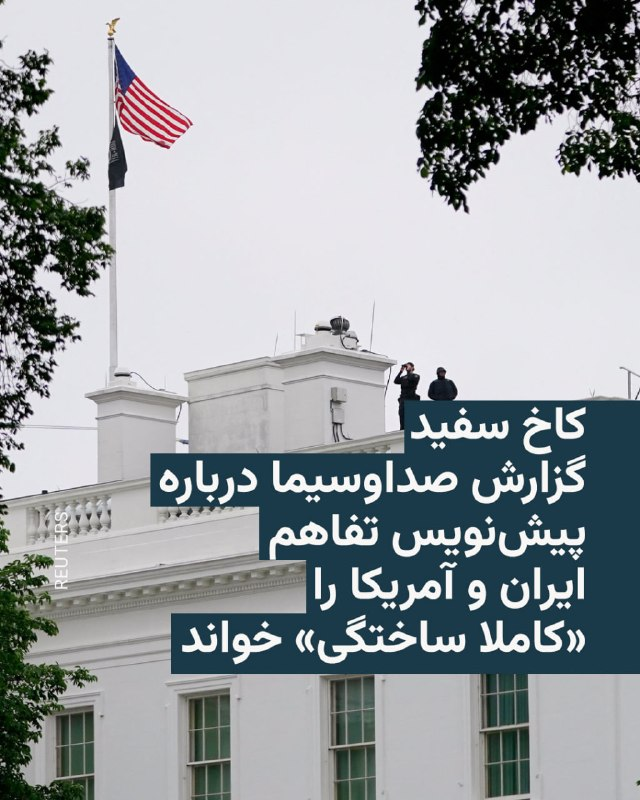

کاخ سفید روز چهارشنبه اعلام کرد گزارشی که از سوی صداوسیمای جمهوری اسلامی منتشر شده و به پیش‌نویس یک چارچوب اولیه و غیررسمی برای تفاهم‌نامه میان ایران و ایالات متحده اشاره داشت، «صحیح نیست» و تفاهم‌نامه مورد اشاره «کاملاً ساختگی» است.

تلویزیون حکومتی ایران ساعتی قبل گزارش داده بود که پیش‌نویس یک توافق چارچوبی با ایالات متحده شامل تعهد به لغو محاصره دریایی ایران، بازگرداندن رفت‌وآمد در تنگه هرمز و خروج نیروهای آمریکایی از منطقه خلیج فارس است.

کاخ سفید در بیانیه‌ای اعلام کرد: «این گزارش رسانه‌های تحت کنترل ایران حقیقت ندارد و تفاهم‌نامه‌ای که آنها منتشر کرده‌اند کاملاً ساختگی است. هیچ‌کس نباید آنچه رسانه‌های دولتی ایران منتشر می‌کنند را باور کند. واقعیت‌ها اهمیت دارند.»

گزارش صداوسیما مدعی شده بود که آمریکا متعهد به رفع محاصره دریایی ایران شده و در مقابل، ایران تعهد داده تعداد کشتی‌های عبوری تجاری را طی یک ماه به سطح پیش از تنش‌ها بازگرداند.

تلویزیون جمهوری اسلامی همچنین گفته بود بر اساس این پیش‌نویس، «مدیریت و مسیر عبور و مرور» کشتی‌ها با ایران و همکاری عمان انجام خواهد شد و آمریکا تعهد داده نیروهای نظامی این کشور از «محیط پیرامونی ایران خارج شوند».
@VahidHeadline

📡 @VahidOnline

## IranIntlTV — post 339259

  <a href="telegram/content/IranIntlTV_339259_1779896015.mp4" target="_blank">🎬 Download video</a>

افزایش قیمت محصولات بهداشتی در ایران پس از جنگ، بسیاری از زنان و دختران را ناچار به استفاده از گزینه‌های غیربهداشتی کرده است.

آیه دریس، عضو تحریریه ایران‌اینترنشنال، به مناسبت روز جهانی بهداشت قاعدگی، در «پیوست» درباره بهداشت زنان در ایران و چالش‌های پیش‌ روی آنان می‌گوید
@iranintltv

## Persian_Trend_Official — post 15132

## RadioFarda — post 157615

  <a href="https://t.me/radiofarda/157615" target="_blank">📎 Download file</a>

بیم و امید درباره «پایان» خاموشی اینترنت در ایران؛ گفت‌وگو با امیر رشیدی

🔸پس از ۸۸ روز قطع سراسری اینترنت در ایران، شهروندان کشور توانستند به‌طور نسبی به اینترنت جهانی دست پیدا کنند و البته هنوز اتصال بسیاری با محدودیت روبروست. این انزوای اینترنتی که طولانی‌ترین در تاریخ معاصر در سطح یک کشور پهناور چون ایران بود، هزینه‌های مالی، اجتماعی و روانی بسیار بر جا گذاشته است. آیا می‌توان گفت خاموشی اینترنت به طور کامل به پایان رسیده است؟ چشم‌انداز پیش رو چیست؟ ارزیابی امیر رشیدی، فعال حوزه حقوق دیجیتال و سیاست‌گذاری اینترنت در ایتالیا، را در این‌باره بشنوید.

@RadioFarda

## RadioFarda — post 157614

🔸کاخ سفید روز چهارشنبه اعلام کرد گزارشی که از سوی صداوسیمای جمهوری اسلامی منتشر شده و به پیش‌نویس یک چارچوب اولیه و غیررسمی برای تفاهم‌نامه میان ایران و ایالات متحده اشاره داشت، «صحیح نیست» و تفاهم‌نامه مورد اشاره «کاملاً ساختگی» است. 🔸تلویزیون حکومتی ایران…

## RadioFarda — post 157613

  

🔸کاخ سفید روز چهارشنبه اعلام کرد گزارشی که از سوی صداوسیمای جمهوری اسلامی منتشر شده و به پیش‌نویس یک چارچوب اولیه و غیررسمی برای تفاهم‌نامه میان ایران و ایالات متحده اشاره داشت، «صحیح نیست» و تفاهم‌نامه مورد اشاره «کاملاً ساختگی» است.

🔸تلویزیون حکومتی ایران ساعتی قبل گزارش داده بود که پیش‌نویس یک توافق چارچوبی با ایالات متحده شامل تعهد به لغو محاصره دریایی ایران، بازگرداندن رفت‌وآمد در تنگه هرمز و خروج نیروهای آمریکایی از منطقه خلیج فارس است.

🔸کاخ سفید در بیانیه‌ای اعلام کرد: «این گزارش رسانه‌های تحت کنترل ایران حقیقت ندارد و تفاهم‌نامه‌ای که آنها منتشر کرده‌اند کاملاً ساختگی است. هیچ‌کس نباید آنچه رسانه‌های دولتی ایران منتشر می‌کنند را باور کند. واقعیت‌ها اهمیت دارند.»

🔸گزارش صداوسیما مدعی شده بود که آمریکا متعهد به رفع محاصره دریایی ایران شده و در مقابل، ایران تعهد داده تعداد کشتی‌های عبوری تجاری را طی یک ماه به سطح پیش از تنش‌ها بازگرداند.

@RadioFarda

## alonews — post 123083

  <a href="telegram/content/alonews_123083_1779896019.mp4" target="_blank">🎬 Download video</a>

👈تعجب یک گردشگر خارجی از تعداد پولی که در ازای دو دلار بهش دادند

✅ @AloNews خبر جنگ

---
📅 بروزرسانی: 1405/03/06 18:52
---

## VahidOOnLine — post 242444

  

وزارت خارجه فرانسه به العربیه اعلام کرد پاریس بخشی از جنگ در منطقه نیست و ماموریت بین‌المللی در تنگه هرمز صرفا ماهیتی دفاعی دارد و برای همراهی کشتی‌ها انجام می‌شود.

این وزارتخانه تاکید کرد هرگونه باج‌خواهی تهران در تنگه هرمز باید متوقف شود و فرانسه برای بازگرداندن آزادی کشتیرانی در سریع‌ترین زمان ممکن تلاش می‌کند.

وزارت خارجه فرانسه افزود با مقام‌های جمهوری اسلامی در تماس است و امانوئل مکرون و دونالد ترامپ نیز به‌طور مستمر درباره ایران گفت‌وگو می‌کنند. همچنین شروط پاریس برای رفع تحریم‌های اروپایی به تهران اعلام شده است.
‌🏁 🇬🇧 IranintlTV

🤖 @VahidOOnLine

## VahidOOnLine — post 242443

  

⭕️ زهران ممدانی در مراسم نماز عید قربان:
این عید یادآور همبستگی و ایثار است،
افتخار می‌کنم اولین شهردار مسلمان نیویورک هستم

♦️زهران ممدانی، شهردار نیویورک، با انتشار تصاویری از حضور خود در مراسم نماز عید قربان در این شهر، پیام تبریکی به مناسبت این عید منتشر کرد و بر مفاهیم همبستگی، ایثار و حمایت اجتماعی تاکید کرد.
او در پیام خود نوشت: «عید مبارک! امروز در حالی که یاد پیامبر ابراهیم را گرامی می‌داریم، عید قربان به ما یادآوری می‌کند که ایثار یک بار سنگین نیست، بلکه فرصتی است برای دیدن خود به عنوان بخشی از یک کل بزرگ‌تر و برای دستگیری از کسانی که بیش از همه به کمک نیاز دارند.»
ممدانی همچنین اعلام کرد که افتخار دارد نخستین شهردار مسلمان نیویورک است و تاکید کرد مدیریت شهری خود را بر پایه همبستگی اجتماعی پیش خواهد برد. او افزود هدفش این است که هر شهروند نیویورک بتواند از پس هزینه‌های اساسی زندگی مانند خوراک، مسکن و خدمات مراقبتی برآید.
‌🇸🇦 Indypersian

🤖 @VahidOOnLine

## mwarmonitor — post 9824

🔴امروز، شهرهای مهم جنوب لبنان یعنی صور و النبطیه با خطر اشغال مستقیم روبه‌رو هستند. نیروهای اسرائیلی به منطقه زوطر شرقی رسیده‌اند؛ تنها حدود پنج کیلومتر فاصله تا نبطیه وجود دارد، و هم‌زمان دستور تخلیه برای شهر صور صادر شده است. 🔸دولت لبنان قصدی برای دفاع…

## mwarmonitor — post 9823

  

🔴سازمان UKMTO (مرکز عملیات تجارت دریایی بریتانیا) گزارشی درباره وقوع یک حادثه در ۶۰ مایل دریایی (NM) در شرق مسقط، عمان دریافت کرده است. 🔸ناخدای یک کشتی نفت‌کش، گزارشی از وقوع یک انفجار بیرونی در سمت چپ بخش عقب کشتی (Port side aft) و نزدیک به خط آب (waterline)…

## mwarmonitor — post 9822

🔰ایران ۲۴ میلیارد دلار از دارایی‌های بلوکه‌شده خود را پیش‌شرط امضای یک توافق صلح با آمریکا قرار داده است؛ از این مبلغ، گفته می‌شود ۱۲ میلیارد دلار باید هم‌زمان با اعلام توافق آزاد شود. تلگراف

@mwarmonitor

## pm_afshaa — post 91660

🔴کاخ سفید :هیچ‌کس نباید به آنچه رسانه‌های دولتی ایران منتشر می‌کنند اعتماد کند

💧 Rainbet.com the #1 Non-KYC Crypto Casino & Sportsbook @rainbetcom

😁 @Pm_Afshaa

## VahidOnline — post 75747

  

دونالد‌ ترامپ، رئیس‌جمهوری آمریکا، چهارشنبه ششم خرداد در شبکه اجتماعی تروث سوشال با انتشار تصویری ساخته‌شده با هوش مصنوعی، از شبکه سی‌ان‌ان انتقاد کرد و نوشت این رسانه نیروی دریایی جمهوری اسلامی را قدرتمند نشان می‌دهد، در حالی که شناورهای ایران در اقیانوس غرق شده‌اند.

در این تصویر، جمله «سی‌ان‌ان: نیروی دریایی ایران قدرتمند است» در کنار تصویری از شناورهای غرق‌شده جمهوری اسلامی در کف اقیانوس دیده می‌شود.
@VahidOOnLine

📡 @VahidOnline

## IranIntlTV — post 339258

  

وزارت خارجه فرانسه به العربیه اعلام کرد پاریس بخشی از جنگ در منطقه نیست و ماموریت بین‌المللی در تنگه هرمز صرفا ماهیتی دفاعی دارد و برای همراهی کشتی‌ها انجام می‌شود.

این وزارتخانه تاکید کرد هرگونه باج‌خواهی تهران در تنگه هرمز باید متوقف شود و فرانسه برای بازگرداندن آزادی کشتیرانی در سریع‌ترین زمان ممکن تلاش می‌کند.

وزارت خارجه فرانسه افزود با مقام‌های جمهوری اسلامی در تماس است و امانوئل مکرون و دونالد ترامپ نیز به‌طور مستمر درباره ایران گفت‌وگو می‌کنند. همچنین شروط پاریس برای رفع تحریم‌های اروپایی به تهران اعلام شده است.
https://iranintl.com/202605270066

## BBCPersian — post 282199

🔻نیروی دریایی سپاه: در شبانه روز گذشته ۲۳ شناور از تنگه هرمز عبور کردند

🔻سپاه پاسداران انقلاب اسلامی اعلام کرد که در شبانه روز گذشته ۲۳ شناور با اجازه این نیرو از تنگه هرمز عبور کرده‌اند.

نیروی دریایی سپاه یک روز پیش هم گفته بود که ۲۵ کشتی در هماهنگی با این نیرو از این تنگه گذشتند.

پیشتر گزارش دادیم که رسانه‌های حکومتی ایران اعلام کردند که تهران «پیش‌نویس اولیه و غیررسمی چارچوب یک یادداشت تفاهم با آمریکا را دریافت کرده» است.

بر اساس این پیش‌نویس، ایران ظرف یک ماه عبور و مرور تجاری از تنگه هرمز را به سطح پیش از جنگ بازمی‌گرداند و در مقابل، آمریکا نیروهای نظامی خود را از اطراف ایران خارج و محاصره دریایی را لغو خواهد کرد.

https://bbc.in/3S51FI9
@BBCPersian

## BBCPersian — post 282198

🔻شرکت اماراتی مجوز آمریکا برای اسقاط چهار کشتی تحریم‌شده مرتبط با ایران را دریافت کرد

🔻شرکت جی‌ام‌اس (GMS) مستقر در دبی، اعلام کرد که مجوز دولت آمریکا را برای اسقاط چهار کشتی کانتینربر دریافت کرده است که به‌دلیل ارتباط با ایران تحریم شده بودند.

مدیرعامل این شرکت گفت که این اقدام می‌تواند راه را برای کاهش ناوگان موسوم به «سایه» هموار کند، ناوگانی از کشتی‌هایی که برای دور زدن تحریم‌ها استفاده می‌شوند.

به گزارش رویترز، صدها کشتی فاقد بیمه مشخص یا استانداردهای زیست‌محیطی و ایمنی، نه‌تنها به ایران و روسیه برای دور زدن تحریم‌ها کمک کرده‌اند، بلکه خطر نشت نفت و سوخت را در مسیرهای پرتردد دریایی افزایش داده‌اند.

ایجاد سازوکاری رسمی برای اسقاط این کشتی‌ها می‌تواند انگیزه‌ای برای خارج کردن آن‌ها از چرخه فعالیت باشد، اقدامی که به کاهش خطرات زیست‌محیطی و مهار تجارت نفت و کالاهای تحریم‌شده کمک می‌کند.

انیل شارما، بنیان‌گذار و مدیرعامل جی‌ام‌اس، به رویترز گفت که این شرکت ماه‌ها با مقام‌های آمریکایی درباره تحویل گرفتن کشتی‌های تحریم‌شده و اسقاط آن‌ها در حال مذاکره بوده است.

https://bbc.in/4dzGnuJ
@BBCPersian

## Dirty_Kids — post 390325

  

به مناسبت عید قربان، یادی کنیم از این دو گوسفند که سر ندارن.

@Dirty_Kids 👻

## Hranews — post 113198

اشنویه؛ دو شهروند با تودیع وثیقه آزاد شدند

❗️
❗️
❗️
❗️
❗️– روز سه‌شنبه ۵ خردادماه، آرمان درویشی و میلاد شادیخواه، شهروندان اهل اشنویه، با تودیع وثیقه، آزاد شدند.

#آرمان_درویشی #میلاد_شادیخواه

ادامه مطلب

↘️
@hranews_bot تماس ✉️ - @Hranews کانال هرانا 🆑

## alonews — post 123082

  <a href="telegram/content/alonews_123082_1779895369.mp4" target="_blank">🎬 Download video</a>

👈اسرائیل اولین هواپیمای سوخت‌رسان هوایی بوئینگ KC-46 پگاسوس «جیدئون» را از ایالات متحده دریافت کرده است.

این هواپیما امروز زودتر در پایگاه هوایی نوواتیم، یکی از بزرگ‌ترین پایگاه‌های اسرائیل، به زمین نشست و رئیس ستاد کل ارتش اسرائیل، ایال زامیر، نیز حضور داشت.

KC-46 می‌تواند سوخت بیشتری حمل کند و تعداد بیشتری از هواپیماها را نسبت به ناوگان سوخت‌رسان قدیمی‌تر اسرائیل سوخت‌رسانی کند.

قرار است اسرائیل حداقل شش فروند هواپیمای KC-46 دریافت کند.

✅ @AloNews خبر جنگ

## alonews — post 123081

  <a href="telegram/content/alonews_123081_1779895371.webm" target="_blank">🎬 Download video</a>

👈رسایی،از رهبران بولشویک‌ها: از وقتی اینترنت وصل شده قلبم درد گرفته، یه لحظه‌ام نتونستم بخوابم. 
✅ @AloNews خبر جنگ

---
📅 بروزرسانی: 1405/03/06 18:43
---

## VahidOOnLine — post 242442

  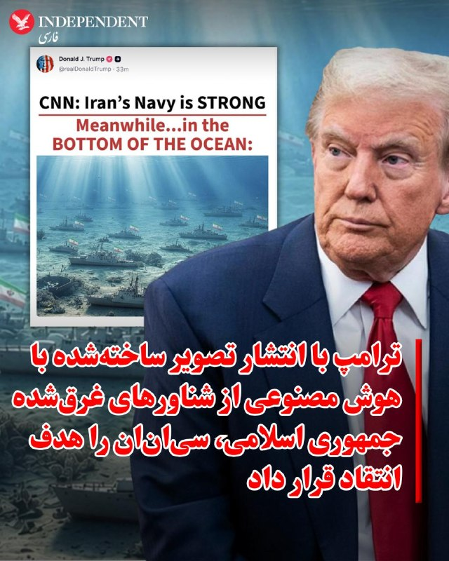

♦️دونالد‌ ترامپ، رئیس‌جمهوری آمریکا، چهارشنبه ششم خرداد در شبکه اجتماعی تروث سوشال با انتشار تصویری ساخته‌شده با هوش مصنوعی، از شبکه سی‌ان‌ان انتقاد کرد و نوشت این رسانه نیروی دریایی جمهوری اسلامی را قدرتمند نشان می‌دهد، در حالی که شناورهای ایران در اقیانوس غرق شده‌اند.

در این تصویر، جمله «سی‌ان‌ان: نیروی دریایی ایران قدرتمند است» در کنار تصویری از شناورهای غرق‌شده جمهوری اسلامی در کف اقیانوس دیده می‌شود.
‌🇸🇦 Indypersian

🤖 @VahidOOnLine

## VahidOOnLine — post 242441

  

کاخ سفید به الجزیره گفت دونالد ترامپ تنها توافقی را امضا می‌کند که در جهت منافع مردم آمریکا باشد.

کاخ سفید افزود ترامپ فقط توافقی را خواهد پذیرفت که به‌طور قطعی تضمین کند جمهوری اسلامی هیچ سلاح هسته‌ای در اختیار نداشته باشد.

به گفته کاخ سفید، ترامپ گفته است مذاکرات به‌خوبی پیش می‌رود و او خطوط قرمز خود را به‌روشنی مشخص کرده است.
‌🏁 🇬🇧 IranintlTV

🤖 @VahidOOnLine

## mwarmonitor — post 9821

🔴امروز، شهرهای مهم جنوب لبنان یعنی صور و النبطیه با خطر اشغال مستقیم روبه‌رو هستند. نیروهای اسرائیلی به منطقه زوطر شرقی رسیده‌اند؛ تنها حدود پنج کیلومتر فاصله تا نبطیه وجود دارد، و هم‌زمان دستور تخلیه برای شهر صور صادر شده است.

🔸دولت لبنان قصدی برای دفاع از شهرهای خود ندارد و تنها گزینه پیشِ رو را مذاکره می‌بیند؛ موضعی که از نظر نویسنده بزدلانه و بدون هیچ شرمی توصیف شده است. پهپادهای FPV حزب‌الله می‌توانند به نیروهای پیش‌روی اسرائیل خسارت وارد کنند، اما در همین سطح نیز قادر به متوقف کردن حمله نیستند. در همین حال، شرط ایران مبنی بر عدم هدف قرار دادن بیروت و ضاحیه در این لحظه عملاً به نمادی بدون اثر عملی تبدیل شده، آن هم در شرایطی که نتانیاهو به‌دنبال ایجاد واقعیت‌های جدید در زمین است.

🔹بدون تردید، شمار بیشتری از سربازان اسرائیلی در خاک لبنان کشته خواهند شد و لبنان به باتلاقی خطرناک تبدیل می‌شود. اما در مقابل، بخش‌های بیشتری از خاک لبنان تحت اشغال قرار خواهد گرفت. روستاها طی ماه‌های گذشته به‌طور سیستماتیک ویران شده‌اند و اکنون نوبت شهرهاست.

🔸کسانی که انتظار راه‌حلی سریع در میز مذاکرات دارند، باید از این توهم دست بردارند. و کسانی که منتظر حل بحران لبنان از طریق توافقات منطقه‌ای هستند نیز چیزی به دست نخواهند آورد. آنچه من می‌بینم فراتر از یک بحران است؛ یک تحول بنیادین و فراگیر است که ممکن است سال‌ها ادامه یابد—سال‌هایی نه معمولی، بلکه طولانی، فرسایشی و ویرانگر، بدون هیچ افق روشنی. الجزیره

@mwarmonitor

## mwarmonitor — post 9820

  

🔴حساب رسمی تلگرام در پلتفرم X (توییتر سابق) به نظر می‌رسد هک شده باشد.

@mwarmonitor

## pm_afshaa — post 91659

vless://406d8436-0eb9-4eb2-84fb-960e076ffba6@162.159.38.183:2083?encryption=none&security=tls&sni=de.lezzatzone.ir&alpn=h2%2Chttp%2F1.1&fp=chrome&type=tcp&headerType=none#%40Glitch_Config

نامحدود سرعت موشکی
🚀

💧 Rainbet.com the #1 Non-KYC Crypto Casino & Sportsbook @rainbetcom

😁 @Pm_Afshaa

## pm_afshaa — post 91658

🟠کاخ سفید در توییتر به طور غیرمستقیم گزارش رسانه‌های دولتی جمهوری اسلامی تروریست درباره پیش‌نویس تفاهم‌نامه بین آمریکا و ج.ا را رد کرد

💧 Rainbet.com the #1 Non-KYC Crypto Casino & Sportsbook @rainbetcom

😁 @Pm_Afshaa

## IranIntlTV — post 339257

  <a href="telegram/content/IranIntlTV_339257_1779894795.mp4" target="_blank">🎬 Download video</a>

ایران‌اینترنشنال همچنان پیگیر دریافت گزارش‌ها و ثبت رویدادها در جریان کشتار مردم ایران در اعتراضات دی‌ماه است. اطلاعات رسیده، جزییات جدیدی از کشته شدن جاویدنامان حمیدرضا حدادی و سپهر موسوی‌فر را روایت می‌کند.

فرنوش فرجی، عضو تحریریه ایران‌اینترنشنال، گزارش می‌دهد
@iranintltv

## IranIntlTV — post 339256

  

کاخ سفید به الجزیره گفت دونالد ترامپ تنها توافقی را امضا می‌کند که در جهت منافع مردم آمریکا باشد.

کاخ سفید افزود ترامپ فقط توافقی را خواهد پذیرفت که به‌طور قطعی تضمین کند جمهوری اسلامی هیچ سلاح هسته‌ای در اختیار نداشته باشد.

به گفته کاخ سفید، ترامپ گفته است مذاکرات به‌خوبی پیش می‌رود و او خطوط قرمز خود را به‌روشنی مشخص کرده است.
https://iranintl.com/202605278178

## FarsiVOA — post 218811

🔺حکم حبس یک وکیل به دلیل انتقاد از رهبران رژیم؛ فشار جمهوری اسلامی بر وکلا ادامه دارد

◾️جمهوری اسلامی در ادامه روند فشار و ارعاب وکلای مستقل، یک عضو کانون وکلای استان آذربایجان شرقی را به ۳ سال حبس و یک وکیل ساکن قم را در دادگاه محاکمه کرد.

⬇️ بیشتر بخوانید:

https://ir.voanews.com/a/islamic-republic-s-pressure-on-independent-lawyers-convicted-prison-criticizing-regime-leaders/8154497.html

## FarsiVOA — post 218810

یکی از مخاطبان صدای آمریکا با ارسال این ویدیو از تصمیم برای سقط جنین در سایه مشکلات معیشتی و اقتصادی گفته است.

این شهروند اهل خوزستان می‌گوید بعد از جنگ اخیر، همسرش درپی تعدیل نیرو اخراج شده است و هیچ منبع درآمدی ندارند. در نتیجه آرزوی مادر و پدر شدن برای آنها ناتمام می‌ماند.

این روایت دردناک نشان می‌دهد در سایه بی‌ثباتی اقتصادی و فشارهای مداوم، زندگی روزمره بسیاری از مردم به میدان مبارزه‌ای خاموش برای تأمین حداقل‌ها تبدیل شده است. روندی که روایتی از فشار اقتصادی، ناامیدی اجتماعی و تغییر عمیق سبک زندگی در ایران امروز است.

## Persian_Trend_Official — post 15131

  <a href="telegram/content/Persian_Trend_Official_15131_1779894799.mp4" target="_blank">🎬 Download video</a>

🔹آغاز تخلیه شهر بزرگ صور در پی هشدار ارتش اسرائیل

پس از هشدار تخلیه از سوی ارتش رژیم صهیونیستی برای ساکنان شهر بندری صور، ده‌ها هزار نفر شروع به حرکت به سمت مناطق شمالی کرده‌اند.

.

## Persian_Trend_Official — post 15130

  <a href="telegram/content/Persian_Trend_Official_15130_1779894802.mp4" target="_blank">🎬 Download video</a>

🇺🇸
🇮🇱
🆔 اسرائیل اولین هواپیمای سوخت‌رسان هوایی بوئینگ KC-46 پگاسوس را امروز از ایالات متحده دریافت کرده است.

## BBCPersian — post 282197

  <a href="telegram/content/BBCPersian_282197_1779894805.mp4" target="_blank">🎬 Download video</a>

🔻حدود ۹۰ پهپاد در طول یک نمایش نور زمستانی محبوب از آسمان بندر دارلینگ سیدنی سقوط کردند و برخی‌شان در نزدیکی جمعیت به داخل آب افتادند.

برگزارکنندگان جشنواره سه هفته‌ای سالانه «ویوید سیدنی» که شامل چیدمان‌های نوری بزرگ است، گفتند که نقص فنی در عصر دوشنبه به وقت محلی به دلیل «مشکلات فنی پیش‌بینی نشده» بوده و چندین نمایش آینده را لغو کرده‌اند.

فیلم نمایش دوشنبه، ده‌ها پهپاد را در حالی که از آسمان شب سقوط می‌کردند نشان می‌داد.

شرکت اسکای‌مجیک، شرکت بریتانیایی برگزارکننده این نمایش، تغییر در فرکانس رادیویی را دلیل این نقص دانست و گفت که هیچ یک از پهپادها خارج از مرزهای ایمنی سقوط نکرده‌اند.

https://bbc.in/4tZCSCO
@BBCPersian

## Dirty_Kids — post 390324

  

خیلی دوست داشتن عاغاشون رو حالت عرفانی روحانی نشون بدن ولی هرکاری میکنن مثه عقب افتاده‌ها میشه، خارشو گاییدم چقد کیری بود این بشر

ساده زیست بود ولی عکاس شخصی داشت برای ریا

@Dirty_Kids 👻

## Dirty_Kids — post 390323

  

کدوم یکی از حالت‌های خوابیدن مورد علاقه‌تونه؟

@Dirty_Kids 👻

## alonews — post 123080

  <a href="telegram/content/alonews_123080_1779894809.webm" target="_blank">🎬 Download video</a>

👈رسایی،از رهبران بولشویک‌ها: از وقتی اینترنت وصل شده قلبم درد گرفته، یه لحظه‌ام نتونستم بخوابم.

✅ @AloNews خبر جنگ

---
📅 بروزرسانی: 1405/03/06 18:33
---

## VahidOOnLine — post 242440

  <a href="telegram/content/VahidOOnLine_242440_1779894195.mp4" target="_blank">🎬 Download video</a>

یک دانش‌آموز در پیامی به ایران‌اینترنشنال درباره وضعیت معیشتی می‌گوید که نمی‌تواند از پدرش بخواهد چیزی برایش بخرد. پیام او با هوش مصنوعی خوانده شده است.
‌🏁 🇬🇧 IranintlTV

🤖 @VahidOOnLine

## VahidOOnLine — post 242439

  

♦️میثم ظهوریان، نماینده مجلس شورای اسلامی از مشهد، با انتشار متنی در شبکه اجتماعی اکس از جزئیات یک پیش‌نویس ۱۱ بندی مرتبط با مذاکرات ایران و آمریکا خبر داده است؛ محوری که به گفته او چارچوب اولیه یک تفاهم در حال بررسی را ترسیم می‌کند.

بر اساس بندهای منتشرشده، ایران متعهد می‌شود به سمت ساخت سلاح هسته‌ای نرود و درباره سرنوشت ذخایر اورانیوم، سطح غنی‌سازی و سایر موضوعات مرتبط با برنامه هسته‌ای، یک چارچوب مورد توافق دو طرف شکل بگیرد. همچنین در این پیش‌نویس آمده است که برنامه هسته‌ای ایران در طول مذاکرات «تعلیق» خواهد شد و در مقابل، آمریکا نیز از افزایش تحریم‌ها خودداری می‌کند.

در بخش دیگری از این متن، اعلام خاتمه جنگ از جمله در لبنان و عدم استفاده از زور علیه یکدیگر، احترام به حاکمیت و تمامیت ارضی طرفین و تعیین یک بازه ۶۰ روزه قابل تمدید برای نهایی‌سازی توافق مطرح شده است.

این پیش‌نویس همچنین شامل رفع محاصره دریایی ظرف ۳۰ روز، خروج نیروهای آمریکایی از «محیط پیرامونی ایران» و باز شدن تنگه هرمز توسط ایران در همین بازه زمانی است؛ هرچند تعریف دقیقی از محدوده «محیط پیرامونی ایران» ارائه نشده است.

در بندهای اقتصادی نیز به وعده یک برنامه بازسازی ۳۰۰ میلیارد دلاری برای ایران، خاتمه تدریجی تحریم‌های اولیه و ثانویه، معافیت فروش نفت و پتروشیمی ایران و آزادسازی تدریجی وجوه مسدود شده ایران در صورت پیشرفت مذاکرات اشاره شده است.

این در حالی است که ظهر روز چهارشنبه صداوسیما نیز اعلام کرد به یک سند غیررسمی اولیه از چارچوب ۱۴ بندی تفاهم احتمالی میان ایران و آمریکا دسترسی پیدا کرده است؛ سندی که هنوز نهایی نشده اما در آن به موضوعاتی از جمله وضعیت تنگه هرمز و حضور نظامی آمریکا در منطقه اشاره شده است.

طبق گزارش صداوسیما، آمریکا در این پیش‌نویس متعهد به خروج نیروهای نظامی از اطراف ایران و توقف محاصره دریایی شده و در مقابل، ایران نیز بازگشت عبور کشتی‌های تجاری از تنگه هرمز به سطح پیش از جنگ را ظرف یک ماه پذیرفته است. همچنین مدیریت تردد کشتی‌های تجاری در تنگه هرمز با همکاری ایران و عمان پیش‌بینی شده و تأکید شده بدون سازوکار راستی‌آزمایی، هیچ اقدام عملی از سوی تهران انجام نخواهد شد.

در این گزارش آمده است که در صورت دستیابی به توافق نهایی ظرف ۶۰ روز، امکان تبدیل آن به قطعنامه الزام‌آور در شورای امنیت سازمان ملل نیز مطرح شده است.
‌🇸🇦 Indypersian

🤖 @VahidOOnLine

## VahidOOnLine — post 242438

  

کاخ سفید اعلام کرد گزارش رسانه‌های جمهوری اسلامی درباره بندهای تفاهم‌نامه احتمالی صحت ندارد و کاملا ساختگی است.
کاخ سفید افزود نباید به مطالب منتشرشده از سوی رسانه‌های جمهوری اسلامی اعتماد کرد.
‌🏁 🇬🇧 IranintlTV

🤖 @VahidOOnLine

## WithYashar — post 12690

  

تصاویر ماهواره‌ای از پایگاه هوایی رامشتاین در آلمان، ده‌ها فروند هواپیمای ترابری C-17A و C-5M نیروی هوایی ایالات متحده، چندین فروند هواپیمای ترابری C-130 و حداقل 10 فروند تانکر KC-135R را نشان می‌دهد که در آنجا مستقر شده‌اند.

در اتاق جنگ گفتم که رامشتاین مهم‌ترین پایگاه ایالات متحده در اروپا برای جنگ ایران است و به عنوان یک قطب لجستیکی کلیدی عمل می‌کند.
@withyashar

## mwarmonitor — post 9819

📌 تندروهای افراطی در ایران به مذاکره‌کنندگان به‌دلیل مذاکرات با آمریکا حمله کرده‌اند. فیننشال تایمز

@mwarmonitor

## mwarmonitor — post 9818

🔴سخنگوی کاخ سفید: گزارش رسانه‌های ایرانی درباره «یادداشت تفاهم» نادرست بوده و به‌طور کامل ساختگی است.

@mwarmonitor

## mwarmonitor — post 9817

🔸رئیس‌جمهور ترکیه، رجب طیب اردوغان، در حال تلاش است تا هم‌زمان با برگزاری مسابقه فوتبال جام جهانی میان تیم‌های ترکیه و آمریکا در لس‌آنجلس ماه آینده، دیداری با دونالد ترامپ ترتیب دهد. بلومبرگ

@mwarmonitor

## FoxNewsTwitter — post 342303

Fox News (Twitter/X)

NEW: President Trump jokingly congratulates the Democrats for longtime Texas congressman and Trump critic Al Green losing his house seat in last night's Texas primary.

"I will miss that lunatic not screaming and violently waving his cane at me during my next State of the Union Speech."

## FoxNewsTwitter — post 342302

  <a href="telegram/content/FoxNewsTwitter_342302_1779894198.mp4" target="_blank">🎬 Download video</a>

Fox News (Twitter/X)

RT @FoxNewsEnt: Russell Crowe confronts swarming autograph seekers outside his Paris hotel, laying down ground rules before signing a single item. 'As soon as somebody's a d---, I'm going. You got me? Clear?' The moment split the internet — some called him 'very disrespectful,' others praised him for setting boundaries while still signing for every fan in the crowd.

🎥: Best Image / BACKGRID

## IranIntlTV — post 339255

  <a href="telegram/content/IranIntlTV_339255_1779894199.mp4" target="_blank">🎬 Download video</a>

یک دانش‌آموز در پیامی به ایران‌اینترنشنال درباره وضعیت معیشتی می‌گوید که نمی‌تواند از پدرش بخواهد چیزی برایش بخرد. پیام او با هوش مصنوعی خوانده شده است.

## IranIntlTV — post 339254

  <a href="telegram/content/IranIntlTV_339254_1779894200.mp4" target="_blank">🎬 Download video</a>

دونالد ترامپ در تروث‌سوشال پستی را بازنشر کرد که با استناد به گزارشی از اورشلیم‌پست، از افزایش موارد آزار و خشونت جنسی در زندان‌های ایران پس از موج بازداشت‌های گسترده با شروع جنگ خبر می‌دهد.
جزییات بیشتر با سمیرا قرایی، خبرنگار ایران‌اینترنشنال
@iranintltv

## IranIntlTV — post 339253

  <a href="telegram/content/IranIntlTV_339253_1779894202.mp4" target="_blank">🎬 Download video</a>

دونالد ترامپ در تروث‌سوشال پستی را بازنشر کرد که با استناد به گزارشی از اورشلیم‌پست، از افزایش موارد آزار و خشونت جنسی در زندان‌های ایران پس از موج بازداشت‌های گسترده با شروع جنگ خبر می‌دهد.
جزییات بیشتر با سمیرا قرایی، خبرنگار ایران‌اینترنشنال
@iranintltv

## IranIntlTV — post 339252

  

کاخ سفید اعلام کرد گزارش رسانه‌های جمهوری اسلامی درباره بندهای تفاهم‌نامه احتمالی صحت ندارد و کاملا ساختگی است.
کاخ سفید افزود نباید به مطالب منتشرشده از سوی رسانه‌های جمهوری اسلامی اعتماد کرد.
https://iranintl.com/202605274908

## FarsiVOA — post 218809

دونالد ترامپ نقض حقوق زندانیان سیاسی زن در جمهوری اسلامی را برجسته کرد

## DW_Farsi — post 125204

🎥 نقش یک شرکت در امارات در خرید تجهیزات ماهواره‌ای چینی برای ایران

بنا به گزارش‌ها، سپاه پاسداران از یک شرکت مستقر در امارات متحده عربی برای خرید تجهیزات ماهواره‌ای پیشرفته چینی استفاده کرده است و بعدا در جنگ، حملاتی را علیه اهداف اماراتی انجام داده است.
@dw_farsi

## IranianMinds — post 20874

🔴کاخ سفید:

گزارش‌های تلویزیون ایران درباره یادداشت تفاهم، کاملا نادرست و جعلی است.

@IranianMinds

## BBCPersian — post 282196

  

🔻در پی بازگشت تدریجی دسترسی به اینترنت جهانی در ایران از روز سه‌شنبه ۵ خرداد ۱۴۰۵، داده‌های شرکت کنتیک (Kentik) نشان می‌دهد که حجم ترافیک اینترنت بین‌الملل پس از هفته‌ها محدودیت شدید، تا حد قابل توجهی افزایش یافته است، هرچند همچنان فاصله زیادی با سطح عادی پیش از آغاز قطع اینترنت در دی‌ماه دارد.

داگ مادوری، مدیر تحلیل اینترنت در شرکت کنتیک، می‌گوید: «سطح ترافیک در بالاترین حالت به حدود ۳۹ درصد حجم پیش از اعتراضات رسیده است؛ رقمی که به سطح دسترسی در دوره بازگشایی نسبی میان ۷ بهمن تا ۹ اسفند نزدیک است. در آن دوره، خدمات اینترنت ناپایدار و بی‌ثبات بود و محدودیت‌ها روزانه تغییر می‌کردند.»

او اضافه می‌کند: «ما هنوز فاصله زیادی با سطح خدمات پیش از ۱۸ دی داریم. این فقط یک تصویر کلی از وضعیت ترافیک است و ممکن است برخی خدماتی که آن زمان در دسترس بودند، همچنان مسدود باشند.»

گزارش‌های رسیده و تجربیات کاربران حاکی است که دسترسی به برخی خدمات امکان‌پذیر شده است هرچند ارتباط با ثبات نیست و از جمله، تماس‌های صوتی- تصویری، کیفیت بالایی ندارند.

https://bbc.in/4uvLBh7
@BBCPersian

## BBCPersian — post 282195

  

‌🔻اولیویا ویلز، سخنگوی کاخ سفید، در واکنش به انتشار گزارش‌ رسانه‌های ایران درباره پیش‌نویس یادداشت تفاهم میان ایران و آمریکا، گفت: «همان‌طور که رئیس‌جمهور ترامپ گفته است، مذاکرات به‌خوبی در حال پیشرفت است و او خطوط قرمز خود را به‌روشنی مشخص کرده است.»

پیشتر رسانه‌های حکومتی ایران اعلام کردند که تهران «پیش‌نویس اولیه و غیررسمی چارچوب یک یادداشت تفاهم با آمریکا را دریافت کرده است.»

بر اساس این گزارش‌ها، ایران ظرف یک ماه عبور و مرور تجاری از تنگه هرمز را به سطح پیش از جنگ بازمی‌گرداند و در مقابل، آمریکا نیروهای نظامی خود را از اطراف ایران خارج و محاصره دریایی را لغو خواهد کرد.

خانم ویلز بدون تایید یا رد این گزارش‌ها گفت که «رئیس‌جمهور ترامپ تنها توافقی را خواهد پذیرفت که برای مردم آمریکا توافقی خوب باشد و تضمین کند ایران هرگز به سلاح هسته‌ای دست پیدا نکند.»

📷Courtesy: TCU News
https://bbc.in/4tYo1Z8

@BBCPersian

---
📅 بروزرسانی: 1405/03/06 18:22
---

## WithYashar — post 12689

پست جدید یه یا موسی کامنت کنین بی بی و پسرش و زنش رو تگ کنین امشب بزنه 🤣💥💥🌶️🌶️ https://www.instagram.com/reel/DY2Hk4hoW2r/?igsh=MXYyMDlxdjY5b3QwZg==

## WithYashar — post 12688

کاخ سفید گزارش‌های مربوط به تفاهم‌نامه ایران را کاملاً ساختگی خواند.
@withyashar

## FoxNewsTwitter — post 342301

Fox News (Twitter/X)

RT @AmericaNewsroom: 🚨HIGH-STAKES MEETING: President Trump now set to gather his cabinet at the White House amid tense negotiations with Iran. The President says the U.S. will either agree to a good deal, or no deal at all.

@TreyYingst reports.

## pm_afshaa — post 91657

🔴مهر: یک ساختمان اداری در فرودگاه امام خمینی آتش گرفت

💧 Rainbet.com the #1 Non-KYC Crypto Casino & Sportsbook @rainbetcom

😁 @Pm_Afshaa

## pm_afshaa — post 91656

ترولیتر 
😈
🔥

میم 
✔ توییت 
✔ خبر 
✔ پروکسی رایگان
✔

همین الان جوین شو و آنلاین بمون 
👇
👇

https://t.me/trolliter
https://t.me/trolliter

## IranIntlTV — post 339251

  <a href="telegram/content/IranIntlTV_339251_1779893557.mp4" target="_blank">🎬 Download video</a>

سرخط خبرهای چهارشنبه ۶ خرداد
@iranintltv

## FarsiVOA — post 218808

  <a href="telegram/content/FarsiVOA_218808_1779893559.mp4" target="_blank">🎬 Download video</a>

در میدان پرسیدیم: آیا زیستن در سایه جنگ و در برابرِ حکومتی که دشمن زندگی است به معنای زندگی نکردن است؟ چرا هر نشانه‌ای از زندگی به عادی‌سازی تعبیر می‌شود؟ سمانه سوادی، حقوق‌دان پاسخ می‌دهد

## Persian_Trend_Official — post 15129

  <a href="telegram/content/Persian_Trend_Official_15129_1779893559.webm" target="_blank">🎬 Download video</a>

حادثه در بزرگترین مجتمع پتروشیمی ایران در عسلویه

۱ نفر جان باخت و ۲ تن مصدوم شدند.

‌روابط عمومی شرکت دماوند انرژی عسلویه:

‌ ظهر امروز چهارشنبه ششم  خرداد ماه ۱۴۰۵ در ساعت ۱۱:۳۵ ، حادثه‌ای در واحد هوای این شرکت رخ داد که متأسفانه منجر به جان‌باختن یکی از کارکنان و مصدومیت دو نفر دیگر شد.

## Persian_Trend_Official — post 15128

  <a href="telegram/content/Persian_Trend_Official_15128_1779893560.webm" target="_blank">🎬 Download video</a>

🇺🇸
🇺🇸 پست جدید ترامپ در تروث سوشال:

## RadioFarda — post 157612

  

🔸هلند یک کشتی مین‌روب را به دریای مدیترانه اعزام می‌کند. بر اساس نامۀ دو عضو ارشد دولت هلند که روز چهارشنبه به پارلمان این کشور ارسال شد، این اقدام برای مشارکت در عملیات احتمالی پیمان ناتو در تنگۀ هرمز پس از پایان جنگ ایران در نظر گرفته شده است.

🔸بر اساس نامۀ وزرای دفاع و خارجۀ هلند، کشتی مین‌روب همین هفته راهی مدیترانه شده و از حدود دو هفتۀ دیگر برای مشارکت در عملیات ناتو آماده خوهد بود. در این نامه آمده که هلند برای بر عهده‌گرفتن نقشی با هدف تضمین ایمنی تردد کشتی‌ها در خلیج فارس آماده می‌شود.

🔸در نامۀ وزیران هلندی به پارلمان تأکید شده که یکی از گزینه‌های در نظر گرفته‌شده برای مشارکت هلند، استقرار یک تیم ترکیبی، برای جست‌وجو، غواصی، شناسایی و از بین‌بردن ایمن تجهیزات انفجاری خواهد بود.

🔸در این نامه آمده که هلند همزمان در حال بررسی امکان اعزام نیرو برای مشارکت در عملیات احتمالی یک ائتلاف بین‌المللی در منطقه است.

@RadioFarda

## BBCPersian — post 282194

🔻رسانه‌های ایران: تهران پیش‌نویس اولیه و غیررسمی تفاهم با آمریکا را دریافت کرده است

🔻رسانه‌های حکومتی ایران اعلام کردند که تهران «پیش‌نویس اولیه و غیررسمی چارچوب یک یادداشت تفاهم با آمریکا را دریافت کرده است.»

بر اساس این گزارش‌ها، ایران ظرف یک ماه عبور و مرور تجاری از تنگه هرمز را به سطح پیش از جنگ بازمی‌گرداند و در مقابل، آمریکا نیروهای نظامی خود را از اطراف ایران خارج و محاصره دریایی را لغو خواهد کرد.

این گزارش همچنین حاکیست که هماهنگی در مورد مدیریت مسیر کشتی‌ها با ایران و عمان انجام خواهد شد.

علی باقری کنی، معاون سیاست خارجی و امنیت بین‌الملل دبیرخانه شورای عالی امنیت ملی ایران، هم تایید کرده است که ایران و عمان به‌طور مشترک در حال مذاکره در مورد رویه جدیدی برای عبور کشتی‌ها از تنگه هرمز هستند.

به گفته او «شرایط و رویه‌های عبور از تنگه هرمز کاملا متفاوت از شرایط قبل از شروع درگیری بر سر ایران خواهد بود.»آقای باقری کنی همچنین گفت: «تا زمانی که در مورد همه مسائل به توافق نرسیم، فکر می‌کنیم که در مورد هیچ چیز به توافق نرسیده‌ایم.»

https://bbc.in/3PLvJI4
@BBCPersian

## alonews — post 123079

  <a href="telegram/content/alonews_123079_1779893561.webm" target="_blank">🎬 Download video</a>

👈شبکه ۱۲ اسرائیل :
ترامپ اجازه حمله به بیروت رو داد

✅ @AloNews خبر جنگ

## alonews — post 123077

  <a href="telegram/content/alonews_123077_1779893561.webm" target="_blank">🎬 Download video</a>

👈حملات اسرائیل به حزب الله ادامه دارد

✅ @AloNews خبر جنگ

---
📅 بروزرسانی: 1405/03/06 18:12
---

## VahidOOnLine — post 242437

🗣روایت شما پس از بازگشت محدود اینترنت بین‌المللی- چهارشنبه ۷ خرداد ۱۴۰۵

🔹پهنای باند اینترنت بین‌الملل در حد ۵۰ کیلوبایت هم نیست. بسیاری از سایت‌ها به لیست فیلتر اضافه شدند. امکان دانلود در بیشتر سایت‌های خارجی که فیلتر هم نیستند وجود ندارد.

🔹از کرمان پیام می‌دهم. اول از همه درود می‌فرستیم بر روح پاک تمام جاویدنامانمان. حالا اینترنت را وصل کردند، درد آن‌چنانی از ما کم نمی‌کند. جان عزیزانمان رفته، همه‌چیز بیش از حد گران شده، ولی نور بر تاریکی پیروز است. امیدتان را از دست ندهید. جاوید شاه.

🔹از رشت: گرانی اینجا بیداد می‌کند. با جنگ شرایط بدتر شده، واقعاً نمی‌شود زندگی کرد. یکی به داد ما برسد. از کار بیکار شدیم، کارفرماها ما را فرستادند بیمه بیکاری، آن هم به همه تعلق نمی‌گیرد. واقعاً مانده‌ایم، حتی پول بخور و نمیر هم درنمی‌آید. روز آزادی ما نزدیک است، چه با ترامپ چه بی ترامپ. ما مردم ایرانیم و ریشه‌مان توی همین خاک است، نباید بگذاریم جمهوری اسلامی ما را از ریشه بکند.

🔹سایت پرداخت اقساط وام دانشجویی وزارت بهداشت در دوران جنگ دچار مشکل شد. به‌جای عذرخواهی بابت قطعی و رفع این مشکل، مثل همیشه دانشجوها را به دلیل عدم پرداخت به‌موقع اقساط جریمه نقدی کردند.

🔹بعد از ۹۰ روز وصل شدم. این اینترنت چه ذوقی دارد. من یک یوتیوبر بودم، سه ماه است کارم را از دست دادم. دولتی که از مردم عذرخواهی نکند، معلوم نیست دوباره اینترنت را قطع کند یا نه.

🔹از کرج پیام می‌دهم. بعد از سه ماه به سختی توانستم تلگرام را باز کنم. فقط می‌خواهم بگویم این همه جاویدنام داریم، این همه سختی می‌کشیم، چرا توافق با این رژیم جنایتکار؟ دارند ایران و فرهنگ ایرانی را همراه با مردمش از بین می‌برند. توافق نمی‌خواهیم، نابودی این رژیم جنایتکار مهم‌تر است.

🔹به هم‌میهنان شجاعم، بالاخره اینترنت وصل شد. از این‌که حق طبیعی خودمان را به‌دست آوردیم خوشحالیم، ولی فضای مجازی پر از جاویدنامان است و ابعاد جدیدی از جنایت جمهوری اسلامی را می‌بینیم و واقعاً طاقت دیدنشان را نداریم، ولی ناامید نمی‌شویم تا روز پیروزی و فراخوان شاهزاده.

🔹از خرم‌آباد لرستان: اینجا نوشابه شده ۱۲۰ هزار تومان، سوسیس از کیلویی ۱۵۰ شده ۵۰۰ هزار تومان. این‌ها فقط بخش کوچکی از گرانی‌هاست.

🔹اینترنت هنوز خوب نیست. اینستای من را از حساب کاربری انداخته بیرون چون سه ماه نبودیم. فقط تلگرام یکم بالا می‌آید.

🔹همه خوشحالند که اینترنت وصل شده، اما چه وصل شدنی. اینترنت ضعیف و بسیار گران و فیلترینگ، خوشحالی ندارد.
‌🏁 🇬🇧 IranintlTV

🤖 @VahidOOnLine

## VahidOOnLine — post 242436

  

سنتکام، فرماندهی مرکزی آمریکا، در شبکه اجتماعی ایکس اعلام کرد تا شش خرداد، ۱۰۹ کشتی تجاری برای اطمینان از رعایت محاصره دریایی جنوب ایران تغییر مسیر داده شده‌اند.

سنتکام همچنین تصویری منتشر کرد که در آن یک بالگرد «ام‌اچ-۶۰آر سی‌هاوک» پس از گشت‌زنی در دریای عرب در حمایت از این محاصره، به ناوشکن «یو‌اس‌اس دلبرت دی. بلک» نزدیک می‌شود.

این ناوشکن در عملیات مرتبط با اجرای محاصره دریایی علیه ایران مشارکت دارد.
‌🏁 🇬🇧 IranintlTV

🤖 @VahidOOnLine

## WithYashar — post 12687

پست جدید
یه یا موسی کامنت کنین بی بی و پسرش و زنش رو تگ کنین امشب بزنه 🤣💥💥🌶️🌶️

https://www.instagram.com/reel/DY2Hk4hoW2r/?igsh=MXYyMDlxdjY5b3QwZg==

## mwarmonitor — post 9816

  

📝 دنیا چقدر مضحک و لجن‌زار شده که این دلقک کله‌زرد، گزارش جروزالم‌پست و افشاگری‌های «مدیا لاین» از شکنجه و تعرض به زنان بی‌گناهی مثل کاملیا را استوری می‌کند تا با خون و رنج آن‌ها برای هیکل بی‌ارزش خودش مشروعیت سیاسی بخرد؛ اما همین ملعبه‌ی منفعت‌طلب، مثل یک اسکولِ بی‌وجود پشت پرده دستش در دست همین تروریست‌هاست و با آن‌ها لاسِ مذاکره می‌زند. تماشای این خوکِ کراواتی که پاره شدن لباس زنان ایرانی در اتاق بازجویی را صرفاً ابزار چانه‌زنی و دکوری برای توییترش کرده، اوج سقوط شرافت در سیاستِ کثیفِ اوست.

@mwarmonitor

## DEJradio — post 5038

  <a href="telegram/content/DEJradio_5038_1779892969.webm" target="_blank">🎬 Download video</a>

🔺📢 رئیس ستاد کل ارتش اسرائیل:
پایه‌های حکومت آیت‌الله‌ها ترک برداشته است

ایال زمیر، رئیس ستاد کل ارتش اسرائیل گفت پایه‌های حکومت آیت‌الله‌ها به‌طرز قابل توجهی ترک برداشته است. به گفته این مقام ارشد نظامی اسرائیل، آینده و ثبات نظام جمهوری اسلامی در هاله‌ای از ابهام فرو رفته است.

ایال زمیر یادآوری کرد سران جمهوری اسلامی تحت تعقیب قرار دارند و اصلی‌ترین توانایی‌های نظامی حکومت نابود شده است. زمیر همچنین گفت برنامه هسته‌ای جمهوری اسلامی سال‌ها به عقب رانده شده و اقتصاد کشور در حال فروپاشی است.

#رژیم_آخوندی #اسرائیل
@DEJradio

## VahidOnline — post 75746

  

‏گروهی از کاربران در شبکه اجتماعی ایکس (توییتر سابق) پست‌های انتقادی گزارش‌گونه از تحولات و رویدادهای سیاسی خارج از ایران منتشر می‌کنند، خطاب به شهروندانی که پس از حدود سه ماه به‌طور تدریجی با فیلترشکن موفق می‌‌شوند به اینترنت وصل شوند.

‏این پست‌ها که با عبارت‌هایی مانند «وقتی شما نبودید» یا «بچه‌های ایران که تازه وصل شده‌اید» آغاز می‌شود، همزمان با کاهش تدریجی اختلال در دسترسی به اینترنت، به محلی برای مستندسازی و بازاندیشی انتقادی نسبت به تحولات سیاسی‌ ۸۸ روز گذشته تبدیل شده است.
@VahidHeadline
دوستانی که تازه وصل شدن یدونه «سلام وحید جان» سرچ کنید آرشیو کامل از اندر احوالات ایرانی جماعت در زمان قطعی نت رو براتون میاره
iamroyaz

📡 @VahidOnline

## IranIntlTV — post 339250

🗣روایت شما پس از بازگشت محدود اینترنت بین‌المللی- چهارشنبه ۷ خرداد ۱۴۰۵

🔹پهنای باند اینترنت بین‌الملل در حد ۵۰ کیلوبایت هم نیست. بسیاری از سایت‌ها به لیست فیلتر اضافه شدند. امکان دانلود در بیشتر سایت‌های خارجی که فیلتر هم نیستند وجود ندارد.

🔹از کرمان پیام می‌دهم. اول از همه درود می‌فرستیم بر روح پاک تمام جاویدنامانمان. حالا اینترنت را وصل کردند، درد آن‌چنانی از ما کم نمی‌کند. جان عزیزانمان رفته، همه‌چیز بیش از حد گران شده، ولی نور بر تاریکی پیروز است. امیدتان را از دست ندهید. جاوید شاه.

🔹از رشت: گرانی اینجا بیداد می‌کند. با جنگ شرایط بدتر شده، واقعاً نمی‌شود زندگی کرد. یکی به داد ما برسد. از کار بیکار شدیم، کارفرماها ما را فرستادند بیمه بیکاری، آن هم به همه تعلق نمی‌گیرد. واقعاً مانده‌ایم، حتی پول بخور و نمیر هم درنمی‌آید. روز آزادی ما نزدیک است، چه با ترامپ چه بی ترامپ. ما مردم ایرانیم و ریشه‌مان توی همین خاک است، نباید بگذاریم جمهوری اسلامی ما را از ریشه بکند.

🔹سایت پرداخت اقساط وام دانشجویی وزارت بهداشت در دوران جنگ دچار مشکل شد. به‌جای عذرخواهی بابت قطعی و رفع این مشکل، مثل همیشه دانشجوها را به دلیل عدم پرداخت به‌موقع اقساط جریمه نقدی کردند.

🔹بعد از ۹۰ روز وصل شدم. این اینترنت چه ذوقی دارد. من یک یوتیوبر بودم، سه ماه است کارم را از دست دادم. دولتی که از مردم عذرخواهی نکند، معلوم نیست دوباره اینترنت را قطع کند یا نه.

🔹از کرج پیام می‌دهم. بعد از سه ماه به سختی توانستم تلگرام را باز کنم. فقط می‌خواهم بگویم این همه جاویدنام داریم، این همه سختی می‌کشیم، چرا توافق با این رژیم جنایتکار؟ دارند ایران و فرهنگ ایرانی را همراه با مردمش از بین می‌برند. توافق نمی‌خواهیم، نابودی این رژیم جنایتکار مهم‌تر است.

🔹به هم‌میهنان شجاعم، بالاخره اینترنت وصل شد. از این‌که حق طبیعی خودمان را به‌دست آوردیم خوشحالیم، ولی فضای مجازی پر از جاویدنامان است و ابعاد جدیدی از جنایت جمهوری اسلامی را می‌بینیم و واقعاً طاقت دیدنشان را نداریم، ولی ناامید نمی‌شویم تا روز پیروزی و فراخوان شاهزاده.

🔹از خرم‌آباد لرستان: اینجا نوشابه شده ۱۲۰ هزار تومان، سوسیس از کیلویی ۱۵۰ شده ۵۰۰ هزار تومان. این‌ها فقط بخش کوچکی از گرانی‌هاست.

🔹اینترنت هنوز خوب نیست. اینستای من را از حساب کاربری انداخته بیرون چون سه ماه نبودیم. فقط تلگرام یکم بالا می‌آید.

🔹همه خوشحالند که اینترنت وصل شده، اما چه وصل شدنی. اینترنت ضعیف و بسیار گران و فیلترینگ، خوشحالی ندارد.

## IranIntlTV — post 339249

  

سنتکام، فرماندهی مرکزی آمریکا، در شبکه اجتماعی ایکس اعلام کرد تا شش خرداد، ۱۰۹ کشتی تجاری برای اطمینان از رعایت محاصره دریایی جنوب ایران تغییر مسیر داده شده‌اند.

سنتکام همچنین تصویری منتشر کرد که در آن یک بالگرد «ام‌اچ-۶۰آر سی‌هاوک» پس از گشت‌زنی در دریای عرب در حمایت از این محاصره، به ناوشکن «یو‌اس‌اس دلبرت دی. بلک» نزدیک می‌شود.

این ناوشکن در عملیات مرتبط با اجرای محاصره دریایی علیه ایران مشارکت دارد.
https://iranintl.com/202605278078

## FarsiVOA — post 218807

  <a href="telegram/content/FarsiVOA_218807_1779892970.mp4" target="_blank">🎬 Download video</a>

ارتش اسرائیل اعلام کرد نیروهای تیپ ۴۰۱، تروریستی را که یک نیروی ارتش اسرائیل را کشته بود، از بین بردند.

هفته گذشته در جریان درگیری در منطقه قاوزه در جنوب لبنان، یک تروریست از محدوده یک کلیسا به‌سوی نیروهای تیپ ۴۰۱ تیراندازی کرد که در نتیجه آن سرگرد (ذخیره) ایتمار ساپیر کشته شد.

پس از شناسایی این تروریست او با شلیک تانک و حمله دقیق نیروی هوایی، کشته شد.

## Persian_Trend_Official — post 15127

🎥 هدف قرار گرفتن یکی از سامانه های گنبد آهنین اسرائیلی توسط پهپاد حزب‌الله

## Persian_Trend_Official — post 15126

  <a href="telegram/content/Persian_Trend_Official_15126_1779892973.mp4" target="_blank">🎬 Download video</a>

🇱🇧
🇮🇱
🇱🇧 حمله هوایی به شهر زفتا.

## RadioFarda — post 157611

مقتدی صدر اعلام کرد گردان‌های مسلح تحت امرش در دولت عراق ادغام می‌شوند

🔸مقتدی صدر، رهبر جریان صدر عراق، روز چهارشنبه ششم خرداد جدایی «سرایا السلام»، گردان‌های تحت امر خود را از «جنبش ملی شیعه» و ادغام آن‌ها در دولت عراق را اعلام کرد.

🔸آقای صدر در بیانیه‌ای که در حساب رسمی خود در شبکه ایکس منتشر کرد، گفت که این تصمیم «به سود ملت و برای جلوگیری از خطراتی که مردم را تهدید می‌کند» گرفته شده است.

🔸رهبر جریان صدر افزود که تشکیلات غیرنظامی مرتبط با «سرایا السلام»، به تشکیلاتی غیر نظامی با عنوان «البیان المرصوص» تبدیل خواهد شد که مقر، سلاح یا صفت نظامی ندارد.

🔸مقتدی صدر در بخشی از بیانیه خود از نیروهای «حشد الشعبی» خواست تا از «دستورات حزبی و فرقه‌ای» فاصله بگیرند و تأکید کرد که امیدوار است این گروه‌ها سلاح خود را به دولت تحویل دهند، همانطور که به گفته او، «سرایا السلام» این کار را انجام دادند.

🔸«حشد الشعبی» به ائتلاف گروه‌های شبه‌نظامی عمدتا شیعه گفته می‌شود که تحت حمایت جمهوری اسلامی ایران هستند.

🔸علی الزیدی، نخست وزیر و فرمانده کل نیروهای مسلح عراق، از بیانیه مقتدی صدر استقبال کرد و اقدام او را یک «موضع ملی مسئولانه» دانست که از نهادهای دولتی حمایت می‌کند و اعتبار آن‌ها و «حاکمیت قانون» را تقویت می‌کند.

🔸این در حالی است که دولت دونالد ترامپ خواستار «اقدامات ملموس» از سوی نخست‌وزیر جدید عراق برای دور کردن نهادهای دولتی این کشور از گروه‌های مسلح نزدیک به جمهوری اسلامی شده است. واشینگتن تهدید کرده در غیر این صورت کمک‌های مالی و امنیتی از سر گرفته نخواهد شد.

🔸گزارش کامل را در وب‌سایت رادیوفردا بخوانید.

@RadioFarda

## Hranews — post 113197

  

تداوم بازداشت و بلاتکلیفی حسن و حسین امیری در زندان قزلحصار کرج

❗️
❗️
❗️
❗️
❗️– حسن امیری و حسین امیری، برادران دوقلوی ۲۰ ساله، بیش از دو ماه است که بازداشت شده‌اند و کماکان به‌صورت بلاتکلیف در زندان قزلحصار کرج نگهداری می‌شوند.

به گزارش خبرگزاری هرانا، ارگان خبری مجموعه فعالان حقوق بشر در ایران، حسن امیری و حسین امیری در بازداشت بسر میبرند.

بر اساس اطلاعات دریافتی هرانا، این دو برادر دوقلو همزمان با تحولات نظامی در یکی از ایست‌های بازرسی نگه داشته شدند. ماموران حاضر در این ایست بازرسی، تلفن همراه هر دوی آن‌ها را بررسی کردند و پس از مشاهده تصاویری از ساختمان‌های آسیب‌دیده بر اثر حملات موشکی، آن‌ها را بازداشت کردند. اکنون این دو برادر با اتهام جاسوسی مواجه هستند.
این دو برادر ۲۰ ساله که از دو سالگی در بهزیستی بزرگ شده‌اند، هم‌اکنون در واحد سه، اندرزگاه ۳۵ (بند تربیت) زندان قزلحصار کرج نگهداری می‌شوند و با گذشت بیش از دو ماه از زمان بازداشت، تاکنون دادگاهی برای آن‌ها تشکیل نشده است.

#حسن_امیری #حسین_امیری

ادامه مطلب

↘️
@hranews_bot تماس ✉️ - @Hranews کانال هرانا 🆑

## alonews — post 123076

  <a href="telegram/content/alonews_123076_1779892975.webm" target="_blank">🎬 Download video</a>

👈صداوسیما: سند غیر رسمی اولیه از چارچوب‌بندی یادداشت تفاهم ایران و آمریکا منتشر شد 
🔴آمریکا متعهد به رفع محاصره دریایی ایران شده است. 
🔴در مقابل، ایران متعهد شده است تعداد کشتی‌های عبوری تجاری را طی یک ماه به سطح پیش از تنش‌ها بازگرداند که شناورهای نظامی مشمول…

## alonews — post 123075

  <a href="telegram/content/alonews_123075_1779892975.webm" target="_blank">🎬 Download video</a>

👈کاخ سفید: ترامپ گفته است «مذاکرات به خوبی پیش می‌رود» و خطوط قرمز خود را به وضوح مشخص کرده است

✅ @AloNews خبر جنگ

---
📅 بروزرسانی: 1405/03/06 18:02
---

## VahidOOnLine — post 242435

  

میثم ظهوریان، دبیر کمیسیون اقتصادی مجلس، درباره خلاصه محورهای تفاهم‌نامه تهران و واشینگتن، در شبکه ایکس نوشت که در این تفاهم‌نامه، رفع محاصره دریایی ظرف ۳۰ روز و خروج نیروهای آمریکایی از محیط پیرامونی ایران و باز شدن تنگه هرمز ظرف ۳۰ روز از سوی جمهوری اسلامی، در نظر گرفته شده است.

ظهوریان نوشت که وعده برنامه بازسازی ۳۰۰ میلیارد دلاری برای جمهوری اسلامی در صورت امضای توافق نهایی و خاتمه تحریم‌های اولیه و ثانویه در یک برنامه زمانی در صورت توافق نهایی در بندهای این تفاهم‌نامه قرار دارد.

دبیر کمیسیون اقتصادی مجلس نوشت که عدم ساخت سلاح هسته‌ای از سوی جمهوری اسلامی و ایجاد یک ساختار رضایت‌بخش طرفین در مورد سرنوشت ذخایر اورانیوم و غنی‌سازی و تمام موارد مرتبط با برنامه هسته‌ای تهران در توافق نهایی، در تفاهم‌نامه مورد اشاره گنجانده شده است.
‌🏁 🇬🇧 IranintlTV

🤖 @VahidOOnLine

## WithYashar — post 12686

ارتش اسرائیل در اقدامی فوری دستور تخلیه کامل شهر بندری صور، بزرگ ترین شهر جنوب لبنان به همراه تمام روستاهای اطراففش رو صادر کرد
@withyashar

## mwarmonitor — post 9815

  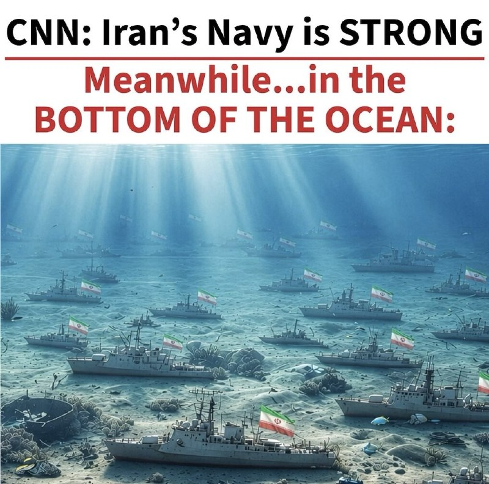

🔸ترامپ در سوشال تروث

سی‌ان‌ان: نیروی دریایی ایران قوی است
در همین حال... در کف اقیانوس:

@mwarmonitor

## pm_afshaa — post 91655

🔴ارتش اسرائیل در اقدامی فوری دستور تخلیه کامل شهر بندری صور، بزرگ ترین شهر جنوب لبنان به همراه تمام روستاهای اطراففش رو صادر کرد

💧 Rainbet.com the #1 Non-KYC Crypto Casino & Sportsbook @rainbetcom

😁 @Pm_Afshaa

## VahidOnline — post 75745

  <a href="telegram/content/VahidOnline_75745_1779892375.mp4" target="_blank">🎬 Download video</a>

خبرگزاری صداوسیما اعلام کرد به یک سند غیررسمی اولیه از چارچوب ۱۴ بندی تفاهم احتمالی میان ایران و آمریکا دسترسی پیدا کرده، سندی که به گفته رسانه‌های ایرانی، هنوز نهایی نشده اما حاوی جزئیاتی درباره وضعیت تنگه هرمز و حضور نظامی آمریکا در منطقه است.

بر اساس این گزارش، در پیش‌نویس منتشرشده آمده است که آمریکا متعهد می‌شود نیروهای نظامی خود را از اطراف ایران خارج کرده و محاصره دریایی را متوقف کند. در مقابل، تهران نیز تعهد می‌دهد ظرف مدت یک ماه، عبور کشتی‌های تجاری از تنگه هرمز را به سطح پیش از جنگ بازگرداند.

طبق مفاد این سند، کشتی‌های نظامی مشمول توافق نخواهند بود و مدیریت مسیر حرکت کشتی‌های تجاری در تنگه هرمز با همکاری ایران و سلطنت عمان انجام می‌شود.

صداوسیما همچنین گزارش داد که هنوز چارچوب نهایی تفاهم تدوین نشده و ایران تاکید کرده بدون وجود «سازوکار راستی‌آزمایی» یا همان مکانیزم اطمینان، هیچ اقدام عملی انجام نخواهد داد.
در بخش دیگری از این گزارش آمده است که اگر دو طرف طی ۶۰ روز آینده به توافق نهایی برسند، این تفاهم می‌تواند در قالب یک قطعنامه الزام‌آور در شورای امنیت سازمان ملل تصویب شود.
@VahidOOnLine

📡 @VahidOnline

## IranIntlTV — post 339248

  

میثم ظهوریان، دبیر کمیسیون اقتصادی مجلس، درباره خلاصه محورهای تفاهم‌نامه تهران و واشینگتن، در شبکه ایکس نوشت که در این تفاهم‌نامه، رفع محاصره دریایی ظرف ۳۰ روز و خروج نیروهای آمریکایی از محیط پیرامونی ایران و باز شدن تنگه هرمز ظرف ۳۰ روز از سوی جمهوری اسلامی، در نظر گرفته شده است.

ظهوریان نوشت که وعده برنامه بازسازی ۳۰۰ میلیارد دلاری برای جمهوری اسلامی در صورت امضای توافق نهایی و خاتمه تحریم‌های اولیه و ثانویه در یک برنامه زمانی در صورت توافق نهایی در بندهای این تفاهم‌نامه قرار دارد.

دبیر کمیسیون اقتصادی مجلس نوشت که عدم ساخت سلاح هسته‌ای از سوی جمهوری اسلامی و ایجاد یک ساختار رضایت‌بخش طرفین در مورد سرنوشت ذخایر اورانیوم و غنی‌سازی و تمام موارد مرتبط با برنامه هسته‌ای تهران در توافق نهایی، در تفاهم‌نامه مورد اشاره گنجانده شده است.
https://iranintl.com/202605279252

## IranIntlTV — post 339247

  <a href="telegram/content/IranIntlTV_339247_1779892377.mp4" target="_blank">🎬 Download video</a>

🔻حزب ایران نوین با ارسال نامه‌ای به فیفا، به ممنوعیت ورود پرچم شیر و خورشید به ورزشگاه‌های جام جهانی ۲۰۲۶ اعتراض کرد. در این نامه تاکید شده: «نشان شیر و خورشید نه یک نماد سیاسی، بلکه بخشی جدایی‌ناپذیر از تاریخ، فرهنگ و هویت ملی ایران است.

🔹گفتگو با میلاد فقیهی، دبیر رسانه حزب ایران نوین

@iranintltvsport

## DW_Farsi — post 125203

🔶 تشدید تهدید‌های پوتین علیه اوکراین و پاسخ آلمان

بر اساس گزارش‌ها، سرگئی لاوروف، وزیر امور خارجه روسیه، دربارiه حملات سیستماتیک بیشتر به کی‌یف، پایتخت اوکراین هشدار داده است.

به گفته او، نه فقط تاسیساتی که برای نیروهای مسلح اوکراین اهمیت دارند، بلکه "مراکز تصمیم‌گیری" نیز هدف قرار خواهند گرفت. از خارجی‌ها و دیپلمات‌ها بار دیگر خواسته شده است تا شهر را ترک کنند.
@dw_farsi

## Persian_Trend_Official — post 15125

  <a href="telegram/content/Persian_Trend_Official_15125_1779892378.webm" target="_blank">🎬 Download video</a>

⭕️ همراه اول امروز در پیامی به کاربران اینترنت پرو اعلام کرد در صورت تمایل می‌توانند اینترنت خود را به حالت قبل برگردانند.

📝 Nick

📌 @persian_trend_official
پرشین ترند | متفاوت‌ترین کانال نظامی

## RadioFarda — post 157610

  

🔸رسانه‌های ایران روز چهارشنبه ششم خرداد از وقوع دو حادثه جداگانه در عسلویه و فرودگاه امام خمینی تهران خبر دادند.

🔸به گزارش رسانه‌های داخلی، در حادثه‌ای در واحد هوای شرکت «دماوند انرژی» عسلویه، یک نفر جان باخت و دو نفر دیگر مصدوم شدند.

🔸بر اساس اطلاعیه شرکت دماوند انرژی، تیم‌های امدادی و ایمنی پس از وقوع حادثه در محل حاضر شدند و مصدومان پس از دریافت خدمات اولیه، به مراکز درمانی منتقل شدند. علت حادثه هنوز اعلام نشده است.

🔸هم‌زمان خبرگزاری مهر گزارش داد یک ساختمان اداری گمرک در شهر فرودگاهی امام خمینی دچار آتش‌سوزی شده است.

🔸بر اساس این گزارش، نیروهای آتش‌نشانی و امدادی در محل حضور دارند و هنوز جزئیاتی درباره علت حریق یا میزان خسارت و تلفات احتمالی منتشر نشده است.

@RadioFarda

## IranianMinds — post 20873

  

🔴قتل مژگان حسن‌پور به دلیل داشتن حجاب اختیاری

کانون حقوق بشر ایران گزارش داد مژگان حسن‌پور مادر یک پسر هفت ساله بعد از مشاجره با یک نیروی لباس شخصی بر سر حجاب اجباری با شلیک گلوله در لاهیجان کشته شد.

براساس این گزارش،‌ این زن ۴۶ ساله عصر پنج‌شنبه گذشته، زمانی که بر سر مزار پدر و مادرش به آرامستان آقا سیدمرتضی رفته بود، به قتل رسید. حادثه زمانی آغاز شد که یک نیروی لباس شخصی بر سر پوشیدن حجاب اجباری وارد بحث و مشاجره با این خانم شد.

@IranianMinds

## alonews — post 123074

  <a href="telegram/content/alonews_123074_1779892380.webm" target="_blank">🎬 Download video</a>

👈ترامپ برای بار هزارم این عکس رو توئیت کرد و نوشت نیروی دریایی ایران‌نابود شده

✅ @AloNews خبر جنگ

## alonews — post 123073

  <a href="telegram/content/alonews_123073_1779892380.webm" target="_blank">🎬 Download video</a>

👈صداوسیما: سند غیر رسمی اولیه از چارچوب‌بندی یادداشت تفاهم ایران و آمریکا منتشر شد

🔴آمریکا متعهد به رفع محاصره دریایی ایران شده است.

🔴در مقابل، ایران متعهد شده است تعداد کشتی‌های عبوری تجاری را طی یک ماه به سطح پیش از تنش‌ها بازگرداند که شناورهای نظامی مشمول این توافق نیستند.

🔴مدیریت و مسیر عبور و مرور کشتی‌ها با ایران و همکاری عمان انجام خواهد شد.

🔴آمریکا تعهد داده نیروهای نظامی این کشور از محیط پیرامونی ایران خارج شوند؛ این‌که نیروهای اعزامی به منطقه را شامل می شود یا نیروهای مقیم در پایگاه‌ها نیاز به مذاکره دارد.

🔴در صورت دستیابی به توافق نهایی در بازه زمانی ۶۰ روزه، این توافق در قالب یک قطعنامه الزام‌آور شورای امنیت سازمان ملل تایید خواهد شد.

🔴چارچوب تفاهم اسلام آباد هنوز نهایی نیست؛ هیچ قدمی از سوی ایران بدون «راستی‌آزمایی ملموس» برداشته نخواهد شد.

✅ @AloNews خبر جنگ

---
📅 بروزرسانی: 1405/03/06 17:53
---

## VahidOOnLine — post 242434

  <a href="telegram/content/VahidOOnLine_242434_1779891788.mp4" target="_blank">🎬 Download video</a>

♦️باستان‌شناسان دانشگاه تهران در جریان کاوش‌های آتشکده تاریخی «بازه هور» در شمال شرق ایران، موفق به شناسایی تصویری شده‌اند که بر اساس شواهد تاریخی و یافته‌های باستان‌شناسی، به احتمال زیاد چهره یزدگرد سوم، آخرین شاهنشاه ساسانی را نشان می‌دهد.
نتایج این پژوهش که با سرپرستی دکتر میثم لباف خانیکی، عضو هیات علمی گروه باستان‌شناسی دانشگاه تهران انجام شده، دی ماه ۱۴۰۴ در مقاله‌ای با عنوان «آخرین تصویر از آخرین پادشاه» در مجله علمی «شرق و غرب» (East and West) متعلق به موسسه باستان‌شناسی و مطالعات خاورمیانه و شرق دور ایتالیا (IsMEO) منتشر شده است.
کاوش‌های آتشکده «بازه هور» توسط تیم دانشگاه تهران از ۱۳۹۲ تا حدود ۱۴۰۱ شمسی در چند فصل انجام شده است و این صفحه گچبری مورد بحث مربوط به یکی از فصل‌های پایانی کاوش است. بر اساس مقاله منتشرشده، کشف این اثر احتمالا در اواخر پروژه کاوش (حدود ۱۳۹۸ تا ۱۴۰۱) انجام شده است.
به گفته دکتر لباف خانیکی، در کاوش‌های اخیر یک صفحه گچبری متعلق به اواخر دوره ساسانی در فضای ورودی آتشکده کشف شده که تنها بخش پایینی آن سالم باقی مانده است. این صفحه گچبری چهار شخصیت را نشان می‌دهد؛ یک فرد نشسته و سه فرد ایستاده در برابر او. پژوهشگران می‌گویند ویژگی‌های لباس، کفش، شلوار و تزئینات فرد نشسته با نشانه‌های شناخته‌شده پادشاهان ساسانی مطابقت دارد و او را از دیگر شخصیت‌ها متمایز می‌کند.
سرپرست این کاوش همچنین توضیح داده که کشف قطعاتی از تاج گچبری پادشاهی، نیمه‌تمام ماندن اثر و پنهان شدن آن پشت یک دیوار خشتی، از جمله شواهدی است که احتمال ارتباط این تصویر با روزهای پایانی حکومت ساسانیان را تقویت می‌کند.
بر اساس منابع تاریخی، از جمله روایت «فتوح‌البلدان»، یزدگرد سوم پس از شکست از اعراب به خراسان گریخت و احتمالا مدتی را در همین منطقه سپری کرده است. پژوهشگران اکنون این فرضیه را مطرح می‌کنند که فرد نشسته در این صفحه گچبری، همان یزدگرد سوم باشد که در واپسین روزهای زندگی خود به این آتشکده پناه آورده بود.
آتشکده بازه هور در حدود ۷۰ کیلومتری جنوب مشهد و در مسیر یکی از مهم‌ترین جاده‌های باستانی ایران قرار دارد؛ مسیری که خراسان را به سیستان، کرمان و مناطق مرکزی فلات ایران متصل می‌کرده است. کاوش‌های دانشگاه تهران از سال ۱۳۹۲ و طی هشت فصل باستان‌شناسی در این محوطه ادامه داشته و به کشف یک آتشکده بزرگ ساسانی با گچبری‌های نفیس و صفحات نقاشی دیواری منجر شده است.
بررسی‌های باستان‌شناسی نشان می‌دهد این مجموعه در اواخر دوره اشکانی بنیان گذاشته شده و تا قرون نخستین اسلامی فعال بوده است. همچنین تعداد زیادی دیوارنوشته به زبان فارسی میانه در بخش‌های مختلف بنا کشف شده که از اهمیت مذهبی و تاریخی این مکان در دوران ساسانی حکایت دارد.
‌🇸🇦 Indypersian

🤖 @VahidOOnLine

## VahidOOnLine — post 242433

  

♦️ مقتدی صدر، رهبر شیعه عراق، چهارشنبه ششم خرداد اعلام کرد گروه شبه‌نظامی سرایا السلام از جریان وابسته به او جدا شده و به ساختار رسمی دولت عراق ملحق می‌شود.

صدر در بیانیه‌ای در شبکه اجتماعی اکس گفت دستور «ادغام کامل» این گروه در نهادهای نظامی دولتی را صادر کرده و خواستار پایان وابستگی حزبی گروه‌های مسلح شده است.

رهبر جریان صدر ضمن قدردانی از اعضای سرایا السلام، خواستار وحدت زیر نظر نهادهای دولتی شد و از جناح‌های حشد الشعبی خواست از نفوذ سیاسی و فرقه‌ای فاصله بگیرند و سلاح‌های خود را به دولت تحویل دهند.

صدر تاکید کرد نیروهای سرایا السلام دیگر تحت هیچ ساختار سیاسی یا مستقل فعالیت نخواهند کرد و به بخشی از سامانه امنیتی رسمی عراق تبدیل می‌شوند. او این تصمیم را در راستای «منافع عمومی» و جلوگیری از «خطرات قریب‌الوقوع» برای عراق توصیف کرد.

صدر همچنین خواستار سازماندهی دوباره نهادهای غیرنظامی وابسته به این جریان تحت ساختاری جدید با نام «بنیان المرصوص» شد و گفت این مجموعه‌ها نباید دارای سلاح، ستاد، لباس نظامی یا عناوین رسمی باشند.

گروه سرایا السلام از سال ۲۰۱۴ به‌عنوان شاخه مسلح وابسته به جریان صدر فعالیت می‌کرد و در نبرد با داعش نقش داشت.

این بیانیه در شرایطی منتشر شده که آمریکا بارها از بغداد خواسته است نفوذ گروه‌های مسلح همسو با جمهوری اسلامی را مهار کرده و همه سلاح‌ها را تحت کنترل دولت قرار دهد.
‌🇸🇦 Indypersian

🤖 @VahidOOnLine

## WithYashar — post 12685

زلنسکی در پیامی به ترامپ:
اوکراین برای رهگیری موشک‌های بالستیک روسیه تقریباً به طور انحصاری به ایالات متحده متکی است.
سرعت فعلی تحویل موشک‌ها به اوکراین دیگر با تحولات هماهنگ نیست.
@withyashar

## WithYashar — post 12684

وزیر دفاع ترکیه یاشار گولر:
ترکیه حقوقش در دریای اژه، مدیترانه شرقی و قبرس بر اساس قانون و تاریخ است و با هر اقدامی که بخواهد وضعیت موجود را به نفع برخی کشورها تغییر دهد یا جزایر غیرنظامی را نظامی کند مخالف است.
همچنین هشدار می‌دهد که نسبت به تهدید علیه منافع و امنیتش در دریاها بی‌تفاوت نخواهد بود و ارتش ترکیه توان مقابله با هر تهدیدی را دارد.
در مورد قبرس هم تأکید می‌کند که از ترک‌های قبرس حمایت می‌کند و به‌عنوان کشور ضامن از حقوق و امنیت آن‌ها دفاع خواهد کرد.
@withyashar
ترکیه با یونان و قبرس بر سر , مرزهای دریایی , منابع گاز طبیعی در مدیترانه شرقی و حق حفاری در آب‌های مورد مناقشه اختلاف جدی دارد.

## mwarmonitor — post 9814

📌«کاخ سفید به الجزیره: رئیس‌جمهور ترامپ تنها توافقی را امضا خواهد کرد که به‌طور قطعی تضمین کند ایران هیچ‌گونه سلاح هسته‌ای در اختیار نداشته باشد.»

@mwarmonitor

## pm_afshaa — post 91654

از کانال مردمی و پادشاهی « اخبار اوین » حمایت کنید 
👑
اخبار به صورت لحظه ای پوشش میدن.
👑

⬇️
⬇️
⬇️

@Evin_khabar
@Evin_khabar

## IranIntlTV — post 339245

  <a href="telegram/content/IranIntlTV_339245_1779891790.mp4" target="_blank">🎬 Download video</a>

وزارت اطلاعات جمهوری اسلامی با انتشار بیانیه‌ای درباره عوارض و پیامدهای جنگ ۴۰ روزه و شرایط ایران گزارش داد.

مرتضی کاظمیان، عضو تحریریه ایران‌اینترنشنال، از تناقض‌های این بیانیه و نگرانی وزارت اطلاعات از دور جدید اعتراض‌های خیابانی می‌گوید.
@iranintltv

## FarsiVOA — post 218806

  

ستاد فرماندهی مرکزی ایالات متحده آمریکا، سنتکام، اعلام کرد در جریان اجرای محاصره دریایی آمریکا علیه جمهوری اسلامی، مسیر ۱۰۹ کشتی تجاری را تغییر داده است.

سنتکام این به‌روزرسانی را در شبکه اجتماعی ایکس همراه با تصویری از یک هلیکوپتر «ام اچ-۶۰ آر سی‌هاک» در حال برگشت از گشت‌زنی در دریای عرب منتشر کرده است.

ایالات متحده از اواخر فروردین ۱۴۰۵، محاصره دریایی علیه جمهوری اسلامی ایران را در واکنش به اقدام رژیم ایران در بستن تنگه هرمز آغاز کرده است.

## Persian_Trend_Official — post 15124

  <a href="telegram/content/Persian_Trend_Official_15124_1779891793.webm" target="_blank">🎬 Download video</a>

اتصال به اینترنت سخت‌تر از روزهای قبل شده. 🗿

📝 Nick

📌 @persian_trend_official
پرشین ترند | متفاوت‌ترین کانال نظامی

## BBCPersian — post 282193

  

🔻مقتدی صدر، رهبر مذهبی قدرتمند عراق، اعلام کرده است که شاخه نظامی جنبش سیاسی شیعه او در نیروهای امنیتی دولت عراق ادغام خواهد شد.

آقای صدر از سایر جناح‌های مسلح در عراق نیز خواست که همین کار را انجام دهند و سلاح‌های خود را به دولت تحویل دهند.

این اقدام در بحبوحه فشارهای فزاینده آمریکا بر عراق برای مهار نفوذ گروه‌های مسلح تحت حمایت ایران در عراق صورت می‌گیرد.

شبه‌نظامیان همسو با جنبش صدر نقش مهمی در مبارزه با نیروهای آمریکایی پس از حمله به عراق در سال ۲۰۰۳ و همچنین در نبرد علیه داعش پس از تصرف بخش بزرگی از خاک عراق در سال ۲۰۱۴، ایفا کردند.

📷EPA
https://bbc.in/4fbhBT0

@BBCPersian

## alonews — post 123072

  <a href="telegram/content/alonews_123072_1779891795.webm" target="_blank">🎬 Download video</a>

👈کاخ سفید به الجزیره گفت: رئیس جمهور ترامپ تنها توافقی را امضا خواهد کرد که به طور قطعی تضمین کند ایران هیچ سلاح هسته‌ای نخواهد داشت.

✅ @AloNews خبر جنگ

---
📅 بروزرسانی: 1405/03/06 17:42
---

## WithYashar — post 12683

به گزارش فارس نیوز، آواربرداری، تعمیرات و بازسازی تمام واحدهای پتروشیمی آسیب‌دیده تنها در ۵۰ روز به پایان رسیده است و اکنون تمام تأسیسات قادر به تولید با ظرفیت قبل از جنگ هستند.
@withyashar

## mwarmonitor — post 9813

🔴«هلند این هفته یک کشتی مین‌روب به مدیترانه اعزام می‌کند، با احتمال استقرار سریع در تنگه هرمز در صورت توافق بر سر یک مأموریت پس از جنگ. این کشتی ممکن است از اواسط ژوئن به گروه مقابله با مین ناتو بپیوندد.»

@mwarmonitor

## DEJradio — post 5037

  <a href="telegram/content/DEJradio_5037_1779891154.mp4" target="_blank">🎬 Download video</a>

🚨🎥 لحظه سقوط هواپیما اف15 آمریکا در کهکیلویه و بویر احمد.

هر دو خلبان این هواپیما به سلامت توسط نیروهای ویژه آمریکا از مرکز ایران خارج شدند.

#کهکیلویه_و_بویراحمد #جنگ
@DEJradio

## VahidOnline — post 75744

  

دونالد ترامپ در تروث‌سوشال گزارشی از جروزالم‌پست را بازنشر کرد که بر اساس اطلاعات اختصاصی «مدیا لاین» نوشته است موارد آزار و تعرض جنسی به زنان بازداشت‌شده، به‌ویژه زنان جوان، در زندان‌ها و بازداشتگاه‌های جمهوری اسلامی در دوران آتش‌بس افزایش یافته است.

در این گزارش، زنی جوان به نام کاملیا گفته پس از بازداشت خشونت‌آمیز در خانه‌اش، دو هفته همراه هشت زن دیگر، از جمله دختری ۱۶ ساله که با ساچمه از ناحیه صورت زخمی شده بود، در اتاقی ۲۰ متری نگهداری شد.

به گفته کاملیا، او پس از انتقال به سلول انفرادی و خودداری از اعتراف اجباری، در اتاق بازجویی هدف خشونت قرار گرفت، لباس‌هایش پاره شد، با باتوم مورد تجاوز قرار گرفت، به‌شدت کتک خورد و به تجاوز گروهی تهدید شد.

جروزالم‌پست همچنین با اشاره به قطع گسترده اینترنت، بازداشت‌ها، ناپدیدسازی قهری، آدم‌ربایی، تهدید روزنامه‌نگاران و مخالفان در خارج از کشور و افزایش ناگهانی اعدام مخالفان نوشت سرکوب در ایران تشدید شده است.

دونالد ترامپ پیش‌تر نیز با انتشار پستی در تروث سوشال خواستار آزادی هشت زندانی سیاسی زن در ایران شده بود.
@VahidOOnLine

📡 @VahidOnline

## VahidOnline — post 75742

وزارت اطلاعات جمهوری اسلامی روز چهارشنبه ششم خرداد هشدار داد که بعد از جنگ اخیر، «برخی کمبودها و گرانی‌ها» در پی فشارهای اقتصادی آمریکا می‌تواند باعث بروز ناآرامی‌های تازه در ایران شود.

این وزارتخانه در بیانیه‌ای مدعی شد که «تشدید فشارهای اقتصادی و متعاقب آن، انجام تحریکات گوناگون اجتماعی توسط عوامل دشمن و رسانه‌های مزدور فارسی‌زبان بیگانه، با سوء استفاده از برخی کمبودها و گرانی‌ها» یکی از محورهای مورد توجه آمریکا و اسرائیل است.

هشدار درباره احتمال ناآرامی همزمان با افزایش شدید نرخ تورم و و گرانی کالاها و همچنین انتشار گزارش‌هایی درباره کاهش شدید درآمدهای دولت جمهوری اسلامی در پی هفته‌ها محاصره دریایی آمریکا و سقوط شدید صادرات نفت ایران مطرح شده است.

این در حالی است که اعتراضات دی‌ماه سال گذشته نیز بعد از افزایش مداوم نرخ ارز در بازار و مناطق تجاری ایران آغاز و بعد از چند روز با افزایش تعداد معترضان، با خشونت شدید نیروهای امنیتی و کشتار هزاران نفر مواجه شد.

وزارت اطلاعات همچنین درباره «عملیات تروریستی و تجاوزات مرزی بویژه در شمال غرب و جنوب شرق ایران» و انواع عملیات «ترور و خرابکاری» هشدار داده و مدعی شده که آمریکا و اسرائیل به دنبال وارد کردن «انواع سلاح، مهمات و ابزار ارتباطی غیرقانونی، بویژه استارلینک» به ایران هستند.
ابراز نگرانی از رواج اینترنت ماهواره‌ای استارلینک در حالی است که بعد از ۸۸ روز قطع سراسری اینترنت در ایران، از روز سه‌شنبه شهروندان توانسته‌اند به شکل تدریجی و محدود به برخی سرویس‌های اینترنت جهانی دسترسی پیدا کنند.
@VahidHeadline
این بیانیه که با عنوان «سخنی با ولی‌نعمتان و هشداری به دشمنان» در رسانه‌های داخلی ایران منتشر شده، ادعا می‌کند که «دشمن شکست خورده در جنگ نظامی، بدنبال تولید دستآورد برای خویش، گرچه از طریق جنگ نرم، می‌باشد.»
این بیانیه در حالی صادر می‌شود که اسماعیل خطیب، وزیر اطلاعات جمهوری اسلامی در سومین هفته جنگ در حمله اسرائیل کشته شد و دولت هنوز جانشینی برای او معرفی نکرده است.

وزارت اطلاعات در این بیانیه علاوه بر اسرائیل و آمریکا، بریتانیا و اروپا را به همراهی با این دو قدرت متهم و کشورهای عرب حاشیه خلیج فارس را به‌عنوان «غلامان متمول» مسئول تامین مالی «جنگ ترکیبی تمام عیار» علیه «مردم قهرمان ایران» معرفی کرده است.
وزارت اطلاعات در این بیانیه معترضان و مخالفان جمهوری اسلامی در خارج از ایران را تهدید کرد و نوشت: «مزدوران ضد انقلاب و تروریست‌های مقیم خارج کشور و حامیان آن‌ها نیز از آتشی که می‌افروزند در امان نخواهند بود.»
@VahidOOnLine

📡 @VahidOnline

## IranIntlTV — post 339244

  <a href="telegram/content/IranIntlTV_339244_1779891157.mp4" target="_blank">🎬 Download video</a>

رسانه یوراکتیو به نقل از یک پرونده محرمانه گزارش داد اتحادیه اروپا فشار بر کشورهای عضو برای برخورد با وابستگان نظامی جمهوری اسلامی را افزایش داده است.
جزییات بیشتر با احمد صمدی، خبرنگار ایران‌اینترنشنال
@iranintltv

## FarsiVOA — post 218805

  <a href="telegram/content/FarsiVOA_218805_1779891158.mp4" target="_blank">🎬 Download video</a>

ظهر روز چهارشنبه مجتمع تجاری میدان شوش دچار آتش‌سوزی شد. به گزارش سازمان آتش‌نشانی یکی از چیلرهای روی سطح پشت بام این مجتمع تجاری شعله‌ور شده و دود و آتش در حال سرایت به نقاط دیگر مجتمع بود.

به گفته سخنگوی سازمان آتش‌نشانی شهرداری تهران این حادثه مصدومیت و تلفات جانی در پی نداشت و در حال حاضر آتش به طور کامل مهار شده است.

## DW_Farsi — post 125202

🔶 طالبان به دنبال اعزام دیپلمات‌های بیش‌تری به اروپاست

طالبان که بر افغانستان حکومت می‌کند در حال حاضر دیپلمات‌های خود را به آلمان اعزام کرده است. این گروه خواستار آن است که در آینده دیپلمات‌های خود را به کشورهای بیش‌تری در اتحادیه اروپا اعزام کند و به همین خاطر این پیشنهاد را مطرح کرده که در عوض، در بازگرداندن پناهجویان افغان از اروپا به افغانستان همکاری خواهد کرد.

طبق تحقیقات شبکه تلویزیونی و رادیویی "ان‌ار‌د" (NDR) آلمان، این خواست یکی از مطالبات اصلی هیئت طالبان در سفر برنامه‌ریزی‌شده به بروکسل است.
@dw_farsi

## idfinfarsi — post 11656

  <a href="telegram/content/idfinfarsi_11656_1779891160.mp4" target="_blank">🎬 Download video</a>

تکمیل چرخه هدف‌گیری: نیروهای تیپ ۴۰۱ تروریستی را که زنده یاد سرگرد (ذخیره) ایتمار ساپیر را به قتل رساند، به هلاکت رساندند

هفته گذشته (سه‌شنبه)، در جریان درگیری نیروهای ارتش اسرائیل در منطقه قاوزه در جنوب لبنان، یک تروریست از محدوده یک کلیسا به‌سوی نیروهای تیپ ۴۰۱ تیراندازی کرد که در نتیجه آن سرگرد (ذخیره) ایتمار ساپیر جان باخت.

بلافاصله پس از این رویداد، نیروهای تیپ تحت فرماندهی لشکر ۱۴۶ با آتش پاسخ دادند و برای به هلاکت رساندن تروریست اقدام کردند.

اکنون می‌توان تأیید کرد که تروریستی که سرگرد (ذخیره) ایتمار ساپیر را به قتل رساند، پس از شناسایی در حالی که وارد ساختمانی در محدوده کلیسا شده بود، با شلیک تانک و حمله دقیق نیروی هوایی به هلاکت رسید.

در چارچوب پشتیبانی آتش در این رویداد، ارتش اسرائیل از هوا و زمین مواضع دیده‌بانی، انبار تسلیحات و ساختمان‌هایی را که توسط سازمان تروریستی حزب‌الله برای پیشبرد طرح‌های تروریستی مورد استفاده قرار می‌گرفت، هدف قرار داد.

## Dirty_Kids — post 390322

  <a href="telegram/content/Dirty_Kids_390322_1779891161.mp4" target="_blank">🎬 Download video</a>

پاره کردن افسار توسط حامی آخوند

@Dirty_Kids 👻

## Dirty_Kids — post 390321

  

آمریکا به کاروان تیم ملی فوتبال ایران ویزا داد، ولی ساعتی!

قبلا قرار بود بازیکن‌ها تو ایالت آریزونای آمریکا مستقر بشن، ولی ترامپ گفت دوست ندارم اینا تو کشور ما بخوابن!
حالا با هماهنگی فیفا و آمریکا، کاروان تیم ملی قراره تو شهر مرزی تیخوانای مکزیک مستقر بشه و واسه هر بازی، از مکزیک به آمریکا سفر کنه و بلافاصله بعد بازی، خاک آمریکا رو ترک کنه.

نکته‌ای که هست اینه که تیخوانا به دلیل فعالیت شدید کارتل‌های مواد مخدر، قاچاق، خشونت‌های خونین و باندهای تبهکار؛
همیشه یکی از بالاترین نرخ های قتل و جرم و جنایت رو تو جهان داشته...

@Dirty_Kids 👻

## Dirty_Kids — post 390320

  

به مردمی که ۳ ماه اینترنت نداشتن برای پورن دیدن هم سرکوفت میزنین :)))
کدوم آبرو؟ دنیا ۳ ماه اینترنت نداشتین به تخمش هم نبود، دهن این مردم سرویس شد کل دنیا سوت زد حالا بیاد بگه واااای نگاه کن ایرانیا پورن نگاه کردن؟
قتل نکرده که، رفته پورن دیده. گیری کردیم با شما کسخلا.

@Dirty_Kids 👻

## alonews — post 123071

👈فارس: آواربرداری، تعمیر و ساخت بخش‌های آسیب‌دیده واحدهای پتروشیمی به پایان رسیده و اکنون تمامی پتروشیمی‌ها می‌توانند با ظرفیت قبل از جنگ تولید داشته باشند.

✅ @AloNews خبر جنگ

## alonews — post 123070

  <a href="telegram/content/alonews_123070_1779891164.mp4" target="_blank">🎬 Download video</a>

👈ثبت لحظه‌ی حمله به لانچرهای موشکی (یا پدافندی) هوافضا در اتوبان بستان‌آباد-تبریز توسط یک راننده‌ی تریلی ترکیه‌ای

✅ @AloNews خبر جنگ

---
📅 بروزرسانی: 1405/03/06 17:33
---

## VahidOOnLine — post 242432

  

دونالد ترامپ در تروث‌سوشال گزارشی از جروزالم‌پست را بازنشر کرد که بر اساس اطلاعات اختصاصی «مدیا لاین» نوشته است موارد آزار و تعرض جنسی به زنان بازداشت‌شده، به‌ویژه زنان جوان، در زندان‌ها و بازداشتگاه‌های جمهوری اسلامی در دوران آتش‌بس افزایش یافته است.

در این گزارش، زنی جوان به نام کاملیا گفته پس از بازداشت خشونت‌آمیز در خانه‌اش، دو هفته همراه هشت زن دیگر، از جمله دختری ۱۶ ساله که با ساچمه از ناحیه صورت زخمی شده بود، در اتاقی ۲۰ متری نگهداری شد.

به گفته کاملیا، او پس از انتقال به سلول انفرادی و خودداری از اعتراف اجباری، در اتاق بازجویی هدف خشونت قرار گرفت، لباس‌هایش پاره شد، با باتوم مورد تجاوز قرار گرفت، به‌شدت کتک خورد و به تجاوز گروهی تهدید شد.

جروزالم‌پست همچنین با اشاره به قطع گسترده اینترنت، بازداشت‌ها، ناپدیدسازی قهری، آدم‌ربایی، تهدید روزنامه‌نگاران و مخالفان در خارج از کشور و افزایش ناگهانی اعدام مخالفان نوشت سرکوب در ایران تشدید شده است.

دونالد ترامپ پیش‌تر نیز با انتشار پستی در تروث سوشال خواستار آزادی هشت زندانی سیاسی زن در ایران شده بود.
‌🏁 🇬🇧 IranintlTV

🤖 @VahidOOnLine

## VahidOOnLine — post 242431

♦️خبرگزاری صداوسیما اعلام کرد به یک سند غیررسمی اولیه از چارچوب ۱۴ بندی تفاهم احتمالی میان ایران و آمریکا دسترسی پیدا کرده، سندی که به گفته رسانه‌های ایرانی، هنوز نهایی نشده اما حاوی جزئیاتی درباره وضعیت تنگه هرمز و حضور نظامی آمریکا در منطقه است.
بر اساس این گزارش، در پیش‌نویس منتشرشده آمده است که آمریکا متعهد می‌شود نیروهای نظامی خود را از اطراف ایران خارج کرده و محاصره دریایی را متوقف کند. در مقابل، تهران نیز تعهد می‌دهد ظرف مدت یک ماه، عبور کشتی‌های تجاری از تنگه هرمز را به سطح پیش از جنگ بازگرداند.
طبق مفاد این سند، کشتی‌های نظامی مشمول توافق نخواهند بود و مدیریت مسیر حرکت کشتی‌های تجاری در تنگه هرمز با همکاری ایران و سلطنت عمان انجام می‌شود.
صداوسیما همچنین گزارش داد که هنوز چارچوب نهایی تفاهم تدوین نشده و ایران تاکید کرده بدون وجود «سازوکار راستی‌آزمایی» یا همان مکانیزم اطمینان، هیچ اقدام عملی انجام نخواهد داد.
در بخش دیگری از این گزارش آمده است که اگر دو طرف طی ۶۰ روز آینده به توافق نهایی برسند، این تفاهم می‌تواند در قالب یک قطعنامه الزام‌آور در شورای امنیت سازمان ملل تصویب شود.
‌🇸🇦 Indypersian

🤖 @VahidOOnLine

## WithYashar — post 12682

مهر: یک ساختمان اداری در فرودگاه امام خمینی آتش گرفت
دقایقی قبل یک ساختمان اداری در شهر فرودگاهی دچار حریق شده است.

این حریق در یک ساختمان اداری گمرک شهر فرودگاهی به وقوع پیوسته است.
تاکنون از علت دقیق حادثه و میزان خسارت و تلفات احتمالی اطلاعاتی در دست نیست.
@withyashar

## FoxNewsTwitter — post 342300

  

Fox News (Twitter/X)

Anti-ICE protests turn violent outside Delaney Hall in Newark as federal agents clash with demonstrators overnight.

The standoff is now stretching into its sixth day as protests continue outside the immigration detention center.

## IranIntlTV — post 339243

  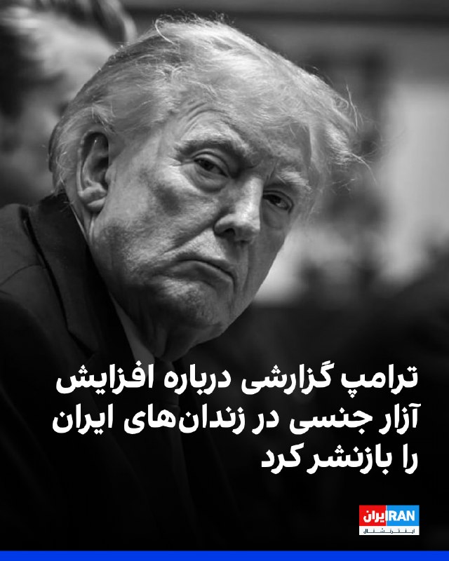

دونالد ترامپ در تروث‌سوشال گزارشی از جروزالم‌پست را بازنشر کرد که بر اساس اطلاعات اختصاصی «مدیا لاین» نوشته است موارد آزار و تعرض جنسی به زنان بازداشت‌شده، به‌ویژه زنان جوان، در زندان‌ها و بازداشتگاه‌های جمهوری اسلامی در دوران آتش‌بس افزایش یافته است.

در این گزارش، زنی جوان به نام کاملیا گفته پس از بازداشت خشونت‌آمیز در خانه‌اش، دو هفته همراه هشت زن دیگر، از جمله دختری ۱۶ ساله که با ساچمه از ناحیه صورت زخمی شده بود، در اتاقی ۲۰ متری نگهداری شد.

به گفته کاملیا، او پس از انتقال به سلول انفرادی و خودداری از اعتراف اجباری، در اتاق بازجویی هدف خشونت قرار گرفت، لباس‌هایش پاره شد، با باتوم مورد تجاوز قرار گرفت، به‌شدت کتک خورد و به تجاوز گروهی تهدید شد.

جروزالم‌پست همچنین با اشاره به قطع گسترده اینترنت، بازداشت‌ها، ناپدیدسازی قهری، آدم‌ربایی، تهدید روزنامه‌نگاران و مخالفان در خارج از کشور و افزایش ناگهانی اعدام مخالفان نوشت سرکوب در ایران تشدید شده است.

دونالد ترامپ پیش‌تر نیز با انتشار پستی در تروث سوشال خواستار آزادی هشت زندانی سیاسی زن در ایران شده بود.
https://iranintl.com/202605276729

## FarsiVOA — post 218804

  <a href="telegram/content/FarsiVOA_218804_1779890587.mp4" target="_blank">🎬 Download video</a>

در میدان پرسیدیم: آثار جنگ و درگیری نظامی بر جامعه چه بوده؟ آیا جامعه توان اعتراض در برابر حکومت را از دست داده است؟ حسین قاضیان، جامعه‌شناس می‌گوید امکان بسیج سیاسی و اجتماعی کوچک‌تر شده است

## FarsiVOA — post 218803

🔺ایال زامیر: بیشتر توانایی‌های نظامی جمهوری اسلامی نابود شده است

◾️ایال زامیر، رئیس ستاد کل ارتش اسرائیل، می‌گوید بخش عمده توانایی‌های نظامی جمهوری اسلامی در جریان اقدامات نظامی اخیر نابود شده، برنامه هسته‌ای رژیم «برای سال‌ها» به عقب بازگردانده شده، ساختار قدرت آن «عمیقا ترک برداشته»، و آینده آن با ابهام روبه‌رو است.

⬇️ بیشتر بخوانید:

https://ir.voanews.com/a/eyal-zamir-says-irans-military-capabilities-largely-destroyed/8154452.html

## FarsiVOA — post 218802

  <a href="telegram/content/FarsiVOA_218802_1779890589.mp4" target="_blank">🎬 Download video</a>

کانال تلگرام ارتش دفاعی اسرائیل به زبان فارسی، ویدیویی در روز عید قربان با پیام «اتحاد میان ادیان» منتشر و اعلام کرد: «اتحاد و همبستگی میان اقوام و ادیان، از هر تلاشی برای تفرقه‌افکنی‌ و تحریک‌ها نیرومندتر است.»

## BBCPersian — post 282192

  

‏گروهی از کاربران در شبکه اجتماعی ایکس (توییتر سابق) پست‌های انتقادی گزارش‌گونه از تحولات و رویدادهای سیاسی خارج از ایران منتشر می‌کنند، خطاب به شهروندانی که پس از حدود سه ماه به‌طور تدریجی با فیلترشکن موفق می‌‌شوند به اینترنت وصل شوند.

‏این پست‌ها که با عبارت‌هایی مانند «وقتی شما نبودید» یا «بچه‌های ایران که تازه وصل شده‌اید» آغاز می‌شود، همزمان با کاهش تدریجی اختلال در دسترسی به اینترنت، به محلی برای مستندسازی و بازاندیشی انتقادی نسبت به تحولات سیاسی‌ ۸۸ روز گذشته تبدیل شده است.

‏بسیاری از این پست‌ها لحنی آشکارا ضدجنگ دارند و در برابر عملکرد بعضی رسانه‌ها، طرفداران شاهزاده رضا پهلوی و کسانی موضع گرفته‌اند که از حملات نظامی به ایران حمایت یا از آن استقبال می‌کردند.

‏بعضی دیگر از مخالفان جمهوری اسلامی خارج از ایران هم برای مخاطبانی که به‌تازگی دوباره آنلاین شده‌اند، جمع‌بندی‌های کوتاهی از فعالیت و تجمعات به‌عنوان گزارش‌کار تهیه کردند و در پست‌هایی به اظهارنظرها و مواضع چهره‌هایی پرداختند که از نظر آن‌ها در تضاد با «مسیر انقلاب» عمل کرده بودند.
@bbcpersian

## alonews — post 123069

  <a href="telegram/content/alonews_123069_1779890593.mp4" target="_blank">🎬 Download video</a>

👈آغاز تخلیه شهر صور پس از هشدار ارتش اسرائیل

✅ @AloNews خبر جنگ

---
📅 بروزرسانی: 1405/03/06 17:23
---

## mwarmonitor — post 9812

🔸مارک لوین:

اسرائیل با حزب‌الله در لبنان می‌جنگد، زیرا:

1. حزب‌الله هر روز و به‌طور مداوم هزاران موشک و پهپاد به سوی اسرائیل شلیک می‌کند و به این کشور حمله می‌کند.
2. حزب‌الله در تلاش است شمال اسرائیل و در نهایت بخش‌هایی از مرکز این کشور را خالی از سکنه کند، زیرا اسرائیلی‌ها مجبور می‌شوند جوامع محل زندگی خود را ترک کنند.
3. دولت و ارتش لبنان ناتوان از—و یا مایل به—جلوگیری از فعالیت حزب‌الله در خاک خود هستند (گروه تروریستی اسلام‌گرای مرتبط با ایران جنگ داخلی را علیه کشوری با اکثریت مسیحی آغاز کرد و حزب‌الله کنترل نهایی، به‌ویژه بر جنوب لبنان، را در دست دارد).
4. هیچ کشور دیگری در جهان چنین تروریسمی علیه مردم خود را بدون پاسخ نظامی قاطع تحمل نمی‌کند.
5. نه، اسرائیل مسیحیان را نمی‌کشد و به‌طور تصادفی و کورکورانه جوامع را بمباران نمی‌کند؛ برخلاف ادعاهایی که اکنون برخی افراد غیرمسئول مطرح می‌کنند (بار دیگر، این‌گونه اتهامات علیه اسرائیل مطرح می‌شود، در حالی که کشورها و جنبش‌های تروریستی دیگر در واقع مسیحیان را هدف قرار می‌دهند و با انتقاد بسیار کمتری مواجه می‌شوند).
6. همه اسرائیلی‌ها و همه احزاب سیاسی این کشور در ضرورت درهم‌کوبیدن حزب‌الله متحد هستند.
7. اگر تروریست‌های اسلام‌گرا که توسط رژیم ایران پشتیبانی می‌شوند چنین اقداماتی را علیه کشور ما انجام می‌دادند، حتی برای یک لحظه هم آن را تحمل نمی‌کردیم.

@mwarmonitor

## IranIntlTV — post 339242

  <a href="telegram/content/IranIntlTV_339242_1779889998.mp4" target="_blank">🎬 Download video</a>

یک شهروند با ارسال ویدیویی به ایران‌اینترنشنال در چهارشنبه ششم خرداد یخچال خانه خود را نشان می‌دهد که به دلیل گرانی و تورم خالی است.

## BBCPersian — post 282191

🔻عضو شورای شهر تهران درباره جنگ اخیر: به۶۵۰ نقطه حمله شد و ۱۲۶۰ نفر کشته شدند

🔻یک عضو شورای شهر تهران گفته است که در جریان جنگ اخیر، ۶۵۰ نقطه پایتخت هدف قرار گرفته و ۱۲۶۰ نفر کشته شده‌اند.

مهدی بابایی، رئیس کمیته ایمنی شورای شهر تهران، به خبرگزاری ایرنا گفته است که خانواده‌های جنگ‌زده، شامل ۱۷۱۸ خانوار با ۵۷۵۹ نفر، به‌صورت موقت در ۴۶ هتل اسکان داده شدند.

آقای بابایی گفته است بیشترین حملات در تهران به مناطق ۱، ۳ و ۲۱ بوده است.

جنگ روز در نهم اسفند (۲۸ فوریه) با حملات اسرائیل و آمریکا به ایران آغاز شد و در ۱۸ فروردین (هفتم آوریل) با میانجیگری پاکستان وارد آتش‌بس موقت شد.

https://bbc.in/4uyTIt7
@BBCPersian

## BBCPersian — post 282190

  <a href="https://t.me/bbcpersian/282190" target="_blank">📎 Download file</a>

🔻دنیس راس، مدیر پیشین اداره سیاست‌گذاری وزارت خارجه آمریکا، در گفت‌وگو با برنامه ۶۰ دقیقه بی‌بی‌سی درباره چالش‌های به نتیجه رسیدن مذاکرات ایران و آمریکا گفت.

او تاکید کرد که هیچ راهبردی در قبال ایران تاکنون جواب نداده است؛ چه راهبرد آنها که به ایران امتیاز دادند و چه آنها که سیاست فشار حداکثری را پی گرفتند.

این مصاحبه را که در برنامه شصت دقیقه پنجم خرداد پخش شده، گوش دهید.

@BBCPersian

## BBCPersian — post 282189

🔻مراسم ختم اعضای خانواده خامنه‌ای این هفته برگزار می‌شود

🔻نزدیک به سه ماه پس از حمله نهم اسفند آمریکا و اسرائیل به دفتر رهبر و محل اقامت علی خامنه‌ای، که از جمله به کشته شدن او و شماری از اعضای خانواده‌اش انجامید، رسانه‌های دولتی در ایران می‌گویند که قرار است برای اعضای خانواده رهبر پیشین مجلس ختمی از سوی بازماندگان برگزار شود.

این مراسم قرار است برای یادبود زهرا حدادعادل (همسر مجتبی خامنه‌ای)، بشری خامنه‌ای (دختر بزرگ رهبر پیشین)، مصباح‌الهدی باقری (همسر دختر کوچک آقای خامنه‌ای) و نوه او، زهرا محمدی گلپایگانی، در روزهای هفتم و هشتم خرداد در شهرری در جنوب تهران برگزار شود.

در این اطلاعیه ذکر شده است که مراسم برای اعضای خانواده رهبر کشته‌شده برگزار می‌شود.

در پی حمله به دفتر و محل سکونت آقای خامنه‌ای، خبر کشته‌شدن همسر او، منصوره خجسته‌ باقرزاده هم منتشر شد اما کمتر از دو هفته بعد خبرگزاری فارس اعلام کرد که اخبار اولیه اشتباه بوده و همسر آقای خامنه‌ای «در قید حیات است.»

https://bbc.in/4u0XzOH
@BBCPersian

## alonews — post 123068

  <a href="telegram/content/alonews_123068_1779890001.webm" target="_blank">🎬 Download video</a>

👈یک ایرانی رفته جلوی کلیسای پروتستان که اصلا پاپ کاتولیک رو قبول ندارند که به اون ها بگه پاپ طرف جمهوری اسلامی رو گرفته

✅ @AloNews خبر جنگ

---
📅 بروزرسانی: 1405/03/06 17:13
---

## VahidOOnLine — post 242430

  

♦️الی کوهن، وزیر انرژی اسرائیل و عضو کابینه سیاسی-امنیتی این کشور، اعلام کرد تل‌آویو در حال پیشبرد طرح‌های راهبردی برای ایجاد مسیرهای جدید انتقال انرژی است؛ طرح‌هایی که به گفته او می‌توانند وابستگی به تنگه هرمز و تهدیدهای جمهوری اسلامی علیه مسیرهای تجاری منطقه را کاهش دهند.
به گفته وزیر انرژی اسرائیل، در روزهای اخیر گفتگوهایی درباره احداث زیرساخت‌های جدید انرژی برای انتقال نفت و گاز به اروپا از طریق اسرائیل انجام شده است. او افزود این طرح‌ها بخشی از پروژه‌های بزرگ اقتصادی و ژئوپلیتیکی در منطقه محسوب می‌شوند.
کوهن همچنین از مذاکرات درباره ایجاد خطوط انتقال انرژی از مسیر کشورهای خلیج فارس خبر داد و گفت عربستان سعودی و امارات متحده عربی، به‌عنوان بازیگران مهم بازار انرژی، علاقه‌مند به مشارکت در این پروژه‌ها هستند.
او در ادامه به طرح ایجاد یک کریدور زیرساختی میان هند و اروپا اشاره کرد؛ مسیری که قرار است از کشورهای خلیج فارس و اسرائیل عبور کند و به اروپا متصل شود. به گفته او، استفاده از ظرفیت مصر نیز می‌تواند سرعت اجرای این پروژه‌ها را افزایش دهد.
‌🇸🇦 Indypersian

🤖 @VahidOOnLine

## WithYashar — post 12681

ترامپ امروز ساعت ۱۱ به وقت محلی (حوالی ساعت ۱۹ به وقت تهران) برای بررسی مذاکرات با ایران، جلسه‌ای با اعضای کابینه و دستیاران ارشد خود خواهد داشت
@withyashar

## pm_afshaa — post 91653

vless://406d8436-0eb9-4eb2-84fb-960e076ffba6@162.159.38.183:2083?mode=stream-one&path=%2Fde&security=tls&alpn=h2%2Chttp%2F1.1&encryption=none&insecure=0&host=de.lezzatzone.ir&fp=chrome&type=xhttp&allowInsecure=0&sni=de.lezzatzone.ir#PMTV%20NEWS%F0%9F%A6%81%E2%98%80%EF%B8%8F

سرور ناپسترنت نا محدود خوراک دانلود

💧 Rainbet.com the #1 Non-KYC Crypto Casino & Sportsbook @rainbetcom

😁 @Pm_Afshaa

## IranIntlTV — post 339241

  <a href="telegram/content/IranIntlTV_339241_1779889396.mp4" target="_blank">🎬 Download video</a>

میزان دارایی‌های مسدودشده ایران در کشورهای مختلف بیش از ۱۰۰ میلیارد دلار برآورد شده است. بر اساس گزارش‌ها، بین ۲۰ تا ۳۰ میلیارد دلار از این منابع در چین مسدود شده که حاصل صادرات نفت ایران به این کشور است.
گفت‌وگو با آرش آزرمی، دبیر بخش اقتصادی ایران‌اینترنشنال
@iranintltv

## RadioFarda — post 157609

🔸وزارت اطلاعات جمهوری اسلامی روز چهارشنبه ششم خرداد هشدار داد که بعد از جنگ اخیر، «برخی کمبودها و گرانی‌ها» در پی فشارهای اقتصادی آمریکا می‌تواند باعث بروز ناآرامی‌های تازه در ایران شود. 🔸این وزارتخانه در بیانیه‌ای مدعی شد که «تشدید فشارهای اقتصادی و متعاقب…

## RadioFarda — post 157608

  

🔸وزارت اطلاعات جمهوری اسلامی روز چهارشنبه ششم خرداد هشدار داد که بعد از جنگ اخیر، «برخی کمبودها و گرانی‌ها» در پی فشارهای اقتصادی آمریکا می‌تواند باعث بروز ناآرامی‌های تازه در ایران شود.

🔸این وزارتخانه در بیانیه‌ای مدعی شد که «تشدید فشارهای اقتصادی و متعاقب آن، انجام تحریکات گوناگون اجتماعی توسط عوامل دشمن و رسانه‌های مزدور فارسی‌زبان بیگانه، با سوء استفاده از برخی کمبودها و گرانی‌ها» یکی از محورهای مورد توجه آمریکا و اسرائیل است.

🔸هشدار درباره احتمال ناآرامی همزمان با افزایش شدید نرخ تورم و و گرانی کالاها و همچنین انتشار گزارش‌هایی درباره کاهش شدید درآمدهای دولت جمهوری اسلامی در پی هفته‌ها محاصره دریایی آمریکا و سقوط شدید صادرات نفت ایران مطرح شده است.

🔸این در حالی است که اعتراضات دی‌ماه سال گذشته نیز بعد از افزایش مداوم نرخ ارز در بازار و مناطق تجاری ایران آغاز و بعد از چند روز با افزایش تعداد معترضان، با خشونت شدید نیروهای امنیتی و کشتار هزاران نفر مواجه شد.

@RadioFarda

## BBCPersian — post 282188

  <a href="telegram/content/BBCPersian_282188_1779889399.mp4" target="_blank">🎬 Download video</a>

🔻سرخط خبرهای روز چهارشنبه ۶ خرداد ۱۴۰۵
@BBCPersian

## alonews — post 123067

  <a href="telegram/content/alonews_123067_1779889401.webm" target="_blank">🎬 Download video</a>

👈ترامپ امروز ساعت ۱۱ به وقت محلی (حوالی ساعت ۱۹ به وقت تهران) برای بررسی مذاکرات با ایران، جلسه‌ای با اعضای کابینه و دستیاران ارشد خود خواهد داشت

✅ @AloNews خبر جنگ

---
📅 بروزرسانی: 1405/03/06 17:03
---

## FoxNewsTwitter — post 342299

  <a href="telegram/content/FoxNewsTwitter_342299_1779888786.mp4" target="_blank">🎬 Download video</a>

Fox News (Twitter/X)

JUST IN: Iranian state TV has published what it claims is a new draft proposal for peace with the U.S. — and it reportedly still clashes with several major American red lines.

The proposal allegedly includes demands tied to Iran’s nuclear program and future enforcement measures, while also calling for $20 billion in frozen funds to be released as part of the deal.

VP Vance says he’s hopeful an agreement can still be reached, but warned the administration is focused on securing a deal that Iran won’t violate in the future.

@JacquiHeinrich breaks down the latest developments and what could still blow up the negotiations.

## DEJradio — post 5036

  <a href="telegram/content/DEJradio_5036_1779888788.webm" target="_blank">🎬 Download video</a>

🚨
🔸 ایران فراموش‌شده در سایه بحران هرمز

گزارش: ایمان صفتی

#شاهزاده_رضا_پهلوی #تنگه_هرمز #ایران
@DEJradio

## IranIntlTV — post 339240

  <a href="https://t.me/IranintlTV/339240" target="_blank">📎 Download file</a>

🎧نسخه صوتی اخبار نیم‌روزی | چهارشنبه ۶ خرداد
@iranintlTV

## FarsiVOA — post 218801

  <a href="telegram/content/FarsiVOA_218801_1779888790.mp4" target="_blank">🎬 Download video</a>

پیشتر ارتش اسرائیل و سازمان امنیت داخلی این کشور، شاباک، اعلام کردند محمد عوده، فرمانده تازه شاخه نظامی حماس در نوار غزه، در حمله هوایی سه‌شنبه شب در شمال غزه کشته شده است.

به گزارش ارتش اسرائیل چند ساختمان در غزه که به‌عنوان محل اختفای او استفاده می‌شد هدف قرار گرفت. این حملات پس از ماه‌ها رصد اطلاعاتی برای شناسایی الگوهای رفت‌وآمد او و همکارانش انجام شد.

به گفته مقام‌های اسرائیلی، محمد عوده هفته گذشته و پس از کشته شدن عزالدین حداد، به‌عنوان رئیس شاخه نظامی سازمان تروریستی حماس منصوب شده بود.

## FarsiVOA — post 218800

چشم‌انداز تورمی که با وقوع جنگ و درگیری نظامی در ایران می‌بینیم چیست؟ معصومه طاهرخانی، اقتصاددان در میدان می‌گوید شرایط خیلی سخت‌تری در پیش است

## Dirty_Kids — post 390319

‏الان دارن روی سرور‌های سوپراپلیکیشن بله رو پلاستیک و کاور میکشن که گرد و خاک نره توش تا اینترنت ملی بعدی.

@Dirty_Kids 👻

## Dirty_Kids — post 390318

  <a href="telegram/content/Dirty_Kids_390318_1779888792.mp4" target="_blank">🎬 Download video</a>

🔴 شلواری که به تازگی مد شده و رکورد خرید توسط پسرا برای دوس دخترشون رو داشته!

@Dirty_Kids 👻

## alonews — post 123066

  <a href="telegram/content/alonews_123066_1779888793.webm" target="_blank">🎬 Download video</a>

👈ارتش اسرائیل در اقدامی بسیار غیر عادی و عجیب دستور تخلیه کامل شهر بندری صور، بزرگ ترین شهر جنوب لبنان به همراه تمام روستاهای اطراف آن را صادر کرد.

✅ @AloNews خبر جنگ

---
📅 بروزرسانی: 1405/03/06 16:52
---

## VahidOOnLine — post 242429

  

سنتکام، فرماندهی مرکزی آمریکا، در شبکه اجتماعی ایکس اعلام کرد تا شش خرداد، ۱۰۹ کشتی تجاری برای اطمینان از رعایت محاصره دریایی جنوب ایران تغییر مسیر داده شده‌اند.

سنتکام همچنین تصویری منتشر کرد که در آن یک بالگرد «ام‌اچ-۶۰آر سی‌هاوک» پس از گشت‌زنی در دریای عرب در حمایت از این محاصره، به ناوشکن «یو‌اس‌اس دلبرت دی. بلک» نزدیک می‌شود.

این ناوشکن در عملیات مرتبط با اجرای محاصره دریایی علیه ایران مشارکت دارد.
‌🏁 🇬🇧 IranintlTV

🤖 @VahidOOnLine

## mwarmonitor — post 9811

  

✈️وارد مذاکراتی برای خرید هواپیمای هشدار زودهنگام و کنترل هوابرد GlobalEye ساخت شرکت شده است؛ این خبر را ، نخست‌وزیر کانادا، اعلام کرد.

@mwarmonitor

## mwarmonitor — post 9810

🔴شبکه N12 اسرائیل گزارش داد که در صورت امضای توافق با ایران، هواپیماهای نظامی آمریکا ـ از جمله تانکرهای سوخت‌رسان نیروی هوایی آمریکا (USAF) که در اسرائیل مستقر هستند ـ انتظار می‌رود ظرف ۷۲ ساعت به پایگاه‌هایی در اروپا منتقل شوند.

🔸بر اساس این گزارش، در صورتی که درگیری با ایران از سر گرفته شود، تانکرهای نیروی هوایی آمریکا دوباره به فرودگاه بن‌گوریون بازخواهند گشت.

@mwarmonitor

## pm_afshaa — post 91652

https://t.me/proxy?server=31.220.73.93&port=443&secret=eefd4d1b6a40aef75802cb6569f0615e11636c6f7564666c6172652e636f6d

پروکسی متصل مخصوص دانلود

💧 Rainbet.com the #1 Non-KYC Crypto Casino & Sportsbook @rainbetcom

😁 @Pm_Afshaa

## pm_afshaa — post 91651

🔴حملات سنگین اسراییل به جنوب لبنان

💧 Rainbet.com the #1 Non-KYC Crypto Casino & Sportsbook @rainbetcom

😁 @Pm_Afshaa

## pm_afshaa — post 91650

از چنل مردمی و آزادی‌خواه «خبرگزاری مملکت» حمایت کنید
👑
👑
👑اخبار مهم رو لحظه‌ای پوشش میدن، جوین داشته باشیدش
❤️‍🔥

https://t.me/mameleekat

## DEJradio — post 5035

  <a href="telegram/content/DEJradio_5035_1779888166.mp4" target="_blank">🎬 Download video</a>

👑🎥 سه‌شنبه‌های نه به اعدام؛ تجمع ایرانیان ملی‌گرا مقیم هامبورگ

#همبستگی #هامبورگ
@DEJradio

## IranIntlTV — post 339239

  

سنتکام، فرماندهی مرکزی آمریکا، در شبکه اجتماعی ایکس اعلام کرد تا شش خرداد، ۱۰۹ کشتی تجاری برای اطمینان از رعایت محاصره دریایی جنوب ایران تغییر مسیر داده شده‌اند.

سنتکام همچنین تصویری منتشر کرد که در آن یک بالگرد «ام‌اچ-۶۰آر سی‌هاوک» پس از گشت‌زنی در دریای عرب در حمایت از این محاصره، به ناوشکن «یو‌اس‌اس دلبرت دی. بلک» نزدیک می‌شود.

این ناوشکن در عملیات مرتبط با اجرای محاصره دریایی علیه ایران مشارکت دارد.
https://iranintl.com/202605278078

## FarsiVOA — post 218799

🔺با دستور مقتدی صدر گروه «سرایا السلام» به دولت عراق می‌پیوندد؛ ضربه‌ای دیگر به ساختار نیابتی‌های رژیم ایران

▪️مقتدی الصدر، یکی از رهبران مذهبی برجسته شیعیان عراق، جدایی «سرایا السلام» از جریان شیعی و الحاق آن به دولت عراق را اعلام کرد.

⬇️ بیشتر بخوانید:

https://ir.voanews.com/a/orders-saraya-al-salam-s-integration-into-iraqi-state/8154441.html/?nocach=1

## IranianMinds — post 20872

  <a href="telegram/content/IranianMinds_20872_1779888169.mp4" target="_blank">🎬 Download video</a>

طرفداران حکومت😂😂😂

@IranianMinds

## Hranews — post 113196

  

مجتبی بهزادیان، مدیرکل دفتر نظارت بر عرضه و نمایش فیلم، اعلام کرد که موضوعات مطرح‌شده درباره فیلم «تهران کنارت» به انتشار یک ویدیوی تبلیغاتی «خارج از رویه‌های سازمان سینمایی» بازمی‌گردد. به گفته وی، آنچه موجب واکنش نهادهای مسئول شده، استفاده از صدای یک خواننده زن در این ویدیو عنوان شده است.

لازم به ذکر است؛ مرکز رسانه قوه قضاییه چند روز پیش از تشکیل پرونده قضایی علیه دست‌اندرکاران این فیلم به دلیل آنچه «محتوای غیراخلاقی و مغایر با عفت عمومی» خبر داده بود. همچنین رئیس سازمان سینمایی کشور نیز در ارتباط با صدور پروانه نمایش این فیلم به مرجع قضایی احضار شده بود.

↘️
@hranews_bot تماس ✉️ - @Hranews کانال هرانا 🆑

## alonews — post 123063

  <a href="telegram/content/alonews_123063_1779888171.webm" target="_blank">🎬 Download video</a>

👈جنگنده‌های اسرائیلی حملات هوایی به بریتال، کفر حونه و ملیخ در لبنان انجام داده‌اند

✅ @AloNews خبر جنگ

## alonews — post 123062

  <a href="telegram/content/alonews_123062_1779888171.webm" target="_blank">🎬 Download video</a>

👈اسرائیل شدید داره به حزب الله حمله میکنه از وزارت خارجه گفتن امکان توقف مذاکره اولیه و انسداد کامل هرمز هست

🔴یعنی نتم ممکنه دوباره قطع کنن

✅ @AloNews خبر جنگ

---
📅 بروزرسانی: 1405/03/06 16:42
---

## VahidOOnLine — post 242428

  

محمود نبویان، عضو کمیسیون امنیت ملی مجلس جمهوری اسلامی، در شبکه ایکس نوشت که جمهوری اسلامی عضو پیمان منع گسترش سلاح‌های هسته‌ای (ان‌پی‌تی) است و پرسید چرا باید به آمریکا بعد از حمله و کشته شدن خامنه‌ای درباره موضوعات هسته‌ای تعهد بدهد.

او افزود: «اساسا به آمریکا چه ربطی دارد که نوع استفاده ایران از انرژی هسته‌ای باید چگونه باشد.»
‌🏁 🇬🇧 IranintlTV

🤖 @VahidOOnLine

## VahidOOnLine — post 242427

  

♦️صادق خان، شهردار مسلمان لندن، تصاویری از حضور خود در شهر مکه و مراسم حج را در صفحه فیسبوکش منتشر کرد؛ تصاویری که او را با لباس احرام در میان میلیون‌ها زائر از کشورهای مختلف نشان می‌دهد.
خان در توضیح این تصاویر نوشت که حضور در حج برای او «افتخار و نعمتی بزرگ» بوده و این سفر را تجربه‌ای عمیقا دگرگون‌کننده توصیف کرد. او نوشت: «حج نماد برابری، وحدت و انسانیت مشترک ماست.»
شهردار لندن با اشاره به پوشیدن لباس ساده احرام تاکید کرد که ایستادن در کنار میلیون‌ها مسلمان از سراسر جهان، یادآور این حقیقت است که همه انسان‌ها در برابر خدا برابر هستند. او همچنین حج را سفری برای فروتنی، بخشش و تولدی دوباره از مسیر خودسازی دانست.
صادق خان در بخش دیگری از پیامش نوشت که حج تنها مجموعه‌ای از مناسک فیزیکی در گرمای شدید صحرای عربستان نیست، بلکه فرصتی معنوی و کم‌نظیر برای تامل عمیق‌تر در ایمان و ارتباط با خداوند به شمار می‌رود.
او همچنین اعلام کرد مردم لندن و تمام کسانی را که در سراسر جهان با مشکلات و سختی روبه‌رو هستند، در دعاهای خود فراموش نخواهد کرد.
‌🇸🇦 Indypersian

🤖 @VahidOOnLine

## FoxNewsTwitter — post 342298

  

Fox News (Twitter/X)

WATCH LIVE: Teachers union boss Randi Weingarten unveils national framework on screens and AI https://twitter.com/i/broadcasts/1AxRnnZVPAjxl

## DEJradio — post 5034

  <a href="telegram/content/DEJradio_5034_1779887552.mp4" target="_blank">🎬 Download video</a>

👑🎥 پرفورمنس «نه به اعدام» در هانوفر؛ روایت جنایات جمهوری اسلامی برای افکار عمومی

#همبستگی #هانوفر
@DEJradio

## IranIntlTV — post 339238

اپلیکیشن مشترک طالبان و جمهوری اسلامی و نگرانی از صادرات الگوی سرکوب تهران

پلتفرم تحقیقات و دفاع سایبری «رازنت» پس از بررسی گزارش اخیر افغانستان‌اینترنشنال درباره همکاری فنی طالبان و جمهوری اسلامی برای توسعه یک اپلیکیشن، هشدار داد این برنامه می‌تواند به «مساله‌ای جدی» در حوزه امنیت کاربران، حریم خصوصی و رصد دیجیتال تبدیل شود.

رازنت چهارشنبه ششم خرداد با اشاره به گزارش افغانستان‌اینترنشنال نوشت «همکاری احتمالی میان دو ساختار اقتدارگرا که هر دو سابقه یا انگیزه روشن برای کنترل اطلاعات، محدود کردن جامعه مدنی و زیر نظر گرفتن مخالفان دارند»، موضوعی حساسیت‌برانگیز است.

رازنت افزود در پی انتشار این گزارش، اپلیکیشن صفحه‌کلید وابسته به رادیو و تلویزیون افغانستان، موسوم به «کیبورد ملی»، را مورد بررسی قرار داد.
این ارزیابی با استفاده از روش «تحلیل ایستا» انجام گرفت که «کد، مجوزها، نقاط ارتباطی، داده‌های سخت‌کدشده، لاگ‌ها و ساختار امنیتی اپلیکیشن» را شامل می‌شد.

این پلتفرم امنیت سایبری خبر داد بر اساس ارزیابی‌های صورت‌گرفته، این اپلیکیشن «به‌دلیل ماهیتش به‌عنوان کیبورد و به‌دلیل ضعف‌های امنیتی شناسایی‌شده، برای کاربران بسیار نگران‌کننده است».

افغانستان‌اینترنشنال ۱۷ اردیبهشت به نقل از منابع آگاه گزارش داد طالبان و جمهوری اسلامی در توسعه یک اپلیکیشن تلفن همراه همکاری کرده‌اند که طبق اطلاعات رسیده، از توانایی رصد کاربران داخل افغانستان برخوردار است.

منابع آگاه هشدار دادند این اپلیکیشن دارای قابلیت‌های نظارتی و امنیتی است و احتمالا امکان دسترسی به تلفن‌های همراه و دستگاه‌های متصل به اینترنت کاربران را فراهم می‌کند.

خطر افشای گذرواژه‌ها و پیام‌های خصوصی
به گزارش رازنت، بررسی فنی «کیبورد ملی» طالبان نشان داد کلید دسترسی سامانه هوش مصنوعی به‌صورت ثابت در کد آن قرار داده شده است. این بدان معناست که این برنامه، متن کاربران را برای پردازش به یک «زیرساخت بیرونی» ارسال می‌کند.

رازنت نوشت چنین رفتاری در برنامه‌های صفحه‌کلید حساسیت بالایی دارد، زیرا داده‌های تایپ‌شده ممکن است شامل پیام خصوصی، گذرواژه، اطلاعات مالی یا محتوای محرمانه سیاسی باشد و نیاز به اطلاع‌رسانی شفاف دارد.

همچنین بر اساس ارزیابی این پلتفرم تحقیقاتی، «کیبورد ملی» برخی داده‌های حساس، از جمله متن ترجمه‌شده کاربر، پاسخ‌های سامانه و جزییات خطا را در لاگ‌های اندروید ذخیره می‌کند و این مساله، خطر افشای اطلاعات را، به‌ویژه در دستگاه‌های ناامن یا تحت بررسی فنی، افزایش می‌دهد.

رازنت در ادامه نوشت: «اهمیت این گزارش فقط به افغانستان محدود نمی‌شود. این پرونده در امتداد پرسش بزرگ‌تری قرار می‌گیرد: آیا جمهوری اسلامی در حال تبدیل تجربه داخلی خود در سرکوب دیجیتال، نظارت، کنترل ارتباطات و ابزارهای مبتنی بر داده، به یک ظرفیت صادراتی است؟»

تیرماه ۱۴۰۴، وب‌سایت هکرنیوز خبر داد پژوهشگران نمونه‌های جدیدی از ابزارهای جاسوسی اندرویدی را کشف کرده‌اند که به احتمال زیاد با وزارت اطلاعات جمهوری اسلامی مرتبط هستند.

هکرنیوز افزود این برنامه‌ها با جعل اپلیکیشن‌های وی‌پی‌ان و سرویس اینترنت ماهواره‌ای استارلینک، در اختیار کاربران قرار گرفته‌اند.

امنیت کاربران آسیب‌پذیر در خطر است
رازنت در انتهای گزارش خود درباره «کیبورد ملی» طالبان نوشت: «این تحلیل جاسوس‌افزار بودن عمدی اپلیکیشن را به‌طور قطعی ثابت نمی‌کند، اما مجموعه رفتارها و تصمیم‌های فنی شناسایی‌شده، محیطی پرخطر برای سوءاستفاده، نظارت یا افشای ناخواسته داده‌های حساس کاربران ایجاد می‌کند.»

این پلتفرم هشدار داد استفاده از این اپلیکیشن برای «کاربران آسیب‌پذیر» از جمله روزنامه‌نگاران، فعالان مدنی، زنان و مخالفان طالبان، تا پیش از انجام اصلاحات، شفاف‌سازی فرایند پردازش داده‌ها و اعتبارسنجی امنیتی از سوی نهادهای مستقل، توصیه نمی‌شود.

رازنت افزود «کیبورد ملی» می‌تواند یکی از نمونه‌های اولیه از الگویی باشد که در آن، «فناوری‌های ظاهرا خدماتی در محیط‌های اقتدارگرا به بخشی از زیرساخت بالقوه کنترل اجتماعی تبدیل می‌شوند».

پیش‌تر در اردیبهشت ۱۴۰۲، شرکت امنیت سایبری «لوک‌اوت» گزارش داد فرماندهی انتظامی جمهوری اسلامی با نصب جاسوس‌افزار روی تلفن همراه برخی افراد بازداشت‎‌شده، از جمله اقلیت‌های قومی و مذهبی، تلاش کرده است تا پس از آزادی از آن‌ها جاسوسی کند.
 
🔗وب‌سایت ایران‌اینترنشنال
@iranintltv

## IranIntlTV — post 339237

ارم‌نیوز: آمریکا سپر دفاع موشکی خود را در خاورمیانه گسترش می‌دهد

رسانه ارم‌نیوز به نقل از منابع نظامی آگاه گزارش داد ایالات متحده در حال حرکت به ‌سوی گسترش استقرار موشک‌های رهگیر در خاورمیانه است تا مانع از تهدیدات جمهوری اسلامی علیه کشورهای منطقه شود و توانایی‌های تهران را برای انجام حملات تضعیف کند.

این منابع که به محافل تصمیم‌گیری در کاخ سفید نزدیک هستند، چهارشنبه ششم خرداد در مصاحبه با ارم‌نیوز گفتند نگرانی متحدان واشینگتن در خاورمیانه نسبت به نتایج هرگونه توافق احتمالی با حکومت ایران، فشار مضاعفی بر دولت آمریکا وارد کرده است.

بر اساس این گزارش، ایالات متحده در تلاش است با اتخاذ تدابیری جدید، به شرکای خود اطمینان داده و سطح اعتماد در ائتلاف‌های منطقه‌ای را تقویت کند.
ارم‌نیوز افزود رویکرد جامع آمریکا در قبال پرونده تهران بر مهار «برنامه‌های تسلیحاتی، هسته‌ای و توسعه‌طلبانه» جمهوری اسلامی از طریق «توافق‌های الزام‌آور» استوار است.

هم‌زمان توانمندی‌های متحدان منطقه‌ای با سامانه‌های دفاعی پیشرفته تقویت خواهد شد تا بتوانند در برابر هرگونه «تهدید یا ماجراجویی نظامی»، از توان بازدارندگی برخوردار باشند.

جمهوری اسلامی از زمان آغاز جنگ اخیر در ۹ اسفند ۱۴۰۴، شماری از کشورهای منطقه از جمله امارات متحده عربی، عربستان سعودی، بحرین، اردن، قطر و کویت را هدف قرار داده است.

در روزهای اخیر، گمانه‌زنی‌ها درباره سرنوشت مذاکرات تهران و واشینگتن و مفاد توافق احتمالی دو طرف بالا گرفته است.

در این میان، مساله چگونگی تضمین امنیت کشورهای حوزه خلیج‌ فارس در این توافق احتمالی، به یکی از پرسش‌های کلیدی تبدیل شده است.

این در حالی است که شماری از مقام‌های جمهوری اسلامی یکی از شروط تهران برای توافق با واشینگتن را خروج ارتش آمریکا از منطقه عنوان کرده‌اند.

تغییر معادلات بازدارندگی با افزایش تولید موشک‌های رهگیر
ارم‌نیوز در ادامه نوشت موضع قاطع کشورهای خاورمیانه در خصوص ضرورت مقابله با هرگونه تهدید جمهوری اسلامی در منطقه دریای عرب و تنگه هرمز، نقشی کلیدی در شکل‌گیری رویکرد تسلیحاتی آمریکا ایفا کرده است.

بر اساس این گزارش، رویکرد آمریکا بر تامین امنیت میدان‌های گاز و نفت و حفاظت از خطوط کشتیرانی بین‌المللی در دریای سرخ و باب‌المندب در برابر تهدیدات بالستیک تمرکز دارد.

تحلیلگران نظامی معتقدند افزایش کمی و کیفی تولید موشک‌های رهگیر می‌تواند معادلات بازدارندگی را تغییر دهد و راهبردهای مبتنی بر «اشباع موشکی و پهپادی» را با چالش جدی مواجه کند.

به باور ناظران، جمهوری اسلامی که پیش‌تر از کاهش سرعت تولید مهمات رهگیر و همچنین استفاده گسترده و غیرهدفمند از سامانه‌های دفاعی در برخی درگیری‌ها سود برده بود، اکنون با شرایط دفاعی تازه‌ای روبه‌رو خواهد شد.

طبق ارزیابی‌های نظامی، واشینگتن با توسعه و استقرار نسل دوم موشک‌های رهگیر (NGI) در پی تقویت توان دفاعی خود در برابر پیشرفت‌های موشکی چین و روسیه، به‌ویژه در حوزه موشک‌های هایپرسونیک و بالستیک قاره‌پیماست.

۳۱ اردیبهشت، روزنامه واشینگتن‌پست گزارش داد ایالات متحده در جریان دفاع از اسرائیل در برابر حملات جمهوری اسلامی در جنگ اخیر، بیش از نیمی از ذخایر موشک‌های رهگیر «تاد» خود را مصرف کرده است.

نقش «لاکهید مارتین» در تقویت بازدارندگی آمریکا و متحدانش
ارم‌نیوز در ادامه گزارش داد شرکت آمریکایی «لاکهید مارتین» عملیات احداث یک مرکز جدید تولید مهمات را در شهر تروی واقع در ایالت آلاباما آغاز کرده است. این مرکز «ساختمان ۴۷» نام‌گذاری شده است.

بر اساس این گزارش، این مجموعه در مرحله نخست برای پشتیبانی از تولید موشک‌های رهگیر سامانه دفاعی تاد طراحی شده و بخش‌هایی از آن نیز به توسعه نسل جدید موشک‌های رهگیر اختصاص خواهد یافت.

جیم تایکلت، رییس هیات‌مدیره و مدیرعامل لاکهید مارتین، از آمادگی این شرکت برای پاسخ به افزایش تقاضا در حوزه توسعه ظرفیت تولید تسلیحات خبر داد و اعلام کرد یک میلیارد دلار در پروژه جدید این شرکت سرمایه‌گذاری شده است.

به گفته او، هدف از این سرمایه‌گذاری تقویت توان بازدارندگی و تسریع در تحویل سامانه‌های دفاعی پیشرفته به نیروهای عملیاتی و متحدان آمریکا است.

لاکهید مارتین همچنین برنامه‌هایی برای احداث تاسیسات جدید و گسترش پروژه‌های پشتیبانی در دست اجرا دارد. برنامه‌هایی که شامل توسعه موشک‌های نسل دوم، موشک «ای‌جی‌ام-۱۵۸» و سامانه «سلاح واکنش سریع هوایی» می‌شود.

در همین راستا، این شرکت برای افزایش سرعت تولید مهمات، توافق‌نامه‌ای با وزارت جنگ آمریکا امضا کرده که به‌دنبال آن، تولید سامانه «پاتریوت پک-۳ ام‌اس‌ای» سه برابر و تولید سامانه دفاع موشکی تاد، چهار برابر شده است.

تولید موشک‌های حملات هدفمند نیز افزایش یافته است.

🔗وب‌سایت ایران‌اینترنشنال
@iranintltv

## IranIntlTV — post 339236

  

محمود نبویان، عضو کمیسیون امنیت ملی مجلس جمهوری اسلامی، در شبکه ایکس نوشت که جمهوری اسلامی عضو پیمان منع گسترش سلاح‌های هسته‌ای (ان‌پی‌تی) است و پرسید چرا باید به آمریکا بعد از حمله و کشته شدن خامنه‌ای درباره موضوعات هسته‌ای تعهد بدهد.

او افزود: «اساسا به آمریکا چه ربطی دارد که نوع استفاده ایران از انرژی هسته‌ای باید چگونه باشد.»
https://iranintl.com/202605274579

## RadioFarda — post 157607

🔸ویدئویی که روز چهارشنبه ۶ خرداد در شبکه‌های اجتماعی منتشر شده لحظه شادی نیروهای امدادی پس از پیدا شدن پنج نفر زنده در یک غار در لائوس را نشان می‌دهد؛ افرادی که حدود یک هفته در غار گرفتار بودند.

🔸به گزارش رویترز، عملیات جست‌وجو برای یافتن دو نفر دیگر همچنان ادامه دارد و ده‌ها امدادگر لائوسی و تایلندی در این عملیات مشارکت دارند.

🔸بر اساس گزارش رسانه‌های دولتی لائوس، هفت نفر هفته گذشته برای جست‌وجوی طلا وارد غاری در استان «زایسامبون» شده بودند، اما بارندگی شدید و رانش زمین راه خروج آن‌ها را مسدود کرد.

🔸یک گروه داوطلب تایلندی نیز از روز یکشنبه به عملیات نجات پیوسته است. در میان اعضای این گروه، غواصی حضور دارد که در عملیات مشهور نجات تیم فوتبال نوجوانان تایلندی از غاری سیل‌زده در سال ۲۰۱۸ مشارکت داشت.

@RadioFarda

## Hranews — post 113195

  

شایان هوشیار به بیش از ۳ سال حبس محکوم شد

❗️
❗️
❗️
❗️
❗️– شایان هوشیار، پژوهشگر و دانشجوی دکترای تاریخ ایران توسط شعبه اول دادگاه انقلاب ارومیه به سه سال و هشت ماه حبس محکوم شد.

به گزارش خبرگزاری هرانا، ارگان خبری مجموعه فعالان حقوق بشر در ایران، شایان هوشیار، پژوهشگر و دانشجوی دکترای تاریخ ایران به حبس محکوم شد.

این حکم اخیرا توسط شعبه اول دادگاه انقلاب ارومیه صادر و به مسعود شمس نژاد، وکیل مدافع شایان هوشیار ابلاغ شده است. بر اساس رای صادره آقای هوشیار به سه سال و هشت ماه حبس محکوم شده است.

#شایان_هوشیار

ادامه مطلب

↘️
@hranews_bot تماس ✉️ - @Hranews کانال هرانا 🆑

## alonews — post 123061

  <a href="telegram/content/alonews_123061_1779887555.webm" target="_blank">🎬 Download video</a>

👈آخرین قیمت نفت ۹۵.۱۰ دلار

✅ @AloNews خبر جنگ

## alonews — post 123060

  

پزشکیان وقتی میبینه همه جا نوشتن با دستور رییس‌جمهور اینترنت بین الملل متصل شد:

[@AloTweet]

---
📅 بروزرسانی: 1405/03/06 16:33
---

## VahidOOnLine — post 242426

  

♦️دونالد ترامپ، رئیس‌جمهوری آمریکا در شبکه اجتماعی «تروث سوشال» گزارشی از روزنامه اورشلیم پست را بازنشر کرد، گزارشی که حدود یک ماه پیش منتشر شده و به افزایش شدید آزار و تعرض جنسی علیه زنان بازداشت‌شده در زندان‌ها و بازداشتگاه‌های جمهوری اسلامی می‌پردازد.
در این مقاله که به نقل از «مدیا لاین» منتشر شده، آمده است همزمان با تشدید فضای امنیتی و سرکوب داخلی در دوره آتش‌بس، موارد نقض حقوق بشر در ایران به شکل قابل‌توجهی افزایش یافته است؛ از جمله قطع گسترده اینترنت، بازداشت فعالان، ناپدیدسازی اجباری، تهدید روزنامه‌نگاران، افزایش اعدام‌ها و گزارش‌های متعدد از شکنجه و تعرض جنسی در بازداشتگاه‌ها.
در بخشی از این گزارش، زنی جوان روایت می‌کند که در جریان بازجویی مورد تعرض جنسی قرار گرفته و ماموران درشت‌اندام با باتوم او را شکنجه کرده‌اند. او گفته رفتار ماموران به‌قدری خشونت‌آمیز بوده که آثار جسمی و روانی آن همچنان با او مانده است.
همچنین زنی معترض به نام «کاملیا» که اخیرا از بازداشت آزاد شده، به «مدیا لاین» گفته نیمه‌شب گروهی از نیروهای مسلح و نقاب‌دار به خانه‌اش یورش بردند و او را مقابل شریک زندگی‌اش بازداشت کردند. به گفته او، شریکش پس از اعتراض به رفتار ماموران به‌شدت کتک خورده و خودش نیز در زمان انتقال و بازداشت تحت آزار جنسی قرار گرفته است.
کاملیا همچنین گفته دو هفته را در اتاقی ۲۰ متری همراه با ۸ زن دیگر سپری کرده؛ از جمله دختری ۱۶ ساله که با اصابت ساچمه به صورتش زخمی شده بود اما بدون درمان مناسب در بازداشت نگهداری می‌شد و تنها زخم‌هایش را پانسمان کرده بودند.
در بخش دیگری از این گزارش به وضعیت سه زندانی سیاسی زن، شریفه محمدی، پخشان عزیزی و وریشه مرادی اشاره شده که پس از تایید حکم اعدامشان، در خطر اجرای حکم قرار دارند.
‌🇸🇦 Indypersian

🤖 @VahidOOnLine

## VahidOOnLine — post 242425

  

خبرگزاری یونهاپ گزارش داد وزارت خارجه کره جنوبی چهارشنبه سعید کوزه‌چی، سفیر جمهوری اسلامی در سئول، را احضار کرد و نسبت به حمله به کشتی «اچ‌ام‌ام نامو» در تنگه هرمز اعتراض رسمی ارائه داد.

پارک یون‌جو، معاون اول وزیر خارجه کره جنوبی، گفت بررسی‌های فنی نشان می‌دهد دو شیء پرنده‌ای که ۱۴ اردیبهشت به این کشتی برخورد کردند، احتمالا موشک‌های ضدکشتی «نور» ساخت ایران بوده‌اند.

به گفته او، یکی از کلاهک‌ها منفجر نشد اما دیگری هنگام برخورد انفجار و آتش‌سوزی در کشتی ایجاد کرد. در این حادثه یکی از ۲۴ خدمه کشتی زخمی شد.
‌🏁 🇬🇧 IranintlTV

🤖 @VahidOOnLine

## WithYashar — post 12680

واقعا این ملت باید به دیکتاتور وطن پرست بالا سرشون باشه . ملتی که جمهوری اسلامی پرورش داده جز دزدی بی فکری پاچه خوار تو اوج بیسوادی ولی ادعای دانشمند بودن میکنن آدم فروشی ...... اینا با دموکراسی درست نمیشن فقط باید یه دیکتاتور بالا سرشون باشه مثل رضا خان بزرگ . این جماعت تو هر لحظه رنگ عوض میکنن در این حد احمق حالا یه عده میگن توهین میکنی با کلمه احمق ولی توهین نیس واقعیته یه واقعیت تلخ . حکومت هر کشوری طبق لیاقت مردمش اداره و اجرا میشه واقعا متاسفم پاسوز یه عده جوگیر احمق شدیم

## WithYashar — post 12679

درووود بهت یاشار عزیز،همین که توی حاشیه اصلا حرکت نمیکنی یعنی کارت درسته.فقط(( هدف ))مهمه تمام.

## WithYashar — post 12678

درووود بهت یاشار عزیز،همین که توی حاشیه اصلا حرکت نمیکنی یعنی کارت درسته.فقط(( هدف ))مهمه تمام.

## mwarmonitor — post 9809

  <a href="telegram/content/mwarmonitor_9809_1779887016.mp4" target="_blank">🎬 Download video</a>

🔸ناتو امروز در حال انجام عملیات گسترده‌ای بر فراز دریای شمال برای شناسایی و شکار زیردریایی‌های روسیه است؛ هم‌زمان، یک فروند هواپیمای شناسایی Rivet Joint بریتانیا در حال انجام مأموریت‌های اطلاعاتی برای رصد تجمع نیروهای روسیه در نزدیکی دریای بالتیک است.

@mwarmonitor

## FoxNewsTwitter — post 342297

  

Fox News (Twitter/X)

Trump-backed candidates just keep winning.

After big wins in Texas last night, every single Senate, House, and gubernatorial candidate endorsed by President Trump this year has advanced to the general election so far, giving him a perfect record heading into November.

## pm_afshaa — post 91649

vless://406d8436-0eb9-4eb2-84fb-960e076ffba6@162.159.38.183:2083?encryption=none&security=tls&sni=de.lezzatzone.ir&alpn=h2%2Chttp%2F1.1&fp=chrome&type=tcp&headerType=none#PMTV%20NEWS%20%F0%9F%A6%81%E2%98%80%EF%B8%8F

v2ray سرعت بالا نامحدود مخصوص دانلود

💧 Rainbet.com the #1 Non-KYC Crypto Casino & Sportsbook @rainbetcom

😁 @Pm_Afshaa

## pm_afshaa — post 91648

🔴رئیس ستاد ارتش اسرائیل : ساختار رژیم آیت‌الله‌ها شدیداً ترک برداشته و آینده و ثباتش تو هاله‌ای از ابهامه

💧 Rainbet.com the #1 Non-KYC Crypto Casino & Sportsbook @rainbetcom

😁 @Pm_Afshaa

## pm_afshaa — post 91647

https://t.me/proxy?server=fn.b2-ray.ru&port=2233&secret=1a78cb0260dffe00aa646e398185a157

پروکسی متصل

💧 Rainbet.com the #1 Non-KYC Crypto Casino & Sportsbook @rainbetcom

😁 @Pm_Afshaa

## IranIntlTV — post 339235

  

خبرگزاری یونهاپ گزارش داد وزارت خارجه کره جنوبی چهارشنبه سعید کوزه‌چی، سفیر جمهوری اسلامی در سئول، را احضار کرد و نسبت به حمله به کشتی «اچ‌ام‌ام نامو» در تنگه هرمز اعتراض رسمی ارائه داد.

پارک یون‌جو، معاون اول وزیر خارجه کره جنوبی، گفت بررسی‌های فنی نشان می‌دهد دو شیء پرنده‌ای که ۱۴ اردیبهشت به این کشتی برخورد کردند، احتمالا موشک‌های ضدکشتی «نور» ساخت ایران بوده‌اند.

به گفته او، یکی از کلاهک‌ها منفجر نشد اما دیگری هنگام برخورد انفجار و آتش‌سوزی در کشتی ایجاد کرد. در این حادثه یکی از ۲۴ خدمه کشتی زخمی شد.
https://iranintl.com/202605272150

## IranIntlTV — post 339234

  <a href="telegram/content/IranIntlTV_339234_1779887021.mp4" target="_blank">🎬 Download video</a>

هفته دوم دادگاه رسیدگی به پرونده حمله به پوریا زراعتی، مجری ایران‌اینترنشنال، در دادگاه وولیچ لندن آغاز شده است. دادستان گفت این حمله از سوی نیروهای نیابتی جمهوری اسلامی انجام شده و مهاجمان برای حمله به زراعتی پول دریافت کردند.
یکی از متهمان در دادگاه گفت نمی‌دانسته به چه کسی حمله می‌کند و بعدتر از طریق رسانه‌ها متوجه شده قربانی، روزنامه‌نگار ایرانی بوده است.

تاج‌الدین سروش، خبرنگار ایران‌اینترنشنال، گزارش می‌دهد
@iranintltv

## FarsiVOA — post 218798

🔺پرزیدنت ترامپ مقاله‌ای درباره سرکوب معترضان و افزایش نقض حقوق بشر در ایران را بازنشر کرد

▪️دونالد ترامپ، رئیس جمهوری ایالات متحده، روز چهار‌شنبه ۶ خرداد مقاله‌ای از روزنامه «جروزالم پست» درباره سرکوب معترضان و افزایش شدید سوءاستفاده جنسی در زندان‌های ایران همزمان با آتش‌بس را در حساب کاربری خود در شبکه اجتماعی تروت سوشال بازنشر کرد.

⬇️ بیشتر بخوانید:

https://ir.voanews.com/a/president-trump-posts-jpost-article-on-iran-human-rights-abuses/8154440.html/?nocach=1

## IranianMinds — post 20871

  

اکانت اسرائیل به فارسی:

از لاریجانی یک دست باقی ماند.
صرفأ جهت آگاهی دوستان داخل ایران.

@IranianMinds

## Dirty_Kids — post 390317

  

دوستم اینو‌ گذاشته بود پروفایل «بله‌»ش. مناسبت‌ترین عکس پروفایل برای کارمندی که مجبورش کرده‌ن عضو بله بشه.

@Dirty_Kids 👻

## Dirty_Kids — post 390316

  <a href="telegram/content/Dirty_Kids_390316_1779887025.mp4" target="_blank">🎬 Download video</a>

🔴 یه پسره هر چقدر گیتار می‌زده دیده نمیشده و فقط کلیپ دخترا بازدید می‌خورده.

اونم اومده این شاهکارو درست کرده و ۱۰ میلیون بازدید گرفته :))

@Dirty_Kids 👻

## alonews — post 123059

  <a href="telegram/content/alonews_123059_1779887027.webm" target="_blank">🎬 Download video</a>

👈یسرائیل کاتس، وزیر امنیت اسرائیل در جلسه کابینه امنیتی: ما در حال حاضر با ایالات متحده در مورد حملات به منطقه الضاحیه در بیروت وضعیت پیچیده‌ای داریم. در عین حال، ما متعهد به دفاع از خود با تمام وسایل لازم هستیم. هیچ‌کس ما را متوقف نمی‌کند

✅ @AloNews خبر جنگ

## alonews — post 123058

🔥 حجم‌های بالا با قیمت‌های باورنکردنی 🔥 ⚡ سرعت بالا 🌐 پایداری عالی 🚀 کیفیتی که حسش میکنی همین الان جوین شو که جا نمونی 😍 @NetAazaadVPN @NetAazaadVPN

## alonews — post 123057

  

🔥 حجم‌های بالا با قیمت‌های باورنکردنی 🔥

⚡ سرعت بالا
🌐 پایداری عالی
🚀 کیفیتی که حسش میکنی

همین الان جوین شو که جا نمونی 😍

@NetAazaadVPN
@NetAazaadVPN

## alonews — post 123056

  <a href="telegram/content/alonews_123056_1779887028.webm" target="_blank">🎬 Download video</a>

👈جو بایدن، رئیس‌جمهور سابق [آمریکا]، با ثبت شکایتی علیه وزارت دادگستری، تلاش دارد مانع از آن شود که دولت ترامپ فایل‌های صوتی و متن مکتوب مصاحبه‌های خصوصی او را منتشر کند؛ مصاحبه‌هایی که با یک نویسنده در سایه (نویسنده همکار) انجام شده بود که در نگارش کتاب خاطراتش به او کمک می‌کرد

✅ @AloNews خبر جنگ

---
📅 بروزرسانی: 1405/03/06 16:13
---

## VahidOOnLine — post 242417

  <a href="telegram/content/VahidOOnLine_242417_1779885806.mp4" target="_blank">🎬 Download video</a>

از «کمک در راه است» تا مذاکره، معامله و بازگشت به همان سیاست همیشگی؟ ورق بزنید.
‌🏁 🇬🇧 ManotoTV

🤖 @VahidOOnLine

## VahidOOnLine — post 242416

  <a href="telegram/content/VahidOOnLine_242416_1779885807.mp4" target="_blank">🎬 Download video</a>

⭕️ دیدار مخالفان جنگ در واتیکان؛
پدرو سانچز به ملاقات پاپ لئو چهاردهم رفت

♦️پدرو سانچز، نخست وزیر اسپانیا روز چهارشنبه ششم خردادماه در واتیکان با پاپ لئو چهاردهم، پیشوای کلیسای کاتولیک جهان دیدار کرد.

نخست وزیر اسپانیا و پاپ، در ماه‌های گذشته و از زمان آغاز حمله آمریکا و اسرائیل با جمهوری اسلامی ایران، از مخالفان جدی جنگ بودند.

واتیکان اعلام کرد در جریان ملاقات سانچز با پاپ لئو چهاردهم، دو طرف بر «تحکیم روابط دوجانبه، لزوم گفتگو میان کلیسا و دولت و همچنین دغدغه‌های مشترک در مواجهه با مخاصمات جهانی، مهاجران و فوریت ترویج صلح از راه چندجانبه‌گرایی و احترام به حقوق بین‌الملل» تاکید کردند.

اسپانیا یکی از بزرگ‌ترین و پرجمعیت‌ترین کشورهای کاتولیک اروپا به شمار می‌رود و از قرن ۱۶ میلادی به بعد در جریان جنگ‌های استعماری، سرزمین‌های بسیاری را به تبعیت از کلیسای کاتولیک واداشت.
‌🇸🇦 Indypersian

🤖 @VahidOOnLine

## VahidOOnLine — post 242415

  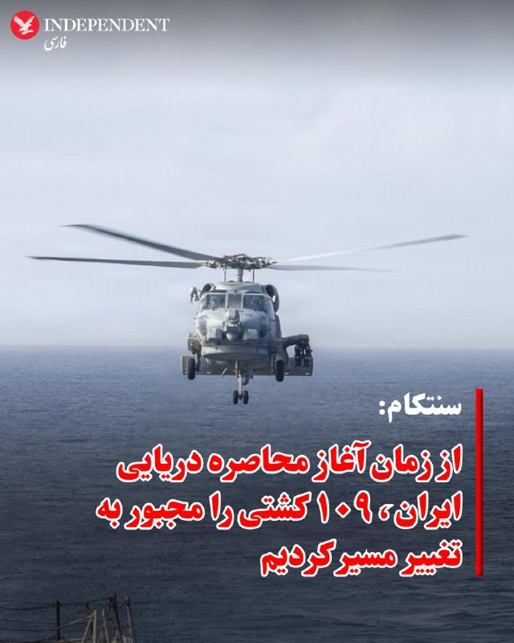

♦️فرماندهی مرکزی ایالات متحده (سنتکام) که هدایت عملیات نظامی آمریکا در خاورمیانه را بر عهده دارد، چهارشنبه ششم خرداد اعلام کرد که از زمان آغاز محاصره دریایی ایران، مسیر ۱۰۹ کشتی تجاری را تغییر داده است.

سنتکام با انتشار عکسی از یک بالگرد سی‌هاوک در شبکه اجتماعی اکس نوشت این بالگرد پس از گشت‌زنی در دریای عرب، در حمایت از عملیات محاصره دریایی ایران، به ناوشکن «دلبرت دی. بلک» نزدیک شد. به گفته سنتکام، این اقدام با هدف اجرای محدودیت‌های دریایی و جلوگیری از عبور کشتی‌ها در منطقه انجام شده است.
‌🇸🇦 Indypersian

🤖 @VahidOOnLine

## WithYashar — post 12677

لیندسی گراهام:«مدت‌هاست برایم روشن شده که پاکستان به‌عنوان یک میانجی، فراتر از حدِ مشکل‌ساز است. دشمنی آن‌ها با اسرائیل، ریشه‌دار و دیرینه است.

این حقیقت را نمی‌توان انکار کرد که هواپیماهای نظامی ایران در پایگاه‌های هوایی پاکستان نگهداری می‌شوند؛ و همچنین مواضع و سخنان گذشتهٔ بلندپایه‌ترین مقام‌های پاکستانی علیه اسرائیل نیز نگران‌کننده است.»
@withyashar

## mwarmonitor — post 9808

  

🔴یک فروند بالگرد MH-60R سی‌هاوک پس از گشت‌زنی در دریای عرب در حمایت از محاصره دریایی آمریکا علیه ایران، به ناوشکن USS Delbert D. Black (DDG-119) نزدیک می‌شود.
تا تاریخ ۲۷ مه، ۱۰۹ کشتی تجاری برای اطمینان از رعایت این محاصره تغییر مسیر داده‌اند.

@mwarmonitor

## IranIntlTV — post 339233

  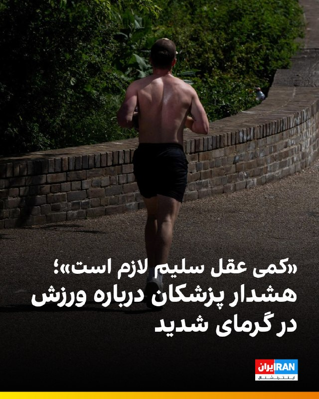

🔻همزمان با موج گرمای کم‌سابقه در جهان، نگرانی‌ها درباره خطرات ورزش کردن در دمای بالا افزایش یافته است؛ نگرانی‌ای که پس از چند حادثه تلخ در مسابقات دو به اوج رسید.

🔹در روزهای اخیر یک دونده ۵۳ ساله در جریان مسابقه ۱۰ کیلومتری «لا پیرنه‌ین» در پاریس جان خود را از دست داد و چندین مورد وخیم نیز در مسابقات مزون-آلفور و منتون گزارش شد؛ اتفاقاتی که بار دیگر توجه‌ها را به خطر گرمازدگی در فعالیت‌های ورزشی جلب کرده است.

🔹مارتن دوکره، پزشک ورزشی و پزشک تیم‌های ملی بوکس فرانسه، در گفت‌وگو با روزنامه فرانسوی «اکیپ» تأکید کرده که ورزش کردن در گرمای شدید می‌تواند حتی برای افراد سالم نیز خطرناک باشد. او توضیح می‌دهد که بدن انسان به‌طور طبیعی دمایی حدود ۳۷ درجه دارد و هنگام ورزش گرمای بیشتری تولید می‌کند. در هوای بسیار گرم، بدن دیگر توانایی کافی برای تنظیم دما را ندارد و همین مسئله می‌تواند به افزایش ضربان قلب، افت فشار، سردرد، حالت تهوع و حتی بیهوشی منجر شود.

🔹جزییات بیشتر را در سایت بخوانید

@iranintltvsport

## ManotoTV — post 105837

  <a href="telegram/content/ManotoTV_105837_1779885811.mp4" target="_blank">🎬 Download video</a>

از «کمک در راه است» تا مذاکره، معامله و بازگشت به همان سیاست همیشگی؟ ورق بزنید.

## DW_Farsi — post 125201

  

🔶 هشدار بانک مرکزی اروپا درباره پیامدهای جنگ ایران و تشدید تنش‌های تجاری در اقتصاد جهان

بانک مرکزی اروپا هشدار داده است که جنگ ایران و ادامه تنش‌های تجاری در جهان می‌تواند رشد اقتصادی منطقه یورو را کاهش دهد، هزینه استقراض را افزایش دهد و فشار بیشتری بر بودجه دولت‌های اروپایی وارد کند.

این هشدار در جدیدترین گزارش ثبات مالی بانک مرکزی اروپا منتشر شده؛ گزارشی که می‌گوید بازارهای مالی تاکنون واکنش شدیدی به جنگ ایران نشان نداده‌اند و همین موضوع نگرانی‌هایی درباره "کم‌اهمیت جلوه دادن خطرها" از سوی سرمایه‌گذاران ایجاد کرده است.

بانک مرکزی اروپا هشدار داده که "سناریویی از رشد که به طور قابل توجهی ضعیف‌تر باشد و در همراهی با یک شوک انرژی پایدارتر باشد، می‌تواند باعث ارزیابی مجدد پایداری مالی و تغییر ناگهانی قیمت‌ها در بازارهای اوراق قرضه دولتی شود".

طبق این برآورد، اینگونه قیمت‌گذاری مجدد می‌تواند "هزینه‌های استقراض شرکت‌ها را افزایش دهد و یک حلقه بازخورد ایجاد کند که می‌تواند ثبات مالی را با خطر مواجه سازد و به اقتصاد واقعی ضربه بزند".
@dw_farsi

## manototv — post 105837

  <a href="telegram/content/manototv_105837_1779885812.mp4" target="_blank">🎬 Download video</a>

از «کمک در راه است» تا مذاکره، معامله و بازگشت به همان سیاست همیشگی؟ ورق بزنید.

## alonews — post 123055

  <a href="telegram/content/alonews_123055_1779885813.webm" target="_blank">🎬 Download video</a>

👈سی‌ان‌ان: هزینه‌های جنگ ایران، بودجه نظامی آمریکا را به شدت کاهش داده است

🔴پنتاگون فشار مالی را احساس می‌کند و در برخی موارد برای انجام آموزش‌های روتین و تعمیر و نگهداری در بحبوحه عملیات‌های جاری خود علیه ایران با مشکل مواجه است و رهبران نظامی یونیفرم‌پوش کنگره را برای حمایت از بودجه اضافی تحت فشار قرار می‌دهند.

🔴بر اساس یک سند داخلی، سپاه سوم زرهی ارتش، ستادی مستقر در تگزاس که بر تقریباً ۷۰ هزار سرباز و صدها تانک نظارت دارد، در اواخر آوریل شاهد کاهش تقریباً ۲۹۲ میلیون دلاری بودجه آموزشی خود بود.

🔴سرپرست حسابرسی پنتاگون، در ۱۲ مه به زیرگروه دفاعی کمیته تخصیص بودجه مجلس نمایندگان گفت که آخرین برآورد پنتاگون از هزینه این درگیری تقریباً ۲۹ میلیارد دلار بوده است.

🔴هرست اذعان کرد که این تخمین بر اساس هزینه مهمات و هواپیماهای منهدم شده بوده و هزینه‌های ساخت و ساز برای بازسازی پایگاه‌ها را شامل نمی‌شود.

✅ @AloNews خبر جنگ

---
📅 بروزرسانی: 1405/03/06 16:02
---

## VahidOOnLine — post 242414

  

نت‌بلاکس، نهاد ناظر بر اختلال‌های اینترنتی در جهان، چهارشنبه شش خرداد اعلام کرد که اتصال اینترنت ایران در ۲۴ ساعت گذشته در حالت بازگشت به وضعیت سابق قرار دارد، اما خدمات همچنان به‌شدت فیلتر است و محدودیت‌های جدیدی بر پیام‌رسان‌ها و فروشگاه‌های اپلیکیشن اعمال می‌شود.
‌🏁 🇬🇧 IranintlTV

🤖 @VahidOOnLine

## IranIntlTV — post 339232

  

نت‌بلاکس، نهاد ناظر بر اختلال‌های اینترنتی در جهان، چهارشنبه شش خرداد اعلام کرد که اتصال اینترنت ایران در ۲۴ ساعت گذشته در حالت بازگشت به وضعیت سابق قرار دارد، اما خدمات همچنان به‌شدت فیلتر است و محدودیت‌های جدیدی بر پیام‌رسان‌ها و فروشگاه‌های اپلیکیشن اعمال می‌شود.
https://iranintl.com/202605270154

## FarsiVOA — post 218797

  

خبرگزاری رویترز از افت صادرات برنج هند به خاطر انسداد تنگه هرمز توسط جمهوری اسلامی خبر داد.

چند منبع بازرگانی که نخواستند نامی از آنها برده شود به رویترز گفتند که صادرات برنج مرغوب هند، باسماتی، که مشتریان عمده آن ایران، عربستان، امارات و عراق هستند، در چهار ماه ابتدایی سال با افت ۷ درصدی مواجه شده است.

هند ۴۰ درصد صادرات برنج جهان را در اختیار دارد و در چهار ماه ابتدایی امسال هند حدود ۸.۴ میلیون تن صادرات برنج داشته که ۲.۳ میلیون تن آن برنج باسماتی بوده است.

رویترز به جزئیات افت صادرات برنج باسماتی هند اشاره نکرده، اما بررسی جزئیات آمارهای وزارت بازرگانی هند توسط صدای آمریکا نشان می‌دهد این کشور در ماه‌های مارس و آوریل (بعد از انسداد تنگه هرمز) مجموعاً ۸۳۸ هزار تن برنج باسماتی صادر کرده که ۲۵ درصد کمتر از دور مشابه ۲۰۲۵ است.

طبق آمارهای فائو، تولید برنج ایران در سال گذشته با افتی ۷ درصدی به ۳.۹ میلیون تن رسید، اما وارداتش در سطح ۱.۲ میلیون تن ثابت ماند.

## BBCPersian — post 282187

🔻ریور احمد اولین زن افغان است که به قله اورست صعود کرده است.

او طی فصل کوهنوردی بهار امسال، صبح روز ۲۱ مه (۲ خرداد) به فراز بلندترین قله جهان رسید.

اما ریور، وضعیت اسفناک زنان و دختران در افغانستان را فراموش نکرده است. «حتی امروز میلیون‌ها دختر افغان از حق اولیه تحصیل محروم هستند و ما باید این قله را هم فتح کنیم. با کمک کوهنوردی، می‌خواهم این پیام را تقویت کنم. من آموخته‌ام که سخت‌ترین کوه‌ها از سنگ و یخ ساخته نشده‌اند، بلکه کوه‌هایی هستند که ما در درون خود حمل می‌کنیم.»

@BBCPersian

## BBCPersian — post 282186

  

🔻 گروه‌های امداد و نجات در لائوس اعلام کردند که پنج روستایی بعد از یک هفته ماندن در غاری پرآب، زنده پیدا شده‌اند. بارندگی شدید و رانش زمین موجب شد که آنها در این غار گرفتار شوند.

به گفته تیم‌های امدادی لائوسی و تایلندی، دو نفر دیگر از اعضای این گروه همچنان مفقود هستند.

این هفت نفر از ساکنان استان «زایسومبون» در مرکز لائوس بودند که چهارشنبه هفته گذشته برای جست‌وجوی طلا و شکار حیوانات وارد غار شده بودند، اما به‌دلیل مسدود شدن دهانه غار بر اثر رانش زمین، نتوانستند خارج شوند.

ویدئوهای منتشرشده از عملیات نجات نشان می‌دهد که غواصان امدادگر از مسیرهای بسیار باریک و گل‌آلود عبور می‌کنند که تقریبا به‌طور کامل زیر آب رفته است.

عملیات جست‌وجو برای یافتن دو فرد مفقودشده ادامه دارد.

به گفته امدادگران، این مجموعه غار که در عمق زمین امتداد دارد، بسیار تنگ است و عرض برخی از بخش‌های آن تنها حدود ۵۰ سانتی‌متر است.

📸EPA/Shutterstock
@BBCPersian

## Hranews — post 113194

  

نت‌بلاکس در آخرین به‌روزرسانی خود از وضعیت #اینترنت در ایران نوشت اتصال اینترنت اکنون به مدت ۲۴ ساعت در حالت ترمیم و بازیابی قرار دارد. این نهاد ناظر بر وضعیت اینترنت در جهان تاکید کرد که اینترنت در ایران همچنان به‌شدت فیلتر است و محدودیت‌های جدیدی در پیام‌رسان‌ها و اپلیکیشن‌ها در مقایسه با قبل از قطع اینترنت اعمال شده است.

↘️
@hranews_bot تماس ✉️ - @Hranews کانال هرانا 🆑

## alonews — post 123054

  <a href="telegram/content/alonews_123054_1779885176.webm" target="_blank">🎬 Download video</a>

👈لیندسی گراهام، سناتور جمهوری‌خواه کارولینای جنوبی : مدتی است که برای من آشکار شده پاکستان به عنوان یک میانجی، بیش از حد مشکل‌ساز است. دشمنی آنها با اسرائیل دیرینه است.

🔴غیرقابل انکار است که هواپیماهای نظامی ایران در پایگاه‌های هوایی پاکستان مستقر هستند و لفاظی‌های گذشته مقامات ارشد پاکستان علیه اسرائیل نگران‌کننده است.

🔴وزیر دفاع پاکستان گفته بود این کشور هرگز به توافق‌نامه‌های ابراهیم ملحق نخواهد شد زیرا به اسرائیل اعتماد ندارد. این کلیپ ممکن است یک سال قدمت داشته باشد، اما من می‌ترسم این احساسات تازه باشد.

🔴در این راستا، ضروری است پاکستان اکنون به درخواست رئیس‌جمهور ترامپ برای پیوستن به توافق‌نامه‌های ابراهیم پاسخ دهد

✅ @AloNews خبر جنگ

---
📅 بروزرسانی: 1405/03/06 15:52
---

## VahidOOnLine — post 242413

  

عمر تیشلر، فرمانده نیروی هوایی اسرائیل، چهارشنبه در مراسم رونمایی از هواپیمای سوخت‌رسان «گیدئون» مدل کی‌سی-۴۶، با اشاره به جنگ اخیر آمریکا و اسرائیل علیه جمهوری اسلامی گفت: «حکومت ایران که هدف خود را نابودی اسرائیل قرار داده بود، با قدرت آتشی روبه‌رو شد که نه می‌شناخت و نه پیش‌بینی می‌کرد و نتوانست آن را متوقف کند.»

او افزود: «حدود دو ماه پیش از باندهای پایگاه نواتیم، هواپیماهای سوخت‌رسان برخاستند و تمام نیروی هوایی را به ایران رساندند.»

تیشلر همچنین گفت نیروی هوایی اسرائیل همچنان در حال عملیات است، به حزب‌الله حمله می‌کند، از ساکنان شمال اسرائیل دفاع می‌کند و در غزه علیه حماس عملیات انجام می‌دهد.

او تاکید کرد: «برای هر تحول، در هر جبهه‌ای آماده‌ایم.»
‌🏁 🇬🇧 IranintlTV

🤖 @VahidOOnLine

## WithYashar — post 12676

## WithYashar — post 12675

  

پست جدید ترامپ در تروث از جروزالم پست :
آزار و اذیت جنسی در زندان‌های ایران در دوران آتش‌بس به‌شدت افزایش یافته است
جروزالم پست
آزار و اذیت جنسی در زندان‌های ایران در دوره آتش‌بس به‌طور چشمگیری افزایش پیدا کرده است.
یکی از معترضان به مدیا لاین گفته که هنگام بازجویی با باتوم به او تجاوز شده است.
مرد دیگری پس از آن‌که مأموران ادعا کردند به پیکر همسرش بی‌حرمتی کرده‌اند، اقدام به خودکشی کرده است.
گروه‌های حقوق بشری می‌گویند از زمان شروع جنگ، دست‌کم ۳۶۴۶ ایرانی بازداشت شده‌اند و قطع اینترنت باعث شده ابعاد واقعی ماجرا پنهان بماند.
@withyashar

## DEJradio — post 5033

⭕️ وزیر اسرائیلی گفت اهرم راهبردی جمهوری اسلامی در تنگۀ هرمز در حال نابودی است

الی کوهن، وزیر انرژی دولت اسرائیل، گفت همۀ ظرفیت جمهوری اسلامی در تنگۀ هرمز و اهرم راهبردی آن، در حال نابودی است.
او خبر داد که گفت‌وگوها برای ایجاد زیرساخت‌های انتقال انرژی از شرق به غرب در حال پیشرفت است.
به گفتۀ الی کوهن، هدف از گفت‌وگوهای تازه، انتقال انرژی به اروپا از مسیر اسرائیل است.
الی کوهن افزود کشورهای حاشیۀ خلیج فارس از جمله عربستان سعودی و امارات متحدۀ عربی علاقه‌مند به مشارکت در این پروژه‌ها شده‌اند.
به گفتۀ وزیر انرژی و زیرساخت اسرائیل، کریدور انرژی میان هند و اروپا از طریق کشورهای خلیج فارس و اسرائیل در دست بررسی است. همچنین مسیر مصر می‌تواند اجرای این پروژه را تسریع کند.

#دژ #خبر #اسرائیل
@DEJradio

## DEJradio — post 5032

⭕️ مقام ارشد اسرائیل گفت پایه‌های حکومت آیت‌الله‌ها ترک برداشته است

ایال زمیر، رئیس ستاد کل ارتش اسرائیل گفت پایه‌های حکومت آیت‌الله‌ها به‌طرز قابل توجهی ترک برداشته است.
به گفتۀ این مقام ارشد نظامی اسرائیل، آینده و ثبات نظام جمهوری اسلامی در هاله‌ای از ابهام فرو رفته است.
ایال زمیر یادآوری کرد سران جمهوری اسلامی تحت تعقیب قرار دارند و اصلی‌ترین توانایی‌های نظامی حکومت نابود شده است.
زمیر همچنین گفت برنامۀ هسته‌ای جمهوری اسلامی سال‌ها به عقب رانده شده و اقتصاد کشور در حال فروپاشی است.

#خبر #دژ #اسرائیل
@DEJradio

## DEJradio — post 5031

⭕️ ادعای باقری‌کنی: موضوع ذخایر اورانیوم در دستور کار مذاکرات نیست

علی باقری‌کنی، معاون دبیر شورای عالی امنیت ملی نظام ادعا کرد موضوع ذخایر اورانیوم غنی‌شده در دستور کار مذاکرۀ کنونی با آمریکا قرار ندارد.
او در حاشیۀ نشست امنیتی روسیه مدعی شد تهران و واشینگتن هنوز دربارۀ رفع انسداد تنگۀ هرمز به توافق نرسیده‌اند.
باقری‌کنی گفت جمهوری اسلامی و عمان درمورد سازوکار تازۀ مدیریت تردد کشتی‌ها در تنگۀ هرمز در حال مذاکره‌اند.
دونالد ترامپ تأکید کرده اورانیوم غنی‌شده باید یا به آمریکا تحویل داده شود یا زیر نظارت بین‌المللی رقیق و نابود شود.

#خبر #دژ #اورانیوم #مذاکرات
@DEJradio

## DEJradio — post 5030

⭕️ وزارت اطلاعات جمهوری اسلامی از استارلینک و «شکستن انسجام ملی» می‌ترسد

وزارت اطلاعات جمهوری اسلامی روز چهارشنبه در بیانیه‌ای مدعی شد پس از توقف جنگ سخت، «دشمن» بر جنگ ترکیبی متمرکز شده است.
این وزارتخانه از تشدید فشار اقتصادی، حملات سایبری، جنگ رسانه‌ای، قاچاق سلاح و «ابزارهای ارتباطی همچون استارلینک» به‌عنوان محورهای جنگ ترکیبی نام برد.
در این بیانیه درباره هرگونه اقدام برای شکستن «انسجام ملی و ایجاد گسست اجتماعی» هشدار داده شد. وزارت اطلاعات دولت پزشکیان تهدید کرد با این موارد «با دقت و قاطعیت» برخورد می‌شود.
مشخص نیست منظور وزارت اطلاعات از «انسجام ملی» مورد ادعا چه بوده است.
این تهدیدها تنها یک روز پس از بازگشت اینترنت جهانی در ایران پس از ۸۸ روز قطعی سراسری منتشر شده است.
اسماعیل خطیب، وزیر پیشین اطلاعات در جریان حملات اسرائیل و آمریکا در جنگ چهل روزه کشته شد.
این وزارتخانه اکنون توسط یک سرپرست اداره می‌شود و هنوز فردی به عنوان وزیر اطلاعات، معرفی نشده است.

#خبر #دژ #استارلینک #وزارت_اطلاعات
@DEJradio

## IranIntlTV — post 339231

  

عمر تیشلر، فرمانده نیروی هوایی اسرائیل، چهارشنبه در مراسم رونمایی از هواپیمای سوخت‌رسان «گیدئون» مدل کی‌سی-۴۶، با اشاره به جنگ اخیر آمریکا و اسرائیل علیه جمهوری اسلامی گفت: «حکومت ایران که هدف خود را نابودی اسرائیل قرار داده بود، با قدرت آتشی روبه‌رو شد که نه می‌شناخت و نه پیش‌بینی می‌کرد و نتوانست آن را متوقف کند.»

او افزود: «حدود دو ماه پیش از باندهای پایگاه نواتیم، هواپیماهای سوخت‌رسان برخاستند و تمام نیروی هوایی را به ایران رساندند.»

تیشلر همچنین گفت نیروی هوایی اسرائیل همچنان در حال عملیات است، به حزب‌الله حمله می‌کند، از ساکنان شمال اسرائیل دفاع می‌کند و در غزه علیه حماس عملیات انجام می‌دهد.

او تاکید کرد: «برای هر تحول، در هر جبهه‌ای آماده‌ایم.»
https://iranintl.com/202605272454

## DW_Farsi — post 125200

🔶 عربستان سعودی؛ ۱.۵ میلیون نفر با وجود جنگ به حج می‌روند

🔻 گزارشی از Cathrin Schaer

سال ۲۰۲۶ نخستین سالی است که دولت آمریکا از شهروندان خود خواسته در سفر برای مراسم حج تجدیدنظر کنند و اعلام کرده که کارکنان غیرضروری دولت آمریکا در مارس امسال از عربستان خارج شده‌اند.

کارشناسان احتمال هدف قرار دادن مستقیم حج توسط ایران را بسیار پایین می‌دانند زیرا این اماکن برای همه مسلمانان مقدس است. علاوه بر این، حدود ۳۰ هزار زائر ایرانی نیز امسال در مراسم حج حضور دارند.

اما این نگرانی وجود دارد که این مراسم به اشتباه یا تصادفی هدف قرار گیرد.
@dw_farsi

## Persian_Trend_Official — post 15123

  

🚨🔥 آسمان جنوب لبنان در آتش!

جنگنده‌های اسرائیلی طی دقایق اخیر موجی از حملات هوایی سنگین را علیه مناطق مختلف لبنان آغاز کردند؛ از حبوش و نبطیه الفوقا گرفته تا قصیبه، زبیدن و زفتا. گزارش‌ها از چندین انفجار پیاپی در نبطیه و حملات گسترده به السلسله الغربیة در جرد الهرمل حکایت دارد.

✈️ همزمان، جنگنده‌های اسرائیلی با پرواز در ارتفاع بسیار پایین بر فراز بیروت، حومه پایتخت و همچنین بعلبک، فضای لبنان را به شدت متشنج کرده‌اند.

⚠️ منابع محلی از شنیده شدن صدای انفجارها در چندین منطقه خبر می‌دهند. منطقه در وضعیت فوق‌العاده ملتهب قرار گرفته و احتمال تشدید تنش‌ها بین حزب‌الله و اسرائیل در ساعات آینده بالاست.

## idfinfarsi — post 11655

  <a href="telegram/content/idfinfarsi_11655_1779884577.mp4" target="_blank">🎬 Download video</a>

در این روزهای مقدس مسلمانان، پیام ما بیش از هر زمان دیگری نمایان است: اتحاد و همبستگی میان اقوام و ادیان، از هر تلاشی برای تفرقه‌ و تحریکها نیرومندتر است.

## Hranews — post 113193

گزارشی از بازداشت و بلاتکلیفی پژمان حاجی‌زاده

❗️
❗️
❗️
❗️
❗️– پژمان حاجی‌زاده، شهروند ساکن بوکان، مورخ ۲۲ اردیبهشت‌ماه، توسط نیروهای امنیتی در این شهرستان بازداشت و کماکان بصورت بلاتکلیف در یکی از بازداشتگاه‌های امنیتی ارومیه به‌سر می‌برد.

#پژمان_حاجی‌زاده

ادامه مطلب

↘️
@hranews_bot تماس ✉️ - @Hranews کانال هرانا 🆑

## alonews — post 123053

  <a href="telegram/content/alonews_123053_1779884579.webm" target="_blank">🎬 Download video</a>

👈حملات هوایی اسرائیل به شهر کفر حونه در بقیعه غربی لبنان هدف قرار گرفت.

✅ @AloNews خبر جنگ

## alonews — post 123052

  <a href="telegram/content/alonews_123052_1779884579.webm" target="_blank">🎬 Download video</a>

👈نورالدین الدغیر خبرنگار الجزیره در تهران: برخی از بندهای یادداشت تفاهم بین تهران و واشنگتن

🔴 واشنگتن محاصره دریایی ایران را لغو کرده و نیروهای خود را از پیرامون ایران خارج می‌کند.

🔴ایران متعهد می‌شود ظرف مدت یک ماه، تعداد کشتی‌های تجاری عبوری را (به استثنای کشتی‌های نظامی) به سطح پیش از تنش‌ها بازگرداند.

🔴 هماهنگی در خصوص مدیریت مسیر کشتی‌ها با ایران و عمان انجام خواهد شد.

✅ @AloNews خبر جنگ

## alonews — post 123051

  <a href="telegram/content/alonews_123051_1779884579.webm" target="_blank">🎬 Download video</a>

👈زنگنه، نماینده مجلس: احتمالا عید غدیر جشن پیروزی ایران بر آمریکارو میگیریم

✅ @AloNews خبر جنگ

---
📅 بروزرسانی: 1405/03/06 15:43
---

## VahidOOnLine — post 242412

  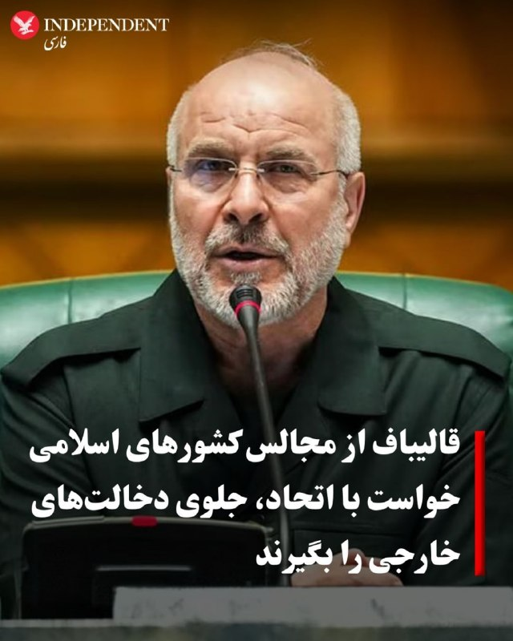

♦️محمدباقر قالیباف، رئیس مجلس شورای اسلامی و مذاکره کننده ارشد جمهوری اسلامی در مذاکرات با آمریکا، در پیامی به مناسبت عید قربان به روسای مجالس کشورهای اسلامی نوشت:‌ «همکاری برای قو ی‌شدن بدون دخالت خارجی، نقش مؤثری در حل بحران‌های منطقه‌ای دارد.»

این پیام در حالی صادر می‌شود که همزمان با ادامه مذاکرات میان تهران و واشنگتن برای پایان جنگ، کشورهای اسلامی منطقه می‌گویند برای بازگردندان ثبات و آرامش به منطقه تمام تلاش خود را به کار بسته‌اند.
‌🇸🇦 Indypersian

🤖 @VahidOOnLine

## VahidOOnLine — post 242411

  <a href="telegram/content/VahidOOnLine_242411_1779884017.mp4" target="_blank">🎬 Download video</a>

♦️سازمان هوانوردی و فضا ایالات متحده (ناسا)، روز سه‌شنبه پنجم خرداد جزئیات جدیدی از برنامه استقرار یک پایگاه فضائی دائم در کره ماه را اعلام کرد.

مدیران این سازمان فدرال اعلام کردند برنامه ساخت این پایگاه از سه سال دیگر آغاز خواهد شد و به شرکت‌هایی که بتوانند در کار ساخت و ارسال خودروها و دیگر وسایل حمل و نقل به ماه کمک کنند، پاداش خواهند داد.

جرد ایزاکمن، مدیر ناسا در یک نشست مطبوعاتی در واشنگتن گفت قرار است در مرحله اول فرودگر (ماه نشین)‌ «بلو اوریجین مارک وان اندیورنس» (Blue Origin Mark One Endurance) محموله‌های متعددی را به نقطه تماس در قطب جنوب ماه منتقل کند.‌

در ادامه مرحله اول، ربات‌ها
ماموریت‌های سریعی را «بررسی منطقه، آزمایش فناوری‌ها و آماده‌سازی برای عملیات روی سطح ماه» آغاز خواهند کرد.

به گفته مدیران ناسا،  مرحله دوم با انتقال وسایل حمل‌ونقل،  تا سال ۲۰۲۹ طول می‌کشد و پس از آن ناسا شروع به ساخت زیرساخت‌های نیمه دائمی خواهد کرد و مرحله ۳ با هدف دستیابی به حضور پایدار روی کره ماه انجام خواهد شد.
‌🇸🇦 Indypersian

🤖 @VahidOOnLine

## WithYashar — post 12674

  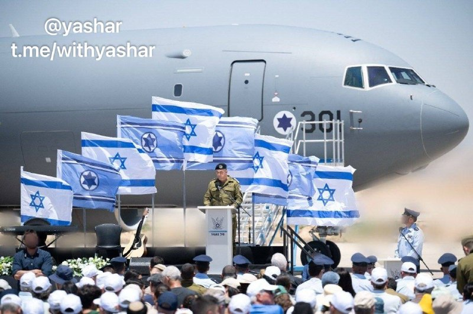

هواپیمای سوخت‌رسانی جدید نیروی هوایی اسرائیل، KC-46A Pegasus "Gideon" (301)، اندکی پیش در اسرائیل فرود آمد و ایال زمیر، رئیس ستاد کل ارتش اسرائیل، در مراسم استقبال حضور داشت. این هواپیما اولین فروند از شش فروند سفارش داده شده است و امکان سفارش دو فروند دیگر نیز وجود دارد.
@withyashar

## FoxNewsTwitter — post 342296

  

Fox News (Twitter/X)

NEW: President Trump taking a victory lap after Ken Paxton’s GOP Senate primary win in Texas after his endorsement and taking aim at Democrats in the Lone Star State.

“Congratulations to Ken Paxton on such a tremendous win."

“His opponent, Alfred E. Neuman, may be the worst TEXAS candidate I have ever seen. A strong Open Borders advocate, he is WEAK ON CRIME, believes there are 6 genders, is insulting to Jesus Christ, will never support the Military, was a big Mask Wearer until recently, and is a Vegan who dislikes meat."

## DEJradio — post 5029

  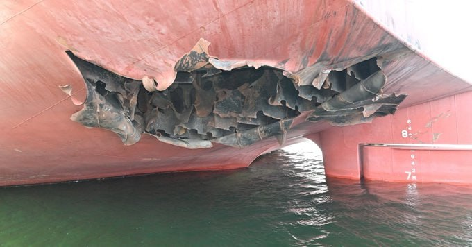

🔺احضار سفیر تهران در سئول؛ جمهوری اسلامی مسئول حمله به کشتی کره‌ای شناخته شد

کره جنوبی اعلام کرد سفیر جمهوری اسلامی را در اعتراض به حمله به یک کشتی کره‌ای در تنگۀ هرمز احضار می‌کند.
سئول پس از چند هفته بررسی اعلام کرد به احتمال بسیار قوی، یک موشک ساخت جمهوری اسلامی عامل حمله به کشتی اچ‌ام‌ام نامو، بود.
پارک یون‌جو، معاون وزیر امور خارجۀ کرۀ جنوبی، گفت تحلیل‌های فنی نشان می‌دهد پرتابۀ استفاده‌شده نسخه‌ای از موشک «نور» بود.
بنا بر داده‌ها روی برخی از قطعات موشک نیز نشانه‌هایی از یک تولیدکنندۀ ایرانی دیده شد.
این کشتی باری کره‌ای در ۱۴ اردیبهشت امسال هدف حمله قرار گرفت.
به گفته مقام‌های کره‌ای، یکی از موشک‌ها درحدود هفت متر در بدنۀ کشتی نفوذ کرده بود.

#خبر #دژ #کره_جنوبی #تنگه_هرمز
@DEJradio

## FarsiVOA — post 218796

🔺انتقال انرژی از خلیج فارس به اروپا؛ طرح اسرائیل برای کم‌رنگ کردن اهرم هرمز

▪️الی کوهن، وزیر انرژی اسرائیل، می‌گوید تل‌آویو در حال بررسی طرح‌هایی برای ایجاد مسیرهای تازه انتقال انرژی از شرق به غرب است؛ طرح‌هایی که هدف آنها کاهش اثر تهدیدهای جمهوری اسلامی علیه مسیرهای تجاری، به‌ویژه تنگه هرمز، عنوان شده است.

⬇️ بیشتر بخوانید:

https://ir.voanews.com/a/8154436.html/?nocach=1

## FarsiVOA — post 218795

  

ارتش اسرائیل پیش از دور تازه حملات علیه مواضع حزب‌الله، به ساکنان پنج شهرک و روستا در جنوب لبنان هشدار تخلیه داد.

بر اساس اعلام ارتش اسرائیل، ساکنان کفار حونه، عرمتی، ملیخ، جرجوع و حومین الفوقا باید دست‌کم یک کیلومتر از محل زندگی خود دور شوند.

سخنگوی عربی ارتش اسرائیل مدعی شد این اقدام در واکنش به «نقض توافق آتش‌بس از سوی حزب‌الله» انجام می‌شود و ارتش قصد آسیب زدن به غیرنظامیان را ندارد.

این هشدار در ادامه موج تازه حملات اسرائیل در جنوب لبنان صادر شد. تایمز اسرائیل گزارش داد ارتش اسرائیل امروز بار دیگر زیرساخت‌های حزب‌الله را هدف قرار داده و دلیل آن را افزایش حملات پهپادی حزب‌الله به نیروهای اسرائیلی و مناطق شمالی اسرائیل اعلام کرده است.

آتش‌بس ۱۶ آوریل در روزهای اخیر به‌شدت شکننده شده است. رویترز گزارش داد اسرائیل روز سه‌شنبه بیش از ۱۲۰ حمله در جنوب و شرق لبنان انجام داد که دست‌کم ۳۱ کشته و ۴۰ زخمی برجا گذاشت.
@FarsiVOA

## DW_Farsi — post 125199

🎥 مبارزه با راست افراطی در قفس ورزش‌های رزمی (رینگ)

راست افراطی در آلمان بیش از پیش از ورزش‌های رزمی ترکیبی برای جذب نیرو استفاده می‌کند. حالا یک باشگاه در شهر کمنیتس در شرق آلمان با ایجاد فضایی فراگیر و بدون تبعیض، تلاش می‌کند در برابر این روند بایستد.
@dw_farsi

## Persian_Trend_Official — post 15122

https://youtube.com/live/IsX9PiIhoW4?feature=share

## Persian_Trend_Official — post 15121

🌲 — 🇮🇱 رئیس ستاد کل ارتش اسرائیل، ایال زامیر: برنامه هسته‌ای ایران سال‌ها به عقب افتاده است.

🌲 — 🇮🇱 رئیس ستاد کل ارتش اسرائیل: رهبری ایران مردم خود را به فاجعه‌ای کشانده است که هنوز به طور کامل آن را درک نکرده‌اند، و در حالی که بیشتر توانایی‌های نظامی‌شان نابود شده، در حال تعقیب هستند.

## Persian_Trend_Official — post 15120

  

🇮🇱
🇱🇧
🇱🇧
🔹 هشدار فوری به ساکنان شهرها و روستاهای زیر در لبنان صادر شد: کفر حونا، آرامتا، ملیخ، جرجوع و حومین الفوقا، با دستور تخلیه فوری و حرکت حداقل ۱۰۰۰ متر به سمت مناطق باز.

## IranianMinds — post 20870

  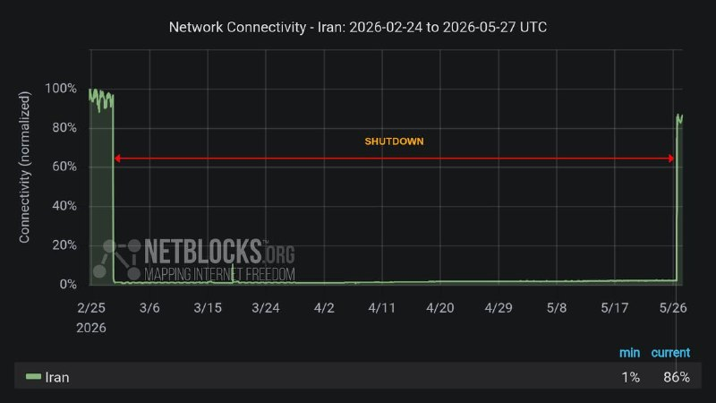

وضعیت امروز اینترنت بین الملل ایران از نگاه نت بلاکس

اینترنت هنوز به وضعیت ۱۰۰ درصدی بازنگشته

با اینکه نشون دهنده ی بازگشت نزدیک به ۷۰ الی ۸۰ درصد رو نشون میده
ولی تو زمان قطعی راحت تر کانکت میشد اینترنت

@IranianMinds

## BBCPersian — post 282185

🔻رویترز: جنگ ایران برندگان و بازندگان تازه‌ای را در بازارهای جهانی ایجاد کرده است

🔻سه ماه پس از آغاز جنگ ایران، تداوم قیمت بالای نفت سیاست‌گذاران را با نگرانی‌های تازه درباره تورم روبه‌رو کرده و کاهش ارزش ارزها نیز برای برخی کشورهای آسیایی دردسرساز شده است.

به‌گزارش رویترز اما این درگیری در عین حال به رشد برخی دارایی‌ها، به‌ویژه نفت، و تقویت جایگاه دلار به‌عنوان یک دارایی امن کمک کرده است.

رویترز در گزارش خود آورده است: افزایش حدود ۴۰ درصدی قیمت نفت، چشم‌انداز تورم و نرخ بهره را دگرگون کرده است. در بازار واقعی، قیمت نفت خام به‌مراتب بالاتر از ۱۰۰ دلار در هر بشکه قرار دارد و در مقطعی در اوایل آوریل تقریبا دو برابر سطح پیش از جنگ بود.

این گزارش حاکیست که آزادسازی بی‌سابقه ۴۰۰ میلیون بشکه نفت از ذخایر راهبردی اقتصادهای بزرگ، همراه با تلاش معامله‌گران برای یافتن منابع جایگزین، تا حدی به جبران کمبود عرضه کمک کرده است. با این حال، فشار بر نظام جهانی انرژی رو به افزایش است.

https://bbc.in/4dLHuWT
@BBCPersian

## BBCPersian — post 282184

  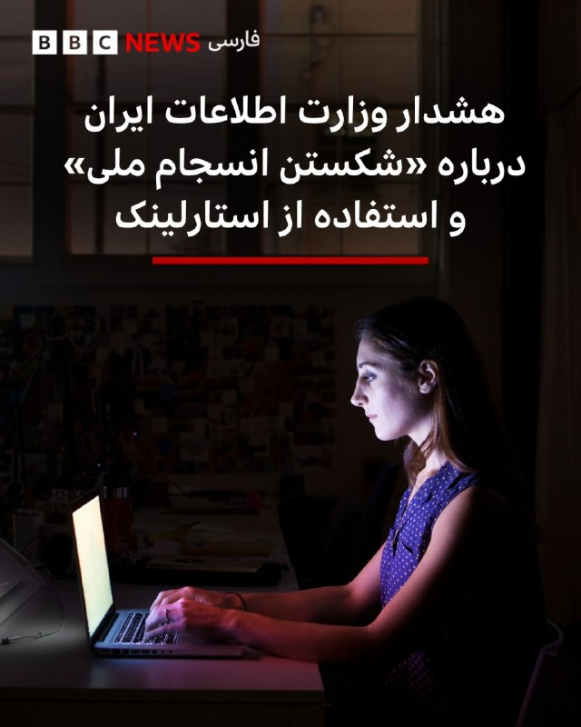

🔻وزارت اطلاعات ایران در بیانیه‌ای گفته است که «دشمن اکنون با توقف جنگ سخت، بر هفت محور اصلی جنگ ترکیبی» متمرکز شده و هشدارهایی به شهروندان داده است.

در این اطلاعیه آمده است: «جنگ ترکیبی شامل تشدید فشارهای اقتصادی، انجام تحریکات قومی و مذهبی، اعزام مزدوران گروهکی، ترور و خرابکاری، قاچاق انواع سلاح و ابزار ارتباطی غیرقانونی، جنگ رسانه‌ای و حملات سایبری متمرکز شده است.»

این هشدار یک روز پس از اتصال اینترنت در پی ۸۸ روز قطعی سراسری در ایران صادر شده است.

وزارت اطلاعات درباره «هرگونه اقدام برای شکستن انسجام ملی و ایجاد گسست اجتماعی، قاچاق سلاح و ابزارهای ارتباطی غیرقانونی همچون استارلینک» هشدار داده و گفته است که در ارتباط با این موضوعات «با دقت و قاطعیت هرچه بیشتر» عمل خواهد کرد.

وزارت اطلاعات ایران اکنون از سوی سرپرست اداره می‌شود. اسماعیل خطیب، وزیر اطلاعات، در جریان حملات اسرائیل و آمریکا در تهران کشته شد.

📷Getty Images
https://bbc.in/4vinAKx

@BBCPersian

## Dirty_Kids — post 390315

  <a href="telegram/content/Dirty_Kids_390315_1779884027.mp4" target="_blank">🎬 Download video</a>

سالنای آرایشگری زنونه این روزا این شکلی دارن تبلیغ میکنن:

@Dirty_Kids 👻

## Dirty_Kids — post 390311

🔴 امسال انگار سال سالِ کونه 🍑، چالش عجیب و کثافتی که این روزها تو اینستاگرام به شدت وایرال شده؛

داستان ازاین قراره که؛ ملت کونشونو به شکل قلب درمیارن، ازش عکس میگیرن و تو اینستاگرام پست میکنن.

این چالش درحال حاضر پر بازدید‌ترین چالش حالِ حاضر اینستاگرامه.

@Dirty_Kids 👻

## Dirty_Kids — post 390310

  

وقتی از روبیکا میای تلگرام:

@Dirty_Kids 👻

## Dirty_Kids — post 390309

  

بچه‌هایی که نبودید
یه ژانر تو توییتر درست کردن به اسم «شیکم تخت» این بانو خیلی وایرال شد

@Dirty_Kids 👻

## alonews — post 123050

  <a href="telegram/content/alonews_123050_1779884028.webm" target="_blank">🎬 Download video</a>

👈تصاویر نشان می‌دهد که هواپیمای سوخت‌رسانی جدید نیروی هوایی اسرائیل، KC-46A Pegasus "Gideon" (301)، اندکی پیش در اسرائیل فرود آمد و ایال زمیر، رئیس ستاد کل ارتش اسرائیل، در مراسم استقبال حضور داشت. این هواپیما اولین فروند از شش فروند سفارش داده شده است و امکان سفارش دو فروند دیگر نیز وجود دارد.

✅ @AloNews خبر جنگ

## alonews — post 123049

  <a href="telegram/content/alonews_123049_1779884029.mp4" target="_blank">🎬 Download video</a>

👈فیلم دوربین مداربسته لحظه‌ای را نشان می‌دهد که جنگنده‌های اسرائیلی حملات هوایی به نبطیه در جنوب لبنان را انجام دادند

✅ @AloNews خبر جنگ

## alonews — post 123048

  <a href="telegram/content/alonews_123048_1779884031.webm" target="_blank">🎬 Download video</a>

👈فرماندهی مرکزی ایالات متحده درباره محاصره: تا امروز، ۱۰۹ کشتی تجاری برای اطمینان از رعایت قوانین محاصره به سوی مسیر دیگر هدایت شده‌اند.

✅ @AloNews خبر جنگ

## alonews — post 123047

  <a href="telegram/content/alonews_123047_1779884031.webm" target="_blank">🎬 Download video</a>

👈وضعیت امروز اینترنت بین الملل ایران از نگاه نت بلاکس

🔴اینترنت هنوز به وضعیت ۱۰۰ درصدی بازنگشته

✅ @AloNews خبر جنگ

## alonews — post 123046

  <a href="telegram/content/alonews_123046_1779884032.webm" target="_blank">🎬 Download video</a>

👈العربیه: به گفته منابع، احتمال دارد طی چند هفته یک توافق میان آمریکا و ایران حاصل شود

✅ @AloNews خبر جنگ

---
📅 بروزرسانی: 1405/03/06 15:23
---

## VahidOOnLine — post 242410

  

محسن زنگنه، عضو کمیسیون برنامه و بودجه مجلس، گفت جمهوری اسلامی درباره «اصل غنی‌سازی» مذاکره نمی‌کند اما درباره محدودیت درصد غنی‌سازی با آمریکا گفت‌وگو می‌کند.

زنگنه همچنین گفت روند مذاکرات با «هماهنگی کامل رهبری» پیش می‌رود و ابراز امیدواری کرد جمهوری اسلامی در عید غدیر «جشن پیروزی» بگیرد.
‌🏁 🇬🇧 IranintlTV

🤖 @VahidOOnLine

## DEJradio — post 5028

⭕️ پاکستان باید به درخواست ترامپ برای پیوستن به پیمان ابراهیم پاسخ بدهد

لیندزی گراهام، سناتور جمهوری‌خواه آمریکایی گفت با توجه به درخواست دونالد ترامپ برای پیوستن کشورهای اسلامی به پیمان ابراهیم، پاکستان باید موضع خود را روشن کند.
گراهام بار دیگر از نقش پاکستان در میانجی‌گری میان جمهوری اسلامی و آمریکا انتقاد کرد.
این سناتور برجستۀ آمریکایی افزود دشمنی پاکستان با اسرائیل، پیشینه‌ای طولانی دارد.
گراهام تأکید کرد استقرار هواپیماهای نظامی جمهوری اسلامی در پایگاه‌های پاکستان غیرقابل انکار است.
این سیاستمدار نزدیک به ترامپ پیش‌تر نیز گفته بود اگر گزارش‌ مربوط به پناه گرفتن هواپیماهای جمهوری اسلامی در پاکستان درست باشد، نقش اسلام‌آباد به‌عنوان میانجی باید بازنگری شود.

#خبر #دژ #توافق_ابراهیم #پاکستان
@DEJradio

## DEJradio — post 5027

⭕️ ترامپ پس از معاینۀ سه‌ساعتۀ پزشکی از وضعیت سلامتی‌ عالی خود خبر داد

دونالد ترامپ، رئیس‌ جمهوری آمریکا شامگاه سه‌شنبه پس از انجام یک معاینۀ سه‌ساعته در مرکز پزشکی نظامی والتر رید، اعلام کرد همه چیز کاملا عالی بود.
به گزارش کاخ سفید این مراجعه بخشی از معاینات پیشگیرانۀ پزشکی و دندانپزشکی بوده است.
ترامپ در خرداد ماه ماه آینده ۸۰ ساله می‌شود. این چهارمین معاینۀ پزشکی علنی ترامپ از آغاز دور دوم ریاست‌جمهوری او به شمار می‌رود.

#خبر #دژ #ترامپ
@DEJradio

## IranIntlTV — post 339230

  

محسن زنگنه، عضو کمیسیون برنامه و بودجه مجلس، گفت جمهوری اسلامی درباره «اصل غنی‌سازی» مذاکره نمی‌کند اما درباره محدودیت درصد غنی‌سازی با آمریکا گفت‌وگو می‌کند.

زنگنه همچنین گفت روند مذاکرات با «هماهنگی کامل رهبری» پیش می‌رود و ابراز امیدواری کرد جمهوری اسلامی در عید غدیر «جشن پیروزی» بگیرد.
https://iranintl.com/202605273362

## IranIntlTV — post 339229

  <a href="telegram/content/IranIntlTV_339229_1779882808.mp4" target="_blank">🎬 Download video</a>

هم‌زمان با اعتراضات دانش‌آموزان در روزهای اخیر، صدها دانش‌آموز با ارسال پیام‌هایی به ایران‌اینترنشنال نسبت به برگزاری حضوری امتحانات پایان سال و بلاتکلیفی درباره وضعیت کنکور سراسری انتقاد کردند.

سبا حیدرخانی، عضو تحریریه ایران‌اینترنشنال، گزارش می‌دهد
@iranintltv

## IranIntlTV — post 339228

  <a href="telegram/content/IranIntlTV_339228_1779882809.mp4" target="_blank">🎬 Download video</a>

نت‌بلاکس اعلام کرد با اتصال دوباره شبکه‌های موبایل و بخشی از شبکه‌ها به اینترنت جهانی، سطح دسترسی به اینترنت در ایران به ۸۶ درصد رسیده است. با این حال کاربران همچنان از محدودیت در اینترنت خبر می‌دهند.
گفت‌وگو با نیما اکبرپور، کارشناش فناوری
@iranintltv

## FarsiVOA — post 218794

  

بریتانیا و لهستان قرار است پیمان دفاعی و امنیتی تازه‌ای امضا کنند؛ توافقی که هدف آن تقویت دفاع جمعی، حفاظت از مرزهای بریتانیا، مقابله با جرایم سازمان‌یافته و تعمیق همکاری لندن با اروپا اعلام شده است.

کی‌یر استارمر، نخست‌وزیر بریتانیا، در لندن میزبان دونالد توسک، نخست‌وزیر لهستان، خواهد بود. دولت بریتانیا می‌گوید این پیمان «بزرگ‌ترین گام رو به جلو» در روابط دفاعی و امنیتی دو کشور در یک نسل است.

دو طرف قرار است درباره افزایش حملات ترکیبی منتسب به روسیه، از جمله آتش‌سوزی‌های عمدی در شرق لندن، آتش‌سوزی محموله‌ها در بیرمنگام و اروپا، حملات سایبری، جاسوسی و عملیات اطلاعاتی مخرب گفت‌وگو کنند.

بر اساس این توافق، دو کشور در توسعه نسل جدید سامانه‌های پدافند هوایی، موشک‌های میان‌برد، جنگ پهپادی، جنگ الکترونیک و رزمایش‌های مشترک نیروهای زمینی همکاری گسترده‌تری خواهند داشت.

این پیمان هم‌زمان با نگرانی فزاینده اروپا از احتمال گسترش جنگ روسیه فراتر از اوکراین و تهدید کشورهای بالتیک امضا می‌شود.
@FarsiVOA

## FarsiVOA — post 218793

🔺افزایش بازداشت‌ها و اعدام ۳۷ تن در بحبوحه درگیری‌های نظامی در ایران

▪️ارگان خبری مجموعه فعالان حقوق بشر در ایران اعلام کرد همزمان با آغاز درگیری‌های نظامی میان ایران، آمریکا و اسرائیل، روند صدور و اجرای احکام اعدام در پرونده‌های سیاسی و امنیتی افزایش یافته و تاکنون ۳۷ شهروند اعدام شده‌اند.

▪️در این گزارش آمده است افزایش بازداشت‌ها و طرح اتهاماتی نظیر «جاسوسی» و «اقدام علیه امنیت ملی» علیه شهروندان، از جمله اقداماتی بوده که نهادهای امنیتی و اطلاعاتی جمهوری اسلامی در این دوره در پیش گرفته‌اند.

▪️بر اساس این گزارش، تنها در فاصله ۹ اسفند ۱۴۰۴ تا ۱۹ فروردین ۱۴۰۵ دست‌کم چهار هزار و ۲۳ شهروند توسط نیروهای اطلاعاتی و امنیتی جمهوری اسلامی بازداشت شده‌اند.

⬇️ بیشتر بخوانید:
https://ir.voanews.com/a/8154433.html

## IranianMinds — post 20869

وضعیت اینترنت اینجوریه که وصله
اما وصل نیست

@IranianMinds

## alonews — post 123045

  <a href="telegram/content/alonews_123045_1779882811.webm" target="_blank">🎬 Download video</a>

👈باقری،معاون دبیر شورای عالی امنیت ملی: ایران و عمان در حال مذاکره درباره سازوکار مدیریت تنگه هرمز هستند!

✅ @AloNews خبر جنگ

---
📅 بروزرسانی: 1405/03/06 15:13
---

## VahidOOnLine — post 242409

  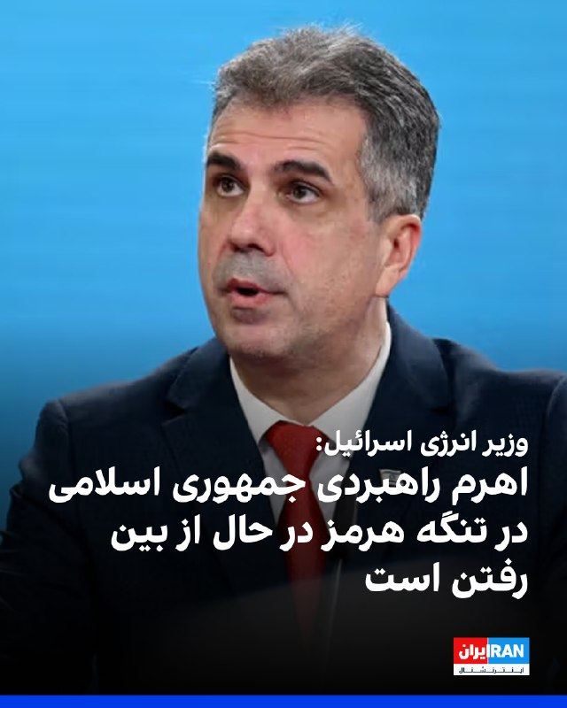

الی کوهن، وزیر انرژی اسرائیل و عضو کابینه سیاسی-امنیتی این کشور، با اشاره به آنچه «برنامه‌های راهبردی» برای دور زدن تهدیدهای جمهوری اسلامی علیه مسیرهای تجاری خواند، گفت: «تمام نبرد ایران در تنگه هرمز و آن اهرم راهبردی که به کار می‌گیرد، در حال از بین رفتن است.»

او افزود در روزهای اخیر گفت‌وگوهایی درباره ایجاد زیرساخت‌های انرژی از شرق به غرب در جریان است و هدف از این طرح‌ها، انتقال انرژی به اروپا از طریق اسرائیل عنوان شده است.

کوهن همچنین از مذاکرات برای ایجاد خطوط انتقال انرژی از مسیر کشورهای خلیج فارس خبر داد و گفت کشورهایی مانند عربستان سعودی و امارات متحده عربی، به عنوان تولیدکنندگان مهم انرژی، تمایل دارند در این طرح‌های اقتصادی مشارکت کنند.

به گفته وزیر انرژی اسرائیل، کریدور زیرساختی میان هند و اروپا از طریق کشورهای خلیج فارس و اسرائیل در دست بررسی است و استفاده از مسیر مصر نیز می‌تواند روند پیشبرد این طرح‌ها را تسریع کند. او تاکید کرد گفت‌وگوهای مشخصی در این زمینه در حال انجام است.
‌🏁 🇬🇧 IranintlTV

🤖 @VahidOOnLine

## WithYashar — post 12673

  <a href="telegram/content/WithYashar_12673_1779882191.mp4" target="_blank">🎬 Download video</a>

پیمان بستم و شب و روز بیدارم 
👑
@withyashar

## WithYashar — post 12672

## DEJradio — post 5026

⭕️ اسرائیل از حذف فرماندۀ تازۀ شاخۀ نظامی حماس در غزه خبر داد

ارتش اسرائیل و شاباک اعلام کردند محمد عوده، فرماندۀ تازۀ شاخۀ نظامی حماس در غزه، در حملۀ هوایی شامگاه سه‌شنبه در شمال غزه کشته شد.
به گفتۀ مقام‌های اسرائیلی، عوده پس از کشته شدن عزالدین حداد در هفتۀ پیشین، فرماندهی شاخۀ نظامی حماس را برعهده گرفته بود.
ارتش اسرائیل اعلام کرد عوده از طراحان حملۀ تروریستی هفتم اکتبر بود.
بنا بر گزارش ارتش اسرائیل، محمد عوده در جریان جنگ نیز عملیات اطلاعاتی و حملات علیه نیروهای اسرائیلی را هدایت می‌کرد.
حماس که سال‌ها از پشتیبانی مالی و فکری جمهوری اسلامی برخوردار بود، در سیاهۀ تروریستی آمریکا و اروپا قرار دارد.
رسانه‌های نزدیک به حماس مدعی شدند محمد عوده همراه با همسر و پسرانش کشته شده است.
یسرائیل کاتز، وزیر دفاع اسرائیل نوشت: ما خود را متعهد کرده‌ایم همۀ کسانی را که کشتار هفتم اکتبر را رهبری کردند از میان برداریم.
به گفتۀ کاتز، همه این افراد، در هر جا که باشند، نشان شده‌اند.

#خبر #دژ #اسرائیل #حماس
@DEJradio

## DEJradio — post 5025

  <a href="telegram/content/DEJradio_5025_1779882193.webm" target="_blank">🎬 Download video</a>

🔺📢 پاشنه آشیل جمهوری اسلامی؛ بحران مشروعیت برای هواداران

*پژمان گلچین، پژوهشگر فلسفه

#پاشنه_آشیل #جنگ
@DEJradio

## mamlekate — post 103590

📝 ترامپ به ایران فرصت صلح داد اما نمی‌تواند به حاکمان مذهبی‌اش اعتماد کند

انتشار این خبر که دونالد ترامپ، رئيس‌جمهوری ایالات متحده، در اقدامی غیرمعمول، قرار است چهارشنبه با تمام اعضای کابینه خود جلسه داشته باشد، نشان می‌دهد او در حال بررسی راه‌هایی برای سرعت بخشیدن به مذاکرات به‌شدت کند و فرسایشی با جمهوری اسلامی ایران است.

@mamlekate

## mamlekate — post 103589

الو چهارشنبه ساعت ۱۳:۰۰ واحد هوا پتروشیمی دماوند که توی جنگ روز ۱۷ فروردین نیروگاهشون مورد اصابت قرار گرفته بود دچار انفجار شد. حداقل ۱ نفر کشته و ۴ نفر مجروح شدن. دلیل انفجار هنوز معلوم نیست.

@mamlekate

## Shin_Persian — post 6258

  

Shin ✓ @hey_itsmyturn Wed, 27 May 2026 11:34:53 UTC #IDF 🇮🇱: "The first aircraft of its kind in the Air Force was inducted into the new refueling squadron - 'Gideon' The Chief of Staff at the induction ceremony: "The edifice of evil of the Ayatollah regime…

## Shin_Persian — post 6257

Shin ✓ @hey_itsmyturn
Wed, 27 May 2026 11:34:53 UTC

#IDF 🇮🇱:
"The first aircraft of its kind in the Air Force was inducted into the new refueling squadron - 'Gideon'

The Chief of Staff at the induction ceremony: "The edifice of evil of the Ayatollah regime has cracked significantly and its future and stability are shrouded in fog. Its leaders are pursued, most of its military capabilities have been destroyed, the nuclear program has been set back years; its economy is collapsing and its citizens have not yet understood the magnitude of the disaster to which their extremist leaders have led them""
#Iran

فارسی

#IDF 🇮🇱:
"نخستین هواپیما از این نوع در نیروی هوایی به اسکادران جدید سوخت‌رسان - 'گیدئون' ملحق شد.

رئیس ستاد کل نیروهای مسلح در مراسم الحاق: «بنای شرارت رژیم آیت‌الله‌ها به شدت ترک خورده و آینده و ثبات آن در هاله‌ای از ابهام است. رهبران آن تحت تعقیب هستند، اکثر توانمندی‌های نظامی‌اش نابود شده، برنامه هسته‌ای سال‌ها به عقب رانده شده؛ اقتصاد آن در حال فروپاشی است و شهروندانش هنوز ابعاد فاجعه‌ای را که رهبران افراطی‌شان آن‌ها را به سوی آن سوق داده‌اند، درک نکرده‌اند»"
#Iran

𝕏 · @shin_persian

## RadioFarda — post 157606

  <a href="https://t.me/radiofarda/157606" target="_blank">📎 Download file</a>

📻بشنوید: ساعت ۱۴ با رادیوفردا، ششم خرداد ۱۴۰۵‌

@Radiofarda

## IranianMinds — post 20868

  

🔴وضعیت فیلترشکن فروش‌ها بعد از وصل شدن نت بین‌الملل.

@IranianMinds

## IranianMinds — post 20867

آخوند حمید رسایی :

قلبم به درد آمد وقتی دیدم پزشکیان اینترنت بین الملل را غیرقانونی وصل کرده است.

@IranianMinds

## BBCPersian — post 282183

🔻پیام‌های مخاطبان بی‌بی‌سی بعد از اتصال اینترنت؛ «این مدت هیچکس غم مردم را نخورد»

🔻تعدادی از مخاطبان بی‌بی‌سی پس از اتصال نسبی به اینترنت، از کیفیت و سرعت اتصال و نظراتشان درباره کمک جامعه جهانی به مردم ایران در ۸۸ روزی که اینترنت قطع بود، نوشتند.

مخاطبی از اراک نوشت: «فیبر نوری دارم و الان وصل شدیم البته باز هم بدون فیلترشکن تلگرام وصل نمی‌شود. این مدت هیچکس غم مردم را نخورد. حیف این مردمی که این هزینه‌های سنگین برای آزادی پرداخت می‌کنند...افسوس.»یکی دیگر از مخاطبان نوشته است: «خیلی حرف‌ها دارم اما الان زمانش نیست چون خسته‌ام. حتی از اقوام درجه یک خودم که خارج کشور در رفاه بودند و من و زن و بچه‌ام زیر موشک.... دلم گرفته... بزودی خواهم گفت از تک تک روزهای لعنتی جنگ .»

مخاطب دیگری که ۱۷ ساله است و در تهران زندگی می‌کند، نوشته است: «می‌خواستم یه چیزی بگم. واقعا خسته شدیم. از گرانی، از تحریم، از نت ضیف. کارها هم خوابیده. دیگه نمی‌توانم زندگی کنم.»

تعدادی از مخاطبان گفته‌اند که اینترنت‌های خانگی وصل شده ولی هنوز اینترنت سیمکارت آنها کار نمی‌کند. چند مخاطب هم گفته‌اند که هنوز اینترنت ندارد و با همان روش‌های قبلی وصل‌ هستند.

https://bbc.in/3PM26X5
@BBCPersian

## alonews — post 123044

  <a href="telegram/content/alonews_123044_1779882196.webm" target="_blank">🎬 Download video</a>

👈نیروی دریایی سپاه: ۲۳ شناور تا این لحظه از تنگه هرمز عبور کرده‌اند و عبور شناورهای دیگر نیز تا ساعات آینده ادامه دارد.

🔴عبور شناورهای کشورهای متخاصم از تنگه هرمز همچنان ممنوع است

✅ @AloNews خبر جنگ

---
📅 بروزرسانی: 1405/03/06 15:02
---

## VahidOOnLine — post 242408

♦️لندن در حالی که دمای هوا در ماه مه از ۳۰ درجه سانتیگراد فراتر می‌رود، رکورد گرم‌ترین روز ماه مه خود را شکست.
آخرین باری که لندن این دما را تجربه کرده بود سال ۱۹۴۴ بود که گرمای ۳۲.۸ درجه سانتیگراد را تجربه کرد.
هوا در یک آخر هفته طولانی از ۳۰ درجه سانتیگراد می‌گذرد و اداره هواشناسی بریتانیا هشدار کهربایی برای بخش‌هایی از انگلستان صادر کرده است و پیش‌بینی می‌شود که با تشدید گرما، دما به رکورد جدیدی برای ماه مه برسد.
موج گرمای کم‌سابقه، بریتانیا  را در روزهای اخیر حتی از بعضی سواحل گردشگری جنوب اروپا نیز گرم‌تر کرد.
بر اساس گزارش‌ها، بریتانیا روز دوشنبه گرم‌ترین دمای ثبت‌شده ماه مه در تاریخ خود را تجربه کرد و دماسنج‌ها در نزدیکی لندن عدد ۳۴.۸ درجه سانتی‌گراد را نشان دادند.
کارشناسان هواشناسی می‌گویند چنین دماهایی در اواخر بهار برای بریتانیا کم‌سابقه است؛ کشوری که معمولا با آب‌وهوای خنک‌ و بارانی شناخته می‌شود.
‌🇸🇦 Indypersian

🤖 @VahidOOnLine

## VahidOOnLine — post 242407

  

بر اساس اطلاعات رسیده به ایران‌اینترنشنال، حمیدرضا حدادی، جوان ۱۹ ساله اهل شاندیز، شامگاه ۱۸ دی‌ماه پس از اصابت گلوله به درمانگاه شاندیز منتقل شد اما از آنجا که دستور تخلیه درمانگاه صادر شده بود او بدون رسیدگی پزشکی جان باخت.

حمیدرضا تنها حدود نیم ساعت در میان جمعیت معترضان حضور داشت که از پشت هدف شلیک قرار گرفت. گلوله به ریه او اصابت کرد و او بر اثر شدت جراحات جان باخت.

حمیدرضا حدادی فوتبالیست بود و به گفته نزدیکانش آرزو داشت مسیر حرفه‌ای خود را در فوتبال دنبال کند. او همچنین قصد داشت یک مغازه فروش تلفن همراه برای خود راه‌اندازی کند.

پس از کشته شدن حمیدرضا، نیروهای حکومتی تلاش کردند او را به عنوان شهید معرفی کنند، اما خانواده با این موضوع مخالفت کردند. به گفته این منبع، نیروهای حکومتی بدون رضایت خانواده برای او مراسمی در مسجد برگزار کردند، اما اعضای خانواده در آن مراسم حضور نیافتند.

این منبع افزود خانواده حمیدرضا با وجود فشارهای شدید امنیتی، بر این روایت تاکید کرده‌اند که او در جریان اعتراضات و با شلیک نیروهای حکومتی کشته شده است.

‌🏁 🇬🇧 IranintlTV

🤖 @VahidOOnLine

## WithYashar — post 12669

  <a href="telegram/content/WithYashar_12669_1779881561.mp4" target="_blank">🎬 Download video</a>

وزیر امنیت داخلی اسرائیل: توافق ترامپ و ایران یک توافق بد است که می‌تواند به اسرائیل آسیب برساند. ما اجازه نخواهیم داد این اتفاق بیفتد!
@withyashar

## mwarmonitor — post 9807

🔸رئیس ستاد کل ارتش اسرائیل، ایال زامیر، گفت برنامه هسته‌ای ایران “سال‌ها” به عقب رانده شده است، در حالی که گزارش‌ها از احتمال دستیابی به یک توافق در کوتاه‌مدت با تهران خبر می‌دهند.

🔹زامیر گفت “محور شرارت” به رهبری رژیم آیت‌الله‌های ایران به‌طور قابل توجهی تضعیف شده است؛ به‌طوری‌که رهبران آن تحت تعقیب هستند، بخش زیادی از توان نظامی‌اش نابود شده، اقتصادش در حال فروپاشی است و آینده ثبات آن نامطمئن است.

@mwarmonitor

## mwarmonitor — post 9806

🔸العربیه: به گفته منابع، احتمال دارد طی چند هفته یک توافق میان آمریکا و ایران حاصل شود.

@mwarmonitor

## mwarmonitor — post 9805

🔴جان بولتن ؛ هر روزی که مذاکرات میان آمریکا و ایران ادامه پیدا می‌کند، هدیه‌ای برای این رژیم است. این گفت‌وگوها روزِ حساب‌رسیِ رژیم را به تعویق انداخته‌اند. آتش‌بس و مذاکرات پس از آن یک اشتباه کامل است.

@mwarmonitor

## mwarmonitor — post 9803

📌لکه‌های نفتی مرموز همچنان در نزدیکی جزیره خارک در حال حرکت هستند. تا دیروز هیچ کشتی در حال بارگیری نبود و با این حال هنوز تعداد زیادی کشتی در لنگرگاه حضور دارند.

🔸مخازن ذخیره‌سازی در خشکیِ خارک تغییری نکرده و در سطح پر (حداکثر ظرفیت) قرار دارند. اخیراً افزایش ذخایر عمدتاً در جاسک و بندرعباس مشاهده شده است.

@mwarmonitor

## mwarmonitor — post 9802

  <a href="telegram/content/mwarmonitor_9802_1779881563.mp4" target="_blank">🎬 Download video</a>

🔴به‌روزرسانی تنگه هرمز | عبور کشتی‌ها

🚢تعداد عبورهای تأییدشده از تنگه هرمز در منطقه تحت نظارت در تاریخ ۲۵ مه به تنها دو مورد کاهش یافت و این روند الگوی معمول آخر هفته‌ها (افزایش تردد) و سپس کاهش فعالیت در روزهای کاری را ادامه می‌دهد.

🚢هر دو کشتی از مسیر ایرانی استفاده کردند، در حالی که از ۱۰ مه تاکنون هیچ حمله فیزیکی جدیدی ثبت نشده و همچنان اختلال در سیگنال‌ها ادامه دارد.

🔸این تعداد پایین نشان می‌دهد که ترافیک همچنان محدود، وابسته به مسیر و تحت تأثیر مجوزهای عبور ایران است. مذاکرات میان آمریکا و ایران همچنان عامل کلیدی محسوب می‌شود و انتظار می‌رود دسترسی تا زمان رسیدن به چارچوب روشن‌تری برای ناوبری، به‌صورت گزینشی ادامه داشته باشد.

@mwarmonitor

## DEJradio — post 5024

⭕️ اروپا از گسترش تهدیدهای روسیه به حوزۀ بالتیک و حملات سایبری نگران است

گزارش‌ها نشان می‌دهد نگرانی اروپا در مورد روسیه از جنگ اوکراین فراتر رفته و اکنون احتمال تهدید کشورهای بالتیک و تشدید حملات سایبری نیز مطرح است.
کایا کالاس، مسئول سیاست خارجی اتحادیۀ اروپا هشدار داد اگر کرملین برای ادامۀ جنگ به بسیج تازه نیاز پیدا کند، ممکن است به سمت تشدید تنش در منطقه حرکت کند.
همچنین رئیس سازمان اطلاعات ارتباطات در دولت بریتانیا گفت روسیه به‌طور مداوم زیرساخت‌های حیاتی، روندهای دموکراتیک و زنجیره‌های تأمین در اروپا را هدف قرار می‌دهد.

#خبر #دژ #سایبری #اروپا
@DEJradio

## DEJradio — post 5023

⭕️ از آغاز عملیات «غرش شیران» درحدود ۲۵۰۰ عضو حزب‌الله کشته شدند؛ مخالفت ترامپ با حملۀ دوبارۀ اسرائیل به بیروت

بنیامین نتانیاهو، نخست‌وزیر اسرائیل گفت از آغاز عملیات «غرش شیران» درحدود ۲۵۰۰ عضو حزب‌الله کشته شدند.
شبه‌نظامیان حزب‌الله لبنان که توسط جمهوری اسلامی هدایت می‌شوند، در سیاهۀ تروریستی اتحادیۀ اروپا و آیالات متحده قرار دارند.
نخست‌وزیر اسرائیل افزود تنها در دورۀ آتش‌بس جنگ چهل روزه ۷۰۰ عضو حزب‌الله کشته شدند.
به گفتۀ نتانیاهو، این رقم از کل تلفات حزب‌الله در جنگ دوم لبنان بیشتر بود.
رسانۀ اسرائیلی وای‌نت گزارش داد نتانیاهو و یسرائیل کاتز، وزیر دفاع در نشست کابینۀ امنیتی، دلیل خودداری از حملۀ دوباره به بیروت را مخالفت آمریکا عنوان کرده‌اند.
از سویی شرکت تسلیحاتی اسرائیلی البیت سیستمز، از امضای قرارداد ۱.۴ میلیارد دلاری فروش تسلیحات به یک کشور اروپایی خبر داد. نام این کشور اعلام نشده است.

#خبر #دژ #اسرائیل #غرش_شیران
@DEJradio

## IranIntlTV — post 339227

  

الی کوهن، وزیر انرژی اسرائیل و عضو کابینه سیاسی-امنیتی این کشور، با اشاره به آنچه «برنامه‌های راهبردی» برای دور زدن تهدیدهای جمهوری اسلامی علیه مسیرهای تجاری خواند، گفت: «تمام نبرد ایران در تنگه هرمز و آن اهرم راهبردی که به کار می‌گیرد، در حال از بین رفتن است.»

او افزود در روزهای اخیر گفت‌وگوهایی درباره ایجاد زیرساخت‌های انرژی از شرق به غرب در جریان است و هدف از این طرح‌ها، انتقال انرژی به اروپا از طریق اسرائیل عنوان شده است.

کوهن همچنین از مذاکرات برای ایجاد خطوط انتقال انرژی از مسیر کشورهای خلیج فارس خبر داد و گفت کشورهایی مانند عربستان سعودی و امارات متحده عربی، به عنوان تولیدکنندگان مهم انرژی، تمایل دارند در این طرح‌های اقتصادی مشارکت کنند.

به گفته وزیر انرژی اسرائیل، کریدور زیرساختی میان هند و اروپا از طریق کشورهای خلیج فارس و اسرائیل در دست بررسی است و استفاده از مسیر مصر نیز می‌تواند روند پیشبرد این طرح‌ها را تسریع کند. او تاکید کرد گفت‌وگوهای مشخصی در این زمینه در حال انجام است.
https://iranintl.com/202605274358

## IranIntlTV — post 339226

  

🔻خبرگزاری فارس، رسانه وابسته به سپاه پاسداران، گزارش داد نامه باشگاه پرسپولیس به مسعود پزشکیان، رییس‌جمهور دولت جمهوری اسلامی، وارد مرحله بررسی در نهاد ریاست‌جمهوری شده و در روزهای اخیر نشست‌هایی در این خصوص برگزار شده است.

🔹باشگاه پرسپولیس در نامه‌ای خطاب به پزشکیان، به شرایط فوتبال و سهمیه آسیایی اعلام شده اعتراض کرده بود.

🔹بر اساس این گزارش، دو نفر از نمایندگان نهاد ریاست‌جمهوری در روزهای اخیر با حدادی، مدیرعامل پرسپولیس، جلسه‌ای برگزار کرده و در جریان جزئیات درخواست‌ها و دغدغه‌های مطرح‌شده از سوی این باشگاه قرار گرفته‌اند.

🔹فارس نوشت این افراد همچنین جلساتی جداگانه با مهدی تاج، رییس فدراسیون فوتبال، و کشوری‌فرد، از مدیران ارشد سازمان لیگ، برگزار کرده‌اند تا ابعاد مختلف موضوع را بررسی کنند.

🔹به گزارش فارس، نمایندگان نهاد ریاست‌جمهوری پس از جمع‌بندی مباحث مطرح‌شده، قرار است به‌زودی گزارش نهایی خود را به مسعود پزشکیان ارائه دهند تا درباره درخواست‌های مطرح‌شده تصمیم‌گیری شود.

🔹جزییات بیشتر را در سایت بخوانید

@iranintltvsport

## IranIntlTV — post 339225

  

بر اساس اطلاعات رسیده به ایران‌اینترنشنال، حمیدرضا حدادی، جوان ۱۹ ساله اهل شاندیز، شامگاه ۱۸ دی‌ماه پس از اصابت گلوله به درمانگاه شاندیز منتقل شد اما از آنجا که دستور تخلیه درمانگاه صادر شده بود او بدون رسیدگی پزشکی جان باخت.

حمیدرضا تنها حدود نیم ساعت در میان جمعیت معترضان حضور داشت که از پشت هدف شلیک قرار گرفت. گلوله به ریه او اصابت کرد و او بر اثر شدت جراحات جان باخت.

حمیدرضا حدادی فوتبالیست بود و به گفته نزدیکانش آرزو داشت مسیر حرفه‌ای خود را در فوتبال دنبال کند. او همچنین قصد داشت یک مغازه فروش تلفن همراه برای خود راه‌اندازی کند.

پس از کشته شدن حمیدرضا، نیروهای حکومتی تلاش کردند او را به عنوان شهید معرفی کنند، اما خانواده با این موضوع مخالفت کردند. به گفته این منبع، نیروهای حکومتی بدون رضایت خانواده برای او مراسمی در مسجد برگزار کردند، اما اعضای خانواده در آن مراسم حضور نیافتند.

این منبع افزود خانواده حمیدرضا با وجود فشارهای شدید امنیتی، بر این روایت تاکید کرده‌اند که او در جریان اعتراضات و با شلیک نیروهای حکومتی کشته شده است.

https://iranintl.com/202605270118

## FarsiVOA — post 218792

  <a href="telegram/content/FarsiVOA_218792_1779881566.mp4" target="_blank">🎬 Download video</a>

شناسایی و هدف قرار گرفتن اپراتور پهپادی حزب‌الله در جنوب لبنان؛

بر اساس گزارش ارتش اسرائیل، یک فروند هواپیمای نیروی هوایی این کشور در جریان عملیات خود در جنوب لبنان، یک پهپاد را که تهدیدی برای نیروهای اسرائیلی در منطقه محسوب می‌شد، در آسمان شناسایی کرد.

پس از فرود آمدن این پهپاد، یکی از نیروهای حزب‌الله برای جمع‌آوری آن به محل اعزام شد. هواپیمای نیروی هوایی اسرائیل با رهگیری موقعیت، در یک حمله دقیق این فرد را هدف قرار داد و از پا درآورد.

نیروی هوایی اسرائیل بر ادامه عملیات خود جهت پشتیبانی از نیروهایش در برابر تهدیدهای سازمان تروریستی حزب الله در جنوب لبنان تأکید کرده است.
@FarsiVOA

## RadioFarda — post 157605

🔸کره جنوبی اعلام کرد سفیر ایران را در اعتراض به حمله به یک کشتی این کشور در تنگه هرمز احضار خواهد کرد. 🔸این احضار پس از آن صورت می‌گیرد که دولت سئول اعلام کرد در تحقیقات خود به این نتیجه رسیده که «به احتمال بسیار زیاد» موشکی ساخت ایران عامل حمله به این کشتی…

## RadioFarda — post 157604

  

🔸کره جنوبی اعلام کرد سفیر ایران را در اعتراض به حمله به یک کشتی این کشور در تنگه هرمز احضار خواهد کرد.

🔸این احضار پس از آن صورت می‌گیرد که دولت سئول اعلام کرد در تحقیقات خود به این نتیجه رسیده که «به احتمال بسیار زیاد» موشکی ساخت ایران عامل حمله به این کشتی بوده است.

🔸این کشتی باری کره‌جنوبی ۱۴ اردیبهشت توسط یک هواگرد ناشناس در تنگه هرمز هدف قرار گرفت.

🔸دونالد ترامپ بعد از این حمله گفته بود که ایران «چند شلیک» به سوی این کشتی با پرچم پاناما انجام داده اما تهران مسئولیت این حمله را رد کرده بود.

🔸پس از چند هفته تحقیق، دولت کره‌ جنوبی اعلام کرد که تحلیل‌های فنی نشان داده‌اند پرتابه ناشناسی که به کشتی اصابت کرده «به احتمال بسیار زیاد» نسخه‌ای دیگر از موشک توسعه‌یافتهٔ «نور» بوده است.

🔸پارک یون‌جو، معاون اول وزیر خارجه کره‌ جنوبی، در یک نشست خبری گفت: «دولت ما قصد دارد سفیر ایران را احضار کند تا نتایج تحقیقات را توضیح دهد، اعتراض شدید خود را نسبت به حمله به کشتی‌مان اعلام کند و خواستار اقدامات مسئولانه، از جمله تدابیری برای جلوگیری از تکرار چنین حادثه‌ای شود.»

@RadioFarda

## alonews — post 123043

  <a href="telegram/content/alonews_123043_1779881568.webm" target="_blank">🎬 Download video</a>

👈 رئیس ستاد کل ارتش اسرائیل، ایال زامیر، امروز ارقام جدیدی را به کابینه امنیتی اسرائیل ارائه داد که نشان می‌دهد از اکتبر ۲۰۲۳، نیروهای اسرائیلی حدود ۸۰۰۰ مبارز مظنون حزب‌الله را کشته‌اند، طبق گزارش ینت.

🔴تقریباً ۲۵۰۰ نفر در جریان «عملیات شیر غران» کشته شدند، در حالی که ۷۰۰ مبارز دیگر پس از اجرای آتش‌بس کشته شدند.

✅ @AloNews خبر جنگ

## alonews — post 123042

  <a href="telegram/content/alonews_123042_1779881568.webm" target="_blank">🎬 Download video</a>

👈وزیر دفاع اسرائیل کاتز: اگر به شهرک‌های ما شلیک کنند، طبق وضعیتی که در گذشته به آنها عادت داده‌ایم، باید ساکنان ضاحیه را تخلیه کنیم، حمله کنیم و آن را ویران کنیم.

🔴اگر پهپاد باشد — دیگر کسی نخواهد بود.

🔴در حال حاضر در این زمینه با آمریکا در وضعیت پیچیده‌ای هستیم. در عین حال، ما متعهد به دفاع از خود به هر طریق هستیم؛ هیچ‌کس ما را متوقف نمی‌کند

✅ @AloNews خبر جنگ

---
📅 بروزرسانی: 1405/03/06 14:52
---

## WithYashar — post 12668

شبکه 12 اسرائیل:ناوگان هوایی آمریکا ظرف 72 ساعت به پایگاه‌های خود در اروپا منتقل خواهد شد و در صورت از سرگیری درگیری با ایران، هواپیماها در حالت آماده‌باش برای بازگشت به فرودگاه بن گوریون قرار خواهند گرفت
@withyashar

## mwarmonitor — post 9801

  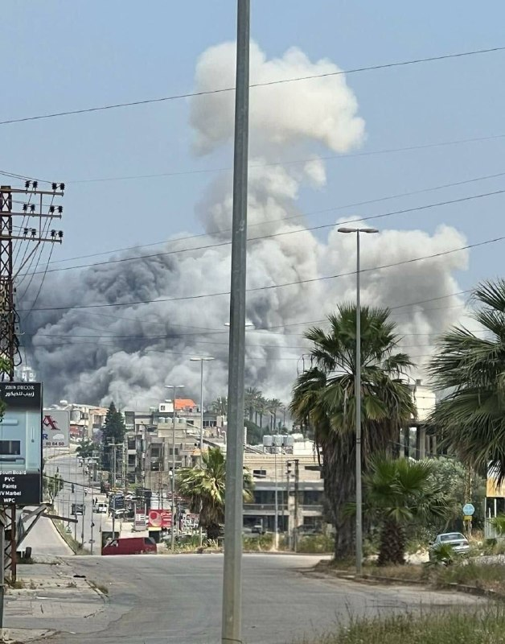

🔴ارتش اسرائیل (IDF) در حال حاضر در حال هدف قرار دادن عمق لبنان، از جمله دره بقاع است.

@mwarmonitor

## pm_afshaa — post 91646

vless://47030ea3-4e8c-4dd6-b440-418a7a54c1a0@47.82.87.196:50724?encryption=none&security=none&type=tcp&headerType=none#PMTV%20NEWS%20%F0%9F%A6%81%E2%98%80%EF%B8%8F

نامحدود سرعت بالا مخصوص اینستا و دانلود

💧 Rainbet.com the #1 Non-KYC Crypto Casino & Sportsbook @rainbetcom

😁 @Pm_Afshaa

## pm_afshaa — post 91645

🔴شبکه 12 اسرائیل:ناوگان هوایی آمریکا ظرف 72 ساعت به پایگاه‌های خود در اروپا منتقل خواهد شد و در صورت از سرگیری درگیری با ایران، هواپیماها در حالت آماده‌باش برای بازگشت به فرودگاه بن گوریون قرار خواهند گرفت

💧 Rainbet.com the #1 Non-KYC Crypto Casino & Sportsbook @rainbetcom

😁 @Pm_Afshaa

## DEJradio — post 5022

⭕️ واردات نفت به چین به پایین‌ترین سطح از سال ۲۰۱۶ سقوط کرد

شرکت اطلاع‌رسانی کالا «کپلر» اعلام کرد واردات روزانۀ نفت به چین در ماه جاری میلادی به ۶.۶ میلیون بشکه کاهش یافته است. این رقم پایین‌ترین سطح از سال ۲۰۱۶ به شمار می‌رود.
به گزارش کپلر، انسداد تنگۀ هرمز از سوی جمهوری اسلامی عامل اصلی این افت شدید بود.
چین سال گذشته روزانه درحدود ۱۱ میلیون و ۵۵۰ هزار بشکه نفت وارد می‌کرد که حدودا ۴۵ درصد آن از کشورهای حوزۀ خلیج فارس تأمین می‌شد.
به گزارش کپلر، کاهش خرید نفت توسط چین سبب شده نفت بیشتری در اختیار پالایشگاه‌های دیگر کشورهای آسیایی قرار گیرد.

#خبر #دژ #چین #نفت
@DEJradio

## IranIntlTV — post 339224

سفیر اسرائیل در استرالیا: در صورت بی‌نتیجه ماندن مذاکرات، گزینه نظامی دوباره روی میز است

هیلل نیومن، سفیر اسرائیل در استرالیا، در گفت‌وگو با علیرضا محبی، خبرنگار ایران‌اینترنشنال، هشدار داد در صورتی که مذاکرات جاری با تهران به نتایج مورد نظر نرسد، احتمال ازسرگیری عملیات نظامی علیه جمهوری اسلامی وجود خواهد داشت.

نیومن چهارشنبه ششم خرداد اعلام کرد هدف این مذاکرات، «برچیدن توان هسته‌ای جمهوری اسلامی، توقف کامل غنی‌سازی و نبود هرگونه ذخیره اورانیوم غنی‌شده در ایران» است.

به گفته او، موضوع برنامه موشک‌های بالستیک جمهوری اسلامی و حمایت تهران از گروه‌های نیابتی که موجب بی‌ثباتی در سراسر خاورمیانه می‌شوند، از دیگر محورهای اصلی مذاکرات به شمار می‌رود.

نیومن ادامه داد: «اگر بتوانیم از طریق مذاکرات و گفت‌وگوهای دیپلماتیک به این اهداف برسیم، بسیار خوب است. در غیر این صورت ممکن است مجبور شویم دوباره به کارزار نظامی بازگردیم تا این اهداف را محقق کنیم. اما این اهداف حتما باید محقق شوند. ما نمی‌توانیم بر سر اهداف خود مصالحه کنیم.»

در روزهای گذشته، گمانه‌زنی‌ها درباره سرنوشت مذاکرات تهران و واشینگتن و مفاد توافق احتمالی دو طرف بالا گرفته است.

روزنامه وال‌استریت‌ ژورنال پنجم خرداد به نقل از مقام‌های حکومت ایران و میانجی‌های عرب گزارش داد تهران در مذاکرات با واشینگتن دو هدف اصلی را دنبال می‌کند: کاهش فشار اقتصادی و دسترسی دوباره به منابع مالی و بازار نفت.

بر اساس این گزارش، جمهوری اسلامی در عین حال تلاش دارد از ارائه امتیازهایی که بتواند از سوی دونالد ترامپ، رییس‌جمهوری آمریکا، به‌عنوان «پیروزی سیاسی» معرفی شود، خودداری کند.

تفاهم اسرائیل و آمریکا درباره مذاکرات
سفیر اسرائیل در استرالیا در ادامه مصاحبه با ایران‌اینترنشنال اعلام کرد آمریکا و اسرائیل در مورد اهداف مذاکرات با جمهوری اسلامی با یکدیگر «تفاهم» دارند و «درک مشترک» دو طرف این است که گفت‌وگوهای جاری باید به تحقق این اهداف بینجامد.

نیومن ادامه داد: «رییس‌جمهور ترامپ گفته است که درباره موضوع غنی‌سازی اورانیوم و توانایی هسته‌ای ایران مصالحه نخواهد کرد.»

او اضافه کرد: «ما مخالف راه‌حل دیپلماتیک نیستیم. ما می‌خواهیم جان انسان‌ها حفظ شود. اگر بتوانیم از طریق یک راه‌حل دیپلماتیک جان انسان‌ها را نجات دهیم، بسیار خوب است. بنابراین اکنون نیز از گفت‌وگوها حمایت می‌کنیم، به شرط آنکه مذاکرات به اهداف مورد نظر برسد.»

سفیر اسرائیل در استرالیا همچنین برجام را «توافقی بد» خواند و افزود اسرائیل در دوران ریاست‌جمهوری باراک اوباما، «تقریبا تنها کشوری» بود که به‌صراحت از این توافق انتقاد کرد.

در روزهای گذشته، ترامپ بارها رویکرد اوباما در قبال برنامه هسته‌ای جمهوری اسلامی را مورد انتقاد قرار داده و برجام را «فاجعه» خوانده است.

او پیش‌تر در واکنش به انتقادها از توافق احتمالی میان تهران و واشینگتن تاکید کرد حاضر به پذیرش «توافق بد» با جمهوری اسلامی نیست و توافق مدنظر او کاملا متفاوت از برجام خواهد بود.

ترامپ در نخستین دوره حضور خود در کاخ سفید، سیاست فشار حداکثری را در برابر حکومت ایران در پیش گرفت و سرانجام سال ۱۳۹۷ از برجام خارج شد.

نیومن: در حال ایجاد فرصت برای مردم ایران هستیم
سفیر اسرائیل در استرالیا در ادامه، از دستاوردهای کارزار نظامی اخیر علیه جمهوری اسلامی تمجید کرد و گفت تضعیف سپاه پاسداران و بسیج «موفقیت‌های عظیمی» هستند که نباید آن‌ها را نادیده گرفت.

نیومن تاکید کرد: «ما در حال ایجاد فرصت برای مردم ایران هستیم تا سرنوشت خود را به دست بگیرند و درباره رهبری آینده کشورشان تصمیم‌گیری کنند.»

او افزود اسرائیل آتش‌بس را پذیرفته، زیرا در پی آن است که «با حسن نیت، فرصت مناسبی برای گفت‌وگوها و حل‌وفصل دیپلماتیک مساله فراهم شود».

نیومن بار دیگر خاطرنشان کرد در صورت ناکامی مسیر دیپلماتیک، اسرائیل ممکن است بار دیگر گزینه نظامی را «با هماهنگی ایالات متحده» در دستور کار قرار دهد.
 
🔗وب‌سایت ایران‌اینترنشنال
@iranintltv

## BBCPersian — post 282182

  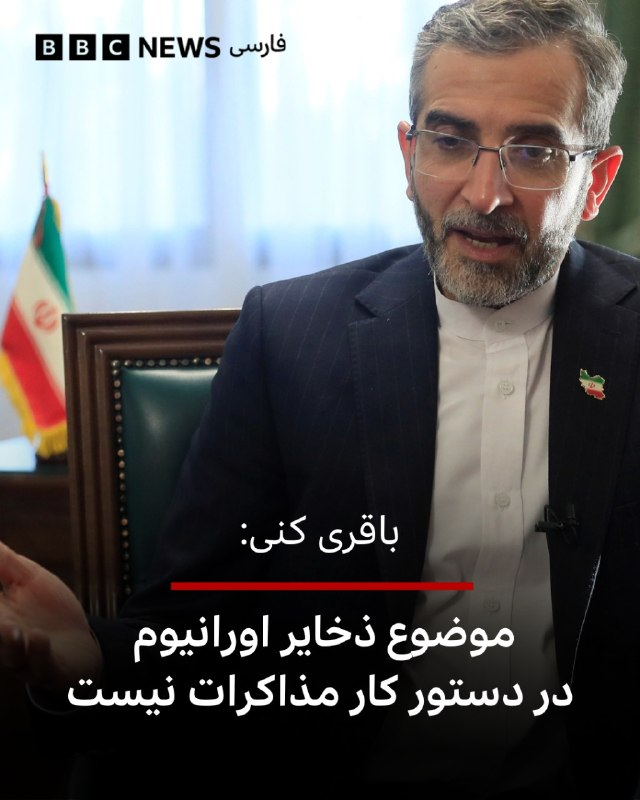

‌🔻علی باقری کنی، معاون سیاست خارجی و امنیت بین‌الملل دبیرخانه شورای عالی امنیت ملی ایران می‌گوید که «موضوع ذخایر اورانیوم در دستور کار مذاکرات نیست.»

او این موضوع را در پاسخ به پرسشی در حاشیه چهاردهمین نشست بین‌المللی مقامات بلندپایه امنیتی در مسکو مطرح کرد.

پیشتر دونالد ترامپ، رئیس جمهور آمریکا، گفت که اورانيوم غنی‌شده ایران یا به تعبیر او «غبار هسته‌ای به ايالات متحده تحويل داده خواهد شد تا به آمريکا منتقل و نابود شود، يا ترجيحا با همکاری و هماهنگی ايران، در همان محل يا در مکان مورد توافق ديگری، نابود خواهد شد.»

📷EPA
https://bbc.in/3PuodBw

@BBCPersian

## Dirty_Kids — post 390308

  <a href="telegram/content/Dirty_Kids_390308_1779880951.mp4" target="_blank">🎬 Download video</a>

حالا فهمیدید چرا اینترنت رو قطع کردن؟
چون نمی‌خواستن این تصاویر حماسی و پرشور مردم پادشاهی خواه داخل ایران به بیرون درز کنه.

@Dirty_Kids 👻

## Dirty_Kids — post 390307

  

🔴 آخوند حمید رسایی: از وقتی اینترنت وصل شده قلبم درد گرفته، یه لحظه‌ام نتونستم بخوابم.

وصل شدن اینترنت پایمال کردن خون رهبر شهیدمونه، با اینکار تن رهبری تو گور لرزید.
عوامل موساد باعث بازگشایی اینترنت شدن.

@Dirty_Kids 👻

## Dirty_Kids — post 390306

  <a href="https://t.me/Dirty_Kids/390306" target="_blank">📎 Download file</a>

📱 اپلیکیشن اندروید بدون فیلتر ریتزوبت

➖➖➖➖➖

🔹 ثبت نام آسان 
✅
🔹 رابط کاربری بسیار راحت و سریع 
✅
🔹 درگاه پرداخت کارت به کارت 
✅
🔹 درگاه پرداخت دلاری سریع 
✅
🔹 بونوس ۱۰۰ درصدی اولین واریز 
✅
🔹 بونوس ۱۰۰ درصدی واریز یکشنبه ها 
✅

➖➖➖➖➖
🌐 https://RitzoBet.com

⚡️ @RitzoBet_ir

## Dirty_Kids — post 390305

  

⚠️ برای #شرطبندی های فوتبال از سایت معتبر و بین المللی استفاده کنید ✅

سایت #ریتزوبت ، چهار سال هستش داخل ایران فعالیت میکنه 
✅

لایسنس بین المللی داره ، روش های شارژ و برداشت متنوع داره و بونوس 100% ورزشی و کش بک های جذاب
💎

⏪ اپلیکیشن بدون فیلتر ریتزوبت 
📱
⏩
R6

✅ لینک بدون‌ فیلتر ریتزوبت
🤣

🆔 @RitzoBet_ir 
🇮🇷

## Dirty_Kids — post 390302

‏ترامپ مادر×نده امتحانا داره حضوری میشه، خیالت راحت شد؟

@Dirty_Kids 👻

## alonews — post 123041

  <a href="telegram/content/alonews_123041_1779880954.webm" target="_blank">🎬 Download video</a>

👈عضو هیئت‌مدیره اتحادیه مشاوران املاک:پس از جنگ ۴۰ روزه، قیمت‌های پیشنهادی مسکن در مناطق مختلف تهران به طور میانگین ۷۰ تا ۸۰ درصد رشد داشته است

✅ @AloNews خبر جنگ

## alonews — post 123038

  <a href="telegram/content/alonews_123038_1779880954.webm" target="_blank">🎬 Download video</a>

👈جنگنده‌های اسرائیلی لحظاتی پیش حمله هوایی به حبوش و نبطیه الفوقا در جنوب لبنان انجام دادند

✅ @AloNews خبر جنگ

## alonews — post 123037

  <a href="telegram/content/alonews_123037_1779880954.webm" target="_blank">🎬 Download video</a>

👈علی باقری، معاون دبیر شورای عالی امنیت ملی ایران، امروز در حاشیه چهاردهمین نشست بین‌المللی امنیت در مسکو با مشاور امنیت ملی سوئیس دیدار کرد

✅ @AloNews خبر جنگ

## alonews — post 123036

  <a href="telegram/content/alonews_123036_1779880954.webm" target="_blank">🎬 Download video</a>

👈العربیه: رئیس‌جمهور ایران و نخست‌وزیر پاکستان امروز به صورت تلفنی گفتگو کردند

✅ @AloNews خبر جنگ

---
📅 بروزرسانی: 1405/03/06 14:42
---

## WithYashar — post 12667

جلسه کمپ دیوید که قرار بود امروز برگزار شود ترامپ اعلام کرد: جلسه کابینه به دلیل شرایط آب و هوایی در کاخ سفید برگزار خواهد شد، نه در کمپ دیوید! حالا صحبت‌هایی هست که کمپ دیوید یک تله برای شناسایی فردی بود که اطلاعات را نشت می‌داد ! فرد مورد نظر گیر افتاد !…

## pm_afshaa — post 91644

https://t.me/proxy?server=tg.capycore.ru&port=443&secret=27ebe852539fb8ec5f327c73262bb721

پروکسی مناسب دانلود فیلم و سریال

💧 Rainbet.com the #1 Non-KYC Crypto Casino & Sportsbook @rainbetcom

😁 @Pm_Afshaa

## pm_afshaa — post 91643

🔴آمریکا اجازه اقامت به تیم ملی فوتبال جمهوری اسلامی در بازی های جام جهانی ر‌و نداده و برای هر بازی که تو آمریکا داره؛ فقط همون 2 ساعت اجازه اقامت داره و بعد از بازی سریع باید برگرده مکزیک

💧 Rainbet.com the #1 Non-KYC Crypto Casino & Sportsbook @rainbetcom

😁 @Pm_Afshaa

## DEJradio — post 5021

⭕️ جمهوری اسلامی نیروهای بسیج را برای استفاده از موشک‌های دوش‌پرتاب تحت آموزش قرار داد

شبکۀ فرانس۲۴ گزارش داد به ویدئوها و اسنادی دست یافته که نشان می‌دهد نیروهای نظامی جمهوری اسلامی آموزش گستردۀ استفاده از موشک‌های دوش‌پرتاب «منپدز» به اعضای بسیج‌ را ازسر گرفته‌اند.
سامانۀ دوش‌پرتاب مپندز، شامل موشک‌هایی سبک و هدایت‌شونده است که به‌صورت تک‌نفره قابل استفاده است.
این سامانه بدون نیاز به رادار، هواپیما را با حسگر ردیابی می‌کند و موشک‌های آن بردی بین پنج تا ده کیلومتر دارند.
بر اساس این گزارش، رژیم در جریان جنگ چهل روزه با استفاده از این سامانه‌ها سعی کرد ده‌ها هواپیمای آمریکایی را هدف بگیرد.
فرانس۲۴ همچنین گزارش داده ویدئوها و فایل‌های آموزشی در مورد موشک‌های «میثاق-۱» و «سهند-۳» نیز چند روز پس از آغاز آتش‌بس، در میان هزاران نیروی بسیج توزیع شد.
به گفتۀ کارشناسان، کار با این سامانه‌ها ساده است و حتا آموزش کوتاه‌مدت نیز می‌تواند برای یادگیری استفاده از آن و هدف قرار دادن هواپیماهایی که در ارتفاع پایین پرواز می‌کنند، کافی باشد.
فرانس۲۴ همچنین خبر داد جمهوری اسلامی علاوه بر تولید داخلی، احتمالا شماری از سامانه‌های روسی وربا و نمونه‌هایی از سامانه‌های دوش‌پرتاب چینی را نیز در اختیار دارد.

#خبر #دژ #مزدوران_بسیج
@DEJradio

## IranIntlTV — post 339223

  

🔻آرینا سابالنکا، زن شماره یک تنیس جهان، که به دلیل استفاده از جواهرات ۱۰۰ هزار دلاری در رولان گاروس به ریاکاری متهم شده، اعلام کرد سبک زندگی مجلل او مانع تلاشش برای بهبود وضعیت مالی تنیس‌بازان کم‌درآمد نیست.

🔹ماجرا از جایی آغاز شد که این تنیس‌باز بلاروسی در نخستین مسابقه خود با دو گردنبند و گوشواره‌های الماس به ارزش ۱۰۰ هزار دلار وارد زمین شد. این موضوع بلافاصله جنجال‌برانگیز شد؛ زیرا ارزش این جواهرات تقریبا با جایزه ۹۴ هزار دلاری رقیب شکست‌خورده او در همان مسابقه برابری می‌کرد. از آنجا که سابالنکا یکی از چهره‌های اصلی اعتراض به توزیع ناعادلانه درآمدها در تورنمنت‌های بزرگ است، برخی رسانه‌ها و منتقدان او را به رفتار ریاکارانه متهم کردند.

🔹سابالنکا در کنفرانس خبری این اتهام را رد کرد و گفت ثروت شخصی‌اش ارتباطی به این مبارزه ندارد. او با اشاره به درآمد ۱۵ میلیون دلاری خود در فصل گذشته گفت هدفش حمایت از بازیکنان رده‌های پایین‌تر، نسل جدید و تنیس‌بازان آسیب‌دیده‌ای است که برای بقا در دنیای حرفه‌ای تنیس تلاش می‌کنند.
@iranintltvsport

## DW_Farsi — post 125198

  

🔶 باقری: تماس‌های غیرمستقیم با آمریکا ادامه دارد؛ موضوع ذخایر اورانیوم مطرح نیست

علی باقری کنی، معاون دبیر شورای عالی امنیت ملی ایران گفته است، "تماس‌های غیرمستقیم" میان تهران و واشنگتن ادامه دارد، اما "موضوع ذخایر اورانیوم غنی‌شده ایران در مذاکرات جاری مطرح نیست".

باقری که برای شرکت در کنفرانس امنیتی مسکو به روسیه سفر کرده، اعلام کرد که ایران و عمان در حال مذاکره برای تعیین "سازوکاری جدید" برای عبور کشتی‌ها از تنگه هرمز هستند.

او با بیان اینکه شرایط عبور و مرور در تنگه هرمز پس از جنگ اخیر "با گذشته متفاوت خواهد بود"، به خبرنگاران گفت: «تا زمانی که در همه مسائل به توافق نرسیم، معتقدیم که در هیچ‌چیز به توافق نرسیده‌ایم.»

اظهارات باقری در حالی مطرح می‌شود که تهران و واشنگتن در هفته‌های اخیر، با میانجیگری پاکستان، مذاکراتی را برای دستیابی به تفاهم‌نامه پایان جنگ دنبال کرده‌اند.

بر اساس گزارش‌ها، موضوعاتی مانند بازگشایی تنگه هرمز، آزادسازی دارایی‌های بلوکه‌شده ایران و توقف درگیری‌های نظامی، از محورهای اصلی این گفت‌وگوها بوده است.

@dw_farsi

## DW_Farsi — post 125188

📸 آلمان چقدر ثروتمند دارد؟

در سال گذشته، دارایی مالی خصوصی در سراسر جهان ۷٫۴ درصد رشد کرده است. این رشد ثروت در سال ۲۰۲۵ به‌مراتب بیشتر از نرخ تورم بوده است. در مجموع، ثروت خالص جهانی شامل دارایی‌های فیزیکی به ۵۵۰ تریلیون دلار آمریکا رسیده است.

این موضوع در گزارش ثروت جهانی ۲۰۲۶ (Global Wealth Report 2026) گروه مشاوره بوستون منتشرشده است.

در آلمان نیز ثروت به‌طور چشمگیری افزایش یافته است: تا تاریخ ۳۱ دسامبر سال ۲۰۲۵، مجموع ثروت در این کشور به ۲۳٫۳ تریلیون دلار رسیده است. بیش از نیمی از این ثروت در دارایی‌های فیزیکی، به‌ویژه املاک، سرمایه‌گذاری شده است.

طبق تعریف این گزارش، هر فردی که بیش از ۱۰۰ میلیون دلار "دارایی مالی" داشته باشد، فوق‌ثروتمند محسوب می‌شود.

دارایی‌های مالی به مجموعه‌ای از منابع و سرمایه‌های پولی گفته می‌شود که ارزش آن‌ها بر اساس پول نقد، اسناد مالی و مطالبات سنجیده می‌شود.

در آلمان ۵۰۰۰ نفر در گروه فوق‌ثروتمند قرار دارند. در سراسر جهان نیز نزدیک به ۹۷ هزار فوق‌ثروتمند وجود دارد که بیش از یک‌سوم آن‌ها در آمریکا (۳۷ هزار نفر) و ۱۱ هزار نفر در چین زندگی می‌کنند.
@dw_farsi

## alonews — post 123030

  <a href="telegram/content/alonews_123030_1779880352.mp4" target="_blank">🎬 Download video</a>

👈حملات سنگین ارتش اسرائیل به مواضع حزب‌الله در جنوب لبنان

✅ @AloNews خبر جنگ

## alonews — post 123029

  <a href="telegram/content/alonews_123029_1779880353.webm" target="_blank">🎬 Download video</a>

👈طبق گزارش کانال ۱۲ اسرائیل، زمانی که توافقی برای پایان جنگ ایران امضا شود، تمام هواپیماهای نظامی آمریکا ظرف ۷۲ ساعت از فرودگاه بن گوریون اسرائیل تخلیه شده و به پایگاه‌هایی در اروپا منتقل خواهند شد، در حالی که در حالت آماده‌باش باقی می‌مانند تا در صورت از سرگیری درگیری با ایران، وارد عمل شوند.

✅ @AloNews خبر جنگ

---
📅 بروزرسانی: 1405/03/06 14:32
---

## VahidOOnLine — post 242406

  <a href="telegram/content/VahidOOnLine_242406_1779879759.mp4" target="_blank">🎬 Download video</a>

♦️صدها هزار زائر مراسم حج روز چهارشنبه ششم خرداد و همزمان با عید قربان، مراسم رمی جمرات، یکی از ارکان اصلی حج را به جای آوردند.

زائران در این مراسم، به سوی نماد شیطان در صحرای منا، سنگ پرتاب می‌کنند.

مقام‌های عربستان سعودی از ۲۲ سال پیش و برای امنیت و سلامت زائران، دیوارهایی را به جای نمادهای شیطان در صحرای منا ساختند.
‌🇸🇦 Indypersian

🤖 @VahidOOnLine

## WithYashar — post 12666

بگو یادتون رفته پزشکیان همونی بود که ۳ ماه پیش جز شورایی بود که دستور کشتن ۵۰ هزار تا از بچه هامون رو داد واسه یه اینترنت شد ادم خوبه کاش وصل نمیشد همون 😡😡😔😔

## WithYashar — post 12665

بگو یادتون رفته پزشکیان همونی بود که ۳ ماه پیش جز شورایی بود که دستور کشتن ۵۰ هزار تا از بچه هامون رو داد واسه یه اینترنت شد ادم خوبه کاش وصل نمیشد همون 😡😡😔😔

## WithYashar — post 12664

حالا بدیش اینه که این کند ذهن این مدت نت هم داشته و پیگیر کانال هم بوده و همش پیغام میداده زر زر 😡 اخطار هم داده بودم و گفته بودم دیگه دایرکت نده کلا ، دیشب گفتم بعضی ها میخوان مغذشوت پلمپ باشه ! مگه یه معجزه اتفاق بیوفته 
🪄

## DEJradio — post 5020

⭕️ با وجود بازگشایی اینترنت، برخی کاربران هنوز امکان به‌روزرسانی ندارند

پس از بازگشایی اینترنت در ایران، شماری از کاربران همچنان از اختلال در دسترسی به گوگل‌پلی و دریافت آپدیت برنامه‌ها خبر می‌دهند.
ورود به فروشگاه گوگل‌پلی و دانلود یا نصب به‌روزرسانی اپلیکیشن‌ها برای برخی از کاربران ممکن نیست.
واتس‌اپ نیز با وجود بازگشت اینترنت همچنان در دسترس بسیاری از کاربران قرار ندارد.
پیش از قطعی سراسری اینترنت، واتس‌اپ تنها پیام‌رسان بین‌المللی پرکاربر بود که توسط رژیم فیلتر نشده بود.

#خبر #دژ #اینترنت
@DEJradio

## DEJradio — post 5019

⭕️ تهران در جست‌وجوی گشایش مالی بدون «اعلام پیروزی» ترامپ است

بنا بر گزارش‌ها، رژیم حاکم بر ایران به دلیل فشار شدید اقتصادی در پی گشایش مالی در مذاکرات و از سوی دیگر به دنبال جلوگیری از اعلام پیروزی توسط ترامپ‌ است.
وال‌استریت ژورنال به نقل از مقام‌های ایرانی و میانجی‌های عرب گزارش داد جمهوری اسلامی نمی‌خواهد شرایطی در تفاهم‌نامه ایجاد بشود که دونالد ترامپ بتواند اعلام پیروزی بکند.
بر اساس این گزارش، تهران همچنین به دنبال دسترسی به بخشی از حدود ۱۰۰ میلیارد دلار دارایی بلوکه‌شده و بازگشت به بازار جهانی نفت است.
این روزنامه نوشت با وجود حملۀ اخیر آمریکا در جنوب ایران، جمهوری اسلامی از مذاکرات دست نکشید.
وال‌استریت ژورنال، تأیید کرد محور اصلی سفر محمدباقر قالیباف به قطر، مذاکره دربارۀ آزادسازی ۲۴ میلیارد دلار از دارایی‌های بلوکه‌شدۀ جمهوری اسلامی بود.

#خبر #دژ #ترامپ #جمهوری_اسلامی
@DEJradio

## FarsiVOA — post 218791

  

لتونی اعلام کرد برای مقابله با ورود پهپادها به حریم هوایی این کشور عضو ناتو، سامانه‌های دفاع ضدپهپادی خود را در امتداد مرزهای روسیه و بلاروس تقویت می‌کند.

یک مقام ارتش لتونی به رویترز گفت تیم‌های رهگیر پهپاد طی دو هفته آینده مستقر می‌شوند؛ تیم‌هایی متشکل از چند سرباز با خودروهای زمینی و پهپادهای تهاجمی که می‌توانند پهپادهای نظامی ورودی را در شعاع حدود ۱۰ کیلومتر منهدم کنند.

این تصمیم پس از چند حادثه تازه گرفته شده است. در هفته‌های اخیر، چند پهپاد اوکراینی از مسیر خود منحرف و وارد حریم هوایی کشورهای بالتیک شده‌اند.

کی‌یف می‌گوید اختلال روسیه در سیگنال آنها باعث انحراف مسیر شده است.

در هفته‌های اخیر دو پهپاد در یک تأسیسات خالی ذخیره نفت در لتونی منفجر شدند، یک پهپاد دیگر شنبه وارد دریاچه‌ای در لتونی شد، یک پهپاد در لیتوانی نمایندگان پارلمان را به پناهگاه فرستاد و جنگنده ناتو نیز پهپادی را بر فراز استونی سرنگون کرد.
@FarsiVOA

## alonews — post 123028

  <a href="telegram/content/alonews_123028_1779879762.mp4" target="_blank">🎬 Download video</a>

👈 خبرگزاری فاکس نیوز: جزئیات نهایی یک توافق احتمالی بین ایالات متحده و ایران همچنان در حال مذاکره است، در حالی که تنش‌های منطقه‌ای با امید به اینکه یک توافق می‌تواند از بازگشت به جنگ جلوگیری کند، کاهش یافته است، برنامه هسته‌ای ایران و تنگه هرمز را مورد توجه قرار می‌دهد.

🔴مسئولان منطقه‌ای می‌گویند اجرای توافق مهم‌تر از کلمات خود توافق خواهد بود، هرچند مذاکره‌کنندگان همچنان در حال بحث درباره زبان خاص و جزئیات کلیدی هستند.

🔴مسئولان درگیر در مذاکرات می‌گویند همسویی گسترده‌ای در چارچوب پیش‌نویس مقدماتی وجود دارد، اما تأکید می‌کنند که هر توافق نهایی یا یک «توافق خوب» خواهد بود یا اصلاً توافقی وجود نخواهد داشت.

✅ @AloNews خبر جنگ

## alonews — post 123027

  <a href="telegram/content/alonews_123027_1779879764.mp4" target="_blank">🎬 Download video</a>

👈 یک مرد آفریقایی به همراه چند تن از دوستانش قصد داشت تا معجزه حضرت موسی را تکرار کند اما ظاهراً موفق نشده است

✅ @AloNews خبر جنگ

---
📅 بروزرسانی: 1405/03/06 14:22
---

## VahidOOnLine — post 242405

  

♦️همزمان با ادامه مذاکرات میان جمهوری اسلامی و آمریکا، علی‌اکبر ولایتی، مشاور رهبر جمهوری اسلامی در امور بین‌الملل، روز چهارشنبه ششم خرداد گفت که تنگه هرمز «تضمین توافق» با آمریکا است.

ولایتی با انتشار پیامی در اکس نوشت: «خط قرمز ایران روشن است...این بار کاغذها و امضاها تضمین نیستند، ضامن عینی بقای توافق، تنگه هرمز است.»
مشاور بین‌الملل رهبر جمهوری اسلامی اضافه کرد: «جغرافیا دروغ نمی‌گوید و قاضی نهایی عهدنامه، روی کاغذ نیست.»

او همچنین با اشاره به حملات بیگانگان در به ایران در دوران تاریخی نوشت: «تاریخ گواهی می‌دهد همه مهاجمانی که با سودای سلطه آمدند، از اسکندر تا چنگیز و ترامپ، همگی در هاضمه تمدن غنی ایران هضم شدند.»

پیش از این علی باقری کنی، معاون دبیر شورای عالی امنیت ملی ایران روز چهارشنبه در حاشیه مجمع بین‌المللی امنیتی در مسکو با بیان اینکه تماس‌های غیرمستقیم میان ایران و آمریکا ادامه دارد، گفته بود که «ایران و ایالات متحده هنوز در مورد رفع انسداد تنگه هرمز به توافق نرسیده‌اند.»
‌🇸🇦 Indypersian

🤖 @VahidOOnLine

## WithYashar — post 12663

واقعا فک نمیکنی تو شرایط فعلی درست نیست فعلا پزشکتان خراب کنی ؟ این همه ادم دیوث هست تو اینا یکی ک داره جلو سپاه وایمیسه رو چت نزن روش

## WithYashar — post 12662

واقعا فک نمیکنی تو شرایط فعلی درست نیست فعلا پزشکتان خراب کنی ؟ این همه ادم دیوث هست تو اینا یکی ک داره جلو سپاه وایمیسه رو چت نزن روش

## pm_afshaa — post 91642

https://t.me/proxy?server=tg.capycore.ru&port=443&secret=27ebe852539fb8ec5f327c73262bb721

پروکسی سرعت بالا متصل

💧 Rainbet.com the #1 Non-KYC Crypto Casino & Sportsbook @rainbetcom

😁 @Pm_Afshaa

## pm_afshaa — post 91641

اگه میخوای از اخبار جا نمونی ٬ تو کانال مردمی Fighter Radar جوین باش

https://t.me/+9C1ENi5qn6hhZjk0
https://t.me/+9C1ENi5qn6hhZjk0

حتما جوین باشید ثانیه‌ای پوشش میدن

## pm_afshaa — post 91640

https://t.me/proxy?server=tg.capycore.ru&port=443&secret=27ebe852539fb8ec5f327c73262bb721 پروکسی متصل سرعت بالا 
💧 Rainbet.com the #1 Non-KYC Crypto Casino & Sportsbook @rainbetcom 
😁 @Pm_Afshaa

## pm_afshaa — post 91639

https://t.me/proxy?server=tg.capycore.ru&port=443&secret=27ebe852539fb8ec5f327c73262bb721

پروکسی متصل سرعت بالا

💧 Rainbet.com the #1 Non-KYC Crypto Casino & Sportsbook @rainbetcom

😁 @Pm_Afshaa

## pm_afshaa — post 91638

  <a href="https://t.me/pm_afshaa/91638" target="_blank">📎 Download file</a>

نپسترنت سرعت بالا برا تمامی اوپراتورها

بفرستین برا بقیه هم وصل شن

💧 Rainbet.com the #1 Non-KYC Crypto Casino & Sportsbook @rainbetcom

😁 @Pm_Afshaa

## DEJradio — post 5018

⭕️ نیویورک‌تایمز: حملۀ آمریکا پس از شناسایی تهدیدهای جمهوری اسلامی انجام شد

نیویورک‌تایمز به نقل از دو مقام آمریکایی گزارش داد حملۀ شامگاه دوشنبۀ آمریکا به اهدافی در جنوب ایران، پس از شناسایی مجموعه‌ای از تهدیدها از سوی جمهوری اسلامی انجام شد.
بنا بر گزارش‌ها نیروهای آمریکایی متوجه فعالیت سامانه‌های پرتاب موشک، پرواز پهپادها و استقرار قایق‌های مین‌گذار در تنگۀ هرمز شده بودند.
سنتکام پیش‌تر اعلام کرده بود آمریکا قایق‌هایی را که در حال مین‌گذاری بودند و همچنین سامانه‌های پرتاب موشک را هدف قرار داده است.
با این که جمهوری اسلامی این حملات را «نقض آتش‌بس» خوانده، اما وال‌استریت ژورنال گزارش داد تهران خبر کشته شدن نیروهای سپاه را برای آسیب ندیدن روند مذاکرات با آمریکا، دیر منتشر کرد.

#خبر #دژ #سنتکام #تنگه_هرمز
@DEJradio

## FarsiVOA — post 218790

🔺ونس: امیدوارم جمهوری اسلامی تعهد دهد سراغ سلاح هسته‌ای نمی‌رود

▪️جی‌دی ونس، معاون رئیس‌جمهوری آمریکا، در مصاحبه‌ای با ان‌بی‌سی نیوز گفت «بسیار امیدوار» است جمهوری اسلامی با توافقی موافقت کند که شامل تعهد به عدم توسعه سلاح هسته‌ای باشد.

▪️او گفت مسئله دشوارتر این است که آیا تهران حاضر می‌شود با «نوعی سازوکار اجرایی» و «سازوکار نظارتی» موافقت کند؛ سازوکاری که به گفته او، به واشنگتن اطمینان دهد جمهوری اسلامی در آینده توافق را نقض نخواهد کرد.

▪️این اظهارات در حالی مطرح می‌شود که پرونده اورانیوم غنی‌شده به گره اصلی مذاکرات ایران و آمریکا تبدیل شده است.

▪️دولت ترامپ تأکید می‌کند هر توافقی باید فراتر از یک تعهد لفظی باشد و تهران نمی‌تواند سلاح هسته‌ای داشته باشد.

⬇️ بیشتر بخوانید:
https://ir.voanews.com/a/8154431.html

## Persian_Trend_Official — post 15119

  <a href="telegram/content/Persian_Trend_Official_15119_1779879155.mp4" target="_blank">🎬 Download video</a>

سالروز اعدام «صدام حسین عبدالمجید التکریتی»

صدام حسین تکریتی، سحرگاه عید قربان سال ۱۳۸۵ به دار مجازات آویخته شد.

👩‍💻@PhantomDirective

🆔@persian_trend_official
پرشین ترند | متفاوت‌ترین کانال نظامی

## Persian_Trend_Official — post 15118

  

عبور چهارمین کشتی LNG از تنگه هرمز در کمتر از یک هفته :

🚢 نفتکش LNG «ام‌الاشتان» متعلق به امارات، با محموله گاز طبیعی مایع از ابوظبی، در حالی که سیستم شناسایی خودکار (AIS) خود را خاموش کرده بود، از تنگه هرمز عبور کرد و به سمت هند در حال حرکت است. این کشتی چهارمین مورد از عبور نفتکش‌های LNG در یک هفته گذشته به شمار می‌رود.

👩‍💻@PhantomDirective

🆔@persian_trend_official
پرشین ترند | متفاوت‌ترین کانال نظامی

## alonews — post 123026

  <a href="telegram/content/alonews_123026_1779879158.webm" target="_blank">🎬 Download video</a>

⚫
🏆 به دنیای هیجان‌انگیز فوتبال خوش اومدی!

⭐️اینجا قراره باهم لحظه‌به‌لحظه‌ی جام جهانی رو زندگی کنیم؛
از بازی‌های حساس و نتایج داغ گرفته تا حاشیه‌ها، کری‌خونی‌ها و اتفاقاتی که همه درباره‌ش حرف میزنن! 
🔥
🔥

✅ پوشش کامل مسابقات

💀 ترول تیم‌ها و بازیکن‌ها

🎥 ویدیوها و لحظه‌های فان فوتبالی

📊 آمار، ترکیب‌ها و اخبار فوری

🌍 حواشی جذاب از سراسر جام جهانی

📢اینجا فقط یک کانال خبری نیست؛
یک جمع فوتبالیه برای کسایی که فوتبال رو با هیجان، شوخی و احساس واقعی دنبال میکنن 
📛
💟

🆘
🔞 آماده باش چون قراره جام جهانی رو متفاوت تجربه کنیم!

⚡ @Vaarzesh_Plus

⚡ @Vaarzesh_Plus

## alonews — post 123025

  <a href="telegram/content/alonews_123025_1779879158.mp4" target="_blank">🎬 Download video</a>

👈آتش سوزی پشت بام مجتمع تجاری در شوش تهران

🔴سخنگوی سازمان آتش نشانی و خدمات ایمنی شهرداری تهران از آتش سوزی بر روی پشت بام یک مجتمع تجاری در خیابان شوش خبر داد.

🔴با تلاش به موقع آتش نشانان این حادثه بدون سرایت به انبارها مهار شد و افراد نیز در همان لحظات اولیه از ساختمان تخلیه شدند و این حادثه بدون مصدومیت به پایان رسید

✅ @AloNews خبر جنگ

---
📅 بروزرسانی: 1405/03/06 14:12
---

## mwarmonitor — post 9800

🔴کره جنوبی چشم به ساخت زیردریایی هسته‌ای دوخته است

🔰کره جنوبی در نظر دارد اولین زیردریایی با سوخت هسته‌ای خود را تا اواسط دهه ۲۰۳۰ ساخته و به آب بیندازد؛ اقدامی که بخشی از هدف آن، مقابله با زرادخانه رو به رشد همسایه شمالی‌اش، کره شمالی است.

🔸چرا این موضوع اهمیت دارد؟ این پروژه عظیم، بخش کشتی‌سازی این کشور را (که اغلب در ایالات متحده مورد تمجید قرار می‌گیرد) و همچنین تعهدات بین‌المللی آن در زمینه عدم اشاعه تسلیحات هسته‌ای را محک خواهد زد. اگر این طرح با موفقیت همراه شود، می‌تواند وضعیت امنیتی موجود در آسیا را بازتعریف کند. در حال حاضر تنها انگشت‌شماری از کشورهای جهان زیردریایی‌های هسته‌ای در اختیار دارند.

رویداد جاری: وزارت دفاع کره جنوبی روز سه‌شنبه از «طرح اساسی توسعه زیردریایی‌های با سوخت هسته‌ای» رونمایی کرد. این برنامه، تعهدی چند دهه‌ای را ترسیم می‌کند و به ایجاد بیش از ۴۰ هزار موقعیت شغلی منجر خواهد شد.
جزئیات بیشتر: انتظار می‌رود سئول از سوخت اورانیوم با غنای پایین استفاده کند.
پیشینه (فلش‌بک): ایالات متحده در ماه نوامبر اعلام کرد که «مجوز ساخت زیردریایی‌های تهاجمی با سوخت هسته‌ای را به جمهوری کره (ROK) اعطا کرده است.» این تصمیم در پی دیدار رؤسای جمهور آمریکا و کره جنوبی اتخاذ شد.

@mwarmonitor

## mwarmonitor — post 9799

📌نشریه تلگراف ؛ از نظر سیاسی و تصویری، وضعیت برای یک رئیس‌جمهور نمی‌تواند بدتر از این باشد: واگذاری میلیاردها دلار به همان رژیمی که آمریکا با آن در حال جنگ بوده است.

🔸پول نقد در ازای یک تفاهم‌نامه (Memorandum of Understanding) آسیب‌پذیری رئیس‌جمهور را در برابر خشم رأی‌دهندگان آشکار می‌کند

@mwarmonitor

## pm_afshaa — post 91637

همراه اول امروز در پیامی به کاربران اینترنت پرو اعلام کرد در صورت تمایل می‌توانید اینترنت خود را به حالت قبل برگردانید

💧 Rainbet.com the #1 Non-KYC Crypto Casino & Sportsbook @rainbetcom

😁 @Pm_Afshaa

## pm_afshaa — post 91636

vless://406d8436-0eb9-4eb2-84fb-960e076ffba6@162.159.38.183:2083?encryption=none&security=tls&sni=de.lezzatzone.ir&fp=chrome&alpn=h2%2Chttp%2F1.1&insecure=0&allowInsecure=0&type=xhttp&host=de.lezzatzone.ir&path=%2Fde&mode=stream-one#PMTV%20NEWS%20%F0%9F%A6%81%E2%98%80%EF%B8%8F

نامحدود پر سرعت

💧 Rainbet.com the #1 Non-KYC Crypto Casino & Sportsbook @rainbetcom

😁 @Pm_Afshaa

## IranIntlTV — post 339222

  <a href="telegram/content/IranIntlTV_339222_1779878562.mp4" target="_blank">🎬 Download video</a>

سرخط خبرهای چهارشنبه ۶ خرداد
@iranintltv

## DW_Farsi — post 125187

  

🔶 نشست ترامپ با اعضای کابینه در کاخ سفید؛ ایران در محور بحث‌ها

واشنگتن تایید کرده که قرار است دونالد ترامپ، رئیس‌جمهور آمریکا روز چهارشنبه ۲۷ مه در کاخ سفید با اعضای کابینه خود دیدار کند؛ نشستی که یک روز پس از اظهارات مارکو روبیو، وزیر خارجه آمریکا، درباره نزدیک بودن توافق برگزار می‌شود.

با این حال، هنوز مشخص نیست که توافق احتمالی چه دستاورد سیاسی مشخصی برای دولت ترامپ خواهد داشت. پیشتر گزارش شده بود که این نشست قرار است در کمپ دیوید برگزار شود اما به دلیل شرایط آب‌وهوایی، مکان برگزاری این نشست به کاخ سفید تغییر یافت.

یکی از محورهای اصلی این توافق، بازگشایی تنگه هرمز عنوان شده است؛ مسیری راهبردی برای انتقال نفت و گاز که در جریان جنگ اخیر با محدودیت‌هایی روبه‌رو شده بود.

دونالد ترامپ، رئیس‌جمهور آمریکا، گفته است توافق آتش‌بس میان ایران و آمریکا "تا حد زیادی" نهایی شده، هرچند به گفته او، جزئیات پایانی همچنان در حال بررسی است.

@dw_farsi

## IranianMinds — post 20866

  

کیر خوردن اگه قیافه داشت :

همراه اول امروز در پیامی به کاربران اینترنت پرو اعلام کرد در صورت تمایل می‌توانید اینترنت خود را به حالت قبل برگردانید

@IranianMinds

---
📅 بروزرسانی: 1405/03/06 14:02
---

## VahidOOnLine — post 242404

  <a href="telegram/content/VahidOOnLine_242404_1779877960.mp4" target="_blank">🎬 Download video</a>

♦️سخنگوی سازمان آتش‌نشانی تهران روز چهارشنبه ششم خردادماه از وقوع آتش‌سوزی در پشت‌بام یک مجتمع تجاری در خیابان شوش خبر داد.
به گفته این سازمان، آتش‌نشانان موفق شدند حریق را پیش از سرایت به انبارهای مجتمع مهار و افراد حاضر در ساختمان را در همان دقایق اولیه تخلیه کنند.
این حادثه بدون مصدومیت پایان یافت.
‌🇸🇦 Indypersian

🤖 @VahidOOnLine

## VahidOOnLine — post 242403

  

مسعود پزشکیان، رییس‌جمهور دولت جمهوری اسلامی، عامل بحران اقتصادی در کشور را «جنگ اقتصادی دشمن» خواند و گفت میدان اصلی تقابل امروز، جنگ اقتصادی و هدف‌گیری تاب‌آوری کشور است.

او افزود: «میدان اصلی تقابل امروز، جنگ اقتصادی و هدف‌گیری تاب‌آوری کشور است.»

پزشکیان ادامه داد: «دشمن پس از ناکامی در تحقق اهداف خود در عرصه نظامی، تمرکز خود را بر آسیب‌زدن به تاب‌آوری اقتصادی کشور و ایجاد اخلال در معیشت مردم قرار داده است.»
‌🏁 🇬🇧 IranintlTV

🤖 @VahidOOnLine

## VahidOOnLine — post 242402

  

♦️وزارت اطلاعات جمهوری اسلامی ایران روز چهارشنبه ششم خردادماه با صدور بیانیه‌ای معترضان و مخالفان حکومت را به پیگرد قانونی تهدید کرد.

این بیانیه که با عنوان «سخنی با ولی‌نعمتان و هشداری به دشمنان» در رسانه‌های داخلی ایران منتشر شده، ادعا می‌کند که «دشمن شکست خورده در جنگ نظامی، بدنبال تولید دستآورد برای خویش، گرچه از طریق جنگ نرم، می‌باشد.»

وزارت اطلاعات در این بیانیه علاوه بر اسرائیل و آمریکا، بریتانیا و اروپا را به همراهی با این دو قدرت متهم و کشورهای عرب حاشیه خلیج فارس را به‌عنوان «غلامان متمول» مسئول تامین مالی «جنگ ترکیبی تمام عیار» علیه «مردم قهرمان ایران» معرفی کرده است.

این بیانیه در حالی صادر می‌شود که اسماعیل خطیب، وزیر اطلاعات جمهوری اسلامی در سومین هفته جنگ در حمله اسرائیل کشته شد و دولت هنوز جانشینی برای او معرفی نکرده است.

در بیانیه وزارت اطلاعات که همزمان با افزایش گمانه‌زنی‌ها درباره توافق احتمالی میان تهران و واشنگتن صادر شده، آمده است: «دشمن شکست خورده در جنگ نظامی، بدنبال تولید دستاورد برای خویش، گرچه از طریق جنگ نرم، میباشد. اکنون دشمن، هدف براندازی و تجزیه کشور را که در ابتدای جنگ اخیر آشکارا اعلان کرده و با حمله نظامی نتوانست محقق سازد، از راههای دیگری پی می‌جوید. لذا و طبق اطلاعات موثقِ حاصل از مجاری مختلف، دشمن کینه‌توز نه تنها در صدد اجرای شگردهای گوناگون جنگ ترکیبی علیه ایران عزیز می‌باشد، بلکه با توقف جنگ سخت، قطعا تمرکز بیشتر و سنگین‌تری بر انواع شیوه‌های جنگ نرم، جنگ شناختی و توطئه‌های جنگ ترکیبی خواهد داشت.»

وزارت اطلاعات در این بیانیه معترضان و مخالفان جمهوری اسلامی در خارج از ایران را تهدید کرد و نوشت: «مزدوران ضد انقلاب و تروریست‌های مقیم خارج کشور و حامیان آن‌ها نیز از آتشی که می‌افروزند در امان نخواهند بود.»

در حالی که اعتراضات سراسری دی‌ماه ۱۴۰۴ با هزاران کشته یکی از بزرگ‌ترین و مرگ‌بارترین سرکوب‌های نیم قرن اخیر جهان به شمار می‌رود، وزارت اطلاعات ادعا کرد «طبق اطلاعات موثق و متواتر، امروز اولویت محورهای جنگ ترکیبی دشمن، انجام تحریکات اجتماعی حول محورهای اقتصادی و برخی کمبودها، و تلاش برای پیشگیری از خدمت‌رسانی دولت خدمتگزار و طراحی برای تولید و تهییج معترضین و کشاندن آنها به خیابان‌ها، در برابر نهادهای حاکمیتی و امت خداجویی است که تجمعات خیابانی را به «سنگر سراسری مقاومت ملی» تبدیل نموده‌اند.»

 وزارت اطلاعات در همین بیانیه هرگونه ارتباط با رسانه‌های مخالف که آن‌ها را «تروریستی» توصیف کرده است و «ایجاد اغتشاش و اختلاف مذهبی و قومی» و «ارتباط با کانال‌های ارتباطی» اسرائیل در شبکه‌های اجتماعی، مورد پیگرد قرار خواهد گرفت.
‌🇸🇦 Indypersian

🤖 @VahidOOnLine

## WithYashar — post 12661

  <a href="telegram/content/WithYashar_12661_1779877963.mp4" target="_blank">🎬 Download video</a>

عضو شورای اطلاع رسانی دولت : چرا رسانه‌های ضدحکومت دچار سردرگمی و بی‌برنامگی شدند؟
@withyashar
یاشار: چرتو پرتاشو کات کردم ولی اگه ویس های دیشبم رو گوش‌کرده باشید این قسمت حرفش درسته ! ما باید تغییر‌تاکتیکی‌بدیم یا منتظر همون معجزه باشیم که منم گفتم !!! ادب ازکه آموختی از بی ادبان !

## mwarmonitor — post 9798

🔴اختصاصی آکسیوس : آزمایش «کامپیوتر صورت مبتنی بر هوش مصنوعیِ» شرکت ریوت توسط لشکر ۴ پیاده‌نظام ارتش آمریکا

📝نویسنده: کالین دمارست AXIOS

🔰شرکت ریوت اینداستریز (Rivet Industries) تعداد ۷۰ فروند از «سیستم‌های فرماندهی مأموریت سربازپایه» (SBMC) خود را به ارتش ایالات متحده تحویل داده و انتظار دارد ظرف کمتر از یک سال آینده، صدها فروند دیگر از این سیستم را نیز تحویل دهد.

🔸این شرکت نوپا (استارتاپ) همچنین ژنرال بازنشسته، جیمز مینگاس (James Mingus)، جانشین سابق رئیس ستاد مشترک ارتش آمریکا را به عنوان مشاور به خدمت گرفته است.

چرا این موضوع اهمیت دارد؟
رقابت بر سر پروژه SBMC که شرکت اندوریل اینداستریز (Anduril Industries) نیز در آن حضور دارد، به‌دقت زیر ذره‌بین کارشناسان قرار دارد. پروژه قبلی ارتش در این زمینه، یعنی سیستم واقعیت افزوده بصری یکپارچه (IVAS)، به یک کیسه بوکس میلیارد دلاری برای انتقادها تبدیل شده بود (شکست بزرگی خورده بود).
آخرین وضعیت
به گفته دیوید مارا (David Marra)، مدیرعامل شرکت ریوت، سربازان لشکر ۴ پیاده‌نظام ارتش آمریکا، محصول پیشنهادی این شرکت را به‌طور گسترده مورد آزمایش قرار داده‌اند.
بازخوردهای دریافتی در مجموع مثبت بوده است. برخی از سربازان خواستار عملکرد بهتر حسگر نور ضعیف (دید در شب) دستگاه شدند؛ برخی دیگر نیز خواهان مدیریت تمیزتر کابل‌ها و اصلاحاتی در رابط کاربری (UI) سیستم بودند.
دیوید مارا در گفتگو با اکسیوس گفت: «آن‌ها تا جایی که می‌توانستند، به‌طور مداوم و تا مرز نابودی از این دستگاه کار کشیدند.»
«طراحی این سیستم از یک صفحه سفید و از صفر مطلق شروع شد؛ با این پرسش‌ها که: سرباز چگونه می‌خواهد سیستم را روی سرش بگذارد؟ چگونه می‌خواهد آن را بردارد؟ چگونه آن را حمل خواهد کرد؟ تجهیزاتش را کجا می‌خواهد قرار دهد؟ و سوالاتی از این دست.»
وضعیت مالی پروژه
ارتش آمریکا سال گذشته یک قرارداد ۱۹۵ میلیون دلاری برای پروژه SBMC به شرکت ریوت واگذار کرد. این استارتاپ به‌طور جداگانه نیز موفق به جذب میلیون‌ها دلار سرمایه شده است.
نمای کلی از وضعیت شرکت
شرکت ریوت حدود ۶۰ کارمند دارد که در سواحل شرقی و غربی آمریکا مستقر هستند. این استارتاپ همکاری نزدیکی با شرکت پالانتیر تکنولوژیز (Palantir Technologies) دارد (دفاتر هر دو شرکت در محله جورج‌تاون واقع شده است).
کلام آخر
مارا در پایان اشاره کرد: «ما هیچ چیز دیگری به جز این نوع "کامپیوتر صورت مبتنی بر هوش مصنوعی" نمی‌سازیم.»
«من در ۱۸ سال گذشته هیچ کار دیگری جز فعالیت تخصصی در این دسته از فناوری انجام نداده‌ام؛ هیچ چیز دیگر.»

@mwarmonitor

## mwarmonitor — post 9797

🔴نگرانی تایوان از به تعویق افتادن ارسال تسلیحات توسط ایالات متحده

📝نویسنده: کالین دمارست AXIOS

🔰تایپه — یک بسته تسلیحاتی ۱۴ میلیارد دلاری برای تایوان که پیش از این به تصویب قانون‌گذاران آمریکایی رسیده بود، اکنون در برزخِ دولت دوم ترامپ گیر کرده است؛ وضعیتی که مقامات تایپه را به شدت نگران و مضطرب کرده است.

🔸چرا این موضوع اهمیت دارد؟ منطقه هند-آرام (ایندو‌پاسیفیک) مانند یک انبار باروت است. دولت تایوان استدلال می‌کند که تحویل این تسلیحات به حفظ صلح منطقه‌ای کمک خواهد کرد.

عامل اصلی جریان: تردید و نوسان در تصمیم‌گیری‌های پرزیدنت ترامپ و پافشاری «هانگ کائو»، سرپرست وزارت نیروی دریایی آمریکا، مبنی بر اینکه جنگ ایران باعث ارزیابی مجدد مهمات موجود شده، موجی از نگرانی را در واشنگتن و سراسر جامعه دفاعی جهان ایجاد کرده است.
در همین حال: هفته گذشته هزاران نفر در تایپه راهپیمایی کردند و خواستار سرمایه‌گذاری بیشتر در صنایع دفاعی داخلی شدند.
این راهپیمایی پس از آن صورت گرفت که حزب اپوزیسیون «کومینتانگ» (KMT) موفق شد پیشنهاد بودجه برای هزینه‌های تسلیحاتی بیشتر را تعدیل و کم‌اثر کند؛ نشانه‌ای از اینکه این موضوع حتی در سطح داخلی تا چه حد می‌تواند بحث‌برانگیز باشد.
مقامات چه می‌گویند؟
«چن مینگ-چی»، معاون وزیر امور خارجه تایوان، در جریان صرف ناهار در وزارتخانه این جزیره به آکسیوس گفت:
«جاه‌طلبی نظامی چین بسیار فراتر از تایوان است. اگر از دوستان ژاپنی ما بپرسید، یا از دوستانمان در فیلیپین جویا شوید، آن‌ها نیز تهدید چین را احساس می‌کنند.»
پس از دیدار این ماه ترامپ و همتای چینی‌اش، شی جین‌پینگ در پکن، موجی از «بیانیه‌ها برای یادآوری اهمیت فروش تسلیحات به دولت آمریکا» سرازیر شد.
چن افزود: «ما اولویت‌های خود را داریم و آن‌ها هم اولویت‌های تحویل خود را دارند. من فکر می‌کنم می‌توانیم این تلاش‌ها را همسو کنیم.»
نگاه نزدیک‌تر (بررسی جزئیات)
واشنگتن مدت‌هاست که علی‌رغم اعتراضات بیرونی، تایپه را مسلح کرده است.
ترامپ در ماه دسامبر یک توافق ۱۱ میلیارد دلاری را تایید کرد.
قراردادهای قبلی شامل جنگنده‌های F-16، هلیکوپترهای تهاجمی AH-64D، سیستم‌های پدافند هوایی پاتریوت و نسخه‌هایی از پهپاد آلتیوس (Altius) بوده است.
اما یک مشکل وجود دارد: به گزارش «دیده‌بان امنیت تایوان»، حجم سفارش‌های معوقه (تحویل داده نشده) تا ماه آوریل و به‌دنبال آخرین محموله تانک‌های M1A2T آبرامز، در مرز ۳۰ میلیارد دلار قرار داشت. محموله‌های قبلی در اواخر سال ۲۰۲۴ و اواسط ۲۰۲۵ وارد شده بودند.
چن گفت: «ما در حال رایزنی نزدیک با همتایان آمریکایی خود در مورد اولویت‌بندی هستیم. در این روند، نیاز ایالات متحده و ظرفیت آن در نظر گرفته می‌شود.»
او همچنین اضافه کرد: «همه ما باید در پایگاه صنعتی-دفاعی سرمایه‌گذاری کنیم. ما برای مدتی طولانی از مواهب و سود صلح بهره‌مند بوده‌ایم و سرمایه‌گذاری را فراموش کرده‌ایم.»
چه مواردی را زیر نظر داریم؟
به گزارش خبرگزاری «فوکوس تایوان»، انتظار می‌رود «چنگ لی-وون»، رئیس حزب کومینتانگ (KMT)، ماه آینده از بوستون، نیویورک و واشنگتن بازدید کند. او در ماه آوریل با شی جین‌پینگ دیدار کرده بود.
کلام آخر
«فرانسوا چیه‌چونگ وو»، یکی دیگر از مقامات امور خارجه تایوان، در همان ضیافت ناهار به آکسیوس گفت:
«اگر در اینجا جنگ رخ دهد، همه چیز خیلی دیر خواهد شد. بهترین کار این است که اجازه ندهیم جنگی اتفاق بیفتد.»
او گفت: «سؤال شما درباره این است که آیا این پیشرفته‌ترین سلاح آمریکایی برای دفاع ما حیاتی یا کاملاً ضروری است؟ بله، هست. اما این تنها عامل نیست. ما آن‌قدر که دنیا تصور می‌کند، ضعیف نیستیم.»

@mwarmonitor

## pm_afshaa — post 91635

vless://76bc8e3d-0e6b-4a35-b1a7-7f5158042666@45.76.83.35:54985?encryption=none&security=none&type=tcp&headerType=none#PMTV%20NEWS%20%F0%9F%A6%81%E2%98%80%EF%B8%8F

نپسترنت نا محدود سرعت بالا

💧 Rainbet.com the #1 Non-KYC Crypto Casino & Sportsbook @rainbetcom

😁 @Pm_Afshaa

## IranIntlTV — post 339221

  

مسعود پزشکیان، رییس‌جمهور دولت جمهوری اسلامی، عامل بحران اقتصادی در کشور را «جنگ اقتصادی دشمن» خواند و گفت میدان اصلی تقابل امروز، جنگ اقتصادی و هدف‌گیری تاب‌آوری کشور است.

او افزود: «میدان اصلی تقابل امروز، جنگ اقتصادی و هدف‌گیری تاب‌آوری کشور است.»

پزشکیان ادامه داد: «دشمن پس از ناکامی در تحقق اهداف خود در عرصه نظامی، تمرکز خود را بر آسیب‌زدن به تاب‌آوری اقتصادی کشور و ایجاد اخلال در معیشت مردم قرار داده است.»
https://iranintl.com/202605273352

## FarsiVOA — post 218789

  

ارتش اسرائیل بار دیگر برای شهر نبطیه در جنوب لبنان هشدار تخلیه صادر کرد و اعلام کرد این هشدار پیش از حملات هوایی علیه زیرساخت‌های حزب‌الله داده شده است.

به گزارش تایمز اسرائیل، ساکنان نبطیه دستور گرفته‌اند به سمت شمال رودخانه زهرانی تخلیه شوند. سخنگوی عربی‌زبان ارتش اسرائیل اعلام کرد به‌دلیل نقض توافق آتش‌بس از سوی حزب‌الله، ارتش اسرائیل ناچار است با قدرت علیه این گروه اقدام کند و قصد آسیب رساندن به غیرنظامیان را ندارد.

بر اساس این گزارش، هشدار مشابهی نیز روز گذشته برای نبطیه صادر شده بود.
@FarsiVOA

## Dirty_Kids — post 390299

خبر مهم و‌ فوری
جلسه کمپ دیوید که قرار بود چهارشنبه برگزار بشه، در واقع تله بوده برای گرفتن کسی که اطلاعات محرمانه رو لو می‌داد!
بالاخره گیر افتاد 😂
حدس بزنید کی بوده؟
جی‌دی ونس

@Dirty_Kids 👻

## Dirty_Kids — post 390298

  

تو چین یه بالشت بغل‌کردنی با شکل عجیب ساخته شده که کلی سر و صدا کرده؛

این بالشت واسه آدماییه که استرس، اضطراب یا افسردگی دارن و جوری طراحی شده که انگار یکی بغلت کرده. جالب‌تر اینکه خودش مثل آدم نفس می‌کشه و با نفس کشیدن طرف هماهنگ میشه تا آرومش کنه.
اول خیلیا به خاطر ظاهرش مسخره‌ش می‌کردن، ولی بعد کلی آدم گفتن باهاش راحت‌تر و آروم‌تر می‌خوابن.

@Dirty_Kids 👻

## Dirty_Kids — post 390297

  

بادبان با همراهی شما 110 هزار نفری شد!
🎉

🎁 کد تخفیف خرید اول دوباره ریست شد و همه میتونن ازش استفاده کنن:
BadBan4k

💸 با این کد، 50 هزار تومان تخفیف روی اولین خریدت بگیر!

🔥و مهم‌تر از همه...
سیستم معرفی بادبان فعال‌تر از همیشه‌ست!
از تمام خریدهای کاربرانی که معرفی میکنی، 10% خریدشون رو پورسانت دائمی دریافت کن و موجودی کیف پولت رو افزایش بده 
💼

وقتی بادبان داری،
هیچ بادی مانع نیست… حتی وقتی اینترنت ملیه
⛵️

R6

🛡@BadBan_VPN | کانال 

🤖@BadBan_VPNBot | ربات 

📞@BadBan_VPNSupport | پشتیبانی

## Dirty_Kids — post 390296

  

من دیگه برخط نیستم اسکایلر
من خود آنلاینم

@Dirty_Kids 👻

## Dirty_Kids — post 390295

  <a href="telegram/content/Dirty_Kids_390295_1779877968.mp4" target="_blank">🎬 Download video</a>

#علیرضا_فیروزجا، زیر پرچم فرانسه، مگنوس کارلسن نفر اول رنکینگ رو تو دور اول شطرنج کلاسیک شکست داد!
افتخاری بزرگ که میتونست به پای ایران نوشته بشه ولی...

@Dirty_Kids 👻

## alonews — post 123024

  <a href="telegram/content/alonews_123024_1779877970.mp4" target="_blank">🎬 Download video</a>

👈70 میلیارد نخ سیگار در طول یک سال در کشور مصرف می‌شود...

✅ @AloNews خبر جنگ

---
📅 بروزرسانی: 1405/03/06 13:52
---

## WithYashar — post 12660

رسانه I24 NEWS: نیروهای دفاعی اسرائیل (IDF) و فرماندهی مرکزی ارتش آمریکا (سنتکام) در حالت آماده‌باش بالا باقی مانده‌اند، در شرایطی که احتمال شکست مذاکرات میان واشنگتن و تهران و صدور دستور اقدام نظامی از سوی رئیس‌جمهور دونالد ترامپ وجود دارد.
@withyashar

## IranIntlTV — post 339220

  <a href="telegram/content/IranIntlTV_339220_1779877347.mp4" target="_blank">🎬 Download video</a>

اتحادیه اروپا اعلام کرد وزیران امور خارجه این اتحادیه در یک نشست غیررسمی در شهر لیماسول قبرس درباره جنگ آمریکا و اسرائیل با جمهوری اسلامی، امنیت تنگه هرمز و ادامه جنگ در اوکراین گفت‌وگو می‌کنند.
لی‌لی نیکفر، خبرنگار ایران‌اینترنشنال، گزارش می‌دهد
@iranintltv

## IranIntlTV — post 339219

کره جنوبی: حمله به کشتی نامو در تنگه هرمز احتمالا با موشک ایرانی انجام شده است

وزارت خارجه کره جنوبی چهارشنبه ششم خرداد اعلام کرد حمله به کشتی باری نامو متعلق به شرکت کشتیرانی اچ‌ام‌ام در تنگه هرمز در اوایل ماه جاری میلادی، احتمالا با یک موشک ضدکشتی ایرانی انجام شده است.

خبرگزاری رویترز اعلام کرد که سفارت جمهوری اسلامی در سئول هنوز به درخواست این خبرگزاری برای اظهار نظر درباره این موضوع، پاسخ نداده است.

وزارت خارجه کره جنوبی این ارزیابی را هم‌زمان با اعلام نتایج تحقیقات دولتی درباره حمله ۱۴ اردیبهشت به کشتی فله‌بر «نامو» منتشر کرد. حمله‌ای که باعث آتش‌سوزی و آسیب به بخش پایینی بدنه عقب کشتی شد.

بررسی بقایای موشک
تحقیقات انجام شده بر بررسی قطعات و بقایای اشیای ناشناخته‌ای متمرکز بوده است که پس از حمله در داخل کشتی نامو پیدا شدند.

بر اساس نتایج این بررسی، کشتی دو بار هدف قرار گرفته است؛ به‌طوری‌که کلاهک نخست منفجر نشده اما کلاهک دوم انفجار ایجاد کرده است.

وزارت خارجه کره جنوبی اعلام کرد قطعات به‌دست‌‌آمده نشان می‌دهند این تسلیحات احتمالا در ایران ساخته شده‌اند.

پارک یون‌جو، معاون اول وزیر خارجه کره جنوبی، گفت موتورهای این قطعات به موتورهای توربوجت ساخت ایران شباهت دارند و یکی از قطعات نیز دارای نشانه‌هایی است که به نظر می‌رسد متعلق به یک تولیدکننده ایرانی باشد.

او افزود کلاهک‌های استفاده‌شده به نمونه‌های به‌کار رفته در موشک‌های ضدکشتی ایرانی «نور» یا «قادر» شباهت دارند.

احضار سفیر جمهوری اسلامی
پارک گفت دولت کره جنوبی سفیر جمهوری اسلامی را احضار خواهد کرد تا نتایج تحقیقات را با او در میان بگذارد و پیام اعتراضی سئول را منتقل کند.

به گفته او، سئول همچنین از تهران خواهد خواست اقدام‌های مسئولانه‌ای برای جلوگیری از تکرار چنین حادثه‌ای انجام دهد.

دونالد ترامپ، رییس‌جمهوری آمریکا، اندکی پس از این حادثه گفته بود جمهوری اسلامی به کشتی کره جنوبی شلیک کرده و از سئول خواسته بود به تلاش‌های تحت رهبری آمریکا برای تامین امنیت کشتیرانی در تنگه هرمز بپیوندد.

تهران پیش‌تر هرگونه مسئولیت در این حمله را رد کرده بود.

پس از وقوع این حمله، دفتر ریاست‌جمهوری کره‌جنوبی اعلام کرده بود در حال بررسی دقیق علت انفجار است.

در بیانیه دفتر ریاست جمهوری کره جنوبی تاکید شده بود: «شناسایی علت دقیق حادثه در اولویت قرار دارد.»

یکی از مقامات کره جنوبی به خبرگزاری دولتی یان‌هپ گفته بود: «علت آتش‌سوزی کشتی هنوز تایید نشده و به نظر می‌رسد تنها پس از انجام تحقیقات بیشتر (پس از یدک‌کشی بدنه کشتی به بندر) مشخص شود.»
 
🔗وب‌سایت ایران‌اینترنشنال
@iranintltv

## FarsiVOA — post 218788

  

شرکت صنایع نظامی «البیت سیستمز» اسرائیل از قرارداد ۱.۴ میلیارد دلاری فروش تسلیحات به یک کشور اروپایی خبر داد.

این شرکت نام کشور اروپایی را فاش نکرد، اما می‌گوید قرارداد یاد شده شامل خودروهای بدون سرنشین، تجهیزات جنگ الکترونیک زمینی، توپخانه هدایت‌شونده دقیق و سیستم‌های شناسایی پیشرفته است و طی پنج سال عملیاتی خواهد شد.

البیت می‌گوید این پلتفرم‌ها با سیستم‌های تعیین و شناسایی الکترواپتیکی همراه خواهند شد و تمام اجزا از طریق رادیوهای نرم‌افزاری شرکت به یکدیگر متصل می‌شوند.

درآمد این شرکت اسرائیلی در سه ماهه ابتدایی امسال با رشدی ۱۵ درصدی به ۲.۲ میلیارد دلار رسیده و ۳۰ میلیارد دلار سفارش تسلیحاتی معوقه دارد.
@FarsiVOA

## BBCPersian — post 282181

🔻حماس کشته شدن فرمانده شاخه نظامی‌ خود را تایید کرد

🔻حماس کشته شدن محمد عوده، فرمانده شاخه نظامی این گروه در حمله اسرائیل را تایید کرد.

حماس در بیانیه‌ای گفته است که در حمله اخیر اسرائیل در کنار محمد عوده معروف به ابوعمرو، مادرش، همسر و سه فرزندش نیز کشته شده‌اند.

اسرائیل کاتس، وزیر دفاع اسرائیل، گفت که محمد عوده «برای دیدار با هم‌قطارانش به اعماق جهنم فرستاده شده است.»

او همچنین می‌گوید که «طرح مهاجرت داوطلبانه» ساکنان غزه، اجرا خواهد شد.

محمد عوده پس از کشته شدن عزالدین حداد، فرمانده قبلی حماس در حمله‌ مشابهی در اوایل همین ماه میلادی به این سمت منصوب شده بود.

https://bbc.in/49nK9Vw
@BBCPersian

## alonews — post 123023

  <a href="telegram/content/alonews_123023_1779877350.webm" target="_blank">🎬 Download video</a>

👈همراه اول امروز در پیامی به کاربران اینترنت پرو اعلام کرد در صورت تمایل می‌توانید اینترنت خود را به حالت قبل برگردانید

✅ @AloNews خبر جنگ

## alonews — post 123022

  <a href="telegram/content/alonews_123022_1779877350.webm" target="_blank">🎬 Download video</a>

👈 ایالات متحده در حال کاهش حجم نیروهایی است که برای اعزام به اروپا در مواقع بحران برنامه‌ریزی کرده بود؛ این اقدام، گام جدیدی از سوی دولت ترامپ در راستای کاهش حمایت‌های نظامی خود از متحدان ناتو محسوب می‌شود

✅ @AloNews خبر جنگ

---
📅 بروزرسانی: 1405/03/06 13:42
---

## VahidOOnLine — post 242401

  

پس از گذشت حدود سه ماه از کشته شدن علی خامنه‌ای، رهبر جمهوری اسلامی، و اعضای خانواده او در حمله مشترک اسرائیل و آمریکا، رسانه‌های ایران اعلام کردند مراسم ختم خانواده علی و مجتبی خامنه‌ای هفته جاری در مصلای عبدالعظیم حسنی در شهر ری برگزار می‌شود.

بر اساس اعلامیه منتشرشده از سوی خانواده رهبر جمهوری اسلامی، این مراسم برای بشری حسینی خامنه‌ای، دختر علی خامنه‌ای، مصباح‌الهدی باقری، همسر بشری حسینی خامنه‌ای، زهرا حداد عادل، همسر مجتبی خامنه‌ای، و زهرا محمدی گلپایگانی، نوه علی خامنه‌ای، برگزار خواهد شد.

علی خامنه‌ای نهم اسفند‌ماه به همراه بخشی از خانواده و همراهانش در حملات مشترک اسرائیل و آمریکا کشته شد. با وجود گذشت سه ماه، هنوز مراسم تشییع جنازه او برگزار نشده است.
‌🏁 🇬🇧 IranintlTV

🤖 @VahidOOnLine

## WithYashar — post 12659

الان نزدیک مجتمع صنایع فولاد مبارکه @withyashar

## mwarmonitor — post 9796

📝 سوالی دارید دایرکت جواب میدم

## IranIntlTV — post 339218

  

پس از گذشت حدود سه ماه از کشته شدن علی خامنه‌ای، رهبر جمهوری اسلامی، و اعضای خانواده او در حمله مشترک اسرائیل و آمریکا، رسانه‌های ایران اعلام کردند مراسم ختم خانواده علی و مجتبی خامنه‌ای هفته جاری در مصلای عبدالعظیم حسنی در شهر ری برگزار می‌شود.

بر اساس اعلامیه منتشرشده از سوی خانواده رهبر جمهوری اسلامی، این مراسم برای بشری حسینی خامنه‌ای، دختر علی خامنه‌ای، مصباح‌الهدی باقری، همسر بشری حسینی خامنه‌ای، زهرا حداد عادل، همسر مجتبی خامنه‌ای، و زهرا محمدی گلپایگانی، نوه علی خامنه‌ای، برگزار خواهد شد.

علی خامنه‌ای نهم اسفند‌ماه به همراه بخشی از خانواده و همراهانش در حملات مشترک اسرائیل و آمریکا کشته شد. با وجود گذشت سه ماه، هنوز مراسم تشییع جنازه او برگزار نشده است.
https://iranintl.com/202605273113

## IranIntlTV — post 339217

  <a href="telegram/content/IranIntlTV_339217_1779876750.mp4" target="_blank">🎬 Download video</a>

کاربران به ایران‌اینترنشنال گزارش دادند که پس از حدود سه ماه قطع سراسری، دسترسی به اینترنت بین‌المللی در ایران به‌تدریج و با سرعت محدود برقرار شده است. آن‌ها با اشاره به آسیب به کسب‌وکارهای آنلاین، این وضعیت را عامل فشار اقتصادی دانسته و اینترنت را حق طبیعی خود توصیف کرده‌اند.
@iranintltv

## FarsiVOA — post 218787

🔺کره جنوبی تهران را عامل حمله به کشتی خود دانست؛ سفیر تهران احضار می‌شود

▪️کره جنوبی قصد دارد سفیر جمهوری اسلامی در سئول را در اعتراض به حمله به کشتی «اچ‌ام‌ام نامو» احضار کند؛ کشتی باری تحت بهره‌برداری شرکت کره‌ای اچ‌ام‌ام که اوایل ماه مه در نزدیکی تنگه هرمز هدف قرار گرفت.

▪️شبکه کی‌بی‌اس کره جنوبی روز چهارشنبه گزارش داد دولت سئول اکنون تهران را در این حمله دخیل می‌داند و برای احضار سفیر تهران برنامه‌ریزی کرده است.

▪️دونالد ترامپ بلافاصله پس از حادثه گفته بود که جمهوری اسلامی به کشتی کره‌ای «شلیک کرده» و از سئول خواست به تلاش‌های دریایی تحت رهبری آمریکا برای تأمین امنیت عبور کشتی‌ها در تنگه هرمز بپیوندد.

▪️جمهوری اسلامی پیشتر هرگونه نقش در این حادثه را رد کرده است.

⬇️ بیشتر بخوانید:
https://ir.voanews.com/a/8154430.html

## Persian_Trend_Official — post 15117

  <a href="telegram/content/Persian_Trend_Official_15117_1779876751.mp4" target="_blank">🎬 Download video</a>

لحظه‌ ترور محمد عوده و فرماندهان شاخه نظامی حماس

👩‍💻@PhantomDirective

🆔@persian_trend_official
پرشین ترند | متفاوت‌ترین کانال نظامی

## IranianMinds — post 20865

  

پست جدید کاخ سفید :
مامویت سادست؛ صلح از طریق قدرت

@IranianMinds

## IranianMinds — post 20864

  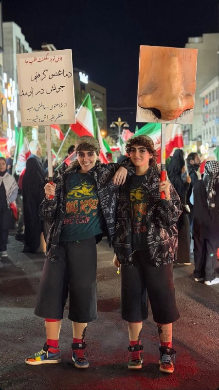

وضعیت تجمع های حکومتی :

@IranianMinds

## alonews — post 123021

  <a href="telegram/content/alonews_123021_1779876754.webm" target="_blank">🎬 Download video</a>

👈 رسانه I24 NEWS: نیروهای دفاعی اسرائیل (IDF) و فرماندهی مرکزی ارتش آمریکا (سنتکام) در حالت آماده‌باش بالا باقی مانده‌اند، در شرایطی که احتمال شکست مذاکرات میان واشنگتن و تهران و صدور دستور اقدام نظامی از سوی رئیس‌جمهور دونالد ترامپ وجود دارد.

✅ @AloNews خبر جنگ

## alonews — post 123020

  <a href="telegram/content/alonews_123020_1779876754.webm" target="_blank">🎬 Download video</a>

👈با تصاویر ماهواره‌ای سنتینل-۲ ناو آبی‌خاکی تریپولی آمریکا رو تو دریای عرب دیده شده

🔴 الانم با اسکورت یه ناوشکن داره حرکت می‌کنه

✅ @AloNews خبر جنگ

---
📅 بروزرسانی: 1405/03/06 13:32
---

## WithYashar — post 12658

## mwarmonitor — post 9795

🔴 در همین حال، نیروهای دفاعی اسرائیل (IDF) و فرماندهی مرکزی ارتش آمریکا (سنتکام) در حالت آماده‌باش بالا باقی مانده‌اند، در شرایطی که احتمال شکست مذاکرات میان واشنگتن و تهران و صدور دستور اقدام نظامی از سوی رئیس‌جمهور دونالد ترامپ وجود دارد.

🔹به گفته یک منبع آگاه از موضوع، هماهنگی میان دو ارتش همچنان ادامه دارد، از جمله ارتباطات مداوم میان رئیس ستاد کل ارتش اسرائیل، ایال زمیر، و فرمانده سنتکام، برد کوپر.

🔸این منبع گفته است: «در حال حاضر سطح بالایی از آمادگی، برنامه‌ریزی مستمر و هماهنگی جاری میان دو ارتش وجود دارد. همه منتظر تصمیم‌های رئیس‌جمهور ترامپ هستند، اما برخلاف آنچه برخی ممکن است تصور کنند، هماهنگی‌های امنیتی به‌صورت عادی و بدون وقفه ادامه دارد.» i24 news

@mwarmonitor

## pm_afshaa — post 91634

vless://6af5890f-5267-40ed-bc60-1bd3ee31a88b@45.38.23.87:8080?encryption=none&security=none&type=ws&path=%2F#PMTV%20NEWS%20%F0%9F%A6%81%E2%98%80%EF%B8%8F

نامحدود سرعت موشکی
🚀

💧 Rainbet.com the #1 Non-KYC Crypto Casino & Sportsbook @rainbetcom

😁 @Pm_Afshaa

## pm_afshaa — post 91633

علم‌ الگدا: نبود گوشت تو یخچال مردم مشکل بزرگی نیست چون وضعیت کشور جنگیه و اگر گوشت هم نداشته باشن که بخورن اشکالی نداره

💧 Rainbet.com the #1 Non-KYC Crypto Casino & Sportsbook @rainbetcom

😁 @Pm_Afshaa

## IranIntlTV — post 339216

  <a href="telegram/content/IranIntlTV_339216_1779876161.mp4" target="_blank">🎬 Download video</a>

شهروندان در ایران پس از اتصال دوباره به اینترنت بین‌الملل، پیام‌های زیادی برای مدیابات ایران‌اینترنشنال ارسال کردند. آنها می‌گویند اینترنت همچنان کند است و به وضعیت پیش از دی‌ماه بازنگشته است.

لیلا سعادتی، عضو تحریریه ایران‌اینترنشنال، گزارش می‌دهد
@iranintltv

## DW_Farsi — post 125186

🔶 اسرائیل از کشته‌شدن "فرمانده جدید شاخه نظامی حماس" خبر داد

اسرائیل از حمله به حزب‌الله لبنان و همچنین کشته‌شدن فرمانده جدید شاخه نظامی حماس خبر داد. حزب‌الله در روزهای اخیر حملات پهپادی به اسرائیل را افزایش داد و ارتش اسرائیل هم عملیات‌هایی علیه مواضع این گروه انجام داده است.

حدود یک‌ونیم هفته پس از کشته شدن فرمانده "گردان‌های عزالدین قسام"، شاخه نظامی حماس، اسرائیل اکنون می‌گوید جانشین او را نیز در نوار غزه هدف قرار داده و کشته است.

طبق گزارش‌ها محمد عوده نه‌تنها فرمانده جدید شاخه نظامی حماس بود، بلکه یکی از طراحان حملات ۷ اکتبر نیز به شمار می‌رفت.

@dw_farsi

## Hranews — post 113192

  

محمد طریقت اسفنجانی، وکیل دادگستری به حبس محکوم شد

❗️
❗️
❗️
❗️
❗️– محمد طریقت اسفنجانی، وکیل دادگستری و عضو کانون وکلای آذربایجان شرقی توسط دادگاه انقلاب شهرستان اسکو به سه سال حبس تعزیری محکوم شد.

به گزارش خبرگزاری هرانا، ارگان خبری مجموعه فعالان حقوق بشر در ایران، محمد طریقت اسفنجانی، وکیل دادگستری به حبس محکوم شد.

بر اساس این حکم که اخیرا توسط دادگاه انقلاب شهرستان اسکو صادر و به محمد طریقت اسفنجانی ابلاغ شده، وی از بابت اتهامات تبلیغ علیه نظام به یک سال حبس و توهین به رهبری و بنیانگذار جمهوری اسلامی به دو سال حبس تعزیری محکوم شده است.

#محمد_طریقت_اسفنجانی

ادامه مطلب

↘️
@hranews_bot تماس ✉️ - @Hranews کانال هرانا 🆑

## alonews — post 123019

  <a href="telegram/content/alonews_123019_1779876163.webm" target="_blank">🎬 Download video</a>

👈 پارلمان مجارستان امروز قانونی را تصویب کرد که عضویت این کشور در دادگاه کیفری بین‌المللی را حفظ می‌کند، و بدین ترتیب تصمیم دولت سابق اوربان در سال ۲۰۲۵ برای خروج از این دادگاه را معکوس کرد

✅ @AloNews خبر جنگ

## alonews — post 123018

  <a href="telegram/content/alonews_123018_1779876163.webm" target="_blank">🎬 Download video</a>

👈نتانیاهو دیشب در جلسه کابینه: محدودیتی برای حملات در بیروت نداریم

✅ @AloNews خبر جنگ

---
📅 بروزرسانی: 1405/03/06 13:22
---

## WithYashar — post 12657

  <a href="telegram/content/WithYashar_12657_1779875575.mp4" target="_blank">🎬 Download video</a>

الان نزدیک مجتمع صنایع فولاد مبارکه
@withyashar

## WithYashar — post 12656

## WithYashar — post 12655

  <a href="telegram/content/WithYashar_12655_1779875577.mp4" target="_blank">🎬 Download video</a>

@withyashar مخصوص‌ پیرمدا

## WithYashar — post 12654

## pm_afshaa — post 91632

🔴معاون وزیر امور خارجه روسیه:ما آمادگی خود را برای انتقال اورانیوم غنی‌شده از ایران به واشنگتن اطلاع داده‌ایم و این پیشنهاد همچنان روی میز است

💧 Rainbet.com the #1 Non-KYC Crypto Casino & Sportsbook @rainbetcom

😁 @Pm_Afshaa

## pm_afshaa — post 91631

tg://proxy?server=r10.proxytg.space&port=8443&secret=ee65032756d1cfb78ebbd0ea8db83d43937231302e70726f787974672e7370616365

پروکسی متصل سرعت بالا

💧 Rainbet.com the #1 Non-KYC Crypto Casino & Sportsbook @rainbetcom

😁 @Pm_Afshaa

## iaghapour — post 2636

🔻بچه ها میگن انقدر پهنای باند دیتاسنتر ها پایین هستش که اکثر روش های تانل که اجرا میکنن سرعت بدی داره یا دچار قطع و وصلی و اختلال زیاد هستش.

خیلی به روش تانل بستگی نداره بیشتر مشکل پهنای باند ضعیف دیتاسنتر ها مربوط هست.

امیدوارم در روزهای آینده وضعیت بهتر بشه.

## IranianMinds — post 20863

🔴 وزیر ارتباطات: اهتمام رئیس‌جمهور به بازگشایی اینترنت و احیای ثبات ارتباطی، نشانه‌ای روشن از عقلانیت و ایستادن در کنار مردم است

ملت ایران شایسته ارتباط آزاد، آینده‌ای روشن و اقتصادی پویاست

@IranianMinds

## IranianMinds — post 20862

🔴 علم‌الهدی: نبود گوشت تو یخچال مردم مشکل بزرگی نیست چون وضعیت کشور جنگیه و اگر گوشت هم نداشته باشن که بخورن اشکالی نداره.

@IranianMinds

## IranianMinds — post 20861

خوبه خودشونم اعتراف میکنن زیر زمین بودن این مدت.

🔴صداسیما:
هر مسئولی که تو جنگ زیرزمین بود رو نتونستن ترور کنن، جاشونو پیدا میکنن ولی نمیتونن بزننش، حتی با ۲۸ سنگر شکن.

@IranianMinds

## IranianMinds — post 20860

❌دیگه فریب بونوس سایت های متفرقه رو نخورید!

💖توی این سایت که مورد #تایید ماست، با عضویت 500 هزارتومان بگیر!

🌐 Winro.io

🌐 Winro.io

## IranianMinds — post 20859

  <a href="telegram/content/IranianMinds_20859_1779875579.webm" target="_blank">🎬 Download video</a>

⭕️ تنها جایی که در لحظه عضویت بهت 500 هزارتومان موجودی میده اینجاس 
❌

🎉 کافیه فقط عضو بشی تا #وینرو بهت 
🤩 
🤩 
🤩 هزارتومان جایزه بده ، نیازی هم به واریز نیست.

⌛ پشتیبانی 24 ساعته

🍆تنها سایت مورد اعتماد ما با بونوس های کاملا واقعی و رویایی:

🌐 Winro.io

🌐 Winro.io
کانال بونوس های رایگان r6

📱 @winro_io

## BBCPersian — post 282180

🔻نماینده مجتبی خامنه‌ای با سفر به چابهار، پیام او به مردم سیستان و بلوچستان را به آنها رساند

🔻بنا به گزارش رسانه‌های داخلی ایران مجتبی خامنه‌ای، رهبر جمهوری اسلامی در پیام ویژه‌ای به سیستان و بلوچستان «بر وحدت میان شیعه و سنی» تاکید کرده است.

این پیام مجتبی خامنه‌ای را محمدتقی وکیل‌پور در دیدار با روحانیان چابهار ابلاغ کرده است.

او ضمن تبریک عید قربان، به نقل از آقای خامنه‌ای به این روحانیان گفته است: «وحدت میان مردم شیعه و سنی و حضور آگاهانه آنان در میدان، ریشه دشمنی‌ها را خشک خواهد کرد.»

آقای وکیل پور گفته است برای قدردانی از مردم سیستان و بلوچستان به این استان سفر کرده و اضافه کرده است: «مردم این دیار در دوران دفاع مقدس خدمات ارزنده‌ای به کشور ارائه دادند و امروز نیز با اقدامات پرخیر و برکت خود، موجب خرسندی رهبر معظم انقلاب شده‌اند.»

مجتبی خامنه‌ای از زمان آغاز به کارش در اسفند تاکنون در انظار عمومی ظاهر نشده است. روز گذشته (سه‌شنبه) نیز یک پیام کتبی به مناسبت برگزاری مراسم حج از او منتشر شد.

https://bbc.in/4dSgnK3
@BBCPersian

## alonews — post 123017

  <a href="telegram/content/alonews_123017_1779875580.webm" target="_blank">🎬 Download video</a>

👈امتحانات پایه‌های هفتم تا دهم به صورت غیرحضوری و از طریق سامانه جدید شاد برگزار می‌شود.

✅ @AloNews خبر جنگ

## alonews — post 123016

  <a href="telegram/content/alonews_123016_1779875580.mp4" target="_blank">🎬 Download video</a>

👈رئیس‌جمهور ترکیه اردوغان: ان‌شاءالله این دیکتاتور به نام نتانیاهو، درسی که شایسته‌اش است را از مسلمانان جهان خواهد گرفت

✅ @AloNews خبر جنگ

---
📅 بروزرسانی: 1405/03/06 13:12
---

## WithYashar — post 12653

## WithYashar — post 12652

یاشار جان
اینترنشنالیا دارن میتوپن به ترامپ که بزدله و به ج ا باج داره میده و عقب نشینی کرده

تقریبا رسانه ها شدن این.

ولی من هنوز یادمه که میگفتی ترامپ فوتبالی بازی میکنه که توپشو نمیشه دید
هنوز این جملات و حرفاتو یادمه

بگو، خواهش میکنم بگو، که این رسانه ها همه دارن اشتباه می‌کنن و هنوز ما اتاق جنگی های قدیمی دارین درست میریم به سمت قاهره.
مرسی ازت❤️
#دیکتاتور_مهربون❤️

## IranIntlTV — post 339215

  

🔻روزنامه آس اسپانیا در گزارشی نوشت باشگاه رئال مادرید در آستانه ثبت یک رکورد مالی بی‌سابقه در تاریخ ورزش جهان قرار دارد. بر اساس پیش‌بینی‌های اولیه، درآمد کهکشانی‌ها در سال جاری از مرز ۱ میلیارد و ۲۰۰ میلیون یورو عبور کرده است؛ رقمی که تاکنون هیچ باشگاه ورزشی در جهان به آن دست نیافته است.

🔹رئال مادرید که طبق آمار «دلویت» سه فصل متوالی پردرآمدترین باشگاه جهان بوده، بخش عمده این موفقیت را مدیون جهش چشمگیر در بخش تجاری است. مادریدی‌ها در فصل ۲۵-۲۰۲۴ با رشد ۲۳ درصدی، ۵۹۴ میلیون یورو از بازاریابی و فروش محصولات باشگاه درآمد کسب کردند. همچنین بازسازی ورزشگاه سانتیاگو برنابئو باعث شد درآمد ورزشگاه به ۲۳۳ میلیون یورو برسد.

🔹حضور در جام جهانی باشگاه‌ها با هدایت ژابی آلونسو و صعود به یک‌چهارم نهایی اروپا با آربلوآ نیز به این سودآوری کمک کرد. «آس» در پایان گزارش خود نوشت مادریدی‌ها با تمدید قرارداد با شرکت هواپیمایی امارات تا سال ۲۰۳۱ و مذاکره با آدیداس، به دنبال افزایش ارزش اسپانسرهای پیراهن خود به ۳۰۰ میلیون یورو در سال هستند.
@iranintltvsport

## FarsiVOA — post 218786

  

دو گزارش تازه از وال‌استریت ژورنال و رویترز نشان می‌دهد نگرانی اروپا از روسیه دیگر فقط به جنگ اوکراین محدود نیست؛ مقام‌های اروپایی هم‌زمان از احتمال گسترش جغرافیای جنگ به سوی قلمرو ناتو و افزایش عملیات سایبری، جاسوسی و خرابکاری روسیه در بریتانیا و اروپا سخن می‌گویند.

وال‌استریت ژورنال نوشت در پایتخت‌های اروپایی این نگرانی جدی‌تر شده که ولادیمیر پوتین، در صورت ادامه بن‌بست در اوکراین، برای تغییر موازنه جنگ به تشدید افقی بحران روی آورد؛ از جمله با تهدید کشورهای بالتیک.

این گزارش به تهدیدهای اخیر روسیه علیه لتونی و لیتوانی، هشدار مسکو درباره شرکت‌های اروپایی همکار با اوکراین در تولید پهپاد، و رزمایش‌های هسته‌ای ناگهانی روسیه اشاره کرده است.

کایا کالاس، مسئول سیاست خارجی اتحادیه اروپا، به وال‌استریت ژورنال گفته اگر کرملین برای ادامه جنگ به بسیج تازه نیاز پیدا کند، ممکن است برای توجیه آن به تشدید تنش نیاز داشته باشد؛ نقطه‌ای که او «بسیار خطرناک» توصیف کرده است.
@FarsiVOA

## DW_Farsi — post 125185

  

🔶 ده‌ها دانشجوی دانشگاه شریف با احکام "اخراج و محرومیت از تحصیل" روبه‌رو شده‌اند

گزارش‌ها از ایران حاکی از آن است که دست‌کم ۳۰ دانشجوی دانشگاه صنعتی شریف در ارتباط با فعالیت‌های مجازی و پرونده‌های مرتبط با اعتراضات سراسری سال گذشته، با احکام انضباطی روبه‌رو شده‌اند.

خبرگزاری هرانا به نقل از شورای صنفی دانشگاه صنعتی شریف نوشته است که ؛حکم بدوی دست‌کم شش دانشجو، اخراج از دانشگاه همراه با پنج سال محرومیت از تحصیل در تمامی دانشگاه‌های کشور بوده است؛.

بر اساس این گزارش، برای شماری دیگر از دانشجویان نیز احکامی مانند "منع موقت از تحصیل" برای یک یا چند نیم‌سال صادر شده است.

در گزارش منتشر شده آمده که برخی از این دانشجویان با اتهام‌هایی مانند "برنامه‌ریزی برای ایجاد آشوب در دانشگاه" به کمیته انضباطی احضار شده‌اند.

همچنین گفته شده، بخش قابل توجهی از پرونده‌ها به ؛فعالیت دانشجویان در فضای مجازی، از جمله محتوای پروفایل، پیام در گروه‌های خصوصی یا بازنشر مطالب در شبکه‌های اجتماعی؛ مربوط بوده است.

@dw_farsi

## RadioFarda — post 157603

استارلینک و جنگ ایران؛ «چانه‌زنی اسپیس‌ایکس با پنتاگون بر سر اینترنت ماهواره‌ای»

🔸جنگ آمریکا و ایران فقط در آسمان، دریا و خاک جریان ندارد؛ بخشی از آن در مدارهای پایین زمین می‌گذرد؛ جایی که هزاران ماهواره کوچک استارلینک، متعلق به شرکت اسپیس‌اکس ایلان ماسک، به یکی از حلقه‌های حیاتی عملیات نظامی آمریکا تبدیل شده‌اند.

🔸گزارشی اختصاصی از خبرگزاری رویترز نشان می‌دهد که در همان هفته‌هایی که پهپادهای انتحاری آمریکا، با اتکا به ارتباط ماهواره‌ای استارلینک، در جنگ علیه ایران دستاوردهای ملموس‌تری پیدا می‌کردند، مدیران ارشد اسپیس‌ایکس به این نتیجه رسیدند که پنتاگون باید برای این دسترسی پول بیشتری بپردازد.

🔸به گفته دو منبع آگاه و بر اساس اسناد پنتاگون که رویترز دیده است، اسپیس‌ایکس گفته ارتش آمریکا برای هر پایانه حدود پنج هزار دلار می‌پردازد، در حالی که در عمل از سطحی از خدمات استفاده می‌کند که به گفته این شرکت، به ماهانه حدود ۲۵ هزار دلار نزدیک‌تر است.

🔸پس از انتشار گزارش رویترز، ایلان ماسک اعلام کرد سامانه غیرنظامی استارلینک به‌طور نادرست «برای اهداف نظامی» استفاده شده و «شرکت» مقصر بوده، نه پنتاگون.

🔸سخنگوی پنتاگون نیز گزارش رویترز را «غلط» خواند، اما جزئیات بیشتری ارائه نکرد و گفت اسپیس‌اکس همچنان «شریکی قوی و ارزشمند» برای وزارت جنگ آمریکا است.

🔸 گزارش کامل را در وب‌سایت رادیوفردا بخوانید.

@RadioFarda

## RadioFarda — post 157602

  

📷 Photo

## IranianMinds — post 20858

معاون وزیر امور خارجه روسیه:

ما آمادگی خود را برای انتقال اورانیوم غنی‌شده از ایران به واشنگتن اطلاع داده‌ایم و این پیشنهاد همچنان روی میز است

@IranianMinds

## alonews — post 123015

  <a href="telegram/content/alonews_123015_1779874974.mp4" target="_blank">🎬 Download video</a>

👈 لحظه هدف قرار گرفتن انبار تسلیحاتی پایگاه شکاری دزفول در ایام جنگ

✅ @AloNews خبر جنگ

---
📅 بروزرسانی: 1405/03/06 13:02
---

## VahidOOnLine — post 242400

  

علی باقری‌کنی، معاون دبیر شورای عالی امنیت ملی، با بیان اینکه «تماس‌های غیرمستقیم میان جمهوری اسلامی و آمریکا ادامه دارد» گفت: «موضوع ذخایر اورانیوم غنی‌شده در دستور کار مذاکرات نیست.»

او افزود جمهوری اسلامی و عمان در حال مذاکره درباره رویه جدید عبور کشتی‌ها از تنگه هرمز هستند.
‌🏁 🇬🇧 IranintlTV

🤖 @VahidOOnLine

## WithYashar — post 12651

وال‌استریت‌ژورنال: دولت ترامپ در حال کاهش نیروهاییه که در صورت بحران به اروپا اعزام میشن؛ اقدامی تازه در راستای کاهش حمایت نظامی آمریکا از متحدان ناتو.
@withyashar

## pm_afshaa — post 91630

🔴خبر هایی داره توسط رسانه های آمریکایی پخش میشه که جی دی ونس اطلاعاتی که ترامپ فقط با اون در میون گذاشته بوده رو لو میداده

💧 Rainbet.com the #1 Non-KYC Crypto Casino & Sportsbook @rainbetcom

😁 @Pm_Afshaa

## pm_afshaa — post 91629

https://t.me/proxy?server=172.65.38.26&port=9443&secret=ee09db815a6d82a31fda76f872230c69d7706b676275696c642e6f7267 پروکسی متصل 
💧 Rainbet.com the #1 Non-KYC Crypto Casino & Sportsbook @rainbetcom 
😁 @Pm_Afshaa

## pm_afshaa — post 91628

https://t.me/proxy?server=172.65.38.26&port=9443&secret=ee09db815a6d82a31fda76f872230c69d7706b676275696c642e6f7267

پروکسی متصل

💧 Rainbet.com the #1 Non-KYC Crypto Casino & Sportsbook @rainbetcom

😁 @Pm_Afshaa

## pm_afshaa — post 91627

https://t.me/proxy?server=49.13.35.164&port=8443&secret=dd104462821249bd7ac519130220c25d09

پروکسی متصل خوراک دانلود

💧 Rainbet.com the #1 Non-KYC Crypto Casino & Sportsbook @rainbetcom

😁 @Pm_Afshaa

## pm_afshaa — post 91626

https://t.me/proxy?server=195.254.165.4&port=8443&secret=EERighJJvXrFGRMCIMJdCQ==

پروکسی متصل

💧 Rainbet.com the #1 Non-KYC Crypto Casino & Sportsbook @rainbetcom

😁 @Pm_Afshaa

## IranIntlTV — post 339214

  <a href="telegram/content/IranIntlTV_339214_1779874360.mp4" target="_blank">🎬 Download video</a>

در حالی که برخی بازی‌های تدارکاتی پیش‌بینی‌شده تیم فوتبال ایران لغو شده‌اند، این تیم قرار است برابر گامبیا و مالی به میدان برود. همزمان، انتخاب تیخوانا در مکزیک به‌عنوان محل اقامت ایران در جام جهانی با انتقادهایی درباره موقعیت جغرافیایی و شرایط امنیتی این شهر همراه شده است.

ارزیابی بیشتر با رها پوربخش، عضو تحریریه ورزشی ایران‌اینترنشنال
@iranintltv

## IranIntlTV — post 339213

  

علی باقری‌کنی، معاون دبیر شورای عالی امنیت ملی، با بیان اینکه «تماس‌های غیرمستقیم میان جمهوری اسلامی و آمریکا ادامه دارد» گفت: «موضوع ذخایر اورانیوم غنی‌شده در دستور کار مذاکرات نیست.»

او افزود جمهوری اسلامی و عمان در حال مذاکره درباره رویه جدید عبور کشتی‌ها از تنگه هرمز هستند.
https://iranintl.com/202605272209

## alonews — post 123014

  <a href="telegram/content/alonews_123014_1779874362.webm" target="_blank">🎬 Download video</a>

👈سالود کارباجال، نماینده کنگره با انتشار نظرسنجی مبنی بر اینکه ۷۷٪ آمریکایی‌ها معتقدند سیاست‌های ترامپ زندگی را گران‌تر کرده نوشت:

🔴«مردم آمریکا به‌حق از این موضوع ناراضی‌اند که قیمت خواربار، بنزین و دیگر کالاهای ضروری به دلیل جنگ غیرقانونی ترامپ سر به فلک کشیده است. این دولت خانواده‌ها را زیر فشار گذاشته بدون اینکه پایانی برای آن در چشم باشد، و جمهوری‌خواهان هم دارند اجازه می‌دهند این اتفاق بیفتد.»

✅ @AloNews خبر جنگ

## alonews — post 123013

  <a href="telegram/content/alonews_123013_1779874363.webm" target="_blank">🎬 Download video</a>

👈معاون وزیر امور خارجه روسیه: ما آمادگی خود را برای انتقال اورانیوم غنی‌شده از ایران به واشنگتن اطلاع داده‌ایم و این پیشنهاد همچنان روی میز است.

✅ @AloNews خبر جنگ

---
📅 بروزرسانی: 1405/03/06 12:52
---

## VahidOOnLine — post 242399

🗣روایت شما پس از بازگشت به اینترنت بین‌المللی- چهارشنبه ۶ خرداد

🔹با وجود باز شدن اینترنت در ایران، حتی با فیلترشکن‌های قوی هم هیچ‌یک از اپلیکیشن‌ها باز نمی‌شود.
🔹بالاخره بعد از سه ماه وصل شدم ولی احساس غریبی می‌کنم. اینستاگرام شده مثل قبرستون هزاران هزار اکانت که دیگه صاحبی نداره.
🔹نابود شدیم از گرونی وحشتناک. این گرونی و تورم رو هیچ‌کجای دنیا نمی‌تونن حتی چند روز تحمل کنن. اینترنت که حقمونه رو با ده‌ها شرط و منت باز کردن.
🔹بعد ۳ ماه وصل شدم. تلگرام روی آپدیت می‌مونه، پیام‌ها خیلی دیر ارسال و دریافت میشه و گوگل‌پلی هنوز برای همه کار نمی‌کنه. فقط دیشب به سختی تونستم آپدیت اندروید گوشیم رو انجام بدم.
🔹بالاخره اینترنت در ایران وصل شده و خیلی خوشحال شدیم، ولی یاد جاویدنامان از ذهن ما نمیره.
🔹هر کی میگه اینترنت در ایران وصل شده واقعا مغزش خرابه. کجا وصل شده؟ گوگل‌پلی وارد نمیشه و حتی نمی‌شه برنامه‌های سامسونگ رو آپدیت کرد.
🔹اینترنت وصل شده ولی خوشحال نیستم چون وقتی اینترنت وصل بشه یعنی اینکه هیچ اتفاقی قرار نیست بیافته و جمهوری اسلامی قراره بمونه.
🔹نگران اینترنت نباش چون برمی‌گرده، نگران جوونی‌مون باش که مفت رفت.
🔹کاش همین‌جوری که اینترنت‌ها برگشت، جوون‌هامون از زیر خاک برمی‌گشتن.
🔹ببین ما چقدر بدبخت شدیم که در عصر تکنولوژی، بعد از ۸۸ روز برای بازگشت اینترنت شادی می‌کنیم.
🔹اینها اینترنت‌ها رو وصل کردن که ما لال بشیم.
🔹درک نمی‌کنم یه سری‌ها خوشحالن و هیجانی شدن از وصل شدن اینترنت. الان یعنی بدبختی‌هاتون تموم شد؟
🔹برای من عجیبه که بعضی‌ها وصل شدن اینترنت رو تبریک میگن. این حق اولیه هر انسانیه و تبریک گفتن نداره.
🔹باورم نمیشه که میگین آزاد شدیم و خوشحالیم. این فقط فیلترنت هست و هیچی عوض نشده. زندگی ما و جوونیمون به باد رفت. فیلترنت خیلی محدود وصل شده ولی زندگی ما و اون همه جاویدنام دیگه برنمی‌گرده.
‌🏁 🇬🇧 IranintlTV

🤖 @VahidOOnLine

## VahidOOnLine — post 242398

🗣روایت شما از بحران اقتصادی و زندگی در آتش‌بس- چهارشنبه ۶ خرداد:

🔹بچه‌ام در بخش کودکان بیمارستان ۱۷ شهریور رشت بستری است. داروهای سرطان نیست. بسته ۱۰۰ عددی قرص مرکاپتوپرین به سختی و فقط در بازار سیاه با قیمت چند برابری پیدا می‌شود.

🔹خیلی در فشاریم. اجاره خانه ۳ برابر شده. گوشت و مرغ را که خیلی وقت است نمی‌توانیم بخریم. روغن ۲ لیتری شده ۹۰۰ هزار تومان.

🔹من لوازم خانگی دارم. قیمت وسایل خانه از قبل عید تا الان به شدت افزایش داشته. یخچال دوقلو هیمالیا ۱۲۰ میلیون تومان بود الان شده ۲۵۰ میلیون، ماشین لباسشویی پاکشوما ۹ کیلویی ۶۰ میلیون بود، شده ۱۰۰ میلیون تومان. جوان‌هایی که می‌خواهند تازه زندگی مشترکشان را شروع کنند می‌آیند قیمت می‌کنند، با چشمان خیس از در خارج می‌شوند.

🔹فروشنده موبایلم؛ قیمت موبایل‌ها خیلی رفته بالا. عملا مشتری فقط برای خرید قاب و گلس مراجعه می‌کند و به ندرت گوشی می‌فروشیم.

🔹گرانی به شدت بیداد می‌کند. یک روغن، نوشابه و زردچوبه خریدم شد یک میلیون و ۲۰۰ هزار تومان.

🔹همه چیز گران شده. روغن پنج لیتری شده ۷۰۰ هزار تومان، چیپس ۵۵۰ هزار تومان، گوشت قرمز یک میلیون و ۳۰۰ هزار تومان.

🔹با خانه میانگین متری ۳۰۰ میلیون تومان در اصفهان چه‌کار کنیم؟ تازه کسی هم نمی‌فروشد و منتظرند گران‌تر شود.
‌🏁 🇬🇧 IranintlTV

🤖 @VahidOOnLine

## WithYashar — post 12650

  

الان ، تهران شوش @withyashar

## WithYashar — post 12649

وزارت اطلاعات ایران: دشمن برای دامن زدن به اختلافات ملی و فرقه‌ای و انجام عملیات تروریستی در کشور تلاش خواهد کرد.
@withyashar

## DEJradio — post 5017

  <a href="telegram/content/DEJradio_5017_1779873743.mp4" target="_blank">🎬 Download video</a>

🚨📢 تصاویر ماهواره‌ای از ویرانه‌های فرودگاه مهرآباد در جنگ ۴۰ روزه

#جنگ۴۰روزه #فرودگاه_مهرآباد
@DEJradio

## DEJradio — post 5016

  <a href="telegram/content/DEJradio_5016_1779873745.mp4" target="_blank">🎬 Download video</a>

🔺🎥 با اتصال نسبی اینترنت در ایران، ویدیوهای زیادی از روزهای جنگ توسط شهروندان به رسانه‌ها ارسال شده است؛ یکی از آنها انهدام انبار مهمات پایگاه شکاری دزفول است. اول فروردین ۱۴۰۵ این پایگاه بمباران شد. این ویدیو در چند رسانه منتشر شده بود.
براساس گزارش‌های میدانی تقریبا تمام ظرفیت پایگاه دزفول از بین رفته است.

#اینترنت #جنگ #دزفول
@DEJradio

## IranIntlTV — post 339212

🗣روایت شما پس از بازگشت به اینترنت بین‌المللی- چهارشنبه ۶ خرداد

🔹با وجود باز شدن اینترنت در ایران، حتی با فیلترشکن‌های قوی هم هیچ‌یک از اپلیکیشن‌ها باز نمی‌شود.
🔹بالاخره بعد از سه ماه وصل شدم ولی احساس غریبی می‌کنم. اینستاگرام شده مثل قبرستون هزاران هزار اکانت که دیگه صاحبی نداره.
🔹نابود شدیم از گرونی وحشتناک. این گرونی و تورم رو هیچ‌کجای دنیا نمی‌تونن حتی چند روز تحمل کنن. اینترنت که حقمونه رو با ده‌ها شرط و منت باز کردن.
🔹بعد ۳ ماه وصل شدم. تلگرام روی آپدیت می‌مونه، پیام‌ها خیلی دیر ارسال و دریافت میشه و گوگل‌پلی هنوز برای همه کار نمی‌کنه. فقط دیشب به سختی تونستم آپدیت اندروید گوشیم رو انجام بدم.
🔹بالاخره اینترنت در ایران وصل شده و خیلی خوشحال شدیم، ولی یاد جاویدنامان از ذهن ما نمیره.
🔹هر کی میگه اینترنت در ایران وصل شده واقعا مغزش خرابه. کجا وصل شده؟ گوگل‌پلی وارد نمیشه و حتی نمی‌شه برنامه‌های سامسونگ رو آپدیت کرد.
🔹اینترنت وصل شده ولی خوشحال نیستم چون وقتی اینترنت وصل بشه یعنی اینکه هیچ اتفاقی قرار نیست بیافته و جمهوری اسلامی قراره بمونه.
🔹نگران اینترنت نباش چون برمی‌گرده، نگران جوونی‌مون باش که مفت رفت.
🔹کاش همین‌جوری که اینترنت‌ها برگشت، جوون‌هامون از زیر خاک برمی‌گشتن.
🔹ببین ما چقدر بدبخت شدیم که در عصر تکنولوژی، بعد از ۸۸ روز برای بازگشت اینترنت شادی می‌کنیم.
🔹اینها اینترنت‌ها رو وصل کردن که ما لال بشیم.
🔹درک نمی‌کنم یه سری‌ها خوشحالن و هیجانی شدن از وصل شدن اینترنت. الان یعنی بدبختی‌هاتون تموم شد؟
🔹برای من عجیبه که بعضی‌ها وصل شدن اینترنت رو تبریک میگن. این حق اولیه هر انسانیه و تبریک گفتن نداره.
🔹باورم نمیشه که میگین آزاد شدیم و خوشحالیم. این فقط فیلترنت هست و هیچی عوض نشده. زندگی ما و جوونیمون به باد رفت. فیلترنت خیلی محدود وصل شده ولی زندگی ما و اون همه جاویدنام دیگه برنمی‌گرده.

## IranIntlTV — post 339211

🗣روایت شما از بحران اقتصادی و زندگی در آتش‌بس- چهارشنبه ۶ خرداد:

🔹بچه‌ام در بخش کودکان بیمارستان ۱۷ شهریور رشت بستری است. داروهای سرطان نیست. بسته ۱۰۰ عددی قرص مرکاپتوپرین به سختی و فقط در بازار سیاه با قیمت چند برابری پیدا می‌شود.

🔹خیلی در فشاریم. اجاره خانه ۳ برابر شده. گوشت و مرغ را که خیلی وقت است نمی‌توانیم بخریم. روغن ۲ لیتری شده ۹۰۰ هزار تومان.

🔹من لوازم خانگی دارم. قیمت وسایل خانه از قبل عید تا الان به شدت افزایش داشته. یخچال دوقلو هیمالیا ۱۲۰ میلیون تومان بود الان شده ۲۵۰ میلیون، ماشین لباسشویی پاکشوما ۹ کیلویی ۶۰ میلیون بود، شده ۱۰۰ میلیون تومان. جوان‌هایی که می‌خواهند تازه زندگی مشترکشان را شروع کنند می‌آیند قیمت می‌کنند، با چشمان خیس از در خارج می‌شوند.

🔹فروشنده موبایلم؛ قیمت موبایل‌ها خیلی رفته بالا. عملا مشتری فقط برای خرید قاب و گلس مراجعه می‌کند و به ندرت گوشی می‌فروشیم.

🔹گرانی به شدت بیداد می‌کند. یک روغن، نوشابه و زردچوبه خریدم شد یک میلیون و ۲۰۰ هزار تومان.

🔹همه چیز گران شده. روغن پنج لیتری شده ۷۰۰ هزار تومان، چیپس ۵۵۰ هزار تومان، گوشت قرمز یک میلیون و ۳۰۰ هزار تومان.

🔹با خانه میانگین متری ۳۰۰ میلیون تومان در اصفهان چه‌کار کنیم؟ تازه کسی هم نمی‌فروشد و منتظرند گران‌تر شود.

## IranIntlTV — post 339210

  <a href="telegram/content/IranIntlTV_339210_1779873747.mp4" target="_blank">🎬 Download video</a>

یسرائیل کاتز، وزیر دفاع اسرائیل، چهارشنبه در بیانیه‌ای اعلام کرد محمد عوده، فرمانده جدید گردان‌های نظامی حماس، کشته شده است. در این بیانیه آمده است: «اسرائیل اجازه نخواهد داد حماس، چه در عرصه نظامی و چه در عرصه غیرنظامی، بر غزه حکومت کند.»

بابک اسحاقی، خبرنگار ایران‌اینترنشنال، گزارش می‌دهد
@iranintltv

## FarsiVOA — post 218785

  

عضو هیئت مدیره اتحادیه مشاوران املاک از جهش ۷۰ تا ۸۰ درصدی قیمت‌های پیشنهادی مسکن پس از جنگ خبر داد.

تورج سرباز به خبرگزاری ایسنا گفته است: «مسکن» که از رشد دلار و سکه عقب مانده بود، اکنون با تورم ناشی از جنگ، جاماندگی خود را جبران کرده است.

او اعلام کرد که در حال حاضر ۷۰ درصد معاملات توسط سوداگران انجام می‌شود و متقاضی واقعی به دلیل قیمت‌های نجومی عملاً از صحنه رقابت حذف شده است.

پیش از اعلام افزایش ۸۰ درصدی قیمت خرید مسکن، خبرگزاری ایسنا از افزایش اجاره‌بها نیز خبر داده و اعلام کرده بود که در شهرهای بزرگ و مراکز استان‌ها، بین ۵۰ تا ۷۰ درصد درآمد خانوار صرف اجاره می‌شود.
@FarsiVOA

## RadioFarda — post 157601

بازگشت تدریجی و محدود اینترنت در ایران؛ «خوشحالی ایرانیان دو سوی مرز»

🔸سرانجام، پس از ۸۸ روز قطع سراسری اینترنت در ایران، شهروندان کشور توانستند به‌طور نسبی و محدود به اینترنت جهانی دست پیدا کنند و از دل خاموشی دیجیتال به جهان آزاد سرک بکشند.

🔸از بعدازظهر سه‌شنبه پنجم خرداد ۱۴۰۵ گزارش‌های شهروندی و رسمی حاکی از امکان دستیابی به اینترنت بین‌الملل در سرویس خانگی و ثابت مخابرات و بعدتر در تلفن‌های همراه بود.

🔸نت‌بلاکس، نهاد پایش وضعیت اینترنت در جهان، نیز اگرچه این خبر را تأیید کرد، اما خبر داد برخی کاربران هنوز به اینترنت دسترسی ندارند و افزود: «فیلترنت همچنان پابرجاست اما می‌توان آن را دور زد. واتس‌اپ نیز اکنون محدود شده و نیاز به دور زدن فیلتر دارد.»

🔸قطع اینترنت در ایران که بیش از ۲۰۹۳ ساعت ادامه داشت، و طولانی‌ترین قطع سراسری اینترنت در تاریخ معاصر نام گرفت، بعد از حملات مشترک آمریکا و اسرائیل به ایران در نهم اسفند ۱۴۰۴ و کشته‌شدن علی خامنه‌ای، دومین رهبر جمهوری اسلامی آغاز شد.

🔸اگرچه قطع اینترنت و فیلترینگ در ایران مسبوق به سابقه است، اما انزوای اینترنتی شهروندان ایران هرگز تا این اندازه به طول نینجامیده و هزینه‌های مالی، اجتماعی و روانی به بار نیاورده بود.

🔸آن‌چه حکومت ایران در حدود ۹۰ روز گذشته انجام داد، دیگر صرفاً محدودسازی یا کندی اینترنت نبود، بلکه قطع تقریباً کامل دسترسی عمومی به اینترنت جهانی بود؛ وضعیتی که به‌گفتۀ نت‌بلاکس، از نظر شدت و مدت، از همهٔ نمونه‌های مشابه در ایران و حتی در سطح جهانی پیشی گرفته است.

🔸افشین کلاهی، رئیس کمیسیون اقتصاد دانش‌بنیان اتاق بازرگانی ایران، اخیراً خسارت مستقیم ناشی از اختلال اینترنت را روزانه ۳۰ تا ۴۰ میلیون دلار برآورد کرده و گفته بود با احتساب خسارت‌های غیرمستقیم، این رقم می‌تواند به حدود ۸۰ میلیون دلار در روز برسد.

🔸 گزارش کامل را در وب‌سایت رادیوفردا بخوانید.

@RadioFarda

## Hranews — post 113191

  

میان موشک و سرکوب؛ گزارش مجموعه فعالان حقوق بشر درباره مخاصمه نظامی ایالات متحده-اسرائیل و ایران منتشر شد 
💥
💥
💥
💥
💥 – امروز، مجموعه فعالان حقوق بشر در ایران گزارش جدیدی را در ۲۴۰ صفحه و دو زبان منتشر کرد که به بررسی کارزار نظامی ایالات متحده و اسرائیل در ایران…

## alonews — post 123012

  <a href="telegram/content/alonews_123012_1779873750.webm" target="_blank">🎬 Download video</a>

👈منبع آگاه نزدیک به تیم مذاکره کننده:
منابع بلوکه شده ایران که باید در طول مذاکرات آزاد شود، ۲۴ میلیارد دلار برآورد شده

🔴ایران تاکید دارد که نصف این مبلغ باید با شروع اعلام یادداشت تفاهم در دسترس قرار گیرد و بقیه در طول ۶۰ روز منتقل شود.

✅ @AloNews خبر جنگ

---
📅 بروزرسانی: 1405/03/06 12:42
---

## VahidOOnLine — post 242397

  

همزمان با گزارش‌ها درباره رایزنی‌ها برای دستیابی به توافق میان جمهوری اسلامی و آمریکا، علی‌اکبر ولایتی، مشاور رهبر جمهوری اسلامی در امور بین‌الملل، گفت ضامن عینی بقای توافق، تنگه هرمز است.

او در ایکس نوشت: «خط قرمز ایران روشن است، این بار کاغذها و امضاها تضمین نیستند، ضامن عینی بقای توافق، تنگه هرمز است. جغرافیا دروغ نمی‌گوید و قاضی نهایی عهدنامه، روی کاغذ نیست.»

او همچنین گفت: «تاریخ گواهی می‌دهد همه مهاجمانی که با سودای سلطه آمدند، از اسکندر تا چنگیز و ترامپ، همگی در هاضمه تمدن غنی ایران هضم شدند.»
‌🏁 🇬🇧 IranintlTV

🤖 @VahidOOnLine

## VahidOOnLine — post 242396

  

♦️دولت کره‌جنوبی روز چهارشنبه ششم خردادماه اعلام کرد سفیر جمهوری اسلامی در سئول را در اعتراض به حمله به یک کشتی احضار خواهد کرد.

مقام‌های کره‌جنوبی جزئیات بیشتری درباره این حادثه منتشر نکرده‌اند، اما تاکید کرده‌اند امنیت کشتیرانی و آزادی تردد دریایی برای سئول اهمیت حیاتی دارد.

این خبر در حالی اعلام شد که حدود چهار هفته پیش یک کشتی باری کره جنوبی در تنگه هرمز هدف حمله پهپادی قرار گرفت و به‌شدت آسیب دید.
دفتر ریاست جمهوری کره جنوبی اعلام کرد بسیار بعید است این حمله از جایی به‌جز ایران انجام شده باشد.
‌🇸🇦 Indypersian

🤖 @VahidOOnLine

## WithYashar — post 12648

باقری: ذخایر اورانیوم غنی‌شده ایران در دستورکار مذاکرات نیست
ریانووستی به نقل از معاون دبیر شورای عالی امنیت ملی ایران:
ایران و ایالات متحده هنوز در مورد رفع انسداد تنگه هرمز به توافق نرسیده‌اند.
ایران و عمان در حال مذاکره درباره رویه جدید عبور کشتی‌ها از تنگه هرمز هستند.
تماس‌های غیرمستقیم میان ایران و آمریکا ادامه دارد.
ذخایر اورانیوم غنی‌شده ایران در دستور کار مذاکرات نیست.
@withyashar

## WithYashar — post 12647

  

الان ، تهران شوش
@withyashar

## pm_afshaa — post 91625

https://t.me/proxy?server=91.107.182.200&port=8443&secret=dd104462821249bd7ac519130220c25d09

پروکسی متصل

💧 Rainbet.com the #1 Non-KYC Crypto Casino & Sportsbook @rainbetcom

😁 @Pm_Afshaa

## pm_afshaa — post 91624

https://t.me/proxy?server=49.13.35.164&port=8443&secret=dd104462821249bd7ac519130220c25d09

پروکسی متصل

💧 Rainbet.com the #1 Non-KYC Crypto Casino & Sportsbook @rainbetcom

😁 @Pm_Afshaa

## pm_afshaa — post 91623

vmess://ew0KICAidiI6ICIyIiwNCiAgInBzIjogIlBNVFYgTkVXUyBcdUQ4M0VcdUREODFcdTI2MDBcdUZFMEYiLA0KICAiYWRkIjogIjIxMi44Ny4xOTguNzkiLA0KICAicG9ydCI6ICI0NTI1NSIsDQogICJpZCI6ICJkZDVmZmQyMy1jZWY1LTQ0ZGQtYTE0My02NThiZDdmMzk0M2EiLA0KICAiYWlkIjogIjAiLA0KICAic2N5IjogImF1dG8iLA0KICAibmV0IjogInRjcCIsDQogICJ0eXBlIjogImh0dHAiLA0KICAiaG9zdCI6ICJiYWxlLmFpIiwNCiAgInBhdGgiOiAiLyIsDQogICJ0bHMiOiAiIiwNCiAgInNuaSI6ICIiLA0KICAiYWxwbiI6ICIiLA0KICAiZnAiOiAiIg0KfQ==

متصل سرعت بالا برای تمامی سرور ها

💧 Rainbet.com the #1 Non-KYC Crypto Casino & Sportsbook @rainbetcom

😁 @Pm_Afshaa

## DEJradio — post 5015

  <a href="telegram/content/DEJradio_5015_1779873150.webm" target="_blank">🎬 Download video</a>

🚨📢 کمک عمان و عراق به جمهوری اسلامی در دور زدن محاصره دریایی آمریکا

یک منبع داخلی به دژ می‌گوید دولت عمان از طریق بنادر صلاله، صحار و دقم به کشتی‌های جمهوری اسلامی در دور زدن محاصره دریایی بنادر ایران توسط آمریکا کمک می‌کند. شماری از عوامل سـ.ـپاه پاسداران به اسم نمایندگان گمرک و کشترانی ایران در این بنادر مستقر شدند و روند ترخیص و جابجایی کالاها را مدیریت می‌کنند. کشتی‌هی وابسته به جمهوری اسلامی با مدارک و اطلاعات جعلی در این بنادر پهلو می‌گیرند. همین وضعیت در بندر بندر ام‌القصر عراق برقرار است.
طبق اعلام سنتکام از آغاز محاصره دریایی ایران تا پنجم خرداد ۱۴۰۵ بیش از ۱۰۸ کشتی تجاری مجبور به تغییر مسیر شده‌اند.

#محاصره_دریایی #جنگ
@DEJradio

## IranIntlTV — post 339209

  

همزمان با گزارش‌ها درباره رایزنی‌ها برای دستیابی به توافق میان جمهوری اسلامی و آمریکا، علی‌اکبر ولایتی، مشاور رهبر جمهوری اسلامی در امور بین‌الملل، گفت ضامن عینی بقای توافق، تنگه هرمز است.

او در ایکس نوشت: «خط قرمز ایران روشن است، این بار کاغذها و امضاها تضمین نیستند، ضامن عینی بقای توافق، تنگه هرمز است. جغرافیا دروغ نمی‌گوید و قاضی نهایی عهدنامه، روی کاغذ نیست.»

او همچنین گفت: «تاریخ گواهی می‌دهد همه مهاجمانی که با سودای سلطه آمدند، از اسکندر تا چنگیز و ترامپ، همگی در هاضمه تمدن غنی ایران هضم شدند.»
https://iranintl.com/202605278676

## DW_Farsi — post 125184

  

🔶ولایتی: ضامن عینی بقای توافق، تنگه هرمز است

علی‌اکبر ولایتی، مشاور رهبر جمهوری اسلامی در امور بین‌الملل، در پیامی در شبکه اجتماعی ایکس نوشته است که "ضامن عینی بقای توافق، تنگه هرمزاست". او تاکید کرده که ایران این بار تنها به "کاغذها و امضاها" تکیه نخواهد کرد.

او همچنین نوشت، "ملت بودن" ریشه‌ای تمدنی دارد و "کالایی نیست که با دلار نفتی بتوان خرید یا اجاره کرد".

اظهارات ولایتی در حالی مطرح می‌شود که تنش‌ها در منطقه و بحث درباره امنیت تنگه هرمز، یکی از مهم‌ترین مسیرهای انتقال نفت جهان، بار دیگر افزایش یافته است. شمار زیادی از مقام‌های حکومت ایران، از جمله مجتبی خامنه‌ای، رهبر کنونی جمهوری اسلامی، در ادبیاتی تهدیدآمیز گفته‌اند که وضعیت تنگه هرمز به گذشته بازنخواهد گشت.

@dw_farsi

## IranianMinds — post 20857

  <a href="telegram/content/IranianMinds_20857_1779873152.mp4" target="_blank">🎬 Download video</a>

لحظه‌ ترور محمد عوده و فرماندهان شاخه نظامی حماس

@IranianMinds

## alonews — post 123011

  <a href="telegram/content/alonews_123011_1779873153.webm" target="_blank">🎬 Download video</a>

🔴فوری / منتسب به تهران

✅ @AloNews خبر جنگ

## alonews — post 123010

  <a href="telegram/content/alonews_123010_1779873153.webm" target="_blank">🎬 Download video</a>

👈کانال ۱۲ عبری تهدید پهپادهای بمب‌گذاری شده خطرناک‌تر از آن است که «اسرائیل» تصور می‌کند، و راه‌حل‌های فعلی مانع فاجعه بعدی نخواهند شد.

✅ @AloNews خبر جنگ

---
📅 بروزرسانی: 1405/03/06 12:32
---

## VahidOOnLine — post 242395

  

♦️علی باقری کنی، معاون دبیر شورای عالی امنیت ملی جمهوری اسلامی روز چهارشنبه ششک خرداد در حاشیه مجمع بین‌المللی امنیتی در مسکو با اشاره به مذاکرات نمایندگان تهران و واشنگتن گفت: «ذخایر اورانیوم غنی‌شده ایران در دستور کار مذاکرات نیست».

به گزارش ریانووستی، باقری کنی همچنین با بیان اینکه تماس‌های غیرمستقیم میان تهران و واشنگتن ادامه دارد، افزود: ایران و ایالات متحده هنوز در مورد رفع انسداد تنگه هرمز به توافق نرسیده‌اند.

این اظهارات در حالی مطرح می‌‌شود که دونالد ترامپ، رئیس‌جمهوری ایالات متحده، روز دوشنبه با انتشار پیامی در شبکه اجتماعی تروث نوشت: «اورانیوم غنی‌شده (گرد‌وغبار هسته‌ای) یا باید فورا به ایالات متحده تحویل داده شود تا به آمریکا منتقل و نابود گردد، یا اینکه ترجیحا در بستر همکاری و هماهنگی با جمهوری اسلامی، در همان محل یا در مکان قابل‌قبول دیگری، در حضور و با نظارت کمیسیون انرژی اتمی یا نهاد معادل آن نابود شود.»

 مقام‌های آمریکایی به سی‌ان‌ان گفته‌اند، اختلاف‌ها بر سر نحوه پرداختن به برنامه هسته‌ای ایران و لغو تحریم‌ها، نهایی شدن توافق برای پایان جنگ را به تاخیر انداخته است.
‌🇸🇦 Indypersian

🤖 @VahidOOnLine

## VahidOOnLine — post 242394

  

وزارت خارجه کره جنوبی چهارشبنه شش خرداد اعلام کرد که حمله به کشتی باری اچ‌ام‌ام نامو در تنگه هرمز ، احتمالا با استفاده از یک موشک ایرانی انجام شده است.

به گزارش رویترز، یک مقام دفتر ریاست‌جمهوری کره جنوبی ۲۱ اردیبهشت اعلام کرد سئول در حال بررسی نقش احتمالی جمهوری اسلامی در حمله به نفتکش کره‌ای «اچ‌ام‌ام نامو» در هفته گذشته است.

او با تاکید بر این که کره جنوبی قصد دارد به عامل حمله به این کشتی پاسخ دهد در عین حال گفت عامل این حمله تاکنون شناسایی نشده و تحقیقات در این زمینه ادامه دارد.
‌🏁 🇬🇧 IranintlTV

🤖 @VahidOOnLine

## WithYashar — post 12646

شبکه ۱۲ اسرائیل : تو نهاد امنیتی، هلاکت محمد عودة تأیید شد @withyashar

## mwarmonitor — post 9794

🔴ایالات متحده در حال کاهش نیروهایی است که در صورت بروز بحران قصد دارد به اروپا اعزام کند؛ اقدامی تازه از سوی دولت ترامپ برای کوچک‌تر کردن حمایت نظامی خود از متحدان ناتو. وال‌استریت ژورنال

@mwarmonitor

## mwarmonitor — post 9793

  

✈️پرواز هم‌زمان دو فروند Boeing P-8A Poseidon آمریکایی در دریای عرب , پایش دریایی سنگین آمریکا در نزدیکی خلیج عدن و دریای عمان

@mwarmonitor

## pm_afshaa — post 91622

vless://01ea3b87-b7b1-4aef-b24a-9c43fbd3b26f@fr-tx.sbrf-cdn342.ru:443?encryption=none&flow=xtls-rprx-vision-udp443&security=tls&sni=sub.sbrf-cdn342.ru&type=tcp&headerType=none#PMTV%20NEWS%20%F0%9F%A6%81%E2%98%80%EF%B8%8F

نامحدود متصل سرعت بالا

💧 Rainbet.com the #1 Non-KYC Crypto Casino & Sportsbook @rainbetcom

😁 @Pm_Afshaa

## pm_afshaa — post 91621

کسی که تا 12:45 بیشترین استارز رو روی این پست بزنه 10 گیگ اختصاصی برنده میشه
😉

✉️ @Glitch_Config

## pm_afshaa — post 91620

vless://41f37ced-2021-4111-93a8-82d57ff2eb5b@63.141.128.5:2083?encryption=none&security=tls&sni=mzaxmc.lizardshop.org&fp=chrome&type=ws&path=%2F%3Fed#PMTV%20NEWS%20%F0%9F%A6%81%E2%98%80%EF%B8%8F

سرور فوق العاده پرسرعت و قوی مخصوص اینستا و یوتیوب سرعت بالا

💧 Rainbet.com the #1 Non-KYC Crypto Casino & Sportsbook @rainbetcom

😁 @Pm_Afshaa

## pm_afshaa — post 91619

vless://ae0dd58e-e222-40bf-84ae-365a97532737@8.35.211.138:2096?encryption=none&security=tls&sni=pagescm.freen20.cc.cd&type=ws&host=pagescm.freen20.cc.cd&path=%2Fitem#PMTV%20NEWS%20%F0%9F%A6%81%E2%98%80%EF%B8%8F

v2 سرعت بالا

💧 Rainbet.com the #1 Non-KYC Crypto Casino & Sportsbook @rainbetcom

😁 @Pm_Afshaa

## DEJradio — post 5014

  <a href="telegram/content/DEJradio_5014_1779872554.webm" target="_blank">🎬 Download video</a>

🔺📢 انفجار هزینه‌ها در بازارهای قفل شده ایران؛

*عطا حسینیان، روزنامه‌نگار اقتصادی

#تورم #جنگ
@DEJradio

## IranIntlTV — post 339208

  

وزارت خارجه کره جنوبی چهارشبنه شش خرداد اعلام کرد که حمله به کشتی باری اچ‌ام‌ام نامو در تنگه هرمز ، احتمالا با استفاده از یک موشک ایرانی انجام شده است.

به گزارش رویترز، یک مقام دفتر ریاست‌جمهوری کره جنوبی ۲۱ اردیبهشت اعلام کرد سئول در حال بررسی نقش احتمالی جمهوری اسلامی در حمله به نفتکش کره‌ای «اچ‌ام‌ام نامو» در هفته گذشته است.

او با تاکید بر این که کره جنوبی قصد دارد به عامل حمله به این کشتی پاسخ دهد در عین حال گفت عامل این حمله تاکنون شناسایی نشده و تحقیقات در این زمینه ادامه دارد.
https://iranintl.com/202605274355

## IranIntlTV — post 339207

  <a href="telegram/content/IranIntlTV_339207_1779872555.mp4" target="_blank">🎬 Download video</a>

هیلل نیومن، سفیر اسرائیل در استرالیا، در گفت‌وگوی اختصاصی با علیرضا محبی، خبرنگار ایران‌اینترنشنال، هشدار داد اگر مذاکرات آمریکا با جمهوری اسلامی به نتیجه نرسد، اسرائیل ممکن است دوباره به کارزار نظامی بازگردد. او همچنین گفت دولت اسرائیل بر سر توقف کامل غنی‌سازی اورانیوم، برنامه موشک‌های بالستیک و حمایت حکومت ایران از نیروهای نیابتی مصالحه نخواهد کرد.
@iranintltv

## alonews — post 123009

  <a href="telegram/content/alonews_123009_1779872557.webm" target="_blank">🎬 Download video</a>

👈وزیر ارتباطات: اهتمام رئیس‌جمهور به بازگشایی اینترنت و احیای ثبات ارتباطی، نشانه‌ای روشن از عقلانیت و ایستادن در کنار مردم است

🔴ملت ایران شایسته ارتباط آزاد، آینده‌ای روشن و اقتصادی پویاست

✅ @AloNews خبر جنگ

---
📅 بروزرسانی: 1405/03/06 12:23
---

## VahidOOnLine — post 242393

  <a href="telegram/content/VahidOOnLine_242393_1779871987.mp4" target="_blank">🎬 Download video</a>

⭕️آتش‌‌سوزی گسترده در فروشگاه بزرگ غذای حلال یهودیان در محله «گلدرز گرین» لندن

♦️یک فروشگاه بزرگ کوشر (غذای حلال یهودیان) در محله گلدرز گرین لندن روز چهارشنبه ششم خرداد دچار آتش‌‌سوزی گسترده شد.
برخی رسانه‌های محلی گرازش دادند که این آتش‌سوزی احتمالا عمدی و به دلایل یهودستیزانه رخ داده است.
گروه‌های امدادی و آتش‌نشانی با حضور در محل حادثه مشغول خاموش کردن آتش هستند.
پلیس لندن تاکنون گزارشی درباره این حادثه منتشر نکرده است.
‌🇸🇦 Indypersian

🤖 @VahidOOnLine

## WithYashar — post 12644

درود یا منظورت حمله اس یا که اب و هوایه سطح کشور مثل تهران اصفهان هوا خوبه یه بررسی بکن ممنون ازت

## WithYashar — post 12643

درود یا منظورت حمله اس یا که اب و هوایه سطح کشور مثل تهران اصفهان هوا خوبه یه بررسی بکن ممنون ازت

## mwarmonitor — post 9792

  

🔴سخنگوی عرب زبان ارتش اسرائیل ؛ «به چه حال و روزی برگشتی ای عید؟ قطعاً بدون آن‌ها، عید بهتر و امن‌تر است!

🔸ترور فرمانده شاخه نظامی جدید حماس، تروریستی به نام محمد عوده، بار دیگر تأیید می‌کند: هر کسی که دستش به خون ۷ اکتبر آلوده است، و هر کسی که تمام عمرش را در ترویج ترور و ویرانی گذرانده، اکنون یکی‌یکی مانند مهره‌های دومینو سقوط می‌کنند. هر کسی که ترور را شیوه زندگی خود قرار داده باشد، از حسابرسی فرار نخواهد کرد.

🔹عید قربان امسال طعم عدالت در حال تحقق را دارد.»

@mwarmonitor

## pm_afshaa — post 91618

https://t.me/proxy?server=91.107.182.200&port=8443&secret=dd104462821249bd7ac519130220c25d09

پروکسی متصل سرعت بالا

💧 Rainbet.com the #1 Non-KYC Crypto Casino & Sportsbook @rainbetcom

😁 @Pm_Afshaa

## pm_afshaa — post 91617

  <a href="https://t.me/pm_afshaa/91617" target="_blank">📎 Download file</a>

نپسترنت سرعت بالا برا تمامی اوپراتورها

بفرستین برا بقیه هم وصل شن

💧 Rainbet.com the #1 Non-KYC Crypto Casino & Sportsbook @rainbetcom

😁 @Pm_Afshaa

## pm_afshaa — post 91616

✅اتصال ممکنه ۲ تا ۴ دقیقه طول بکشه ولی بعد اتصال سرعت بالایی داره به راحتی تمام اپلیکیشن ها و سایت ها رو باز میکنه

❌دوستان گفتن متصل میشه ولی کار نمیکنه ،برای من هم چند باری این اتفاق افتاد ، کافیه به چیزی دست نزنین کافیه صبر کنین خود شیروخورشید یکبار reconnect میشه و وقتی وصل شد مشکل حل میشه وبا سرعت بالا کار میکنه

✉️ @Glitch_Config

## pm_afshaa — post 91615

خیلی مشتی هستی بی نظیری
هرچی دادی وصل میشه

## FarsiVOA — post 218784

  

وزیر خارجه چین می‌گوید هر گام رو به جلو در مذاکرات جمهوری اسلامی و آمریکا روزنه‌ امیدی برای بازگشت صلح به خاورمیانه است.

وانگ یی در ادامه گفت حل‌وفصل اختلافات دیرینه یک‌شبه ممکن نیست، اما پکن در تلاش برای حل بن‌بست میان آمریکا و جمهوری اسلامی است.

او گفت پکن در تماس مستمر با بازیگران اصلی این پرونده - آمریکا، ایران و پاکستان ــ است و امیدواریم طرف‌ها با قاطعیت به آتش‌بس و توقف درگیری‌ها پایبند بمانند.

وانگ یی روز دوشنبه با عاصم منیر فرمانده ارتش پاکستان، از مهمترین چهره‌های میانجی مذاکرات آمریکا و جمهوری اسلامی، دیدار و پیرامون مذاکرات صلح رایزنی کرده بود.
@FarsiVOA

## DW_Farsi — post 125183

  

🔶 هشدار درباره ادامه اختلال در انتقال نفت و مواد خام پس از بحران در تنگه هرمز

مدیر پیشین شرکت انرژی وینترشال آلمان هشدار داده است که حتی در صورت بازگشایی تنگه هرمز، بازگشت زنجیره‌های تأمین جهانی به وضعیت عادی "ماه‌ها" زمان خواهد برد.

راینر زیله، مدیر پیشین وینترشال و از مدیران ارشد کنونی شرکت نفتی ادنوک امارات، در گفت‌وگو با روزنامه "هاندلزبلات" گفته است که اختلال‌های ایجادشده در انتقال نفت و گاز، به سرعت جبران نخواهد شد.

او گفت: «احیای زنجیره‌های تامین یک‌شبه اتفاق نمی‌افتد، بلکه ماه‌ها طول خواهد کشید.»

به گفته او، حتی پس از بازگشایی مسیر حیاتی تنگه هرمز، نفتکش‌ها زمان زیادی نیاز خواهند داشت تا محموله‌ها را به بازارهای آسیایی برسانند. او همچنین افزود، بسیاری از کشورها ابتدا تلاش خواهند کرد ذخایر راهبردی نفت و گاز خود را دوباره پر کنند.

این مدیر صنعت انرژی هشدار داد که "کمبود مواد خام و فشار بر زنجیره تامین احتمالا تا پایان سال ادامه خواهد داشت و این موضوع به‌ویژه بر صنایع شیمیایی آسیا تاثیر خواهد گذاشت".

@dw_farsi

## Persian_Trend_Official — post 15116

https://youtube.com/live/IsX9PiIhoW4?feature=share

## RadioFarda — post 157600

  

🔸پس از بازگشایی اینترنت در ایران، به شهروندان توضیه شد سیستم‌عامل‌ها و نرم‌افزارهای خود را فوری به‌روز کنند، اما شماری از کاربران از اختلال در دسترسی به فروشگاه گوگل‌پلی و ناتوانی در دریافت آپدیت اپلیکیشن‌ها خبر داده‌اند.

🔸پایگاه خبری سیتنا، یک روز پس از اعلام بازگشایی اینترنت در ایران، گزارش داد امکان ورود به گوگل‌پلی و دریافت یا نصب به‌روزرسانی برنامه‌ها برای شماری از کاربران همچنان فراهم نیست.

🔸پیش‌تر توصیه شده بود که کاربران در ساعات ابتدایی پس از بازگشت اینترنت جهانی، سیستم‌عامل‌ها، مرورگرها، آنتی‌ویروس‌ها و سایر نرم‌افزارهای کاربردی خود را به‌روزرسانی کنند تا خطر آسیب‌پذیری‌های احتمالی کاهش یابد.

🔸مسدود شدن واتس‌اپ به‌رغم باز شدن اینترنت موضوع دیگری است که ایرانیان با بازگشایی اینترنت پس از ۸۸ روز با آن مواجه شده‌اند. تا پیش از قطع اینترنت به‌بهانهٔ جنگ، از میان شبکه‌های اجتماعی و پیام‌رسان‌های پرکاربر، این تنها پیام‌رسان بین‌المللی بود که فیلتر نبود و در دسترس کاربران قرار داشت.

@RadioFarda

## alonews — post 123008

  <a href="telegram/content/alonews_123008_1779871995.webm" target="_blank">🎬 Download video</a>

👈وزارت امور خارجه کره جنوبی: احتمالاً یک موشک ایران اوایل این ماه یک کشتی باری کره را در تنگه هرمز هدف قرار داد.

🔴ما سفیر ایران را احضار خواهیم کرد و خواستار اتخاذ اقدامات مسئولانه برای جلوگیری از تکرار این حمله خواهیم شد.

✅ @AloNews خبر جنگ

## alonews — post 123007

  <a href="telegram/content/alonews_123007_1779871995.webm" target="_blank">🎬 Download video</a>

👈یدیعوت آحارونوت: وتوی آمریکا مانع حمله ارتش اسرائیل به بیروت شد.

✅ @AloNews خبر جنگ

## alonews — post 123006

  <a href="telegram/content/alonews_123006_1779871995.mp4" target="_blank">🎬 Download video</a>

👈زهران ممدانی، شهردار نیویورک، گفت مردم در سراسر آمریکا، از شرق تا غرب کشور، هر ماه با استرس پرداخت اجاره خانه زندگی می‌کنند و نمی‌دانند می‌توانند اجاره را بپردازند یا نه

🔴او تأکید کرد: چشم‌انداز ما شهری است که مردم نه تنها توان پرداخت اجاره، بلکه رویای خانه‌دار شدن را هم داشته باشند.

🔴ممدانی افزود: بیشتر صحبت‌های سیاست فدرال ربطی به نگرانی واقعی مردم ندارد؛ نگرانی واقعی مقرون‌به‌صرفه کردن شهر و ساختن مسکن قابل دسترس است.

✅ @AloNews خبر جنگ

## alonews — post 123005

  <a href="telegram/content/alonews_123005_1779871999.webm" target="_blank">🎬 Download video</a>

👈 شبکه NBC News به نقل از معاون رئیس‌جمهور آمریکا: «من خوش‌بین هستم که ایران در هر توافقی، با عدم توسعه سلاح‌های هسته‌ای موافقت خواهد کرد.»

✅ @AloNews خبر جنگ

---
📅 بروزرسانی: 1405/03/06 12:12
---

## WithYashar — post 12642

@withyashar

## WithYashar — post 12641

اتاق جنگ با یاشار : کمربند ها رو ببندید
@withyashar

## WithYashar — post 12640

کانال ۱۴ اسرائیل: ارزیابی‌های اطلاعاتی حاکی از آن است که برنامه حمله به ایران از دستور کار خارج شده است
@withyashar

## WithYashar — post 12639

شبکه NBC News به نقل از معاون رئیس‌جمهور آمریکا ، ونس: «من خوش‌بین هستم که ایران در هر توافقی، با عدم توسعه سلاح‌های هسته‌ای موافقت خواهد کرد.»
@withyashar

## mwarmonitor — post 9791

🔸رسانه‌های قبرس: پلیس محلی در حال تحقیق درباره یک حمله خشونت‌آمیز به سه اسرائیلی در شهر قدیمی نیکوزیا در روز دوشنبه بعدازظهر است. در این حادثه، یک نفر زخمی شده است.

🔸سفیر اسرائیل در قبرس این حادثه را «خشونت یهودستیزانه» توصیف کرد.

@mwarmonitor

## mwarmonitor — post 9790

🔴 شبکه NBC News به نقل از معاون رئیس‌جمهور آمریکا: «من خوش‌بین هستم که ایران در هر توافقی، با عدم توسعه سلاح‌های هسته‌ای موافقت خواهد کرد.»

@mwarmonitor

## pm_afshaa — post 91614

  <a href="https://t.me/pm_afshaa/91614" target="_blank">📎 Download file</a>

نپسترنت سرعت بالا برا تمامی اوپراتورها

بفرستین برا بقیه هم وصل شن

💧 Rainbet.com the #1 Non-KYC Crypto Casino & Sportsbook @rainbetcom

😁 @Pm_Afshaa

## IranIntlTV — post 339206

فرمانده شاخه نظامی حماس در حمله اسرائیل به نوار غزه کشته شد

یسرائیل کاتز، وزیر دفاع اسرائیل، اعلام کرد محمد عوده، فرمانده شاخه نظامی حماس، در حمله اسرائیل به نوار غزه کشته شده است.

کاتز چهارشنبه ششم خرداد با انتشار پیامی در شبکه اجتماعی ایکس، به ارتش و سازمان امنیت داخلی اسرائیل، شین‌بت، تبریک گفت و اعلام کرد فرمانده شاخه نظامی حماس در حمله سه‌شنبه پنجم خرداد به غزه از پا درآمد.
 
او تاکید کرد اسرائیل به حذف همه افرادی که در حمله هفتم اکتبر نقش داشتند، ادامه خواهد داد.
 
به گفته کاتز، اسرائیل اجازه نخواهد داد حماس دوباره به‌صورت نظامی یا غیرنظامی بر غزه حکومت کند و طرح «مهاجرت داوطلبانه» از غزه نیز «در زمان و به شیوه مناسب» انجام خواهد شد.

آژانس دفاع مدنی غزه پیش‌تر اعلام کرد در حمله به محله ریمال در غرب شهر غزه، دست‌کم سه نفر کشته و ۲۰ نفر زخمی شدند.

رسانه‌های وابسته به حماس نیز گزارش دادند عوده به همراه همسر و پسرانش کشته شده‌اند.

با این حال، حماس تاکنون در این باره اظهار نظر نکرده است.

محمد عوده که بود؟
ارتش اسرائیل و شین‌بت در بیانیه مشترکی اعلام کردند عوده پس از کشته شدن عزالدین حداد، فرماندهی شاخه نظامی حماس را بر عهده گرفته بود و طی سال‌های اخیر نیز ریاست دستگاه اطلاعاتی این گروه را بر عهده داشت.

بر اساس این بیانیه، نیروهای اسرائیلی پس از ماه‌ها «ردیابی اطلاعاتی» و زیر نظر گرفتن رفت‌وآمدهای عوده و نزدیکانش، چند ساختمان در مرکز شهر غزه را که به‌عنوان مخفیگاه استفاده می‌شد، هدف قرار دادند.

ارتش اسرائیل ۲۵ اردیبهشت حداد را در حمله‌ای هوایی هدف قرار داد و از پا درآورد.

به گزارش روزنامه الشرق الاوسط، عوده از روابط نزدیکی با حداد برخوردار بود و پس از ترور رهبران سابق حماس، محمد ضیف و محمد سنوار، با او برای «تجدید ساختار سازمانی» این پروه همکاری می‌کرد.

ارتش اسرائیل همچنین اعلام کرد آپارتمان متعلق به یکی از اعضای حماس که در حمله هفتم اکتبر مشارکت داشت و از نزدیکان عوده بود نیز هدف قرار گرفت.

بر اساس این بیانیه، عوده از آخرین فرماندهان ارشد شاخه نظامی حماس بود که در طراحی و اجرای حمله هفتم اکتبر و هدایت نبرد علیه نیروهای اسرائیلی نقش داشت و کشته شدنش «ضربه‌ای مهم» به تلاش‌های حماس برای بازسازی ساختار نظامی خود محسوب می‌شود.
 
🔗وب‌سایت ایران‌اینترنشنال
@iranintltv

## IranianMinds — post 20856

  

اکانت اسرائیل به فارسی:
به یاد هزاران هزار ایرانی شجاع که به دست جمهوری جنایتکار اسلامی کشته شدند و اکنون دیگر زنده نیستند تا آنلاین شوند🕯️

@IranianMinds

## BBCPersian — post 282170

🔻احمد شرع، رئیس‌جمهور سوریه، تصویری را در حساب خود در شبکه ایکس منتشر کرد که خیلی زود خبرساز شد: دو شیشه عطر «ویکتوری ۴۷-۴۵» از برند ترامپ، همراه با یادداشتی امضاشده از دونالد ترامپ، رئیس‌جمهور آمریکا.

در این یادداشت نوشته شده است: «احمد، همه درباره عکسی صحبت می‌کنند که هنگام هدیه دادن این عطر فوق‌العاده به تو گرفتیم. این را هم می‌فرستم تا اگر عطر قبلی تمام شد، داشته باشی.»

بعضی از این هدایا بعدها به دلایل سیاسی و بعضی دیگر، بیشتر به دلیل نامتعارف بودن یا حاشیه‌هایشان در حافظه عمومی ماندگار شدند.

در ادامه، نگاهی می‌کنیم به شماری از هدایایی که رهبران جهان در دهه‌های اخیر به یکدیگر داده‌اند.

لینک خبر کامل:
https://bbc.in/4dOiBdu

📸GettyImages/ Contributor via Getty Images/ AFP via Getty Images/ Heritage Images via Getty Images/ Bloomberg via Getty Images

@BBCPersian

## Dirty_Kids — post 390294

  

گوله نمکاکه آذم بپدخ

@Dirty_Kids 👻

## Dirty_Kids — post 390293

  

‏جهت اطلاع بهزاد فراهانی. اینجا ایران

‏شیر دختر مازنی
خرداد ۲۵۸۵ شام تنهاجاویدشاه

@Dirty_Kids 👻

## Hranews — post 113190

  

با پایان دوران حبس؛ علی پویان مقدم از زندان تربت حیدریه آزاد شد

❗️
❗️
❗️
❗️
❗️– علی پویان مقدم، زندانی سیاسی با پایان دوران محکومیت از زندان تربت حیدریه آزاد شد.

به گزارش خبرگزاری هرانا، ارگان خبری مجموعه فعالان حقوق بشر در ایران، علی پویان مقدم از زندان آزاد شد.

بر اساس اطلاعات دریافتی هرانا، آزادی آقای پویان مقدم در تاریخ ۳ خردادماه، پس از اتمام دوران حبس وی صورت گرفته است. بنا بر اطلاعات رسیده، در جریان جنگ و همزمان با انتقال زندانیان زندان سبزوار، او نیز به زندان تربت حیدریه منتقل شده بود.

#علی_پویان_مقدم

ادامه مطلب

↘️
@hranews_bot تماس ✉️ - @Hranews کانال هرانا 🆑

## alonews — post 123004

  <a href="telegram/content/alonews_123004_1779871344.webm" target="_blank">🎬 Download video</a>

👈 جی‌دی‌ونس در گفتگو با ان‌بی‌سی:
فکر می‌کنم پرسش دشوار این است که آیا ایران با سازوکار نظارتی و اجرایی‌ای موافقت می‌کند که به ما اطمینان دهد در آینده توافق را نقض نخواهند کرد یا نه؟

✅ @AloNews خبر جنگ

## alonews — post 123003

🔥 حجم‌های بالا با قیمت‌های باورنکردنی 🔥 ⚡ سرعت بالا 🌐 پایداری عالی 🚀 کیفیتی که حسش میکنی همین الان جوین شو که جا نمونی 😍 @NetAazaadVPN @NetAazaadVPN

## alonews — post 123002

  

🔥 حجم‌های بالا با قیمت‌های باورنکردنی 🔥

⚡ سرعت بالا
🌐 پایداری عالی
🚀 کیفیتی که حسش میکنی

همین الان جوین شو که جا نمونی 😍

@NetAazaadVPN
@NetAazaadVPN

## alonews — post 123001

  <a href="telegram/content/alonews_123001_1779871344.webm" target="_blank">🎬 Download video</a>

👈کانال ۱۴ اسرائیل: ارزیابی‌های اطلاعاتی حاکی از آن است که برنامه حمله به ایران از دستور کار خارج شده است

✅ @AloNews خبر جنگ

## alonews — post 123000

  <a href="telegram/content/alonews_123000_1779871344.mp4" target="_blank">🎬 Download video</a>

👈رئیس‌جمهور صربستان در سفر به چین، از یک کارخانه ساخت ربات‌های انسان‌نما بازدید کرد

✅ @AloNews خبر جنگ

---
📅 بروزرسانی: 1405/03/06 12:02
---

## VahidOOnLine — post 242392

  

⭕️معاون سیاسی نیروی دریایی سپاه: احتمال جنگ دوباره با آمریکا پایین است اما برای پاسخ به هر حمله‌ای آماده‌ایم

♦️محمد اکبرزاده، معاون سیاسی نیروی دریایی سپاه پاسداران روز چهارشنبه ششم خرداد اعلام کرد احتمال ازسرگیری جنگ با آمریکا پایین است، اما جمهوری اسلامی برای هرگونه حمله احتمالی آمادگی کامل دارد.

او در گفتگو با خبرگزاری تسنیم افزود: «دشمن در موضع ضعف قرار دارد و نیروهای مسلح ایران با خشاب‌های پر آماده مقابله هستند».

اکبرزاده همچنین اضافه کرد: «در صورت هرگونه حمله نظامی، مناطقی از چابهار تا ماهشهر به گورستان متجاوزان تبدیل خواهد شد.»

این اظهارات در حالی مطرح می‌شود که تنش‌ها میان تهران و واشنگتن همچنان ادامه دارد.
‌🇸🇦 Indypersian

🤖 @VahidOOnLine

## VahidOOnLine — post 242391

  

محمدتقی وکیل‌پور، نماینده اعزامی رهبر جمهوری اسلامی به استان سیستان و بلوچستان، شامگاه سه‌شنبه در سخنانی در چابهار گفت مجتبی خامنه‌ای «اکنون با تمام توان در میدان ایستاده و مدیریت کلان کشور و صحنه جنگ را بر عهده دارند».

او افزود: «شرایط امروز منطقه بسیار حساس است و دشمن با تمام توان عملیاتی خود به میدان آمده است.»
‌🏁 🇬🇧 IranintlTV

🤖 @VahidOOnLine

## WithYashar — post 12638

  

رکورد +۱۰۰کا ویو یک پست رو زدیم اونم در ۱۱ ساعت !!!
@withyashar

## WithYashar — post 12637

  

پست جدید کاخ سفید، : مامویت سادست؛ صلح از طریق قدرت
@withyashar

## mwarmonitor — post 9789

🔴دولت‌های اتحادیه اروپا با تصویب قوانین لازم، راه را برای اجرای کاهش تعرفه‌های وارداتی بر کالاهای آمریکایی هموار کردند؛ اقدامی که بخش کلیدی توافق تجاری میان اتحادیه اروپا و ایالات متحده به شمار می‌رود — به گزارش Reuters.

@mwarmonitor

## pm_afshaa — post 91613

تا شب میخام براتون کانفینگ بزارم همه رو وصل کنین فقط کانال و بفرستین برا بقیه از اسپانسرمونم که کانفینگا رو در اختیارمون میزاره حمایت کنین🤍 @Glitch_Config

## pm_afshaa — post 91612

vless://InternetAzadRobot@chatgpt.com:2087?encryption=none&security=tls&alpn=h2%2Chttp%2F1.1&fp=chrome&type=tcp&headerType=none#PMTV%20NEWS%20%F0%9F%A6%81%E2%98%80%EF%B8%8F

نامحدود متصل رو همه سرورا

💧 Rainbet.com the #1 Non-KYC Crypto Casino & Sportsbook @rainbetcom

😁 @Pm_Afshaa

## pm_afshaa — post 91611

https://t.me/proxy?server=5.ir.fulle7.info&port=8443&secret=EERighJJvXrFGRMCIMJdCQ

پروکسی متصل

💧 Rainbet.com the #1 Non-KYC Crypto Casino & Sportsbook @rainbetcom

😁 @Pm_Afshaa

## DEJradio — post 5013

  <a href="telegram/content/DEJradio_5013_1779870765.mp4" target="_blank">🎬 Download video</a>

🔺🎥 یک شهروند در ویدیویی می‌گوید: «اینجا جاده همدان قزوینه، سیلوی گندم که تا قبل از جنگ محل کار من و برادرم بود الان بسته شد، نه نون داریم نه کار، خسته شدیم از این حکومت، تو رو خدا به فکر مردم باشید.»

#تورم #جنگ
@DEJradio

## IranIntlTV — post 339205

  

🔻حزب ایران نوین با ارسال نامه‌ای رسمی به فیفا، به ممنوعیت ورود پرچم شیر و خورشید به ورزشگاه‌های جام جهانی ۲۰۲۶ اعتراض کرد. در این نامه تاکید شده است: «نشان شیر و خورشید نه یک نماد سیاسی، بلکه بخشی جدایی‌ناپذیر از تاریخ، فرهنگ و هویت ملی ایران است؛ نشانی که قرن‌ها پیش از حکومت کنونی وجود داشته و نماد وحدت و تمامیت ارضی ایران است.»

🔹این حزب تصمیم فیفا را مغایر با اصول بی‌طرفی این نهاد دانست و افزود: «جام جهانی باید عرصه احترام به ملت‌ها باشد، نه بستری برای حذف نمادهای تاریخی.»

🔹پیش‌تر، «موسسه صداهای آزادی» در آمریکا نیز با ارسال نامه‌ای به فیفا، برگزارکنندگان را به اقدام قضایی در دادگاه‌های فدرال و عالی کالیفرنیا تهدید کرده بود. مشاور حقوقی این نهاد اعلام کرد در صورت اصرار فیفا بر سیاسی دانستن این پرچم و ممنوعیت آن، به دلیل نقض آزادی بیان، روند رسمی دادرسی علیه فیفا را آغاز خواهند کرد.
@iranintltvsport

## IranIntlTV — post 339204

  

محمدتقی وکیل‌پور، نماینده اعزامی رهبر جمهوری اسلامی به استان سیستان و بلوچستان، شامگاه سه‌شنبه در سخنانی در چابهار گفت مجتبی خامنه‌ای «اکنون با تمام توان در میدان ایستاده و مدیریت کلان کشور و صحنه جنگ را بر عهده دارند».

او افزود: «شرایط امروز منطقه بسیار حساس است و دشمن با تمام توان عملیاتی خود به میدان آمده است.»
https://iranintl.com/202605270034

## DW_Farsi — post 125182

  

📸 عکس روز: پرواز بالن‌ها بر فراز "دره عشق"

شهر کاپادوکیا در ترکیه از مناطق تاریخی این کشور به‌شمار می‌رود که هر سال گردشگران فراوانی را به خود جذب می‌کند.

از جمله محبوب‌ترین مناطق آن "دره عشق" است که به گفته زمین‌شناسان، قدمت آن به میلیون‌ها سال می‌رسد. در این تصویر، پرواز بالن‌ها بر فراز "دره عشق" دیده می‌شوند؛ همزمان با طلوع آفتاب در آسمانی نیمه‌ابری.

@dw_farsi

## alonews — post 122999

  <a href="telegram/content/alonews_122999_1779870770.webm" target="_blank">🎬 Download video</a>

👈کره جنوبی: اعتقاد بر این است که حمله به یک کشتی کره جنوبی در تنگه هرمز در این ماه با موشک ایرانی انجام شده است.

✅ @AloNews خبر جنگ

## alonews — post 122998

  <a href="telegram/content/alonews_122998_1779870771.webm" target="_blank">🎬 Download video</a>

👈جاده چالوس بازم شلوغ شد

✅ @AloNews خبر جنگ

## alonews — post 122997

  <a href="telegram/content/alonews_122997_1779870771.webm" target="_blank">🎬 Download video</a>

👈ریانووستی به نقل از معاون دبیر شورای عالی امنیت ملی ایران نوشت: ایران و ایالات متحده هنوز در مورد رفع انسداد تنگه هرمز به توافق نرسیده‌اند.

🔴ایران و عمان در حال مذاکره درباره رویه جدید عبور کشتی‌ها از تنگه هرمز هستند.

🔴تماس‌های غیرمستقیم میان ایران و آمریکا ادامه دارد.

🔴ذخایر اورانیوم غنی‌شده ایران در دستور کار مذاکرات نیست

✅ @AloNews خبر جنگ

## alonews — post 122996

  <a href="telegram/content/alonews_122996_1779870771.webm" target="_blank">🎬 Download video</a>

👈یزدی‌خواه، نایب رئیس کمیسیون مجلس:
مسئولای بالا به این نتیجه رسیدن که فعلاً اینترنتو کامل باز نکنن بهتره؛

مردمم خیلی با قطع اینترنت مشکل خاصی ندارن و فقط به یه سری قشرایی که لازم داشتن، اینترنت بین‌الملل دادن.
الانم کشور تو وضعیت حساسیه، نه جنگه نه صلح؛ واسه همینم بخاطر مسائل امنیتی فعلاً قرار نیست اینترنت آزاد واسه همه وصل بشه.

✅ @AloNews خبر جنگ

---
📅 بروزرسانی: 1405/03/06 11:52
---

## WithYashar — post 12636

اتاق جنگ با یاشار : پروژه قهرمان سازی زرشکیان رو متوقف کنید !!! 😡
@withyashar

## mwarmonitor — post 9788

🔴بر اساس گزارش کانال ۱۲ ، وزرای اسرائیل در یک نشست امنیتی خواستار واکنشی سخت‌تر علیه حزب‌الله و لبنان شدند.

🔸وزیر کوهن گفت اسرائیل نباید در حالی که حزب‌الله آتش‌بس را نقض می‌کند، خویشتنداری نشان دهد و تأکید کرد لبنان به‌عنوان یک کشور مستقل مسئول حملات از خاک خود است و باید بهای آن را بپردازد.

🔸وزیر بن گویر نیز گفت لبنان وزرایی مرتبط با حزب‌الله دارد و هشدار داد اسرائیل باید «ضاحیه را با خاک یکسان کند» و غیرنظامیان را جابه‌جا کند.

🔸در همین حال، وزیر دفاع اظهار داشت که «گرفتن/تصرف قلمرو» همان چیزی است که به حزب‌الله ضربه می‌زند.

@mwarmonitor

## pm_afshaa — post 91610

https://t.me/proxy?server=49.13.35.164&port=8443&secret=dd104462821249bd7ac519130220c25d09

پروکسی مخصوص تلگرام

💧 Rainbet.com the #1 Non-KYC Crypto Casino & Sportsbook @rainbetcom

😁 @Pm_Afshaa

## pm_afshaa — post 91609

vless://ddf083f5-7d82-4948-b8b2-985cec9c7fba@fl1bot-ws.headerip.com:80?path=%2F&security=none&encryption=none&host=fl1.mv5.ir&type=ws#PMTV%20NEWS%F0%9F%A6%81%E2%98%80%EF%B8%8F

نامحدود v2 سرعت بالا

💧 Rainbet.com the #1 Non-KYC Crypto Casino & Sportsbook @rainbetcom

😁 @Pm_Afshaa

## DEJradio — post 5012

  <a href="telegram/content/DEJradio_5012_1779870158.webm" target="_blank">🎬 Download video</a>

🔺📢 با اتصال دوباره اینترنت ایران، منابع گزارش‌های تازه‌ای از جنگ ۴۰ روزه ارسال کرده‌اند. در ایام جنگ تعدادی از فرماندهان سـ.ـپاه و انتظامی شب‌ها در گورستان زرتشتیان قصرفیروزه در شرق تهران می‌خوابیدند. در همان دوران چهره‌های برجسته جامعه زرتشتی تلاش کردند مانع این کار شوند اما راه به جایی نبردند.

پیش‌تر موارد زیادی از از استقرار فرماندهان در بیمارستان‌ها، مدارس، باشگاه‌های ورزشی و مساجد گزارش شده بود.

#اینترنت #جنگ۴۰روزه
@DEJradio

## DEJradio — post 5011

  <a href="telegram/content/DEJradio_5011_1779870159.webm" target="_blank">🎬 Download video</a>

🔺📢 بر اثر برخورد یک خودرو به ایست بازرسی بـ.ـسیج در شهر عقدا اردکان استان یزد حداقل یک نفر از نیروها کشته شده است.

خبرگزاری فارس وابسته به سـ.ـپاه پاسداران گزارش داد محمد معراج نظری سرباز بسیـ.ـجی «در مسیر تأمین امنیت» کشته شد اما اشاره‌ای به دلیل آن نکرده است اما خبرگزاری صداوسیما به نقل از فرماندهی پادگان آموزشی «ولیعصر» اردکان نوشت نوشت نظری «چند روز پیش در حین انجام وظیفه بر اثر برخورد یک خودروی متواری به شدت مجروح و به کما رفته بود.»

#بسیجی #IRGCterrorists
@DEJradio

## FarsiVOA — post 218783

🔺اسرائیل از کشته شدن فرمانده تازه شاخه نظامی حماس در غزه خبر داد

▪️ارتش اسرائیل و سازمان امنیت داخلی این کشور، شاباک، اعلام کردند محمد عوده، فرمانده تازه شاخه نظامی حماس در نوار غزه، در حمله هوایی سه‌شنبه شب در شمال غزه کشته شده است.

▪️به گفته مقام‌های اسرائیلی، محمد عوده هفته گذشته و پس از کشته شدن عزالدین حداد، به این جایگاه رسیده بود.

▪️ساعاتی پیش از تأیید رسمی کشته شدن عوده، بنیامین نتانیاهو در بیانیه‌ای اعلام کرده بود ارتش اسرائیل، محمد عوده را در غزه هدف قرار داده است.

▪️در آن بیانیه، عوده «یکی از طراحان حمله هفتم اکتبر» معرفی شده و گفته شده بود او مسئول کشته، ربوده و زخمی شدن شماری از شهروندان اسرائیلی و نیروهای ارتش اسرائیل بوده است.

⬇️ بیشتر بخوانید:
https://ir.voanews.com/a/idf-confirm-hamas-new-military-chief-killed-in-gaza-strike/8154428.html

## Persian_Trend_Official — post 15115

https://t.me/c/2818485288/592142

چت روی 4 روزه تا امنیت شما حفظ بشه و حرفاتون ازبین بره تا خدایی نکرده در داخل ایران اگر نیروهای امنیتی به گوشی شما دسترسی پیدا کردن نتونن کامنتهاتون رو ببینن و خدایی نکرده براتون پرونده سازی بشه .
اما حرف های ما که اینجا ثبته و کسی هم پاکش نمیکنه !

## Persian_Trend_Official — post 15114

تا دقایقی دیگه یک لایو در مورد نامه نبویان به قالیباف و ذوالقدر میریم برای ثبت در تاریخ و بررسی شرایط توافق جدید !!!

## alonews — post 122995

  <a href="telegram/content/alonews_122995_1779870159.webm" target="_blank">🎬 Download video</a>

🔴«مردم ایران از سلول انفرادی به بند عمومی منتقل شدند.»

🤔اینترنت جهانی برنگشته

✅@AloNews

## alonews — post 122994

  <a href="telegram/content/alonews_122994_1779870160.webm" target="_blank">🎬 Download video</a>

👈فارس: بیش از ۲۰۰ فروند کشتی در یک هفته گذشته از تنگه هرمز عبور کرده‌اند

✅ @AloNews خبر جنگ

## alonews — post 122993

  <a href="telegram/content/alonews_122993_1779870160.webm" target="_blank">🎬 Download video</a>

👈پست جدید کاخ سفید، : مامویت سادست؛ صلح از طریق قدرت

✅ @AloNews خبر جنگ

---
📅 بروزرسانی: 1405/03/06 11:42
---

## VahidOOnLine — post 242390

  

آتش‌سوزی گسترده‌ای صبح چهارشنبه در یک فروشگاه مواد غذایی یهودیان در منطقه گولدرز گرین در شمال غرب لندن رخ داد و ده‌ها آتش‌نشان را به محل حادثه کشاند.

به گفته سازمان آتش‌نشانی لندن، حدود ۱۰۰ آتش‌نشان با ۱۵ خودرو در حال مهار حریقی هستند که گمان می‌رود از انبار فروشگاه «کوشر کینگدام» آغاز شده و به ساختمان اصلی نیز سرایت کرده است.

مقام‌های آتش‌نشانی گفتند آتش‌سوزی «حجم قابل توجهی دود» تولید کرده و از ساکنان منطقه خواستند در و پنجره‌های خود را بسته نگه دارند.

پلیس متروپولیتن نیز اعلام کرد در این حادثه کسی آسیب ندیده است.

گولدرز گرین یکی از محله‌های شناخته‌شده لندن با جمعیت قابل توجه یهودیان است و فروشگاه‌های عرضه‌کننده محصولات «کوشر» در این منطقه فعال هستند.
‌🏁 🇬🇧 IranintlTV

🤖 @VahidOOnLine

## WithYashar — post 12635

گروه تروریستی سپاه پاسداران:
احتمال وقوع جنگ کم است، اما نیروهای ما آماده‌اند.
@withyashar

## pm_afshaa — post 91608

PMTV NEWS🦁☀️.npvt

## pm_afshaa — post 91607

  <a href="https://t.me/pm_afshaa/91607" target="_blank">📎 Download file</a>

نپسترنت سرعت بالا برا تمامی اوپراتورها

بفرستین برا بقیه هم وصل شن

💧 Rainbet.com the #1 Non-KYC Crypto Casino & Sportsbook @rainbetcom

😁 @Pm_Afshaa

## IranIntlTV — post 339203

  

آتش‌سوزی گسترده‌ای صبح چهارشنبه در یک فروشگاه مواد غذایی یهودیان در منطقه گولدرز گرین در شمال غرب لندن رخ داد و ده‌ها آتش‌نشان را به محل حادثه کشاند.

به گفته سازمان آتش‌نشانی لندن، حدود ۱۰۰ آتش‌نشان با ۱۵ خودرو در حال مهار حریقی هستند که گمان می‌رود از انبار فروشگاه «کوشر کینگدام» آغاز شده و به ساختمان اصلی نیز سرایت کرده است.

مقام‌های آتش‌نشانی گفتند آتش‌سوزی «حجم قابل توجهی دود» تولید کرده و از ساکنان منطقه خواستند در و پنجره‌های خود را بسته نگه دارند.

پلیس متروپولیتن نیز اعلام کرد در این حادثه کسی آسیب ندیده است.

گولدرز گرین یکی از محله‌های شناخته‌شده لندن با جمعیت قابل توجه یهودیان است و فروشگاه‌های عرضه‌کننده محصولات «کوشر» در این منطقه فعال هستند.
https://iranintl.com/202605276930

## IranIntlTV — post 339202

کره شمالی از آزمایش موشک‌ها و راکت‌های هدایت‌شونده بر مبنای هوش مصنوعی خبر داد

رسانه دولتی کره شمالی گزارش داد پیونگ‌یانگ با نظارت کیم جونگ اون، رهبر این کشور، مجموعه‌ای از موشک‌های بالستیک، راکت‌ها و موشک‌های کروز دقیق هدایت‌شونده مبتنی بر هوش مصنوعی را آزمایش کرده است.

خبرگزاری رویترز چهارشنبه ششم خرداد گزارش داد کره شمالی پس از توسعه موشک‌های بالستیک دوربرد و توانایی‌های هسته‌ای خود، در سال‌های اخیر به‌طور مداوم در حال ارتقای زرادخانه تاکتیکی و متعارفش بوده و وعده داده است این تسلیحات را در نزدیکی مرز با کره جنوبی مستقر کند.

این در حالی است که ارتش کره جنوبی پنجم خرداد اعلام کرد کره شمالی چند پرتابه، از جمله دست‌کم یک موشک بالستیک کوتاه‌برد، به سمت آب‌های ساحل غربی این کشور شلیک کرده است.

ستاد مشترک ارتش کره جنوبی در بیانیه‌ای اعلام کرد این پرتاب‌ها حدود ساعت یک بعدازظهر به وقت محلی، از نزدیکی شهر چونگجو در استان پیونگان شمالی در کره شمالی انجام شده‌اند.

آزمایش تسلیحات «مناسب جنگ مدرن»
خبرگزاری دولتی کره شمالی اعلام کرد این آزمایش‌ها برای ارزیابی قدرت یک «کلاهک ماموریت ویژه» روی موشک‌های بالستیک تاکتیکی، میزان اطمینان‌پذیری راکت‌های دوربرد پرتاب چندگانه و دقت موشک‌های کروز تاکتیکی مجهز به هدایت هوش مصنوعی انجام شده است.

کیم جونگ اون گفت این آزمایش‌ها نشان داده‌اند سامانه‌های تسلیحاتی و پرتاب خودکار با موفقیت به‌روزرسانی شده‌اند تا «با شرایط واقعی جنگ مدرن سازگار شوند و کاربرد رزمی آنها افزایش یابد.»

به گفته او، این آزمایش‌ها، آمادگی رزمی موشک‌های کروز مستقر در یگان‌های توپخانه‌ای نزدیک مرز کره جنوبی را تایید کرده‌اند. موشک‌هایی که به سامانه ناوبری دقیق و کنترل مبتنی بر هوش مصنوعی مجهز هستند و می‌توانند اهدافی در فاصله ۱۰۰ کیلومتری را هدف قرار دهند.

سئول، پایتخت پرجمعیت کره جنوبی، در فاصله‌ای کمتر از ۱۰۰ کیلومتر از منطقه غیرنظامی میان دو کره قرار دارد.

پیونگ‌یانگ پیش‌تر کره جنوبی را «دشمن اصلی» خود خوانده و سیاست اتحاد دوباره دو کره را کنار گذاشته است.

اشاره علنی به استفاده از هوش مصنوعی در موشک‌ها
تحلیلگران با اشاره به اعلام رسمی کره شمالی درباره سامانه هدایت نهایی موشک‌های کروز، گفتند احتمالا این نخستین باری است که این کشور به‌صورت علنی از استفاده از هوش مصنوعی در موشک‌ها سخن می‌گوید.

این فناوری با استفاده از داده‌های لحظه‌ای، هدف را شناسایی و روی آن قفل می‌کند.

یانگ اوک، کارشناس نظامی در موسسه مطالعات سیاسی «آسان» (Asan)، گفت: «موضوع، استفاده از هوش مصنوعی در شناسایی هدف و هدایت موشک است.»

کره شمالی پیش‌تر نیز اعلام کرده بود در پهپادهای خود از فناوری هوش مصنوعی استفاده کرده است.

هونگ مین، پژوهشگر موسسه اتحاد ملی کره، گفت ادعای پیونگ‌یانگ احتمالا به نسخه ارتقایافته سامانه‌های هدایت دیجیتال موجود همراه با فناوری شناسایی خودکار هدف اشاره دارد؛ هرچند از روی گزارش منتشرشده نمی‌توان میزان پیشرفت واقعی این فناوری را تایید کرد.

تجربه جنگ اوکراین
کره شمالی از اواخر سال ۲۰۲۳ موشک‌های بالستیک و راکت‌های توپخانه‌ای در اختیار روسیه قرار داده که در جنگ اوکراین مورد استفاده قرار گرفته‌اند.
تحلیلگران معتقدند استفاده از این تسلیحات در میدان جنگ، داده‌های ارزشمندی برای توسعه زرادخانه نظامی پیونگ‌یانگ فراهم کرده است.
 
🔗وب‌سایت ایران‌اینترنشنال
@iranintltv

## FarsiVOA — post 218782

  <a href="telegram/content/FarsiVOA_218782_1779869561.mp4" target="_blank">🎬 Download video</a>

حمله ارتش آمریکا به یک قایق مظنون به قاچاق مواد مخدر در اقیانوس آرام؛

ارتش آمریکا اعلام کرد روز سه‌شنبه یک قایق را در شرق اقیانوس آرام هدف حمله نظامی قرار داده است؛ حمله‌ای که به گفته فرماندهی جنوبی آمریکا، علیه شناوری انجام شد که توسط «سازمان‌های تروریستی تعیین‌شده» اداره می‌شد و در مسیرهای شناخته‌شده قاچاق مواد مخدر حرکت می‌کرد.

در این حمله یک مرد کشته شد و دو نفر زنده ماندند. ساوتکام می‌گوید پس از حمله، گارد ساحلی آمریکا برای عملیات جست‌وجو و نجات دو بازمانده حاضر شد و هیچ نیروی آمریکایی آسیب ندید.

در بیانیه آمریکا، نام گروه، هویت افراد یا شواهد مربوط به ادعای قاچاق منتشر نشده است. آسوشیتدپرس نوشت این حمله بخشی از کارزار دولت ترامپ از سپتامبر علیه قایق‌های مظنون به قاچاق مواد مخدر در آب‌های آمریکای لاتین است؛ کارزاری که تاکنون دست‌کم ۱۹۴ کشته داشته است.
@FarsiVOA

## FarsiVOA — post 218781

🔺سرانه مصرف لبنیات در ایران به کمتر از ۵۰ کیلوگرم رسید

▪️رئیس اتحادیه تعاونی‌های صنایع لبنی کشور می‌گوید سرانه مصرف لبنیات در ایران به کمتر از ۵۰ کیلوگرم رسیده است؛ نشانه‌ای تازه از کوچک‌تر شدن سفره خانوارها و حذف تدریجی اقلام ضروری از سبد غذایی ایرانیان.

▪️به گفته علی احسان مظفری، افزایش قیمت شیر خام، مواد بسته‌بندی، حقوق و دستمزد و هزینه حامل‌های انرژی، بهای تمام‌شده تولید محصولات لبنی را بالا برده است.

▪️لبنیات یکی از منابع اصلی کلسیم، پروتئین و مواد مغذی برای کودکان، سالمندان و خانوارهای کم‌درآمد است که اثر کوتاه‌مدت حذف آن در سبد خرید دیده می‌شود و در بلندمدت در سلامت عمومی، رشد کودکان و افزایش هزینه‌های درمانی خود را نشان می‌دهد.

⬇️ بیشتر بخوانید:
https://ir.voanews.com/a/8154429.html

## DW_Farsi — post 125181

  

🔶 تهدید تازه مقام سپاه علیه آمریکا؛ "خشاب‌ها پُر است"

سردار محمد اکبرزاده، معاون سیاسی نیروی دریایی سپاه پاسداران، با اشاره به تنش‌های اخیر میان ایران و آمریکا گفته است در صورت هرگونه حمله، "از چابهار تا ماهشهر را برای متجاوزان آمریکایی به قبرستان تبدیل خواهیم کرد".

او این اظهارات را در تجمعی در شهر زنجان مطرح کرد و گفت، نیروهای مسلح ایران در تنگه هرمز و خطوط ساحلی "به طور کامل" مستقر هستند.

اکبرزاده همچنین آمریکا را به "خطای محاسباتی" متهم کرد و گفت: «گویا هنوز نیاموخته‌اند که با "ایرانی جماعت" نباید با زبان تهدید صحبت کرد.»

معاون سیاسی نیروی دریایی سپاه در بخش دیگری از سخنانش مدعی شد که آمریکا در جریان جنگ اخیر، از طریق میانجی‌ها خواهان آتش‌بس شده بود و ایران "با موشک" به حملات پاسخ داده است.

او همچنین گفت نیروهای مسلح ایران با "خشاب پُر" آماده مقابله با هرگونه اقدام نظامی هستند.

مقام‌های آمریکایی تاکنون واکنشی به این اظهارات نشان نداده‌اند.

@dw_farsi

## Persian_Trend_Official — post 15113

https://t.me/persian_trend_official/15109?comment=591960

زمان مشخص میکنه دوست خوبم
در مورد توافق کاش شما هم پیشبینی دقیق بکنید
توافق با چه کیفیتی؟

## Hranews — post 113189

دانشگاه صنعتی شریف؛ ده‌ها دانشجو با احکام اخراج و محرومیت از تحصیل مواجه شدند

❗️
❗️
❗️
❗️
❗️– دستکم ۳۰ نفر از دانشجویان دانشگاه صنعتی شریف توسط کمیته انضباطی این دانشگاه در ارتباط با فعالیت در فضای مجازی و پرونده‌های مرتبط با اعتراضات سراسری سال گذشته، محکوم شده‌اند. احکام بدوی صادرشده برای این #دانشجویان شامل اخراج همراه با پنج سال محرومیت از تحصیل در تمامی دانشگاه‌ها برای شماری از آنان و منع موقت از تحصیل برای تعدادی دیگر است.

ادامه مطلب

↘️
@hranews_bot تماس ✉️ - @Hranews کانال هرانا 🆑

## alonews — post 122992

  <a href="telegram/content/alonews_122992_1779869564.mp4" target="_blank">🎬 Download video</a>

👈لحظه انهدام یک قایق توسط ارتش آمریکا در اقیانوس آرام

✅ @AloNews خبر جنگ

---
📅 بروزرسانی: 1405/03/06 11:32
---

## VahidOOnLine — post 242389

  

هیلل نیومن، سفیر اسرائیل در استرالیا، در گفت‌وگوی اختصاصی با ایران‌اینترنشنال گفت آمریکا و اسرائیل در یک عملیات مشترک، کارزار نظامی را برای مقابله با آنچه تهدیدهای موجود از سوی جمهوری اسلامی خواند، آغاز کردند. او تاکید کرد هدف این کارزار، از بین بردن یا کاهش تهدیدهای هسته‌ای و موشکی حکومت ایران بوده است.

نیومن با اشاره به برنامه هسته‌ای جمهوری اسلامی گفت: «ما نمی‌توانیم اجازه دهیم حکومت اسلامی به توانایی هسته‌ای دست پیدا کند.» او افزود تهدیدهای موجود شامل موضوع غنی‌سازی اورانیوم، نبود اورانیوم غنی‌شده در ایران و حذف کامل توانایی هسته‌ای است.

نیومن در عین حال تاکید کرد اسرائیل مخالف راه‌حل دیپلماتیک نیست و اگر از طریق مذاکرات بتوان به اهداف تعیین‌شده رسید و جان انسان‌ها حفظ شود، این مسیر مطلوب خواهد بود. او گفت: «اگر مذاکرات موفق نشود، ممکن است مجبور شویم دوباره به کارزار نظامی بازگردیم.»

سفیر اسرائیل در استرالیا افزود درک مشترکی میان اسرائیل و ایالات متحده درباره این اهداف وجود دارد و دونالد ترامپ، رییس‌جمهوری آمریکا، نیز گفته است درباره موضوع غنی‌سازی اورانیوم و توانایی هسته‌ای ایران مصالحه نخواهد کرد.
‌🏁 🇬🇧 IranintlTV

🤖 @VahidOOnLine

## WithYashar — post 12634

https://instagram.com/yashar

## WithYashar — post 12633

یاشار برای ماهایی که تازه وصل شدیم اکانت اینستا تو میدی

## WithYashar — post 12632

در حال برسی اینم که امروز‌ خودمو نشون بدم و با یه ویدیو بیام به یوتیوب !

⏳
https://youtube.com/yasharrapfa

## WithYashar — post 12631

اسرائیل هیوم: پالس‌هایی از احتمال حمله آمریکا به گوش میرسد
@withyashar

## IranIntlTV — post 339201

  <a href="telegram/content/IranIntlTV_339201_1779868957.mp4" target="_blank">🎬 Download video</a>

رجب طیب اردوغان، رییس‌جمهوری ترکیه، با هشدار نسبت به گسترش جنگ در منطقه، بر حمایت از دیپلماسی و تلاش مشترک کشورهای منطقه برای دستیابی به صلح پایدار تاکید کرد. او در پیام عید قربان نیز با شدیدترین لحن از سیاست‌های اسرائیل انتقاد کرد و گفت این کشور به دنبال «تحریک» و «ادامه درگیری در منطقه» است.

نرگس هورخش، خبرنگار ایران‌اینترنشنال، گزارش می‌دهد
@iranintltv

## IranIntlTV — post 339200

  <a href="https://t.me/IranintlTV/339200" target="_blank">📎 Download file</a>

🎧نسخه صوتی اخبار بامدادی | چهارشنبه ۶ خرداد
@iranintlTV

## IranIntlTV — post 339199

  

هیلل نیومن، سفیر اسرائیل در استرالیا، در گفت‌وگوی اختصاصی با ایران‌اینترنشنال گفت آمریکا و اسرائیل در یک عملیات مشترک، کارزار نظامی را برای مقابله با آنچه تهدیدهای موجود از سوی جمهوری اسلامی خواند، آغاز کردند. او تاکید کرد هدف این کارزار، از بین بردن یا کاهش تهدیدهای هسته‌ای و موشکی حکومت ایران بوده است.

نیومن با اشاره به برنامه هسته‌ای جمهوری اسلامی گفت: «ما نمی‌توانیم اجازه دهیم حکومت اسلامی به توانایی هسته‌ای دست پیدا کند.» او افزود تهدیدهای موجود شامل موضوع غنی‌سازی اورانیوم، نبود اورانیوم غنی‌شده در ایران و حذف کامل توانایی هسته‌ای است.

نیومن در عین حال تاکید کرد اسرائیل مخالف راه‌حل دیپلماتیک نیست و اگر از طریق مذاکرات بتوان به اهداف تعیین‌شده رسید و جان انسان‌ها حفظ شود، این مسیر مطلوب خواهد بود. او گفت: «اگر مذاکرات موفق نشود، ممکن است مجبور شویم دوباره به کارزار نظامی بازگردیم.»

سفیر اسرائیل در استرالیا افزود درک مشترکی میان اسرائیل و ایالات متحده درباره این اهداف وجود دارد و دونالد ترامپ، رییس‌جمهوری آمریکا، نیز گفته است درباره موضوع غنی‌سازی اورانیوم و توانایی هسته‌ای ایران مصالحه نخواهد کرد.

## IranIntlTV — post 339198

  <a href="telegram/content/IranIntlTV_339198_1779868959.mp4" target="_blank">🎬 Download video</a>

نت‌بلاکس اعلام کرد با اتصال دوباره شبکه‌های موبایل و بخشی از اینترنت خانگی به اینترنت جهانی، سطح دسترسی به اینترنت در ایران به ۸۶ درصد رسیده است. همزمان، کاربران از دسترسی محدود به اینترنت بین‌المللی خبر می‌دهند و معاون وزیر ارتباطات گفته روند اتصال ادامه دارد و تا ۲۴ ساعت آینده، دسترسی مردم فراهم می‌شود.

گفت‌وگو با محمدجواد اکبرین، عضو تحریریه ایران‌اینترنشنال
@iranintltv

## FarsiVOA — post 218780

  

آتش‌سوزی بزرگی در سوپرمارکت «کوشر کینگدام» در محله گولدرز گرین لندن، یکی از مناطق پرجمعیت یهودیان در پایتخت بریتانیا، رخ داده است.

بر اساس گزارش تایمز اسرائیل، ویدئوهای منتشرشده در شبکه‌های اجتماعی دود غلیظ و شعله‌هایی را نشان می‌دهد که از بخش پشتی این فروشگاه بالا می‌رود. این فروشگاه بزرگترین سوپرمارکت کوشر در گولدرز گرین معرفی شده است.

سازمان آتش‌نشانی لندن اعلام کرده علت آتش‌سوزی هنوز مشخص نشده است.
@FarsiVOA

## Persian_Trend_Official — post 15112

https://t.me/persian_trend_official/15109?comment=591948

## Persian_Trend_Official — post 15111

https://t.me/persian_trend_official/15109?comment=591948

## RadioFarda — post 157599

آن‌چه ایران و آمریکا را به سمت توافق سوق داده است؛ گفت‌گو با سفیر پیشین آمریکا

🔸مجموعه‌ای از پیام‌های متناقض از تهران و واشینگتن، از سیال و نامطمئن بودن روند مذاکرات میان آمریکا و ایران حکایت دارد. پس از چند روز پر از گمانه‌زنی، چشم‌انداز دستیابی به یک چارچوب دیپلماتیک همچنان زیر ذره‌بین

🔸بازارهای جهانی و متحدان منطقه‌ای قرار دارد.
رادیو اروپای آزاد/رادیو آزادی برای بررسی محاسبات راهبردی، فشارهای سیاسی و واقعیت‌های میدانی در حوزهٔ دریایی، با

🔸کریستوفر هنزل، سفیر پیشین آمریکا، گفت‌وگو کرده است.
هنزل دیپلماتی باسابقه با دهه‌ها تجربه در سیاست خاورمیانه است که پیش‌تر به‌عنوان مدیر دفتر امور اسرائیل و فلسطین در میز ایران وزارت خارجهٔ آمریکا و همچنین به‌عنوان رئیس هیئت دیپلماتیک آمریکا در یمن و عربستان سعودی در دورهٔ نخست ریاست‌جمهوری دونالد ترامپ فعالیت کرده است.

🔸 گزارش کامل را در وب‌سایت رادیوفردا بخوانید.

@RadioFarda

## IranianMinds — post 20855

🔴 رویترز:

پاکستان از میانجیگری عقب‌نشینی می‌کند در حالی که قطر به مرکز اصلی بین تهران و واشنگتن تبدیل می‌شود و تمرکز بر دارایی‌های مسدود شده ایران در دوحه است.

@IranianMinds

## BBCPersian — post 282162

‌🖊لوئیس باروچو و جولیا براون
سرویس جهانی بی‌بی‌سی

🔻وقتی جنگ آمریکا و اسرائیل با ایران در پایان ماه فوریه آغاز شد، تنها خاورمیانه نبود که پیامدهای آن را احساس کرد.

با مختل شدن حمل‌ونقل تجاری و جریان انتقال کالا در جهان بر اثر این درگیری، قیمت نفت به شدت بالا رفت و باعث افزایش تورم و تلاطم در بازارهای جهانی شد.

همان‌طور که معمولا در دوره‌های بی‌ثباتی رخ می‌دهد، برخی از سرمایه‌گذاران از بازارهای نوظهور که پرریسک‌تر تلقی می‌شوند، فاصله گرفتند و سرمایه خود را به دلار آمریکا منتقل کردند که به طور سنتی پناهگاه امن سرمایه‌گذاری محسوب می‌شود.

این روند بر بسیاری از ارزها اثر گذاشته است. ارزش برخی از آن‌ها سقوط کرده، در حالی که بعضی دیگر نوسان شدید داشته‌اند و حتی تعدادی از ارزها تقویت شده‌اند.

آندره پرفیتو، اقتصاددان برزیلی و مدیر یک شرکت مشاوره مالی،‌ می‌گوید: «قیمت نفت بر همه تاثیر می‌گذارد، اما نوسانات ارزی می‌تواند این تاثیر را تشدید یا تعدیل کند.»

متن کامل خبر را از لینک زیر بخوانید:

https://bbc.in/4e76itW
📸GettyImages/ AFP via Getty Images/ NurPhoto via Getty Images

@BBCPersian

## alonews — post 122991

  <a href="telegram/content/alonews_122991_1779868961.webm" target="_blank">🎬 Download video</a>

👈منابع امنیتی به وال استریت ژورنال گفته‌اند که روسیه ممکن است به زودی تلاش کند در زمینه بحران با ترامپ انسجام ناتو را آزمایش کند

🔴روسیه بزودی به یکی از کشورهای بالتیک یا جزایر سوئد و دانمارک حمله خواهد کرد

🔴پوتین می‌خواهد فرمان یک بسیج عمومی صادر کند که برآورد این است که بسیج فقط برای جنگ در اوکراین از نظر او به منزله اعتراف به شکست تلقی خواهد شد پس قطعا حمله ایی در نزدیکی قطب شمال انجام خواهد داد

✅ @AloNews خبر جنگ

## alonews — post 122990

  <a href="telegram/content/alonews_122990_1779868961.webm" target="_blank">🎬 Download video</a>

👈 رویترز ادعا کرد: وزارت جنگ آمریکا (پنتاگون) و شرکت اسپیس‌اِکس بر سر هزینه اجرای طرحی برای فراهم‌سازی دسترسی مستقیم کاربران ایرانی به اینترنت ماهواره‌ای استارلینک، بدون نیاز به تجهیزات زمینی، دچار اختلاف شده‌اند ولذا این پروژه متوقف شد

✅ @AloNews خبر جنگ

## alonews — post 122989

  <a href="telegram/content/alonews_122989_1779868961.mp4" target="_blank">🎬 Download video</a>

👈لحظه‌ای که محمد عوده و فرماندهان شاخه نظامی حماس ترور شد

✅ @AloNews خبر جنگ

## alonews — post 122988

  <a href="telegram/content/alonews_122988_1779868963.webm" target="_blank">🎬 Download video</a>

👈در حالی که به‌روزرسانی فوری نرم‌افزارها پس از بازگشت اینترنت بین‌الملل به‌عنوان یک ضرورت امنیتی اعلام شده، شماری از کاربران از عدم امکان اتصال به گوگل‌پلی و مشکل در دریافت آپدیت اپلیکیشن‌ها خبر داده‌اند.

✅ @AloNews خبر جنگ

---
📅 بروزرسانی: 1405/03/06 11:22
---

## VahidOOnLine — post 242388

  

♦️قیمت نفت در بازارهای جهانی روز چهارشنبه ششم خرداد پس از چند ساعت افزایش و با «خوش‌بینی محتاطانه» به توافق احتمالی میان جمهوری اسلامی ایران و ایالات متحده، بیش از دو درصد کاهش یافت.

بهای نفت خام برنت دریای شمال، قیمت معیار نفت، صبح چهارشنبه و همزمان با آغاز کار بازارهای اروپایی با ۲و۴۲ درصد کاهش به ۹۷ دلار و ۱۹ سنت رسید. این در حالی است که بامداد چهارشنبه و همزمان با آغاز به کار بورس‌های آسیایی، قیمت نفت از مرز ۹۹ دلار عبور کرده بود.
‌🇸🇦 Indypersian

🤖 @VahidOOnLine

## mwarmonitor — post 9787

  

🔸به‌نظر می‌رسد روسیه قصد ندارد شانس خود را برای تأمین سوختِ موردنیاز کوبا در بحبوحهٔ محاصرهٔ سوختی به رهبری آمریکا امتحان کند.
پس از پنج هفته سرگردانی در دریای سارگاسو، نفتکش «هندی‌مکس» با پرچم روسیه و تحت تحریم آمریکا به نام UNIVERSAL (9384306) اکنون مسیر خود را ۱۲۰۰ مایل دریایی به سمت جنوب‌شرق تغییر داده است. TANKER TRACKER

@mwarmonitor

## IranIntlTV — post 339197

  <a href="telegram/content/IranIntlTV_339197_1779868367.mp4" target="_blank">🎬 Download video</a>

جاویدنامان انقلاب ملی ایرانیان
«بهار شاه‌مهری» شامگاه پنج‌شنبه ۱۸ دی‌ماه در نیشابور با گلوله جنگی نیروهای سرکوبگر خامنه‌ای کشته شد. نامش در حافظه‌ این سرزمین می‌ماند و یادش چراغ راه آزادی‌خواهان است.
@iranintltv

## IranIntlTV — post 339196

  <a href="telegram/content/IranIntlTV_339196_1779868370.mp4" target="_blank">🎬 Download video</a>

ان‌بی‌سی نیوز در گزارشی اعلام کرد وزارت جنگ آمریکا فهرستی از اهداف احتمالی باقی‌مانده در ایران را تهیه کرده است. با این حال، مقام‌های آمریکایی می‌گویند این اهداف به دلیل پنهان بودن و جابه‌جایی مداوم، به‌سختی قابل شناسایی هستند.

گزارش نیلوفر منصوری، خبرنگار ایران‌اینترنشنال
@iranintltv

## IranIntlTV — post 339195

  <a href="telegram/content/IranIntlTV_339195_1779868372.mp4" target="_blank">🎬 Download video</a>

شورای امنیت سازمان ملل متحد سه‌شنبه نشستی سطح بالا با محوریت حفظ منشور ملل متحد و تقویت نظام بین‌المللی برگزار کرد. یکی از محورهای مورد توجه در این نشست، تحولات ایران و تنش‌ها در خلیج فارس بود.

مریم رحمتی، خبرنگار ایران‌اینترنشنال، گزارش می‌دهد
@iranintltv

## FarsiVOA — post 218779

  

کانادا و باهاما اعلام کردند در پی شیوع ابولا، ورود افراد مقیم جمهوری دموکراتیک کنگو، اوگاندا و سودان جنوبی را به‌طور موقت محدود می‌کنند.

به گزارش رویترز، محدودیت کانادا از چهارشنبه و به مدت ۹۰ روز اجرا می‌شود و هدف آن کاهش خطر ورود و گسترش ابولا در این کشور اعلام شده است. باهاما نیز گفته محدودیت ورود را فوراً و برای ۳۰ روز، با امکان بازنگری وزارت بهداشت، اعمال می‌کند.

بر اساس این گزارش، شهروندان و دارندگان اقامت دائم کانادا که در هفته‌های اخیر در مناطق درگیر بوده‌اند و علائم ندارند، از ۳۰ مه باید ۲۱ روز قرنطینه شوند.

آمریکا نیز هفته گذشته ورود غیرشهروندانی را که اخیراً به کنگو، اوگاندا یا سودان جنوبی سفر کرده‌اند، ممنوع کرده بود.

سازمان جهانی بهداشت خطر گسترش سویه «بوندیبوگیو» ابولا در کنگو را «بسیار بالا» ارزیابی کرده و شیوع آن در کنگو و اوگاندا را وضعیت اضطراری بین‌المللی دانسته است.

تاکنون موردی از ابولا در آمریکا، کانادا یا باهاما گزارش نشده است.
@FarsiVOA

## FarsiVOA — post 218778

  

شرکت اطلاعات کالا، کپلر، می‌گوید در پی انسداد تنگه هرمز، واردات روزانه نفت چین در ماه جاری میلادی به ۶.۶ میلیون بشکه سقوط کرده که کمترین میزان از سال ۲۰۱۶ است.

واردات روزانه نفت چین در سال گذشته ۱۱ میلیون و ۵۵۰ هزار بشکه بود که حدود ۴۵ درصد آن از کشورهای حوزه خلیج فارس تأمین شده بود؛ موضوعی که با انسداد تنگه هرمز توسط جمهوری اسلامی به شدت مختل شده است.

چین در ماه‌های مارس و آوریل نیز واردات نفت را ۲۰ درصد کاهش داده بود.

کپلر می‌گوید سقوط خرید نفت چین در ماه جاری باعث شده نفت بیشتری برای پالایشگاه‌های دیگر کشورهای آسیایی در دسترس باشد.
@FarsiVOA

## RadioFarda — post 157598

فرمانده جدید شاخه نظامی حماس در «حمله هدفمند» اسرائیل کشته شد

🔸اسرائیل روز چهارشنبه ششم خرداد اعلام کرد محمد عوده، فرمانده جدید شاخه نظامی گروه افراطی حماس در غزه را در حمله‌ای در روز سه‌شنبه کشته است؛ رخدادی که پس از کشته شدن سلف او در حمله‌ای مشابه در ماه جاری روی داد.

🔸اسرائیل کاتز، وزیر دفاع اسرائیل، گفت «فرمانده شاخه نظامی سازمان تروریستی حماس در غزه دیروز حذف شد و به دیدار همدستانش در اعماق جهنم فرستاده شد».

🔸گروه حماس که در فهرست تروریستی آمریکا و اتحادیه اروپا هم قرار دارد، مرگ محمد عوده در آپارتمانی در شهر غزه را تأیید کرد.

🔸ارتش اسرائیل خبر داد که این اقدام «پس از ماه‌ها رصد اطلاعاتی برای شناسایی الگوهای رفت‌وآمد او و همکارانش انجام شد.»

🔸آقای کاتز در پیامی در شبکه اجتماعی ایکس نوشت: «ما خود را متعهد کرده‌ایم همه کسانی را که کشتار هفتم اکتبر را رهبری کردند از میان برداریم، و همین کار را خواهیم کرد: همه آن‌ها، هر جا که باشند، نشان شده‌اند.»

🔸اسرائیل کاتز و بنیامین نتانیاهو، نخست‌وزیر اسرائیل، پس از اعلام حمله در روز سه‌شنبه در بیانیه‌ای مشترک گفتند محمد عوده «در جریان کشتار هفتم اکتبر رئیس اطلاعات حماس بود و حدود یک هفته پیش به‌عنوان جانشین عزالدین حداد منصوب شد».

🔸عزالدین حداد روز ۲۵ اردیبهشت در حمله اسرائیل کشته شد.

🔸کاتز و نتانیاهو گفتند محمد عوده «مسئول قتل، ربودن و زخمی کردن شمار زیادی از غیرنظامیان اسرائیلی و سربازان ارتش اسرائیل» بوده است.

🔸منابع عربی می‌گویند در حمله هوایی روز سه‌شنبه که منجر به مرگ محمد عوده شده، ۳ نفر کشته و ۲۰ نفر هم زخمی شده‌اند.

🔸پس از حمله حماس به اسرائیل در هفتم اکتبر ۲۰۲۳ (۱۵ مهر ۱۴۰۲)، بنیامین نتانیاهو وعده داد رهبران پشت این حمله را هدف قرار داده و از میان بردارد.

🔸 گزارش کامل را در وب‌سایت رادیوفردا بخوانید.

@RadioFarda

## alonews — post 122987

  <a href="telegram/content/alonews_122987_1779868376.webm" target="_blank">🎬 Download video</a>

👈یک مقام سپاه می‌گوید احتمال جنگ مجدد با ایالات متحده کم است

✅ @AloNews خبر جنگ

---
📅 بروزرسانی: 1405/03/06 11:12
---

## VahidOOnLine — post 242387

  

♦️مقام‌های سازمان دریانوردی هند شامگاه سه‌شنبه پنجم خرداد از آزادی ۱۰ ملوان این کشور که تابستان سال گذشته در آب‌های جنوب ایران بازداشت شده بودند، خبر دادند.

به گزارش خبرگزاری فرانسه  اداره ناوبری دریایی هند در بیانیه‌ای اعلام کرد که این ملوانان که سوار بر کشتی »ام‌وی هاربر فینیکس» بودند، پس از توقیف این کشتی در نزدیکی بندر جاسک در ژوئیه ۲۰۲۵ در ایران بازداشت و زندانی شدند.

به گفته این نهاد نیمه‌دولتی هند، «اکنون همه آن‌ها آزاد شده و در سلامت هستند و تمهیدات لازم برای بازگشت آن‌ها به کشورشان در حال فراهم شدن است.»

به گزارش خبرگزاری فرانسه، دولت هند برای جلوگیری از ایجاد حساسیت، مذاکرات راجع به آزادی این ملوانان را در سکوت رسانه‌ای برگزار کرد.

هند روابط با جمهوری اسلامی ایران را با وجود تنش‌های منطقه و مناسبات بسیار نزدیک با آمریکا و اسرائیل، همچنان حفظ کرده است.
‌🇸🇦 Indypersian

🤖 @VahidOOnLine

## VahidOOnLine — post 242386

🗣روایت شما از زندگی در آتش‌بس- چهارشنبه ۶ خرداد

🔹بعد از سه ماه قطعی وصل شدم ولی اینترنت هیچ سرعتی نداره.

🔹 الان اینترنت وصل شده. باید تبریک بگیم؟ باید تسلیت بگیم. بهتر که نشده، حتی بدتر هم شده.

🔹اینترنت وصل شده ولی سرعتش همچنان خیلی پایینه. حوصله‌مون سر میره تا بتونیم اینستاگرام رو باز کنیم.

🔹اینترنت‌ها رو وصل کردن ولی اون ۴۰ هزار نفر و پدر و مادرهای داغدار چی میشن؟

🔹به عنوان یک جوان که در قرن ۲۱ زندگی می‌کنه، ۹۰ روز نداشتن دسترسی به اینترنت از اسارت هم بدتر بود. به امید روزی که دیگه چنین چیزهایی رو تجربه نکنیم.

🔹 من یک دانش‌آموز ۱۲ ساله‌ هستم. اینکه اینترنت رو وصل کردن برای ما دانش‌آموزان خوبه، ولی برای مردم چه فایده وقتی که قیمت‌ها هر روز بالاتر میره، تورم بالاست و مردم رو بدبخت کردن.

🔹خیلی خوشحالم که اینترنت‌ها وصل شده چون می‌تونم راحت‌تر درس بخونم.
🔹از دیشب که اینترنت وصل شده، اکثرا نگران هستن که نکنه این به معنای تموم شدن جنگ باشه.

🔹این‌قدر نگویید اینترنت بین‌الملل وصل شده، اپ‌استور و خیلی از اپلیکیشن‌ها فیلتر هستن. شدیم مثل کشور چین.

🔹اینترنت عادی‌ترین حق ماست که اون رو از ما می‌گیرن، ولی ما شکست نمی‌خوریم.

🔹اینترنت‌ها وصل شد ولی به چه قیمتی؟ همه‌چی رو از دست دادیم.
‌🏁 🇬🇧 IranintlTV

🤖 @VahidOOnLine

## WithYashar — post 12630

جلسه کمپ دیوید که قرار بود امروز برگزار شود ترامپ اعلام کرد: جلسه کابینه به دلیل شرایط آب و هوایی در کاخ سفید برگزار خواهد شد، نه در کمپ دیوید!
حالا صحبت‌هایی هست که کمپ دیوید یک تله برای شناسایی فردی بود که اطلاعات را نشت می‌داد ! فرد مورد نظر گیر افتاد !

یاشار : دقیقا مشخص نیست چه کسی بوده است. صحبت ها درمورد تولسی گابارد و ونس هست ، ونس و تولسی از نظر فکری به هم نزدیک دیده می‌شوند؛ هر دو در جناحی قرار می‌گیرند که نسبت به جنگ مستقیم با ایران محتاط‌ترند.
بعد از استعفای جنجالی تولسی، چند روز پیش موجی از تحلیل‌ها راه افتاد که می‌گفت «ونس در حال منزوی شدن در دولت است».
اگه ونس باشه اوضاع خیلی پیچیده میشه
از اونجایی که تنها عضو کابینه هست که رئیس جمهور قدرت عزلش رو نداره و با رأی بالا اومده
تحلیلگران معتقدند درون دولت ترامپ اکنون دو بلوک شکل گرفته:
بلوک hawkish (تندتر علیه ایران)
بلوک restraint/non-intervention (محتاط‌تر)
و چون ونس چهره مهم جناح دوم محسوب می‌شود، هر اتفاق امنیتی فوراً او را وارد شایعات می‌کند.
@withyashar

## mwarmonitor — post 9786

📌یک حرکت جدید – Coronet East 024 ✈️هواپیماهای سوخت رسان KC-46A با نام «BOBBY81» به شماره 19-46061 AE5FA8 و KC-46A با نام «BOBBY82» به شماره 19-46007 AE574D ✈️با کد مأموریت Coronet East 024 از خاک‌ آمریکا به پرواز درآمده‌اند. مشخص نیست که آیا از قبل هواپیمایی…

## IranIntlTV — post 339194

  <a href="telegram/content/IranIntlTV_339194_1779867762.mp4" target="_blank">🎬 Download video</a>

تضمین عبور و مرور امن کشتیرانی از تنگه هرمز یکی از مهم‌ترین خواسته‌های ایالات متحده در هر توافق احتمالی با جمهوری اسلامی است. بررسی آبراه‌های مهم جهان و میزان تردد از آن‌ها نشان می‌دهد اختلال در هر یک از این مسیرها می‌تواند پیامدهای گسترده‌ای برای اقتصاد جهانی داشته باشد.
@iranintltv

## IranIntlTV — post 339193

🗣روایت شما از زندگی در آتش‌بس- چهارشنبه ۶ خرداد

🔹بعد از سه ماه قطعی وصل شدم ولی اینترنت هیچ سرعتی نداره.

🔹 الان اینترنت وصل شده. باید تبریک بگیم؟ باید تسلیت بگیم. بهتر که نشده، حتی بدتر هم شده.

🔹اینترنت وصل شده ولی سرعتش همچنان خیلی پایینه. حوصله‌مون سر میره تا بتونیم اینستاگرام رو باز کنیم.

🔹اینترنت‌ها رو وصل کردن ولی اون ۴۰ هزار نفر و پدر و مادرهای داغدار چی میشن؟

🔹به عنوان یک جوان که در قرن ۲۱ زندگی می‌کنه، ۹۰ روز نداشتن دسترسی به اینترنت از اسارت هم بدتر بود. به امید روزی که دیگه چنین چیزهایی رو تجربه نکنیم.

🔹 من یک دانش‌آموز ۱۲ ساله‌ هستم. اینکه اینترنت رو وصل کردن برای ما دانش‌آموزان خوبه، ولی برای مردم چه فایده وقتی که قیمت‌ها هر روز بالاتر میره، تورم بالاست و مردم رو بدبخت کردن.

🔹خیلی خوشحالم که اینترنت‌ها وصل شده چون می‌تونم راحت‌تر درس بخونم.
🔹از دیشب که اینترنت وصل شده، اکثرا نگران هستن که نکنه این به معنای تموم شدن جنگ باشه.

🔹این‌قدر نگویید اینترنت بین‌الملل وصل شده، اپ‌استور و خیلی از اپلیکیشن‌ها فیلتر هستن. شدیم مثل کشور چین.

🔹اینترنت عادی‌ترین حق ماست که اون رو از ما می‌گیرن، ولی ما شکست نمی‌خوریم.

🔹اینترنت‌ها وصل شد ولی به چه قیمتی؟ همه‌چی رو از دست دادیم.

## RadioFarda — post 157596

  

🔸 گزارش‌ها از ایران حاکی است که پس از برقراری اینترنت بین‌الملل روی برخی سرویس‌های ثابت، دسترسی کاربران تلفن همراه نیز به اینترنت جهانی به‌تدریج در حال بازگشت است.

🔸 منابع خبری داخلی روز سه‌شنبه گزارش دادند که کاربران از برقراری اینترنت بین‌الملل روی تلفن‌های همراه خود خبر داده‌اند. همزمان گزارش‌هایی نیز از دسترسی دوباره به چت‌جی‌پی‌تی روی خطوط همراه اول و ایرانسل منتشر شده است.

🔸 بعد از وصل‌شدن نسبی اینترنت در ایران، به چه پلتفرم‌ها و سرویس‌هایی دسترسی دارید و کیفیت اتصال چطور است؟

🔸پیام‌های صوتی و تصویری خود را به نشانی‌های زیر می‌توانید برای ما ارسال کنید:

🔸Telegram: @Fardagram
🔸WhatsApp: +420 725 970 000

@RadioFarda

## Dirty_Kids — post 390292

اگه تازه وصل شدید
بدونید صدف بیوتی یک مادر جنده حکومتیه

تازه بابای گلشیفته هم بیضه‌هاشو حوالمون داد ☹️

@Dirty_Kids 👻

## Dirty_Kids — post 390291

  <a href="telegram/content/Dirty_Kids_390291_1779867765.mp4" target="_blank">🎬 Download video</a>

عزیزانی که نت نداشتن در جریان نیستن
این ویدیوی این خانم عزیز بعد از مردن خامنه‌ای ترکوند، در حدی که خارجی پشمامشون ریخته بود میگفتن واقعا ایرانیه!؟ گفتم درجریان باشید

@Dirty_Kids 👻

## alonews — post 122986

  <a href="telegram/content/alonews_122986_1779867767.webm" target="_blank">🎬 Download video</a>

👈پس از موافقت سپاه ، نفتکش متعلق به شرکت کاسکو، هوا لین وان، اکنون از تنگه هرمز عبور می‌کند.

✅ @AloNews خبر جنگ

## alonews — post 122985

  <a href="telegram/content/alonews_122985_1779867767.webm" target="_blank">🎬 Download video</a>

👈آخرین قیمت نفت ۹۷.۱۷ دلار

✅ @AloNews خبر جنگ

---
📅 بروزرسانی: 1405/03/06 11:02
---

## VahidOOnLine — post 242385

  

احمد خاتمی، امام جمعه موقت تهران در خطبه‌های نماز «عید قربان» در تهران با تاکید بر ضرورت صرفه‌جویی، گفت صرفه‌جویی در آب، برق و دیگر عرصه‌ها در راستای «مقاومت ملی» است.

او با استناد به روایتی از جعفر صادق، امام ششم شیعیان، گفت: «خداوند صرفه‌جویی را دوست دارد و اسراف را نمی‌پسندد. لذا ضرورتی به روشن نگه داشتن چراغ‌های اضافی نیست.»

خاتمی افزود که می‌توان با کمترین میزان آب وضو و غسل انجام داد و بر پرهیز از اسراف در مصرف منابع تاکید کرد.
‌🏁 🇬🇧 IranintlTV

🤖 @VahidOOnLine

## IranIntlTV — post 339192

  

احمد خاتمی، امام جمعه موقت تهران در خطبه‌های نماز «عید قربان» در تهران با تاکید بر ضرورت صرفه‌جویی، گفت صرفه‌جویی در آب، برق و دیگر عرصه‌ها در راستای «مقاومت ملی» است.

او با استناد به روایتی از جعفر صادق، امام ششم شیعیان، گفت: «خداوند صرفه‌جویی را دوست دارد و اسراف را نمی‌پسندد. لذا ضرورتی به روشن نگه داشتن چراغ‌های اضافی نیست.»

خاتمی افزود که می‌توان با کمترین میزان آب وضو و غسل انجام داد و بر پرهیز از اسراف در مصرف منابع تاکید کرد.
https://iranintl.com/202605271684

## IranIntlTV — post 339191

  <a href="telegram/content/IranIntlTV_339191_1779867167.mp4" target="_blank">🎬 Download video</a>

امیر حمیدی، متخصص امنیت ملی، گفت فشار حداکثری آمریکا تا زمان دستیابی به یک توافق قابل قبول با تهران ادامه خواهد داشت. او افزود جمهوری اسلامی که پیش‌تر شعار مقاومت می‌داد، اکنون با بحران مالی جدی روبه‌رو است و در پی آزادسازی پول‌های بلوکه‌شده خود است.
@iranintltv

## IranIntlTV — post 339190

  <a href="telegram/content/IranIntlTV_339190_1779867169.mp4" target="_blank">🎬 Download video</a>

لیندسی گراهام، سناتور جمهوری‌خواه آمریکا، در واکنش به مخالفت پاکستان با درخواست دونالد ترامپ برای پیوستن به پیمان ابراهیم، در شبکه اجتماعی ایکس نوشت: «مدت‌هاست برای من روشن شده که پاکستان به‌عنوان میانجی گزینه‌ای بسیار مسئله‌دار است.» او افزود «دشمنی اسلام‌آباد با اسرائیل سابقه‌ای طولانی دارد.»

گفت‌وگو با مهدی بیگی، عضو تحریریه ایران‌اینترنشنال
@iranintltv

## IranIntlTV — post 339189

  

🔻خبرآنلاین در گزارشی به بررسی خطرات انتقال کمپ تیم ملی از آریزونای آمریکا به شهر مرزی تیخوانا در مکزیک پرداخته است.

🔹به نوشته خبرآنلاین، این انتخاب ملی‌پوشان را در معرض خطرات امنیتی جدی قرار می‌دهد؛ چرا که تیخوانا به دلیل فعالیت گسترده کارتل‌های مواد مخدر، قاچاق و خشونت‌های خونین باندهای تبهکار، همواره یکی از بالاترین نرخ‌های قتل و جرم و جنایت را در جهان داشته است. مناطقی مانند «زونا نورته» در این شهر، کانون اصلی فعالیت کارتل‌ها هستند و خطر سرقت و کلاهبرداری در مناطق مرزی آن بسیار بالاست.

🔹علاوه بر خطر حضور در چنین محیط ناامنی، فرایند فرسایشی عبور مکرر از کنترل مرزی مکزیک و آمریکا و خستگی ناشی از سفرهای مداوم، چالش‌های روانی و امنیتی بزرگی را پیش روی کادر فنی و بازیکنان قرار خواهد داد.
@iranintltvsport

## IranIntlTV — post 339188

  <a href="telegram/content/IranIntlTV_339188_1779867173.mp4" target="_blank">🎬 Download video</a>

وانگ یی، وزیر خارجه چین، گفت تهران و واشینگتن باید رویکردی مبتنی بر امتیازدهی متقابل در پیش گیرند.او افزود از منظر پکن، توافق نهایی میان جمهوری اسلامی و آمریکا باید به شورای امنیت برود تا از مشروعیت و اعتبار برخوردار شود.

توماج طاهباز و علیرضا محبی، خبرنگاران ایران‌اینترنشنال، گزارش می‌دهند
@iranintltv

## FarsiVOA — post 218777

🔺بازداشت هشتمین نفر در پرونده حمله مرگبار به کنیسه‌ای در منچستر

▪️پلیس بریتانیا اعلام کرد مردی ۴۹ ساله را در ارتباط با حمله تروریستی مرگبار به کنیسه‌ای در منچستر بازداشت کرده است.

▪️پلیس تأکید کرده است که این بازداشت مستقیماً با حمله دوم اکتبر ۲۰۲۵ به کنیسه هیتون پارک مرتبط است. با این بازداشت، شمار کل افراد بازداشت‌شده در این پرونده به هشت نفر رسید.

▪️این حمله روز «یوم کیپور»، مقدس‌ترین روز تقویم یهودی، دو کشته و سه زخمی جدی برجا گذاشت.

▪️در حمله به کنیسه هیتون پارک، جهاد الشامی، شهروند بریتانیایی متولد سوریه، ابتدا با خودرو به عابران کوبید، سپس با چاقو به افراد حمله کرد و تلاش کرد وارد ساختمان کنیسه شود. او در نهایت با شلیک پلیس کشته شد.

⬇️ بیشتر بخوانید:
https://ir.voanews.com/a/8154427.html

## Persian_Trend_Official — post 15110

## Persian_Trend_Official — post 15109

## alonews — post 122984

  <a href="telegram/content/alonews_122984_1779867175.webm" target="_blank">🎬 Download video</a>

👈رئیس اتحادیه صنف خواربارفروشان تهران: پاک کردن قیمت روی کالا تخلف است

✅ @AloNews خبر جنگ

## alonews — post 122982

  <a href="telegram/content/alonews_122982_1779867175.webm" target="_blank">🎬 Download video</a>

👈رویترز: پاکستان از میانجیگری عقب‌نشینی می‌کند در حالی که قطر به مرکز اصلی بین تهران و واشنگتن تبدیل می‌شود و تمرکز بر دارایی‌های مسدود شده ایران در دوحه است

✅ @AloNews خبر جنگ

## alonews — post 122981

  <a href="telegram/content/alonews_122981_1779867175.webm" target="_blank">🎬 Download video</a>

👈رضا الفت‌نسب، رییس اتحادیه کسب‌وکارهای اینترنتی ایران: اینترنت فقط چند اپلیکیشن نیست؛ زیرساخت کار، زندگی و امید میلیون‌ها نفر است.

🔴ایستادگی در برابر فشارها برای
باز نگه داشتن ‎اینترنت، دفاع از اقتصاد مردم است.

✅ @AloNews خبر جنگ

---
📅 بروزرسانی: 1405/03/06 10:52
---

## WithYashar — post 12629

روزنامه «فایننشال تایمز» گزارش داد صندوق مالی شورای صلح در غزه از زمان تاسیس خود تاکنون هیچ بودجه‌ای دریافت نکرده است.
@withyashar
این همون شورایی است که ترامپ تمام سران رو جمع کرد که پول بزارن

## pm_afshaa — post 91606

🔴فاکس نیوز:جمهوری اسلامی درخواست 24 میلیارد دلار برای هر توافقی با آمریکا کرده

💧 Rainbet.com the #1 Non-KYC Crypto Casino & Sportsbook @rainbetcom

😁 @Pm_Afshaa

## DW_Farsi — post 125180

  

🔶 وریشه مرادی در زندان اوین "از تماس تلفنی محروم شد"

براساس گزارش خبرگزاری هرانا، ارگان خبری مجموعه فعالان حقوق بشر در ایران، وریشه مرادی، زندانی سیاسی محبوس در زندان اوین، "به صورت تنبیهی از دسترسی به تلفن زندان محروم شده است".

هرانا به نقل از یک منبع مطلع نوشته، این محدودیت پس از آن اعمال شد که او در محوطه هواخوری زندان، در اعتراض به اجرای احکام اعدام شعار اعتراضی سر داده بود.

بر اساس این گزارش، وریشه مرادی پیش از این نیز از ملاقات با خانواده و وکلای خود محروم شده بود و این محدودیت همچنان ادامه دارد.

این زندانی سیاسی که در بند زنان زندان اوین نگهداری می‌شود، پیش‌تر توسط شعبه ۱۵ دادگاه انقلاب تهران به ریاست قاضی ابوالقاسم صلواتی، با اتهام "بغی" به اعدام محکوم شده بود. این حکم بعداً از سوی دیوان عالی کشور نقض و پرونده برای رسیدگی دوباره به شعبه هم‌عرض ارجاع شد.

او همچنین در پرونده‌های دیگر، از جمله به اتهام "تبلیغ علیه نظام" و "تمرد و درگیری با ماموران"، به احکام جداگانه حبس محکوم شده است.

@dw_farsi

## Hranews — post 113188

بیش از یک میلیون دانش آموز در کشور از تحصیل بازمانده‌اند

❗️
❗️
❗️
❗️
❗️– رئیس سازمان بهزیستی از وجود بیش از یک میلیون دانش آموز بازمانده از تحصیل در کشور خبر داد.

ادامه مطلب

↘️
@hranews_bot تماس ✉️ - @Hranews کانال هرانا 🆑

## alonews — post 122980

  <a href="telegram/content/alonews_122980_1779866543.webm" target="_blank">🎬 Download video</a>

👈سی ان بی سی نیوز: بازارهای اروپایی با بازگشایی مختلط مواجه می‌شوند، در حالی که معامله‌گران آتش‌بسِ شکننده میان ایالات متحده و ایران را ارزیابی می‌کنند.

✅ @AloNews خبر جنگ

---
📅 بروزرسانی: 1405/03/06 10:43
---

## VahidOOnLine — post 242384

  

محمد اکبرزاده، معاون سیاسی نیروی دریایی سپاه پاسداران، احتمال وقوع جنگ دوباره را به دلیل «ضعف دشمن» پایین دانست، اما با تکرار لفاظی‌های تهدیدآمیز مقام‌های حکومت گفت: «شک نکنید که از چابهار تا ماهشهر را برای متجاوزان به قبرستان تبدیل خواهیم کرد. رزمندگان ما امروز بغض نبردی تن‌به‌تن با دشمن را در سینه دارند.»

او با اشاره به محاصره دریایی آمریکا در جنوب ایران گفت: «آمریکایی‌ها در بازگشایی تنگه هرمز شکست راهبردی خوردند.»

او ادامه داد: «آن‌ها مدعی بودند که می‌توانند تنگه هرمز را باز کنند، اما پس از انسداد این شاهراه، با تمام توانشان هم نتوانستند کاری از پیش ببرند.»
‌🏁 🇬🇧 IranintlTV

🤖 @VahidOOnLine

## IranIntlTV — post 339187

  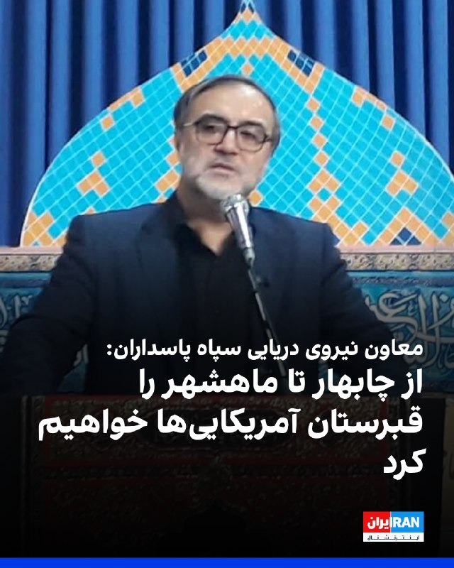

محمد اکبرزاده، معاون سیاسی نیروی دریایی سپاه پاسداران، احتمال وقوع جنگ دوباره را به دلیل «ضعف دشمن» پایین دانست، اما با تکرار لفاظی‌های تهدیدآمیز مقام‌های حکومت گفت: «شک نکنید که از چابهار تا ماهشهر را برای متجاوزان به قبرستان تبدیل خواهیم کرد. رزمندگان ما امروز بغض نبردی تن‌به‌تن با دشمن را در سینه دارند.»

او با اشاره به محاصره دریایی آمریکا در جنوب ایران گفت: «آمریکایی‌ها در بازگشایی تنگه هرمز شکست راهبردی خوردند.»

او ادامه داد: «آن‌ها مدعی بودند که می‌توانند تنگه هرمز را باز کنند، اما پس از انسداد این شاهراه، با تمام توانشان هم نتوانستند کاری از پیش ببرند.»
https://iranintl.com/202605273594

## IranIntlTV — post 339186

  <a href="telegram/content/IranIntlTV_339186_1779865984.mp4" target="_blank">🎬 Download video</a>

سرخط خبرهای چهارشنبه ۶ خرداد
@iranintltv

## IranIntlTV — post 339185

وال‌استریت ژورنال: تهران می‌خواهد در حدی امتیاز دهد که ترامپ نتواند اعلام پیروزی کند

در پی درگیرهای محدود میان جمهوری اسلامی و آمریکا، مقامات ایرانی و میانجی‌های عرب گفتند تهران در مذاکرات با واشینگتن دو هدف اصلی را دنبال می‌کند: کاهش فشار اقتصادی و دسترسی دوباره به منابع مالی و بازار نفت، بدون آن‌که امتیازهایی بدهد که ترامپ بتواند آن را «پیروزی» سیاسی معرفی کند.

وال‌استریت‌ ژورنال سه‌شنبه پنجم خرداد در گزارشی نوشت تهران امیدوار است با دستیابی به توافق، بخشی از حدود ۱۰۰ میلیارد دلار دارایی مسدودشده خود را آزاد کند و دوباره به بازار جهانی نفت دسترسی پیدا کند.

بر اساس این گزارش، تهران خبر کشته شدن چند عضو سپاه پاسداران در حمله نیروهای آمریکایی را با تاخیر منتشر کرد تا گفت‌وگوها آسیب نبیند.

یکی از اصلی‌ترین اختلاف‌ها در مذاکرات، آینده برنامه هسته‌ای جمهوری اسلامی و ذخایر اورانیوم غنی‌شده در ایران است.

این در حالی است که محور این مذاکرات، آزادسازی ۲۴ میلیارد دلار از دارایی‌های بلوکه‌شده ایران است.

بر اساس این گزارش مقام‌های ایرانی و میانجی‌ها گفته‌اند تهران به توافقی نزدیک شده که در مرحله نخست نیمی از این مبلغ آزاد شود.

وال‌استریت ژورنال با اشاره به این که حملات به زیرساخت‌های انرژی در ایران به سهمیه‌بندی سوخت منجر شده و تورم و پایین آمدن شدید سطح رفاه، اعتراض‌های سراسری دی‌ماه را رقم زد، تاکید کرد مقام‌های عملگراتر در حکومت نگرانند ادامه بحران اقتصادی به موج تازه‌ای از نارضایتی عمومی منجر شود.

بر اساس این گزارش با توجه به دیده نشدن مجتبی خامنه‌ای، رهبر سوم جمهوری اسلامی، از زمان جانشینی پدرش، میانجی‌ها در تلاش‌اند اطمینان پیدا کنند پیشنهادهای فعلی تهران مورد تایید جریان‌های تندرو و نهادهای امنیتی نیز قرار دارد.

فشارها بر ترامپ
به گفته وال‌استریت ژورنال، در آمریکا نیز نشانه‌هایی دیده می‌شود که دونالد ترامپ، رییس‌جمهوری این کشور، پس از انتقاد سناتورهای جمهوری‌خواه، به‌دنبال تغییر برخی مفاد توافق احتمالی با ایران است.

سناتورهایی از جمله تد کروز، چارچوب توافق را «اشتباه» توصیف کرده و گفته‌اند این توافق بیش از حد به برجام شبیه است و می‌تواند جمهوری اسلامی را تقویت کند.

ترامپ در شبکه اجتماعی تروث سوشال تلاش کرد منتقدان را آرام کند و گفت توافق جدید «کاملا برعکس» برجام خواهد بود.

او سپس اعلام کرد می‌خواهد عربستان سعودی، قطر، پاکستان، ترکیه، مصر و اردن به توافق‌های ابراهیم بپیوندند و روابط خود را با اسرائیل، عادی‌سازی کنند یا گسترش دهند.

ترامپ همچنین گفت تهران نیز پس از امضای توافق صلح می‌تواند به این روند ملحق شود.

غافلگیری رهبران خاورمیانه
بر اساس این گزارش، پیشنهاد گسترش توافق‌های ابراهیم، مقام‌های خاورمیانه را غافلگیر کرد، زیرا پیش از تماس ترامپ در جریان این طرح قرار نگرفته بودند.

کاخ سفید اعلام کرد این ایده مستقیما از سوی ترامپ مطرح شده است.

وال‌استریت ژورنال نوشت طرح تازه ترامپ علاوه بر تاثیر بر مذاکرات حکومت ایران و آمریکا، می‌تواند روابط واشینگتن با کشورهای خاورمیانه را نیز تغییر دهد. منطقه‌ای که پس از سال‌ها جنگ، همچنان نسبت به عادی‌سازی روابط با اسرائیل تردیدهای جدی در آن وجود دارد.

وال‌استریت ژورنال در ادامه نوشت ترامپ از درخواست قبلی خود برای تحویل مستقیم ذخایر اورانیوم غنی‌شده در ایران به آمریکا عقب‌نشینی کرده و گفته است این مواد می‌توانند زیر نظر آژانس بین‌المللی انرژی اتمی در داخل ایران یا در مکانی دیگر نابود شوند.
 
🔗وب‌سایت ایران‌اینترنشنال
@iranintltv

## FarsiVOA — post 218776

  

تامی پیگوت، سخنگوی وزارت خارجه آمریکا، در پیامی در ایکس نوشت دونالد ترامپ «از روز نخست» به‌روشنی اعلام کرده است که جمهوری اسلامی نباید به سلاح هسته‌ای دست یابد.

او افزود ترامپ برای اطمینان از اینکه جمهوری اسلامی هرگز به چنین هدفی نرسد، «اقدام‌های قاطع» انجام داده است.

این پیام در ادامه موضع‌گیری‌های دولت ترامپ درباره برنامه هسته‌ای جمهوری اسلامی منتشر شده است؛ موضعی که بر جلوگیری از دستیابی تهران به سلاح هسته‌ای و حفظ فشار سیاسی و امنیتی بر حکومت ایران تأکید دارد.

پیام پیگوت نشان می‌دهد واشنگتن همچنان پرونده هسته‌ای جمهوری اسلامی را یکی از محورهای اصلی سیاست خود در قبال تهران می‌داند.
@FarsiVOA

## BBCPersian — post 282161

🔻اسرائیل می‌گوید که در حمله به غزه فرمانده جدید شاخه نظامی حماس کشته شده است

اسرائیل اعلام کرد که در حمله اخیر به غزه، محمد عوده، فرمانده جدید شاخه نظامی حماس را کشته است.

محمد عوده پس از کشته شدن فرمانده قبلی حماس در حمله‌ای مشابه در اوایل ماه جاری میلادی به این سمت منصوب شده بود.

اسرائیل همچنین گفته است که حملات خود به اهداف مرتبط با حزب‌الله در لبنان را نیز ادامه داده است.

این در حالی است که به طور رسمی در هر دو منطقه آتش‌بس برقرار شده است.

پیشتر مقام‌های لبنانی اعلام کرده بودند که در حملات روز سه‌شنبه اسرائیل در لبنان دست‌کم ۳۱ نفر کشته شده‌اند. یکی از مراکز آسیب‌دیده، بیمارستانی در شهر نبطیه در جنوب لبنان بوده است.

بر اساس گزارش‌ها، آمریکا به اسرائیل هشدار داده که به بیروت حمله نکند، زیرا چنین اقدامی می‌تواند آتش‌بس با ایران را با خطر مواجه کند.

https://bbc.in/42UY7e3
@BBCPersian

## alonews — post 122979

  <a href="telegram/content/alonews_122979_1779865988.webm" target="_blank">🎬 Download video</a>

👈 رسانه‌های لبنانی گزارش می‌دهند که صدای انفجارهایی که چندی پیش شنیده شد، بوم صوتی بود!

🔴برخی گزارش‌های رسانه‌ها همچنین ادعا می‌کنند که در زمان انفجارها هیچ پروازی بر فراز پایتخت وجود نداشته است.

✅ @AloNews خبر جنگ

## alonews — post 122978

  <a href="telegram/content/alonews_122978_1779865988.webm" target="_blank">🎬 Download video</a>

👈شماری از کاربران پس از بازگشت اینترنت بین‌الملل، از عدم امکان اتصال به گوگل‌پلی و مشکل در به‌روزرسانی اپلیکیشن‌ها خبر داده‌اند

✅ @AloNews خبر جنگ

---
📅 بروزرسانی: 1405/03/06 10:33
---

## VahidOOnLine — post 242383

  

احمد خاتمی در خطبه‌های نماز «عید قربان»، دونالد ترامپ را «دشمن دیوانه کاخ سیاه‌نشین» خواند و خطاب به مردم ایران گفت: «دشمنان شما و این دشمن دیوانه کاخ سیاه‌نشین که به غلط از آن به عنوان کاخ سفید یاد می‌شود، خواهان ذلت شما هستند، اما این آرزو را این دیوانه به گور خواهند برد.»

خاتمی با اشاره به اظهارات ترامپ درباره توافق با جمهوری اسلامی گفت: «او مدام از مذاکره با ایران سخن می‌گوید، اما حقیقت آن است که مقصودشان مذاکره نیست، بلکه تسلیم است.»
‌🏁 🇬🇧 IranintlTV

🤖 @VahidOOnLine

## WithYashar — post 12628

مجلس سوئد ازدواج فامیلی رو ممنوع کرد؛
طبق این مصوبه، از اول ژوئیه 2026 دیگه ازدواج بین بچه‌های "عمو، دایی، عمه و خاله" تو سوئد ممنوعه.
@withyashar

## WithYashar — post 12627

  <a href="telegram/content/WithYashar_12627_1779865388.mp4" target="_blank">🎬 Download video</a>

اردوغان:ان‌شاءالله این ظالم به نام نتانیاهو، درسی که شایسته‌اش است را از مسلمانان جهان خواهد گرفت
@withyashar
یاشار : به قول تحلیلگر ترک، ترکیه هیچوقت مثل ایران نمیشه، بلکه بدتر از ایران میشه.

## IranIntlTV — post 339184

  

احمد خاتمی در خطبه‌های نماز «عید قربان»، دونالد ترامپ را «دشمن دیوانه کاخ سیاه‌نشین» خواند و خطاب به مردم ایران گفت: «دشمنان شما و این دشمن دیوانه کاخ سیاه‌نشین که به غلط از آن به عنوان کاخ سفید یاد می‌شود، خواهان ذلت شما هستند، اما این آرزو را این دیوانه به گور خواهند برد.»

خاتمی با اشاره به اظهارات ترامپ درباره توافق با جمهوری اسلامی گفت: «او مدام از مذاکره با ایران سخن می‌گوید، اما حقیقت آن است که مقصودشان مذاکره نیست، بلکه تسلیم است.»
https://iranintl.com/202605274248

## DW_Farsi — post 125179

  

🔶باقری در مسکو: ریشه تهدیدها علیه ایران در عراق باید خشکانده شود

علی باقری کنی، معاون دبیر شورای عالی امنیت ملی ایران، در دیدار با قاسم الاعرجی، مشاور امنیت ملی عراق، خواستار اقدام "قاطع" بغداد برای جلوگیری از تبدیل خاک عراق به "منشا تهدید" علیه جمهوری اسلامی شد.

به گزارش رسانه‌های دولتی در ایران، این دیدار در حاشیه چهاردهمین کنفرانس بین‌المللی امنیتی مسکو برگزار شده است.

باقری در این دیدار تاکید کرده است که "ریشه این تهدیدها باید خشکانده شود" و جمهوری اسلامی برای همکاری با عراق در این زمینه آمادگی دارد.

رسانه‌های نزدیک به دولت ایران جزئیات بیشتری درباره ماهیت این تهدیدها منتشر نکرده‌اند، اما تهران در سال‌های گذشته بارها گروه‌های مسلح مخالف جمهوری اسلامی در اقلیم کردستان عراق را به فعالیت علیه ایران متهم کرده است.

قاسم الاعرجی، مشاور امنیت ملی عراق، تا کنون جزئیاتی از این گفت‌وگو منتشر نکرده است.

علی باقری برای شرکت در کنفرانس امنیتی مسکو به روسیه سفر کرده؛ نشستی که هر سال با حضور مقامات امنیتی و سیاسی کشورهای مختلف برگزار می‌شود.

@dw_farsi

## alonews — post 122977

  <a href="telegram/content/alonews_122977_1779865393.mp4" target="_blank">🎬 Download video</a>

👈فاکس نیوز:جمهوری اسلامی درخواست ۲۴ میلیارد دلار برای هر توافقی با آمریکا کرده است.

✅ @AloNews خبر جنگ

---
📅 بروزرسانی: 1405/03/06 10:22
---

## WithYashar — post 12626

ارسالی : اینکه شب عید قربان نت وصل کردن، حس گوسفندی رو دارم که قبل ذبح بهش آب میدن.😂🤣
@withyashar

## BBCPersian — post 282160

  

‌🔻مقام‌های دریانوردی هند اعلام کردند که ۱۰ ملوان هندی که از ژوئیه ۲۰۲۵در ایران زندانی بودند، پس از «رایزنی‌های دیپلماتیک مستمر» آزاد شده‌اند.

اداره کل کشتیرانی هند اعلام کرد که خدمه کشتی «ام‌وی هاربور فینیکس» پس از توقیف این نفتکش در نزدیکی بندر جاسک در سال گذشته، توسط نیروی دریایی ایران بازداشت و زندانی شده بودند.

این نهاد در بیانیه‌ای گفته است: «ملوانان اکنون آزاد شده و در امنیت کامل در کنار یکدیگر هستند...و هماهنگی‌های لازم برای بازگشت هرچه سریع‌تر آن‌ها به هند در حال انجام است.» و همچنین عکسی از افراد آزادشده را نیز منتشر کرده است.

اداره کل کشتیرانی هند جزئیات بیشتری درباره علت بازداشت خدمه یا توقیف کشتی ارائه نکرد.

سایت‌های رهگیری کشتی‌ها، این شناور را یک نفتکش حامل فرآورده‌های نفتی با پرچم پالائو معرفی کرده‌اند.

📷 X Directorate General of Shipping, Govt. of India
https://bbc.in/4e7EKVe

@BBCPersian

## alonews — post 122976

  <a href="telegram/content/alonews_122976_1779864744.webm" target="_blank">🎬 Download video</a>

👈مجلس سوئد ازدواج فامیلی رو ممنوع کرد؛

🔴طبق این مصوبه، از اول ژوئیه 2026 دیگه ازدواج بین بچه‌های "عمو، دایی، عمه و خاله" تو سوئد ممنوعه.

🔴دلیلشم جلوگیری از خشونت‌های ناموسی، فشار خانوادگی و ازدواج‌های اجباری اعلام شده.

✅ @AloNews خبر جنگ

## alonews — post 122975

  <a href="telegram/content/alonews_122975_1779864744.webm" target="_blank">🎬 Download video</a>

👈بلومبرگ: خانوارهای بریتانیایی شاهد بیشترین افزایش هزینه‌های انرژی از سال ۲۰۲۳ خواهند بود، زیرا جنگ در ایران هزینه‌های عمده‌فروشی گاز و برق را افزایش می‌دهد.

✅ @AloNews خبر جنگ

---
📅 بروزرسانی: 1405/03/06 10:12
---

## WithYashar — post 12625

زنگنه، نماینده مجلس : آمریکا حق غنی‌سازی، حاکمیت ایران بر تنگه هرمز و رفع تحریم‌ها را پذیرفت
@withyashar 🤣

## DW_Farsi — post 125178

  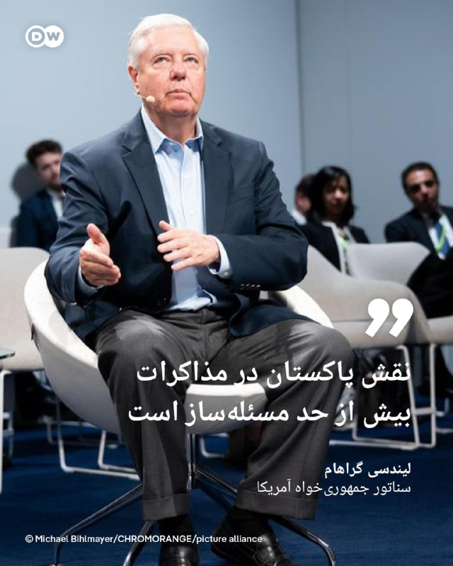

🔶 لیندسی گراهام: نقش پاکستان در مذاکرات بیش از حد مسئله‌ساز است

لیندسی گراهام، سناتور جمهوری‌خواه آمریکا، با انتقاد از نقش پاکستان در تحولات اخیر خاورمیانه، گفته است که ایفای نقش میانجی از سوی اسلام‌آباد [در مذاکرات میان تهران و واشنگتن] "بیش از حد مسئله‌ساز" به نظر می‌رسد و خصومت این کشور با اسرائیل، سابقه‌ای طولانی دارد.

او در پیامی در شبکه اجتماعی ایکس (توییتر سابق) نوشت: «غیرقابل انکار است که هواپیماهای نظامی ایران در پایگاه‌های هوایی پاکستان نگهداری می‌شوند.»

او همچنین به اظهارات گذشته مقامات پاکستانی علیه اسرائیل اشاره کرد و آن‌ها را "نگران‌کننده" خواند.

این سناتور جمهوری‌خواه در ادامه به سخنان پیشین وزیر دفاع پاکستان درباره توافق‌ ابراهیم اشاره کرد؛ توافقی که در سال‌های اخیر به عادی‌سازی روابط برخی کشورهای عربی با اسرائیل منجر شده است.

گراهام نوشت اگرچه ویدیوی مربوط به اظهارات وزیر دفاع، پاکستان مربوط به حدود یک سال پیش است، اما به گفته او، "احتمالا این نگاه همچنان پابرجاست".

@dw_farsi

## IranianMinds — post 20854

🔴با تایید کشته شدن محمد عوده، حالا تمام فرماندهان ستاد کل قسام(حماس) در ماجرای عملیات طوفان الاقصی کشته شدن @IranianMinds

## IranianMinds — post 20853

  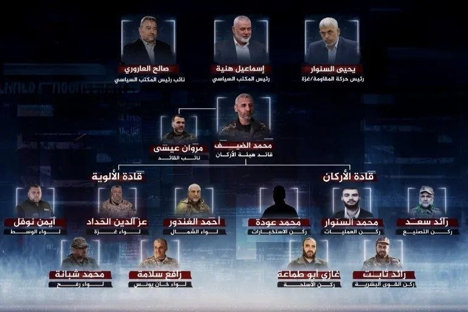

🔴با تایید کشته شدن محمد عوده، حالا تمام فرماندهان ستاد کل قسام(حماس) در ماجرای عملیات طوفان الاقصی کشته شدن

@IranianMinds

## Dirty_Kids — post 390290

  <a href="telegram/content/Dirty_Kids_390290_1779864152.mp4" target="_blank">🎬 Download video</a>

این دختره باحال حرف میرنه

@Dirty_Kids 👻

## Dirty_Kids — post 390289

  

اسراییل هیوم: رستم قاسمی با افشا تصویر خصوصی او توسط موساد اخراج شد و مدتی بعد مرد. او وزیر نفت دولت احمدی نژاد بود‌. وی از فرماندهان سپاه محسوب می شد که پولشویی می‌کرد‌. موساد بدون ترور او را به این روش حذف کرد

@Dirty_Kids 👻

## alonews — post 122974

  <a href="telegram/content/alonews_122974_1779864153.webm" target="_blank">🎬 Download video</a>

👈الجزیره: ایران ۱۰ ملوان هندی را پس از رایزنیهای دیپلماتیک آزاد کرد!

🔴مقامات کشتیرانی هند اعلام کرده اند که ۱۰ ملوان هندی ساکن در یک نفتکش که از ژوئیه ۲۰۲۵ در ایران بازداشت شده بود، پس از «رایزنی دیپلماتیک مستمر» آزاد شده اند.

✅ @AloNews خبر جنگ

---
📅 بروزرسانی: 1405/03/06 10:02
---

## DW_Farsi — post 125177

🔶 مارادونا، نابغه جنجال‌برانگیز

تکنیک، سرعت، شوت‌هاى دقیق و سرکش و هم‌چنین نبوغ و خلاقیت مارادونا در بازی‌گردانى، او را به ستاره‌اى درخشان تبدیل کرد

دیگو آرماندو مارادونا در روز ۳۰ اکتبر سال ۱۹۶۰ در منطقه‌ی فقیرنشین "ویلا فیوریتو" در حوالی بوئنوس آیرس، پایتخت آرژانتین به دنیا آمد. خانواده‌ پرجمعیت (۸ فرزند) او اصلیتی ایتالیایی داشت.

دیگو که از همان کودکى شیفته‌ توپ و فوتبال بود، در اواسط دهه ۱۹۷۰ میلادى به باشگاه Argentinos Juniors پیوست؛ باشگاهی که نقطه‌ آغاز راه و فعالیت بسیاری از بزرگان فوتبال آرژانتین است.

مارادونا در روز بیستم اکتبر سال ۱۹۷۶، زمانی ‌که تنها ۱۶ سال داشت، اولین بازی خود را براى این تیم در لیگ دسته اول آرژانتین انجام داد. این بازى سرآغاز پروازی فراموش‌نشدنى بود که پس از حدود ۲۱ سال، در ۲۹ اکتبر ۱۹۹۷، با پیروزى ۲ بر یک بوکا جونیورز مقابل ریور پلاته به پایان رسید.

تکنیک، سرعت، شوت‌هاى دقیق و سرکش و هم‌چنین نبوغ و خلاقیت مارادونا در بازی‌گردانى، از جمله قابلیت‌هایى بود که او را به ستاره‌اى درخشان در باشگاه‌هایى چون بوکا جونیورز آرژانتین، بارسلونای اسپانیا و ناپولی ایتالیا تبدیل کرد؛ هر چند مارادونا بزرگترین موفقیت‌هایش را در پیراهن سفید و آبى تیم ملى آرژانتین جشن گرفت. او در ۹۱ حضور ملی خود در مستطیل سبز، در مجموع ۳۴ گل به ثمر رساند.

@dw_farsi

## Persian_Trend_Official — post 15108

سازمان هواپیمایی کشوری اعلام کرد ۱۰ فرودگاه ایران از این پس به‌صورت ۲۴ ساعته فعال‌ هستند.

با تصمیم این سازمان، فرودگاه‌های مهرآباد و خمینی تهران، ساری، بیرجند، گرگان، بجنورد، کرمان، زاهدان، سبزوار و مشهد از این پس به‌صورت شبانه‌روزی فعالیت خواهند کرد

پ.ن: گویا نظام تصمیمش رو گرفته بده بره ...

📌 @persian_trend_official
پرشین ترند | متفاوت‌ترین کانال نظامی

## IranianMinds — post 20852

  <a href="telegram/content/IranianMinds_20852_1779863569.mp4" target="_blank">🎬 Download video</a>

با وصل شدن اینترنت
داره ویدیو های جالبی از اتفاقای روزای جنگ داره میاد بیرون

@IranianMinds

## alonews — post 122973

  <a href="telegram/content/alonews_122973_1779863571.webm" target="_blank">🎬 Download video</a>

👈تهدید بمب‌گذاران انتحاری خطرناک‌تر از آن است که اسرائیل تصور می‌کند و راه‌حل‌های فعلی مانع فاجعه بعدی نخواهند شد، طبق گزارش کانال ۱۲ عبری

✅ @AloNews خبر جنگ

## alonews — post 122972

  <a href="telegram/content/alonews_122972_1779863571.mp4" target="_blank">🎬 Download video</a>

👈 وزیر خارجه کوبا: روبیو دروغ می‌گوید؛ او طراح اصلی محاصره کوباست

🔴 وزیر خارجه کوبا در پاسخ به ادعای مارکو روبیو، وزیر امور خارجه آمریکا، مبنی بر اینکه علت رنج مردم کوبا، غارت منابع این کشور توسط «رژیم کوبا» است، گفت: روبیو یکی از طراحان اصلی تشدید محاصره علیه کوبا در همه زمینه‌هاست.

🔴 وزیر خارجه کوبا تأکید کرد: او مدام دروغ می‌گوید و قصد دارد افکار عمومی آمریکا و جهان را فریب دهد. من بارها از او شنیده‌ام که می‌گوید محاصره وجود ندارد، در حالی که خودش طراح اصلی آن است.

🔴 وی افزود: روبیو در کوبا به دنیا نیامده، کوبا را نمی‌شناسد و هیچ چیز از کوبا نمی‌داند. این اظهارات به عنوان اقدامی تأسف‌بار به درک مردم کوبا از وزیر خارجه آمریکا اضافه شده است.

✅ @AloNews خبر جنگ

## alonews — post 122971

  <a href="telegram/content/alonews_122971_1779863574.webm" target="_blank">🎬 Download video</a>

👈فایننشیال تایمز: صندوق رسمی «هیئت صلح» ترامپ، علی‌رغم وعده‌های کلان برای بازسازی غزه، یک ریال هم پول ندارد و هیچ پروژه بازسازی‌ای آغاز نشد.

✅ @AloNews خبر جنگ

---
📅 بروزرسانی: 1405/03/06 09:52
---

## Persian_Trend_Official — post 15107

  

منابع دیپلماتیک روز چهارشنبه به «العربیه» اطلاع دادند سفر محمدباقر قالیباف، رئیس مجلس و مذاکره‌کننده ارشد ایران، به قطر شامل بررسی سازوکار آزادسازی دارایی‌های بلوکه‌شده ایران بوده است.

این منابع افزودند ایران خواستار آزادسازی حدود 24 میلیارد دلار از دارایی‌های بلوکه‌شده خود شده و اصرار دارد هم‌زمان با اعلام تفاهم‌نامه مورد انتظار با واشینگتن، نیمی از این مبلغ را دریافت کند.

📌 @persian_trend_official
پرشین ترند | متفاوت‌ترین کانال نظامی

## RadioFarda — post 157595

🔸روزنامه نیویورک تایمز، در گزارشی از جزئیات زمینهٔ حمله اخیر آمریکا به اهدافی در جنوب ایران، به نقل از دو مقام آمریکایی نوشت این حمله به‌دنبال مشاهده و شناسایی «مجموعه‌ای از تهدیدها» از سوی حکومت ایران انجام شد. 🔸این دو مقام آمریکایی که به شرط ناشناس ماندن…

## RadioFarda — post 157594

  

🔸روزنامه نیویورک تایمز، در گزارشی از جزئیات زمینهٔ حمله اخیر آمریکا به اهدافی در جنوب ایران، به نقل از دو مقام آمریکایی نوشت این حمله به‌دنبال مشاهده و شناسایی «مجموعه‌ای از تهدیدها» از سوی حکومت ایران انجام شد.

🔸این دو مقام آمریکایی که به شرط ناشناس ماندن با این روزنامه صحبت کردند، گفتند حملات روز دوشنبه آمریکا پس از آن انجام شد که نیروهای آمریکایی از جمله «پرواز پهپادها و فعالیت در سایت‌های پرتاب موشک» در جنوب ایران را مشاهده کردند.

🔸به گفته این دو، پیش از حمله آمریکا، نیروهای نظامی ایران «قایق‌های مین‌گذار را در تنگه هرمز مستقر کرده و پهپادهای تهاجمی را در نزدیکی کشتی‌های آمریکایی به پرواز درآورده بودند».

🔸ستاد فرماندهی مرکزی آمریکا، سنتکام، پیش‌تر اعلام کرده بود که ارتش ایالات متحده روز دوشنبه در جنوب ایران حملاتی را علیه اهدافی «از جمله قایق‌هایی که در تلاش برای کارگذاری مین بودند و همچنین سایت‌های پرتاب موشک» انجام داده است.

@RadioFarda

---
📅 بروزرسانی: 1405/03/06 09:42
---

## Persian_Trend_Official — post 15106

کانال رسمی پرشین ترند pinned «کسانی که اینترنتشون تازه وصل شده یا قبلا سرعت اینترنت یاری نمیکرده اگر این ویدیو رو ندیدید توضیه میکنم ببینید تا بدونید احتمالا یک سال اینده قراره جمهوری اسلامی چه چالش هایی داشته باشه https://youtu.be/8YQ1YcLyw6E»

## RadioFarda — post 157593

🔸مارکو روبیو، وزیر خارجه آمریکا، کمتر از دو هفته مانده به انتخابات پارلمانی ارمنستان، در جریان توقفی کوتاه در فرودگاه ایروان، از نیکول پاشینیان، نخست‌وزیر ارمنستان، حمایت کرد. 🔸روبیو، روز سه‌شنبه پنجم خرداد، هنگام بازگشت از گفت‌وگوهای چندجانبه در هند، در…

## RadioFarda — post 157592

  

🔸مارکو روبیو، وزیر خارجه آمریکا، کمتر از دو هفته مانده به انتخابات پارلمانی ارمنستان، در جریان توقفی کوتاه در فرودگاه ایروان، از نیکول پاشینیان، نخست‌وزیر ارمنستان، حمایت کرد.

🔸روبیو، روز سه‌شنبه پنجم خرداد، هنگام بازگشت از گفت‌وگوهای چندجانبه در هند، در توقفی کوتاه برای سوخت‌گیری با آرارات میرزویان، وزیر خارجه ارمنستان، دیدار کرد.

🔸او در کنار آقای میرزویان گفت: «شما، نخست‌وزیر و کل تیم‌تان در ارمنستان، در حال گشودن راه به‌سوی آینده‌ای روشن‌تر و مستقل‌تر برای ارمنستان هستید.»

🔸مارکو روبیو افزود: «بسیار خوشحالم که این‌جا هستم تا حمایت خود را از شجاعت، چشم‌انداز، تعهد و آمادگی آن‌ها برای نگاه به آیندهٔ کشورشان و اقداماتی که برای رسیدن به آن لازم است، نشان دهم.»

@RadioFarda

## alonews — post 122970

  <a href="telegram/content/alonews_122970_1779862335.webm" target="_blank">🎬 Download video</a>

👈نخست‌وزیر قطر در تماس‌های جداگانه با مقامات عربستان، اردن، مصر و امارات، راه‌های هماهنگی منطقه‌ای برای پشتیبانی از میانجی‌گری پاکستان میان تهران و واشنگتن را بررسی کرد.

✅ @AloNews خبر جنگ

---
📅 بروزرسانی: 1405/03/06 09:32
---

## FarsiVOA — post 218775

  

تایلند، مشتری سنتی گاز مایع قطر، در پی انسداد تنگه هرمز و آسیب حملات جمهوری اسلامی به تاسیسات گاز مایع قطر، مذاکرات برای توافق خرید بلندمدت گاز مایع (ال‌ان‌جی) آمریکا را تسریع کرده است.

خبرگزاری رویترز از قول منابع آگاه گزارش داده که مذاکرات با شرکت ونچر گلوبال آمریکا برای صادرات گاز مایع به تایلند برای ۱۵ سال یا بیشتر انجام می‌شود.

این کشور پیشتر نیز در تلاش برای تنوع بخشیدن به منابع واردات انرژی بود. اکتبر پارسال دولت آمریکا و تایلند اعلام کردند که شرکتهای تایلندی سالانه ۴.۵ میلیارد دلار انرژی، از جمله گاز مایع، از ایالات متحده خریداری خواهند کرد.

تایلند سالانه بیش از ۱۱ میلیون تن واردات ال‌ان‌جی دارد.
@FarsiVOA

## FarsiVOA — post 218774

🔺تهران ۱۰ ملوان هندی بازداشت‌شده در پرونده نفتکش «هاربر فینیکس» را آزاد کرد

▪️مقام‌های کشتیرانی هند اعلام کردند ۱۰ ملوان هندی که از ژوئیه ۲۰۲۵ پس از توقیف یک نفتکش در ایران بازداشت شده بودند، پس از «رایزنی‌های دیپلماتیک مستمر» آزاد شده‌اند.

▪️جزئیات بیشتری درباره علت بازداشت، روند قضایی یا شرایط آزادی این ملوانان اعلام نشده است.

▪️این ملوانان عضو خدمه کشتی «هاربر فینیکس» بودند؛ نفتکشی که در ژوئیه ۲۰۲۵ در نزدیکی بندر جاسک توقیف شد و خدمه کشتی پس از توقیف، در ایران «بازداشت، دستگیر و زندانی» شدند.

▪️خانواده برخی از این ملوانان پیش‌تر گفته بودند تماس محدودی با آنها داشته‌اند و درباره اتهام‌ها، روند حقوقی و زمان احتمالی آزادی‌شان اطلاعات روشنی دریافت نکرده‌اند.

⬇️ بیشتر بخوانید:
https://ir.voanews.com/a/8154426.html

## DW_Farsi — post 125176

  

🔶 شورای امنیت حمله به نیروگاه هسته‌ای امارات را محکوم کرد

شورای امنیت سازمان ملل حمله به نیروگاه هسته‌ای براکه در امارات متحده عربی را محکوم کرده و آن را نقض قوانین بین‌المللی دانست.

در بیانیه‌ای که روز سه‌شنبه ۵ خرداد ۱۴۰۵ (۲۶ مه) منتشر شد، شورای امنیت بدون اشاره مستقیم به عامل حمله اعلام کرد، هدف قرار دادن تاسیسات هسته‌ای غیرنظامی، "مغایر با حقوق بین‌الملل است".

امارات متحده عربی هفته گذشته اعلام کرده بود شش پهپاد از خاک عراق به سوی این کشور پرتاب شده‌اند که یکی از آن‌ها نیروگاه هسته‌ای براکه در خلیج فارس را هدف قرار داده است.

عراق محل فعالیت گروه‌های مسلح مورد حمایت جمهوری اسلامی است؛ گروه‌هایی که در جریان جنگ آمریکا و اسرائیل با ایران، مسئولیت حمله به آنچه "پایگاه‌های دشمن در عراق و منطقه" خوانده‌اند را برعهده گرفته بودند.

نیروگاه براکه نخستین نیروگاه هسته‌ای جهان عرب به شمار می‌رود و حمله به آن نگرانی‌هایی درباره امنیت تاسیسات هسته‌ای در بحبوحه تنش‌های منطقه‌ای را افزایش داده است.

@dw_farsi

## Persian_Trend_Official — post 15105

کسانی که اینترنتشون تازه وصل شده یا قبلا سرعت اینترنت یاری نمیکرده
اگر این ویدیو رو ندیدید توضیه میکنم ببینید تا بدونید احتمالا یک سال اینده قراره جمهوری اسلامی چه چالش هایی داشته باشه

https://youtu.be/8YQ1YcLyw6E

## RadioFarda — post 157591

🔸روزنامه وال‌استریت جورنال در گزارشی به نقل از مقام‌های ایرانی و میانجی‌های عرب، نوشته جمهوری اسلامی در مذاکرات با آمریکا به‌دنبال کسب «گشایش مالی» و همزمان، جلوگیری از «اعلام پیروزی» دونالد ترامپ است. 🔸این مقام‌ها «دو هدف به‌هم‌پیوسته» ایران در جریان مذاکرات…

## RadioFarda — post 157590

  

🔸روزنامه وال‌استریت جورنال در گزارشی به نقل از مقام‌های ایرانی و میانجی‌های عرب، نوشته جمهوری اسلامی در مذاکرات با آمریکا به‌دنبال کسب «گشایش مالی» و همزمان، جلوگیری از «اعلام پیروزی» دونالد ترامپ است.

🔸این مقام‌ها «دو هدف به‌هم‌پیوسته» ایران در جریان مذاکرات را به این صورت تشریح کرده‌اند: «به‌دست آوردن گشایش مالی برای اقتصادی که تحت فشار شدید قرار دارد، بدون آنکه در برنامه هسته‌ای خود آن‌قدر عقب‌نشینی کند که ترامپ بتواند ادعای پیروزی کند.»

🔸اواخر دوشنبه، فرماندهی مرکزی آمریکا، سنتکام، به قایق‌های تندروی ایرانی که به گفته واشینگتن در حال مین‌گذاری در تنگه هرمز بودند، حمله کرد. ایران نیز با شلیک به هواپیماهای آمریکایی پاسخ داد و آمریکا در واکنش، سایت‌های پرتاب موشک در ایران را هدف قرار داد.

🔸این تبادل آتش پس از پیام‌های متناقض ترامپ در آخر هفته رخ داد. او پس از آنکه شنبه گفت توافق با تهران تا حد زیادی نهایی شده، در پی انتقاد برخی جمهوری‌خواهان سنا از چارچوب توافق، ظاهراً موضع خود را تغییر داد.

@RadioFarda

## idfinfarsi — post 11654

  <a href="telegram/content/idfinfarsi_11654_1779861770.mp4" target="_blank">🎬 Download video</a>

*مستند ویژه: تکمیل چرخه شناسایی و هدف قرار دادن یک تروریست که هواگرد بدون سرنشین را در جنوب لبنان هدایت می‌کرد*

در چارچوب فعالیت نیروهای ارتش اسرائیل در جنوب لبنان، یک هواگرد از نیروی هوایی، یک هواگرد بدون سرنشین را در آسمان شناسایی کرد که تهدیدی برای نیروهای ما در منطقه محسوب می‌شد.

این هواگرد بدون سرنشین فرود آمد و یک تروریست از سازمان تروریستی حزب‌الله برای جمع‌آوری آن به محل رسید. در یک واکنش سریع، هواگرد نیروی هوایی به محل حمله کرده و این تروریست را به هلاکت رساند.

نیروی هوایی به فعالیت خود برای دفاع و پشتیبانی از نیروهای ما در جنوب لبنان ادامه خواهد داد.

## alonews — post 122969

  <a href="telegram/content/alonews_122969_1779861773.webm" target="_blank">🎬 Download video</a>

👈احتمال شنیدن صدای انفجار کنترل‌شده در اصفهان

✅ @AloNews خبر جنگ

## alonews — post 122968

  <a href="telegram/content/alonews_122968_1779861773.webm" target="_blank">🎬 Download video</a>

👈هاآرتص: عربستان سعودی و قطر نسبت به درخواست ترامپ برای پیوستن به توافق‌های ابراهیم محتاط هستند؛ این موضوع نیازمند تعهد به تشکیل دولت فلسطین است.

✅ @AloNews خبر جنگ

---
📅 بروزرسانی: 1405/03/06 09:22
---

## VahidOOnLine — post 242382

  <a href="telegram/content/VahidOOnLine_242382_1779861137.mp4" target="_blank">🎬 Download video</a>

♦️تیم ملی فوتبال ایران که برای برگزاری اردوی تدارکاتی به آنتالیا در ترکیه سفر کرده است، روز سه‌شنبه و پس از تمرین‌های اولیه بار دیگر به دو گروه تقسیم شد و بازی «درون‌تیمی» برگزار کرد.

تیم ملی، از زمان جنگ ۱۲ روزه و پس از آن اعتراضات دی‌ماه و جنگ اخیر با اسرائیل و آمریکا، با چالش جدی «رقیب تدارکاتی» مواجه است و قرار است در آستانه سفر به مکزیک روز ۱۴ خرداد در آنتالیا با تیم ملی «مالی» دیدار تدارکاتی برگزار کند.

شاگردان امیر قلعه‌نویی پیش از این هم با خودشان رقابت تدارکاتی برگزار کرده بودند.
‌🇸🇦 Indypersian

🤖 @VahidOOnLine

## VahidOOnLine — post 242381

♦️مهدی خراتیان، کارشناس استراتژیک نزدیک به جمهوری اسلامی در گفتگو با پادکست «ایران‌تاک» به رهبران حکومت ایران توصیه کرد با توجه به بقای تهدیدها حتی در صورت توافق با آمریکا، سیاست «انعطاف هسته‌ای» را در پیش بگیرند.

خراتیان در بخشی از این برنامه گفت اگر بعد از انتخابات میان‌دوره‌ای مجلس آمریکا در ماه نوامبر، شاهد کوچکترین تحرکی در منطقه علیه ایران باشیم، مثلا تعداد سوخت‌رسان‌ها در پایگاه‌های قطر و عربستان از حدی فراتر رود، باید از ان‌پی‌تی خارج شویم و به سراغ ساخت سلاح هسته‌ای برویم.
‌🇸🇦 Indypersian

🤖 @VahidOOnLine

## Persian_Trend_Official — post 15101

عکس‌های منتشرشده از سوی فرماندهی مرکزی آمریکا، سنتکام، نشان می‌دهد یک فروند جنگنده پنهانکار اف-۲۲ رپتور متعلق به بال یکم جنگنده نیروی هوایی آمریکا مستقر در پایگاه لانگلی ویرجینیا، در حال سوخت‌گیری هوایی بر فراز نقطه‌ای اعلام‌نشده در خاورمیانه است.

در این تصاویر، اف-۲۲ در کنار یک فروند هواپیمای سوخت‌رسان KC-135T Stratotanker دیده می‌شود؛ هواپیمایی که به بال ۱۷۱ سوخت‌رسانی هوایی گارد ملی هوایی پنسیلوانیا اختصاص دارد.

انتشار این تصاویر از سوی سنتکام در شرایطی انجام می‌شود که حضور جنگنده‌های نسل پنجم آمریکا در منطقه، معمولاً به‌عنوان بخشی از پیام بازدارندگی، نمایش آمادگی عملیاتی و پشتیبانی از مأموریت‌های هوایی بلندبرد تفسیر می‌شود. اف-۲۲ رپتور عمدتاً برای برتری هوایی، نفوذ در محیط‌های پرخطر و مقابله با تهدیدهای پیشرفته طراحی شده و سوخت‌گیری هوایی، امکان ماندگاری و عملیات طولانی‌تر آن در منطقه را فراهم می‌کند.

📌 @persian_trend_official
پرشین ترند | متفاوت‌ترین کانال نظامی

## idfinfarsi — post 11650

  <a href="telegram/content/idfinfarsi_11650_1779861139.mp4" target="_blank">🎬 Download video</a>

ارتش اسرائیل و شاباک محمد عوده، رئیس شاخه نظامی سازمان تروریستی حماس که پس از به هلاکت رسیدن عزالدین حداد منصوب شده بود و همچنین رئیس ستاد اطلاعات سازمان تروریستی حماس بود را به هلاکت رساندند

⭕️ سخنگوی ارتش اسرائیل و شاباک اعلام کردند که در حمله‌ای در شمال نوار غزه، تروریست محمد عوده که به‌عنوان رئیس شاخه نظامی سازمان تروریستی حماس پس از به هلاکت رسیدن عزالدین حداد منصوب شده بود و همچنین ریاست ستاد اطلاعات این سازمان را بر عهده داشت، به هلاکت رسید.

🔻 در چارچوب عملیات مشترک ارتش اسرائیل و شاباک برای حذف این تروریست، چندین ساختمان در قلب شهر غزه که به‌عنوان محل اختفای او مورد استفاده قرار می‌گرفت، هدف قرار گرفت. این اقدام پس از ماه‌ها رصد اطلاعاتی برای شناسایی الگوهای رفت‌وآمد او و همکارانش انجام شد. همزمان، یک آپارتمان متعلق به یک تروریست حماس که در ۷ اکتبر در حمله مشارکت داشت و بخشی از حلقه پشتیبانی عوده بود، نیز هدف قرار گرفت.

⭕️ عوده در دو هفته گذشته رئیس شاخه نظامی سازمان تروریستی حماس بود و در سال‌های اخیر نیز ریاست ستاد اطلاعات این سازمان را بر عهده داشت. وی در این چارچوب مسئول برنامه‌ریزی و هماهنگی ا

---
📅 بروزرسانی: 1405/03/06 09:12
---

## DW_Farsi — post 125175

  

🔶نت‌بلاکس: اتصال اینترنت در ایران در حال بازگشت است، اما محدودیت‌ها ادامه دارد

نت‌بلاکس، نهاد ناظر بر اینترنت اعلام کرده است که دسترسی به اینترنت جهانی در ایران، پس از هفته‌ها محدودیت و اختلال گسترده، دوباره در حال افزایش است؛ هرچند همچنان بخشی از کاربران با محدودیت یا قطع ارتباط روبه‌رو هستند.

نت‌بلاکس در پیامی در شبکه اجتماعی ایکس (توییتر سابق) نوشت، شاخص‌های فنی نشان می‌دهد اتصال شبکه‌های موبایل و برخی بخش‌های دیگر اینترنت ایران به شبکه جهانی، بار دیگر در حال برقراری است.

با این حال، این نهاد تاکید کرده که فیلترینگ همچنان برقرار است و کاربران برای دسترسی به برخی وب‌سایت‌ها و شبکه‌های اجتماعی، ناچار به استفاده از ابزارهای دور زدن محدودیت‌ها هستند.

بر اساس این گزارش، دسترسی به واتس‌اپ نیز اکنون با محدودیت روبه‌رو شده و استفاده از این پیام‌رسان بدون ابزارهای عبور از فیلترینگ، برای بسیاری از کاربران ممکن نیست.

@dw_farsi

## Persian_Trend_Official — post 15100

  <a href="telegram/content/Persian_Trend_Official_15100_1779860535.mp4" target="_blank">🎬 Download video</a>

برنده های جنگ بلد خجالتی 😄
خب با این بنده خداها حرف بزنید
بگید چند ماه بیخودی سرکارشون گذاشتید و مثل همیشه لاف پیروزی زدید

اخرش که چی ؟
متن رو که همه میخونن ...

📌 @persian_trend_official
پرشین ترند | متفاوت‌ترین کانال نظامی

## BBCPersian — post 282159

🔻به دلیل جنگ ایران، قیمت انرژی برای خانوارها در بریتانیا افزایش خواهد یافت

🔻قیمت انرژی برای خانوارها در بریتانیا از ماه ژوئیه با افزایش قابل‌توجهی روبه‌رو خواهد شد. این نخستین تأثیر مستقیم جهش قیمت‌ها به دلیل جنگ ایران برای مصرف‌کنندگان برق و گاز در بریتانیا خواهد بود.

نهاد تنظیم‌گر بازار انرژی بریتانیا، روز چهارشنبه جزئیات سقف جدید قیمت انرژی را منتشر می‌کند که میلیون‌ها خانوار دارای تعرفه‌های متغیر در انگلستان، اسکاتلند و ولز را تحت تأثیر قرار خواهد داد.

تحلیلگران پیش‌بینی می‌کنند که سقف جدید حدود ۱۳ درصد بالاتر از نرخ فعلی باشد. در این صورت، خانوارهایی با مصرف متوسط گاز و برق سالانه حدود ۲۰۹ پوند بیشتر پرداخت خواهند کرد و هزینه سالانه انرژی آن‌ها به حدود هزار و ۸۵۰ پوند خواهد رسید.

اعلام این افزایش هم‌زمان با موج گرمای بی‌سابقه در بخش‌های وسیعی از بریتانیاست، اما کارشناسان می‌گویند خانوارها می‌توانند از هم‌اکنون برای کاهش هزینه‌های ماه‌های آینده اقدام کنند.

سقف قیمت انرژی هر سه ماه یک‌بار تعیین می‌شود. قبوض انرژی خانوارها بین آوریل تا ژوئیه، پس از اصلاح ساختار هزینه‌ها از سوی دولت، حدود ۷ درصد کاهش یافته بود. این تغییر اندکی پیش از آغاز درگیری‌ها در ایران اعلام شد. با این حال، سقف قیمت برای دوره ژوئیه تا سپتامبر، بازتاب‌دهنده افزایش ۲۵ درصدی بهای جهانی گاز در پی جنگ خواهد بود. افزایشی که به‌ویژه ناشی از اختلال جدی در تردد کشتی‌ها از تنگه هرمز است.

دولت بریتانیا اعلام کرده در حال بررسی برنامه‌هایی برای حمایت هدفمند از اقشار آسیب‌پذیر است.

https://bbc.in/4tWBPn2
@BBCPersian

## alonews — post 122967

  <a href="telegram/content/alonews_122967_1779860537.webm" target="_blank">🎬 Download video</a>

👈وال‌استریت ژورنال: در مذاکرات با ایالات متحده، ایران می‌خواهد کنترل بخشی از حدود ۱۰۰ میلیارد دلار دارایی‌های مسدودشده توسط غرب را دوباره به دست بگیرد و همچنین به بازارهای جهانی نفت دسترسی پیدا کند.

✅ @AloNews خبر جنگ

## alonews — post 122966

  <a href="telegram/content/alonews_122966_1779860537.webm" target="_blank">🎬 Download video</a>

👈طی روز‌های اخیر حدود ۱۰۰ اداره و بانک به‌دلیل رعایت نکردن الگوی مصرف، مشمول محدودیت برق شده‌اند

✅ @AloNews خبر جنگ

---
📅 بروزرسانی: 1405/03/06 09:02
---

## pm_afshaa — post 91605

فرودگاه بین المللی تبریز فعالیت هاشو بعد 90 روز از سر گرفت

💧 Rainbet.com the #1 Non-KYC Crypto Casino & Sportsbook @rainbetcom

😁 @Pm_Afshaa

## DW_Farsi — post 125174

  

🔶بازگشایی فرودگاه تبریز همزمان با ۲۴ ساعته شدن ۱۰ فرودگاه در ایران

سازمان هواپیمایی کشوری ایران اعلام کرده فرودگاه بین‌المللی تبریز، پس از آسیب‌دیدگی در جریان جنگ ۱۲ روزه، دوباره بازگشایی شده و از چهارشنبه ۶ خرداد فعالیت خود را از سر می‌گیرد.

مجید اخوان، سخنگوی این سازمان، اعلام کرده است که بخش‌هایی از فرودگاه، از جمله باند پروازی و برج مراقبت، در جریان جنگ آسیب دیده بودند، اما عملیات بازسازی انجام شده و فرودگاه اکنون آماده پذیرش پروازهای داخلی و خارجی است.

هم‌زمان، سازمان هواپیمایی کشوری از ۲۴ ساعته شدن فعالیت ۱۰ فرودگاه کشور، از جمله "مهرآباد، امام خمینی و مشهد" خبر داده است.

فرودگاه بین‌المللی تبریز یکی از مهم‌ترین مراکز هوانوردی شمال‌غرب ایران و از فرودگاه‌های پرتردد کشور به شمار می‌رود. پیش از جنگ، این فرودگاه پروازهایی به چند مقصد داخلی و خارجی، از جمله استانبول، نجف، باکو و دبی داشت.

@dw_farsi

## Persian_Trend_Official — post 15099

  

حق ++

📌 @persian_trend_official
پرشین ترند | متفاوت‌ترین کانال نظامی

## alonews — post 122965

  <a href="telegram/content/alonews_122965_1779859973.mp4" target="_blank">🎬 Download video</a>

👈انفجار مخزن مواد شیمیایی در ایالت واشنگتن

🔴 در پی وقوع حادثه‌ای صنعتی در ایالت واشنگتن آمریکا، دست‌کم 1 نفر جان باخت و 9 کارگر دیگر همچنان مفقود هستند.

🔴 این حادثه چهارشنبه در یک کارخانه تولید کاغذ و بسته‌بندی رخ داد و نگرانی‌هایی درباره نشت مواد خطرناک شیمیایی به وجود آورده است.

✅ @AloNews خبر جنگ

## alonews — post 122964

  <a href="telegram/content/alonews_122964_1779859974.webm" target="_blank">🎬 Download video</a>

👈پهپادهای اوکراینی پایگاه هوایی تگانرونگ در روسیه را هدف قرار دادند

✅ @AloNews خبر جنگ

## alonews — post 122963

  <a href="telegram/content/alonews_122963_1779859974.webm" target="_blank">🎬 Download video</a>

👈تصویر روز رویترز از کشتی های پهلو گرفته در نزدیکی تنگه هرمز، سمت ساحل عمان

✅ @AloNews خبر جنگ

---
📅 بروزرسانی: 1405/03/06 08:52
---

## VahidOOnLine — post 242380

  

♦️کره شمالی روز چهارشنبه ششم خردادماه از شلیک موشک‌های کروز با سامانه هدایتگر مجهز به هوش مصنوعی در جریان یک رزمایش خبر داد.

به گزارش رویترز به نقل از خبرگزاری دولتی کره شمالی در این رزمایش،  «ترکیبی از موشک‌های بالستیک تاکتیکی، راکت‌های توپخانه و موشک‌های کروز دقیق هدایت‌شونده با هوش مصنوعی، که برای جنگ‌های مدرن طراحی شده‌اند، تحت نظارت کیم جونگ اون، رهبر جمهوری دموکراتیک خلق کره، آزمایش شده‌اند.

به گزارش خبرگزاری دولتی کره شمالی،‌ کیم جونگ اون به فرماندهان ارتش گفت: «این آزمایش‌ها به‌ویژه آمادگی رزمی موشک‌های کروز را که در واحدهای توپخانه‌ای نزدیک مرز با کره جنوبی مستقر خواهند شد، تایید کرد.»

براساس همین گزارش، پیونگ یانگ می‌گوید «این موشک‌ها مجهز به ناوبری دقیق و کنترل هدایت‌شده با هوش مصنوعی هستند که می‌توانند به اهدافی در فاصله ۱۰۰ کیلومتری حمله کنند.»
‌🇸🇦 Indypersian

🤖 @VahidOOnLine

## alonews — post 122962

  <a href="telegram/content/alonews_122962_1779859330.webm" target="_blank">🎬 Download video</a>

👈فرودگاه بین‌المللی تبریز بازگشایی شد

✅ @AloNews خبر جنگ

## alonews — post 122961

  <a href="telegram/content/alonews_122961_1779859330.webm" target="_blank">🎬 Download video</a>

👈فارس: بیش از ۲۰۰ فروند کشتی در یک هفته گذشته از تنگه هرمز عبور کرده‌اند

🔴 اولویت عبور برای کشتی‌های فله‌بر و حامل کود است، اما برخی تردد‌های مجوزدار را به‌نوعی آزادسازی عبورو مرور از این آبراه تلقی می‌کنند

✅ @AloNews خبر جنگ

## alonews — post 122960

  <a href="telegram/content/alonews_122960_1779859330.webm" target="_blank">🎬 Download video</a>

👈زنگنه، نماینده مجلس: آمریکا حق غنی‌سازی، حاکمیت ایران بر تنگه هرمز و رفع تحریم‌ها را پذیرفت

✅ @AloNews خبر جنگ

---
📅 بروزرسانی: 1405/03/06 08:42
---

## VahidOOnLine — post 242379

  

تامی پیگوت، سخنگوی وزارت خارجه آمریکا، در ایکس نوشت: «ترامپ از نخستین روز حضورش به‌روشنی اعلام کرده است که حکومت ایران نباید به سلاح هسته‌ای دست یابد. ترامپ برای اطمینان از اینکه جمهوری اسلامی هرگز به این هدف نرسد، اقدام‌های قاطعی انجام داده است.»
‌🏁 🇬🇧 IranintlTV

🤖 @VahidOOnLine

## FarsiVOA — post 218773

🔺شورای امنیت حمله به نیروگاه هسته‌ای براکه امارات را محکوم کرد

▪️شورای امنیت سازمان ملل متحد در بیانیه‌ای مطبوعاتی، حمله پهپادی به نیروگاه هسته‌ای براکه در امارات متحده عربی را «به شدیدترین لحن» محکوم کرد و آن را نقض حقوق بین‌الملل دانست.

▪️اعضای شورای امنیت در این بیانیه، بدون نسبت دادن مسئولیت حمله به طرفی مشخص، تأکید کردند که این حمله خطری جدی برای جان غیرنظامیان، زیرساخت‌ها و محیط زیست ایجاد کرده است.

▪️این بیانیه پس از آن صادر شد که در هفته‌های اخیر مقام‌های امارات اعلام کردند چند پهپاد از خاک عراق به سوی این کشور پرتاب شده‌اند و یکی از آنها به یک ژنراتور برق در خارج از محدوده داخلی نیروگاه براکه برخورد کرده و باعث آتش‌سوزی شده است.

⬇️ بیشتر بخوانید:
https://ir.voanews.com/a/8154425.html

## RadioFarda — post 157589

مقام پیشین پنتاگون: آمریکا در درگیری با ایران «کم‌ضررترین» گزینه را انتخاب می‌کند  

🔸ایالات متحده و ایران ظاهراً به دستیابی به توافقی برای پایان دادن به جنگ نزدیک شده‌اند، هرچند توافق نهایی هنوز قریب‌الوقوع به نظر نمی‌رسد و برخی جزئیات کلیدی هنوز حل‌وفصل نشده‌اند.

🔸بر اساس گزارش‌ها، توافق در حال شکل‌گیری منجر به بازگشایی تنگه هرمز به‌عنوان یکی از مسیرهای حیاتی انتقال نفت جهان خواهد شد، اما مذاکرات پیرامون برنامهٔ هسته‌ای ایران را به مرحله‌ٔ بعد موکول می‌کند.

🔸جیسون اچ. کمپبل، پژوهشگر ارشد مؤسسهٔ خاورمیانه و مقام پیشین پنتاگون در دورهٔ نخست ریاست‌جمهوری دونالد ترامپ، در گفت‌وگو با رادیو اروپای آزاد/رادیو آزادی می‌گوید توافقِ گزارش‌شده «احتمالاً کم‌ضررترین گزینه‌ای است که در حال حاضر در اختیار دولت آمریکا قرار دارد.»

🔸 گزارش کامل را در وب‌سایت رادیوفردا بخوانید.

@RadioFarda

## alonews — post 122959

  <a href="telegram/content/alonews_122959_1779858743.webm" target="_blank">🎬 Download video</a>

👈مدیر عامل شرکت برق: برق 100 اداره در تهران رو به‌دلیل عدم‌رعایت الگوی مصرف قطع کردیم

✅ @AloNews خبر جنگ

---
📅 بروزرسانی: 1405/03/06 08:33
---

## VahidOOnLine — post 242378

  

ان‌بی‌سی نیوز به نقل از مقام‌های آمریکایی و کارشناسان امنیت ملی گزارش داد در حالی که ترامپ تاکید می‌کند توافق با حکومت ایران نزدیک است و آمریکا توان نظامی جمهوری اسلامی را نابود کرده، پنتاگون فهرستی از اهداف را برای جنگ احتمالی تهیه کرده است که یافتن و زدن آنها می‌تواند بسیار دشوار باشد.
‌🏁 🇬🇧 IranintlTV

🤖 @VahidOOnLine

## IranIntlTV — post 339183

  

تامی پیگوت، سخنگوی وزارت خارجه آمریکا، در ایکس نوشت: «ترامپ از نخستین روز حضورش به‌روشنی اعلام کرده است که حکومت ایران نباید به سلاح هسته‌ای دست یابد. ترامپ برای اطمینان از اینکه جمهوری اسلامی هرگز به این هدف نرسد، اقدام‌های قاطعی انجام داده است.»
https://iranintl.com/202605272526

## IranIntlTV — post 339182

  

ان‌بی‌سی نیوز به نقل از مقام‌های آمریکایی و کارشناسان امنیت ملی گزارش داد در حالی که ترامپ تاکید می‌کند توافق با حکومت ایران نزدیک است و آمریکا توان نظامی جمهوری اسلامی را نابود کرده، پنتاگون فهرستی از اهداف را برای جنگ احتمالی تهیه کرده است که یافتن و زدن آنها می‌تواند بسیار دشوار باشد.
https://iranintl.com/202605271846

## DW_Farsi — post 125173

🔶 ازدواج "جان‌فداها"؛ نقاب رمانتیک حکومت بر بحران عمیق مشروعیت

🔻 گزارشی از الینا فرهادی

صدای بوق‌های ممتد و هیاهوی ساختگی، سکوت سنگین غروب میادین اصلی شهر تهران را می‌شکند. چند ده خودروی جیپ و تاکتیکی نظامی که بدنه زمخت و سبزرنگشان با تورها و روبان‌های سفید و صورتی تزیین شده، به ردیف ایستاده‌اند.

داخل خودروها زوج‌هایی که رسانه‌های رسمی آن‌ها را "جان‌فدا" می‌نامند، نشسته‌اند.

خیابان، یعنی همان فضایی که تا دیروز صحنه تقابل سنگین بر سر سبک زندگی، پوشش و اعتراض بود، حالا به یک "کلوپ بزرگ عروسی ایدئولوژیک" تبدیل شده است.

حاکمیت سفره‌های عقد را از سالن‌های خصوصی به آسفالت سرد میادین اصلی شهر آورده تا پیوند دو انسان را به یک بیانیه سیاسی تمام‌عیار بدل کند.

اما در پس این کارناوال‌های سازمان‌یافته، در کشوری که هنوز سایه جنگ و آتش‌بس شکننده بر آن سنگینی می‌کند، میانگین سن ازدواج به بالاترین حد خود در ده‌ها سال اخیر رسیده و تورم، تشکیل خانواده را برای میلیون‌ها جوان به یک رویای دست‌نیافتنی تبدیل کرده، این تئاترهای خیابانی چه پیام رسانه‌ای دارند؟

آیا جمهوری اسلامی در حال بازتعریف خانواده به‌عنوان نهادی ایدئولوژیک است؟ آیا "زوج‌های جان‌فدا" نسخه‌ای تازه از همان روایت بسیج اجتماعی دهه شصت‌اند؟

@dw_farsi

---
📅 بروزرسانی: 1405/03/06 08:22
---

## FarsiVOA — post 218772

  

قیمت نفت روز چهارشنبه پس از جهش تند روز قبل عقب نشست؛ بازاری که هنوز میان ریسک ژئوپلیتیک و امید به پیشرفت مذاکرات آمریکا و ایران در نوسان است.

بهای نفت برنت با ۱.۴۳ درصد کاهش به ۹۸ دلار و ۱۶ سنت رسید و نفت وست تگزاس اینترمدیت هم با ۱.۷۷ درصد افت، ۹۲ دلار و ۲۳ سنت معامله شد.

این عقب‌نشینی پس از آن رخ داد که سه‌شنبه برنت، در واکنش به حملات تازه آمریکا به قایق‌های سپاه و کمرنگ شدن امید به بازگشایی کامل تنگه هرمز، حدود ۴ درصد بالا رفت و در ۹۹ دلار و ۵۸ سنت بسته شد.

در همان بازار، نفت آمریکا به‌دلیل تعدیل اثر تعطیلی دوشنبه، ۲.۸ درصد افت کرد. حالا نگاه معامله‌گران به دو متغیر اصلی است، سرنوشت مذاکرات و نشانه‌های عبور دوباره نفتکش‌ها و کشتی‌های گاز مایع از هرمز.

پیش از آغاز جنگ در ۲۸ فوریه، تصویر بازار کاملاً متفاوت بود. در نظرسنجی فوریه رویترز، میانگین قیمت برنت برای سال ۲۰۲۶ حدود ۶۳ دلار و نفت آمریکا ۶۰ دلار پیش‌بینی شده بود.
@FarsiVOA

---
📅 بروزرسانی: 1405/03/06 08:12
---

## pm_afshaa — post 91604

  <a href="telegram/content/pm_afshaa_91604_1779856964.webm" target="_blank">🎬 Download video</a>

1500 تا کانفینگ رایگان اختصاصی برا هر نفر جدا گذاشته برین سریع کانفینگتونو رایگان بگیرین
👇
👇 @Lex_Server @Lex_Server

## Persian_Trend_Official — post 15098

  

💢رویترز گزارش می‌دهد که استارلینک، شرکت متعلق به ایلان ماسک که خدمات اینترنت ماهواره‌ای در مدار پایین زمین ارائه می‌دهد، هزینه اتصالات استارلینک مورد استفاده در پهپادهای تهاجمی یک‌بارمصرف LUCAS را ۵ برابر افزایش داده است.

💢پنتاگون در حال حاضر برای هر پهپاد ۵۰۰۰ دلار بابت اتصال استارلینک پرداخت می‌کرد، اما اکنون با این افزایش قیمت، با پرداخت ۲۵۰۰۰ دلار برای هر پهپاد موافقت کرده است.

💢پهپاد LUCAS به‌طور تقریبی حدود ۳۰۰۰۰ دلار برای هر واحد هزینه دارد، اما حالا که ترمینال‌های استارلینک ۲۰۰۰۰ دلار دیگر به هزینه اضافه کرده‌اند، صرفه‌اقتصادی این پهپاد به‌شدت کاهش پیدا می‌کند و ممکن است باعث شود پنتاگون طراحی یا پلتفرم آن را مورد بازنگری قرار دهد.

🫆:Tony

📌 @persian_trend_official
پرشین ترند | متفاوت‌ترین کانال نظامی

---
📅 بروزرسانی: 1405/03/06 08:02
---

هیچ پیام جدیدی در این بروزرسانی ارسال نشد.

---
📅 بروزرسانی: 1405/03/06 07:52
---

هیچ پیام جدیدی در این بروزرسانی ارسال نشد.

---
📅 بروزرسانی: 1405/03/06 07:42
---

هیچ پیام جدیدی در این بروزرسانی ارسال نشد.

---
📅 بروزرسانی: 1405/03/06 07:32
---

## BBCPersian — post 282158

  

🔻به گفته سخنگوی سازمان هواپیمایی کشوری ایران فرودگاه بین‌المللی تبریز، که در جریان جنگ اخیر آسیب دیده بود، از امروز - چهارشنبه ششم خرداد - فعالیت خود را از سر می‌گیرد.

مجید اخوان در گفت‌وگو با رسانه‌های داخلی ایران گفته است که نخستین پرواز این فرودگاه پس از پایان عملیات بازسازی انجام خواهد شد. به گفته او، فرودگاه تبریز بیست‌ویکمین فرودگاهی است که پس از پایان درگیری‌ها دوباره وارد چرخه عملیاتی می‌شود.

رسانه‌های داخلی ایران در هفته‌های گذشته گزارش داده بودند که در حملات به تبریز، باند و برج مراقبت این فرودگاه آسیب دیده است.

فرودگاه تبریز در کنار فرودگاه‌های مهرآباد، مشهد و امام از مهم‌ترین فرودگاه‌های ایران محسوب می‌شود و به حدود ۹ مقصد خارجی پرواز از جمله استانبول، بغداد، دبی، باکو و هامبورگ پرواز دارد.

مجید اخوان، سخنگوی سازمان هواپیمایی کشوری در گفتگو با خبرنگار مهر از بازگشت تدریجی فرودگاه‌های کشور به مدار خدمت‌رسانی پس از جنگ ۳۹ روزه آمریکا و اسرائیل با ایران خبر داد و گفت: تاکنون ۲۰ فرودگاه کشور و همچنین ابتدای این هفته سه فرودگاه اصفهان، اردبیل و لامرد بازگشایی شده‌اند.

📷MEHR
@bbcpersian

## BBCPersian — post 282157

🔻ده‌ها نفر کشته در لبنان در پی تشديد حملات اسرائيل

در پی موج جدید حملات اسرائيل به جنوب و شرق لبنان دهها نفر کشته شدند؛ این حملات گسترده پس از آنکه بنيامين نتانياهو، نخست وزير اسرائيل، وعده تشديد اقدام نظامی عليه حزب‌الله را داد به سرعت در نقاط مختلف لبنان شکل گرفت.

وزارت بهداشت لبنان روز سه‌شنبه اعلام کرد در تازه‌ترين موج حملات دست کم ۳۱ نفر، از جمله چند کودک، جان باخته‌اند.

ارتش اسرائيل گفته بيش از ۱۰۰ زيرساخت و محل استقرار حزب‌ الله را هدف قرار داده است؛ حملاتی که از زمان آغاز آتش‌بس با ميانجيگری آمريکا در اواسط آوريل، يکی از سنگين‌ترين شب‌های بمباران به شمار می‌رود.

اين حملات پس از آن انجام شد که آقای نتانياهو روز دوشنبه گفت دستور داده است برای هدف قرار دادن حزب الله «فشار بيشتری» اعمال شود.

او روز سه‌شنبه در نشست کابينه امنيتی گفت اسرائيل «در حال گسترش عمليات خود در لبنان» است.

آقای نتانياهو افزود: «نيروهای دفاعی اسرائيل با نيروهای گسترده در ميدان عمل می‌کنند و مناطق راهبردی را در اختيار می‌گيرند.» او همچنين گفت اسرائيل در حال «تقويت منطقه امنيتی» برای حفاظت از شهرک‌های شمالی اسرائيل در برابر حملات حزب الله است.

آتش‌بس ميان دو طرف بارها از سوی هر دو نقض شده و اين مسئله تهديدی برای مذاکرات پيچيده جاری با هدف پايان دادن به جنگ ميان آمريکا، اسرائيل و ايران به شمار می‌رود.

ایران بارها تاکید کرده که توقف جنگ در لبنان یکی از شروط مذاکره این کشور با آمریکا خواهد بود.

https://bbc.in/3PMVmbE
@bbcpersian

---
📅 بروزرسانی: 1405/03/06 07:22
---

## VahidOOnLine — post 242377

  <a href="telegram/content/VahidOOnLine_242377_1779853942.mp4" target="_blank">🎬 Download video</a>

♦️تیم ملی فوتبال عربستان سعودی، در چارچوب مرحله پایانی برنامه آماده‌سازی برای جام جهانی ۲۰۲۶، وارد شهر نیویورک آمریکا شد.
اعضای تیم ملی عربستان سعودی در فرودگاه جان اف کندی از سوی مقام‌های کنسولگری در نیویورک مورد استقبال قرار گرفتند. یاسر المسحل، رییس فدراسیون فوتبال عربستان سعودی، از همکاری و استقبال کنسولگری این کشور قدردانی کرد.
بر اساس برنامه اعلام‌شده، ۱۰ خرداد در نیویورک ادامه خواهد داشت و ملی‌پوشان عربستان سعودی در جریان آن، روز شنبه ۹ خرداد در یک بازی دوستانه به مصاف تیم ملی اکوادور می‌روند.
‌🇸🇦 Indypersian

🤖 @VahidOOnLine

---
📅 بروزرسانی: 1405/03/06 07:12
---

هیچ پیام جدیدی در این بروزرسانی ارسال نشد.

---
📅 بروزرسانی: 1405/03/06 07:02
---

## VahidOOnLine — post 242376

  

♦️سخنگوی سازمان هواپیمایی جمهوری اسلامی ایران اعلام کرد فرودگاه بین‌المللی تبریز که در جریان جنگ اخیر هدف حمله قرار گرفته بود، پس از انجام عملیات بازسازی و تعمیر، دوباره به مدار فعالیت بازگشته و چهارشنبه ششم خردادماه بازگشایی می‌شود.
‌🇸🇦 Indypersian

🤖 @VahidOOnLine

## BBCPersian — post 282156

🔻ناسا از گام‌های بعدی برای ساخت پايگاه دائمی در ماه رونمايی کرد

ناسا جزئيات فرودگرهای رباتيک، پهپادهای جهنده و خودروهايی را منتشر کرده که قصد دارد در چارچوب برنامه آمريکا برای ساخت پايگاه در ماه، به سطح اين قمر بفرستد.

شرکت فضايی بلو اوريجين متعلق به جف بزوس، بنيانگذار آمازون، يکی از چند شرکتی است که برای ساخت اين تجهيزات انتخاب شده‌اند.

آمریکا می‌خواهد پيش از پايان دوره رياست جمهوری دونالد ترامپ در سال ۲۰۲۸، بار ديگر فضانوردان آمريکايی را به ماه بازگرداند.

اما ناسا در رقابت با چين برای بازگرداندن انسان به سطح ماه قرار دارد و همين مسئله باعث شده اين سازمان فضايی تحت فشار باشد تا نشان دهد در «رقابت جديد فضايی» پيشتاز است.

چين نيز با سرعت برنامه‌های خود را برای فرود انسان بر ماه تا سال ۲۰۳۰ پيش می‌برد.

اين کشور روز دوشنبه فضاپيمای «شنژو-۲۳» را پرتاب کرد و گروهی از فضانوردان را به ايستگاه فضايی «تيانگونگ» فرستاد.

ناسا در ماه مارس از برنامه‌ای ۲۰ ميليارد دلاری برای ساخت يک پايگاه دائمی در قطب جنوب ماه تا سال ۲۰۳۲ خبر داده بود؛ پايگاهی که با انرژی هسته‌ای و خورشيدی فعاليت خواهد کرد.

جرد آيزاکمن، رئيس ناسا، روز سه‌شنبه گفت اين اعلام‌ها به اين معناست که آمريکا «ديگر هرگز ماه را واگذار نخواهد کرد.»

https://bbc.in/3PMVmbE
@bbcpersian

---
📅 بروزرسانی: 1405/03/06 06:52
---

هیچ پیام جدیدی در این بروزرسانی ارسال نشد.

---
📅 بروزرسانی: 1405/03/06 06:42
---

## FarsiVOA — post 218771

⚡️کارایی پهپادهای ام‌کیو-۹ در عملیات خشم حماسی برنامه تولید نسل آینده پهپادهای پیشرفته و ارزانتر را شتاب بخشید
@FarsiVOA

---
📅 بروزرسانی: 1405/03/06 06:32
---

هیچ پیام جدیدی در این بروزرسانی ارسال نشد.

---
📅 بروزرسانی: 1405/03/06 06:22
---

## FarsiVOA — post 218770

  

⚡️مارکو روبیو، وزیر امورخارجه آمریکا، روز سه‌شنبه در ارمنستان سند چارچوب توافق «جاده ترامپ برای صلح و رفاه بین‌المللی» را امضا کرد. آقای روبیو و همتای ارمنی او، آرارات میرزویان، همچنین سندی را در ارتباط با مواد معدنی حیاتی و نادر امضا کردند.

@FarsiVOA

---
📅 بروزرسانی: 1405/03/06 06:12
---

## VahidOOnLine — post 242375

♦️ویدیوهای منتشرشده از مراسم حج، شماری از زائران ایرانی را نشان می‌دهد که در جریان برگزاری مناسک، شعارهای علیه آمریکا و اسرائیل سر می‌دهند.
بیش از یک میلیون و ۵۰۰ هزار زائر، سه‌شنبه پنجم خردادماه، در صحرای عرفات در عربستان سعودی گرد هم آمدند تا مهم‌ترین بخش مناسک حج را به‌جا آورند.
حج امسال در شرایطی برگزار می‌شود که منطقه خاورمیانه همچنان تحت تاثیر تنش‌ها و پیامدهای جنگ میان آمریکا، اسرائیل و جمهوری اسلامی ایران قرار دارد.
‌🇸🇦 Indypersian

🤖 @VahidOOnLine

## Persian_Trend_Official — post 15097

  <a href="telegram/content/Persian_Trend_Official_15097_1779849748.mp4" target="_blank">🎬 Download video</a>

صبحتون بخیر ☕️🤍

📝 Nick
📌 @persian_trend_official
پرشین ترند | متفاوت‌ترین کانال نظامی

---
📅 بروزرسانی: 1405/03/06 06:02
---

## VahidOOnLine — post 242374

  

علی ربیعی، دستیار اجتماعی پزشکیان، گفت: «رفع محدودیت اینترنت یک بایدِ بنیادین بود. مایه تاسف است که صداوسیما در صف اول هجمه به این تصمیم ایستاده است.»
پس از ۸۸ روز تاریکی دیجیتال در ایران، دسترسی به اینترنت به تدریج برقرار شده است. نت‌بلاکس در ایکس اعلام کرد اتصال اینترنت در ایران افزایش بیشتری یافته و به ۸۶ درصد رسیده است، شبکه‌های موبایل و بخش‌های دیگری از اینترنت نیز دوباره به اینترنت جهانی متصل شده‌اند. نت‌بلاکس افزود «فیلترنت» همچنان برقرار است اما امکان دور زدن آن وجود دارد.
همچنین واتس‌اپ اکنون محدود شده و برای دسترسی به آن نیازمند فیلترشکن است. از سوی دیگر، برخی کاربران همچنان به اینترنت جهانی دسترسی ندارند.

‌🏁 🇬🇧 IranintlTV

🤖 @VahidOOnLine

## IranIntlTV — post 339181

  

علی ربیعی، دستیار اجتماعی پزشکیان، گفت: «رفع محدودیت اینترنت یک بایدِ بنیادین بود. مایه تاسف است که صداوسیما در صف اول هجمه به این تصمیم ایستاده است.»
پس از ۸۸ روز تاریکی دیجیتال در ایران، دسترسی به اینترنت به تدریج برقرار شده است. نت‌بلاکس در ایکس اعلام کرد اتصال اینترنت در ایران افزایش بیشتری یافته و به ۸۶ درصد رسیده است، شبکه‌های موبایل و بخش‌های دیگری از اینترنت نیز دوباره به اینترنت جهانی متصل شده‌اند. نت‌بلاکس افزود «فیلترنت» همچنان برقرار است اما امکان دور زدن آن وجود دارد.
همچنین واتس‌اپ اکنون محدود شده و برای دسترسی به آن نیازمند فیلترشکن است. از سوی دیگر، برخی کاربران همچنان به اینترنت جهانی دسترسی ندارند.

https://iranintl.com/202605273087

---
📅 بروزرسانی: 1405/03/06 05:52
---

هیچ پیام جدیدی در این بروزرسانی ارسال نشد.

---
📅 بروزرسانی: 1405/03/06 05:42
---

## FarsiVOA — post 218769

  

⚡️بنیامین نتانیاهو، نخست وزیر اسرائيل روز سه‌شنبه گفت از زمان عملیات «غرش شیران»، «ما تقریباً ۲۵۰۰ تروریست حزب‌الله را از بین برده‌ایم.» او افزود «تنها در طول آتش‌بس، ۷۰۰ تروریست حزب‌الله از بین رفتند، بیشتر از تعداد تروریست‌هایی که در کل جنگ دوم لبنان از بین رفتند.»
@FarsiVOA

---
📅 بروزرسانی: 1405/03/06 05:32
---

## FarsiVOA — post 218768

⚡️ربودن افراد در خارج از کشور بخشی از رویه جمهوری اسلامی برای حذف مخالفان؛ گفت‌وگو با سعید دهقان
@FarsiVOA

## BBCPersian — post 282147

🔻انقلاب فرهنگی چین، که از آغاز آن شش دهه می‌گذرد، یکی از تاریک‌ترین دوره‌های تاریخ این کشور بود.

در سال ۱۹۶۶، مائو تسه‌تونگ، رهبر کمونیست چین، کارزاری ملی را آغاز کرد تا آنچه را در حکومت، آموزش و هنر «عناصر ضد انقلاب»، «نفوذ سرمایه‌داری» و «تفکر بورژوایی» خوانده می‌شد، پاکسازی کند.

مائو در حقیقت علیه گذشته و آنچه «اندیشه‌های کهنه» و «آداب و رسوم کهنه» نامیده می‌شد، اعلام جنگ کرده بود.

قرار نبود بار اصلی این نبرد بر دوش پلیس یا نهادهای امنیتی باشد؛ بلکه ماموریت بر عهده شهروندان عادی، به‌ویژه جوانان، گذاشته شده بود تا علیه هم‌وطنان خود وارد عمل شوند.

یافنگ شیا، تاریخ‌دان و استاد دانشگاه لانگ آیلند در آمریکا، توضیح می‌دهد: «پیام مائو این بود: علیه استاد دانشگاهتان، علیه معلمتان، علیه رهبر حزبی‌تان، علیه مافوقتان و علیه مدیران کارخانه‌ها شورش کنید. شورش موجه است.»

برای خواندن مطلب کامل:
https://bbc.in/4a6teqH
📸GettyImages/Gamma-Rapho via Getty Images/ AFP
@bbcpersian

---
📅 بروزرسانی: 1405/03/06 05:22
---

## FoxNewsTwitter — post 342295

  

Fox News (Twitter/X)

“We just sent a Texas-sized message to Washington.”

Texas AG Ken Paxton speaks after defeating Sen. John Cornyn in Texas’ Republican Senate primary runoff, calling the victory a mandate for change inside the GOP.

Paxton now faces Democrat James Talarico in a race that is among a handful that could decide if the Republicans hold their slim 53-47 majority in the Senate.

## FarsiVOA — post 218767

⚡️پرزیدنت ترامپ در آستانه تصمیم‌گیری مهمی درباره ایران؛ گفت‌وگو با محمد قائدی
@FarsiVOA

---
📅 بروزرسانی: 1405/03/06 05:12
---

## FoxNewsTwitter — post 342294

  

Fox News (Twitter/X)

WATCH LIVE: Trump-ally Ken Paxton speaks after defeating Senator Cornyn in GOP primary https://twitter.com/i/broadcasts/1pKdRRDwkjaJW

## FoxNewsTwitter — post 342293

  <a href="telegram/content/FoxNewsTwitter_342293_1779846157.mp4" target="_blank">🎬 Download video</a>

Fox News (Twitter/X)

NOW: Sen. John Cornyn speaks after losing Texas’ Republican Senate primary runoff to Trump-backed Texas Attorney General Ken Paxton.

"After a public service career lasting more than four decades and 18 consecutive campaign wins, tonight, we've come up short in this primary runoff."

He says he intends to support the Republican ticket in the general election.

## FarsiVOA — post 218766

⚡️بازی جمهوری اسلامی با قطع و وصل اینترنت؛ دولت مصوبه می‌دهد، دیوان عدالت توقیف می‌کند
@FarsiVOA

## Persian_Trend_Official — post 15096

  

💢اگر ایران تسلیم شود، اعتراف کند نیروی دریایی‌اش نابود شده و در کف دریا آرمیده است، و نیروی هوایی‌اش دیگر وجود ندارد، و اگر تمام ارتششان از تهران خارج شود، سلاح‌ها را زمین بیندازند و دست‌ها را بالا ببرند و هرکدام فریاد بزنند «تسلیم می‌شوم، تسلیم می‌شوم» در حالی که دیوانه‌وار پرچم سفید را تکان می‌دهند، و اگر تمام رهبران باقی‌مانده‌شان همه «اسناد تسلیم» لازم را امضا کنند و شکست خود را در برابر قدرت عظیم و باشکوه ایالات متحده آمریکا بپذیرند، باز هم نیویورک تایمز شکست‌خورده، «چاینا استریت ژورنال» (WSJ!)، سی‌ان‌ان فاسد و حالا بی‌اهمیت، و تمام رسانه‌های جعلی دیگر تیتر خواهند زد که ایران یک پیروزی استادانه و درخشان مقابل ایالات متحده آمریکا به دست آورد و اصلاً رقابتی هم وجود نداشت. دموکرات‌های احمق و رسانه‌ها کاملاً راه خود را گم کرده‌اند. آن‌ها کاملاً دیوانه شده‌اند!!!

رئیس‌جمهور DJT

🫆:Tony

📌 @persian_trend_official
پرشین ترند | متفاوت‌ترین کانال نظامی

---
📅 بروزرسانی: 1405/03/06 05:02
---

## VahidOOnLine — post 242373

♦️مارکو روبیو، وزیر امور خارجه ایالات متحده، در جریان سفر خود به هند، به همراه همسرش از بنیاد مادر ترزا بازدید کرد و تصاویری از این دیدار را در شبکه اجتماعی اکس منتشر کرد.
روبیو در پیامی نوشت: «بازدید از خانه مادر عمیقا مرا تحت تاثیر قرار داد. میراث مادر ترزا در ایمان، شفقت و خدمت، الهام‌بخش همه ما است.»
مادر ترزا، برنده جایزه صلح نوبل، راهبه‌ای کاتولیک بود که سازمان خیریه «مبلغان خیریه» را سال ۱۹۵۰ بنیان گذاشت. او سال ۱۹۹۷ درگذشت. مرکز این سازمان در ایالت بنگال غربی در شرق هند قرار دارد و بیش از سه هزار راهبه در نقاط مختلف جهان، در آسایشگاه‌ها، آشپزخانه‌های عمومی، مدرسه‌ها، جذام‌خانه‌ها و پناهگاه‌های کودکان بی‌سرپرست به امدادرسانی مشغول‌اند.
‌🇸🇦 Indypersian

🤖 @VahidOOnLine

## FarsiVOA — post 218765

  <a href="telegram/content/FarsiVOA_218765_1779845538.mp4" target="_blank">🎬 Download video</a>

⚡️ستاد فرماندهی جنوبی آمریکا ۵ خرداد از حمله نیروهای آمریکایی به یک شناور قاچاقچیان موادمخدر «سازمان‌های تروریستی شناخته‌شده» در شرق اقیانوس آرام خبر داد و گفت در این حمله یک «مرد تروریست» کشته شد. این ستاد سپس نیروهای گارد ساحلی آمریکا را برای انجام عملیات جست‌وجو و نجات دو سرنشین دیگر آن آگاه کرد.
@FarsiVOA

## Persian_Trend_Official — post 15095

  

🔴 رویترز: بایدن برای جلوگیری از انتشار فایل‌های صوتی خصوصی‌اش از وزارت دادگستری شکایت کرد

💢جو بایدن از وزارت دادگستری آمریکا شکایت کرده تا مانع انتشار فایل‌های صوتی و متن گفت‌وگوهای خصوصی خود با زندگی‌نامه‌نویسش در سال‌های ۲۰۱۶ و ۲۰۱۷ شود

▪️ قرار است این اسناد در ۱۵ ژوئن در اختیار کمیته قضایی مجلس نمایندگان آمریکا و بنیاد Heritage قرار گیرد

▪️ این فایل‌ها پیش‌تر در تحقیقات رابرت هِر درباره نگهداری اسناد محرمانه توسط بایدن مورد استفاده قرار گرفته بودند

🫆:Tony

📌 @persian_trend_official
پرشین ترند | متفاوت‌ترین کانال نظامی

## Persian_Trend_Official — post 15094

  <a href="telegram/content/Persian_Trend_Official_15094_1779845539.mp4" target="_blank">🎬 Download video</a>

🔴 حملات اسرائیل به مشغره لبنان؛ دست‌کم ۱۲ کشته و ده‌ها زخمی

▪️ در حملات اسرائیل به شهر Mashghara در بقاع غربی لبنان، دست‌کم ۱۲ نفر کشته و ده‌ها نفر دیگر زخمی شدند

▪️ گزارش‌ها حاکی است شماری از کودکان نیز در میان قربانیان هستند

▪️ خبرنگاران محلی می‌گویند برخی خانواده‌ها به‌طور کامل در داخل خانه‌هایشان کشته شده‌اند

⚠️ ویدئوهای منتشرشده، عملیات نجات یک کودک از زیر آوار را نشان می‌دهد حاوی تصاویر ناراحت کننده میباشد.

🫆:Tony

📌 @persian_trend_official
پرشین ترند | متفاوت‌ترین کانال نظامی

---
📅 بروزرسانی: 1405/03/06 04:52
---

## VahidOOnLine — post 242372

  

وال‌استریت ژورنال به نقل از مقام‌های ایرانی و میانجی‌های عرب گزارش داد جمهوری اسلامی در راهبرد مذاکره با آمریکا به دنبال دستیابی به گشایش مالی برای اقتصاد خود است، بدون آنکه در برنامه هسته‌ای خود در حدی امتیاز بدهد که ترامپ بتواند ادعای پیروزی کند.
به گفته این مقام‌ها، تهران در پی آن است که با بازپس‌گیری کنترل بخشی از حدود ۱۰۰ میلیارد دلار دارایی مسدودشده از سوی غرب و بازیابی دسترسی به بازارهای جهانی نفت، به گشایش اقتصادی دست یابد.

‌🏁 🇬🇧 IranintlTV

🤖 @VahidOOnLine

## VahidOOnLine — post 242371

  

♦️مقام‌هایی که نخواستند نامشان فاش شود، به نیویورک تایمز گفتند جمهوری اسلامی پهپادهای انتحاری یک‌طرفه را در نزدیکی برخی از نزدیک به ۲۴ ناو جنگی نیروی دریایی آمریکا در خلیج فارس و دریای عرب به پرواز درآورد. این ناوها در حال اجرای محاصره دریایی علیه کشتی‌هایی هستند که تلاش می‌کنند وارد بنادر ایران شوند یا از آن‌ها خارج شوند.
برایاس این گزارش، تحلیلگران نظامی آمریکا همچنین تحرکاتی را در برخی از سایت‌های موشکی زمین‌به‌هوای ایران در نزدیکی تنگه هرمز شناسایی کردند؛ تحرکاتی که جنگنده‌های مستقر در پایگاه‌های زمینی و ناوهای هواپیمابر آمریکا را که در چارچوب محاصره دریایی در منطقه فعالیت می‌کنند، تهدید می‌کرد.
‌🇸🇦 Indypersian

🤖 @VahidOOnLine

## FoxNewsTwitter — post 342292

  

Fox News (Twitter/X)

WATCH LIVE: Senator Cornyn speaks after losing GOP primary to Trump-ally Ken Paxton https://twitter.com/i/broadcasts/1rGmqqpEvPwGy

## IranIntlTV — post 339180

  

وال‌استریت ژورنال به نقل از مقام‌های ایرانی و میانجی‌های عرب گزارش داد جمهوری اسلامی در راهبرد مذاکره با آمریکا به دنبال دستیابی به گشایش مالی برای اقتصاد خود است، بدون آنکه در برنامه هسته‌ای خود در حدی امتیاز بدهد که ترامپ بتواند ادعای پیروزی کند.
به گفته این مقام‌ها، تهران در پی آن است که با بازپس‌گیری کنترل بخشی از حدود ۱۰۰ میلیارد دلار دارایی مسدودشده از سوی غرب و بازیابی دسترسی به بازارهای جهانی نفت، به گشایش اقتصادی دست یابد.

https://iranintl.com/202605272549

## FarsiVOA — post 218764

⚡️هوش مصنوعی و آینده بازار کار؛ هشدار یا امید؟
@FarsiVOA

## Persian_Trend_Official — post 15093

  <a href="telegram/content/Persian_Trend_Official_15093_1779844964.mp4" target="_blank">🎬 Download video</a>

🔴 تصاویر منتشرشده از حملات هوایی جدید به شهر Sohmor در شرق لبنان

💢 ویدئوهای منتشرشده نشان می‌دهد حملات هوایی تازه‌ای شهر Sohmor در شرق لبنان را هدف قرار داده است
▪️ تاکنون جزئیات دقیقی درباره تلفات یا اهداف حمله منتشر نشده
▪️ همزمان حملات اسرائیل در جنوب و شرق لبنان طی ساعات اخیر شدت گرفته است

🫆:Tony

📌 @persian_trend_official
پرشین ترند | متفاوت‌ترین کانال نظامی

---
📅 بروزرسانی: 1405/03/06 04:42
---

## VahidOOnLine — post 242370

♦️وال استریت ژورنال با اشاره به حمله دوشنبه‌شب آمریکا به قایق‌های سپاه و کشته شدن چند عضو سپاه می‌نویسد که حکومت ایران این حمله‌ها را نادیده گرفت تا مذاکرات با آمریکا ادامه پیدا کند چرا که به شدت به منابع مالی نیاز دارد که امیدوار است از طریق مذاکرات به آنها دسترسی پیدا کند. به گزارش این روزنامه آمریکایی، ایران نشان داد که حملات نظامی مذاکرات را متوقف نخواهد کرد. محمدباقر قالیباف، مذاکره‌کننده حکومت ایران که روز دوشنبه به قطر رفته بود، روز سه‌شنبه پس از این حملات همچنان در دوحه سرگرم گفتگو بود. مقام‌ها گفتند تهران اعلام کشته‌شدن چند عضو سپاه پاسداران در حمله آمریکا را به تعویق انداخت تا روند مذاکرات آسیب نبیند. این در حالی است که میانجی‌ها، از جمله پاکستان، قطر و مصر، در تلاش‌اند دو طرف را برای کاهش اختلافات به هم نزدیک کنند. به گفته مقام‌های جمهوری اسلامی و کشورهای میانجی، یکی از محورهای اصلی گفت‌وگوهای قالیباف در قطر، آزادسازی ۲۴ میلیارد دلار ـ معادل یک‌چهارم دارایی‌های مسدودشده ایران در خارج ـ بوده است. این مقام‌ها گفتند ایران به توافقی نزدیک شده تا نیمی از این مبلغ در مرحله اولیه آزاد شود
‌🇸🇦 Indypersian

🤖 @VahidOOnLine

## FoxNewsTwitter — post 342291

  

Fox News (Twitter/X)

BREAKING: Trump ally Ken Paxton defeats Sen. John Cornyn in Texas’ bitter Republican primary war.

Trump targeted Cornyn as "VERY disloyal" as he backed Paxton, a MAGA firebrand, in the final days of the runoff campaign.

Paxton now faces off against state Rep. James Talarico — a rising star in the Democratic Party — in the general election in a race that is among a handful that may decide if the Republicans hold their slim 53-47 majority in the Senate.

## FoxNewsTwitter — post 342290

  

Fox News (Twitter/X)

BREAKING: One of Congress’ most aggressive Trump critics just lost his seat in Texas.

Rep. Al Green, the Democrat who repeatedly pushed to impeach President Trump, was defeated in a heated primary race against fellow Texas Rep. Christian Menefee.

Green built a national profile during Trump’s first term by relentlessly criticizing the president and repeatedly interrupting his State of the Union speeches.

Now, after years in office, one of Trump’s loudest congressional opponents is out.

## FoxNewsTwitter — post 342289

  <a href="telegram/content/FoxNewsTwitter_342289_1779844337.mp4" target="_blank">🎬 Download video</a>

Fox News (Twitter/X)

“NYPD! NYPD!” chants rang through a crowd outside Gracie Mansion on Tuesday night as protesters thanked New York police officers for keeping the city safe.

The crowd was gathered out NYC Mayor Mamdani's residence to call for Governor Hochul to remove him from office, citing his perceived failure to address rising radicalization and antisemitism.

---
📅 بروزرسانی: 1405/03/06 04:32
---

## VahidOOnLine — post 242369

  <a href="telegram/content/VahidOOnLine_242369_1779843769.mp4" target="_blank">🎬 Download video</a>

پاپ لئو، رهبر کاتولیک‌های جهان، روز سه‌شنبه، پس از توقیف یک کاروان دریایی حامل کمک به غزه به‌دست نیروهای اسرائیلی، خواستار رساندن کمک‌های بشردوستانه به مردم غزه شد و بر رعایت حقوق بشر تاکید کرد.
‌🏁 🇬🇧 IranintlTV

🤖 @VahidOOnLine

## IranIntlTV — post 339179

  <a href="telegram/content/IranIntlTV_339179_1779843770.mp4" target="_blank">🎬 Download video</a>

پاپ لئو، رهبر کاتولیک‌های جهان، روز سه‌شنبه، پس از توقیف یک کاروان دریایی حامل کمک به غزه به‌دست نیروهای اسرائیلی، خواستار رساندن کمک‌های بشردوستانه به مردم غزه شد و بر رعایت حقوق بشر تاکید کرد.

## BBCPersian — post 282146

🔸علیرضا فیروزجا، شطرنج‌باز فرانسوی - ایرانی‌تبار در دور نخست رقابت‌های شطرنج نروژ، توانست مگنوس کارلسن، نفر اول شطرنج جهان، را در یک بازی کلاسیک شکست دهد و اولین شگفتی این مسابقات را رقم بزند.

در تصاویری که از این مسابقه منتشر شده آقای فیروزجا با پایی که گچ بسته شده و مصدوم است در این مسابقه حضور یافته است.

از این رقابت‌ها تحت عنوان یکی از قدرتمندترین تورنمنت‌های تقویم سالانه شطرنج دنیا یاد شده است که امسال در شهر اسلو نروژ در حال برگزاری است.

مسابقات با حضور شش بازيکن برگزار می‌شود و در هر دور، ديدارهايی که با تساوی به پايان برسند با بازی‌های تعيين‌کننده موسوم به «آرماگدون» دنبال خواهند شد.

بنابر گزارش‌ها، علی فيروزجا تنها بازيکنی بوده که در روز افتتاحيه موفق به پیروزی مهم برابر نفر اول رنکینگ جهانی شده است.

🎥ISNA
@bbcpersian

---
📅 بروزرسانی: 1405/03/06 04:22
---

## VahidOOnLine — post 242368

♦️به گزارش رویترز، شرکت خودروسازی فراری از نخستین مدل تمام برقی خود با نام «لوچه» (Luce) رونمایی کرد. این خودروی چهاردر که اولین مدل ۵ صندلی فراری به شمار می‌رود، با همکاری جانی آیو، مدیر پیشین طراحی اپل طراحی شده است و با قیمت ۵۵۰ هزار یورو (۶۴۰ هزار دلار) از اواخر سال ۲۰۲۶ به مشتریان تحویل داده می‌شود.
فراری در این مدل با تقویت ارتعاشات طبیعی موتور برقی، حس اصیل موتورهای سنتی خود را حفظ کرده است تا بتواند نسل جدید خریداران شیفته فناوری و هوش مصنوعی را جذب کند. رونمایی از این خودرو با بازدهی مسافتی بیش از ۵۰۰ کیلومتر، یک قمار بزرگ برای فراری است؛ آن هم در وضعیتی که رقبایی چون پورشه و لامبورگینی به دلیل کاهش تقاضا در بازار، برنامه‌های تولید خودروهای برقی خود را محدود کرده‌اند.
‌🇸🇦 Indypersian

🤖 @VahidOOnLine

## VahidOnline — post 75741

  

نیویورک تایمز به نقل از دو مقام آمریکایی در روز سه‌شنبه ۵ خرداد گزارش داد که حملات دوشنبه شب نظامی ایالات متحده به اهدافی در جنوب ایران پس از آن صورت گرفت که تحلیلگران اطلاعاتی، مجموعه‌ای از اقدامات نظامی بالقوه تهدیدآمیز جمهوری اسلامی را در ۲۴ ساعت منتهی به این حملات شناسایی کردند.

هواپیماهای جنگی آمریکا دو قایق تندرو سپاه پاسداران انقلاب اسلامی را که سعی در مین‌گذاری در تنگه هرمز داشتند، غرق کردند.

این مقامات که نخواستند نامشان فاش شود، همچنین گفتند که جمهوری اسلامی پهپادهای تهاجمی یک‌طرفه را به سمت حدود دوازده کشتی جنگی نیروی دریایی ایالات متحده که در خلیج عمان و دریای عرب یا اطراف آن هستند شلیک کرد. این کشتی‌ها در حال اعمال محاصره دریایی آمریکا علیه جمهوری اسلامی هستند.

طبق این گزارش تحلیلگران نظامی آمریکا همچنین فعالیت‌هایی را در برخی از سایت‌های موشکی زمین به هوای جمهوری اسلامی در نزدیکی تنگه هرمز شناسایی کردند؛ فعالیت‌هایی که امنیت هواپیماهای جنگی آمریکایی مستقر بر روی زمین و آن‌هایی که روی ناو هواپیمابر آمریکا در منطقه به عنوان بخشی از نیروی اعمال‌کننده محاصره دریایی حضور دارند، تهدید می‌کرد.

تیم هاوکینز، سخنگوی فرماندهی مرکزی ایالات متحده، روز دوشنبه در بیانیه‌ای گفت که ایالات متحده «برای محافظت از نیروهای خود در برابر تهدیدات نیروهای» جمهوری اسلامی حملاتی را به اهدافی در جنوب ایران انجام داد.

سایر مقامات پنتاگون گزارش‌های رسانه‌های داخلی در ایران را که در روز سه‌شنبه مدعی شدند یک پهپاد آمریکایی «ام-کیو۹ ریپر» توسط جمهوری اسلامی سرنگون شد، رد کردند.
@VahidHeadline

📡 @VahidOnline

---
📅 بروزرسانی: 1405/03/06 04:12
---

## FarsiVOA — post 218763

⚡️شکنندگی دیپلماسی در دوحه؛ دورنمای بازار جهانی انرژی و تورم
@FarsiVOA

---
📅 بروزرسانی: 1405/03/06 04:02
---

## VahidOOnLine — post 242367

  

نیویورک‌تایمز به نقل از مقام‌های آگاه گزارش داد پیش از حمله‌های دوشنبه آمریکا به برخی اهداف در جنوب ایران، جمهوری اسلامی به سوی بیش از ۱۰ ناو جنگی نیروی دریایی آمریکا در خلیج عمان و دریای عرب یا اطراف آنها پهپادهای انتحاری پرتاب کرده بود.
این گزارش افزود تحلیلگران نظامی آمریکایی همچنین فعالیت‌هایی را در برخی از سامانه‌های موشکی زمین به هوای ایران در نزدیکی تنگه هرمز شناسایی کردند که هواپیماهای تهاجمی مستقر در خشکی و ناو هواپیمابر را که در چارچوب محاصره دریایی در منطقه فعالیت می‌کنند، تهدید می‌کند.

‌🏁 🇬🇧 IranintlTV

🤖 @VahidOOnLine

## IranIntlTV — post 339178

  

نیویورک‌تایمز به نقل از مقام‌های آگاه گزارش داد پیش از حمله‌های دوشنبه آمریکا به برخی اهداف در جنوب ایران، جمهوری اسلامی به سوی بیش از ۱۰ ناو جنگی نیروی دریایی آمریکا در خلیج عمان و دریای عرب یا اطراف آنها پهپادهای انتحاری پرتاب کرده بود.
این گزارش افزود تحلیلگران نظامی آمریکایی همچنین فعالیت‌هایی را در برخی از سامانه‌های موشکی زمین به هوای ایران در نزدیکی تنگه هرمز شناسایی کردند که هواپیماهای تهاجمی مستقر در خشکی و ناو هواپیمابر را که در چارچوب محاصره دریایی در منطقه فعالیت می‌کنند، تهدید می‌کند.

https://iranintl.com/202605278813

## FarsiVOA — post 218762

🔺گزارش نیویورک تایمز از اقدامات جمهوری اسلامی که منجر به حمله شبانه آمریکا به مواضع آن در جنوب ایران شد؛ مقامات: سرنگونی ام‌کیو‌-۹ کذب است

▪️نیویورک تایمز به نقل از دو مقام آمریکایی در روز سه‌شنبه ۵ خرداد گزارش داد که حملات دوشنبه شب نظامی ایالات متحده به اهدافی در جنوب ایران پس از آن صورت گرفت که تحلیلگران اطلاعاتی، مجموعه‌ای از اقدامات نظامی بالقوه تهدیدآمیز جمهوری اسلامی را در ۲۴ ساعت منتهی به این حملات شناسایی کردند.

⬇️ بیشتر بخوانید:
https://ir.voanews.com/a/8154413.html
@FarsiVOA

---
📅 بروزرسانی: 1405/03/06 03:52
---

## VahidOOnLine — post 242366

  

♦️ستاد فرماندهی مرکزی آمریکا، سنتکام، روز سه‌شنبه تصویر سوخت‌گیری هوایی یک فروند جنگنده رادارگریز اف-۲۲ پنهان‌کار نیروی هوایی ایالات متحده را هنگام پرواز در آسمان خاورمیانه منتشر کرد. سنتکام اعلام کرد که این جنگنده پنهان‌کار توسط هواپیمای سوخت‌رسان کی‌سی-۱۳۵ در حال دریافت سوخت در آسمان است.
‌🇸🇦 Indypersian

🤖 @VahidOOnLine

## Shin_Persian — post 6256

Shin ✓ @hey_itsmyturn
Wed, 27 May 2026 00:20:37 UTC

Several airstrikes on Nabatieh, southern Lebanon
+
Jet activity over Baghdad, Iraq.

فارسی

چندین حمله هوایی به نبطیه در جنوب لبنان
+
فعالیت جنگنده‌ها بر فراز بغداد، عراق.

𝕏 · @shin_persian

## FarsiVOA — post 218761

⚡️افزایش هزنیه‌های انرژی؛ نخست‌وزیر ایتالیا خواستار بازنگری در قوانین مالی اتحادیه اروپا شد
@FarsiVOA

## BBCPersian — post 282145

🔻امدادگران و شاهدان می‌گويند در حمله اسرائيل به شهر غزه، سه نفر کشته و دهها نفر زخمی شدند

به گفته امدادگران محلی و شاهدان، در پی يک حمله هوايی گسترده اسرائيل به يک ساختمان مسکونی در يکی از شلوغ‌ترين بازارهای شهر غزه، دست کم سه فلسطينی کشته و بيش از ۲۰ نفر ديگر زخمی شدند.

اين حمله سه طبقه بالايی ساختمان «الکيالی» در مرکز شهر غزه را هدف قرار داد؛ جايی که خيابان‌ها پيش از عيد قربان مملو از خريداران بود.

دفتر بنيامين نتانياهو، نخست وزير اسرائيل، پيش‌تر اعلام کرده بود ارتش اسرائيل محمد عوده، فرمانده شاخه نظامی حماس، را هدف قرار داده است؛ اقدامی که چند روز پس از کشته شدن فرمانده پيشين او در حمله‌ای مشابه انجام شد.

اين تازه‌ترين حمله مرگبار اسرائيل به غزه است؛ آن هم با وجود برقراری آتش‌بس ميان اسرائيل و حماس.

نه حماس و نه اسرائيل تاکنون درباره اينکه آيا محمد عوده در اين حمله کشته شده يا نه، اظهار نظری نکرده‌اند.

تيم‌های امداد و نجات به سرعت به محل اعزام شدند، اما به دليل شدت تخريب و ازدحام شديد در منطقه، برای دسترسی به طبقات بالايی ساختمان با مشکل مواجه شدند.

شاهدان گفتند دست کم پنج موشک تقريبا همزمان و از جهات مختلف به ساختمان اصابت کرده است.

https://bbc.in/3PMVmbE
@bbcpersian

---
📅 بروزرسانی: 1405/03/06 03:42
---

## mwarmonitor — post 9785

  

USAF نیروی هوایی ایالات متحده✈️

✈️یک فروند بوئینگ شناسایی و عملیات ویژه TC-135 استراتولیفتر
AE01D3 62-4129 – OLIVE 27

✈️پرواز OLIVE 27 بار دیگر از پایگاه هوایی آفوت آمریکا به مقصد خانیا یونان انجام می‌شود؛ این بار به‌صورت پرواز مستقیم و بدون توقف قبلی در میلدنهال انگلستان.

@mwarmonitor

## mwarmonitor — post 9784

  

🔸یک جنگنده پنهانکار اف-۲۲ رپتور نیروی هوایی ایالات متحده در حال پرواز بر فراز خاورمیانه، توسط یک هواپیمای سوخت‌رسان KC-135 استراتوتانکر سوخت‌گیری می‌شود.

@mwarmonitor

## FarsiVOA — post 218760

⚡️انتقاد سفیر بریتانیا از نفوذ تهران در بغداد و متهم کردن جمهوری اسلامی به فعالیت «مافیایی» در عراق
@FarsiVOA

## IranianMinds — post 20851

  <a href="https://t.me/IranianMinds/20851" target="_blank">📎 Download file</a>

سرور فوق العاده پرسرعت و قوی مخصوص اینستا و یوتیوب سرعت فضایی مخصوص همراه اول مخابرات

آموزش اتصال در اندروید

آموزش اتصال در آیفون

حتما شیر بدید بقیه هم متصل شن لطفا دانلود سنگین هم نزنید ❤️‍🔥

@IranianMinds

## IranianMinds — post 20850

  <a href="https://t.me/IranianMinds/20850" target="_blank">📎 Download file</a>

سرور فوق العاده پرسرعت و قوی مخصوص اینستا و یوتیوب سرعت فضایی مخصوص همراه اول مخابرات

آموزش اتصال در اندروید

آموزش اتصال در آیفون

حتما شیر بدید بقیه هم متصل شن لطفا دانلود سنگین هم نزنید ❤️‍🔥

@IranianMinds

---
📅 بروزرسانی: 1405/03/06 03:32
---

## FarsiVOA — post 218759

  <a href="telegram/content/FarsiVOA_218759_1779840146.mp4" target="_blank">🎬 Download video</a>

⚡️هشدار روسیه درباره گسترش «داعش خراسان» و تهدیدهای امنیتی در منطقه
@FarsiVOA

## FarsiVOA — post 218758

⚡️واکنش رسانه‌های بریتانیایی به بازگشایی محدود اینترنت در ایران
@FarsiVOA

---
📅 بروزرسانی: 1405/03/06 03:22
---

## VahidOOnLine — post 242365

  

♦️سازمان «نت‌بلاکس» که وضعیت خدمات اینترنت در جهان را رصد می‌کند، اعلام کرد که پس از ۸۸ روز انزوای کامل شبکه‌های ایران، سطح اتصال به شبکه بین‌المللی به ۸۶ درصد رسیده است. بر اساس گزارش این سازمان، این انسداد ۲ هزار و ۹۳ ساعته، طولانی‌ترین قطع سراسری اینترنت در تاریخ مدرن به شمار می‌رود.
نت‌بلاکس با اشاره به اینکه هنوز پایدار ماندن این اتصال مشخص نیست، تاکید کرد که سیستم فیلترینگ شدید (فیلترنت) همچنان برقرار است، دسترسی به پیام‌رسان واتس‌اپ محدود شده و کاربران برای استفاده از آن به ابزارهای دور زدن فیلترینگ نیاز دارند؛ همچنین برخی از کاربران هنوز به طور کامل به اینترنت دسترسی ندارند.
‌🇸🇦 Indypersian

🤖 @VahidOOnLine

## WithYashar — post 12624

گویا موشلی رو جمعه در تهران و شنبه در مشهد تشیع میکنند
@withyashar

## FarsiVOA — post 218757

  <a href="telegram/content/FarsiVOA_218757_1779839532.mp4" target="_blank">🎬 Download video</a>

⚡️سیاست‌های مهاجرتی سخت‌گیرانه‌تر در کانون توجه فرانسه
@FarsiVOA

## FarsiVOA — post 218753

⚡️ستاد فرماندهی مرکزی آمریکا، سنتکام، روز سه‌شنبه تصویر سوخت‌گیری هوایی یک فروند جنگنده رادارگریز اف-۲۲ رپتور نیروی هوایی ایالات متحده هنگام پرواز بر فراز خاورمیانه را منتشر کرد. نیروهای سنتکام در عملیات «خشم حماسی» علیه جمهوری اسلامی شرکت داشتند.
@FarsiVOA

## Persian_Trend_Official — post 15092

  <a href="telegram/content/Persian_Trend_Official_15092_1779839533.mp4" target="_blank">🎬 Download video</a>

شبتون بخیر ❤️

📝 Nick

📌 @persian_trend_official
پرشین ترند | متفاوت‌ترین کانال نظامی

## BBCPersian — post 282136

🖊کیلین دولین، بخش راستی‌آزمایی بی‌بی‌سی و فیبی کین، بی‌بی‌سی

«احساس کردم تمام کشتی لرزید. فکر کردم شاید موتور دچار نقص فنی شده باشد. اما به محض اینکه از اتاقم بیرون آمدم، انفجار دیگری رخ داد.»

سونیل پونیا، ۲۶ ساله، نخستین ماموریت دریایی خود را می‌گذراند که در ساعات اولیه اول مارس، موشکی به نفتکش اسکای‌لایت اصابت کرد.

این کشتی که تحت تحریم آمریکا بود، از دوبی حرکت کرده بود و به تنگه هرمز، یکی از پرترددترین مسیرهای کشتیرانی جهان، نزدیک می‌شد. اسکای‌لایت نخستین کشتی تجاری بود که پس از آغاز جنگ آمریکا و اسرائیل با ایران در منطقه هدف قرار گرفت.

هنگام حمله، سونیل در کابین خود در طبقه سوم خواب بود. وقتی بیدار شد، کشتی را در هرج‌ومرج دید. موشک به موتورخانه اصابت کرده بود و آتشی به راه انداخته بود که به‌سرعت در کشتی گسترش یافت.

او می‌گوید: «همه‌جا کاملا تاریک شده بود و دود همه‌جا را گرفته بود. همه برای نفس کشیدن مشکل داشتند.»

آلبوم را ورق بزنید و برای خواندن مطلب کامل به لینک زیر مراجعه کنید.

https://bbc.in/4vangxd
📸GettyImages/Reuters/ Sunil Puniya/ Family of Dalip Rathore/ Rex Pereira/ Sunil Pereira

---
📅 بروزرسانی: 1405/03/06 03:12
---

## WithYashar — post 12623

## IranIntlTV — post 339177

  <a href="telegram/content/IranIntlTV_339177_1779838937.mp4" target="_blank">🎬 Download video</a>

کاخ سفید تایید کرد دونالد ترامپ، رییس‌جمهوری آمریکا، قرار است چهارشنبه نشستی ویژه با کابینه خود برگزار کند. این خبر را یک مقام کاخ سفید به خبرگزاری فرانسه اعلام کرد.

نیلوفر منصوری، خبرنگار ایران‌اینترنشنال، درباره آخرین تحولات از مذاکرات آمریکا و جمهوری اسلامی می‌گوید
@iranintltv

---
📅 بروزرسانی: 1405/03/06 03:02
---

## VahidOOnLine — post 242364

  <a href="telegram/content/VahidOOnLine_242364_1779838360.mp4" target="_blank">🎬 Download video</a>

ارتش اسرائیل با انتشار ویدیویی در تلگرام، از کشف و انهدام حدود ۱۱ کیلومتر تونل حماس در منطقه بیت‌حانون، در شرق «خط زرد» در شمال نوار غزه، خبر داد.
در اطلاعیه ارتش اسرائیل آمده است این منطقه سال‌ها به‌عنوان یکی از پایگاه‌های اصلی تروریستی حماس عمل می‌کرد و یکی از اصلی‌ترین و پیچیده‌ترین مناطق نبرد بود که نیروهای اسرائیل در طول جنگ در آن عملیات انجام دادند.
‌🏁 🇬🇧 IranintlTV

🤖 @VahidOOnLine

## IranIntlTV — post 339176

  <a href="telegram/content/IranIntlTV_339176_1779838362.mp4" target="_blank">🎬 Download video</a>

ارتش اسرائیل با انتشار ویدیویی در تلگرام، از کشف و انهدام حدود ۱۱ کیلومتر تونل حماس در منطقه بیت‌حانون، در شرق «خط زرد» در شمال نوار غزه، خبر داد.
در اطلاعیه ارتش اسرائیل آمده است این منطقه سال‌ها به‌عنوان یکی از پایگاه‌های اصلی تروریستی حماس عمل می‌کرد و یکی از اصلی‌ترین و پیچیده‌ترین مناطق نبرد بود که نیروهای اسرائیل در طول جنگ در آن عملیات انجام دادند.

## FarsiVOA — post 218751

  <a href="telegram/content/FarsiVOA_218751_1779838365.mp4" target="_blank">🎬 Download video</a>

⚡️تورم در اروپا سرسخت‌تر از پایان تنش‌ها؛ افزایش نرخ بهره حتی در صورت توافق با جمهوری اسلامی
@FarsiVOA

---
📅 بروزرسانی: 1405/03/06 02:52
---

## VahidOOnLine — post 242363

♦️صداوسیمای جمهوری اسلامی در برنامه‌ای با حضور کمیل خجسته، برادرزاده منصوره خجسته باقرزاده، همسر علی خامنه‌ای، درباره وضعیت اعضای خانواده رهبر کشته‌شده جمهوری اسلامی در زمان حمله گفتگو کرد.
در این برنامه، کمیل خجسته با اشاره به کشته شدن برخی اعضای خانواده گفت دختر بزرگ خامنه‌ای، نوه او و شماری دیگر از اعضای خانواده کشته شده‌اند. او همچنین توضیح داد اعضای خانواده هنگام حمله در کنار علی خامنه‌ای حضور نداشتند و هرکدام در بخش‌های مختلف همان ناحیه مستقر بودند.
مجری برنامه نیز در ادامه پرسید آیا همه در یک محل حضور داشتند که خجسته پاسخ داد حملات به چند نقطه مختلف انجام شده است.
علی خامنه‌ای، رهبر پیشین جمهوری اسلامی، در جریان حملات آمریکا و اسرائیل در تاریخ ۹ اسفند ۱۴۰۴ کشته شده است.
‌🇸🇦 Indypersian

🤖 @VahidOOnLine

---
📅 بروزرسانی: 1405/03/06 02:42
---

## WithYashar — post 12622

## Dirty_Kids — post 390288

  <a href="telegram/content/Dirty_Kids_390288_1779837153.webm" target="_blank">🎬 Download video</a>

☢️خفن ترین و‌ قدیمی ترین  انالیزور  ایران ینی دکتر بت 
👍 
🔴مسابقات جذاب جام جهانی به زودی شروع میشه بیا توی کانال دکتر بت و باهاش همراه شو و پول در بیار
💵 رایگان بهترین شرط هارو براتون میذاره حتی هزار تومن هم دریافت نمیکنه روزانه میتونی از پیش بینی فوتبال باهاش…

## Dirty_Kids — post 390287

  <a href="telegram/content/Dirty_Kids_390287_1779837154.webm" target="_blank">🎬 Download video</a>

☢️خفن ترین و‌ قدیمی ترین  انالیزور  ایران ینی دکتر بت 
👍

🔴مسابقات جذاب جام جهانی به زودی شروع میشه بیا توی کانال دکتر بت و باهاش همراه شو و پول در بیار
💵

رایگان بهترین شرط هارو براتون میذاره
حتی هزار تومن هم دریافت نمیکنه
روزانه میتونی از پیش بینی فوتبال باهاش پول در بیاری 👌
A5

🌟اگ اهل پیش بینی فوتبالی این کانال اصلا از دست ندین
👇

✅https://t.me/+4_ADqwB9e-QwYjlk

✅https://t.me/+4_ADqwB9e-QwYjlk

## Dirty_Kids — post 390286

  

#بخوابیم

@Dirty_Kids 👻

## Dirty_Kids — post 390285

  

احتمال برگشت پهلوی هست اما عاقات دیگه برنمیگرده 🕳💣

@Dirty_Kids 👻

## Dirty_Kids — post 390284

  <a href="telegram/content/Dirty_Kids_390284_1779837155.mp4" target="_blank">🎬 Download video</a>

به خونه خوش اومدین برخط‌های شیطون❤️

@Dirty_Kids 👻

## Dirty_Kids — post 390283

میگفتن ۴۰ میلیون جان‌فدا دارن.
ولی از وقتی نت وصل شده هرکی آنلاین شده اول مینویسه کیرم تو خامنه‌ای.

@Dirty_Kids 👻

## Dirty_Kids — post 390282

تنها سودی که ترامپ داشت این بود که باعث شد یه مدت قیافه‌ی فرید کنزو رو نبینیم

@Dirty_Kids 👻

## Dirty_Kids — post 390281

اینکه شب عید قربان نت وصل کردن حس گوسفندی رو دارم که قبل ذبح اب بهش میدن

@Dirty_Kids 👻

## Dirty_Kids — post 390280

  <a href="telegram/content/Dirty_Kids_390280_1779837157.mp4" target="_blank">🎬 Download video</a>

مراد ویسی: رجز خونی مجتبی

@Dirty_Kids 👻

---
📅 بروزرسانی: 1405/03/06 02:32
---

## WithYashar — post 12621

## IranIntlTV — post 339175

  <a href="telegram/content/IranIntlTV_339175_1779836555.mp4" target="_blank">🎬 Download video</a>

شادی از مشهد: مردم بدانند ما وسط تاریخیم و انقلاب فست‌فود نیست که بزنیم برود؛ زمان می‌برد

«یک ایران صدای شما را می‌شنود»

دوشنبه تا پنجشنبه ۱۱ شب تهران

از تلویزیون ایران اینترنشنال

تماشای نسخه کامل این قسمت از «برنامه» در یوتیوب:

https://youtu.be/FIC8NUzo9XI
@iranintltv

## IranIntlTV — post 339174

  <a href="telegram/content/IranIntlTV_339174_1779836558.mp4" target="_blank">🎬 Download video</a>

رضا از شیراز: بدون سازمان‌دهی و با کت‌وشلوار نمی‌شود انقلاب کرد

«یک ایران صدای شما را می‌شنود»

دوشنبه تا پنجشنبه ۱۱ شب تهران

از تلویزیون ایران اینترنشنال

تماشای نسخه کامل این قسمت از «برنامه» در یوتیوب:

https://youtu.be/FIC8NUzo9XI
@iranintltv

## IranIntlTV — post 339173

  <a href="telegram/content/IranIntlTV_339173_1779836561.mp4" target="_blank">🎬 Download video</a>

پیام از تهران: هزینهٔ درمان آن‌قدر بالا رفته که بعضی به عمل اورژانسی نمی‌رسند و می‌میرند

«یک ایران صدای شما را می‌شنود»

دوشنبه تا پنجشنبه ۱۱ شب تهران

از تلویزیون ایران اینترنشنال

تماشای نسخه کامل این قسمت از «برنامه» در یوتیوب:

https://youtu.be/FIC8NUzo9XI
@iranintltv

## IranIntlTV — post 339172

  <a href="telegram/content/IranIntlTV_339172_1779836563.mp4" target="_blank">🎬 Download video</a>

پیام از تهران: هزینهٔ درمان آن‌قدر بالا رفته که بعضی به عمل اورژانسی نمی‌رسند و می‌میرند

«یک ایران صدای شما را می‌شنود»

دوشنبه تا پنجشنبه ۱۱ شب تهران

از تلویزیون ایران اینترنشنال

تماشای نسخه کامل این قسمت از «برنامه» در یوتیوب:

https://youtu.be/FIC8NUzo9XI
@iranintltv

## BBCPersian — post 282135

  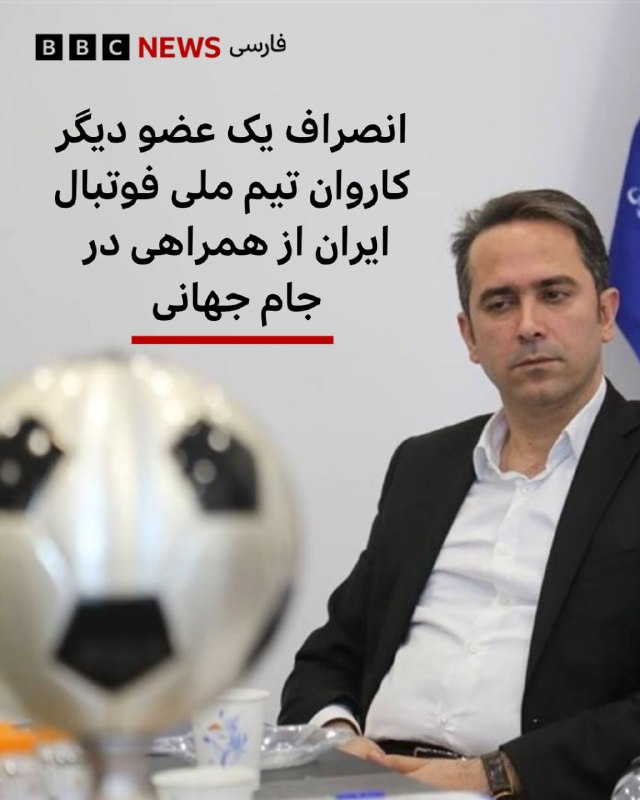

🔻علی خطیر، عضو هیئت رئیسه فدراسیون فوتبال ایران، از همراهی با کاروان تیم ملی فوتبال مردان این کشور به جام جهانی انصراف داده است. او سومین عضو از گروه بزرگ همراهان تیم ملی ایران است که به زودی عازم کمپ خود در مکزیک و آماده سه مسابقه مقدماتی در کرانه غربی آمریکا خواهد شد.

خبرگزاری دولت ایران روز سه‌شنبه نوشت آقای خطیر با ارسال نامه‌ای به مهدی تاج، رئیس فدراسیون فوتبال اعلام کرده «به دلیل مشغله کاری و همچنین عدم نیاز به حضورش در این تورنمنت، در سفر همراه کاروان فدراسیون شرکت نخواهد کرد.»

ایرنا نوشته پیش از این هم حیدر بهاروند و محمدرحمان سالاری دیگر اعضای هیات رئیسه» از همراهی کاروان ایران انصراف داده بودند.

انصراف آقای خطیر و دیگر اعضای همراه تیم ایران در حالی است که هنوز گزارشی از نتیجه درخواست روادیدهای اعضای کرد.

روز سه‌شنبه همچنین گزارش شد علیرضا جهانبخش، کاپیتان تیم ملی و همچنین، دنیس درگاهی، مهاجم جدید ایرانی‌تبار تیم ایران به اردوی ترکیه پیوسته‌اند تا جمع بازیکنان این اردو تکمیل شود.

📷SNN
@bbcpersian

## Dirty_Kids — post 390279

بگو نتا رو قطع کنن جنبه نداریم تو ۲ساعت ۵بار جق زدم

@Dirty_Kids 👻

---
📅 بروزرسانی: 1405/03/06 02:22
---

## VahidOOnLine — post 242362

  

♦️گیدئون سعار، وزیر امور خارجه اسرائیل، با انتشار پیامی در شبکه اجتماعی اکس، به اظهارات منتسب به مجتبی خامنه‌ای، رهبر جدید جمهوری اسلامی، واکنش نشان داد. سعار با بازنشر موضع‌گیری مجتبی خامنه‌ای که موجودیت اسرائیل را تهدید کرده بود، نوشت: «آشنا به نظر می‌رسد. یادم هست فردی با نام‌خانوادگی مشابه قبلا چنین حرف‌هایی می‌زد. راستی، کجایی؟»
پیش از این، در پیام منتسب به مجتبی خامنه‌ای به مناسبت حج، ادعا شده بود که اسرائیل تا ۱۵ سال دیگر وجود نخواهد داشت. این پیام با ارجاع به ادعای ۱۰ سال قبل علی خامنه‌ای، رهبر کشته‌‌شده جمهوری اسلامی، مبنی بر اینکه اسرائیل ۲۵ سال آینده را نخواهد دید، صادر شده است؛ این در حالی است که از زمان انتصاب مجتبی خامنه‌ای به رهبری، هنوز هیچ صدا یا تصویری از او منتشر نشده است.
این تقابل لفظی در شرایطی صورت می‌گیرد که در پی دو جنگ در یک سال گذشته، مقام‌های عالی‌رتبه سیاسی و نظامی حکومت ایران از جمله علی خامنه‌ای کشته شده‌اند و بخش بزرگی از برنامه هسته‌ای، تاسیسات نظامی و زیرساخت‌های اقتصادی جمهوری اسلامی به شدت تضعیف یا نابود شده است.
‌🇸🇦 Indypersian

🤖 @VahidOOnLine

## WithYashar — post 12620

## IranianMinds — post 20849

🔴 صداوسیما :

بازکردن اینترنت تو این شرایط خیلی کار خطرناک و غیرقانونی بوده و سریع باید راجبش یه کاری انجام بدیم !

@IranianMinds

## BBCPersian — post 282133

🔻تصاویر تازه‌ منتشر شده از «تلما» یوز معروف «تلخاب» که آبان گذشته در محدوده جاجرم و پناهگاه حیات‌وحش میاندشت ثبت شده، بار دیگر توجه‌ها را به یوز آسیایی که ایران آخرین زیستگاه طبیعی آن محسوب می‌شود، جلب کرده است.

فعالان محیط‌زیست می‌گویند هر ثبت تازه، نه فقط یک خبر امیدوارکننده، بلکه داده‌ای حیاتی برای ارزیابی آینده یکی از نادرترین گوشت‌خواران جهان است.

تلما سال ۱۳۹۸ به دنیا آمد و سال ۱۴۰۱، ثبت چهار توله همراه او یکی از مهم‌ترین نشانه‌های موفقیت زادآوری طبیعی یوز آسیایی در سال‌های اخیر تلقی شد.

تصاویر جدید او که در ۱۹ آبان ۱۴۰۴ ثبت شده اما روز سه‌شنبه ۴ خرداد منتشر شده، نشان می‌دهد او بار دیگر موفق به بزرگ کردن دست‌کم یک توله یک ساله شده است؛ موضوعی که از نگاه کارشناسان محیط‌زیست، برای جمعیتی که شمار آن به ده‌ها قلاده محدود شده، اهمیتی حیاتی دارد.

پناهگاه حیات‌وحش میاندشت در خراسان شمالی، در کنار ذخیره‌گاه زیست‌کره توران در سمنان، از معدود زیستگاه‌هایی است که هنوز نشانه‌هایی از زادآوری طبیعی یوز آسیایی در آن ثبت می‌شود.

📷SNN
@bbcpersian

## alonews — post 122958

👈حملات اسرائیل به سُهمور در دره بقاع در لبنان.

✅ @AloNews خبر جنگ

---
📅 بروزرسانی: 1405/03/06 02:12
---

## FoxNewsTwitter — post 342285

Fox News (Twitter/X)

The White House lawn is starting to look different as construction continues on the UFC Freedom 250 arena at the White House.

Crews are now building out the event site as President Trump moves forward with plans to host the UFC spectacle on White House grounds.

The event is expected to blend politics, patriotism, and one of the biggest brands in combat sports in a way Washington has never seen before.

## FarsiVOA — post 218750

🔺لیندزی گراهام: پاکستان به درخواست رئیس جمهوری آمریکا برای پیوستن به پیمان ابراهیم باید پاسخی بدهد

▪️لیندزی گراهام، سناتور جمهوری‌خواه آمریکایی روز سه‌شنبه ۵ خرداد در شبکه اجتماعی ایکس بار دیگر از میانجی‌گری پاکستان در خصوص عملیات مشترک آمریکا و اسرائيل علیه جمهوری اسلامی انتقاد کرد و اسلام‌آباد را تلویحا یک میانجی‌ بی‌طرف ندانست.

⬇️ بیشتر بخوانید:
https://ir.voanews.com/a/8154197.html
@FarsiVOA

## Persian_Trend_Official — post 15091

📣 لطفا تا جایی که میتونین اپ های گوشی و کامپیوتر یا لپ‌تاپ، اپ های خود سیستم و سیستم عامل رو آپدیت کنید.

❗️ اپ های قدیمی ریسک امنیتی بیشتری دارن.

📝 Nick

📌 @persian_trend_official
پرشین ترند | متفاوت‌ترین کانال نظامی

## IranianMinds — post 20848

  <a href="https://t.me/IranianMinds/20848" target="_blank">📎 Download file</a>

سرور فوق العاده پرسرعت و قوی مخصوص اینستا و یوتیوب سرعت فضایی مخصوص همراه اول مخابرات

آموزش اتصال در اندروید

آموزش اتصال در آیفون

حتما شیر بدید بقیه هم متصل شن لطفا دانلود سنگین هم نزنید ❤️‍🔥

@IranianMinds

## BBCPersian — post 282132

🔻یک شب پس از آن که فرماندهی مرکزی نیروی دریایی آمریکا - سنتکام - از حمله به چند سایت پرتاب موشک و قایق تندرو ایران در نزدیکی سواحل بندرعباس و تنگه هرمز خبر داد و آن را «حمله تدافعی» خواند، وزارت خارجه ایران با صدور بیانیه‌ای این اقدام را «نقض فاحش آتش‌بس»…

## alonews — post 122957

  <a href="telegram/content/alonews_122957_1779835331.webm" target="_blank">🎬 Download video</a>

👈کی‌سی‌ان‌ای، رسانه دولتی کره شمالی: کره شمالی آزمایشی از سیستم پرتاب موشک چندمنظوره جدید انجام داده است

✅ @AloNews خبر جنگ

---
📅 بروزرسانی: 1405/03/06 02:02
---

## WithYashar — post 12619

## WithYashar — post 12618

## mamlekate — post 103588

  

الو پنج‌شنبه عصر ۳۱ اردیبهشت حوالی ساعت ۵ ، توی آرامستان آقا سید مرتضی لاهیجان، خانمی ۴۶ ساله برای سر زدن به مزار پدر و مادرش، همراه با پسر ۷ ساله برادرش رفته بود قبرستان که یه حرومزاده میاد گیر حجاب میده میگه چرا حجابت رو رعایت نمیکنی؟ و خانم گفته پوشش من به تو چه ربطی داره آخه. اون اسلحه گرفته سمتش باز خانم نترسیده و داد و بیداد کرده. اومده شلیک کنه تفنگش گیر کرده و از اونجا میره. چند نفر هم دنبالش میفتن ولی قاتل بعد از چند دقیقه برمیگرده و این‌بار به سمتش میاد و ۵ تا تیر به این خانم میزنه و فرار میکنه. فضای قبرستان کاملاً بهم می‌ریزه و مردم سعی می‌کنن کمکش کنن تا آمبولانس برسه. میگن وقتی به بیمارستان منتقل میشه، حالش خیلی وخیم بوده و قبل از رسیدن به اتاق عمل وارد احیا میشه اما متأسفانه تلاش پزشک‌ها نتیجه نمی‌ده.

مژگان حسن‌پور به خونه ی تمام جاویدنام های لاهیجان سر زده بود و در اعتراضات هم دستگیر شده بود.

@mamlekate

---
📅 بروزرسانی: 1405/03/06 01:52
---

## VahidOOnLine — post 242361

  

♦️به گزارش خبرگزاری آنادولو، وانگ یی، وزیر خارجه چین، اعلام کرد پکن بر این باور است که توافق احتمالی برای پایان جنگ میان آمریکا، اسرائیل و ایران پس از نهایی شدن، برای تایید به شورای امنیت سازمان ملل ارائه خواهد شد.

بر اساس این گزارش وزیر خارجه چین گفت این توافق برای برخورداری از «مشروعیت و اعتبار» باید به تایید شورای امنیت برسد. او همچنین از طرف‌های درگیر خواست به روند آتش‌بس پایبند بمانند و برای بازگشت صلح به خاورمیانه تلاش کنند.

وانگ یی که کشورش در خرداد ماه ریاست دوره‌ای شورای امنیت را برعهده دارد، تاکید کرد شورای امنیت باید مسئولیت خود را در حفظ صلح و امنیت بین‌المللی ایفا کند. او همچنین نسبت به اقدام‌های نظامی یک‌جانبه و تحریم‌های خارج از چارچوب سازمان ملل هشدار داد.
‌🇸🇦 Indypersian

🤖 @VahidOOnLine

## WithYashar — post 12617

## mwarmonitor — post 9783

🔴حملات هوایی شدید اسرائیل به منطقه سحمر در بقاع غربی، در شرق لبنان.

@mwarmonitor

## FoxNewsTwitter — post 342284

  <a href="telegram/content/FoxNewsTwitter_342284_1779834142.mp4" target="_blank">🎬 Download video</a>

Fox News (Twitter/X)

FOX NEWS REPORT: The ceasefire between the U.S. and Iran is still holding as negotiations between both sides continue behind closed doors. President Trump is expected to hold a Cabinet meeting at the White House tomorrow, @BillMelugin_ reports.

## pm_afshaa — post 91603

vless://803352ee-f226-4b82-9f4f-8d3cb0e6ef3c@185.143.234.235:2053?type=ws&encryption=none&path=%3Fed%3D2048&host=dl.lexwill.site&security=tls&fp=chrome&alpn=h2%2Chttp%2F1.1&sni=dl.lexwill.site#Lex-lwnjgvr2

مخصوص تلگرام باهاش دانلود انجام ندین

💧 Rainbet.com the #1 Non-KYC Crypto Casino & Sportsbook @rainbetcom

😁 @Pm_Afshaa

## pm_afshaa — post 91602

vless://256cac6f-aff1-418a-8798-fa6ac31db1a8@185.143.233.235:2053?type=ws&encryption=none&path=%3Fed%3D2048&host=dl.lexwill.site&security=tls&fp=chrome&alpn=h2%2Chttp%2F1.1&sni=dl.lexwill.site#Lex-ot7lvn3m

مخصوص تلگرام باهاش دانلود انجام ندین

💧 Rainbet.com the #1 Non-KYC Crypto Casino & Sportsbook @rainbetcom

😁 @Pm_Afshaa

## pm_afshaa — post 91601

vless://30197e41-6d83-463d-8502-e7437b8d04af@anten.ir:2053?path=%3Fed%3D2048&security=tls&alpn=h2%2Chttp%2F1.1&encryption=none&insecure=0&host=dl.lexwill.site&fp=chrome&type=ws&allowInsecure=0&sni=dl.lexwill.site#Lex-yd4etwob

مخصوص تلگرام باهاش دانلود انجام ندین

💧 Rainbet.com the #1 Non-KYC Crypto Casino & Sportsbook @rainbetcom

😁 @Pm_Afshaa

## mamlekate — post 103587

  

نت وای فای وصل شده

## IranIntlTV — post 339171

  <a href="https://t.me/IranintlTV/339171" target="_blank">📎 Download file</a>

🎧نسخه صوتی «برنامه با کامبیز حسینی»؛ بازگشت اینترنت ایران بعد از ۸۸ روز
@iranintlTV

## IranIntlTV — post 339170

  <a href="telegram/content/IranIntlTV_339170_1779834146.mp4" target="_blank">🎬 Download video</a>

گزارش‌های اختصاصی رسیده به ایران‌اینترنشنال نشان می‌دهد محمدباقر قالیباف، رییس هیئت مذاکره‌کننده جمهوری اسلامی، در هفته‌های اخیر به دنبال کنار گذاشتن سعید جلیلی از روند تصمیم‌گیری‌های مرتبط با مذاکرات بوده است.

گفت‌وگو با کامیار بهرنگ، عضو تحریریه ایران‌اینترنشنال
@iranintltv

## FarsiVOA — post 218749

  <a href="telegram/content/FarsiVOA_218749_1779834148.mp4" target="_blank">🎬 Download video</a>

⚡️اتصال محدود به اینترنت بعد ۸۸ روز خاموشی دیجیتال در ایران؛ واکنش کاربران شبکه‌های اجتماعی
@FarsiVOA

## FarsiVOA — post 218748

  <a href="telegram/content/FarsiVOA_218748_1779834150.mp4" target="_blank">🎬 Download video</a>

⚡️جزئیات «حملات دفاعی» آمریکا بە مواضع جمهوری اسلامی در جنوب ایران
@FarsiVOA

## IranianMinds — post 20847

  <a href="https://t.me/IranianMinds/20847" target="_blank">📎 Download file</a>

سرور فوق العاده پرسرعت و قوی مخصوص اینستا و یوتیوب سرعت فضایی مخصوص همراه اول مخابرات

آموزش اتصال در اندروید

آموزش اتصال در آیفون

حتما شیر بدید بقیه هم متصل شن لطفا دانلود سنگین هم نزنید ❤️‍🔥

@IranianMinds

---
📅 بروزرسانی: 1405/03/06 01:42
---

## VahidOOnLine — post 242360

  

شورای امنیت سازمان ملل روز سه‌شنبه در بیانیه‌ای حمله به نیروگاه هسته‌ای براکه در امارات متحده عربی را محکوم کرد و این حمله را نقض قوانین بین‌المللی دانست. این شورا مسئولیت این حمله را به هیچ طرفی نسبت نداد.
امارات متحده عربی هفته گذشته اعلام کرد شش پهپاد از عراق به سوی این کشور پرتاب شده‌اند که یکی از آنها باعث آتش‌سوزی در نیروگاه هسته‌ای این کشور شده است.
عراق میزبان گروه‌های شبه‌نظامی قدرتمند مورد حمایت جمهوری اسلامی است که در جریان جنگ اخیر علیه جمهوری اسلامی، مسئولیت حمله به «پایگاه‌های دشمن» در عراق و منطقه را بر عهده گرفته‌اند.

‌🏁 🇬🇧 IranintlTV

🤖 @VahidOOnLine

## WithYashar — post 12616

## WithYashar — post 12615

## pm_afshaa — post 91600

  <a href="telegram/content/pm_afshaa_91600_1779833532.webm" target="_blank">🎬 Download video</a>

1500 تا کانفینگ رایگان اختصاصی برا هر نفر جدا گذاشته برین سریع کانفینگتونو رایگان بگیرین
👇
👇 @Lex_Server @Lex_Server

## DEJradio — post 5010

⭕️ ترامپ: جمهوری اسلامی اگر پرچم سفید هم بالا ببرد، برخی رسانه‌ها می‌گویند پیروز شد

دونالد ترامپ، رئیس‌ جمهوری آمریکا، از شیوهٔ پوشش عملیات «خشم حماسی» علیه جمهوری اسلامی در برخی رسانه‌های آمریکایی انتقاد کرد.
ترامپ در شبکهٔ اجتماعی تروث نوشت حتی اگر جمهوری اسلامی کاملا تسلیم شود، رسانه‌هایی از جمله نیویورک‌تایمز، وال‌استریت ژورنال و سی‌ان‌ان، باز هم آن را «پیروزی استادانه» رژیم قلمداد می‌کنند.
ترامپ تصریح کرد اگر نیروهای رژیم سلاح را زمین بگذارند، یکایک آنها پرچم سفید تکان بدهند و برگه‌های تسلیم را امضا کنند، باز هم «رسانه‌های جعلی» واقعیت را وارونه نشان می‌دهند.
ترامپ همچنین دموکرات‌های آمریکایی را متهم کرد که مانند برخی از رسانه‌های برشمرده، دیوانه شده‌اند.

#خبر #دژ #ترامپ #مذاکرات
@DEJradio

## IranIntlTV — post 339169

  <a href="telegram/content/IranIntlTV_339169_1779833533.mp4" target="_blank">🎬 Download video</a>

مراد ویسی، تحلیلگر ارشد ایران‌اینترنشنال گفت: «بخش دیگری از صدای این روزهای مردم ایران، نارضایتی از رویکرد ترامپ در مقابل جمهوری اسلامی است. مردمی که انتظار داشتند او به وعده کمک در راه است عمل کند.»
@iranintltv

## IranIntlTV — post 339168

  

شورای امنیت سازمان ملل روز سه‌شنبه در بیانیه‌ای حمله به نیروگاه هسته‌ای براکه در امارات متحده عربی را محکوم کرد و این حمله را نقض قوانین بین‌المللی دانست. این شورا مسئولیت این حمله را به هیچ طرفی نسبت نداد.
امارات متحده عربی هفته گذشته اعلام کرد شش پهپاد از عراق به سوی این کشور پرتاب شده‌اند که یکی از آنها باعث آتش‌سوزی در نیروگاه هسته‌ای این کشور شده است.
عراق میزبان گروه‌های شبه‌نظامی قدرتمند مورد حمایت جمهوری اسلامی است که در جریان جنگ اخیر علیه جمهوری اسلامی، مسئولیت حمله به «پایگاه‌های دشمن» در عراق و منطقه را بر عهده گرفته‌اند.

https://iranintl.com/202605262953

## Dirty_Kids — post 390278

  

خب مثل اینکه وصل کردن نت برای این بوده که ساخت بدل مجتبی تکمیل شده

ولی نتونستن کارو خوب در بیارن چون دقیقا شبیهش نیست😂😂😂😂

@Dirty_Kids 👻

## Dirty_Kids — post 390277

  <a href="telegram/content/Dirty_Kids_390277_1779833535.mp4" target="_blank">🎬 Download video</a>

از کسایی که تو تجمعات شبانه شرکت کردن دارن میپرسن نظرتون با قطع دائم اینستاگرام چیه؟

و اما جواب پرستوهای ولایی:

@Dirty_Kids 👻

## alonews — post 122956

  <a href="telegram/content/alonews_122956_1779833536.webm" target="_blank">🎬 Download video</a>

👈رسایی: بازکردن اینترنت اشتباست و خیانت به رهبر شهیدمونه. 
✅ @AloNews خبر جنگ

## alonews — post 122955

  <a href="telegram/content/alonews_122955_1779833536.webm" target="_blank">🎬 Download video</a>

👈رسایی: بازکردن اینترنت اشتباست و خیانت به رهبر شهیدمونه.

✅ @AloNews خبر جنگ

## alonews — post 122954

  <a href="telegram/content/alonews_122954_1779833536.webm" target="_blank">🎬 Download video</a>

👈چین: توافق پایان جنگ ایران و آمریکا باید به شورای امنیت ارائه شود

🔴وانگ یی، وزیر خارجه چین گفت که پکن معتقد است توافق پایان جنگ آمریکا و اسرائیل علیه ایران باید به شورای امنیت سازمان ملل ارائه شود. وانگ گفت پکن امیدوار است طرف‌های مربوطه بتوانند به دنبال کردن آتش‌بس متعهد بمانند.

✅ @AloNews خبر جنگ

---
📅 بروزرسانی: 1405/03/06 01:32
---

## VahidOOnLine — post 242359

  

لیندسی گراهام، سناتور جمهوری‌خواه، با اشاره به اینکه هواپیماهای نظامی جمهوری اسلامی در پایگاه‌های هوایی پاکستان نگهداری می‌شوند، در ایکس نوشت نقش پاکستان به عنوان میانجی «بسیار مسئله‌ساز» است و خصومت این کشور با اسرائیل سابقه‌ای طولانی دارد.
لیندسی گراهام در ادامه از پاکستان خواست به درخواست دونالد ترامپ برای پیوستن به توافق‌های ابراهیم پاسخ مثبت دهد.

‌🏁 🇬🇧 IranintlTV

🤖 @VahidOOnLine

## WithYashar — post 12614

## WithYashar — post 12613

کارشناس صداسیما : وصل شدن اینترنت متوقف میشه و دستور رییس جمهور اجرا نمیشه چون خلاف دیوان عالیه.
@withyashar

## pm_afshaa — post 91599

حتما از اسپانسرامون که دارن براتون رایگان کانفینگ میسازن در اختیارتون حمایت کنینو دنبالشون کنین @Glitch_Config @Lex_Server

## pm_afshaa — post 91598

🔴کارشناس صداسیما :وصل شدن اینترنت متوقف میشه و دستور رییس جمهور اجرا نمیشه چون خلاف دیوان عالیه

💧 Rainbet.com the #1 Non-KYC Crypto Casino & Sportsbook @rainbetcom

😁 @Pm_Afshaa

## pm_afshaa — post 91597

  <a href="https://t.me/pm_afshaa/91597" target="_blank">📎 Download file</a>

نپسترنت پر سرعت نا محدود مخصوص اینستا و یوتیوب

💧 Rainbet.com the #1 Non-KYC Crypto Casino & Sportsbook @rainbetcom

😁 @Pm_Afshaa

## DEJradio — post 5009

⭕️ اسرائیل بیش از ۱۱ کیلومتر از تونل‌های حماس را در بیت‌حانون نابود کرد

ارتش اسرائیل با انتشار تصاویری اعلام کرد بیش از یازده کیلومتر از تونل‌های حماس را شناسایی و منهدم کرده‌ است.
حماس توسط اتحادیهٔ اروپا و ایالات متحده در سیاههٔ سازمان‌های تروریستی قرار گرفته است.
اسرائیل تصاویری را از شبکهٔ مسیرهای زیرزمینی حماس در بیت‌حانون در شمال نوار غزه منتشر کرده است.
بر اساس بیانیه ارتش، صدها زیرساخت حماس که در سطح زمین قرار داشت نیز نابود شده است.
به گفتهٔ ارتش اسرائیل، بیت‌حانون یکی از محورهای اصلی نبرد در عملیات زمینی بود.
بنا بر این گزارش، در جریان جنگ سه کیلومتر دیگر از تونل‌ها نیز تخریب و شماری از نیروهای حماس هم کشته شدند.

#خبر #دژ #اسرائیل #حماس
@DEJradio

## IranIntlTV — post 339167

  <a href="https://t.me/IranintlTV/339167" target="_blank">📎 Download file</a>

🎧نسخه صوتی سیاست با مراد ویسی: بازگشت صدای ملت
@iranintlTV

## IranIntlTV — post 339166

  <a href="telegram/content/IranIntlTV_339166_1779832974.mp4" target="_blank">🎬 Download video</a>

مراد ویسی، تحلیلگر ارشد ایران‌اینترنشنال، گفت: «مجتبی خامنه‌ای با تکرار رجزخوانی پدرش درباره نابودی اسرائیل، گفت اسرائیل ۱۵ سال دیگر نابود خواهد شد. رجزی که با واکنش و طعنه مقام‌های اسرائیلی روبه‌رو شده است.»
@iranintltv

## IranIntlTV — post 339165

  

لیندسی گراهام، سناتور جمهوری‌خواه، با اشاره به اینکه هواپیماهای نظامی جمهوری اسلامی در پایگاه‌های هوایی پاکستان نگهداری می‌شوند، در ایکس نوشت نقش پاکستان به عنوان میانجی «بسیار مسئله‌ساز» است و خصومت این کشور با اسرائیل سابقه‌ای طولانی دارد.
لیندسی گراهام در ادامه از پاکستان خواست به درخواست دونالد ترامپ برای پیوستن به توافق‌های ابراهیم پاسخ مثبت دهد.

https://iranintl.com/202605260832

## FarsiVOA — post 218747

⚡️جمهوری اسلامی در مرکز توجه کنگره آمریکا؛ همزمان با رقابت‌های درون‌حزبی ایالت‌ها
@FarsiVOA

## Persian_Trend_Official — post 15090

💢ترامپ اعلام کرد: جلسه کابینه به دلیل شرایط آب و هوایی فردا در کاخ سفید برگزار خواهد شد، نه در کمپ دیوید/انتخاب

🫆:Tony

📌 @persian_trend_official
پرشین ترند | متفاوت‌ترین کانال نظامی

## alonews — post 122953

  <a href="telegram/content/alonews_122953_1779832976.webm" target="_blank">🎬 Download video</a>

گفته شده برای حضور تیم ملی ایران تو خاک آمریکا ویزای ساعتی صادر میشه یعنی اعتبارش تا پایان یک بازیه بعد بازی دوباره باید ویزا بگیرن
😐
🤣

@AloSport

---
📅 بروزرسانی: 1405/03/06 01:22
---

## VahidOOnLine — post 242358

  

♦️علیرضا فیروزجا، استاد بزرگ ایرانی‌تبار شطرنج فرانسه، در دور نخست رقابت‌های معتبر «شطرنج نروژ» در اسلو دست به کار بزرگی زد و برای نخستین‌بار در دوران حرفه‌ای خود، مگنوس کارلسن، مدافع عنوان قهرمانی و مرد شماره یک شطرنج جهان را در بخش کلاسیک شکست داد. این پیروزی تاریخی در حالی رقم خورد که فیروزجا به دلیل آسیب‌دیدگی شدید مچ پا درمسابقات بخارست، مجبور بود با پای آتل‌بندی‌شده و کشیده روی صندلی بازی کند.
کارلسن که با مهره سیاه بازی می‌کرد، در حرکت سی‌وسوم مرتکب اشتباهی فاحش شد و تنها پنج حرکت بعد ناچار به تسلیم شد. تورنمنت امسال با حضور شش شطرنج‌باز برتر جهان برگزار می‌شود. فیروزجا با این پیروزی ارزشمند کلاسیک، سه امتیازی شد و در صدر جدول ایستاد.
‌🇸🇦 Indypersian

🤖 @VahidOOnLine

## VahidOOnLine — post 242357

  

ترامپ در تروث‌سوشال نوشت با توجه به احتمال نامساعد شدن شرایط جوی در روز آینده، جلسه چهارشنبه کابینه را در کاخ سفید برگزار خواهد کرد و سفر کابینه به کمپ دیوید را به تعویق خواهد انداخت.
پیش‌تر گزارش شده بود که ترامپ صبح چهارشنبه در کمپ دیوید نشست کابینه را برگزار می‌کند. نیویورک‌پست نوشت در این نشست همه اعضای کابینه حضور خواهند داشت و جنگ ایران محور اصلی گفت‌وگوهاست. کاخ سفید اعلام کرد تولسی گبرد نیز در این نشست شرکت می‌کند.

‌🏁 🇬🇧 IranintlTV

🤖 @VahidOOnLine

## mwarmonitor — post 9782

  <a href="telegram/content/mwarmonitor_9782_1779832341.mp4" target="_blank">🎬 Download video</a>

📝 در تالار سایه‌ها، روایتِ بلبلِ درباری و عُظمایِ خون‌خوار سرشار از وحشت است؛ آنجا که علیرضا افتخاری روایت می‌کند که آقا به او فرموده چرا غمناک می‌خوانی، شاد بخوان و چرا برای مردم کنسرت نمی‌گذاری. این همنشینیِ هولناک با مقتدایِ تاریکی‌ها که دستش به احکامِ سرخ آغشته است، راه را برای کابوس‌های بعدی باز می‌کند؛ بعید نیست در قسمت‌های آینده، امیر تتلو را از بند بیرون بکشند تا از خاطرات عارفانه و شب‌زنده‌داری‌هایش با عظما بگوید، و پویان مختاری نیز که حالا به درجه اجتهاد رسیده، در صف مصاحبه ایستاده تا مدحِ این نظامِ خون‌خوار را بگوید؛ سیرکِ دارک و تلخی که در آن دژخیم، از مطربانِ خود بهارِ طربِ اجباری می‌طلبد.

@mwarmonitor

## DEJradio — post 5008

👑 
⭕️ صدور دوباره احکام اعدام برای چهار تن از بچه‌های اکباتان، میلاد آرمون، محمدمهدی حسینی، مهدی ایمانی و نوید نجاران، سند دیگری از ماهیت جنایتکار رژیم جمهوری اسلامی است که برای حفظ قدرت، جوانان ایران را به قتل می‌رساند و از خون مردم برای بقای خود تغذیه می‌کند.…

## IranIntlTV — post 339164

  

ترامپ در تروث‌سوشال نوشت با توجه به احتمال نامساعد شدن شرایط جوی در روز آینده، جلسه چهارشنبه کابینه را در کاخ سفید برگزار خواهد کرد و سفر کابینه به کمپ دیوید را به تعویق خواهد انداخت.
پیش‌تر گزارش شده بود که ترامپ صبح چهارشنبه در کمپ دیوید نشست کابینه را برگزار می‌کند. نیویورک‌پست نوشت در این نشست همه اعضای کابینه حضور خواهند داشت و جنگ ایران محور اصلی گفت‌وگوهاست. کاخ سفید اعلام کرد تولسی گبرد نیز در این نشست شرکت می‌کند.

https://iranintl.com/202605260928

## FarsiVOA — post 218746

🔺منابع خبری: ترامپ و نتانیاهو سه‌شنبه تلفنی گفت‌وگو کردند

▪️منابع خبری در اسرائیل اعلام کردند دونالد ترامپ رئیس جمهوری آمریکا، و بنیامین نتانیاهو نخست وزیر اسرائیل، سه‌شنبه ۵ خرداد تلفنی با هم گفت‌وگو کردند.

⬇️ بیشتر بخوانید:
https://ir.voanews.com/a/8154194.html
@FarsiVOA

## FarsiVOA — post 218745

⚡️لفاظی‌های جمهوری اسلامی برای آمریکا
@FarsiVOA

## IranianMinds — post 20846

  <a href="https://t.me/IranianMinds/20846" target="_blank">📎 Download file</a>

سرور فوق العاده پرسرعت و قوی مخصوص اینستا و یوتیوب سرعت فضایی مخصوص همراه اول مخابرات

آموزش اتصال در اندروید

آموزش اتصال در آیفون

حتما شیر بدید بقیه هم متصل شن لطفا دانلود سنگین هم نزنید ❤️‍🔥

@IranianMinds

## alonews — post 122952

  <a href="telegram/content/alonews_122952_1779832344.webm" target="_blank">🎬 Download video</a>

💔 و کسایی که دیگه هیچوقت آنلاین نشدن

✅@AloNews

## alonews — post 122951

  <a href="telegram/content/alonews_122951_1779832345.webm" target="_blank">🎬 Download video</a>

👈کارشناس صداسیما :
وصل شدن اینترنت متوقف میشه و دستور رییس جمهور اجرا نمیشه چون خلاف دیوان عالیه.

✅ @AloNews خبر جنگ

## alonews — post 122950

  <a href="telegram/content/alonews_122950_1779832345.mp4" target="_blank">🎬 Download video</a>

👈ساخت و ساز برای رویداد UFC Freedom 250 که در ۱۴ ژوئن برگزار می‌شود، در چمنزار جنوبی کاخ سفید آغاز شده است.

✅ @AloNews خبر جنگ

## alonews — post 122949

  <a href="telegram/content/alonews_122949_1779832347.webm" target="_blank">🎬 Download video</a>

👈رئیس سازمان بهزیستی:
بیش از یک میلیون کودک بازمانده از تحصیل در کشور داریم

✅ @AloNews خبر جنگ

---
📅 بروزرسانی: 1405/03/06 01:12
---

## pm_afshaa — post 91596

  <a href="https://t.me/pm_afshaa/91596" target="_blank">📎 Download file</a>

سرعت موشکی متصل نامحدود برا تمام اوپراتورها

💧 Rainbet.com the #1 Non-KYC Crypto Casino & Sportsbook @rainbetcom

😁 @Pm_Afshaa

## pm_afshaa — post 91595

vless://4106328d-9bc4-4e07-be57-e43db1b5a245@185.143.234.235:2053?type=ws&encryption=none&path=%3Fed%3D2048&host=dl.lexwill.site&security=tls&fp=chrome&alpn=h2%2Chttp%2F1.1&sni=dl.lexwill.site#Lex-480q68sz

بزنید❤️

## DEJradio — post 5007

⭕️ترامپ نشست ویژهٔ کابینه را از کمپ دیوید به کاخ سفید منتقل کرد

دونالد ترامپ، رئیس‌ جمهوری ایالات متحده اعلام کرد به دلیل احتمال وضعیت نامساعد آب‌وهوا، نشست روز چهارشنبهٔ کابینه را از کمپ دیوید، به کاخ سفید منتقل می‌کند.
ترامپ در شبکهٔ اجتماعی تروث خبر داد که سفر اعضای کابینه به کمپ دیوید به تعویق می‌افتد.
ترامپ قصد داشت نشستی کم‌سابقه را با حضور همهٔ اعضای کابینه و محوریت جمهوری اسلامی، در استراحت‌گاه کمپ‌دیوید برگزار کند.
بر پایهٔ گزارش‌ها تولسی گبرد، مدیر اطلاعات ملی آمریکا نیز به نشست ویژهٔ کابینه در روز چهارشنبه فراخوانده شده است.

#خبر #دژ #کمپ_دیوید #ترامپ
@DEJradio

## IranIntlTV — post 339163

  <a href="telegram/content/IranIntlTV_339163_1779831746.mp4" target="_blank">🎬 Download video</a>

مراد ویسی، تحلیلگر ارشد ایران‌اینترنشنال گفت: «اتصال دوباره دسترسی مردم به اینترنت بعد از سه ماه هر چند با فلیترینگ و با محدودیت اما بار دیگر به ملت امکان داد تا صدای مخالفت خود با جمهوری اسلامی و پایبندی به خیزش دی‌ماه و هدف سرنگونی را تکرار کنند.»
@iranintltv

## Persian_Trend_Official — post 15089

https://youtube.com/live/TrPiEz5YpyQ?feature=share

## Persian_Trend_Official — post 15088

  <a href="https://t.me/persian_trend_official/15088" target="_blank">📎 Download file</a>

فایل صوتی لایو اول
نسخه کم حجم - 10.33 مگابایت

اتاق جنگ سه شنبه 5 خرداد | درگیری مرگبار در خلیج فارس اینترنت فعلا آزاد شد.

📝 Nick

📌 @persian_trend_official
پرشین ترند | متفاوت‌ترین کانال نظامی

## IranianMinds — post 20844

خر خودتانید!

وقتی هواپیمای نخبه‌های جوان را زدید، تا سه روز گفتید هیچ نمی‌دانید، گفتید خودش سقوط کرده.
بعد از اینکه ترامپ نصیحت‌تان کرد راستش را بگویید، اگر اشتباهی زده‌اید بگویید...
تا فهمیدید دنیا اسناد جنایت شما را دارد ناگهان یادتان آمد دو‌ موشک هم با بی‌رحمی به سمت هواپیما شلیک کرده بودید و البته قرار نبوده کسی بفهمد!
کسی به شما نگفته بوده که "خیلی خرید"
(حیف از ان حیوان نجیب) حالا بدانید!

فکر می‌کنید وقتی گفتید فلانی و فلانی در زندان خودکشی کردند، فلانی و فلانی به مرگ طبیعی مُردند، فکر می‌کنید وقتی جوان‌هایی پس از ازادی ناگهان سکته می‌کنند و شما می.گویید عمر دست خداست. ما چه می‌گوییم؟
خر خودتانید. ولی آنقدر احمقید که نمی‌فهمید چقدر خرید.

وقتی می‌گویید قیمت دلار آزاد در زندگی مردم هیچ تاثیر مهمی ندارد!
وقتی می‌گویید آمریکا از ما می‌ترسد.
وقتی می‌گویید ما در خارج از مرزها کاری نمی‌کنیم.
وقتی می‌گویید مهاجرت‌ها نگران کننده نیستند!
وقتی می‌گویید مردم ما را می‌خواهند،
چه نیازی به رفراندوم است.
وقتی می‌گویید ما بخاطر خدا حکومت می‌کنیم.
می‌دانید ما چه می‌گوییم، نه در گوشی؛
"خر خودتانید"
خیلی خرید
شما آنقدر احمقید
که ارزش گفتگو ندارید
آنقدر نجس شده‌اید که دست دادن با شما
هر کسی را نجس و ناپاک می‌کند
بروید و بمیرید با حقارت، با روسیاهی.

ببینید جز عده‌ای مواجب بگیر
عده‌ای روسیاه‌تر از خودتان
چیزی برایتان مانده!؟

@IranianMinds

## IranianMinds — post 20843

💯 اگر هنوز ۵۰۰ هزارتومان رو نگرفتی همین الان عضو شو‌ و جایزتو بگیر
نیازی هم به واریز نیست

👍 تنها سایت مورد #تایید ما با بونوس های واقعی

🌐 Winro.io

## IranianMinds — post 20842

  <a href="telegram/content/IranianMinds_20842_1779831748.webm" target="_blank">🎬 Download video</a>

💩 
⚠️ دیگه #فریب بونوس های الکی سایت های سودجو رو نخورید
❌

💲بیا توی سایت مورد تایید ما یعنی #وینرو و با عضویت 500 هزار تومان اعتبار بی قیدو شرط بگیر
👏

🤩با عضویت 
🤩 
🤩 
🤩 هزار تومان اعتبار رایگان بگیر!

⌛ پشتیبانی 24 ساعته

🌐 Winro.io

🌐 Winro.io
کانال بونوس های رایگان5a1

📱 @winro_io

## alonews — post 122948

  <a href="telegram/content/alonews_122948_1779831748.webm" target="_blank">🎬 Download video</a>

👈العربیه: اقدامات تقویت شده دفاع از آسمان در عربستان سعودی فعال است تا زیارت حج را در برابر تهدیدات ایرانی محافظت کند.

✅ @AloNews خبر جنگ

## alonews — post 122947

  <a href="telegram/content/alonews_122947_1779831748.webm" target="_blank">🎬 Download video</a>

🔴پیج فیک متعلق به انقلاب شیر و خورشید

🔴رفتار سایبری ها رو بهتر بشناسید.

🤔پایگاه مقداد مقیم خارج نتونست جلوی خودش را نگه داره

✅@AloNews

---
📅 بروزرسانی: 1405/03/06 01:02
---

## VahidOOnLine — post 242356

  

♦️مجلس سوئد با طرح دولت برای ممنوعیت ازدواج نزدیک فامیلی موافقت کرد؛ قانونی که با هدف مقابله با خشونت‌های ناموسی، فشار خانوادگی و ازدواج‌های اجباری تصویب شده است.
بر اساس مصوبه تازه، ازدواج میان «فرزندان عمو، دایی، عمه و خاله» از اول ژوئیه ۲۰۲۶ در سوئد ممنوع خواهد شد.
مجلس همچنین تصویب کرد افرادی که در نسبت‌های خانوادگی نزدیک دیگری قرار دارند نیز دیگر اجازه ازدواج نخواهند داشت.
طبق این مصوبه، حتی خواهرخوانده‌ها و برادرخوانده‌ها یا خواهر و برادرهایی که از طریق فرزندخواندگی با یکدیگر نسبت خانوادگی پیدا کرده‌اند نیز دیگر نمی‌توانند مجوز ویژه ازدواج دریافت کنند. در قوانین پیشین سوئد، در برخی موارد استثنایی امکان دریافت مجوز وجود داشت.
یکی دیگر از بخش‌های مهم قانون، مربوط به ازدواج‌هایی است که خارج از سوئد انجام می‌شوند. بر اساس قانون جدید، ازدواج فامیلی که در کشورهای دیگر ثبت شده باشد نیز در اغلب موارد در سوئد به رسمیت شناخته نخواهد شد؛ موضوعی که می‌تواند بر وضعیت حقوقی برخی مهاجران یا خانواده‌هایی که خارج از سوئد ازدواج کرده‌اند تاثیر بگذارد.
‌🇸🇦 Indypersian

🤖 @VahidOOnLine

## WithYashar — post 12612

اتاق جنگ با یاشار : شله داوود @withyashar

## mwarmonitor — post 9781

🔴در مذاکرات با ایالات متحده، ایران می‌خواهد کنترل بخشی از حدود ۱۰۰ میلیارد دلار دارایی‌های مسدودشده توسط غرب را دوباره به دست بگیرد و همچنین به بازارهای جهانی نفت دسترسی پیدا کند. وال‌استریت ژورنال

@mwarmonitor

## mwarmonitor — post 9780

  <a href="telegram/content/mwarmonitor_9780_1779831133.mp4" target="_blank">🎬 Download video</a>

✈️ساعت ۲۱:۲۳ به وقت گرینویچ پرواز DOOR 72 — یک فروند بمب‌افکن B-52H از پایگاه فیرفورد به پرواز درآمده و در حال ارتباط با بریز نورتن روی فرکانس 231.950 است. @mwarmonitor

## pm_afshaa — post 91594

  <a href="telegram/content/pm_afshaa_91594_1779831135.webm" target="_blank">🎬 Download video</a>

PMTV NEWS🦁☀️.npvt

## pm_afshaa — post 91593

  <a href="https://t.me/pm_afshaa/91593" target="_blank">📎 Download file</a>

نا محدود سرعت بالا بدون قطعی

بفرستین برا بقیه اونام وصل شن

💧 Rainbet.com the #1 Non-KYC Crypto Casino & Sportsbook @rainbetcom

😁 @Pm_Afshaa

## DEJradio — post 5006

⭕️ دو تظاهرات در پاریس برای پشتیبانی از شاهزاده و علیه سرکوب و اعدام در ایران

هزاران شهروند ایرانی، فرانسوی‌ و اسرائیلی‌ در پاریس، در پشتیبانی از شاهزاده رضا پهلوی و علیه اعدام و سرکوب معترضان در ایران، تظاهرات کردند.
در دو‌ تظاهرات جداگانهٔ این هفته در پاریس، شرکت‌کنندگان بارها پشتیبانی خود را از شاهزاده رضا پهلوی برای رهبری مبارزات سرنگونی جمهوری اسلامی اعلام کردند.
تظاهرکنندگان بارها با سردادن شعارهایی علیه جمهوری اسلامی اسلامی، سازش احتمالی غرب با رژیم را مورد انتقاد قرار دادند.
در این دو‌ تجمع، شرکت‌کنندگان خواستار توقف اعدام‌ها و اتصال دوبارهٔ اینترنت برای استفادهٔ همهٔ مردم ایران شدند.
برگزاری پرفورمنس در مورد کشته‌شدگان، اعلام همبستگی مردم ایران و اسرائیل و‌ اجرای موسیقی همبستگی و اعتراضی، از دیگر برنامه‌های شرکت‌کنندگان در این تظاهرات بود.

#خبر #دژ #همبستگی #پاریس
@DEJradio

## FarsiVOA — post 218744

  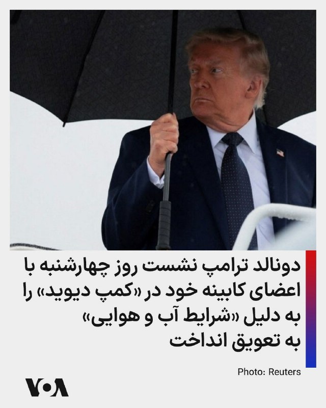

⚡️دونالد ترامپ، رئیس جمهوری آمریکا، روز سه‌شنبه ۵ خرداد در شبکه تروت‌سوشال گفت به دلیل شرایط احتمالی بد آب و هوایی در روز چهارشنبه، نشست کابینه در کاخ سفید برگزار می‌شود و سفر به «کمپ دیوید» به آینده موکول شده است.

پیشتر رسانه‌ها گزارش داده بودند که نشست ویژه رئیس جمهوری آمریکا و اعضای کابینه روز چهارشنبه در کمپ دیوید برگزار خواهد شد.

خبر این نشست ساعاتی پس از آن گزارش شد که نیروهای ایالات متحده روز دوشنبه چند قایق تندرو سپاه و سایت‌های موشکی جمهوری اسلامی را هدف قرار دادند. رسانه‌های حکومتی در ایران از کشته شدن چند تن از اعضای سپاه خبر دادند.
@FarsiVOA

---
📅 بروزرسانی: 1405/03/06 00:52
---

## WithYashar — post 12611

  

صداوسیما تصویر جدیدی از مجتبی خامنه‌ای را منتشر کرد
@withyashar
خوب پس بدل تکمیل شده نتو وصل کردن ولی اصلا شبیهش نیست ! 🤣

## mwarmonitor — post 9779

🔴سناتور لیندسی گراهام ؛ مدت‌هاست برای من روشن بوده که نقش پاکستان به‌عنوان میانجی، مسئله‌ساز است. خصومت آن‌ها نسبت به اسرائیل سابقه‌ای طولانی دارد.

🔸انکارناپذیر است که هواپیماهای نظامی ایران در پایگاه‌های هوایی پاکستان مستقر شده‌اند و اظهارات گذشته مقامات بلندپایه پاکستانی علیه اسرائیل نگران‌کننده است.

🔸در مورد اظهارات وزیر دفاع درباره توافقات ابراهیم، که گفته پاکستان هرگز به آن‌ها نخواهد پیوست چون به اسرائیل اعتماد ندارد: ممکن است این کلیپ مربوط به یک سال پیش باشد، اما من نگرانم که این طرز فکر همچنان تازه و زنده باشد.

🔸در این راستا، ضروری است که پاکستان همین حالا به درخواست رئیس‌جمهور ترامپ برای پیوستن به توافقات ابراهیم پاسخ دهد.

@mwarmonitor

## FoxNewsTwitter — post 342283

  

Fox News (Twitter/X)

JUST IN: President Trump says the White House is postponing tomorrow’s Cabinet trip to Camp David due to “possible bad weather conditions.”

The Cabinet meeting to discuss Iran will now be held at the White House instead. https://twitter.com/FoxNews/status/2059292922038702376#m

## DEJradio — post 5005

⭕️ هشدار السیسی به پزشکیان دربارهٔ حمله به کشورهای منطقه

عبدالفتاح السیسی، رئیس‌ جمهوری مصر، در تماس تلفنی با مسعود پزشکیان مخالفت قاطع قاهره را با هرگونه اقدام جمهوری علیه کشورهای حاشیهٔ خلیج فارس اعلام کرد.
السیسی همچنین بر ضرورت کاهش تنش‌ها، استفاده از دیپلماسی و پرهیز از محاسبات اشتباه تأکید کرده است.
بنا بر گزارش‌ها رئیس ‌جمهوری مصر خواسته تا فرصت کامل برای ادامهٔ مذاکره میان آمریکا و جمهوری اسلامی فراهم شود.
به گفتهٔ مقام‌های مصری، قاهره در تماس‌ها و رایزنی‌های منطقه‌ای برای تسهیل توافق میان تهران و واشینگتن به‌شدت فعال است.

#خبر #دژ #مصر
@DEJradio

## alonews — post 122946

  <a href="telegram/content/alonews_122946_1779830568.webm" target="_blank">🎬 Download video</a>

👈نورالدین الدغیر خبرنگار الجزیره در تهران: همه چیز انجام شده، چیزی باقی نمانده جز [امضای توافق]

✅ @AloNews خبر جنگ

---
📅 بروزرسانی: 1405/03/06 00:42
---

## VahidOOnLine — post 242355

  

♦️دونالد ترامپ، رئیس‌جمهوری ایالات متحده، با انتشار پیامی در شبکه اجتماعی «تروث سوشال»، از تغییر محل برگزاری نشست آینده کابینه خبر داد. ترامپ اعلام کرد که با توجه به پیش‌بینی احتمال شرایط آب‌وهوایی نامناسب برای فردا، سفر اعضای کابینه به استراحتگاه رسمی «کمپ دیوید» به تعویق افتاده است و این نشست در محل کاخ سفید برگزار خواهد شد.
پیش‌تر، شبکه «سی‌ان‌بی‌سی» گزارش داده بود دونالد ترامپ قصد دارد چهارشنبه ششم خردادماه، نشست کم‌سابقه‌ای را با حضور تمامی اعضای کابینه و تولسی گبرد، مدیر اطلاعات ملی آمریکا، در استراحتگاه «کمپ دیوید» برگزار کند. هدف از این تجمع، بررسی مسائل داخلی، دستاوردهای اقتصادی و آخرین تحولات سیاست خارجی، به‌ویژه آینده توافق احتمالی با تهران پس از حملات اخیر آمریکا به مواضعی در ایران، عنوان شده بود.
‌🇸🇦 Indypersian

🤖 @VahidOOnLine

## DEJradio — post 5004

⭕️ ارتش اسرائیل به عملیات زمینی گسترده در جنوب لبنان ادامه می‌دهد

بنیامین نتانیاهو، نخست‌وزیر اسرائیل گفت ارتش این کشور با «نیروهای زمینی گسترده» در جنوب لبنان در حال عملیات است. به گفتهٔ او ارتش مناطق راهبردی جنوب لبنان‌را در کنترل خود می‌گیرد.
روز سه‌شنبه کابینهٔ امنیتی اسرائیل با محور دو جبههٔ لبنان و جمهوری اسلامی تشکیل جلسه داد.
روز سه‌شنبه رسانه‌های بومی از حملات هوایی اسرائیل به شهر نبطیه در جنوب لبنان پس از هشدار تخلیه خبر دادند.
نتانیاهو روز دوشنبه به ارتش اسرائیل دستور داده بود حملات را برای درهم کوبیدن حزب‌الله
پی بگیرند.
جمهوری اسلامی برای دستیابی به توافق با آمریکا به توقف حملات اسرائیل به حزب‌الله پافشاری می‌کند.

#خبر #دژ #اسرائیل
@DEJradio

## DEJradio — post 5003

⭕️ ترامپ در کمپ‌دیوید با اعضای دولت آمریکا در مورد جمهوری اسلامی گفت‌وگو می‌کند

دونالد ترامپ، رئیس‌ جمهوری آمریکا، روز چهارشنبه نشستی کم‌سابقه‌ را با اعضای کابینهٔ خود در اقامتگاه کمپ‌دیوید برگزار می‌کند.
به گزارش خبرگزاری فرانسه، در این نشست که همزمان با مذاکرات تهران و واشینگتن برگزار می‌شود، محور اصلی گفت‌وگوها بر سر ایران است.
روزنامهٔ نیویورک‌پست نوشت همهٔ اعضای کابینه در این نشست حضور دارند و علاوه بر ایران، اقتصاد جهانی نیز در دستور کار است.
ترامپ پیش‌تر گفته بود توافق با جمهوری اسلامی برای پایان دادن به جنگ «نزدیک» است، اما هشدار داد در صورت دست نیافتن به یک توافق بزرگ و معنادار، حملات آمریکا می‌تواند از سرگرفته شود.

#خبر #دژ #ترامپ
@DEJradio

## Persian_Trend_Official — post 15087

  <a href="telegram/content/Persian_Trend_Official_15087_1779829931.mp4" target="_blank">🎬 Download video</a>

⭕️پهپاد لوکاس امریکایی سالم در دست عراقی ها

🫆:Tony

📌 @persian_trend_official
پرشین ترند | متفاوت‌ترین کانال نظامی

## IranianMinds — post 20841

کاش ماهم میتونستیم مثل اینترنت برگردیم به قبل از دی ماه

@IranianMinds

## Dirty_Kids — post 390276

امشب مدیر سایت پورن هاپ:

ویورِرررررررررره🤯

@Dirty_Kids 👻

## Dirty_Kids — post 390275

  <a href="telegram/content/Dirty_Kids_390275_1779829932.mp4" target="_blank">🎬 Download video</a>

خداخافظ بله.
خداحافظ روبیکا.
خداحافظ ایتا.
خداحافظ سروش.
خداحافظ آیگپ.
خداحافظ گپ جی‌پی‌تی‌.
خداحافظ ذره‌بین.
خداحافظ گردو.

سلام یارای قدیمی 😂😍
سلام اطلاعات آزاد

@Dirty_Kids 👻

## alonews — post 122945

  <a href="telegram/content/alonews_122945_1779829933.webm" target="_blank">🎬 Download video</a>

👈وزارت خارجه آمریکا :
- عملیات «خشم حماسی» هیچ توجیهی برای حملات بی‌دلیل ایران به نیروهای آمریکایی تو منطقه نیست

✅ @AloNews خبر جنگ

## alonews — post 122944

  <a href="telegram/content/alonews_122944_1779829933.webm" target="_blank">🎬 Download video</a>

👈صادق الحسینی: رئیس‌جمهور مملکت حتی برای باز کردن اینترنت بعد از چند ماه هم اختیارات کافی ندارد! این چه وضع حکمرانی است؟! ‎

✅ @AloNews خبر جنگ

---
📅 بروزرسانی: 1405/03/06 00:32
---

## mwarmonitor — post 9778

🔰نماینده روسیه در سازمان ملل خطاب به کشورهای خلیج فارس درباره ایران: شما در سیاست آمریکا در خاورمیانه به گروگان گرفته شده‌اید. ما مدت‌هاست می‌گوییم اگر چنین چیزی رخ دهد، شما ناگزیر وارد این بحران خواهید شد، چه بخواهید و چه نخواهید.

@mwarmonitor

## mwarmonitor — post 9777

📌 دونالد ترامپ قرار است فردا جلسه کابینه خود را در کمپ دیوید برگزار کند؛ اقدامی نادر که شامل سفر به اقامتگاه ریاست‌جمهوری است (در صورت مساعد بودن هوا). 🔸به گفته یک مقام کاخ سفید، انتظار می‌رود تمام اعضای کابینه در این جلسه حضور داشته باشند. نیویورک پست …

## FoxNewsTwitter — post 342282

  <a href="telegram/content/FoxNewsTwitter_342282_1779829335.mp4" target="_blank">🎬 Download video</a>

Fox News (Twitter/X)

A beach day turned chaotic in seconds.

A waterspout came ashore in Miramar Beach, Florida, sending umbrellas and chairs flying as Memorial Day beachgoers ran for cover.

Video shows the twister spinning over the Gulf before sweeping onto the sand and moving down the shoreline.

## pm_afshaa — post 91592

vless://f479f518-b927-4516-9723-52b27012aebd@185.143.234.235:2053?path=%3Fed%3D2048&security=tls&alpn=h2%2Chttp%2F1.1&encryption=none&insecure=0&host=dl.lexwill.site&fp=chrome&type=ws&allowInsecure=0&sni=dl.lexwill.site#Pmtv متصل سرعت بالا 
💧 Rainbet.com…

## pm_afshaa — post 91591

چنل مردمی فایتر رادار دنبال کنید

https://t.me/+9C1ENi5qn6hhZjk0

https://t.me/+9C1ENi5qn6hhZjk0

## Shin_Persian — post 6255

Shin ✓ @hey_itsmyturn
Tue, 26 May 2026 21:01:02 UTC

https://www.timesofisrael.com/liveblog_entry/initial-assessments-said-to-indicate-hamass-new-military-chief-successfully-killed-in-strike/

𝕏 · @shin_persian

## BBCPersian — post 282131

  

🔻یک شب پس از آن که فرماندهی مرکزی نیروی دریایی آمریکا - سنتکام - از حمله به چند سایت پرتاب موشک و قایق تندرو ایران در نزدیکی سواحل بندرعباس و تنگه هرمز خبر داد و آن را «حمله تدافعی» خواند، وزارت خارجه ایران با صدور بیانیه‌ای این اقدام را «نقض فاحش آتش‌بس» و «دلیل سوءظن عمیق» ایران به آمریکا دانسته است.

در بیانیه روز سه‌شنبه وزارت خارجه ایران که بخشی از آن را برایتان پیش تر همینجا گزارش کردیم و متن کامل آن اکنون منتشر شده،‌ آمده است: « ارتکاب این اقدامات تجاوزکارانه، همزمان با روند دیپلماتیک جاری به میانجیگری پاکستان، بار دیگر بدسگالی و بدعهدی هیات حاکمه آمریکا را برای ملت ایران، مردمان منطقه و جامعه جهانی عیان کرد و نشان داد که رویکرد اصولی ملت ایران، در هر سه عرصه میدان، خیابان و دیپلماسی، مبنی بر سوء ظن عمیق نسبت به رژیم آمریکا مبتنی بر منطق و فهمی عمیق از ماهیت و عملکرد کین‌توزانه و جنایتکارانه آن در قبال مردم ایران است.»

ادامه خبر در لینک زیر:

https://bbc.in/4306rcp
📷EPA
@bbcpersian

## alonews — post 122943

کاش ما هم مثل اینترنت به وضعیت قبل دی ماه برمیگشتیم. [@AloTweet]

## alonews — post 122942

  <a href="telegram/content/alonews_122942_1779829338.mp4" target="_blank">🎬 Download video</a>

👈فاکس نیوز:
جمهوری اسلامی درخواست ۲۴ میلیارد دلار برای هر توافقی با آمریکا کرده است

✅ @AloNews خبر جنگ

## alonews — post 122941

  <a href="telegram/content/alonews_122941_1779829340.webm" target="_blank">🎬 Download video</a>

👈حزب الله امروز تصاویری منتشر کرد که نشان می دهد یک Fpv به طور مستقیم به یک وسیله نقلیه نظامی اسرائیلی که سربازان ارتش اسرائیل را در بنت جبیل ، جنوب لبنان حمل می کند ، حمله کرده است.‌‌

✅ @AloNews خبر جنگ

## alonews — post 122940

  <a href="telegram/content/alonews_122940_1779829340.webm" target="_blank">🎬 Download video</a>

🔴جمهوری اسلامی چقدر مردم رو فقیر و بدبخت نگه داشته که بخاطر یدونه مرغ صدقه‌ای اینجوری صف کشیدن.

🔴کشوری که روی بزرگترین منابع طبیعی قرار داره.

🔴خمینی: شمارا به مقام انسانیت می‌رسانیم.

🤔ویدیو یه نکته‌ داره ببینیم میتونید پیدا کنید

✅@AloNews

---
📅 بروزرسانی: 1405/03/06 00:22
---

## VahidOOnLine — post 242354

  <a href="telegram/content/VahidOOnLine_242354_1779828744.mp4" target="_blank">🎬 Download video</a>

مهدی خراتیان، کارشناس وابسته به حکومت، با اشاره به قصد احتمالی دونالد ترامپ بعد از انتخابات میان‌دوره‌ای ایالات متحده گفت اگر آمریکا پس از نوامبر ایران را تهدید کند و نشانه‌هایی از آمادگی نظامی دیده شود، جمهوری اسلامی باید از پیمان منع گسترش سلاح هسته‌ای خارج شود و ساخت سلاح اتمی را آغاز کند.
‌🏁 🇬🇧 IranintlTV

🤖 @VahidOOnLine

## VahidOOnLine — post 242353

  

♦️به گزارش ایسنا، سفر محمدباقر قالیباف،رئیس مجلس جمهوری اسلامی و رئیس هیئت مذاکره‌کننده جمهوری اسلامی به قطر با هدف پیگیری ترتیبات اجرایی مربوط به مطالبه جمهوری اسلامی ایران و نحوه دسترسی به ۱۲ میلیارد دلار از دارایی‌های بلوکه‌شده انجام شد.
بر اساس این گزارش، در متن یک تفاهم ۱۴ ماده‌ای پیش‌بینی شده است که ۲۴ میلیارد دلار از منابع بلوکه‌شده جمهوری اسلامی ایران در طول مذاکرات آزاد شود. هیئت مذاکره‌کننده تاکید کرده است نیمی از این مبلغ هم‌زمان با اعلام یادداشت تفاهم در دسترس قرار گیرد و بخش باقی‌مانده نیز در مدت ۶۰ روز منتقل شود.
ایسنا همچنین گزارش داد با توجه به تجربه‌های پیشین در روند آزادسازی دارایی‌های جمهوری اسلامی ایران در کره جنوبی و قطر، بر اجرای دقیق مراحل توافق تاکید شده تا مشکلات گذشته تکرار نشود. مذاکرات قطر نیز در مجموع مثبت و همراه با پیشرفت توصیف شده است.
‌🇸🇦 Indypersian

🤖 @VahidOOnLine

## WithYashar — post 12610

  

با توجه به شرایط نامساعد جوی احتمالی فردا، جلسه کابینه را در کاخ سفید برگزار خواهیم کرد و سفر کابینه به کمپ دیوید را به تعویق می‌اندازیم. از توجه شما به این موضوع سپاسگزاریم! رئیس جمهور دونالد جی. ترامپ
@withyashar

## pm_afshaa — post 91590

اگه از سرعت سرورا راضین میتونین از lex vpn که سرورارو داره به صورت رایگان بهمون میرسونه حمایت کنین @Lex_Server @Lex_Server

## pm_afshaa — post 91589

  <a href="https://t.me/pm_afshaa/91589" target="_blank">📎 Download file</a>

نپسترنت نامحدود وصل رو تمامی سرورا

💧 Rainbet.com the #1 Non-KYC Crypto Casino & Sportsbook @rainbetcom

😁 @Pm_Afshaa

## VahidOnline — post 75740

پست ترامپ:
توجه به شرایط نامساعد جوی احتمالی فردا، جلسه کابینه را در کاخ سفید برگزار خواهیم کرد و سفر کابینه به کمپ دیوید را به تعویق می‌اندازیم. از توجه شما به این موضوع سپاسگزاریم! رئیس جمهور دونالد جی. ترامپ
truthsocial.com

📡 @VahidOnline

## IranIntlTV — post 339162

  <a href="telegram/content/IranIntlTV_339162_1779828749.mp4" target="_blank">🎬 Download video</a>

مهدی خراتیان، کارشناس وابسته به حکومت، با اشاره به قصد احتمالی دونالد ترامپ بعد از انتخابات میان‌دوره‌ای ایالات متحده گفت اگر آمریکا پس از نوامبر ایران را تهدید کند و نشانه‌هایی از آمادگی نظامی دیده شود، جمهوری اسلامی باید از پیمان منع گسترش سلاح هسته‌ای خارج شود و ساخت سلاح اتمی را آغاز کند.

## Shin_Persian — post 6254

Shin ✓ @hey_itsmyturn
Tue, 26 May 2026 20:45:59 UTC

So, Mohammed Odeh, the new commander of the Izziddin Al Qassam (Military wing of Hamas) is DEAD.

فارسی

بنابراین، محمد عوده، فرمانده جدید گردان‌های عزالدین قسام (شاخه نظامی حماس) کشته شد.

𝕏 · @shin_persian

## FarsiVOA — post 218743

🔺دونالد ترامپ روز چهارشنبه با اعضای کابینه خود نشست ویژه‌ای در «کمپ دیوید» برگزار می‌کند

▪️کاخ سفید روز سه‌شنبه ۵ خرداد اعلام کرد دونالد ترامپ، رئیس جمهوری ایالات متحده، روز چهارشنبه نشست ویژه‌ای را با حضور تمام اعضای کابینه در کمپ دیوید برگزار خواهد کرد.

⬇️ بیشتر بخوانید:
https://ir.voanews.com/a/president-trump-special-camp-david-cabinet-meeting-iran/8154183.html
@FarsiVOA

## Persian_Trend_Official — post 15086

  

⭕️ محمد عوده فرمانده گردان قسام حماس توسط ارتش اسرائیل ترور شده است.

🫆:Tony

📌 @persian_trend_official
پرشین ترند | متفاوت‌ترین کانال نظامی

## alonews — post 122939

  <a href="telegram/content/alonews_122939_1779828752.webm" target="_blank">🎬 Download video</a>

👈ترامپ : فردا جلسه کابینه تو کاخ سفید برگزار می‌کنیم

✅ @AloNews خبر جنگ

## alonews — post 122938

  <a href="telegram/content/alonews_122938_1779828752.webm" target="_blank">🎬 Download video</a>

👈کانال ۱۴ اسرائیل: از افراد درون این عکس(فرماندهان حماس) هیچکس زنده نمانده

✅ @AloNews خبر جنگ

---
📅 بروزرسانی: 1405/03/06 00:12
---

## WithYashar — post 12609

## mwarmonitor — post 9776

✈️ساعت ۲۱:۲۳ به وقت گرینویچ پرواز DOOR 72 — یک فروند بمب‌افکن B-52H از پایگاه فیرفورد به پرواز درآمده و در حال ارتباط با بریز نورتن روی فرکانس 231.950 است.

@mwarmonitor

## mwarmonitor — post 9775

✈️ساعت ۲۱:۲۰ به وقت گرینویچ پرواز DOOR 73 — یک فروند بمب‌افکن B-52H از پایگاه فیرفورد به پرواز درآمده و در حال ارتباط با بریز نورتن روی فرکانس 231.950 است.

@mwarmonitor

## mwarmonitor — post 9774

  

📌یک حرکت جدید – Coronet East 024

✈️هواپیماهای سوخت رسان KC-46A با نام «BOBBY81» به شماره 19-46061 AE5FA8
و KC-46A با نام «BOBBY82» به شماره 19-46007 AE574D

✈️با کد مأموریت Coronet East 024 از خاک‌ آمریکا به پرواز درآمده‌اند. مشخص نیست که آیا از قبل هواپیمایی را همراهی می‌کردند یا اینکه این فقط یک پرواز جابه‌جایی و موقعیت‌گیری است، اما بدون شک به‌زودی مشخص خواهد شد.

@mwarmonitor

## pm_afshaa — post 91588

اگه از سرعت سرورا راضین میتونین از lex vpn که سرورارو داره به صورت رایگان بهمون میرسونه حمایت کنین @Lex_Server @Lex_Server

## pm_afshaa — post 91587

اگه از سرعت سرورا راضین میتونین از lex vpn که سرورارو داره به صورت رایگان بهمون میرسونه حمایت کنین @Lex_Server @Lex_Server

## pm_afshaa — post 91586

vless://f479f518-b927-4516-9723-52b27012aebd@185.143.234.235:2053?path=%3Fed%3D2048&security=tls&alpn=h2%2Chttp%2F1.1&encryption=none&insecure=0&host=dl.lexwill.site&fp=chrome&type=ws&allowInsecure=0&sni=dl.lexwill.site#Pmtv متصل سرعت بالا 
💧 Rainbet.com…

## Dirty_Kids — post 390274

من عادت ندارم همه چی با هم وصل باشه، هر چه سریعتر برق رو قطع کنید

@Dirty_Kids 👻

## alonews — post 122937

  <a href="telegram/content/alonews_122937_1779828136.webm" target="_blank">🎬 Download video</a>

👈تصویری از محمد عوده، فرمانده شاخه نظامی حماس که ساعاتی قبل در غزه ترور شد

✅ @AloNews خبر جنگ

## alonews — post 122936

  <a href="telegram/content/alonews_122936_1779828136.webm" target="_blank">🎬 Download video</a>

👈عوستاد خوش چشم: میتونیم بمب اتم درست کنیم و بجای اینکه بزنیم تو شهرها، بزنیم تو پایگاه‌های آمریکا

✅ @AloNews خبر جنگ

## alonews — post 122935

  <a href="telegram/content/alonews_122935_1779828136.webm" target="_blank">🎬 Download video</a>

🔴حالا مردم خودشون آنلاین شدن و دارن می‌بینن این حرام زاده های «سیم‌کارت سفید» تو این سه ماه چه مزخرفات و چرندیاتی رو به اسم مردم ایران جعل کردن و نشر دادن تو رسانه ها.

✅@AloNews

## alonews — post 122934

  <a href="telegram/content/alonews_122934_1779828137.mp4" target="_blank">🎬 Download video</a>

👈از کسایی که تو تجمعات شبانه شرکت کردن دارن میپرسن نظرتون با قطع دائم اینستاگرام چیه؟

🔴و اما جواب حامیان حکومت:

✅ @AloNews خبر جنگ

## alonews — post 122933

  <a href="telegram/content/alonews_122933_1779828138.webm" target="_blank">🎬 Download video</a>

👈وال‌استریت‌ژورنال: ایران به دنبال توافقی است که بدون واگذاری پیروزی به ترامپ، موجب آرامش اقتصادی شود

✅ @AloNews خبر جنگ

## alonews — post 122930

  <a href="telegram/content/alonews_122930_1779828139.mp4" target="_blank">🎬 Download video</a>

👈 آتش‌سوزی گسترده شهری در فیلیپین را درنوردید و 489 خانواده را تحت تأثیر قرار داد

✅ @AloNews خبر جنگ

## alonews — post 122929

  <a href="telegram/content/alonews_122929_1779828141.webm" target="_blank">🎬 Download video</a>

👈 قیمت زمین و مسکن در ژاپن همچنان از سقف تاریخی خودش در اوایل دهه ۱۹۹۰ کمتر است.

✅ @AloNews خبر جنگ

## alonews — post 122928

  

کانفیگ فروشا:

[@AloTweet]

## alonews — post 122926

  <a href="telegram/content/alonews_122926_1779828142.webm" target="_blank">🎬 Download video</a>

👈 همچنان در جهان ۲.۱ میلیارد نفر دسترسی به آب شیرین ندراند و مجمع جهانی اقتصاد تخمین می‌زند که نیاز جهانی به سرمایه‌گذاری کل تجمعی تا سال ۲۰۴۰ در زیرساخت‌های آب ۱۱.۴ تریلیون یورو است که ۶.۵ تریلیون یورو بیشتر از سطح سرمایه‌گذاری فعلی است.

✅ @AloNews خبر جنگ

---
📅 بروزرسانی: 1405/03/06 00:02
---

## pm_afshaa — post 91585

vless://f479f518-b927-4516-9723-52b27012aebd@185.143.234.235:2053?path=%3Fed%3D2048&security=tls&alpn=h2%2Chttp%2F1.1&encryption=none&insecure=0&host=dl.lexwill.site&fp=chrome&type=ws&allowInsecure=0&sni=dl.lexwill.site#Pmtv متصل سرعت بالا 
💧 Rainbet.com…

## DEJradio — post 5002

  <a href="telegram/content/DEJradio_5002_1779827531.webm" target="_blank">🎬 Download video</a>

🔺📌 کار ترامپ با جمهوری اسلامی تمام نشده است.
متاسفانه فضای رسانه‌ای و شبکه‌های اجتماعی مملو از اخباری است که موج ناامیدی را تزریق می‌کند. بسیاری از کارشناسان و تحلیل‌گرانی که سیاست کلان بین‌الملل را صرفا در فضای خبری و رسانه‌ای و شبکه های اجتماعی جست‌وجو می‌کنند، فراموش می‌کنند که این فضا از ابتدا برای نمایش، فریب، پنهان‌کاری و مدیریت افکارعمومی شکل گرفته است؛ فضایی که در آن نمی‌توان هر خبر و روایتی را بدون هدف و نیت خاصی واقعی و بی‌ جهت دانست.

توافقی که در رسانه‌های جمهوری اسلامی از آن می‌گویند، از نگاه آمریکا یک تسلیم‌‌نامه است یعنی ترامپ به دنبال تسلیم بی‌قید و شرط جمهوری اسلامی است و سرداران سپاه و تندروهای نظام نیز به خوبی می‌دانند که پذیرش چنین تسلیمی، در نهایت به معنای تن دادن به فروپاشی و سرنگونی نرم نظام خواهد بود به همین دلیل حاضر به پذیرش آن نیستند و شروطی را تعیین می کنند که عملا این توافق و یا بهتر بگوئیم تسلیم نامه ممکن نباشد.

ترامپ نیز برای وادار کردن جمهوری اسلامی به پذیرش این تسلیم، از روش‌های گوناگون استفاده می‌کند و همچنان گزینه نظامی یکی از آن روش‌هاست؛ همان‌گونه که شب گذشته نیز حملات محدودی علیه جمهوری اسلامی انجام شد.
اما نباید فراموش کنیم که در نهایت این مردم ایران هستند که کار را تمام خواهند کرد.

#ترامپ #مذاکرات
@DEJradio

## FarsiVOA — post 218742

  <a href="telegram/content/FarsiVOA_218742_1779827531.mp4" target="_blank">🎬 Download video</a>

⚡️مهدی فتا پور: هم آمریکا و هم جمهوری اسلامی خواهان توافق هستند
@FarsiVOA

## FarsiVOA — post 218741

  <a href="telegram/content/FarsiVOA_218741_1779827532.mp4" target="_blank">🎬 Download video</a>

⚡️نازیلا گلستان در برنامه تفسیر خبر: بخش ولایت فقیه جمهوری اسلامی از بین رفته است
@FarsiVOA

## IranianMinds — post 20840

  <a href="https://t.me/IranianMinds/20840" target="_blank">📎 Download file</a>

سرور فوق العاده پرسرعت و قوی مخصوص اینستا و یوتیوب سرعت فضایی مخصوص همراه اول مخابرات

آموزش اتصال در اندروید

آموزش اتصال در آیفون

حتما شیر بدید بقیه هم متصل شن لطفا دانلود سنگین هم نزنید ❤️‍🔥

@IranianMinds

## Dirty_Kids — post 390273

سلام دوستان من نتم تازه وصل شده آقای خامنه ای عید نوروز رو تبریک نگفتن اتفاقی افتاده خدایی نکرده؟

@Dirty_Kids 👻

## alonews — post 122925

  <a href="telegram/content/alonews_122925_1779827533.mp4" target="_blank">🎬 Download video</a>

🔴ویدیوی تازه‌ای از پیکر جوانان جان‌باخته در دی‌ماه ۱۴۰۴ منتشر شده؛ تصاویری از سردخانه‌ای در خرم‌آباد، همراه با فریاد دردناک مردی که می گوید: « دو برادرم رو از ما گرفتند.»

🔴این تصاویر فقط روایتِ درد نیست؛ یادآور بهایی‌ست که جوانان این سرزمین برای آزادی پرداختند.

🤔 صدای یک ملت خاموش نمی‌شود. راهی که با امید و ایستادگی آغاز شده، با آزادی و پیروزی به پایان خواهد رسید.

✅@AloNews

## alonews — post 122924

  <a href="telegram/content/alonews_122924_1779827535.webm" target="_blank">🎬 Download video</a>

👈طبق رسانه‌های عبری، ساختار امنیتی اسرائیل از کشته شدن محمد عوده، رئیس ستاد تیپ‌های عزالدین قسام، اطمینان دارد.

🔴هنوز هیچ تاییدیه رسمی منتشر نشده است، اما انتظار می‌رود که منتشر شود

✅ @AloNews خبر جنگ

<!-- MSG END -->

<!-- NAV START -->

<!-- NAV END -->
