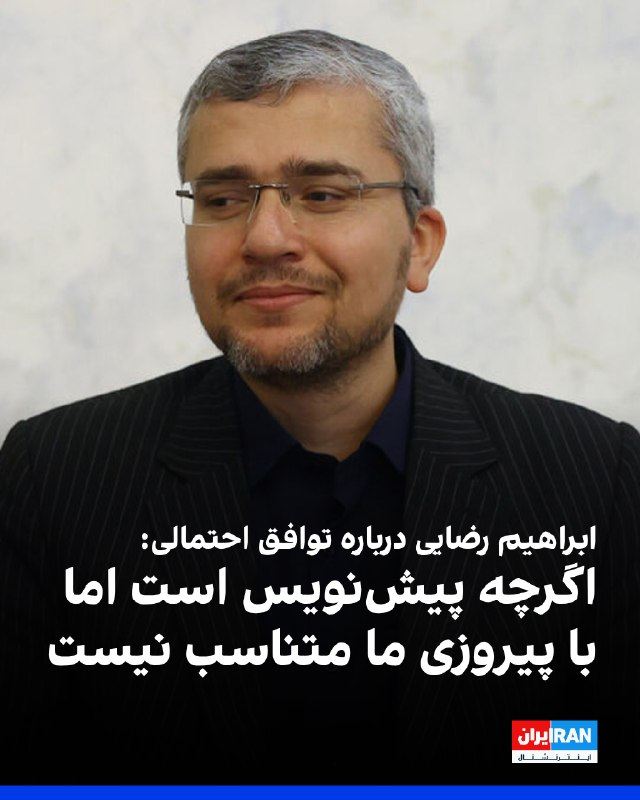
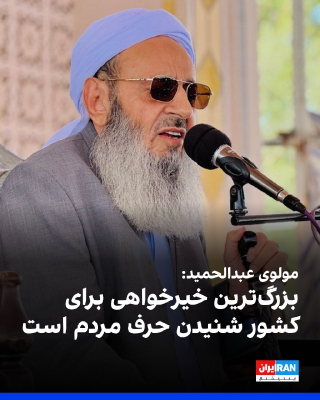

# خواننده تلگرام

<!-- TOP_NAV START -->

<a href="https://github.com/ProAlit/aio-downloader/blob/main/telegram/content/archive_1.md" style="display:inline-block; padding:6px 12px; margin:0 4px; background-color:#2ea44f; color:white; text-decoration:none; border-radius:4px; font-weight:bold;">صفحه بعد</a>

<!-- TOP_NAV END -->

<!-- MSG START -->

---
📅 بروزرسانی: 1405/03/06 23:24
---

## VahidOOnLine — post 242479

  

♦️تانکرترکرز، نهاد ردیابی نفتکش‌ها در تازه‌ترین گزارش خود اعلام کرد در پی محاصره دریایی آمریکا، نزدیک به ۶۰ میلیون بشکه نفت خام ایران در دریا متوقف شده و حدود شش میلیارد دلار درآمد نفتی فعلا به تهران نرسیده است.
بر اساس اطلاعات منتشرشده از سوی این مجموعه، کاهش صادرات نفت ایران در هفته‌های اخیر باعث شده بخش قابل توجهی از نفت خام ایران روی نفتکش‌ها باقی بماند و امکان انتقال یا فروش آن با دشواری روبه‌رو شود. تانکرترکرز همچنین اعلام کرده هنوز تعداد زیادی نفتکش خالی برای بارگیری وجود دارد، اما همزمان با کاهش تولید نفت، میزان بارگیری نفتکش‌ها نیز افت کرده است.
گزارش‌های منتشرشده در رسانه‌های بین‌المللی و داده‌های رهگیری دریایی نشان می‌دهد بخشی از نفتکش‌های ایرانی همچنان تلاش می‌کنند با خاموش کردن سیستم‌های رهگیری یا انتقال محموله‌ها در دریا، محدودیت‌ها را دور بزنند. با این حال، ارزیابی‌ها حاکی از آن است که فشار بر صادرات نفت ایران در مقایسه با ماه‌های گذشته افزایش یافته است.
‌🇸🇦 Indypersian

🤖 @VahidOOnLine

## mwarmonitor — post 9837

  

🔴ناوشکن کلاس Horizon CHEVALIER PAUL 🇫🇷 و ناوچه کلاس FREMM POSS ALSACE 🇫🇷 ۲ روز پیش در آب‌های جنوب عمان مشاهده شدند 📍موقعیت ناوشکن: 16.8356, 55.3751 📍موقعیت ناوچه: 16.8513, 56.070 📌این دو شناور در حال عملیات مشترک با ناو هواپیمابر فرانسوی CDG (شارل دوگل)…

## mwarmonitor — post 9836

  

🔴پایگاه NSF دیه‌گو گارسیا: به‌روزرسانی لجستیکی و SOC

🛰تصاویر ماهواره‌ای Sentinel-2 مربوط به امروز (۲۷ مه) نمای به‌روزی از وضعیت و استقرارها در داخل آب‌سنگ حلقوی پایگاه NSF دیه‌گو گارسیا ارائه می‌دهد.

🔸تأمین تدارکات ناوگان:
کشتی پشتیبانی سریع رزمی USNS Arctic (T-AOE-8) در حال حاضر در تالاب لنگر انداخته است. این موضوع الگویی را نشان می‌دهد که مدتی است مشاهده می‌کنیم: کشتی‌های USNS همچنان به‌صورت متناوب از دیه‌گو گارسیا برای سوخت‌گیری، تدارکات و تعمیر و نگهداری خود در فاصله بین مأموریت‌ها به ناوگان استفاده می‌کنند.

🚢کشتی مادر SOC:
با احتمال بسیار زیاد، MV Ocean Trader همچنان در آب‌سنگ حلقوی لنگر انداخته است. پوشش سنگین ابر در عبور امروز شناسایی ۱۰۰٪ قطعی را دشوار می‌کند.

@mwarmonitor

## FoxNewsTwitter — post 342323

  

Fox News (Twitter/X)

BREAKING: Matthew Perry’s live-in assistant has been sentenced to more than 3 years in prison for his role in the actor’s ketamine overdose death.

60-year-old Kenneth Iwamasa admitted he injected Perry with ketamine before the “Friends” star was found dead at his Los Angeles home in 2023.

“You were privy to his struggle with addiction,” the judge told him before sentencing. “Your conduct was reckless.”

The sentencing closes the final chapter in the nearly three-year federal investigation into Perry’s death.

## IranIntlTV — post 339300

  <a href="telegram/content/IranIntlTV_339300_1779911667.mp4" target="_blank">🎬 Download video</a>

وزارت اطلاعات از نفوذ گسترده امنیتی و سایبری علیه ایران و پیامدهای جنگ ۴۰ روزه خبر داد. در این بیانیه به ورود استارلینک، خرابکاری، ناامن‌سازی مرزها و تلاش برای ایجاد آشوب داخلی اشاره شده و گفته شده این اقدامات خنثی شده‌اند. همچنین از بازداشت ده‌ها نفر به اتهام همکاری با موساد و گروه‌های تروریستی و هشدار نسبت به احتمال اعتراض‌های خیابانی خبر داده شده است.

گفت‌وگو با مراد ویسی، تحلیلگر ارشد ایران‌اینترنشنال
@iranintltv

## IranIntlTV — post 339299

  <a href="https://t.me/IranintlTV/339299" target="_blank">📎 Download file</a>

🎧نسخه صوتی چشم‌انداز: پشت‌ پرده امتیازات حیرت‌آور ترامپ به حکومت ایران
@iranintlTV

## FarsiVOA — post 218836

  <a href="telegram/content/FarsiVOA_218836_1779911669.mp4" target="_blank">🎬 Download video</a>

⚡️روزنه‌ای برای حرف‌های نگفته کاربران ایرانی در طولانی‌ترین خاموشی دیجیتال جهان

@FarsiVOA

## FarsiVOA — post 218835

🔺تلاش آمریکا برای جلوگیری از ورود ایبولا به کشور؛ شمار قربانیان در کنگو از ۲۲۰ نفر گذشت

▪️مارکو روبیو، وزیر امور خارجه آمریکا، می‌گوید ایالات متحده باید از ورود افراد مبتلا به ایبولا از جمهوری دموکراتیک کنگو جلوگیری کند. شیوع این بیماری در کنگو تاکنون دست‌کم ۲۲۰ مرگ مشکوک و بیش از ۹۰۰ مورد مشکوک به ابتلا بر جای گذاشته است.

⬇️ بیشتر بخوانید:
https://ir.voanews.com/a/marco-rubio-vows-to-keep-ebola-out-of-us/8154574.html
@FarsiVOA

## DW_Farsi — post 125212

  

🔶 هگست: ایران هنوز ذخایر موشکی دارد اما نمی‌تواند موشک تازه تولید کند

پیت هگست، وزیر دفاع (جنگ) آمریکا می‌گوید، ایران با وجود هفته‌ها بمباران ایالات متحده و اسرائیل، همچنان ذخایر موشکی در اختیار دارد.

او در نشست هیات دولت آمریکا در کاخ سفید در روز چهارشنبه ششم خرداد گفت: «ممکن است آنها هنوز موشک داشته باشند، اما در حال حاضر نمی‌توانند موشک‌های بیشتری بسازند.»

وزیر دفاع آمریکا همچنین افزود که ایران "در حال حاضر نمی‌تواند پهپادهای بیشتری تولید کند و کشتی‌های بیشتری بسازد".

او اضافه کرد: «آن‌ها به همین دلیل آمدند و برای گفت‌وگو اعلام تسلیم کردند.»

هگست ضمن ستایش محاصره بنادر ایران از سوی آمریکا نیز گفت: «هیچ نفتکش ایرانی در هیچ نقطه جهان در امان نیست و ما در سراسر جهان شاهد توقیف‌ها بوده‌ایم؛ اقدامی که شریان حیاتی اقتصادی آنها را قطع می‌کند.»
@dw_farsi

## alonews — post 123174

  <a href="telegram/content/alonews_123174_1779911672.webm" target="_blank">🎬 Download video</a>

👈 جایگزینی تسلیحات راهبردی مصرف شده در جنگ با ایران برای آمریکا، ۳ تا ۵ سال زمان می‌خواهد!

✅ @AloNews خبر جنگ

## alonews — post 123173

  <a href="telegram/content/alonews_123173_1779911673.webm" target="_blank">🎬 Download video</a>

👈حمله امشب اسرائیل به غزه 
🔴احتمالا ترور 
✅ @AloNews خبر جنگ

## alonews — post 123172

  <a href="telegram/content/alonews_123172_1779911673.webm" target="_blank">🎬 Download video</a>

👈سخنگوی کمیسیون امنیت ملی: اصلا چرا باید به آمریکا تعهد عدم ساخت سلاح هسته‌ای بدهیم؟

✅ @AloNews خبر جنگ

---
📅 بروزرسانی: 1405/03/06 23:13
---

## VahidOOnLine — post 242478

  <a href="telegram/content/VahidOOnLine_242478_1779911021.mp4" target="_blank">🎬 Download video</a>

♦️رویترز روز چهارشنبه ششم خرداد گزارش داد نیروهای امدادی در لائوس، کشوری در جنوب‌شرق آسیا، پنج نفر را که حدود یک هفته در غاری در استان زایسامبون گرفتار شده بودند، زنده پیدا کردند و عملیات جستجو برای یافتن دو نفر دیگر همچنان ادامه دارد.

بر اساس گزارش رسانه‌های دولتی لائوس، این هفت نفر هفته گذشته برای جستجوی طلا وارد غار شده بودند، اما بارندگی شدید و رانش زمین راه خروج آن‌ها را مسدود کرد.

ده‌ها امدادگر از لائوس و تایلند در عملیات نجات مشارکت دارند. یک گروه داوطلب تایلندی نیز از روز یکشنبه به این عملیات پیوسته است.
‌🇸🇦 Indypersian

🤖 @VahidOOnLine

## mwarmonitor — post 9835

  <a href="telegram/content/mwarmonitor_9835_1779911022.mp4" target="_blank">🎬 Download video</a>

📝وقتی شهر که خلوت بشه، قورباغه هفت‌تیرکش میشه! بله آقای ترامپ، وقتی درست وسط جنگ که این جمهوری اسلامیِ فکسنی داشت نفله و تکه‌پاره می‌شد، تو با اون مغز فندقی و ژست‌های پوچت دویدی وسط و آتش‌بس دادی، باید هم تهش به این افتضاح ختم بشه. مردک هالو، با همین حماقتت به این «بچه شیعه‌های رافضی» که کارشون تموم بود، تنفس مصنوعی دادی تا حالا از قعر ذلت بلند بشن و برات شاخ و شونه بکشن!

🔸حالا نگاه کن؛ این نظامِ مفلوک و در حال احتضار که تا دیروز داشت غزل خداحافظی رو می‌خوند، چنان وهمِ قدرت برش داشته که با وقاحت تمام، یک لیست باج‌خواهی ۳۰۰ میلیارد دلاری جلوی چشمای نابینات گذاشته! تویی که ادعای معامله‌گری داشتی، حالا باید بشینی و شروط مسخره‌ی یه مشت بازنده رو گوش کنی که دارن برات حکم خروج از منطقه و لغو تحریم‌ها رو صادر می‌کنن. حماقت تو و وقاحت اون‌ها، واقعاً یه کمدی سیاه و تهوع‌آوره!

@mwarmonitor

## IranianMinds — post 20893

  <a href="telegram/content/IranianMinds_20893_1779911024.mp4" target="_blank">🎬 Download video</a>

🔴 اسرائیل دوباره داره غزه رو شخم میزنه یه ساختمون بزرگو کامل نابود کردن برای ترور

@IranianMinds

## BBCPersian — post 282206

🔻شریف پس از تماس تلفنی با پزشکیان: پاکستان در کنار ایران خواهد ایستاد
شهباز شریف، نخست‌وزیر پاکستان، و مسعود پزشکیان، رئیس‌جمهور ایران، تلفنی با هم گفت‌وگو کردند.

آقای شریف در پیامی در ایکس نوشت که مسعود پزشکیان از «تلاش‌های صادقانه پاکستان برای صلح در منطقه» قدردانی کرده و در عین حال نقش فیلد مارشال عاصم منیر، فرمانده کل ارتش و نیروهای مسلح پاکستان را مورد توجه قرار داده است.

او همچنین گفت که بار دیگر تأکید کرده است که «پاکستان همواره به‌عنوان دوستی صمیمی و همسایه‌ای نزدیک در کنار ایران خواهد ایستاد.»

آقای شریف افزود: «ابراز امیدواری کردم که تلاش‌های جاری برای صلح به‌زودی به توافقی پایدار منجر شود و راه را برای ثبات، رفاه و همکاری منطقه‌ای هموار کند.»

خبرگزاری رسمی ایران در گزارشی درباره این تماس تلفنی گفته است که دو طرف «به‌ویژه در حوزه‌های اقتصادی، بازرگانی و گمرکی صحبت و و درباره تداوم رایزنی‌های مشترک برای حمایت از صلح و ثبات منطقه‌ای تأکید کردند.»

پاکستان میانجی آتش‌بس کنونی بین ایران و آمریکاست و در حال وساطت میان دو کشور برای رسیدن به توافق صلح است.

https://bbc.in/4dP5Yi6
@BBCPersian

## BBCPersian — post 282205

  <a href="telegram/content/BBCPersian_282205_1779911025.mp4" target="_blank">🎬 Download video</a>

🔻آخرین خبرهای مهم چهارشنبه ۶ خرداد ۱۴۰۵
@BBCPersian

## alonews — post 123171

  <a href="telegram/content/alonews_123171_1779911027.webm" target="_blank">🎬 Download video</a>

👈حمله امشب اسرائیل به غزه

🔴احتمالا ترور

✅ @AloNews خبر جنگ

## alonews — post 123170

🔥 حجم‌های بالا با قیمت‌های باورنکردنی 🔥 ⚡ سرعت بالا 🌐 پایداری عالی 🚀 کیفیتی که حسش میکنی همین الان جوین شو که جا نمونی 😍 @NetAazaadVPN @NetAazaadVPN

## alonews — post 123169

  

🔥 حجم‌های بالا با قیمت‌های باورنکردنی 🔥

⚡ سرعت بالا
🌐 پایداری عالی
🚀 کیفیتی که حسش میکنی

همین الان جوین شو که جا نمونی 😍

@NetAazaadVPN
@NetAazaadVPN

## alonews — post 123168

  

🔴🇮🇷 کشوری فرد، دبیر سازمان لیگ: پرسپولیس به چی اعتراض داره؟ اونا حتی تو جام حذفی هم نیستن. 22 بازی نتیجه نگرفتن، بعد می‌خوان تو 8 بازی همه تیم‌ها رو ببرن؟ چطور وقتی خودشون میرفتن آسیا، مشکلی نبود؟
@AloSport

---
📅 بروزرسانی: 1405/03/06 23:05
---

## VahidOOnLine — post 242477

  

تانکر ترکرز در شبکه ایکس اعلام کرد در پی محاصره دریایی آمریکا، نزدیک به ۶۰ میلیون بشکه نفت خام ایران متوقف شده و حدود شش میلیارد دلار درآمد نفتی در حال حاضر به تهران نمی‌رسد.

این نهاد ردیابی نفتکش‌ها افزود هنوز نفتکش‌های خالی زیادی برای بارگیری نفت بیشتر وجود دارد، اما با کاهش تولید نفت، بارگیری نفتکش‌ها نیز کاهش یافته است.
‌🏁 🇬🇧 IranintlTV

🤖 @VahidOOnLine

## WithYashar — post 12729

هم اکنون گزارش ها از دو ترور بزرگ در شمال غزه.
@withyashar

## IranIntlTV — post 339298

  

تانکر ترکرز در شبکه ایکس اعلام کرد در پی محاصره دریایی آمریکا، نزدیک به ۶۰ میلیون بشکه نفت خام ایران متوقف شده و حدود شش میلیارد دلار درآمد نفتی در حال حاضر به تهران نمی‌رسد.

این نهاد ردیابی نفتکش‌ها افزود هنوز نفتکش‌های خالی زیادی برای بارگیری نفت بیشتر وجود دارد، اما با کاهش تولید نفت، بارگیری نفتکش‌ها نیز کاهش یافته است.
https://iranintl.com/202605278620

## Persian_Trend_Official — post 15145

تا دقایقی دیگه لایو امشب آغاز میشه
حدودا 30 دقیقه

## RadioFarda — post 157628

  

🔸سازمان دولتی انرژی هسته‌ای فدراسیون روسیه از تصمیمش برای به تعویق‌انداختن بازگشت کارکنانش به نیروگاه هسته‌ای بوشهر خبر داد.

🔸این موضوع را الکسی لیخاچِف، مدیرعامل این نهاد دولتی روسیه اعلام کرد.

🔸مدیر عامل «روس اتم» روز چهارشنبه در جمع خبرنگاران گفت: «متاسفانه اخبار ضد و نقیضی در ارتباط با روند مذاکرات ایران و آمریکا به گوش می‌رسد و هر از گاهی هم اخباری از وقوع حملاتی به نقاطی از ایران منتشر می‌شود. به همین دلیل بازگشت همکارانمان را به تعویق انداختیم».

🔸الکسی لیخاچف تأکید کرد که ولادیمیر پوتین رئیس‌جمهور فدراسیون روسیه هم در جریان این تصمیم قرار گرفته و آن‌را تأیید کرده است.

🔸«روس اتم» پیشتر و به دنبال آغاز جنگ آمریکا و اسرائیل با ایران، ۸۱۳ تن از کارکنانش را از بوشهر خارج کرده و تنها ۲۰ تن از کارکنانی که حضورشان در محل برای اطمینان از ایمنی و فعالیت نیروگاه و پیشرفت ساخت فازهای بعدی ضروری بوده را، همچنان در بوشهر نگه داشته است.

@RadioFarda

## IranianMinds — post 20892

  <a href="https://t.me/IranianMinds/20892" target="_blank">📎 Download file</a>

سرور فوق العاده پرسرعت و قوی مخصوص اینستا و یوتیوب سرعت فضایی مخصوص همراه اول مخابرات

آموزش اتصال در اندروید

آموزش اتصال در آیفون

حتما شیر بدید بقیه هم متصل شن لطفا دانلود سنگین هم نزنید ❤️‍🔥

@IranianMinds

## alonews — post 123167

  <a href="telegram/content/alonews_123167_1779910529.webm" target="_blank">🎬 Download video</a>

👈بقایی: موضع ایران در رابطه با قفقاز جنوبی هیچ تغییری نکرده است

🔴سخنگوی وزارت خارجه: جمهوری اسلامی ایران نسبت به نیات بدخواهانه امریکا که سابقه شرارت و تجاوزگری در مناطق مختلف دنیا دارد، سوء ظن شدید دارد و مخالفت خود را با حضور ناامن‌ساز آن در قفقاز جنوبی صراحتا اعلام کرده‌ است.

🔴موضع جمهوری اسلامی ایران درباره امنیت در قفقاز جنوبی روشن است و هیچ شبهه‌ای در این خصوص وجود ندارد.

✅ @AloNews خبر جنگ

## alonews — post 123166

  <a href="telegram/content/alonews_123166_1779910530.webm" target="_blank">🎬 Download video</a>

👈 امانی، سفیر پیشین ایران در لبنان: حزب‌الله برای حمله به اسرائیل در ایام جنگ ایران فرصت را مناسب دید، قضیه راهبردی است و اینطور نیست که حزب‌الله بخواهد در این جنگ طرف ایران را بگیرد و موضوع تبدیل به موضوع کلانی شده است

✅ @AloNews خبر جنگ

## alonews — post 123165

  <a href="telegram/content/alonews_123165_1779910530.mp4" target="_blank">🎬 Download video</a>

🔴من خود به چشم خویشتن دیدم، که جانم میرود…

💔جاویدنام محسن جبارزاده

✅@AloNews

---
📅 بروزرسانی: 1405/03/06 22:59
---

## VahidOOnLine — post 242476

  <a href="telegram/content/VahidOOnLine_242476_1779910151.mp4" target="_blank">🎬 Download video</a>

♦️با آغاز فصل نوبرانه‌های تابستانی در شمال ایران، دومین جشنواره «هلی‌سوری» در مازندران آغاز به کار کرد؛ جشنواره‌ای که طعم ترش و شور آلوچه‌های سبز را با موسیقی، خوراک محلی و صنایع‌دستی شمال ایران همراه کرده است.

این جشنواره در هادی‌شهر بابلسر استان مازندران با حدود ۱۰۰ غرفه برگزار شد و تمرکز آن بر معرفی خوراک بومی، چاشنی‌های محلی و احیای فرهنگ روستایی و صنایع‌دستی منطقه بود. یکی از بخش‌های محبوب جشنواره، تجربه خوردن «آلوچه دَشکن» یا «هلی کِتِنی» بود؛ آلوچه‌های سبزی که با نمک و چاشنی‌های محلی کوبیده و طعم‌دار می‌شوند.

در کنار آن، بازدیدکنندگان طعم «دَلار» یا «دَلال» را نیز تجربه کردند؛ چاشنی سبزرنگ و مشهور شمال ایران که از ترکیب سبزی‌های معطر مانند نعناع، گشنیز و سبزی های محلی و نمک تهیه می‌شود و یکی از معروف‌ترین همراهان آلوچه و گوجه‌سبز در استان‌های شمالی به شمار می‌رود.

آلوچه با نام علمی Prunus cerasifera، از گونه‌های بومی غرب آسیا و جنوب شرق اروپا است.
‌🇸🇦 Indypersian

🤖 @VahidOOnLine

## VahidOOnLine — post 242475

‏دونالد ترامپ در نشست کابینه در کاخ سفید با اشاره به ادامه مذاکرات با جمهوری اسلامی گفت شاید مجبور شویم برگردیم و کار را تمام کنیم. همزمان با ادامه مذاکرات، ان‌بی‌سی نیوز نیز گزارش داد پنتاگون فهرستی از اهداف احتمالی در ایران را تهیه کرده است.

‏ گفت‌وگو با علیرضا نامور حقیقی، تحلیلگر سیاسی
‌🏁 🇬🇧 IranintlTV

🤖 @VahidOOnLine

## WithYashar — post 12728

اتاق جنگ با یاشار : کاری‌ نداره اگه همه با هم متحد باشن میتونن ، فقط با پوشیدن لباس های سبز سفید ، قرمز و زرد یه ابر پرچم قول آسای انسانی‌ پیکسلی درست کنند 🧠😍🙌🏾 @withyashar

## mwarmonitor — post 9834

📝 وسط این هیاهوی بی‌پایان مجازی، جایی میان استوری‌های افشاگرانه، ویس‌های لو رفته و رگبار الفاظ رکیک، هدف اصلی به کل فراموش شده است. اتاق فکرهای دستگاه امنیتی جمهوری اسلامی نیازی به طراحی نقشه‌های پیچیده ندارند؛ آن‌ها با پاشیدن بذر شک و کینه، تله‌ای هوشمندانه ساخته‌اند تا فعالان مجازی با منیت‌ها و حسادت‌هایشان، پیاده‌نظامِ ناخواستهٔ رژیم شوند و ارتشِ یکدیگر را نابود کنند. هر کلیک روی این جنجال‌های مجازی و هر بازنشر این کینه‌توزی‌ها، بازی در زمین سناریویی است که جمهوری اسلامی برای بقای خود نوشته تا به جامعه دیکته کند که هیچ جایگزین معتبر و شریفی وجود ندارد.

🔸دردآورترین پرده این نمایش آنجاست که مخاطب خسته و بی‌قرار در داخل کشور، وقتی چشمان نگرانش را به این سیرک مجازی می‌دوزد تا ردی از امید یا راهکار بیابد، چیزی جز یک میدان جنگ مبتذل بر سر سهم‌الارثِ نبرده نمی‌بیند؛ تصویری که خروجی آن چیزی جز تزریق ناامیدی مطلق به بدنه جامعه و کشتن آخرین کورسوهای همبستگی نیست.

🔸مردم و مخاطبانی که دل در گروی تغییر و بهبود دارند، باید به طور جدی از این فضای سمی، فرسایشی و سودجویانه دوری کنند. نباید با پیگیری، لایک و بازنشر این جنگ‌های زرگری، بنزین به آتش این فتنه و بازی طراحی‌شدهٔ جمهوری اسلامی بریزند. بایکوت کردن این تجارتِ تفرقه و آگاهی از این تلهٔ رسانه‌ای، اولین قدم برای نجات امید و بازگرداندن تمرکز به مسیر اصلی است.

@mwarmonitor

## iaghapour — post 2637

## IranIntlTV — post 339297

‏دونالد ترامپ در نشست کابینه در کاخ سفید با اشاره به ادامه مذاکرات با جمهوری اسلامی گفت شاید مجبور شویم برگردیم و کار را تمام کنیم. همزمان با ادامه مذاکرات، ان‌بی‌سی نیوز نیز گزارش داد پنتاگون فهرستی از اهداف احتمالی در ایران را تهیه کرده است.

‏ گفت‌وگو با علیرضا نامور حقیقی، تحلیلگر سیاسی

## IranIntlTV — post 339296

پس از هفته‌ها اختلال و محدودیت گسترده اینترنت در ایران، حالا با وصل شدن دوباره اینترنت جهانی، بسیاری از مخاطبان ایران‌اینترنشنال می‌گویند دسترسی‌ها هنوز به وضعیت عادی برنگشته و در بعضی مناطق همچنان محدودیت وجود دارد.

گفت‌وگو با حسین قاضیان، جامعه‌شناس
@iranintltv

## IranIntlTV — post 339295

  <a href="telegram/content/IranIntlTV_339295_1779910154.mp4" target="_blank">🎬 Download video</a>

وزارت اطلاعات با انتشار بیانیه‌ای از نفوذ گسترده امنیتی، اطلاعاتی و سایبری در کشور خبر داد. در این بیانیه نسبت به پیامدهای جنگ ۴۰ روزه، شرایط امنیتی کشور و احتمال دور تازه اعتراض‌های خیابانی هشدار داده شده است.

گفت‌وگو با مراد ویسی، تحلیل‌گر ارشد ایران‌اینترنشنال
@iranintltv

## FarsiVOA — post 218834

⚡️انتقال کمپ تیم ملی فوتبال جمهوری اسلامی به تیخوانا در مکزیک، حالا به یکی از جنجالی‌ترین بحث‌های رسانه‌های ایران تبدیل شده. از محدودیت‌های آمریکا برای اقامت تیم ملی گرفته تا هشدار رسانه‌های داخلی درباره ناامنی، کارتل‌های مواد مخدر، و محله‌های پرخطر این شهر مرزی.
@FarsiVOA

## DW_Farsi — post 125211

🎥 "فیلم و کتاب زیر بغل، خانه به خانه" در گریز از سانسور

مستند "نفس دوم"، ساخته مژگان ایلانلو مانند بسیاری دیگر از فیلم‌ها در ایران اجازه نمایش عمومی ندارد. سازنده این فیلم حالا در اروپاست تا در اکران‌های عمومی فیلمش در خارج از ایران حضور داشته باشد. با او درباره این فیلم گفت و گو کردیم.
@dw_farsi

## Persian_Trend_Official — post 15144

  <a href="telegram/content/Persian_Trend_Official_15144_1779910156.mp4" target="_blank">🎬 Download video</a>

پرفسور خوش چشم محبوب دل ها و مشتری زغال خوب

📌 @persian_trend_official
پرشین ترند | متفاوت‌ترین کانال نظامی

## Dirty_Kids — post 390353

  

دوستان وقتی نبودید جنازه شمخانی بدون سر دفن شد.

@Dirty_Kids 👻

## Dirty_Kids — post 390352

  

الحق که شاد ترین ملتو داریم.

ملت توی یه مرحله عجیب دارن زندگی میکنن😂😂😂رفتن کارزار رفع ممنوعیت کشت خشخاش رو ایجاد کردن

@Dirty_Kids 👻

## Dirty_Kids — post 390351

  <a href="telegram/content/Dirty_Kids_390351_1779910160.mp4" target="_blank">🎬 Download video</a>

🔴 توی آمل یه نفر برنده شده و ۱ دقیقه بهش فرصت دادن تا هر چی دلش میخواد از فروشگاه برداره.

طرفم یه کاری کرد که صاحب فروشگاه به گوه خوردن افتاد.

@Dirty_Kids 👻

## alonews — post 123164

  <a href="telegram/content/alonews_123164_1779910162.webm" target="_blank">🎬 Download video</a>

👈 بر اساس گزارش «گلدمن ساکس»، تقویت ارزش دلار در نخستین ماه از درگیری میان آمریکا و ایران، موجب شد تا نهادهای رسمی خارجی اقدام به فروش اوراق قرضه خزانه‌داری [آمریکا] کنند.

✅ @AloNews خبر جنگ

---
📅 بروزرسانی: 1405/03/06 22:43
---

## VahidOOnLine — post 242474

♦️مسجد جامع عتیق اصفهان یا مسجد جمعه اصفهان، یکی از مهم‌ترین و باشکوه‌ترین آثار معماری ایران و جهان اسلام به شمار می‌رود، بنایی تاریخی که در طول قرن‌ها، لایه‌های مختلفی از هنر، معماری و تاریخ ایران را در خود جای داده و امروز همچون موزه‌ای زنده، سیر تحول معماری ایرانی ـ اسلامی را روایت می‌کند.
این مسجد که بخش‌های مختلف آن در دوره‌های گوناگون تاریخی ساخته و تکمیل شده، از نخستین سده‌های اسلامی تا دوران سلجوقی و صفوی، همواره مرکز مهم مذهبی، فرهنگی و اجتماعی اصفهان بوده است. بسیاری از پژوهشگران معتقدند پیش از اسلام نیز این مکان کاربری مذهبی داشته و احتمالا یکی از آتشکده‌های مهم شهر اصفهان در همین محدوده قرار داشته است.
هر گوشه از مسجد جامع اصفهان نشانی از دوره‌ای تاریخی را در خود حفظ کرده؛ از شبستان‌ها و ایوان‌های عظیم گرفته تا گنبدهای کم‌نظیر، کتیبه‌های تاریخی، آجرکاری‌های ظریف و تزئینات چشم‌نواز که آن را به یکی از برجسته‌ترین نمونه‌های معماری ایرانی تبدیل کرده است.
سیمای کنونی مسجد عمدتا متعلق به دوره سلجوقیان است.
این تصاویر را خدیجه نادری ثبت کرده و در خبرگزاری مهر منتشر شده‌اند.
‌🇸🇦 Indypersian

🤖 @VahidOOnLine

## mwarmonitor — post 9833

🔴«باز هم حرف‌های تکراری و متناقضی مطرح شد که تمام تحلیل‌های قبلی درباره جهت‌گیری‌ها را نقش بر آب کرد. به نظر من، تا زمانی که توئیت رسمی مبنی بر تصمیم نهایی‌اش منتشر نشود، هر حرفی که می‌زند صرفاً برای جلب توجه و بازی رسانه‌ای است. باید منتظر ماند و دید نتیجه نهایی مذاکرات چه می‌شود؛ او یا در نهایت به ساز ایران می‌رقصد و مسیر تعامل را ادامه می‌دهد، یا دست به حمله خواهد زد.»

@mwarmonitor

## FoxNewsTwitter — post 342322

  

Fox News (Twitter/X)

No one wants a romantic dinner ruined by a screaming child at the next table.

According to a new survey, 75% of Americans say restaurants should offer some kind of adults-only dining experience to avoid unruly kids.

That includes child-free sections, restrictions during late-night hours, and quieter dining environments focused more on the experience than family-friendly chaos.

## Shin_Persian — post 6264

  

↩️ Quoted tweet: NewsWire ✓ @NewsWire_US Wed, 27 May 2026 17:02:46 UTC TRUMP: OMAN WILL BEHAVE OR WE'LL HAVE TO BLOW THEM UP. ↩️ توییت نقل‌قول شده — برای پاسخ، پست زیر را ببینید. فارسی ترامپ: عمان مودبانه رفتار خواهد کرد وگرنه مجبور خواهیم شد آن‌ها را…

## Shin_Persian — post 6263

↩️ Quoted tweet:
NewsWire ✓ @NewsWire_US
Wed, 27 May 2026 17:02:46 UTC

TRUMP: OMAN WILL BEHAVE OR WE'LL HAVE TO BLOW THEM UP.

↩️ توییت نقل‌قول شده — برای پاسخ، پست زیر را ببینید.

فارسی

ترامپ: عمان مودبانه رفتار خواهد کرد وگرنه مجبور خواهیم شد آن‌ها را منفجر کنیم.

𝕏 · @shin_persian

## Persian_Trend_Official — post 15143

  <a href="telegram/content/Persian_Trend_Official_15143_1779909218.webm" target="_blank">🎬 Download video</a>

رویترز: پنتاگون و اسپیس ایکس برای ارائه Direct-to-Cell در ایران مذاکره کرده بودند

🔹به گزارش رویترز، پنتاگون در خلال درگیری نظامی با ایران و در شرایطی که دسترسی اینترنت در کشور قطع شده بود، بر سر ارائه سرویس دایرکت تو سل (Direct-to-Cell) که منجر به اتصال مستقیم گوشی‌های هوشمند به اینترنت ماهواره‌ای استارلینک می‌شود، با شرکت اسپیس‌ایکس گفتگو کرده و بر سر هزینه‌ها دچار اختلاف نظر شده بود.
🔹رویترز می‌گوید براساس اسناد پنتاگون و گفته‌های یکی از منابع آگاه، اسپیس‌ایکس که در سال ۲۰۲۵ مبلغ ۱۱.۴ میلیارد دلار از استارلینک درآمد داشته، برای راه‌اندازی این قابلیت در ایران پیشنهاد دریافت رقم هنگفت ۵۰۰ میلیون دلار به همراه هزینه ۱۰۰ میلیون دلاری ماهانه برای عملیاتی کردن آن را مطرح کرده بود. این ارقام باعث نگرانی شدید مقامات دفاعی آمریکا شده بود و رویترز نتوانسته مشخص کند که آیا توافقی در این زمینه حاصل شده است یا خیر.

👩‍💻@PhantomDirective

🆔@persian_trend_official
پرشین ترند | متفاوت‌ترین کانال نظامی

## IranianMinds — post 20891

  

تو این تایمای قطعی نت هم این جنده حکومتی شده بود با شرف خرزشیا

@IranianMinds

## IranianMinds — post 20890

🎁 استارت کن و کانفیگتو رایگان بگیر 
⭐ویژه کاربران پرمیوم تلگرام 
⭐️ اگه اکانت تلگرامت پرمیوم باشه به محض استارت ربات بدون هیچ امتیاز و زیر مجموعه دایی جون بهت کانفیگ هدیه میده 
✔️ همچنین با اوردن دوستای پرمیومت امتیاز بیشتری میگیری 
🎁 @Daeijoonbot | استارت…

## IranianMinds — post 20889

  

🎁 استارت کن و کانفیگتو رایگان بگیر

⭐ویژه کاربران پرمیوم تلگرام

⭐️ اگه اکانت تلگرامت پرمیوم باشه به محض استارت ربات بدون هیچ امتیاز و زیر مجموعه دایی جون بهت کانفیگ هدیه میده

✔️ همچنین با اوردن دوستای پرمیومت امتیاز بیشتری میگیری

🎁 @Daeijoonbot | استارت کن و کانفیگ رایگان بگیر 
🌟

## alonews — post 123163

  <a href="telegram/content/alonews_123163_1779909219.webm" target="_blank">🎬 Download video</a>

👈 وزیر خارجه آمریکا: طی روزهای آتی میزان پیشرفت در گفت‌وگوها با ایران را ارزیابی می‌کنیم؛ توافقی وجود دارد که می‌توان به آن دست یافت و مقداری پیشرفت و تمایل مشاهده شده است.

✅ @AloNews خبر جنگ

## alonews — post 123162

  <a href="telegram/content/alonews_123162_1779909220.webm" target="_blank">🎬 Download video</a>

👈تانکر ترکرز: نزدیک به ۶۰ میلیون بشکه نفت خام ایران در نتیجه محاصره دریایی نیروی دریایی آمریکا متوقف و گرفتار شده است. این میزان تقریباً ۶ میلیارد دلار درآمد نفتی است که در حال حاضر به تهران نمی‌رسد.

🔴با وجود این‌که هنوز نفتکش‌های خالی زیادی برای بارگیری نفت در دسترس هستند، اما به دلیل کاهش تولید نفت، میزان بارگیری نفتکش‌ها نیز کاهش یافته است.

✅ @AloNews خبر جنگ

---
📅 بروزرسانی: 1405/03/06 22:33
---

## VahidOOnLine — post 242473

  

ابراهیم رضایی، سخنگوی کمیسیون امنیت ملی مجلس، در واکنش به گزارش‌ها درباره توافق احتمالی میان واشینگتن و تهران، در ایکس نوشت: اگرچه پیش‌نویس است و چیزی قطعی نیست اما متناسب با «پیروزی بزرگ ملت ایران» در جنگ ۴۰ روزه نیست.

او پیش‌تر نیز گفته بود جمهوری اسلامی نباید در موضوع هسته‌ای تعهدی بدهد که قدرت بازدارندگی‌اش را تضعیف کند.
‌🏁 🇬🇧 IranintlTV

🤖 @VahidOOnLine

## IranIntlTV — post 339293

  <a href="telegram/content/IranIntlTV_339293_1779908634.mp4" target="_blank">🎬 Download video</a>

یک شهروند با ارسال پیامی به ایران‌اینترنشنال می‌گوید که طرح اینترنت پرو شکست خورده و با باز شدن نسبی اینترنت مردم فریب نمی‌خورند. پیام او با هوش مصنوعی خوانده شده است.

## IranIntlTV — post 339292

  <a href="telegram/content/IranIntlTV_339292_1779908635.mp4" target="_blank">🎬 Download video</a>

ساعتی پیش از جلسه دولت آمریکا در کاخ سفید، دونالد ترامپ در شبکه اجتماعی تروت سوشال پستی درباره افزایش گزارش‌های آزار و خشونت جنسی در زندان‌های ایران را بازنشر کرد.

ارزیابی جمشید برزگر، روزنامه‌نگار و تحلیلگر سیاسی
@iranintltv

## IranIntlTV — post 339291

  

ابراهیم رضایی، سخنگوی کمیسیون امنیت ملی مجلس، در واکنش به گزارش‌ها درباره توافق احتمالی میان واشینگتن و تهران، در ایکس نوشت: اگرچه پیش‌نویس است و چیزی قطعی نیست اما متناسب با «پیروزی بزرگ ملت ایران» در جنگ ۴۰ روزه نیست.

او پیش‌تر نیز گفته بود جمهوری اسلامی نباید در موضوع هسته‌ای تعهدی بدهد که قدرت بازدارندگی‌اش را تضعیف کند.
https://iranintl.com/202605275713

## FarsiVOA — post 218833

⚡️با گذشت ۸۸ روز از خاموشی دیجیتال در ایران، روایت‌ها از اینترنتِ محدود، خسارت میلیارددلاری به اقتصاد، فشار معیشتی، کوچک‌تر شدن سفره مردم و تشدید فضای امنیتی در ایران خبر می‌دهند
@FarsiVOA

## FarsiVOA — post 218828

فرماندهی مرکزی ایالات متحده، سنتکام، تصاویری از عملیات هوایی ملوانان و تفنگداران دریایی آمریکا بر ناو هواپیمابر «یو‌اس‌اس آبراهام لینکلن» منتشر کرد.

این ناو از عملیات منطقه‌ای در دریای عرب پشتیبانی می‌کند، از جمله محاصره دریایی آمریکا علیه جمهوری اسلامی که تاکنون بیش از ۱۰۰ کشتی تجاری را تغییر مسیر داده است.

## Dirty_Kids — post 390350

‏این چیزی که وصل کردن اینترنت قبل نیست. نمی‌دونم چه گهیه؛ ولی اون نیست.

@Dirty_Kids 👻

## alonews — post 123161

  <a href="telegram/content/alonews_123161_1779908638.webm" target="_blank">🎬 Download video</a>

👈الجزیره: پهپادهای تهاجمی حزب‌الله یک سرباز اسرائیلی را کشته و دو نفر دیگر را زخمی کردند

✅ @AloNews خبر جنگ

## alonews — post 123160

  <a href="telegram/content/alonews_123160_1779908638.webm" target="_blank">🎬 Download video</a>

👈اینم از وضعیت اینترنت وصل شده
پر از اختلال...

✅ @AloNews خبر جنگ

## alonews — post 123159

  <a href="telegram/content/alonews_123159_1779908638.webm" target="_blank">🎬 Download video</a>

👈هلند مدعی ارسال مین‌روب به تنگه هرمز شد

✅ @AloNews خبر جنگ

## alonews — post 123158

  <a href="telegram/content/alonews_123158_1779908638.webm" target="_blank">🎬 Download video</a>

👈روزنامه‌نگار چینی: آمریکا و ایران به پیش‌نویس توافق دست یافته‌اند، اما واشنگتن نمی‌تواند تصویر «پیروزی ایران» بپذیرد

✅ @AloNews خبر جنگ

## alonews — post 123157

  <a href="telegram/content/alonews_123157_1779908639.webm" target="_blank">🎬 Download video</a>

👈نرخ ثبت ازدواج در دفاتر اسناد رسمی با ۴۵ درصد افزایش به ۲ میلیون و ۹۰۰ هزار تومان رسید

✅ @AloNews خبر جنگ

---
📅 بروزرسانی: 1405/03/06 22:23
---

## VahidOOnLine — post 242472

♦️ پیت هگست، وزیر جنگ آمریکا، چهارشنبه ششم خرداد، در نشست کابینه در کاخ سفید، از سیاست‌های دونالد‌ ترامپ در قبال جمهوری اسلامی تمجید کرد و گفت خروج ترامپ از برجام و اقدامات بعدی او، آمریکا و جهان را از «تهدید» جمهوری اسلامی دور کرده است.

هگست خطاب به ترامپ گفت: «چه موضوع قاسم سلیمانی باشد، چه کنار گذاشتن توافق اوباما که قرار بود به آنها سلاح بدهد، و چه جنگ ۱۲ روزه، شما شرایطی ایجاد کردید که مردم آمریکا و جهان از این تهدید در امان بمانند.»

وزیر جنگ آمریکا همچنین گفت ترامپ در عملیات «خشم حماسی» برخلاف جنگ‌های گذشته در عراق و افغانستان، با «حداکثر قدرت» عمل کرد و جمهوری اسلامی را «به زانو درآورد.»

او همچنین گفت آمریکا با ایجاد «محاصره جهانی» علیه جمهوری اسلامی، فشار سنگینی بر اقتصاد ایران وارد کرده و همین مسئله تهران را به سمت مذاکرات سوق داده است.
‌🇸🇦 Indypersian

🤖 @VahidOOnLine

## WithYashar — post 12727

## WithYashar — post 12726

## mwarmonitor — post 9832

🔴ترامپ گفت مطمئن نیست که ایالات متحده باید توافقی برای پایان دادن به جنگ با ایران امضا کند، اگر عربستان سعودی و دیگر کشورهای حاشیه خلیج فارس با پیوستن به توافق‌نامه‌های ابراهیم موافقت نکنند.
او گفت: «آن‌ها این را به ما بدهکارند.»

@mwarmonitor

## mwarmonitor — post 9831

  

🔴نزدیک به ۶۰ میلیون بشکه نفت خام ایران در نتیجه محاصره دریایی نیروی دریایی آمریکا متوقف و گرفتار شده است. این میزان تقریباً ۶ میلیارد دلار درآمد نفتی است که در حال حاضر به تهران نمی‌رسد.
🔸با وجود این‌که هنوز نفتکش‌های خالی زیادی برای بارگیری نفت در دسترس هستند، اما به دلیل کاهش تولید نفت، میزان بارگیری نفتکش‌ها نیز کاهش یافته است. TANKER TRACKER

@mwarmonitor

## DW_Farsi — post 125210

  

🔶 ترامپ به ایران: اگر توافق نشود مجبوریم کار را یکسره کنیم

دونالد‌ ترامپ، رئیس‌جمهور آمریکا، روز چهارشنبه ۲۷ مه (۶ خرداد) در نشست کابینه خود در کاخ سفید درباره مذاکرات با جمهوری اسلامی گفت، تهران "واقعا می‌خواهد توافق کند، اما مذاکرات هنوز به نتیجه نهایی نرسیده است".

ترامپ در عین حال تاکید کرد: «ما از وضعیت فعلی [مذاکره] راضی نیستیم، ولی خواهیم شد.»

رئیس‌جمهور آمریکا با اشاره به اینکه "جمهوری اسلامی تحت فشار شدید است"، اضافه کرد: «نیروی دریایی‌شان نابود شده، نیروی هوایی از بین رفته و همه‌چیزشان از دست رفته است.»

ترامپ خاطرنشان کرد، جمهوری اسلامی "در حالی مذاکره می‌کند که چیزی برایش باقی نمانده".

او در ادامه هشدار داد، یا توافق حاصل می‌شود یا "مجبور می‌شویم کار را یکسره کنیم."

ترامپ ضمن اشاره به این نکته که "اقتصاد ایران در حال سقوط آزاد است" گفت که تهران "به‌دلیل فشارهای سنگین، گزینه دیگری جز حرکت به‌سوی توافق ندارد".

اظهارات ترامپ در حالی بیان شده است که او چهار روز پیش گفته بود، در مورد یک توافق "تا حد زیادی مذاکره شده" و جزئیات آن "به زودی اعلام خواهد شد".
@dw_farsi

## alonews — post 123156

  <a href="telegram/content/alonews_123156_1779908007.webm" target="_blank">🎬 Download video</a>

👈آسوشیتدپرس: تحلیل جدیدی می‌گوید ایالات متحده ممکن است به ۳ تا ۵ سال زمان نیاز داشته باشد تا انبارهای مهمات موشکی کلیدی که به شدت در جنگ با ایران مصرف شده‌اند را بازسازی کند و این موضوع نگرانی‌هایی را درباره آمادگی برای یک درگیری احتمالی با چین برانگیخته است.

گزارش می‌گوید تأمین موشک‌های کروز تامهاوک، موشک‌های رهگیر پاتریوت و سیستم‌های ثاد به شدت کاهش یافته است. حتی با افزایش هزینه‌های دفاعی تحت ریاست جمهوری ترامپ، بازسازی موجودی‌ها سال‌ها طول خواهد کشید زیرا ظرفیت تولید محدود است.

تخمین‌های زمان بازسازی:

موشک‌های تامهاوک: تا سال ۲۰۳۰
موشک‌های رهگیر ثاد: تا اواخر سال ۲۰۲۹
موشک‌های پاتریوت: تا اواسط سال ۲۰۲۹



✅ @AloNews خبر جنگ

## alonews — post 123155

یه مشت جاکش هم نشستن اونور دنیا چپ و راست میگن مردم قیام کنید حتی اگه شهید بشید! خب جاکش تو خودت میموندی همینجا قیام‌ میکردی نه اینکه گوز گوز کنی [@AloTweet]

---
📅 بروزرسانی: 1405/03/06 22:13
---

## WithYashar — post 12725

  <a href="telegram/content/WithYashar_12725_1779907404.mp4" target="_blank">🎬 Download video</a>

صدا و سیما شرط جدید ایران برای توافق با آمریکا را اعلام کرد: پرداخت غرامت ۳۰۰ میلیارد دلاری از آمریکا به ایران!
@withyashar

## IranIntlTV — post 339290

  <a href="telegram/content/IranIntlTV_339290_1779907406.mp4" target="_blank">🎬 Download video</a>

۲۴ با فرداد فرحزاد

@iranintltv

## RadioFarda — post 157627

🔸دونالد ترامپ، رئیس‌جمهور آمریکا با تأکید بر لزوم باز شدن فوری تنگه هرمز بعد از توافق با ایران، عمان را تهدید کرد که نباید قصد کنترل این آبراه را داشته باشد. 🔸او در نشست کابینه خود در روز چهارشنبه گفت که بر اساس چارچوب احتمالی توافق با تهران، «تنگه هرمز فوراً…

## RadioFarda — post 157626

  

🔸دونالد ترامپ، رئیس‌جمهور آمریکا با تأکید بر لزوم باز شدن فوری تنگه هرمز بعد از توافق با ایران، عمان را تهدید کرد که نباید قصد کنترل این آبراه را داشته باشد.

🔸او در نشست کابینه خود در روز چهارشنبه گفت که بر اساس چارچوب احتمالی توافق با تهران، «تنگه هرمز فوراً باز خواهد شد»، اما تحت کنترل هیچ کشوری نخواهد بود.

🔸ترامپ گفت: «ما بر آن نظارت خواهیم کرد، اما هیچ‌کس قرار نیست آن را کنترل کند. این بخشی از مذاکراتی است که داریم. آن‌ها دوست دارند آن را کنترل کنند، اما هیچ‌کس قرار نیست کنترلش کند. این آبراه بین‌المللی است و عمان هم مثل بقیه رفتار خواهد کرد، وگرنه مجبور می‌شویم آن‌ها را نابود کنیم.»

🔸خبرگزاری رویترز نوشت که کاخ سفید بلافاصله به درخواست برای اظهار نظر درباره اظهارات ترامپ در مورد عمان پاسخ نداد. سفارت عمان در واشنگتن نیز فوراً به درخواست اظهار نظر پاسخ نداد.

@RadioFarda

## alonews — post 123154

  <a href="telegram/content/alonews_123154_1779907409.webm" target="_blank">🎬 Download video</a>

👈فرار گوسفند قربانی روی پشت‌بام ساختمان در الجزایر!

🔴در شب عید قربان، یک گوسفند قربانی در الجزایر از دست صاحبش فرار کرد و روی سقف یک ساختمان دیده شد؛ صحنه‌ای عجیب که ویدئوی آن در فضای مجازی پربازدید شده است

✅ @AloNews خبر جنگ

---
📅 بروزرسانی: 1405/03/06 22:03
---

## VahidOOnLine — post 242471

  

مولوی عبدالحمید، امام‌جمعه اهل سنت زاهدان، در مراسم «عید قربان» ابراز امیدواری کرد مذاکرات جمهوری اسلامی و آمریکا که «قرار است جلوی جنگ را بگیرد» به نتیجه برسد و دو طرف به توافق دست یابند.

او با اشاره به این‌که از جزییات توافق اطلاعی ندارد، گفت در گذشته بارها بر ضرورت «توافق عادلانه» تاکید کرده و افزود برخی که پیش‌تر با این دیدگاه مخالف بودند، اکنون با آن موافق شده‌اند.

عبدالحمید همچنین گفت در گذشته سخنانی مطرح شده بود که با انتقاد برخی مواجه می‌شد، اما در نهایت مشخص شد آن سخنان «صحیح و درست» بوده‌اند.

امام‌جمعه اهل سنت زاهدان افزود: «ما خیرخواه کشور و ملت ایران هستیم» و بزرگ‌ترین خیرخواهی برای کشور را «شنیدن حرف مردم ایران و جلب رضایت آن‌ها» دانست.

او تاکید کرد: «کشور، حکومت و دولت متعلق به مردم است، لذا باید در راستای خدمت به مردم و جلب رضایت‌شان تلاش شود.»

عبدالحمید در پایان گفت: «ما امیدواریم فصل جدیدی در کشور ما آغاز شود که تمام منافع کشور به مردم بازگردند. منافع ملی بسیار مهم است و همه چیز باید فدای منافع مردم شود.»
‌🏁 🇬🇧 IranintlTV

🤖 @VahidOOnLine

## VahidOOnLine — post 242470

  

⭕️ نماینده ولی فقیه در سپاه:
می‌توانستیم ضربات سنگین‌تری به آمریکا بزنیم اما مجتبی خامنه‌ای موافقت نکرد

♦️عبدالله حاجی‌صادقی، نماینده ولی فقیه در سپاه پاسداران، مدعی شد: «در طول جنگ می‌توانستیم اقدامات سنگین‌تری علیه آمریکا در منطقه انجام دهیم اما چون مردم خاورمیانه آسیب می‌دیدند، خامنه‌ای موافقت نکرد.»
او همچنین با اشاره به آنچه «نقشه دشمن» توصیف کرد، افزود هدف اصلی این است که مردم و جریان‌های داخلی در برابر یکدیگر قرار گیرند.
اظهارات نماینده ولی فقیه در سپاه در حالی مطرح می‌شود که به دلیل هراس از حملات اسرائیل و آمریکا، هنوز تصویری از رهبر جدید جمهوری اسلامی منتشر نشده است.
‌🇸🇦 Indypersian

🤖 @VahidOOnLine

## FoxNewsTwitter — post 342321

  

Fox News (Twitter/X)

"Hitler missed one."

That's just one of the many antisemitic attacks at the center of a new DOJ lawsuit against UCLA, which accuses the university of tolerating an antisemitic environment as on-campus protests ramped up after Hamas' October 7th attacks on Israel.

The lawsuit accuses university officials of being “deliberately indifferent” as students were allegedly assaulted, blocked from buildings by protesters, and prevented from accessing parts of campus during the encampment demonstrations.

Prosecutors say UCLA violated Title VI protections by continuing to receive federal funding while failing to comply with anti-discrimination laws.

## IranIntlTV — post 339289

  <a href="telegram/content/IranIntlTV_339289_1779906820.mp4" target="_blank">🎬 Download video</a>

از ادعای محقق شدن تغییر رژیم در ایران تا اظهارات ضد و نقیض درباره تنگه هرمز و مذاکرات؛ استراتژی رییس‌جمهور آمریکا یا سردرگمی او؟

گفت‌وگو با محمد قائدی مدرس روابط بین‌الملل در دانشگاه جورج واشینگتن

@iranintltv

## IranIntlTV — post 339288

  

مولوی عبدالحمید، امام‌جمعه اهل سنت زاهدان، در مراسم «عید قربان» ابراز امیدواری کرد مذاکرات جمهوری اسلامی و آمریکا که «قرار است جلوی جنگ را بگیرد» به نتیجه برسد و دو طرف به توافق دست یابند.

او با اشاره به این‌که از جزییات توافق اطلاعی ندارد، گفت در گذشته بارها بر ضرورت «توافق عادلانه» تاکید کرده و افزود برخی که پیش‌تر با این دیدگاه مخالف بودند، اکنون با آن موافق شده‌اند.

عبدالحمید همچنین گفت در گذشته سخنانی مطرح شده بود که با انتقاد برخی مواجه می‌شد، اما در نهایت مشخص شد آن سخنان «صحیح و درست» بوده‌اند.

امام‌جمعه اهل سنت زاهدان افزود: «ما خیرخواه کشور و ملت ایران هستیم» و بزرگ‌ترین خیرخواهی برای کشور را «شنیدن حرف مردم ایران و جلب رضایت آن‌ها» دانست.

او تاکید کرد: «کشور، حکومت و دولت متعلق به مردم است، لذا باید در راستای خدمت به مردم و جلب رضایت‌شان تلاش شود.»

عبدالحمید در پایان گفت: «ما امیدواریم فصل جدیدی در کشور ما آغاز شود که تمام منافع کشور به مردم بازگردند. منافع ملی بسیار مهم است و همه چیز باید فدای منافع مردم شود.»
https://iranintl.com/202605278561

## FarsiVOA — post 218827

🔺دونالد ترامپ درباره مذاکره با رژیم ایران: توافق نکنند کار را تمام می‌کنیم

▪️رئیس جمهوری آمریکا با تاکید بر این که جمهوری اسلامی چاره‌ای جز توافق با آمریکا ندارد، از این که تاکنون نتیجه‌ای از گفت‌و‌گوها به دست نیامده است ابراز نارضایتی کرد.

⬇️ بیشتر بخوانید:

https://ir.voanews.com/a/donald-trump-marco-rubio-pete-hegsett-iran-attack-agreement/8154553.html/?nocach=1

## FarsiVOA — post 218826

نفوذ پهپادها به حریم ناتو؛ تشدید نگرانی امنیتی در شرق و شمال اروپا

## RadioFarda — post 157625

  <a href="https://t.me/radiofarda/157625" target="_blank">📎 Download file</a>

۸۸ روز حصر دیجیتال بر ایرانیان چگونه گذشت؟

🔸در کشوری که مردمش سال‌هاست با جنگ، تورم، تحریم و سرکوب سیاسی دست‌وپنجه نرم می‌کنند، خاموشی ۸۸ روزه اینترنت، رشته اتصال میلیون‌ها ایرانی به جهان و حتی به زندگی روزمره‌شان را قطع کرد؛ ۸۸ روز قطعی اینترنت و حصر دیجیتال، فقط خاموش شدن چند اپلیکیشن نبود، بلکه فروپاشی بی‌صدای هزاران کسب‌وکار، بیکاری ناگهانی میلیون‌ها نفر، قطع صدای خانواده‌ها و حبس یک ملت با سرکوب دیجیتال بود؛ سکوتی که حالا با بازگشت تدریجی اینترنت، شاید دوباره شکسته شود.

@RadioFarda

## IranianMinds — post 20888

کسی هست رو کلادفلر دامنه داشته باشه قدیمی باشه؟ بیاد پیوی
@AmirrPower

## Dirty_Kids — post 390349

  <a href="telegram/content/Dirty_Kids_390349_1779906823.mp4" target="_blank">🎬 Download video</a>

بچه‌ها شما که نبودید ایشونو دیدم نتونستم یدونه ایراد ازش بگیرم!

high or low waisted?

@Dirty_Kids 👻

## Dirty_Kids — post 390348

‏چرا روی سریال‌های پخش خانگی ایرانی به‌جای اسم فحش می‌ذارن؟ وحشی، بدنام، آفتاب‌پرست، ابله، کفتار، بی‌شرف، قرمساق، جاکش.

@Dirty_Kids 👻

## alonews — post 123153

  <a href="telegram/content/alonews_123153_1779906824.webm" target="_blank">🎬 Download video</a>

⚫
🏆 به دنیای هیجان‌انگیز فوتبال خوش اومدی!

⭐️اینجا قراره باهم لحظه‌به‌لحظه‌ی جام جهانی رو زندگی کنیم؛
از بازی‌های حساس و نتایج داغ گرفته تا حاشیه‌ها، کری‌خونی‌ها و اتفاقاتی که همه درباره‌ش حرف میزنن! 
🔥
🔥

✅ پوشش کامل مسابقات

💀 ترول تیم‌ها و بازیکن‌ها

🎥 ویدیوها و لحظه‌های فان فوتبالی

📊 آمار، ترکیب‌ها و اخبار فوری

🌍 حواشی جذاب از سراسر جام جهانی

📢اینجا فقط یک کانال خبری نیست؛
یک جمع فوتبالیه برای کسایی که فوتبال رو با هیجان، شوخی و احساس واقعی دنبال میکنن 
📛
💟

🆘
🔞 آماده باش چون قراره جام جهانی رو متفاوت تجربه کنیم!

⚡ @Vaarzesh_Plus

⚡ @Vaarzesh_Plus

## alonews — post 123152

  <a href="telegram/content/alonews_123152_1779906824.webm" target="_blank">🎬 Download video</a>

👈اسرائیل هیوم: ترامپ پیش‌نویس یادداشت تفاهم با ایران را به نتانیاهو و رهبران منطقه تحویل داد تا نظرات خود را اعلام کنند

✅ @AloNews خبر جنگ

## alonews — post 123151

  <a href="telegram/content/alonews_123151_1779906824.webm" target="_blank">🎬 Download video</a>

👈ملت کارزار رفع ممنوعیت کشت خشخاش رو راه انداختن

✅ @AloNews خبر جنگ

## alonews — post 123148

  <a href="telegram/content/alonews_123148_1779906825.mp4" target="_blank">🎬 Download video</a>

👈حمله‌های سنگین ارتش اسرائیل به صور جنوب لبنان

✅ @AloNews خبر جنگ

---
📅 بروزرسانی: 1405/03/06 21:53
---

## DEJradio — post 5043

  <a href="telegram/content/DEJradio_5043_1779906234.mp4" target="_blank">🎬 Download video</a>

🚨
🔸 خبر ۲۱
چهارشنبه ۶ خرداد ۱۴۰۵

#خبر۲۱
@DEJradio

## IranIntlTV — post 339287

  <a href="telegram/content/IranIntlTV_339287_1779906239.mp4" target="_blank">🎬 Download video</a>

در تحولی مهم در عراق، گروه سرایا السلام شاخه نظامی جریان صدر، سلاح‌های خود را به دولت تحویل داد و تحت فرماندهی نیروهای مسلح قرار گرفت.

گفت‌وگو با تروسکه صادقی، خبرنگار ایران‌اینترنشنال

@iranintltv

## RadioFarda — post 157624

🔸ارتش اسرائیل اعلام کرد تمام نواحی جنوب رودخانۀ زهرانی در لبنان که در فاصلۀ حدود چهل کیلومتری در شمال مرز اسرائیل و لبنان واقع شده را، «منطقۀ جنگی» در نظر می‌گیرد و از ساکنین این مناطق خواست به نواحی شمال این رودخانه بروند. 🔸اویخای ادرعی سخنگوی عرب‌زبان ارتش…

## RadioFarda — post 157623

  

🔸ارتش اسرائیل اعلام کرد تمام نواحی جنوب رودخانۀ زهرانی در لبنان که در فاصلۀ حدود چهل کیلومتری در شمال مرز اسرائیل و لبنان واقع شده را، «منطقۀ جنگی» در نظر می‌گیرد و از ساکنین این مناطق خواست به نواحی شمال این رودخانه بروند.

🔸اویخای ادرعی سخنگوی عرب‌زبان ارتش اسرائیل با انتشار مطلبی در شبکۀ ایکس، نوشت: «با توجه به نقض مکرر توافق آتش‌بس از سوی سازمان تروریستی حزب‌الله، ارتش دفاعی اسرائیل با قدرت با این گروه برخورد کرده و از ساکنان نواحی جنوبی لبنان می‌خواهیم که با ترک این مناطق به نواحی شمال رود زهرانی بروند».

🔸حزب‌الله لبنان، گروه شیعۀ تحت حمایت جمهوری اسلامی است که ایالات متحده آن‌را به طور کامل گروهی تروریستی می‌داند اما اتحادیۀ اروپا تنها شاخۀ نظامی اش را تروریستی می‌شمارد. شاخۀ سیاسی این حزب در ساختار سیاسی لبنان از نفوذ زیادی برخوردار است و از جمله در پارلمان این کشور هم حضور دارد.

@RadioFarda

## BBCPersian — post 282204

  

🔻 دونالد ترامپ، رئیس جمهور آمریکا در جریان جلسه با اعضای کابینه‌اش گفت مذاکره با ایران «تا اینجا به نتیجه نرسیده است» و «ما هنوز از آن راضی نیستیم، اما خواهیم شد.»

رئیس‌جمهور آمریکا با اشاره به رهبران ایران گفت: «آنها در حال مذاکره از موضع ضعف هستند. اما خواهیم دید چه اتفاقی می‌افتد. شاید مجبور شویم برگردیم و کار را تمام کنیم، شاید هم نه.»

آقای ترامپ گفت که «الان فکر می‌کنم به نظر می‌رسد آن‌ها [ایرانی‌ها] فقط می‌خواهند به توافق برسند؛ فکر نمی‌کنم انتخاب دیگری داشته باشند.»

رئیس جمهور آمریکا گفت: «در جریان عملیات خشم حماسی ما روشن کردیم که بزرگترین حامی تروریسم در دنیا، نمی‌تواند سلاح هسته‌ای داشته باشد.»

آقای ترامپ گفت که اقتصاد ایران «در حال سقوط آزاد است، و تورم ۲۵۰ درصدی دارند. پولشان هیچ ارزشی ندارد و کل سیستم اقتصادی‌شان از هم پاشیده است.»

او در جریان پاسخ به خبرنگاران هم گفت تنگه هرمز «برای همه باز خواهد بود» و «هیچ‌کس قرار نیست آن را کنترل کند. ما بر آن نظارت خواهیم داشت. ما مراقبش خواهیم بود، اما هیچکس آن را کنترل نخواهد کرد. این بخشی از مذاکراتی است که داریم.»
📸Reuters
@BBCPersian

## alonews — post 123147

  <a href="telegram/content/alonews_123147_1779906243.webm" target="_blank">🎬 Download video</a>

👈یک گاومیش بنگلادشی که به خاطر دسته موی بلوندش، «دونالد ترامپ» لقب گرفته بود، پس از آنکه ویدئویش در فضای مجازی منتشر شد و مشهور گردید، از قربانی شدن در عید قربان نجات یافت.

🔴وزن این گاومیش ۷۰۰ کیلوگرم بود و قبلاً فروخته شده بود، اما دولت به دلیل نگرانیهای امنیتی و ازدحام جمعیت برای دیدن آن، وارد عمل شد.

🔴مقامات پول خریدار را پس دادند و حیوان را به باغ‌ وحش داکا منتقل کردند

✅ @AloNews خبر جنگ

## alonews — post 123142

  <a href="telegram/content/alonews_123142_1779906243.mp4" target="_blank">🎬 Download video</a>

👈تصاویری از حملات امروز به لبنان

✅ @AloNews خبر جنگ

## alonews — post 123141

  <a href="telegram/content/alonews_123141_1779906245.webm" target="_blank">🎬 Download video</a>

👈تعداد تلفات لبنان از زمان شروع جنگ آمریکا و اسرائیل با اسران به ۳۵۰۰ نفر رسید

✅ @AloNews خبر جنگ

## alonews — post 123140

  <a href="telegram/content/alonews_123140_1779906246.mp4" target="_blank">🎬 Download video</a>

🔴جمهوری اسلامی در 18 و 19 دی مردم رو به گلوله بست و مدعی بود که این جمعیت معترض تروریست هستن.

🤔دروغ از پایه های قانون اساسی این حکومته

✅@AloNews

## alonews — post 123137

  <a href="telegram/content/alonews_123137_1779906248.mp4" target="_blank">🎬 Download video</a>

👈حمله‌های سنگین ارتش اسرائیل به صور جنوب لبنان

✅ @AloNews خبر جنگ

---
📅 بروزرسانی: 1405/03/06 21:43
---

## VahidOOnLine — post 242469

  <a href="telegram/content/VahidOOnLine_242469_1779905609.mp4" target="_blank">🎬 Download video</a>

♦️دونالد‌ ترامپ، رئیس‌جمهوری آمریکا، چهارشنبه ششم خردادماه، در پاسخ به سوالی درباره احتمال کاهش تحریم‌ها علیه جمهوری اسلامی برای فروش نفت خام، با قاطعیت این موضوع را رد کرد.

ترامپ گفت: «نه، ما درباره هیچ کاهش تحریمی یا دادن پول صحبت نمی‌کنیم؛ نه تحریم‌ها، نه پول، هیچ‌چیز.»

او همچنین تاکید کرد آمریکا کنترل پول‌هایی را که جمهوری اسلامی متعلق به خود می‌داند، حفظ خواهد کرد و افزود: «وقتی رفتار درستی داشته باشند و کار درست را انجام دهند، اجازه می‌دهیم به پولشان دسترسی پیدا کنند.»
‌🇸🇦 Indypersian

🤖 @VahidOOnLine

## VahidOOnLine — post 242468

  <a href="telegram/content/VahidOOnLine_242468_1779905610.mp4" target="_blank">🎬 Download video</a>

یک شهروند در پیامی به ایران‌اینترنشنال از کسانی که در دوران قطع کامل اینترنت از اینترنت پروی حکومت استفاده نکردند تشکر کرد. پیام او با هوش مصنوعی خوانده شده است.
‌🏁 🇬🇧 IranintlTV

🤖 @VahidOOnLine

## WithYashar — post 12724

در اسرائیل پرونده‌ای جنجالی به نام «پرونده بیلد» فاش شده است. طبق این گزارش‌ها، یک سند محرمانه منتسب به حماس عمداً به رسانه‌ها درز داده شد تا خشم افکار عمومی از دولت بنیامین ناتانیاهو کمتر شود.

گفته می‌شود «آری روزنفلد» و پدرزنش یک مسیر غیرقانونی برای انتقال اسناد محرمانه از سازمان اطلاعات نظامی اسرائیل به دفتر نتانیاهو ایجاد کرده بودند. سپس تلاش کردند پیام‌ها و روایت‌های سیاسی خاصی را وارد سخنرانی‌های نخست‌وزیر ناتانیاهو کنند تا بر افکار عمومی از او تأثیر مثبت بگذارند.

این پرونده «بیلد» نام گرفته چون بخشی از اسناد ابتدا به روزنامه آلمانی Bild رسیده بود. مخالفان دولت می‌گویند از اطلاعات امنیتی برای اهداف سیاسی استفاده شده، اما حامیان نتانیاهو این اتهامات را اغراق‌آمیز و سیاسی می‌دانند.
@withyashar
اسرائیلی ها هم دنیایی دارن خوب‌ مردی بی بی برا خودتون اسن کارو کرده ! ولی مخالفاش داستان کردن !

## WithYashar — post 12723

جلسه کمپ دیوید که قرار بود امروز برگزار شود ترامپ اعلام کرد: جلسه کابینه به دلیل شرایط آب و هوایی در کاخ سفید برگزار خواهد شد، نه در کمپ دیوید! حالا صحبت‌هایی هست که کمپ دیوید یک تله برای شناسایی فردی بود که اطلاعات را نشت می‌داد ! فرد مورد نظر گیر افتاد !…

## DEJradio — post 5042

  <a href="telegram/content/DEJradio_5042_1779905612.webm" target="_blank">🎬 Download video</a>

🔺📢 بلاتکلیفی آینده‌سازان ایران در فصل امتحانات؛

گزارش: اشکان خسروپور

«برای تماشای کامل گزارش به تلگرام دژ سر بزنید.»
#فصل_امتحانات
@DEJradio

## IranIntlTV — post 339286

  <a href="telegram/content/IranIntlTV_339286_1779905612.mp4" target="_blank">🎬 Download video</a>

مهدی مهدوی‌آزاد در برنامه «چشم‌انداز» گفت: «بخش بزرگی از رجزخوانی‌های جمهوری اسلامی با واقعیت همخوانی ندارد. نفس ورود به مذاکره با دولت دونالد ترامپ که جمهوری اسلامی او را عامل کشتن قاسم سلیمانی و علی خامنه‌ای معرفی می‌کند، نشان می‌دهد تهران امکان ورود به این مذاکرات از موضع قدرت را نداشته است. از سوی دیگر، هرچند سناتورهای جمهوری‌خواه آمریکا تاکید دارند که ترامپ در مسیر دستیابی به توافقی مطلوب است، اما نفس ورود او به مذاکره با جمهوری اسلامی همچنان موجب نگرانی است.»
@iranintltv

## IranIntlTV — post 339285

  <a href="telegram/content/IranIntlTV_339285_1779905613.mp4" target="_blank">🎬 Download video</a>

یک شهروند در پیامی به ایران‌اینترنشنال از کسانی که در دوران قطع کامل اینترنت از اینترنت پروی حکومت استفاده نکردند تشکر کرد. پیام او با هوش مصنوعی خوانده شده است.

## Dirty_Kids — post 390347

‏این مدت که نبودین بی‌بی‌سی همچنان کسکش بود.

@Dirty_Kids 👻

## alonews — post 123136

  <a href="telegram/content/alonews_123136_1779905615.webm" target="_blank">🎬 Download video</a>

👈حمله به پزشکیان در تجمع خیابونی‌ها

✅ @AloNews خبر جنگ

## alonews — post 123135

  <a href="telegram/content/alonews_123135_1779905615.webm" target="_blank">🎬 Download video</a>

👈سفیر ایران در کره جنوبی: ما به هیچ وجه به یک کشتی کره‌ای در تنگه هرمز حمله نکرده‌ایم

✅ @AloNews خبر جنگ

## alonews — post 123134

  <a href="telegram/content/alonews_123134_1779905616.webm" target="_blank">🎬 Download video</a>

👈نروژ تحت توافق امنیتی جدیدی که در پاریس توسط نخست‌وزیر یوناس گار استوره و رئیس‌جمهور امانوئل ماکرون امضا شد، به چتر هسته‌ای فرانسه خواهد پیوست.

🔴استوره گفت این اقدام در پاسخ به وخامت وضعیت امنیتی در اروپا، از جمله تجمع نظامی روسیه، بازتجهیز هسته‌ای و جنگ جاری در اوکراین انجام می‌شود.

🔴نروژ تأکید کرد که در زمان صلح هیچ سلاح هسته‌ای در قلمرو نروژ مستقر نخواهد شد.

✅ @AloNews خبر جنگ

## alonews — post 123133

  <a href="telegram/content/alonews_123133_1779905616.webm" target="_blank">🎬 Download video</a>

👈 تصویر امروز ماهواره کوپرنیک از وضعیت دریاچه ارومیه و مقایسه با زمان مشابه سال قبل که نشون میده به نسبت پارسال وضع دریاچه خیلی بهتر شده

✅ @AloNews خبر جنگ

---
📅 بروزرسانی: 1405/03/06 21:33
---

## VahidOOnLine — post 242467

  

عبدالله حاجی‌صادقی، نماینده خامنه‌ای در سپاه: در طول جنگ می‌توانستیم اقدامات سنگین‌تری علیه آمریکا در منطقه انجام دهیم اما چون مردم خاورمیانه آسیب می‌دیدند، خامنه‌ای موافقت نکرد.

او افزود نقشه دشمن این است که ما را مقابل هم بگذارد.
‌🏁 🇬🇧 IranintlTV

🤖 @VahidOOnLine

## WithYashar — post 12722

سلام یاشار جان خسته نباشی، ممنونم بابت زحمات
میگم یه سوال تو خبر دارین که میگن جلسه کابینه کمپ دیوید یه تله بوده که کی اطلاعات رو لو می‌داده و فهمیدن که جی دی ونس بوده؟!

## FoxNewsTwitter — post 342320

  

Fox News (Twitter/X)

Rescuers break down in tears and embrace after saving five people trapped deep inside a flooded cave.

A Thai rescue team pushed through murky underwater passageways and narrow tunnels trying to reach the group trapped in Laos’ Xaisomboun Province before time ran out.

Families waiting above ground feared they may never see their loved ones again as rescuers battled dangerous conditions.

Then came the moment nobody thought they’d witness: survivors emerging alive as emotional reunions unfolded above ground.

## DEJradio — post 5041

  

👑
👑 شهین خاکپور، یکی از تازه‌ترین قربانیان جنایات رژیم، از ایرانیان آزادی‌خواه و مبارزان میدانی در ایران بود که به دست جمهوری اسلامی زندانی و به ۱۸ سال حبس محکوم شد.
خانم خاکپور که در زندان به ذات‌الریه مبتلا شد، در دوره مرخصی درمانی به ترکیه رفت، اما با تشدید بیماری، جان خود را از دست داد.
زنده‌یاد شهین خاکپور، یادش گرامی خواهد بود و نامش فراموش نخواهد شد.

#جاویدنامان #شهین_خاکپور
@DEJradio

## IranIntlTV — post 339284

  <a href="https://t.me/IranintlTV/339284" target="_blank">📎 Download file</a>

🎧نسخه صوتی تیتراول با نیوشا صارمی: ترامپ: شاید محبور شویم به ایران برگردیم و کار را تمام کنیم
@iranintlTV

## Iliaen — post 4436

بزرگ‌ترین تفاوت میان امروز و ۹۰ روز قبل، این است که شناخت ما به سیاست، جامعه، دوستان و حتی خودمان دگرگون شد.

جامعه‌ای که امروز می‌داند در اوج روزهای تاریکی با چه بحران‌هایی طرف خواهد شد، چه راهکارهای واقع‌بینانه‌‌ای برای مدیریت آن خواهد داشت و مهم‌تر از همه، سطح توقع خود را نسبت به همه چیز بهتر می‌شناسد، یک جامعه تکامل‌یافته است.

چنین جامعه‌ای بیشتر درد می‌کشد، آسیب زیادی را متحمل شده، اما دیگر از هیچ چیز غافلگیر نخواهد شد و درنهایت با عبور از مرحله واکنش‌گرایی، وارد مرحله کُنش‌گرایی می‌شود که این، بخش پایانی از هر انقلاب‌ است.

بخشی که دست‌کم یک‌بار به تمام ملت‌ها در تاریخ نشان داد، واکنش‌گرایی یعنی غافلگیری و بلاتکلیفی، اما ‌آزادی، یک فرایند از دل کنش‌گرایی است.

باید بدانیم که یک انقلاب پیش از نمود در جامعه به عنوان یک “انقلاب سیاسی”، ابتدا در ذهن و نگرش آن جامعه، تحت عنوان یک “انقلاب فرهنگی و شناختی” رقم می‌خورد و ما در حال گذر از این مرحله پایانی هستیم.

امروز و در اینجا، باید بیش از هر زمان نسبت به آینده امیدوار بود، زیرا تاریخ این را به ما نشان می‌دهد؛ همانطور که پیش‌تر سرنوشت خامنه‌ای را نشان داده بود!

@iliaen

## FarsiVOA — post 218825

رئیس سازمان اطلاعات و امنیت سایبری بریتانیا می‌گوید روسیه مستقیماً زیرساخت‌ها، انتخابات و سیستم‌های حیاتی این کشور را هدف گرفته و خطر حملات سایبری به سطحی «بی‌سابقه» رسیده. هم‌زمان بریتانیا و لهستان در حال امضای یک پیمان دفاعی جدید برای مقابله با تهدیدهای روسیه و تقویت امنیت اروپا هستند

## Dirty_Kids — post 390346

‏هم جنگ شد هم مذاکره کردن هم تو بگا رفتی هم ما کیر خوردیم :)))

@Dirty_Kids 👻

## Dirty_Kids — post 390345

کاش همینجوری که اینترنتا برگشت جوونامونم از زیر خاک برمیگشتن.

@Dirty_Kids 👻

## Dirty_Kids — post 390344

  

پس کیر شدن این شکلیه ؟

@Dirty_Kids 👻

## Hranews — post 113201

مرگ و مصدومیت ۳ کارگر در سایه فقدان ایمنی کار/ مسمومیت غذایی ۸ کارگر یک واحد صنعتی

❗️
❗️
❗️
❗️
❗️– در سایه فقدان ایمنی محیط و شرایط نامناسب کار، وقوع یک حادثه در شرکت دماوند انرژی عسلویه یک کشته و دو مصدوم بر جای گذاشت. همچنین، هشت #کارگر شاغل در یک مرکز صنعتی در شهرستان بهاباد دچار مسمومیت غذایی شدند.

ادامه مطلب
↘️
@hranews_bot تماس ✉️ -  @Hranews  کانال هرانا 🆑

## alonews — post 123132

  <a href="telegram/content/alonews_123132_1779905012.webm" target="_blank">🎬 Download video</a>

🔴سال ۱۹۳۶ که درهای دانشگاه تهران به روی دختران باز شد، رضا شاه قدمی برداشت که حتی از مدعیان غربی هم جلوتر بود!

🔴جالبه بدونید اون زمان، دانشگاه کمبریج هنوز به زن‌ها مدرک رسمی نمی‌داد (تا ۱۹۴۸) و هاروارد هم سال‌ها بعد (۱۹۷۷) پذیرش کامل زنان رو قبول کرد.

🤴رضا شاه روحت شاد.

✅@AloNews

## alonews — post 123131

  <a href="telegram/content/alonews_123131_1779905013.webm" target="_blank">🎬 Download video</a>

👈بلومبرگ: رئیس‌جمهور ترکیه، رجب طیب اردوغان، در حال تلاش است تا هم‌زمان با برگزاری مسابقه فوتبال جام جهانی میان تیم‌های ترکیه و آمریکا در لس‌آنجلس ماه آینده، دیداری با دونالد ترامپ ترتیب دهد.

✅ @AloNews خبر جنگ

## alonews — post 123130

  <a href="telegram/content/alonews_123130_1779905013.webm" target="_blank">🎬 Download video</a>

👈صدا و سیما شرط جدید ایران برای توافق با آمریکا را اعلام کرد: پرداخت غرامت ۳۰۰ میلیارد دلاری از آمریکا به ایران!

✅ @AloNews خبر جنگ

## alonews — post 123129

  <a href="telegram/content/alonews_123129_1779905013.mp4" target="_blank">🎬 Download video</a>

👈ترامپ درباره فوتبال: من آن را ساکر می‌نامم.

🔴می‌دانید، انجامش ساده‌تر است، چون ما فوتبال داریم و آنها دو فوتبال دارند.

✅ @AloNews خبر جنگ

## alonews — post 123128

  <a href="telegram/content/alonews_123128_1779905015.webm" target="_blank">🎬 Download video</a>

👈ترامپ: ما میتوانیم همین الان یک توافق خوب داشته باشیم، اما شاید نه یک توافق عالی

✅ @AloNews خبر جنگ

## alonews — post 123127

  

یکی از کانفیگ فروشا بعد از وصل شدن اینترنت سکته کرد و مُرد!!!

[@AloTweet]

---
📅 بروزرسانی: 1405/03/06 21:23
---

## VahidOOnLine — post 242466

  <a href="telegram/content/VahidOOnLine_242466_1779904436.mp4" target="_blank">🎬 Download video</a>

⭕️ آتش‌سوزی گسترده در برج مسکونی شهرک چیتگر تهران

♦️بر اساس ویدیوهایی که حساب کاربری «وحید آنلاین» منتشر کرده است بعدازظهر چهارشنبه ششم خردادماه آتش‌سوزی گسترده‌ای در یکی از برج‌های مجتمع مسکونی پامچال در شهرک چیتگر تهران رخ داده است.
تصاویر منتشرشده از این حادثه، شعله‌ور شدن بخش‌هایی از ساختمان را نشان می‌دهد.
جلال ملکی، سخنگوی سازمان آتش‌نشانی تهران اعلام کرده است که وضعیت ساختمان از نظر ایمنی در شرایط «بسیار نامناسب» قرار داشته، اما تا این لحظه این حادثه تلفات جانی نداشته است.
جزئیات دقیق علت وقوع آتش‌سوزی و میزان خسارات احتمالی هنوز اعلام نشده است.
‌🇸🇦 Indypersian

🤖 @VahidOOnLine

## WithYashar — post 12721

ارتش اتاق جنگ اعلام حضور کنید. مانور امشب شروع شد. این کامنت زیر پست بی بی را لایک کنید، ریپلای کنید و اگر میتوانید اد تو استوری هم بکنید و به دوستان خود هم بگویید این کار را انجام دهند. آماده میشیم برای مانور نهایی در دوشنبه. توجه کنید فقط همین کامنت را لایک کنید، حتی پست را هم لایک نکنید که کاملا دیده بشه❤️‍🩹🙌🏾

https://www.instagram.com/p/DY2dIhsM-VK/?igsh=MXFhaGU4NzliZzVmaw==

ترجمه:

تبریک می‌گویم بی بی جون، فرزند راستین کوروش کبیر.
دیگر زمان آن رسیده که مقدمات حمله به ایران آغاز شود.
مردم ایران در نهایت ناامیدی فرو رفته‌اند.
لطفاً این لحظهٔ تاریخ‌ساز را هرچه زودتر رقم بزنید.
هر روز در ایران، روح جوانان ما را از جسمشان جدا می‌کنند.
تمام چشم امید ما به شما دوخته شده

## DEJradio — post 5040

  <a href="telegram/content/DEJradio_5040_1779904439.mp4" target="_blank">🎬 Download video</a>

👑🎥 تلاش ایرانیان مقیم اروپا برای لغو احکام اعدام زندانیان سیاسی

#بچه_های_اکباتان #زندانیان_سیاسی
@DEJradio

## VahidOnline — post 75758

دونالد ترامپ درباره لغو یا کاهش تحریم‌های جمهوری اسلامی گفت واشینگتن «درباره هیچ‌گونه کاهش تحریم‌ها یا دادن پول» صحبت نمی‌کند و تاکید کرد: «هیچ تحریمی، هیچ پولی، هیچ چیزی.»
او افزود آمریکا کنترل پولی را که جمهوری اسلامی ادعا می‌کند متعلق به خود است در اختیار دارد و این کنترل را حفظ خواهد کرد. ترامپ گفت زمانی که جمهوری اسلامی «رفتار درستی» داشته باشد و «کار درست را انجام دهد»، اجازه دسترسی به این پول داده خواهد شد، اما «در حال حاضر چنین کاری انجام نمی‌دهیم» و «این دو موضوع به هم وابسته نیستند.»
ترامپ همچنین درباره انتقال اورانیوم غنی‌شده گفت با انتقال ذخایر اورانیوم غنی‌شده ایران به روسیه یا چین موافق نیست.
@VahidOOnLine
دونالد ترامپ در پاسخ به سوالی درباره کنترل تنگه هرمز توسط تهران و عمان گفت این تنگه برای همه باز خواهد بود و آب‌های بین‌المللی محسوب می‌شود. او تاکید کرد هیچ‌کس آن را کنترل نخواهد کرد و آمریکا بر آن نظارت خواهد داشت.
ترامپ افزود کنترل تنگه بخشی از مذاکرات است و ایران تمایل دارد آن را در اختیار بگیرد، اما چنین اتفاقی نخواهد افتاد. او درباره عمان نیز گفت این کشور مانند دیگران رفتار خواهد کرد و در غیر این صورت آمریکا مجبور خواهد شد آن‌ها را منفجر کند.
@VahidOOnLine

📡 @VahidOnline

## IranIntlTV — post 339283

  

عبدالله حاجی‌صادقی، نماینده خامنه‌ای در سپاه: در طول جنگ می‌توانستیم اقدامات سنگین‌تری علیه آمریکا در منطقه انجام دهیم اما چون مردم خاورمیانه آسیب می‌دیدند، خامنه‌ای موافقت نکرد.

او افزود نقشه دشمن این است که ما را مقابل هم بگذارد.
https://iranintl.com/202605278400

## IranIntlTV — post 339282

  <a href="telegram/content/IranIntlTV_339282_1779904443.mp4" target="_blank">🎬 Download video</a>

وزارت اطلاعات یک روز پس از اتصال اینترنت اعلام کرد پس از توقف جنگ سخت، دشمن به‌دنبال جنگ ترکیبی است و استفاده از استارلینک و فعالیت رسانه‌های فارسی‌زبان خارج از ایران را از مصادیق آن دانست.

گفت‌وگو با نجات بهرامی، تحلیل‌گر سیاسی
@iranintltv

## IranianMinds — post 20887

ببین کاراتو املاکی اینارم شاخ کردی

🔴 صداوسیما :

شرط جدید ما اینه آمریکا ۳۰۰ میلیارد دلار بهمون غرامت بده تا توافق کنیم باهاش.

@IranianMinds

## IranianMinds — post 20885

توییت رو روز اول جنگ زده :))

@IranianMinds

## alonews — post 123126

  <a href="telegram/content/alonews_123126_1779904447.mp4" target="_blank">🎬 Download video</a>

🔴فلکه گاز شهر رشت، 18 دی ماه

✅@AloNews

## alonews — post 123125

  <a href="telegram/content/alonews_123125_1779904449.webm" target="_blank">🎬 Download video</a>

👈 ریزش سنگین بازار سهام آمریکا بعد از اظهارات ترامپ

✅ @AloNews خبر جنگ

---
📅 بروزرسانی: 1405/03/06 21:13
---

## VahidOOnLine — post 242465

  

دونالد ترامپ درباره لغو یا کاهش تحریم‌های جمهوری اسلامی گفت واشینگتن «درباره هیچ‌گونه کاهش تحریم‌ها یا دادن پول» صحبت نمی‌کند و تاکید کرد: «هیچ تحریمی، هیچ پولی، هیچ چیزی.»

او افزود آمریکا کنترل پولی را که جمهوری اسلامی ادعا می‌کند متعلق به خود است در اختیار دارد و این کنترل را حفظ خواهد کرد. ترامپ گفت زمانی که جمهوری اسلامی «رفتار درستی» داشته باشد و «کار درست را انجام دهد»، اجازه دسترسی به این پول داده خواهد شد، اما «در حال حاضر چنین کاری انجام نمی‌دهیم» و «این دو موضوع به هم وابسته نیستند.»

ترامپ همچنین درباره انتقال اورانیوم غنی‌شده گفت با انتقال ذخایر اورانیوم غنی‌شده ایران به روسیه یا چین موافق نیست.
‌🏁 🇬🇧 IranintlTV

🤖 @VahidOOnLine

## VahidOOnLine — post 242464

  

دونالد ترامپ درباره لغو یا کاهش تحریم‌های جمهوری اسلامی گفت واشینگتن «درباره هیچ‌گونه کاهش تحریم‌ها یا دادن پول» صحبت نمی‌کند و تاکید کرد: «هیچ تحریمی، هیچ پولی، هیچ چیزی.»

او افزود آمریکا کنترل پولی را که جمهوری اسلامی ادعا می‌کند متعلق به خود است در اختیار دارد و این کنترل را حفظ خواهد کرد. ترامپ گفت زمانی که جمهوری اسلامی «رفتار درستی» داشته باشد و «کار درست را انجام دهد»، اجازه دسترسی به این پول داده خواهد شد، اما «در حال حاضر چنین کاری انجام نمی‌دهیم» و «این دو موضوع به هم وابسته نیستند.»

ترامپ همچنین درباره انتقال اورانیوم غنی‌شده گفت با انتقال ذخایر اورانیوم غنی‌شده ایران به روسیه یا چین موافق نیست.
‌🏁 🇬🇧 IranintlTV

🤖 @VahidOOnLine

## VahidOOnLine — post 242463

  

دونالد ترامپ درباره لغو یا کاهش تحریم‌های جمهوری اسلامی گفت واشینگتن «درباره هیچ‌گونه کاهش تحریم‌ها یا دادن پول» صحبت نمی‌کند و تاکید کرد: «هیچ تحریمی، هیچ پولی، هیچ چیزی.»

او افزود آمریکا کنترل پولی را که جمهوری اسلامی ادعا می‌کند متعلق به خود است در اختیار دارد و این کنترل را حفظ خواهد کرد. ترامپ گفت زمانی که جمهوری اسلامی «رفتار درستی» داشته باشد و «کار درست را انجام دهد»، اجازه دسترسی به این پول داده خواهد شد، اما «در حال حاضر چنین کاری انجام نمی‌دهیم» و «این دو موضوع به هم وابسته نیستند.»

ترامپ همچنین درباره انتقال اورانیوم غنی‌شده گفت با انتقال ذخایر اورانیوم غنی‌شده ایران به روسیه یا چین موافق نیست.
‌🏁 🇬🇧 IranintlTV

🤖 @VahidOOnLine

## VahidOOnLine — post 242462

♦️ مارکو روبیو، وزیر خارجه آمریکا، چهارشنبه ششم خرداد، در نشست کابینه در کاخ سفید گفت جمهوری اسلامی هرگز به سلاح هسته‌ای دست نخواهد یافت و آمریکا همچنان مسیر مذاکره و دیپلماسی را ترجیح می‌دهد.

روبیو گفت: «نتیجه نهایی این است که ایران هرگز قرار نیست سلاح هسته‌ای داشته باشد. اتفاقات اخیر بار دیگر یادآوری کرد که آنها بزرگ‌ترین حامی تروریسم در جهان هستند و هرگز نمی‌توانند سلاح هسته‌ای داشته باشند.»

وزیر خارجه آمریکا تاکید کرد ترجیح دونالد‌ ترامپ همیشه مذاکره و دستیابی به توافق بوده و دیپلماسی «همیشه نخستین گزینه» آمریکا است.

او افزود آمریکا همچنان از طریق نمایندگان ترامپ، از جمله استیو ویتکاف، جرد کوشنر و معاون رئیس‌جمهوری، مذاکرات را دنبال می‌کند و اگر توافقی قابل دستیابی باشد، واشنگتن خواهان تحقق آن است.

روبیو همچنین گفت در مذاکرات «مقداری پیشرفت» حاصل شده و آمریکا در روزها و ساعت‌های آینده بررسی خواهد کرد که آیا این روند ادامه پیدا می‌کند یا نه.

او در ادامه هشدار داد اگر مسیر دیپلماسی نتیجه ندهد، گزینه‌های دیگری نیز روی میز خواهد بود، اما تاکید کرد جمهوری اسلامی و رهبران آن «هرگز سلاح هسته‌ای نخواهند داشت.»
‌🇸🇦 Indypersian

🤖 @VahidOOnLine

## WithYashar — post 12720

اسرائیل هیوم: ترامپ پیش‌نویس یادداشت تفاهم با ایران را به نتانیاهو و رهبران منطقه تحویل داد تا نظرات خود را اعلام کنند
@withyashar

## WithYashar — post 12719

Voice message

## WithYashar — post 12718

ماجرا ری اکشن پر قرمز چیه دیگه ؟؟همه دارن میزنن😂

## FoxNewsTwitter — post 342319

  <a href="telegram/content/FoxNewsTwitter_342319_1779903808.mp4" target="_blank">🎬 Download video</a>

Fox News (Twitter/X)

NEW: President Trump reveals he was invited to a New York Knicks game for their first NBA finals appearance in 27 years:

"I was invited... I was going to go on Wednesday, but they closed it out very quickly."

"They have some great players. I think I'll be going to one of the games. I was invited by, numerous people."

"The Knicks have really... they really suffered for years".

## IranIntlTV — post 339281

  <a href="telegram/content/IranIntlTV_339281_1779903810.mp4" target="_blank">🎬 Download video</a>

بهار شاه‌مهری، نوجوان ۱۷ ساله اهل نیشابور، غروب چهارشنبه ۱۹ دی ۱۴۰۴ همراه با مردم معترض به خیابان رفت. او هنگام دور شدن از محل شلیک، از پشت سر هدف گلوله تک‌تیرانداز نیروهای جمهوری اسلامی قرار گرفت و جان باخت.

این گزارش تصویری، روایت جان‌باختن این نوجوان، را بازگو می‌کند.
@iranintltv

## IranIntlTV — post 339280

  

دونالد ترامپ درباره لغو یا کاهش تحریم‌های جمهوری اسلامی گفت واشینگتن «درباره هیچ‌گونه کاهش تحریم‌ها یا دادن پول» صحبت نمی‌کند و تاکید کرد: «هیچ تحریمی، هیچ پولی، هیچ چیزی.»

او افزود آمریکا کنترل پولی را که جمهوری اسلامی ادعا می‌کند متعلق به خود است در اختیار دارد و این کنترل را حفظ خواهد کرد. ترامپ گفت زمانی که جمهوری اسلامی «رفتار درستی» داشته باشد و «کار درست را انجام دهد»، اجازه دسترسی به این پول داده خواهد شد، اما «در حال حاضر چنین کاری انجام نمی‌دهیم» و «این دو موضوع به هم وابسته نیستند.»

ترامپ همچنین درباره انتقال اورانیوم غنی‌شده گفت با انتقال ذخایر اورانیوم غنی‌شده ایران به روسیه یا چین موافق نیست.
https://iranintl.com/202605278785

## IranIntlTV — post 339279

  

دونالد ترامپ درباره لغو یا کاهش تحریم‌های جمهوری اسلامی گفت واشینگتن «درباره هیچ‌گونه کاهش تحریم‌ها یا دادن پول» صحبت نمی‌کند و تاکید کرد: «هیچ تحریمی، هیچ پولی، هیچ چیزی.»

او افزود آمریکا کنترل پولی را که جمهوری اسلامی ادعا می‌کند متعلق به خود است در اختیار دارد و این کنترل را حفظ خواهد کرد. ترامپ گفت زمانی که جمهوری اسلامی «رفتار درستی» داشته باشد و «کار درست را انجام دهد»، اجازه دسترسی به این پول داده خواهد شد، اما «در حال حاضر چنین کاری انجام نمی‌دهیم» و «این دو موضوع به هم وابسته نیستند.»

ترامپ همچنین درباره انتقال اورانیوم غنی‌شده گفت با انتقال ذخایر اورانیوم غنی‌شده ایران به روسیه یا چین موافق نیست.
https://iranintl.com/202605278785

## IranIntlTV — post 339278

  

دونالد ترامپ درباره لغو یا کاهش تحریم‌های جمهوری اسلامی گفت واشینگتن «درباره هیچ‌گونه کاهش تحریم‌ها یا دادن پول» صحبت نمی‌کند و تاکید کرد: «هیچ تحریمی، هیچ پولی، هیچ چیزی.»

او افزود آمریکا کنترل پولی را که جمهوری اسلامی ادعا می‌کند متعلق به خود است در اختیار دارد و این کنترل را حفظ خواهد کرد. ترامپ گفت زمانی که جمهوری اسلامی «رفتار درستی» داشته باشد و «کار درست را انجام دهد»، اجازه دسترسی به این پول داده خواهد شد، اما «در حال حاضر چنین کاری انجام نمی‌دهیم» و «این دو موضوع به هم وابسته نیستند.»

ترامپ همچنین درباره انتقال اورانیوم غنی‌شده گفت با انتقال ذخایر اورانیوم غنی‌شده ایران به روسیه یا چین موافق نیست.
https://iranintl.com/202605278785

## RadioFarda — post 157622

  <a href="https://t.me/radiofarda/157622" target="_blank">📎 Download file</a>

رضا علیجانی: وزارت اطلاعات در بیانیه خود، نگرانی را پشت عصبانیت پنهان کرده است

🔸وزارت اطلاعات جمهوری اسلامی روز ششم خرداد در بیانیه‌ای مدعی شد دشمنان ایران پس از ناکامی در جنگ نظامی، تمرکز خود را بر جنگ نرم، عملیات روانی و اقدامات ترکیبی گذاشته‌اند. در این بیانیه به تلاش برای تحریک نارضایتی‌های اجتماعی، تنش‌های قومی، عملیات خرابکارانه ، قاچاق سلاح و تجهیزات ارتباطی، فعالیت رسانه‌های فارسی‌زبان خارج از کشو، جمع آوری اطلاعات و حملات سایبری اشاره شده است. وزارت اطلاعات همچنین اعلام کرده هریک از این اقدامات با برخورد قضایی و امنیتی مواجه خواهد شد. ارزیابی رضا علیجانی تحلیلگر و فعال سیاسی ساکن فرانسه را درباره این بیانیه بشنوید.

@RadioFarda

## Hranews — post 113200

گزارشی از بیکاری و معوقات مزدی کارگران سامان کاشی و شهرداری تهران/ مشکلات بیمه‌ای بازنشستگان تأمین اجتماعی

❗️
❗️
❗️
❗️
❗️– شماری از کارگران شاغل در کارخانه سامان کاشی بروجرد و کارگران پیمانکاری شهرداری تهران با بیکاری، #معوقات_مزدی، مشکلات بیمه و محرومیت از دریافت پاداش مواجه شده‌اند. از سوی دیگر، #بازنشستگان تأمین اجتماعی از تأخیر طولانی‌مدت شرکت بیمه تکمیلی «آتیه سازان حافظ» در پرداخت سهم درمان بازنشستگان گلایه‌مند هستند.

ادامه مطلب

↘️
@hranews_bot تماس ✉️ -  @Hranews  کانال هرانا 🆑

## alonews — post 123124

  <a href="telegram/content/alonews_123124_1779903813.webm" target="_blank">🎬 Download video</a>

👈یسرائیل هیوم: ترامپ پیش‌نویس یادداشت تفاهم با ایران را به نتانیاهو و رهبران منطقه تحویل داد تا نظرات خود را اعلام کنند

✅ @AloNews خبر جنگ

<!-- MSG END -->

<!-- NAV START -->

<a href="https://github.com/ProAlit/aio-downloader/blob/main/telegram/content/archive_1.md" style="display:inline-block; padding:6px 12px; margin:0 4px; background-color:#2ea44f; color:white; text-decoration:none; border-radius:4px; font-weight:bold;">صفحه بعد</a>

<!-- NAV END -->
