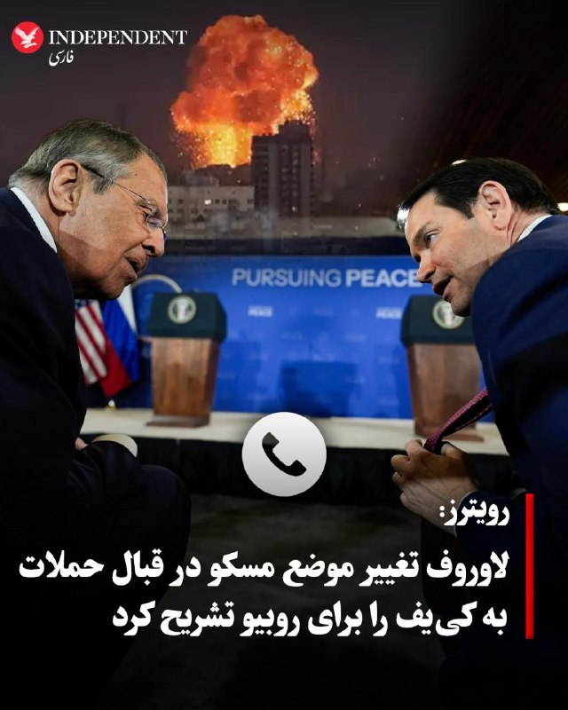

# خواننده تلگرام

<!-- TOP_NAV START -->

<a href="https://github.com/ProAlit/aio-downloader/blob/main/telegram/content/archive_1.md" style="display:inline-block; padding:6px 12px; margin:0 4px; background-color:#2ea44f; color:white; text-decoration:none; border-radius:4px; font-weight:bold;">صفحه بعد</a>

<!-- TOP_NAV END -->

<!-- MSG START -->

---
📅 بروزرسانی: 1405/03/05 16:44
---

## VahidOOnLine — post 242283

  

♦️براساس گزارش خبرگزاری رویترز به نقل از رسانه «ریا نووستی»، سرگی ریابکوف، معاون وزیر امور خارجه روسیه، اعلام کرد که سرگی لاوروف در جریان گفتگوی تلفنی روز دوشنبه خود با مارکو روبیو، همتای آمریکایی‌اش، دلایل تغییر موضع مسکو در قبال حملات به کی‌یف را تشریح کرده است؛ این اقدام پس از آن صورت گرفت که روسیه اعلام کرد در پاسخ به حمله پهپادی تعمدی اوکراین به یک خوابگاه دانشجویی در لوهانسک تحت کنترل روسیه که دست‌کم ۲۱ کشته برجای گذاشت، قصد دارد حملات سیستماتیکی را علیه اهداف مرتبط با ارتش اوکراین و مراکز تصمیم‌گیری در کی‌یف آغاز کند.
‌🇸🇦 Indypersian

🤖 @VahidOOnLine

## WithYashar — post 12558

  

به گزارش نت بلاکس، بعد از 88 روز و 2093ساعت خاموشی تمام عیار اینترنت، همکنون نزدیک به 35% اینترنت ایران وصل شده.
@withyashar

## FoxNewsTwitter — post 342262

  <a href="telegram/content/FoxNewsTwitter_342262_1779801243.mp4" target="_blank">🎬 Download video</a>

Fox News (Twitter/X)

Radical Senate candidate Graham Platner railed against CEOs and tried to win over working class voters while rallying with Bernie Sanders during the Vermont senator's "Fighting Oligarchy Tour."

Platner took aim at wealthy Americans as well as those he says are part of the "Epstein class."

“I believe that we should not be settling for scraps that they throw to us from the table, where they are dining with the Epstein class.”

“I believe that in our country, the voices of working people are far more important than the voices of those who merely have money.”

## FoxNewsTwitter — post 342261

  

Fox News (Twitter/X)

NBA star Kyle Kuzma reveals his massive bet on Spencer Pratt to be the next mayor of Los Angeles.

The former Lakers champion revealed he placed a $36,000 bet on the longtime reality TV star to win the Los Angeles mayoral race — a wager that could result in a whopping payout of more than $130,000.

Kuzma defended his support on social media, saying “LA has been cooked since Covid,” as Pratt continues to build momentum with outsider-style attacks on crime, homelessness and city leadership.

## pm_afshaa — post 91539

نت بلاکس:34 درصد مردم به اینترنت دسترسی پیدا کردن

💧 Rainbet.com the #1 Non-KYC Crypto Casino & Sportsbook @rainbetcom

😁 @Pm_Afshaa

## DEJradio — post 4985

⭕️ ترامپ با انتشار مطلبی بر صلح از مسیر قدرت تأکید کرد

دونالد ترامپ، رئیس‌ جمهوری آمریکا روز سه‌شنبه در شبکۀ تروث‌سوشال تصویری از خود را با شعار «صلح از راه قدرت» منتشر کرد.
سیاست صلح از راه قدرت، یک دکترین‌ اصلی در دولت ترامپ در قبال جمهوری اسلامی به شمار می‌رود.
بر اساس این رویکرد، دولت آمریکا برای رسیدن به صلح، توان نظامی جمهوری اسلامی در حوزه‌های موشکی، دریایی و هسته‌ای را تضعیف می‌کند.
ترامپ پیش‌تر اعلام کرده واشنگتن یا به یک توافق بزرگ و معنادار با تهران دست می‌یابد، یا هیچ توافقی در کار نیست.

#خبر #دز #ترامپ
@DEJradio

## kianmeli1 — post 87684

  

🔴بعد از ۸۸ روز و حدود ۲۰۹۳ ساعت قطعی و انزوای شدید از اینترنت جهانی، اتصال اینترنت در ایران تا حدی برگشته
- ولی هنوز معلوم نیست این وضعیت پایدار بمونه یا نه
https://t.me/kianmeli1

## kianmeli1 — post 87682

  <a href="telegram/content/kianmeli1_87682_1779801246.mp4" target="_blank">🎬 Download video</a>

🔴جان‌باختن علیرضا بیرانوند در بازداشت؛ ابهام در علت مرگ شاعر معترض اهل ایذه

#علیرضا_بیرانوند، شاعر معترض و فعال فرهنگی ۲۵ ساله اهل ایذه، در تاریخ ۱۵ اردیبهشت ۱۴۰۵ در تهران بازداشت شد و بنا بر گزارش‌های منتشرشده، در دوران بازداشت جان باخته است.
نهادهای رسمی علت مرگ او را «مسمومیت» اعلام کرده‌اند، اما فعالان مدنی و منابع مستقل، نسبت به این روایت ابراز تردید کرده و مرگ او را مشکوک و مرتبط با رفتار نهادهای امنیتی می‌دانند.
علیرضا بیرانوند پیش‌تر نیز در جریان اعتراضات سال‌های ۱۳۹۶ و ۱۴۰۱ سابقه بازداشت داشته و به‌عنوان شاعری معترض و فعال فرهنگی شناخته می‌شد.
ابهام در روند بازداشت، نحوه جان‌باختن و نبود شفافیت درباره جزئیات این پرونده، نگرانی‌ها و پرسش‌های بسیاری را در افکار عمومی ایجاد کرده است.

 🎥 ویدیو: گوشه‌ای از مراسم خاکسپاری زندانی #علیرضا_بیرانوند

همسر او، لیلا فتحی، که او هم از شاعران جوان ایذه است، ضمن انتشار این ویدئو نوشته: علیرضا هنوز باور نکردم...
 https://t.me/kianmeli1

## kianmeli1 — post 87681

  

🔴ایران پس از ماه‌ها محدودیت شدید و قطعی اینترنت، دسترسی به اینترنت بین‌المللی را برای مشاغل و کاربران خانگی وای‌فای برقرار کرد.
https://t.me/kianmeli1

## IranIntlTV — post 339101

  <a href="telegram/content/IranIntlTV_339101_1779801249.mp4" target="_blank">🎬 Download video</a>

پس از اعلام خبر صدور حکم اعدام برای چهار متهم پرونده اکباتان توسط دادگاه انقلاب تهران، موجی از واکنش‌ها در شبکه‌های اجتماعی شکل گرفته است. کاربران با اشاره به تناقض در احکام و تغییرات اخیر در روند رسیدگی، درباره شدت برخوردهای قضایی در این پرونده ابراز نگرانی کردند.
آیه دریس، عضو تحریریه ایران‌اینترنشنال، به واکنش کاربران می‌پردازد
@iranintltv

## Shin_Persian — post 6242

↩️ Quoted tweet: Shin ✓ @hey_itsmyturn Wed, 11 Mar 2026 18:40:56 UTC If you're out of Iran you may easily install @PsiphonConduit and provide uncensored internet to Iranian people. It's easily installable on your phone, computer and server. Please do. …

## Shin_Persian — post 6241

↩️ Quoted tweet:
Shin ✓ @hey_itsmyturn
Wed, 11 Mar 2026 18:40:56 UTC

If you're out of Iran you may easily install @PsiphonConduit and provide uncensored internet to Iranian people. It's easily installable on your phone, computer and server.
Please do.
https://conduit.psiphon.ca/en/
Windows:
https://apps.microsoft.com/detail/9p89sj33m3jp?utm_source=conduit_site&hl=en-US&gl=TR
Android:
https://play.google.com/store/apps/details?id=ca.psiphon.conduit
MacOS:

↩️ توییت نقل‌قول شده — برای پاسخ، پست زیر را ببینید.

فارسی

اگر خارج از ایران هستید، می‌توانید به راحتی @PsiphonConduit را نصب کرده و اینترنت بدون سانسور را در اختیار مردم ایران قرار دهید. این برنامه به سادگی بر روی گوشی، کامپیوتر و سرور شما قابل نصب است.
لطفاً این کار را انجام دهید.
https://conduit.psiphon.ca/en/
ویندوز:
https://apps.microsoft.com/detail/9p89sj33m3jp?utm_source=conduit_site&hl=en-US&gl=TR
اندروید:
https://play.google.com/store/apps/details?id=ca.psiphon.conduit
مک‌بوک:

𝕏 · @shin_persian

## Shin_Persian — post 6240

  

NetBlocks ✓ @netblocks Tue, 26 May 2026 12:54:34 UTC 📈 Confirmed: Live metrics show a partial restoration to internet connectivity in #Iran on day 88, after 2093 hours of near-total isolation from international networks, the longest nationwide internet shutdown…

## Shin_Persian — post 6239

NetBlocks ✓ @netblocks
Tue, 26 May 2026 12:54:34 UTC

📈 Confirmed: Live metrics show a partial restoration to internet connectivity in #Iran on day 88, after 2093 hours of near-total isolation from international networks, the longest nationwide internet shutdown in modern history. It is unclear if the restoration will be sustained.

فارسی

📈 تایید شد: معیارهای لحظه‌ای نشان می‌دهند که در روز ۸۸ام، پس از ۲۰۹۳ ساعت انزوای تقریباً کامل از شبکه‌های بین‌المللی، اتصال به اینترنت در #ایران به طور جزئی برقرار شده است؛ این طولانی‌ترین قطعی سراسری اینترنت در تاریخ مدرن است. هنوز مشخص نیست که آیا این برقراری اتصال پایدار خواهد بود یا خیر.

𝕏 · @shin_persian

## Persian_Trend_Official — post 15077

  <a href="telegram/content/Persian_Trend_Official_15077_1779801251.webm" target="_blank">🎬 Download video</a>

💢 نت‌بلاکس تأیید کرد که اینترنت ایران به حدود ۳۴٪ اتصال بازگشته است.

▪️این در روز ۸۸ پس از ۲۰۹۳ ساعت انزوای تقریباً کامل جهانی رخ داده و طولانی‌ترین قطعی سراسری اینترنت در تاریخ مدرن به شمار می‌رود.

🫆:Tony

📌 @persian_trend_official
پرشین ترند | متفاوت‌ترین کانال نظامی

## RadioFarda — post 157575

  

🔸نهاد پایش وضعیت اینترنت در جهان،نت‌بلاکس، اعلام کرد داده‌های زنده شبکه نشان می‌دهد بخشی از دسترسی به اینترنت در ایران در هشتاد و هشتمین روز قطع گسترده و نزدیک به «انزوای کامل» از شبکه جهانی، دوباره برقرار شده است.

🔸نت‌بلاکس در شبکه ایکس نوشت این اختلال که بیش از ۲۰۹۳ ساعت ادامه داشت، طولانی‌ترین قطع سراسری اینترنت در تاریخ مدرن است.

🔸این نهاد همچنین اعلام کرد هنوز مشخص نیست بازگشت دسترسی به اینترنت پایدار خواهد ماند یا نه.

🔸 مقام‌های دولت مسعود پزشکیان از آغاز روند اتصال کامل به اینترنت تا ۲۴ ساعت آینده خبر داده‌اند با این حال دیوان عدالت اداری اعلام کرد دستور توقف اجرای مصوبه تشکیل «ستاد ویژه ساماندهی و راهبری فضای مجازی کشور» را صادر کرده است.

🔸اینترنت در ایران، به‌رغم سانسور و اعمال فیلترینگ گسترده، از نهم اسفند پارسال همزمان با شروع جنگ آمریکا و اسرائیل با ایران و به بهانهٔ آن به‌طور کامل قطع شد.

@RadioFarda

## IranianMinds — post 20812

  

🔴 نت بلاکس:

ُسطح دسترسی به اینترنت در ایران در حال افزایش هست.

@IranianMinds

## Dirty_Kids — post 390233

🔴 اینترنت دیتاسنترها در حال باز شدنه
نت بلاکس هم تایید کرده

@Dirty_Kids 👻

## Dirty_Kids — post 390232

  <a href="telegram/content/Dirty_Kids_390232_1779801253.mp4" target="_blank">🎬 Download video</a>

وضعیت بله، روبیکا و vpn فروشا:

@Dirty_Kids 👻

## Dirty_Kids — post 390231

  

طبق تحقیقات جدید، اسپنک زدن به پارتنرتون می‌تونه باعث افزایش آرامش، شادی و کاهش استرس بشه 
🍑

@Dirty_Kids 👻

## Dirty_Kids — post 390230

  <a href="telegram/content/Dirty_Kids_390230_1779801254.mp4" target="_blank">🎬 Download video</a>

این میزان شادی دیگه یکم زیاده روی نیست تو این وضعیت!؟

@Dirty_Kids 👻

## Dirty_Kids — post 390229

  <a href="telegram/content/Dirty_Kids_390229_1779801255.webm" target="_blank">🎬 Download video</a>

🔴 «جیمیل | Gmail» 
🔍 روی اکثر اینترنتا در دسترس قرار گرفته.

گوگل پلی
🕹 هم روی بعضی مودم‌های خونگی در دسترس قرار گرفته و بدون فیلترشکن بالا میاد.

@Dirty_Kids 👻

## alonews — post 122813

  <a href="telegram/content/alonews_122813_1779801256.webm" target="_blank">🎬 Download video</a>

👈فعلا پروکسیا و یک سری VPN ها روی مخابرات،شاتل و بقیه مودم ها وصل شدند،نت موبایل هنوز باز نشده

✅ @AloNews خبر جنگ

## alonews — post 122812

  <a href="telegram/content/alonews_122812_1779801256.webm" target="_blank">🎬 Download video</a>

👈وضعیت کسب و کارهای اینترنتی بعد وصل شدن اینترنت

✅ @AloNews خبر جنگ

## alonews — post 122811

  <a href="telegram/content/alonews_122811_1779801256.webm" target="_blank">🎬 Download video</a>

👈تکلیف اونایی که پرو خریدن چی میشه؟

✅ @AloNews خبر جنگ

## alonews — post 122810

  <a href="telegram/content/alonews_122810_1779801256.webm" target="_blank">🎬 Download video</a>

👈بعد از ۸۸ روز و حدود ۲۰۹۳ ساعت قطعی و انزوای شدید از اینترنت جهانی، اتصال اینترنت تو ایران تا حدی برگشته
- ولی هنوز معلوم نیست این وضعیت پایدار بمونه یا نه

✅ @AloNews خبر جنگ

---
📅 بروزرسانی: 1405/03/05 16:33
---

## VahidOOnLine — post 242282

  

محمود نبویان، عضو کمیسیون امنیت ملی مجلس در شبکه ایکس نوشت: «توافقی که بازگشایی تنگه هرمز در ازای لغو محاصره بدون اعمال حاکمیت جمهوری اسلامی و اخذ عوارض، عدم تعیین غرامت، ابهام در لغو تحریم‌ها و… باشد، خلاف منافع ملی، عبور از شروط رهبری، بیانیه شعام و خسارت محض است.»

او پیش‌تر نیز گفته بود: «با وجود سابقه بدعهدی آمریکا و به ویژه حضور اصحاب توافق ذلت‌بار برجام به‌همراه قالیباف در مذاکرات، هیچ امیدی به مذاکره و توافق مطلوب برای جمهوری اسلامی وجود ندارد.»
‌🏁 🇬🇧 IranintlTV

🤖 @VahidOOnLine

## VahidOOnLine — post 242281

  

♦️مجید ابن‌الرضا، سرپرست وزارت دفاع، روز سه‌شنبه با اشاره به اینکه «شگفتانه‌های» جمهوری اسلامی در حوزه تکنیک و تاکتیک در «جنگ رمضان» ارتقا یافته‌تر از جنگ قبلی بود، گفت: «تعداد پرنده‌هایی که در جنگ ۱۲ روزه هدف قرار دادیم کمتر از انگشتان دست بود، اما در جنگ رمضان به فناوری دست پیدا کردیم که حدود ۲۱۰ پرنده دشمن را هدف قرار دادیم».
‌🇸🇦 Indypersian

🤖 @VahidOOnLine

## WithYashar — post 12557

وال استریت ژورنال: قالیباف برای گفتگو درباره پایان جنگ برای دومین روز متوالی در قطر مانده

وال استریت ژورنال مدعی شد مقامات ایرانی و میانجی‌گران عرب گفتند: «محمدباقر قالیباف» برای دومین روز متوالی در قطر مانده است تا درباره توافق پایان جنگ گفتگو کند.
@withyashar

## WithYashar — post 12556

  <a href="telegram/content/WithYashar_12556_1779800611.mp4" target="_blank">🎬 Download video</a>

بنیامین نتانیاهو ساعتی پیش تو مقر کریا با وزیر جنگ اسرائیل و رئیس ستاد ارتش جلسه امنیتی برگزار کرد
@withyashar

## DEJradio — post 4984

  <a href="telegram/content/DEJradio_4984_1779800612.webm" target="_blank">🎬 Download video</a>

🔺📢 زمان، برگ برنده آمریکا در برابر ایران؛

کارشناس: روح‌الله رحیم‌پور، تحلیلگر سیاسی

#جنگ #مذاکرات
@DEJradio

## IranIntlTV — post 339100

  <a href="telegram/content/IranIntlTV_339100_1779800613.mp4" target="_blank">🎬 Download video</a>

یک شهروند با ارسال پیام به ایران‌اینترنشنال می‌گوید: «چه با کمک، چه بی‌کمک آمریکا و اسرائیل، جمهوری آدمکش و ننگین اسلامی باید سرنگون شود. ما باید امید را در خودمان زنده نگه داریم، به خودمان باور داشته باشیم و منتظر فراخوان باشیم.»

## IranIntlTV — post 339099

  <a href="telegram/content/IranIntlTV_339099_1779800615.mp4" target="_blank">🎬 Download video</a>

در حالی که آمار رسمی از تورم سه‌رقمی خوراکی‌ها و تشدید بحران معیشتی خبر می‌دهد، مسعود پزشکیان در نشست با مدیران صداوسیما با دفاع از سیاست دولت گفت در صورت عدم حذف ارز ترجیحی، کشور با کمبود و قحطی کالاهای اساسی روبه‌رو می‌شد.
ارزیابی آرش آزرمی، دبیر بخش اقتصادی ایران‌اینترنشنال
@iranintltv

## IranIntlTV — post 339098

  

محمود نبویان، عضو کمیسیون امنیت ملی مجلس در شبکه ایکس نوشت: «توافقی که بازگشایی تنگه هرمز در ازای لغو محاصره بدون اعمال حاکمیت جمهوری اسلامی و اخذ عوارض، عدم تعیین غرامت، ابهام در لغو تحریم‌ها و… باشد، خلاف منافع ملی، عبور از شروط رهبری، بیانیه شعام و خسارت محض است.»

او پیش‌تر نیز گفته بود: «با وجود سابقه بدعهدی آمریکا و به ویژه حضور اصحاب توافق ذلت‌بار برجام به‌همراه قالیباف در مذاکرات، هیچ امیدی به مذاکره و توافق مطلوب برای جمهوری اسلامی وجود ندارد.»
https://iranintl.com/202605266092

## FarsiVOA — post 218702

  

مارکو روبیو، وزیر امور خارجه ایالات متحده، خواستار بازگشایی تنگه هرمز شد و به رژیم ایران هشدار داد که اگر از این خواسته سرپیچی کند، تنگه «به هر طریق ممکن» باز خواهد شد.
آقای روبیو که برای شرکت در مجمع چهارجانبه امنیتی به دهلی‌نو رفته است در هواپیما به خبرنگاران گفت: «تنگه‌ها باید باز باشند. آن‌ها به هر طریق ممکن باز خواهند شد... آنچه در آنجا اتفاق می‌افتد غیرقانونی است؛ این کار غیرقانونی و برای جهان ناپایدار و غیرقابل‌پذیرش است.»

## Persian_Trend_Official — post 15076

  <a href="telegram/content/Persian_Trend_Official_15076_1779800617.mp4" target="_blank">🎬 Download video</a>

💢وضعیت فروشنده های کانفیگ هم اکنون...

🫆:Tony

📌 @persian_trend_official
پرشین ترند | متفاوت‌ترین کانال نظامی

## BBCPersian — post 282108

🔻آغاز مناسک حج با حضور بیش از ۱/۵ میلیون زائر خارجی علی‌رغم بیم از جنگ ایران

🖌دیوید گریتن, بی‌بی‌سی

مسلمانان در حالی مناسک حج سالانه را در عربستان سعودی آغاز کرده‌اند که منطقه عمیقا تحت تاثیر جنگ ایران است.

مقامات سعودی هفته گذشته اعلام کردند که حدود یک میلیون و ۵۱۰ هزار زائر از خارج وارد این کشور شده‌اند.

https://bbc.in/4v9L0Bw
@BBCPersian

## BBCPersian — post 282106

🔻دیوان عدالت اداری در ایران دستوری صادر کرده است که بر اساس آن، ابلاغیه رئیس‌جمهور ایران برای اتصال مجدد اینترنت فعلا غیرقابل اجرا می‌شود.

دیوان عدالت اداری در دستور موقت خود، تشکیل «ستاد ویژه ساماندهی و راهبری فضای مجازی کشور» را غیرقانونی ارزیابی کرده و گفته است تا زمان بررسی نهایی موضوع، دستورات و تصمیم‌های این ستاد نیز قابل اجرا نیست.

دیوان عدالت اداری از مراجع قضایی در ایران است که افراد می توانند از تصمیم‌های دولت یا ماموران دولتی به آنجا شکایت کنند.

مسعود پزشکیان، رئیس‌جمهور ایران، دیروز مصوبه این ستاد را برای اتصال مجدد اینترنت به وزارت ارتباطات ابلاغ کرد و سخنگوی دولت امروز، پیش از دستور دیوان عدالت اداری، وعده داده بود که این مصوبه به‌زودی اجرا می‌شود.

اینترنت ایران که در دی‌ و در جریان سرکوب خونین اعتراضات قطع شد، از نهم اسفند (۲۸ فوریه) و همزمان با حملات اسرائیل و آمریکا دوباره قطع شده که تاکنون ادامه دارد.

📸 Getty

https://bbc.in/4u071Sq
@BBCPersian

## alonews — post 122809

  <a href="telegram/content/alonews_122809_1779800619.webm" target="_blank">🎬 Download video</a>

👈 ادعای وزیر دارایی اسرائیل: ما در حال تغییر خاورمیانه هستیم

🔴 ایران امروز بسیار ضعیف‌تر است، حتی اگر هنوز فرو نپاشیده باشد

🔴این هم هدفی است که با کمک خدا به آن خواهیم رسید.

🔴 نگاهی به وضعیت غزه بیندازید. نگاهی به وضعیت لبنان بیندازید.

🔴 ما کاملاً معادلات را تغییر می‌دهیم.

✅ @AloNews خبر جنگ

## alonews — post 122808

  <a href="telegram/content/alonews_122808_1779800619.webm" target="_blank">🎬 Download video</a>

👈وال استریت ژورنال: قالیباف برای گفتگو درباره پایان جنگ برای دومین روز متوالی در قطر مانده

🔴وال استریت ژورنال مدعی شد مقامات ایرانی و میانجی‌گران عرب گفتند: «محمدباقر قالیباف» برای دومین روز متوالی در قطر مانده است تا درباره توافق پایان جنگ گفتگو کند.

✅ @AloNews خبر جنگ

## alonews — post 122807

  <a href="telegram/content/alonews_122807_1779800619.webm" target="_blank">🎬 Download video</a>

🔴فوری / گزارش ها از زلزله در مشهد

✅ @AloNews خبر جنگ

## alonews — post 122806

  

🔹دور زدن نت ملی با God Vpn🔹
اکانت Vpn پر سرعت مخصوص نت ملی با قیمت مناسب

تخفیف ویژه برای امشب
هر گیگ فقط و فقط 115 هزار تومن😍😍😍

برای نمایندگان فقط گیگی 85 هزار تومن😍😍

قیمت در حالت عادی هر گیگ 190 هزار تومن❌

✅تضمین بدون قطعی
🌐 اتصال با تمامی دستگاه
🔻🏪پشتیبانی ۲۴ ساعته
✔️ دور زدن نت ملی
🔘 بالاترین سرعت با تمام اپراتورها
⭐با کیفیت عالی و ضمانت بازگشت وجه
🌐🌐🌐🌐🌐🌐⭐️
➖➖➖➖➖➖➖➖➖➖
ربات تلگرام جهت خرید لحظه ای:
@GodVpnV2_Bot
ایدی کانال:
t.me/God_of_Vpn
پشتیبانی و خرید عمده:
@Pc_V2ray
@Mmkhh00

---
📅 بروزرسانی: 1405/03/05 16:23
---

## VahidOOnLine — post 242280

  

♦️خبرگزاری‌های جمهوری اسلامی به نقل از سازمان هواپیمایی کشوری گزارش دادند که فرودگاه بین‌المللی «بهشتی» اصفهان پس از ۸۴ روز توقف فعالیت، دوباره بازگشایی شده است.

بر اساس این گزارش، نخستین پرواز در مسیر اهواز ـ اصفهان ـ اهواز روز سه‌شنبه پنجم خرداد انجام شد و پروازها فعلا از طلوع تا غروب آفتاب برقرار خواهد بود.

سازمان هواپیمایی کشوری همچنین اعلام کرد فرودگاه‌های اردبیل و لامرد نیز در چارچوب بازگشایی تدریجی فضای هوایی کشور دوباره فعال شده‌اند.

حریم هوایی ایران از ۹ اسفندماه و همزمان با حملات اسرائیل و آمریکا به ایران بسته شده بود و پروازهای داخلی و بین‌المللی متوقف شده بودند.
‌🇸🇦 Indypersian

🤖 @VahidOOnLine

## VahidOOnLine — post 242279

  

سازمان عملیات تجارت دریایی بریتانیا اعلام کرد گزارشی از وقوع حادثه‌ای در فاصله ۶۰ مایل دریایی از مسقط عمان دریافت کرده است.

به گفته این نهاد، یک نفتکش از وقوع انفجاری خارجی در سمت چپ عقب کشتی و نزدیک خط آب خبر داده.

خدمه و کشتی سالم هستند، اما مقداری سوخت به دریا نشت کرده است.
‌🏁 🇬🇧 IranintlTV

🤖 @VahidOOnLine

## VahidOOnLine — post 242278

  

حساب اینستاگرام نسیم غلامی سیمیاری، زندانی سیاسی محبوس در زندان اوین و از بازداشت‌شدگان اعتراضات «زن، زندگی، آزادی»، اعلام کرد او به دلیل «هم‌کلام شدن» با لیندزی فورمن، شهروند بریتانیایی زندانی در اوین، به مدت یک هفته از حق تماس تلفنی محروم شده است.

بر اساس این گزارش، مسئولان زندان پیش‌تر نیز به سیمیاری گفته بودند به دلیل «پوشیدن شلوارک» در داخل بند زنان اوین، در این هفته از حق ملاقات محروم خواهد بود.

در این مطلب آمده است علاوه بر سیمیاری، گلرخ ایرایی، زهرا صفایی، مرضیه فارسی، شیوا اسماعیلی و سکینه پروانه، پنج زن زندانی سیاسی دیگر در بند زنان اوین نیز به دلیل شرکت در مراسمی در اعتراض به اعدام‌ها، از حق تماس تلفنی و ملاقات با خانواده‌هایشان محروم شده‌اند.
‌🏁 🇬🇧 IranintlTV

🤖 @VahidOOnLine

## VahidOOnLine — post 242277

  

♦️همزمان با اعلام دیوان عدالت اداری مبنی بر صدور دستور توقف بازگشت اینترنت، ایسنا به نقل از «یک منبع مطلع»، روز سه‌شنبه، پنجم خردادماه، گزارش داد که با صدور دستور اتصال اینترنت از وزیر ارتباطات و فناوری اطلاعات فرآیند اتصال در حال انجام است و طی ۲۴ ساعت این امکان برای همه فراهم خواهد شد. این درحالی اتفاق افتاد که تنها یک روز پس از مصوبه «ستاد ویژه ساماندهی فضای مجازی» برای «بازگشت اینترنت به وضعیت پیش از دی‌ماه ۱۴۰۴»، دیوان عدالت اداری با صدور دستور موقت، «اجرای مصوبه ایجاد ستاد ویژه ساماندهی فضای مجاری» را متوقف و مصوبات این ستاد را تا زمان رسیدگی نهایی، غیرقابل اجرا اعلام کرد.
همزمان، انتخاب نوشت که کامیار ثقفی، رضا تقی پور، رسول جلیلی و محمد حسن انتظاری تحت راهبری یک مقام ابقا شده دولت ابراهیم رئیسی، «شاکی قضایی» اتصال اینترنت بین‌الملل هستند.
ایران از زمان آغاز جنگ در نهم اسفند، به مدت ۸۸ روز، در خاموشی دیجیتال به سر می‌برد.
‌🇸🇦 Indypersian

🤖 @VahidOOnLine

## VahidOOnLine — post 242276

  

علی‌اکبر صالحی، رییس پیشین سازمان انرژی اتمی جمهوری اسلامی گفت: «این یک واقعیت است که ما درون‌گرا و منزوی شدیم و تکلیف روابط بین‌الملل ما روشن نیست. خیلی از مشکلات ما ناشی از همین مسئله است، بنابراین باید از این هاله‌ای که برای خودمان ایجاد کردیم خارج بشویم و تکثرگرایی در داخل کشور را بسط دهیم.»

او ادامه داد: «نظام جمهوری اسلامی بیشتر میل به درون‌گرایی و دوری از تکثرگرایی در داخل داشته که امیدوارم با این اتفاقاتی که افتاده و به خصوص تحولات این دو سه‌ساله اخیر و حوادثی که رخ داده، این تمایل اصلاح بشود و به سمت اصلاح روابط بین‌الملل و خروج از انزوا برویم.»
‌🏁 🇬🇧 IranintlTV

🤖 @VahidOOnLine

## VahidOOnLine — post 242275

  

♦️خبرگزاری فارس، رسانه وابسته به سپاه، روز سه‌شنبه پنجم خردادماه به نقل از منبعی نزدیک به تیم مذاکره‌کننده جمهوری اسلامی گزارش داد که آخرین اختلاف جدی میان تهران و واشنگتن بر سر نحوه دسترسی به منابع مسدودشده ایران بوده است.

این منبع گفت جمهوری اسلامی به طرف آمریکایی اعلام کرده «تا زمانی که پول‌های مورد توافق واریز نشده باشد، هیچ مذاکره و توافقی امکان‌پذیر نیست».

بر اساس این گزارش، اختلاف بر سر این موضوع با میانجیگری قطر در حال برطرف‌ شدن است. فارس نوشت آمریکا پیش‌تر در اجرای تعهدات خود عقب‌نشینی کرده بود، اما پس از رایزنی‌ها در دوحه، پیشرفت‌هایی برای حل این اختلاف حاصل شده است.

این منبع همچنین تاکید کرد تیم مذاکره‌کننده جمهوری اسلامی با توجه به سابقه عهدشکنی آمریکا، تفاهمات کنونی را نهایی تلقی نمی‌کند و برای همه گزینه‌های محتمل آماده است.
‌🇸🇦 Indypersian

🤖 @VahidOOnLine

## VahidOOnLine — post 242274

  

مسعود پزشکیان، رییس دولت گفت که امروز باید شعار «بزن که خوب می‌زنی» در خیابان‌ها به شعار «بساز که خوب می‌سازی» تبدیل شود.

او افزود: «دولت به‌تنهایی قادر به حل همه مشکلات نیست، اما با همراهی مردم، عبور از شرایط دشوار امکان‌پذیر خواهد بود.»
iranintl
‌🏁 🇬🇧 IranintlTV

🤖 @VahidOOnLine

## VahidOOnLine — post 242273

  

مجید ابن‌الرضا، سرپرست وزارت دفاع، گفت که جمهوری اسلامی در جریان جنگ با آمریکا و اسرائیل، به فناوری‌ای دست یافته که امکان هدف قرار دادن ۲۱۰ «پرنده دشمن» را فراهم کرده است.

او افزود: «شگفتانه‌های ما در حوزه تکنیک و تاکتیک در جنگ اخیر به مراتب ارتقا یافته‌تر از جنگ قبلی بود.»

او ادامه داد: «تعداد پرنده‌هایی که در جنگ ۱۲ روزه هدف قرار دادیم کمتر از انگشتان دست بود، اما در جنگ اخیر این تعداد به ۲۱۰ پرنده رسید.»
iranintl
‌🏁 🇬🇧 IranintlTV

🤖 @VahidOOnLine

## VahidOOnLine — post 242272

  <a href="telegram/content/VahidOOnLine_242272_1779800025.mp4" target="_blank">🎬 Download video</a>

سپهر موسوی‌، جوان ۱۸ ساله ساکن فولادشهر، شامگاه ۱۹ دی‌ماه ۱۴۰۴ در این شهر هدف تیراندازی ماموران جمهوری اسلامی قرار گرفت و سپس با شلیک تیر خلاص کشته شد.
‌🏁 🇬🇧 IranintlTV

🤖 @VahidOOnLine

## VahidOOnLine — post 242271

  

♦️وزارت امور خارجه جمهوری اسلامی روز سه‌شنبه پنجم خردادماه با انتشار بیانیه‌ای ارتش آمریکا را به نقض آتش‌بس متهم کرد و هشدار داد که نیروهای مسلح «هیچ شرارتی را بی‌پاسخ نخواهند گذاشت.»

این بیانیه ساعاتی پس از آن منتشر شد که سنتکام اعلام کرد محل‌های پرتاب موشک و قایق‌هایی که تلاش می‌کردند مین‌گذاری کنند را در منطقه خلیج فارس هدف قرار داده است.

در بیانیه وزارت امور خارجه جمهوری اسلامی ارتش آمریکا «به نقض فاحش آتش‌بس در منطقه هرمزگان متهم شده و آمده است: «ارتکاب این اقدامات، تجاوزکارانه همزمان با روند دیپلماتیک جاری به میانجیگری، پاکستان بار دیگر بدسگالی و بدعهدی هیات حاکمه آمریکا را برای ملت، ایران مردمان منطقه و جامعه جهانی عیان کرد و نشان داد که رویکرد اصولی ملت ایران در هر سه عرصه، میدان، خیابان و دیپلماسی، مبنی بر سوء ظن عمیق نسبت به رژیم آمریکا مبتنی بر منطق و فهمی عمیق از ماهیت و عملکرد کین‌توزانه و جنایتکارانه آن در قبال مردم ایران است.»

وزارت امور خارجه جمهوری اسلامی ایران در همین بیانیه حملات ۴۸ ساعت گذشته آمریکا را  «اقدامات تجاوزکارانه» و  «نقض آشکار بند ۴ ماده ۲ منشور ملل متحد و نیز آتش بس مورخ ۱۹ فروردین ماه ۱۴۰۵» توصیف کرد و نوشت: «مسئولیت همه پیامدهای مترتب بر این اقدامات تجاوزکارانه را متوجه رژیم آمریکا» می‌داند.

وزارت امور خارجه در پایان این بیانیه با هشدار به مقابله به مثل با حملات آمریکا آورده است: «بدون تردید جمهوری اسلامی ایران هیچ شرارتی را بی پاسخ نمی‌گذارد و در دفاع از کیان ایران کمترین تردیدی به خود راه نمی‌دهد.»
‌🇸🇦 Indypersian

🤖 @VahidOOnLine

## VahidOOnLine — post 242270

  

علی یزدی‌خواه، نماینده مجلس، گفت دونالد ترامپ «ثبات رفتاری» ندارد و مواضع او متناقض، هیجانی و بدون پشتوانه عقلی است.

او افزود رییس‌جمهوری آمریکا در ماه‌های اخیر بیشتر «آرزوهای خود» را از طریق شبکه‌های اجتماعی مطرح کرده است.

یزدی‌خواه همچنین گفت استفاده صلح‌آمیز از فناوری هسته‌ای حق همه کشورهاست و این حق را نمی‌توان از جمهوری اسلامی سلب کرد.
iranintl
‌🏁 🇬🇧 IranintlTV

🤖 @VahidOOnLine

## VahidOOnLine — post 242269

  

♦️روز سه‌شنبه پنجم خرداد و ساعاتی پس از آنکه سنتکام اعلام کرد محل‌های پرتاب موشک و قایق‌هایی که تلاش می‌کردند مین‌گذاری کنند را در منطقه خلیج فارس هدف قرار داده است، مائو نینگ، سخنگوی وزارت امور خارجه چین از تمام طرف‌های درگیر خواست تا به مفاد آتش‌بس پایبند باشند.

به گزارش خبرگزاری فرانسه، سخنگوی وزارت خارجه چین گفت: «از تمام طرف‌ها می‌خواهیم به تعهدات خود در قبال آتش‌بس کاملا پایبند باشند و اختلافاتشان را از راه‌های مسالمت‌آمیز حل کنند و به جستجوی راه‌حلی بر مبنای گفتگو و مذاکره ادامه دهند که نگرانی‌های مشروع همه طرف‌ها را پاسخ دهد و منجر به برقراری فوری صلح در خاورمیانه و خلیج فارس شود.»

صبح سه‌شنبه وزارت امور خارجه پاکستان هم با صدور بیانیه‌ای از حمایت جمهوری خلق چین از ابتکار عمل مشترک ۵ ماده‌ای اسلام‌آباد و پکن برای پایان جنگ در خاورمیانه استقبال کرد.
‌🇸🇦 Indypersian

🤖 @VahidOOnLine

## VahidOOnLine — post 242268

  

وزارت خارجه جمهوری اسلامی در بیانیه‌ای اعلام کرد که ارتش آمریکا با حمله به کشتی‌های تجاری ایران در ۴۸ ساعت گذشته، آتش‌بس را نقض کرده است.

در این بیانیه آمده این اقدام در حالی انجام شده که روند دیپلماتیک با میانجی‌گری پاکستان در جریان بوده و تهران آن را نشانه «بدعهدی» آمریکا می‌داند.

وزارت خارجه جمهوری اسلامی این اقدام را محکوم کرد و مسئولیت پیامدهای آن را متوجه آمریکا دانست و نوشت: «جمهوری اسلامی در دفاع از منافع خود تردید نخواهد کرد.»
‌🏁 🇬🇧 IranintlTV

🤖 @VahidOOnLine

## VahidOOnLine — post 242267

  <a href="telegram/content/VahidOOnLine_242267_1779800031.mp4" target="_blank">🎬 Download video</a>

ویدیوی رسیده به ایران‌اینترنشنال، کودکانی را با لباس ماموران سرکوبگر و باتون به دست نشان می‌دهد که در ایست و بازرسی بندرعباس حضور دارند.
‌🏁 🇬🇧 IranintlTV

🤖 @VahidOOnLine

## VahidOOnLine — post 242266

  

کارزار «سه‌شنبه‌های نه به اعدام» از ارگان‌های حقوق بشری بین‌المللی و «وجدان‌های بیدار» خواست با به‌کارگیری اقدامات موثر مانع تداوم اعدام‌ها شوند و در «تراژدی اعدام‌ها» کنار مردم ایران و خواست آنان برای آزادی، عدالت و لغو حکم اعدام بایستند.

این کارزار اعلام کرد زندانیان معترض به مجازات اعدام، سه‌شنبه پنجم خرداد برای صدوبیست‌ودومین هفته متوالی در ۵۶ زندان ایران دست به اعتصاب غذا زدند.

کارزار «سه‌شنبه‌های نه به اعدام» با اشاره به موج تازه اعدام زندانیان سیاسی و تداوم اعتراض زندانیان، از جمله زنان زندانی در بند زنان اوین، اعلام کرد شماری از این زندانیان به دلیل اعتراض به اعدام‌ها از ملاقات و تماس تلفنی با خانواده محروم شده‌اند.

اعضای این کارزار تاکید کردند: «در کارزار سه‌شنبه‌های نه به اعدام نیز زنان مقاوم در زندان‌های مختلف همواره صدای آزادی و حق حیات سر داده‌اند. حکومت حتی نمی‌تواند صدای زنان را تحمل کند، چرا که زن‌ستیزی یکی از پایه‌های اصلی حاکمیت از روز اول است.»
‌🏁 🇬🇧 IranintlTV

🤖 @VahidOOnLine

## VahidOOnLine — post 242265

  

خبرگزاری رویترز گزارش داد پنتاگون که به‌دنبال کمک به شهروندان ایرانی برای دور زدن محدودیت‌های ارتباطی جمهوری اسلامی است، با اسپیس‌ایکس بر سر هزینه طرحی برای ارائه اتصال مستقیم تلفن همراه به شبکه استارلینک، مشابه خدمات نسل پنجم، نیز اختلاف پیدا کرده است.

بر اساس این گزارش، هم‌زمان با استفاده ارتش آمریکا از پهپادهای انتحاری هدایت‌شونده با شبکه استارلینک در جنگ با جمهوری اسلامی، مقام‌های اسپیس‌ایکس خواستار افزایش هزینه خدمات ماهواره‌ای ارائه‌شده به پنتاگون شدند.

مدیران اسپیس‌ایکس به مقام‌های پنتاگون گفته‌اند ارتش آمریکا برای هر ترمینال حدود پنج هزار دلار پرداخت می‌کند، در حالی که عملا از سطحی از خدمات استفاده می‌کند که ارزش آن نزدیک به ۲۵ هزار دلار است.

رویترز نوشت اختلاف بر سر استفاده از استارلینک در پهپادهای انتحاری «لوکاس»، بخشی از تنش‌های فزاینده میان پنتاگون و اسپیس‌ایکس بر سر قیمت‌گذاری خدمات استارلینک در ماه‌های اخیر بوده است.

پنتاگون در نهایت با افزایش قیمت پیشنهادی اسپیس‌ایکس موافقت کرد؛ اقدامی که تقریبا هزینه هر پهپاد لوکاس را دو برابر کرد.
‌🏁 🇬🇧 IranintlTV

🤖 @VahidOOnLine

## VahidOOnLine — post 242264

  

ایتامار بن‌گویر، وزیر امنیت داخلی اسرائیل، گفت: «اجازه نخواهیم داد ترامپ توافقی بد با جمهوری اسلامی امضا کند.»

بن‌گویر افزود: «با توجه به واکنش‌ها در سراسر جهان، می‌توانید یک چیز را درک کنید، اسرائیل دیگر کیسه بوکس خاورمیانه نیست و من به این افتخار می‌کنم.»
iranintl
‌🏁 🇬🇧 IranintlTV

🤖 @VahidOOnLine

## VahidOOnLine — post 242263

  <a href="telegram/content/VahidOOnLine_242263_1779800036.mp4" target="_blank">🎬 Download video</a>

♦️بیش از یک میلیون‌ و پانصد هزار زائر روز سه‌شنبه پنجم خردادماه در صحرای عرفات در عربستان سعودی گرد هم آمدند تا مهم‌ترین بخش مناسک حج را به‌جا آورند. وقوف در عرفات، اصلی‌ترین رکن حج و اوج این مراسم مذهبی به شمار می‌رود.

حج امسال،‌ در شرایطی برگزار می‌شود که منطقه خاورمیانه هنوز از سایه جنگ آمریکا و اسرائیل با جمهوری اسلامی خارج نشده است.
‌🇸🇦 Indypersian

🤖 @VahidOOnLine

## VahidOOnLine — post 242262

  

⭕️دیوان عدالت اداری مصوبات «ستاد ویژه ساماندهی فضای مجازی» را متوقف کرد؛ «اینترنت برنمی‌گردد»

♦️تنها یک روز پس از مصوبه «ستاد ویژه ساماندهی فضای مجازی» برای «بازگشت اینترنت به وضعیت پیش از دی‌ماه ۱۴۰۴»، دیوان عدالت اداری با صدور دستور موقت، «اجرای مصوبه ایجاد ستاد ویژه ساماندهی فضای مجاری» را متوقف و مصوبات این ستاد را تا زمان رسیدگی نهایی، غیرقابل اجرا اعلام کرد.

به این ترتیب اجرای مصوبه روز گذشته این نهاد برای بازگشت اینترنت، عملا منتفی است.

ایران از زمان آغاز جنگ در نهم اسفند در خاموشی دیجیتال به سر می‌برد.
‌🇸🇦 Indypersian

🤖 @VahidOOnLine

## VahidOOnLine — post 242261

  

⭕️دیوان عدالت اداری مصوبات «ستاد ویژه ساماندهی فضای مجازی» را متوقف کرد؛ «اینترنت برنمی‌گردد»

♦️تنها یک روز پس از مصوبه «ستاد ویژه ساماندهی فضای مجازی» برای «بازگشت اینترنت به وضعیت پیش از دی‌ماه ۱۴۰۴»، دیوان عدالت اداری با صدور دستور موقت، «اجرای مصوبه ایجاد ستاد ویژه ساماندهی فضای مجاری» را متوقف و مصوبات این ستاد را تا زمان رسیدگی نهایی، غیرقابل اجرا اعلام کرد.

به این ترتیب اجرای مصوبه روز گذشته این نهاد برای بازگشت اینترنت، عملا منتفی است.

ایران از زمان آغاز جنگ در نهم اسفند در خاموشی دیجیتال به سر می‌برد.
‌🇸🇦 Indypersian

🤖 @VahidOOnLine

## WithYashar — post 12555

  <a href="telegram/content/WithYashar_12555_1779800041.mp4" target="_blank">🎬 Download video</a>

اینو استوری‌کرده بودم دیروز خیلی درخواست بالا بود که چنلم بزارم ❤️‍🩹🙌🏾
@withyashar

## WithYashar — post 12554

## WithYashar — post 12553

## WithYashar — post 12552

## WithYashar — post 12551

مملکت دیونه خونس یکی پاشو میزاره رو شلنگ بعد اونیکی میکشه …
خواهیم دید چه خواهد شد

## WithYashar — post 12550

اینترنت بین الملل روی مخابرات کامل باز شده
@withyashar

## WithYashar — post 12549

سایت دولتی سیتنا هم که ا‌ول خبر وصل شدن اینترنت رو پخش کرده بود فیلتر شد.
@withyashar

## WithYashar — post 12548

️ایسنا خبری که مربوط به متصل شدن اینترنت بود رو پاک کرد
@withyashar

## WithYashar — post 12547

موشتبی خامنه‌ای : اسرائیل 15 سال آینده رو نخواهد دید!

غدّه‌ی سرطانی اسرائیل به مراحل پایانی عمرش نزدیک شده و به فضل الهی و طبق آینده‌نگری 10 سال قبل پدرم، 25 سال بعد از اون تاریخ رو نخواهد دید، ان‌شاءالله.
@withyashar 😂

## WithYashar — post 12546

وزارت خارجه در بیانیه ای گفت:
نقض آتش‌بس توسط آمریکا بی‌پاسخ نمی‌ماند.
@withyashar

## WithYashar — post 12545

  <a href="https://t.me/withyashar/12545" target="_blank">📎 Download file</a>

کتاب «زمان انتخاب» نوشته شاهزاده رضا پهلوی
این کتاب مصاحبه ای است که میشل تبمن با رضا پهلوی انجام داده، گفت و گویی است متفاوت، بدون تعارف و رودربایستی، و آگاهی رسان! در گفت و گوی مورد بحث، رضا پهلوی با نهایت صراحت پرسش های مطرح شده، پاسخ های مفصل و قاطع ارائه داده و اصول برنامه مبارزاتی و معیارهای استراتژیک خود را در مورد نظام حاکم بر ایران، وضعیت اپوزیسیون و بسیاری از مسائل منطقه و جهان، ارائه نموده است

🌐 @withyashar

🌐 instagram.com/yashar

## mwarmonitor — post 9740

📌روسیه می‌گوید لاوروف در یک تماس تلفنی با روبیو توضیح داده است که چه عواملی باعث شد روسیه تصمیم به حمله به کی‌یف بگیرد - خبرگزاری RIA

@mwarmonitor

## mwarmonitor — post 9739

🔴فاکس نیوز: مارکو روبیو، وزیر خارجه، از ایران خواسته تنگه هرمز را باز کند و به حکومت هشدار داده است که این تنگه «به هر شکل ممکن» باز خواهد شد، اگر از تبعیت خودداری کنند.

🔸این اظهارات در حالی مطرح می‌شود که تنش‌ها میان آمریکا و جمهوری اسلامی ایران پس از یک دور حملات «دفاعی» انجام‌شده توسط ایالات متحده افزایش یافته است:

🔸«این تنگه‌ها باید باز باشند. در هر صورت باز خواهند شد، یک‌جوری یا جور دیگر... آنچه آنجا در حال رخ دادن است غیرقانونی است — این برای جهان غیرقابل‌دوام و غیرقابل‌قبول است.»

@mwarmonitor

## mwarmonitor — post 9738

  

🔴سازمان UKMTO (مرکز عملیات تجارت دریایی بریتانیا) گزارشی درباره وقوع یک حادثه در ۶۰ مایل دریایی (NM) در شرق مسقط، عمان دریافت کرده است.
🔸ناخدای یک کشتی نفت‌کش، گزارشی از وقوع یک انفجار بیرونی در سمت چپ بخش عقب کشتی (Port side aft) و نزدیک به خط آب (waterline) داده است.
🔸خدمه و شناور در سلامت و امنیت هستند، اگرچه ناخدا گزارش داده است که مقداری از سوخت پشتیبان (bunker fuel) به داخل دریا نشت کرده است.
🔸مقامات در حال بررسی موضوع هستند.
به شناورها توصیه می‌شود که با احتیاط عبور کنند و هرگونه فعالیت مشکوک را به UKMTO گزارش دهند.

@mwarmonitor

## mwarmonitor — post 9737

  

🔴 وزارت خارجه: نقض آتش‌بس توسط آمریکا بی‌پاسخ نمی‌ماند.

@mwarmonitor

## mwarmonitor — post 9736

🔴 روسیه قانونی را تصویب کرده است که اجازه مصادره اموال شهروندانی را می‌دهد که از کشور فرار کرده‌اند.
🔸دوما (مجلس سفلی پارلمان روسیه) قانونی را تصویب کرده است که بر اساس آن، امکان توقیف اموال روس‌هایی که به دلیل ارتکاب «اقداماتی علیه منافع روسیه» کشور را ترک کرده‌اند، فراهم می‌شود.
🔹بر اساس این قانون جدید، شهروندان روسی که از شرکت‌کنندگان در «عملیات نظامی ویژه» (اصطلاح رسمی روسیه برای جنگ اوکراین) انتقاد یا آن‌ها را توهین کنند، «تروریسم یا نازیسم را توجیه کنند» یا در خارج از کشور از ارتش روسیه انتقاد کنند، ممکن است تمام اموالشان در داخل روسیه مصادره شود.

📝 حکومت‌ها چه از مسکو اداره شوند و چه از تهران، در یک اصل زرین با هم تفاهم دارند: «مال تو، مال من است؛ مخصوصاً اگر با من موافق نباشی.»
🔹واقعاً چه همخوانی شگفت‌انگیزی میان ریش و عمامه با کت‌وشلوار و چشم‌های آبی وجود دارد! انگار هر دو نسخه از یک نرم‌افزارِ «دگراندیش‌کشی» استفاده می‌کنند؛ فقط یکی با طعمِ چای قندپهلو و دیگری با چاشنیِ ودکا. دوما به وضوح ثابت کرد که ارتشِ سایبری و دادگاه‌های انقلاب، مرز جغرافیایی نمی‌شناسند. پیام این قانونِ جدید، کمدی‌ترین شکلِ تراژدی است: «اگر به جنگِ ما انتقاد کنی، ما خانه و زندگی‌ات را فتح می‌کنیم تا جبههٔ داخلی تقویت شود!»
🔸در دنیای این دو نُطفه شیطانی ، آزادیِ بیان یعنی آزادیِ سکوت، و حقِ مالکیت یعنی تا زمانی که برای ما دم تکان می‌دهی، می‌توانی در خانه‌ات بخوابی. لعنت به این نبوغ مشترک که در آن، فرار از وطن هم جرم است و سهمت از خاکِ پدری، فقط مصادرهٔ اموال!

@mwarmonitor

## mwarmonitor — post 9735

‌
🔴دیوان عدالت اداری دستور توقف مصوبهٔ ایجاد ستاد فضای مجازی را صادر کرد

🔹دیوان عدالت اداری اعلام کرد: در پی طرح شکایاتی دربارهٔ ابطال «سند ایجاد ستاد ویژه ساماندهی و راهبری فضای مجازی کشور» هیئت تخصصی صنایع و بازرگانی دیوان عدالت اداری با احراز ضرورت و فوریت موضوع، دستور توقف اجرای این مصوبه را تا زمان رسیدگی به شکایت صادر کرد.

🔹براساس اعلام دیوان عدالت اداری، هیئت تخصصی صنایع و بازرگانی این دیوان اجرای مصوبهٔ مربوط به ایجاد «ستاد ویژه ساماندهی و راهبری فضای مجازی کشور» را متوقف کرده و تا زمان رسیدگی به شکایت، مصوبات این ستاد غیرقابل اجرا خواهد بود. خبرگزاری فارس

📝 آدم دلش می‌خواهد از شدت خشم سر به دیوار بکوبد وقتی می‌بیند سرنوشت اینترنت و زندگی‌اش دستمایهٔ خیمه‌شب‌بازیِ یک مشت دُگمِ عقل‌باخته و بوروکراتِ آویزان شده است؛ بچه شیعه که هنرش فقط گره زدنِ معیشت مردم به کلاف سردرگمِ تصمیماتِ الاکلنگی و مضحک‌شان است! این حجم از بلاهتِ سیستماتیک و مسخره‌بازیِ نهادهای موازی، دیگر تهوع‌آور شده و فقط نشان از حقارتِ فکریِ جماعتی دارد که تمام توانشان، سوهان کشیدن روی اعصاب و روان یک ملت است

@mwarmonitor

## mwarmonitor — post 9734

🔴اختصاصی آکسیوس: ارتقای مقام مشاور روبیو به یک سمت ارشد امنیت ملی در کاخ سفید

🔰مایک نیدهام، مشاور دیرینه مارکو روبیو، به یک سمت ارشد امنیت ملی در کاخ سفید منصوب شده است؛ خبری که اکسیوس (Axios) به آن دست یافته است.

📌چرا این موضوع اهمیت دارد؟
سمت جدید نیدهام به عنوان دستیار رئیس‌جمهور و معاون مشاور امنیت ملی، یکی از کلیدی‌ترین جایگاه‌ها در دولت ترامپ به شمار می‌رود؛ دولتی که در حال حاضر به شدت درگیر چالش‌های سیاست خارجی متعددی از جمله در قبال ایران، چین، کوبا و ونزوئلا است.

نگاهی دقیق‌تر
جانشینی: نیدهام جایگزین «رابرت گابریل» می‌شود؛ فردی که سوزی وایلز، رئیس کارکنان کاخ سفید، هفته گذشته او را «محرم اسرار و دوستی عزیز برای خود و همکارانش در کاخ سفید» نامیده بود.
روابط داخلی: نیدهام نیز مانند گابریل، روابط بسیار خوبی در کاخ سفید دارد، از جمله با تیم جی.دی. ونس (معاون رئیس‌جمهور).
نظر مقامات: یک مقام ارشد دولت در این باره گفت: «همه مایک را دوست دارند. او هم سیاست‌گذاری‌ها را خوب می‌فهمد و هم به بازی‌های سیاسی مسلط است.»
همکاری با روبیو: از آنجا که روبیو هم‌زمان مشاور امنیت ملی رئیس‌جمهور نیز هست، این جابه‌جایی نیدهام باعث می‌شود او همچنان در ارتباط نزدیک با وزیر امور خارجه باقی بماند.
مارکو روبیو در بیانیه‌ای اعلام کرد:
«مایک یکی از بازیگران کلیدی در تحقق موفقیت‌های چشمگیر سیاست خارجی پرزیدنت ترامپ بوده است. او در نقش جدید خود به عنوان معاون مشاور امنیت ملی، به اجرای دستور کار "اول آمریکا" پیاپی خواهد داد و بر پایه سوابق تاریخی شورای امنیت ملی ترامپ گام خواهد برداشت.»
پیشینه و سوابق
نیدهام در سال ۲۰۱۸ پس از ترک گروه سیاسی محافظه‌کار «هریتج اکشن» (Heritage Action)، به عنوان رئیس کارکنان دفتر روبیو در سنا وارد حلقه نزدیکان او شد. او سپس به همراه روبیو به دولت ترامپ پیوست تا به عنوان مشاور عالی (Counselor) وزارت امور خارجه خدمت کند.
جابه‌جایی‌های بعدی در وزارت امور خارجه
دن هالر: رئیس فعلی کارکنان روبیو، جایگزین نیدهام در سمت مشاور عالی وزارتخانه خواهد شد و هم‌زمان سرپرستی مدیریت برنامه‌ریزی سیاست‌گذاری را بر عهده خواهد گرفت. هالر پیش از این نیز همراه با نیدهام در دفتر سنای روبیو و موسسه هریتج اکشن فعالیت کرده بود.
مت رودز: رئیس فعلی کارکنان مشاور عالی، جایگزین هالر شده و سمت رئیس کارکنان وزارت امور خارجه را بر عهده می‌گیرد.

@mwarmonitor

## FoxNewsTwitter — post 342260

  <a href="telegram/content/FoxNewsTwitter_342260_1779800046.mp4" target="_blank">🎬 Download video</a>

Fox News (Twitter/X)

NEW: Secretary Rubio demanding Iran open the Strait of Hormuz, warning the regime that the Strait will be open "one way or another" if they refuse to comply.

This comes as tensions rise between the U.S. and the Islamic Republic following a round of defensive strikes carried out by the United States:

"The straits have to be open. They're going to be opened one way or the other... What's happening there is unlawful — it's illegal, it's unsustainable for the world, and unacceptable."

## FoxNewsTwitter — post 342259

  

Fox News (Twitter/X)

Democrats are getting called out after trying to quietly delete a Memorial Day post that politicized fallen U.S. service members to take a jab at President Trump.

The post, made from the official Democrats account, originally featured a photo of the 13 service members who died in the ongoing war with Iran and was captioned “REMEMBERING THE AMERICANS WHO HAVE DIED IN TRUMP’S WAR WITH IRAN.”

Critics originally described the partisan post as “vile” and “disrespectful” as a new wave of scrutiny is calling out the party for trying to sweep the backlash under the rug.

## FoxNewsTwitter — post 342257

Fox News (Twitter/X)

JUST IN: The U.S. military carried out “self-defense strikes” in southern Iran Monday, targeting missile launch sites and Iranian boats in the Strait of Hormuz.

CENTCOM says the strikes were launched after Iranian forces were spotted laying mines in the Strait of Hormuz and a missile site targeted U.S. warplanes during an already fragile ceasefire in the region.

## pm_afshaa — post 91538

پروکسی ها گویا با نت مخابرات وصل شدن

## pm_afshaa — post 91537

گویا اینترنت ها در حال باز شدنه

## pm_afshaa — post 91536

درود هموطنان عزیزم یک دختر 26 سال داره بجرم کشتن یکنفر که وارد خونش شده که بهش تعرض و تجاوز بکنه صبح 5 خرداد اعدام میشه، باید ۱۰ میلیارد جمع بشه که رضایت بدن تا حالا ۹ میلیارد جمع شده  همه چی داخل تصویر هست کسی خواست استعلام بگیره میدونم ایرانی ها آدم با…

## pm_afshaa — post 91535

  <a href="telegram/content/pm_afshaa_91535_1779800049.webm" target="_blank">🎬 Download video</a>

🔴اتاق جنگ اسرائیل:
مجتبی خامنه‌ای گفته که اسرائیل تو مراحل پایانی خودشه و ظرف 25 سال آینده از بین خواهد رفت؛ پدرش هم همیشه این حرف رو میزد اما یه روز، ناگهان سکوت کرد.

💧 Rainbet.com the #1 Non-KYC Crypto Casino & Sportsbook @rainbetcom

😁 @Pm_Afshaa

## pm_afshaa — post 91534

  <a href="telegram/content/pm_afshaa_91534_1779800050.webm" target="_blank">🎬 Download video</a>

🔴ارتش اسرائیل: بیش از 100 زیرساخت و نیروهای حزب‌الله در لبنان هدف قرار گرفت.

💧 Rainbet.com the #1 Non-KYC Crypto Casino & Sportsbook @rainbetcom

😁 @Pm_Afshaa

## pm_afshaa — post 91533

  <a href="telegram/content/pm_afshaa_91533_1779800051.webm" target="_blank">🎬 Download video</a>

🔴نیویورک پست: مقام‌های آمریکایی در حال بررسی روش‌هایی هستن که ایران بتونه ذخایر اورانیوم با غنای بالا رو بدون تحویل مستقیم به واشنگتن از بین ببره.

💧 Rainbet.com the #1 Non-KYC Crypto Casino & Sportsbook @rainbetcom

😁 @Pm_Afshaa

## pm_afshaa — post 91532

  <a href="telegram/content/pm_afshaa_91532_1779800051.webm" target="_blank">🎬 Download video</a>

🔴تسنیم: سفر قالیباف به قطر برای پیگیری آزادسازی بخشی از منابع ارزی انجام شده.

💧 Rainbet.com the #1 Non-KYC Crypto Casino & Sportsbook @rainbetcom

😁 @Pm_Afshaa

## pm_afshaa — post 91531

  <a href="telegram/content/pm_afshaa_91531_1779800052.webm" target="_blank">🎬 Download video</a>

بازگشایی اینترنت متوقف شد دیوان عدالت اداری دستور توقف مصوبهٔ ایجاد ستاد فضای مجازی را صادر کرد 
💧 Rainbet.com the #1 Non-KYC Crypto Casino & Sportsbook @rainbetcom 
😁 @Pm_Afshaa

## pm_afshaa — post 91529

🔴بن‌ گویر ، وزیر امنیت ملی اسرائیل :اسرائیل هرگز اجازه نخواهد داد ترامپ با جمهوری اسلامی یک توافق بد امضا کند

💧 Rainbet.com the #1 Non-KYC Crypto Casino & Sportsbook @rainbetcom

😁 @Pm_Afshaa

## pm_afshaa — post 91528

  

این چهارنفر شاکی حقیقی وصل شدن اینترنتن:
کامیار ثقفی
رضا تقی پور
رسول جلیلی
محمد حسن انتظاری

💧 Rainbet.com the #1 Non-KYC Crypto Casino & Sportsbook @rainbetcom

😁 @Pm_Afshaa

## pm_afshaa — post 91527

مدیرکل فرودگاه‌های استان اصفهان گفت: پروازهای فرودگاه بین‌المللی اصفهان پس از 84 روز وقفه دوباره برقرار شده

💧 Rainbet.com the #1 Non-KYC Crypto Casino & Sportsbook @rainbetcom

😁 @Pm_Afshaa

## pm_afshaa — post 91526

  

🚨اشتراک استارز ⭐️ فیلترشکن ایران وی پی ان

تعرفه های باور نکردنی فقط گیگی ۱۸۰🔮

سرورا بدون ضریب هستن و ساب دارن😎🔋

1 gig = 180t🚀

3 gig= 540t 🚀

5 gig= 900t🚀

7 gig = 1250t 🚀

10 gig= 1800t 🚀

قبل خرید میتونید تست بگیرید 🛜
بهترین و ارزون ترین سرور ایران دست ماست

🚨تمامی سرور ها کاربر نامحدود هستن و تاریخ انقضا ندارن✅

جهت خرید به ایدی زیر پیام بدین 👇

@IRAN_VPNADMIN
چنل رضایت

https://t.me/IRAN_VPNON

## pm_afshaa — post 91525

بازگشایی اینترنت متوقف شد دیوان عدالت اداری دستور توقف مصوبهٔ ایجاد ستاد فضای مجازی را صادر کرد 
💧 Rainbet.com the #1 Non-KYC Crypto Casino & Sportsbook @rainbetcom 
😁 @Pm_Afshaa

## DEJradio — post 4983

⭕️ رئیس‌ جمهوری مکزیک: آمریکا نمی‌خواست میزبان اردوی تیم جمهوری اسلامی باشد

کلودیا شین‌بام، رئیس‌ جمهوری مکزیک، اعلام کرد دولت آمریکا تمایلی به میزبانی اردوی تیم ملی فوتبال جمهوری اسلامی ایران برای جام جهانی ۲۰۲۶ نداشت.
او گفت در پی مخالفت واشینگتن، فیفا از مکزیک خواست میزبانی این اردو را برعهده بگیرد دولت مکزیک نیز موافقت کرد.
مهدی تاج، رئیس فدراسیون فوتبال جمهوری اسلامی پیش‌تر گفته بود اردوی «تیم ملی» از آمریکا به شهر تیخوانا در مکزیک منتقل شده است.
احمد دنیامالی، وزیر ورزش دولت جمهوری اسلامی مدعی شد فیفا «قول داده» همۀ بازیکنان و سایر اعضای تیم ویزای آمریکا را دریافت می‌کنند.
هر سه بازی تیم ملی فوتبال جمهوری اسلامی ایران در مرحلۀ گروهی جام جهانی در خاک آمریکا برگزار می‌شود.

#فوتبال #ترامپ #جام_جهانی
@DEJradio

## DEJradio — post 4982

  <a href="telegram/content/DEJradio_4982_1779800055.mp4" target="_blank">🎬 Download video</a>

🔺📢 "زندگی عادی بعد ۱۸ و ۱۹ دی‌ بی‌معناست...

سوشا مکانی دروازه‌بان پیشین تیم ملی

#دی۱۴۰۴
@DEJradio

## DEJradio — post 4981

  <a href="telegram/content/DEJradio_4981_1779800058.webm" target="_blank">🎬 Download video</a>

🚨
🔸 چرخه سرکوب؛ از کشتار تا ممنوعیت سوگواری

گزارش: آیسان قاسم‌پور

#سرکوب #ممنوعیت_سوگواری
@DEJradio

## DEJradio — post 4980

  <a href="telegram/content/DEJradio_4980_1779800058.webm" target="_blank">🎬 Download video</a>

🚨
⭕️ دونالد ترامپ:
ایران باید اورانیوم‌ها را تحویل دهد، از پول نقد خبری نیست

مهدی خانعلی کارشناس صداوسیمای حکومت و استاد دانشگاه، در «ایکس» نوشت ایالات متحده اعلام کرده که حاضر به رفع محاصره‌ی دریایی نیست و حتی پس از اعلام تفاهم‌نامه‌ی دوجانبه و بازگشایی تنگه‌ی هرمز، کشتی‌های ایرانی باید با هماهنگی ارتش آمریکا و با مجوز آن از منطقه خارج شوند.

همزمان دونالد ترامپ در پاسخ به لارنس‌بی جونز مجری مطرح فاکس‌نیوز شایعات مربوط به «توافق هسته‌ای ضعیف» را رد کرد و گفت هرگز «پول نقد» به تهران تحویل نخواهد داد.
رئیس‌جمهور ترامپ به این مجری گفته است «آیا واقعاً فکر می‌کنید که من بعد از همه آن حرف‌هایی که زده‌ام درباره اینکه ایران هرگز به سلاح هسته‌ای دست نخواهد یافت، رئیس‌جمهور بشوم و بعد فقط پول نقد به آنها بدهم؟»
ترامپ همچنین گفته ایران باید اورانیوم غنی‌شده خود را تحویل دهد یا تحت نظارت آمریکا رقیق‌سازی و نابود کند.

خبرگزاری تسنیم وابسته به سـ.ـپاه پاسداران تهدید کرده، مذاکره بدون واریز پول مسدود شده ممکن نیست.
درون حکومت بر سر مذاکره کردن یا نکردن با آمریکا اختلاف بسیار زیاد است. این اختلافات به سـ.ـپاه پاسداران و جریان‌های امنیتی هم رسیده است هرچند تلاش می‌شود «دولت پزشکیان» را عامل مذاکره معرفی‌ کنند اما اساساً همه‌چیز در سیطره سـ.ـپاه است.

در واکنش به اصرار جریان اصلی حکومت برای مذاکره با آمریکا، امیرحسین ثابتی، عضو مجلس شورای اسلامی، با انتقاد از سخنان مسعود پزشکیان که گفته بود «اگر مذاکره نکنیم، چه کنیم»، گفت: «مگر دفعات قبل وسط میز مذاکره جنگ نشد؟ پس بازهم دوست دارید مذاکره کنید تا جنگ شود و رهبر جدیدمان هم ترور شود؟»

#ترامپ #مذاکرات
@DEJradio

## DEJradio — post 4979

  <a href="telegram/content/DEJradio_4979_1779800059.mp4" target="_blank">🎬 Download video</a>

🤡
🔺 تجمعات شبانه حکومتی، همچنان دستمایه طنز کاربران!

#تجمعات_حکومتی #شیفت_شب
@DEJradio

## DEJradio — post 4978

  <a href="telegram/content/DEJradio_4978_1779800061.mp4" target="_blank">🎬 Download video</a>

🔺🎥 توزیع مرغ صدقه‌ای بین شهروندان محروم

#مرغ #تورم
@DEJradio

## DEJradio — post 4975

  <a href="telegram/content/DEJradio_4975_1779800064.webm" target="_blank">🎬 Download video</a>

🚨📢 منابع غیررسمی نیروی هوایی ارتش به افشای مواردی از فساد حمید واحدی فرمانده پیشین نیروی هوایی پرداخته‌اند.
واحدی معروف به «سوگولی عقیدتی» که اکنون مشاور فرمانده ارتش در امور هوایی است، آذرماه ۱۴۰۴ از فرماندهی کنار گذاشته شد و بهمن بهمرد جانشین او شد.

براساس اطلاعات تازه او در واپسین روزهای فرماندهی «درخواست بازسازی خانه شخصی خودش را به مهندسی رزمی داد که موافقت شد، سپس دستور داد معاون ارشد طوری فاکتورها را جابجا کند که لوازم خانگی داخل خانه هم عوض شوند.»
این در حالیست که پرسنل می‌گویند پول ساخت آشیانه‌های آسانسوری نیروی هوایی در دوران فرماندهی او گم شد.
همین منابع گزارش دادند با آغاز فرماندهی بهمرد، معاونت مهندسی بلافاصله عزل شد.

یک سال پیش حمید واحدی طی یک جریان حفاظتی، چند هکتار از زمین‌های مرغوب نیروی هوایی در چابهار را به امیرعلی حاجی‌زاده فرمانده پیشین هوافضای سـ.ـپاه هدیه داده است.
گفته می‌شود در جریان جنگ ۱۲ روزه ستاد فرماندهی نیروی هوایی ساعت ۷ صبح به پایگاه همدان اعلام کرد که تخلیه کوی سازمانی را شروع کنند اما چیزی به تبریز گفته نشد، بعدها مشخص شد که واحدی پیش‌بینی کرده بود به پایگاه تبریز حمله نمی‌شود، اما این پیش‌بینی اشتباه بود و پایگاه تبریز بیشترین خسارات‌ را در آن جنگ دید.

#حمید_واحدی #فساد
@DEJradio

## mamlekate — post 103586

📝 دیوان عدالت مصوبه ستاد فضای مجازی را متوقف کرد؛ وعده بازگشت اینترنت در ابهام

در حالی که مقام‌های دولت جمهوری اسلامی از آغاز روند بازگشایی اینترنت بین‌الملل و اتصال کامل مردم تا ۲۴ ساعت آینده خبر داده بودند، دیوان عدالت اداری (قوه قضاییه) اعلام کرد اجرای مصوبه مربوط به ایجاد «ستاد ویژه ساماندهی و راهبری فضای مجازی کشور» را متوقف کرده است.

@mamlekate

## kianmeli1 — post 87680

🔴دستگاه قضایی غلامرضا خانی‌شکرآب را که خارج از ایران ربوده شده بود، اعدام کرد قوه قضائیه اعلام کرد غلامرضا خانی‌شکرآب به اتهام «همکاری اطلاعاتی و جاسوسی به نفع اسرائیل» اعدام شده است. ادعا شده که اتهام‌های منتسب به آقای خانی، از «اقرارهای متهم» مطرح شده؛…

## kianmeli1 — post 87679

  

‏🔴خبرگزاری تسنیم وابسته به سپاه گزارش داد غلامرضا خانی شکراب با اتهام همکاری اطلاعاتی و جاسوسی برای اسرائیل اعدام شده است https://t.me/kianmeli1

## kianmeli1 — post 87678

‏🔴خبرگزاری تسنیم وابسته به سپاه گزارش داد غلامرضا خانی شکراب با اتهام همکاری اطلاعاتی و جاسوسی برای اسرائیل اعدام شده است
https://t.me/kianmeli1

## kianmeli1 — post 87677

‏🔴فرماندار بوشهر اعلام کرد عملیات خنثی‌سازی مهمات عمل‌نکرده در اطراف نیروگاه اتمی بوشهر بین ساعت ۹ تا ۱۵ انجام می‌شود
https://t.me/kianmeli1

## kianmeli1 — post 87676

‏🔴خبرگزاری فارس: دیوان عدالت اداری دستور موقت توقف مصوبهٔ ستاد فضای مجازی را صادر کرد!

‏ستاد فضای مجازی اتصال مجدد اینترنت بین الملل را تصویب کرده بود و قرار بود تا ۲۴ ساعت آینده دسترسی به اینترنت بین الملل برقرار شود
https://t.me/kianmeli1

## kianmeli1 — post 87675

‏🔴معاون سیاست‌گذاری و برنامه‌ریزی توسعه فناوری و ارتباطات و اقتصاد دیجیتال وزارت ارتباطات گفت: دسترسی کامل کاربران تا ۲۴ ساعت آینده برقرار می‌شود
https://t.me/kianmeli1

## kianmeli1 — post 87674

‏🔴ارتش اسرائیل اعلام کرد بامداد گذشته بیش از ۱۰۰ هدف متعلق به حزب‌الله را در دره بقاع و مناطق مختلف جنوب لبنان هدف قرار داده است
https://t.me/kianmeli1

## kianmeli1 — post 87673

‏🔴مدیرکل فرودگاه‌های استان اصفهان گفت: پروازهای فرودگاه بین‌المللی اصفهان پس از ۸۴ روز وقفه دوباره برقرار شده است
https://t.me/kianmeli1

## kianmeli1 — post 87672

🔴 ‏فارس، خبرگزاری وابسته به سپاه، به نقل از یک منبع نزدیک به تیم مذاکره‌کننده نوشت: هیچ مذاکره‌ای بدون واریز پول‌های مسدودشدهٔ ایران امکان‌پذیر نیست
https://t.me/kianmeli1

## kianmeli1 — post 87671

🔴 ‏ایتامار بن‌گویر، وزیر امنیت داخلی اسرائیل: اجازه نخواهیم داد ترامپ توافقی بد با ایران امضا کند
https://t.me/kianmeli1

## IranIntlTV — post 339097

  

سازمان عملیات تجارت دریایی بریتانیا اعلام کرد گزارشی از وقوع حادثه‌ای در فاصله ۶۰ مایل دریایی از مسقط عمان دریافت کرده است.

به گفته این نهاد، یک نفتکش از وقوع انفجاری خارجی در سمت چپ عقب کشتی و نزدیک خط آب خبر داده.

خدمه و کشتی سالم هستند، اما مقداری سوخت به دریا نشت کرده است.
https://iranintl.com/202605266370

## IranIntlTV — post 339096

  

حساب اینستاگرام نسیم غلامی سیمیاری، زندانی سیاسی محبوس در زندان اوین و از بازداشت‌شدگان اعتراضات «زن، زندگی، آزادی»، اعلام کرد او به دلیل «هم‌کلام شدن» با لیندزی فورمن، شهروند بریتانیایی زندانی در اوین، به مدت یک هفته از حق تماس تلفنی محروم شده است.

بر اساس این گزارش، مسئولان زندان پیش‌تر نیز به سیمیاری گفته بودند به دلیل «پوشیدن شلوارک» در داخل بند زنان اوین، در این هفته از حق ملاقات محروم خواهد بود.

در این مطلب آمده است علاوه بر سیمیاری، گلرخ ایرایی، زهرا صفایی، مرضیه فارسی، شیوا اسماعیلی و سکینه پروانه، پنج زن زندانی سیاسی دیگر در بند زنان اوین نیز به دلیل شرکت در مراسمی در اعتراض به اعدام‌ها، از حق تماس تلفنی و ملاقات با خانواده‌هایشان محروم شده‌اند.
https://iranintl.com/202605269690

## IranIntlTV — post 339095

  

علی‌اکبر صالحی، رییس پیشین سازمان انرژی اتمی جمهوری اسلامی گفت: «این یک واقعیت است که ما درون‌گرا و منزوی شدیم و تکلیف روابط بین‌الملل ما روشن نیست. خیلی از مشکلات ما ناشی از همین مسئله است، بنابراین باید از این هاله‌ای که برای خودمان ایجاد کردیم خارج بشویم و تکثرگرایی در داخل کشور را بسط دهیم.»

او ادامه داد: «نظام جمهوری اسلامی بیشتر میل به درون‌گرایی و دوری از تکثرگرایی در داخل داشته که امیدوارم با این اتفاقاتی که افتاده و به خصوص تحولات این دو سه‌ساله اخیر و حوادثی که رخ داده، این تمایل اصلاح بشود و به سمت اصلاح روابط بین‌الملل و خروج از انزوا برویم.»
https://iranintl.com/202605261607

## IranIntlTV — post 339094

  

مسعود پزشکیان، رییس دولت گفت که امروز باید شعار «بزن که خوب می‌زنی» در خیابان‌ها به شعار «بساز که خوب می‌سازی» تبدیل شود.

او افزود: «دولت به‌تنهایی قادر به حل همه مشکلات نیست، اما با همراهی مردم، عبور از شرایط دشوار امکان‌پذیر خواهد بود.»
iranintl.com/202605266381

## IranIntlTV — post 339093

  <a href="https://t.me/IranintlTV/339093" target="_blank">📎 Download file</a>

🎧نسخه صوتی اخبار نیم‌روزی | سه‌شنبه ۵ خرداد
@iranintlTV

## IranIntlTV — post 339092

  <a href="telegram/content/IranIntlTV_339092_1779800069.mp4" target="_blank">🎬 Download video</a>

دیوان عدالت اداری ایران اجرای مصوبه ستاد ویژه ساماندهی و راهبری فضای مجازی برای اتصال به اینترنت جهانی را متوقف کرد. این تصمیم در پی ثبت شکایتی درباره ابطال سند تشکیل این ستاد و تا زمان رسیدگی نهایی به پرونده اتخاذ شد.
گفت‌وگو با نیما اکبرپور، کارشناس فناوری
@iranintltv

## IranIntlTV — post 339091

  

مجید ابن‌الرضا، سرپرست وزارت دفاع، گفت که جمهوری اسلامی در جریان جنگ با آمریکا و اسرائیل، به فناوری‌ای دست یافته که امکان هدف قرار دادن ۲۱۰ «پرنده دشمن» را فراهم کرده است.

او افزود: «شگفتانه‌های ما در حوزه تکنیک و تاکتیک در جنگ اخیر به مراتب ارتقا یافته‌تر از جنگ قبلی بود.»

او ادامه داد: «تعداد پرنده‌هایی که در جنگ ۱۲ روزه هدف قرار دادیم کمتر از انگشتان دست بود، اما در جنگ اخیر این تعداد به ۲۱۰ پرنده رسید.»
iranintl.com/202605260339

## IranIntlTV — post 339090

  <a href="telegram/content/IranIntlTV_339090_1779800072.mp4" target="_blank">🎬 Download video</a>

سپهر موسوی‌، جوان ۱۸ ساله ساکن فولادشهر، شامگاه ۱۹ دی‌ماه ۱۴۰۴ در این شهر هدف تیراندازی ماموران جمهوری اسلامی قرار گرفت و سپس با شلیک تیر خلاص کشته شد.

## IranIntlTV — post 339089

  

علی یزدی‌خواه، نماینده مجلس، گفت دونالد ترامپ «ثبات رفتاری» ندارد و مواضع او متناقض، هیجانی و بدون پشتوانه عقلی است.

او افزود رییس‌جمهوری آمریکا در ماه‌های اخیر بیشتر «آرزوهای خود» را از طریق شبکه‌های اجتماعی مطرح کرده است.

یزدی‌خواه همچنین گفت استفاده صلح‌آمیز از فناوری هسته‌ای حق همه کشورهاست و این حق را نمی‌توان از جمهوری اسلامی سلب کرد.
iranintl.com/202605260163

## IranIntlTV — post 339088

  

وزارت خارجه جمهوری اسلامی در بیانیه‌ای اعلام کرد که ارتش آمریکا با حمله به کشتی‌های تجاری ایران در ۴۸ ساعت گذشته، آتش‌بس را نقض کرده است.

در این بیانیه آمده این اقدام در حالی انجام شده که روند دیپلماتیک با میانجی‌گری پاکستان در جریان بوده و تهران آن را نشانه «بدعهدی» آمریکا می‌داند.

وزارت خارجه جمهوری اسلامی این اقدام را محکوم کرد و مسئولیت پیامدهای آن را متوجه آمریکا دانست و نوشت: «جمهوری اسلامی در دفاع از منافع خود تردید نخواهد کرد.»
https://iranintl.com/202605266175

## IranIntlTV — post 339087

  <a href="telegram/content/IranIntlTV_339087_1779800077.mp4" target="_blank">🎬 Download video</a>

ویدیوی رسیده به ایران‌اینترنشنال، کودکانی را با لباس ماموران سرکوبگر و باتون به دست نشان می‌دهد که در ایست و بازرسی بندرعباس حضور دارند.

## IranIntlTV — post 339086

  

کارزار «سه‌شنبه‌های نه به اعدام» از ارگان‌های حقوق بشری بین‌المللی و «وجدان‌های بیدار» خواست با به‌کارگیری اقدامات موثر مانع تداوم اعدام‌ها شوند و در «تراژدی اعدام‌ها» کنار مردم ایران و خواست آنان برای آزادی، عدالت و لغو حکم اعدام بایستند.

این کارزار اعلام کرد زندانیان معترض به مجازات اعدام، سه‌شنبه پنجم خرداد برای صدوبیست‌ودومین هفته متوالی در ۵۶ زندان ایران دست به اعتصاب غذا زدند.

کارزار «سه‌شنبه‌های نه به اعدام» با اشاره به موج تازه اعدام زندانیان سیاسی و تداوم اعتراض زندانیان، از جمله زنان زندانی در بند زنان اوین، اعلام کرد شماری از این زندانیان به دلیل اعتراض به اعدام‌ها از ملاقات و تماس تلفنی با خانواده محروم شده‌اند.

اعضای این کارزار تاکید کردند: «در کارزار سه‌شنبه‌های نه به اعدام نیز زنان مقاوم در زندان‌های مختلف همواره صدای آزادی و حق حیات سر داده‌اند. حکومت حتی نمی‌تواند صدای زنان را تحمل کند، چرا که زن‌ستیزی یکی از پایه‌های اصلی حاکمیت از روز اول است.»
https://iranintl.com/202605269770

## IranIntlTV — post 339085

  <a href="telegram/content/IranIntlTV_339085_1779800080.mp4" target="_blank">🎬 Download video</a>

مروری بر رسانه‌ها و خبرگزاری‌ها در ایران، سه‌شنبه ۵ خرداد، با مجتبی هاشمی، روزنامه‌نگار

@iranintltv

## IranIntlTV — post 339084

  <a href="telegram/content/IranIntlTV_339084_1779800082.mp4" target="_blank">🎬 Download video</a>

هفته دوم دادگاه رسیدگی به پرونده متهمان حمله به پوریا زراعتی، مجری تلویزیون ایران‌اینترنشنال، در لندن آغاز شد. دادستان این پرونده گفت مهاجمان «به نیابت از جمهوری اسلامی» و با هدف آسیب رساندن به پوریا زراعتی این حمله را انجام دادند.

گزارش تاج‌الدین سروش، خبرنگار ایران‌اینترنشنال
@iranintltv

## IranIntlTV — post 339083

  <a href="telegram/content/IranIntlTV_339083_1779800084.mp4" target="_blank">🎬 Download video</a>

در پی تشدید بحران بنزین و گمانه‌زنی‌ها درباره افزایش قیمت بنزین آزاد و کاهش سهمیه یارانه‌ای، فاطمه مهاجرانی، سخنگوی دولت، گفت تولید بنزین به‌دلیل جنگ کاهش یافته و مصرف باید مدیریت شود.
گفت‌وگو با عطا حسینیان، روزنامه‌نگار اقتصادی و حوزه انرژی
@iranintltv

## IranIntlTV — post 339082

  

خبرگزاری رویترز گزارش داد پنتاگون که به‌دنبال کمک به شهروندان ایرانی برای دور زدن محدودیت‌های ارتباطی جمهوری اسلامی است، با اسپیس‌ایکس بر سر هزینه طرحی برای ارائه اتصال مستقیم تلفن همراه به شبکه استارلینک، مشابه خدمات نسل پنجم، نیز اختلاف پیدا کرده است.

بر اساس این گزارش، هم‌زمان با استفاده ارتش آمریکا از پهپادهای انتحاری هدایت‌شونده با شبکه استارلینک در جنگ با جمهوری اسلامی، مقام‌های اسپیس‌ایکس خواستار افزایش هزینه خدمات ماهواره‌ای ارائه‌شده به پنتاگون شدند.

مدیران اسپیس‌ایکس به مقام‌های پنتاگون گفته‌اند ارتش آمریکا برای هر ترمینال حدود پنج هزار دلار پرداخت می‌کند، در حالی که عملا از سطحی از خدمات استفاده می‌کند که ارزش آن نزدیک به ۲۵ هزار دلار است.

رویترز نوشت اختلاف بر سر استفاده از استارلینک در پهپادهای انتحاری «لوکاس»، بخشی از تنش‌های فزاینده میان پنتاگون و اسپیس‌ایکس بر سر قیمت‌گذاری خدمات استارلینک در ماه‌های اخیر بوده است.

پنتاگون در نهایت با افزایش قیمت پیشنهادی اسپیس‌ایکس موافقت کرد؛ اقدامی که تقریبا هزینه هر پهپاد لوکاس را دو برابر کرد.
https://iranintl.com/202605262672

## IranIntlTV — post 339081

  <a href="telegram/content/IranIntlTV_339081_1779800087.mp4" target="_blank">🎬 Download video</a>

یک شهروند با ارسال ویدیویی به ایران‌اینترنشنال، مزار جاویدنامان کشته شده در ۱۸ و ۱۹ دی‌ماه را در شهر قدس نشان می‌دهد.

## IranIntlTV — post 339080

  

ایتامار بن‌گویر، وزیر امنیت داخلی اسرائیل، گفت: «اجازه نخواهیم داد ترامپ توافقی بد با جمهوری اسلامی امضا کند.»

بن‌گویر افزود: «با توجه به واکنش‌ها در سراسر جهان، می‌توانید یک چیز را درک کنید، اسرائیل دیگر کیسه بوکس خاورمیانه نیست و من به این افتخار می‌کنم.»
iranintl.com/202605266965

## IranIntlTV — post 339079

  <a href="telegram/content/IranIntlTV_339079_1779800091.mp4" target="_blank">🎬 Download video</a>

سرخط خبرهای سه‌شنبه ۵ خرداد

@iranintltv

## IranIntlTV — post 339078

  

🔻خبرگزاری تسنیم، وابسته به سپاه پاسداران گزارش داد که باشگاه پرسپولیس در واکنش به تعیین نمایندگان ایران در رقابت‌های آسیایی بر اساس جدول فعلی لیگ برتر از سوی فدراسیون فوتبال، در حال آماده‌سازی شکایتی رسمی به کنفدراسیون فوتبال آسیا و فیفا است.

🔹تسنیم نوشت، پرسپولیس معتقد است فدراسیون فوتبال در روند صدور مجوز حرفه‌ای برخی باشگاه‌ها تخلف کرده و با بعضی پرونده‌ها با مماشات برخورد شده است. این باشگاه قصد دارد مستندات خود را برای بررسی روند صدور این مجوزها به کنفدراسیون فوتبال آسیا ارائه کند.

🔹همچنین نحوه تعیین سهمیه‌های آسیایی از سوی سازمان لیگ و فدراسیون فوتبال، محور دیگر شکایت پرسپولیس به فیفا خواهد بود. این باشگاه معتقد است در شرایطی که تیم‌ها تعداد بازی‌های برابری انجام نداده‌اند و هنوز حدود یک‌سوم مسابقات لیگ باقی مانده، ملاک قرار دادن جدول فعلی عادلانه نیست و فدراسیون فوتبال دست‌کم باید یکی از سهمیه‌ها را بر اساس جدول نیم‌فصل تعیین کند.

@iranintltvsport

## Shin_Persian — post 6238

  

UKMTO Operations Centre @UK_MTO
Tue, 26 May 2026 12:20:56 UTC

UKMTO WARNING 062-26

Click here to view the full warning ⤵️
http://www.ukmto.org/-/media/ukmto/products/20260526-ukmto_warning_062_26.pdf?rev=c6fe9b7b5c8f427fab4d765caf5f8574

#MaritimeSecurity #MarSec

فارسی

هشدار UKMTO 062-26

برای مشاهده متن کامل هشدار اینجا کلیک کنید ⤵️
http://www.ukmto.org/-/media/ukmto/products/20260526-ukmto_warning_062_26.pdf?rev=c6fe9b7b5c8f427fab4d765caf5f8574

#MaritimeSecurity #MarSec

𝕏 · @shin_persian

## FarsiVOA — post 218701

حکم اعدام عباس اکبری فیض‌آبادی، از بازداشت‌شدگان اعتراضات دی، در نائین اصفهان اجرا شد. گزارش‌ها همچنین از صدور حکم اعدام برای چهار متهم پرونده شهرک اکباتان خبر می‌دهند.

## FarsiVOA — post 218699

سال‌ها بعد از خیزش زن، زندگی، آزادی، نام بعضی مکان‌ها به‌دلیل لحظه‌هایی که در حافظه یک جامعه ثبت کرده‌اند زنده‌اند. اکباتان یکی از همان نام‌هاست. جایی که اعتراض، از خیابان عبور کرد و وارد پنجره‌ها، بالکن‌ها و زندگی روزمره مردم شد

## FarsiVOA — post 218698

  

🔴 در حالی که مذاکره‌کنندگان جمهوری اسلامی در قطر به سر می‌برند، دونالد ترامپ، رئیس‌جمهوری آمریکا، در شبکه تروث‌سوشال عکسی از خود همراه با نوشته «صلح از طریق قدرت» منتشر کرد.

سیاست «صلح مقتدرانه» از جمله دکترین اصلی سیاست خارجی دولت کنونی آمریکا در قبال جمهوری اسلامی است، به طوری که رئیس‌چمهوری آمریکا معتقد است برای برقراری صلح راهی جز تخریب توان نظامی جمهوری اسلامی در حوزه‌های دریایی، موشکی و هسته‌ای وجود ندارد.

نظریه‌ «صلح از طریق قدرت» بر این ایده استوار است که یک نیروی نظامی به‌قدر کافی قدرتمند می‌تواند به عنوان عامل صلح عمل کند.

پیشتر پرزیدنت ترامپ با دفاع از روند مذاکرات کنونی با جمهوری اسلامی، اعلام کرد که واشنگتن یا به یک «توافق بزرگ و معنادار» دست خواهد یافت یا هیچ توافقی انجام نخواهد شد.

## FarsiVOA — post 218697

🔺ادعای خبرگزاری سپاه: آخرین اختلاف جدی با آمریکا «در حال برطرف ‌شدن است»

▪️خبرگزاری فارس، وابسته به سپاه پاسداران ادعا کرد که «آخرین اختلاف جدی» میان رژیم ایران و آمریکا مربوط به نحوه دسترسی به پول‌های مسدودشده جمهوری اسلامی است که به ابتکار قطر «در حال برطرف شدن است».

▪️این خبرگزاری روز سه‌شنبه ۵ خرداد به نقل از یک منبع آگاه ادعا کرد: «هیچ مذاکره‌ای بدون واریز پول‌های مسدودشدهٔ ایران امکان‌پذیر نیست».

▪️هنوز مقامات قطر و آمریکا این ادعا را تآیید نکرده‌اند.

▪️پیشتر دونالد ترامپ اعلام کرده که اگر با رژیم ایران توافقی انجام دهد، توافقی خوب و مناسب خواهد بود، «نه مانند توافقی که اوباما انجام داد و به [رژیم] ایران مقادیر زیادی پول نقد و مسیری روشن و باز به سوی سلاح هسته‌ای داد.»

⬇️ بیشتر بخوانید:
https://ir.voanews.com/a/unfreezing-of-iran-funds-is-the-last-serious-sticking-point-with-us-being-resolved-fars/8154034.html

## FarsiVOA — post 218696

  <a href="telegram/content/FarsiVOA_218696_1779800095.mp4" target="_blank">🎬 Download video</a>

بازگشت کهنه‌سرباز جنگ جهانی دوم به ساحل نورماندی در «روز یادبود»؛

به مناسبت «روز یادبود»، یکی از کهنه‌سربازان جنگ جهانی دوم پس از سال‌ها به «ساحل یوتا» بازگشت؛ ساحلی در منطقه نورماندی فرانسه که در سال ۱۹۴۴ شاهد آغاز عملیات بزرگ و تاریخی «روز دی» بود.

عملیات «روز دی» که در ۶ ژوئن ۱۹۴۴ جریان جنگ جهانی دوم را تغییر داد، بزرگ‌ترین حمله آبی-خاکی تاریخ به شمار می‌رود.

در این روز، نیروهای متفقین متشکل از ارتش‌های آمریکا، بریتانیا و کانادا، با پیاده شدن در سواحل منطقه نورماندی فرانسه که در اشغال آلمان نازی بود، خطوط دفاعی دشمن را در هم شکستند؛ عملیاتی سرنوشت‌ساز که با تلفات سنگین همراه بود اما در نهایت به آزادسازی اروپای غربی و سقوط رژیم هیتلر منجر شد.
@FarsiVOA

## FarsiVOA — post 218695

  

مدیرعامل شرکت توزیع نیروی برق تهران اعلام کرد برق ۱۰۰ اداره و بانک در پایتخت به دلیل رعایت نکردن الگوی مصرف محدود شده است.

به گفته کامبیز ناظریان، ادارات و بانک‌ها موظف به کاهش ۳۰ درصدی مصرف برق نسبت به سال گذشته هستند و باید یک ساعت پیش از پایان وقت اداری سامانه‌های سرمایشی خود را خاموش کنند.

وی با اشاره به رصد لحظه‌ای مصرف از طریق سامانه‌های هوشمند افزود در صورت عدم رعایت الگوی مصرف، برق این مراکز قطع خواهد شد و در صورت تکرار، اسامی متخلفان منتشر می‌شود.

ناظریان افزود که مشترکان پرمصرف خانگی نیز شناسایی شده و در صورت ادامه مصرف بالا در فصل گرم، با محدودیت یا قطع برق مواجه خواهند شد.

پیشتر اسماعیل سقاب ‌اصفهانی، معاون رئیس‌جمهور و رئیس سازمان بهینه‌سازی انرژی، با اشاره به آسیب‌های واردشده به زیرساخت‌های انرژی گفت ایران در حوزه برق، گاز و بنزین «سال سختی» در پیش دارد و بازگشت به شرایط پیش از جنگ ممکن است تا دو سال زمان ببرد.

مقام‌های دولتی می‌گویند برنامه‌هایی برای مدیریت مصرف انرژی در دست بررسی است و ناترازی برق و گاز نسبت به سال‌های گذشته تشدید شده است.
@FarsiVOA

## FarsiVOA — post 218694

  <a href="telegram/content/FarsiVOA_218694_1779800099.mp4" target="_blank">🎬 Download video</a>

سخنگوی ارتش اسرائیل اعلام کرد نیروهای این کشور در طول شب بیش از ۱۰۰ زیرساخت تروریستی و عناصر حزب‌الله را در منطقه بقاع و سراسر جنوب لبنان هدف قرار داده‌اند.

بر اساس این گزارش، در چندین حمله در بقاع، زیرساخت‌های تروریستی و انبارهای سلاح حزب‌الله هدف قرار گرفت. هم‌زمان در جنوب لبنان نیز بیش از ۹۰ هدف وابسته به این گروه، از جمله انبارهای تسلیحاتی، مراکز فرماندهی، ایستگاه‌های دیده‌بانی و زیرساخت‌هایی که برای طراحی و اجرای حملات علیه ارتش اسرائیل و شهروندان این کشور استفاده می‌شد، بمباران شد.

سخنگوی ارتش اسرائیل همچنین به ویدئویی از حمله شبانه در منطقه مشعره اشاره کرد و گفت در این تصاویر، چندین حمله پیاپی در فاصله چند ثانیه دیده می‌شود که زیرساخت‌های محل فعالیت عناصر حزب‌الله را نابود کرده است.

این موج گسترده حملات پس از هشدارهای تخلیه به ساکنان برخی مناطق جنوب لبنان انجام شد؛ هشدارهایی که ارتش اسرائیل پیش از آغاز عملیات برای دور کردن غیرنظامیان از اطراف مواضع حزب‌الله صادر کرده بود.
@FarsiVOA

## FarsiVOA — post 218693

  

خبرگزاری تسنیم وابسته به سپاه پاسداران به نقل از یک منبع آگاه نزدیک به تیم مذاکره‌کننده حکومت ایران گزارش داد که مذاکره‌کنندگان جمهوری اسلامی به دنبال آزادسازی ۲۴ میلیارد دلار در چارچوب یادداشت تفاهم احتمالی با آمریکا هستند.

این خبرگزاری به نقل از این منبع که نامش را ذکر نکرد، نوشت: «طبق متن ۱۴ ماده‌ای یادداشت تفاهم، منابع بلوکه شده ایران باید در طول ‌مذاکرات آزاد شود که این مبلغ ۲۴ میلیارد دلار برآورد شده است.»

تسنیم افزود جمهوری اسلامی «تأکید دارد که نصف این مبلغ باید با شروع اعلام یادداشت تفاهم در دسترس قرار گیرد و بقیه در طول ۶۰ روز منتقل شود و سفر قالیباف به قطر هم برای تفاهم درباره اجرایی‌سازی این مطالبه ایران و نحوه دسترسی به ۱۲ میلیارد دلار در گام اول و رفع موانع بوده است.»

دونالد ترامپ اعلام کرده که اگر با رژیم ایران توافقی انجام دهد، توافقی خوب و مناسب خواهد بود، «نه مانند توافقی که اوباما انجام داد و به [رژیم] ایران مقادیر زیادی پول نقد و مسیری روشن و باز به سوی سلاح هسته‌ای داد.»
@FarsiVOA

## FarsiVOA — post 218692

  

ارتش اسرائیل پیش از حمله به زیرساخت‌های حزب‌الله، برای شهر نبطیه در جنوب لبنان هشدار تخلیه صادر کرد.

بر اساس گزارش تایمز اسرائیل، از ساکنان این شهر خواسته شده به سمت شمال رود زهرانی تخلیه کنند. سخنگوی ارتش اسرائیل اعلام کرد که به دلیل نقض توافق آتش‌بس از سوی حزب‌الله، ارتش ناچار به اقدام نظامی شده و قصد آسیب زدن به غیرنظامیان را ندارد.

این هشدار در شرایطی صادر شده که تنش‌ها در مرز لبنان و اسرائیل افزایش یافته و گزارش‌هایی از حملات پهپادی حزب‌الله به شمال اسرائیل منتشر شده است. ارتش اسرائیل می‌گوید هدف حملات پیش‌رو، زیرساخت‌های حزب‌الله در جنوب لبنان است؛ منطقه‌ای که این گروه سال‌ها از آن برای تهدید مرزهای اسرائیل استفاده کرده است.
@FarsiVOA

## FarsiVOA — post 218691

  

دادستان تهران از احضار ۱۳ مدیر شرکت‌های پتروشیمی و سایر شرکت‌ها به اتهام «عدم رفع تعهدات ارزی» خبر داد.

علی صالحی سه‌شنبه اعلام کرد که برخی از این مدیران «تفهیم اتهام شده و برخی دیگر نیز متعهد شده‌اند ظرف مهلت تعیین‌شده نسبت به رفع تعهدات ارزی خود اقدام کنند». او افزود: این شرکت‌ها تاکنون «بیش از ۷۰ درصد تعهدات ارزی» خود را پرداخت کرده‌اند.

به گفته دادستان تهران، هم‌اکنون «۵۸۳ فقره پرونده در دادسرای ویژه رسیدگی به جرایم اقتصادی تهران» تشکیل و «۶۲ برگ جلب» و «۳۷۴ فقره احضاریه» در این پرونده‌ها صادر شده است.
@FarsiVOA

## FarsiVOA — post 218690

🔺دیوان عدالت مصوبه ستاد فضای مجازی را متوقف کرد؛ وعده بازگشت اینترنت در ابهام

▪️در حالی که مقام‌های دولت جمهوری اسلامی از آغاز روند بازگشایی اینترنت بین‌الملل و اتصال کامل مردم تا ۲۴ ساعت آینده خبر داده بودند، دیوان عدالت اداری اعلام کرد اجرای مصوبه مربوط به ایجاد «ستاد ویژه ساماندهی و راهبری فضای مجازی کشور» را متوقف کرده است.

▪️این تصمیم وعده دولت برای رفع حصر دیجیتال را با ابهام تازه‌ای روبه‌رو کرد.

▪️ساعاتی پیش احسان چیت‌ساز، معاون سیاست‌گذاری و برنامه‌ریزی توسعه فاوا و اقتصاد دیجیتال وزارت ارتباطات، گفته بود با دستور رئیس‌جمهور و وزیر ارتباطات، اتصال اینترنت بین‌الملل از دقایقی دیگر آغاز می‌شود و دسترسی کامل مردم تا ۲۴ ساعت آینده برقرار خواهد شد.

⬇️ بیشتر بخوانید:
https://ir.voanews.com/a/8154030.html

## DW_Farsi — post 125162

  

🔶 دیوان عدالت اداری اجرای بازگشایی اینترنت را موقتا متوقف کرد

در حالی که مقام‌های حکومت ایران خبر از دستور رئیس‌ جمهور برای اجرای مصوبه بازگشایی اینترنت بین‌الملل داده‌اند دیوان عدالت اداری اعلام کرده که دستور توقف موقت اجرای مصوبه "ایجاد ستاد ویژه ساماندهی و راهبری فضای مجازی کشور" را صادر کرده است.

مطابق گزارش خبرگزاری میزان، دیوان عدالت اداری تأکید کرده که این تصمیم را "در پی طرح شکایاتی با خواسته ابطال سند ایجاد این ستاد" اتخاذ کرده و تا زمان رسیدگی نهایی به این شکایات، مصوبات و تصمیمات ستاد ویژه ساماندهی و راهبری فضای مجازی کشور قابل ترتیب اثر نخواهد بود.

روز گذشته بعد از این که خبر تصویب بازگشایی اینترنت بین‌الملل و بازگشت آن به وضعیت دی‌ماه ۱۴۰۴ از سوی این ستاد منتشر شد رسانه‌های ایران از ابلاغ دستور اجرای این مصوبه از سوی مسعود پزشکیان، رئیس‌ دولت جمهوری اسلامی به وزارت ارتباطات خبر دادند.

@dw_farsi

## DW_Farsi — post 125161

🔶 یورش پلیس در ازمیر؛ بازداشت یک شهردار دیگر اپوزیسیون ترکیه

پس از برکناری اوزگور اوزل، رهبر اپوزیسیون ترکیه، از سمت خود توسط دادگاهی در این کشور، افراد بیشتری، از جمله یک شهردار در ازمیر، بازداشت شده‌اند.

به گزارش خبرگزاری ترکیه‌ای دمیرورن، مصطفی گونی، شهردار منطقه گوزل‌باغچه در کلان‌شهر ازمیر از حزب جمهوری‌خواه خلق (CHP) در میان بازداشت‌شدگان است.

طبق گزارش‌ها، پلیس ساختمان شهرداری را مورد بازرسی قرار داده است. همچنین اعلام شده که این یورش در چارچوب تحقیقاتی درباره تخلفات احتمالی در حوزه ساخت‌وساز انجام شده است. رئیس اداره ساخت‌وساز و نیز همسر مصطفی گونی نیز بازداشت شده‌اند.

دادگاهی در آنکارا هفته گذشته کنگره سال ۲۰۲۳ حزب را، که در آن اوزگور اوزل به ریاست حزب جمهوری‌خواه خلق انتخاب شده بود، به دلیل تخلفات احتمالی باطل اعلام کرده و اوزل را از سمتش برکنار کرد.

@dw_farsi

## DW_Farsi — post 125160

🔶 از باتری تا آنتی‌بیوتیک؛ اتکای آلمان به چین در کالاهای حیاتی

بر اساس یک مطالعه جدید، وابستگی آلمان به چین در زمینه کالاهای راهبردی مهمی مانند باتری‌ها، پنل‌های خورشیدی و آنتی‌بیوتیک‌ها در حال افزایش است.

بنا بر اعلام بنیاد "فریدریش ناومان برای آزادی" با استناد به داده‌های اولیه اداره فدرال آمار آلمان، از نظر وزنی، در سال گذشته حدود دو سوم واردات مستقیم باتری‌های یون−لیتیوم این کشور، از چین تأمین شده است. این در حالی است که دو سال پیش این سهم، اندکی کمتر از نصف واردات را تشکیل می‌داد.

بر اساس این گزارش، سهم چین در واردات پنل‌های خورشیدی به آلمان نیز از حدود ۸۹ درصد به نزدیک ۹۳ درصد و در مورد آنتی‌بیوتیک‌ها از بیش از ۶۵ درصد به حدود ۷۳ درصد افزایش یافته است.

@dw_farsi

## Persian_Trend_Official — post 15075

  <a href="telegram/content/Persian_Trend_Official_15075_1779800104.webm" target="_blank">🎬 Download video</a>

🔴سازمان UKMTO هشدار صادر کرده است . طبق این هشدار، یک انفجار خارجی روی یک نفتکش در فاصله ۶۰ مایل دریایی شرق مسقط (عمان) در ساعت ۰۹:۴۵ UTC روز ۲۶ مه ۲۰۲۶ رخ داده است.

💢کاپیتان کشتی تأیید کرده که خدمه و خود کشتی در وضعیت امن هستند، هرچند مقداری سوخت کشتی پس از انفجار در قسمت عقب سمت چپ کشتی به دریا ریخته شده است.

💢مقامات در حال تحقیق درباره این حادثه هستند. به همه شناورها در منطقه توصیه می‌شود با احتیاط عبور کنند و هرگونه فعالیت مشکوک را مستقیماً به UKMTO گزارش دهند.

🫆:Tony

📌 @persian_trend_official
پرشین ترند | متفاوت‌ترین کانال نظامی

## Persian_Trend_Official — post 15074

▪️گزارش هایی وجود دارد که

🔴اینترنت بین الملل روی مخابرات باز شد

🫆:Tony

📌 @persian_trend_official
پرشین ترند | متفاوت‌ترین کانال نظامی

## Persian_Trend_Official — post 15073

  <a href="telegram/content/Persian_Trend_Official_15073_1779800105.webm" target="_blank">🎬 Download video</a>

مراحل بازگشایی اینترنت، حسب دستور رئیس جمهور در حال انجام است /بازگشایی ثابت شروع شد

🔹در پی دستور رییس جمهور به وزیر ارتباطات برای بازگشایی اینترنت بین الملل، پیگیری‌های سیتنا تا ساعت ۱۵ امروز سه شنبه (۵ خردادماه) حاکی از ادامه روند بازگشایی است و توقفی در اجرای حکم رئیس جمهور صورت نگرفته است، در همین حال بازگشایی اینترنت بین‌الملل در حوزه ثابت شده است. /سیتنا

🫆:Tony

📌 @persian_trend_official
پرشین ترند | متفاوت‌ترین کانال نظامی

## Persian_Trend_Official — post 15072

  

ایسنا
💢اتصال اینترنت بین الملل در حال پیگیری است

طبق اعلام یک منبع مطلع به ایسنا:
🔹با صدور دستور اتصال اینترنت از وزیر ارتباطات و فناوری اطلاعات پروسه اتصال در حال انجام است و طی 24 ساعت آینده این امکان برای همه فراهم خواهد شد.

🫆:Tony

📌 @persian_trend_official
پرشین ترند | متفاوت‌ترین کانال نظامی

## Persian_Trend_Official — post 15071

  

کامیار ثقفی، رضا تقی پور، رسول جلیلی محمد حسن انتظاری. ▪️شاکیان اتصال اینترنت بین المللی لینک خبر لینک خبر 🫆:Tony 📌 @persian_trend_official پرشین ترند | متفاوت‌ترین کانال نظامی

## Persian_Trend_Official — post 15070

  

🔻رضا تقی پور ♦️وی موتورهای جستجوی خارجی را ابزارهای جاسوسی بیگانگان می‌داند و به دلیل اومانیستی و لیبرالیستی بودن مبنای اینترنت فعلی معتقد است: ▪️این اینترنت برای جوامع، خطرناک است و نیاز به باز تعریف دارد… در نوامبر سال ۲۰۱۲ خبرگزاری‌ها از اضافه شدن نام…

## Persian_Trend_Official — post 15069

  

مدیر صنایع امنیت مخابرات – گروه صنایع مخابرات, سراسری (از ۱۳۶۹ تا ۱۳۷۵) مدیرعامل صنایع الکترونیک شیراز, استان فارس (از ۱۳۷۵ تا ۱۳۸۱) مدیر عامل صنایع مخابرات, سراسری (از ۱۳۸۱ تا ۱۳۸۶) معاون وزیر و رئیس سازمان فضایی کشور, سراسری (از ۱۳۸۶ تا مرداد ۱۳۸۸) وزیر…

## Persian_Trend_Official — post 15068

  

مدیر صنایع امنیت مخابرات – گروه صنایع مخابرات, سراسری (از ۱۳۶۹ تا ۱۳۷۵)
مدیرعامل صنایع الکترونیک شیراز, استان فارس (از ۱۳۷۵ تا ۱۳۸۱)
مدیر عامل صنایع مخابرات, سراسری (از ۱۳۸۱ تا ۱۳۸۶)
معاون وزیر و رئیس سازمان فضایی کشور, سراسری (از ۱۳۸۶ تا مرداد ۱۳۸۸)
وزیر ارتباطات و فناوری اطلاعات, سراسری (از مرداد ۱۳۸۸ تا آذر ۱۳۹۱)
موارد نقض حقوق بشر: مشارکت در سرکوب اعتراضات از طریق سانسور، شنود و اختلال در سیستم های ارتباطی (از مرداد ۱۳۸۸ تا آذر ۱۳۹۱) بیشتر بخوانید
عضو شورای عالی فضای مجازی, سراسری (از بهمن ۱۳۹۱‍ تاکنون)
موارد نقض حقوق بشر: مشارکت در کنترل، سانسور، فیلترینگ و تعقیب کاربران فضای مجازی (از بهمن ۱۳۹۱‍ تاکنون) بیشتر بخوانید
عضو شورای شهر تهران, استان تهران (از خرداد ۱۳۹۲ تا کنون)

## Persian_Trend_Official — post 15067

  

کامیار ثقفی، رضا تقی پور، رسول جلیلی محمد حسن انتظاری. ▪️شاکیان اتصال اینترنت بین المللی لینک خبر لینک خبر 🫆:Tony 📌 @persian_trend_official پرشین ترند | متفاوت‌ترین کانال نظامی

## Persian_Trend_Official — post 15066

  

کامیار ثقفی، رضا تقی پور، رسول جلیلی محمد حسن انتظاری. ▪️شاکیان اتصال اینترنت بین المللی لینک خبر لینک خبر 🫆:Tony 📌 @persian_trend_official پرشین ترند | متفاوت‌ترین کانال نظامی

## Persian_Trend_Official — post 15065

  

♦️ این ۴ نفر، شاکی قضایی «اتصال اینترنت بین‌الملل» هستند / این افراد تحت راهبری یک مقام ابقا شده‌ دولت مرحوم رئیسی دست به شکایت زده‌اند ♦️خبرنگار «انتخاب» دقایقی پیش کسب اطلاع کرد که ۴ نفر شاکی حقیقیِ «توقف اتصال اینترنت بین‌الملل» هستند. این ۴ نفر که گرایش…

## Persian_Trend_Official — post 15064

♦️ این ۴ نفر، شاکی قضایی «اتصال اینترنت بین‌الملل» هستند / این افراد تحت راهبری یک مقام ابقا شده‌ دولت مرحوم رئیسی دست به شکایت زده‌اند

♦️خبرنگار «انتخاب» دقایقی پیش کسب اطلاع کرد که ۴ نفر شاکی حقیقیِ «توقف اتصال اینترنت بین‌الملل» هستند. این ۴ نفر که گرایش سیاسی آن‌ها کاملاً مشخص است و تحت راهبری یک مقام ابقا شده‌ی دولت رییسی، دست به شکایت زده‌اند، عبارتند از
کامیار ثقفی،
رضا تقی پور،
رسول جلیلی
محمد حسن انتظاری.

🫆:Tony

📌 @persian_trend_official
پرشین ترند | متفاوت‌ترین کانال نظامی

## RadioFarda — post 157574

  

🔸سازمان عملیات تجارت دریایی بریتانیا (UKMTO) اعلام کرد یک نفتکش در ۶۰ مایل دریایی سواحل مسقط، پایتخت عمان، وقوع انفجاری در بخش چپ بدنه کشتی و نزدیک خط آب را گزارش کرده است.

🔸این سازمان روز سه‌شنبه پنجم خرداد اعلام کرد خدمه و خود نفتکش در امنیت هستند، اما بخشی از سوخت کشتی به دریا نشت کرده است.

🔸درباره علت انفجار یا جزئیات بیشتر این حادثه هنوز اطلاعاتی منتشر نشده است.

@RadioFarda

## RadioFarda — post 157573

  

🔸وزارت خارجه جمهوری اسلامی ایران حملات اخیر آمریکا «در منطقه هرمزگان» را «نقض آشکار آتش‌بس» میان دو کشور توصیف و آن را محکوم کرد.

🔸این وزارتخانه روز سه‌شنبه پنجم خرداد در بیانیه‌ای اعلام کرد که آمریکا پس از اعلام آتش‌بس در ۱۹ فروردین، «اقدامات غیرقانونی» از جمله آنچه را «راهزنی دریایی علیه کشتی‌های تجاری ایرانی» خواند، ادامه داده است.

🔸وزارت خارجه ایران همچنین حملات ۴۸ ساعت گذشته آمریکا در منطقه هرمزگان را «تجاوزکارانه» خواند و ایالات متحده را مسئول «پیامدهای» این اقدامات دانست.

🔸ستاد فرماندهی مرکزی آمریکا، سنتکام، پیش‌تر اعلام کرده بود که ارتش ایالات متحده روز دوشنبه در جنوب ایران حملاتی را علیه اهدافی «از جمله قایق‌هایی که در تلاش برای کارگذاری مین بودند و همچنین سایت‌های پرتاب موشک» انجام داده است.

🔸سنتکام این حملات را «اقدامی دفاعی» توصیف کرده و گفته بود آتش‌بس میان دو کشور همچنان ادامه دارد.

@RadioFarda

## RadioFarda — post 157572

هشدار لاوروف به روبیو: شهروندان آمریکایی را از کی‌یف خارج کنید

🔸سرگئی لاوروف، وزیر خارجهٔ روسیه، به مارکو روبیو، وزیر خارجهٔ آمریکا، هشدار داد شهروندان آمریکایی را از کی‌یف خارج کند. هم‌زمان مسکو اعلام کرد حملات «منظم و پیوسته‌ای» را علیه پایتخت اوکراین انجام خواهد داد.

🔸این هشدار یک روز پس از آن مطرح شد که روسیه منطقهٔ کی‌یف را با صدها پهپاد و یک موشک مافوق صوت جدید هدف قرار داد.

🔸وزارت خارجهٔ روسیه روز دوشنبه چهارم خرداد اعلام کرد آقای لاوروف در تماس تلفنی با مارکو روبیو توصیه کرده است کارکنان دیپلماتیک آمریکا و شهروندان آمریکایی کی‌یف را ترک کنند.

🔸مسکو افزایش تهدیدهای خود را به حملهٔ هفتهٔ گذشته به خوابگاه یک مدرسه در منطقهٔ لوهانسک اوکراین که تحت اشغال روسیه است، مرتبط دانسته است. مقام‌های محلی گفته‌اند در این حمله بیش از ۲۰ نفر در شهر استاروبیلسک کشته شدند. روسیه اوکراین را متهم کرده که عمداً یک مرکز غیرنظامی را هدف قرار داده است.

🔸ولادیمیر پوتین، رئیس‌جمهور روسیه، نیز هفتهٔ گذشته در سخنانی با لحنی تند، کی‌یف را به «تروریسم» متهم کرد.

🔸در مقابل، مقام‌های نظامی اوکراین گفته‌اند نیروهای این کشور مقر یک واحد پهپادی روسیه را هدف قرار داده‌اند و ادعای حمله به تأسیسات غیرنظامی را رد کرده‌اند.

🔸کی‌یف و چند شهر دیگر اوکراین روز چهارم خرداد هدف یکی از گسترده‌ترین حملات پهپادی و موشکی ماه‌های اخیر قرار گرفتند. در این حملات دست‌کم سه نفر کشته و ده‌ها نفر زخمی شدند.

🔸روسیه همچنین یک موشک جدید با قابلیت حمل کلاهک هسته‌ای به نام «اورشنیک» را به‌سوی شهری در جنوب کی‌یف شلیک کرد؛ اقدامی که به نظر می‌رسد پیامی هشدارآمیز برای اوکراین بوده است.

🔸گزارش کامل را در وب‌سایت رادیوفردا بخوانید.

@RadioFarda

## RadioFarda — post 157571

  

🔸سخنگوی دولت جمهوری اسلامی می‌گوید آن بخش از بازسازی مراکز خسارت‌دیده در جنگ ۴۰ روزه که فوریت دارد، با استفاده از منابع داخلی قابل انجام است اما برای سایر بخش‌ها «به دنبال منابعی هستیم که در موضوع مذاکرات نیز دنبال می‌شود».

🔸فاطمه مهاجرانی روز سه‌شنبه پنجم خرداد در پاسخ به پرسشی دربارهٔ برآورد دولت از میزان آسیب‌های واردشده به زیرساخت‌های صنعت، از اعلام اعداد و ارقام خودداری کرد و گفت ارزیابی خسارت‌های مراکز صنعتی به‌صورت تخصصی در دست بررسی است.

🔸سخنگوی دولت پزشکیان در ادامه گفت: «بخشی از بازسازی‌ها که فوریت دارد، با استفاده از منابع داخلی قابل انجام است و برای سایر بخش‌ها به دنبال منابعی هستیم که در موضوع مذاکرات نیز دنبال می‌شود.»

🔸در گزارش‌های متعدد و متفاوت تأییدنشده‌ای که در روزهای اخیر از متن تفاهم‌نامهٔ مورد بحث ایران و آمریکا منتشر شده، به موضوع دریافت غرامت اشاره‌ای نشده، همزمان اکسیوس گزارش داده که در صورت امضای تفاهم‌نامه برای پایان جنگ، در دورهٔ ۶۰ روزه‌ای که برای مذاکرات در نظر گرفته شده، آزادسازی دارایی‌های مسدودشدهٔ ایران نیز بررسی خواهد شد.

@Radiofarda

## RadioFarda — post 157570

  <a href="https://t.me/radiofarda/157570" target="_blank">📎 Download file</a>

📻بشنوید: ساعت ۱۴ با رادیوفردا، پنجم خرداد ۱۴۰۵‌

@Radiofarda

## RadioFarda — post 157569

زیردریایی‌های هسته‌ای کره جنوبی، «با موافقت آمریکا»، در داخل کشور ساخته خواهد شد

🔸کره جنوبی اعلام کرد این کشور زیردریایی‌های هسته‌ای خود را در داخل کشور خواهد ساخت و قصد دارد نخستین فروند را اواسط دههٔ ۲۰۳۰ به آب بیندازد.

🔸وزیر دفاع کره جنوبی روز سه‌شنبه پنجم خرداد در نشست راهبرد دفاعی با حضور لی جه میونگ، رئیس‌جمهور این کشور، گفت: «ما زیردریایی‌های هسته‌ای را با فناوری خودمان توسعه داده و خواهیم ساخت تا نخستین فروند آن نیمه دوم دههٔ ۲۰۳۰ وارد خدمت عملیاتی خواهد شد.»

🔸کره جنوبی مدت‌ها است در پی دستیابی به زیردریایی هسته‌ای برای مقابله با تهدیدهای فزایندهٔ نظامی کره شمالی است، اما توافق همکاری هسته‌ای کره جنوبی با آمریکا تاکنون محدودیت‌هایی برای این برنامه ایجاد کرده بود.

🔸لی جه میونگ در ماه نوامبر گفته بود سئول در چارچوب توافق امنیتی و تجاری مورد انتظار دو کشور، موافقت واشینگتن را برای ساخت زیردریایی هسته‌ای دریافت کرده است.

🔸این توافق شامل موافقت آمریکا با غنی‌سازی اورانیوم و بازفرآوری سوخت مصرف‌شده نیز می‌شود.

🔸با این حال، هنوز نشانهٔ قطعی دربارهٔ محل ساخت این زیردریایی‌ها وجود نداشت و دونالد ترامپ گفته بود آن‌ها «در همین آمریکای خوب و قدیمی» ساخته خواهند شد.

🔸کره جنوبی که دارای رآکتورهای هسته‌ای است، اعلام کرده در تمام مراحل تأمین و مدیریت اورانیوم با غنای پایین مورد نیاز این زیردریایی‌ها به تعهدات خود در زمینهٔ منع گسترش سلاح‌های هسته‌ای پایبند خواهد بود.

🔸آن گیو بکَ وزیر دفاع این کشور، گفت: «جمهوری کره موضعی قاطع دارد که هیچ نوع سلاح هسته‌ای در اختیار ندارد و آن را توسعه نیز نخواهد داد.»

🔸لی جه میونگ نیز پس از ارائهٔ گزارش وزیر دفاع گفت زیردریایی‌های هسته‌ای «نماد عزم ما برای پذیرش مسئولیت صلح و امنیت در شبه‌جزیرهٔ کره» خواهند بود.

🔸فناوری زیردریایی هسته‌ای آمریکا از حساس‌ترین و به‌شدت محافظت‌شده‌ترین اسرار نظامی این کشور به شمار می‌رود.

🔸نسخه کامل این گزارش را در وب‌سایت رادیوفردا بخوانید.

@RadioFarda

## RadioFarda — post 157568

🔸در حالی که مقام‌های دولت مسعود پزشکیان از آغاز روند اتصال کامل به اینترنت تا ۲۴ ساعت آینده خبر می‌دادند، دیوان عدالت اداری اعلام کرد دستور توقف اجرای مصوبه تشکیل «ستاد ویژه ساماندهی و راهبری فضای مجازی کشور» را صادر کرده است.

🔸این دیوان ظهر سه‌شنبه پنجم خرداد اعلام کرد «به‌دنبال طرح شکایاتی، دستور به توقف مصوبهٔ ایجاد «ستاد ویژهٔ ساماندهی و راهبری فضای مجازی کشور» داده است» و افزود: «تا زمان رسیدگی نهایی به شکایات مطروحه، مصوبات و تصمیمات این ستاد قابل ترتیب اثر نخواهد بود.»

🔸این بیانیه به جزئیات این شکایت از جمله هویت شاکیان و نیز دلیل شکایت اشاره‌ای نکرده است.

🔸مرکز رسانه قوه قضاییه نیز اعلام کرد دستورات و مصوبات ستاد ویژه «به دلیل بررسی غیرقانونی بودن ساختار ستاد، تا زمان رسیدگی قانونی قابل اجرا نیست».

🔸فاطمه مهاجرانی، سخنگوی دولت، هم در همین روز اعلام کرده بود ستاد ویژه فضای مجازی با دستور مسعود پزشکیان و به ریاست محمدرضا عارف تشکیل شده و این ستاد به جمع‌بندی رسیده که «بازگشایی اینترنت انجام شود».

@RadioFarda

## RadioFarda — post 157567

  

🔸یک مقام سازمان هواشناسی ایران می‌گوید تنش آبی در برخی مناطق به‌اندازه‌ای جدی است که در صورت بی‌توجهی به مقوله صرفه‌جویی، برای تأمین آب شرب این مناطق مسئله ایجاد خواهد شد.

🔸احد وظیفه، رئیس مرکز ملی اقلیم و مدیریت بحران سازمان هواشناسی، روز سه شنبه پنجم خرداد با اشاره به وجود تنش آبی طولانی‌مدت در برخی کلانشهرها مانند تهران، کرج، مشهد و اصفهان بر لزوم صرفه‌جویی در مصرف آب در این مناطق تأکید کرد.

🔸او گفت که لازم است ساکنان شهرهای مشهد، تهران، ساوه، اراک و کرج حداکثر صرفه جویی را انجام دهند، «در غیر این صورت پیش‌بینی می‌شود در این شهرها با کمبود آب شرب مواجه شویم».

🔸این هشدار در شرایطی اعلام شده که به گفته این مقام مسئول، در مجموع ماه‌های فروردین و اردیبهشت امسال خیلی پربارش بود و بارش طی این دوماه، «حدود چهار درصد نسبت به شرایط نرمال بالاتر بوده است».

🔸استان تهران سال گذشته آبی را هم تقریباً با ۵۰ درصد کم‌بارشی به پایان برد و در سال جاری هم رکورددار کم‌بارشی است.

@RadioFarda

## IranianMinds — post 20811

  

🔴وزارت خارجه ایران در بیانیه‌ای نوشت که ارتش آمریکا با حمله به کشتی‌های تجاری ایران در ۴۸ ساعت گذشته، آتش‌بس اعلام شده در ۱۹ فروردین را نقض کرده است و بدون تردید، ایران هیچ شرارتی را بی‌پاسخ نمی‌گذارد.

@IranianMinds

## IranianMinds — post 20810

🔴 اتحادیه کانفیگ فروشان ایرانی بیانیه داد:

کار جمهوری اسلامی ایران بسیار زشت بود. تاکید میکنم بسیار زشت! آن‌ها اینترنت را باز کردند و حمله‌ای شدید به دارایی ما زدند! تا 24 ساعت آینده مهلت میدهیم که اینترنت را قطع کنند. اگر نکنند آن‌ها را به عصر حجر. برمیگردونیم. خواهیم دید چه میشود.

## IranianMinds — post 20809

  <a href="https://t.me/IranianMinds/20809" target="_blank">📎 Download file</a>

کانفیگ مخصوص مخابرات

@IranianMinds

## IranianMinds — post 20808

🔴 گوگل پلی روی مخابرات و برخی وایفای ها وصل شد

@IranianMinds

## IranianMinds — post 20807

حداقل اینترنت دخترارو وصل کنید.

## IranianMinds — post 20806

🔴 مسعود پزشکیان:

به یکی از وعده هام عمل کردم و اینترنت رو 10 دقیقه براتون باز کردم

## IranianMinds — post 20805

چک کنید ببینید گوگل پلی بازه براتون ؟

## IranianMinds — post 20804

🔴 سیتنا :

روند بازگشایی اینترنت متوقف نشده و در حال اجراست , طبق پیگیری‌ها، الان اینترنت‌های خونگی مثل ADSL و فیبر دارن کم‌کم وصل میشن و به مرور بقیه اپراتورها هم وارد روند بازگشایی میشن.

@IranianMinds

## IranianMinds — post 20803

بستن دوباره ایپیارو 😂😂 خب کصکشا مگه نمیخواید وصل کنید

## IranianMinds — post 20802

قطع شد مبارک خیلیا

## IranianMinds — post 20801

بچه ها روی ایرانسل و مخابرات عالیه با اینا وصل شید همراه اول هم براتون پیدا کردم میزارم

لطفا تا میتونید شیر بدید بقیه هم وصل شن حجمشون نامحدوده

## IranianMinds — post 20800

  <a href="https://t.me/IranianMinds/20800" target="_blank">📎 Download file</a>

سرور فوق العاده پرسرعت و قوی مخصوص اینستا و یوتیوب سرعت فضایی مخصوص ایرانسل و مخابرات و رایتل

آموزش اتصال در اندروید

آموزش اتصال در آیفون

حتما شیر بدید بقیه هم متصل شن لطفا دانلود سنگین هم نزنید ❤️‍🔥

@IranianMinds

## IranianMinds — post 20798

تا جایی که میتونید پخش کنید همرو وصل کنید

## IranianMinds — post 20797

‎⁨ایرانسل فوق سریعع⁩.npvt

## IranianMinds — post 20796

  <a href="https://t.me/IranianMinds/20796" target="_blank">📎 Download file</a>

سرور فوق العاده پرسرعت و قوی مخصوص اینستا و یوتیوب سرعت فضایی مخصوص ایرانسل و مخابرات و رایتل

آموزش اتصال در اندروید

آموزش اتصال در آیفون

حتما شیر بدید بقیه هم متصل شن لطفا دانلود سنگین هم نزنید ❤️‍🔥

@IranianMinds

## IranianMinds — post 20795

🔴پزشکیان:

باید شعار بزن که خوب می‌زنی را به شعار بساز که خوب می‌سازی تبدیل کنیم.

@IranianMinds

## IranianMinds — post 20794

  

🔴 بن‌ گویر ، وزیر امنیت ملی اسرائیل :

اسرائیل هرگز اجازه نخواهد داد ترامپ با جمهوری اسلامی یک توافق بد امضا کند.

@IranianMinds

## IranianMinds — post 20793

دیگه فحشمم‌ نمیاد بدم الان چیشد تکلیفتونو مشخص کنید

🔴 خبرگزاری ایسنا به نقل از یک منبع مطلع :
با صدور دستور اتصال اینترنت از وزیر ارتباطات و فناوری اطلاعات پروسه اتصال در حال انجام است و طی 24 ساعت آینده این امکان برای همه فراهم خواهد شد.

@IranianMinds

## IranianMinds — post 20792

  

🔴 چهار مادرقهبه ای که شاکی وصل شدن اینترنت بین الملل هستن : خبرنگار «انتخاب» دقایقی پیش کسب اطلاع کرد که ۴ نفر شاکی حقیقیِ «توقف اتصال اینترنت بین‌الملل» هستند. این ۴ نفر که گرایش سیاسی آن‌ها کاملاً مشخص است و تحت راهبری یک مقام ابقا شده‌ی دولت رییسی، دست…

## IranianMinds — post 20791

🔴 چهار مادرقهبه ای که شاکی وصل شدن اینترنت بین الملل هستن :

خبرنگار «انتخاب» دقایقی پیش کسب اطلاع کرد که ۴ نفر شاکی حقیقیِ «توقف اتصال اینترنت بین‌الملل» هستند. این ۴ نفر که گرایش سیاسی آن‌ها کاملاً مشخص است و تحت راهبری یک مقام ابقا شده‌ی دولت رییسی، دست به شکایت زده‌اند، عبارتند از کامیار ثقفی، رضا تقی پور، رسول جلیلی و محمد حسن انتظاری.

@IranianMinds

## BBCPersian — post 282105

  

🔻ابوذر ضیایی، مدیرکل فرودگاه‌های استان اصفهان از برقراری مجدد پروازها در فرودگاه بین‌المللی «شهید بهشتی» اصفهان خبر داده است.

این فرودگاه به مدت ۸۴ روز پس از آغاز جنگ آمریکا و اسرائیل با ایران بسته مانده بود.

آقای ضایی گفته است اولین پرواز در مسیر اهواز- اصفهان و مسیر برگشت آن امروز سه‌شنبه (پنجم خرداد) انجام شده است.

فعالیت این فرودگاه البته با محدودیت ساعت روبروست و در حال حاضر از طلوع تا غروب آفتاب پروازها برقرار است.

پروازهای خارجی از ایران هم که از زمان شروع جنگ در نهم اسفند سال گذشته متوقف شده بود، در اوایل اردیبهشت از سر گرفته شد.

حدود دو هفته پیش فرودگاه «امام خمینی» تهران اعلام کرده بود که ۱۳ شرکت هواپیمایی داخلی به ۲۰ مقصد پرواز دارند.

آمریکا و اسرائیل در طول جنگ شماری از فرودگاه‌ها و هواپیماها را در ایران هدف حملات هوایی قرار دادند.

📸 مهر

https://bbc.in/4u071Sq
@BBCPersian

## BBCPersian — post 282103

🔻‌ارتش اسرائیل موج تازه‌ای از حملات هوایی را در سراسر لبنان آغاز کرده است. این موج تازه پس از سخنان دیروز، ۴ خرداد بنیامین نتانیاهو صورت گرفت. بر اساس تصاویر و گزارش‌ها، «مواضع حزب‌الله در دره بقاع در شرق لبنان» از  جمله اهداف این حملات بوده است..

آقای نتانیاهو با متهم کردن حمله پهپادی حزب‌الله به نیروهای اسرائیلی گفت به ارتش دستور داده تا با افزایش حملات خود در لبنان حزب‌الله را «در هم بکوبد.» او افزود که اسرائیل «در حال جنگ» با این گروه است و در هفته‌های اخیر ۶۰۰ عضو حزب‌الله را کشته است.

حزب‌الله هم در چند هفته گذشته به حملات پهپادی خود به مواضع ارتش اسرائیل ادامه داده است.

@‌‌BBCPersian

## BBCPersian — post 282101

  

🔻قوهٔ قضائیه ایران اعلام کرده است که غلامرضا خانی‌شکراب پس از محاکمه به اتهام جاسوسی برای اسرائیل و تأیید حکم اعدامش در دیوان عالی کشور، اعدام شده است.

خبرگزاری میزان، وابسته به قوهٔ قضائیه، گفته است که این فرد «از اراذل‌واوباش یکی از استان‌های کشور و دارای سوابق نزاع و شرارت بوده است.»

میزان نوشته است: «بر اساس اعترافات متهم، یکی از مهم‌ترین مأموریت‌هایی که سرویس موساد برای وی طراحی کرده بود، اعزام او به یکی از کشورهای منطقه با هدف شناسایی و فراهم‌سازی مقدمات ترور یک خاخام یهودی بوده است.»

خبرگزاری قوه قضائیه ایران گفته است این فرد «طی یک عملیات پیچیده و با استفاده از حربه فریب اطلاعاتی به داخل کشور هدایت شده و توسط سربازان گمنام امام زمان در سپاه پاسداران انقلاب اسلامی دستگیر شد.»

تاکنون بیش از ۳۰ زندانی مرتبط با مسائل سیاسی و امنیتی در ایران، پس از آغاز جنگ آمریکا و اسرائیل اعدام شده‌اند.

نهادهای حقوق بشری درباره رعایت آیین دادرسی و محاکمهٔ عادلانهٔ این افراد، از جمله دسترسی مناسب به وکیل، تردیدهای جدی مطرح می‌کنند.

📸 UGC

https://bbc.in/4u071Sq
@BBCPersian

## BBCPersian — post 282099

🔻نت‌بلاکس که وضعیت اینترنت در جهان را ارزیابی می‌کند، می‌گوید داده‌های فنی نشان می‌دهد با وجود دستور روز گذشته رئیس‌جمهور ایران برای بازگرداندن دسترسی به اینترنت، این اختلال گسترده همچنان ادامه دارد.

نت‌بلاکس می‌گوید: «اتصال اینترنت در ایران همچنان قطع است و اکنون هشتادوهشتمین روز خاموشی دیجیتال در این کشور آغاز شده؛ وضعیتی که بیش از ۲۰۸۸ ساعت انزوای ارتباطی از جهان خارج را رقم زده است.»

مسعود پزشکیان روز گذشته مصوبه اتصال مجدد اینترنت ایران را به وزارت ارتباطات ابلاغ کرد.

مقام‌های دولتی وعده‌ای درباره زمان پایان محدودیت‌ها نداده‌اند. فاطمه مهاجرانی، سخنگوی دولت گفته است «امیدواریم طی روزهای آینده» اینترنت وصل شود.

اینترنت ایران که در جریان اعتراضات دی ماه هم قطع شده بود، با حملات اسرائیل و آمریکا که نزدیک به سه ماه از آن می‌گذرد، مجددا قطع شد و همچنان ادامه دارد.

📸 Getty

https://bbc.in/4u071Sq
@BBCPersian

## Dirty_Kids — post 390228

  <a href="telegram/content/Dirty_Kids_390228_1779800120.mp4" target="_blank">🎬 Download video</a>

دلار ۳۰ هزار تومن 🤦‍♂️
مملکت دست چه گوسفنداییه

@Dirty_Kids 👻

## Dirty_Kids — post 390227

  

فعلاً خبر خاصی نیست جز اینکه رسانه‌های حکومتی قحبه نوشتن که داستان وصل کردن اینترنت به دستور پوزیده‌ی زن‌هزارتختخوابی به دلیل اینکه دیوان کسکش اداری جلوش رو گرفته فعلاً سرش گرده و حرومیای پدرقحبه دعوای زرگری راه انداختن چون فکر کردن همه مثه اینا کسمغزن و گول این پدرقحبه‌ها رو می‌خورن،

از طرفی دیگه وزارت خارجه‌ی روافض در بیانیه‌ای کیری گفته نقض آتش‌بس توسط آمریکا و کسپر کردن عوامل تروریستی سپه رو که در حین مذاکرات اتفاق افتاده بی‌پاسخ نمی‌ذاریم.

@Dirty_Kids 👻

## Dirty_Kids — post 390226

  <a href="telegram/content/Dirty_Kids_390226_1779800122.mp4" target="_blank">🎬 Download video</a>

روحت شاد #مهسا_امینی 🖤

اکران قسمت ۶ سریال گل‌سنگ و امضا گرفتن یسری آدم از بازیگر-پرستو الناز ملک، فاطمه مسعودی‌فر در پردیس کوروش

@Dirty_Kids 👻

## Dirty_Kids — post 390225

  

مجتبی یه پیام جدید داده

واکنش اکانت اسرائیل به فارسی:

@Dirty_Kids 👻

## Dirty_Kids — post 390224

  <a href="https://t.me/Dirty_Kids/390224" target="_blank">📎 Download file</a>

📱 اپلیکیشن اندروید بدون فیلتر ریتزوبت

➖➖➖➖➖

🔹 ثبت نام آسان 
✅
🔹 رابط کاربری بسیار راحت و سریع 
✅
🔹 درگاه پرداخت کارت به کارت 
✅
🔹 درگاه پرداخت دلاری سریع 
✅
🔹 بونوس ۱۰۰ درصدی اولین واریز 
✅
🔹 بونوس ۱۰۰ درصدی واریز یکشنبه ها 
✅

➖➖➖➖➖
🌐 https://RitzoBet.com

⚡️ @RitzoBet_ir

## Dirty_Kids — post 390223

  

⚠️ برای #شرطبندی های فوتبال از سایت معتبر و بین المللی استفاده کنید ✅

سایت #ریتزوبت ، چهار سال هستش داخل ایران فعالیت میکنه 
✅

لایسنس بین المللی داره ، روش های شارژ و برداشت متنوع داره و بونوس 100% ورزشی و کش بک های جذاب
💎

⏪ اپلیکیشن بدون فیلتر ریتزوبت 
📱
⏩
R5

✅ لینک بدون‌ فیلتر ریتزوبت
🤣

🆔 @RitzoBet_ir 
🇮🇷

## Dirty_Kids — post 390222

  

یه مرده تو تهران به علت اینکه شبِ کشته شدن علی خامنه‌ای، شیرینی پخش کرده بود، به 2 سال حبس محکوم شد!

دادگاه،"شاد بودن" این شهروند رو مصداق ارتكاب جرم دونسته.

خود طرف میگه من به علت افتتاح مغازه فست فودم، شیرینی پخش کردم...

@Dirty_Kids 👻

## Dirty_Kids — post 390221

خبرگزاری ایسنا: اینترنت وصل میشه
خبرگزاری فارس: اینترنت وصل نمیشه
دولت: اینترنت وصل میشه
قوه قضاییه: اینترنت وصل نمیشه

@Dirty_Kids 👻

## Hranews — post 113175

  

بند زنان زندان اوین؛ نسیم سیمیاری از دسترسی به تماس تلفنی محروم شد

❗️
❗️
❗️
❗️
❗️– نسیم غلامی سیمیاری، زندانی سیاسی محبوس در زندان اوین، به صورت تنبیهی از حق استفاده از تلفن زندان محروم شد. این زندانی همچنین پیش از این نیز از حق ملاقات حضوری با خانواده و وکلای خود به مدت یک هفته محروم شده است.

به گزارش خبرگزاری هرانا، ارگان خبری مجموعه فعالان حقوق بشر در ایران، نسیم غلامی سیمیاری ، زندانی سیاسی محبوس در زندان اوین از حق استفاده از تلفن زندان محروم شد.

یک منبع مطلع در این خصوص به هرانا گفت: نسیم غلامی سیمیاری به دلیل مکالمه با لیندزی فورمن، به صورت تنبیهی از امکان دسترسی و استفاده از تلفن زندان منع شده است. همچنین مسئولین زندان پیشتر نیز این زندانی سیاسی را به دلیل «پوشیدن شلوارک» به مدت یک هفته از حق ملاقات حضوری با خانواده و وکلای خود محروم کرده‌اند.
#نسیم_غلامی_سیمیاری

ادامه مطلب

↘️
@hranews_bot تماس ✉️ -  @Hranews  کانال هرانا 🆑

## Hranews — post 113174

  

دادگاه انقلاب؛ سیدمحمدرضا رضوی فرد، وکیل دادگستری محاکمه شد

❗️
❗️
❗️
❗️
❗️– امروز سه شنبه ۵ خردادماه، جلسه دادگاه رسیدگی به اتهام سیدمحمدرضا رضوی فرد، وکیل دادگستری در شعبه اول دادگاه انقلاب شهرستان قم برگزار شد.

به گزارش خبرگزاری هرانا، ارگان خبری مجموعه فعالان حقوق بشر در ایران، سیدمحمدرضا رضوی فرد، وکیل دادگستری محاکمه شد.

آقای رضوی‌فرد امروز سه‌شنبه ۵ خردادماه، در شعبه اول دادگاه انقلاب قم از بابت اتهام تبلیغ علیه نظام از خود دفاع کرد.

بر اساس اطلاعات دریافتی، این پرونده با استناد به ماده ۴ قانون تشدید تشکیل شده است؛ ماده‌ای که برخی فعالیت‌های سیاسی، فرهنگی، رسانه‌ای و تبلیغی، از جمله تولید یا انتشار محتواهایی را که به تشخیص دادگاه علیه امنیت ملی تلقی شود، جرم‌انگاری می‌کند. این ماده همچنین ارسال فیلم، تصویر یا اطلاعات به رسانه‌ها و صفحات مجازی بیگانه یا معاند را در صورت تشخیص مغایرت با امنیت ملی، مشمول مجازات می‌داند.
#سیدمحمدرضا_رضوی_فرد

ادامه مطلب

↘️
@hranews_bot تماس ✉️ -  @Hranews  کانال هرانا 🆑

## Hranews — post 113173

  

نادیا صدق‌علی از زندان وکیل‌آباد مشهد آزاد شد

❗️
❗️
❗️
❗️
❗️– نادیا صدق‌علی، شهروند بازداشتی ساکن مشهد، با قرار کفالت از زندان وکیل‌آباد این شهرستان آزاد شد.

به گزارش خبرگزاری هرانا، ارگان خبری مجموعه فعالان حقوق بشر در ایران، نادیا صدق‌علی آزاد شد.

بر اساس اطلاعات دریافتی هرانا، آزادی خانم صدق‌علی، اخیراً با قرار کفالت از زندان وکیل‌آباد مشهد صورت گرفته است.
#نادیا_صدق‌علی

ادامه مطلب

↘️
@hranews_bot تماس ✉️ -  @Hranews  کانال هرانا 🆑

## alonews — post 122805

  <a href="telegram/content/alonews_122805_1779800130.webm" target="_blank">🎬 Download video</a>

👈ادعای وال استریت ژورنال:
بر اساس گفته افراد مطلع از موضوع، اسرائیل از آمریکا می‌خواهد که آزادی عمل این [رژیم] در لبنان را به عنوان بخشی از توافق صلح پیشنهادی با ایران بگنجاند.

🔴این تلاش، می‌تواند به یک نقطه اختلاف دیگر در مذاکراتی تبدیل شود که ایران اصرار دارد هر آتش‌بسی باید شامل پایان جنگ در لبنان نیز باشد

✅ @AloNews خبر جنگ

## alonews — post 122804

  <a href="telegram/content/alonews_122804_1779800130.webm" target="_blank">🎬 Download video</a>

👈سناتور تام کاتن: رژیم ایران تا ۹۰درصد تغییر پیدا کرده و این یک موفقیت است

🔴پ.ن:حتی رژیم غذایی پزشکیانم عوض نشد

✅ @AloNews خبر جنگ

## alonews — post 122803

اینترنت هم برمیگرده اما اون داغ تا ابد میمونه

## alonews — post 122802

  <a href="telegram/content/alonews_122802_1779800130.webm" target="_blank">🎬 Download video</a>

👈اینترنت دیتاسنترها نیز در حال بازگشایی است

✅ @AloNews خبر جنگ

## alonews — post 122801

  <a href="telegram/content/alonews_122801_1779800130.mp4" target="_blank">🎬 Download video</a>

👈بنیامین نتانیاهو ساعتی پیش تو مقر کریا با وزیر جنگ اسرائیل و رئیس ستاد ارتش جلسه امنیتی برگزار کرد

✅ @AloNews خبر جنگ

## alonews — post 122800

  <a href="telegram/content/alonews_122800_1779800132.webm" target="_blank">🎬 Download video</a>

⚫
🏆 به دنیای هیجان‌انگیز فوتبال خوش اومدی!

⭐️اینجا قراره باهم لحظه‌به‌لحظه‌ی جام جهانی رو زندگی کنیم؛
از بازی‌های حساس و نتایج داغ گرفته تا حاشیه‌ها، کری‌خونی‌ها و اتفاقاتی که همه درباره‌ش حرف میزنن! 
🔥
🔥

✅ پوشش کامل مسابقات

💀 ترول تیم‌ها و بازیکن‌ها

🎥 ویدیوها و لحظه‌های فان فوتبالی

📊 آمار، ترکیب‌ها و اخبار فوری

🌍 حواشی جذاب از سراسر جام جهانی

📢اینجا فقط یک کانال خبری نیست؛
یک جمع فوتبالیه برای کسایی که فوتبال رو با هیجان، شوخی و احساس واقعی دنبال میکنن 
📛
💟

🆘
🔞 آماده باش چون قراره جام جهانی رو متفاوت تجربه کنیم!

⚡ @Vaarzesh_Plus

⚡ @Vaarzesh_Plus

## alonews — post 122799

  <a href="telegram/content/alonews_122799_1779800133.webm" target="_blank">🎬 Download video</a>

👈رسایی: آقا بازش نکنید

✅ @AloNews خبر جنگ

## alonews — post 122797

  <a href="telegram/content/alonews_122797_1779800133.webm" target="_blank">🎬 Download video</a>

👈ستار هاشمی، وزیر قطع ارتباطات :
با دستور مسعود پزشکیان، فرایند برگشتِ اینترنت کشور به وضعیت قبل از دی‌ماه 1404 رسما شروع شده؛ اتصال جهانی ایران هم از همین حالا شروع میشه و تا 24 ساعت دیگه دسترسی کامل مردم به اینترنت ممکن میشه.

✅ @AloNews خبر جنگ

## alonews — post 122796

  <a href="telegram/content/alonews_122796_1779800133.webm" target="_blank">🎬 Download video</a>

👈الحدث: گزارشی از یک حادثه در فاصله ۶۰ مایل دریایی از مسقط در سلطنت عمان.

🔴یک نفتکش از انفجار در اطراف خود در نزدیکی مسقط خبر می‌دهد.

🔴خدمه و نفتکش‌ای که در نزدیکی مسقط دچار حادثه شده، با وجود نشت مقداری سوخت، در سلامت هستند.

✅ @AloNews خبر جنگ

## alonews — post 122795

  <a href="telegram/content/alonews_122795_1779800133.webm" target="_blank">🎬 Download video</a>

👈وزارت امور خارجه بیانیه‌ای در محکومیت حمله آمریکا در شب گذشته منتشر کرده و می‌گوید: «ایران هیچ شرارتی را بی‌پاسخ نخواهد گذاشت و در دفاع از ملت ایران تردید نخواهد کرد»

✅ @AloNews خبر جنگ

## alonews — post 122794

  <a href="telegram/content/alonews_122794_1779800134.webm" target="_blank">🎬 Download video</a>

👈مارکو روبیو، وزیر امور خارجه، وارد ارمنستان شد.

✅ @AloNews خبر جنگ

## alonews — post 122793

  <a href="telegram/content/alonews_122793_1779800134.webm" target="_blank">🎬 Download video</a>

👈تسنیم : طبق اعلام دیوان، تا وقتی پرونده‌ها و شکایت‌ها کامل بررسی نشن، هیچ‌کدوم از تصمیم‌ها و مصوبه‌های ستاد فضای مجازی اعتبار اجرایی ندارن و قابل اجرا نیستن.

✅ @AloNews خبر جنگ

## alonews — post 122792

  <a href="telegram/content/alonews_122792_1779800134.webm" target="_blank">🎬 Download video</a>

👈یک سری دسترسی ها به اینترنت وصل شده بود که دوباره قطع شد

✅ @AloNews خبر جنگ

## alonews — post 122791

  <a href="telegram/content/alonews_122791_1779800134.webm" target="_blank">🎬 Download video</a>

👈فارس به نقل از یک منبع آگاه:
گفته شده آخرین اختلاف جدی میان ایران و آمریکا بر سر آغاز مذاکرات که مربوط به نحوهٔ دسترسی به منابع مسدودشدهٔ ایران بود، با میانجی‌گری و ابتکار قطر درحال برطرف‌شدن است.

✅ @AloNews خبر جنگ

## alonews — post 122790

  <a href="telegram/content/alonews_122790_1779800135.webm" target="_blank">🎬 Download video</a>

💔از صدا کردن اسم جاویدنام غلامرضا خانی شکرآب تا اعدام شدنش به ۲۴ ساعت هم نکشید!

✅@AloNews

## alonews — post 122789

  <a href="telegram/content/alonews_122789_1779800135.webm" target="_blank">🎬 Download video</a>

👈اسرائیل سد بقاع تو لبنان رو هدف قرار داد

✅ @AloNews خبر جنگ

## alonews — post 122788

  <a href="telegram/content/alonews_122788_1779800136.webm" target="_blank">🎬 Download video</a>

👈ترامپ: بازی تمومه، دولت عمیق

✅ @AloNews خبر جنگ

## alonews — post 122787

  <a href="telegram/content/alonews_122787_1779800136.webm" target="_blank">🎬 Download video</a>

👈مجتبی خامنه‌ای : اسرائیل 15 سال آینده رو نخواهد دید!

🔴غدّه‌ی سرطانی اسرائیل به مراحل پایانی عمرش نزدیک شده و به فضل الهی و طبق آینده‌نگری 10 سال قبل پدرم، 25 سال بعد از اون تاریخ رو نخواهد دید، ان‌شاءالله.

✅ @AloNews خبر جنگ

## alonews — post 122786

  <a href="telegram/content/alonews_122786_1779800136.webm" target="_blank">🎬 Download video</a>

👈وزیر کار: تا کنون 260 هزار نفر برای دریافت بیمه بیکاری ثبت‌نام کرده‌اند

✅ @AloNews خبر جنگ

## alonews — post 122785

  <a href="telegram/content/alonews_122785_1779800136.webm" target="_blank">🎬 Download video</a>

👈سخنگوی دولت:
گرونی تو همه دنیا هست و فقط ایران نیست

✅ @AloNews خبر جنگ

---
📅 بروزرسانی: 1405/03/05 14:03
---

## VahidOOnLine — post 242259

  

مسعود پزشکیان، رییس دولت گفت: «نباید به بهانه جنگ، کشور را در وضعیت نیمه‌تعطیل قرار دهیم و نباید فضای غیرواقعی و اضطراب‌آفرین در جامعه ایجاد شود.»

او در نشستی با مدیران وزارت آموزش و پرورش افزود: «هدف ما باید ساخت مدارسی دولتی باشد که نه‌تنها در داخل کشور، بلکه در سطح منطقه و جهان به‌عنوان الگو شناخته شوند.»

پزشکیان ادامه داد: «اکنون نیز باید در مسیر بازسازی آسیب‌ها و تقویت زیرساخت‌های کشور حرکت کنیم.»
‌🏁 🇬🇧 IranintlTV

🤖 @VahidOOnLine

## pm_afshaa — post 91524

دیوان عالی کشور: باز شدن اینترنت سرش گرده 
💧 Rainbet.com the #1 Non-KYC Crypto Casino & Sportsbook @rainbetcom 
😁 @Pm_Afshaa

## pm_afshaa — post 91523

🔴قطر:هیچ پولی به رژیم جمهوری اسلامی نمیدیم

💧 Rainbet.com the #1 Non-KYC Crypto Casino & Sportsbook @rainbetcom

😁 @Pm_Afshaa

## IranIntlTV — post 339076

  

مسعود پزشکیان، رییس دولت گفت: «نباید به بهانه جنگ، کشور را در وضعیت نیمه‌تعطیل قرار دهیم و نباید فضای غیرواقعی و اضطراب‌آفرین در جامعه ایجاد شود.»

او در نشستی با مدیران وزارت آموزش و پرورش افزود: «هدف ما باید ساخت مدارسی دولتی باشد که نه‌تنها در داخل کشور، بلکه در سطح منطقه و جهان به‌عنوان الگو شناخته شوند.»

پزشکیان ادامه داد: «اکنون نیز باید در مسیر بازسازی آسیب‌ها و تقویت زیرساخت‌های کشور حرکت کنیم.»
https://iranintl.com/202605261438

## IranIntlTV — post 339075

  <a href="telegram/content/IranIntlTV_339075_1779791606.mp4" target="_blank">🎬 Download video</a>

بنیامین نتانیاهو اعلام کرد اسرائیل در حال جنگ با حزب‌الله است و حملات خود علیه این گروه در لبنان را تشدید خواهد کرد. هم‌زمان، سخنگوی ارتش اسرائیل برای ساکنان شهر نبطیه هشدار تخلیه صادر کرد.

گزارش اشکان صفایی، خبرنگار ایران‌اینترنشنال
@iranintltv

## FarsiVOA — post 218689

  <a href="telegram/content/FarsiVOA_218689_1779791608.mp4" target="_blank">🎬 Download video</a>

ارسالی شما | گلایه یک از شهروند از محدودیت‌های جدید و ناگهانی در استفاده از کارت‌های سوخت؛

یکی از مخاطبان صدای آمریکا با ارسال ویدیویی از یک جایگاه سوخت، از محدودیت‌های جدید در فرآیند سوخت‌گیری گلایه کرده و نوشته است: «من همیشه در این پمپ‌ بنزین با کارت سوخت شخصی خودم بنزین می‌زدم، اما حالا دیگر حتی این کارت هم برای دریافت بنزین معمولی کافی نیست؛ از طرفی در جایگاه هم اجازه استفاده از کارت سوخت آزاد را به ما نمی‌دهند. در چنین شرایطی ما چطور باید هزینه و نیاز بنزین خود را تأمین کنیم؟»

گزارش‌های داخلی ظرفیت تولید بنزین را حدود ۱۰۵ تا ۱۱۰ میلیون لیتر و مصرف روزانه را حدود ۱۳۰ تا ۱۳۵ میلیون لیتر برآورد کرده‌اند؛ یعنی شکافی حدود ۲۰ تا ۲۵ میلیون لیتر در روز که معمولاً با واردات یا فشار بر مصرف جبران می‌شود.

در همین رابطه، سخنگوی دولت جمهوری اسلامی می‌گوید ایران در جریان جنگ اخیر آسیب‌هایی دیده و این موضوع «قابل انکار نیست». او با اشاره به ظرفیت حدود ۱۰۰ میلیون لیتر تولید داخلی بنزین در روز تأکید کرد همین حجم در اختیار مردم قرار می‌گیرد و باید با «اصلاح الگوی مصرف» مدیریت شود.
@FarsiVOA

## DW_Farsi — post 125159

  

🔶 سپاه پاسداران: یک پهپاد آمریکایی را ساقط کردیم

سپاه پاسداران از شناسایی و "انهدام" یک پهپاد آمریکایی خبر داده و گفت یگان‌های پدافندی سپاه همچنین به یک پهپاد و یک جنگنده آمریکایی نیز که وارد حریم هوایی ایران شده بودند، "شلیک" کرده‌‌ است.

در بیانیه سپاه که روز سه‌شنبه پنجم خرداد منتشر شده، ادعا شده است نیروهای سپاه "یک فروند پهپاد MQ9 را شناسایی و ساقط" کردند و "با شلیک به یک فروند پهپاد RQ4 و جنگنده متجاوز F35 آنان را وادار به فرار و خروج از حریم سرزمینی کردند".

سپاه نسبت به نقض آتش‌بس از سوی آمریکا هشدار داده و تأکید کرده است که "حق پاسخ متقابل" را برای خود محفوظ می‌دارد.

در بیانیه سپاه مشخص نشده است که این حوادث چه زمانی رخ داده‌اند.

ارتش آمریکا هنوز به این ادعا واکنشی نشان نداده است.

ستاد فرماندهی مرکزی آمریکا، سنتکام، پیش‌تر با صدور بیانیه‌ای اعلام کرده بود که ارتش آمریکا روز دوشنبه چندین سایت موشکی و شناور را در جنوب ایران که در "حال تلاش برای مین‌گذاری بودند" هدف حمله قرار داده است.

رسانه‌های ایران گزارش داده‌اند که دستکم سه تن از اعضای سپاه در این حملات کشته شدند.

@dw_farsi

## BBCPersian — post 282093

🖌بخش مانیتورینگ, بی‌بی‌سی:

🔻رسانه‌های اسرائیلی روز دوشنبه ۲۵ مه گزارش‌هایی درباره نگرانی‌ها درباره توافق در حال شکل‌گیری میان آمریکا و ایران منتشر کردند و گفتند منافع اسرائیل در جریان مذاکرات دو طرف در نظر گرفته نشده است.

روزنامه لیبرال هاآرتص گزارش داد که مقام‌های دفاعی اسرائیل از رهبران سیاسی خواسته‌اند بر روند توافق اعمال نفوذ کنند تا مفادی در آن گنجانده نشود که بر ادامه درگیری‌ها در لبنان اثر بگذارد.

این روزنامه به نقل از منابع ارتش اسرائیل نوشت که آن‌ها همچنین نگران‌اند این توافق به تفاهم‌هایی در نوار غزه منجر شود که برخلاف مواضع مقام‌های امنیتی اسرائیل باشد.

در همین حال، کانال ۱۴، شبکه راست‌گرای تلویزیونی اسرائیل، بر آنچه «مذاکرات مرموز» میان آمریکا و ایران خواند تمرکز کرد و گفت پیام‌های ردوبدل‌شده این پرسش را ایجاد کرده که آیا ایران آماده دادن امتیازهای واقعی است یا صرفا می‌کوشد در سایه فشارهای اقتصادی جاری زمان بخرد.

📸GettyImages/ Reuters/ EPA/Shutterstock/ AFP via Getty Images/ Yideot Ahronot

https://bbc.in/3RulpoE
@BBCPersian

## alonews — post 122771

  <a href="telegram/content/alonews_122771_1779791612.webm" target="_blank">🎬 Download video</a>

👈روسیه: به تعهدات خود در خصوص نیروگاه بوشهر به طور کامل عمل خواهیم کرد

✅ @AloNews خبر جنگ

---
📅 بروزرسانی: 1405/03/05 13:53
---

## VahidOOnLine — post 242258

  

خبرگزاری فارس، وابسته به سپاه نوشت دیوان عدالت اداری اعلام کرد که در پی طرح شکایاتی درباره ابطال «سند ایجاد ستاد ویژه ساماندهی و راهبری فضای مجازی کشور»، هیات تخصصی صنایع و بازرگانی این دیوان، با احراز ضرورت و فوریت موضوع، دستور توقف اجرای این مصوبه را تا زمان رسیدگی به شکایت صادر کرد.

پیش‌تر پزشکیان، با ایجاد این ستاد و معرفی محمدرضا عارف به عنوان رییس آن، خواستار تعیین تکلیف وضعیت اینترنت شده بود و روز دوشنبه این ستاد مصوب کرد که اینترنت بین‌المللی در ایران، به شرایط پیش از دی‌ماه ۱۴۰۴ بازگردد.
‌🏁 🇬🇧 IranintlTV

🤖 @VahidOOnLine

## pm_afshaa — post 91522

دیوان عالی کشور:خبر باز شدن اینترنت سرش گرده

💧 Rainbet.com the #1 Non-KYC Crypto Casino & Sportsbook @rainbetcom

😁 @Pm_Afshaa

## DEJradio — post 4974

⭕️ رهبر نامرئی جمهوری اسلامی مانند پدر کشته‌شدهٔ خود از نابودی اسرائیل گفت

در پیامی که به مجتبی خامنه‌ای منتسب شده، با اشاره به سخنان ۱۰ سال پیش علی خامنه‌ای، ادعا شد اسرائیل «به مراحل پایانی عمر» خود رسیده و «۲۵ سال بعد از آن تاریخ را نمی‌بیند».
این در حالی است که علی خامنه‌ای خود نتوانسته بود ۱۰ سال بعد از گفتن آن سخنان زنده بماند.
علی خامنه‌ای و شماری از اعضای خانواده‌ و مقامات نزدیک او در نخستین حملات اسرائیل کشته شدند و از تصویر یا صدای مجتبی خامنه‌ای نیز هنوز بعد از آن حملات رونمایی نشده است.
در پیام منتسب به مجتبی خامنه‌ای نوشته شد آمریکا دیگر نمی‌تواند نقطه‌ای امن را برای استقرار پایگاه نظامی در منطقه داشته باشد.
پیام مکتوب منتسب به مجتبی خامنه‌ای، به مناسبت مراسم حج منتشر شده است.
در این پیام همچنین ادعا شد که سرزمین‌های منطقه دیگر سپر پایگاه‌های آمریکایی نمی‌شود.
از زمان اعلام نام مجتبی خامنه‌ای به عنوان سومین رهبر جمهوری اسلامی، تاکنون تصویر یا صدایی از او منتشر نشده و رسانه‌های حکومتی فقط پیام‌هایی کتبی به نام او منتشر می‌کنند.

#خبر #دژ #موشتبا
@DEJradio

## IranIntlTV — post 339074

  

خبرگزاری فارس، وابسته به سپاه نوشت دیوان عدالت اداری اعلام کرد که در پی طرح شکایاتی درباره ابطال «سند ایجاد ستاد ویژه ساماندهی و راهبری فضای مجازی کشور»، هیات تخصصی صنایع و بازرگانی این دیوان، با احراز ضرورت و فوریت موضوع، دستور توقف اجرای این مصوبه را تا زمان رسیدگی به شکایت صادر کرد.

پیش‌تر پزشکیان، با ایجاد این ستاد و معرفی محمدرضا عارف به عنوان رییس آن، خواستار تعیین تکلیف وضعیت اینترنت شده بود و روز دوشنبه این ستاد مصوب کرد که اینترنت بین‌المللی در ایران، به شرایط پیش از دی‌ماه ۱۴۰۴ بازگردد.
https://iranintl.com/202605263576

## IranIntlTV — post 339073

  <a href="telegram/content/IranIntlTV_339073_1779791032.mp4" target="_blank">🎬 Download video</a>

روزنامه شرق در گزارشی به مناسبت روز جهانی بهداشت قاعدگی اعلام کرد گرانی شدید محصولات بهداشتی موجب شده است بسیاری از زنان و دختران به استفاده از گزینه‌های غیربهداشتی روی بیاورند؛ موضوعی که سلامت آن‌ها را با خطر جدی عفونت مواجه کرده است.
گفت‌وگو با کیانا کثیری، متخصص پزشک خانواده
@iranintltv

## DW_Farsi — post 125158

  

🔶 قوه قضائیه غلامرضا خانی شکراب را به اتهام "همکاری با موساد" اعدام کرد

خبرگزاری میزان از اعدام یک زندانی به نام غلامرضا خانی شکراب به اتهام "همکاری با موساد" در صبح سه‌شنبه، پنجم خرداد (۲۶ مه) خبر داد. در گزارش میزان از این فرد به عنوان "یکی از سرشبکه‌های موساد در خارج از کشور" نام برده و ادعا شده است که او "به دنبال جذب افراد و بکارگیری آن‌ها در داخل کشور برای اجرای اقدامات ضد امنیتی" بوده است.

خبرگزاری قوه قضائیه با استناد به "اعترافات" متهم مدعی شده است که غلامرضا خانی همچنین از طرف موساد برای "ترور یک خاخام یهودی در یک کشور منطقه" مأموریت داشته و پس از "جمع‌آوری اطلاعات" و "ارسال" آنها برای افسر موساد، "با ورود سرویس امنیتی کشور مقصد ناکام مانده و بازداشت شده، اما با نفوذ موساد پس از مدتی آزاد شده است".

در این گزارش گفته شده است که غلامرضا خانی "طی یک عملیات پیچیده و با استفاده از حربه فریب اطلاعاتی" به داخل کشور کشانده شده و توسط "سربازان گمنام امام زمان" بازداشت شده است. به نوشته میزان، حکم اعدام در دیوان عالی کشور تأیید شده بود.

قوه قضائیه جزئیاتی درباره زمان و مکان بازداشت، روند محاکمه، دسترسی به وکیل و شرایط بازجویی و نحوه اخذ اعترافات غلامرضا خانی شکراب منتشر نکرده است.

@dw_farsi

## DW_Farsi — post 125157

🔶 بخشودگی ۱۳۴ هزار دلاری بدهی؛ وعده پوتین برای جذب نیروی جنگ

کرملین چهار سال است نیروهایش را به جنگ علیه اوکراین می‌فرستد؛ جنگی که تلفات سنگینی برای ارتش این کشور به همراه داشته است.

اکنون ولادیمیر پوتین، رئیس جمهور روسیه، برای جبران کمبود نیرو، فرمانی را برای بخشودگی بدهی سربازان جدید و خانواده‌های آنان امضا کرده است.

کرملین شامگاه دوشنبه ۲۵ مه (۴ خرداد) اعلام کرد افرادی که از اول ماه جاری میلادی، مه، قراردادی را با وزارت دفاع روسیه امضا کرده باشند، به همراه همسرانشان از بدهی‌های خود تا سقف ۱۰ میلیون روبل (حدود ۱۳۴ هزار دلار) معاف خواهند شد.

پیش‌شرط این طرح آن است که پیش از این تاریخ، ادعای قانونی برای وصول بدهی‌ها وجود داشته و قرارداد خدمت نیز دست‌کم برای یک سال امضا شده باشد.

@dw_farsi

## Persian_Trend_Official — post 15063

⭕️دیوان عدالت اداری دستور توقف مصوبهٔ ایجاد ستاد فضای مجازی را صادر کرد

♦️دیوان عدالت اداری اعلام کرد: در پی طرح شکایاتی دربارهٔ ابطال «سند ایجاد ستاد ویژه ساماندهی و راهبری فضای مجازی کشور» هیئت تخصصی صنایع و بازرگانی دیوان عدالت اداری با احراز ضرورت و فوریت موضوع، دستور توقف اجرای این مصوبه را تا زمان رسیدگی به شکایت صادر کرد.

پ ن : بعد بگید مملکت قانون نداره ...

🫆:Tony

📌 @persian_trend_official
پرشین ترند | متفاوت‌ترین کانال نظامی

## IranianMinds — post 20786

آها 🔴 خبرگزاری تسنیم : مصوبه بازگشایی اینترنت فعلا به طور‌ موقت متوقف شد! بر اساس اعلام دیوان عدالت اداری، هیأت تخصصی صنایع و بازرگانی این دیوان طی، اجرای مصوبه مربوط به ایجاد «ستاد ویژه ساماندهی و راهبری فضای مجازی کشور» را متوقف کرده است. دیوان عدالت…

## BBCPersian — post 282092

  

روابط عمومی سپاه پاسداران در بیانیه‌ای هشدار داده است که در برابر هرگونه نقض آتش‌بس از سوی ارتش آمریکا، حق پاسخ متقابل را برای خود «مشروع و قطعی» می‌داند.

هشدار سپاه در حالی است که سنتکام اعلام کرده است که دیشب حملاتی را «در چارچوب دفاع از خود» به جنوب ایران انجام داده است.

در بیانیه سپاه بدون اشاره مستقیم به این حملات آمده است که ارتش آمریکا «در ادامه ماجراجویی‌های مداخله‌گرایانه در منطقه و رفتارهای متجاوزانه، در منطقه خلیج فارس وارد حریم هوایی ایران شد و یگان های پدافندی سپاه پاسداران در راستای دفاع از حریم سرزمینی کشورمان پس از پایش‌های اطلاعاتی دقیق، یک فروند پهپاد ام‌کیو۹ را شناسایی و ساقط کرد.»

سپاه همچنین گفت که با شلیک به یک فروند پهپاد آرکیو۴ و جنگنده اف‌۳۵ «آنان را وادار به فرار و خروج از حریم سرزمینی کرد.»

سپاه به زمان و مکان دقیق این حملات اشاره‌ای نکرده است.

ارتش آمريکا پیشتر اعلام کرد که دیشب حملات تازه‌ای را به جنوب ايران انجام داده و سايت‌های موشکی ايران و قايق‌هايی را که «در تلاش برای مين‌گذاری» بودند، هدف قرار داده است.

📸 Reuters

https://bbc.in/4u071Sq
@BBCPersian

## alonews — post 122770

  <a href="telegram/content/alonews_122770_1779791036.webm" target="_blank">🎬 Download video</a>

👈معاون سیاست گذاری و برنامه‌ریزی توسعه فاوا و اقتصاد دیجیتال وزارت ارتباطات، در پی دستور رییس جمهور از بازگشایی تدریجی اینترنت تا دقایقی دیگر خبر داد و گفت: دسترسی کامل مردم به اینترنت تا ۲۴ ساعت آینده میسر می شود. 
🔴بر اساس اعلام یک منبع مطلع، برخی سرویس‌ها…

---
📅 بروزرسانی: 1405/03/05 13:43
---

## VahidOOnLine — post 242257

  

علیرضا نوین، عضو کمیسیون عمران مجلس گفت: «آمریکا و اروپا از قوی‌تر شدن جمهوری اسلامی وحشت دارند.»
او افزود عرب‌هایی که برای «براندازی حکومت» و «تجزیه ایران» میلیاردها دلار هزینه کردند، حال بیش از دیگران از سرگیری جنگ واهمه دارند، چراکه می‌دانند چه چیزی در انتظارشان است.
‌🏁 🇬🇧 IranintlTV

🤖 @VahidOOnLine

## VahidOOnLine — post 242256

  

♦️علی باقری کنی، معاون دبیر شورای عالی امنیت ملی جمهوری اسلامی روز سه‌شنبه پنجم خرداد به روسیه سفر کرد.

رسانه‌های داخلی ایران تصویری از استقبال کاظم جلالی، سفیر جمهوری اسلامی در مسکو از باقری کنی را منتشر کرده‌اند.

به گزارش ایرنا «باقری برای شرکت در چهاردهمین کنفرانس بین‌المللی مقامات عالی امنیتی به مسکو عزیمت کرده و علاوه بر سخنرانی‌ در این کنفرانس، با تعدادی از مقامات سیاسی و امنیتی روسیه نیز دیدار خواهد بود.»
‌🇸🇦 Indypersian

🤖 @VahidOOnLine

## WithYashar — post 12544

معاون وزیر ارتباطات: دقایقی دیگر اولین دسترسی ها به اینترنت بین الملل ایجاد می شود و رفته رفته مرم شاهد بازگشایی تدریجی اینترنت خواهند بود و تا ۲۴ ساعت دیگر همه مردم به اینترنت بین الملل متصل می شوند./خبر آنلاین @withyashar

## WithYashar — post 12543

ادعای آسوشیتدپرس: ایالات متحده و ایران دیروز در مورد مسئله دارایی‌های بلوکه‌شده به تفاهم رسیدند.

میانجیگری قطر با موفقیت به تفاهم آمریکایی-ایرانی درباره «دارایی‌های بلوکه‌شده» منجر شد.
به احتمال زیاد ایالات متحده و ایران امروز توافقی را در مورد «دارایی‌های بلوکه‌شده» اعلام خواهند کرد.
@withyashar

## WithYashar — post 12542

  

ترامپ در تروث : «رئیسِ معامله‌گرها، به ترامپ اعتماد کنید»
@withyashar

## IranIntlTV — post 339072

  

علیرضا نوین، عضو کمیسیون عمران مجلس گفت: «آمریکا و اروپا از قوی‌تر شدن جمهوری اسلامی وحشت دارند.»
او افزود عرب‌هایی که برای «براندازی حکومت» و «تجزیه ایران» میلیاردها دلار هزینه کردند، حال بیش از دیگران از سرگیری جنگ واهمه دارند، چراکه می‌دانند چه چیزی در انتظارشان است.
https://iranintl.com/202605262526

## IranIntlTV — post 339071

  <a href="telegram/content/IranIntlTV_339071_1779790416.mp4" target="_blank">🎬 Download video</a>

قوه قضاییه جمهوری اسلامی اعلام کرد غلامرضا خانی شکرآب، زندانی سیاسی ۳۳ ساله، اعدام شده است. دستگاه قضایی جمهوری اسلامی اتهام این زندانی سیاسی را «همکاری اطلاعاتی و جاسوسی برای اسرائیل» اعلام کرد.
گفت‌وگو با رضا حاجی‌حسینی، روزنامه‌نگار
@iranintltv

## IranIntlTV — post 339070

  <a href="telegram/content/IranIntlTV_339070_1779790419.mp4" target="_blank">🎬 Download video</a>

یک شهروند با ارسال پیامی به ایران‌اینترنشنال درباره مذاکره آمریکا و جمهوری اسلامی می‌گوید: «بعد از این همه هزینه و فشار، آخرش دوباره توافق با جمهوری اسلامی؟ حالا که حکومت ضعیف شده، بهترین فرصت برای پایان این رژیم است. اگر آمریکا توافق کند، این یک شکست تاریخی برای آمریکاست.»

## FarsiVOA — post 218688

  

در حالی که یک مقام آموزش و پرورش می‌گوید کنکور دانشگاه فرهنگیان حدود یک ماه دیگر و به طور مستقل از کنکور سراسری برگزاری می‌شود، سازمان سنجش به عنوان مجری اصلی این آزمون، تصمیم‌گیری در این باره را رد کرد.

دبیر شورای‌ آموزش‌ و پرورش برگزاری این آزمون را در تاریخ ۱۱ تیرماه ۱۴۰۵ عنوان کرده، اما مدیر روابط عمومی سازمان سنجش می‌گوید تا کنون تصمیم جدیدی درباره تفکیک آزمون سراسری و آزمون دانشجو معلمان گرفته نشده است.

به گفته مسئولان سازمان سنجش، هرگونه تغییر در روند برگزاری آزمون‌های سراسری، پس از نهایی شدن تصمیمات به ‌صورت رسمی اطلاع‌رسانی خواهد شد.
@FarsiVOA

## FarsiVOA — post 218687

  

مسئولان حوزه مدیریت بحران آب نسبت به وضعیت منابع آبی در برخی از مهم‌ترین شهرهای کشور از جمله تهران، کرج، مشهد هشدار دادند.

رئیس مرکز ملی مدیریت بحران سازمان هواشناسی با بیان اینکه برخی بارش‌ها را در منطقه داشته ایم هشدار داد که این موضوع نتوانسته وضعیت آب در این شهرها را بهبود دهد.

احمد وظیفه با اشاره به اینکه شهرهای ساوه و اراک نیز در وضعیت تنش آبی قرار گرفته‌اند، اعلام کرد: تهران و کرج به دلیل استفاده از یک حوضه مشترک آبی در شرایط تنش و بحران قرار دارند.

در همین حال، تازه‌ترین آمار شرکت مدیریت منابع آب ایران نشان می‌دهد میزان پرشدگی برخی سدهای مهم کشور از جمله لار، دوستی، پانزده ‌خرداد، بارزو و ساوه به کمتر از ۱۰ درصد رسیده است؛ موضوعی که بر شدت نگرانی‌ها درباره آینده تأمین آب در این مناطق افزوده است
@FarsiVOA

## DW_Farsi — post 125156

🔶 بازگشت دومین گروه از زنان استرالیایی مرتبط با داعش به کشور

مقام‌های استرالیا امروز سه‌شنبه ۲۶ مه (۵ خرداد) به وقت محلی، اعلام کردند که بازگشت گروهی به این کشور، شامل هفت زن استرالیایی و ۱۲ کودک که با گروه تروریستی "دولت اسلامی" (داعش) مرتبط بوده‌اند، برنامه‌ریزی شده است. این دومین گروه استرالیایی خواهد بود که در ماه جاری یک اردوگاه پناهجویان در سوریه را ترک می‌کند.

تونی برک، وزیر کشور استرالیا، گفت که دولت در روند سفر آنها کمکی ارائه نمی‌کند و هر فردی که مرتکب جرمی شده باشد «می‌تواند انتظار داشته باشد که با تمام قدرت قانون روبه‌رو شود.»

برک در بیانیه‌ای گفت: «اینها افرادی هستند که تصمیم هولناک پیوستن به یک سازمان تروریستی خطرناک را گرفتند و کودکان خود را در وضعیتی غیرقابل توصیف قرار دادند.»

برک نگفته است که این گروه دوم چه زمانی وارد استرالیا خواهد شد. دفتر او نیز تاکنون به درخواست رویترز برای ارائه جزئیات بیشتر پاسخی نداده است.

بنگاه خبررسانی استرالیا گزارش داد که این افراد پنج‌شنبه گذشته اردوگاهی در شمال شرق سوریه را ترک کرده‌اند و ممکن است طی روزهای آینده وارد این کشور شوند.

@dw_farsi

## Persian_Trend_Official — post 15061

  <a href="telegram/content/Persian_Trend_Official_15061_1779790423.mp4" target="_blank">🎬 Download video</a>

✡️ارتش دفاعی اسرائیل: در طول شب، ارتش دفاعی اسرائیل بیش از ۱۰۰ سایت زیرساختی حزب‌الله و تروریست‌ها را در دره بقاع و سراسر جنوب لبنان هدف قرار داد.

در چندین حمله در دره بقاع، سایت‌های زیرساختی تروریستی هدف قرار گرفتند، از جمله یک مرکز ذخیره سلاح حزب‌الله.

در جنوب لبنان، بیش از ۹۰ مرکز ذخیره سلاح، مراکز فرماندهی، پست‌های دیده‌بانی و سایت‌های زیرساختی که توسط تروریست‌های حزب‌الله برای پیشبرد حملات علیه سربازان ارتش دفاعی و غیرنظامیان اسرائیلی استفاده می‌شد، هدف قرار گرفتند.

حملات شبانه در منطقه مشغره، چندین حمله در عرض چند ثانیه علیه سایت‌های زیرساختی حزب‌الله که فعالیت تروریستی در آن‌ها شناسایی شده بود، دیده می‌شود، در طول حمله تروریست‌ها از بین رفتند.

👩‍💻@PhantomDirective

🆔@persian_trend_official
پرشین ترند | متفاوت‌ترین کانال نظامی

## RadioFarda — post 157566

🔸وزرای امور خارجه ایالات متحده، هند، ژاپن و استرالیا روز سه‌شنبه پنجم خرداد در دهلی نو دیدار کردند تا در بحبوحه نگرانی‌های مشترک در مورد امنیت منطقه‌ای و نفوذ فزاینده چین، روند همکاری‌های چهارجانبه را احیا کنند.

🔸به گزارش رویترز مارکو روبیو، وزیر امور خارجه ایالات متحده در این نشست گفت که این چهار کشور «قابلیت‌های منحصر به فردی» برای مقابله با چالش‌های جهانی، از جمله امنیت انرژی، زنجیره‌های تأمین و آزادی ناوبری دارند و این امر تکرار درخواست‌های قبلی برای همکاری عملی‌تر است.

🔸این دیدار بین دیپلمات‌های ارشد این کشورها، پنی وانگ وزیر امور خارجه استرالیا، اس. جایشانکار وزیر امور خارجه هند، توشیمیتسو موتگی وزیر امور خارجه ژاپن و مارکو روبیو، وزیر امور خارجه ایالات متحده، سومین گردهمایی از این دست از سپتامبر ۲۰۲۴ است.

🔸این چهار کشور قرار بود سال گذشته اجلاسی در هند برگزار کنند، اما در بحبوحه تنش‌ها بین ترامپ و نارندرا مودی، نخست‌وزیر هند بر سر تعرفه‌های واشنگتن و سایر مسائل، این نشست برگزار نشد.

@RadioFarda

## IranianMinds — post 20785

🔴 سیتنا : معاون سیاست گذاری و برنامه‌ریزی توسعه فاوا و اقتصاد دیجیتال وزارت ارتباطات، در پی دستور رییس جمهور از بازگشایی تدریجی اینترنت تا دقایقی دیگر خبر داد و گفت دسترسی کامل مردم به اینترنت تا 24 ساعت آینده میسر می شود. @IranianMinds

## Dirty_Kids — post 390220

  

خاک تو سرتون فقط لب و دهنید

بریزید بیرون اعتراض کنید که این آتش بس قبول نیست و باید دوباره جنگ شه.
مطالبه "اعدام ظریف و روحانی " هم فک کنم یادتون رفته. اونم بی زحمت ترتیب اثر بدید

@Dirty_Kids 👻

## Hranews — post 113172

  

یدالله رحمانی، استاندار کهگیلویه و بویراحمد، با تاکید بر لزوم مدیریت مصرف آب در بخش‌های کشاورزی، شرب و صنعت اعلام کرد که براساس آمار آبفا، ۶۰۰ روستا در این استان با #تنش_آبی مواجه بودند که از این تعداد ۱۲۰ روستا از تنش آبی خارج شدند و برای ۴۸۰ روستای باقی‌مانده، باید برنامه زمان‌بندی دقیقی ارائه شود تا طی سال‌های ۱۴۰۵ و ۱۴۰۶، سالانه ۲۴۰ روستا به تفکیک شهرستان از تنش آبی خارج شوند.

↘️
@hranews_bot تماس ✉️ -  @Hranews  کانال هرانا 🆑

## alonews — post 122769

  <a href="telegram/content/alonews_122769_1779790427.webm" target="_blank">🎬 Download video</a>

👈پست جدید ترامپ راجب ایران در تروث سوشال

✅ @AloNews خبر جنگ

## alonews — post 122768

  <a href="telegram/content/alonews_122768_1779790427.webm" target="_blank">🎬 Download video</a>

🔴در قرنی زندگی می کنیم که مردگان ۱۴۰۰سال پیش برما حکومت می کنند

✅@AloNews

---
📅 بروزرسانی: 1405/03/05 13:33
---

## WithYashar — post 12541

  

ترامپ در تروث : توافق اوباما با ایران , مقدار عظیمی پول فرستاد تا خیانتِ برنامهٔ هسته‌ای را تأمین مالی کند.
@withyashar

## WithYashar — post 12540

معاون وزیر ارتباطات: دقایقی دیگر اولین دسترسی ها به اینترنت بین الملل ایجاد می شود و رفته رفته مرم شاهد بازگشایی تدریجی اینترنت خواهند بود و تا ۲۴ ساعت دیگر همه مردم به اینترنت بین الملل متصل می شوند./خبر آنلاین
@withyashar

## FarsiVOA — post 218686

  <a href="telegram/content/FarsiVOA_218686_1779789790.mp4" target="_blank">🎬 Download video</a>

لحظه رهگیری و سقوط موشک کروز روسی روی زمین تنیس در کی‌یف؛

ویدیوی منتشرشده در شبکه‌های اجتماعی، لحظه مستقیم رهگیری یک موشک کروز «خا-۱۰۱» روسیه را دقیقاً از بالای سر یک فیلم‌بردار در کی‌یف و سقوط آن بر روی زمین تنیس در همان نزدیکی نشان می‌دهد. این موشک پس از برخورد منفجر نشد و تنها سوخت آن در آتش سوخت.

حملات گسترده موشکی و پهپادی ارتش روسیه به مناطق مسکونی و اهداف غیرنظامی در کی‌یف، پایتخت اوکراین، در چند روز گذشته ادامه داشته است.
@FarsiVOA

## Dirty_Kids — post 390219

  <a href="telegram/content/Dirty_Kids_390219_1779789791.mp4" target="_blank">🎬 Download video</a>

دختر شایسته ی وین کانتی ایالت میشیگان🥴

یعنی خدیجه البنت الجنده‌ها رو ریختن تو میشیگان ها!

@Dirty_Kids 👻

## Dirty_Kids — post 390218

  

بادبان با همراهی شما 90 هزار نفری شد!
🎉

🛒به این مناسبت، قیمت سرویس‌ها تا گیگی 150 هزار تومان کاهش پیدا کرد! 
🚀

🎁 کد تخفیف خرید اول دوباره ریست شد و همه میتونن ازش استفاده کنن:
BadBan4k

💸 با این کد، 50 هزار تومان تخفیف روی اولین خریدت بگیر!

🔥و مهم‌تر از همه...
سیستم معرفی بادبان فعال‌تر از همیشه‌ست!
از تمام خریدهای کاربرانی که معرفی میکنی، 10% خریدشون رو پورسانت دائمی دریافت کن و موجودی کیف پولت رو افزایش بده 
💼

وقتی بادبان داری،
هیچ بادی مانع نیست… حتی وقتی اینترنت ملیه
⛵️
A5

🛡@BadBan_VPN | کانال 

🤖@BadBan_VPNBot | ربات 

📞@BadBan_VPNSupport | پشتیبانی

## Dirty_Kids — post 390217

  

امروز روزِ نود گرفتن از کسیه که روش کراشی.

@Dirty_Kids 👻

## Dirty_Kids — post 390216

معاون وزارت قطع ارتباطات از بازگشایی تدریجی اینترنت تا دقایقی دیگر خبر داد و گفت دسترسی کامل مردم به اینترنت تا ۲۴ ساعت آینده میسر می شود. بر اساس اعلام یک منبع مطلع، برخی سرویس‌ها و پیام‌رسان‌های بین‌المللی نیز به‌تدریج و در چارچوب فازهای بعدی بازگشایی شبکه، در دسترس کاربران قرار خواهند گرفت و در فاز اول بازگشایی قرار ندارند.

@Dirty_Kids 👻

## alonews — post 122767

  <a href="telegram/content/alonews_122767_1779789793.webm" target="_blank">🎬 Download video</a>

👈سیتنا: دستور وزیر ارتباطات برای اتصال اینترنت صادر شد؛ اتصال جهانی ایران از همین دقایق احیا می‌شود؛ اتصال کامل مردم تا 24 ساعت آینده 
🔴 معاون سیاست گذاری و برنامه‌ریزی توسعه فاوا و اقتصاد دیجیتال وزارت ارتباطات، در پی دستور رییس جمهور از بازگشایی تدریجی اینترنت…

---
📅 بروزرسانی: 1405/03/05 13:23
---

## VahidOOnLine — post 242255

  

♦️قیمت نفت خام در بازارهای جهانی روز سه‌شنبه پنجم خرداد و پس از دو روز کاهش پیاپی و پس از حملات آمریکا به اهداف نظامی جمهوری اسلامی در منطقه خلیج فارس، نزدیک به ۳/۵ درصد افزایش یافت.

قیمت هر بشکه نفت خام برنت دریای شمال صبح سه‌‌شنبه همزمان با بازگشایی بازارهای اروپایی به ۹۹.۴۶ دلار رسید. همزمان شاخص بورس‌های آسیایی و اروپایی هم تحت تاثیر نگرانی از آینده مبهم توافق تهران و واشنگتن، کاهش یافت.
‌🇸🇦 Indypersian

🤖 @VahidOOnLine

## WithYashar — post 12539

خبر خوب

## WithYashar — post 12538

## WithYashar — post 12537

داداش انرژی که واسه انتقاد از ادمای بی لول میزاری به جاش بیرون یه قهوه بزن یه چرخی بزن هوایی عوض کن بعد بیا اخبارتو چک کن به زندگیم برس ما ایرانی جماعت کلا ادعای فهمیدنمون میشه و تو همه چی میخوایم نظر بدیم
بخدا اروپایی من ندیدم بگه همه چی میدونم یعنی تو ۹۰درصد مواقع بدونن هم میگن اطلاعی ندارم اما ما کلا همه چی بلدیم کوتاهم نمیایم
برای همینه یا تند میریم یا کلا یه جا بی حرکت می ایستیم این خصوصیت

## DW_Farsi — post 125155

  

🔶 مجتبی خامنه‌ای: آمریکا دیگر نقطه امنی برای استقرار پایگاه در منطقه نخواهد داشت

همزمان با آغاز برگزاری مراسم حج رسانه‌های ایران صبح سه‌شنبه، پنجم خرداد، پیامی منتسب به مجتبی خامنه‌ای را منتشر کردند که در آن تهدید کرده است "آمریکا دیگر نقطه امنی برای استقرار پایگاه نظامی در منطقه نخواهد داشت".

رهبر جمهوری اسلامی بدون نام بردن از کشورها یا پایگاه‌های نظامی آمریکا مستقر در خاورمیانه گفته است که "ملت‌ها و سرزمین‌های منطقه، دیگر سپر پایگاه‌های آمریکایی نخواهند بود".

مجتبی خامنه‌ای همچنین با اشاره به اظهارات ده سال پیش پدرش، علی خامنه‌ای، در مورد نابودی اسرائیل هشدار داده است که اسرائیل "به مراحل پایانی عمر خود" نزدیک شده است و "۲۵ سال بعد از آن را نخواهد دید".

رهبر پیشین جمهوری اسلامی سال ۱۳۹۴ در یک سخنرانی مدعی شده بود که اسرائیل "تا ۲۵ سال دیگر در منطقه وجود نخواهد داشت". وبسایت علی خامنه‌ای این جمله را "مهمترین جمله رهبر" در آن سال انتخاب کرد و در پی آن، این شعار از آن پس در تبلیغات حکومتی متعدد به کار گرفته شد و یک تابلوی روزشمار با مضمون "نابودی اسرائیل" نیز در تهران نصب شد.

مجتبی خامنه‌ای پس از کشته شدن پدر، همسر و برخی دیگر از اعضای خانواده‌اش در حملات نهم اسفند آمریکا و اسرائیل به بیت رهبری، در انظار عموم دیده نشده است و تا کنون هیچ پیام صوتی یا تصویری نیز از منتشر نشده است.

غلامعلی حداد عادل، پدر همسر مجتبی خامنه‌ای، اواخر اردیبهشت در یک برنامه تلویزیونی در شبکه خبر، در پاسخ به مجری برنامه که از او خواسته بود تا به مجتبی خامنه‌ای سلام برساند، در واکنشی غیرمنظره گفته بود: «من هم از همین طریق صدا و سیما سلام شما را به ایشان منتقل می‌کنم و امیدوارم برنامه ما را ببینند.»

@dw_farsi

## Persian_Trend_Official — post 15060

  <a href="telegram/content/Persian_Trend_Official_15060_1779789189.webm" target="_blank">🎬 Download video</a>

📰اورشلیم پست:«مذاکرات بین ایران و ایالات متحده کند شده است؛ میانجی‌ها به وال‌استریت ژورنال گفتند که بحث‌ها درباره برنامه هسته‌ای ایران و کاهش تحریم‌ها، روند مذاکرات را متوقف کرده است.»

👩‍💻@PhantomDirective

🆔@persian_trend_official
پرشین ترند | متفاوت‌ترین کانال نظامی

## alonews — post 122766

  <a href="telegram/content/alonews_122766_1779789190.webm" target="_blank">🎬 Download video</a>

👈وزارت خارجه چین: ما همواره از دستیابی به راه‌حلی صلح‌آمیز برای پرونده هسته‌ای ایران از طریق گفت‌وگو و مذاکره حمایت کرده‌ایم.

🔴امیدواریم که طرف‌های مرتبط در مذاکرات ایران به راه‌حلی دست یابند که نگرانی‌های مشروع همه را مد نظر قرار دهد.

🔴ما آماده‌ایم تا در حل سیاسی و دیپلماتیک پرونده هسته‌ای ایران به نقش سازنده خود ادامه دهیم

✅ @AloNews خبر جنگ

## alonews — post 122765

  <a href="telegram/content/alonews_122765_1779789190.webm" target="_blank">🎬 Download video</a>

👈سیتنا: دستور وزیر ارتباطات برای اتصال اینترنت صادر شد؛ اتصال جهانی ایران از همین دقایق احیا می‌شود؛ اتصال کامل مردم تا 24 ساعت آینده

🔴 معاون سیاست گذاری و برنامه‌ریزی توسعه فاوا و اقتصاد دیجیتال وزارت ارتباطات، در پی دستور رییس جمهور از بازگشایی تدریجی اینترنت تا دقایقی دیگر خبر داد و گفت: دسترسی کامل مردم به اینترنت تا 24 ساعت آینده میسر می شود.

✅ @AloNews خبر جنگ

## alonews — post 122764

  <a href="telegram/content/alonews_122764_1779789190.webm" target="_blank">🎬 Download video</a>

👈گفت‌وگوی پزشکیان با رئیس جمهور عراق درباره تنش‌ها در منطقه

🔴دو طرف بر اهمیت توقف جنگ و پایان دادن به تنش‌ها در منطقه از طریق گفت‌وگو و دیپلماسی تأکید کردند.

🔴پزشکیان و آمیدی همچنین بر ضرورت ترجیح زبان تفاهم به‌منظور تقویت امنیت و ثبات در منطقه توافق داشتند

✅ @AloNews خبر جنگ

## alonews — post 122763

  <a href="telegram/content/alonews_122763_1779789191.mp4" target="_blank">🎬 Download video</a>

👈ارتش اسرائیل : دیشب بیشتر از ۱۰۰ موضع و نیروهای حزب‌الله رو تو دره بقاع و جنوب لبنان هدف حمله قرار دادیم

✅ @AloNews خبر جنگ

---
📅 بروزرسانی: 1405/03/05 13:13
---

## VahidOOnLine — post 242254

  

فاطمه مهاجرانی، سخنگوی دولت در نشست خبری خود گفت: «بدیهی است که در شرایطی که در بسیاری از کشورها شاهد افزایش قیمت‌ها هستیم، حجم افزایش قیمت‌ها وجود دارد. اما تاکید می‌کنم تلاش دولت بر این است که قدرت خرید مردم تا حد امکان بالا برود و افزایش یابد.»

او ادامه داد: «هیچ موضوعی راجع به عدد و رقم مطرح نشده ولی این موضوع مطرح شده که باید میزان تولید را مدیریت کنیم.»

او افزود: «در طول جنگ گذشته و جدید آسیب‌هایی دیدیم که کتمان نمی‌کنیم. حدود ۱۰۰ میلیون لیتر در روز ظرفیت تولید بنزین داریم.»
iranintl
‌🏁 🇬🇧 IranintlTV

🤖 @VahidOOnLine

## VahidOOnLine — post 242253

  

خبرگزاری تسنیم، وابسته به سپاه پاسداران نوشت: «سفر محمدباقر قالیباف به قطر با هدف پیگیری آزادسازی بخشی از منابع ارزی انجام شده است.»

تسنیم به نقل از یک منبع نزدیک به تیم مذاکره‌کننده نوشت: «در پیش‌نویس یادداشت تفاهم ۱۴ بندی، آزادسازی ۲۴ میلیارد دلار از منابع بلوکه‌شده پیش‌بینی شده و تهران خواستار دسترسی به ۱۲ میلیارد دلار آن همزمان با اعلام تفاهم است.»

بر اساس گزارش تسنیم قرار است باقی این مبلغ ظرف ۶۰ روز منتقل شود و سفر قالیباف نیز برای هماهنگی درباره نحوه اجرای این مرحله و رفع موانع انجام شده است.

تسنیم به نقل از یک منبع دیگر درباره سخنان سخنگوی وزارت خارجه قطر درباره ندادن پول برای ضمانت تفاهم تهران و واشینگتن نوشت: «منابع مورد بحث در دوحه متعلق به جمهوری اسلامی است و ارتباطی با ضمانت توافق ندارد و تهران با توجه به تجربه‌های گذشته، با سخت‌گیری این روند را دنبال می‌کند.

گزارش تسنیم در حالی است که پیش از این، خبرگزاری صداوسیما وجود تفاهم‌نامه‌ای ۱۴ بندی را تکذیب کرده بود.
‌🏁 🇬🇧 IranintlTV

🤖 @VahidOOnLine

## WithYashar — post 12536

سپاه: حق پاسخ به حمله دیشب امریکایی رو برای خود محفوظ نگه میداریم
@withyashar

## mwarmonitor — post 9733

🔴ارتش اسرائیل (IDF) به ساکنان شهر نباتیه در جنوب لبنان هشدار تخلیه صادر کرد و از آن‌ها خواست فوراً منطقه را ترک کرده و به شمال رودخانه زهرانی منتقل شوند.

🔸در این هشدار، ارتش اسرائیل اعلام کرده است که این اقدام به دلیل نقض آتش‌بس از سوی حزب‌الله انجام شده و به ساکنان هشدار داده شده که افراد نزدیک به مواضع این گروه در معرض خطر قرار دارند.

@mwarmonitor

## DEJradio — post 4973

⭕️ قطر پیشنهاد ۱۲ میلیارد دلاری به جمهوری اسلامی را نادرست خواند

سخنگوی وزارت امور خارجهٔ قطر گزارش‌ها دربارهٔ پیشنهاد دوازده میلیارد دلاری دوحه به جمهوری اسلامی را برای نهایی شدن توافق با آمریکا «کاملا بی‌اساس» خواند.
ماجد الانصاری مدعی شد این روایت‌ها با هدف «برهم زدن توافق و تضعیف تلاش‌های دیپلماتیک» منتشر می‌شود.
خبرگزاری حکومتی تسنیم، گزارش داد جمهوری اسلامی در مذاکرات، بر آزادسازی بخشی از پول‌های بلوکه‌شدهٔ خود اصرار کرده است.
اخباری در مورد موافقت قطر با اهدای ۱۲ میلیارد دلار پول با پوشش وام، به جمهوری اسلامی منتشر شده است.
روز دوشنبه محمدباقر قالیباف، عباس عراقچی و رئیس کل بانک مرکزی جمهوری اسلامی سفری از پیش اعلام نشده به دوحه انجام دادند.
رویترز گزارش داد این سفر با موضوع احتمال آزادسازی دارایی‌های مسدودشدهٔ جمهوری اسلامی در چارچوب توافق احتمالی انجام شد.

#خبر #دژ #قطر #مذاکرات
@DEJradio

## IranIntlTV — post 339069

  

فاطمه مهاجرانی، سخنگوی دولت در نشست خبری خود گفت: «بدیهی است که در شرایطی که در بسیاری از کشورها شاهد افزایش قیمت‌ها هستیم، حجم افزایش قیمت‌ها وجود دارد. اما تاکید می‌کنم تلاش دولت بر این است که قدرت خرید مردم تا حد امکان بالا برود و افزایش یابد.»

او ادامه داد: «هیچ موضوعی راجع به عدد و رقم مطرح نشده ولی این موضوع مطرح شده که باید میزان تولید را مدیریت کنیم.»

او افزود: «در طول جنگ گذشته و جدید آسیب‌هایی دیدیم که کتمان نمی‌کنیم. حدود ۱۰۰ میلیون لیتر در روز ظرفیت تولید بنزین داریم.»
iranintl.com/202605263927

## Persian_Trend_Official — post 15058

ورود معاون دبیر شعام به مسکو

باقری برای شرکت در چهاردهمین کنفرانس بین‌المللی مقامات عالی امنیتی به مسکو عزیمت کرده و علاوه بر سخنرانی‌ در این کنفرانس، با تعدادی از مقامات سیاسی و امنیتی روسیه نیز دیدار خواهد بود.

👩‍💻@PhantomDirective

🆔@persian_trend_official
پرشین ترند | متفاوت‌ترین کانال نظامی

## Persian_Trend_Official — post 15057

  <a href="telegram/content/Persian_Trend_Official_15057_1779788581.mp4" target="_blank">🎬 Download video</a>

صحبت های گویر وزیر امنیت ملی اسرائیل درباره حملات حزب‌الله:

از نخست‌وزیر نتانیاهو می‌خواهم: با ترامپ تماس بگیر، پیش او برو، روی میز جلویش بکوب و به وضوح اعلام کن که دولت اسرائیل حاضر نیست — حاضر نیست این را بپذیرد، حاضر نیست این را تحمل کند.

👩‍💻@PhantomDirective

🆔@persian_trend_official
پرشین ترند | متفاوت‌ترین کانال نظامی

## IranianMinds — post 20784

  

🔴 سیتنا :

معاون سیاست گذاری و برنامه‌ریزی توسعه فاوا و اقتصاد دیجیتال وزارت ارتباطات، در پی دستور رییس جمهور از بازگشایی تدریجی اینترنت تا دقایقی دیگر خبر داد و گفت دسترسی کامل مردم به اینترنت تا 24 ساعت آینده میسر می شود.

@IranianMinds

## IranianMinds — post 20783

  

🔴 نت بلاکس :

قطعی اینترنت در ایران وارد ۸۸ امین روز خودش شد و با وجود دستور رئیس جمهور هنوز هم تغییری در سطح دسترسی دیده نمیشه.

@IranianMinds

## IranianMinds — post 20782

❌خودم عضو شدم ۵۰۰ تومان گرفتم
نیازی هم به واریز نیست 
😍

🌐 Winro.io

## IranianMinds — post 20781

  <a href="telegram/content/IranianMinds_20781_1779788584.webm" target="_blank">🎬 Download video</a>

🚨 اگر همین الان توی سایت #وینرو عضو بشی 
🤩
🤩
🤩 هزار تومان شارژ رایگان میگیری
❕

✅ من خودم عضو شدم بدون واریز ۵۰۰ تومان گرفتم باهاش فوتبال پیش بینی کردم پولم شد ۲ میلیون 
❕

💚خیلی راحت هم برداشت کردم کل پولم رو 
💵

💳 پرداخت مستقیم و سریع بدون واسطه، بدون دردسر، واریز و برداشت در سریع‌ترین زمان ممکن

🔴این فرصت محدود رو از دست ندید:

🌐 Winro.io

🌐 Winro.io
کانال بونوس های رایگان r5

📱 @winro_io

## alonews — post 122762

  <a href="telegram/content/alonews_122762_1779788585.webm" target="_blank">🎬 Download video</a>

👈 دادستان تهران: ۱۳ مدیر شرکت‌های پتروشیمی به دلیل عدم رفع تعهدات ارزی احضار شدند

✅ @AloNews خبر جنگ

---
📅 بروزرسانی: 1405/03/05 13:03
---

## VahidOOnLine — post 242252

  <a href="telegram/content/VahidOOnLine_242252_1779787994.mp4" target="_blank">🎬 Download video</a>

♦️مارکو روبیو، وزیر امور خارجه ایالات متحده روز سه‌شنبه پنجم خرداد با تاکید بر بازگشایی تنگه هرمز «به هر طریقی» گفت هیچ کشوری در جهان، ازجمله چین و روسیه با نظام پرداخت عوارض برای عبور از این شاهراه حیاتی موافق نیستند.

این سخنان ساعاتی پس از حمله دوباره نظامیان آمریکا به اهداف نظامی جمهوری اسلامی در منطقه خلیج فارس و تنگه هرمز بیان شد.

بازگشایی تنگه هرمز یکی از موضوعات کلیدی در مذاکرات پایان جنگ میان تهران و واشنگتن است. جمهوری اسلامی در هفته نخست آغاز جنگ در اسفندماه سال گذشته، تنگه هرمز را بست. با وجود اعلام آتش‌بس و محاصره دریایی بنادر ایران، عبور و مرور کشتی‌ها و نفتکش‌ها از این تنگه همچنان به ندرت انجام می‌شود.
‌🇸🇦 Indypersian

🤖 @VahidOOnLine

## VahidOOnLine — post 242251

  

عرفان صدیق، سفیر بریتانیا در عراق، در مصاحبه با کانال یک عراق، سازمان حشدالشعبی و گروه‌های مسلح وابسته به جمهوری اسلامی را «مافیا» خواند.

او تاکید کرد این گروه‌ها با سوءاستفاده از ضعف دولت عراق، قراردادهای شرکت‌های بریتانیایی با بغداد را تصاحب کرده‌اند.
iranintl
‌🏁 🇬🇧 IranintlTV

🤖 @VahidOOnLine

## WithYashar — post 12535

@withyashar جنبش صهیونیسم

## mwarmonitor — post 9732

🔸دادستان‌های اسرائیل در حال بررسی طرح اتهامات کیفری علیه رئیس دفتر بنیامین نتانیاهو، یعنی تساحی برافرمان هستند.

🔹این اتهامات احتمالی شامل تقلب، نقض اعتماد و مانع‌تراشی در روند عدالت است و به نشت ادعایی یک سند اطلاعاتی فوق‌محرمانه به روزنامه آلمانی بیلد مرتبط می‌شود.

@mwarmonitor

## pm_afshaa — post 91521

سپاه: حق پاسخ به حمله دیشب امریکایی رو برای خود محفوظ نگه میداریم

💧 Rainbet.com the #1 Non-KYC Crypto Casino & Sportsbook @rainbetcom

😁 @Pm_Afshaa

## pm_afshaa — post 91520

🔴کانال 14 اسراییل:
مجتبی خامنه‌ای، پسر رهبر ایران، روز سه‌شنبه تهدیدی مستقیم و شدید علیه اسرائیل و ایالات متحده مطرح کرد. رهبر ایران گفت: «اسرائیل به «پایان» موجودیت خود نزدیک می‌شود.» او همچنین تهدیدی علیه واشنگتن اضافه کرد: {کشورها و سرزمین‌های منطقه دیگر به عنوان سپری برای پایگاه‌های آمریکا عمل نخواهند کرد. ایالات متحده روز به روز از جایگاهی که در گذشته داشت، فاصله می‌گیرد}

💧 Rainbet.com the #1 Non-KYC Crypto Casino & Sportsbook @rainbetcom

😁 @Pm_Afshaa

## DEJradio — post 4972

⭕️ روبیو: پیش از بررسی راه‌های دیگر علیه جمهوری اسلامی هنوز به دیپلماسی فرصت داده‌ایم

مارکو روبیو، وزیر امور خارجهٔ آمریکا، روز سه‌شنبه گفت واشینگتن پیش از بررسی «راه‌های دیگر» علیه رژیم حاکم بر ایران، به دیپلماسی کاملا فرصت می‌دهد.
به گفتهٔ روبیو دستیابی به توافق اولیه با تهران ممکن است چند روز طول بکشد.
او گفت دربارهٔ پیش‌نویس توافق «اتفاق‌نظر» وجود دارد، اما اختلاف بر سر برخی واژه‌ها و جملات هنوز ادامه دارد.
مارکو روبیو به‌سان دونالد ترامپ تأکید کرد یا یک توافق خوب رخ می‌دهد یا توافقی در کار نیست.

#مارکو_روبیو #خبر #دژ
@DEJradio

## IranIntlTV — post 339067

  

خبرگزاری تسنیم، وابسته به سپاه پاسداران نوشت: «سفر محمدباقر قالیباف به قطر با هدف پیگیری آزادسازی بخشی از منابع ارزی انجام شده است.»

تسنیم به نقل از یک منبع نزدیک به تیم مذاکره‌کننده نوشت: «در پیش‌نویس یادداشت تفاهم ۱۴ بندی، آزادسازی ۲۴ میلیارد دلار از منابع بلوکه‌شده پیش‌بینی شده و تهران خواستار دسترسی به ۱۲ میلیارد دلار آن همزمان با اعلام تفاهم است.»

بر اساس گزارش تسنیم قرار است باقی این مبلغ ظرف ۶۰ روز منتقل شود و سفر قالیباف نیز برای هماهنگی درباره نحوه اجرای این مرحله و رفع موانع انجام شده است.

تسنیم به نقل از یک منبع دیگر درباره سخنان سخنگوی وزارت خارجه قطر درباره ندادن پول برای ضمانت تفاهم تهران و واشینگتن نوشت: «منابع مورد بحث در دوحه متعلق به جمهوری اسلامی است و ارتباطی با ضمانت توافق ندارد و تهران با توجه به تجربه‌های گذشته، با سخت‌گیری این روند را دنبال می‌کند.

گزارش تسنیم در حالی است که پیش از این، خبرگزاری صداوسیما وجود تفاهم‌نامه‌ای ۱۴ بندی را تکذیب کرده بود.
https://iranintl.com/202605261877

## IranIntlTV — post 339066

  

عرفان صدیق، سفیر بریتانیا در عراق، در مصاحبه با کانال یک عراق، سازمان حشدالشعبی و گروه‌های مسلح وابسته به جمهوری اسلامی را «مافیا» خواند.

او تاکید کرد این گروه‌ها با سوءاستفاده از ضعف دولت عراق، قراردادهای شرکت‌های بریتانیایی با بغداد را تصاحب کرده‌اند.
iranintl.com/202605261680

## FarsiVOA — post 218685

  

سارا سپهری، شهروند بهایی ساکن شیراز، با گذشت بیش از یک ماه از زمان بازداشت همچنان در زندان عادل‌آباد این شهر به ‌صورت بلاتکلیف نگهداری می‌شود.

براساس گزارش هرانا، این شهروند بهایی در دوران بازداشت با مشکلات جسمانی از جمله خونریزی معده و تشدید بیماری چشمی مواجه شده است.

هرانا به نقل از یک منبع نزدیک به خانواده سپهری نوشته است که به دلیل فشار بازجویی‌های طولانی ‌مدت و عدم دسترسی به دارو و درمان مناسب، وضعیت جسمی و روحی او رو به وخامت رفته است.

این منبع تأکید کرده است که سارا سپهری نیازمند رسیدگی فوری پزشکی و اعزام به مراکز درمانی خارج از زندان است.

سارا سپهری در فروردین‌ماه امسال در منزل خود در شیراز توسط نیروهای امنیتی بازداشت و سپس به زندان عادل‌آباد منتقل شد. در جریان این بازداشت، محل سکونت او و مادرش نیز مورد بازرسی قرار گرفته و برخی وسایل شخصی و دیجیتال ضبط شده است.

تا این لحظه، دلیل بازداشت و اتهامات مطرح‌شده علیه این شهروند بهائی به‌طور رسمی اعلام نشده است.
@FarsiVOA

## Persian_Trend_Official — post 15056

  

🔹ارتش دفاعی اسرائیل از تمام شهروندان شهر نبطیه(دومین شهر بزرگ جنوب لبنان) خواست به طور کامل شهر را تخلیه کنند.

👩‍💻@PhantomDirective

🆔@persian_trend_official
پرشین ترند | متفاوت‌ترین کانال نظامی

## Persian_Trend_Official — post 15055

⭕️ علی‌حسین قاضی‌زاده:

ایران در ۴۰ روز جنگ، هیچ پناهنده‌ای به جهان تحمیل نکرد و از این حیث رکوردی برجا گذاشت.
اگر توافقی امضا شود، سیل مهاجرت و پناهندگی به راه می‌افتد و رکوردی تازه‌ای در مهاجرت پس از جنگ برجا می‌گذارد.
اگر غربی‌ها تعلل کنند، چند ماه دیگر می‌فهمند، بهای زایل کردن امید یک ملت، فراتر از آنی است که از آن مصون بمانند.

📝 Nick

📌 @persian_trend_official
پرشین ترند | متفاوت‌ترین کانال نظامی

## Persian_Trend_Official — post 15054

  

ارتش اسرائیل(IDF): گزارش اولیه - آژیرهای خطر در مورد نفوذ یک پهپاد حزب‌الله در منطقه نتوآ به صدا درآمدند. جزئیات تکمیلی به زودی.......

## RadioFarda — post 157565

  

🔸سپاه پاسداران انقلاب اسلامی روز سه‌شنبه پنجم خرداد مدعی شد که یک پهپاد آمریکایی را «ساقط» کرده و به سوی چند پهپاد آمریکایی دیگر که وارد حریم هوایی کشور شده بودند، «شلیک» کرده است.

🔸در بیانیه سپاه آمده بعد از اینکه هواپیماهای نظامی آمریکا وارد حریم هوایی ایران در منطقه خلیج فارس شدند، یگان‌های پدافند هوایی سپاه «یک پهپاد ام‌.کیو ۹ را شناسایی و سرنگون کردند».

🔸در این بیانیه آمده است که نیروهای سپاه «همچنین به سوی یک پهپاد آر.کیو۴ و یک جنگنده نفوذی اف۳۵ شلیک کردند».

🔸در این بیانیه به زمان وقوع این حوادث اشاره‌ای نشده است.

🔸این بیانیه پس از آن منتشر می‌شود که ستاد فرماندهی مرکزی آمریکا، سنتکام، اعلام کرد که ارتش ایالات متحده روز دوشنبه در جنوب ایران حملاتی را علیه اهدافی «از جمله قایق‌هایی که در تلاش برای کارگذاری مین بودند و همچنین سایت‌های پرتاب موشک» انجام داده است.

🔸رسانه‌های ایران بامداد سه‌شنبه گزارش دادند که «جنگنده‌های آمریکایی چند شناور ایرانی را در جنوب جزیره لارک هدف قرار دادند» و از کشته شدن دست‌کم سه تن نیز در این حمله خبر دادند.

@RadioFarda

## BBCPersian — post 282091

🔻مقام بانک مرکزی اروپا می‌گوید که حتی در صورت توافق صلح با ایران، این نهاد باید نرخ بهره را افزایش دهد

ایزابل اشنابل، عضو هیئت‌مدیره بانک مرکزی اروپا، گفته است که این نهاد باید ماه آینده نرخ‌ بهره را افزایش دهد، حتی اگر مذاکرات جاری صلح با ایران به توافق منجر شود.

بانک مرکزی اروپا طی یک سال گذشته نرخ‌ بهره را بدون تغییر حفظ کرده است، اما ماه گذشته به‌دلیل جهش شدید هزینه‌های انرژی و افزایش تورم به سطحی بسیار بالاتر از هدف دو درصدی، گزینه افزایش نرخ بهره را بررسی کرد.

در همین حال، چندین مقام سیاست‌گذار نیز بر ضرورت اقدام تأکید کرده‌اند.

خانم اشنابل که از او به‌عنوان یکی از گزینه‌های احتمالی جانشینی کریستین لاگارد در ریاست بانک مرکزی اروپا در سال آینده میلادی یاد می‌شود، گفت این نهاد ممکن است از «نقطه بی‌بازگشت» عبور کرده باشد چرا که زیرساخت‌های انرژی نیز در جریان جنگ علیه ایران آسیب دیده‌اند.

او در گفت‌وگو با خبرگزاری رویترز اظهار داشت: «با توجه به ابعاد گسترده و ماندگاری شوک انرژی، فکر می‌کنم افزایش نرخ بهره در ماه ژوئن ضروری خواهد بود.»

https://bbc.in/4u071Sq
@BBCPersian

## BBCPersian — post 282090

  

🔻مجتبی خامنه‌ای، رهبر جمهوری اسلامی ایران، در پیامی کتبی که از تلویزیون دولتی نیز پخش شد، گفته است که کشورهای منطقه دیگر سپری برای پایگاه‌های آمریکا نخواهند بود.

مجتبی خامنه‌ای که از زمان آغاز به کارش در اسفند تاکنون در انظار عمومی ظاهر نشده، در پیامی کتبی به مناسبت برگزاری مراسم حج گفت: «آنچه مسلم است، عقربهٔ زمان به عقب برنمی‌گردد و ملت‌ها و سرزمین‌های منطقه دیگر سپر پایگاه‌های آمریکایی نخواهند بود.»

او همچنین در این پیام آورده است: «آمریکا علاوه بر آنکه دیگر نقطه امنی برای شرارت و استقرار پایگاه نظامی در منطقه نخواهد داشت، روزبه‌روز از وضع سابق خود فاصله می‌گیرد.»

آقای خامنه‌ای در بخش دیگری از پیامش به اسرائیل هم اشاره کرده است: «رژیم متزلزل صهیونی و غدهٔ سرطانی اسرائیل به مراحل پایانی عمر منحوس خود نزدیک شده است»

او در این پیام کتبی با یادآوری اظهارات پدرش در ۱۰ سال پیش افزود که اسرائیل «۲۵ سال بعد از آن تاریخ را نخواهد دید.»

📸 Reuters

https://bbc.in/4u071Sq
@BBCPersian

## alonews — post 122761

  <a href="telegram/content/alonews_122761_1779788004.webm" target="_blank">🎬 Download video</a>

👈ارتش اسرائیل (IDF) هشدار تخلیه فوری در شهر النبطیه صادر کرده است

✅ @AloNews خبر جنگ

---
📅 بروزرسانی: 1405/03/05 12:52
---

## WithYashar — post 12534

منبعی آگاه به «اتاق جنگ با یاشار» گفت که در شروط توافق این مورد تأکیید شده که ترامپ باید ختنه کند.🤣
@withyashar

## pm_afshaa — post 91519

  

غلامرضا خانی شکراب از معترضین دی ماه ، امروز با اذان صبح اعدام شد

💧 Rainbet.com the #1 Non-KYC Crypto Casino & Sportsbook @rainbetcom

😁 @Pm_Afshaa

## DEJradio — post 4971

⭕️ ذخایر اورانیوم جمهوری اسلامی ممکن است زیر نظارت آژانس اتمی نابود شود

دونالد ترامپ، رئیس‌ جمهوری آمریکا گفت اورانیوم غنی‌شده در ایران احتمالا به آمریکا منتقل و نابود می‌شود.
او گفت در غیر این صورت ممکن است با هماهنگی جمهوری اسلامی، این ذخایر در محل یا در یک مکان مورد توافق دیگر، از بین برود.
ترامپ در تروث سوشال نوشت این روند زیر نظر آژانس بین‌المللی انرژی اتمی یا نهادی مشابه انجام می‌گیرد.
باراک راوید، خبرنگار ارشد اکسیوس، موضع تازهٔ ترامپ را عقب‌نشینی واشینگتن از خواستهٔ پیشین برای خروج کامل ذخایر اورانیوم از ایران عنوان کرد.
در همین راستا بنیامین نتانیاهو، نخست‌وزیر اسرائیل گفته است بدون خروج ذخایر اورانیوم غنی‌شده از ایران، جنگ پایان نمی‌یابد.

#خبر #ترامپ #اورانیوم
@DEJradio

## Shin_Persian — post 6237

  

↩️ Quoted tweet: DefenceGeek 🇬🇧 ✓ @DefenceGeek Tue, 26 May 2026 09:11:22 UTC Summary of overnight events in CENTCOM --- Operation EPIC FURY / Project FREEDOM --- Ok so not 100% sure if this is all in the right order, but from what I've gathered: - IRGC…

## Shin_Persian — post 6236

↩️ Quoted tweet:
DefenceGeek 🇬🇧 ✓ @DefenceGeek
Tue, 26 May 2026 09:11:22 UTC

Summary of overnight events in CENTCOM
--- Operation EPIC FURY / Project FREEDOM ---

Ok so not 100% sure if this is all in the right order, but from what I've gathered:

- IRGC boats in the gulf were identified approaching commercial shipping and/or trying to lay mines in the

↩️ توییت نقل‌قول شده — برای پاسخ، پست زیر را ببینید.

فارسی

خلاصه‌ای از حوادث شبانه در سنتکام (ستاد فرماندهی مرکزی ایالات متحده - CENTCOM)
--- عملیات خشم حماسی / پروژه آزادی ---

بسیار خب، ۱۰۰٪ مطمئن نیستم که همه این‌ها به ترتیب درست باشند، اما طبق آنچه گردآوری کرده‌ام:

- قایق‌های سپاه پاسداران انقلاب اسلامی (IRGC) در خلیج [فارس] شناسایی شدند که در حال نزدیک شدن به کشتی‌های تجاری و/یا تلاش برای مین‌گذاری در

𝕏 · @shin_persian

## FarsiVOA — post 218684

  

رسانه‌های ایران پیامی منتسب به مجتبی خامنه‌ای که به عنوان رهبر جمهوری اسلامی معرفی شده منتشر کردند که در آن، تهدید شده که آمریکا دیگر «نقطه امنی برای استقرار پایگاه نظامی در منطقه نخواهد داشت».

در این پیام که روز سه‌شنبه پنجم خرداد منتشر شد، ادعا شده است: «عقربه زمان به عقب برنمی‌گردد و ملت‌ها و سرزمین‌های منطقه، دیگر سپر پایگاه‌های آمریکایی نخواهند بود.»

بیانیه منتسب به مجتبی خامنه‌ای چند ساعت پس از آن منتشر شد که نیروهای آمریکا به سایت‌های موشکی در جنوب ایران و قایق‌هایی که در حال کارگذاری مین بودند حمله کردند. همچنین این پیام در شرایطی است که تهران و واشنگتن درباره چارچوبی برای پایان دادن به جنگ گفت‌وگو می‌کنند.

در طول جنگ، چندین پایگاه آمریکا در خاورمیانه از سوی نیروهای جمهوری اسلامی و گروه‌های نیابتی‌اش هدف حمله قرار گرفت.

مجتبی خامنه‌ای از زمان معرفی به عنوان رهبر جمهوری اسلامی، به صورت عمومی ظاهر نشده و تنها بیانیه‌های کتبی منتشر کرده است. همچنین پس از گزارش‌ها درباره مجروح شدن او در حملات، گمانه‌زنی‌ها درباره وضعیت سلامتی‌اش افزایش یافته است.
@FarsiVOA

## FarsiVOA — post 218683

🔺دولت در مرز بحران سوخت؛ مهاجرانی: تولید روزانه ۱۰۰ میلیون لیتر باید مدیریت شود

▪️سخنگوی دولت جمهوری اسلامی می‌گوید ایران در جریان جنگ اخیر آسیب‌هایی دیده و این موضوع «قابل انکار نیست».

▪️او با اشاره به ظرفیت حدود ۱۰۰ میلیون لیتر تولید داخلی بنزین در روز تأکید کرد همین حجم در اختیار مردم قرار می‌گیرد و باید با «اصلاح الگوی مصرف» مدیریت شود. او افزود که «هیچ موضوعی درباره عدد و رقم قیمت بنزین در دولت مطرح نشده است.»

▪️گزارش‌های داخلی ظرفیت تولید بنزین را حدود ۱۰۵ تا ۱۱۰ میلیون لیتر و مصرف روزانه را حدود ۱۳۰ تا ۱۳۵ میلیون لیتر برآورد کرده‌اند؛ یعنی شکافی حدود ۲۰ تا ۲۵ میلیون لیتر در روز که معمولاً با واردات یا فشار بر مصرف جبران می‌شود.

⬇️ بیشتر بخوانید:
https://ir.voanews.com/a/8154029.html

## RadioFarda — post 157564

  

🔸دستگاه قضایی جمهوری اسلامی روز سه‌شنبه پنجم خرداد از اعدام یک شهروند دیگر به اتهام جاسوسی برای اسرائیل خبر داد.

🔸خبرگزاری قوه قضاییه هویت فرد اعدام‌شده را غلامرضا خانی شکراب معرفی و ادعا کرده است که او «سرشبکهٔ سرویس جاسوسی اسرائیل» بوده است.

🔸گزارش دستگاه قضایی اشاره‌ای به تاریخ بازداشت و محاکمهٔ متهم نکرده و در عین حال وی را «از اراذل و اوباش یکی از استان‌های کشور و دارای سوابق نزاع و شرارت» خوانده و ادعا کرده است که او «به دنبال جذب افراد و به‌کارگیری آن‌ها در داخل کشور برای اجرای اقدامات ضد امنیتی بوده است».

🔸از روند محاکمه این متهم گزارشی منتشر نشده و گزارش قوه قضاییه نیز مدارک و مستنداتی از اتهامات ارائه نداده است.

🔸دستگاه قضایی جمهوری اسلامی در ماه‌های اخیر به شکل تقریباً روزانه اقدام به اجرای احکام اعدام معترضان و یا افرادی می‌کند که آن‌ها را به همکاری با آمریکا و اسرائیل متهم می‌کند. برخی نهادهای حقوق‌بشری می‌گویند جمهوری اسلامی از اعدام برای ایجاد فضای ترس و به‌عنوان عامل سرکوب استفاده می‌کند.

@RadioFarda

## alonews — post 122760

  <a href="telegram/content/alonews_122760_1779787374.webm" target="_blank">🎬 Download video</a>

👈تسنیم به نقل از یک منبع آگاه نزدیک به تیم مذاکره کننده: طبق متن ۱۴ ماده ای یادداشت تفاهم، منابع بلوکه شده ایران باید در طول ‌مذاکرات آزاد شود که این مبلغ ۲۴ میلیارد دلار برآورد شده است.

🔴 ایران تاکید دارد که نصف این مبلغ باید با شروع اعلام یادداشت تفاهم در دسترس قرار گیرد و بقیه در طول ۶۰ روز منتقل شود.

🔴سفر قالیباف به قطر هم برای تفاهم درباره اجرایی‌سازی این مطالبه ایران و نحوه دسترسی به ۱۲ میلیارد دلار در گام اول و رفع موانع بوده است.

🔴 با توجه به تجربه تفاهم بر سر آزادسازی پول‌های ایران در کره جنوبی و قطر، تاکید بر این بود که مراحل اجرایی با دقت پیگیری شود تا این تجربه مجدد تکرار نشود. به همین دلیل با استفاده از تجربه نوبت قبل این سفر انجام شد تا اختلالی در دسترسی به این مبالغ پیش نیاید و از این جنبه سفر نتایج خوبی داشت.

🔴مذاکرات قطر در مجموع خوب بود و موجب پیشرفت در مذاکرات کلی شد. در این حال نباید فراموش کرد که آمریکا به عنوان یک طرف بدعهد شناخته می شود و از این جهت ایران با احتیاط فراوان به مسائل می نگرد.

🔴 همچنین یک منبع مطلع دیگر در واکنش به اظهارات سخنگوی وزارت خارجه قطر مبنی بر اینکه این کشور پولی برای ضمانت تفاهم‌نامه ایران و آمریکا نمی‌دهد گفت که این اظهارات قطری‌ها در کل اشتباه نیست چرا که منابع مورد گفت و گو در دوحه متعلق به ایران است و ربطی به ضمانت تفاهم ندارد و ایران به دلیل تجربه‌های قبلی با دقت‌نظر و سخت‌گیری کامل به دنبال بازگشت این منابع است

✅ @AloNews خبر جنگ

## alonews — post 122759

  <a href="telegram/content/alonews_122759_1779787374.mp4" target="_blank">🎬 Download video</a>

👈وزیر امنیت ملی اسرائیل بن گویر: اگر دولت لبنان کنترل حزب‌الله را ندارد، آنگاه سرزمین‌های جنوب لیتانی — و حتی جنوب زهرانی — باید به یک «منطقه امنیتی» برای دولت اسرائیل تبدیل شوند.

🔴ما باید برق را قطع کنیم، زیرساخت‌ها را نابود کنیم و به آن‌ها روشن کنیم: اگر تروریسم وجود دارد، شما رنج خواهید برد.

✅ @AloNews خبر جنگ

## alonews — post 122758

  <a href="telegram/content/alonews_122758_1779787376.webm" target="_blank">🎬 Download video</a>

👈وزیر دفاع طالبان به روسیه سفر کرد

✅ @AloNews خبر جنگ

---
📅 بروزرسانی: 1405/03/05 12:42
---

## VahidOOnLine — post 242250

  

علی نیکزاد، نایب‌رییس مجلس، گفت: «از آغاز جنگ نمایندگان تمایل داشتند جلسات صحن علنی برگزار شود اما نهادهای اطلاعاتی و امنیتی با این موضوع موافقت نکردند.»

او افزود: «جلسات مجلس در حال حاضر به‌صورت وبیناری برگزار می‌شود و در صورت فراهم شدن شرایط، نشست‌ها دوباره به شکل حضوری در صحن علنی برگزار خواهد شد.»

این در حالی است که از زمان آغاز جنگ در ۹ اسفند ۱۴۰۴، جلسات صحن علنی مجلس تعطیل شده و حتی انتخابات هیات رییسه در روز دوشنبه نیز در مکانی نامعلوم برگزار شده بود.
‌🏁 🇬🇧 IranintlTV

🤖 @VahidOOnLine

## WithYashar — post 12533

@withyashar ماجرای ری اکشن

## IranIntlTV — post 339065

  

🔻علیرضا دبیر، رییس فدراسیون کشتی در حاشیه رونمایی از سه کتاب گفت: «بروید تاریخ بخوانید، در تاریخ ایران به باسوادی امام و آقا نداشتیم، بسیار کتابخوان و باسواد بودند.» او همچنین درباره جنگ با آمریکا گفت: «ما با اینها جنگ داریم الان هم نشود بعد از جام جهانی می‌آیند.»

🔹دبیر در وصف کتابخوانی خود گفت: «ذهنم را با اطلاعات الکی پر نمی‌کنم، فضای مجازی را دنبال نمی‌کنم که وقتم گرفته نشود و همه به خاطر این کتاب هاست که خواندم.»

🔹او گفت: «من در ایام قهرمانی با دو دست زیر می‌گرفتنم و با دو دست زیر گرفتن را از تیمور لنگ یاد گرفتم. او با دو دست شمشیر می‌زد. این کتاب را می‌خواندم که با دو دست روی اسب شمشیر می‌زد.»

🔹رییس فدراسیون فوتبال با اعتراف به سرسپردگی خود به علی خامنه‌ای، رهبر جمهوری اسلامی، گفت: «شب به شب اخبار را می‌دیدم و آقا تکلیف را مشخص می‌کرد. نتیجه هم گرفتیم هر جا حرف گوش کردیم عاقبت به خیری بود هم در سیاست و هم در ورزش. من محو در آقا بودم، اما الان ولی فقیه و امام ما آقا مجتبی است.»

@iranintltvsport

## IranIntlTV — post 339063

  <a href="telegram/content/IranIntlTV_339063_1779786767.mp4" target="_blank">🎬 Download video</a>

گزارش‌های رسیده به ایران‌اینترنشنال از افزایش فشارهای امنیتی بر دانشجویان دانشگاه شریف در یک ماه اخیر حکایت دارد. بر اساس این گزارش‌ها، نزدیک به ۳۰ دانشجو به کمیته انضباطی احضار شدند. برای شش نفر حکم اخراج و برای شماری دیگر محرومیت چندساله از تحصیل در همه دانشگاه‌ها صادر شده است.
جزییات بیشتر با لیلا سعادتی، عضو تحریریه ایران‌اینترنشنال
@iranintltv

## IranIntlTV — post 339062

  

علی نیکزاد، نایب‌رییس مجلس، گفت: «از آغاز جنگ نمایندگان تمایل داشتند جلسات صحن علنی برگزار شود اما نهادهای اطلاعاتی و امنیتی با این موضوع موافقت نکردند.»

او افزود: «جلسات مجلس در حال حاضر به‌صورت وبیناری برگزار می‌شود و در صورت فراهم شدن شرایط، نشست‌ها دوباره به شکل حضوری در صحن علنی برگزار خواهد شد.»

این در حالی است که از زمان آغاز جنگ در ۹ اسفند ۱۴۰۴، جلسات صحن علنی مجلس تعطیل شده و حتی انتخابات هیات رییسه در روز دوشنبه نیز در مکانی نامعلوم برگزار شده بود.
https://iranintl.com/202605264769

## IranIntlTV — post 339061

  <a href="telegram/content/IranIntlTV_339061_1779786769.mp4" target="_blank">🎬 Download video</a>

بررسی‌های ایران‌اینترنشنال نشان می‌دهد جمهوری اسلامی در کمتر از ۷۰ روز، دست‌کم ۳۹ زندانی سیاسی را اعدام کرده است؛ از جمله ۱۵ نفر از بازداشت‌شدگان اعتراضات دی‌ماه ۱۴۰۴.
بیشترین احکام اعدام در استان‌های تهران و البرز اجرا شده است.
@iranintltv

## DW_Farsi — post 125154

  

📸 عکس روز: پناه بردن از خورشید به "دختر خدای خورشید"

رود تاوی منبع اصلی تأمین آب آشامیدنی، مصارف خانگی و کشاورزی برای کل شهر جاموی هند است. تاوی در میان اهالی، رودخانه‌ای است مقدس و بر آن "دختر خدای خورشید" (سوریا پوتری) نام نهاده‌اند. تابش خورشید حالا اما در جامو به حدی است که زنی را واداشته برای خنک شدن به آب تاوی پناه ببرد.

@dw_farsi

## Persian_Trend_Official — post 15053

  

دقایقی قبل نت‌بلاکس آپدیت جدیدی از وضعیت اینترنت بین‌الملل ایران منتشر کرد. 
👩‍💻@PhantomDirective 
🆔@persian_trend_official پرشین ترند | متفاوت‌ترین کانال نظامی

## Hranews — post 113171

  

بر اساس آخرین داده‌های نت‌بلاکس، اکنون هشتادوهشتمین روز متوالی قطع #اینترنت در ایران است؛ محدودیتی که بیش از ۲۰۸۸ ساعت ادامه داشته است.

↘️
@hranews_bot تماس ✉️ -  @Hranews  کانال هرانا 🆑

## alonews — post 122757

  <a href="telegram/content/alonews_122757_1779786772.webm" target="_blank">🎬 Download video</a>

👈وزیر علوم: در خصوص نحوه برگزاری امتحانات دانشگاه‌ها، ظرف چند روز آینده تصمیم نهایی را به اطلاع دانشجویان خواهیم رساند

✅ @AloNews خبر جنگ

## alonews — post 122756

  <a href="telegram/content/alonews_122756_1779786772.webm" target="_blank">🎬 Download video</a>

👈ادعای آسوشیتدپرس: میانجی‌گری قطر توانسته است به یک تفاهم میان آمریکا و ایران درباره «دارایی‌های مسدود شده» دست یابد.

🔴انتظار می‌رود ایالات متحده و ایران امروز توافقی را درباره «پول‌های مسدود شده» اعلام کنند.

✅ @AloNews خبر جنگ

## alonews — post 122755

  <a href="telegram/content/alonews_122755_1779786773.webm" target="_blank">🎬 Download video</a>

👈 هشدارهای پهپاد در منطقه خط رویارویی، شمال اسرائیل فعال هستند.

✅ @AloNews خبر جنگ

## alonews — post 122754

  <a href="telegram/content/alonews_122754_1779786773.webm" target="_blank">🎬 Download video</a>

👈 سخنگوی دولت درباره گمانه‌زنی‌ها پیرامون افزایش قیمت بنزین: ما در طول جنگ گذشته آسیب‌هایی دیده‌ایم که قابل انکار نیست

🔴 تولید داخلی با اصلاح ساختار‌هایی که صورت می‌گیرد، باید مدیریت شود

🔴 درباره عدد و رقم قیمت سوخت چیزی در دولت مطرح نشده

🔴 افزایش مبلغ کالابرگ در حال بررسی است

✅ @AloNews خبر جنگ

## alonews — post 122753

  <a href="telegram/content/alonews_122753_1779786773.webm" target="_blank">🎬 Download video</a>

👈اتحادیه مرغداران: قیمت واقعی مرغ ۳۸۰ هزار است

✅ @AloNews خبر جنگ

---
📅 بروزرسانی: 1405/03/05 12:33
---

## VahidOOnLine — post 242249

  

⭕️وزیر دفاع طالبان به روسیه سفر کرد

♦️وزارت دفاع رژیم طالبان سه‌شنبه ۵ جوزا/ خرداد اعلام کرد ملا یعقوب مجاهد، وزیر دفاع این رژیم،  به منظور شرکت در کنفرانس امنیتی به شهر مسکو، پایتخت روسیه سفر کرده است.

بر اساس این اطلاعیه، کنفرانس یادشده «با حضور مقام‌های امنیتی و دفاعی شماری از کشورهای منطقه و جهان» برگزار می‌شود و ملا یعقوب قرار است در این نشست درباره امنیت منطقه‌ و چالش‌های امنیتی مشترک صحبت کند.

روسیه تنها کشور جهان است که رژیم طالبان را به رسمیت شناخته است.
‌🇸🇦 Indypersian

🤖 @VahidOOnLine

## VahidOOnLine — post 242248

  

خبرگزاری صداوسیما نوشت که گزارش شبکه العربیه درباره وجود یک یادداشت تفاهم ۱۴ بندی میان جمهوری اسلامی و آمریکا صحت ندارد.

در گزارش شبکه العربیه پیش‌نویس توافق شامل موضوعاتی مانند بازگشایی تنگه هرمز، آغاز مذاکرات هسته‌ای و نحوه آزادسازی پول‌های بلوکه‌شده است.

خبرگزاری صداوسیما افزود: «تمامی این موارد از سوی منابع رسمی جمهوری اسلامی رد شده و چنین یادداشت تفاهمی وجود ندارد.»
‌🏁 🇬🇧 IranintlTV

🤖 @VahidOOnLine

## WithYashar — post 12532

## WithYashar — post 12531

فارس : امشب ساعت ۲۱؛ ملت ایران فریاد «الله‌اکبر» سر می‌دهند
@withyashar
ای کپی کارای کثیف پس ما هم با جواید شاه میشوریم میبریمش ! من قبلش‌اعلام مانور دادم 😐😂

## mwarmonitor — post 9731

🔴خبرگزاری آسوشیتدپرس: میانجی‌گری قطر توانسته است به یک تفاهم میان آمریکا و ایران درباره «دارایی‌های مسدود شده» دست یابد.

🔸انتظار می‌رود ایالات متحده و ایران امروز توافقی را درباره «پول‌های مسدود شده» اعلام کنند.

@mwarmonitor

## DEJradio — post 4970

  <a href="telegram/content/DEJradio_4970_1779786181.mp4" target="_blank">🎬 Download video</a>

🔺📢 یک جانباز جنگ ایران و عراق می‌گوید برای تامین معاش و زندگی روزمره با انبوهی مشکلات جسمی و حرکتی مجبور به مسافرکشی است.

#جانباز #جنگ_ایران_و_عراق
@DEJradio

## DEJradio — post 4969

  <a href="telegram/content/DEJradio_4969_1779786183.webm" target="_blank">🎬 Download video</a>

🔺
✍#یادداشت: فریبرز کرمی‌زند

اخباری منتشر می‌شود مبنی بر اینکه کشورهای حاشیه خلیج فارس تلاش می‌کنند به عنوان میانجی برای مذاکره عمل کنند اما سوال اینجاست؛ چرا کشورهایی که تا همین چند هفته قبل هدف حملات نظام بودند، امروزنگران بقای آن شده‌اند؟

واقعیت این است که نگران خود هستند زیرا از هر زوایه‌ای که بررسی شوند، به مانند اتاق‌هایی شیشه‌ای‌اند؛ هرگونه، بی‌ثباتی منطقه‌ای و ناامنی سرزمینی می‌تواند میلیاردها دلار به اقتصاد و آینده آنان ضربه بزند.
برآورد آنها این است که نظام در لحظات پایانی خود، رفتارهایی تهاجمی‌تری خواهد داشت و دامنه حملات را گسترش می‌دهد. موشک‌ها و پهپادهایی که نمی توانند به اهدافی در اسرائیل یا منافع آمریکا در منطقه اصابت کنند، با ضریب بسیار بالاتری می‌توانند این کشورها را مورد اصابت قرار دهند.

آنها تا چند دهه پیش در فقر به سر می‌بردند و شهروندانشان زندگی بدوی داشتند، امروز به ثروت و زندگی تجملاتی رسیده‌اند و تلاش می‌کنند این جایگاه را تثبیت کنند و می‌دانند که دوران نفت همیشگی نیست و برای حفظ جایگاه اقتصادی و جذب سرمایه‌گذاری، بیش از هرچیز به امنیت و ثبات نیاز دارند؛ به همین دلیل نیز نمی‌خواهند دوباره وارد چرخه ناامنی و درگیری‌های نظامی شوند.

همچنین آنان تصور می‌کنند نظام به دلیل ضرباتی که دریافت کرده و محاصره دریایی، در کنار تحریم‌ها با وضعیت اقتصادی بسیار وخیمی روبروست و حتی در صورت رسیدن به توافق تا مدت‌ها درگیر بحران‌ خواهد بود؛ در نتیجه ترجیح می‌دهند خطر نزدیکتر را با خطری دورتر جایگزین کنند.

در کنار همه این‌ها، در سال‌های گذشته به نظام برای دور زدن تحریم‌ها کمک می‌کردند و عملاً به دالانی برای انتقال پول تبدیل شده بودند، پس از این، دیگر این کار را نخواهند کرد و تلاش می‌کنند با افزایش فشار اقتصادی بر نظام، و تضعیف آن بخشی از انتقام و نگرانی‌های امنیتی خود را از این طریق جبران کنند.

اما واقعیت امر این است این کشورها وزنه سیاسی در عرصه بین‌المللی محسوب نمی‌شوند حتی بزرگترین آنان که عربستان است و تصمیمات سایرین بر اساس خواست آنها گرفته نمی‌شود.

#مذاکرات #خلیج_فارس
@DEJradio

## IranIntlTV — post 339060

  <a href="telegram/content/IranIntlTV_339060_1779786184.mp4" target="_blank">🎬 Download video</a>

یک شهروند با ارسال پیام به ایران‌اینترنشنال می‌گوید: «پلیس هر کاری دلش بخواهد انجام می‌دهد. به خاطر ندادن پول، من را به کلانتری ۱۱۶ مولوی در پارک هرندی تهران بردند، کتک زدند و به خانواده‌ام فحش دادند. قصدشان گرفتن ۵ میلیون رشوه بود که نهایتا دو میلیون گرفتند و آزاد کردند.»

## IranIntlTV — post 339059

  

خبرگزاری صداوسیما نوشت که گزارش شبکه العربیه درباره وجود یک یادداشت تفاهم ۱۴ بندی میان جمهوری اسلامی و آمریکا صحت ندارد.

در گزارش شبکه العربیه پیش‌نویس توافق شامل موضوعاتی مانند بازگشایی تنگه هرمز، آغاز مذاکرات هسته‌ای و نحوه آزادسازی پول‌های بلوکه‌شده است.

خبرگزاری صداوسیما افزود: «تمامی این موارد از سوی منابع رسمی جمهوری اسلامی رد شده و چنین یادداشت تفاهمی وجود ندارد.»
https://iranintl.com/202605260721

## IranIntlTV — post 339058

  <a href="telegram/content/IranIntlTV_339058_1779786186.mp4" target="_blank">🎬 Download video</a>

کلودیا شینباوم، رییس‌جمهوری مکزیک، دوشنبه اعلام کرد دولت او موافقت کرده به تیم ملی فوتبال ایران اجازه دهد در طول رقابت‌های جام جهانی ۲۰۲۶ در مکزیک اقامت داشته باشد.

گفت‌وگو با علیرضا مدیری، عضو تحریریه ایران‌اینترنشنال

@iranintltv

## FarsiVOA — post 218682

  

توماج صالحی، هنرمند و فعال سیاسی، نسبت به صدور مجدد حکم اعدام متهمان پرونده مشهور به «شهرک‌ اکبانان» اعتراض کرد.

روز سوم خرداد، قاضی صلواتی، حکم صادره توسط دادگاه کیفری، مبنی بر «نقض اعدام» چهار متهم این پرونده را رد و برای آنها دوباره حکم اعدام صادر کرد.

توماج صالحی در پیامی در شبکه اجتماعی ایکس، ضمن بیان اینکه «جنبش زن، زندگی، آزادی، برای عدالت، آزادی و کرامتِ انسانی جنگید»، نوشت: هنوز هم بازماندگانی از این جنبش در زندان هستند و چهار نفر از آنها به حکم ناعادلانه و ضدبشریِ اعدام محکوم شده‌اند.

او تأکید کرد که شرافت حکم می‌کند در مقابل این «بی‌عدالتی» بایستیم.

میلاد آرمون، نوید نجاران، مهدی ایمانی و محمدمهدی حسینی، به همراه ۱۰ شهروند دیگر به دخالت در کشته شدن یکی از نیروهای سرکوبگر بسیج به نام «آرمان علی‌وردی» در جریان اعتراضات آبان ۱۴۰۱ هستند.

برای چهار متهم، علیرغم «نقض حکم اعدام»، مجدداً حکم اعدام صادر شده است.
@FarsiVOA

## Persian_Trend_Official — post 15052

  

ارتش اسرائیل(IDF): گزارش اولیه - آژیرهای خطر در مورد نفوذ یک پهپاد حزب‌الله در منطقه نتوآ به صدا درآمدند. جزئیات تکمیلی به زودی.......

## Persian_Trend_Official — post 15050

  <a href="telegram/content/Persian_Trend_Official_15050_1779786189.webm" target="_blank">🎬 Download video</a>

🇺🇸
🇬🇧
🇮🇱
🇮🇷 یک KC-135 آسیب‌دیده هفته گذشته در میلدنهال مشاهده شد.

سوراخ‌های ناشی از ترکش که روی بال‌های دم پوشانده شده‌اند، قابل مشاهده است.نامشخص است که این KC-135 کجا این آسیب را دیده است زیرا هفته گذشته از فرودگاه بن گوریون برخاست.

👩‍💻@PhantomDirective

🆔@persian_trend_official
پرشین ترند | متفاوت‌ترین کانال نظامی

## Persian_Trend_Official — post 15049

  

🇺🇸
🇺🇸 رئیس‌جمهور آمریکا، ترامپ، فردا سه‌شنبه ۲۶ مه، در مرکز ملی معاینات پزشکی نظامی والتر رید تحت معاینه جسمانی قرار خواهد گرفت.

👩‍💻@PhantomDirective

🆔@persian_trend_official
پرشین ترند | متفاوت‌ترین کانال نظامی

---
📅 بروزرسانی: 1405/03/05 12:23
---

## VahidOOnLine — post 242247

  

نت‌بلاکس، نهاد ناظر بر اختلال‌های اینترنتی در جهان، سه‌شنبه گزارش داد قطعی اینترنت در ایران اکنون وارد هشتادوهشتمین روز خود شده و مردم پس از بیش از دو هزار و ۸۸ ساعت همچنان در تاریکی دیجیتال به سر می‌برند.
این در حالی است که دولت در ایران وعده اتصال اینترنت بین‌المللی را داد است.
‌🏁 🇬🇧 IranintlTV

🤖 @VahidOOnLine

## VahidOOnLine — post 242246

  

♦️میزان، خبرگزاری قوه قضائیه جمهوری اسلامی، روز سه‌شنبه پنجم خردادماه از اعدام غلامرضا خانی شکراب به اتهام «همکاری اطلاعاتی و جاسوسی به نفع اسرائیل» خبر داد.

یک روز پیش از این، خبرگزاری فارس، وابسته به سپاه پاسداران از صدور حکم اعدام برای این متهم خبر داده و نوشته بود که او «در یک عملیات پیچیده اطلاعاتی به داخل کشور هدایت شده بود.»

سازمان‌های مدافع حقوق بشر در هفته‌های گذشته درباره احتمال اعدام این ورزشکار پیشین و مربی رشته رزمی ام‌ام‌آی ۳۴ ساله و اهل اردبیل هشدار داده بودند. براساس گزارش این نهادها او پیش از بازداشت، در ترکیه زندگی می‌کرد.

قوه قضائیه ادعا می‌کند که غلامرضا خانی شکراب «سرپل شبکه جاسوسی اسرائیل» بوده است. دادگاه رسیدگی کننده به پرونده این شهروند ایرانی او را «تعرض و اسیدپاشی به خودروهای افراد مورد نظر موساد، ایجاد خسارت و آتش‌زدن اموال عمومی، انجام اقدامات و عملیات‌های خرابکارانه، تهیه بمب و ارسال آن به تهران جهت ایجاد انفجار وناامنی در چندین نقطه مختلف و ارسال تصاویر نقاط مدنظر افسر موساد» متهم کرده است.

خبرگزاری میزان و دیگر رسانه‌های حکومتی، این جوان ۳۴ ساله را متهم به تلاش برای فراهم کردن مقدمات «ترور یک خاخام یهودی در یکی از کشورهای منطقه به دستور موساد» هم متهم کرده اند.

گزاشگر ویژه حقوق بشر سازمان ملل متحد و نهادهای بین‌المللی دفاع از حقوق بشر تاکید می‌کنند که متهمان پرونده‌های امنیتی در ایران از حق دسترسی به وکیل انتخابی و داشتن روند دادرسی عادلانه محرومند.
‌🇸🇦 Indypersian

🤖 @VahidOOnLine

## WithYashar — post 12530

اتاق جنگ با یاشار : از امشب ، برای فراخان اینترنتی ( ارتباط باشاهزاده و شنیده شدن صدای ما ) در دوشنبه دیگه هر‌شب مانور میریم و تقسیم وظایف میکنیم !💥

## IranIntlTV — post 339057

  

نت‌بلاکس، نهاد ناظر بر اختلال‌های اینترنتی در جهان، سه‌شنبه گزارش داد قطعی اینترنت در ایران اکنون وارد هشتادوهشتمین روز خود شده و مردم پس از بیش از دو هزار و ۸۸ ساعت همچنان در تاریکی دیجیتال به سر می‌برند.
این در حالی است که دولت در ایران وعده اتصال اینترنت بین‌المللی را داد است.
https://iranintl.com/202605264922

## IranIntlTV — post 339056

  <a href="telegram/content/IranIntlTV_339056_1779785587.mp4" target="_blank">🎬 Download video</a>

سنتکام اعلام کرد ارتش ایالات متحده به اهدافی در ایران در نزدیکی تنگه هرمز حمله کرده است. در همین حال، مارکو روبیو، وزیر امور خارجه آمریکا، در واکنش به این حمله گفت: «تنگه هرمز باید باز بماند و به هر شکلی باز خواهد ماند.»

گفت‌وگو با مرتضی کاظمیان، عضو تحریریه ایران‌اینترنشنال

@iranintltv

## IranIntlTV — post 339055

  <a href="telegram/content/IranIntlTV_339055_1779785590.mp4" target="_blank">🎬 Download video</a>

کلودیا شینباوم، رییس‌جمهوری مکزیک، دوشنبه اعلام کرد دولت او موافقت کرده به تیم ملی فوتبال ایران اجازه دهد در طول رقابت‌های جام جهانی ۲۰۲۶ در مکزیک اقامت داشته باشد.

گفت‌وگو با علیرضا مدیری، عضو تحریریه ایران‌اینترنشنال
@iranintltv

## FarsiVOA — post 218681

🔺دستگاه قضایی غلامرضا خانی‌شکرآب را که خارج از ایران ربوده شده بود، اعدام کرد

▪️قوه قضائیه اعلام کرد غلامرضا خانی‌شکرآب به اتهام «همکاری اطلاعاتی و جاسوسی به نفع اسرائیل» اعدام شده است.

▪️ادعا شده که اتهام‌های منتسب به آقای خانی، از «اقرارهای متهم» مطرح شده؛ اما جزئیات مستقل درباره روند بازجویی، دسترسی به وکیل و امکان دفاع مؤثر منتشر نشده است.

▪️ابهام اصلی پرونده، نحوه انتقال خانی‌شکرآب به ایران است. میزان نوشته او در خارج از کشور شناسایی و با «فریب اطلاعاتی» به داخل کشور هدایت و بازداشت شد.

▪️سازمان حقوق بشر ایران پیش‌تر گزارش داده بود او در دوم مهر ۱۴۰۴ بازداشت و در شعبه یک دادسرای امنیت، موسوم به ۳۳ مقدس، به اتهام همکاری با اسرائیل و موساد محاکمه و به اعدام محکوم شده بود.

⬇️ بیشتر بخوانید:
https://ir.voanews.com/a/8154028.html

## Persian_Trend_Official — post 15047

🇺🇸
🇬🇧
🇮🇷 یک KC-135 آسیب‌دیده هفته گذشته در میلدنهال مشاهده شد.

سوراخ‌های ناشی از ترکش که روی بال‌های دم پوشانده شده‌اند، قابل مشاهده است.نامشخص است که این KC-135 کجا این آسیب را دیده است زیرا هفته گذشته از فرودگاه بن گوریون برخاسته است.

👩‍💻@PhantomDirective

🆔@persian_trend_official
پرشین ترند | متفاوت‌ترین کانال نظامی

## Persian_Trend_Official — post 15046

💛خنثی‌سازی مهمات عمل‌نکرده در محدوده نیروگاه اتمی بوشهر فرماندار بوشهر: 🔹عملیات خنثی‌سازی و انهدام تعدادی از مهمات عمل‌نکرده متعلق به حملات آمریکایی اسرائیلی در محدوده نیروگاه اتمی بوشهر در دستور کار قرار گرفته است. 🔹این عملیات روز سه‌شنبه پنجم خرداد از…

## RadioFarda — post 157563

  

🔸مارکو روبیو، وزیر خارجه آمریکا، روز سه‌شنبه پنجم خرداد گفت دستیابی به توافق با ایران ممکن است «چند روز» زمان ببرد و تأکید کرد واشینگتن پیش از بررسی «راه‌های دیگر»، به دیپلماسی فرصت کامل خواهد داد.

🔸روبیو در توضیح حملاتی که سنتکام اعلام کرد روز گذشته علیه اهدافی در جنوب ایران از جمله قایق‌های در حال مین‌گذاری و پایگاه‌های پرتاب موشک انجام داده است، گفت تنگه هرمز باید «به هر شکل ممکن» باز بماند.

🔸وزیر خارجه ایالات متحده درباره گفت‌وگوهای جاری بین ایران و آمریکا برای دستیابی توافق گفت: «یک اتفاق‌نظر بسیار قوی و پیش‌نویس اولیهٔ یک توافق وجود دارد. همان‌گونه که در این‌گونه موارد پیش می‌آید، حل‌وفصل برخی اختلاف‌ها دربارهٔ یک کلمه یا یک جمله ممکن است چند روز طول بکشد تا به یک توافق برسیم. بنابراین باید برای حل این اختلاف‌ها تلاش کنیم. از این رو، یا یک توافق خوب خواهیم داشت یا توافق نخواهیم کرد.»

@RadioFarda

## IranianMinds — post 20780

  

⚫️ جمهوری اسلامی یکی‌ دیگه از هموطن هامونو امروز کشت ، عباس اکبری فیض آبادی از معترضین دی ماه در اصفهان امروز با اذان صبح توسط جمهوری اسلامی اعدام شد. @IranianMinds

## Hranews — post 113170

  

علی احمدزاده، کارگردان، فیلمنامه‌نویس و تهیه‌کننده ایرانی، با انتشار مطلبی اعلام کرد که با وجود گذشت حدود ۱۰ ماه از تفتیش منزل و ضبط وسایل شخصی و مدارک هویتی‌اش توسط نهادهای امنیتی، تاکنون موفق به بازپس‌گیری آنها نشده است. این در حالی است که به گفته احمدزاده، برای بازگرداندن این اقلام حکم قضایی صادر شده است.

به گفته وی، ماموران وسایلی به ارزش “چندین میلیارد” تومان، از جمله مدارک شناسایی، کارت‌های بانکی و گذرنامه‌اش را ضبط کرده‌اند. احمدزاده همچنین عنوان کرد که وزارت اطلاعات به او اعلام کرده است تمامی این اقلام ضبط شده و او باید “بدون مدارک هویتی” به زندگی ادامه دهد. او در ادامه، با اشاره به پیگیری‌های قضایی خود نوشت که قاضی پرونده نیز به وی گفته است: “از دست ما دیگر کاری برنمی‌آید، مملکت را ماموران امنیتی می‌گردانند.”
#علی_احمدزاده

↘️
@hranews_bot تماس ✉️ -  @Hranews  کانال هرانا 🆑

## alonews — post 122752

  <a href="telegram/content/alonews_122752_1779785595.mp4" target="_blank">🎬 Download video</a>

👈ایران یک ماه پیش به نفتکش «ایده‌میتسو مارو» اجازه داد تا از تنگهٔ هرمز عبور کند و نخستین نفتکش ژاپنی باشد که از زمان حمله علیه ایران از این آب‌راه عبور می‌کند.

🔴 ژاپن که به‌شدت به نفت خلیج‌فارس وابسته است، هنوز 39 نفتکش دیگر در خلیج‌فارس دارد

✅ @AloNews خبر جنگ

## alonews — post 122751

  <a href="telegram/content/alonews_122751_1779785597.webm" target="_blank">🎬 Download video</a>

👈خبرنگار آکسیوس: به نظر می‌رسد اظهار نظر ترامپ نشان‌دهنده‌ی نرم‌تر شدن موضع ایالات متحده در مورد ذخایر اورانیوم غنی‌شده و نزدیک‌تر شدن به موضع ایران در این مورد است

✅ @AloNews خبر جنگ

---
📅 بروزرسانی: 1405/03/05 12:12
---

## VahidOOnLine — post 242245

  

فاطمه مهاجرانی، سخنگوی دولت در نشست خبری خود گفت: «یکی از مشکلات مذاکرات، تناقض‌گویی‌های طرف مقابل است و جمهوری اسلامی از نظر دیپلماتیک و نظامی در سطح بالایی قرار دارد.»
او افزود: «در خصوص محاصره دریایی دولت راه‌های جایگزین را از قبل طراحی کرده و مشکلی از این نظر وجود ندارد.»
‌🏁 🇬🇧 IranintlTV

🤖 @VahidOOnLine

## WithYashar — post 12527

کابینه امنیتی اسرائیل امروز تشکیل می‌شود

کانال ۱۳ رژیم اسرائیل گزارش داد که کابینه امنیتی رژیم صهیونیستی عصر امروز در ساعت ۱۹:۰۰ به وقت محلی تشکیل می‌شود.
@withyashar

## WithYashar — post 12526

یک منبع آگاه اسرائیلی روز سه‌شنبه اعلام کرد که ارتش اسرائیل در روزهای آینده خود را برای گسترش عملیات‌ها و حملات هوایی در لبنان آماده می‌کند. سی‌ان‌ان : این منبع تأکید کرد تحرکات نظامی اسرائیلی قریب‌الوقوع «با هماهنگی ایالات متحده» انجام می‌شود. @withyashar

## pm_afshaa — post 91518

🔴منابع عبری:اسرائیل فراخوان اضطراری ذخیره‌ها را آغاز کرده از جمله نیروهای توپخانه‌ای که اخیراً از خدمت مرخص شده‌اند

💧 Rainbet.com the #1 Non-KYC Crypto Casino & Sportsbook @rainbetcom

😁 @Pm_Afshaa

## IranIntlTV — post 339054

  

فاطمه مهاجرانی، سخنگوی دولت در نشست خبری خود گفت: «یکی از مشکلات مذاکرات، تناقض‌گویی‌های طرف مقابل است و جمهوری اسلامی از نظر دیپلماتیک و نظامی در سطح بالایی قرار دارد.»
او افزود: «در خصوص محاصره دریایی دولت راه‌های جایگزین را از قبل طراحی کرده و مشکلی از این نظر وجود ندارد.»
https://iranintl.com/202605265101

## DW_Farsi — post 125152

  

🔶 افزایش قیمت نفت همزمان با حملات جدید آمریکا و تردیدها نسبت به توافق

در پی حملات هوایی جدید آمریکا به جنوب ایران و کاهش خوش‌بینی‌ها نسبت به دستیابی به یک توافق میان ایران و آمریکا، قیمت نفت صبح سه‌شنبه بار دیگر افزایش یافت و بازار سهام نیز دستخوش نوسان شد.

به گزارش رویترز قیمت قراردادهای آتی نفت برنت در معاملات اولیه آسیا بیش از ۱ درصد افزایش پیدا کرد و به ۹۷.۳۲ دلار در هر بشکه رسید. نفت خام وست تگزاس اینترمدیت آمریکا (WTI) نیز نسبت به آخرین قیمت معامله‌شده در روز دوشنبه اندکی افزایش داشت، اما همچنان ۵.۵ درصد پایین‌تر از قیمت پایانی روز جمعه بود.

بانک مرکزی سریلانکا برای مهار تورم و کاهش فشار شدید بر ارز، نرخ بهره پایه را به ۱۰۰ واحد افزایش داد.

معاون رئیس بانک مرکزی ژاپن نیز اعلام کرد که تحولات خاورمیانه در برنامه‌ریزی این بانک برای افزایش نرخ بهره تأثیرگذار خواهد بود.

این احتمال مطرح می‌شود که بانک مرکزی آمریکا تا ماه دسامبر نرخ بهره پایه را ۲۵ واحد افزایش دهد و بانک مرکزی اروپا و بانک انگلستان نیز سیاست‌های پولی خود را انقباضی‌تر کنند.

@dw_farsi

## Persian_Trend_Official — post 15045

  <a href="telegram/content/Persian_Trend_Official_15045_1779784970.webm" target="_blank">🎬 Download video</a>

💛خنثی‌سازی مهمات عمل‌نکرده در محدوده نیروگاه اتمی بوشهر

فرماندار بوشهر:

🔹عملیات خنثی‌سازی و انهدام تعدادی از مهمات عمل‌نکرده متعلق به حملات آمریکایی اسرائیلی در محدوده نیروگاه اتمی بوشهر در دستور کار قرار گرفته است.

🔹این عملیات روز سه‌شنبه پنجم خرداد از ساعت ۹ تا ۱۵ انجام می‌شود.

🔹انفجارهای صورت‌گرفته به‌طور کامل کنترل‌شده بوده و جای هیچ نگرانی برای شهروندان وجود ندارد.
| ایسنا

## Persian_Trend_Official — post 15044

  

غلامرضا خانی شکراب به اتهام «جاسوسی» اعدام شد.

مرکز رسانه قوه قضاییه از اجرای حکم اعدام غلامرضا خانی شکراب، زندانی متهم به جاسوسی و فعالیت اطلاعاتی به نفع اسرائیل خبر داد. این حکم پس از تایید در دیوان عالی کشور به اجرا درآمد.

بر اساس داده‌های گردآوری‌شده توسط هرانا:

همزمان با آغاز درگیری‌های نظامی، روند صدور و اجرای احکام اعدام در پرونده‌های سیاسی و امنیتی افزایش یافته و تاکنون ۳۷ زندانی با این اتهامات در این بازه زمانی اعدام شده‌اند.

👩‍💻@PhantomDirective

🆔@persian_trend_official
پرشین ترند | متفاوت‌ترین کانال نظامی

## IranianMinds — post 20779

  

🔴 مجتبی خامنه ای :

همونطور که بابایی سال ۱۳۹۴ گفت اسرائیل ۲۵ سال آینده را نخواهد دید!

@IranianMinds

## IranianMinds — post 20777

  <a href="telegram/content/IranianMinds_20777_1779784972.mp4" target="_blank">🎬 Download video</a>

🔴 جنوب لبنان بعد از حمله های اسرائیل

@IranianMinds

## Dirty_Kids — post 390215

  <a href="telegram/content/Dirty_Kids_390215_1779784974.mp4" target="_blank">🎬 Download video</a>

یارو دکمه پیرهنشو نمی‌تونه درست ببنده، می‌خواد برا آینده مملکت تصمیم بگیره 😂

یه ساعت به دکمه یقه‌ش خندیدم ، همچین که خنده‌م بند اومد تازه چشمم خورد به

دوتا جیبش 😂

@Dirty_Kids 👻

## Dirty_Kids — post 390214

  

استراتژی کالیسی تو گیم‌اف‌ترون نشون داد تا زمانی که روی زمین نیرو نداشته باشی نیروی هوایی به تنهایی کفایت نمی‌کنه!

@Dirty_Kids 👻

## alonews — post 122748

  <a href="telegram/content/alonews_122748_1779784976.webm" target="_blank">🎬 Download video</a>

👈 امروز صبح حداقل شش حمله هوایی اسرائیلی به یومور الشقیف در جنوب لبنان هدف قرار گرفتند.

🔴جنگنده‌های اسرائیلی و آتش توپخانه به طور مداوم در طول صبح به شهرها و روستاهای جنوب لبنان هدف قرار داده‌اند.

✅ @AloNews خبر جنگ

## alonews — post 122746

  <a href="telegram/content/alonews_122746_1779784976.mp4" target="_blank">🎬 Download video</a>

👈 صحنه‌هایی از جنوب لبنان پس از حملات اسرائیلی در طول شب.

✅ @AloNews خبر جنگ

## alonews — post 122745

  <a href="telegram/content/alonews_122745_1779784978.webm" target="_blank">🎬 Download video</a>

👈اتحادیه کانفیگ فروشان ایرانی بیانیه داد:
کار جمهوری اسلامی ایران بسیار زشت بود. تاکید میکنم بسیار زشت! آن‌ها اینترنت را باز کردند و حمله‌ای شدید به دارایی ما زدند! تا 24 ساعت آینده مهلت میدهیم که اینترنت را قطع کنند. اگر نکنند آن‌ها را به عصر حجر. برمیگردونیم. خواهیم دید چه میشود

✅ @AloNews خبر جنگ

---
📅 بروزرسانی: 1405/03/05 12:02
---

## VahidOOnLine — post 242244

  

قوه قضاییه جمهوری اسلامی اعلام کرد غلامرضا خانی شکراب، زندانی سیاسی با اتهام «همکاری اطلاعاتی و جاسوسی برای اسرائیل» اعدام شده است. بر اساس این گزارش، حکم او پس از تایید در دیوان عالی کشور اجرا شده است.

این گزارش پس از آن منتشر شد که نهادهای حقوق بشری درباره وضعیت خانی شکرآب، ورزشکار و زندانی سیاسی محکوم به اعدام، هشدار داده بودند.

سازمان حقوق بشر ایران ۳۱ اردیبهشت اعلام کرد خانی شکراب پس از انتقال از زندان اوین به سلول انفرادی در زندان قزل‌حصار، در معرض خطر اجرای قریب‌الوقوع حکم اعدام قرار دارد.

بر اساس گزارش این نهاد، خانی شکرآب دوم مهر ۱۴۰۴ بازداشت و به اتهام «همکاری با اسرائیل و مشخصا سازمان اطلاعاتی موساد» محاکمه و به اعدام محکوم شده بود.
‌🏁 🇬🇧 IranintlTV

🤖 @VahidOOnLine

## WithYashar — post 12525

@withyashar این پست به درخواست شما منتشر میشود

## WithYashar — post 12524

  

استوری جدید علی کریمی
@withyashar
یاشار : کاری با انتقاد ندارم ولی ایشون باید راهشو از پشمک نادان جدا کنه…

## WithYashar — post 12523

سخنگوی وزارت خارجه قطر: اینکه گفتن قطر 12 میلیارد دلار از پول‌های بلوکه شده ایران رو قراره پرداخت کنه کاملا کذبه و از این خبرا نیست! @withyashar

## WithYashar — post 12522

رئیس‌جمهور روسیه، ولادیمیر پوتین، قانونی را امضا کرد که اجازه می‌دهد از نیروهای نظامی برای حفاظت از شهروندان روسیه در خارج از کشور که توسط دادگاه‌های خارجی یا دادگاه‌های بین‌المللی دستگیر، بازداشت، زندانی یا تحت پیگرد قرار می‌گیرند، استفاده شود.

این قانون در مواردی اعمال می‌شود که دادگاه‌ها بدون مشارکت روسیه عمل می‌کنند و صلاحیت آن‌ها بر اساس معاهده بین‌المللی شامل روسیه یا قطعنامه شورای امنیت سازمان ملل نیست.
@withyashar

## IranIntlTV — post 339053

  <a href="telegram/content/IranIntlTV_339053_1779784378.mp4" target="_blank">🎬 Download video</a>

محمود نبویان، عضو تیم مذاکره‌کننده جمهوری اسلامی، در نامه‌ای به محمدباقر قالیباف، رییس هیات مذاکره‌کننده، خواستار بازگشایی تنگه هرمز در ازای لغو همه تحریم‌های آمریکا شد.

گفت‌وگو با علی شیرازی، عضو تحریریه ایران‌اینترنشنال
@iranintltv

## FarsiVOA — post 218680

🔺حصر دیجیتال ۸۸ روزه شد؛ بازگشت اینترنت در کشاکش ابلاغ مبهم و تعویق

▪️اتصال اینترنت در ایران همچنان قطع است و خاموشی دیجیتال وارد هشتادوهشتمین روز شده و از دو هزار و ۸۸ ساعت گذشته است.

▪️نت‌بلاکس در این باره می‌گوید داده‌های فنی نشان می‌دهد قطعی همچنان برقرار است؛ با وجود آنکه روز گذشته خبرهایی درباره دستور مسعود پزشکیان برای بازگرداندن دسترسی به اینترنت منتشر شد.

▪️همین تناقض، محور اصلی بحران تازه است: دولت از بازگشت اینترنت حرف می‌زند، اما وضعیت اتصال هنوز تغییر نکرده و حتی درباره ابلاغ رسمی مصوبه نیز روایت‌های متناقض منتشر شده است.

▪️رسانه‌های داخلی نیز پیش‌تر نوشته بودند دستور بازگشایی اینترنت بین‌الملل صادر شده، اما سازوکار و زمان اتصال دوباره هنوز روشن نیست.

⬇️ بیشتر بخوانید:
https://ir.voanews.com/a/8154027.html

## BBCPersian — post 282089

  

🔻رسانه‌های داخلی ایران از وقوع تیراندازی در محدوده بیمارستانی در اقدسیه تهران خبر داده‌اند.

خبرگزاری ایسنا نوشته است: «در پی وقوع یک درگیری و تیراندازی مقابل بیمارستانی در محدوده اقدسیه تهران، فضای این مرکز درمانی برای دقایقی دچار رعب و وحشت شد.»

پلیس فرماندهی انتظامی تهران بزرگ (فاتب) گفت که فردی به دلیل «خصومت شخصی و اختلاف مالی» به بیمارستان مراجعه کرد و با یک بیمار وارد مشاجر شد.

پلیس افزود: « با دخالت اطرافیان، تنش از داخل بیمارستان به بیرون از درِ ورودی کشیده شد. در ادامه، متهم با استفاده از سلاح گرم اقدام به تیراندازی در مقابل بیمارستان کرد؛ اقدامی که موجب اخلال در نظم عمومی و وحشت در میان مراجعان و کادر درمان گردید.»

پلیس اضافه کرده است که بعد از شناسایی«مخفی‌گاه متهم» در شمال تهران، او را بازداشت کرده است.

به گفته پلیس «یک قبضه سلاح کلت کمری، یک رشته دستبند و تعدادی تیر جنگی» هم همراه این فرد کشف و ضبط شده است.

عکس آرشیوی از گتی

https://bbc.in/4u071Sq
@BBCPersian

## Hranews — post 113169

  

غلامرضا خانی شکراب به اتهام «جاسوسی» اعدام شد

❗️
❗️
❗️
❗️
❗️– مرکز رسانه قوه قضاییه از اجرای حکم اعدام غلامرضا خانی شکراب، زندانی متهم به جاسوسی و فعالیت اطلاعاتی به نفع اسرائیل خبر داد. این حکم پس از تایید در دیوان عالی کشور به اجرا درآمد. بر اساس داده‌های گردآوری‌شده توسط هرانا، همزمان با آغاز درگیری‌های نظامی، روند صدور و اجرای احکام اعدام در پرونده‌های سیاسی و امنیتی افزایش یافته و تاکنون ۳۷ زندانی با این اتهامات در این بازه زمانی اعدام شده‌اند.
#غلامرضا_خانی_شکراب #اعدام

ادامه مطلب

↘️
@hranews_bot تماس ✉️ -  @Hranews  کانال هرانا 🆑

## alonews — post 122744

  <a href="telegram/content/alonews_122744_1779784383.webm" target="_blank">🎬 Download video</a>

👈 امروز صبح حملات هوایی اسرائیل به مناطق متعددی در جنوب لبنان هدف قرار گرفت:

🔴ارزون

🔴صریفه x2

🔴برج قلاوی

🔴کفرسیر

🔴 کوثاریه الروز

🔴 کفرا

🔴 مجدل سلم

🔴 یحمر الشافیق x6

🔴برشیت x2

🔴 حارس

🔴 دیر

✅ @AloNews خبر جنگ

---
📅 بروزرسانی: 1405/03/05 11:52
---

## VahidOOnLine — post 242243

  

♦️مجتبی خامنه‌ای، سومین رهبر جمهوری اسلامی در پیامی که روز سه‌شنبه پنجم خرداد و به مناسبت حج منتشر کرد، مدعی شد که کشورهای منطقه، پس از جنگ اخیر با اسرائیل و ایالات متحده، «دیگر سپر پایگاه‌های آمریکایی نخواهند بود.»
 از زمان انتصاب مجتبی خامنه‌ای به رهبری جمهوری اسلامی در اسفندماه سال گذشته، هیچ صدا و تصویری از او منتشر نشده است.

در آخرین پیام منتسب به مجتبی خامنه‌ای، او با تمجید از عملکرد نیروهای مسلح جمهوری اسلامی در جریان جنگ ۱۲ روزه و جنگ اخیر با اسرائیل و آمریکا آورده است: «عقربه زمان به عقب برنمی‌گردد و ملت ها و سرزمین های منطقه، دیگر سپر پایگاه های آمریکایی نخواهند بود. آمریکا علاوه بر آنکه دیگر، نقطه امنی برای شرارت و استقرار پایگاه نظامی در منطقه نخواهد داشت، روز به روز از وضع سابق خود فاصله می گیرد.»

مجتبی خامنه‌ای در همین پیام ملت‌ها و دولت‌های منطقه را به اتحاد برای تامین امنیت دعوت کرده است.
‌🇸🇦 Indypersian

🤖 @VahidOOnLine

## VahidOOnLine — post 242242

  

انور قرقاش، مشاور دیپلماتیک رییس امارات متحده عربی، گفت جنگ‌ها ممکن است چالش‌های مقطعی ایجاد کنند، اما امارات متحده عربی بر پایه‌هایی استوار بنا شده که آن را برای انسجام و عبور از بحران‌ها توانمندتر می‌کند.

او افزود: «موفقیت امارات متحده عربی نتیجه دیدگاهی ریشه‌دار و کار مخلصانه و مستمر در طول سال‌ها است و این کشور با اعتماد و ثبات از چالش‌ها عبور خواهد کرد.»
‌🏁 🇬🇧 IranintlTV

🤖 @VahidOOnLine

## VahidOOnLine — post 242241

  

ناصر آراسته، جانشین رییس مشاوران نظامی خامنه‌ای، گفت: «آمریکا در آینده جایگاهی در خلیج فارس نخواهد داشت و این موضوع چه با جنگ و چه بدون جنگ محقق می‌شود.»

آراسته افزود دیپلمات‌ها باید در کنار نیروهای مسلح برای «پاکسازی منطقه از پایگاه‌های آمریکایی» بایستند.

او درباره آمادگی نیروهای مسلح جمهوری اسلامی گفت: «کنترل تردد در تنگه هرمز در اختیار نیروی دریایی سپاه است و کشتی‌های خارجی بدون مجوز تهارن امکان عبور ندارند.»
‌🏁 🇬🇧 IranintlTV

🤖 @VahidOOnLine

## WithYashar — post 12521

دایرکت رو دیگه باز‌نمیکنم

## WithYashar — post 12520

## DEJradio — post 4968

  <a href="telegram/content/DEJradio_4968_1779783767.webm" target="_blank">🎬 Download video</a>

🔺📢 پزشکیان به کارکنان نیروهای مسلح وعده «رفاه» و «مسکن» داد

در شرایطی که بعد از جنگ ۴۰ روزه حتی ارائه خدمات بیمه به پرسنل نیروهای مسلح به دلیل کمبود بودجه محدودتر شد و بسیاری از داروها را باید به صورت آزاد خریداری کنند، مسعود پزشکان روز سه‌شنبه در نشستی با جمعی از فرماندهان و مدیران وزارت دفاع ادعا کرد از نیروهای مسلح «حمایت همه‌جانبه» می‌شود.
او تأکید کرد اولویت دولت، معیشت، رفاه و تأمین مسکن کارکنان نظامی است.

پزشکیان گفت: «پیش از تجهیزات، موشک‌ها و سامانه‌های نظامی، این انسان‌ها هستند که محور اصلی قدرت دفاعی کشور را تشکیل می‌دهند و اگر نیروی انسانی از آرامش، امنیت معیشتی و پشتیبانی لازم برخوردار نباشد، ابزارهای دفاعی نیز کارآمدی لازم را نخواهند داشت.»

با این همه پزشکیان اذعان کرد «با وجود تأکیدات مکرر و پیگیری‌های صورت‌گرفته، روند تأمین مسکن کارکنان نیروهای مسلح همچنان نیازمند اهتمام جدی‌تر، تسریع در اجرا و دستیابی به نتایج ملموس‌تر است.»

#جنگ #نیروهای_مسلح
@DEJradio

## DEJradio — post 4967

  <a href="telegram/content/DEJradio_4967_1779783768.webm" target="_blank">🎬 Download video</a>

🚨📢 مارکو روبیو وزیر خارجه امریکا در گفتگو با خبرنگارانی که در جریان سفرش به شهر جیپور هند او را در هواپیما همراهی می‌کردند، با اشاره به حملات سنتکام به قایق‌های سـ.ـپاه در خلیج فارس گفت: «تنگه هرمز به عنوان یک آبراه بین‌المللی باید به هر شکل ممکن باز نگه داشته شود.»

او در بخش دیگری از اظهارات خود به روند دیپلماتیک جاری اشاره کرد و تصریح کرد: گفت‌وگوها درباره نگارش و فرمول متن توافق با ایران همچنان ادامه دارد.
روبیرو توضیح داد: «این فرآیند ممکن است چند روزی زمان ببرد.»

#جنگ #تنگه_هرمز
@DEJradio

## IranIntlTV — post 339052

  

قوه قضاییه جمهوری اسلامی اعلام کرد غلامرضا خانی شکراب، زندانی سیاسی با اتهام «همکاری اطلاعاتی و جاسوسی برای اسرائیل» اعدام شده است. بر اساس این گزارش، حکم او پس از تایید در دیوان عالی کشور اجرا شده است.

این گزارش پس از آن منتشر شد که نهادهای حقوق بشری درباره وضعیت خانی شکرآب، ورزشکار و زندانی سیاسی محکوم به اعدام، هشدار داده بودند.

سازمان حقوق بشر ایران ۳۱ اردیبهشت اعلام کرد خانی شکراب پس از انتقال از زندان اوین به سلول انفرادی در زندان قزل‌حصار، در معرض خطر اجرای قریب‌الوقوع حکم اعدام قرار دارد.

بر اساس گزارش این نهاد، خانی شکرآب دوم مهر ۱۴۰۴ بازداشت و به اتهام «همکاری با اسرائیل و مشخصا سازمان اطلاعاتی موساد» محاکمه و به اعدام محکوم شده بود.
https://iranintl.com/202605264875

## IranIntlTV — post 339051

  

انور قرقاش، مشاور دیپلماتیک رییس امارات متحده عربی، گفت جنگ‌ها ممکن است چالش‌های مقطعی ایجاد کنند، اما امارات متحده عربی بر پایه‌هایی استوار بنا شده که آن را برای انسجام و عبور از بحران‌ها توانمندتر می‌کند.

او افزود: «موفقیت امارات متحده عربی نتیجه دیدگاهی ریشه‌دار و کار مخلصانه و مستمر در طول سال‌ها است و این کشور با اعتماد و ثبات از چالش‌ها عبور خواهد کرد.»
https://iranintl.com/202605262625

## IranIntlTV — post 339050

  

🔻خبرگزاری فارس، وابسته به سپاه پاسداران، از صدور حکم اعدام برای غلامرضا خانی شکرآب خبر داد؛ ورزشکار پیشین ام‌ام‌ای، مربی و داور بین‌المللی این رشته که به «همکاری با اسرائیل» و «هدایت شبکه خرابکاری» متهم شده است.

🔹فارس با روایتی کلی از روند بازداشت او مدعی شده خانی شکرآب «سرپل عملیاتی موساد» بوده و پس از انتقال به ایران، در دادگاه به اعدام محکوم شده است.

🔹با این حال، تاکنون جزئیات مستقلی درباره روند دادرسی، زمان و محل محاکمه، دسترسی او به وکیل انتخابی و مستندات پرونده منتشر نشده است.

🔹منابع مطلع پیش‌تر گفته بودند خانی شکرآب، متولد ۱۳۷۱، پیش از بازداشت در ترکیه زندگی می‌کرد و حدود یک سال پیش در جریان سفری به عراق، توسط عوامل جمهوری اسلامی ربوده و به ایران منتقل شد.

🔹گفته می‌شود حکم اعدام او در شعبه ۱۵ دادگاه انقلاب تهران به ریاست ابوالقاسم صلواتی صادر و در دیوان عالی کشور تایید شده است.

🔹انتشار خبر حکم اعدام او، به‌ویژه پس از انتقال اخیرش از اوین به زندان قزلحصار، نگرانی‌ها درباره احتمال اجرای قریب‌الوقوع این حکم را افزایش داده است.

@iranintltvsport

## IranIntlTV — post 339049

  

ناصر آراسته، جانشین رییس مشاوران نظامی خامنه‌ای، گفت: «آمریکا در آینده جایگاهی در خلیج فارس نخواهد داشت و این موضوع چه با جنگ و چه بدون جنگ محقق می‌شود.»

آراسته افزود دیپلمات‌ها باید در کنار نیروهای مسلح برای «پاکسازی منطقه از پایگاه‌های آمریکایی» بایستند.

او درباره آمادگی نیروهای مسلح جمهوری اسلامی گفت: «کنترل تردد در تنگه هرمز در اختیار نیروی دریایی سپاه است و کشتی‌های خارجی بدون مجوز تهارن امکان عبور ندارند.»
https://iranintl.com/202605264354

## alonews — post 122743

  <a href="telegram/content/alonews_122743_1779783772.webm" target="_blank">🎬 Download video</a>

👈 رئیس‌جمهور روسیه، ولادیمیر پوتین، قانونی را امضا کرد که اجازه می‌دهد از نیروهای نظامی برای حفاظت از شهروندان روسیه در خارج از کشور که توسط دادگاه‌های خارجی یا دادگاه‌های بین‌المللی دستگیر، بازداشت، زندانی یا تحت پیگرد قرار می‌گیرند، استفاده شود.

🔴 این قانون در مواردی اعمال می‌شود که دادگاه‌ها بدون مشارکت روسیه عمل می‌کنند و صلاحیت آن‌ها بر اساس معاهده بین‌المللی شامل روسیه یا قطعنامه شورای امنیت سازمان ملل نیست.

✅ @AloNews خبر جنگ

## alonews — post 122742

  <a href="telegram/content/alonews_122742_1779783772.webm" target="_blank">🎬 Download video</a>

👈پزشکیان: دشمن از توان تهاجمی نیروهای مسلح ایران غافلگیر شد.

✅ @AloNews خبر جنگ

## alonews — post 122741

  <a href="telegram/content/alonews_122741_1779783772.webm" target="_blank">🎬 Download video</a>

👈حزب دموکرات: امروز از قهرمانان آمریکایی که در جنگ ترامپ با ایران فداکاری نهایی کردند، تجلیل می‌کنیم. 
✅ @AloNews خبر جنگ

---
📅 بروزرسانی: 1405/03/05 11:42
---

## VahidOOnLine — post 242240

  

♦️سپاه پاسداران در این بیانیه بدون اشاره به زمان این رویارویی، آمریکا را به «ماجراجویی مداخله گرانه در منطقه و رفتارهای متجاوزانه» متهم کرده و  آورده است آمریکا «وارد حریم هوایی ایران شد و یگان های پدافندی سپاه پاسداران در راستای دفاع از حریم سرزمینی کشورمان پس از پایش های اطلاعاتی دقیق، یک فروند پهپاد ام‌کیو۹را شناسایی و ساقط کرد. همچنین با شلیک به یک فروند پهپاد آرکیو۴و جنگنده متجاوز اف۳۵ آنان را وادار به فرار و خروج از حریم سرزمینی کرد.»

 سپاه پاسداران در پایان همین بیانیه درباره «هرگونه نقض آتش‌بس» از طرف آمریکا هشدار داد و اعلام کرد: «حق پاسخ متقابل را برای خود مشروع و قطعی می‌داند.»

ستاد فرماندهی مرکزی ایالات متحده (سنتکام) در نخستین ساعات بامداد سه‌شنبه اعلام کرد چند قایق تندروی سپاه و یک پایگاه پرتاب موشک را در خلیج فارس و در جریان یک ماموریت دفاعی هدف قرار داده است. با این حال، سنتکام تاکید کرد که «آتش‌بس» میان آمریکا و جمهوری اسلامی ایران همچنان پابرجاست.
‌🇸🇦 Indypersian

🤖 @VahidOOnLine

## VahidOOnLine — post 242239

  

روابط عمومی سپاه پاسداران در اطلاعیه‌ای اعلام کرد یگان‌های پدافندی سپاه پس از «پایش‌های اطلاعاتی دقیق»، یک پهپاد ام‌کیو-۹ آمریکا را در منطقه خلیج فارس شناسایی، رهگیری و ساقط کرده‌اند.

در این اطلاعیه آمده است یک پهپاد آرکیو-۴ و یک جنگنده اف-۳۵ نیز پس از شلیک پدافند سپاه، مجبور به فرار و خروج از حریم سرزمینی ایران شدند.

سپاه همچنین نسبت به هرگونه نقض آتش‌بس از سوی ارتش آمریکا هشدار داد و اعلام کرد حق پاسخ متقابل را برای خود «مشروع و قطعی» می‌داند.
‌🏁 🇬🇧 IranintlTV

🤖 @VahidOOnLine

## mwarmonitor — post 9730

📝 واقعاً آدم دلش برای این پیرمرد مو نارنجی کباب می‌شود؛ طفلکی هر چه بیشتر تلاش می‌کند تا ادای یک غول بی‌شاخ‌ودمِ تحریم‌کننده را درآورد، بیشتر شبیه پدربزرگ مهربان و باگذشتی می‌شود که مأموریتش در زندگی فقط «نه نگفتن» به خواسته‌های تهران است. اصلاً این حجم از…

## DEJradio — post 4966

  <a href="telegram/content/DEJradio_4966_1779783154.webm" target="_blank">🎬 Download video</a>

🕐
🔺 فرماندهی مرکزی ایالات متحده آمریکا (سنتکام) در بیانیه‌ای اعلام کرد ارتش آمریکا در جنوب ایران چند سایت پرتاب موشک و قایق‌هایی را که «در حال تلاش برای کارگذاری مین بودند» هدف قرار داد.

این قایق‌ها متعلق به سـ.ـپاه پاسداران بودند و چهار نفر از پاسداران کشته شدند. در چند شهر ایران نیز عملیات پهپادی انجام شده و شهروندان صدای انفجار شنیدند اما رسانه‌های حکومتی جزئیات آن را اعلام نمی‌کنند.

چند منبع تلگرامی نزدیک به سـ.ـپاه قدس، نوشته‌اند که کشته‌های سـ.ـپاه علنی نشد تا در مذاکرات تأثیر نداشته باشد.
این وضعیت بسیاری از طرفداران نظام را خشمگین کرده است، آنها می‌گویند نزدیک به سه ماه است هر شب در خیابان هستیم تا مقاومت کنیم «پشت پرده» مقامات کشور در حال زد و بند با آمریکا هستند.

اکنون با ادامه مذاکرات آنها احساس می‌کنند بازیچه قرار گرفته‌اند. این حملات در شرایی انجام شد که محمدباقر قالیباف رئیس مجلس شورای اسلامی، عباس عراقجی وزیرخارجه و عبدالناصر همتی رئیس کل بانک مرکزی برای مذاکره با آمریکا به قطر رفته‌اند. بعضی از هواداران حکومت از این سه نفر به عنوان توسری‌خورها یاد کرده‌اند. یکی از این کانال‌ها در واکنش به مذاکره آنها با آمریکا نوشت «خاک بر سر ماله کشان.»

#جنگ #IRGCterrorists
@DEJradio

## DEJradio — post 4965

  <a href="telegram/content/DEJradio_4965_1779783155.webm" target="_blank">🎬 Download video</a>

🔺📢 در پی تهدید اسرائیل مبنی بر هدفگیری مقرها و خانه‌های امن نیروهای حـ.ـزب‌الله طرفداران و عناصر این گروه تروریستی دوشنبه شب ۵ خرداد برای در امان ماندن از بمباران از منطقه ضاحیه فرار کردند.

رافی میلوا، فرمانده نیروهای شمال اسرائیل اعلام کرد ارتش اسرائیل دیگر «نمی‌تواند وضعیت فعلی در لبنان را تحمل کند» و هشدار داد جنگ از همین امشب وارد مرحله شدیدتری خواهد شد./او تاکید کرد گروه تروریستی حزب‌الله، جنوب لبنان، بیروت و «هر نقطه‌ای که تروریست‌های این گروه حضور داشته باشند» بهای حملات اخیر را پرداخت خواهند کرد.

#جنگ #لبنان
@DEJradio

## DEJradio — post 4964

  

🛩️
🔥 بامداد سه‌شنبه ۵ خرداد ۱۴۰۵؛ پدافند تهران و قم فعال شدند. کانال تلگرامی نزدیک به سـ.ـپاه قدس نوشت، «شاید باند فرودگاه خمینی را هدف قرار بدهند.»

*تصویر آرشیوی

#جنگ #فرودگاه_خمینی
@DEJradio

## DEJradio — post 4963

  <a href="telegram/content/DEJradio_4963_1779783156.webm" target="_blank">🎬 Download video</a>

🚨📢 جنگنده‌‌های آمریکایی بامداد سه‌شنبه پنجم خرداد ۱۴۰۵ چند قایق تندرو سـ.ـپاه پاسداران را تنگه هرمز در جنوب جزیره لارک مورد هدف قرار دادند. در این حملات دستکم ۴ پاسدار کشته شدند.

برخی منابع غیررسمی گزارش دادند این قایق‌ها شب قبل هدف قرار گرفتند اما برای اینکه روند مذاکرات با آمریکا مختل نشود، سانسور شده بود.

*تصویر آرشیوی

#جنگ #تنگه_هرمز
@DEJradio

## DEJradio — post 4962

  

🛩️
🔥 به گزارش منابع خبری داخلی نیمه شب دوشنبه چهارم خرداد ۱۴۰۵ باند فرودگاه بندرعباس مورد اصابت موشک قرار گرفت.
چند هواپیما و پهپاد در آسمان جنوب ایران به پرواز درآمدند.

کانال‌های تلگرامی نزدیک به ســ.ـپاه پاسداران با تایید مانور جنگنده‌ها پیش‌بینی کردند احتمالا هواپیماها متعلق به آمریکا هستند.

#جنگ #فرودگاه_بندرعباس
@DEJradio

## IranIntlTV — post 339048

  <a href="telegram/content/IranIntlTV_339048_1779783157.mp4" target="_blank">🎬 Download video</a>

سنتکام اعلام کرد ارتش ایالات متحده به اهدافی در ایران در نزدیکی تنگه هرمز حمله کرده است. در همین حال، مارکو روبیو، وزیر امور خارجه آمریکا، در واکنش به این حمله گفت: «تنگه هرمز باید باز بماند و به هر شکلی باز خواهد ماند.»

گفت‌وگو با مرتضی کاظمیان، عضو تحریریه ایران‌اینترنشنال
@iranintltv

## IranIntlTV — post 339047

  

روابط عمومی سپاه پاسداران در اطلاعیه‌ای اعلام کرد یگان‌های پدافندی سپاه پس از «پایش‌های اطلاعاتی دقیق»، یک پهپاد ام‌کیو-۹ آمریکا را در منطقه خلیج فارس شناسایی، رهگیری و ساقط کرده‌اند.

در این اطلاعیه آمده است یک پهپاد آرکیو-۴ و یک جنگنده اف-۳۵ نیز پس از شلیک پدافند سپاه، مجبور به فرار و خروج از حریم سرزمینی ایران شدند.

سپاه همچنین نسبت به هرگونه نقض آتش‌بس از سوی ارتش آمریکا هشدار داد و اعلام کرد حق پاسخ متقابل را برای خود «مشروع و قطعی» می‌داند.
https://iranintl.com/202605266773

## Persian_Trend_Official — post 15043

  <a href="telegram/content/Persian_Trend_Official_15043_1779783160.webm" target="_blank">🎬 Download video</a>

وزیر ارتباطات: با دستور رئیس‌جمهوری و پس از برگزاری ۳ جلسه فشرده کارشناسی، فرایند بازگرداندن اینترنت کشور به وضعیت قبل از دی‌ماه ۱۴۰۴ آغاز شده است. 👩‍💻@PhantomDirective 🆔@persian_trend_official پرشین ترند | متفاوت‌ترین کانال نظامی

## alonews — post 122740

  <a href="telegram/content/alonews_122740_1779783160.webm" target="_blank">🎬 Download video</a>

👈رسانه‌های اسرائیلی: اسرائیل بسیج اضطراری نیروهای ذخیره را آغاز کرده است؛ از جمله یگان‌های توپخانه‌ای که به‌تازگی از خدمت ترخیص شده بودند.

🔴این اقدام در چارچوب افزایش آمادگی‌ها برای عملیات دفاعی گسترده در لبنان و در پی ادامه حملات حزب‌الله و نقض آتش‌بس انجام می‌شود.

✅ @AloNews خبر جنگ

## alonews — post 122739

  <a href="telegram/content/alonews_122739_1779783160.webm" target="_blank">🎬 Download video</a>

👈نت‌بلاکس آپدیت جدیدی از وضعیت اینترنت بین‌الملل ایران منتشر کرد 
✅ @AloNews خبر جنگ

---
📅 بروزرسانی: 1405/03/05 11:32
---

## VahidOOnLine — post 242238

  

مسعود پزشکیان در نشست با فرماندهان و مدیران وزارت دفاع گفت که توان تهاجمی نیروهای مسلح باعث غافلگیری دشمن شده است.
او گفت که توان دفاعی کشور نتیجه آمادگی و فعالیت نیروهای مسلح است و افزود: «دولت رسیدگی به معیشت و مسکن این نیروها را در اولویت قرار داده است.

پزشکیان افزود: «صنعت دفاعی باید سریع‌تر به سمت فناوری‌های نوین حرکت کند.»
‌🏁 🇬🇧 IranintlTV

🤖 @VahidOOnLine

## VahidOOnLine — post 242237

  <a href="telegram/content/VahidOOnLine_242237_1779782573.mp4" target="_blank">🎬 Download video</a>

ویدیوهای منتشرشده، تصاویری از جاویدنام فاطمه عباسی و مزار گلباران‌شده او را نشان می‌دهند. عباسی، ۳۱ ساله و دانشجوی دانشگاه هنر اصفهان، ۱۹ دی‌ در بلوار کشاورز اصفهان هنگامی‌ که در حال کمک و پناه دادن به مجروحین بود با اصابت گلوله به گردنش مجروح و دچار قطع نخاع شد. او ۲۱ اسفند در بیمارستان جان باخت.
‌🏁 🇬🇧 IranintlTV

🤖 @VahidOOnLine

## VahidOOnLine — post 242236

🗣روایت شما از بحران اقتصادی و زندگی در آتش‌بس- سه‌شنبه ۵ خرداد:

🔹مملکت ببی در و پیکر شده؛ پلیس به خاطر ندادن پول، مرا به کلانتری ۱۱۶ مولوی (پارک هرندی) برد، کتک زد و به خانواده‌ام فحش داد. قصدش گرفتن ۵ میلیون رشوه بود، اما نهایتاً ۲ میلیون گرفتند و آزاد کردند.

🔹حداقل بیمه تامین اجتماعی اجباری ۷ میلیون و ۴۰ هزار تومان و اختیاری ۵ میلیون و ۵۰۰ هزار تومان شده. در عادی‌ترین بیماری مثل آنفولانزا، قیمت ویزیت ۳۰۰ هزار تومان، دارو ۷۰۰ هزار تومان تا یک میلیون تومان و قیمت تزریقات از ۴۰۰ هزار تومان به بالاست.

🔹گرانی بیداد می‌کنه و دزدی‌ها شدت گرفته. در روستای کوچک ما، یک نیسان قرمز یک بشکه گازوئیل از ما دزدید.

🔹در هفته جاری خیلی از سیم‌کارت‌های شهروندان را با عنوان «مدیریت خاص» دو طرفه مسدود کردند. معلوم نیست از طرف کدام ارگان قطع شده‌ایم.

🔹یک ورق داروی استانبنوفن ساده شده ۲۷ هزار تومان. قبلا ۲ هزار تومان هم نبود.

🔹مرغ شده کیلویی ۴۶۵ هزار تومان، سینه مرغ کیلویی حدود ۸۰۰ هزار تومان. خیلی‌ها دیگر توانایی خرید ندارند.

🔹ما آنلاین‌شاپ‌ها که بیشتر از امارات خرید می‌کردیم، بیش از ۳ ماه است که بیکاریم. وضعیت اینترنت هم ما را به خاک سیاه نشانده است.

🔹شرکت کروز تهران از فروردین تا اردیبهشت ماه حقوق و پاداش کار کارگران را نداده است. نه تنها افزایش حقوق نداشتیم، بلکه از سال پیش حقوقمان کمتر هم شده است.
‌🏁 🇬🇧 IranintlTV

🤖 @VahidOOnLine

## WithYashar — post 12519

  

نت‌بلاکس آپدیت جدیدی از وضعیت اینترنت بین‌الملل ایران منتشر کرد
اینترنت ایران اکنون از ۱٪ وصل به ۳٪ افزایش پیدا کرده … داره یه چیزایی میشه…
@withyashar

## mwarmonitor — post 9729

🔴رسانه‌های اسرائیلی: اسرائیل بسیج اضطراری نیروهای ذخیره را آغاز کرده است؛ از جمله یگان‌های توپخانه‌ای که به‌تازگی از خدمت ترخیص شده بودند. این اقدام در چارچوب افزایش آمادگی‌ها برای عملیات دفاعی گسترده در لبنان و در پی ادامه حملات حزب‌الله و نقض آتش‌بس انجام می‌شود.

@mwarmonitor

## IranIntlTV — post 339046

  <a href="telegram/content/IranIntlTV_339046_1779782575.mp4" target="_blank">🎬 Download video</a>

دونالد ترامپ در شبکه اجتماعی تروث‌سوشال نوشت اورانیوم غنی‌شده ایران باید فورا به آمریکا منتقل و نابود شود. او همچنین افزود ممکن است این مواد با همکاری جمهوری اسلامی، در داخل ایران یا در مکانی مورد توافق از بین برود.

گفت‌وگو با احمد صمدی، خبرنگار ایران‌اینترنشنال
@iranintltv

## IranIntlTV — post 339045

  

مسعود پزشکیان در نشست با فرماندهان و مدیران وزارت دفاع گفت که توان تهاجمی نیروهای مسلح باعث غافلگیری دشمن شده است.
او گفت که توان دفاعی کشور نتیجه آمادگی و فعالیت نیروهای مسلح است و افزود: «دولت رسیدگی به معیشت و مسکن این نیروها را در اولویت قرار داده است.

پزشکیان افزود: «صنعت دفاعی باید سریع‌تر به سمت فناوری‌های نوین حرکت کند.»
https://iranintl.com/202605269810

## IranIntlTV — post 339044

  <a href="telegram/content/IranIntlTV_339044_1779782577.mp4" target="_blank">🎬 Download video</a>

ویدیوهای منتشرشده، تصاویری از جاویدنام فاطمه عباسی و مزار گلباران‌شده او را نشان می‌دهند. عباسی، ۳۱ ساله و دانشجوی دانشگاه هنر اصفهان، ۱۹ دی‌ در بلوار کشاورز اصفهان هنگامی‌ که در حال کمک و پناه دادن به مجروحین بود با اصابت گلوله به گردنش مجروح و دچار قطع نخاع شد. او ۲۱ اسفند در بیمارستان جان باخت.

## IranIntlTV — post 339043

🗣روایت شما از بحران اقتصادی و زندگی در آتش‌بس- سه‌شنبه ۵ خرداد:

🔹مملکت ببی در و پیکر شده؛ پلیس به خاطر ندادن پول، مرا به کلانتری ۱۱۶ مولوی (پارک هرندی) برد، کتک زد و به خانواده‌ام فحش داد. قصدش گرفتن ۵ میلیون رشوه بود، اما نهایتاً ۲ میلیون گرفتند و آزاد کردند.

🔹حداقل بیمه تامین اجتماعی اجباری ۷ میلیون و ۴۰ هزار تومان و اختیاری ۵ میلیون و ۵۰۰ هزار تومان شده. در عادی‌ترین بیماری مثل آنفولانزا، قیمت ویزیت ۳۰۰ هزار تومان، دارو ۷۰۰ هزار تومان تا یک میلیون تومان و قیمت تزریقات از ۴۰۰ هزار تومان به بالاست.

🔹گرانی بیداد می‌کنه و دزدی‌ها شدت گرفته. در روستای کوچک ما، یک نیسان قرمز یک بشکه گازوئیل از ما دزدید.

🔹در هفته جاری خیلی از سیم‌کارت‌های شهروندان را با عنوان «مدیریت خاص» دو طرفه مسدود کردند. معلوم نیست از طرف کدام ارگان قطع شده‌ایم.

🔹یک ورق داروی استانبنوفن ساده شده ۲۷ هزار تومان. قبلا ۲ هزار تومان هم نبود.

🔹مرغ شده کیلویی ۴۶۵ هزار تومان، سینه مرغ کیلویی حدود ۸۰۰ هزار تومان. خیلی‌ها دیگر توانایی خرید ندارند.

🔹ما آنلاین‌شاپ‌ها که بیشتر از امارات خرید می‌کردیم، بیش از ۳ ماه است که بیکاریم. وضعیت اینترنت هم ما را به خاک سیاه نشانده است.

🔹شرکت کروز تهران از فروردین تا اردیبهشت ماه حقوق و پاداش کار کارگران را نداده است. نه تنها افزایش حقوق نداشتیم، بلکه از سال پیش حقوقمان کمتر هم شده است.

## FarsiVOA — post 218679

  

خبرگزاری فارس، وابسته به سپاه پاسداران، اذعان کرد که غلامرضا خانی شکراب که به اتهام «جاسوسی» در خطر اعدام قرار دارد، در خارج از کشور ربوده و به ایران منتقل شد.

فارس نوشت که این زندانی سیاسی که به «جاسوسی» متهم است، «در خارج از کشور حضور داشت و طی یک عملیات پیچیده و با استفاده از ترفند فریب اطلاعاتی، غافلگیر و به داخل کشور منتقل شد».

این خبرگزاری زمان و مکان دقیق ربایش این شهروند را اعلام نکرد اما افزود که همزمان چند نفر دیگر «در یک اقدام هماهنگ در چند استان ایران دستگیر شدند». برخی منابع پیشتر گزارش کرده‌اند که او ساکن ترکیه بوده و در سفری به عراق بازداشت و به ایران منتقل شده است.

پیشتر سازمان حقوق بشر ایران اعلام کرده بود که خانی‌شکرآب روز ۱۷ اردیبهشت ۱۴۰۵ از زندان اوین به سلول‌انفرادی زندان قزل‌حصار منتقل شد و این انتقال نگرانی‌های جدی درباره قریب‌الوقوع بودن اعدام او را افزایش داد.

بر اساس گزارش این سازمان، خانی شکرآب در دوم مهرماه ۱۴۰۴ بازداشت و در شعبه یک دادسرای امنیت (۳۳ مقدس) محاکمه و به اعدام محکوم شد.
@FarsiVOA

## Persian_Trend_Official — post 15042

  

صفحه اینترنت پرو از سایت همراه اول حذف شد.

👩‍💻@PhantomDirective

🆔@persian_trend_official
پرشین ترند | متفاوت‌ترین کانال نظامی

## RadioFarda — post 157562

  

🔸رسانه‌های ایران روز سه‌شنبه پنجم خرداد پیامی منسوب به مجتبی خامنه‌ای، رهبر جمهوری اسلامی، را به‌مناسبت برگزاری مراسم حج منتشر کردند که در آن می‌گوید آمریکا از این پس «نقطه امنی برای استقرار پایگاه نظامی در منطقه نخواهد داشت».

🔸او در این پیام توضیحی دربارهٔ پایگاه‌های آمریکایی مستقر در کشورهای خلیج فارس نکرد اما هشدار داد که «سرزمین‌های منطقه دیگر سپر پایگاه‌های آمریکایی نخواهد بود».

🔸مجتبی خامنه‌ای همچنین با یادآوری ادعای ۱۰ سال پیش پدرش علی خامنه‌ای درباره اسرائیل، مدعی شد این کشور نیز «به مراحل پایانی عمر» خود نزدیک شده و «۲۵ سال بعد از آن تاریخ را نخواهد دید».

🔸رهبر پیشین جمهوری اسلامی در سال ۱۳۹۴ و پس از امضای توافق هسته‌ای موسوم به برجام وعدهٔ نابودی اسرائیل را داده و گفته بود «اسرائیل ۲۵ سال آینده را نخواهد دید».

🔸از زمان اعلام نام مجتبی خامنه‌ای، به عنوان سومین رهبر جمهوری اسلامی، تصویر یا صدایی از او منتشر نشده و رسانه‌های ایران فقط پیام‌های کتبی را از او منتشر می‌کنند.

@RadioFarda

## BBCPersian — post 282083

🔻جولیا تینتی و کاساندرا مدیسون شباهت‌های زیادی داشتند و خیلی زود، پس از آشنایی در محل کار مشترک‌شان در یک بار، به دوستان صمیمی تبدیل شدند، بی‌آن‌که بدانند در واقع چقدر به هم نزدیک‌اند.

تینتی و مدیسون هر دو در دهه ۱۹۹۰ و در کنتیکت آمریکا بزرگ شده‌اند. هرچند آنها در دوران کودکی همدیگر را نمی‌شناختند اما در فاصله ۱۵ دقیقه‌ای از همدیگر زندگی می‌کردند و هر دو آنها به فرزندی دو خانواده پذیرفته شده بودند.

📸 Julia Tinetti/ Cassandra Madison and Julia Tinetti/

https://bbc.in/3PBOfCT
@BBCPersian

## alonews — post 122738

  <a href="telegram/content/alonews_122738_1779782580.webm" target="_blank">🎬 Download video</a>

👈سپاه اصفهان: تا ساعت ۱۳ امروز احتمال شنیده‌شدن صدای انفجارهای کنترل‌شده در محدودهٔ جنوب شهر اصفهان وجود دارد.

✅ @AloNews خبر جنگ

## alonews — post 122737

  <a href="telegram/content/alonews_122737_1779782580.webm" target="_blank">🎬 Download video</a>

👈واکنش سخنگوی دولت به پلمب برخی هتل‌ها و کافه به دلیل مساله حجاب: رویکرد دولت، رویکرد پذیرش همه مردم است؛ همان‌گونه که در طول این ۹۰ روز این اتفاق افتاده است. مردم ایران می‌دانند که دولت قصد حذف یا کنار گذاشتن هیچ گروهی را ندارد،‌ موضوع در دست بررسی است.

✅ @AloNews خبر جنگ

---
📅 بروزرسانی: 1405/03/05 11:23
---

## VahidOOnLine — post 242235

  

در پیامی منتسب به مجتبی خامنه‌ای که رسانه‌های ایران منتشر کردند، نوشته شده که اسرائیل «به مراحل پایانی عمر منحوس خود نزدیک شده است.»

در این پیام به وعده علی خامنه‌ای در سال ۱۳۹۴ اشاره و تاکید شده که اسرائیل «۲۵ سال بعد از آن تاریخ را نخواهد دید.»

علی خامنه ای، رهبر کشته‌شده جمهوری اسلامی، ۱۸ شهریور ۱۳۹۴ گفته بود که اسرائیل، «۲۵ سال آینده را نخواهد دید.»

در بخشی از این پیام آمده است: «امسال مسئله برائت از مشرکان اهمیتی مضاعف دارد و عمق و گستره‌ی برائت از آمریکا و اسرائیل، فراتر از آیین برائت در موسم و میقات حج است و در نقاط مختلف ایران و جهان پس از این ایام مبارک، مرگ بر آمریکا و مرگ بر اسرائیل، شعار رایج امت اسلامی و مظلومان عالم خصوصا جوانان خواهد بود.»
‌🏁 🇬🇧 IranintlTV

🤖 @VahidOOnLine

## IranIntlTV — post 339042

  

در پیامی منتسب به مجتبی خامنه‌ای که رسانه‌های ایران منتشر کردند، نوشته شده که اسرائیل «به مراحل پایانی عمر منحوس خود نزدیک شده است.»

در این پیام به وعده علی خامنه‌ای در سال ۱۳۹۴ اشاره و تاکید شده که اسرائیل «۲۵ سال بعد از آن تاریخ را نخواهد دید.»

علی خامنه ای، رهبر کشته‌شده جمهوری اسلامی، ۱۸ شهریور ۱۳۹۴ گفته بود که اسرائیل، «۲۵ سال آینده را نخواهد دید.»

در بخشی از این پیام آمده است: «امسال مسئله برائت از مشرکان اهمیتی مضاعف دارد و عمق و گستره‌ی برائت از آمریکا و اسرائیل، فراتر از آیین برائت در موسم و میقات حج است و در نقاط مختلف ایران و جهان پس از این ایام مبارک، مرگ بر آمریکا و مرگ بر اسرائیل، شعار رایج امت اسلامی و مظلومان عالم خصوصا جوانان خواهد بود.»
https://iranintl.com/202605261409

## FarsiVOA — post 218678

  

وزرای خارجه ایالات متحده و هند یک توافق همکاری برای تقویت همکاری در زمینه زنجیره‌های تأمین مواد معدنی حیاتی و عناصر نادر خاکی امضا کردند.

مارکو روبیو، وزیر خارجه آمریکا، سه‌شنبه در جریان امضای این توافق در دهلی‌نو گفت هر دو کشور در کاهش وابستگی به تأمین‌کنندگان تک‌منبعی و حفاظت از دسترسی به مواد کلیدی منافع مشترک دارند.

سوبرامانیام جایشانکار، وزیر خارجه هند، نیز گفت این توافق همکاری در تمام مراحل از استخراج تا فرآوری و بازیافت را گسترش می‌دهد و به ایجاد زنجیره‌های تأمین مقاوم‌تر و متنوع‌تر کمک می‌کند.

این مراسم امضا پس از نشست و بیانیه مشترک مجمع چهارجانبه امنیتی شامل آمریکا، هند، استرالیا و ژاپن انجام شد.

مارکو روبیو پس از نشست وزرای خارجه این مجمع در روز سه‌شنبه اعلام کرد که این کشورها توافق کردند ابتکاری درباره امنیت انرژی در منطقه هند-آرام و همچنین یک چارچوب تأمین مواد معدنی حیاتی را آغاز کنند.
@FarsiVOA

## Persian_Trend_Official — post 15041

  <a href="telegram/content/Persian_Trend_Official_15041_1779782005.webm" target="_blank">🎬 Download video</a>

دقایقی قبل نت‌بلاکس آپدیت جدیدی از وضعیت اینترنت بین‌الملل ایران منتشر کرد

## Persian_Trend_Official — post 15040

  <a href="telegram/content/Persian_Trend_Official_15040_1779782005.webm" target="_blank">🎬 Download video</a>

🇮🇷بیانیه منتشر شده از سوی روابط‌عمومی سپاه

هشدار سپاه در برابر هرگونه نقض آتش بس از سوی ارتش متجاوز آمریکا:
حق پاسخ متقابل را برای خود مشروع و قطعی می‌دانیم

در اطلاعیه روابط عمومی سپاه پاسداران انقلاب اسلامی آمده است:
🔹ارتش تروریستی آمریکا در ادامه ماجراجویی‌های مداخله گرایانه در منطقه و رفتارهای متجاوزانه، در منطقه خلیج فارس وارد حریم هوایی ایران شد و یگان های پدافندی سپاه پاسداران در راستای دفاع از حریم سرزمینی کشورمان پس از پایش های اطلاعاتی دقیق، یک فروند پهپاد MQ9 را شناسایی و ساقط کرد.
🔹همچنین با شلیک به یک فروند پهپاد RQ4 و جنگنده متجاوز F35 آنان را وادار به فرار و خروج از حریم سرزمینی کرد.
🔹سپاه پاسداران نسبت به هرگونه نقض آتش بس از سوی ارتش متجاوز آمریکا هشدار داده و حق پاسخ متقابل را برای خود مشروع و قطعی می داند.

👩‍💻@PhantomDirective

🆔@persian_trend_official
پرشین ترند | متفاوت‌ترین کانال نظامی

## IranianMinds — post 20776

🔴 سپاه :

دیشب به سمت یک پهپاد RQ-4 و یک جنگنده F-35 را که در حال حمله به منطقه ما بودند، شلیک کردیم.

@IranianMinds

## alonews — post 122736

  <a href="telegram/content/alonews_122736_1779782006.webm" target="_blank">🎬 Download video</a>

👈 مارکو روبیو در مورد تنگه هرمز: «روس‌ها با سیستم عوارضی موافق نیستند، چینی‌ها هم با سیستم عوارضی موافق نیستند. منظورم این است که هیچ کشوری در جهان از سیستم عوارضی حمایت نمی‌کند، به جز ایران.

🔴بنابراین، این غیرقابل قبول است. یعنی چنین چیزی نمی‌تواند اتفاق بیفتد. تنگه باید باز، بدون مانع و بدون عوارض باشد، و بدیهی است که این کار باید بلافاصله، به محض توافق بر سر هر چیزی، انجام شود.»

✅ @AloNews خبر جنگ

## alonews — post 122735

  <a href="telegram/content/alonews_122735_1779782006.webm" target="_blank">🎬 Download video</a>

👈نت‌بلاکس آپدیت جدیدی از وضعیت اینترنت بین‌الملل ایران منتشر کرد

✅ @AloNews خبر جنگ

## alonews — post 122734

  <a href="telegram/content/alonews_122734_1779782007.webm" target="_blank">🎬 Download video</a>

👈 سپاه : دیروز یک پهپاد آمریکایی MQ9 را پس از رصد دقیق اطلاعاتی ساقط کردیم.

🔴 با شلیک به پهپاد RQ4 و جنگنده F35 متجاوز، دشمن رو فراری دادیم و از حریم ایران بیرون کردیم.

🔴حق پاسخ به حمله دیشب امریکایی رو برای خود محفوظ نگه میداریم

✅ @AloNews خبر جنگ

<!-- MSG END -->

<!-- NAV START -->

<a href="https://github.com/ProAlit/aio-downloader/blob/main/telegram/content/archive_1.md" style="display:inline-block; padding:6px 12px; margin:0 4px; background-color:#2ea44f; color:white; text-decoration:none; border-radius:4px; font-weight:bold;">صفحه بعد</a>

<!-- NAV END -->
